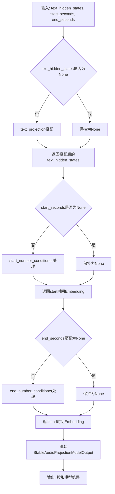
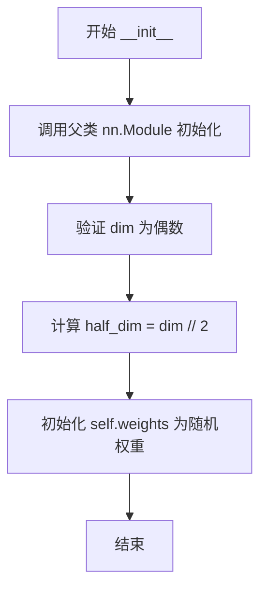
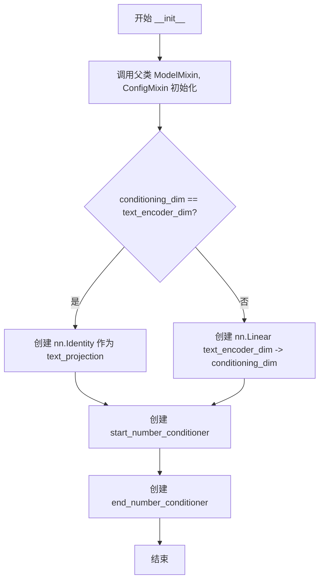
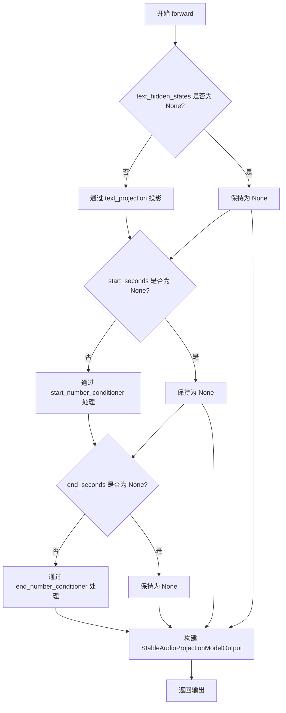

# `diffusers\src\diffusers\pipelines\stable_audio\modeling_stable_audio.py` 详细设计文档

Stable Audio的投影模型组件，用于将文本编码器的隐藏状态和音频时间条件（开始/结束秒数）映射到共享的潜在空间，支持T5文本编码器的维度适配和数值条件的Embedding化处理。

## 整体流程



## 类结构

```
StableAudioProjectionModel (主模型类)
├── StableAudioPositionalEmbedding (位置编码组件)
├── StableAudioNumberConditioner (数值条件编码器)
│   └── StableAudioPositionalEmbedding (组合使用)
└── StableAudioProjectionModelOutput (输出数据类)
```

## 全局变量及字段


### `logger`
    
模块级别的日志记录器

类型：`logging.Logger`
    


### `StableAudioPositionalEmbedding.weights`
    
位置编码的频率权重参数

类型：`nn.Parameter`
    


### `StableAudioProjectionModelOutput.text_hidden_states`
    
文本编码器的隐藏状态

类型：`torch.Tensor | None`
    


### `StableAudioProjectionModelOutput.seconds_start_hidden_states`
    
音频开始时间的隐藏状态

类型：`torch.Tensor | None`
    


### `StableAudioProjectionModelOutput.seconds_end_hidden_states`
    
音频结束时间的隐藏状态

类型：`torch.Tensor | None`
    


### `StableAudioNumberConditioner.time_positional_embedding`
    
时间位置编码+线性投影网络

类型：`nn.Sequential`
    


### `StableAudioNumberConditioner.number_embedding_dim`
    
数值嵌入维度

类型：`int`
    


### `StableAudioNumberConditioner.min_value`
    
数值最小值

类型：`int`
    


### `StableAudioNumberConditioner.max_value`
    
数值最大值

类型：`int`
    


### `StableAudioProjectionModel.text_projection`
    
文本投影层（恒等或线性）

类型：`nn.Identity | nn.Linear`
    


### `StableAudioProjectionModel.start_number_conditioner`
    
开始时间条件编码器

类型：`StableAudioNumberConditioner`
    


### `StableAudioProjectionModel.end_number_conditioner`
    
结束时间条件编码器

类型：`StableAudioNumberConditioner`
    
    

## 全局函数及方法


### `StableAudioPositionalEmbedding.__init__`

初始化 StableAudioPositionalEmbedding 类的实例，用于生成连续时间的位置编码。该方法验证输入维度为偶数，计算半维度，并初始化一个可学习的权重参数用于后续的傅里叶特征计算。

参数：

- `dim`：`int`，位置编码的维度，必须为偶数

返回值：`None`，构造函数无返回值（隐式返回 `None`）

#### 流程图



#### 带注释源码

```python
def __init__(self, dim: int):
    """
    初始化位置编码模块
    
    参数:
        dim: 位置编码的维度，必须为偶数
    """
    # 调用父类 nn.Module 的初始化方法
    super().__init__()
    
    # 断言 dim 必须为偶数，因为后续会进行 half_dim = dim // 2 的操作
    # 需要确保能均匀分成两部分用于正弦和余弦编码
    assert (dim % 2) == 0
    
    # 计算半维度，用于存储正弦和余弦两种频率的权重
    half_dim = dim // 2
    
    # 初始化可学习的权重参数，用于生成傅里叶特征
    # 权重形状为 (half_dim,)，将在训练过程中被优化
    self.weights = nn.Parameter(torch.randn(half_dim))
```


### `StableAudioPositionalEmbedding.forward`

该方法实现了连续时间的位置编码功能，通过傅里叶特征变换将时间标量映射到高维向量空间，输出包含原始时间值和正弦余弦变换后的频率特征的拼接向量。

参数：

- `times`：`torch.Tensor`，输入的时间标量张量，可以是任意形状的时间值

返回值：`torch.Tensor`，形状为 `(*, dim)` 的位置编码张量，最后一维为拼接后的时间编码向量

#### 流程图

```mermaid
graph TD
    A[输入 times: torch.Tensor] --> B[维度扩展: times[..., None]]
    B --> C[计算频率: freqs = times * weights * 2π]
    C --> D[傅里叶变换: torch.cat([freqs.sin(), freqs.cos()], dim=-1)]
    D --> E[拼接原始时间: torch.cat([times, fouriered], dim=-1)]
    E --> F[返回编码向量]
```

#### 带注释源码

```python
def forward(self, times: torch.Tensor) -> torch.Tensor:
    # 步骤1：在最后添加一个维度，将标量时间转换为向量
    # 例如：shape (batch,) -> shape (batch, 1)
    times = times[..., None]
    
    # 步骤2：计算频率
    # 使用可学习的权重 self.weights 将时间映射到频率空间
    # self.weights 形状为 (half_dim,)，通过 [None] 扩展维度进行广播
    # 乘以 2π 将角频率标准化到周期 [0, 2π]
    freqs = times * self.weights[None] * 2 * pi
    
    # 步骤3：傅里叶特征变换
    # 将频率分别进行正弦和余弦变换，生成 2*half_dim 维的特征
    # torch.cat 在最后一个维度拼接：shape (*, half_dim) + (*, half_dim) -> (*, dim)
    fouriered = torch.cat((freqs.sin(), freqs.cos()), dim=-1)
    
    # 步骤4：拼接原始时间与傅里叶特征
    # 将原始时间值（归一化后）与正弦余弦特征拼接
    # 最终输出形状：(*, 1 + dim)，包含时间维度和位置编码维度
    fouriered = torch.cat((times, fouriered), dim=-1)
    
    # 返回最终的位置编码向量
    return fouriered
```


### `StableAudioNumberConditioner.__init__`

初始化数值条件编码器，用于将数值映射到潜在空间。该方法创建一个由位置嵌入层和线性投影层组成的序列模块，并存储数值嵌入维度及数值范围。

参数：

- `number_embedding_dim`：`int`，输出嵌入的维度大小，决定了映射后的潜在空间维度
- `min_value`：`int`，数值条件的最小值，用于归一化处理
- `max_value`：`int`，数值条件的最大值，用于归一化处理
- `internal_dim`：`int | None`，内部隐藏层的维度，默认为 256

返回值：`None`，构造函数无返回值

#### 流程图

```mermaid
flowchart TD
    A[开始 __init__] --> B[调用 super().__init__ 初始化 nn.Module]
    C[创建 time_positional_embedding 序列模块] --> D[实例化 StableAudioPositionalEmbedding]
    D --> E[创建 nn.Linear 线性层: 输入维度 internal_dim+1, 输出维度 number_embedding_dim]
    E --> F[存储 number_embedding_dim 到实例属性]
    F --> G[存储 min_value 到实例属性]
    G --> H[存储 max_value 到实例属性]
    H --> I[结束 __init__]
```

#### 带注释源码

```python
def __init__(
    self,
    number_embedding_dim,  # int: 输出嵌入的目标维度
    min_value,             # int: 数值范围的最小边界
    max_value,             # int: 数值范围的最大边界
    internal_dim: int | None = 256,  # int | None: 中间层维度，默认256
):
    # 调用父类 nn.Module 的初始化方法，建立模块基础结构
    super().__init__()
    
    # 构建时间位置嵌入模块: 由位置编码层 + 线性投影层组成
    # 位置编码层将输入数值转换为傅里叶特征表示
    # 线性层将特征投影到目标嵌入空间
    self.time_positional_embedding = nn.Sequential(
        # StableAudioPositionalEmbedding 使用正弦余弦编码表示连续时间
        StableAudioPositionalEmbedding(internal_dim),
        # 线性层: 输入维度为 internal_dim + 1 (1为原始数值输入), 输出为 number_embedding_dim
        nn.Linear(in_features=internal_dim + 1, out_features=number_embedding_dim),
    )

    # 存储配置参数供 forward 方法中使用
    self.number_embedding_dim = number_embedding_dim  # 输出嵌入维度
    self.min_value = min_value  # 数值归一化下界
    self.max_value = max_value  # 数值归一化上界
```


### `StableAudioNumberConditioner.forward`

该方法实现了一个简单的线性投影模型，将输入的浮点数值张量（通常为时间秒数）通过位置编码和线性变换映射到指定维度的潜在空间，生成用于音频生成模型的条件嵌入向量。

参数：

- `floats`：`torch.Tensor`，需要映射到嵌入空间的浮点数张量，通常表示时间值（如音频的起始和结束秒数）

返回值：`torch.Tensor`，形状为 `(batch_size, 1, number_embedding_dim)` 的嵌入向量，用于后续音频生成模型的条件控制

#### 流程图

```mermaid
graph TD
    A[输入 floats 张量] --> B[clamp 限制范围]
    B --> C[归一化到 [0, 1] 范围]
    C --> D[转换为 embedder 参数的数据类型]
    D --> E[通过 StableAudioPositionalEmbedding]
    E --> F[nn.Linear 投影到 number_embedding_dim]
    F --> G[view 重塑为 (-1, 1, number_embedding_dim)]
    G --> H[返回 float_embeds]
    
    B -.->|使用类属性| I[min_value]
    B -.->|使用类属性| J[max_value]
    E -.->|使用子模块| K[time_positional_embedding]
```

#### 带注释源码

```python
def forward(
    self,
    floats: torch.Tensor,
) -> torch.Tensor:
    # 1. 将输入值限制在 [min_value, max_value] 范围内，防止越界
    floats = floats.clamp(self.min_value, self.max_value)

    # 2. 将数值归一化到 [0, 1] 范围，便于后续嵌入计算
    normalized_floats = (floats - self.min_value) / (self.max_value - self.min_value)

    # 3. 获取嵌入器参数的数据类型，确保计算精度一致
    embedder_dtype = next(self.time_positional_embedding.parameters()).dtype
    normalized_floats = normalized_floats.to(embedder_dtype)

    # 4. 通过位置嵌入层：先进行傅里叶位置编码，再线性投影到目标维度
    embedding = self.time_positional_embedding(normalized_floats)
    
    # 5. 重塑输出形状为 (batch_size, 1, number_embedding_dim)
    #    其中 1 表示单时间步的嵌入
    float_embeds = embedding.view(-1, 1, self.number_embedding_dim)

    return float_embeds
```

#### 关键组件信息

| 组件名称 | 描述 |
|---------|------|
| `StableAudioPositionalEmbedding` | 使用傅里叶特征进行连续时间位置编码的模块 |
| `StableAudioProjectionModelOutput` | 输出数据结构类，包含文本隐藏状态和时间起止隐藏状态 |
| `StableAudioProjectionModel` | 整体投影模型，整合文本编码器输出和时间条件调节器 |

#### 潜在技术债务与优化空间

1. **硬编码的归一化逻辑**：归一化公式 `(floats - min_value) / (max_value - min_value)` 在前向传播中重复计算，可考虑缓存归一化参数
2. **dtype 转换开销**：每次前向传播都调用 `next()` 获取参数类型，可考虑在 `__init__` 中缓存 dtype
3. **缺乏输入验证**：未对 `floats` 的形状和数值范围进行显式验证，可能导致隐藏的错误
4. **clamp 操作的位置**：在归一化之前进行 clamp，如果输入值超出范围会被截断，可能影响模型对边界情况的处理

#### 其它项目

**设计目标与约束**：
- 将连续的时间数值映射到固定维度的嵌入空间
- 支持批处理输入，输出形状保持 `(batch_size, 1, number_embedding_dim)`

**错误处理与异常设计**：
- 使用 `clamp` 隐式处理超出范围的输入值
- 依赖 PyTorch 的自动微分框架处理 NaN/Inf 值

**外部依赖与接口契约**：
- 依赖 `nn.Module` 基类
- 输出嵌入可直接传递给 `StableAudioProjectionModel` 或其他音频生成模型作为条件输入


### `StableAudioProjectionModel.__init__`

初始化 StableAudioProjectionModel 投影模型，用于将文本编码器的嵌入和音频时间条件映射到共享的潜在空间。

参数：

- `text_encoder_dim`：`int`，文本编码器（T5）输出的文本嵌入维度
- `conditioning_dim`：`int`，输出条件张量的维度
- `min_value`：`int`，秒数条件模块的最小值
- `max_value`：`int`，秒数条件模块的最大值

返回值：`None`，该方法为构造函数，无返回值

#### 流程图



#### 带注释源码

```python
@register_to_config
def __init__(self, text_encoder_dim, conditioning_dim, min_value, max_value):
    """
    初始化投影模型，将文本嵌入和时间条件映射到共享潜在空间。
    
    参数:
        text_encoder_dim (int): 文本编码器（T5）输出的嵌入维度
        conditioning_dim (int): 输出条件张量的目标维度
        min_value (int): 秒数条件模块的最小值
        max_value (int): 秒数条件模块的最大值
    """
    # 调用父类 ModelMixin 和 ConfigMixin 的初始化方法
    # ModelMixin 提供模型加载/保存功能
    # ConfigMixin 允许通过配置文件初始化
    super().__init__()
    
    # 根据维度是否相同决定是否需要线性投影层
    # 如果维度相同，使用恒等映射（Identity）避免不必要的计算
    # 否则创建线性层将文本嵌入投影到条件空间
    self.text_projection = (
        nn.Identity() if conditioning_dim == text_encoder_dim 
        else nn.Linear(text_encoder_dim, conditioning_dim)
    )
    
    # 创建音频起始时间的条件编码器
    # StableAudioNumberConditioner 将数值映射到嵌入空间
    self.start_number_conditioner = StableAudioNumberConditioner(
        conditioning_dim, min_value, max_value
    )
    
    # 创建音频结束时间的条件编码器
    # 两个条件器共享相同的维度配置但独立运行
    self.end_number_conditioner = StableAudioNumberConditioner(
        conditioning_dim, min_value, max_value
    )
```


### `StableAudioProjectionModel.forward`

该方法是 StableAudioProjectionModel 的前向传播方法，用于将文本编码器的隐藏状态以及音频起止时间戳投影到共享的潜在空间中，生成用于音频生成的条件向量。

参数：

- `text_hidden_states`：`torch.Tensor | None`，来自文本编码器（T5）的隐藏状态序列，形状为 `(batch_size, sequence_length, hidden_size)`，如果为 `None` 则跳过文本投影
- `start_seconds`：`torch.Tensor | None`，音频开始的秒数，用于生成起始时间条件嵌入，如果为 `None` 则返回 `None`
- `end_seconds`：`torch.Tensor | None`，音频结束的秒数，用于生成结束时间条件嵌入，如果为 `None` 则返回 `None`

返回值：`StableAudioProjectionModelOutput`，包含三个可选的隐藏状态张量：文本投影后的隐藏状态、起始时间隐藏状态、结束时间隐藏状态

#### 流程图



#### 带注释源码

```python
def forward(
    self,
    text_hidden_states: torch.Tensor | None = None,
    start_seconds: torch.Tensor | None = None,
    end_seconds: torch.Tensor | None = None,
):
    # 文本隐藏状态处理：如果提供了text_hidden_states，则通过text_projection层进行维度变换
    # 当conditioning_dim等于text_encoder_dim时，text_projection为Identity（即不做变换）
    # 否则进行线性投影将文本编码器维度映射到条件维度
    text_hidden_states = (
        text_hidden_states if text_hidden_states is None else self.text_projection(text_hidden_states)
    )
    
    # 起始秒数处理：如果提供了start_seconds，通过起始时间条件器生成嵌入向量
    # 该条件器内部将秒数归一化后使用正弦位置编码生成固定维度的条件向量
    seconds_start_hidden_states = (
        start_seconds if start_seconds is None else self.start_number_conditioner(start_seconds)
    )
    
    # 结束秒数处理：如果提供了end_seconds，通过结束时间条件器生成嵌入向量
    # 起始和结束时间使用独立的两套条件器以支持不同的条件分布
    seconds_end_hidden_states = end_seconds if end_seconds is None else self.end_number_conditioner(end_seconds)

    # 返回包含三种条件隐藏状态的输出对象，供下游音频扩散模型使用
    return StableAudioProjectionModelOutput(
        text_hidden_states=text_hidden_states,
        seconds_start_hidden_states=seconds_start_hidden_states,
        seconds_end_hidden_states=seconds_end_hidden_states,
    )
```

## 关键组件


### StableAudioPositionalEmbedding

用于连续时间的连续位置嵌入层，通过傅里叶特征将时间转换为高维表示。使用正弦和余弦函数生成频率特征，并将其与原始时间值拼接。

### StableAudioProjectionModelOutput

数据类，定义 StableAudio 投影层的输出结构。包含文本隐藏状态、音频起始秒数隐藏状态和音频结束秒数隐藏状态三个张量。

### StableAudioNumberConditioner

数字条件处理器模块，负责将数值（秒数）映射到潜在空间。通过 clamp 限制数值范围，归一化后使用位置嵌入和线性层生成条件嵌入。

### StableAudioProjectionModel

主投影模型类，整合文本投影和数字条件处理功能。将文本编码器的输出投影到条件空间，同时处理音频起始和结束时间的条件嵌入。继承自 ModelMixin 和 ConfigMixin 支持配置注册。


## 问题及建议


### 已知问题

- **参数验证方式不当**：`StableAudioPositionalEmbedding.__init__` 中使用 `assert` 进行参数验证，当 `dim` 为奇数时会抛出 `AssertionError`，这种错误信息不明确，应改用 `raise ValueError` 并提供具体错误信息。
- **类型注解不完整**：`StableAudioNumberConditioner.__init__` 方法的参数 `number_embedding_dim`、`min_value`、`max_value` 缺少类型注解，影响代码可读性和类型检查。
- **注释语法错误**：多处文档字符串存在格式问题，如 `max_value (`int`)` 缺少闭括号，注释不完整（如 `max_value (`int`:` 后只有换行）。
- **None值判断逻辑可优化**：`StableAudioProjectionModel.forward` 中多次使用 `x if x is None else` 的模式，虽然逻辑正确但略显冗余，可提取为辅助方法或使用更清晰的逻辑结构。
- **浮点数归一化潜在精度问题**：`StableAudioNumberConditioner.forward` 中归一化计算 `(floats - self.min_value) / (self.max_value - self.min_value)` 在极端边界值情况下可能存在浮点精度损失。
- **配置参数类型注解不准确**：`min_value` 和 `max_value` 在配置中标注为 `int`，但实际处理的是时间秒数（浮点数），类型注解可能不够精确。
- **缺少权重初始化显式设置**：`StableAudioPositionalEmbedding` 中的权重 `self.weights` 使用 `torch.randn` 初始化，未显式指定初始化方法，可能导致训练不稳定。
- **重复代码模式**：`StableAudioProjectionModel.forward` 中处理 `start_seconds` 和 `end_seconds` 的逻辑高度相似，存在代码重复。

### 优化建议

- 将参数验证改为显式的异常抛出，提供有意义的错误信息。
- 为 `StableAudioNumberConditioner.__init__` 的参数添加完整的类型注解（如 `number_embedding_dim: int`, `min_value: float`, `max_value: float`）。
- 修正所有文档字符串中的语法错误和格式问题。
- 考虑提取公共逻辑为辅助方法，减少 `forward` 方法中的重复代码。
- 为数值归一化添加数值稳定性检查，避免除以零或极小值。
- 显式指定模型参数的初始化策略，如使用 `nn.init.normal_` 或更合适的初始化方法。
- 添加返回类型的注解（`-> StableAudioProjectionModelOutput`）以提高代码可读性。
- 考虑将 `StableAudioPositionalEmbedding` 移至独立模块，提高代码组织结构。

## 其它


### 设计目标与约束

本模块的设计目标是实现一个轻量级的投影层，将文本编码器输出的高维语义特征和时间条件（起始/结束秒数）映射到统一的潜在空间，供后续的音频扩散模型使用。约束条件包括：(1) 输入的文本嵌入维度必须与配置中的text_encoder_dim匹配；(2) 时间条件值必须落在min_value和max_value定义的范围内，否则会被截断；(3) 当conditioning_dim等于text_encoder_dim时，使用恒等映射以减少计算开销。

### 错误处理与异常设计

代码中的错误处理主要包括：(1) 使用assert语句检查StableAudioPositionalEmbedding的dim参数必须为偶数，否则抛出AssertionError；(2) 在forward方法中，通过.clamp()方法将输入的floats限制在[min_value, max_value]范围内，防止越界；(3) 对可选输入（text_hidden_states、start_seconds、end_seconds）进行None检查，根据是否为None来决定是否进行处理；(4) 使用torch.autocast和梯度检查点时需注意参数类型一致性，代码中显式将normalized_floats转换为与embedding层相同的dtype。

### 外部依赖与接口契约

本模块依赖以下外部组件：(1) `torch`和`torch.nn`：PyTorch核心库，用于张量运算和神经网络模块；(2) `dataclasses.dataclass`：用于定义输出数据结构；(3) `...configuration_utils.ConfigMixin, register_to_config`：HuggingFace Diffusers框架的配置混入机制；(4) `...models.modeling_utils.ModelMixin`：模型基类，提供from_pretrained等方法；(5) `...utils.BaseOutput, logging`：基础输出类和日志工具。接口契约方面：StableAudioProjectionModel接受text_hidden_states（Tensor|None）、start_seconds（Tensor|None）、end_seconds（Tensor|None）三个参数，返回StableAudioProjectionModelOutput对象，包含text_hidden_states、seconds_start_hidden_states、seconds_end_hidden_states三个张量。

### 性能考虑与优化建议

(1) 当conditioning_dim等于text_encoder_dim时，使用nn.Identity()替代线性投影，避免不必要的矩阵运算；(2) StableAudioNumberConditioner中的.clamp()操作可在GPU上批量执行，建议确认min_value和max_value为标量而非张量以获得最佳性能；(3) 嵌入层参数dtype转换操作（to(embedder_dtype)）在混合精度训练中至关重要，可避免类型不匹配导致的额外拷贝；(4) 考虑使用torch.jit.script对推理路径进行优化。

### 配置参数说明

| 参数名 | 类型 | 默认值 | 描述 |
|--------|------|--------|------|
| text_encoder_dim | int | 必填 | 文本编码器（T5）输出的嵌入维度 |
| conditioning_dim | int | 必填 | 输出条件张量的维度，也是number_conditioner的internal_dim |
| min_value | int | 必填 | 时间条件值的最小边界（秒） |
| max_value | int | 必填 | 时间条件值的最大边界（秒） |

### 使用示例与典型工作流

```python
# 初始化模型
model = StableAudioProjectionModel(
    text_encoder_dim=768,
    conditioning_dim=1024,
    min_value=0,
    max_value=30
)

# 准备输入
text_embeds = torch.randn(2, 10, 768)  # batch=2, seq=10
start_times = torch.tensor([[5.0], [10.0]])  # 起始秒数
end_times = torch.tensor([[25.0], [20.0]])   # 结束秒数

# 前向传播
output = model(
    text_hidden_states=text_embeds,
    start_seconds=start_times,
    end_seconds=end_times
)

# output.text_hidden_states: (2, 10, 1024)
# output.seconds_start_hidden_states: (2, 1, 1024)
# output.seconds_end_hidden_states: (2, 1, 1024)
```

### 单元测试要点

(1) 测试dim为奇数时是否抛出AssertionError；(2) 测试输入值超出[min_value, max_value]范围时是否正确截断；(3) 测试conditioning_dim等于text_encoder_dim时text_projection是否为Identity；(4) 测试None输入时输出对应为None；(5) 测试输出形状是否正确匹配batch_size和conditioning_dim；(6) 测试dtype转换是否正确处理混合精度场景。


    