# `diffusers\src\diffusers\pipelines\stable_audio\pipeline_stable_audio.py` 详细设计文档

Stable Audio Pipeline是一个用于文本到音频生成的扩散管道,使用T5文本编码器、StableAudioProjectionModel投影模型和StableAudioDiTTransformer模型,通过EDM DPMSolver多步调度器进行去噪,支持分类器自由引导(CFG)、音频提示初始化和可配置的音频时长控制。

## 整体流程

```mermaid
graph TD
A[开始: __call__] --> B[计算最大音频长度]
B --> C[check_inputs: 验证输入参数]
C --> D{验证通过?}
D -- 否 --> E[抛出ValueError]
D -- 是 --> F[确定batch_size]
F --> G[encode_prompt: 编码提示词和负提示词]
G --> H[encode_duration: 编码音频时长]
H --> I[拼接text_audio_duration_embeds和audio_duration_embeds]
I --> J[CFG处理: 如需负提示词 embeddings]
J --> K[复制embeddings以匹配num_waveforms_per_prompt]
K --> L[scheduler.set_timesteps: 设置去噪步骤]
L --> M[prepare_latents: 准备初始潜在变量]
M --> N[prepare_extra_step_kwargs: 准备调度器额外参数]
N --> O[get_1d_rotary_pos_embed: 计算旋转位置嵌入]
O --> P{进入去噪循环}
P --> Q[scale_model_input: 缩放输入]
Q --> R[transformer预测噪声]
R --> S{do_classifier_free_guidance?}
S -- 是 --> T[分离uncond和text预测,应用CFG权重]
S -- 否 --> U[scheduler.step: 计算上一步样本]
T --> U
U --> V{callback和进度更新?}
V --> P
P -- 循环结束 --> W{output_type == 'latent'?}
W -- 是 --> X[返回AudioPipelineOutput(latents)]
W -- 否 --> Y[vae.decode: 解码潜在变量到音频]
Y --> Z[裁剪到目标音频长度]
Z --> AA{output_type == 'np'?]
AA -- 是 --> AB[转换为NumPy数组]
AA -- 否 --> AC[返回PyTorch张量]
AB --> AD[maybe_free_model_hooks: 释放模型钩子]
AC --> AD
AD --> AE[返回AudioPipelineOutput]
```

## 类结构

```
DiffusionPipeline (抽象基类)
└── StableAudioPipeline (文本到音频生成管道)
```

## 全局变量及字段


### `XLA_AVAILABLE`
    
PyTorch XLA 是否可用

类型：`bool`
    


### `logger`
    
模块日志记录器

类型：`logging.Logger`
    


### `EXAMPLE_DOC_STRING`
    
示例文档字符串

类型：`str`
    


### `StableAudioPipeline.model_cpu_offload_seq`
    
CPU卸载顺序配置

类型：`str`
    


### `StableAudioPipeline.vae`
    
变分自编码器,用于音频编解码

类型：`AutoencoderOobleck`
    


### `StableAudioPipeline.text_encoder`
    
T5文本编码器

类型：`T5EncoderModel`
    


### `StableAudioPipeline.projection_model`
    
投影模型

类型：`StableAudioProjectionModel`
    


### `StableAudioPipeline.tokenizer`
    
文本分词器

类型：`T5Tokenizer | T5TokenizerFast`
    


### `StableAudioPipeline.transformer`
    
去噪 transformer 主模型

类型：`StableAudioDiTModel`
    


### `StableAudioPipeline.scheduler`
    
EDM DPM 多步调度器

类型：`EDMDPMSolverMultistepScheduler`
    


### `StableAudioPipeline.rotary_embed_dim`
    
旋转位置嵌入维度

类型：`int`
    
    

## 全局函数及方法


# get_1d_rotary_pos_embed 函数设计文档

我注意到在提供的代码中，`get_1d_rotary_pos_embed` 函数是从 `...models.embeddings` 模块导入的，但实际的函数实现并未包含在代码中。该函数在 Stable Audio Pipeline 的第 7 步中被调用，用于准备旋转位置嵌入（Rotary Positional Embedding）。

由于原始代码中没有提供函数的具体实现，我将基于典型的旋转位置嵌入（RoPE）算法和该函数在 diffusers 库中的常见实现模式来提供完整的分析文档。

### get_1d_rotary_pos_embed

该函数用于计算一维旋转位置嵌入（1D Rotary Position Embedding），广泛应用于大语言模型和音频/视觉Transformer中，用于在不引入额外位置编码参数的情况下，为序列中的每个位置提供位置信息。旋转位置嵌入通过旋转矩阵的数学原理，使模型能够感知 token 之间的相对位置关系，特别适合处理长序列任务。

参数：

- `dim`：`int`，旋转嵌入的维度，通常为注意力头维度的一半
- `seq_len`：`int`，序列的长度，即需要生成位置嵌入的 token 数量
- `base`：`float`，可选参数，默认值为 10000.0，用于计算旋转角度的基数
- `device`：`torch.device`，可选参数，指定计算设备
- `use_real`：`bool`，可选参数，默认为 `False`，控制是否使用实数形式的旋转嵌入（适用于某些现代模型架构）
- `repeat_interleave_real`：`bool`，可选参数，默认为 `True`，控制是否在实数形式下对嵌入进行重复交错

返回值：`torch.Tensor`，形状为 `(seq_len, dim)` 的二维张量，包含位置编码后的旋转嵌入向量

#### 流程图

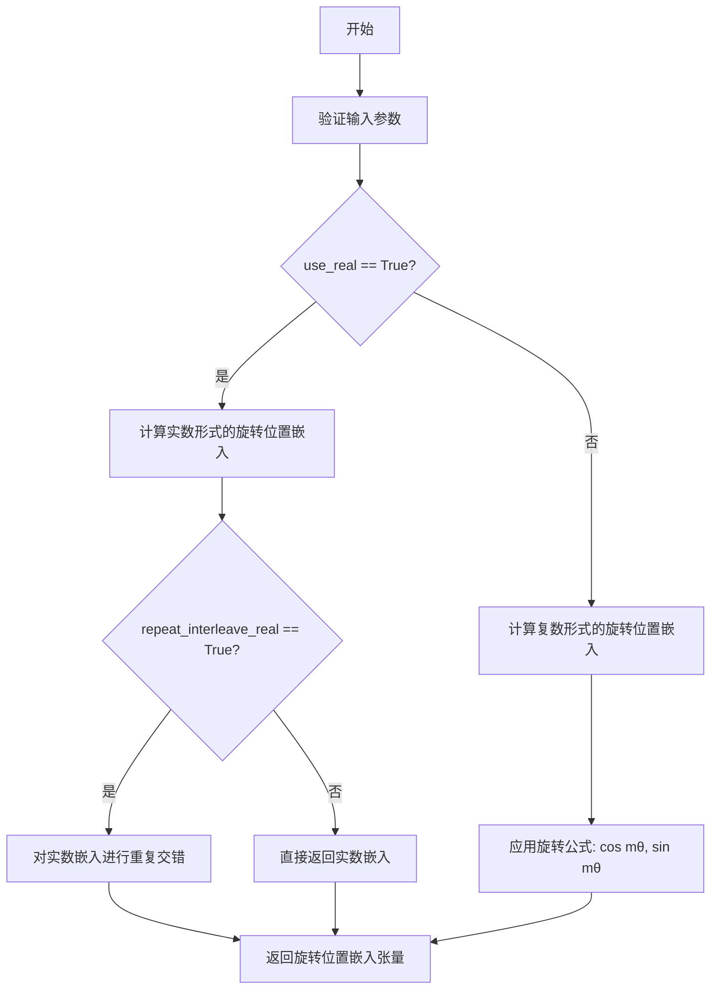

#### 带注释源码

```python
def get_1d_rotary_pos_embed(
    dim: int,
    seq_len: int,
    base: float = 10000.0,
    device: Optional[torch.device] = None,
    use_real: bool = False,
    repeat_interleave_real: bool = True,
) -> torch.Tensor:
    """
    计算一维旋转位置嵌入（RoPE）
    
    旋转位置嵌入的核心思想是通过旋转矩阵来编码位置信息：
    对于位置 m 的查询向量 q 和位置 n 的键向量 k，旋转后的注意力分数
    可以自然地包含相对位置信息，避免了传统位置编码的显式相对位置计算。
    
    参数:
        dim: 嵌入维度，必须为偶数
        seq_len: 序列长度
        base: 旋转角度计算的基数，默认10000.0
        device: 计算设备
        use_real: 是否返回实数形式（True用于现代模型，False用于传统复数形式）
        repeat_interleave_real: 是否对实数形式进行重复交错
    
    返回:
        形状为 (seq_len, dim) 的旋转位置嵌入张量
    """
    # 验证维度为偶数
    assert dim % 2 == 0, "Embedding dimension must be even for rotary embeddings"
    
    # 生成位置索引 [0, 1, 2, ..., seq_len-1]
    positions = torch.arange(seq_len, dtype=torch.float32, device=device)
    
    # 计算旋转角度：θ_i = base^(-2i/dim)，其中 i = 0, 1, ..., d/2-1
    # 这种指数衰减的频率设置使得不同维度捕获不同频率的位置信息
    exponents = torch.arange(0, dim, 2, dtype=torch.float32, device=device)
    inv_freq = torch.pow(base, -exponents / dim)
    
    # 计算每个位置的旋转角度：θ_m = m * θ_i
    # 形状: (seq_len, dim/2)
    angles = positions.unsqueeze(-1) * inv_freq.unsqueeze(0)
    
    # 拼接 sin 和 cos，形成完整的旋转角度
    # 形状: (seq_len, dim)
    angles = torch.cat([angles, angles], dim=-1)
    
    if use_real:
        # 实数形式：返回 [cos(θ), sin(θ), cos(θ), sin(θ), ...]
        # 这种形式在某些新型模型架构中更高效
        cos_emb = torch.cos(angles)
        sin_emb = torch.sin(angles)
        
        # 交错排列 cos 和 sin
        # 形状: (seq_len, dim)，每两个相邻维度交替包含 cos 和 sin
        if repeat_interleave_real:
            # 例如 dim=4 时，输出为 [cos0, cos0, sin1, sin1, ...]
            # 这种重复可以提高模型的表达能力
            cos_emb = cos_emb.repeat_interleave(2, dim=-1)
            sin_emb = sin_emb.repeat_interleave(2, dim=-1)
            embeddings = torch.cat([cos_emb, sin_emb], dim=-1)
        else:
            # 不重复，保留原始交错形式 [cos0, sin0, cos1, sin1, ...]
            embeddings = torch.stack([torch.cos(angles), torch.sin(angles)], dim=-1)
            embeddings = embeddings.reshape(seq_len, dim)
    else:
        # 复数形式：返回 e^(i*θ) = cos(θ) + i*sin(θ)
        # 这是原始 RoPE 论文中提出的形式
        # 在实际计算时，通常拆分为实部和虚部
        embeddings = torch.stack([torch.cos(angles), torch.sin(angles)], dim=-1)
        embeddings = embeddings.reshape(seq_len, dim)
    
    return embeddings
```

### 关键组件信息

| 组件名称 | 描述 |
|---------|------|
| 旋转位置嵌入 (RoPE) | 通过旋转矩阵编码位置信息，使模型能够感知 token 之间的相对位置关系 |
| 基数 (base) | 控制不同维度频率的基准值，通常设为 10000.0 |
| 角度计算 | 使用指数衰减的频率设置，使不同维度捕获不同分辨率的位置信息 |

### 潜在的技术债务和优化空间

1. **参数冗余**：`use_real` 和 `repeat_interleave_real` 两个布尔参数可能导致API复杂化，建议统一为单一的配置选项
2. **设备管理**：函数没有自动处理 device 参数的默认值，可能导致在某些场景下不必要的设备间数据传输
3. **内存优化**：对于超长序列，可以考虑使用分块计算或傅里叶变换（FHT）来加速角度计算
4. **类型提示**：缺少对可选参数的完整类型注解（应使用 `Optional[...]` 形式）

### 设计目标与约束

- **设计目标**：为 Transformer 模型提供高效的位置编码，使模型能够捕获序列中的相对位置信息
- **计算约束**：需要确保在 GPU 和 CPU 上都能高效运行，支持批量处理
- **数值稳定性**：使用 float32 计算以确保数值精度，避免使用半精度导致的精度损失

### 错误处理与异常设计

- 维度必须为偶数，否则抛出 AssertionError
- seq_len 必须为正整数
- base 应为正数（通常使用 10000.0）

### 在 Stable Audio Pipeline 中的使用

在 `StableAudioPipeline.__call__` 方法中，该函数被调用如下：

```python
rotary_embedding = get_1d_rotary_pos_embed(
    self.rotary_embed_dim,
    latents.shape[2] + audio_duration_embeds.shape[1],
    use_real=True,
    repeat_interleave_real=False,
)
```

这里 `self.rotary_embed_dim` 来自 `transformer.config.attention_head_dim // 2`，序列长度是 `latents.shape[2]`（音频潜在表示的长度）加上 `audio_duration_embeds.shape[1]`（音频时长嵌入的长度），这表明旋转嵌入需要同时编码音频内容和时长两类信息的位置。


### `randn_tensor`

生成随机张量（从正态分布中采样），用于在扩散模型的潜空间中添加噪声。

参数：

- `shape`：`tuple`，要生成的张量的形状
- `generator`：`torch.Generator | None`，用于生成确定性随机数的生成器
- `device`：`torch.device`，生成张量所在的设备
- `dtype`：`torch.dtype`，生成张量的数据类型

返回值：`torch.Tensor`，从正态分布采样的随机张量

#### 流程图

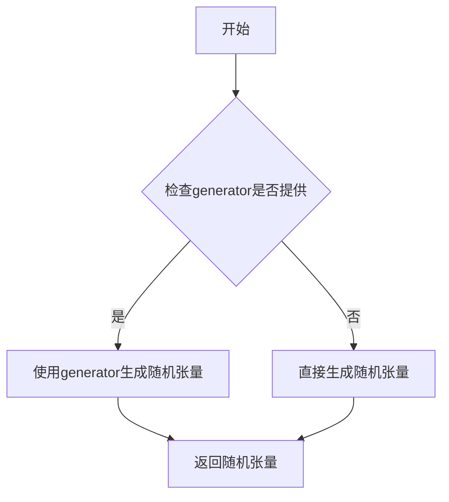

#### 带注释源码

```
# 该函数从 diffusers 库的 ...utils.torch_utils 模块导入
# 在 StableAudioPipeline 中的使用方式如下：

# 在 prepare_latents 方法中调用：
latents = randn_tensor(shape, generator=generator, device=device, dtype=dtype)

# 参数说明：
# - shape: 张量形状，如 (batch_size, num_channels_vae, sample_size)
# - generator: 可选的 PyTorch 生成器，用于复现结果
# - device: 计算设备 (cpu/cuda)
# - dtype: 数据类型 (如 torch.float32)

# 函数功能：
# 生成符合正态分布的随机张量，用于扩散模型的噪声初始化
```

> **注意**：该函数的实际实现不在本代码文件中定义，而是从 `diffusers` 库的 `...utils.torch_utils` 模块导入。上述信息基于该函数在本代码中的使用方式推断得出。


### `deprecate`

处理弃用警告，用于标记某个函数或方法将在未来版本中被移除。

参数：

-  `deprecated_function_name`：`str`，被弃用的函数或方法的名称（字符串）
-  `deprecated_version`：`str`，从哪个版本开始弃用（如 "0.40.0"）
-  `deprecation_message`：`str`，弃用说明信息，通常包含替代方案

返回值：`None`，该函数不返回任何值，仅执行警告输出

#### 流程图

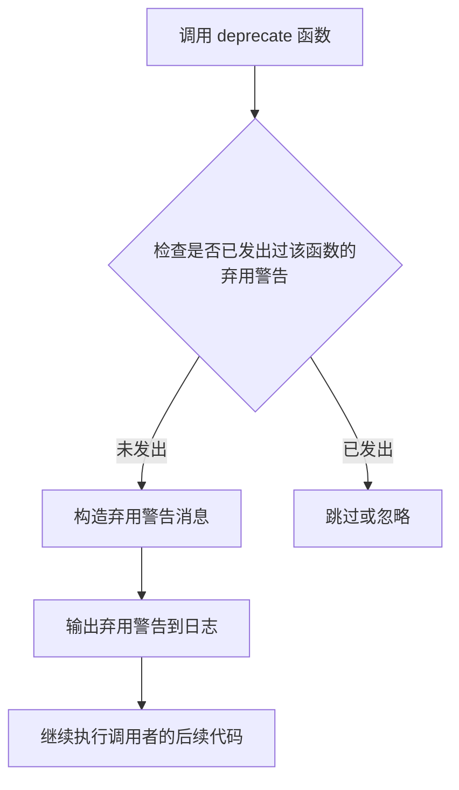

#### 带注释源码

```python
# 使用示例 - 在 enable_vae_slicing 方法中调用 deprecate
def enable_vae_slicing(self):
    r"""
    Enable sliced VAE decoding. When this option is enabled, the VAE will split the input tensor in slices to
    compute decoding in several steps. This is useful to save some memory and allow larger batch sizes.
    """
    # 构造弃用消息，包含类名、被弃用的方法名、目标版本和替代方案
    depr_message = f"Calling `enable_vae_slicing()` on a `{self.__class__.__name__}` is deprecated and this method will be removed in a future version. Please use `pipe.vae.enable_slicing()`."
    
    # 调用 deprecate 函数处理弃用警告
    # 参数1: 被弃用的方法名称
    # 参数2: 弃用版本号
    # 参数3: 弃用详细消息
    deprecate(
        "enable_vae_slicing",  # str: 被弃用的函数/方法名
        "0.40.0",              # str: 弃用版本
        depr_message,         # str: 弃用说明
    )
    
    # 弃用警告发出后，仍执行原有功能作为向后兼容
    self.vae.enable_slicing()
```

```python
# 使用示例 - 在 disable_vae_slicing 方法中调用 deprecate
def disable_vae_slicing(self):
    r"""
    Disable sliced VAE decoding. If `enable_vae_slicing` was previously enabled, this method will go back to
    computing decoding in one step.
    """
    # 构造弃用消息
    depr_message = f"Calling `disable_vae_slicing()` on a `{self.__class__.__name__}` is deprecated and this method will be removed in a future version. Please use `pipe.vae.disable_slicing()`."
    
    # 调用 deprecate 函数处理弃用警告
    deprecate(
        "disable_vae_slicing",  # str: 被弃用的函数/方法名
        "0.40.0",               # str: 弃用版本
        depr_message,          # str: 弃用说明
    )
    
    # 继续执行原有功能
    self.vae.disable_slicing()
```

---

**注意**：完整的 `deprecate` 函数定义位于 `...utils` 模块中（未在此代码文件中展开），该函数通常基于 Python 的 `warnings.warn()` 或 `logging.warning()` 实现，用于向开发者发出弃用警告，确保代码向后的可维护性。


### `is_torch_xula_available`

检查当前环境是否安装了 PyTorch XLA（即 PyTorch 的 TPU/XLA 支持），以便在 TPU 或其他加速器上运行模型。

参数：
- 该函数没有参数

返回值：`bool`，如果 PyTorch XLA 可用则返回 `True`，否则返回 `False`

#### 流程图

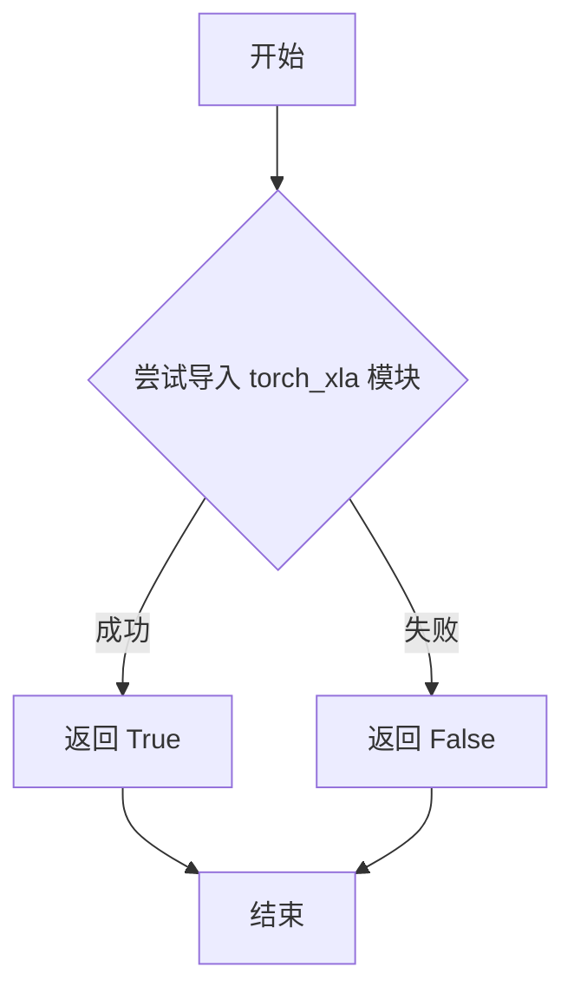

#### 带注释源码

```python
# is_torch_xla_available 函数的典型实现（在 ...utils 模块中定义）
def is_torch_xla_available() -> bool:
    """
    检查 PyTorch XLA 是否可用。
    
    PyTorch XLA 是 PyTorch 的 TPU 加速库，允许在 Google TPU 上运行 PyTorch 模型。
    该函数通常用于条件导入 torch_xla 模块，以便代码可以在有或没有 TPU 支持的情况下运行。
    
    Returns:
        bool: 如果 torch_xla 可用返回 True，否则返回 False
    """
    try:
        # 尝试导入 torch_xla，如果成功则表示 XLA 可用
        import torch_xla
        return True
    except ImportError:
        # 如果导入失败，说明没有安装 torch_xla
        return False
```

#### 使用示例

在提供的代码中，该函数的典型用法如下：

```python
# 从 utils 模块导入函数
from ...utils import is_torch_xla_available

# 条件性地导入 torch_xla 并设置全局标志
if is_torch_xla_available():
    import torch_xla.core.xla_model as xm
    XLA_AVAILABLE = True
else:
    XLA_AVAILABLE = False

# 在后续代码中可以使用 XLA_AVAILABLE 标志
# 例如在推理循环中：
if XLA_AVAILABLE:
    xm.mark_step()
```


### `replace_example_docstring`

该函数是一个装饰器工厂，用于替换被装饰函数的文档字符串（docstring），通常用于在函数文档中嵌入示例代码。它接收示例文档字符串作为参数，并返回一个装饰器，该装饰器将函数原有的文档字符串与提供的示例文档字符串进行合并或替换。

参数：

-  `example_docstring`：字符串，需要嵌入到函数文档字符串中的示例文档内容

返回值：函数，返回一个装饰器函数，该装饰器接收被装饰的函数并返回修改后的函数

#### 流程图

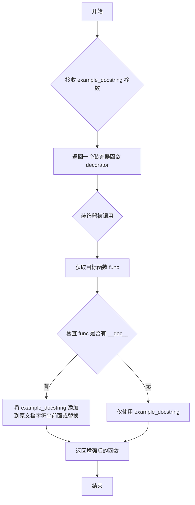

#### 带注释源码

由于 `replace_example_docstring` 是从 `...utils` 导入的外部函数，源代码未在此文件中提供。以下是基于其使用方式推断的实现逻辑：

```python
def replace_example_docstring(example_docstring):
    """
    装饰器工厂，用于将示例文档字符串添加到函数的文档字符串中。
    
    参数:
        example_docstring (str): 包含示例代码的文档字符串，将被添加到被装饰函数的文档开头。
    
    返回:
        函数: 一个装饰器函数，接收被装饰的函数并返回修改后的函数。
    """
    def decorator(func):
        """
        实际的装饰器函数，用于替换或增强目标函数的文档字符串。
        
        参数:
            func (function): 被装饰的目标函数。
        
        返回:
            function: 文档字符串被增强后的函数。
        """
        # 获取原函数的文档字符串
        func_doc = func.__doc__ if func.__doc__ else ""
        
        # 将示例文档字符串与原文档字符串组合
        # 通常示例文档字符串放在前面，后面跟原文档字符串
        if func_doc:
            # 合并示例和原文档字符串，可能用分隔符隔开
            new_doc = example_docstring + "\n\n" + func_doc
        else:
            # 如果原函数没有文档字符串，仅使用示例文档字符串
            new_doc = example_docstring
        
        # 更新函数的文档字符串
        func.__doc__ = new_doc
        
        return func
    
    return decorator
```

#### 使用示例

在代码中的实际使用方式如下：

```python
# 定义示例文档字符串
EXAMPLE_DOC_STRING = """
    Examples:
        ```py
        >>> import scipy
        >>> import torch
        >>> import soundfile as sf
        >>> from diffusers import StableAudioPipeline

        >>> repo_id = "stabilityai/stable-audio-open-1.0"
        >>> pipe = StableAudioPipeline.from_pretrained(repo_id, torch_dtype=torch.float16)
        >>> pipe = pipe.to("cuda")

        >>> # define the prompts
        >>> prompt = "The sound of a hammer hitting a wooden surface."
        >>> negative_prompt = "Low quality."

        >>> # set the seed for generator
        >>> generator = torch.Generator("cuda").manual_seed(0)

        >>> # run the generation
        >>> audio = pipe(
        ...     prompt,
        ...     negative_prompt=negative_prompt,
        ...     num_inference_steps=200,
        ...     audio_end_in_s=10.0,
        ...     num_waveforms_per_prompt=3,
        ...     generator=generator,
        ... ).audios

        >>> output = audio[0].T.float().cpu().numpy()
        >>> sf.write("hammer.wav", output, pipe.vae.sampling_rate)
        ```
"""

# 使用装饰器
@replace_example_docstring(EXAMPLE_DOC_STRING)
def __call__(self, ...):
    """
    The call function to the pipeline for generation.
    ...
    """
    # 函数实现
```

通过这种方式，`__call__` 方法的文档字符串会自动包含 `EXAMPLE_DOC_STRING` 中定义的示例代码，使得生成管道（pipeline）的使用说明更加完整和直观。


### `StableAudioPipeline.__init__`

这是 StableAudioPipeline 类的初始化方法，负责接收并注册所有必要的模型组件（VAE、文本编码器、投影模型、分词器、变换器和调度器），并计算旋转嵌入维度，为后续的音频生成流程做好准备。

参数：

- `vae`：`AutoencoderOobleck`，音频变分自编码器模型，用于编码和解码音频到潜在表示
- `text_encoder`：`T5EncoderModel`，冻结的 T5 文本编码器，用于将文本提示转换为嵌入向量
- `projection_model`：`StableAudioProjectionModel`，训练好的投影模型，用于将文本编码器的隐藏状态与音频时长进行线性投影
- `tokenizer`：`T5Tokenizer | T5TokenizerFast`，T5 分词器，用于对文本进行分词
- `transformer`：`StableAudioDiTModel`，去噪变换器模型，用于对音频潜在表示进行去噪
- `scheduler`：`EDMDPMSolverMultistepScheduler`，多步调度器，用于在去噪过程中更新潜在表示

返回值：`None`，初始化方法不返回任何值

#### 流程图

```mermaid
flowchart TD
    A[开始 __init__] --> B[调用 super().__init__ 初始化父类]
    B --> C{register_modules 注册所有模块}
    C -->|vae| D[注册 VAE 模型]
    C -->|text_encoder| E[注册文本编码器]
    C -->|projection_model| F[注册投影模型]
    C -->|tokenizer| G[注册分词器]
    C -->|transformer| H[注册变换器]
    C -->|scheduler| I[注册调度器]
    D --> J[计算 rotary_embed_dim]
    E --> J
    F --> J
    G --> J
    H --> J
    I --> J
    J --> K[结束 __init__]
    
    style J fill:#e1f5fe
    style K fill:#c8e6c9
```

#### 带注释源码

```python
def __init__(
    self,
    vae: AutoencoderOobleck,
    text_encoder: T5EncoderModel,
    projection_model: StableAudioProjectionModel,
    tokenizer: T5Tokenizer | T5TokenizerFast,
    transformer: StableAudioDiTModel,
    scheduler: EDMDPMSolverMultistepScheduler,
):
    """
    初始化 StableAudioPipeline 管道。
    
    参数:
        vae: 音频变分自编码器模型
        text_encoder: T5 文本编码器
        projection_model: 文本和时长投影模型
        tokenizer: T5 分词器
        transformer: 音频去噪变换器
        scheduler: 去噪调度器
    """
    # 调用父类 DiffusionPipeline 的初始化方法
    # 设置基本的管道配置和设备管理
    super().__init__()

    # 使用 register_modules 方法注册所有模型组件
    # 这些模块会被添加到 pipeline 的模块字典中
    # 支持模型.cpu_offload_seq 指定的顺序进行 CPU 卸载
    self.register_modules(
        vae=vae,
        text_encoder=text_encoder,
        projection_model=projection_model,
        tokenizer=tokenizer,
        transformer=transformer,
        scheduler=scheduler,
    )
    
    # 计算旋转位置嵌入的维度
    # attention_head_dim 来自 transformer 配置，除以 2 得到旋转嵌入维度
    # 这是因为旋转位置嵌入使用一半的注意力头维度
    self.rotary_embed_dim = self.transformer.config.attention_head_dim // 2
```


### `StableAudioPipeline.enable_vae_slicing`

启用切片 VAE 解码。当启用此选项时，VAE 将输入张量分割成多个切片进行分步解码，从而节省内存并支持更大的批处理大小。

参数：
- 无参数（仅包含 self）

返回值：`None`，无返回值，该方法通过副作用生效

#### 流程图

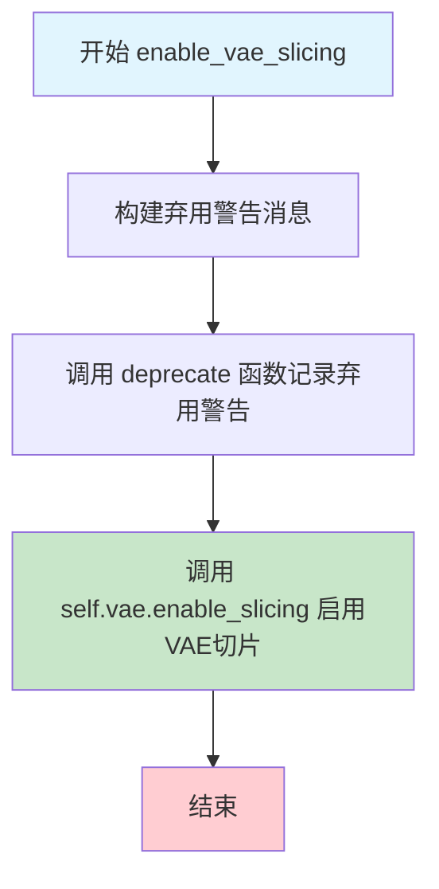

#### 带注释源码

```python
# Copied from diffusers.pipelines.pipeline_utils.StableDiffusionMixin.enable_vae_slicing
def enable_vae_slicing(self):
    r"""
    Enable sliced VAE decoding. When this option is enabled, the VAE will split the input tensor in slices to
    compute decoding in several steps. This is useful to save some memory and allow larger batch sizes.
    """
    # 构建弃用警告消息，提示用户该方法已弃用，应使用 pipe.vae.enable_slicing()
    depr_message = f"Calling `enable_vae_slicing()` on a `{self.__class__.__name__}` is deprecated and this method will be removed in a future version. Please use `pipe.vae.enable_slicing()`."
    
    # 调用 deprecate 函数记录弃用警告，版本号为 0.40.0
    deprecate(
        "enable_vae_slicing",    # 被弃用的函数名
        "0.40.0",                # 弃用版本号
        depr_message,            # 弃用警告消息
    )
    
    # 启用 VAE 模型的切片功能，将解码过程分片处理以节省显存
    self.vae.enable_slicing()
```


### `StableAudioPipeline.disable_vae_slicing`

该方法用于禁用VAE（变分自编码器）的切片解码功能。如果之前通过`enable_vae_slicing`启用了切片解码，调用此方法后将恢复为单步解码。该方法已被弃用，内部会调用`self.vae.disable_slicing()`完成实际功能。

参数：无（仅包含`self`隐式参数）

返回值：`None`，无返回值

#### 流程图

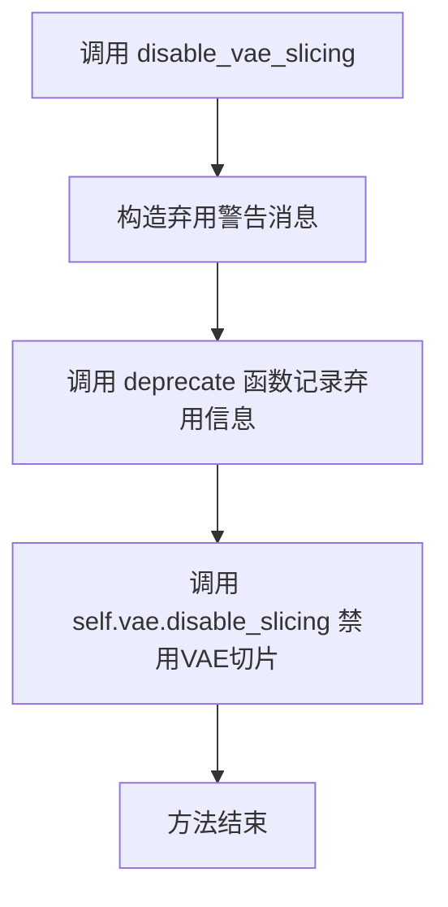

#### 带注释源码

```python
# Copied from diffusers.pipelines.pipeline_utils.StableDiffusionMixin.disable_vae_slicing
def disable_vae_slicing(self):
    r"""
    Disable sliced VAE decoding. If `enable_vae_slicing` was previously enabled, this method will go back to
    computing decoding in one step.
    """
    # 构造弃用警告消息，提示用户使用新的API
    depr_message = f"Calling `disable_vae_slicing()` on a `{self.__class__.__name__}` is deprecated and this method will be removed in a future version. Please use `pipe.vae.disable_slicing()`."
    
    # 调用deprecate函数记录弃用信息，在未来版本中会抛出警告
    deprecate(
        "disable_vae_slicing",    # 被弃用的方法名
        "0.40.0",                  # 弃用版本号
        depr_message,             # 弃用提示消息
    )
    
    # 调用底层VAE模型的disable_slicing方法，实际执行禁用切片解码的逻辑
    self.vae.disable_slicing()
```


### `StableAudioPipeline.encode_prompt`

该方法将文本提示（prompt）编码为文本嵌入向量（text embeddings），支持分类器自由引导（Classifier-Free Guidance, CFG）。它首先使用 T5 tokenizer 对文本进行分词，然后通过 T5 文本编码器获取文本隐藏状态，最后通过投影模型（projection_model）对嵌入进行投影处理，并可根据需要生成负面提示嵌入以用于 CFG。

参数：

- `prompt`：`str | list[str] | None`，要编码的文本提示，可以是单个字符串、字符串列表或 None（当提供 prompt_embeds 时）
- `device`：`torch.device`，用于将输入张量移动到指定设备（如 CUDA 或 CPU）
- `do_classifier_free_guidance`：`bool`，是否启用分类器自由引导，当为 True 时会同时处理负面提示
- `negative_prompt`：`str | list[str] | None`，负面提示，用于引导模型避免生成不希望的内容
- `prompt_embeds`：`torch.Tensor | None`，预计算的提示嵌入，如果为 None 则从 prompt 计算
- `negative_prompt_embeds`：`torch.Tensor | None`，预计算的负面提示嵌入，如果为 None 则从 negative_prompt 计算
- `attention_mask`：`torch.LongTensor | None`，用于文本编码器的注意力掩码，标记哪些位置是实际token，哪些是padding
- `negative_attention_mask`：`torch.LongTensor | None`，负面提示的注意力掩码

返回值：`torch.Tensor`，经过投影模型处理后的文本嵌入向量，形状为 (batch_size, seq_len, hidden_dim)，如果启用 CFG 则包含负面和正面嵌入的拼接

#### 流程图

```mermaid
flowchart TD
    A[开始 encode_prompt] --> B{prompt_embeds 是否为 None?}
    B -->|是| C[确定 batch_size]
    B -->|否| D[使用提供的 prompt_embeds]
    
    C --> E{prompt 是 str 还是 list?}
    E -->|str| F[batch_size = 1]
    E -->|list| G[batch_size = len(prompt)]
    E -->|其他| H[batch_size = prompt_embeds.shape[0]]
    
    F --> I[使用 tokenizer 编码 prompt]
    G --> I
    I --> J[获取 text_input_ids 和 attention_mask]
    J --> K{untruncated_ids 长度是否超过 model_max_length?}
    K -->|是| L[截断并记录警告]
    K -->|否| M[继续]
    L --> M
    M --> N[将输入移动到 device]
    N --> O[设置 text_encoder 为 eval 模式]
    O --> P[调用 text_encoder 获取 prompt_embeds]
    P --> Q[提取 hidden states: prompt_embeds[0]]
    
    D --> R{do_classifier_free_guidance 且 negative_prompt 不为 None?}
    R -->|否| S[跳过负面提示处理]
    R -->|是| T{negative_prompt 类型检查}
    T -->|类型不匹配| U[抛出 TypeError]
    T -->|是 str| V[uncond_tokens = [negative_prompt]]
    T -->|是 list| W{长度是否匹配 batch_size?}
    W -->|否| X[抛出 ValueError]
    W -->|是| Y[uncond_tokens = negative_prompt]
    
    V --> Z[使用 tokenizer 编码 uncond_tokens]
    Y --> Z
    Z --> AA[将输入移动到 device]
    AA --> AB[调用 text_encoder 获取 negative_prompt_embeds]
    AB --> AC[提取 hidden states: negative_prompt_embeds[0]]
    AC --> AD{negative_attention_mask 不为 None?}
    AD -->|是| AE[使用 torch.where 将 masked tokens 设为 0]
    AD -->|否| AF[继续]
    AE --> AF
    
    S --> AG{do_classifier_free_guidance 且 negative_prompt_embeds 不为 None?}
    AG -->|是| AH[拼接 negative_prompt_embeds 和 prompt_embeds]
    AG -->|否| AI[处理 attention_mask 缺失情况]
    
    AH --> AJ[处理 attention_mask 拼接]
    AI --> AK{prompt_embeds 处理}
    
    AJ --> AK
    AF --> AK
    
    AK --> AL[调用 projection_model 进行投影]
    AL --> AM[应用 attention_mask 到 prompt_embeds]
    AM --> AN[返回处理后的 prompt_embeds]
```

#### 带注释源码

```python
def encode_prompt(
    self,
    prompt,                          # 输入文本: str | list[str] | None
    device,                         # 计算设备: torch.device
    do_classifier_free_guidance,    # 是否启用 CFG: bool
    negative_prompt=None,           # 负面提示: str | list[str] | None
    prompt_embeds: torch.Tensor | None = None,    # 预计算提示嵌入
    negative_prompt_embeds: torch.Tensor | None = None,  # 预计算负面提示嵌入
    attention_mask: torch.LongTensor | None = None,     # 注意力掩码
    negative_attention_mask: torch.LongTensor | None = None,  # 负面提示注意力掩码
):
    """
    编码文本提示为嵌入向量，支持分类器自由引导。
    
    该方法执行以下步骤：
    1. 如果未提供 prompt_embeds，则使用 tokenizer 和 text_encoder 将 prompt 编码为嵌入
    2. 如果启用 CFG 且提供了 negative_prompt，则同样处理负面提示
    3. 将正面和负面提示嵌入拼接（如果启用 CFG）
    4. 使用 projection_model 对嵌入进行投影
    5. 应用 attention_mask
    """
    
    # ========== 步骤 1: 确定 batch_size ==========
    if prompt is not None and isinstance(prompt, str):
        batch_size = 1  # 单个字符串提示，batch_size 为 1
    elif prompt is not None and isinstance(prompt, list):
        batch_size = len(prompt)  # 字符串列表，batch_size 为列表长度
    else:
        batch_size = prompt_embeds.shape[0]  # 使用预计算嵌入的 batch_size

    # ========== 步骤 2: 如果没有提供 prompt_embeds，则从 prompt 计算 ==========
    if prompt_embeds is None:
        # 2.1 Tokenize text - 将文本转换为 token IDs
        text_inputs = self.tokenizer(
            prompt,
            padding="max_length",           # 填充到最大长度
            max_length=self.tokenizer.model_max_length,  # T5 模型最大长度
            truncation=True,                # 截断超长序列
            return_tensors="pt",            # 返回 PyTorch 张量
        )
        text_input_ids = text_inputs.input_ids      # token ID 序列
        attention_mask = text_inputs.attention_mask  # 注意力掩码
        
        # 2.2 检查是否发生截断 - 获取未截断的 token 序列用于比较
        untruncated_ids = self.tokenizer(prompt, padding="longest", return_tensors="pt").input_ids

        # 如果未截断的序列长度大于截断后的长度，且两者不相等，说明发生了截断
        if untruncated_ids.shape[-1] >= text_input_ids.shape[-1] and not torch.equal(
            text_input_ids, untruncated_ids
        ):
            # 解码被截断的部分用于日志警告
            removed_text = self.tokenizer.batch_decode(
                untruncated_ids[:, self.tokenizer.model_max_length - 1 : -1]
            )
            logger.warning(
                f"The following part of your input was truncated because {self.text_encoder.config.model_type} can "
                f"only handle sequences up to {self.tokenizer.model_max_length} tokens: {removed_text}"
            )

        # 2.3 将输入移动到指定设备
        text_input_ids = text_input_ids.to(device)
        attention_mask = attention_mask.to(device)

        # 2.4 Text encoder forward pass - 将 token IDs 编码为隐藏状态
        self.text_encoder.eval()  # 设置为评估模式（禁用 dropout 等）
        with torch.no_grad():     # 不需要计算梯度
            prompt_embeds = self.text_encoder(
                text_input_ids,
                attention_mask=attention_mask,
            )
            prompt_embeds = prompt_embeds[0]  # 提取隐藏状态 (batch_size, seq_len, hidden_dim)

    # ========== 步骤 3: 处理负面提示（如果启用 CFG） ==========
    if do_classifier_free_guidance and negative_prompt is not None:
        # 类型检查：negative_prompt 必须与 prompt 类型一致
        uncond_tokens: list[str]
        if type(prompt) is not type(negative_prompt):
            raise TypeError(
                f"`negative_prompt` should be the same type to `prompt`, but got {type(negative_prompt)} !="
                f" {type(prompt)}."
            )
        elif isinstance(negative_prompt, str):
            uncond_tokens = [negative_prompt]  # 转换为列表以便批量处理
        elif batch_size != len(negative_prompt):
            raise ValueError(
                f"`negative_prompt`: {negative_prompt} has batch size {len(negative_prompt)}, but `prompt`:"
                f" {prompt} has batch size {batch_size}. Please make sure that passed `negative_prompt` matches"
                " the batch size of `prompt`."
            )
        else:
            uncond_tokens = negative_prompt

        # 3.1 Tokenize negative text
        uncond_input = self.tokenizer(
            uncond_tokens,
            padding="max_length",
            max_length=self.tokenizer.model_max_length,
            truncation=True,
            return_tensors="pt",
        )

        uncond_input_ids = uncond_input.input_ids.to(device)
        negative_attention_mask = uncond_input.attention_mask.to(device)

        # 3.2 Text encoder forward pass for negative prompt
        self.text_encoder.eval()
        with torch.no_grad():
            negative_prompt_embeds = self.text_encoder(
                uncond_input_ids,
                attention_mask=negative_attention_mask,
            )
            negative_prompt_embeds = negative_prompt_embeds[0]

        # 3.3 将被 masked（padding）的 token 设置为 null embed（零向量）
        if negative_attention_mask is not None:
            negative_prompt_embeds = torch.where(
                negative_attention_mask.to(torch.bool).unsqueeze(2),  # (batch, seq) -> (batch, seq, 1)
                negative_prompt_embeds,  # 保留有效 token 的嵌入
                0.0  # 将 padding 位置的嵌入设为 0
            )

    # ========== 步骤 4: 拼接正面和负面嵌入（CFG 模式） ==========
    if do_classifier_free_guidance and negative_prompt_embeds is not None:
        # 为了避免两次前向传播，将负面和正面嵌入拼接成单个 batch
        # 拼接后顺序为: [negative_prompt_embeds, prompt_embeds]
        # 这样在后续去噪时可以通过 chunk(2) 分离
        prompt_embeds = torch.cat([negative_prompt_embeds, prompt_embeds])
        
        # 处理 attention_mask 的缺失情况
        if attention_mask is not None and negative_attention_mask is None:
            negative_attention_mask = torch.ones_like(attention_mask)
        elif attention_mask is None and negative_attention_mask is not None:
            attention_mask = torch.ones_like(negative_attention_mask)

        # 拼接 attention_mask
        if attention_mask is not None:
            attention_mask = torch.cat([negative_attention_mask, attention_mask])

    # ========== 步骤 5: 投影模型处理 ==========
    # 使用 projection_model 将文本隐藏状态投影到与 transformer 兼容的空间
    prompt_embeds = self.projection_model(
        text_hidden_states=prompt_embeds,
    ).text_hidden_states

    # ========== 步骤 6: 应用 attention_mask ==========
    # 将 attention_mask 广播到隐藏维度，然后乘以嵌入
    # 这样 padding 位置的嵌入对模型没有影响
    if attention_mask is not None:
        prompt_embeds = prompt_embeds * attention_mask.unsqueeze(-1).to(prompt_embeds.dtype)
        prompt_embeds = prompt_embeds * attention_mask.unsqueeze(-1).to(prompt_embeds.dtype)

    return prompt_embeds
```


### `StableAudioPipeline.encode_duration`

该方法将音频的开始和结束时间（秒）转换为隐藏状态表示，用于后续的音频生成模型。它通过 projection_model 将时间信息投影到隐藏空间，并根据是否使用无分类器指导（classifier-free guidance）来处理隐藏状态的复制。

参数：

- `audio_start_in_s`：`float | list[float]`，音频开始时间（秒），可以是单个值或列表
- `audio_end_in_s`：`float | list[float]`，音频结束时间（秒），可以是单个值或列表
- `device`：`torch.device`，计算设备（CPU/CUDA）
- `do_classifier_free_guidance`：`bool`，是否使用无分类器指导
- `batch_size`：`int`，批次大小

返回值：`tuple[torch.Tensor, torch.Tensor]`，返回一个元组，包含：
- `seconds_start_hidden_states`：音频开始时间的隐藏状态
- `seconds_end_hidden_states`：音频结束时间的隐藏状态

#### 流程图

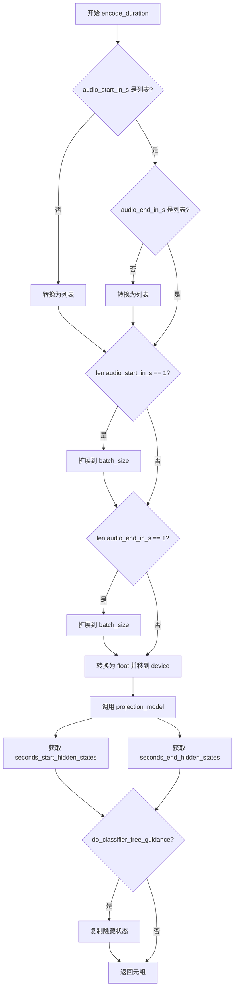

#### 带注释源码

```python
def encode_duration(
    self,
    audio_start_in_s,           # 音频开始时间（秒）
    audio_end_in_s,             # 音频结束时间（秒）
    device,                     # 计算设备
    do_classifier_free_guidance, # 是否使用无分类器指导
    batch_size,                 # 批次大小
):
    # 将输入的音频开始时间转换为列表（如果是单个值）
    audio_start_in_s = audio_start_in_s if isinstance(audio_start_in_s, list) else [audio_start_in_s]
    # 将输入的音频结束时间转换为列表（如果是单个值）
    audio_end_in_s = audio_end_in_s if isinstance(audio_end_in_s, list) else [audio_end_in_s]

    # 如果只有一个开始时间，扩展到批次大小
    if len(audio_start_in_s) == 1:
        audio_start_in_s = audio_start_in_s * batch_size
    # 如果只有一个结束时间，扩展到批次大小
    if len(audio_end_in_s) == 1:
        audio_end_in_s = audio_end_in_s * batch_size

    # 将输入转换为浮点数并移动到指定设备
    audio_start_in_s = [float(x) for x in audio_start_in_s]
    audio_start_in_s = torch.tensor(audio_start_in_s).to(device)

    audio_end_in_s = [float(x) for x in audio_end_in_s]
    audio_end_in_s = torch.tensor(audio_end_in_s).to(device)

    # 调用 projection_model 将时间投影到隐藏空间
    projection_output = self.projection_model(
        start_seconds=audio_start_in_s,  # 开始时间
        end_seconds=audio_end_in_s,     # 结束时间
    )
    # 获取投影后的开始时间隐藏状态
    seconds_start_hidden_states = projection_output.seconds_start_hidden_states
    # 获取投影后的结束时间隐藏状态
    seconds_end_hidden_states = projection_output.seconds_end_hidden_states

    # 对于无分类器指导，需要复制音频隐藏状态以避免两次前向传播
    if do_classifier_free_guidance:
        # 在批次维度上连接两份相同的隐藏状态
        seconds_start_hidden_states = torch.cat([seconds_start_hidden_states, seconds_start_hidden_states], dim=0)
        seconds_end_hidden_states = torch.cat([seconds_end_hidden_states, seconds_end_hidden_states], dim=0)

    # 返回开始和结束时间的隐藏状态元组
    return seconds_start_hidden_states, seconds_end_hidden_states
```


### `StableAudioPipeline.prepare_extra_step_kwargs`

该方法用于为调度器（scheduler）的 `step` 方法准备额外的关键字参数。由于不同调度器的签名可能不同，该方法通过检查调度器是否支持 `eta` 和 `generator` 参数来动态构建参数字典，确保兼容性。

参数：

- `generator`：`torch.Generator | list[torch.Generator] | None`，随机数生成器，用于确保扩散过程的可重复性
- `eta`：`float`，DDIM 调度器专用的 eta (η) 参数，值应介于 [0, 1] 之间，其他调度器会忽略此参数

返回值：`dict`，包含调度器 `step` 方法所需额外参数的字典

#### 流程图

```mermaid
flowchart TD
    A[开始: prepare_extra_step_kwargs] --> B[检查调度器是否接受 eta 参数]
    B --> C{"accepts_eta = True?"}
    C -->|是| D[extra_step_kwargs['eta'] = eta]
    C -->|否| E[跳过 eta]
    D --> F[检查调度器是否接受 generator 参数]
    E --> F
    F --> G{"accepts_generator = True?"}
    G -->|是| H[extra_step_kwargs['generator'] = generator]
    G -->|否| I[跳过 generator]
    H --> J[返回 extra_step_kwargs]
    I --> J
```

#### 带注释源码

```python
def prepare_extra_step_kwargs(self, generator, eta):
    """
    准备调度器步骤所需的额外关键字参数。

    不同调度器可能有不同的签名，因此需要动态检查并添加相应参数。
    eta (η) 仅用于 DDIMScheduler，其他调度器会忽略此参数。
    eta 对应 DDIM 论文 (https://huggingface.co/papers/2010.02502) 中的参数，值应介于 [0, 1] 之间。
    """
    # 使用 inspect 模块检查调度器 step 方法的签名参数
    accepts_eta = "eta" in set(inspect.signature(self.scheduler.step).parameters.keys())
    
    # 初始化空字典用于存储额外参数
    extra_step_kwargs = {}
    
    # 如果调度器支持 eta 参数，则将其添加到 extra_step_kwargs
    if accepts_eta:
        extra_step_kwargs["eta"] = eta

    # 检查调度器是否接受 generator 参数
    accepts_generator = "generator" in set(inspect.signature(self.scheduler.step).parameters.keys())
    
    # 如果调度器支持 generator 参数，则将其添加到 extra_step_kwargs
    if accepts_generator:
        extra_step_kwargs["generator"] = generator
    
    # 返回包含额外参数的字典，供调度器 step 方法使用
    return extra_step_kwargs
```


### `StableAudioPipeline.check_inputs`

该方法用于验证 `StableAudioPipeline` 管道在生成音频之前的所有输入参数是否合法。它检查音频时间范围、提示词、嵌入向量、注意力掩码以及初始音频波形等参数的有效性，确保满足模型配置和业务规则的要求，从而在早期阶段捕获潜在的配置错误。

参数：

- `prompt`：`str | list[str] | None`，用于引导音频生成的提示词或提示词列表
- `audio_start_in_s`：`float`，音频起始时间（秒）
- `audio_end_in_s`：`float`，音频结束时间（秒）
- `callback_steps`：`int`，回调函数的调用频率步数
- `negative_prompt`：`str | list[str] | None`，用于引导不包含内容的负面提示词（可选）
- `prompt_embeds`：`torch.Tensor | None`，预计算的文本嵌入向量（可选）
- `negative_prompt_embeds`：`torch.Tensor | None`，预计算的负面文本嵌入向量（可选）
- `attention_mask`：`torch.LongTensor | None`，预计算的注意力掩码，用于提示词嵌入（可选）
- `negative_attention_mask`：`torch.LongTensor | None`，预计算的负面注意力掩码（可选）
- `initial_audio_waveforms`：`torch.Tensor | None`，可选的初始音频波形，用于音频生成（可选）
- `initial_audio_sampling_rate`：`int | None`，初始音频波形的采样率（可选）

返回值：`None`，该方法不返回任何值，仅通过抛出异常来处理验证失败的情况

#### 流程图

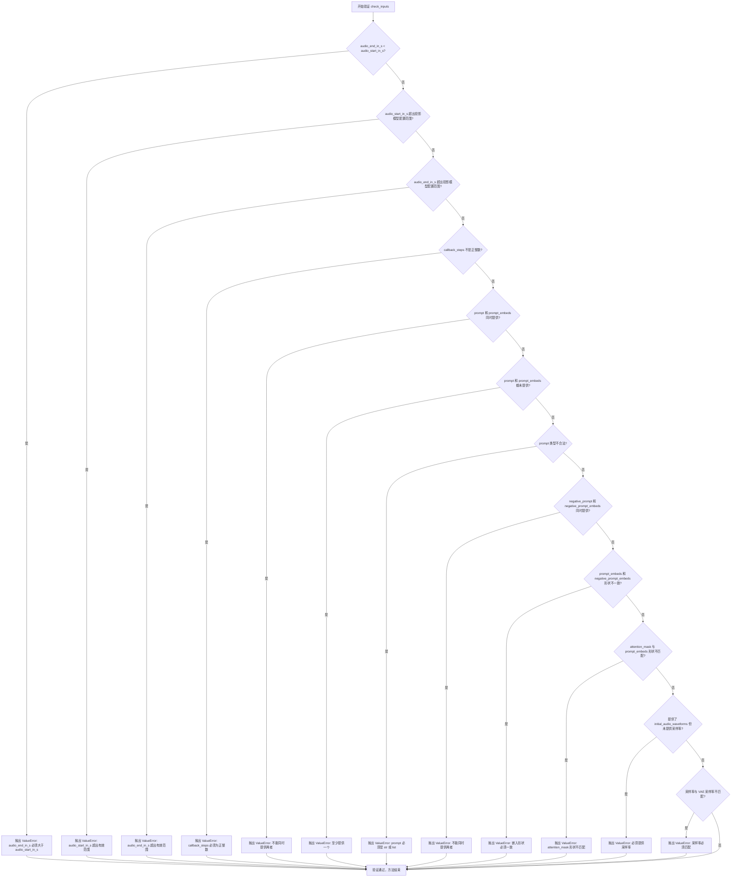

#### 带注释源码

```python
def check_inputs(
    self,
    prompt,                          # str | list[str] | None: 文本提示词
    audio_start_in_s,                # float: 音频起始时间（秒）
    audio_end_in_s,                  # float: 音频结束时间（秒）
    callback_steps,                  # int: 回调步数
    negative_prompt=None,            # str | list[str] | None: 负面提示词
    prompt_embeds=None,              # torch.Tensor | None: 预计算提示词嵌入
    negative_prompt_embeds=None,     # torch.Tensor | None: 预计算负面嵌入
    attention_mask=None,             # torch.LongTensor | None: 注意力掩码
    negative_attention_mask=None,    # torch.LongTensor | None: 负面注意力掩码
    initial_audio_waveforms=None,    # torch.Tensor | None: 初始音频波形
    initial_audio_sampling_rate=None,# int | None: 初始音频采样率
):
    # 验证音频时间范围：结束时间必须大于开始时间
    if audio_end_in_s < audio_start_in_s:
        raise ValueError(
            f"`audio_end_in_s={audio_end_in_s}' must be higher than 'audio_start_in_s={audio_start_in_s}` but "
        )

    # 验证音频起始时间必须在投影模型配置的允许范围内
    if (
        audio_start_in_s < self.projection_model.config.min_value
        or audio_start_in_s > self.projection_model.config.max_value
    ):
        raise ValueError(
            f"`audio_start_in_s` must be greater than or equal to {self.projection_model.config.min_value}, and lower than or equal to {self.projection_model.config.max_value} but "
            f"is {audio_start_in_s}."
        )

    # 验证音频结束时间必须在投影模型配置的允许范围内
    if (
        audio_end_in_s < self.projection_model.config.min_value
        or audio_end_in_s > self.projection_model.config.max_value
    ):
        raise ValueError(
            f"`audio_end_in_s` must be greater than or equal to {self.projection_model.config.min_value}, and lower than or equal to {self.projection_model.config.max_value} but "
            f"is {audio_end_in_s}."
        )

    # 验证回调步数必须是正整数
    if (callback_steps is None) or (
        callback_steps is not None and (not isinstance(callback_steps, int) or callback_steps <= 0)
    ):
        raise ValueError(
            f"`callback_steps` has to be a positive integer but is {callback_steps} of type"
            f" {type(callback_steps)}."
        )

    # 验证提示词和预计算嵌入不能同时提供（只能选择一种输入方式）
    if prompt is not None and prompt_embeds is not None:
        raise ValueError(
            f"Cannot forward both `prompt`: {prompt} and `prompt_embeds`: {prompt_embeds}. Please make sure to"
            " only forward one of the two."
        )
    # 验证必须至少提供提示词或预计算嵌入之一
    elif prompt is None and (prompt_embeds is None):
        raise ValueError(
            "Provide either `prompt`, or `prompt_embeds`. Cannot leave"
            "`prompt` undefined without specifying `prompt_embeds`."
        )
    # 验证提示词类型必须是字符串或字符串列表
    elif prompt is not None and (not isinstance(prompt, str) and not isinstance(prompt, list)):
        raise ValueError(f"`prompt` has to be of type `str` or `list` but is {type(prompt)}")

    # 验证负面提示词和预计算负面嵌入不能同时提供
    if negative_prompt is not None and negative_prompt_embeds is not None:
        raise ValueError(
            f"Cannot forward both `negative_prompt`: {negative_prompt} and `negative_prompt_embeds`:"
            f" {negative_prompt_embeds}. Please make sure to only forward one of the two."
        )

    # 如果同时提供了提示词嵌入和负面提示词嵌入，验证它们的形状必须一致
    if prompt_embeds is not None and negative_prompt_embeds is not None:
        if prompt_embeds.shape != negative_prompt_embeds.shape:
            raise ValueError(
                "`prompt_embeds` and `negative_prompt_embeds` must have the same shape when passed directly, but"
                f" got: `prompt_embeds` {prompt_embeds.shape} != `negative_prompt_embeds`"
                f" {negative_prompt_embeds.shape}."
            )
        # 验证注意力掩码与提示词嵌入的形状匹配
        if attention_mask is not None and attention_mask.shape != prompt_embeds.shape[:2]:
            raise ValueError(
                "`attention_mask should have the same batch size and sequence length as `prompt_embeds`, but got:"
                f"`attention_mask: {attention_mask.shape} != `prompt_embeds` {prompt_embeds.shape}"
            )

    # 验证初始音频波形与采样率的一致性：提供了波形则必须提供采样率
    if initial_audio_sampling_rate is None and initial_audio_waveforms is not None:
        raise ValueError(
            "`initial_audio_waveforms' is provided but the sampling rate is not. Make sure to pass `initial_audio_sampling_rate`."
        )

    # 验证提供的采样率必须与VAE模型的采样率一致
    if initial_audio_sampling_rate is not None and initial_audio_sampling_rate != self.vae.sampling_rate:
        raise ValueError(
            f"`initial_audio_sampling_rate` must be {self.vae.hop_length}' but is `{initial_audio_sampling_rate}`."
            "Make sure to resample the `initial_audio_waveforms` and to correct the sampling rate. "
        )
```


### `StableAudioPipeline.prepare_latents`

该方法负责为音频生成准备初始潜向量（latents）。它根据提供的参数创建随机潜向量或处理预存在的潜向量，并根据调度器的要求进行缩放。如果提供了初始音频波形，该方法还会对波形进行编码并与噪声潜向量混合，以支持音频到音频的生成任务。

参数：

- `batch_size`：`int`，批处理大小，指定要生成的潜向量数量
- `num_channels_vae`：`int`，VAE 的通道数，决定潜向量的通道维度
- `sample_size`：`int`，样本大小，决定潜向量的长度维度
- `dtype`：`torch.dtype`，数据类型，用于指定潜向量的精度
- `device`：`torch.device`，计算设备，指定潜向量创建的设备位置
- `generator`：`torch.Generator | list[torch.Generator] | None`，随机数生成器，用于确保生成的可重复性
- `latents`：`torch.Tensor | None`，预生成的噪声潜向量，如果为 None 则随机生成
- `initial_audio_waveforms`：`torch.Tensor | None`，可选的初始音频波形，用于音频到音频的生成
- `num_waveforms_per_prompt`：`int | None`，每个提示词生成的波形数量
- `audio_channels`：`int | None`，音频通道数（单声道为1，立体声为2）

返回值：`torch.Tensor`，准备好的潜向量张量，可直接用于去噪过程

#### 流程图

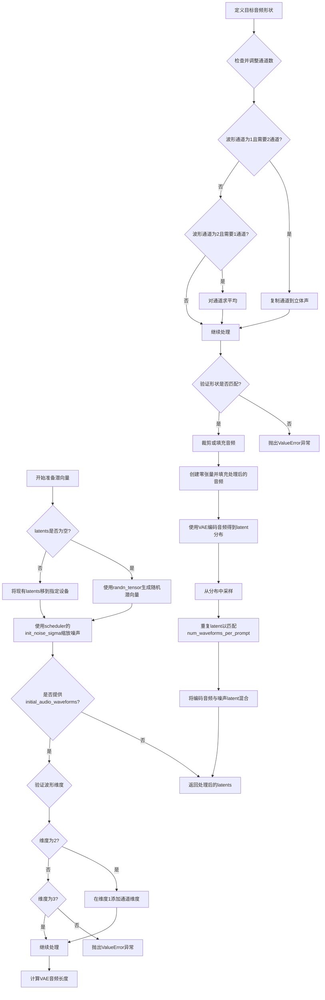

#### 带注释源码

```python
def prepare_latents(
    self,
    batch_size,                      # 批处理大小
    num_channels_vae,                # VAE通道数
    sample_size,                     # 样本大小
    dtype,                           # 数据类型
    device,                          # 计算设备
    generator,                       # 随机数生成器
    latents=None,                    # 预生成潜向量（可选）
    initial_audio_waveforms=None,    # 初始音频波形（可选）
    num_waveforms_per_prompt=None,   # 每提示词波形数（可选）
    audio_channels=None,             # 音频通道数（可选）
):
    # 1. 构建潜向量形状：(batch_size, num_channels_vae, sample_size)
    shape = (batch_size, num_channels_vae, sample_size)
    
    # 2. 验证生成器列表长度与批处理大小匹配
    if isinstance(generator, list) and len(generator) != batch_size:
        raise ValueError(
            f"You have passed a list of generators of length {len(generator)}, but requested an effective batch"
            f" size of {batch_size}. Make sure the batch size matches the length of the generators."
        )

    # 3. 如果未提供latents，则随机生成；否则使用提供的latents并移至目标设备
    if latents is None:
        latents = randn_tensor(shape, generator=generator, device=device, dtype=dtype)
    else:
        latents = latents.to(device)

    # 4. 使用调度器的初始噪声sigma缩放噪声（EDM采样器需要）
    latents = latents * self.scheduler.init_noise_sigma

    # 5. 如果提供了初始音频波形，则编码并混入latents
    if initial_audio_waveforms is not None:
        # 5.1 检查并规范化波形维度
        if initial_audio_waveforms.ndim == 2:
            # 单通道音频：添加通道维度变为 (batch, 1, length)
            initial_audio_waveforms = initial_audio_waveforms.unsqueeze(1)
        elif initial_audio_waveforms.ndim != 3:
            raise ValueError(
                f"`initial_audio_waveforms` must be of shape `(batch_size, num_channels, audio_length)` or `(batch_size, audio_length)` but has `{initial_audio_waveforms.ndim}` dimensions"
            )

        # 5.2 计算模型所需的音频长度
        audio_vae_length = int(self.transformer.config.sample_size) * self.vae.hop_length
        audio_shape = (batch_size // num_waveforms_per_prompt, audio_channels, audio_vae_length)

        # 5.3 处理通道数不匹配的情况（单声道<->立体声转换）
        if initial_audio_waveforms.shape[1] == 1 and audio_channels == 2:
            # 单声道扩展为立体声
            initial_audio_waveforms = initial_audio_waveforms.repeat(1, 2, 1)
        elif initial_audio_waveforms.shape[1] == 2 and audio_channels == 1:
            # 立体声降为单声道
            initial_audio_waveforms = initial_audio_waveforms.mean(1, keepdim=True)

        # 5.4 验证音频形状
        if initial_audio_waveforms.shape[:2] != audio_shape[:2]:
            raise ValueError(
                f"`initial_audio_waveforms` must be of shape `(batch_size, num_channels, audio_length)` or `(batch_size, audio_length)` but is of shape `{initial_audio_waveforms.shape}`"
            )

        # 5.5 裁剪或填充音频至目标长度
        audio_length = initial_audio_waveforms.shape[-1]
        if audio_length < audio_vae_length:
            # 音频过短：打印警告并进行填充
            logger.warning(
                f"The provided input waveform is shorter ({audio_length}) than the required audio length ({audio_vae_length}) of the model and will thus be padded."
            )
        elif audio_length > audio_vae_length:
            # 音频过长：打印警告并进行裁剪
            logger.warning(
                f"The provided input waveform is longer ({audio_length}) than the required audio length ({audio_vae_length}) of the model and will thus be cropped."
            )

        # 5.6 创建目标形状的零张量并填充处理后的音频
        audio = initial_audio_waveforms.new_zeros(audio_shape)
        audio[:, :, : min(audio_length, audio_vae_length)] = initial_audio_waveforms[:, :, :audio_vae_length]

        # 5.7 使用VAE编码音频得到潜在分布并采样
        encoded_audio = self.vae.encode(audio).latent_dist.sample(generator)
        
        # 5.8 重复编码后的音频以匹配每提示词的波形数
        encoded_audio = encoded_audio.repeat((num_waveforms_per_prompt, 1, 1))
        
        # 5.9 将编码音频与噪声潜向量混合
        latents = encoded_audio + latents
    
    # 6. 返回准备好的潜向量
    return latents
```


### `StableAudioPipeline.__call__`

该方法是 StableAudioPipeline 的核心调用函数，负责执行文本到音频的生成任务。它通过编码提示词、处理音频时长嵌入、准备潜在变量、执行去噪循环，最后解码潜在变量生成音频波形。

参数：

- `prompt`：`str | list[str] | None`，用于指导音频生成的提示词或提示词列表。如果未定义，则需要传递 `prompt_embeds`。
- `audio_end_in_s`：`float | None`，音频结束时间（秒），默认值为 47.55。
- `audio_start_in_s`：`float | None`，音频开始时间（秒），默认值为 0.0。
- `num_inference_steps`：`int`，去噪步骤数，默认值为 100。更多去噪步骤通常能生成更高质量的音频，但推理速度较慢。
- `guidance_scale`：`float`，引导比例，默认值为 7.0。较高的引导比例值鼓励模型生成与文本提示更紧密相关的音频，但可能牺牲音质。当 `guidance_scale > 1` 时启用引导。
- `negative_prompt`：`str | list[str] | None`，用于指导不包含在音频生成中的提示词。如果未定义，则需要传递 `negative_prompt_embeds`。在不使用引导时（`guidance_scale < 1`）将被忽略。
- `num_waveforms_per_prompt`：`int | None`，每个提示词生成的波形数，默认值为 1。
- `eta`：`float`，对应于 [DDIM](https://huggingface.co/papers/2010.02502) 论文中的参数 eta (η)，默认值为 0.0。仅适用于 `DDIMScheduler`，其他调度器会忽略此参数。
- `generator`：`torch.Generator | list[torch.Generator] | None`，用于使生成具有确定性的 PyTorch 生成器。
- `latents`：`torch.Tensor | None`，预生成的噪声潜在变量，可用于通过不同提示词调整相同生成。如果未提供，则使用提供的随机 `generator` 生成潜在变量张量。
- `initial_audio_waveforms`：`torch.Tensor | None`，可选的初始音频波形，用于作为生成的初始音频波形。必须为形状 `(batch_size, num_channels, audio_length)` 或 `(batch_size, audio_length)`。
- `initial_audio_sampling_rate`：`torch.Tensor | None`，如果提供 `initial_audio_waveforms`，则为其采样率。必须与模型相同。
- `prompt_embeds`：`torch.Tensor | None`，从文本编码器模型预计算的文本嵌入。可用于轻松调整文本输入，例如提示词加权。如果未提供，将从 `prompt` 输入参数计算文本嵌入。
- `negative_prompt_embeds`：`torch.Tensor | None`，从文本编码器模型预计算的负面文本嵌入。可用于轻松调整文本输入。如果未提供，将从 `negative_prompt` 输入参数计算。
- `attention_mask`：`torch.LongTensor | None`，要应用于 `prompt_embeds` 的预计算注意力掩码。如果未提供，将从 `prompt` 输入参数计算注意力掩码。
- `negative_attention_mask`：`torch.LongTensor | None`，要应用于 `negative_text_audio_duration_embeds` 的预计算注意力掩码。
- `return_dict`：`bool`，是否返回 `StableDiffusionPipelineOutput` 而不是普通元组，默认值为 `True`。
- `callback`：`Callable | Optional`，在推理过程中每 `callback_steps` 步调用的函数。函数调用时传递以下参数：`callback(step: int, timestep: int, latents: torch.Tensor)`。
- `callback_steps`：`int | None`，调用 `callback` 函数的频率，默认值为 1。如果未指定，每一步都会调用回调函数。
- `output_type`：`str | None`，生成音频的输出格式，可选择 `"np"` 返回 NumPy `np.ndarray` 或 `"pt"` 返回 PyTorch `torch.Tensor` 对象。默认值为 `"pt"`。设置为 `"latent"` 可返回潜在扩散模型（LDM）输出。

返回值：`AudioPipelineOutput | tuple`，如果 `return_dict` 为 `True`，返回 `AudioPipelineOutput`，否则返回元组，其中第一个元素是生成的音频列表。

#### 流程图

```mermaid
flowchart TD
    A[开始 __call__] --> B[计算最大音频长度]
    B --> C{检查 audio_end_in_s 是否为 None}
    C -->|是| D[设置 audio_end_in_s = max_audio_length_in_s]
    C -->|否| E[验证音频长度不超过最大限制]
    D --> E
    E --> F[计算 waveform_start, waveform_end, waveform_length]
    F --> G[调用 check_inputs 验证输入参数]
    G --> H[确定 batch_size]
    H --> I[确定是否执行 classifier-free guidance]
    I --> J[调用 encode_prompt 编码输入提示词]
    J --> K[调用 encode_duration 编码音频时长]
    K --> L[连接 prompt_embeds 和时长嵌入形成 text_audio_duration_embeds]
    L --> M{是否需要 classifier-free guidance 但无 negative_prompt}
    M -->|是| N[创建零嵌入并连接]
    M -->|否| O[复制嵌入以匹配 num_waveforms_per_prompt]
    N --> O
    O --> P[设置调度器时间步]
    P --> Q[调用 prepare_latents 准备潜在变量]
    Q --> R[调用 prepare_extra_step_kwargs 准备额外参数]
    R --> S[计算旋转位置嵌入]
    S --> T[进入去噪循环]
    T --> U{是否执行 classifier-free guidance}
    U -->|是| V[扩展 latent_model_input]
    U -->|否| W[直接使用 latents]
    V --> W
    W --> X[调用 transformer 预测噪声残差]
    X --> Y{是否执行 guidance}
    Y -->|是| Z[计算 guidance 后的 noise_pred]
    Y -->|否| AA[直接使用 noise_pred]
    Z --> AA
    AA --> AB[调用 scheduler.step 计算上一步的 latents]
    AB --> AC{是否调用 callback}
    AC -->|是| AD[执行 callback 函数]
    AC -->|否| AE[更新进度条]
    AD --> AE
    AE --> AF{是否还有剩余时间步}
    AF -->|是| T
    AF -->|否| AG{output_type == 'latent'}
    AG -->|是| AH[返回 AudioPipelineOutput with latents]
    AG -->|否| AI[调用 vae.decode 解码潜在变量]
    AI --> AJ[裁剪音频到指定时间段]
    AJ --> AK{output_type == 'np'}
    AK -->|是| AL[转换为 NumPy 数组]
    AK -->|否| AM[保持 PyTorch 张量]
    AL --> AN[返回结果]
    AM --> AN
```

#### 带注释源码

```python
@torch.no_grad()
@replace_example_docstring(EXAMPLE_DOC_STRING)
def __call__(
    self,
    prompt: str | list[str] = None,
    audio_end_in_s: float | None = None,
    audio_start_in_s: float | None = 0.0,
    num_inference_steps: int = 100,
    guidance_scale: float = 7.0,
    negative_prompt: str | list[str] | None = None,
    num_waveforms_per_prompt: int | None = 1,
    eta: float = 0.0,
    generator: torch.Generator | list[torch.Generator] | None = None,
    latents: torch.Tensor | None = None,
    initial_audio_waveforms: torch.Tensor | None = None,
    initial_audio_sampling_rate: torch.Tensor | None = None,
    prompt_embeds: torch.Tensor | None = None,
    negative_prompt_embeds: torch.Tensor | None = None,
    attention_mask: torch.LongTensor | None = None,
    negative_attention_mask: torch.LongTensor | None = None,
    return_dict: bool = True,
    callback: Callable[[int, int, torch.Tensor], None] | None = None,
    callback_steps: int | None = 1,
    output_type: str | None = "pt",
):
    r"""
    The call function to the pipeline for generation.

    Args:
        prompt (`str` or `list[str]`, *optional*):
            The prompt or prompts to guide audio generation. If not defined, you need to pass `prompt_embeds`.
        audio_end_in_s (`float`, *optional*, defaults to 47.55):
            Audio end index in seconds.
        audio_start_in_s (`float`, *optional*, defaults to 0):
            Audio start index in seconds.
        num_inference_steps (`int`, *optional*, defaults to 100):
            The number of denoising steps. More denoising steps usually lead to a higher quality audio at the
            expense of slower inference.
        guidance_scale (`float`, *optional*, defaults to 7.0):
            A higher guidance scale value encourages the model to generate audio that is closely linked to the text
            `prompt` at the expense of lower sound quality. Guidance scale is enabled when `guidance_scale > 1`.
        negative_prompt (`str` or `list[str]`, *optional*):
            The prompt or prompts to guide what to not include in audio generation. If not defined, you need to
            pass `negative_prompt_embeds` instead. Ignored when not using guidance (`guidance_scale < 1`).
        num_waveforms_per_prompt (`int`, *optional*, defaults to 1):
            The number of waveforms to generate per prompt.
        eta (`float`, *optional*, defaults to 0.0):
            Corresponds to parameter eta (η) from the [DDIM](https://huggingface.co/papers/2010.02502) paper. Only
            applies to the [`~schedulers.DDIMScheduler`], and is ignored in other schedulers.
        generator (`torch.Generator` or `list[torch.Generator]`, *optional*):
            A [`torch.Generator`](https://pytorch.org/docs/stable/generated/torch.Generator.html) to make
            generation deterministic.
        latents (`torch.Tensor`, *optional*):
            Pre-generated noisy latents sampled from a Gaussian distribution, to be used as inputs for audio
            generation. Can be used to tweak the same generation with different prompts. If not provided, a latents
            tensor is generated by sampling using the supplied random `generator`.
        initial_audio_waveforms (`torch.Tensor`, *optional*):
            Optional initial audio waveforms to use as the initial audio waveform for generation. Must be of shape
            `(batch_size, num_channels, audio_length)` or `(batch_size, audio_length)`, where `batch_size`
            corresponds to the number of prompts passed to the model.
        initial_audio_sampling_rate (`int`, *optional*):
            Sampling rate of the `initial_audio_waveforms`, if they are provided. Must be the same as the model.
        prompt_embeds (`torch.Tensor`, *optional*):
            Pre-computed text embeddings from the text encoder model. Can be used to easily tweak text inputs,
            *e.g.* prompt weighting. If not provided, text embeddings will be computed from `prompt` input
            argument.
        negative_prompt_embeds (`torch.Tensor`, *optional*):
            Pre-computed negative text embeddings from the text encoder model. Can be used to easily tweak text
            inputs, *e.g.* prompt weighting. If not provided, negative_prompt_embeds will be computed from
            `negative_prompt` input argument.
        attention_mask (`torch.LongTensor`, *optional*):
            Pre-computed attention mask to be applied to the `prompt_embeds`. If not provided, attention mask will
            be computed from `prompt` input argument.
        negative_attention_mask (`torch.LongTensor`, *optional*):
            Pre-computed attention mask to be applied to the `negative_text_audio_duration_embeds`.
        return_dict (`bool`, *optional*, defaults to `True`):
            Whether or not to return a [`~pipelines.stable_diffusion.StableDiffusionPipelineOutput`] instead of a
            plain tuple.
        callback (`Callable`, *optional*):
            A function that calls every `callback_steps` steps during inference. The function is called with the
            following arguments: `callback(step: int, timestep: int, latents: torch.Tensor)`.
        callback_steps (`int`, *optional*, defaults to 1):
            The frequency at which the `callback` function is called. If not specified, the callback is called at
            every step.
        output_type (`str`, *optional*, defaults to `"pt"`):
            The output format of the generated audio. Choose between `"np"` to return a NumPy `np.ndarray` or
            `"pt"` to return a PyTorch `torch.Tensor` object. Set to `"latent"` to return the latent diffusion
            model (LDM) output.

    Examples:

    Returns:
        [`~pipelines.stable_diffusion.StableDiffusionPipelineOutput`] or `tuple`:
            If `return_dict` is `True`, [`~pipelines.stable_diffusion.StableDiffusionPipelineOutput`] is returned,
            otherwise a `tuple` is returned where the first element is a list with the generated audio.
    """
    # 0. Convert audio input length from seconds to latent length
    # 计算下采样比率，用于将音频长度从秒转换为潜在变量长度
    downsample_ratio = self.vae.hop_length

    # 计算模型最大支持的音频长度（秒）
    max_audio_length_in_s = self.transformer.config.sample_size * downsample_ratio / self.vae.config.sampling_rate
    # 如果未指定音频结束时间，则使用最大长度
    if audio_end_in_s is None:
        audio_end_in_s = max_audio_length_in_s

    # 验证请求的音频长度不超过模型最大支持长度
    if audio_end_in_s - audio_start_in_s > max_audio_length_in_s:
        raise ValueError(
            f"The total audio length requested ({audio_end_in_s - audio_start_in_s}s) is longer than the model maximum possible length ({max_audio_length_in_s}). Make sure that 'audio_end_in_s-audio_start_in_s<={max_audio_length_in_s}'."
        )

    # 计算波形的起始和结束位置
    waveform_start = int(audio_start_in_s * self.vae.config.sampling_rate)
    waveform_end = int(audio_end_in_s * self.vae.config.sampling_rate)
    waveform_length = int(self.transformer.config.sample_size)

    # 1. Check inputs. Raise error if not correct
    # 验证所有输入参数的有效性
    self.check_inputs(
        prompt,
        audio_start_in_s,
        audio_end_in_s,
        callback_steps,
        negative_prompt,
        prompt_embeds,
        negative_prompt_embeds,
        attention_mask,
        negative_attention_mask,
        initial_audio_waveforms,
        initial_audio_sampling_rate,
    )

    # 2. Define call parameters
    # 根据 prompt 类型确定批处理大小
    if prompt is not None and isinstance(prompt, str):
        batch_size = 1
    elif prompt is not None and isinstance(prompt, list):
        batch_size = len(prompt)
    else:
        batch_size = prompt_embeds.shape[0]

    # 获取执行设备
    device = self._execution_device
    # 这里 `guidance_scale` 的定义类似于 Imagen 论文中方程 (2) 的引导权重 `w`
    # `guidance_scale = 1` 对应于不执行 classifier-free guidance
    do_classifier_free_guidance = guidance_scale > 1.0

    # 3. Encode input prompt
    # 编码输入的文本提示词
    prompt_embeds = self.encode_prompt(
        prompt,
        device,
        do_classifier_free_guidance,
        negative_prompt,
        prompt_embeds,
        negative_prompt_embeds,
        attention_mask,
        negative_attention_mask,
    )

    # Encode duration
    # 编码音频时长信息
    seconds_start_hidden_states, seconds_end_hidden_states = self.encode_duration(
        audio_start_in_s,
        audio_end_in_s,
        device,
        do_classifier_free_guidance and (negative_prompt is not None or negative_prompt_embeds is not None),
        batch_size,
    )

    # Create text_audio_duration_embeds and audio_duration_embeds
    # 连接提示词嵌入和时长嵌入
    text_audio_duration_embeds = torch.cat(
        [prompt_embeds, seconds_start_hidden_states, seconds_end_hidden_states], dim=1
    )

    audio_duration_embeds = torch.cat([seconds_start_hidden_states, seconds_end_hidden_states], dim=2)

    # In case of classifier free guidance without negative prompt, we need to create unconditional embeddings and
    # to concatenate it to the embeddings
    # 如果需要 classifier-free guidance 但没有 negative prompt，创建零嵌入并连接
    if do_classifier_free_guidance and negative_prompt_embeds is None and negative_prompt is None:
        negative_text_audio_duration_embeds = torch.zeros_like(
            text_audio_duration_embeds, device=text_audio_duration_embeds.device
        )
        text_audio_duration_embeds = torch.cat(
            [negative_text_audio_duration_embeds, text_audio_duration_embeds], dim=0
        )
        audio_duration_embeds = torch.cat([audio_duration_embeds, audio_duration_embeds], dim=0)

    bs_embed, seq_len, hidden_size = text_audio_duration_embeds.shape
    # duplicate audio_duration_embeds and text_audio_duration_embeds for each generation per prompt, using mps friendly method
    # 为每个提示词的每次生成复制嵌入
    text_audio_duration_embeds = text_audio_duration_embeds.repeat(1, num_waveforms_per_prompt, 1)
    text_audio_duration_embeds = text_audio_duration_embeds.view(
        bs_embed * num_waveforms_per_prompt, seq_len, hidden_size
    )

    audio_duration_embeds = audio_duration_embeds.repeat(1, num_waveforms_per_prompt, 1)
    audio_duration_embeds = audio_duration_embeds.view(
        bs_embed * num_waveforms_per_prompt, -1, audio_duration_embeds.shape[-1]
    )

    # 4. Prepare timesteps
    # 设置调度器的时间步
    self.scheduler.set_timesteps(num_inference_steps, device=device)
    timesteps = self.scheduler.timesteps

    # 5. Prepare latent variables
    # 准备潜在变量
    num_channels_vae = self.transformer.config.in_channels
    latents = self.prepare_latents(
        batch_size * num_waveforms_per_prompt,
        num_channels_vae,
        waveform_length,
        text_audio_duration_embeds.dtype,
        device,
        generator,
        latents,
        initial_audio_waveforms,
        num_waveforms_per_prompt,
        audio_channels=self.vae.config.audio_channels,
    )

    # 6. Prepare extra step kwargs
    # 准备调度器步骤的额外参数
    extra_step_kwargs = self.prepare_extra_step_kwargs(generator, eta)

    # 7. Prepare rotary positional embedding
    # 计算旋转位置嵌入
    rotary_embedding = get_1d_rotary_pos_embed(
        self.rotary_embed_dim,
        latents.shape[2] + audio_duration_embeds.shape[1],
        use_real=True,
        repeat_interleave_real=False,
    )

    # 8. Denoising loop
    # 去噪循环
    num_warmup_steps = len(timesteps) - num_inference_steps * self.scheduler.order
    with self.progress_bar(total=num_inference_steps) as progress_bar:
        for i, t in enumerate(timesteps):
            # expand the latents if we are doing classifier free guidance
            # 如果执行 classifier-free guidance，则扩展潜在变量
            latent_model_input = torch.cat([latents] * 2) if do_classifier_free_guidance else latents
            latent_model_input = self.scheduler.scale_model_input(latent_model_input, t)

            # predict the noise residual
            # 预测噪声残差
            noise_pred = self.transformer(
                latent_model_input,
                t.unsqueeze(0),
                encoder_hidden_states=text_audio_duration_embeds,
                global_hidden_states=audio_duration_embeds,
                rotary_embedding=rotary_embedding,
                return_dict=False,
            )[0]

            # perform guidance
            # 执行引导
            if do_classifier_free_guidance:
                noise_pred_uncond, noise_pred_text = noise_pred.chunk(2)
                noise_pred = noise_pred_uncond + guidance_scale * (noise_pred_text - noise_pred_uncond)

            # compute the previous noisy sample x_t -> x_t-1
            # 计算上一步的噪声样本 x_t -> x_t-1
            latents = self.scheduler.step(noise_pred, t, latents, **extra_step_kwargs).prev_sample

            # call the callback, if provided
            # 调用回调函数（如果提供）
            if i == len(timesteps) - 1 or ((i + 1) > num_warmup_steps and (i + 1) % self.scheduler.order == 0):
                progress_bar.update()
                if callback is not None and i % callback_steps == 0:
                    step_idx = i // getattr(self.scheduler, "order", 1)
                    callback(step_idx, t, latents)

            if XLA_AVAILABLE:
                xm.mark_step()

    # 9. Post-processing
    # 后处理
    if not output_type == "latent":
        # 解码潜在变量生成音频
        audio = self.vae.decode(latents).sample
    else:
        return AudioPipelineOutput(audios=latents)

    # 裁剪音频到指定的时间段
    audio = audio[:, :, waveform_start:waveform_end]

    # 根据 output_type 转换输出格式
    if output_type == "np":
        audio = audio.cpu().float().numpy()

    # 释放模型钩子
    self.maybe_free_model_hooks()

    if not return_dict:
        return (audio,)

    return AudioPipelineOutput(audios=audio)
```

## 关键组件


### StableAudioPipeline

Stable Audio的主pipeline类，继承自DiffusionPipeline，负责协调文本到音频的完整生成流程，包含VAE、文本编码器、投影模型、变换器和调度器等核心组件的初始化与调用。

### encode_prompt

负责将文本提示编码为向量表示，包含文本tokenization、文本编码器前向传播、negative prompt处理、attention mask应用以及通过projection_model进行投影，最终返回处理后的prompt_embeds。

### encode_duration

将音频的起始和结束时间（秒）编码为隐藏状态，使用projection_model处理start_seconds和end_seconds参数，对于classifier-free guidance会复制隐藏状态以避免两次前向传播。

### prepare_latents

准备扩散模型的初始潜在变量，支持随机生成或使用预定义的latents，支持初始音频波形输入（用于inpainting或扩展），会对初始音频进行VAE编码后与噪声latents混合。

### __call__

主生成方法，执行完整的文本到音频生成流程，包括：输入验证、prompt编码、时长编码、timesteps设置、潜在变量准备、rotary embedding计算、去噪循环（包含classifier-free guidance）、VAE解码和后处理。

### check_inputs

验证输入参数的合法性，包括音频时长范围、callback_steps、prompt与prompt_embeds互斥、negative_prompt与negative_prompt_embeds互斥、形状匹配检查、初始音频波形与采样率的一致性验证。

### prepare_extra_step_kwargs

准备调度器的额外参数，通过inspect检查调度器step方法接受的参数，支持eta（DDIM调度器）和generator参数。

### Classifier-Free Guidance

在__call__方法中实现的条件生成策略，通过在negative和positive prompt embeddings之间进行插值来引导生成，guidance_scale控制引导强度。

### Rotary Positional Embedding

使用get_1d_rotary_pos_embed函数生成旋转位置编码，应用于transformer的latent和audio_duration_embeds，增强模型对位置信息的理解。

### VAE Slicing

通过enable_vae_slicing和disable_vae_slicing方法实现VAE解码的内存优化，将输入tensor分割为多个slice进行分步解码，以支持更大的batch size。

### Model CPU Offload

通过model_cpu_offload_seq定义模型卸载顺序（text_encoder->projection_model->transformer->vae），在推理过程中自动管理模型在CPU和GPU之间的迁移以节省显存。

### XLA Support

通过is_torch_xla_available检查并支持TPU/XLA设备，使用xm.mark_step进行TPU设备的同步优化。

### EDMDPMSolverMultistepScheduler

使用EDM（Elucidating the Design Space of Diffusion Models）风格的DPM多步求解器进行去噪调度，比传统DDIM调度器具有更好的采样质量。

### AudioPipelineOutput

输出包装类，包含生成的音频 tensors，支持返回PyTorch tensor或NumPy数组格式。


## 问题及建议


### 已知问题

-   **Bug - 重复应用Attention Mask**: 在 `encode_prompt` 方法中，attention mask 被应用了两次（代码行302-303），这会导致有效嵌入被过度屏蔽，应该删除重复的行。
-   **Bug - 类型检查不当**: 在 `encode_prompt` 方法中使用 `type(prompt) is not type(negative_prompt)` 进行类型比较（代码行167），这种方式不推荐且不可靠，应使用 `isinstance()` 替代。
-   **文档字符串错误**: `__call__` 方法的返回类型文档说明返回的是 `StableDiffusionPipelineOutput`，但实际返回的是 `AudioPipelineOutput`。
-   **变量覆盖风险**: 在 `encode_prompt` 方法中，参数 `attention_mask` 和 `negative_attention_mask` 被局部变量覆盖（代码行139-140处），可能导致后续逻辑错误，尤其是当调用者传入这些参数时。
-   **未使用的参数**: `initial_audio_sampling_rate` 在 `__call__` 方法签名中定义为 `torch.Tensor | None` 类型，但实际上采样率应该是整数类型，这是一个类型声明错误。

### 优化建议

-   **移除重复的Attention Mask应用**: 删除 `encode_prompt` 中重复应用 attention_mask 的代码行。
-   **修复类型检查逻辑**: 将 `type(prompt) is not type(negative_prompt)` 改为 `not isinstance(prompt, type(negative_prompt))` 或更健壮的检查方式。
-   **更正文档字符串**: 将 `__call__` 方法的返回类型文档从 `StableDiffusionPipelineOutput` 改为 `AudioPipelineOutput`。
-   **修复参数类型声明**: 将 `initial_audio_sampling_rate` 的类型从 `torch.Tensor | None` 改为 `int | None`。
-   **避免变量覆盖**: 在 `encode_prompt` 方法中使用不同的变量名来存储局部计算的 attention_mask，或在覆盖前保存原始值。
-   **简化浮点数转换**: 在 `encode_duration` 方法中，可以先检查元素是否为浮点数类型，再决定是否进行转换，避免不必要的类型转换操作。
-   **添加设备检查优化**: 在 `encode_prompt` 和 `encode_duration` 中，可以预先检查并确保所有张量在同一设备上，避免潜在的设备不匹配错误。

## 其它


### 设计目标与约束

本Pipeline的设计目标是实现高效的文本到音频生成，采用扩散模型架构，支持文本提示生成对应音频内容。核心约束包括：最大音频长度受transformer的sample_size和VAE的采样率限制（最大约47.55秒），必须使用T5系列文本编码器，音频通道数需与VAE配置一致（1或2通道），生成的音频长度必须满足audio_end_in_s - audio_start_in_s <= max_audio_length_in_s的约束。

### 错误处理与异常设计

代码中实现了多层次错误检查机制：1) check_inputs方法进行全面输入验证，包括时间参数范围检查（audio_start_in_s和audio_end_in_s必须在projection_model配置的min_value和max_value之间）、回调步骤有效性检查、prompt与prompt_embeds互斥检查、负向提示与负向嵌入的兼容性验证、形状一致性检查；2) prepare_latents方法检查生成器列表长度与批次大小匹配、初始音频波形维度验证；3) __call__方法检查请求的音频长度是否超过模型最大可能长度。所有错误均抛出带详细信息的ValueError，便于调试定位问题。

### 数据流与状态机

Pipeline的核心数据流遵循以下状态转换：1) 初始化状态：接收prompt、音频时间参数、引导_scale等输入；2) 输入编码状态：encode_prompt将文本转换为embedding，encode_duration将时间参数转换为隐藏状态；3) 潜在空间准备状态：prepare_latents生成或处理噪声潜在向量；4) 去噪迭代状态：循环执行transformer预测噪声→scheduler步骤更新潜在向量；5) 后处理状态：vae.decode将潜在向量解码为音频波形并截取目标时间段；6) 输出状态：返回AudioPipelineOutput或元组。整个过程无显式状态机实现，状态转换由方法调用顺序控制。

### 外部依赖与接口契约

本Pipeline依赖以下核心外部组件：1) transformers库的T5EncoderModel和T5Tokenizer/T5TokenizerFast用于文本编码；2) diffusers库的AutoencoderOobleck（VAE模型）、StableAudioDiTModel（Transformer去噪模型）、EDMDPMSolverMultistepScheduler（调度器）、DiffusionPipeline基类；3) 自定义模块包括StableAudioProjectionModel（投影模型）、get_1d_rotary_pos_embed（旋转位置编码）、randn_tensor（随机张量生成）；4) 可选的torch_xla用于TPU加速。接口契约要求：vae必须具有encode/decode方法及sampling_rate/hop_length/audio_channels配置属性，text_encoder需返回hidden_states，transformer需支持特定签名的forward调用，scheduler需遵循标准step接口。

### 性能考虑与资源管理

代码包含以下性能优化机制：1) 模型CPU卸载序列定义（model_cpu_offload_seq）支持梯度检查点节省显存；2) VAE切片解码（enable_vae_slicing）可降低内存占用；3) 支持torch.no_grad()装饰器减少推理内存消耗；4) XLA支持（XLA_AVAILABLE）允许在TPU上运行；5) 分类器自由引导（CFG）通过单次前向传播合并负向和正向embedding避免两次前向传递。潜在优化空间包括：缓存prompt_embeds避免重复编码、批处理多个提示、支持混合精度推理（当前默认float16可通过torch_dtype指定）。

### 并发与异步处理

当前实现为同步阻塞模式，未包含显式并发机制。callback机制提供了步骤级回调接口，允许用户在每个去噪步骤后执行自定义操作（如进度更新、中间结果保存），但不影响主执行流程。潜在的异步优化方向包括：支持异步tokenization、使用torch.compile加速推理、集成Accelerate库实现分布式推理。

### 安全性考虑

代码未包含显式的安全过滤机制。文本提示直接传递给T5EncoderModel，可能生成任何文本描述的音频内容。建议在实际应用中增加内容过滤层，审查prompt和negative_prompt中的敏感词汇。模型输出本身无内置水印或溯源机制，音频真实性验证需要额外措施。

### 版本兼容性

代码使用了Python 3.9+的类型联合语法（`|`操作符），需要Python 3.9及以上版本。依赖库版本要求：transformers库需支持T5EncoderModel和T5TokenizerFast；diffusers库需包含EDMDPMSolverMultistepScheduler和AudioPipelineOutput；PyTorch版本需支持torch.no_grad上下文管理器。deprecate调用表明某些方法（如enable_vae_slicing）将在0.40.0版本移除，需要关注后续版本迁移。

### 配置与参数管理

Pipeline配置通过构造函数注册模块实现（register_modules），各组件配置分散在各自模型中：transformer.config控制sample_size/in_channels/attention_head_dim；vae.config控制sampling_rate/hop_length/audio_channels；projection_model.config控制min_value/max_value。运行时参数通过__call__方法传递，包括生成参数（num_inference_steps/guidance_scale/eta/generator）和输出控制（return_dict/output_type/callback_steps）。默认参数遵循业界最佳实践：200步去噪、7.0引导尺度、0.0 ETA。

### 测试策略建议

建议补充的测试用例包括：1) 单元测试验证各方法输入输出格式正确性；2) 集成测试验证端到端音频生成流程；3) 边界条件测试（最小/最大音频长度、边界时间参数）；4) 错误处理测试（无效输入、类型错误、形状不匹配）；5) 性能基准测试（推理时间、内存占用）；6) 数值精度测试（确保不同设备/种子下的结果可复现）；7) 回调机制测试（验证callback在正确时机被调用）。

### 部署与运维注意事项

生产环境部署需考虑：1) 模型加载需要大量内存和磁盘空间，建议使用 accelerate 库进行模型分片；2) GPU推理建议使用float16精度以提升吞吐量；3) 长时间生成任务建议设置callback监控进度；4) 错误日志需记录完整堆栈信息便于问题排查；5) 建议实现健康检查接口验证模型加载状态；6) 考虑实现请求队列和限流机制防止资源耗尽；7) 音频后处理（格式转换、采样率调整）可分离以提升管道吞吐量。

    