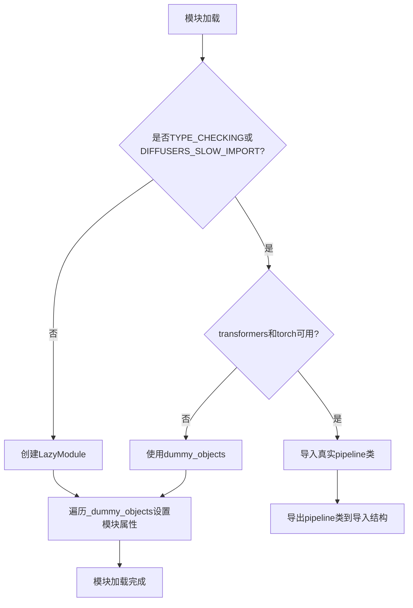
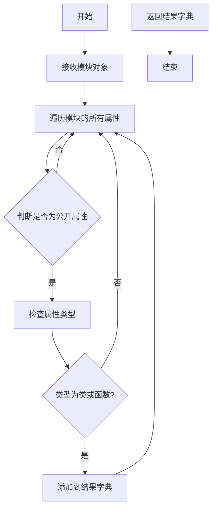
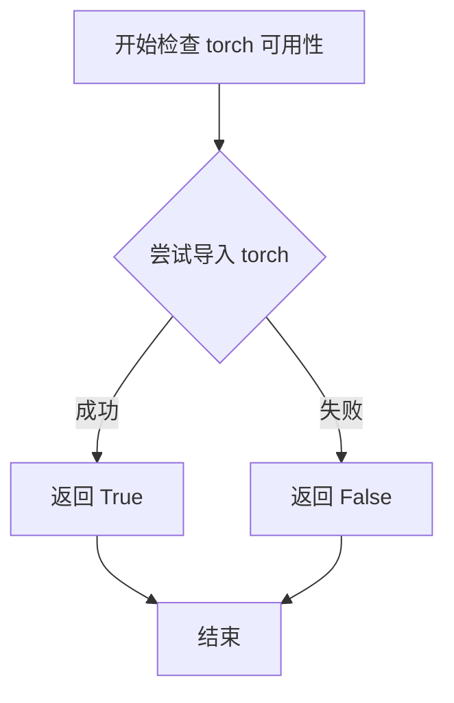
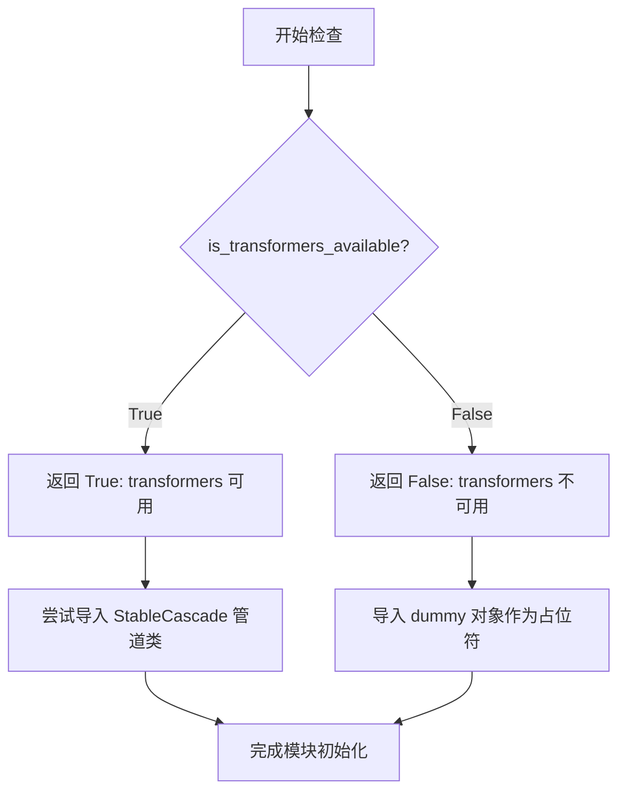
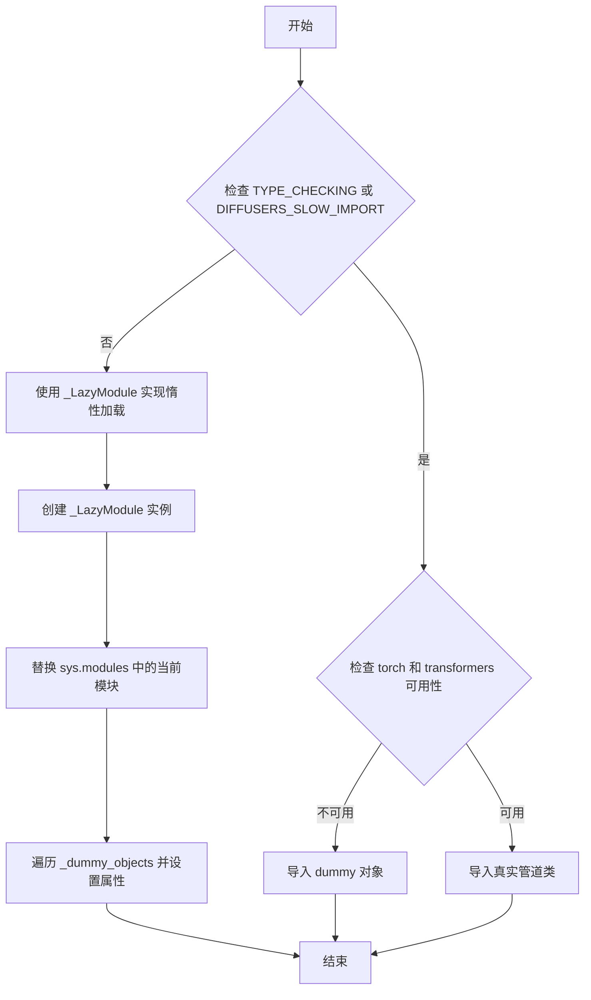

# `diffusers\src\diffusers\pipelines\stable_cascade\__init__.py` 详细设计文档

该文件是Stable Cascade管道模块的惰性导入初始化文件，通过检查torch和transformers依赖的可用性，动态加载StableCascadeDecoderPipeline、StableCascadeCombinedPipeline和StableCascadePriorPipeline三个管道类，并在依赖不可用时提供虚拟对象以保持接口一致性。

## 整体流程



## 类结构

```
无传统类结构
├── 模块级初始化
│   ├── _LazyModule (惰性加载机制)
│   ├── _import_structure (导入结构字典)
│   └── _dummy_objects (虚拟对象字典)
└── 管道类 (延迟导入)
    ├── StableCascadeDecoderPipeline
    ├── StableCascadeCombinedPipeline
    └── StableCascadePriorPipeline
```

## 全局变量及字段


### `_dummy_objects`
    
存储不可用时的虚拟对象

类型：`dict`
    


### `_import_structure`
    
定义模块的导入结构

类型：`dict`
    


    

## 全局函数及方法


### `get_objects_from_module`

从指定模块获取所有对象（类、函数等），并将其转换为字典格式，用于延迟加载机制中的虚拟对象注入。

参数：

- `module`：模块对象（module），需要从中提取所有可导出对象的模块

返回值：`dict`，键为对象名称（字符串），值为实际的对象（类或函数）

#### 流程图



#### 带注释源码

```python
def get_objects_from_module(module):
    """
    从给定模块获取所有公开的类和函数对象。
    
    该函数通常用于延迟加载机制，当某些依赖不可用时，
    用虚拟对象替换实际的类或函数，以保持接口一致性。
    
    参数:
        module: 要从中提取对象的模块对象
        
    返回:
        包含模块中所有公开类/函数的字典，键为对象名称
    """
    # 初始化结果字典
    objects = {}
    
    # 遍历模块的所有属性
    for name in dir(module):
        # 跳过私有属性（下划线开头）
        if name.startswith('_'):
            continue
            
        # 获取属性值
        attr = getattr(module, name)
        
        # 只保留类和函数类型
        if isinstance(attr, (type, callable)):
            objects[name] = attr
            
    return objects
```


### `is_torch_available`

检查当前环境中 PyTorch 库是否可用，返回布尔值以表示 torch 依赖是否已安装。

参数：
- （无参数）

返回值：`bool`，如果 PyTorch 可用则返回 `True`，否则返回 `False`

#### 流程图



#### 带注释源码

```
# 注意：此为推断的实现方式，实际代码位于 diffusers 包的 utils 模块中
def is_torch_available() -> bool:
    """
    检查 PyTorch 库是否可用。
    
    Returns:
        bool: 如果 torch 可以成功导入则返回 True，否则返回 False
    """
    try:
        import torch
        return True
    except ImportError:
        return False
```

#### 说明

该函数在代码中被用于条件导入。当 `is_torch_available()` 和 `is_transformers_available()` 都返回 `True` 时，才会导入 StableCascade 相关的 Pipeline 类；否则会导入虚拟对象（dummy objects）以保持模块结构完整性。这种设计是一种常见的可选依赖处理模式，允许库在缺少某些依赖时仍然可以正常导入，只是相关功能不可用。


### `is_transformers_available`

检查 transformers 依赖库是否可用，返回布尔值以决定是否导入 StableCascade 相关管道类。

参数：

- 无参数

返回值：`bool`，返回 `True` 表示 transformers 库可用且已安装，返回 `False` 表示不可用或未安装。

#### 流程图



#### 带注释源码

```python
# 从 typing 模块导入 TYPE_CHECKING，用于类型检查
from typing import TYPE_CHECKING

# 从上级目录的 utils 模块导入多个工具函数和类
from ...utils import (
    DIFFUSERS_SLOW_IMPORT,          # 标志：是否使用慢速导入模式
    OptionalDependencyNotAvailable, # 可选依赖不可用异常类
    _LazyModule,                    # 懒加载模块类
    get_objects_from_module,        # 从模块获取对象的函数
    is_torch_available,             # 检查 torch 可用性的函数
    is_transformers_available,     # ★ 核心函数：检查 transformers 可用性
)

# 初始化空字典，用于存储虚拟对象和导入结构
_dummy_objects = {}
_import_structure = {}

# 第一次尝试：运行时动态导入
try:
    # 检查 transformers 和 torch 是否都可用
    if not (is_transformers_available() and is_torch_available()):
        # 如果任一依赖不可用，抛出异常
        raise OptionalDependencyNotAvailable()
except OptionalDependencyNotAvailable:
    # 捕获异常，从 dummy 模块获取占位对象
    from ...utils import dummy_torch_and_transformers_objects
    _dummy_objects.update(get_objects_from_module(dummy_torch_and_transformers_objects))
else:
    # 如果所有依赖可用，定义实际的导入结构
    _import_structure["pipeline_stable_cascade"] = ["StableCascadeDecoderPipeline"]
    _import_structure["pipeline_stable_cascade_combined"] = ["StableCascadeCombinedPipeline"]
    _import_structure["pipeline_stable_cascade_prior"] = ["StableCascadePriorPipeline"]

# 第二次尝试：TYPE_CHECKING 或慢导入模式下的处理
if TYPE_CHECKING or DIFFUSERS_SLOW_IMPORT:
    try:
        # 再次检查依赖可用性（类型检查时需要）
        if not (is_transformers_available() and is_torch_available()):
            raise OptionalDependencyNotAvailable()
    except OptionalDependencyNotAvailable:
        # 导入 dummy 对象的通配符导入
        from ...utils.dummy_torch_and_transformers_objects import *  # noqa F403
    else:
        # 导入实际的管道类用于类型注解
        from .pipeline_stable_cascade import StableCascadeDecoderPipeline
        from .pipeline_stable_cascade_combined import StableCascadeCombinedPipeline
        from .pipeline_stable_cascade_prior import StableCascadePriorPipeline
else:
    # 普通运行时：使用 LazyModule 进行懒加载
    import sys
    # 将当前模块替换为懒加载模块
    sys.modules[__name__] = _LazyModule(
        __name__,
        globals()["__file__"],
        _import_structure,
        module_spec=__spec__,
    )

    # 将虚拟对象绑定到模块属性，实现延迟可用性检查
    for name, value in _dummy_objects.items():
        setattr(sys.modules[__name__], name, value)
```


### `_LazyModule` (惰性模块加载类的使用)

该代码展示了如何使用 `_LazyModule` 类实现模块的惰性加载，通过检查 `torch` 和 `transformers` 的可用性，在运行时动态决定导入真实的管道类还是虚拟的 dummy 对象，从而避免强制依赖。

#### 参数

由于 `_LazyModule` 类本身在 `...utils` 模块中定义，此处仅说明代码中实例化时的传入参数：

- `__name__`：`str`，当前模块的名称（`__name__`）
- `globals()["__file__"]`：`str`，模块文件的绝对路径
- `_import_structure`：`dict`，定义了模块的导入结构（键为子模块名，值为导出的类名列表）
- `module_spec`：`ModuleSpec`，模块的规格信息（`__spec__`）

#### 返回值

- `sys.modules[__name__]`：返回被设置为惰性模块的当前模块对象

#### 流程图



#### 带注释源码

```python
# 从 typing 导入 TYPE_CHECKING，用于类型检查时不执行运行时导入
from typing import TYPE_CHECKING

# 从 utils 导入必要的工具函数和类
from ...utils import (
    DIFFUSERS_SLOW_IMPORT,           # 控制是否使用慢速导入的标志
    OptionalDependencyNotAvailable,  # 可选依赖不可用异常
    _LazyModule,                     # 惰性模块加载类（核心）
    get_objects_from_module,         # 从模块获取对象的函数
    is_torch_available,              # 检查 torch 是否可用
    is_transformers_available,       # 检查 transformers 是否可用
)

# 初始化空字典用于存储虚拟对象和导入结构
_dummy_objects = {}
_import_structure = {}

# 尝试检查可选依赖（torch 和 transformers）是否同时可用
try:
    if not (is_transformers_available() and is_torch_available()):
        raise OptionalDependencyNotAvailable()
except OptionalDependencyNotAvailable:
    # 如果依赖不可用，从 dummy 模块导入虚拟对象
    from ...utils import dummy_torch_and_transformers_objects
    # 更新虚拟对象字典
    _dummy_objects.update(get_objects_from_module(dummy_torch_and_transformers_objects))
else:
    # 依赖可用时，定义真实模块的导入结构
    _import_structure["pipeline_stable_cascade"] = ["StableCascadeDecoderPipeline"]
    _import_structure["pipeline_stable_cascade_combined"] = ["StableCascadeCombinedPipeline"]
    _import_structure["pipeline_stable_cascade_prior"] = ["StableCascadePriorPipeline"]

# TYPE_CHECKING 或 DIFFUSERS_SLOW_IMPORT 为 True 时，直接导入真实类
if TYPE_CHECKING or DIFFUSERS_SLOW_IMPORT:
    try:
        if not (is_transformers_available() and is_torch_available()):
            raise OptionalDependencyNotAvailable()
    except OptionalDependencyNotAvailable:
        # 类型检查时导入 dummy 对象
        from ...utils.dummy_torch_and_transformers_objects import *  # noqa F403
    else:
        # 类型检查时导入真实管道类
        from .pipeline_stable_cascade import StableCascadeDecoderPipeline
        from .pipeline_stable_cascade_combined import StableCascadeCombinedPipeline
        from .pipeline_stable_cascade_prior import StableCascadePriorPipeline
else:
    # 运行时：使用 _LazyModule 实现惰性加载
    import sys
    
    # 将当前模块替换为 _LazyModule 实例
    sys.modules[__name__] = _LazyModule(
        __name__,                        # 模块名
        globals()["__file__"],           # 模块文件路径
        _import_structure,               # 导入结构字典
        module_spec=__spec__,            # 模块规格
    )
    
    # 将虚拟对象设置为模块属性，实现惰性访问
    for name, value in _dummy_objects.items():
        setattr(sys.modules[__name__], name, value)
```


## 关键组件


### 延迟加载模块（Lazy Loading Module）

使用 `_LazyModule` 实现模块的延迟加载，允许在运行时按需导入 StableCascade 相关的 Pipeline 类，避免在导入时立即加载所有依赖。

### 可选依赖检查（Optional Dependency Checking）

通过 `is_torch_available()` 和 `is_transformers_available()` 检查 torch 和 transformers 库的可用性，使用 `OptionalDependencyNotAvailable` 异常处理依赖不可用的情况。

### 虚拟对象机制（Dummy Objects）

当依赖不可用时，通过 `_dummy_objects` 字典和 `get_objects_from_module()` 函数提供虚拟对象，确保模块结构完整可用。

### 导入结构定义（Import Structure）

`_import_structure` 字典定义了可导出的 Pipeline 类，包括 `StableCascadeDecoderPipeline`、`StableCascadeCombinedPipeline` 和 `StableCascadePriorPipeline`。

### TYPE_CHECKING 支持

通过 `TYPE_CHECKING` 条件导入，在类型检查时提供完整的类型注解支持，而不触发实际模块的加载。

### 动态模块替换（Dynamic Module Replacement）

使用 `sys.modules[__name__]` 替换和 `setattr()` 动态设置模块属性，实现运行时模块的懒加载和虚拟对象的注入。


## 问题及建议


### 已知问题

-   **重复的条件检查**：代码在两个地方（try-except 块和 TYPE_CHECKING 块）重复检查 `is_transformers_available() and is_torch_available()`，违反了 DRY 原则，增加维护成本
-   **异常捕获逻辑冗余**：在 `TYPE_CHECKING` 分支中捕获 `OptionalDependencyNotAvailable` 后又重新导入 dummy 对象，但主逻辑中已经处理过相同的异常，逻辑不够清晰
-   **通配符导入**：`from ...utils.dummy_torch_and_transformers_objects import *` 使用了通配符导入，降低了代码的可读性和 IDE 支持，无法明确知道导入了哪些对象
-   **硬编码的模块名**：`"pipeline_stable_cascade"` 等字符串字面量直接写在 `_import_structure` 字典中，缺乏灵活性，如果类名变化需要手动同步修改
-   **空字典初始化**：` _dummy_objects = {}` 和 ` _import_structure = {}` 初始化后通过条件分支填充，流程不够直观
-   **缺少错误日志**：当可选依赖不可用时静默导入 dummy 对象，缺乏日志记录，不利于调试

### 优化建议

-   **提取公共逻辑**：将可选依赖检查抽取为独立函数或变量，避免重复代码，例如预先计算 `_dependencies_available = is_transformers_available() and is_torch_available()`
-   **简化条件分支**：使用三元运算符或早期返回模式简化条件逻辑，减少嵌套层级
-   **使用显式导入替代通配符**：明确列出需要导入的类名，提高代码可维护性
-   **常量定义**：将模块名字符串提取为常量或使用 `__all__` 列表管理导出的公开接口
-   **添加日志或警告**：在导入 dummy 对象时记录日志，便于排查环境配置问题
-   **统一错误处理**：考虑使用统一的依赖检查函数，封装 try-except 逻辑，提高代码复用性


## 其它


### 设计目标与约束

该模块作为StableCascade模型管道的延迟加载入口模块，旨在提供可选依赖支持下的动态导入机制，同时保持主命名空间的整洁。设计约束包括：必须同时满足torch和transformers两个依赖库可用时才导入实际pipeline类，否则使用dummy对象填充；遵循diffusers库的LazyModule延迟导入规范；保证TYPE_CHECKING和DIFFUSERS_SLOW_IMPORT两种模式下的类型提示可用性。

### 错误处理与异常设计

代码采用OptionalDependencyNotAvailable异常来处理可选依赖不可用的情况。当is_transformers_available()或is_torch_available()返回False时，抛出该异常并捕获，随后从dummy模块加载替代对象。异常设计为静默处理模式——不打印错误信息，仅通过_dummy_objects字典提供占位符，确保导入语句不会失败但使用时会产生明确的AttributeError。

### 数据流与状态机

模块初始化流程分为三个阶段：环境探测阶段检查torch和transformers可用性；条件导入阶段根据探测结果选择实际模块或dummy对象；延迟绑定阶段通过_LazyModule和setattr将对象注册到sys.modules。状态转换由两个布尔标志控制：TYPE_CHECKING标志和DIFFUSERS_SLOW_IMPORT标志，两者任一为真时进入完整导入模式，否则进入延迟加载模式。

### 外部依赖与接口契约

外部依赖包括硬依赖（typing.TYPE_CHECKING、sys模块）和可选依赖（torch、transformers）。接口契约规定：模块必须导出StableCascadeDecoderPipeline、StableCascadeCombinedPipeline、StableCascadePriorPipeline三个类；当依赖不可用时，这些类名必须以dummy对象形式存在于命名空间中；所有导入必须通过_import_structure字典声明，以便_LazyModule正确构建导出结构。

### 性能考虑

模块采用延迟加载策略以优化首次导入速度，实际pipeline类仅在首次访问时才从磁盘加载。_dummy_objects字典的构建在模块初始化时完成，但仅占用极少的内存。对于DIFFUSERS_SLOW_IMPORT为真的场景（如文档生成），会跳过延迟加载直接导入完整模块，可能导致初始化时间增加。

### 兼容性考虑

该模块兼容diffusers库的多种使用场景：运行时动态导入、静态类型检查、文档构建工具的慢速导入。向后兼容性通过维持_import_structure字典结构和_LazyModule的module_spec参数保证。Python版本兼容性取决于底层依赖库（torch、transformers）的支持范围。

### 测试策略

测试应覆盖以下场景：依赖全部可用时的完整导入流程；任一依赖缺失时的dummy对象填充；TYPE_CHECKING模式下的类型提示可用性；DIFFUSERS_SLOW_IMPORT模式下的直接导入行为；sys.modules[name]属性访问的正确性。建议使用mock来模拟torch和transformers的可用性状态进行隔离测试。

### 版本管理与配置管理

版本信息继承自diffusers主包，无需单独管理。配置通过全局变量DIFFUSERS_SLOW_IMPORT控制导入行为，可在环境变量中设置。该模块本身无独立配置文件，完全依赖调用方和环境的依赖状态。

### 模块化与可扩展性

当前实现仅支持StableCascade系列三个pipeline类，可通过在_import_structure字典中添加新条目来扩展其他pipeline。_LazyModule机制自动支持新导出项的延迟加载，无需修改核心逻辑。模块化设计允许在不修改入口点的情况下添加新的可选依赖处理逻辑。

    