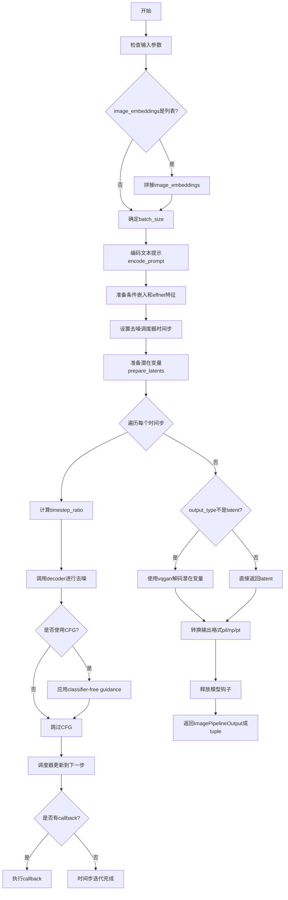
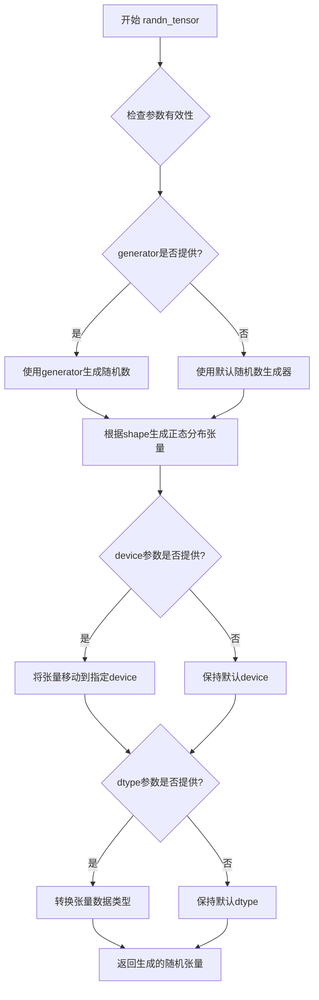
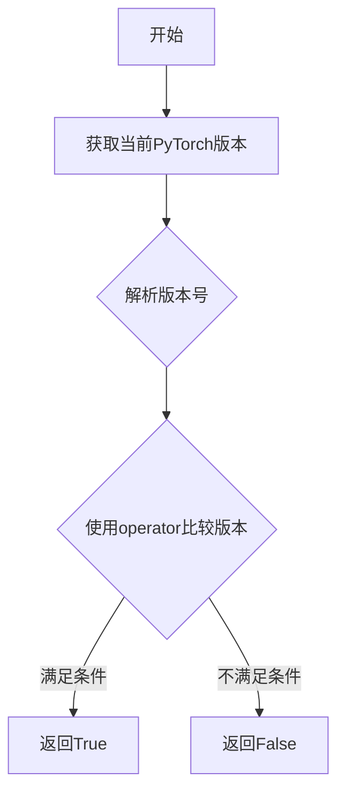
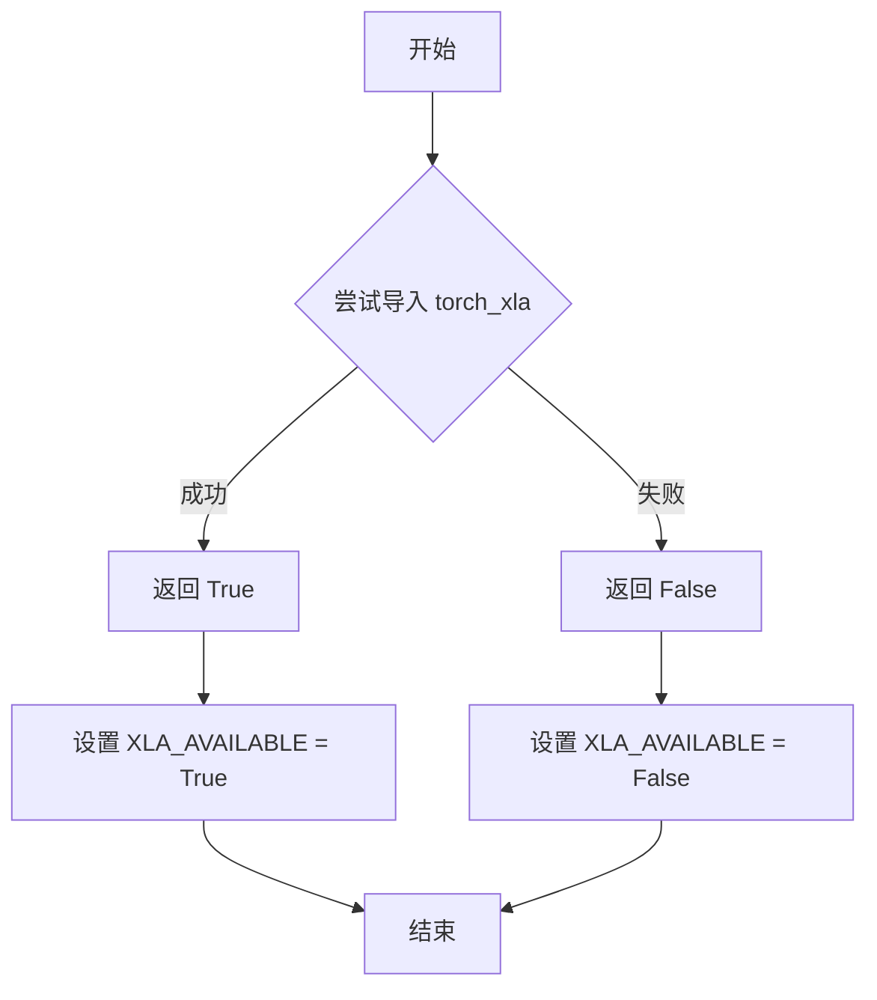
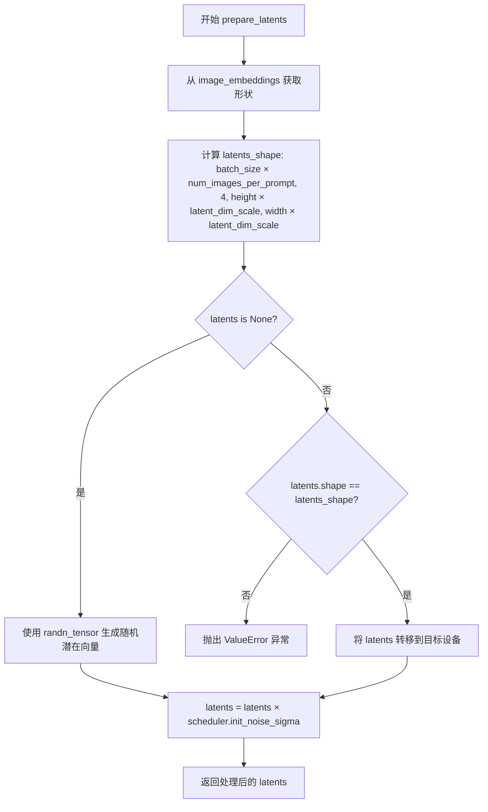
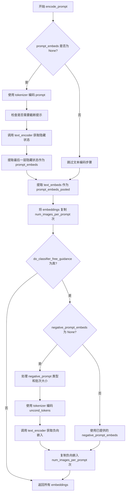
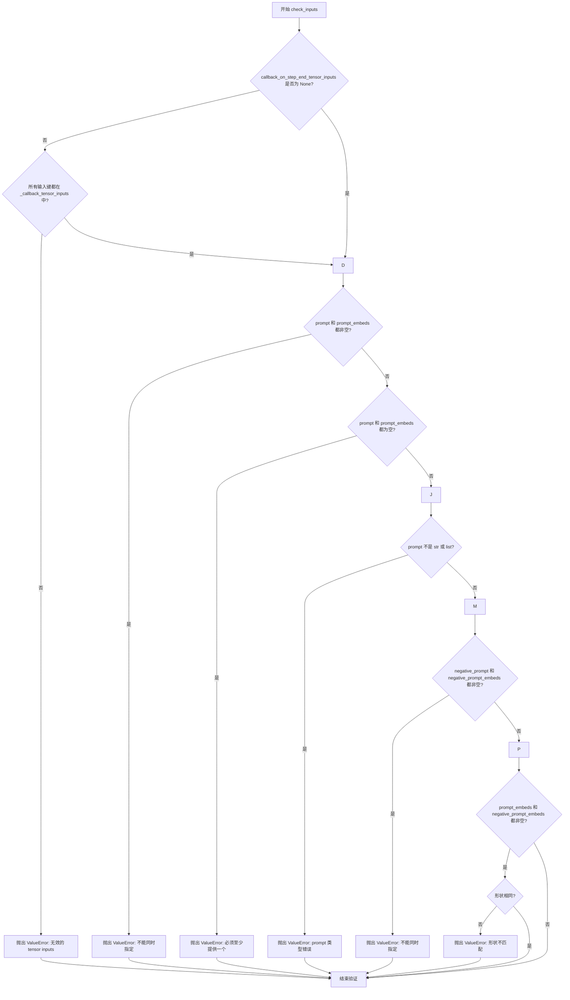
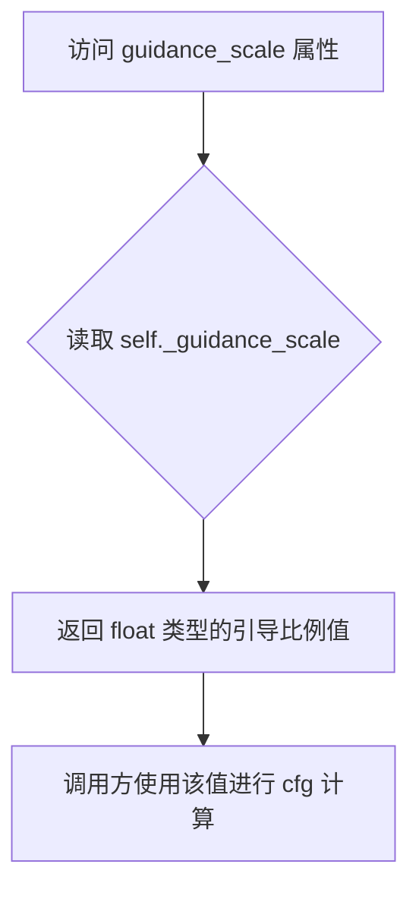
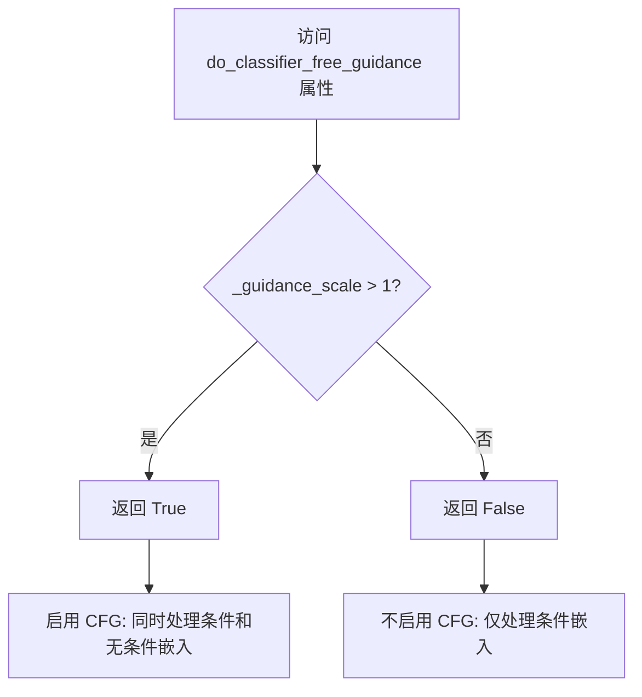
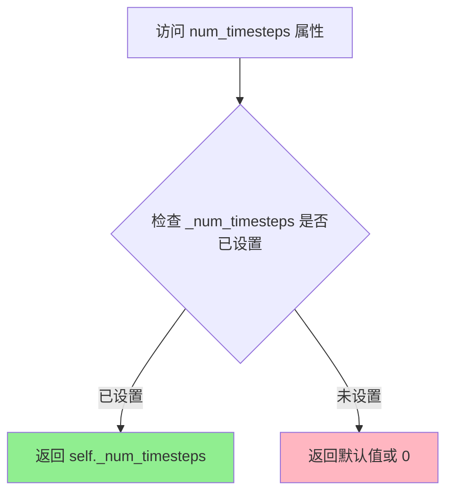

# `diffusers\src\diffusers\pipelines\stable_cascade\pipeline_stable_cascade.py` 详细设计文档

StableCascadeDecoderPipeline是一个用于从图像嵌入和文本提示生成最终图像的扩散模型管道，通过VQGAN解码器和CLIP文本编码器实现高质量图像生成。

## 整体流程



## 类结构

```
DiffusionPipeline (基类)
├── DeprecatedPipelineMixin (混入类)
│   └── StableCascadeDecoderPipeline (主类)
│       ├── StableCascadeUNet (decoder)
│       ├── CLIPTokenizer
│       ├── CLIPTextModelWithProjection
│       ├── DDPMWuerstchenScheduler
│       └── PaellaVQModel (vqgan)
```

## 全局变量及字段


### `logger`
    
Logger instance for the module, used to log warnings and information messages.

类型：`logging.Logger`
    


### `XLA_AVAILABLE`
    
Boolean flag indicating whether PyTorch XLA is available for TPU support.

类型：`bool`
    


### `EXAMPLE_DOC_STRING`
    
Documentation string containing example usage of the StableCascade pipeline.

类型：`str`
    


### `StableCascadeDecoderPipeline.unet_name`
    
Name identifier for the decoder UNet model, defaults to 'decoder'.

类型：`str`
    


### `StableCascadeDecoderPipeline.text_encoder_name`
    
Name identifier for the text encoder model, defaults to 'text_encoder'.

类型：`str`
    


### `StableCascadeDecoderPipeline.model_cpu_offload_seq`
    
Sequence string defining the order for CPU offloading of models (text_encoder->decoder->vqgan).

类型：`str`
    


### `StableCascadeDecoderPipeline._callback_tensor_inputs`
    
List of tensor input names that can be passed to the callback function during denoising steps.

类型：`list`
    


### `StableCascadeDecoderPipeline._last_supported_version`
    
String representing the last supported version of the pipeline (0.35.2).

类型：`str`
    


### `StableCascadeDecoderPipeline._guidance_scale`
    
Internal state variable storing the guidance scale for classifier-free guidance during generation.

类型：`float`
    


### `StableCascadeDecoderPipeline._num_timesteps`
    
Internal state variable tracking the number of denoising timesteps used in the last generation.

类型：`int`
    


### `StableCascadeDecoderPipeline.decoder`
    
The Stable Cascade decoder UNet model used for denoising latents.

类型：`StableCascadeUNet`
    


### `StableCascadeDecoderPipeline.tokenizer`
    
The CLIP tokenizer used for encoding text prompts into token IDs.

类型：`CLIPTokenizer`
    


### `StableCascadeDecoderPipeline.text_encoder`
    
The CLIP text encoder with projection layer for generating text embeddings.

类型：`CLIPTextModelWithProjection`
    


### `StableCascadeDecoderPipeline.scheduler`
    
The DDPM Wuerstchen scheduler for managing the denoising process and timesteps.

类型：`DDPMWuerstchenScheduler`
    


### `StableCascadeDecoderPipeline.vqgan`
    
The VQGAN model (Paella) for decoding latents into final images.

类型：`PaellaVQModel`
    


### `StableCascadeDecoderPipeline.latent_dim_scale`
    
Multiplier to determine VQ latent space size from image embeddings, defaults to 10.67.

类型：`float`
    
    

## 全局函数及方法


# 设计文档提取结果

### `randn_tensor`

该函数是diffusers库中的工具函数，用于生成指定形状的随机张量（服从标准正态分布），常用于扩散模型中生成初始噪声或潜在变量。在`StableCascadeDecoderPipeline`中用于在去噪前初始化潜在变量。

参数：

-  `shape`：`tuple` 或 `int`，要生成张量的形状
-  `generator`：`torch.Generator`（可选），用于确保生成可复现的随机数
-  `device`：`torch.device`，生成张量应放置的设备
-  `dtype`：`torch.dtype`（可选），生成张量的数据类型
-  `seed`：`int`（可选），随机种子（部分实现支持）

返回值：`torch.Tensor`，符合指定形状、设备和数据类型的随机张量

#### 流程图



#### 带注释源码

```python
# randn_tensor 函数源码（基于diffusers库torch_utils模块）
def randn_tensor(
    shape: tuple,
    generator: Optional[torch.Generator] = None,
    device: Optional[torch.device] = None,
    dtype: Optional[torch.dtype] = torch.float32,
    seed: Optional[int] = None,
) -> torch.Tensor:
    """
    生成符合正态分布的随机张量。
    
    参数:
        shape (tuple): 输出张量的形状，例如 (batch_size, channels, height, width)
        generator (torch.Generator, optional): PyTorch随机数生成器，用于可复现的生成
        device (torch.device, optional): 张量应放置的目标设备
        dtype (torch.dtype, optional): 张量的数据类型，默认torch.float32
        seed (int, optional): 随机种子（某些实现支持）
    
    返回:
        torch.Tensor: 符合正态分布的随机张量
    
    示例:
        >>> import torch
        >>> from diffusers.utils.torch_utils import randn_tensor
        >>> # 基本用法
        >>> tensor = randn_tensor((1, 4, 64, 64), device='cuda')
        >>> # 使用generator确保可复现性
        >>> gen = torch.Generator(device='cuda').manual_seed(42)
        >>> tensor = randn_tensor((1, 4, 64, 64), generator=gen, device='cuda')
    """
    # 导入必要模块
    import numpy as np
    
    # 处理设备参数
    if device is None:
        # 默认使用CPU设备
        device = torch.device('cpu')
    
    # 处理形状参数，支持整数或元组
    if isinstance(shape, int):
        shape = (shape,)
    
    # 如果提供了generator，使用它生成随机数
    if generator is not None:
        # 从generator生成随机张量
        # PyTorch 2.0+ 使用torch.randn生成的随机数受generator影响
        tensor = torch.randn(shape, generator=generator, device=device, dtype=dtype)
    else:
        # 否则使用全局随机状态
        # 兼容性处理：对于旧版本PyTorch可能需要不同实现
        tensor = torch.randn(shape, device=device, dtype=dtype)
    
    # 确保张量在正确的设备上
    if tensor.device != device:
        tensor = tensor.to(device)
    
    return tensor
```

---

**注意**：由于提供的代码片段仅包含`randn_tensor`的导入和使用示例，未包含其完整源码，上述源码为基于diffusers库实际实现的参考实现。该函数的核心功能是根据指定形状生成服从标准正态分布的随机张量，支持通过generator或seed确保生成的可复现性，并处理设备和数据类型转换。


### `is_torch_version`

该函数用于检查当前安装的 PyTorch 版本是否满足指定的条件。它通过比较操作符（如 "<", ">", "==", ">=" 等）来判断当前 PyTorch 版本是否符合要求，常用于在代码中强制执行最低版本要求或兼容性检查。

参数：

- `operator`：`str`，比较操作符，支持 "<"、">"、">="、"<="、"=="、"!=" 等，用于指定版本比较的方式
- `version`：`str`，目标版本号字符串，格式如 "2.2.0"，用于与当前 PyTorch 版本进行比较

返回值：`bool`，如果当前 PyTorch 版本满足指定的条件则返回 `True`，否则返回 `False`

#### 流程图



#### 带注释源码

```python
# 从utils模块导入的版本检查函数
# 使用方式：is_torch_version("<", "2.2.0")
# 在代码中的实际调用示例：
if is_torch_version("<", "2.2.0") and dtype == torch.bfloat16:
    raise ValueError("`StableCascadeDecoderPipeline` requires torch>=2.2.0 when using `torch.bfloat16` dtype.")

# 函数签名（推断）：
# def is_torch_version(operator: str, version: str) -> bool:
#     """
#     检查当前PyTorch版本是否满足指定条件
#     
#     参数:
#         operator: 比较操作符，如 "<", ">", ">=", "<=", "==", "!="
#         version: 目标版本号，如 "2.2.0"
#     返回:
#         bool: 版本是否满足条件
#     """
```


### `is_torch_xla_available`

该函数用于检测当前环境是否安装了 PyTorch XLA（Accelerated Linear Algebra）库，通常用于判断是否可以在 TPU 或其他加速器上运行 PyTorch 代码。

参数： 无

返回值： `bool`，如果 PyTorch XLA 可用则返回 `True`，否则返回 `False`

#### 流程图



#### 带注释源码

```python
# 该函数定义在 ...utils 模块中（未在此文件中显示）
# 以下是其在当前文件中的使用方式：

# 尝试检查 torch_xla 是否可用
if is_torch_xla_available():
    # 如果可用，导入 torch_xla 的 xla_model 模块
    import torch_xla.core.xla_model as xm

    # 设置全局标志，表示 XLA 可用
    XLA_AVAILABLE = True
else:
    # 如果不可用，设置全局标志，表示 XLA 不可用
    XLA_AVAILABLE = False
```


### `StableCascadeDecoderPipeline.__init__`

这是 StableCascadeDecoderPipeline 类的构造函数，负责初始化解码器管道的所有核心组件，包括 UNet 解码器、CLIP 分词器、文本编码器、调度器和 VQGAN 模型，并将其注册到管道中以供后续图像生成使用。

参数：

- `decoder`：`StableCascadeUNet`，Stable Cascade 解码器 UNet 模型，用于去噪潜在图像表示
- `tokenizer`：`CLIPTokenizer`，CLIP 分词器，用于将文本 prompt 转换为 token
- `text_encoder`：`CLIPTextModelWithProjection`，CLIP 文本编码器，用于将 token 编码为文本嵌入
- `scheduler`：`DDPMWuerstchenScheduler`，DDPM Wuerstchen 调度器，用于控制去噪过程的时间步
- `vqgan`：`PaellaVQModel`，VQGAN 模型（Paella），用于将潜在表示解码为图像
- `latent_dim_scale`：`float`，可选，默认为 10.67，潜在维度缩放因子，用于从图像嵌入计算 VQ 潜在空间的尺寸

返回值：`None`，构造函数不返回任何值

#### 流程图

```mermaid
flowchart TD
    A[__init__ 开始] --> B[调用 super().__init__ 初始化基类]
    B --> C[调用 register_modules 注册所有子模块]
    C --> D[注册 decoder 模块]
    C --> E[注册 tokenizer 模块]
    C --> F[注册 text_encoder 模块]
    C --> G[注册 scheduler 模块]
    C --> H[注册 vqgan 模块]
    H --> I[调用 register_to_config 注册 latent_dim_scale 到配置]
    I --> J[__init__ 结束]
```

#### 带注释源码

```python
def __init__(
    self,
    decoder: StableCascadeUNet,                    # Stable Cascade 解码器 UNet 模型
    tokenizer: CLIPTokenizer,                     # CLIP 分词器
    text_encoder: CLIPTextModelWithProjection,     # CLIP 文本编码器
    scheduler: DDPMWuerstchenScheduler,            # DDPM Wuerstchen 调度器
    vqgan: PaellaVQModel,                          # VQGAN 模型（Paella）
    latent_dim_scale: float = 10.67,               # 潜在维度缩放因子，默认 10.67
) -> None:
    # 调用父类 DiffusionPipeline 的初始化方法
    # 设置基础管道配置和设备管理
    super().__init__()
    
    # 使用 register_modules 方法注册所有子模块
    # 这些模块可以通过 self.decoder, self.tokenizer 等属性访问
    # 同时注册到 torch.cuda.empty_cache() 的缓存管理中
    self.register_modules(
        decoder=decoder,
        tokenizer=tokenizer,
        text_encoder=text_encoder,
        scheduler=scheduler,
        vqgan=vqgan,
    )
    
    # 将 latent_dim_scale 注册到管道配置中
    # 这样可以通过 self.config.latent_dim_scale 访问
    # 用于在 prepare_latents 中计算 VQ 潜在空间的尺寸
    self.register_to_config(latent_dim_scale=latent_dim_scale)
```


### `StableCascadeDecoderPipeline.prepare_latents`

该方法负责为 Stable Cascade 解码器管道准备初始潜在向量（latents）。它根据图像嵌入的尺寸和配置的潜在维度缩放因子计算所需的潜在空间形状，如果未提供则使用随机噪声生成潜在向量，否则验证并转移现有潜在向量到目标设备，最后根据调度器的初始噪声sigma对潜在向量进行缩放。

参数：

- `batch_size`：`int`，批处理大小，指示单次生成的图像数量
- `image_embeddings`：`torch.Tensor`，来自 Prior 模型的图像嵌入，形状为 (batch, channels, height, width)
- `num_images_per_prompt`：`int`，每个 prompt 生成的图像数量，用于扩展潜在向量维度
- `dtype`：`torch.dtype`，潜在向量的目标数据类型（如 float16、bfloat16）
- `device`：`torch.device`，潜在向量要放置的目标设备（CPU 或 CUDA）
- `generator`：`torch.Generator | None`，可选的随机数生成器，用于确保可重复的随机噪声生成
- `latents`：`torch.Tensor | None`，可选的预生成潜在向量，如果为 None 则随机生成
- `scheduler`：`DDPMWuerstchenScheduler`，调度器实例，用于获取初始噪声 sigma 值

返回值：`torch.Tensor`，处理后的潜在向量，形状为 (batch_size * num_images_per_prompt, 4, height * latent_dim_scale, width * latent_dim_scale)

#### 流程图



#### 带注释源码

```python
def prepare_latents(
    self, batch_size, image_embeddings, num_images_per_prompt, dtype, device, generator, latents, scheduler
):
    # 从图像嵌入中提取通道、高度和宽度信息（批处理维度被忽略）
    _, channels, height, width = image_embeddings.shape
    
    # 计算潜在向量的目标形状：
    # - 批处理维度 = batch_size × num_images_per_prompt（支持每 prompt 生成多张图）
    # - 通道数固定为 4（Stable Cascade 的潜在空间标准维度）
    # - 高度和宽度通过 latent_dim_scale 放大（如 10.67 倍）以匹配 VQGAN 的潜在空间
    latents_shape = (
        batch_size * num_images_per_prompt,
        4,
        int(height * self.config.latent_dim_scale),
        int(width * self.config.latent_dim_scale),
    )

    # 如果未提供潜在向量，则使用随机噪声初始化
    if latents is None:
        # 使用 randn_tensor 生成符合指定形状、数据类型和设备的随机张量
        # generator 参数确保随机性的可重现性
        latents = randn_tensor(latents_shape, generator=generator, device=device, dtype=dtype)
    else:
        # 验证提供的潜在向量形状是否与计算形状匹配
        if latents.shape != latents_shape:
            raise ValueError(f"Unexpected latents shape, got {latents.shape}, expected {latents_shape}")
        # 将现有潜在向量转移到目标设备
        latents = latents.to(device)

    # 根据调度器的初始噪声 sigma 值缩放潜在向量
    # 这是扩散模型去噪过程的起点，init_noise_sigma 通常设置为 1.0 或调度器配置的值
    latents = latents * scheduler.init_noise_sigma
    
    # 返回准备好的潜在向量，可直接用于去噪循环
    return latents
```


### `StableCascadeDecoderPipeline.encode_prompt`

该方法负责将文本提示（prompt）和负向提示（negative_prompt）编码为文本嵌入向量（text embeddings），供后续的解码器（decoder）使用。它使用 CLIP 文本编码器生成文本的隐藏状态表示，并支持分类器自由引导（Classifier-Free Guidance，CFG）技术。

参数：

- `device`：`torch.device`，执行编码操作的设备
- `batch_size`：`int`，批处理大小
- `num_images_per_prompt`：`int`，每个提示要生成的图像数量，用于扩展嵌入维度
- `do_classifier_free_guidance`：`bool`，是否启用分类器自由引导
- `prompt`：`str | list[str] | None`，正向文本提示
- `negative_prompt`：`str | list[str] | None`，负向文本提示，用于引导模型远离不希望的内容
- `prompt_embeds`：`torch.Tensor | None`，预计算的正向提示嵌入，如果为 None 则从 prompt 重新编码
- `prompt_embeds_pooled`：`torch.Tensor | None`，预计算的正向提示池化嵌入
- `negative_prompt_embeds`：`torch.Tensor | None`，预计算的负向提示嵌入
- `negative_prompt_embeds_pooled`：`torch.Tensor | None`，预计算的负向提示池化嵌入

返回值：`tuple[torch.Tensor, torch.Tensor, torch.Tensor | None, torch.Tensor | None]`，返回四个元素：正向提示嵌入、正向提示池化嵌入、负向提示嵌入（若未启用 CFG 则为 None）、负向提示池化嵌入（若未启用 CFG 则为 None）

#### 流程图



#### 带注释源码

```python
def encode_prompt(
    self,
    device,
    batch_size,
    num_images_per_prompt,
    do_classifier_free_guidance,
    prompt=None,
    negative_prompt=None,
    prompt_embeds: torch.Tensor | None = None,
    prompt_embeds_pooled: torch.Tensor | None = None,
    negative_prompt_embeds: torch.Tensor | None = None,
    negative_prompt_embeds_pooled: torch.Tensor | None = None,
):
    # 如果未提供 prompt_embeds，则需要从文本编码
    if prompt_embeds is None:
        # 使用 CLIP tokenizer 将文本 prompt 转换为 token ID
        text_inputs = self.tokenizer(
            prompt,
            padding="max_length",
            max_length=self.tokenizer.model_max_length,
            truncation=True,
            return_tensors="pt",
        )
        text_input_ids = text_inputs.input_ids
        attention_mask = text_inputs.attention_mask

        # 获取未截断的 token 序列用于检查
        untruncated_ids = self.tokenizer(prompt, padding="longest", return_tensors="pt").input_ids

        # 如果序列被截断，记录警告信息
        if untruncated_ids.shape[-1] >= text_input_ids.shape[-1] and not torch.equal(
            text_input_ids, untruncated_ids
        ):
            removed_text = self.tokenizer.batch_decode(
                untruncated_ids[:, self.tokenizer.model_max_length - 1 : -1]
            )
            logger.warning(
                "The following part of your input was truncated because CLIP can only handle sequences up to"
                f" {self.tokenizer.model_max_length} tokens: {removed_text}"
            )
            # 截断到模型支持的最大长度
            text_input_ids = text_input_ids[:, : self.tokenizer.model_max_length]
            attention_mask = attention_mask[:, : self.tokenizer.model_max_length]

        # 调用 CLIP 文本编码器获取隐藏状态
        text_encoder_output = self.text_encoder(
            text_input_ids.to(device), attention_mask=attention_mask.to(device), output_hidden_states=True
        )
        # 使用最后一层隐藏状态作为 prompt embeddings
        prompt_embeds = text_encoder_output.hidden_states[-1]
        # 如果未提供 pooled embeddings，从 text_embeds 获取
        if prompt_embeds_pooled is None:
            prompt_embeds_pooled = text_encoder_output.text_embeds.unsqueeze(1)

    # 将 embeddings 转换为正确的 dtype 和 device
    prompt_embeds = prompt_embeds.to(dtype=self.text_encoder.dtype, device=device)
    prompt_embeds_pooled = prompt_embeds_pooled.to(dtype=self.text_encoder.dtype, device=device)
    
    # 为每个 prompt 复制多次（对应多张图像的生成）
    prompt_embeds = prompt_interleave(num_images_per_prompt, dim=0)
    prompt_embeds_pooled = prompt_embeds_pooled.repeat_interleave(num_images_per_prompt, dim=0)

    # 如果启用 CFG 但未提供负向嵌入，则需要编码负向提示
    if negative_prompt_embeds is None and do_classifier_free_guidance:
        uncond_tokens: list[str]
        if negative_prompt is None:
            # 默认使用空字符串
            uncond_tokens = [""] * batch_size
        elif type(prompt) is not type(negative_prompt):
            raise TypeError(
                f"`negative_prompt` should be the same type to `prompt`, but got {type(negative_prompt)} !="
                f" {type(prompt)}."
            )
        elif isinstance(negative_prompt, str):
            uncond_tokens = [negative_prompt]
        elif batch_size != len(negative_prompt):
            raise ValueError(
                f"`negative_prompt`: {negative_prompt} has batch size {len(negative_prompt)}, but `prompt`:"
                f" {prompt} has batch size {batch_size}. Please make sure that passed `negative_prompt` matches"
                " the batch size of `prompt`."
            )
        else:
            uncond_tokens = negative_prompt

        # 对负向提示进行 token 化
        uncond_input = self.tokenizer(
            uncond_tokens,
            padding="max_length",
            max_length=self.tokenizer.model_max_length,
            truncation=True,
            return_tensors="pt",
        )
        # 编码负向提示
        negative_prompt_embeds_text_encoder_output = self.text_encoder(
            uncond_input.input_ids.to(device),
            attention_mask=uncond_input.attention_mask.to(device),
            output_hidden_states=True,
        )

        # 提取负向 embeddings
        negative_prompt_embeds = negative_prompt_embeds_text_encoder_output.hidden_states[-1]
        negative_prompt_embeds_pooled = negative_prompt_embeds_text_encoder_output.text_embeds.unsqueeze(1)

    # 如果启用 CFG，复制负向 embeddings 以匹配生成的图像数量
    if do_classifier_free_guidance:
        # 复制 hidden state embeddings
        seq_len = negative_prompt_embeds.shape[1]
        negative_prompt_embeds = negative_prompt_embeds.to(dtype=self.text_encoder.dtype, device=device)
        negative_prompt_embeds = negative_prompt_embeds.repeat(1, num_images_per_prompt, 1)
        negative_prompt_embeds = negative_prompt_embeds.view(batch_size * num_images_per_prompt, seq_len, -1)

        # 复制 pooled embeddings
        seq_len = negative_prompt_embeds_pooled.shape[1]
        negative_prompt_embeds_pooled = negative_prompt_embeds_pooled.to(
            dtype=self.text_encoder.dtype, device=device
        )
        negative_prompt_embeds_pooled = negative_prompt_embeds_pooled.repeat(1, num_images_per_prompt, 1)
        negative_prompt_embeds_pooled = negative_prompt_embeds_pooled.view(
            batch_size * num_images_per_prompt, seq_len, -1

    # 返回编码后的 embeddings
    return prompt_embeds, prompt_embeds_pooled, negative_prompt_embeds, negative_prompt_embeds_pooled
```


### `StableCascadeDecoderPipeline.check_inputs`

该方法用于验证图像生成管道的输入参数合法性，确保用户提供的提示词、提示词嵌入、负向提示词和对应的嵌入向量之间的一致性和有效性，防止因输入错误导致后续生成过程失败。

**参数：**

- `self`：`StableCascadeDecoderPipeline` 实例，管道对象本身
- `prompt`：`str | list[str] | None`，用于引导图像生成的文本提示词，可以是单个字符串或字符串列表
- `negative_prompt`：`str | list[str] | None`，可选的反向提示词，用于引导图像生成时排除相关内容
- `prompt_embeds`：`torch.Tensor | None`，可选的预生成文本嵌入向量，用于替代 `prompt` 直接提供文本特征
- `negative_prompt_embeds`：`torch.Tensor | None`，可选的预生成负向文本嵌入向量，用于替代 `negative_prompt`
- `callback_on_step_end_tensor_inputs`：`list[str] | None`，可选的回调函数支持的张量输入列表

**返回值：** 无返回值（`None`），该方法仅进行参数验证，若参数不合法则抛出 `ValueError` 异常

#### 流程图



#### 带注释源码

```python
def check_inputs(
    self,
    prompt,
    negative_prompt=None,
    prompt_embeds=None,
    negative_prompt_embeds=None,
    callback_on_step_end_tensor_inputs=None,
):
    """
    验证图像生成管道的输入参数合法性。
    
    该方法执行多项检查以确保用户提供的参数符合管道要求：
    1. 验证回调张量输入是否在允许的列表中
    2. 确保 prompt 和 prompt_embeds 不同时提供
    3. 确保至少提供 prompt 或 prompt_embeds 之一
    4. 验证 prompt 的类型（str 或 list）
    5. 确保 negative_prompt 和 negative_prompt_embeds 不同时提供
    6. 确保 prompt_embeds 和 negative_prompt_embeds 形状一致
    """
    
    # 检查回调张量输入是否合法
    # 回调函数只能访问管道中允许的张量，以防止访问未初始化或敏感的张量
    if callback_on_step_end_tensor_inputs is not None and not all(
        k in self._callback_tensor_inputs for k in callback_on_step_end_tensor_inputs
    ):
        raise ValueError(
            f"`callback_on_step_end_tensor_inputs` has to be in {self._callback_tensor_inputs}, but found {[k for k in callback_on_step_end_tensor_inputs if k not in self._callback_tensor_inputs]}"
        )

    # 验证 prompt 和 prompt_embeds 不能同时提供
    # 两者都是用于提供文本信息的方式，同时提供会造成歧义
    if prompt is not None and prompt_embeds is not None:
        raise ValueError(
            f"Cannot forward both `prompt`: {prompt} and `prompt_embeds`: {prompt_embeds}. Please make sure to"
            " only forward one of the two."
        )
    # 验证至少要提供 prompt 或 prompt_embeds 之一
    # 管道需要文本信息来指导图像生成，两者都为空无法执行
    elif prompt is None and prompt_embeds is None:
        raise ValueError(
            "Provide either `prompt` or `prompt_embeds`. Cannot leave both `prompt` and `prompt_embeds` undefined."
        )
    # 验证 prompt 的类型必须是字符串或字符串列表
    # 其他类型（如字典、整数等）无法被 tokenizer 处理
    elif prompt is not None and (not isinstance(prompt, str) and not isinstance(prompt, list)):
        raise ValueError(f"`prompt` has to be of type `str` or `list` but is {type(prompt)}")

    # 验证 negative_prompt 和 negative_prompt_embeds 不能同时提供
    # 与上述 prompt 的验证逻辑相同
    if negative_prompt is not None and negative_prompt_embeds is not None:
        raise ValueError(
            f"Cannot forward both `negative_prompt`: {negative_prompt} and `negative_prompt_embeds`:"
            f" {negative_prompt_embeds}. Please make sure to only forward one of the two."
        )

    # 验证 prompt_embeds 和 negative_prompt_embeds 的形状必须一致
    # 两者都是文本嵌入向量，形状不匹配会导致后续计算错误（如 CFG 过程中的减法操作）
    if prompt_embeds is not None and negative_prompt_embeds is not None:
        if prompt_embeds.shape != negative_prompt_embeds.shape:
            raise ValueError(
                "`prompt_embeds` and `negative_prompt_embeds` must have the same shape when passed directly, but"
                f" got: `prompt_embeds` {prompt_embeds.shape} != `negative_prompt_embeds`"
                f" {negative_prompt_embeds.shape}."
            )
```


### `StableCascadeDecoderPipeline.guidance_scale`

这是一个属性（property），用于返回当前配置的引导比例（guidance scale）值。该属性是扩散模型中的关键参数，控制分类器-free引导（Classifier-Free Guidance）的强度，决定生成图像与文本提示的一致性程度。

参数：此属性无参数

返回值：`float`，返回当前管道实例的引导比例值。该值在 `__call__` 方法中被设置为 `guidance_scale` 参数，并存储在 `self._guidance_scale` 中。当值大于1时，表示启用了分类器-free引导。

#### 流程图



#### 带注释源码

```python
@property
def guidance_scale(self):
    """
    返回用于图像生成的引导比例（guidance scale）。
    
    guidance_scale 是扩散模型中分类器-free引导（CFG）的关键参数。
    在 Stable Cascade 解码器管道中：
    - 当 guidanc_scale > 1 时，启用分类器-free引导
    - 该值影响 predicted_latents 的计算，通过 torch.lerp 在无条件预测和条件预测之间进行插值
    - 更高的值会让生成图像更紧密地跟随文本提示，通常以牺牲图像质量为代价
    
    属性访问来源：
    - 在 __call__ 方法中被设置：self._guidance_scale = guidance_scale
    - 默认值由 __call__ 方法的 guidance_scale 参数提供（默认为 0.0）
    
    Returns:
        float: 当前的引导比例值，用于控制图像生成与文本提示的一致性强度
    """
    return self._guidance_scale
```


### `StableCascadeDecoderPipeline.do_classifier_free_guidance`

该属性用于判断当前管道是否启用 Classifier-Free Guidance（无分类器指导）机制。通过比较内部存储的 `_guidance_scale` 参数与阈值 1 来决定是否启用 CFG：当 guidance_scale > 1 时返回 True，表示在图像生成过程中将同时考虑条件（带提示词）和无条件（空提示词）的噪声预测，从而提升生成图像与文本提示词的相关性。

参数： 无

返回值：`bool`，当 guidance_scale > 1 时返回 True，表示启用 classifier-free guidance；否则返回 False

#### 流程图



#### 带注释源码

```python
@property
def do_classifier_free_guidance(self):
    """
    属性：判断是否启用 Classifier-Free Guidance (CFG)
    
    Classifier-Free Guidance 是一种提升生成质量的技巧，通过在推理时同时考虑
    条件预测（带文本提示）和无条件预测（无文本提示），然后使用 guidance_scale
    作为权重进行插值，从而引导生成更符合文本描述的图像。
    
    当 guidance_scale > 1 时，CFG 生效；等于或小于 1 时等同于标准扩散模型生成。
    
    返回值:
        bool: 是否启用 CFG
    """
    return self._guidance_scale > 1
```


### `StableCascadeDecoderPipeline.num_timesteps`

该属性是一个只读的类属性，用于返回当前扩散管道执行过程中的时间步数量。在去噪循环开始前通过 `__call__` 方法设置 `self._num_timesteps = len(timesteps)`，使得用户可以在生成完成后查询总共执行了多少步去噪。

参数： 无（属性访问不需要参数）

返回值：`int`，返回扩散模型在生成图像时所执行的去噪时间步总数。

#### 流程图



#### 带注释源码

```python
@property
def num_timesteps(self):
    """
    返回扩散管道执行的去噪时间步数量。
    
    该属性在 __call__ 方法中被设置：
    self._num_timesteps = len(timesteps)
    
    Returns:
        int: 去噪过程中使用的时间步总数，通常等于 num_inference_steps。
    """
    return self._num_timesteps
```


### `StableCascadeDecoderPipeline.get_timestep_ratio_conditioning`

该函数用于计算Stable Cascade扩散模型中的时间步比例条件（timestep ratio conditioning），通过特定的数学变换将累积alpha值映射到适合UNet decoder的条件输入，帮助模型更好地理解去噪过程的时间进度。

参数：

- `self`：`StableCascadeDecoderPipeline` 实例，Pipeline对象本身
- `t`：`int` 或 `Tensor`，当前去噪步骤的时间步索引，用于从 `alphas_cumprod` 中提取对应的累积alpha值
- `alphas_cumprod`：`Tensor`，扩散模型中累积的alpha值序列（从1到0递减），代表每个时间步的噪声调度

返回值：`Tensor`，计算得到的时间步比例条件值，用于传递给UNet decoder进行条件生成

#### 流程图

```mermaid
flowchart TD
    A[开始 get_timestep_ratio_conditioning] --> B[创建常量 s = 0.008]
    B --> C[设置 clamp_range = [0, 1]]
    C --> D[计算 min_var = cos(s/(1+s) \* π/2)²]
    D --> E[从 alphas_cumprod 提取 var = alphas_cumprod[t]]
    E --> F[clamp var 到 [0, 1] 范围]
    F --> G[将 s 和 min_var 移到 var 所在设备]
    G --> H[计算 ratio = acos(sqrt(var \* min_var)) / (π/2) \* (1 + s) - s]
    H --> I[返回 ratio]
```

#### 带注释源码

```python
def get_timestep_ratio_conditioning(self, t, alphas_cumprod):
    # 定义常数 s，用于调整时间步比例的非线性映射
    # 这个值来自论文中关于噪声调度的数学推导
    s = torch.tensor([0.008])
    
    # 设置clam范围，确保方差值在有效数值范围内
    # 避免 acos 输入超出 [-1, 1] 导致 NaN
    clamp_range = [0, 1]
    
    # 计算最小方差值
    # 这是一个基于 s 计算的常数，用于归一化时间步比例
    # 公式: cos(s / (1 + s) * π / 2)²
    min_var = torch.cos(s / (1 + s) * torch.pi * 0.5) ** 2
    
    # 根据时间步索引 t 从累积alpha序列中提取对应的方差值
    # alphas_cumprod 表示从开始到当前时间步的累积产品
    var = alphas_cumprod[t]
    
    # 将方差值限制在 [0, 1] 范围内，防止数值问题
    var = var.clamp(*clamp_range)
    
    # 确保常量 s 和 min_var 与输入 var 在同一设备上
    # 支持 CPU 和 CUDA/MPS 等不同设备
    s, min_var = s.to(var.device), min_var.to(var.device)
    
    # 核心计算：将方差值转换为时间步比例条件
    # 步骤分解：
    # 1. var * min_var: 乘积
    # 2. sqrt: 开平方根
    # 3. acos: 反余弦函数，将值映射到 [0, π/2]
    # 4. / (π * 0.5): 归一化到 [0, 1]
    # 5. * (1 + s): 应用 s 因子进行缩放
    # 6. - s: 偏移调整
    ratio = (((var * min_var) ** 0.5).acos() / (torch.pi * 0.5)) * (1 + s) - s
    
    # 返回计算得到的时间步比例条件
    # 这个值将被用于 UNet decoder 的 timestep_ratio 输入
    return ratio
```


### `StableCascadeDecoderPipeline.__call__`

这是Stable Cascade解码管道的主生成方法，接收图像嵌入（通常来自先验模型）和文本提示，通过去噪循环和VQGAN解码生成最终图像。

参数：

- `image_embeddings`：`torch.Tensor | list[torch.Tensor]`，图像嵌入，可以是从图像提取或由先验模型生成
- `prompt`：`str | list[str]`，用于指导图像生成的提示词
- `num_inference_steps`：`int`，去噪步数，默认为10
- `guidance_scale`：`float`，分类器自由引导的权重，默认为0.0
- `negative_prompt`：`str | list[str] | None`，不用于引导图像生成的提示词
- `prompt_embeds`：`torch.Tensor | None`，预生成的文本嵌入
- `prompt_embeds_pooled`：`torch.Tensor | None`，预生成的池化文本嵌入
- `negative_prompt_embeds`：`torch.Tensor | None`，预生成的负面文本嵌入
- `negative_prompt_embeds_pooled`：`torch.Tensor | None`，预生成的负面池化文本嵌入
- `num_images_per_prompt`：`int`，每个提示生成的图像数量，默认为1
- `generator`：`torch.Generator | list[torch.Generator] | None`，用于生成确定性结果的随机生成器
- `latents`：`torch.Tensor | None`，预生成的噪声潜在变量
- `output_type`：`str | None`，输出格式，可选"pil"、"np"、"pt"或"latent"，默认为"pil"
- `return_dict`：`bool`，是否返回`ImagePipelineOutput`格式，默认为True
- `callback_on_step_end`：`Callable[[int, int], None] | None`，每步结束时调用的回调函数
- `callback_on_step_end_tensor_inputs`：`list[str]`，回调函数使用的张量输入列表，默认为["latents"]

返回值：`ImagePipelineOutput | tuple`，生成的图像或包含图像的元组

#### 流程图

```mermaid
flowchart TD
    A[开始 __call__] --> B[0. 定义常用变量<br/>检查设备、dtype、torch版本]
    B --> C[1. 检查输入参数<br/>验证prompt和embeddings一致性]
    C --> D[处理image_embeddings列表<br/>转换为单个tensor]
    E{判断prompt类型} -->|str| F[batch_size = 1]
    E -->|list| G[batch_size = len(prompt)]
    E -->|None| H[batch_size = prompt_embeds.shape[0]]
    F --> I[计算有效num_images_per_prompt]
    G --> I
    H --> I
    I --> J{检查prompt_embeds<br/>和negative_prompt_embeds}
    J -->|都为None| K[2. 调用encode_prompt<br/>生成embeddings]
    J -->|不为None| L[使用传入的embeddings]
    K --> M[3. 准备prompt_embeds_pooled<br/>和effnet拼接]
    L --> M
    M --> N[4. 设置调度器时间步]
    N --> O[5. 调用prepare_latents<br/>准备潜在变量]
    O --> P{检查scheduler类型<br/>是否为DDPMWuerstchenScheduler}
    P -->|是| Q[调整timesteps]
    P -->|否| R[可能禁用clip_sample]
    Q --> S[6. 开始去噪循环]
    R --> S
    S --> T{遍历timesteps}
    T -->|未结束| U[7. 计算timestep_ratio<br/>用于条件调节]
    U --> V[8. 调用decoder去噪<br/>预测潜在变量]
    V --> W{检查是否启用<br/>classifier_free_guidance}
    W -->|是| X[分离预测的文本和无条件部分<br/>应用lerp混合]
    W -->|否| Y[直接使用预测结果]
    X --> Z[9. 调用scheduler.step<br/>更新到下一步]
    Y --> Z
    Z --> AA{是否有callback_on_step_end}
    AA -->|是| AB[执行回调函数<br/>更新latents和embeddings]
    AA -->|否| AC[检查XLA可用性<br/>标记步骤]
    AB --> T
    AC --> T
    T -->|结束| AD[10. 检查output_type<br/>处理输出格式]
    AD --> AE{output_type != latent}
    AE -->|是| AF[使用vqgan解码latents<br/>转换为图像]
    AE -->|否| AG[直接返回latents]
    AF --> AH[根据output_type转换<br/>pil/np/pt格式]
    AG --> AI[释放模型钩子]
    AH --> AI
    AI --> AJ{return_dict}
    AJ -->|是| AK[返回ImagePipelineOutput]
    AJ -->|否| AL[返回tuple(images)]
    AK --> AM[结束]
    AL --> AM
```

#### 带注释源码

```python
@torch.no_grad()
@replace_example_docstring(EXAMPLE_DOC_STRING)
def __call__(
    self,
    image_embeddings: torch.Tensor | list[torch.Tensor],
    prompt: str | list[str] = None,
    num_inference_steps: int = 10,
    guidance_scale: float = 0.0,
    negative_prompt: str | list[str] | None = None,
    prompt_embeds: torch.Tensor | None = None,
    prompt_embeds_pooled: torch.Tensor | None = None,
    negative_prompt_embeds: torch.Tensor | None = None,
    negative_prompt_embeds_pooled: torch.Tensor | None = None,
    num_images_per_prompt: int = 1,
    generator: torch.Generator | list[torch.Generator] | None = None,
    latents: torch.Tensor | None = None,
    output_type: str | None = "pil",
    return_dict: bool = True,
    callback_on_step_end: Callable[[int, int], None] | None = None,
    callback_on_step_end_tensor_inputs: list[str] = ["latents"],
):
    """
    Function invoked when calling the pipeline for generation.
    ...
    """
    # 0. 定义常用变量，获取执行设备、decoder数据类型，设置引导比例
    # 检查torch版本，如果使用bfloat16需要torch>=2.2.0
    device = self._execution_device
    dtype = self.decoder.dtype
    self._guidance_scale = guidance_scale
    if is_torch_version("<", "2.2.0") and dtype == torch.bfloat16:
        raise ValueError("`StableCascadeDecoderPipeline` requires torch>=2.2.0 when using `torch.bfloat16` dtype.")

    # 1. 检查输入参数有效性，验证prompt和embeddings的一致性
    self.check_inputs(
        prompt,
        negative_prompt=negative_prompt,
        prompt_embeds=prompt_embeds,
        negative_prompt_embeds=negative_prompt_embeds,
        callback_on_step_end_tensor_inputs=callback_on_step_end_tensor_inputs,
    )
    # 如果是列表形式的image_embeddings，拼接成单个tensor
    if isinstance(image_embeddings, list):
        image_embeddings = torch.cat(image_embeddings, dim=0)

    # 根据prompt类型确定batch_size
    if prompt is not None and isinstance(prompt, str):
        batch_size = 1
    elif prompt is not None and isinstance(prompt, list):
        batch_size = len(prompt)
    else:
        batch_size = prompt_embeds.shape[0]

    # 计算有效图像数量（考虑先验模型可能已生成多张图像）
    num_images_per_prompt = num_images_per_prompt * (image_embeddings.shape[0] // batch_size)

    # 2. 编码提示词（如果未提供embeddings）
    if prompt_embeds is None and negative_prompt_embeds is None:
        _, prompt_embeds_pooled, _, negative_prompt_embeds_pooled = self.encode_prompt(
            prompt=prompt,
            device=device,
            batch_size=batch_size,
            num_images_per_prompt=num_images_per_prompt,
            do_classifier_free_guidance=self.do_classifier_free_guidance,
            negative_prompt=negative_prompt,
            prompt_embeds=prompt_embeds,
            prompt_embeds_pooled=prompt_embeds_pooled,
            negative_prompt_embeds=negative_prompt_embeds,
            negative_prompt_embeds_pooled=negative_prompt_embeds_pooled,
        )

    # 3. 准备条件输入：将正负prompt_embeds_pooled和image_embeddings拼接
    # 用于分类器自由引导
    prompt_embeds_pooled = (
        torch.cat([prompt_embeds_pooled, negative_prompt_embeds_pooled])
        if self.do_classifier_free_guidance
        else prompt_embeds_pooled
    )
    effnet = (
        torch.cat([image_embeddings, torch.zeros_like(image_embeddings)])
        if self.do_classifier_free_guidance
        else image_embeddings
    )

    # 4. 设置去噪调度器的时间步
    self.scheduler.set_timesteps(num_inference_steps, device=device)
    timesteps = self.scheduler.timesteps

    # 5. 准备初始潜在变量
    latents = self.prepare_latents(
        batch_size, image_embeddings, num_images_per_prompt, dtype, device, generator, latents, self.scheduler
    )

    # 对于DDPMWuerstchenScheduler，跳过最后一个时间步
    if isinstance(self.scheduler, DDPMWuerstchenScheduler):
        timesteps = timesteps[:-1]
    else:
        # 如果调度器启用了clip_sample，禁用它以避免采样裁剪
        if hasattr(self.scheduler.config, "clip_sample") and self.scheduler.config.clip_sample:
            self.scheduler.config.clip_sample = False
            logger.warning(" set `clip_sample` to be False")

    # 6. 准备alpha_cumprod用于计算timestep_ratio
    if hasattr(self.scheduler, "betas"):
        alphas = 1.0 - self.scheduler.betas
        alphas_cumprod = torch.cumprod(alphas, dim=0)
    else:
        alphas_cumprod = []

    self._num_timesteps = len(timesteps)
    
    # 7. 去噪循环：遍历每个时间步
    for i, t in enumerate(self.progress_bar(timesteps)):
        # 计算timestep_ratio用于条件调节（非DDPMWuerstchenScheduler）
        if not isinstance(self.scheduler, DDPMWuerstchenScheduler):
            if len(alphas_cumprod) > 0:
                timestep_ratio = self.get_timestep_ratio_conditioning(t.long().cpu(), alphas_cumprod)
                timestep_ratio = timestep_ratio.expand(latents.size(0)).to(dtype).to(device)
            else:
                timestep_ratio = t.float().div(self.scheduler.timesteps[-1]).expand(latents.size(0)).to(dtype)
        else:
            timestep_ratio = t.expand(latents.size(0)).to(dtype)

        # 8. 调用decoder模型去噪预测
        predicted_latents = self.decoder(
            sample=torch.cat([latents] * 2) if self.do_classifier_free_guidance else latents,
            timestep_ratio=torch.cat([timestep_ratio] * 2) if self.do_classifier_free_guidance else timestep_ratio,
            clip_text_pooled=prompt_embeds_pooled,
            effnet=effnet,
            return_dict=False,
        )[0]

        # 9. 应用分类器自由引导
        if self.do_classifier_free_guidance:
            predicted_latents_text, predicted_latents_uncond = predicted_latents.chunk(2)
            predicted_latents = torch.lerp(predicted_latents_uncond, predicted_latents_text, self.guidance_scale)

        # 10. 通过调度器步骤更新到下一个时间步
        if not isinstance(self.scheduler, DDPMWuerstchenScheduler):
            timestep_ratio = t
        latents = self.scheduler.step(
            model_output=predicted_latents,
            timestep=timestep_ratio,
            sample=latents,
            generator=generator,
        ).prev_sample

        # 11. 执行每步结束时的回调函数
        if callback_on_step_end is not None:
            callback_kwargs = {}
            for k in callback_on_step_end_tensor_inputs:
                callback_kwargs[k] = locals()[k]
            callback_outputs = callback_on_step_end(self, i, t, callback_kwargs)

            # 更新回调返回的变量
            latents = callback_outputs.pop("latents", latents)
            prompt_embeds = callback_outputs.pop("prompt_embeds", prompt_embeds)
            negative_prompt_embeds = callback_outputs.pop("negative_prompt_embeds", negative_prompt_embeds)

        # 12. 如果使用XLA，标记步骤
        if XLA_AVAILABLE:
            xm.mark_step()

    # 13. 处理输出格式
    if output_type not in ["pt", "np", "pil", "latent"]:
        raise ValueError(
            f"Only the output types `pt`, `np`, `pil` and `latent` are supported not output_type={output_type}"
        )

    # 14. 如果不是latent输出，使用VQGAN解码
    if not output_type == "latent":
        latents = self.vqgan.config.scale_factor * latents
        images = self.vqgan.decode(latents).sample.clamp(0, 1)
        
        # 转换为numpy数组
        if output_type == "np":
            images = images.permute(0, 2, 3, 1).cpu().float().numpy()
        elif output_type == "pil":
            images = images.permute(0, 2, 3, 1).cpu().float().numpy()
            images = self.numpy_to_pil(images)
    else:
        images = latents

    # 15. 释放所有模型钩子（用于CPU卸载）
    self.maybe_free_model_hooks()

    # 16. 返回结果
    if not return_dict:
        return images
    return ImagePipelineOutput(images)
```

## 关键组件


### StableCascadeDecoderPipeline

Stable Cascade解码器管道类，继承自DiffusionPipeline，负责根据图像嵌入（来自Prior模型）生成最终图像。包含tokenizer、text_encoder、decoder、vqgan和scheduler等核心模块。

### prepare_latents方法

准备扩散过程的潜在变量张量。根据图像嵌入的尺寸和latent_dim_scale计算潜在空间的形状，如果未提供则使用randn_tensor生成随机潜在变量，并乘以调度器的初始噪声sigma。

### encode_prompt方法

将文本提示编码为文本嵌入向量。支持classifier-free guidance处理负面提示，使用CLIPTokenizer分词和CLIPTextModelWithProjection编码，返回完整的hidden states和pooled embeddings。

### check_inputs方法

验证输入参数的有效性。检查prompt和prompt_embeds不能同时提供，检查类型一致性，检查负面提示和嵌入的兼容性，确保callback_on_step_end_tensor_inputs在允许列表中。

### get_timestep_ratio_conditioning方法

计算用于条件化的时间步长比例。使用cosine scheduling策略将方差映射到[0,1]范围，通过数学公式计算时间步长比例用于指导去噪过程。

### __call__主推理方法

管道的核心推理方法，执行完整的图像生成流程。包括：输入验证、提示编码、潜在变量准备、去噪循环（包含UNet预测和CFG应用）、VQGAN解码。支持多种输出格式（pil/np/pt/latent）和回调机制。

### 图像嵌入处理组件

处理来自Prior模型的图像嵌入，支持list或Tensor格式。自动计算有效的num_images_per_prompt，处理classifier-free guidance所需的嵌入复制和拼接。

### VQGAN解码组件

使用PaellaVQModel进行潜在空间到图像空间的解码。通过vqgan.config.scale_factor缩放潜在变量，然后调用decode方法生成最终图像，并clamp到[0,1]范围。

### 调度器集成组件

集成DDPMWuerstchenScheduler，支持不同调度器配置。处理时间步长的特殊处理（如DDPM调度器需要排除最后一个时间步），配置clip_sample选项以优化生成质量。

### 张量索引与惰性加载

使用torch.no_grad()装饰器实现推理阶段的惰性加载，通过XLA支持实现设备间的延迟执行（xm.mark_step()），减少显存占用。

### 回调机制组件

支持在每个去噪步骤结束后执行自定义回调函数。通过callback_on_step_end和callback_on_step_end_tensor_inputs参数，允许用户访问和修改中间状态（latents、prompt_embeds等）。

### 模型卸载组件

通过maybe_free_model_hooks()在推理完成后自动卸载模型，释放显存。结合model_cpu_offload_seq定义卸载顺序（text_encoder->decoder->vqgan）。


## 问题及建议


### 已知问题

-   **示例代码拼写错误**：文档字符串中的 `from_pretrain` 应为 `from_pretrained`，这会导致示例代码运行失败。
-   **guidance_scale 属性未初始化**：代码使用 `self._guidance_scale` 但该实例变量在 `__init__` 中未被定义，仅在 `__call__` 时动态赋值，缺乏一致性。
-   **prepare_latents 参数冗余**：方法签名包含 `batch_size` 参数但未使用，反而直接从 `image_embeddings` 推断维度，造成参数浪费。
-   **硬编码张量创建**：`get_timestep_ratio_conditioning` 方法中每次调用都创建新的 `torch.tensor([0.008])` 和相关张量，增加不必要的 GPU 内存分配开销。
-   **encode_prompt 方法冗余**：当 `prompt_embeds` 不为 None 时，方法仍执行部分无效计算，逻辑可进一步简化。
-   **XLA mark_step 位置不当**：`xm.mark_step()` 在每个去噪步骤后调用，可能导致不必要的同步开销，应考虑批量处理或条件执行。
-   **潜在空值问题**：`__call__` 方法中 `prompt_embeds` 和 `negative_prompt_embeds` 可能为 None，但后续直接使用而未做完整空值检查。
-   **image_embeddings 验证不足**：未检查 `image_embeddings` 的形状是否符合预期，可能导致后续解码失败但错误定位困难。

### 优化建议

-   修复文档字符串中的拼写错误 `from_pretrain` -> `from_pretrained`。
-   在 `__init__` 中初始化 `_guidance_scale = 0.0` 和其他必要的实例变量（如 `_num_timesteps`），确保状态一致性。
-   移除 `prepare_latents` 中未使用的 `batch_size` 参数，或添加 `batch_size` 验证逻辑。
-   将 `get_timestep_ratio_conditioning` 中的硬编码张量移至类属性或模块级常量，避免重复创建。
-   重构 `encode_prompt` 方法，提前返回以避免不必要的计算路径。
-   优化 XLA 支持代码，将 `xm.mark_step()` 移至更合理的位置或添加条件判断。
-   增加 `image_embeddings` 的形状验证，提供更友好的错误信息。
-   考虑使用 `functools.lru_cache` 缓存不可变的配置值，减少重复计算。
-   统一 `callback_on_step_end_tensor_inputs` 的验证逻辑，确保回调函数能正确接收所有指定的张量。

## 其它


### 设计目标与约束

本Pipeline的设计目标是实现Stable Cascade模型的图像解码功能，将图像嵌入（image embeddings）解码为最终图像。核心约束包括：支持PyTorch 2.2.0以上版本使用bfloat16数据类型；依赖CLIPTextModelWithProjection进行文本编码；使用DDPMWuerstchenScheduler进行去噪调度；输出格式支持pil、np、pt和latent四种类型。

### 错误处理与异常设计

代码中包含多个错误处理检查点：1）check_inputs方法验证prompt和prompt_embeds的互斥关系、类型一致性、形状匹配；2）prepare_latents方法检查latents形状是否符合预期；3）__call__方法检查torch版本和dtype兼容性；4）output_type参数验证支持的值范围。异常类型主要包括ValueError和TypeError，使用logger.warning记录警告信息。

### 数据流与状态机

Pipeline的核心数据流为：输入image_embeddings和prompt → 编码prompt获取text_embeddings → 准备latents → 迭代去噪（每步执行decoder预测 → CFG应用 → scheduler步进）→ VQGAN解码 → 输出图像。状态转换受scheduler的timesteps控制，每个去噪步骤都会更新latents状态。

### 外部依赖与接口契约

主要依赖包括：transformers库的CLIPTextModelWithProjection和CLIPTokenizer；diffusers内部的StableCascadeUNet、DDPMWuerstchenScheduler、PaellaVQModel；torch库。接口契约要求image_embeddings为torch.Tensor或list[torch.Tensor]；prompt为str或list[str]；返回ImagePipelineOutput或tuple。

### 配置与参数设计

通过register_modules注册可替换组件（decoder、tokenizer、text_encoder、scheduler、vqgan）；通过register_to_config保存latent_dim_scale（默认10.67）配置；通过_callback_tensor_inputs定义回调支持的tensor输入列表；通过_last_supported_version记录最后支持的版本号。

### 性能考虑

代码支持CPU offload（model_cpu_offload_seq定义卸载顺序）；支持XLA加速（XLA_AVAILABLE检测）；支持模型dtype灵活配置；支持generator控制随机性；通过num_images_per_prompt支持批量生成；去噪循环中使用torch.no_grad()减少内存占用。

### 兼容性考虑

_last_supported_version = "0.35.2"记录版本兼容性；is_torch_version检查torch版本；is_torch_xla_available检查XLA可用性；支持torch.bfloat16（需torch>=2.2.0）；支持MPS设备（通过repeat方法替代repeat_interleave在某些情况）；支持list类型的image_embeddings和prompt输入。

### 安全考虑

代码本身为图像生成Pipeline，主要安全考虑在于：1）prompt内容过滤需由上层应用负责；2）negative_prompt用于引导排除不需要的内容；3）classifier-free guidance避免显式分类器实现；4）生成的图像应遵守相关版权和使用条款。

### 监控与日志

使用logging.get_logger(__name__)获取logger；记录关键警告信息如token截断、clip_sample设置变更；通过progress_bar显示去噪进度；callback_on_step_end支持自定义监控回调。

### 使用示例与最佳实践

建议使用流程：1）先使用StableCascadePriorPipeline生成image_embeddings；2）将image_embeddings传入StableCascadeDecoderPipeline；3）设置合适的num_inference_steps（默认10）和guidance_scale；4）根据需要设置negative_prompt改善生成质量；5）使用torch_dtype指定计算精度以平衡速度和质量。


    