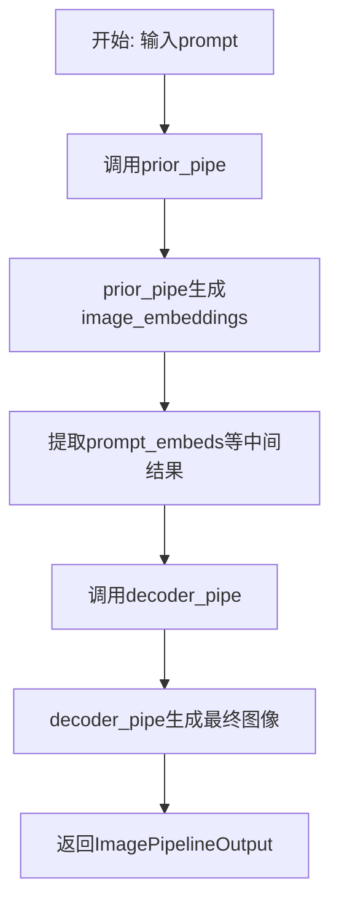
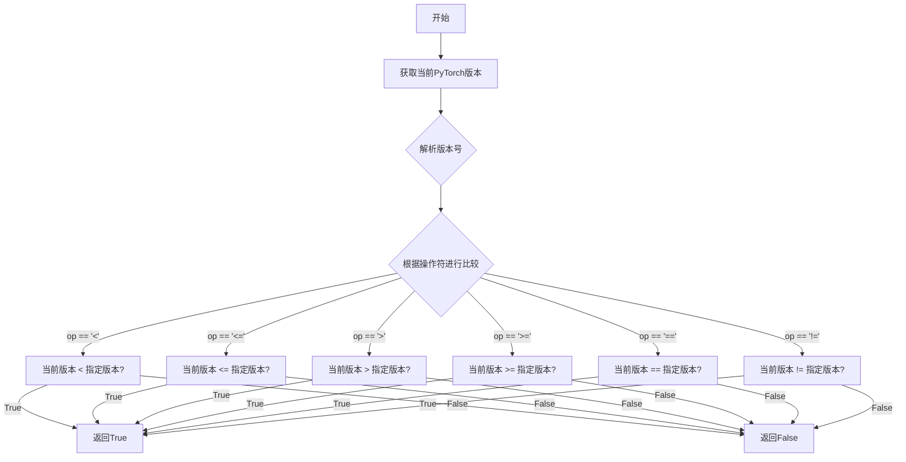
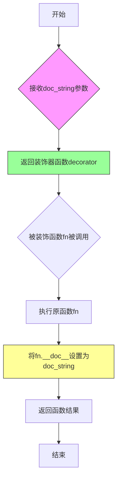
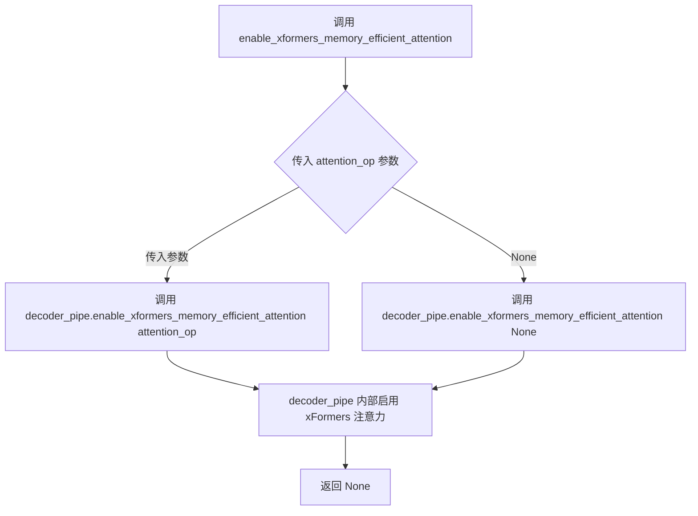
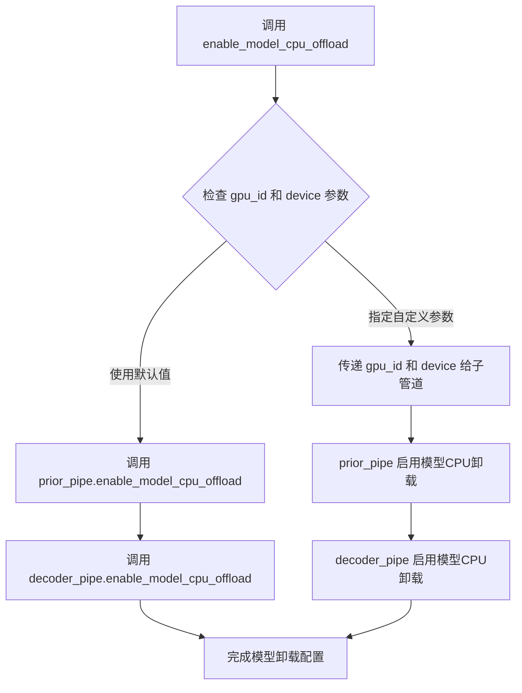
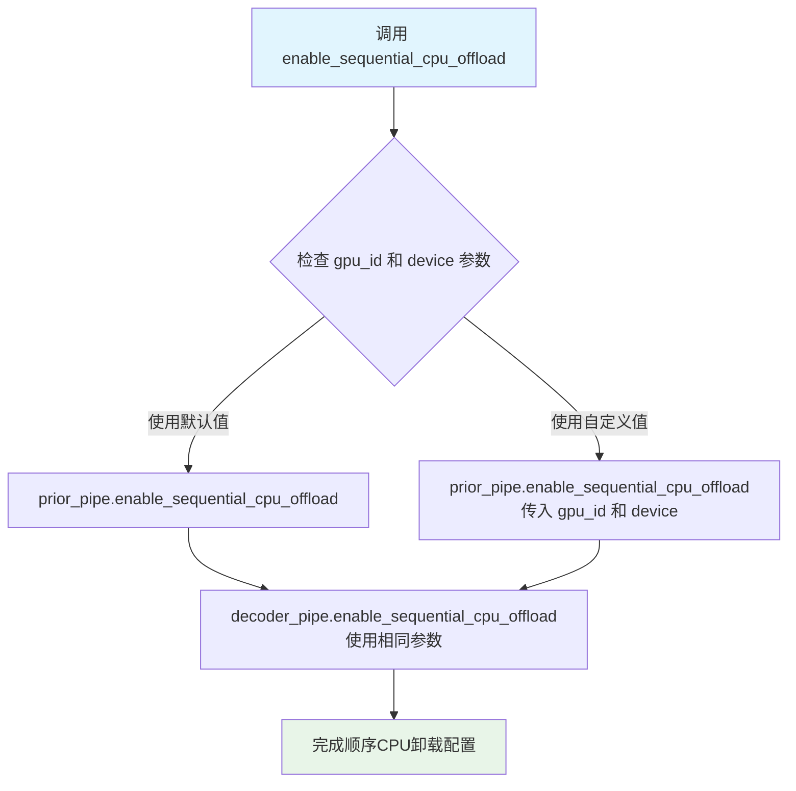
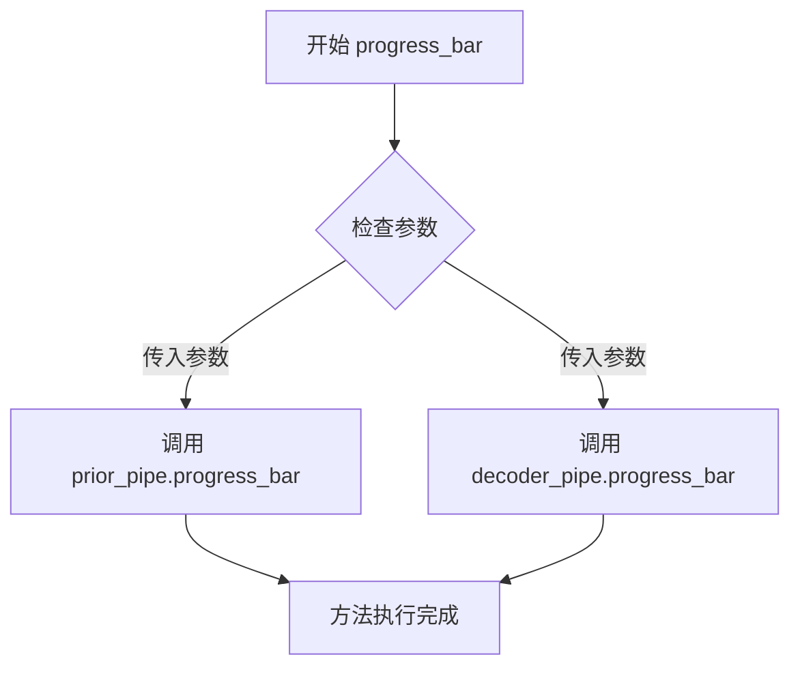
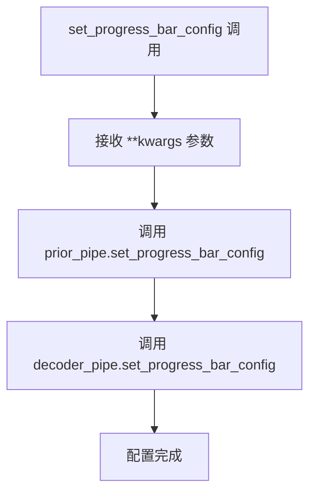
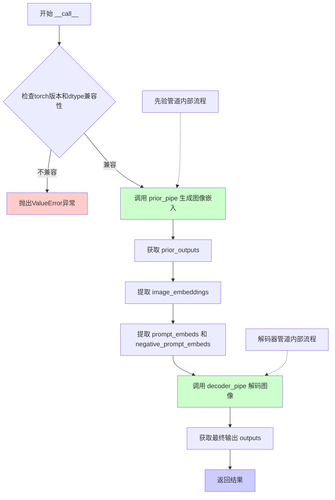

# `diffusers\src\diffusers\pipelines\stable_cascade\pipeline_stable_cascade_combined.py` 详细设计文档

Stable Cascade组合管道是一个用于文本到图像生成的两阶段扩散模型管道,结合了prior管道(从文本生成图像嵌入)和decoder管道(从图像嵌入生成最终图像),支持CPU卸载、xformers高效注意力等优化特性。

## 整体流程



## 类结构

```
DiffusionPipeline (基类)
├── DeprecatedPipelineMixin (混入类)
└── StableCascadeCombinedPipeline
    ├── StableCascadePriorPipeline (prior管道)
    └── StableCascadeDecoderPipeline (decoder管道)
```

## 全局变量及字段


### `TEXT2IMAGE_EXAMPLE_DOC_STRING`
    
用于文本到图像示例的文档字符串，包含使用代码示例

类型：`str`
    


### `StableCascadeCombinedPipeline.tokenizer`
    
解码器分词器，用于将文本输入转换为token

类型：`CLIPTokenizer`
    


### `StableCascadeCombinedPipeline.text_encoder`
    
解码器文本编码器，用于将token编码为文本嵌入

类型：`CLIPTextModelWithProjection`
    


### `StableCascadeCombinedPipeline.decoder`
    
解码器模型，用于从图像嵌入生成最终图像

类型：`StableCascadeUNet`
    


### `StableCascadeCombinedPipeline.scheduler`
    
解码器调度器，用于控制去噪过程的调度

类型：`DDPMWuerstchenScheduler`
    


### `StableCascadeCombinedPipeline.vqgan`
    
VQGAN模型，用于将潜在表示解码为图像

类型：`PaellaVQModel`
    


### `StableCascadeCombinedPipeline.prior_prior`
    
prior模型，用于生成图像嵌入

类型：`StableCascadeUNet`
    


### `StableCascadeCombinedPipeline.prior_text_encoder`
    
prior文本编码器，用于prior管道的文本编码

类型：`CLIPTextModelWithProjection`
    


### `StableCascadeCombinedPipeline.prior_tokenizer`
    
prior分词器，用于prior管道的文本分词

类型：`CLIPTokenizer`
    


### `StableCascadeCombinedPipeline.prior_scheduler`
    
prior调度器，用于控制prior管道的去噪调度

类型：`DDPMWuerstchenScheduler`
    


### `StableCascadeCombinedPipeline.prior_feature_extractor`
    
prior特征提取器，用于从图像中提取特征（可选）

类型：`CLIPImageProcessor | None`
    


### `StableCascadeCombinedPipeline.prior_image_encoder`
    
prior图像编码器，用于编码图像特征（可选）

类型：`CLIPVisionModelWithProjection | None`
    


### `StableCascadeCombinedPipeline.prior_pipe`
    
prior管道实例，负责生成图像嵌入

类型：`StableCascadePriorPipeline`
    


### `StableCascadeCombinedPipeline.decoder_pipe`
    
decoder管道实例，负责从嵌入生成最终图像

类型：`StableCascadeDecoderPipeline`
    


### `StableCascadeCombinedPipeline._last_supported_version`
    
最后支持的版本号，用于版本检查

类型：`str`
    


### `StableCascadeCombinedPipeline._load_connected_pipes`
    
标志位，指示是否加载连接的管道

类型：`bool`
    


### `StableCascadeCombinedPipeline._optional_components`
    
可选组件列表，包含可选的模块名称

类型：`list`
    
    

## 全局函数及方法


### `is_torch_version`

用于检查当前 PyTorch 版本是否满足指定条件，常用于版本兼容性检查和功能特性判断。

参数：

-  `op`：`str`，比较运算符，如 `"=="`, `"!="`, `"<"`, `"<="`, `">"`, `">="`
-  `version`：`str`，要比较的 PyTorch 版本号，如 `"2.2.0"`

返回值：`bool`，如果当前 PyTorch 版本满足指定条件返回 `True`，否则返回 `False`

#### 流程图



#### 带注释源码

```python
# is_torch_version 函数定义于 .../utils 模块中
# 此处展示的是在 StableCascadeCombinedPipeline 中的调用方式

# 从 utils 模块导入 is_torch_version 函数
from ...utils import is_torch_version, replace_example_docstring

# 在 __call__ 方法中使用 is_torch_version 检查 PyTorch 版本
dtype = self.decoder_pipe.decoder.dtype
if is_torch_version("<", "2.2.0") and dtype == torch.bfloat16:
    raise ValueError(
        "`StableCascadeCombinedPipeline` requires torch>=2.2.0 when using `torch.bfloat16` dtype."
    )

# 函数签名推断：
# def is_torch_version(op: str, version: str) -> bool:
#     """
#     检查当前 PyTorch 版本是否满足指定条件
#     
#     参数:
#         op: 比较运算符，支持 "==", "!=", "<", "<=", ">", ">="
#         version: 要比较的版本号字符串
#     
#     返回:
#         bool: 版本条件是否满足
#     """
```


### `replace_example_docstring`

一个工具函数，用于作为装饰器动态替换被装饰函数的文档字符串（docstring），通常用于在运行时将预定义的示例文档字符串注入到Pipeline的`__call__`方法中，以提供统一的使用示例。

参数：

- `doc_string`：`str`，要替换/注入的文档字符串，通常包含API使用示例

返回值：`Callable`，返回一个装饰器函数，用于装饰目标函数

#### 流程图



#### 带注释源码

```
# replace_example_docstring 是从 diffusers 库 utils 模块导入的外部函数
# 代码中未直接提供其实现，以下为基于使用方式的推断

from typing import Callable

# 导入来源: from ...utils import replace_example_docstring
# 这是一个装饰器工厂函数

def replace_example_docstring(doc_string: str) -> Callable:
    """
    创建一个装饰器，用于将示例文档字符串注入到被装饰函数的 __doc__ 属性中。
    
    Args:
        doc_string: 包含API使用示例的文档字符串
        
    Returns:
        返回一个装饰器函数
    """
    
    def decorator(fn: Callable) -> Callable:
        """
        实际的装饰器函数，替换被装饰函数的文档字符串。
        
        Args:
            fn: 被装饰的函数
            
        Returns:
            装饰后的函数
        """
        # 将预定义的示例文档字符串赋值给被装饰函数的 __doc__
        fn.__doc__ = doc_string
        return fn
    
    return decorator


# 使用方式示例（在 StableCascadeCombinedPipeline 中）:

# 1. 定义示例文档字符串
TEXT2IMAGE_EXAMPLE_DOC_STRING = """
    Examples:
        ```py
        >>> import torch
        >>> from diffusers import StableCascadeCombinedPipeline
        >>> pipe = StableCascadeCombinedPipeline.from_pretrained(
        ...     "stabilityai/stable-cascade", variant="bf16", torch_dtype=torch.bfloat16
        ... )
        >>> pipe.enable_model_cpu_offload()
        >>> prompt = "an image of a shiba inu, donning a spacesuit and helmet"
        >>> images = pipe(prompt=prompt)
        ```
"""

# 2. 作为装饰器使用
@replace_example_docstring(TEXT2IMAGE_EXAMPLE_DOC_STRING)
def __call__(self, prompt: str, ...):
    """
    原始函数的文档会被替换为 TEXT2IMAGE_EXAMPLE_DOC_STRING
    """
    # 函数实现...
    pass
```

---

#### 补充说明

| 项目 | 描述 |
|------|------|
| **来源** | `diffusers` 库的 `...utils` 模块 |
| **设计目标** | 动态为Pipeline的`__call__`方法注入使用示例，避免在每个方法中重复编写示例代码 |
| **依赖** | 需要 `typing` 模块的 `Callable` 类型 |
| **技术债务** | 由于源码未直接提供，无法确定其完整的错误处理逻辑和边界情况处理 |
| **优化建议** | 建议检查原始实现以确认是否支持动态参数、条件性注入等高级功能 |


### `StableCascadeCombinedPipeline.__init__`

该方法是 `StableCascadeCombinedPipeline` 类的构造函数，负责初始化组合管道所需的所有模型组件（分词器、文本编码器、UNet解码器、调度器、VQGAN、先验模型等），并实例化先验管道和解码器管道，以支持文本到图像的两阶段生成流程。

参数：

- `tokenizer`：`CLIPTokenizer`，用于文本输入的解码器分词器
- `text_encoder`：`CLIPTextModelWithProjection`，用于文本输入的解码器文本编码器
- `decoder`：`StableCascadeUNet`，用于解码器图像生成的UNet模型
- `scheduler`：`DDPMWuerstchenScheduler`，用于解码器图像生成的调度器
- `vqgan`：`PaellaVQModel`，用于解码器图像生成的VQGAN模型
- `prior_prior`：`StableCascadeUNet`，用于先验管道的先验模型
- `prior_text_encoder`：`CLIPTextModelWithProjection`，用于文本输入的先验文本编码器
- `prior_tokenizer`：`CLIPTokenizer`，用于文本输入的先验分词器
- `prior_scheduler`：`DDPMWuerstchenScheduler`，用于先验管道的调度器
- `prior_feature_extractor`：`CLIPImageProcessor | None`，可选，从生成图像中提取特征的模型
- `prior_image_encoder`：`CLIPVisionModelWithProjection | None`，可选，冻结的CLIP图像编码器

返回值：`None`，构造函数无返回值

#### 流程图

```mermaid
flowchart TD
    A[开始 __init__] --> B[调用 super().__init__ 初始化基类]
    B --> C[调用 self.register_modules 注册所有模块]
    C --> D[创建 StableCascadePriorPipeline 实例]
    D --> E[创建 StableCascadeDecoderPipeline 实例]
    E --> F[结束 __init__]
    
    C -.-> C1[注册 text_encoder, tokenizer, decoder, scheduler, vqgan]
    C -.-> C2[注册 prior_text_encoder, prior_tokenizer, prior_prior, prior_scheduler]
    C -.-> C3[注册 prior_feature_extractor, prior_image_encoder]
    
    D -.-> D1[传入 prior, text_encoder, tokenizer, scheduler]
    D -.-> D2[传入 image_encoder, feature_extractor]
    
    E -.-> E1[传入 text_encoder, tokenizer, decoder, scheduler, vqgan]
```

#### 带注释源码

```python
def __init__(
    self,
    tokenizer: CLIPTokenizer,                          # 解码器分词器，处理文本输入
    text_encoder: CLIPTextModelWithProjection,         # 解码器文本编码器，将文本转为embedding
    decoder: StableCascadeUNet,                        # UNet解码器模型，用于图像生成
    scheduler: DDPMWuerstchenScheduler,                # 解码器调度器，控制去噪过程
    vqgan: PaellaVQModel,                              # VQGAN模型，用于潜在空间解码
    prior_prior: StableCascadeUNet,                    # 先验UNet模型，用于生成图像embedding
    prior_text_encoder: CLIPTextModelWithProjection,   # 先验文本编码器
    prior_tokenizer: CLIPTokenizer,                    # 先验分词器
    prior_scheduler: DDPMWuerstchenScheduler,          # 先验调度器
    prior_feature_extractor: CLIPImageProcessor | None = None,  # 可选的图像特征提取器
    prior_image_encoder: CLIPVisionModelWithProjection | None = None,  # 可选的CLIP图像编码器
):
    # 调用父类 DeprecatedPipelineMixin 和 DiffusionPipeline 的初始化方法
    # 负责设置管道的基本配置和状态
    super().__init__()

    # 注册所有模块到管道中，使它们可以通过 self.xxx 访问
    # 这是DiffusionPipeline的标准模式，支持模块的懒加载和设备管理
    self.register_modules(
        text_encoder=text_encoder,
        tokenizer=tokenizer,
        decoder=decoder,
        scheduler=scheduler,
        vqgan=vqgan,
        prior_text_encoder=prior_text_encoder,
        prior_tokenizer=prior_tokenizer,
        prior_prior=prior_prior,
        prior_scheduler=prior_scheduler,
        prior_feature_extractor=prior_feature_extractor,
        prior_image_encoder=prior_image_encoder,
    )
    
    # 实例化先验管道，负责第一阶段：文本 -> 图像embedding
    # 包含先验模型、文本编码器、分词器、调度器、图像编码器和特征提取器
    self.prior_pipe = StableCascadePriorPipeline(
        prior=prior_prior,
        text_encoder=prior_text_encoder,
        tokenizer=prior_tokenizer,
        scheduler=prior_scheduler,
        image_encoder=prior_image_encoder,
        feature_extractor=prior_feature_extractor,
    )
    
    # 实例化解码器管道，负责第二阶段：图像embedding -> 最终图像
    # 包含解码器模型、文本编码器、分词器、调度器和VQGAN模型
    self.decoder_pipe = StableCascadeDecoderPipeline(
        text_encoder=text_encoder,
        tokenizer=tokenizer,
        decoder=decoder,
        scheduler=scheduler,
        vqgan=vqgan,
    )
```


### `StableCascadeCombinedPipeline.enable_xformers_memory_efficient_attention`

该方法用于在 StableCascadeCombinedPipeline 中启用 xFormers 内存高效注意力机制，通过将调用委托给内部的 decoder_pipe 来实现。

参数：

- `attention_op`：`Callable | None`，可选参数，指定注意力操作符。如果为 None，则使用默认的注意力实现。

返回值：`None`，无返回值，该方法仅执行副作用（启用内存高效注意力）。

#### 流程图



#### 带注释源码

```python
def enable_xformers_memory_efficient_attention(self, attention_op: Callable | None = None):
    """
    启用 xFormers 内存高效注意力机制。
    
    该方法是一个便捷方法，它将调用委托给内部的 decoder_pipe。
    xFormers 是一个用于加速 Transformer 模型的库，其内存高效注意力机制
    可以显著减少注意力计算时的显存占用。
    
    参数:
        attention_op: 可选的注意力操作符。如果为 None，则使用 xFormers
                     的默认注意力实现。该参数允许用户指定自定义的
                     注意力操作来替代默认实现。
    
    返回:
        None: 此方法不返回任何值，仅修改内部状态以启用内存高效注意力。
    
    注意:
        - 启用此功能需要安装 xFormers 库
        - 该方法仅影响 decoder_pipe，不影响 prior_pipe
        - 启用内存高效注意力后，显存占用会显著降低，但可能略微影响生成速度
    """
    # 将调用委托给 decoder_pipe 的相同方法
    # decoder_pipe 是 StableCascadeDecoderPipeline 的实例
    self.decoder_pipe.enable_xformers_memory_efficient_attention(attention_op)
```


### `StableCascadeCombinedPipeline.enable_model_cpu_offload`

启用模型CPU卸载功能，将组合管道中的所有模型（先验模型和解码器模型）卸载到CPU，以节省GPU显存。该方法采用加速库的模型卸载机制，在模型执行前将其加载到GPU，执行完成后保留在GPU直到下一个模型运行，相比顺序卸载具有更好的性能。

参数：

- `gpu_id`：`int | None`，GPU设备ID，指定将模型卸载到哪个GPU设备，默认为None
- `device`：`torch.device | str`，目标设备，可选cuda设备或字符串设备标识，默认为None

返回值：`None`，该方法无返回值，直接修改管道内部模型状态

#### 流程图



#### 带注释源码

```python
def enable_model_cpu_offload(self, gpu_id: int | None = None, device: torch.device | str = None):
    r"""
    Offloads all models to CPU using accelerate, reducing memory usage with a low impact on performance. Compared
    to `enable_sequential_cpu_offload`, this method moves one whole model at a time to the GPU when its `forward`
    method is called, and the model remains in GPU until the next model runs. Memory savings are lower than with
    `enable_sequential_cpu_offload`, but performance is much better due to the iterative execution of the `unet`.
    """
    # 调用先验管道的enable_model_cpu_offload方法
    # prior_pipe是StableCascadePriorPipeline实例，包含prior模型、text_encoder等
    self.prior_pipe.enable_model_cpu_offload(gpu_id=gpu_id, device=device)
    
    # 调用解码器管道的enable_model_cpu_offload方法
    # decoder_pipe是StableCascadeDecoderPipeline实例，包含decoder模型、vqgan等
    self.decoder_pipe.enable_model_cpu_offload(gpu_id=gpu_id, device=device)
```


### `StableCascadeCombinedPipeline.enable_sequential_cpu_offload`

该方法用于启用顺序CPU卸载功能，通过将所有模型（`prior_pipe` 和 `decoder_pipe`）卸载到CPU来显著降低显存占用。模型会被移动到 `torch.device('meta')` 设备，仅在特定子模块的 `forward` 方法被调用时才加载到GPU。这种方式相比 `enable_model_cpu_offload` 能节省更多内存，但性能会有所下降。

参数：

- `gpu_id`：`int | None`，GPU设备ID，默认为None
- `device`：`torch.device | str`，目标设备，默认为None

返回值：`None`，无返回值，该方法直接修改管道内部状态

#### 流程图



#### 带注释源码

```python
def enable_sequential_cpu_offload(self, gpu_id: int | None = None, device: torch.device | str = None):
    r"""
    Offloads all models (`unet`, `text_encoder`, `vae`, and `safety checker` state dicts) to CPU using 🤗
    Accelerate, significantly reducing memory usage. Models are moved to a `torch.device('meta')` and loaded on a
    GPU only when their specific submodule's `forward` method is called. Offloading happens on a submodule basis.
    Memory savings are higher than using `enable_model_cpu_offload`, but performance is lower.
    
    参数:
        gpu_id: GPU设备ID，指定将模型卸载到CPU后使用的GPU编号，默认为None表示自动选择
        device: 目标设备，可以是torch.device对象或字符串表示的设备，默认为None
    
    返回:
        None: 该方法直接修改管道内部状态，不返回任何值
    """
    # 将CPU卸载功能传递给prior_pipe（先验管道）
    # prior_pipe是StableCascadePriorPipeline实例，负责生成图像先验嵌入
    self.prior_pipe.enable_sequential_cpu_offload(gpu_id=gpu_id, device=device)
    
    # 将CPU卸载功能传递给decoder_pipe（解码器管道）
    # decoder_pipe是StableCascadeDecoderPipeline实例，负责将先验嵌入解码为最终图像
    self.decoder_pipe.enable_sequential_cpu_offload(gpu_id=gpu_id, device=device)
```


### StableCascadeCombinedPipeline.progress_bar

这是一个用于设置组合管道进度条的方法，它将进度条配置委托给先验管道（prior_pipe）和解码器管道（decoder_pipe），确保整个生成过程的进度条保持一致。

参数：

- `iterable`：可迭代对象（iterable），可选，用于包装进度条
- `total`：整数（int），可选，指定总迭代次数

返回值：无返回值（None），该方法直接修改内部管道的进度条配置

#### 流程图



#### 带注释源码

```python
def progress_bar(self, iterable=None, total=None):
    """
    设置组合管道的进度条。
    
    该方法将进度条配置委托给先验管道（prior_pipe）和解码器管道（decoder_pipe），
    以确保在整个两阶段生成过程中进度条能够正确显示。
    
    参数:
        iterable: 可迭代对象，用于包装进度条。如果为 None，则使用内部的迭代器。
        total: 整数，指定总迭代次数。如果未提供，将从 iterable 中推断。
    
    注意:
        - 该方法调用两个子管道的 progress_bar 方法
        - prior_pipe 负责第一阶段（先验/prior）的生成
        - decoder_pipe 负责第二阶段（解码器/decoder）的生成
    """
    # 将进度条配置传递给先验管道
    # prior_pipe 是 StableCascadePriorPipeline 实例，负责生成图像嵌入
    self.prior_pipe.progress_bar(iterable=iterable, total=total)
    
    # 将进度条配置传递给解码器管道
    # decoder_pipe 是 StableCascadeDecoderPipeline 实例，负责从嵌入生成最终图像
    self.decoder_pipe.progress_bar(iterable=iterable, total=total)
```


### `StableCascadeCombinedPipeline.set_progress_bar_config`

该方法用于配置组合管道中先验管道（prior_pipe）和解码器管道（decoder_pipe）的进度条显示参数，通过将关键字参数转发给两个子管道来实现统一的进度条配置。

参数：

- `**kwargs`：`Any`，可变关键字参数，用于传递给子管道的进度条配置选项（如 `desc`、`total`、`leave` 等）

返回值：`None`，该方法不返回任何值，仅执行配置操作

#### 流程图



#### 带注释源码

```python
def set_progress_bar_config(self, **kwargs):
    """
    设置组合管道中所有子管道的进度条配置。
    
    该方法将进度条配置参数同时传递给先验管道和解码器管道，
    以确保整个生成过程中进度条行为的一致性。
    
    Args:
        **kwargs: 关键字参数，将直接传递给子管道的 set_progress_bar_config 方法。
                  常见参数包括：
                  - desc: 进度条描述文本
                  - total: 进度条总数
                  - leave: 完成后是否保留进度条
                  - position: 多进度条位置
                  - ncols: 进度条宽度
    
    Returns:
        None: 此方法不返回任何值，仅修改内部状态
    """
    # 将配置参数传递给先验管道
    self.prior_pipe.set_progress_bar_config(**kwargs)
    # 将配置参数传递给解码器管道
    self.decoder_pipe.set_progress_bar_config(**kwargs)
```

#### 潜在优化空间

1. **返回值设计**：当前方法返回 `None`，可以考虑返回 `self` 以支持链式调用
2. **参数验证**：缺少对传入 `kwargs` 的验证，无法确保参数的有效性
3. **选择性配置**：可以添加参数选择是否同时配置两个子管道，提高灵活性


### StableCascadeCombinedPipeline.__call__

该方法是StableCascadeCombinedPipeline的主入口方法，用于执行文本到图像的完整生成流程。方法首先通过Prior管道根据文本提示生成图像嵌入，然后通过Decoder管道将图像嵌入解码为最终图像。整个流程整合了先验模型（prior）和解码器模型（decoder）的推理过程，实现了从文本到图像的两阶段生成。

参数：

- `prompt`：`str | list[str] | None`，用于引导图像生成的文本提示
- `images`：`torch.Tensor | PIL.Image.Image | list[torch.Tensor] | list[PIL.Image.Image] | None`，用于引导先验图像生成的图像
- `height`：`int`，生成图像的高度（默认512像素）
- `width`：`int`，生成图像的宽度（默认512像素）
- `prior_num_inference_steps`：`int`，先验去噪步骤数（默认60）
- `prior_guidance_scale`：`float`，先验引导比例（默认4.0）
- `num_inference_steps`：`int`，解码器去噪步骤数（默认12）
- `decoder_guidance_scale`：`float`，解码器引导比例（默认0.0）
- `negative_prompt`：`str | list[str] | None`，不参与引导的负面提示词
- `prompt_embeds`：`torch.Tensor | None`，预生成的文本嵌入（用于先验）
- `prompt_embeds_pooled`：`torch.Tensor | None`，预生成的汇总文本嵌入（用于先验）
- `negative_prompt_embeds`：`torch.Tensor | None`，预生成的负面文本嵌入（用于先验）
- `negative_prompt_embeds_pooled`：`torch.Tensor | None`，预生成的汇总负面文本嵌入（用于先验）
- `num_images_per_prompt`：`int`，每个提示生成的图像数量（默认1）
- `generator`：`torch.Generator | list[torch.Generator] | None`，用于生成确定性结果的随机数生成器
- `latents`：`torch.Tensor | None`，预生成的噪声潜在向量
- `output_type`：`str`，输出格式，可选"pil"、"np"或"pt"（默认"pil"）
- `return_dict`：`bool`，是否返回字典格式结果（默认True）
- `prior_callback_on_step_end`：`Callable | None`，先验管道每步结束时的回调函数
- `prior_callback_on_step_end_tensor_inputs`：`list[str]`，先验回调函数需要接收的张量输入列表
- `callback_on_step_end`：`Callable | None`，解码器管道每步结束时的回调函数
- `callback_on_step_end_tensor_inputs`：`list[str]`，解码器回调函数需要接收的张量输入列表

返回值：`ImagePipelineOutput | tuple`，生成的图像管道输出或包含图像列表的元组

#### 流程图



#### 带注释源码

```python
@torch.no_grad()
@replace_example_docstring(TEXT2IMAGE_EXAMPLE_DOC_STRING)
def __call__(
    self,
    prompt: str | list[str] | None = None,
    images: torch.Tensor | PIL.Image.Image | list[torch.Tensor] | list[PIL.Image.Image] = None,
    height: int = 512,
    width: int = 512,
    prior_num_inference_steps: int = 60,
    prior_guidance_scale: float = 4.0,
    num_inference_steps: int = 12,
    decoder_guidance_scale: float = 0.0,
    negative_prompt: str | list[str] | None = None,
    prompt_embeds: torch.Tensor | None = None,
    prompt_embeds_pooled: torch.Tensor | None = None,
    negative_prompt_embeds: torch.Tensor | None = None,
    negative_prompt_embeds_pooled: torch.Tensor | None = None,
    num_images_per_prompt: int = 1,
    generator: torch.Generator | list[torch.Generator] | None = None,
    latents: torch.Tensor | None = None,
    output_type: str | None = "pil",
    return_dict: bool = True,
    prior_callback_on_step_end: Callable[[int, int], None] | None = None,
    prior_callback_on_step_end_tensor_inputs: list[str] = ["latents"],
    callback_on_step_end: Callable[[int, int], None] | None = None,
    callback_on_step_end_tensor_inputs: list[str] = ["latents"],
):
    """
    Function invoked when calling the pipeline for generation.

    Args:
        prompt (`str` or `list[str]`):
            The prompt or prompts to guide the image generation for the prior and decoder.
        images (`torch.Tensor`, `PIL.Image.Image`, `list[torch.Tensor]`, `list[PIL.Image.Image]`, *optional*):
            The images to guide the image generation for the prior.
        negative_prompt (`str` or `list[str]`, *optional*):
            The prompt or prompts not to guide the image generation. Ignored when not using guidance (i.e., ignored
            if `guidance_scale` is less than `1`).
        prompt_embeds (`torch.Tensor`, *optional*):
            Pre-generated text embeddings for the prior. Can be used to easily tweak text inputs, *e.g.* prompt
            weighting. If not provided, text embeddings will be generated from `prompt` input argument.
        prompt_embeds_pooled (`torch.Tensor`, *optional*):
            Pre-generated text embeddings for the prior. Can be used to easily tweak text inputs, *e.g.* prompt
            weighting. If not provided, text embeddings will be generated from `prompt` input argument.
        negative_prompt_embeds (`torch.Tensor`, *optional*):
            Pre-generated negative text embeddings for the prior. Can be used to easily tweak text inputs, *e.g.*
            prompt weighting. If not provided, negative_prompt_embeds will be generated from `negative_prompt`
            input argument.
        negative_prompt_embeds_pooled (`torch.Tensor`, *optional*):
            Pre-generated negative text embeddings for the prior. Can be used to easily tweak text inputs, *e.g.*
            prompt weighting. If not provided, negative_prompt_embeds will be generated from `negative_prompt`
            input argument.
        num_images_per_prompt (`int`, *optional*, defaults to 1):
            The number of images to generate per prompt.
        height (`int`, *optional*, defaults to 512):
            The height in pixels of the generated image.
        width (`int`, *optional*, defaults to 512):
            The width in pixels of the generated image.
        prior_guidance_scale (`float`, *optional*, defaults to 4.0):
            Guidance scale as defined in [Classifier-Free Diffusion
            Guidance](https://huggingface.co/papers/2207.12598). `prior_guidance_scale` is defined as `w` of
            equation 2. of [Imagen Paper](https://huggingface.co/papers/2205.11487). Guidance scale is enabled by
            setting `prior_guidance_scale > 1`. Higher guidance scale encourages to generate images that are
            closely linked to the text `prompt`, usually at the expense of lower image quality.
        prior_num_inference_steps (`int | dict[float, int]`, *optional*, defaults to 60):
            The number of prior denoising steps. More denoising steps usually lead to a higher quality image at the
            expense of slower inference. For more specific timestep spacing, you can pass customized
            `prior_timesteps`
        num_inference_steps (`int`, *optional*, defaults to 12):
            The number of decoder denoising steps. More denoising steps usually lead to a higher quality image at
            the expense of slower inference. For more specific timestep spacing, you can pass customized
            `timesteps`
        decoder_guidance_scale (`float`, *optional*, defaults to 0.0):
            Guidance scale as defined in [Classifier-Free Diffusion
            Guidance](https://huggingface.co/papers/2207.12598). `guidance_scale` is defined as `w` of equation 2.
            of [Imagen Paper](https://huggingface.co/papers/2205.11487). Guidance scale is enabled by setting
            `guidance_scale > 1`. Higher guidance scale encourages to generate images that are closely linked to
            the text `prompt`, usually at the expense of lower image quality.
        generator (`torch.Generator` or `list[torch.Generator]`, *optional*):
            One or a list of [torch generator(s)](https://pytorch.org/docs/stable/generated/torch.Generator.html)
            to make generation deterministic.
        latents (`torch.Tensor`, *optional*):
            Pre-generated noisy latents, sampled from a Gaussian distribution, to be used as inputs for image
            generation. Can be used to tweak the same generation with different prompts. If not provided, a latents
            tensor will be generated by sampling using the supplied random `generator`.
        output_type (`str`, *optional*, defaults to `"pil"`):
            The output format of the generate image. Choose between `"pil"` (`PIL.Image.Image`), `"np"`
            (`np.array`) or `"pt"` (`torch.Tensor`).
        return_dict (`bool`, *optional*, defaults to `True`):
            Whether or not to return a [`~pipelines.ImagePipelineOutput`] instead of a plain tuple.
        prior_callback_on_step_end (`Callable`, *optional*):
            A function that calls at the end of each denoising steps during the inference. The function is called
            with the following arguments: `prior_callback_on_step_end(self: DiffusionPipeline, step: int, timestep:
            int, callback_kwargs: Dict)`.
        prior_callback_on_step_end_tensor_inputs (`list`, *optional*):
            The list of tensor inputs for the `prior_callback_on_step_end` function. The tensors specified in the
            list will be passed as `callback_kwargs` argument. You will only be able to include variables listed in
            the `._callback_tensor_inputs` attribute of your pipeline class.
        callback_on_step_end (`Callable`, *optional*):
            A function that calls at the end of each denoising steps during the inference. The function is called
            with the following arguments: `callback_on_step_end(self: DiffusionPipeline, step: int, timestep: int,
            callback_kwargs: Dict)`. `callback_kwargs` will include a list of all tensors as specified by
            `callback_on_step_end_tensor_inputs`.
        callback_on_step_end_tensor_inputs (`list`, *optional*):
            The list of tensor inputs for the `callback_on_step_end` function. The tensors specified in the list
            will be passed as `callback_kwargs` argument. You will only be able to include variables listed in the
            `._callback_tensor_inputs` attribute of your pipeline class.

    Examples:

    Returns:
        [`~pipelines.ImagePipelineOutput`] or `tuple` [`~pipelines.ImagePipelineOutput`] if `return_dict` is True,
        otherwise a `tuple`. When returning a tuple, the first element is a list with the generated images.
    """
    # 从解码器管道获取dtype，用于版本兼容性检查
    dtype = self.decoder_pipe.decoder.dtype
    
    # 检查torch版本是否支持bfloat16（需要torch>=2.2.0）
    if is_torch_version("<", "2.2.0") and dtype == torch.bfloat16:
        raise ValueError(
            "`StableCascadeCombinedPipeline` requires torch>=2.2.0 when using `torch.bfloat16` dtype."
        )

    # ============ 阶段1: 先验管道（Prior Pipeline）============
    # 调用先验管道生成图像嵌入向量
    prior_outputs = self.prior_pipe(
        prompt=prompt if prompt_embeds is None else None,  # 如果没有预生成嵌入，则使用原始prompt
        images=images,
        height=height,
        width=width,
        num_inference_steps=prior_num_inference_steps,
        guidance_scale=prior_guidance_scale,
        negative_prompt=negative_prompt if negative_prompt_embeds is None else None,
        prompt_embeds=prompt_embeds,
        prompt_embeds_pooled=prompt_embeds_pooled,
        negative_prompt_embeds=negative_prompt_embeds,
        negative_prompt_embeds_pooled=negative_prompt_embeds_pooled,
        num_images_per_prompt=num_images_per_prompt,
        generator=generator,
        latents=latents,
        output_type="pt",  # 强制输出为pytorch tensor格式供decoder使用
        return_dict=True,
        callback_on_step_end=prior_callback_on_step_end,
        callback_on_step_end_tensor_inputs=prior_callback_on_step_end_tensor_inputs,
    )
    
    # 从先验输出中提取图像嵌入向量
    image_embeddings = prior_outputs.image_embeddings
    
    # 提取并传递文本嵌入向量给解码器管道
    prompt_embeds = prior_outputs.get("prompt_embeds", None)
    prompt_embeds_pooled = prior_outputs.get("prompt_embeds_pooled", None)
    negative_prompt_embeds = prior_outputs.get("negative_prompt_embeds", None)
    negative_prompt_embeds_pooled = prior_outputs.get("negative_prompt_embeds_pooled", None)

    # ============ 阶段2: 解码器管道（Decoder Pipeline）============
    # 调用解码器管道将图像嵌入解码为最终图像
    outputs = self.decoder_pipe(
        image_embeddings=image_embeddings,  # 传入先验生成的嵌入向量
        prompt=prompt if prompt_embeds is None else None,
        num_inference_steps=num_inference_steps,
        guidance_scale=decoder_guidance_scale,
        negative_prompt=negative_prompt if negative_prompt_embeds is None else None,
        prompt_embeds=prompt_embeds,
        prompt_embeds_pooled=prompt_embeds_pooled,
        negative_prompt_embeds=negative_prompt_embeds,
        negative_prompt_embeds_pooled=negative_prompt_embeds_pooled,
        generator=generator,
        output_type=output_type,  # 用户指定的输出格式
        return_dict=return_dict,
        callback_on_step_end=callback_on_step_end,
        callback_on_step_end_tensor_inputs=callback_on_step_end_tensor_inputs,
    )

    # 返回最终生成的图像输出
    return outputs
```

## 关键组件


### StableCascadeCombinedPipeline

组合管道，用于通过先验（Prior）和解码器（Decoder）两个阶段实现文本到图像生成。首先通过先验管道将文本提示转换为图像嵌入，然后通过解码器管道将嵌入解码为最终图像。

### 张量索引与惰性加载

通过prior_pipe和decoder_pipe两个子管道实现阶段式生成，图像嵌入在管道间传递而不一次性加载所有模型到GPU，实现计算资源的惰性加载。

### 反量化支持

使用PaellaVQModel（VQGAN）将解码器输出的潜在表示反量化为最终图像像素，实现从离散潜在空间到图像空间的转换。

### 量化策略

支持多种dtype（特别是torch.bfloat16），通过检查torch版本（>=2.2.0）确保量化类型的兼容性，并提供enable_xformers_memory_efficient_attention进行内存优化。

### StableCascadePriorPipeline

先验管道，负责根据文本提示和可选图像生成图像嵌入向量，作为解码器管道的输入条件。

### StableCascadeDecoderPipeline

解码器管道，接收先验生成的图像嵌入，结合文本提示信息，通过去噪过程生成最终图像。

### DDPMWuerstchenScheduler

调度器，管理去噪过程中的时间步和噪声调度，控制生成过程的迭代节奏。

### CLIPTextModelWithProjection

文本编码器，将文本提示转换为高维嵌入向量，提供池化和非池化版本供不同阶段使用。

### PaellaVQModel

VQGAN变分量化模型，负责将离散潜在表示解码为图像像素，实现高效的图像重建。

### enable_xformers_memory_efficient_attention

内存高效注意力机制，通过xFormers库实现注意力计算的内存优化，减少大模型推理的显存占用。

### enable_model_cpu_offload

模型CPU卸载功能，按需将模型从GPU加载到CPU执行，再移回GPU，支持低显存环境下的推理。

### enable_sequential_cpu_offload

顺序CPU卸载，按子模块粒度将模型卸载到CPU，最大化内存节省但降低执行速度。

### callback_on_step_end

推理回调机制，允许在每个去噪步骤结束后执行自定义函数，实现生成过程的监控和干预。

### StableCascadeUNet

UNet神经网络架构，用于先验和解码器管道中的去噪过程，学习从噪声预测目标信号。


## 问题及建议


### 已知问题

- **参数冗余与不一致传递**: `__call__` 方法中使用复杂的条件表达式（如 `prompt=prompt if prompt_embeds is None else None`）将参数传递给子管道，这种写法容易造成混淆且难以维护
- **xformers 优化仅作用于 decoder**: `enable_xformers_memory_efficient_attention` 方法只启用了 decoder_pipe 的内存优化，prior_pipe 未应用相同优化，可能导致整体内存效率不一致
- **缺少参数互斥验证**: 当同时提供 `prompt` 和 `prompt_embeds`（或 `negative_prompt` 和 `negative_prompt_embeds`）时，代码仅隐式忽略 prompt 而使用 embeds，缺乏明确的警告或错误提示
- **latents 参数处理不完整**: 传入的 `latents` 仅传递给 prior_pipe 使用，但未在两阶段之间建立正确的潜在向量传递机制，可能导致用户期望的可复现性落空
- **可选组件缺少运行时检查**: `prior_feature_extractor` 和 `prior_image_encoder` 作为可选组件注册，但在需要图像条件生成时缺乏运行时可用性检查
- **版本硬编码**: `_last_supported_version = "0.35.2"` 硬编码在类中，版本更新时需要手动同步
- **调度器配置不透明**: 传递给 prior_pipe 和 decoder_pipe 的调度器完全由外部控制，内部无法保证配置的一致性或自动调整

### 优化建议

- **重构参数传递逻辑**: 提取参数预处理逻辑到独立方法，使用显式的参数验证和警告机制替代隐式的条件表达式
- **统一内存优化接口**: 在 combined pipeline 层面实现统一的 xformers 和 CPU offload 调用，同时作用于 prior_pipe 和 decoder_pipe
- **增强参数验证**: 在 `__call__` 方法开头添加参数互斥检查，提供清晰的错误信息或警告
- **完善 latents 流程**: 考虑支持从 decoder 阶段返回中间 latents，或在文档中明确说明当前实现的行为限制
- **添加运行时组件检查**: 在需要图像编码功能时，检查 `prior_image_encoder` 和 `prior_feature_extractor` 是否可用，必要时抛出友好提示
- **版本动态管理**: 考虑从包版本或配置文件动态读取支持的版本号，减少维护负担
- **调度器验证**: 添加调度器类型兼容性检查，确保两个子管道使用的调度器符合各自算法的要求

## 其它


### 设计目标与约束

本Pipeline的设计目标是整合StableCascade的先验模型（Prior）和解码器模型（Decoder），实现高效的文本到图像生成能力。核心约束包括：1) 需要PyTorch 2.2.0以上版本才能使用bfloat16数据类型；2) 依赖HuggingFace Transformers库提供的CLIP模型进行文本编码；3) 采用两阶段生成流程（先验生成图像嵌入+解码器从嵌入生成最终图像）；4) 支持CPU offload以适应显存受限的环境。

### 错误处理与异常设计

代码中包含以下错误处理机制：1) 在__call__方法中检查PyTorch版本，当使用bfloat16且版本低于2.2.0时抛出ValueError；2) 通过DeprecatedPipelineMixin提供版本兼容性警告；3) 所有模型组件通过register_modules注册，支持运行时检查；4) 参数验证（如height、width、num_inference_steps等）由子Pipeline负责。潜在改进：增加对无效prompt的空值检查、图像尺寸限制验证、generator设备兼容性检查。

### 数据流与状态机

整体数据流为：1) 用户输入prompt → 2) prior_pipe处理生成image_embeddings → 3) decoder_pipe接收image_embeddings和prompt → 4) 生成最终图像输出。状态管理方面：Pipeline本身无持久状态，但通过scheduler管理去噪过程的噪声调度，callback机制支持在每个推理步骤后执行自定义操作。latents在prior和decoder之间传递，可通过参数注入或自动生成。

### 外部依赖与接口契约

主要外部依赖包括：1) transformers库提供CLIPTokenizer、CLIPTextModelWithProjection、CLIPVisionModelWithProjection；2) diffusers库提供DiffusionPipeline基类、DDPMWuerstchenScheduler；3) PIL用于图像处理；4) torch用于张量运算。接口契约：__call__方法接受多种输入形式（str/list/None），支持预计算的prompt_embeds，输出支持pil/numpy/tensor三种格式，return_dict控制返回结构。

### 性能考虑与优化空间

性能优化机制：1) enable_xformers_memory_efficient_attention启用xFormers内存高效注意力；2) enable_model_cpu_offload实现模型级CPU卸载；3) enable_sequential_cpu_offload实现细粒度顺序卸载。优化空间：1) 可添加FP16混合精度支持；2) 可实现推理过程中的批处理优化；3) 可添加ONNX导出支持；4) 可考虑添加实时预览功能（类似Stability AI的实时反馈）。

### 安全性考虑

代码中未包含显式的安全过滤器（如NSFW检测），但通过可选组件prior_feature_extractor和prior_image_encoder可扩展安全检查。设计考量：1) 依赖上游模型的生成安全性；2) 可通过社区的SafetyChecker扩展；3) 建议在生产环境中集成内容过滤服务。

### 版本兼容性

_last_supported_version = "0.35.2"标记了最后支持的版本。兼容性检查：1) PyTorch版本要求（2.2.0+ for bfloat16）；2) 通过_load_connected_pipes支持连接管道的版本加载；3) _optional_components定义了可选组件以支持渐进式升级。

### 配置参数详细说明

关键配置参数：1) prior_num_inference_steps默认60步，decoder默认12步；2) prior_guidance_scale默认4.0，decoder默认0.0（decoder阶段通常无需guidance）；3) height/width默认512x512；4) num_images_per_prompt控制单次生成数量；5) output_type支持"pil"/"np"/"pt"三种格式；6) 支持通过callback机制进行推理过程监控。

### 使用示例与最佳实践

典型使用流程：1) 通过from_pretrained加载模型（建议使用variant="bf16"）；2) 调用enable_model_cpu_offload节省显存；3) 调用pipeline时传入prompt；4) 图像自动返回为PIL.Image对象。最佳实践：1) 大批量生成时使用generator保证可复现性；2) 显存受限时优先使用enable_model_cpu_offload；3) 调整prior_num_inference_steps可平衡质量与速度。

### 测试策略建议

单元测试应覆盖：1) 各类参数的边界条件验证；2) 不同output_type的输出格式验证；3) callback机制的触发验证；4) CPU offload的设备状态验证。集成测试应覆盖：1) 完整pipeline的端到端生成；2) 与不同CLIP模型的兼容性；3) 内存使用量基准测试。

### 部署注意事项

生产部署建议：1) 使用FP16或BF16精度加速推理；2) 配置适当的batch_size避免OOM；3) 考虑使用DeepSpeed ZeRO进行多卡部署；4) 监控GPU显存使用并动态调整offload策略；5) 设置合理的超时机制处理长时间推理；6) 实现优雅降级策略应对模型加载失败。


    