# `diffusers\src\diffusers\pipelines\stable_cascade\pipeline_stable_cascade_prior.py` 详细设计文档

StableCascadePriorPipeline是一个用于生成图像先验嵌入（image prior embeddings）的扩散管道。它结合了文本编码器、图像编码器和UNet模型，通过去噪过程生成与文本提示和可选图像输入相关联的高质量图像嵌入向量。该管道支持分类器自由引导（CFG）、批量生成、潜在变量管理等功能，是Stable Cascade图像生成系统的核心组件。

## 整体流程

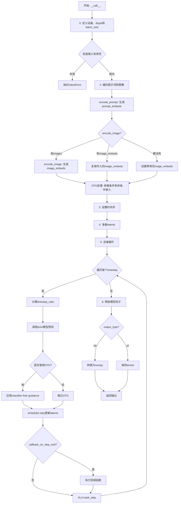

## 类结构

```
BaseOutput (抽象基类)
└── StableCascadePriorPipelineOutput (数据类)

DeprecatedPipelineMixin (混入类)
DiffusionPipeline (基类)
└── StableCascadePriorPipeline (主类)
```

## 全局变量及字段


### `XLA_AVAILABLE`
    
是否可用XLA加速

类型：`bool`
    


### `logger`
    
日志记录器

类型：`logging.Logger`
    


### `DEFAULT_STAGE_C_TIMESTEPS`
    
默认阶段C时间步

类型：`list`
    


### `EXAMPLE_DOC_STRING`
    
示例文档字符串

类型：`str`
    


### `StableCascadePriorPipelineOutput.image_embeddings`
    
生成的图像先验嵌入

类型：`torch.Tensor | np.ndarray`
    


### `StableCascadePriorPipelineOutput.prompt_embeds`
    
文本嵌入

类型：`torch.Tensor | np.ndarray`
    


### `StableCascadePriorPipelineOutput.prompt_embeds_pooled`
    
池化文本嵌入

类型：`torch.Tensor | np.ndarray`
    


### `StableCascadePriorPipelineOutput.negative_prompt_embeds`
    
负向提示词嵌入

类型：`torch.Tensor | np.ndarray`
    


### `StableCascadePriorPipelineOutput.negative_prompt_embeds_pooled`
    
负向池化嵌入

类型：`torch.Tensor | np.ndarray`
    


### `StableCascadePriorPipeline.unet_name`
    
UNet组件名称

类型：`str`
    


### `StableCascadePriorPipeline.text_encoder_name`
    
文本编码器名称

类型：`str`
    


### `StableCascadePriorPipeline.model_cpu_offload_seq`
    
CPU卸载顺序

类型：`str`
    


### `StableCascadePriorPipeline._optional_components`
    
可选组件列表

类型：`list`
    


### `StableCascadePriorPipeline._callback_tensor_inputs`
    
回调张量输入列表

类型：`list`
    


### `StableCascadePriorPipeline._last_supported_version`
    
最后支持的版本

类型：`str`
    


### `StableCascadePriorPipeline._guidance_scale`
    
引导尺度(运行时)

类型：`float`
    


### `StableCascadePriorPipeline._num_timesteps`
    
时间步数(运行时)

类型：`int`
    
    

## 全局函数及方法


### randn_tensor

生成符合标准正态分布（均值0，方差1）的随机张量，用于扩散模型的潜在变量初始化或噪声添加。

参数：

-  `shape`：`tuple` 或 `int`，输出张量的形状
-  `generator`：`torch.Generator` 或 `list[torch.Generator]`，可选，用于控制随机数生成的确定性
-  `device`：`torch.device`，生成张量所在的设备
-  `dtype`：`torch.dtype`，生成张量的数据类型（如 `torch.float32`、`torch.bfloat16`）

返回值：`torch.Tensor`，符合标准正态分布的随机张量

#### 流程图

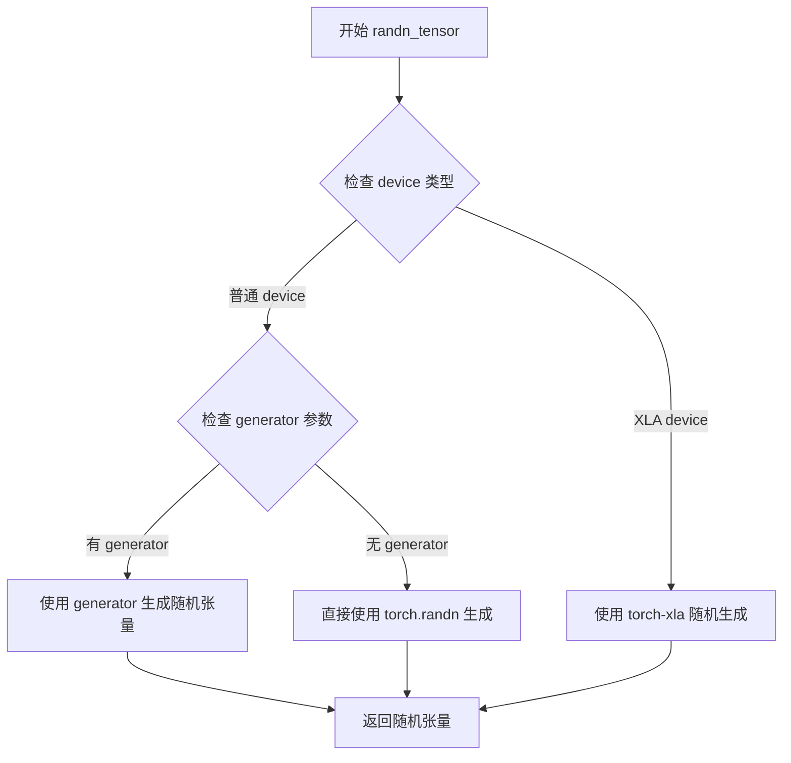

#### 带注释源码

```python
# 在 torch_utils 模块中的调用示例（来自 prepare_latents 方法）
# 完整源码需要参考 ...utils.torch_utils 模块

# 使用示例：
latent_shape = (
    num_images_per_prompt * batch_size,
    self.prior.config.in_channels,
    ceil(height / self.config.resolution_multiple),
    ceil(width / self.config.resolution_multiple),
)

# 生成随机潜在变量
latents = randn_tensor(
    latent_shape,      # 张量形状元组
    generator=generator,  # 随机数生成器（可选）
    device=device,         # 目标设备
    dtype=dtype           # 数据类型
)

# 补充：完整 randn_tensor 函数签名参考（基于 transformers 库）
def randn_tensor(
    shape: Union[Tuple, List[int]],
    generator: Optional[Union[List["torch.Generator"], "torch.Generator"]] = None,
    device: "torch.device" = None,
    dtype: "torch.dtype" = None,
    layout: "torch.layout" = None,
) -> "torch.Tensor":
    """
    生成符合标准正态分布的随机张量。
    
    Args:
        shape: 输出张量的形状
        generator: 可选的随机数生成器，用于确保可重复性
        device: 目标设备（CPU/CUDA/XLA）
        dtype: 张量数据类型
        layout: 张量布局
    
    Returns:
        随机张量
    """
    # 函数实现会根据设备类型选择最优的随机数生成方式
    # 对于 XLA 设备使用特定的随机生成方法
    # 对于普通设备使用 torch.randn 或自定义 generator
```


### `CLIPTokenizer.__call__`（外部导入 - 分词器）

该函数是 HuggingFace transformers 库中的 CLIPTokenizer 类的实例方法，用于将文本输入编码为模型可处理的 token IDs 和注意力掩码。在 `StableCascadePriorPipeline` 中被用于将提示词和负向提示词转换为文本嵌入所需的输入格式。

参数：

- `text`：`str | list[str] | None`，要分词的文本或文本列表
- `padding`：`str`，填充方式（"max_length"、"longest"、"do_not_pad" 等）
- `padding_max_length`：`int | None`，填充到的最大长度
- `truncation`：`bool`，是否在超过最大长度时截断
- `max_length`：`int | None`，最大序列长度
- `return_tensors`：`str | None`，返回的张量类型（"pt"、"np"、"tf"）
- `return_token_type_ids`：`bool | None`，是否返回 token 类型 IDs
- `return_attention_mask`：`bool | None`，是否返回注意力掩码
- `return_overflowing_tokens`：`bool | None`，是否返回溢出的 tokens
- `return_special_tokens_mask`：`bool | None`，是否返回特殊 tokens 掩码
- `return_offsets_mapping`：`bool | None`，是否返回偏移映射
- `return_length`：`bool | None`，是否返回序列长度
- `verbose`：`bool | None`，是否输出详细信息

返回值：`BatchEncoding`，包含以下字段的字典对象：
- `input_ids`：`torch.Tensor` 或 `np.ndarray`，token IDs 张量
- `attention_mask`：`torch.Tensor` 或 `np.ndarray`，注意力掩码张量
- 其它可选字段（根据参数设置）

#### 流程图

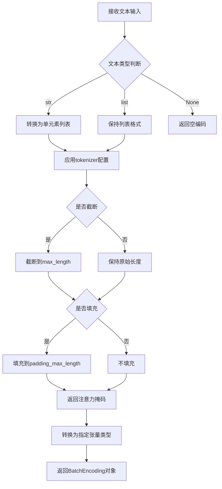

#### 带注释源码

```python
# CLIPTokenizer.__call__ 方法在 transformers 库中的实现逻辑
# 以下是 StableCascadePriorPipeline 中实际调用的示例代码

# 调用示例 1: 带最大长度限制的标准编码
text_inputs = self.tokenizer(
    prompt,                              # 文本输入: str 或 list[str]
    padding="max_length",               # 填充到最大长度
    max_length=self.tokenizer.model_max_length,  # 使用模型最大长度 (77 for CLIP)
    truncation=True,                     # 超过长度则截断
    return_tensors="pt"                 # 返回 PyTorch 张量
)
# 返回 BatchEncoding 对象
# text_inputs.input_ids      -> torch.Tensor [batch_size, 77]
# text_inputs.attention_mask -> torch.Tensor [batch_size, 77]

# 调用示例 2: 不截断的最长填充（用于检测截断）
untruncated_ids = self.tokenizer(
    prompt, 
    padding="longest", 
    return_tensors="pt"
).input_ids

# 调用示例 3: 批量解码被截断的部分
removed_text = self.tokenizer.batch_decode(
    untruncated_ids[:, self.tokenizer.model_max_length - 1 : -1]
)

# 调用示例 4: 负向提示词的编码
uncond_input = self.tokenizer(
    uncond_tokens,                      # 负向提示词列表
    padding="max_length",
    max_length=self.tokenizer.model_max_length,
    truncation=True,
    return_tensors="pt"
)
# uncond_input.input_ids      -> torch.Tensor [batch_size, 77]
# uncond_input.attention_mask -> torch.Tensor [batch_size, 77]
```


### `CLIPTextModelWithProjection` (外部导入 - 文本编码器)

这是一个从 HuggingFace `transformers` 库导入的预训练文本编码器模型，专门用于将文本输入转换为高维向量表示（embeddings），支持投影层输出，在 Stable Cascade 管道中用于生成文本提示的嵌入向量，以便引导图像生成过程。

#### 参数：

- `input_ids`：`torch.Tensor`，文本分词后的输入 IDs，形状为 `(batch_size, sequence_length)`
- `attention_mask`：`torch.Tensor`，注意力掩码，指示哪些位置是有效 token
- `output_hidden_states`：`bool`，可选参数，是否返回所有隐藏状态

返回值：

- `text_encoder_output.hidden_states[-1]`：`torch.Tensor`，最后一层隐藏状态，形状为 `(batch_size, sequence_length, hidden_dim)`
- `text_encoder_output.text_embeds`：`torch.Tensor`，池化后的文本嵌入，形状为 `(batch_size, hidden_dim)`

#### 流程图

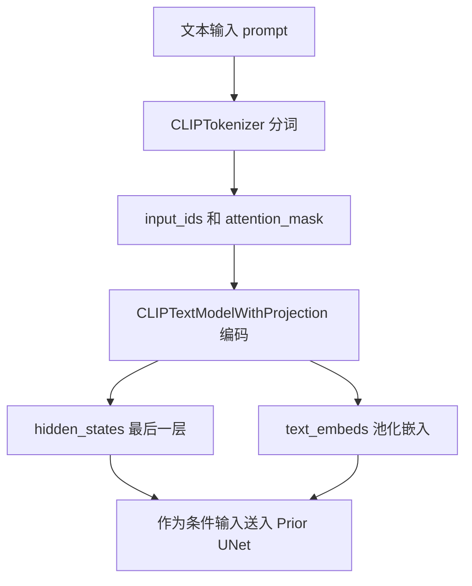

#### 带注释源码

```python
# CLIPTextModelWithProjection 在 StableCascadePriorPipeline 中的使用

# 1. 在 __init__ 中作为 text_encoder 注册
def __init__(
    self,
    tokenizer: CLIPTokenizer,
    text_encoder: CLIPTextModelWithProjection,  # 外部导入的 CLIP 文本编码器
    prior: StableCascadeUNet,
    scheduler: DDPMWuerstchenScheduler,
    ...
):
    self.register_modules(
        tokenizer=tokenizer,
        text_encoder=text_encoder,  # 注册文本编码器实例
        ...
    )

# 2. 在 encode_prompt 方法中调用文本编码器
def encode_prompt(self, ...):
    # 文本分词
    text_inputs = self.tokenizer(
        prompt,
        padding="max_length",
        max_length=self.tokenizer.model_max_length,
        truncation=True,
        return_tensors="pt",
    )
    text_input_ids = text_inputs.input_ids
    attention_mask = text_inputs.attention_mask
    
    # 调用 CLIPTextModelWithProjection 进行编码
    text_encoder_output = self.text_encoder(
        text_input_ids.to(device),           # 输入 token IDs
        attention_mask=attention_mask.to(device),  # 注意力掩码
        output_hidden_states=True             # 请求返回所有隐藏状态
    )
    
    # 获取最后一层隐藏状态作为 prompt embeddings
    prompt_embeds = text_encoder_output.hidden_states[-1]
    
    # 获取池化后的文本嵌入
    if prompt_embeds_pooled is None:
        prompt_embeds_pooled = text_encoder_output.text_embeds.unsqueeze(1)
```


### `CLIPImageProcessor` (外部导入)

**描述**：该组件是来自 HuggingFace `transformers` 库的外部图像预处理器。在 `StableCascadePriorPipeline` 中，它被用作 `feature_extractor`，负责将原始 PIL 图像或 Tensor 转换为 CLIP 视觉模型所需的 `pixel_values` 格式（通常为张量），并进行必要的预处理（如归一化、调整大小）。

参数：

- `images`：`PIL.Image.Image` 或 `torch.Tensor`，输入的原始图像数据。
- `return_tensors`：`str`，指定输出张量的类型（例如 `"pt"` 表示 PyTorch 张量）。
- `do_resize`：`bool` *(可选)*，是否调整图像大小（取决于默认配置）。
- `do_normalize`：`bool` *(可选)*，是否对图像进行归一化（取决于默认配置）。

返回值：`BaseModelOutput` 或包含 `pixel_values` 的字典对象，其中 `pixel_values` 为 `torch.Tensor`，代表处理后的图像特征。

#### 流程图

该流程图展示了 `CLIPImageProcessor` 在 `encode_image` 方法中的调用流程及其内部核心功能（基于外部库标准行为的推理）。

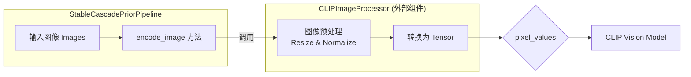

#### 带注释源码

由于 `CLIPImageProcessor` 是外部导入的类，其具体实现源码不在本项目代码库中。以下源码展示了该组件在 `StableCascadePriorPipeline` 中的**调用方式及上下文**，体现了其接口契约。

```python
# 在 StableCascadePriorPipeline 类中
def encode_image(self, images, device, dtype, batch_size, num_images_per_prompt):
    image_embeds = []
    for image in images:
        # 调用外部 CLIPImageProcessor (feature_extractor)
        # 参数: image (原始图像), return_tensors="pt" (输出PyTorch张量)
        # 返回: 包含 'pixel_values' 键的字典对象
        processed_output = self.feature_extractor(image, return_tensors="pt")
        
        # 提取处理后的像素值张量
        image = processed_output.pixel_values
        
        # 将图像移至指定设备并转换数据类型
        image = image.to(device=device, dtype=dtype)
        
        # 传入图像编码器获取图像 Embedding
        image_embed = self.image_encoder(image).image_embeds.unsqueeze(1)
        image_embeds.append(image_embed)
    
    # 拼接多个图像的 Embedding
    image_embeds = torch.cat(image_embeds, dim=1)
    
    # 根据批量大小和每个提示的图像数量重复 Embedding
    image_embeds = image_embeds.repeat(batch_size * num_images_per_prompt, 1, 1)
    
    # 创建负样本图像 Embedding (全零)
    negative_image_embeds = torch.zeros_like(image_embeds)

    return image_embeds, negative_image_embeds
```


### `CLIPVisionModelWithProjection` (外部导入 - 图像编码器)

CLIPVisionModelWithProjection 是从 Hugging Face transformers 库导入的视觉编码器模型，用于将图像转换为向量表示（image embeddings）。在 StableCascadePriorPipeline 中，该模型作为可选组件用于编码输入图像，生成图像特征向量以辅助文本到图像的生成过程。

#### 在代码中的使用信息

在 `StableCascadePriorPipeline` 类中：

- **类型标注**：`image_encoder: CLIPVisionModelWithProjection | None = None`
- **调用方式**：在 `encode_image` 方法中通过 `self.image_encoder(image).image_embeds` 获取图像嵌入

#### 参数

由于 `CLIPVisionModelWithProjection` 是外部导入的类，其完整接口定义需参考 transformers 官方文档。基于代码中的使用方式：

- `image`：输入图像（torch.Tensor 或 PIL.Image.Image），需要经过 feature_extractor 预处理为 pixel_values

#### 返回值

- `image_embeds`：torch.Tensor，图像的向量表示，包含图像的语义特征

#### 流程图

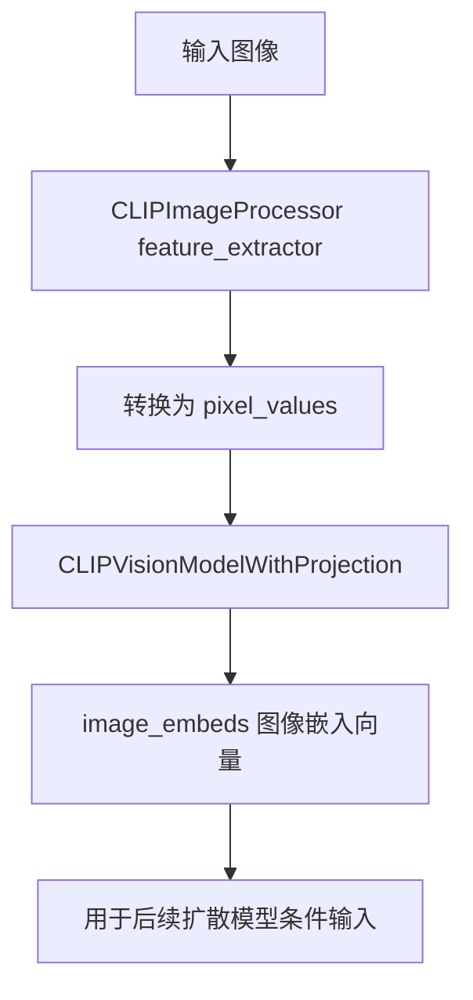

#### 带注释源码

```python
# 在 StableCascadePriorPipeline.__init__ 中的注册
def __init__(
    self,
    tokenizer: CLIPTokenizer,
    text_encoder: CLIPTextModelWithProjection,
    prior: StableCascadeUNet,
    scheduler: DDPMWuerstchenScheduler,
    resolution_multiple: float = 42.67,
    feature_extractor: CLIPImageProcessor | None = None,
    image_encoder: CLIPVisionModelWithProjection | None = None,  # 外部导入的CLIP视觉编码器
) -> None:
    super().__init__()
    self.register_modules(
        tokenizer=tokenizer,
        text_encoder=text_encoder,
        image_encoder=image_encoder,  # 注册图像编码器模块
        feature_extractor=feature_extractor,
        prior=prior,
        scheduler=scheduler,
    )

# 在 encode_image 方法中的实际调用
def encode_image(self, images, device, dtype, batch_size, num_images_per_prompt):
    """
    使用 CLIPVisionModelWithProjection 编码图像
    """
    image_embeds = []
    for image in images:
        # 1. 使用 feature_extractor 预处理图像
        image = self.feature_extractor(image, return_tensors="pt").pixel_values
        # 2. 移动到指定设备并转换数据类型
        image = image.to(device=device, dtype=dtype)
        # 3. 调用 CLIPVisionModelWithProjection 获取图像嵌入
        image_embed = self.image_encoder(image).image_embeds.unsqueeze(1)
        image_embeds.append(image_embed)
    # 4. 拼接所有图像嵌入
    image_embeds = torch.cat(image_embeds, dim=1)

    # 5. 为每个prompt重复图像嵌入，并创建零向量作为负样本
    image_embeds = image_embeds.repeat(batch_size * num_images_per_prompt, 1, 1)
    negative_image_embeds = torch.zeros_like(image_embeds)

    return image_embeds, negative_image_embeds
```

#### 技术债务与优化空间

1. **串行处理图像编码**：当前 `encode_image` 方法逐个处理图像，可考虑批量处理以提升性能
2. **可选组件处理**：image_encoder 作为可选组件，当为 None 时管道仍可运行，但无法利用图像条件引导功能
3. **零向量占位符**：当没有提供图像时使用全零向量，这可能不是最优的无条件表示

#### 设计约束与接口契约

- **输入要求**：输入图像需先经过 `CLIPImageProcessor` (feature_extractor) 预处理
- **输出格式**：返回的 image_embeds 需要与 prior 模型的 clip_image_in_channels 维度匹配
- **可选性**：该组件为可选（通过 `_optional_components = ["image_encoder", "feature_extractor"]` 声明）


### `StableCascadeUNet`

`StableCascadeUNet` 是 Stable Cascade 模型的 UNet 骨干网络，用于根据文本嵌入和图像嵌入来近似生成图像的先验嵌入（prior embedding）。该类继承自 `DiffusionPipeline` 相关的模型基类，实现了噪声预测功能，是 Stable Cascade 扩散模型的核心组件。

参数：

-  `sample`：`torch.Tensor`，输入的噪声潜在表示（latents），形状为 `(batch_size, channels, height, width)`
-  `timestep_ratio`：`torch.Tensor`，时间步比例，用于条件化扩散过程
-  `clip_text_pooled`：`torch.Tensor`，池化后的文本嵌入，用于文本条件引导
-  `clip_text`：`torch.Tensor`，完整的文本嵌入序列，用于文本条件引导
-  `clip_img`：`torch.Tensor`，图像嵌入，用于图像条件引导（可选）
-  `return_dict`：`bool`，是否返回字典格式的输出（默认为 `True`）

返回值：`torch.Tensor` 或 `tuple`，返回预测的图像先验嵌入。如果 `return_dict=True`，返回元组的第一个元素为图像嵌入张量。

#### 流程图

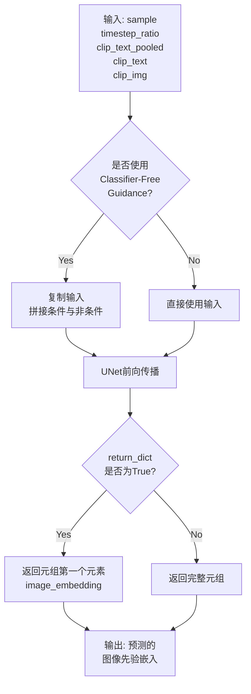

#### 带注释源码

```python
# StableCascadeUNet 在 diffusers 库中的定义位置: src/diffusers/models/prior.py
# 以下为在 StableCascadePriorPipeline 中的调用方式:

# 在 __call__ 方法的去噪循环中调用 prior (即 StableCascadeUNet):
predicted_image_embedding = self.prior(
    sample=torch.cat([latents] * 2) if self.do_classifier_free_guidance else latents,
    # 根据是否使用 classifier-free guidance 决定是否拼接条件/非条件输入
    timestep_ratio=torch.cat([timestep_ratio] * 2) if self.do_classifier_free_guidance else timestep_ratio,
    # 时间步比例，用于扩散过程的条件化
    clip_text_pooled=text_encoder_pooled,
    # 池化后的文本嵌入 (prompt_embeds_pooled + negative_prompt_embeds_pooled)
    clip_text=text_encoder_hidden_states,
    # 完整文本嵌入序列 (prompt_embeds + negative_prompt_embeds)
    clip_img=image_embeds,
    # 图像嵌入用于图像条件引导
    return_dict=False,
)[0]  # 获取返回元组中的第一个元素 (image_embeddings)
```

#### 使用上下文说明

在 `StableCascadePriorPipeline` 中，`StableCascadeUNet` 作为 `prior` 属性被使用，其主要配置参数包括：

- **输入通道数** (`config.in_channels`): 先验模型的潜在表示通道数
- **CLIP图像输入通道** (`config.clip_image_in_channels`): 图像嵌入的通道数

该模型在扩散采样循环中被调用，根据当前的时间步和条件信息（文本嵌入、图像嵌入）预测当前噪声样本对应的干净图像嵌入。


### DDPMWuerstchenScheduler

DDPMWuerstchenScheduler 是 Wuerstchen 架构中用于生成图像先验（image prior）的调度器实现。它实现了扩散概率模型的噪声调度逻辑，负责在去噪过程中计算时间步、噪声样本更新以及生成推理时间表。该调度器被设计用于 Stable Cascade 模型的先验管道中，支持文本和图像条件的图像嵌入生成。

参数：调度器为外部导入的类，此处记录其在管道中的典型使用参数

- `scheduler`：`DDPMWuerstchenScheduler`（在 StableCascadePriorPipeline 初始化时注入），负责管理去噪过程的时间步调度

返回值：调度器本身不直接返回值，其功能通过以下方法实现

- `set_timesteps(num_inference_steps, device)`：设置推理步骤数和时间步
- `step(model_output, timestep, sample, generator)`：执行单步去噪，返回包含 `prev_sample` 的对象
- `betas` 属性：返回噪声调度 Beta 值

#### 流程图

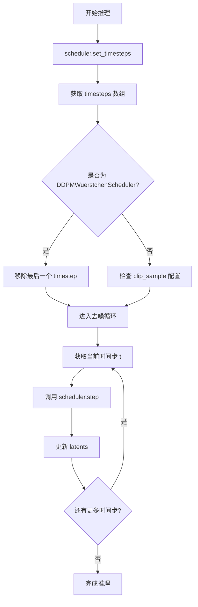

#### 带注释源码

基于代码中 `StableCascadePriorPipeline` 对 `DDPMWuerstchenScheduler` 的使用方式推断：

```python
# DDPMWuerstchenScheduler 在管道中的使用模式

# 1. 初始化阶段（在 StableCascadePriorPipeline.__init__ 中）
self.register_modules(scheduler=scheduler)

# 2. 设置推理时间步（在 __call__ 方法中）
self.scheduler.set_timesteps(num_inference_steps, device=device)
timesteps = self.scheduler.timesteps  # 获取时间步数组

# 3. 特殊处理：DDPMWuerstchenScheduler 需要移除最后一个时间步
if isinstance(self.scheduler, DDPMWuerstchenScheduler):
    timesteps = timesteps[:-1]

# 4. 检查调度器属性（用于其他调度器）
if hasattr(self.scheduler, "betas"):
    alphas = 1.0 - self.scheduler.betas
    alphas_cumprod = torch.cumprod(alphas, dim=0)

# 5. 去噪循环中执行单步
latents = self.scheduler.step(
    model_output=predicted_image_embedding,  # 模型预测的噪声
    timestep=timestep_ratio,                   # 当前时间步比例
    sample=latents,                            # 当前潜在表示
    generator=generator                        # 随机生成器
).prev_sample                                  # 获取上一步的潜在表示
```

#### 关键方法说明

| 方法/属性 | 描述 |
|-----------|------|
| `set_timesteps(num_inference_steps, device)` | 根据推理步骤数初始化调度器的时间步序列 |
| `timesteps` | 属性，返回调度器管理的所有时间步 |
| `step(model_output, timestep, sample, generator)` | 执行单步去噪，返回包含 `prev_sample` 的输出对象 |
| `betas` | 属性，返回调度器使用的 Beta 噪声调度参数 |
| `config` | 属性，返回调度器配置对象 |

#### 技术债务与优化空间

1. **类型检查开销**：代码中使用 `isinstance(self.scheduler, DDPMWuerstchenScheduler)` 进行运行时类型检查，可考虑使用策略模式或调度器抽象基类优化
2. **硬编码调度器行为**：DDPMWuerstchenScheduler 的特殊处理（`timesteps[:-1]`）散布在主流程中，可通过统一的调度器接口封装
3. **缺少调度器文档**：由于实现不在本代码仓库中，建议补充对调度器内部逻辑的详细文档
4. **Alpha 累积计算重复**：每次推理都重新计算 `alphas_cumprod`，可缓存以提升性能


### `StableCascadePriorPipeline.__init__`

初始化 StableCascadePriorPipeline 管道，用于生成 Stable Cascade 的图像先验。该方法继承自 DiffusionPipeline 并调用父类构造函数，然后注册所有必需的模块（分词器、文本编码器、图像编码器等）和配置参数。

参数：

- `tokenizer`：`CLIPTokenizer`，CLIP 标记器，用于将文本转换为标记
- `text_encoder`：`CLIPTextModelWithProjection`，冻结的文本编码器，用于生成文本嵌入
- `prior`：`StableCascadeUNet`，Stable Cascade 先验模型，用于从文本和/或图像嵌入近似图像嵌入
- `scheduler`：`DDPMWuerstchenScheduler`，与 `prior` 结合使用的调度器，用于生成图像嵌入
- `resolution_multiple`：`float`，可选，默认值为 42.67，生成多个图像的默认分辨率倍数
- `feature_extractor`：`CLIPImageProcessor | None`，可选，从生成的图像中提取特征的模型
- `image_encoder`：`CLIPVisionModelWithProjection | None`，可选，冻结的 CLIP 图像编码器

返回值：`None`，无返回值，仅初始化实例属性

#### 流程图

```mermaid
flowchart TD
    A[开始 __init__] --> B[调用 super().__init__<br/>DeprecatedPipelineMixin + DiffusionPipeline]
    B --> C[调用 self.register_modules<br/>注册所有子模块]
    C --> C1[tokenizer: CLIPTokenizer]
    C --> C2[text_encoder: CLIPTextModelWithProjection]
    C --> C3[image_encoder: CLIPVisionModelWithProjection]
    C --> C4[feature_extractor: CLIPImageProcessor]
    C --> C5[prior: StableCascadeUNet]
    C --> C6[scheduler: DDPMWuerstchenScheduler]
    C --> D[调用 self.register_to_config<br/>注册配置参数]
    D --> D1[resolution_multiple: float]
    D --> E[结束 __init__]
```

#### 带注释源码

```python
def __init__(
    self,
    tokenizer: CLIPTokenizer,                                    # CLIP 分词器，用于文本编码
    text_encoder: CLIPTextModelWithProjection,                   # CLIP 文本编码器模型
    prior: StableCascadeUNet,                                     # Stable Cascade 先验 UNet 模型
    scheduler: DDPMWuerstchenScheduler,                          # DDPM Wuerstchen 调度器
    resolution_multiple: float = 42.67,                          # 分辨率倍数，默认 42.67
    feature_extractor: CLIPImageProcessor | None = None,         # CLIP 图像处理器，可选
    image_encoder: CLIPVisionModelWithProjection | None = None,  # CLIP 视觉编码器，可选
) -> None:
    # 调用父类 DeprecatedPipelineMixin 和 DiffusionPipeline 的初始化方法
    # 设置基本的 pipeline 基础设施
    super().__init__()
    
    # 注册所有子模块到 pipeline 中，使它们可以通过 pipeline.xxx 访问
    # 同时支持模型卸载(model offloading)和设备迁移
    self.register_modules(
        tokenizer=tokenizer,                  # 文本分词器
        text_encoder=text_encoder,             # 文本编码器
        image_encoder=image_encoder,           # 图像编码器（可选）
        feature_extractor=feature_extractor,   # 特征提取器（可选）
        prior=prior,                           # 先验模型
        scheduler=scheduler,                   # 噪声调度器
    )
    
    # 将 resolution_multiple 注册到配置中
    # 使其成为 self.config.resolution_multiple，可被序列化保存
    self.register_to_config(resolution_multiple=resolution_multiple)
```


### `StableCascadePriorPipeline.prepare_latents`

该方法用于为 Stable Cascade 先验管道准备潜在的噪声向量，根据批处理大小、图像尺寸和调度器配置初始化或验证潜在向量。

参数：

- `batch_size`：`int`，批处理大小，即同时生成的图像数量
- `height`：`int`，生成图像的高度（像素）
- `width`：`int`，生成图像的宽度（像素）
- `num_images_per_prompt`：`int`，每个提示词生成的图像数量
- `dtype`：`torch.dtype`，潜在向量的数据类型
- `device`：`torch.device`，计算设备（CPU 或 CUDA）
- `generator`：`torch.Generator | None`，用于生成随机数的随机数生成器，用于确保可重复性
- `latents`：`torch.Tensor | None`，预生成的潜在向量，若为 None 则随机生成
- `scheduler`：`DDPMWuerstchenScheduler`，用于去噪的调度器，用于获取初始噪声 sigma

返回值：`torch.Tensor`，处理后的潜在向量

#### 流程图

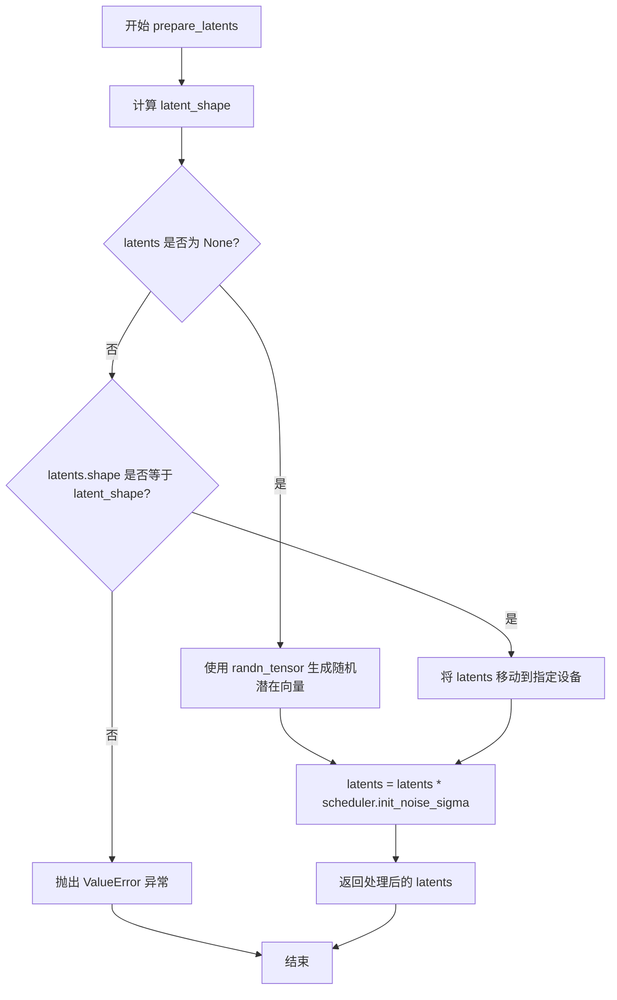

#### 带注释源码

```python
def prepare_latents(
    self, batch_size, height, width, num_images_per_prompt, dtype, device, generator, latents, scheduler
):
    # 计算潜在向量的形状：由 num_images_per_prompt * batch_size 确定批次，
    # 通过 self.prior.config.in_channels 获取通道数，
    # 使用 ceil(height / self.config.resolution_multiple) 和 ceil(width / self.config.resolution_multiple)
    # 计算潜在空间的高度和宽度（分辨率缩放）
    latent_shape = (
        num_images_per_prompt * batch_size,
        self.prior.config.in_channels,
        ceil(height / self.config.resolution_multiple),
        ceil(width / self.config.resolution_multiple),
    )

    # 如果未提供 latents，则使用 randn_tensor 从随机正态分布中生成潜在向量
    if latents is None:
        latents = randn_tensor(latent_shape, generator=generator, device=device, dtype=dtype)
    else:
        # 验证提供的 latents 形状是否与预期形状匹配
        if latents.shape != latent_shape:
            raise ValueError(f"Unexpected latents shape, got {latents.shape}, expected {latent_shape}")
        # 将已有的 latents 移动到指定设备
        latents = latents.to(device)

    # 使用调度器的初始噪声 sigma 对潜在向量进行缩放，这是扩散模型的标准初始化步骤
    latents = latents * scheduler.init_noise_sigma
    return latents
```


### `StableCascadePriorPipeline.encode_prompt`

该方法用于将文本提示（prompt）编码为文本嵌入（text embeddings），支持正向提示和负向提示的编码处理，并处理分类器自由引导（Classifier-Free Guidance）的嵌入复制。

参数：

- `device`：`torch.device`，执行编码的设备
- `batch_size`：`int`，批处理大小
- `num_images_per_prompt`：`int`，每个提示生成的图像数量
- `do_classifier_free_guidance`：`bool`，是否启用分类器自由引导
- `prompt`：`str | list[str] | None`，正向提示文本
- `negative_prompt`：`str | list[str] | None`，负向提示文本
- `prompt_embeds`：`torch.Tensor | None`，预生成的正向文本嵌入
- `prompt_embeds_pooled`：`torch.Tensor | None`，预生成的正向池化文本嵌入
- `negative_prompt_embeds`：`torch.Tensor | None`，预生成的负向文本嵌入
- `negative_prompt_embeds_pooled`：`torch.Tensor | None`，预生成的负向池化文本嵌入

返回值：`tuple[torch.Tensor, torch.Tensor, torch.Tensor, torch.Tensor]`，返回四个张量：正向文本嵌入、正向池化嵌入、负向文本嵌入、负向池化嵌入

#### 流程图

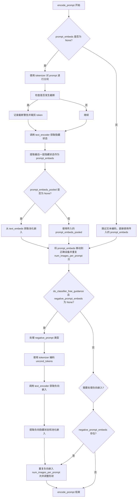

#### 带注释源码

```python
def encode_prompt(
    self,
    device,                      # torch.device: 运行文本编码的设备
    batch_size,                  # int: 输入批处理大小
    num_images_per_prompt,       # int: 每个提示要生成的图像数量
    do_classifier_free_guidance, # bool: 是否启用分类器自由引导
    prompt=None,                 # str | list[str] | None: 正向提示文本
    negative_prompt=None,        # str | list[str] | None: 负向提示文本
    prompt_embeds: torch.Tensor | None = None,       # 预计算的正向文本嵌入
    prompt_embeds_pooled: torch.Tensor | None = None, # 预计算的正向池化嵌入
    negative_prompt_embeds: torch.Tensor | None = None, # 预计算的负向文本嵌入
    negative_prompt_embeds_pooled: torch.Tensor | None = None, # 预计算的负向池化嵌入
):
    # 第一部分：如果未提供 prompt_embeds，则从 prompt 文本生成
    if prompt_embeds is None:
        # 使用 tokenizer 将文本转换为 token IDs 和 attention mask
        text_inputs = self.tokenizer(
            prompt,
            padding="max_length",
            max_length=self.tokenizer.model_max_length,
            truncation=True,
            return_tensors="pt",
        )
        text_input_ids = text_inputs.input_ids      # token ID 序列
        attention_mask = text_inputs.attention_mask  # 注意力掩码

        # 获取未截断的 token 序列（用于检测截断）
        untruncated_ids = self.tokenizer(prompt, padding="longest", return_tensors="pt").input_ids

        # 检查是否发生了截断，并记录警告信息
        if untruncated_ids.shape[-1] >= text_input_ids.shape[-1] and not torch.equal(
            text_input_ids, untruncated_ids
        ):
            removed_text = self.tokenizer.batch_decode(
                untruncated_ids[:, self.tokenizer.model_max_length - 1 : -1]
            )
            logger.warning(
                "The following part of your input was truncated because CLIP can only handle sequences up to"
                f" {self.tokenizer.model_max_length} tokens: {removed_text}"
            )
            # 裁剪 token 序列到模型最大长度
            text_input_ids = text_input_ids[:, : self.tokenizer.model_max_length]
            attention_mask = attention_mask[:, : self.tokenizer.model_max_length]

        # 调用文本编码器获取隐藏状态
        text_encoder_output = self.text_encoder(
            text_input_ids.to(device), attention_mask=attention_mask.to(device), output_hidden_states=True
        )
        # 提取最后一层隐藏状态作为文本嵌入
        prompt_embeds = text_encoder_output.hidden_states[-1]
        
        # 如果未提供池化嵌入，则从 text_embeds 获取
        if prompt_embeds_pooled is None:
            prompt_embeds_pooled = text_encoder_output.text_embeds.unsqueeze(1)

    # 第二部分：处理设备和数据类型，并扩展到多个图像
    prompt_embeds = prompt_embeds.to(dtype=self.text_encoder.dtype, device=device)
    prompt_embeds_pooled = prompt_embeds_pooled.to(dtype=self.text_encoder.dtype, device=device)
    # repeat_interleave 沿 dim=0 重复张量 num_images_per_prompt 次
    prompt_embeds = prompt_embeds.repeat_interleave(num_images_per_prompt, dim=0)
    prompt_embeds_pooled = prompt_embeds_pooled.repeat_interleave(num_images_per_prompt, dim=0)

    # 第三部分：处理负向提示嵌入（分类器自由引导需要）
    if negative_prompt_embeds is None and do_classifier_free_guidance:
        uncond_tokens: list[str]
        if negative_prompt is None:
            # 默认使用空字符串
            uncond_tokens = [""] * batch_size
        elif type(prompt) is not type(negative_prompt):
            raise TypeError(
                f"`negative_prompt` should be the same type to `prompt`, but got {type(negative_prompt)} !="
                f" {type(prompt)}."
            )
        elif isinstance(negative_prompt, str):
            uncond_tokens = [negative_prompt]
        elif batch_size != len(negative_prompt):
            raise ValueError(
                f"`negative_prompt`: {negative_prompt} has batch size {len(negative_prompt)}, but `prompt`:"
                f" {prompt} has batch size {batch_size}. Please make sure that passed `negative_prompt` matches"
                " the batch size of `prompt`."
            )
        else:
            uncond_tokens = negative_prompt

        # 对负向提示进行分词和编码
        uncond_input = self.tokenizer(
            uncond_tokens,
            padding="max_length",
            max_length=self.tokenizer.model_max_length,
            truncation=True,
            return_tensors="pt",
        )
        negative_prompt_embeds_text_encoder_output = self.text_encoder(
            uncond_input.input_ids.to(device),
            attention_mask=uncond_input.attention_mask.to(device),
            output_hidden_states=True,
        )

        # 提取负向嵌入
        negative_prompt_embeds = negative_prompt_embeds_text_encoder_output.hidden_states[-1]
        negative_prompt_embeds_pooled = negative_prompt_embeds_text_encoder_output.text_embeds.unsqueeze(1)

    # 第四部分：如果启用分类器自由引导，复制负向嵌入
    if do_classifier_free_guidance:
        # 对负向嵌入进行复制以匹配每个 prompt 生成的图像数量
        # 使用 repeat 和 view 操作以兼容 MPS 设备
        seq_len = negative_prompt_embeds.shape[1]
        negative_prompt_embeds = negative_prompt_embeds.to(dtype=self.text_encoder.dtype, device=device)
        negative_prompt_embeds = negative_prompt_embeds.repeat(1, num_images_per_prompt, 1)
        negative_prompt_embeds = negative_prompt_embeds.view(batch_size * num_images_per_prompt, seq_len, -1)

        seq_len = negative_prompt_embeds_pooled.shape[1]
        negative_prompt_embeds_pooled = negative_prompt_embeds_pooled.to(
            dtype=self.text_encoder.dtype, device=device
        )
        negative_prompt_embeds_pooled = negative_prompt_embeds_pooled.repeat(1, num_images_per_prompt, 1)
        negative_prompt_embeds_pooled = negative_prompt_embeds_pooled.view(
            batch_size * num_images_per_prompt, seq_len, -1
        )

    # 返回四个嵌入张量
    return prompt_embeds, prompt_embeds_pooled, negative_prompt_embeds, negative_prompt_embeds_pooled
```


### `StableCascadePriorPipeline.encode_image`

该方法用于将输入的图像编码为图像嵌入向量（image embeddings），供后续的扩散模型生成过程使用。它通过图像编码器（CLIP Vision Model）提取图像特征，并生成对应的嵌入表示，同时生成用于无分类器引导的负向嵌入。

参数：

- `images`：`torch.Tensor | PIL.Image.Image | list[torch.Tensor] | list[PIL.Image.Image]`，输入的图像或图像列表，用于生成图像嵌入
- `device`：`torch.device`，计算设备（CPU 或 CUDA），用于将张量移动到指定设备
- `dtype`：`torch.dtype`，数据类型（如 bfloat16、float16 等），用于指定张量的数据类型
- `batch_size`：`int`，批次大小，用于确定生成图像的数量
- `num_images_per_prompt`：`int`，每个提示词生成的图像数量，用于扩展图像嵌入

返回值：`tuple[torch.Tensor, torch.Tensor]`，返回两个张量组成的元组——第一个是 `image_embeds`（图像嵌入向量），第二个是 `negative_image_embeds`（用于无分类器引导的零向量），两者的形状相同

#### 流程图

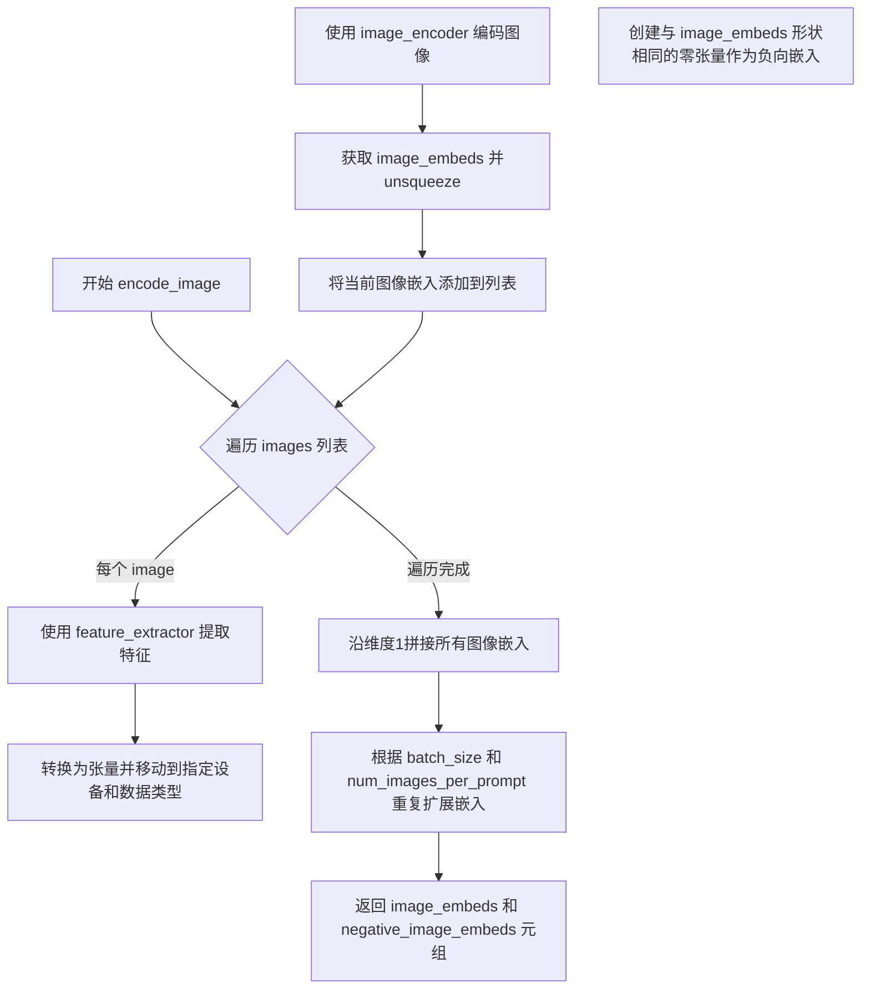

#### 带注释源码

```python
def encode_image(self, images, device, dtype, batch_size, num_images_per_prompt):
    """
    将输入图像编码为图像嵌入向量，供后续扩散模型生成过程使用。
    
    该方法通过以下步骤生成图像嵌入：
    1. 使用特征提取器（feature_extractor）从图像中提取像素值
    2. 将像素值输入到图像编码器（image_encoder）获取图像嵌入
    3. 为无分类器引导生成对应的负向嵌入（零向量）
    4. 根据批次大小和每提示图像数量扩展嵌入维度
    """
    image_embeds = []  # 用于存储每个图像的嵌入向量
    
    # 遍历输入的图像列表，逐个编码
    for image in images:
        # 使用特征提取器将图像转换为模型所需的像素值张量
        # return_tensors="pt" 指定返回 PyTorch 张量
        image = self.feature_extractor(image, return_tensors="pt").pixel_values
        
        # 将图像张量移动到指定设备（如 GPU）并转换为指定数据类型（如 bfloat16）
        image = image.to(device=device, dtype=dtype)
        
        # 通过 CLIP 图像编码器获取图像嵌入
        # image_embeds 是编码器输出的图像嵌入向量
        # unsqueeze(1) 在维度1增加一个维度，便于后续拼接
        image_embed = self.image_encoder(image).image_embeds.unsqueeze(1)
        
        # 将当前图像的嵌入添加到列表中
        image_embeds.append(image_embed)
    
    # 将列表中的所有图像嵌入沿维度1（序列维度）拼接成一个张量
    image_embeds = torch.cat(image_embeds, dim=1)
    
    # 根据批次大小和每提示图像数量扩展图像嵌入
    # 扩展公式：batch_size * num_images_per_prompt
    image_embeds = image_embeds.repeat(batch_size * num_images_per_prompt, 1, 1)
    
    # 创建与图像嵌入形状相同的零张量，作为无分类器引导的负向嵌入
    # 用于在 CFG 过程中与条件嵌入进行插值
    negative_image_embeds = torch.zeros_like(image_embeds)
    
    # 返回图像嵌入和负向图像嵌入的元组
    return image_embeds, negative_image_embeds
```


### `StableCascadePriorPipeline.check_inputs`

该方法用于验证 `StableCascadePriorPipeline` 管道输入参数的有效性，确保 `prompt` 和 `prompt_embeds` 不能同时提供，`negative_prompt` 和 `negative_prompt_embeds` 不能同时提供，且所有 embeddings 的形状必须匹配，同时验证图像输入的类型是否合法。

参数：

- `self`：`StableCascadePriorPipeline` 实例，管道对象本身
- `prompt`：`str | list[str] | None`，文本提示词，用于指导图像生成
- `images`：`torch.Tensor | PIL.Image.Image | list[torch.Tensor] | list[PIL.Image.Image] | None`，输入图像数据
- `image_embeds`：`torch.Tensor | None`，预生成的图像嵌入向量
- `negative_prompt`：`str | list[str] | None`，负面提示词，用于指导图像生成
- `prompt_embeds`：`torch.Tensor | None`，预生成的文本嵌入向量
- `prompt_embeds_pooled`：`torch.Tensor | None`，预生成的池化文本嵌入向量
- `negative_prompt_embeds`：`torch.Tensor | None`，预生成的负面文本嵌入向量
- `negative_prompt_embeds_pooled`：`torch.Tensor | None`，预生成的负面池化文本嵌入向量
- `callback_on_step_end_tensor_inputs`：`list[str] | None`，每步结束时回调函数需要接收的张量输入列表

返回值：`None`，该方法不返回任何值，仅通过抛出 `ValueError` 或 `TypeError` 来表示验证失败

#### 流程图

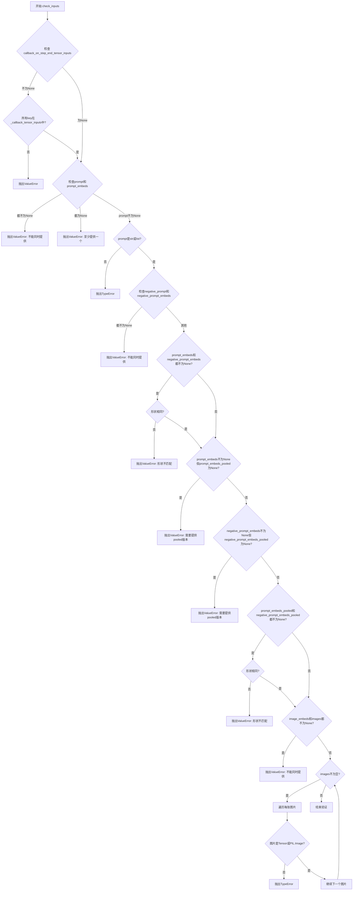

#### 带注释源码

```python
def check_inputs(
    self,
    prompt,
    images=None,
    image_embeds=None,
    negative_prompt=None,
    prompt_embeds=None,
    prompt_embeds_pooled=None,
    negative_prompt_embeds=None,
    negative_prompt_embeds_pooled=None,
    callback_on_step_end_tensor_inputs=None,
):
    """
    Validate and check the input arguments for the pipeline.
    
    This method ensures that:
    - callback_on_step_end_tensor_inputs only contains valid tensor input names
    - Either prompt or prompt_embeds is provided, but not both
    - Either negative_prompt or negative_prompt_embeds is provided, but not both
    - prompt_embeds and negative_prompt_embeds have the same shape when both provided
    - prompt_embeds_pooled is provided when prompt_embeds is provided
    - negative_prompt_embeds_pooled is provided when negative_prompt_embeds is provided
    - prompt_embeds_pooled and negative_prompt_embeds_pooled have the same shape when both provided
    - Either images or image_embeds is provided, but not both
    - All images are of type torch.Tensor or PIL.Image.Image
    
    Raises:
        ValueError: If input arguments are invalid or inconsistent
        TypeError: If prompt or images have incorrect types
    """
    # 验证回调张量输入是否在允许的列表中
    if callback_on_step_end_tensor_inputs is not None and not all(
        k in self._callback_tensor_inputs for k in callback_on_step_end_tensor_inputs
    ):
        raise ValueError(
            f"`callback_on_step_end_tensor_inputs` has to be in {self._callback_tensor_inputs}, but found {[k for k in callback_on_step_end_tensor_inputs if k not in self._callback_tensor_inputs]}"
        )

    # 验证prompt和prompt_embeds不能同时提供
    if prompt is not None and prompt_embeds is not None:
        raise ValueError(
            f"Cannot forward both `prompt`: {prompt} and `prompt_embeds`: {prompt_embeds}. Please make sure to"
            " only forward one of the two."
        )
    # 验证至少提供一个
    elif prompt is None and prompt_embeds is None:
        raise ValueError(
            "Provide either `prompt` or `prompt_embeds`. Cannot leave both `prompt` and `prompt_embeds` undefined."
        )
    # 验证prompt的类型
    elif prompt is not None and (not isinstance(prompt, str) and not isinstance(prompt, list)):
        raise ValueError(f"`prompt` has to be of type `str` or `list` but is {type(prompt)}")

    # 验证negative_prompt和negative_prompt_embeds不能同时提供
    if negative_prompt is not None and negative_prompt_embeds is not None:
        raise ValueError(
            f"Cannot forward both `negative_prompt`: {negative_prompt} and `negative_prompt_embeds`:"
            f" {negative_prompt_embeds}. Please make sure to only forward one of the two."
        )

    # 验证prompt_embeds和negative_prompt_embeds的形状一致性
    if prompt_embeds is not None and negative_prompt_embeds is not None:
        if prompt_embeds.shape != negative_prompt_embeds.shape:
            raise ValueError(
                "`prompt_embeds` and `negative_prompt_embeds` must have the same shape when passed directly, but"
                f" got: `prompt_embeds` {prompt_embeds.shape} != `negative_prompt_embeds`"
                f" {negative_prompt_embeds.shape}."
            )

    # 验证如果提供prompt_embeds，必须也提供prompt_embeds_pooled
    if prompt_embeds is not None and prompt_embeds_pooled is None:
        raise ValueError(
            "If `prompt_embeds` are provided, `prompt_embeds_pooled` must also be provided. Make sure to generate `prompt_embeds_pooled` from the same text encoder that was used to generate `prompt_embeds`"
        )

    # 验证如果提供negative_prompt_embeds，必须也提供negative_prompt_embeds_pooled
    if negative_prompt_embeds is not None and negative_prompt_embeds_pooled is None:
        raise ValueError(
            "If `negative_prompt_embeds` are provided, `negative_prompt_embeds_pooled` must also be provided. Make sure to generate `prompt_embeds_pooled` from the same text encoder that was used to generate `prompt_embeds`"
        )

    # 验证prompt_embeds_pooled和negative_prompt_embeds_pooled的形状一致性
    if prompt_embeds_pooled is not None and negative_prompt_embeds_pooled is not None:
        if prompt_embeds_pooled.shape != negative_prompt_embeds_pooled.shape:
            raise ValueError(
                "`prompt_embeds_pooled` and `negative_prompt_embeds_pooled` must have the same shape when passed"
                f"directly, but got: `prompt_embeds_pooled` {prompt_embeds_pooled.shape} !="
                f"`negative_prompt_embeds_pooled` {negative_prompt_embeds_pooled.shape}."
            )

    # 验证images和image_embeds不能同时提供
    if image_embeds is not None and images is not None:
        raise ValueError(
            f"Cannot forward both `images`: {images} and `image_embeds`: {image_embeds}. Please make sure to"
            " only forward one of the two."
        )

    # 验证每张图片的类型
    if images:
        for i, image in enumerate(images):
            if not isinstance(image, torch.Tensor) and not isinstance(image, PIL.Image.Image):
                raise TypeError(
                    f"'images' must contain images of type 'torch.Tensor' or 'PIL.Image.Image, but got"
                    f"{type(image)} for image number {i}."
                )
```


### `StableCascadePriorPipeline.guidance_scale`

该属性是StableCascadePriorPipeline类的guidance_scale属性，用于返回在图像生成过程中使用的分类器自由引导（Classifier-Free Guidance）比例系数。该值在调用管道时被设置，用于控制生成图像与文本提示的相关性。

参数： 无

返回值：`float`，返回分类器自由引导的比例系数（guidance_scale），该值决定了生成图像与文本提示的关联强度。

#### 流程图

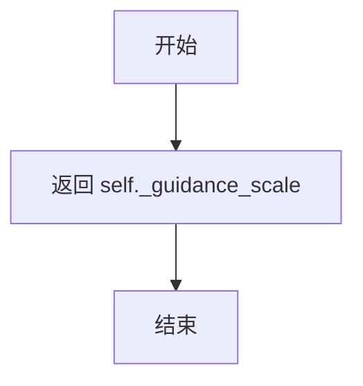

#### 带注释源码

```python
@property
def guidance_scale(self):
    """
    属性方法，用于获取分类器自由引导（Classifier-Free Guidance）的比例系数。
    
    该属性返回在 __call__ 方法中设置的 self._guidance_scale 值。
    guidance_scale 用于控制文本提示对生成图像的影响程度：
    - 值大于1时启用分类器自由引导
    - 值越高，生成图像与文本提示的关联越紧密，但可能影响图像质量
    
    Returns:
        float: guidance_scale 值，用于控制引导强度
    """
    return self._guidance_scale
```


### `StableCascadePriorPipeline.do_classifier_free_guidance`

该属性用于判断当前是否启用分类器自由引导（Classifier-Free Guidance，CFG）机制，通过检查引导系数 `_guidance_scale` 是否大于 1 来决定返回 `True` 或 `False`。

参数：无（该属性不接受任何参数）

返回值：`bool`，返回 `True` 表示启用分类器自由引导，返回 `False` 表示不启用

#### 流程图

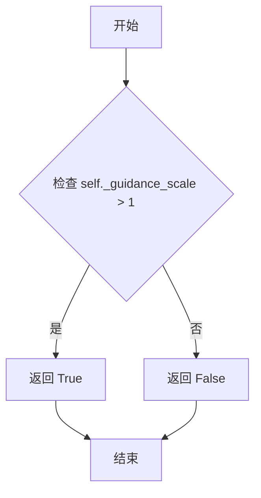

#### 带注释源码

```python
@property
def do_classifier_free_guidance(self):
    """
    判断是否启用分类器自由引导（Classifier-Free Guidance）。

    分类器自由引导是一种用于文本到图像扩散模型的技术，通过在推理时
    同时考虑条件（prompt）和无条件（negative prompt）预测，来增强
    生成图像与文本提示的相关性。

    当 guidance_scale > 1 时启用 CFG，否则不启用。

    Returns:
        bool: 如果 guidance_scale 大于 1 则返回 True，否则返回 False。
    """
    return self._guidance_scale > 1
```


### `StableCascadePriorPipeline.num_timesteps`

该属性是一个只读的属性 getter，用于获取在管道执行过程中设置的时间步总数。它返回内部变量 `_num_timesteps` 的值，该值在 `__call__` 方法执行推理时被动态设置。

参数：无

返回值：`int`，推理过程中使用的时间步总数。

#### 流程图

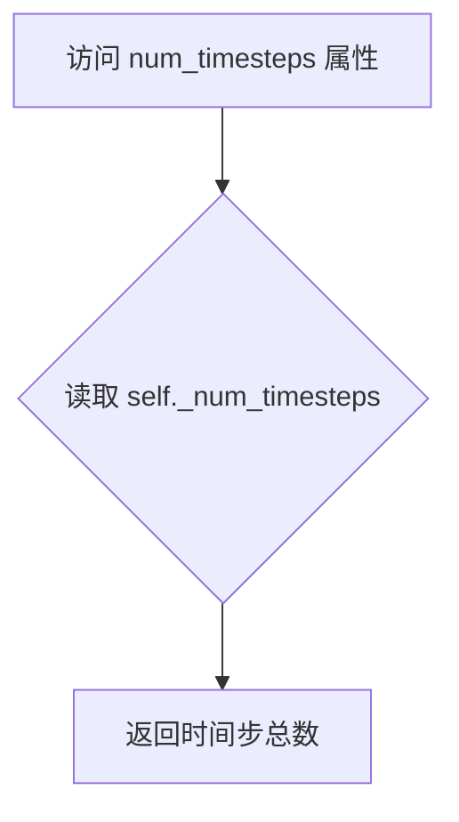

#### 带注释源码

```python
@property
def num_timesteps(self):
    """
    属性 getter: 获取推理过程中使用的时间步总数。

    该属性返回在管道执行期间通过 __call__ 方法设置的内部变量 _num_timesteps。
    该值表示去噪循环中实际执行的时间步数量，可能会根据调度器的类型有所调整。

    返回值:
        int: 推理过程中使用的时间步总数。
    """
    return self._num_timesteps
```


### `StableCascadePriorPipeline.get_timestep_ratio_conditioning`

该方法用于在扩散模型的去噪过程中，根据给定的时间步索引和累积alpha值计算时间步长比例（timestep ratio）。这是Stable Cascade模型中用于条件处理的关键计算，通过余弦退火策略将原始的时间步映射到更适合的条件编码空间。

参数：

- `t`：`torch.Tensor` 或 `int`，时间步索引，用于从 `alphas_cumprod` 中提取对应的累积方差值
- `alphas_cumprod`：`torch.Tensor`，累积alpha值数组，包含扩散过程中每个时间步的累积alpha值

返回值：`torch.Tensor`，计算得到的时间步长比例，用于后续去噪网络的 conditioning 输入

#### 流程图

```mermaid
flowchart TD
    A[开始] --> B[创建常量 s = 0.008]
    B --> C[定义 clamp_range = [0, 1]]
    C --> D[计算 min_var = cos²(s/(1+s) * π/2)]
    D --> E[根据索引 t 从 alphas_cumprod 提取 var]
    E --> F[将 var 限制在 0-1 范围内]
    F --> G[将 s 和 min_var 移到 var 所在设备]
    G --> H[计算 ratio = acos(sqrt(var * min_var)) / (π/2) * (1 + s) - s]
    H --> I[返回 ratio]
```

#### 带注释源码

```python
def get_timestep_ratio_conditioning(self, t, alphas_cumprod):
    """
    计算时间步长比例用于条件处理
    
    该方法实现了Stable Cascade论文中描述的时间步长映射策略，
    通过余弦变换将原始的方差值映射到更利于模型 conditioning 的空间。
    
    参数:
        t: 时间步索引，用于从 alphas_cumprod 中查找对应的方差值
        alphas_cumprod: 累积alpha值，扩散过程中的方差累积数组
    
    返回:
        ratio: 映射后的时间步长比例值
    """
    # 初始化常数 s，用于调节余弦退火的形状
    s = torch.tensor([0.008])
    
    # 定义方差值的合法范围，确保数值稳定性
    clamp_range = [0, 1]
    
    # 计算最小方差值（对应 t=0 时的极限值）
    # 这是一个基于余弦的退火曲线的最小值
    min_var = torch.cos(s / (1 + s) * torch.pi * 0.5) ** 2
    
    # 根据时间步索引 t 从累积alpha数组中提取对应的方差值
    var = alphas_cumprod[t]
    
    # 将方差值限制在 [0, 1] 范围内，避免数值异常
    var = var.clamp(*clamp_range)
    
    # 确保 s 和 min_var 与 var 在同一设备上（CPU/GPU）
    s, min_var = s.to(var.device), min_var.to(var.device)
    
    # 核心计算：使用反余弦变换将方差映射到时间步长比例
    # 公式: ratio = acos(sqrt(var * min_var)) / (π/2) * (1 + s) - s
    # 这实现了从方差空间到时间比例空间的非线性映射
    ratio = (((var * min_var) ** 0.5).acos() / (torch.pi * 0.5)) * (1 + s) - s
    
    return ratio
```


### `StableCascadePriorPipeline.__call__`

该方法是 `StableCascadePriorPipeline` 的核心调用接口，实现了图像先验（Prior）生成功能。通过接收文本提示和可选的图像输入，利用预训练的 CLIP 文本编码器和 UNet 先验模型，在去噪扩散过程中生成与文本语义对齐的图像嵌入向量（latents），支持分类器无关引导（CFG）以提升生成质量。

参数：

- `prompt`：`str | list[str] | None`，用于引导图像生成的文本提示
- `images`：`torch.Tensor | PIL.Image.Image | list[torch.Tensor] | list[PIL.Image.Image] | None`，可选的输入图像，用于生成图像嵌入
- `height`：`int`，生成图像的高度（像素），默认 1024
- `width`：`int`，生成图像的宽度（像素），默认 1024
- `num_inference_steps`：`int`，去噪迭代步数，默认 20
- `timesteps`：`list[float] | None`，自定义时间步调度列表
- `guidance_scale`：`float`，分类器无关引导的权重，默认 4.0
- `negative_prompt`：`str | list[str] | None`，负向提示，用于排除不希望的内容
- `prompt_embeds`：`torch.Tensor | None`，预生成的文本嵌入向量
- `prompt_embeds_pooled`：`torch.Tensor | None`，预生成的池化文本嵌入
- `negative_prompt_embeds`：`torch.Tensor | None`，预生成的负向文本嵌入
- `negative_prompt_embeds_pooled`：`torch.Tensor | None`，预生成的负向池化文本嵌入
- `image_embeds`：`torch.Tensor | None`，预生成的图像嵌入向量
- `num_images_per_prompt`：`int`，每个提示生成的图像数量，默认 1
- `generator`：`torch.Generator | list[torch.Generator] | None`，随机数生成器，用于可重复生成
- `latents`：`torch.Tensor | None`，预生成的噪声潜在向量
- `output_type`：`str`，输出格式类型，默认 "pt"（PyTorch 张量）
- `return_dict`：`bool`，是否返回字典格式输出，默认 True
- `callback_on_step_end`：`Callable[[int, int], None] | None`，每步结束时的回调函数
- `callback_on_step_end_tensor_inputs`：`list[str]`，回调函数需要接收的张量输入列表，默认 ["latents"]

返回值：`StableCascadePriorPipelineOutput | tuple`，包含生成的图像嵌入、提示嵌入和负向提示嵌入

#### 流程图

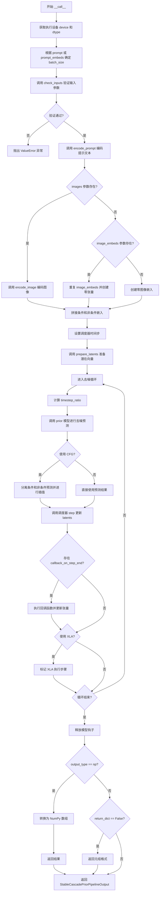

#### 带注释源码

```python
@torch.no_grad()
@replace_example_docstring(EXAMPLE_DOC_STRING)
def __call__(
    self,
    prompt: str | list[str] | None = None,
    images: torch.Tensor | PIL.Image.Image | list[torch.Tensor] | list[PIL.Image.Image] = None,
    height: int = 1024,
    width: int = 1024,
    num_inference_steps: int = 20,
    timesteps: list[float] = None,
    guidance_scale: float = 4.0,
    negative_prompt: str | list[str] | None = None,
    prompt_embeds: torch.Tensor | None = None,
    prompt_embeds_pooled: torch.Tensor | None = None,
    negative_prompt_embeds: torch.Tensor | None = None,
    negative_prompt_embeds_pooled: torch.Tensor | None = None,
    image_embeds: torch.Tensor | None = None,
    num_images_per_prompt: int | None = 1,
    generator: torch.Generator | list[torch.Generator] | None = None,
    latents: torch.Tensor | None = None,
    output_type: str | None = "pt",
    return_dict: bool = True,
    callback_on_step_end: Callable[[int, int], None] | None = None,
    callback_on_step_end_tensor_inputs: list[str] = ["latents"],
):
    """
    Function invoked when calling the pipeline for generation.
    """

    # 0. 定义常用的变量
    # 获取执行设备（CPU/CUDA等）和prior模型的数据类型
    device = self._execution_device
    dtype = next(self.prior.parameters()).dtype
    # 设置引导比例，用于分类器无关引导
    self._guidance_scale = guidance_scale
    
    # 根据输入确定批次大小
    # 如果传入的是字符串，批次大小为1；如果是列表，则为列表长度；否则从prompt_embeds获取
    if prompt is not None and isinstance(prompt, str):
        batch_size = 1
    elif prompt is not None and isinstance(prompt, list):
        batch_size = len(prompt)
    else:
        batch_size = prompt_embeds.shape[0]

    # 1. 检查输入参数，如果不符合要求则抛出错误
    self.check_inputs(
        prompt,
        images=images,
        image_embeds=image_embeds,
        negative_prompt=negative_prompt,
        prompt_embeds=prompt_embeds,
        prompt_embeds_pooled=prompt_embeds_pooled,
        negative_prompt_embeds=negative_prompt_embeds,
        negative_prompt_embeds_pooled=negative_prompt_embeds_pooled,
        callback_on_step_end_tensor_inputs=callback_on_step_end_tensor_inputs,
    )

    # 2. 编码标题和图像
    # 获取文本嵌入（包含正向和负向）
    (
        prompt_embeds,
        prompt_embeds_pooled,
        negative_prompt_embeds,
        negative_prompt_embeds_pooled,
    ) = self.encode_prompt(
        prompt=prompt,
        device=device,
        batch_size=batch_size,
        num_images_per_prompt=num_images_per_prompt,
        do_classifier_free_guidance=self.do_classifier_free_guidance,
        negative_prompt=negative_prompt,
        prompt_embeds=prompt_embeds,
        prompt_embeds_pooled=prompt_embeds_pooled,
        negative_prompt_embeds=negative_prompt_embeds,
        negative_prompt_embeds_pooled=negative_prompt_embeds_pooled,
    )

    # 处理图像输入的三种情况：
    # 1) 直接提供images -> 通过encode_image生成embeddings
    # 2) 提供image_embeds -> 重复使用并生成零张量
    # 3) 都没有 -> 创建零嵌入
    if images is not None:
        image_embeds_pooled, uncond_image_embeds_pooled = self.encode_image(
            images=images,
            device=device,
            dtype=dtype,
            batch_size=batch_size,
            num_images_per_prompt=num_images_per_prompt,
        )
    elif image_embeds is not None:
        image_embeds_pooled = image_embeds.repeat(batch_size * num_images_per_prompt, 1, 1)
        uncond_image_embeds_pooled = torch.zeros_like(image_embeds_pooled)
    else:
        image_embeds_pooled = torch.zeros(
            batch_size * num_images_per_prompt,
            1,
            self.prior.config.clip_image_in_channels,
            device=device,
            dtype=dtype,
        )
        uncond_image_embeds_pooled = torch.zeros(
            batch_size * num_images_per_prompt,
            1,
            self.prior.config.clip_image_in_channels,
            device=device,
            dtype=dtype,
        )

    # 根据是否使用CFG（分类器无关引导）来拼接图像嵌入
    if self.do_classifier_free_guidance:
        image_embeds = torch.cat([image_embeds_pooled, uncond_image_embeds_pooled], dim=0)
    else:
        image_embeds = image_embeds_pooled

    # 3. 为了避免两次前向传播，将无条件嵌入和文本嵌入拼接成单个批次
    text_encoder_hidden_states = (
        torch.cat([prompt_embeds, negative_prompt_embeds]) if negative_prompt_embeds is not None else prompt_embeds
    )
    text_encoder_pooled = (
        torch.cat([prompt_embeds_pooled, negative_prompt_embeds_pooled])
        if negative_prompt_embeds is not None
        else prompt_embeds_pooled
    )

    # 4. 准备并设置时间步
    self.scheduler.set_timesteps(num_inference_steps, device=device)
    timesteps = self.scheduler.timesteps

    # 5. 准备潜在向量
    latents = self.prepare_latents(
        batch_size, height, width, num_images_per_prompt, dtype, device, generator, latents, self.scheduler
    )

    # 特殊处理DDPMWuerstchenScheduler
    if isinstance(self.scheduler, DDPMWuerstchenScheduler):
        timesteps = timesteps[:-1]
    else:
        if hasattr(self.scheduler.config, "clip_sample") and self.scheduler.config.clip_sample:
            self.scheduler.config.clip_sample = False  # 禁用样本裁剪
            logger.warning(" set `clip_sample` to be False")

    # 6. 运行去噪循环
    # 获取alpha累积乘积用于时间步比例计算
    if hasattr(self.scheduler, "betas"):
        alphas = 1.0 - self.scheduler.betas
        alphas_cumprod = torch.cumprod(alphas, dim=0)
    else:
        alphas_cumprod = []

    self._num_timesteps = len(timesteps)
    
    # 遍历每个时间步进行去噪
    for i, t in enumerate(self.progress_bar(timesteps)):
        # 计算时间步比例条件
        if not isinstance(self.scheduler, DDPMWuerstchenScheduler):
            if len(alphas_cumprod) > 0:
                timestep_ratio = self.get_timestep_ratio_conditioning(t.long().cpu(), alphas_cumprod)
                timestep_ratio = timestep_ratio.expand(latents.size(0)).to(dtype).to(device)
            else:
                timestep_ratio = t.float().div(self.scheduler.timesteps[-1]).expand(latents.size(0)).to(dtype)
        else:
            timestep_ratio = t.expand(latents.size(0)).to(dtype)

        # 7. 去噪图像嵌入
        # 根据是否使用CFG来决定是否复制输入
        predicted_image_embedding = self.prior(
            sample=torch.cat([latents] * 2) if self.do_classifier_free_guidance else latents,
            timestep_ratio=torch.cat([timestep_ratio] * 2) if self.do_classifier_free_guidance else timestep_ratio,
            clip_text_pooled=text_encoder_pooled,
            clip_text=text_encoder_hidden_states,
            clip_img=image_embeds,
            return_dict=False,
        )[0]

        # 8. 检查并应用分类器无关引导
        if self.do_classifier_free_guidance:
            # 将预测结果分成条件和无条件两部分
            predicted_image_embedding_text, predicted_image_embedding_uncond = predicted_image_embedding.chunk(2)
            # 使用线性插值应用引导
            predicted_image_embedding = torch.lerp(
                predicted_image_embedding_uncond, predicted_image_embedding_text, self.guidance_scale
            )

        # 9. 对潜在向量进行重噪声到下一个时间步
        if not isinstance(self.scheduler, DDPMWuerstchenScheduler):
            timestep_ratio = t
        # 调用调度器的step方法更新latents
        latents = self.scheduler.step(
            model_output=predicted_image_embedding, timestep=timestep_ratio, sample=latents, generator=generator
        ).prev_sample

        # 如果存在每步结束时的回调函数，则执行
        if callback_on_step_end is not None:
            callback_kwargs = {}
            for k in callback_on_step_end_tensor_inputs:
                callback_kwargs[k] = locals()[k]
            callback_outputs = callback_on_step_end(self, i, t, callback_kwargs)

            # 更新回调中可能修改的张量
            latents = callback_outputs.pop("latents", latents)
            prompt_embeds = callback_outputs.pop("prompt_embeds", prompt_embeds)
            negative_prompt_embeds = callback_outputs.pop("negative_prompt_embeds", negative_prompt_embeds)

        # 如果使用XLA（Torch XLA），标记执行步骤
        if XLA_AVAILABLE:
            xm.mark_step()

    # 10. 释放所有模型的钩子（用于CPU卸载）
    self.maybe_free_model_hooks()

    # 11. 根据output_type转换输出格式
    if output_type == "np":
        # 转换为NumPy数组（需要先转换为float，因为bfloat16不支持numpy）
        latents = latents.cpu().float().numpy()
        prompt_embeds = prompt_embeds.cpu().float().numpy()
        negative_prompt_embeds = (
            negative_prompt_embeds.cpu().float().numpy() if negative_prompt_embeds is not None else None
        )

    # 12. 根据return_dict决定返回格式
    if not return_dict:
        return (
            latents,
            prompt_embeds,
            prompt_embeds_pooled,
            negative_prompt_embeds,
            negative_prompt_embeds_pooled,
        )

    # 返回结构化输出对象
    return StableCascadePriorPipelineOutput(
        image_embeddings=latents,
        prompt_embeds=prompt_embeds,
        prompt_embeds_pooled=prompt_embeds_pooled,
        negative_prompt_embeds=negative_prompt_embeds,
        negative_prompt_embeds_pooled=negative_prompt_embeds_pooled,
    )
```

## 关键组件


### 张量索引与惰性加载

代码中通过 `randn_tensor` 延迟生成随机潜在向量，仅在 `latents` 为 None 时才创建新张量，避免了不必要的内存占用。在 `__call__` 方法中，通过检查 `prompt_embeds is None` 来决定是否重新编码文本，实现了计算资源的惰性加载。

### 反量化支持

代码通过 `.to(dtype=self.text_encoder.dtype, device=device)` 和 `.to(dtype=dtype, device=device)` 将张量转换为与模型参数一致的 dtype。输出时使用 `.float()` 将 bfloat16 张量显式转换为 float 以支持 numpy 转换（`latents = latents.cpu().float().numpy()`）。

### 量化策略

支持通过 `torch_dtype=torch.bfloat16` 加载模型以实现内存优化。代码中 `dtype = next(self.prior.parameters()).dtype` 获取模型的 dtype 并应用于所有张量操作，确保量化精度的一致性。

### Classifier-Free Guidance

在 `__call__` 方法中实现了 CFG 引导策略，通过 `torch.cat([latents] * 2)` 和 `torch.cat([prompt_embeds, negative_prompt_embeds])` 将条件和非条件输入拼接为批量进行处理，最后使用 `torch.lerp` 应用引导权重。

### 潜在变量管理 (prepare_latents)

根据分辨率和批量大小动态计算潜在向量形状，使用 `ceil(height / self.config.resolution_multiple)` 计算潜在空间尺寸，并使用调度器的 `init_noise_sigma` 进行噪声初始化。

### 文本编码与池化 (encode_prompt)

支持两种文本嵌入形式：完整的 `prompt_embeds`（隐藏状态最后一层）和池化的 `prompt_embeds_pooled`（text_embeds）。通过 `repeat_interleave` 处理多图生成，并处理了 CLIP 模型的最大token长度限制。

### 图像编码 (encode_image)

支持 PIL Image 和 torch.Tensor 两种图像输入格式，使用 feature_extractor 提取像素值，通过 image_encoder 生成图像嵌入，并生成对应的零向量作为负样本。

### 时间步条件处理 (get_timestep_ratio_conditioning)

实现了基于余弦调度的条件比率计算，将累积方差转换为时间步条件，用于控制扩散过程中的噪声调度。

### 调度器集成 (DDPMWuerstchenScheduler)

支持 Wuerstchen 专用调度器，对时间步进行特殊处理（`timesteps = timesteps[:-1]`），并根据调度器类型动态调整采样策略。

### 输入验证与回调机制

通过 `check_inputs` 全面验证各种输入组合的有效性，支持 `callback_on_step_end` 回调函数和 `callback_on_step_end_tensor_inputs` 指定的张量输入，实现推理过程的可定制化。


## 问题及建议


### 已知问题

-   **注释编号混乱**：代码中存在多处注释编号不连续或错误的问题，例如第 "# 2. Encode caption + images" 注释后直接是 "# 4. Prepare and set timesteps"，缺少 "# 3." 注释；"# 6. Run denoising loop" 与实际代码逻辑不完全对应。
-   **`encode_prompt` 方法过长且重复逻辑多**：该方法包含大量重复的 embed 处理逻辑，negative_prompt_embeds 的生成代码与 prompt_embeds 类似，可以抽取公共逻辑。
-   **`encode_image` 使用循环而非批量处理**：方法内部使用 for 循环逐个处理图像，未充分利用批量处理能力，性能可优化。
-   **硬编码的魔法数字**：`get_timestep_ratio_conditioning` 中硬编码了 `s = torch.tensor([0.008])`，`resolution_multiple = 42.67` 等值缺乏解释性注释。
-   **`__call__` 方法过长**：该方法包含超过 300 行代码，混合了输入检查、编码、调度器设置、去噪循环等多个职责，难以维护和测试。
-   **输出字段命名不一致**：`StableCascadePriorPipelineOutput` 中 `image_embeddings` 实际返回的是 `latents`，命名具有误导性。
-   **缺失的错误处理**：如 `encode_image` 方法在 `feature_extractor` 或 `image_encoder` 为 None 时会抛出不友好的错误。
-   **`check_inputs` 验证不够全面**：未验证 `height` 和 `width` 是否为正整数，未验证 `num_inference_steps` 是否为正数等。
-   **类型提示不完整**：部分方法参数和返回值缺少类型提示，如 `prepare_latents` 方法的返回值类型未标注。
-   **存在潜在的性能问题**：在 `__call__` 中多次进行 `torch.cat` 操作创建新张量，可以考虑原地操作或预分配内存。

### 优化建议

-   **重构 `encode_prompt` 方法**：将 positive 和 negative prompt 的编码逻辑抽取为独立的私有方法，减少代码重复。
-   **批量处理 `encode_image`**：修改为一次性处理所有图像，利用 `torch.stack` 或批量 tensor 操作代替循环。
-   **拆分 `__call__` 方法**：将去噪循环抽取为独立的 `_run_denoising_loop` 方法，提高可读性和可测试性。
-   **提取魔法数字为配置常量**：为 `0.008`、`42.67` 等值添加具有明确含义的常量或配置参数，并增加注释说明其来源和用途。
-   **完善输入验证**：在 `check_inputs` 中增加对 `height`、`width`、`num_inference_steps` 等参数的校验。
-   **统一输出字段命名**：考虑将 `StableCascadePriorPipelineOutput.image_embeddings` 重命名为 `latents` 以反映真实内容，或添加文档说明。
-   **增加类型提示**：为所有公共方法的参数和返回值添加完整的类型注解。
-   **优化张量操作**：在去噪循环中考虑使用视图操作代替部分 `torch.cat`，减少内存分配。

## 其它


### 设计目标与约束

本pipeline的设计目标是生成Stable Cascade模型的图像先验（image prior），将文本提示和可选的图像输入转换为高维向量表示，供后续的解码器使用。核心约束包括：1) 支持文本和图像双模态输入；2) 兼容分类器自由引导（CFG）以提升生成质量；3) 必须与HuggingFace diffusers库架构兼容；4) 支持CPU到多GPU的设备迁移；5) 遵循Stable Cascade论文中的wuerstchen调度器机制。

### 错误处理与异常设计

代码采用分层错误处理策略：1) 输入验证阶段（check_inputs方法）进行参数类型和维度检查，抛出ValueError/TypeError；2) 设备相关操作使用try-except捕获XLA可用性异常；3) 分词器截断时通过logger.warning记录警告而非中断执行；4) 调度器配置异常时提供降级方案（如clip_sample自动关闭）。关键异常包括：提示词与embeddings互斥检查、批次大小不匹配验证、图像类型检查（仅支持torch.Tensor或PIL.Image）。

### 数据流与状态机

Pipeline执行遵循确定性状态流：初始化态→输入验证态→编码态（文本+图像）→潜在向量准备态→去噪循环态→输出整理态。核心状态转换由__call__方法控制：check_inputs验证输入合法性→encode_prompt生成文本embeddings→encode_image生成图像embeddings→prepare_latents初始化噪声→for循环执行去噪（每步调用scheduler.step）→maybe_free_model_hooks释放资源。状态间通过类成员变量（_guidance_scale、_num_timesteps、_execution_device）传递上下文。

### 外部依赖与接口契约

核心依赖包括：1) transformers库（CLIPTextModelWithProjection、CLIPTokenizer、CLIPVisionModelWithProjection）；2) diffusers库（DiffusionPipeline基类、DDPMWuerstchenScheduler）；3) 内部模块（StableCascadeUNet模型）。接口契约规定：输入prompt支持str/list/None，images支持Tensor/PIL.Image/list，输出返回StableCascadePriorPipelineOutput对象或tuple。设备兼容性通过is_torch_xla_available()检测，dtype传播遵循prior模型的参数dtype。

### 性能优化考虑

当前实现包含多项优化：1) XLA支持通过mark_step()实现即时编译；2) 模型CPU卸载（model_cpu_offload_seq）减少显存占用；3) repeat_interleave/repeat操作避免显式for循环；4) 可选的callback机制允许外部干预去噪过程。潜在优化空间：批量编码文本时可并行化、图像编码循环可融合、梯度计算可在推理时完全禁用（已使用@torch.no_grad）。

### 并发与异步处理

Pipeline本身为同步设计，但通过以下机制支持扩展：1) callback_on_step_end支持每步回调，允许外部异步处理；2) XLA集成支持TPU加速；3) 多Generator输入支持确定性并行生成。线程安全性由PyTorch的GIL和设备锁保证，但需要注意：多次调用__call__时_last_supported_version检查可能存在竞态条件。

### 资源管理与生命周期

资源管理策略包括：1) 初始化时通过register_modules注册所有依赖模块；2) 推理结束后调用maybe_free_model_hooks卸载模型；3) XLA环境下使用mark_step()确保设备同步；4) latents/embeddings在设备间传输时显式调用.to(device)。内存峰值出现在去噪循环中的predicted_image_embedding生成阶段，建议大分辨率场景启用模型卸载。

### 安全性考虑

代码包含以下安全措施：1) 输入验证防止类型混淆攻击；2) 分词器截断警告防止信息丢失被忽视；3) 无用户代码执行风险（纯推理pipeline）；4) 依赖版本约束通过transformers/diffusers版本要求体现。潜在风险：prompt_embeds未做内容过滤，negative_prompt_embeds为空时的CFG处理需谨慎使用。

### 配置与参数管理

配置通过register_to_config和register_modules双轨制管理：1) 注册到config的参数（resolution_multiple）可被save/load_pretrained序列化；2) 注册的modules支持热插拔和自定义替换。关键配置参数包括：resolution_multiple（默认42.67）、_optional_components（image_encoder/feature_extractor可空）、_callback_tensor_inputs（回调白名单）。

### 版本兼容性设计

_last_supported_version = "0.35.2"标记兼容性版本，DeprecatedPipelineMixin提供版本迁移路径。代码对调度器类型进行运行时检查（isinstance(scheduler, DDPMWuerstchenScheduler)）以支持不同调度器实现，alphas_cumprod的动态获取（hasattr检查）保证了调度器接口变化时的向后兼容。

### 单元测试策略建议

建议覆盖的测试场景：1) check_inputs的各种非法输入组合；2) encode_prompt的截断行为；3) 不同output_type的返回值格式；4) CFG开启/关闭的行为差异；5) 多GPU设备迁移；6) callback_on_step_end的回调参数传递；7) generator确定性验证。测试数据应包含短文本/长文本/特殊字符、空图像/多图像、batch_size>1等边界情况。


    