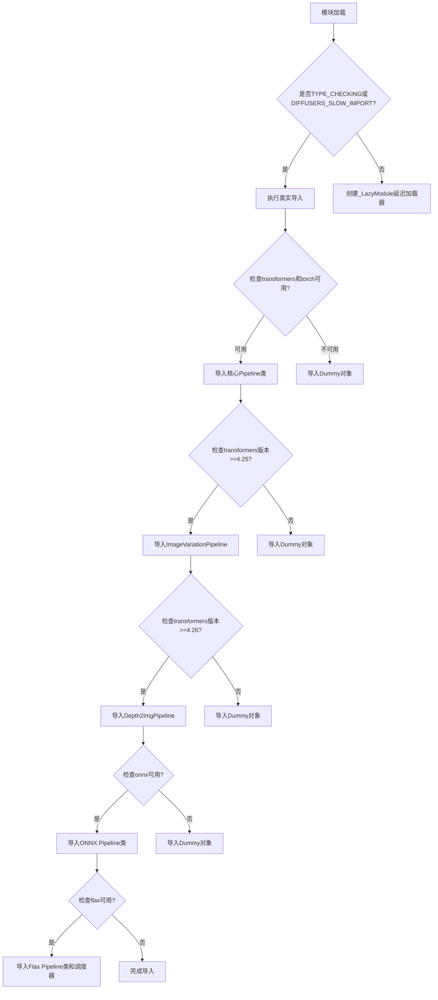
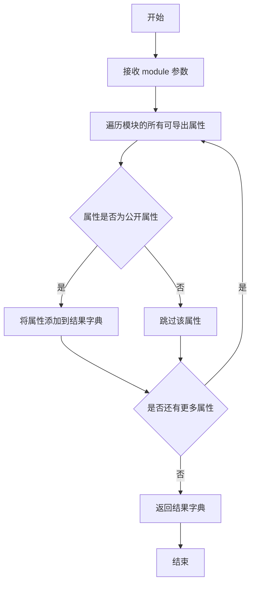
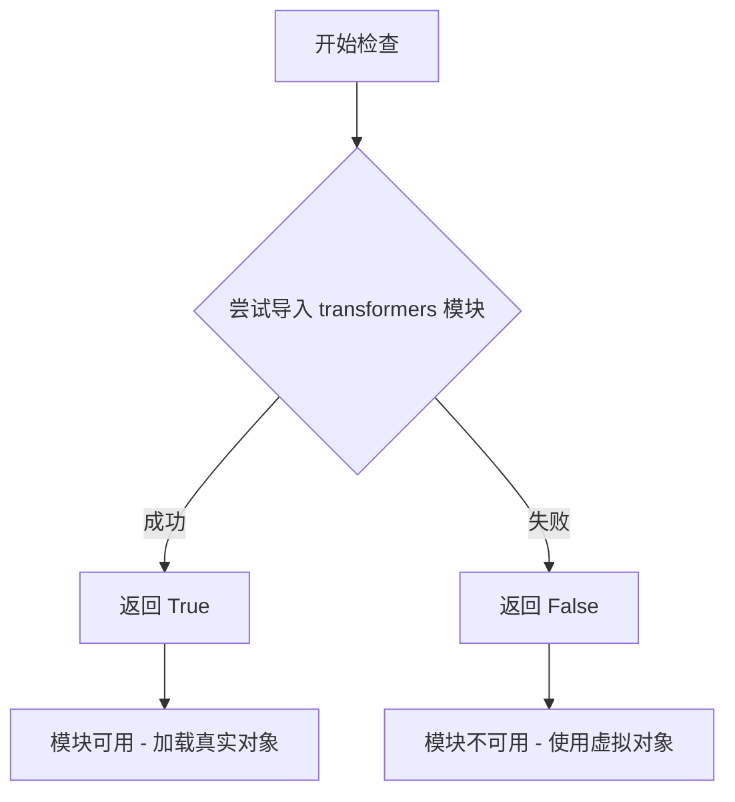
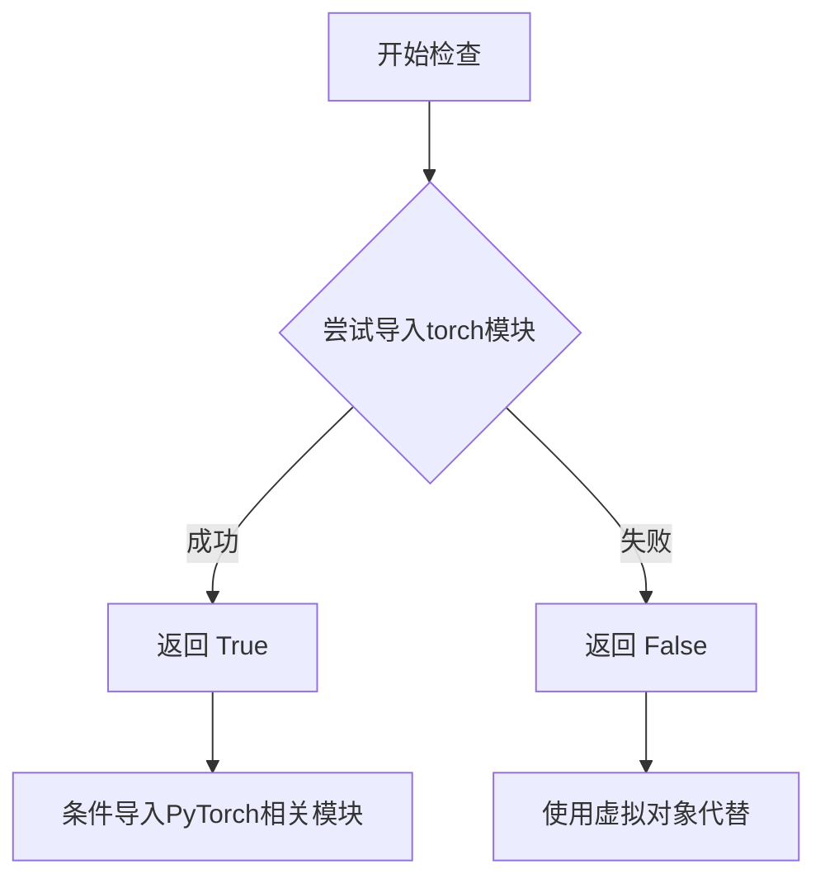
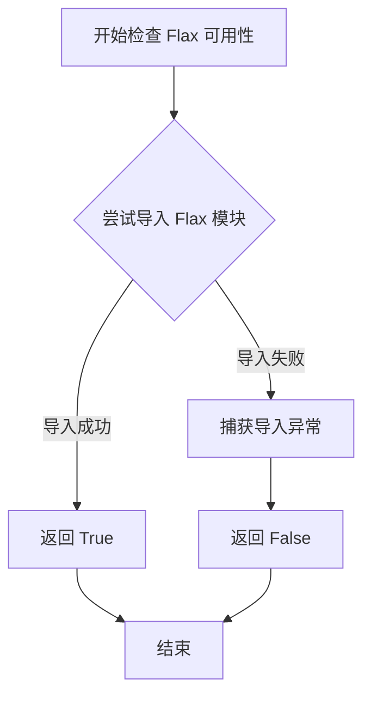
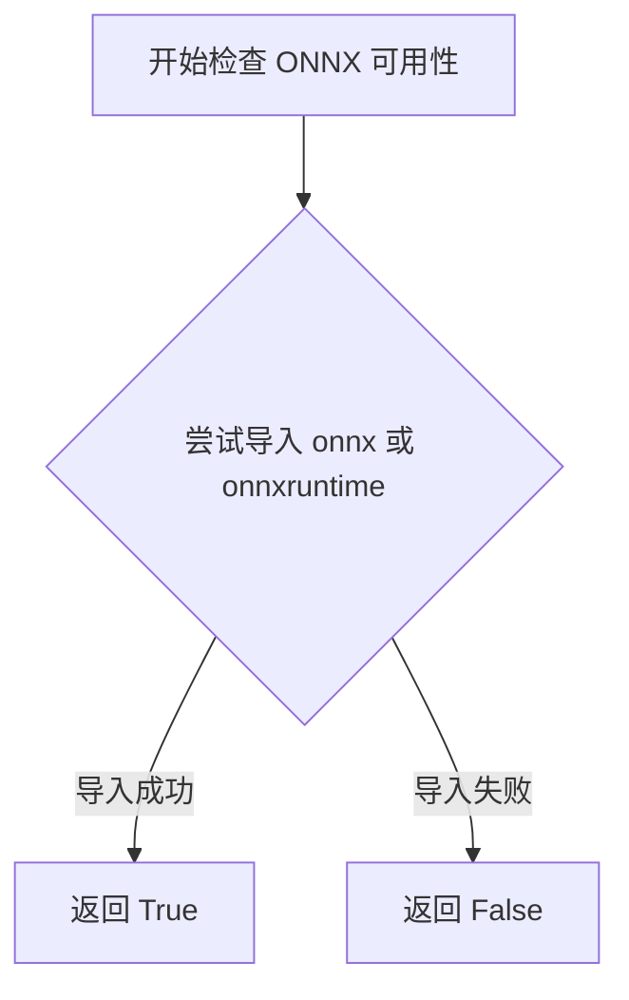
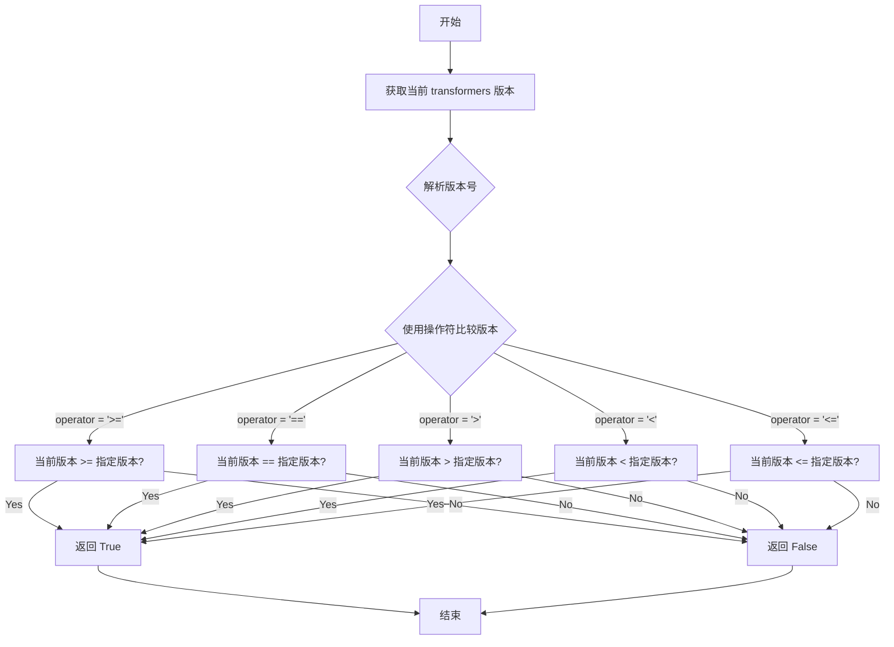

# `diffusers\src\diffusers\pipelines\stable_diffusion\__init__.py` 详细设计文档

这是一个Stable Diffusion pipeline的延迟加载模块，通过条件导入机制处理torch、transformers、flax、onnx等可选依赖，动态暴露多种Stable Diffusion相关pipeline类，实现模块的懒加载和依赖管理。

## 整体流程



## 类结构

```
LazyModule加载机制
├── 条件导入层
│   ├── torch+transformers依赖检查
│   ├── transformers版本检查(>=4.25.0, >=4.26.0)
│   ├── ONNX可用性检查
│   └── Flax可用性检查
└── Pipeline类型分类
    ├── 核心Pipeline
    ├── Image Variation Pipeline
    ├── Depth2Img Pipeline
    ├── ONNX Pipeline
    └── Flax Pipeline
```

## 全局变量及字段


### `_dummy_objects`
    
存储不可用依赖的虚拟对象

类型：`dict`
    


### `_additional_imports`
    
存储额外导入的模块

类型：`dict`
    


### `_import_structure`
    
定义模块的导入结构字典

类型：`dict`
    


    

## 全局函数及方法


### `get_objects_from_module`

从指定模块中提取所有对象（类、函数、变量），并以字典形式返回，以便用于更新其他字典或进行动态导入管理。

参数：

-  `module`：`Module` 类型（Python 模块对象），要从中提取对象的模块

返回值：`Dict[str, Any]`，返回模块中所有可导出对象的字典，键为对象名称，值为对象本身

#### 流程图



#### 带注释源码

```
def get_objects_from_module(module):
    """
    从给定模块中提取所有对象
    
    参数:
        module: Python模块对象
        
    返回:
        包含模块中所有公开对象的字典
    """
    # 初始化结果字典
    result = {}
    
    # 遍历模块的所有属性
    for attr_name in dir(module):
        # 跳过私有属性（以下划线开头）
        if attr_name.startswith('_'):
            continue
            
        # 获取属性值
        attr_value = getattr(module, attr_name)
        
        # 添加到结果字典
        result[attr_name] = attr_value
        
    return result
```

*注：实际源码位于 `src/diffusers/utils` 模块中，上述代码为根据使用方式推断的实现逻辑。该函数主要用于动态导入管理，根据可选依赖的可用性，从虚拟对象模块中提取占位符对象，或从实际模块中提取真实对象。*


### `is_transformers_available`

检查 `transformers` 库是否可用，返回布尔值以决定是否加载相关模块。

参数：无

返回值：`bool`，返回 `True` 表示 `transformers` 库已安装且可导入，`False` 表示不可用。

#### 流程图



#### 带注释源码

```python
# 该函数定义在 ...utils 模块中，以下为推断的实现逻辑

def is_transformers_available() -> bool:
    """
    检查 transformers 库是否已安装且可导入。
    
    Returns:
        bool: 如果可以成功导入 transformers 返回 True，否则返回 False。
    """
    try:
        # 尝试导入 transformers 库
        import transformers
        return True
    except ImportError:
        # 如果导入失败，说明库未安装
        return False
```

> **注意**：该函数定义在 `...utils` 模块中，本代码文件仅导入并使用它。从代码中的使用方式来看，`is_transformers_available()` 不接受任何参数，返回布尔值。当返回 `True` 时，会导入真实的 pipeline 类；当返回 `False` 时（捕获 `OptionalDependencyNotAvailable` 异常后），会从 dummy 模块导入虚拟对象以保持 API 一致性。


### `is_torch_available`

该函数用于检查当前环境中 PyTorch 库是否可用。它通过尝试导入 torch 模块来判断是否已安装 PyTorch，并返回布尔值结果。在 Stable Diffusion 扩散库中，此函数用于条件性地导入依赖于 PyTorch 的各种管道和模型。

参数：此函数无参数。

返回值：`bool`，返回 `True` 表示 PyTorch 可用，返回 `False` 表示 PyTorch 不可用。

#### 流程图



#### 带注释源码

```python
# 从上层utils模块导入is_torch_available函数
# 该函数定义在...utils包中，此处仅展示调用方式
from ...utils import is_torch_available

# 使用示例1: 检查torch和transformers是否都可用
if is_transformers_available() and is_torch_available():
    # 导入PyTorch版本的StableDiffusionPipeline
    _import_structure["pipeline_stable_diffusion"] = ["StableDiffusionPipeline"]

# 使用示例2: 检查torch、transformers和特定版本
if is_transformers_available() and is_torch_available() and is_transformers_version(">=", "4.25.0"):
    # 导入需要特定版本transformers的ImageVariationPipeline
    _import_structure["pipeline_stable_diffusion_image_variation"] = ["StableDiffusionImageVariationPipeline"]

# 使用示例3: 条件异常处理
try:
    if not (is_transformers_available() and is_torch_available()):
        raise OptionalDependencyNotAvailable()
except OptionalDependencyNotAvailable:
    # 如果torch不可用，则导入虚拟对象
    from ...utils.dummy_torch_and_transformers_objects import StableDiffusionPipeline
    _dummy_objects.update({"StableDiffusionPipeline": StableDiffusionPipeline})
```

#### 关键作用说明

| 用途 | 描述 |
|------|------|
| 条件导入 | 根据PyTorch是否可用，决定导入真实的管道类还是虚拟对象 |
| 版本检查 | 与`is_transformers_version`配合，实现版本兼容性检查 |
| 懒加载支持 | 在`_LazyModule`初始化时决定哪些模块需要注册到导入结构中 |
| 异常处理 | 结合`OptionalDependencyNotAvailable`异常实现优雅降级 |


### `is_flax_available`

该函数用于检查当前环境中是否安装了 Flax 深度学习库，并返回布尔值以表示 Flax 是否可用。这是实现可选依赖处理的关键函数，用于条件性地导入 Flax 相关的管道和调度器。

参数：
- 该函数无参数

返回值：`bool`，返回 True 表示 Flax 可用，返回 False 表示 Flax 不可用

#### 流程图



#### 带注释源码

```python
# 注意：以下为推断的函数实现，具体实现需查看 ...utils 模块
# 这是基于函数名和调用方式的合理推断

def is_flax_available() -> bool:
    """
    检查当前 Python 环境中是否安装了 Flax 库。
    
    该函数通常通过尝试导入 flax 模块来实现，
    如果导入成功则返回 True，否则捕获异常并返回 False。
    
    Returns:
        bool: 如果 Flax 可用返回 True，否则返回 False
    """
    try:
        import flax  # noqa: F401
        return True
    except ImportError:
        return False
```

#### 实际使用示例

在提供的代码中，该函数被多次使用：

```python
# 示例 1：条件性扩展导入结构
if is_transformers_available() and is_flax_available():
    _import_structure["pipeline_output"].extend(["FlaxStableDiffusionPipelineOutput"])

# 示例 2：条件性导入 Flax 调度器和管道
if is_transformers_available() and is_flax_available():
    from ...schedulers.scheduling_pndm_flax import PNDMSchedulerState
    _additional_imports.update({"PNDMSchedulerState": PNDMSchedulerState})
    _import_structure["pipeline_flax_stable_diffusion"] = ["FlaxStableDiffusionPipeline"]
    # ... 更多 Flax 相关导入
```

> **注**：由于 `is_flax_available` 是从 `...utils` 外部模块导入的函数，上述源码为基于函数名和上下文的合理推断。实际实现可能略有差异，建议查看 `diffusers` 库源码中的具体实现。


### `is_onnx_available`

检查当前环境中 ONNX 相关依赖是否可用，用于条件导入 ONNX 相关的 Stable Diffusion Pipeline。

参数：无

返回值：`bool`，如果 ONNX 可用返回 `True`，否则返回 `False`

#### 流程图



#### 带注释源码

```
# is_onnx_available 函数定义在 ...utils 模块中
# 以下是根据代码上下文推断的典型实现方式

def is_onnx_available() -> bool:
    """
    检查 ONNX 运行时是否可用。
    
    该函数通过尝试导入 onnx 或 onnxruntime 包来判断环境是否支持 ONNX。
    在 Hugging Face Diffusers 库中用于条件性地导入 ONNX 相关的 Pipeline。
    
    Returns:
        bool: 如果 ONNX 相关依赖可用返回 True，否则返回 False
    """
    # 尝试导入 ONNX 相关模块
    try:
        import onnx
        import onnxruntime
        return True
    except ImportError:
        return False
```

> **注意**：由于 `is_onnx_available` 函数定义在 `...utils` 模块中（从 `diffusers.utils` 导入），而用户提供的代码片段并未包含该函数的具体实现，以上源码为基于 `diffusers` 库常见模式的推断实现。实际实现可能略有不同，但核心逻辑相同：通过尝试导入 `onnx` 或 `onnxruntime` 包来判断 ONNX 是否可用。


### `is_transformers_version`

检查 transformers 库的版本是否满足指定的条件（大于等于、小于等于、等于等），用于在运行时根据 transformers 版本选择性地导入或使用特定功能。

参数：

- `operator`：字符串（str），比较操作符，如 ">="、"=="、">"、"<"等
- `version`：字符串（str），要比较的 transformers 版本号，如 "4.25.0"、"4.26.0" 等

返回值：布尔值（bool），如果当前 transformers 版本满足指定条件返回 True，否则返回 False

#### 流程图



#### 带注释源码

```python
# 从 ...utils 导入（实际源码在 transformers 库中）
# def is_transformers_version(operator: str, version: str) -> bool:
#     """
#     检查 transformers 版本是否满足指定条件
#     
#     参数:
#         operator: 比较操作符，如 ">=", "==", ">", "<", "<="
#         version: 目标版本号字符串，如 "4.25.0"
#     
#     返回:
#         bool: 版本比较结果
#     """
#     try:
#         from transformers import __version__ as transformers_version
#     except ImportError:
#         return False
#     
#     # 解析版本号并进行对比
#     current = tuple(map(int, transformers_version.split('.')[:2]))
#     target = tuple(map(int, version.split('.')[:2]))
#     
#     if operator == ">=":
#         return current >= target
#     elif operator == ">":
#         return current > target
#     elif operator == "<":
#         return current < target
#     elif operator == "<=":
#         return current <= target
#     elif operator == "==":
#         return current == target
#     else:
#         raise ValueError(f"Unsupported operator: {operator}")
```

## 关键组件


### 条件导入与依赖检查系统

通过is_transformers_available()、is_torch_available()、is_flax_available()、is_onnx_available()等函数检查可选依赖的可用性，使用try-except捕获OptionalDependencyNotAvailable异常来实现条件导入。

### _LazyModule 延迟加载机制

使用_DummyModule类实现模块的延迟加载，当DIFFUSERS_SLOW_IMPORT为True或TYPE_CHECKING时才会真正导入模块，否则将模块注册为延迟加载模块，提高导入速度。

### _import_structure 导入结构字典

定义模块的导入结构，将不同的pipeline类、安全检查器等按类别组织到字典中，包括pipeline_output、pipeline_stable_diffusion、pipeline_stable_diffusion_img2img等键。

### _dummy_objects 虚拟对象集合

在可选依赖不可用时，从dummy模块获取替代对象并存储在此字典中，确保模块导入不报错，支持StableDiffusionPipeline、CLIPImageProjection等类的虚拟版本。

### TYPE_CHECKING 分支

在类型检查模式下，直接导入实际的pipeline类，包括StableDiffusionPipeline、StableDiffusionImg2ImgPipeline、StableDiffusionInpaintPipeline等，用于类型提示和IDE支持。

### 版本特定的条件导入

针对transformers版本进行特定检查，使用is_transformers_version(">=", "4.25.0")和is_transformers_version(">=", "4.26.0")分别处理StableDiffusionImageVariationPipeline和StableDiffusionDepth2ImgPipeline的导入逻辑。

### Flax 特定导入

当transformers和flax都可用时，导入FlaxStableDiffusionPipeline、FlaxStableDiffusionImg2ImgPipeline等Flax版本的pipeline，以及PNDMSchedulerState调度器状态。

### ONNX 特定导入

当transformers和onnx可用时，导入OnnxStableDiffusionPipeline、OnnxStableDiffusionImg2ImgPipeline等ONNX版本的pipeline，支持模型导出和推理加速。

### sys.modules 动态模块注册

在非TYPE_CHECKING模式下，将当前模块替换为_LazyModule实例，并设置虚拟对象和额外导入，使模块在访问时动态加载实际内容。

### 潜在技术债务

1. 代码重复 - TYPE_CHECKING分支和try-except分支中存在大量重复的导入逻辑，可以提取为独立函数
2. 魔法字符串 - 版本号"4.25.0"、"4.26.0"硬编码，建议提取为常量
3. 异常捕获模式 - 多次使用try-except raise OptionalDependencyNotAvailable的冗余模式，可以简化为直接检查
4. _dummy_objects更新 - 使用update方法多次更新同一字典，可以合并


## 问题及建议


### 已知问题

- **代码重复严重**：`is_transformers_available() and is_torch_available()` 条件判断在多个地方重复出现，且try-except块与TYPE_CHECKING分支中的导入逻辑几乎完全相同，造成大量冗余
- **版本号硬编码**：transformers版本号 "4.25.0"、"4.26.0" 硬编码在多处，缺乏统一管理，若版本要求变化需要修改多处
- **多次函数调用开销**：`is_transformers_available()`、`is_torch_available()` 等函数在运行时被多次重复调用，增加不必要的运行时开销
- **魔法式异常处理**：使用 `if not condition: raise OptionalDependencyNotAvailable()` 的模式显得冗余，可直接使用条件判断
- **全局变量管理混乱**：`_dummy_objects`、`_additional_imports`、`_import_structure` 全局字典在多处被修改，状态管理不够清晰
- **TYPE_CHECKING与运行时逻辑重复**：两套逻辑（lazy加载和type checking）维护成本高，容易出现不一致

### 优化建议

- **提取版本常量**：将版本号定义为模块级常量，如 `MIN_TRANSFORMERS_VERSION_FOR_IMAGE_VARIATION = "4.25.0"`，便于统一管理和修改
- **缓存可用性检查**：在模块初始化时将 `is_transformers_available()` 等函数调用结果缓存到局部变量，避免重复调用
- **封装导入逻辑**：创建辅助函数来封装条件导入逻辑，将重复的try-except模式抽取为通用函数，减少代码冗余
- **重构LazyModule配置**：考虑将TYPE_CHECKING分支的配置也纳入_import_structure，减少运行时与类型检查时的逻辑差异
- **统一异常处理**：简化异常处理流程，直接使用条件判断而非先raise再捕获的变通方式
- **添加类型注解**：为全局变量添加类型注解，提高代码可维护性和IDE支持


## 其它


### 设计目标与约束

本模块的设计目标是实现一个灵活的延迟加载机制，用于管理Stable Diffusion系列管道的导入。核心约束包括：1) 必须支持PyTorch、ONNX和Flax三种推理后端；2) 需要优雅处理可选依赖缺失的情况；3) 遵循diffusers库的统一导入结构规范；4) 通过LazyModule实现按需加载以减少启动时间。

### 错误处理与异常设计

本模块采用OptionalDependencyNotAvailable异常来处理可选依赖缺失的情况。当检测到所需依赖不可用时，会从dummy模块导入占位对象（_dummy_objects），确保模块结构完整但实际调用时会产生明确的缺失提示。异常处理流程为：尝试导入 → 捕获OptionalDependencyNotAvailable → 回退到dummy对象 → 继续执行。

### 数据流与状态机

模块的数据流分为三个阶段：初始化阶段构建_import_structure字典和_dummy_objects集合；TYPE_CHECKING阶段进行完整类型检查导入；运行时阶段通过_LazyModule实现延迟加载。状态转换依据DIFFUSERS_SLOW_IMPORT标志和TYPE_CHECKING条件，控制在不同环境下的导入行为。

### 外部依赖与接口契约

核心依赖包括：is_transformers_available()、is_torch_available()、is_onnx_available()、is_flax_available()和is_transformers_version()。_import_structure字典定义了公开导出接口，每个key对应一个子模块，value为该子模块导出的类名列表。_LazyModule的module_spec参数确保了与Python导入系统的契约完整性。

### 性能考虑

采用LazyModule机制避免一次性加载所有管道类，减少内存占用和启动时间。_dummy_objects通过get_objects_from_module批量获取，减少重复代码。_additional_imports用于存储额外的运行时导入，如PNDMSchedulerState。

### 兼容性考虑

代码明确检查transformers版本：>=4.25.0支持ImageVariationPipeline，>=4.26.0支持Depth2ImgPipeline。ONNX支持需要is_onnx_available()返回True。Flax支持需要is_flax_available()返回True。这种版本分层管理确保了向后兼容性。

### 模块化设计

_import_structure采用字典嵌套结构，按功能分类：pipeline_output、clip_image_project_model、pipeline_stable_diffusion系列、safety_checker、schedulers等。这种设计便于扩展新管道类型，同时保持命名空间清晰。

### 关键技术实现

1) _LazyModule：自定义延迟加载模块类
2. get_objects_from_module：批量获取模块中的对象
3. setattr动态注入：将_dummy_objects和_additional_imports注入到sys.modules
4. TYPE_CHECKING条件：支持IDE类型检查同时保持运行时高效

### 潜在改进空间

1) 当前的异常处理使用多个try-except块，可考虑提取为统一函数减少重复
2) _import_structure和TYPE_CHECKING块中存在大量重复导入路径，可提取为常量
3) 缺少对版本范围检查失败的日志记录，建议添加debug级别日志
4) dummy对象的命名完全依赖上游模块，可考虑增加更明确的错误提示


    