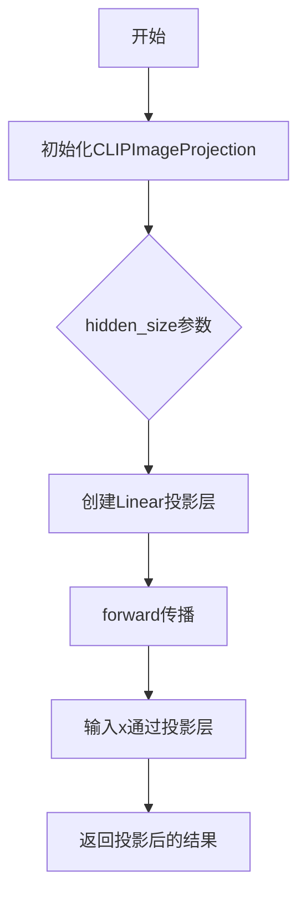

# `diffusers\src\diffusers\pipelines\stable_diffusion\clip_image_project_model.py` 详细设计文档

这是一个CLIP图像投影模块，用于将CLIP模型的hidden states进行线性投影变换，保持维度不变。该模块继承自ModelMixin和ConfigMixin，支持配置注册和模型加载功能。

## 整体流程



## 类结构

```
CLIPImageProjection (图像投影类)
├── 继承自: ModelMixin, ConfigMixin
└── 方法: __init__, forward
```

## 全局变量及字段


### `CLIPImageProjection.hidden_size`
    
隐藏层大小维度

类型：`int`
    


### `CLIPImageProjection.project`
    
线性投影层

类型：`nn.Linear`
    
    

## 全局函数及方法


### `CLIPImageProjection.__init__`

初始化CLIPImageProjection类的实例，设置隐藏层大小并创建一个线性投影层。

参数：

- `hidden_size`：`int`，隐藏层的维度大小，默认为768

返回值：`None`，该方法为初始化方法，不返回任何值

#### 流程图

```mermaid
flowchart TD
    A[开始 __init__] --> B[调用 super().__init__ 初始化基类]
    B --> C[设置 self.hidden_size = hidden_size 参数值]
    C --> D[创建线性投影层: nn.Linear hidden_size -> hidden_size, bias=False]
    D --> E[结束 __init__]
```

#### 带注释源码

```
@register_to_config  # 装饰器：将配置注册到配置Mixin系统中
def __init__(self, hidden_size: int = 768):
    """
    初始化投影层配置
    
    参数:
        hidden_size: int, 隐藏层维度大小，默认为768
    """
    super().__init__()  # 调用父类ModelMixin和ConfigMixin的初始化方法
    self.hidden_size = hidden_size  # 保存隐藏层大小到实例属性
    # 创建线性投影层: 将hidden_size维度的输入映射到hidden_size维度
    # bias=False 表示该线性层不使用偏置项
    self.project = nn.Linear(self.hidden_size, self.hidden_size, bias=False)
```


### `CLIPImageProjection.forward`

该方法执行CLIP图像特征的空间投影变换，通过线性变换将输入的高维图像嵌入向量映射到目标空间，用于增强文本到图像生成模型的条件控制能力。

参数：

- `x`：`torch.Tensor`，输入的CLIP图像隐藏状态张量，通常维度为`(batch_size, hidden_size)`或`(batch_size, seq_len, hidden_size)`

返回值：`torch.Tensor`，经过线性投影变换后的输出张量，维度与输入相同

#### 流程图

```mermaid
flowchart TD
    A[开始 forward] --> B[输入: x<br/>torch.Tensor]
    B --> C{执行线性投影}
    C --> D[self.project(x)]
    D --> E[输出: 投影后的张量<br/>torch.Tensor]
    E --> F[结束 forward]
    
    style A fill:#e1f5fe
    style C fill:#fff3e0
    style F fill:#e8f5e9
```

#### 带注释源码

```python
def forward(self, x):
    """
    CLIPImageProjection 的前向传播方法，执行线性投影变换
    
    参数:
        x (torch.Tensor): 
            输入的张量，通常为CLIP编码后的图像特征向量
            形状: (batch_size, hidden_size) 或 (batch_size, seq_len, hidden_size)
    
    返回:
        torch.Tensor: 
            经过线性投影变换后的张量
            形状与输入相同，保持维度一致性
    """
    # 使用预定义的线性层 self.project 对输入进行投影
    # 该线性层在 __init__ 中定义: nn.Linear(hidden_size, hidden_size, bias=False)
    # 投影前后维度保持不变，实现特征空间的线性变换
    return self.project(x)
```

## 关键组件


### CLIPImageProjection

核心功能是一个简单的线性投影层，用于将CLIP模型的图像隐藏状态从hidden_size维度映射到相同维度的空间，保持特征维度不变。

### hidden_size

类型: int，默认值 768
描述: 隐藏层大小，决定了输入和输出特征的维度。

### project

类型: nn.Linear
描述: 线性投影层，不带偏置，将特征从hidden_size维度映射到hidden_size维度。

### forward方法

参数: x (torch.Tensor) - 输入的张量
返回值: torch.Tensor - 投影后的张量
描述: 执行线性投影操作，将输入特征通过线性层进行变换并返回结果。

### 继承关系

描述: 继承自ModelMixin和ConfigMixin，ModelMixin提供了模型加载/保存功能，ConfigMixin支持配置注册和装饰器模式。


## 问题及建议


### 已知问题

- **缺少偏置项说明**：线性层使用 `bias=False`，但未在注释中说明移除偏置的具体原因，可能导致后续维护者困惑
- **缺乏非线性变换**：仅使用单一的线性变换 `nn.Linear`，无法学习更复杂的映射关系，可能限制模型的表达能力
- **无归一化层**：投影层前后缺少 LayerNorm 或其他归一化操作，可能导致训练不稳定
- **文档缺失**：类和方法缺少 docstring 文档说明，无法明确该类的设计目的和使用场景
- **硬编码默认值**：`hidden_size` 默认为 768（CLIP-B/32 的维度），缺乏灵活性，无法适配不同 CLIP 变体（如 CLIP-L 的 1024 维）
- **类型注解不完整**：`forward` 方法的参数 `x` 缺少类型注解，无法明确输入张量的期望 shape

### 优化建议

- 考虑添加 LayerNorm 以提升训练稳定性和特征归一化效果
- 可选的激活函数（如 GELU）可增加非线性表达能力
- 补充完整的类型注解和文档字符串，说明输入输出的 shape 期望
- 将默认 `hidden_size` 改为可选参数，或通过配置文件动态加载
- 添加配置验证逻辑，确保 `hidden_size` 为正整数
- 考虑添加残差连接以缓解深层网络的梯度消失问题


## 其它


### 设计目标与约束

该模块的设计目标是提供一个轻量级的CLIP图像投影层，用于将CLIP模型的图像嵌入从原始特征空间映射到目标特征空间。设计约束包括：必须继承ModelMixin和ConfigMixin以支持HuggingFace Diffusers框架的模型加载机制；投影层使用线性变换且不含偏置以保持特征空间的线性结构；hidden_size参数必须与CLIP模型的隐藏层维度匹配（默认768）。

### 错误处理与异常设计

该类的错误处理主要依赖框架级别的验证：__init__方法中hidden_size参数类型检查由Python类型提示提供编译时检查，运行时类型错误将由调用方负责捕获；Linear层的输入维度不匹配将在forward方法执行时触发torch.nn.Linear的维度不兼容异常；配置参数验证由register_to_config装饰器自动完成，不合法配置将在模型实例化时抛出ValueError。建议调用方在传入数据前验证输入张量的最后一维是否等于hidden_size。

### 数据流与状态机

数据流为单向流动：输入张量x（形状为[batch_size, seq_len, hidden_size]或[batch_size, hidden_size]）进入forward方法 → 经过nn.Linear变换（仅做线性投影，不改变形状） → 输出与输入形状相同的张量。该模块无状态机设计，因为投影操作是无状态的确定性变换，模型权重（self.project）由框架的加载机制管理，不涉及运行时状态转换。

### 外部依赖与接口契约

核心依赖包括：torch.nn提供线性层实现；configuration_utils.ConfigMixin提供配置注册和序列化功能；configuration_utils.register_to_config装饰器实现配置到__init__参数的自动映射；models.modeling_utils.ModelMixin提供模型权重加载和保存的基础设施。接口契约规定：__init__接受hidden_size整数参数（默认768）；forward接受形状为[*, hidden_size]的任意维度张量x，返回相同形状的张量；模型权重可通过state_dict()和from_pretrained()方法进行序列化和反序列化。

### 性能考虑

该模块的性能特征由nn.Linear决定：前向传播计算复杂度为O(batch_size * seq_len * hidden_size^2)，内存占用为O(hidden_size^2)的权重矩阵。由于使用了bias=False，参数数量减少hidden_size个，内存占用略有降低。建议在生产环境中使用torch.compile或ONNX导出以获得额外性能收益。

### 安全性考虑

该模块本身不涉及用户数据处理或敏感信息操作，安全性主要体现在依赖的模型文件加载过程中：from_pretrained方法加载的预训练权重应来自可信来源；模型文件应验证完整性校验和（如果有）；防止通过模型权重注入恶意代码（框架层面防护）。

### 兼容性考虑

该模块设计为与HuggingFace Diffusers库版本兼容，ConfigMixin和ModelMixin的接口在不同版本间保持稳定；hidden_size默认值为768，对应CLIP ViT-B/32模型的主要配置；如需支持其他CLIP变体（如ViT-L/14的hidden_size=1024），可通过配置参数覆盖。

    