# `diffusers\src\diffusers\pipelines\stable_diffusion\convert_from_ckpt.py` 详细设计文档

Conversion script for transforming Stable Diffusion model checkpoints (originally in .ckpt/.safetensors formats with YAML configs) into Hugging Face Diffusers pipeline objects. It supports various model architectures (v1.x, v2.x, SDXL) and components (UNet, VAE, Text Encoders, ControlNet).

## 整体流程

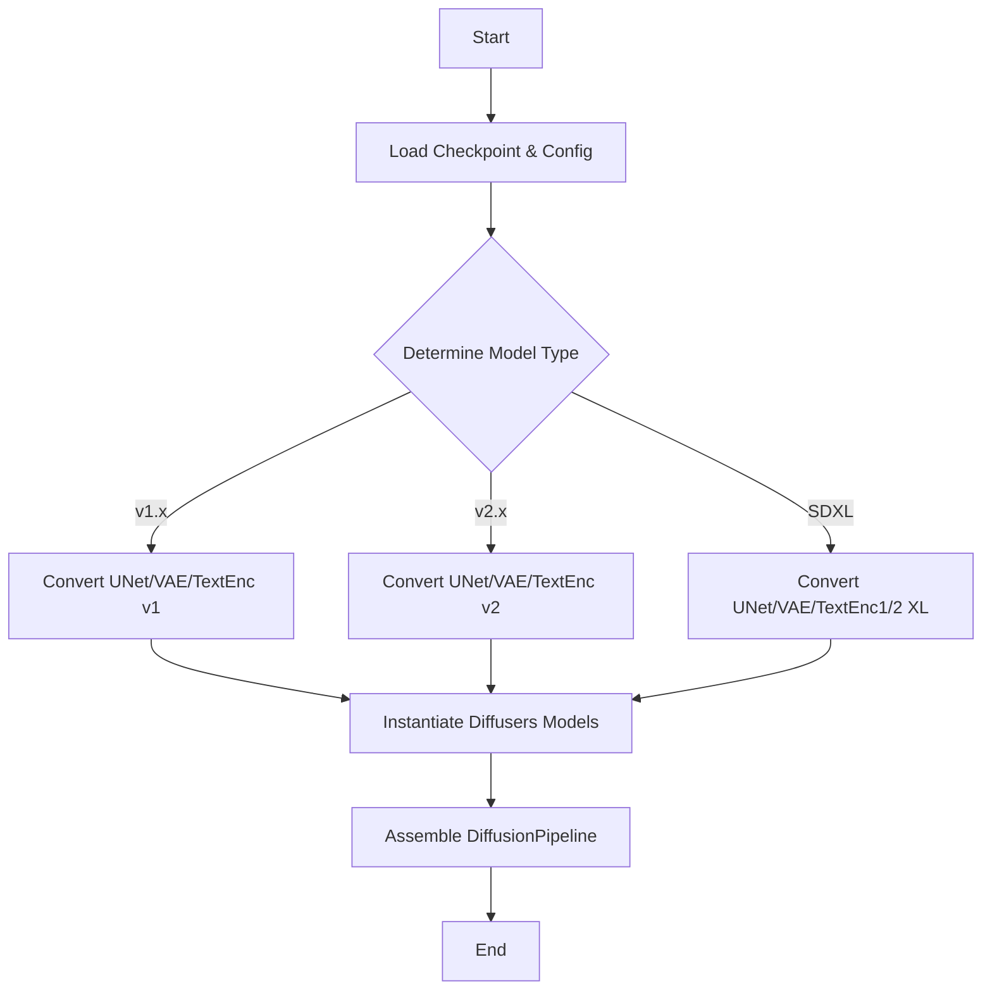

## 类结构

```
No user-defined classes in this script. The code is structured as a collection of functional modules for weight conversion and pipeline assembly.
```

## 全局变量及字段


### `logger`
    
模块级别的日志记录器，用于输出转换过程中的警告和信息

类型：`logging.Logger`
    


### `textenc_conversion_lst`
    
文本编码器键名转换列表，定义了原始键名到目标键名的映射关系

类型：`List[Tuple[str, str]]`
    


### `textenc_conversion_map`
    
文本编码器键名转换字典，将textenc_conversion_lst转换为字典形式便于查找

类型：`Dict[str, str]`
    


### `protected`
    
受保护的文本编码器转换映射，用于存储Transformer层名称的转换规则

类型：`Dict[str, str]`
    


### `textenc_pattern`
    
编译后的正则表达式模式，用于匹配和转换文本编码器中的Transformer层名称

类型：`re.Pattern`
    


    

## 全局函数及方法


### `shave_segments`

该函数用于从路径字符串中移除指定数量的段。正值移除开头的段，负值移除结尾的段，常用于模型权重路径的转换和重命名。

参数：

-  `path`：`str`，要处理的路径字符串（例如 `"input_blocks.0.0.weight"`）
-  `n_shave_prefix_segments`：`int`，要移除的段数量，正值移除开头，负值移除结尾，默认为 1

返回值：`str`，处理后的路径字符串

#### 流程图

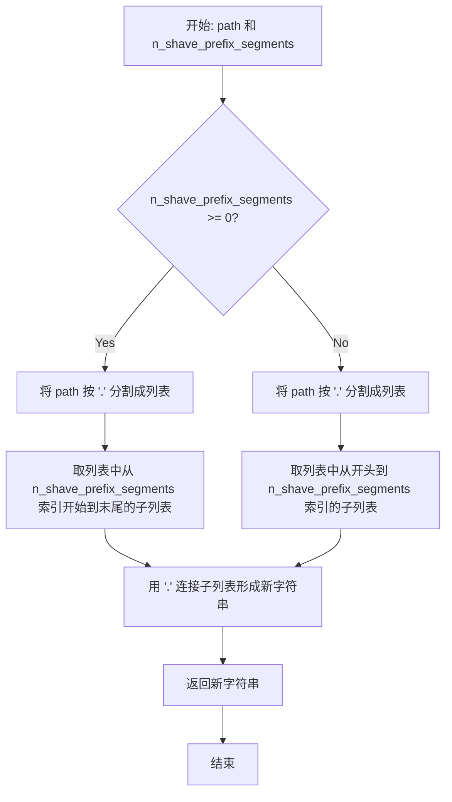

#### 带注释源码

```python
def shave_segments(path, n_shave_prefix_segments=1):
    """
    Removes segments. Positive values shave the first segments, negative shave the last segments.
    
    该函数用于从路径字符串中移除指定数量的段。
    - 当 n_shave_prefix_segments >= 0 时，从路径开头的第一个段开始移除
    - 当 n_shave_prefix_segments < 0 时，从路径末尾的最后一个段开始移除
    
    例如:
        shave_segments("input_blocks.0.0.weight", 1)  -> "0.0.weight"
        shave_segments("input_blocks.0.0.weight", 2)  -> "0.weight"
        shave_segments("input_blocks.0.0.weight", -1)  -> "input_blocks.0.0"
    """
    # 判断是否移除开头的段
    if n_shave_prefix_segments >= 0:
        # 移除开头的 n_shave_prefix_segments 个段
        # 例如: path="input_blocks.0.0.weight", n_shave_prefix_segments=1
        # split(".") -> ["input_blocks", "0", "0", "weight"]
        # [1:] -> ["0", "0", "weight"]
        # ".".join(...) -> "0.0.weight"
        return ".".join(path.split(".")[n_shave_prefix_segments:])
    else:
        # 移除末尾的 |n_shave_prefix_segments| 个段
        # 例如: path="input_blocks.0.0.weight", n_shave_prefix_segments=-1
        # split(".") -> ["input_blocks", "0", "0", "weight"]
        # [:-1] -> ["input_blocks", "0", "0"]
        # ".".join(...) -> "input_blocks.0.0"
        return ".".join(path.split(".")[:n_shave_prefix_segments])
```


### `renew_resnet_paths`

该函数用于将旧版 LDM (Latent Diffusion Model) 检查点中的 ResNet 路径名称转换为 Diffusers 格式的命名方案。它执行本地重命名操作，将旧路径中的特定字符串替换为新名称。

参数：

-  `old_list`：`List[str]`，包含旧版 LDM 检查点中 ResNet 层的路径名称列表
-  `n_shave_prefix_segments`：`int`，默认为 0，指定要移除的前缀段数（用于调整路径层级）

返回值：`List[Dict[str, str]]`，返回路径映射列表，每个元素包含 "old"（原始路径）和 "new"（新路径）键值对

#### 流程图

```mermaid
flowchart TD
    A[开始 renew_resnet_paths] --> B[初始化空 mapping 列表]
    B --> C{遍历 old_list 中的每个 old_item}
    C -->|是| D[将 'in_layers.0' 替换为 'norm1']
    D --> E[将 'in_layers.2' 替换为 'conv1']
    E --> F[将 'out_layers.0' 替换为 'norm2']
    F --> G[将 'out_layers.3' 替换为 'conv2']
    G --> H[将 'emb_layers.1' 替换为 'time_emb_proj']
    H --> I[将 'skip_connection' 替换为 'conv_shortcut']
    I --> J[调用 shave_segments 修整前缀段]
    J --> K[将 {old, new} 映射添加到 mapping]
    K --> C
    C -->|否| L[返回 mapping 列表]
    L --> M[结束]
```

#### 带注释源码

```python
def renew_resnet_paths(old_list, n_shave_prefix_segments=0):
    """
    Updates paths inside resnets to the new naming scheme (local renaming)
    
    此函数用于将旧版 Stable Diffusion / LDM 模型中的 ResNet 层权重路径
    转换为 Hugging Face Diffusers 格式的路径命名规则。
    
    主要转换规则：
    - in_layers.0 -> norm1 (第一个输入归一化层)
    - in_layers.2 -> conv1 (第一个卷积层)
    - out_layers.0 -> norm2 (输出归一化层)
    - out_layers.3 -> conv2 (第二个卷积层)
    - emb_layers.1 -> time_emb_proj (时间嵌入投影层)
    - skip_connection -> conv_shortcut (跳跃连接卷积)
    """
    # 初始化结果映射列表
    mapping = []
    
    # 遍历所有旧的路径名称
    for old_item in old_list:
        new_item = old_item
        
        # 替换输入层相关命名
        new_item = new_item.replace("in_layers.0", "norm1")
        new_item = new_item.replace("in_layers.2", "conv1")

        # 替换输出层相关命名
        new_item = new_item.replace("out_layers.0", "norm2")
        new_item = new_item.replace("out_layers.3", "conv2")

        # 替换时间嵌入层命名
        new_item = new_item.replace("emb_layers.1", "time_emb_proj")
        
        # 替换跳跃连接命名
        new_item = new_item.replace("skip_connection", "conv_shortcut")

        # 根据 n_shave_prefix_segments 参数修整路径前缀
        new_item = shave_segments(new_item, n_shave_prefix_segments=n_shave_prefix_segments)

        # 将旧路径到新路径的映射添加到结果列表
        mapping.append({"old": old_item, "new": new_item})

    # 返回完整的路径映射列表
    return mapping
```


### `renew_vae_resnet_paths`

该函数用于将 VAE ResNet 路径从旧命名方案更新为新命名方案，主要完成"nin_shortcut"到"conv_shortcut"的替换，并通过 `shave_segments` 函数处理路径前缀。

参数：

- `old_list`：`list`，需要转换的旧路径列表
- `n_shave_prefix_segments`：`int`，默认为0，控制要切掉的前缀段数量

返回值：`list[dict]`，返回包含 "old" 和 "new" 键的字典列表，表示旧路径到新路径的映射关系

#### 流程图

```mermaid
flowchart TD
    A[开始] --> B[初始化空 mapping 列表]
    B --> C{遍历 old_list 中的每个元素}
    C -->|对每个 old_item| D[复制为 new_item]
    D --> E["替换 'nin_shortcut' → 'conv_shortcut'"]
    E --> F[调用 shave_segments 切掉前缀段]
    F --> G[将 {old, new} 映射添加到 mapping]
    G --> C
    C -->|遍历完成| H[返回 mapping 列表]
    H --> I[结束]
```

#### 带注释源码

```python
def renew_vae_resnet_paths(old_list, n_shave_prefix_segments=0):
    """
    Updates paths inside resnets to the new naming scheme (local renaming)
    
    此函数用于将 VAE ResNet 的权重路径从 LDM 原始格式转换为 Diffusers 格式。
    主要处理 'nin_shortcut' -> 'conv_shortcut' 的命名替换。
    
    Args:
        old_list: 包含旧权重路径的列表
        n_shave_prefix_segments: 可选参数，指定要移除的前缀段数（默认0）
    
    Returns:
        mapping: 字典列表，每个字典包含 'old'（原始路径）和 'new'（新路径）
    """
    mapping = []
    for old_item in old_list:
        new_item = old_item  # 复制原始路径作为起点
        
        # 核心替换逻辑：将旧命名方案中的 nin_shortcut 替换为新命名方案的 conv_shortcut
        # 这是 VAE ResNet 块中跳跃连接（shortcut）权重的命名统一
        new_item = new_item.replace("nin_shortcut", "conv_shortcut")
        
        # 调用辅助函数 shave_segments 处理路径前缀
        # 当 n_shave_prefix_segments > 0 时，会移除路径开头的对应段数
        # 这在处理嵌套层级时非常有用
        new_item = shave_segments(new_item, n_shave_prefix_segments=n_shave_prefix_segments)
        
        # 将旧路径和新路径的映射关系添加到结果列表
        mapping.append({"old": old_item, "new": new_item})
    
    return mapping
```


### `renew_attention_paths`

该函数用于将注意力（attention）模块的旧路径名称更新为新的命名方案（本地重命名）。它接受一个旧路径列表，并返回一个包含旧路径与新路径映射关系的列表。当前实现中实际的替换逻辑被注释掉，因此该函数主要起占位符作用。

参数：

- `old_list`：`list`，需要转换的旧注意力路径字符串列表
- `n_shave_prefix_segments`：`int`，可选参数（默认值为 0），要从前缀 shaved 的段数

返回值：`list[dict]`，返回字典列表，每个字典包含 `old`（旧路径）和 `new`（新路径）的映射关系

#### 流程图

```mermaid
flowchart TD
    A[开始 renew_attention_paths] --> B[初始化空列表 mapping]
    B --> C{遍历 old_list 中的每个 old_item}
    C -->|是| D[将 old_item 赋值给 new_item]
    D --> E[（可选）执行字符串替换 - 当前被注释]
    E --> F[（可选）调用 shave_segments - 当前被注释]
    F --> G[将 {'old': old_item, 'new': new_item} 添加到 mapping]
    G --> C
    C -->|否| H[返回 mapping 列表]
    H --> I[结束]
```

#### 带注释源码

```python
def renew_attention_paths(old_list, n_shave_prefix_segments=0):
    """
    Updates paths inside attentions to the new naming scheme (local renaming)
    
    参数:
        old_list: 需要转换的旧注意力路径列表
        n_shave_prefix_segments: 可选参数，从前缀切除的段数，默认为0
    
    返回:
        包含 {'old': 原路径, 'new': 新路径} 字典的列表
    """
    # 初始化用于存储映射关系的空列表
    mapping = []
    
    # 遍历输入的旧路径列表
    for old_item in old_list:
        # 将旧路径赋值给新路径变量
        new_item = old_item

        # --- 以下替换逻辑被注释掉，实际未执行 ---
        # 原代码意图：将 norm.weight 替换为 group_norm.weight
        # new_item = new_item.replace('norm.weight', 'group_norm.weight')
        
        # 原代码意图：将 norm.bias 替换为 group_norm.bias
        # new_item = new_item.replace('norm.bias', 'group_norm.bias')

        # 原代码意图：将 proj_out.weight 替换为 proj_attn.weight
        # new_item = new_item.replace('proj_out.weight', 'proj_attn.weight')
        
        # 原代码意图：将 proj_out.bias 替换为 proj_attn.bias
        # new_item = new_item.replace('proj_out.bias', 'proj_attn.bias')

        # 原代码意图：调用 shave_segments 函数处理路径前缀
        # new_item = shave_segments(new_item, n_shave_prefix_segments=n_shave_prefix_segments)

        # 将旧路径和新路径的映射关系添加到列表中
        mapping.append({"old": old_item, "new": new_item})

    # 返回映射列表
    return mapping
```


### `renew_vae_attention_paths`

该函数用于将旧版 VAE 模型中注意力层（attention）的权重路径名称更新为新版本的命名规则，执行本地重命名操作。

参数：

-  `old_list`：`List[str]`，需要转换的旧版权重路径名称列表
-  `n_shave_prefix_segments`：`int`，可选参数，指定要移除的路径前缀段数，默认为 0

返回值：`List[Dict[str, str]]`，返回包含旧路径（old）和新路径（new）映射关系的字典列表

#### 流程图

```mermaid
flowchart TD
    A[开始] --> B[初始化空映射列表 mapping]
    --> C{遍历 old_list 中的每个 old_item}
    C -->|是| D[复制 old_item 到 new_item]
    D --> E[替换 norm.weight 为 group_norm.weight]
    E --> F[替换 norm.bias 为 group_norm.bias]
    F --> G[替换 q.weight 为 to_q.weight]
    G --> H[替换 q.bias 为 to_q.bias]
    H --> I[替换 k.weight 为 to_k.weight]
    I --> J[替换 k.bias 为 to_k.bias]
    J --> K[替换 v.weight 为 to_v.weight]
    K --> L[替换 v.bias 为 to_v.bias]
    L --> M[替换 proj_out.weight 为 to_out.0.weight]
    M --> N[替换 proj_out.bias 为 to_out.0.bias]
    N --> O[调用 shave_segments 修整路径前缀]
    O --> P[将映射 {'old': old_item, 'new': new_item} 添加到 mapping]
    P --> C
    C -->|否| Q[返回 mapping 列表]
    Q --> Z[结束]
```

#### 带注释源码

```python
def renew_vae_attention_paths(old_list, n_shave_prefix_segments=0):
    """
    Updates paths inside attentions to the new naming scheme (local renaming)
    
    此函数用于将旧版 Stable Diffusion VAE 模型中的注意力层权重路径
    转换为 Diffusers 库支持的新命名规则。主要转换包括：
    - norm.* -> group_norm.*
    - q.* -> to_q.*
    - k.* -> to_k.*
    - v.* -> to_v.*
    - proj_out.* -> to_out.0.*
    """
    # 初始化映射结果列表
    mapping = []
    
    # 遍历所有旧的权重路径
    for old_item in old_list:
        # 复制当前路径作为新路径的起点
        new_item = old_item

        # 将归一化层权重名从 norm 改为 group_norm
        new_item = new_item.replace("norm.weight", "group_norm.weight")
        new_item = new_item.replace("norm.bias", "group_norm.bias")

        # 将 Query 投影层权重名从 q 改为 to_q（适配新架构）
        new_item = new_item.replace("q.weight", "to_q.weight")
        new_item = new_item.replace("q.bias", "to_q.bias")

        # 将 Key 投影层权重名从 k 改为 to_k
        new_item = new_item.replace("k.weight", "to_k.weight")
        new_item = new_item.replace("k.bias", "to_k.bias")

        # 将 Value 投影层权重名从 v 改为 to_v
        new_item = new_item.replace("v.weight", "to_v.weight")
        new_item = new_item.replace("v.bias", "to_v.bias")

        # 将输出投影层权重名从 proj_out 改为 to_out.0
        # 注意：这是因为新架构中 attention 输出包含在子模块中
        new_item = new_item.replace("proj_out.weight", "to_out.0.weight")
        new_item = new_item.replace("proj_out.bias", "to_out.0.bias")

        # 根据 n_shave_prefix_segments 参数修整路径前缀
        # 正值移除前缀段，负值移除后缀段
        new_item = shave_segments(new_item, n_shave_prefix_segments=n_shave_prefix_segments)

        # 将旧路径到新路径的映射添加到结果列表
        mapping.append({"old": old_item, "new": new_item})

    return mapping
```


### `assign_to_checkpoint`

该函数执行模型权重转换的最后一步：接收本地转换的权重路径，应用全局重命名规则，将权重从旧的检查点格式分配到新的检查点格式中。如果提供了注意力路径，还会对注意力层进行分割处理。

参数：

- `paths`：`list[dict]`，包含"old"和"new"键的字典列表，定义权重的老路径和新路径对应关系
- `checkpoint`：`dict`，目标新检查点字典，用于存储转换后的权重
- `old_checkpoint`：`dict`，源旧检查点字典，包含待转换的原始权重
- `attention_paths_to_split`：`dict | None`，可选参数，注意力层路径映射，用于将复合注意力权重分割为query、key、value三个部分
- `additional_replacements`：`list[dict] | None`，可选参数，额外的路径替换规则列表，每个元素包含"old"和"new"键
- `config`：`dict | None`，可选参数，包含模型配置信息的字典，如`num_head_channels`等，用于注意力层分割计算

返回值：`None`，该函数直接修改`checkpoint`字典，不返回任何值

#### 流程图

```mermaid
flowchart TD
    A[开始 assign_to_checkpoint] --> B{paths 是列表?}
    B -->|否| C[抛出断言错误]
    B -->|是| D{attention_paths_to_split 不为空?}
    D -->|是| E[遍历 attention_paths_to_split]
    E --> F[从 old_checkpoint 获取旧张量]
    F --> G[计算通道数和目标形状]
    G --> H[计算 num_heads]
    H --> I[重塑张量并分割为 query/key/value]
    I --> J[将分割后的权重写入 checkpoint]
    D -->|否| K[遍历 paths 列表]
    K --> L[获取新路径 new_path]
    L --> M{new_path 在 attention_paths_to_split 中?}
    M -->|是| N[跳过继续下一个路径]
    M -->|否| O[执行全局重命名替换]
    O --> P{middle_block.0 替换}
    P --> Q[middle_block.1 替换]
    Q --> R[middle_block.2 替换]
    R --> S{additional_replacements 不为空?}
    S -->|是| T[应用额外替换规则]
    S -->|否| U{是注意力权重?}
    T --> U
    U -->|是| V{张量维度为3?}
    V -->|是| W[提取 [:, :, 0]]
    V -->|否| X{张量维度为4?}
    X -->|是| Y[提取 [:, :, 0, 0]]
    X -->|否| Z[直接赋值]
    U -->|否| Z
    Y --> AA[写入 checkpoint]
    W --> AA
    Z --> AA
    N --> BB{还有更多 paths?}
    AA --> BB
    BB -->|是| K
    BB -->|否| CC[结束]
```

#### 带注释源码

```python
def assign_to_checkpoint(
    paths, checkpoint, old_checkpoint, attention_paths_to_split=None, additional_replacements=None, config=None
):
    """
    This does the final conversion step: take locally converted weights and apply a global renaming to them. It splits
    attention layers, and takes into account additional replacements that may arise.

    Assigns the weights to the new checkpoint.
    """
    # 验证paths参数是否为列表类型，确保后续处理正确
    assert isinstance(paths, list), "Paths should be a list of dicts containing 'old' and 'new' keys."

    # 如果提供了attention_paths_to_split，则需要分割注意力层权重
    # 这通常用于将原始的复合注意力权重（包含query、key、value）拆分为独立的权重张量
    if attention_paths_to_split is not None:
        for path, path_map in attention_paths_to_split.items():
            # 从旧检查点中获取需要分割的注意力权重张量
            old_tensor = old_checkpoint[path]
            # 计算通道数（原维度除以3，因为包含query、key、value三部分）
            channels = old_tensor.shape[0] // 3

            # 根据原始张量维度确定目标形状
            target_shape = (-1, channels) if len(old_tensor.shape) == 3 else (-1)

            # 计算注意力头的数量
            num_heads = old_tensor.shape[0] // config["num_head_channels"] // 3

            # 重塑张量以分离不同的头和通道
            # 形状变为 (num_heads, 3 * channels // num_heads, ...)
            old_tensor = old_tensor.reshape((num_heads, 3 * channels // num_heads) + old_tensor.shape[1:])
            # 沿着维度1分割得到query、key、value
            query, key, value = old_tensor.split(channels // num_heads, dim=1)

            # 将分割后的query、key、value写入新检查点的对应位置
            checkpoint[path_map["query"]] = query.reshape(target_shape)
            checkpoint[path_map["key"]] = key.reshape(target_shape)
            checkpoint[path_map["value"]] = value.reshape(target_shape)

    # 遍历所有需要转换的路径
    for path in paths:
        new_path = path["new"]

        # 如果该路径已经通过attention_paths_to_split处理过，则跳过
        if attention_paths_to_split is not None and new_path in attention_paths_to_split:
            continue

        # 执行全局重命名：将旧的中Block命名映射到新的Diffusers命名
        new_path = new_path.replace("middle_block.0", "mid_block.resnets.0")
        new_path = new_path.replace("middle_block.1", "mid_block.attentions.0")
        new_path = new_path.replace("middle_block.2", "mid_block.resnets.1")

        # 如果提供了额外的替换规则，应用这些替换
        if additional_replacements is not None:
            for replacement in additional_replacements:
                new_path = new_path.replace(replacement["old"], replacement["new"])

        # 检查当前路径是否为注意力权重
        # 注意力权重需要特殊处理：从卷积1D转换为线性层
        is_attn_weight = "proj_attn.weight" in new_path or ("attentions" in new_path and "to_" in new_path)
        shape = old_checkpoint[path["old"]].shape
        
        # 根据张量维度进行不同的处理
        if is_attn_weight and len(shape) == 3:
            # 3D权重（通常是无偏重的卷积1D），提取第一个切片
            checkpoint[new_path] = old_checkpoint[path["old"]][:, :, 0]
        elif is_attn_weight and len(shape) == 4:
            # 4D权重（通常是有偏重的卷积1D），提取第一个切片
            checkpoint[new_path] = old_checkpoint[path["old"]][:, :, 0, 0]
        else:
            # 非注意力权重直接复制
            checkpoint[new_path] = old_checkpoint[path["old"]]
```


### `conv_attn_to_linear`

该函数用于将 Stable Diffusion 检查点中的注意力权重从卷积（Conv）格式转换为线性（Linear）格式。在原始 LDM 模型中，注意力层的权重以卷积形式存储（3D 或 4D 张量），需要转换为适合 Diffusers 格式的 2D 线性层权重。

参数：

- `checkpoint`：`dict`，包含模型权重键值对的检查点字典，直接在原字典上进行修改

返回值：`None`，无返回值（直接修改输入的 checkpoint 字典）

#### 流程图

```mermaid
flowchart TD
    A[开始] --> B[获取 checkpoint 的所有键列表]
    B --> C[定义注意力权重键列表: query.weight, key.weight, value.weight]
    C --> D[遍历每个 key]
    D --> E{检查 key 的最后两部分是否在 attn_keys 中}
    E -->|是| F{checkpoint[key].ndim > 2?}
    F -->|是| G[将权重切片为 checkpoint[key][:, :, 0, 0]]
    F -->|否| I{检查 key 是否包含 'proj_attn.weight'}
    G --> I
    E -->|否| I
    I --> J{检查 key 是否包含 'proj_attn.weight'}
    J -->|是| K{checkpoint[key].ndim > 2?}
    K -->|是| L[将权重切片为 checkpoint[key][:, :, 0]]
    K -->|否| M[继续下一个 key]
    L --> M
    J -->|否| M
    M --> N{是否还有未处理的 key?}
    N -->|是| D
    N -->|否| O[结束]
```

#### 带注释源码

```python
def conv_attn_to_linear(checkpoint):
    """
    将注意力权重从卷积格式转换为线性格式。
    
    在原始的 LDM (Latent Diffusion Models) 检查点中，注意力层的权重（如 query, key, value）
    以卷积形式存储（形状为 [out_channels, in_channels, height, width] 或类似结构）。
    转换为 Diffusers 格式时，需要将这些 3D/4D 张量压缩为 2D 线性层权重。
    
    该函数直接修改输入的 checkpoint 字典，不返回新字典。
    
    Args:
        checkpoint (dict): 模型权重字典，键为参数名称，值为 PyTorch 张量
        
    Returns:
        None: 直接在原 checkpoint 字典上进行原地修改
    """
    # 获取检查点中所有参数的键名列表
    keys = list(checkpoint.keys())
    
    # 定义需要转换的注意力层权重键名称
    # 这些对应于注意力机制中的 Q、K、V 投影权重
    attn_keys = ["query.weight", "key.weight", "value.weight"]
    
    # 遍历检查点中的每个参数键
    for key in keys:
        # 提取键名的最后两部分，用于匹配注意力权重模式
        # 例如: "encoder.mid.attn_1.to_q.weight" -> "to_q.weight"
        key_suffix = ".".join(key.split(".")[-2:])
        
        # 检查是否是 Q/K/V 权重
        if key_suffix in attn_keys:
            # 如果权重维度大于 2（是 3D 或 4D 张量），进行维度压缩
            # 从 [out_channels, in_channels, H, W] 或 [out_channels, in_channels, H]
            # 转换为 [out_channels, in_channels]
            if checkpoint[key].ndim > 2:
                # 提取第一个空间位置的值，将卷积核展平为线性层
                checkpoint[key] = checkpoint[key][:, :, 0, 0]
        
        # 检查是否是投影注意力权重 (proj_attn)
        # 这是注意力输出投影层
        elif "proj_attn.weight" in key:
            if checkpoint[key].ndim > 2:
                # 对于 proj_attn，只需要在最后一个维度取第一个切片
                # 形状从 [out_channels, in_channels, 1] 或更高维转换为 2D
                checkpoint[key] = checkpoint[key][:, :, 0]
```


### `create_unet_diffusers_config`

该函数用于将原始 LDMs (Latent Diffusion Models) 的 UNet 配置转换为 Diffusers 库所需的配置格式，支持普通 UNet 和 ControlNet 两种模式。

参数：

- `original_config`：`dict`，原始 LDMs 模型的完整配置文件（包含 model.params 中的所有模型配置信息）
- `image_size`：`int`，图像尺寸，用于计算采样大小
- `controlnet`：`bool`，可选参数，默认为 False，指定是否创建 ControlNet 配置

返回值：`dict`，返回转换后的 Diffusers 风格 UNet 配置字典

#### 流程图

```mermaid
flowchart TD
    A[开始] --> B{controlnet 是否为 True?}
    B -->|Yes| C[从 control_stage_config 获取 unet_params]
    B -->|No| D{unet_config 是否存在?}
    D -->|Yes| E[从 unet_config 获取 unet_params]
    D -->|No| F[从 network_config 获取 unet_params]
    
    C --> G[获取 vae_params]
    E --> G
    F --> G
    
    G --> H[计算 block_out_channels]
    H --> I[遍历生成 down_block_types]
    I --> J[遍历生成 up_block_types]
    J --> K[处理 transformer_layers_per_block]
    K --> L[计算 vae_scale_factor]
    L --> M[处理 head_dim 和 use_linear_projection]
    
    M --> N{是否有 context_dim?}
    N -->|Yes| O[提取 context_dim]
    N -->|No| P[保持 None]
    O --> Q{是否有 num_classes?}
    P --> Q
    
    Q -->|Yes| R{num_classes == 'sequential'?}
    R -->|Yes| S{context_dim in [2048, 1280]?}
    R -->|No| T[设置 class_embed_type]
    S -->|Yes| U[addition_embed_type = 'text_time']
    S -->|No| V[projection_class_embeddings_input_dim 设置]
    U --> W
    V --> W
    T --> W
    
    Q -->|No| W[构建配置字典]
    W --> X[处理可选字段 only_cross_attention]
    X --> Y{controlnet?}
    Y -->|Yes| Z[添加 conditioning_channels]
    Y -->|No| AA[添加 out_channels 和 up_block_types]
    Z --> AB[返回配置]
    AA --> AB
    
    style AB fill:#90EE90
```

#### 带注释源码

```python
def create_unet_diffusers_config(original_config, image_size: int, controlnet=False):
    """
    Creates a config for the diffusers based on the config of the LDM model.
    
    参数:
        original_config: 原始 LDMs 模型的完整配置字典
        image_size: 输入图像尺寸
        controlnet: 是否为 ControlNet 生成配置
        
    返回:
        转换后的 Diffusers 风格 UNet 配置字典
    """
    
    # 步骤1: 根据 controlnet 标志位，从原始配置中提取不同的 UNet 参数子集
    # ControlNet 模式使用独立的 control_stage_config
    if controlnet:
        unet_params = original_config["model"]["params"]["control_stage_config"]["params"]
    else:
        # 标准模式优先使用 unet_config，否则回退到 network_config
        if (
            "unet_config" in original_config["model"]["params"]
            and original_config["model"]["params"]["unet_config"] is not None
        ):
            unet_params = original_config["model"]["params"]["unet_config"]["params"]
        else:
            unet_params = original_config["model"]["params"]["network_config"]["params"]

    # 步骤2: 提取 VAE 配置，用于计算缩放因子
    vae_params = original_config["model"]["params"]["first_stage_config"]["params"]["ddconfig"]

    # 步骤3: 计算输出通道列表
    # 根据 model_channels 和 channel_mult 组合计算每一层的输出通道数
    block_out_channels = [unet_params["model_channels"] * mult for mult in unet_params["channel_mult"]]

    # 步骤4: 生成下采样块类型列表
    # 根据 attention_resolutions 判断每层是否使用交叉注意力块
    down_block_types = []
    resolution = 1
    for i in range(len(block_out_channels)):
        # 如果当前分辨率在 attention_resolutions 中，使用 CrossAttnDownBlock2D
        block_type = "CrossAttnDownBlock2D" if resolution in unet_params["attention_resolutions"] else "DownBlock2D"
        down_block_types.append(block_type)
        if i != len(block_out_channels) - 1:
            resolution *= 2

    # 步骤5: 生成上采样块类型列表
    # 逆序遍历，从最细粒度到最粗糙
    up_block_types = []
    for i in range(len(block_out_channels)):
        block_type = "CrossAttnUpBlock2D" if resolution in unet_params["attention_resolutions"] else "UpBlock2D"
        up_block_types.append(block_type)
        resolution //= 2

    # 步骤6: 处理 Transformer 层数配置
    # 支持整数或列表两种格式
    if unet_params["transformer_depth"] is not None:
        transformer_layers_per_block = (
            unet_params["transformer_depth"]
            if isinstance(unet_params["transformer_depth"], int)
            else list(unet_params["transformer_depth"])
        )
    else:
        transformer_layers_per_block = 1

    # 步骤7: 计算 VAE 缩放因子
    # 基于 VAE 通道倍数列表的长度计算
    vae_scale_factor = 2 ** (len(vae_params["ch_mult"]) - 1)

    # 步骤8: 处理注意力头维度配置
    # 支持 num_heads 或 num_head_channels 两种定义方式
    head_dim = unet_params["num_heads"] if "num_heads" in unet_params else None
    use_linear_projection = (
        unet_params["use_linear_in_transformer"] if "use_linear_in_transformer" in unet_params else False
    )
    # 对于 SD 2-base-512/768 版本，需要特殊处理 head_dim
    if use_linear_projection:
        # stable diffusion 2-base-512 and 2-768
        if head_dim is None:
            head_dim_mult = unet_params["model_channels"] // unet_params["num_head_channels"]
            head_dim = [head_dim_mult * c for c in list(unet_params["channel_mult"])]

    # 步骤9: 初始化类别嵌入相关变量
    class_embed_type = None
    addition_embed_type = None
    addition_time_embed_dim = None
    projection_class_embeddings_input_dim = None
    context_dim = None

    # 步骤10: 提取上下文维度
    if unet_params["context_dim"] is not None:
        context_dim = (
            unet_params["context_dim"]
            if isinstance(unet_params["context_dim"], int)
            else unet_params["context_dim"][0]
        )

    # 步骤11: 处理类别嵌入配置
    # 支持顺序类别嵌入和 SDXL 特殊配置
    if "num_classes" in unet_params:
        if unet_params["num_classes"] == "sequential":
            if context_dim in [2048, 1280]:
                # SDXL 配置使用 text_time 嵌入类型
                addition_embed_type = "text_time"
                addition_time_embed_dim = 256
            else:
                class_embed_type = "projection"
            assert "adm_in_channels" in unet_params
            projection_class_embeddings_input_dim = unet_params["adm_in_channels"]

    # 步骤12: 构建核心配置字典
    config = {
        "sample_size": image_size // vae_scale_factor,  # 潜在空间尺寸
        "in_channels": unet_params["in_channels"],       # 输入通道数
        "down_block_types": tuple(down_block_types),      # 下采样块类型
        "block_out_channels": tuple(block_out_channels), # 输出通道列表
        "layers_per_block": unet_params["num_res_blocks"], # 每块残差层数
        "cross_attention_dim": context_dim,               # 交叉注意力维度
        "attention_head_dim": head_dim,                  # 注意力头维度
        "use_linear_projection": use_linear_projection,  # 是否使用线性投影
        "class_embed_type": class_embed_type,            # 类别嵌入类型
        "addition_embed_type": addition_embed_type,      # 额外嵌入类型
        "addition_time_embed_dim": addition_time_embed_dim, # 时间嵌入维度
        "projection_class_embeddings_input_dim": projection_class_embeddings_input_dim, # 投影嵌入输入维度
        "transformer_layers_per_block": transformer_layers_per_block, # Transformer层数
    }

    # 步骤13: 处理可选配置项
    if "disable_self_attentions" in unet_params:
        config["only_cross_attention"] = unet_params["disable_self_attentions"]

    if "num_classes" in unet_params and isinstance(unet_params["num_classes"], int):
        config["num_class_embeds"] = unet_params["num_classes"]

    # 步骤14: 根据 ControlNet 模式添加特定配置
    if controlnet:
        config["conditioning_channels"] = unet_params["hint_channels"]
    else:
        config["out_channels"] = unet_params["out_channels"]
        config["up_block_types"] = tuple(up_block_types)

    return config
```


### `create_vae_diffusers_config`

该函数用于从原始 LDM (Latent Diffusion Models) 模型的配置中创建 Diffusers 格式的 VAE (Variational Autoencoder) 配置文件，提取 VAE 的通道数、块类型等关键参数。

参数：

- `original_config`：`dict`，原始 LDM 模型的配置字典，包含模型参数和第一阶段配置（first_stage_config）
- `image_size`：`int`，输入图像的尺寸，用于计算下采样分辨率和确定块类型

返回值：`dict`，返回一个包含 VAE 配置的字典，包含以下键值：
- `sample_size`：样本尺寸
- `in_channels`：输入通道数
- `out_channels`：输出通道数
- `down_block_types`：下采样块类型元组
- `up_block_types`：上采样块类型元组
- `block_out_channels`：块输出通道数元组
- `latent_channels`：潜在空间通道数
- `layers_per_block`：每个块的层数

#### 流程图

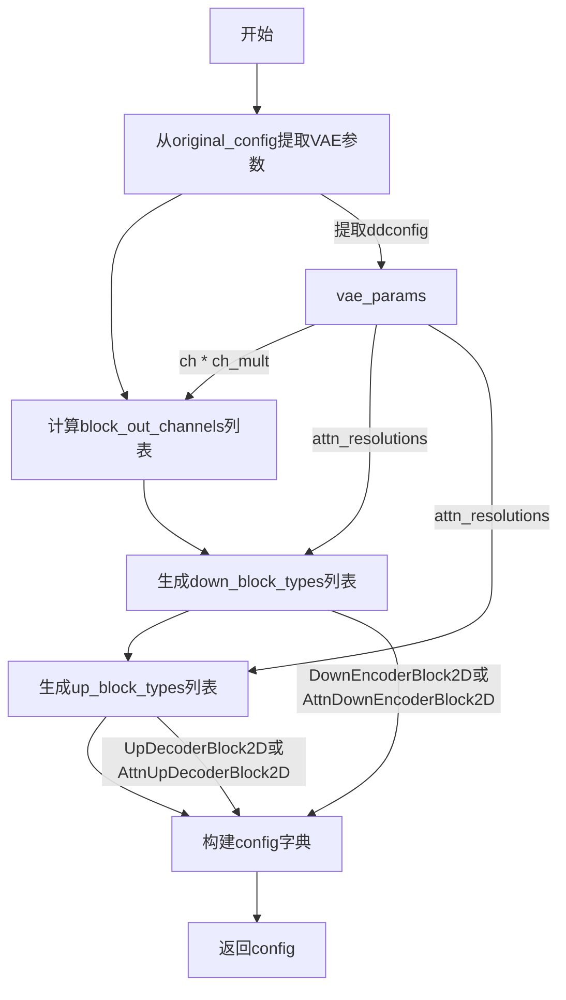

#### 带注释源码

```python
def create_vae_diffusers_config(original_config, image_size: int):
    """
    Creates a config for the diffusers based on the config of the LDM model.
    
    该函数从原始 LDM 模型的配置字典中提取 VAE 相关的参数，
    并将其转换为 Diffusers 库所需的配置格式。
    
    参数:
        original_config (dict): 原始 LDM 模型的完整配置字典
        image_size (int): 输入图像的尺寸大小
    
    返回:
        dict: 包含 VAE 配置信息的字典
    """
    # 从原始配置中提取第一阶段模型（VAE）的配置参数
    # original_config["model"]["params"]["first_stage_config"]["params"]["ddconfig"]
    # 包含 VAE 的通道数、注意力分辨率等关键配置
    vae_params = original_config["model"]["params"]["first_stage_config"]["params"]["ddconfig"]
    
    # 提取 embedding 维度（这里使用下划线表示该变量未被使用）
    # original_config["model"]["params"]["first_stage_config"]["params"]["embed_dim"]
    _ = original_config["model"]["params"]["first_stage_config"]["params"]["embed_dim"]

    # 计算每个块的输出通道数：基础通道数乘以通道乘数
    # 例如：如果 ch=128, ch_mult=[1,2,4,4]，则 block_out_channels=[128, 256, 512, 512]
    block_out_channels = [vae_params["ch"] * mult for mult in vae_params["ch_mult"]]
    
    # 根据图像尺寸和注意力分辨率确定下采样块类型
    # 如果当前分辨率不在注意力分辨率列表中，使用普通的 DownEncoderBlock2D
    # 否则使用带注意力的 AttnDownEncoderBlock2D
    # image_size // 2**i 计算当前层级的分辨率（例如 512//2=256, 512//4=128 等）
    down_block_types = [
        "DownEncoderBlock2D" if image_size // 2**i not in vae_params["attn_resolutions"] else "AttnDownEncoderBlock2D"
        for i, _ in enumerate(block_out_channels)
    ]
    
    # 同样逻辑确定上采样块类型，然后反转列表顺序（因为上采样是从低分辨率到高分辨率）
    up_block_types = [
        "UpDecoderBlock2D" if image_size // 2**i not in vae_params["attn_resolutions"] else "AttnUpDecoderBlock2D"
        for i, _ in enumerate(block_out_channels)
    ][::-1]

    # 构建最终的 VAE 配置字典
    config = {
        "sample_size": image_size,           # 输入样本的尺寸
        "in_channels": vae_params["in_channels"],      # VAE encoder 输入通道数
        "out_channels": vae_params["out_ch"],          # VAE decoder 输出通道数
        "down_block_types": tuple(down_block_types),   # 下采样块类型元组
        "up_block_types": tuple(up_block_types),       # 上采样块类型元组
        "block_out_channels": tuple(block_out_channels),  # 每个块的输出通道数
        "latent_channels": vae_params["z_channels"],    # 潜在空间通道数
        "layers_per_block": vae_params["num_res_blocks"],  # 每个块中的残差层数
    }
    return config
```


### `create_diffusers_schedular`

该函数用于根据原始 Stable Diffusion 模型的配置文件创建对应的 Diffusers 调度器（DDIMScheduler），将 LDM 模型的噪声调度参数转换为 Diffusers 框架所需的格式。

参数：

- `original_config`：`dict`，原始 LDM 模型的配置文件，包含 `model.params` 下的 `timesteps`、`linear_start` 和 `linear_end` 等调度器相关参数

返回值：`DDIMScheduler`，返回配置好的 DDIM 调度器对象，用于控制扩散模型的采样过程

#### 流程图

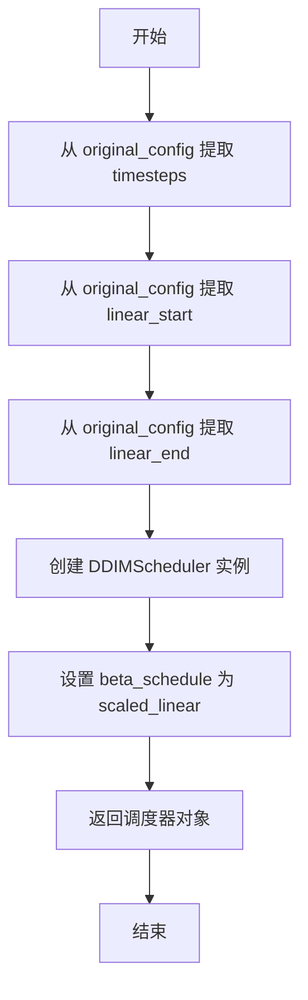

#### 带注释源码

```python
def create_diffusers_schedular(original_config):
    """
    根据原始 LDM 模型配置创建 Diffusers 调度器
    
    参数:
        original_config: 包含模型配置和参数的字典，需包含以下键:
            - model.params.timesteps: 训练时的总步数
            - model.params.linear_start: beta 线性起始值
            - model.params.linear_end: beta 线性结束值
    
    返回:
        DDIMScheduler: 配置好的 DDIM 调度器实例
    """
    # 创建 DDIMScheduler 实例，使用原始模型配置中的参数
    schedular = DDIMScheduler(
        # 从配置中提取训练时的总时间步数
        num_train_timesteps=original_config["model"]["params"]["timesteps"],
        # 从配置中提取 beta 曲线的起始值
        beta_start=original_config["model"]["params"]["linear_start"],
        # 从配置中提取 beta 曲线的结束值
        beta_end=original_config["model"]["params"]["linear_end"],
        # 使用缩放后的线性 beta 调度策略
        beta_schedule="scaled_linear",
    )
    # 返回配置完成的调度器对象
    return schedular
```


### `create_ldm_bert_config`

该函数用于从原始 Stable Diffusion 检查点的配置中提取 BERT（条件阶段）模型的参数，并创建适用于 Diffusers 库的 LDMBertConfig 配置对象。

参数：

- `original_config`：`dict`，原始模型的 YAML 配置字典，包含 `model.params.cond_stage_config` 中的 BERT 参数

返回值：`LDMBertConfig`，返回配置好的 BERT 模型配置对象，包含模型维度、层数和前馈网络维度

#### 流程图

```mermaid
flowchart TD
    A[开始: create_ldm_bert_config] --> B[提取 BERT 参数<br/>original_config['model']['params']['cond_stage_config']['params']]
    B --> C[创建 LDMBertConfig 对象]
    C --> D[设置 d_model = bert_params.n_embed]
    D --> E[设置 encoder_layers = bert_params.n_layer]
    E --> F[设置 encoder_ffn_dim = bert_params.n_embed * 4]
    F --> G[返回 config 对象]
    G --> H[结束]
```

#### 带注释源码

```python
def create_ldm_bert_config(original_config):
    """
    从原始配置中创建 LDMBertConfig。
    
    该函数从 Stable Diffusion 原始检查点的 YAML 配置中提取条件阶段
    (cond_stage) BERT 模型的相关参数，并将其转换为 Diffusers 库
    所使用的 LDMBertConfig 配置对象。
    
    参数:
        original_config (dict): 
            原始模型的完整配置字典，通常来自 YAML 文件解析。
            应包含 model.params.cond_stage_config.params 结构。
    
    返回:
        LDMBertConfig: 
            配置对象，包含 BERT 模型的关键参数：
            - d_model: 模型隐藏层维度
            - encoder_layers: 编码器层数
            - encoder_ffn_dim: 前馈网络维度（通常为 d_model * 4）
    """
    # 从原始配置中提取 BERT 参数
    # cond_stage_config 是 LDM 模型中条件文本编码器的配置
    bert_params = original_config["model"]["params"]["cond_stage_config"]["params"]
    
    # 创建 LDMBertConfig 配置对象
    # d_model: 隐藏层维度，对应原始模型中的 n_embed（embedding 数量）
    # encoder_layers: Transformer 编码器层数，对应原始模型中的 n_layer
    # encoder_ffn_dim: 前馈网络中间层维度，通常设置为 d_model 的 4 倍
    config = LDMBertConfig(
        d_model=bert_params.n_embed,
        encoder_layers=bert_params.n_layer,
        encoder_ffn_dim=bert_params.n_embed * 4,
    )
    
    return config
```


### `convert_ldm_unet_checkpoint`

该函数用于将 Stable Diffusion 的 LDM（Latent Diffusion Model）格式的 UNet 检查点权重转换为 Hugging Face Diffusers 格式。它处理权重键名的重命名、EMA 权重的提取、注意力机制的分割以及 ControlNet 特定权重的转换。

参数：

- `checkpoint`：`dict[str, torch.Tensor]`，原始 LDM 格式的检查点状态字典
- `config`：`dict`，UNet 的 Diffusers 配置字典，包含模型结构参数如 `class_embed_type`、`addition_embed_type`、`layers_per_block` 等
- `path`：`str | None`，可选的检查点文件路径，用于日志记录
- `extract_ema`：`bool`，是否提取 EMA（指数移动平均）权重，默认为 False
- `controlnet`：`bool`，是否为 ControlNet 模型转换权重，默认为 False
- `skip_extract_state_dict`：`bool`，是否跳过状态字典提取步骤，默认为 False

返回值：`dict[str, torch.Tensor]`，转换后的 Diffusers 格式检查点字典，键名为新的 UNet 结构命名规范

#### 流程图

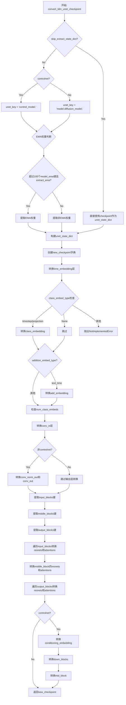

#### 带注释源码

```python
def convert_ldm_unet_checkpoint(
    checkpoint, config, path=None, extract_ema=False, controlnet=False, skip_extract_state_dict=False
):
    """
    Takes a state dict and a config, and returns a converted checkpoint.
    """
    
    # 步骤1: 确定是否需要从checkpoint中提取UNet的状态字典
    if skip_extract_state_dict:
        # 如果skip_extract_state_dict为True，直接使用checkpoint作为unet_state_dict
        unet_state_dict = checkpoint
    else:
        # 提取UNet的状态字典
        unet_state_dict = {}
        keys = list(checkpoint.keys())

        # 根据是否为ControlNet模型确定UNet键的前缀
        if controlnet:
            unet_key = "control_model."
        else:
            unet_key = "model.diffusion_model."

        # 判断checkpoint是否包含EMA权重（至少100个以model_ema开头的参数）
        # 如果包含EMA权重且extract_ema为True，则提取EMA权重
        if sum(k.startswith("model_ema") for k in keys) > 100 and extract_ema:
            logger.warning(f"Checkpoint {path} has both EMA and non-EMA weights.")
            logger.warning(
                "In this conversion only the EMA weights are extracted. If you want to instead extract the non-EMA"
                " weights (useful to continue fine-tuning), please make sure to remove the `--extract_ema` flag."
            )
            # 提取EMA权重：将model.diffusion_model.xxx替换为model_ema.xxx
            for key in keys:
                if key.startswith("model.diffusion_model"):
                    flat_ema_key = "model_ema." + "".join(key.split(".")[1:])
                    unet_state_dict[key.replace(unet_key, "")] = checkpoint.pop(flat_ema_key)
        else:
            # 否则提取非EMA权重
            if sum(k.startswith("model_ema") for k in keys) > 100:
                logger.warning(
                    "In this conversion only the non-EMA weights are extracted. If you want to instead extract the EMA"
                    " weights (usually better for inference), please make sure to add the `--extract_ema` flag."
                )

            for key in keys:
                if key.startswith(unet_key):
                    # 移除unet_key前缀，保留剩余部分作为新键
                    unet_state_dict[key.replace(unet_key, "")] = checkpoint.pop(key)

    # 步骤2: 创建新的checkpoint字典
    new_checkpoint = {}

    # 步骤3: 转换时间嵌入层 (time embedding)
    # LDM格式: time_embed.0.weight -> Diffusers格式: time_embedding.linear_1.weight
    new_checkpoint["time_embedding.linear_1.weight"] = unet_state_dict["time_embed.0.weight"]
    new_checkpoint["time_embedding.linear_1.bias"] = unet_state_dict["time_embed.0.bias"]
    new_checkpoint["time_embedding.linear_2.weight"] = unet_state_dict["time_embed.2.weight"]
    new_checkpoint["time_embedding.linear_2.bias"] = unet_state_dict["time_embed.2.bias"]

    # 步骤4: 转换类别嵌入层 (class embedding)
    # 根据config中的class_embed_type决定如何转换
    if config["class_embed_type"] is None:
        # 无类别嵌入，无需转换
        ...
    elif config["class_embed_type"] == "timestep" or config["class_embed_type"] == "projection":
        # 转换timestep或projection类型的类别嵌入
        new_checkpoint["class_embedding.linear_1.weight"] = unet_state_dict["label_emb.0.0.weight"]
        new_checkpoint["class_embedding.linear_1.bias"] = unet_state_dict["labelEmb.0.0.bias"]
        new_checkpoint["class_embedding.linear_2.weight"] = unet_state_dict["label_emb.0.2.weight"]
        new_checkpoint["class_embedding.linear_2.bias"] = unet_state_dict["label_emb.0.2.bias"]
    else:
        raise NotImplementedError(f"Not implemented `class_embed_type`: {config['class_embed_type']}")

    # 步骤5: 转换额外的文本-时间嵌入 (addition embedding)
    if config["addition_embed_type"] == "text_time":
        new_checkpoint["add_embedding.linear_1.weight"] = unet_state_dict["label_emb.0.0.weight"]
        new_checkpoint["add_embedding.linear_1.bias"] = unet_state_dict["label_emb.0.0.bias"]
        new_checkpoint["add_embedding.linear_2.weight"] = unet_state_dict["label_emb.0.2.weight"]
        new_checkpoint["add_embedding.linear_2.bias"] = unet_state_dict["label_emb.0.2.bias"]

    # 步骤6: 处理StableDiffusionUpscalePipeline的类别嵌入
    if "num_class_embeds" in config:
        if (config["num_class_embeds"] is not None) and ("label_emb.weight" in unet_state_dict):
            new_checkpoint["class_embedding.weight"] = unet_state_dict["label_emb.weight"]

    # 步骤7: 转换输入卷积层 (conv_in)
    new_checkpoint["conv_in.weight"] = unet_state_dict["input_blocks.0.0.weight"]
    new_checkpoint["conv_in.bias"] = unet_state_dict["input_blocks.0.0.bias"]

    # 步骤8: 转换输出卷积层 (仅非ControlNet模型)
    if not controlnet:
        new_checkpoint["conv_norm_out.weight"] = unet_state_dict["out.0.weight"]
        new_checkpoint["conv_norm_out.bias"] = unet_state_dict["out.0.bias"]
        new_checkpoint["conv_out.weight"] = unet_state_dict["out.2.weight"]
        new_checkpoint["conv_out.bias"] = unet_state_dict["out.2.bias"]

    # 步骤9: 获取输入块 (input blocks) 的键
    # 统计input_blocks中不同层组的数量
    num_input_blocks = len({".".join(layer.split(".")[:2]) for layer in unet_state_dict if "input_blocks" in layer})
    # 为每个输入块收集相关的键
    input_blocks = {
        layer_id: [key for key in unet_state_dict if f"input_blocks.{layer_id}" in key]
        for layer_id in range(num_input_blocks)
    }

    # 步骤10: 获取中间块 (middle blocks) 的键
    num_middle_blocks = len({".".join(layer.split(".")[:2]) for layer in unet_state_dict if "middle_block" in layer})
    middle_blocks = {
        layer_id: [key for key in unet_state_dict if f"middle_block.{layer_id}" in key]
        for layer_id in range(num_middle_blocks)
    }

    # 步骤11: 获取输出块 (output blocks) 的键
    num_output_blocks = len({".".join(layer.split(".")[:2]) for layer in unet_state_dict if "output_blocks" in layer})
    output_blocks = {
        layer_id: [key for key in unet_state_dict if f"output_blocks.{layer_id}" in key]
        for layer_id in range(num_output_blocks)
    }

    # 步骤12: 转换输入块 (除了第一个块 input_blocks.0)
    for i in range(1, num_input_blocks):
        # 计算块ID和层ID
        block_id = (i - 1) // (config["layers_per_block"] + 1)
        layer_in_block_id = (i - 1) % (config["layers_per_block"] + 1)

        # 提取resnets和attentions的键
        resnets = [
            key for key in input_blocks[i] if f"input_blocks.{i}.0" in key and f"input_blocks.{i}.0.op" not in key
        ]
        attentions = [key for key in input_blocks[i] if f"input_blocks.{i}.1" in key]

        # 处理下采样层 (downsampler)
        if f"input_blocks.{i}.0.op.weight" in unet_state_dict:
            new_checkpoint[f"down_blocks.{block_id}.downsamplers.0.conv.weight"] = unet_state_dict.pop(
                f"input_blocks.{i}.0.op.weight"
            )
            new_checkpoint[f"down_blocks.{block_id}.downsamplers.0.conv.bias"] = unet_state_dict.pop(
                f"input_blocks.{i}.0.op.bias"
            )

        # 转换resnet路径并分配权重
        paths = renew_resnet_paths(resnets)
        meta_path = {"old": f"input_blocks.{i}.0", "new": f"down_blocks.{block_id}.resnets.{layer_in_block_id}"}
        assign_to_checkpoint(
            paths, new_checkpoint, unet_state_dict, additional_replacements=[meta_path], config=config
        )

        # 转换attention路径并分配权重
        if len(attentions):
            paths = renew_attention_paths(attentions)
            meta_path = {"old": f"input_blocks.{i}.1", "new": f"down_blocks.{block_id}.attentions.{layer_in_block_id}"}
            assign_to_checkpoint(
                paths, new_checkpoint, unet_state_dict, additional_replacements=[meta_path], config=config
            )

    # 步骤13: 转换中间块
    resnet_0 = middle_blocks[0]
    attentions = middle_blocks[1]
    resnet_1 = middle_blocks[2]

    # 转换中间块的resnet
    resnet_0_paths = renew_resnet_paths(resnet_0)
    assign_to_checkpoint(resnet_0_paths, new_checkpoint, unet_state_dict, config=config)

    resnet_1_paths = renew_resnet_paths(resnet_1)
    assign_to_checkpoint(resnet_1_paths, new_checkpoint, unet_state_dict, config=config)

    # 转换中间块的attention
    attentions_paths = renew_attention_paths(attentions)
    meta_path = {"old": "middle_block.1", "new": "mid_block.attentions.0"}
    assign_to_checkpoint(
        attentions_paths, new_checkpoint, unet_state_dict, additional_replacements=[meta_path], config=config
    )

    # 步骤14: 转换输出块
    for i in range(num_output_blocks):
        block_id = i // (config["layers_per_block"] + 1)
        layer_in_block_id = i % (config["layers_per_block"] + 1)
        # 处理层名称
        output_block_layers = [shave_segments(name, 2) for name in output_blocks[i]]
        output_block_list = {}

        for layer in output_block_layers:
            layer_id, layer_name = layer.split(".")[0], shave_segments(layer, 1)
            if layer_id in output_block_list:
                output_block_list[layer_id].append(layer_name)
            else:
                output_block_list[layer_id] = [layer_name]

        # 根据输出块列表类型进行处理
        if len(output_block_list) > 1:
            # 多个层的情况：包含resnet和可能的attention
            resnets = [key for key in output_blocks[i] if f"output_blocks.{i}.0" in key]
            attentions = [key for key in output_blocks[i] if f"output_blocks.{i}.1" in key]

            resnet_0_paths = renew_resnet_paths(resnets)
            paths = renew_resnet_paths(resnets)

            meta_path = {"old": f"output_blocks.{i}.0", "new": f"up_blocks.{block_id}.resnets.{layer_in_block_id}"}
            assign_to_checkpoint(
                paths, new_checkpoint, unet_state_dict, additional_replacements=[meta_path], config=config
            )

            # 处理上采样器
            output_block_list = {k: sorted(v) for k, v in sorted(output_block_list.items())}
            if ["conv.bias", "conv.weight"] in output_block_list.values():
                index = list(output_block_list.values()).index(["conv.bias", "conv.weight"])
                new_checkpoint[f"up_blocks.{block_id}.upsamplers.0.conv.weight"] = unet_state_dict[
                    f"output_blocks.{i}.{index}.conv.weight"
                ]
                new_checkpoint[f"up_blocks.{block_id}.upsamplers.0.conv.bias"] = unet_state_dict[
                    f"output_blocks.{i}.{index}.conv.bias"
                ]

                # 清除已分配的attention
                if len(attentions) == 2:
                    attentions = []

            # 处理attention层
            if len(attentions):
                paths = renew_attention_paths(attentions)
                meta_path = {
                    "old": f"output_blocks.{i}.1",
                    "new": f"up_blocks.{block_id}.attentions.{layer_in_block_id}",
                }
                assign_to_checkpoint(
                    paths, new_checkpoint, unet_state_dict, additional_replacements=[meta_path], config=config
                )
        else:
            # 单层情况的处理
            resnet_0_paths = renew_resnet_paths(output_block_layers, n_shave_prefix_segments=1)
            for path in resnet_0_paths:
                old_path = ".".join(["output_blocks", str(i), path["old"]])
                new_path = ".".join(["up_blocks", str(block_id), "resnets", str(layer_in_block_id), path["new"]])

                new_checkpoint[new_path] = unet_state_dict[old_path]

    # 步骤15: 转换ControlNet特定权重 (如果controlnet=True)
    if controlnet:
        # 转换条件嵌入层 (conditioning embedding)
        orig_index = 0

        new_checkpoint["controlnet_cond_embedding.conv_in.weight"] = unet_state_dict.pop(
            f"input_hint_block.{orig_index}.weight"
        )
        new_checkpoint["controlnet_cond_embedding.conv_in.bias"] = unet_state_dict.pop(
            f"input_hint_block.{orig_index}.bias"
        )

        orig_index += 2

        diffusers_index = 0

        while diffusers_index < 6:
            new_checkpoint[f"controlnet_cond_embedding.blocks.{diffusers_index}.weight"] = unet_state_dict.pop(
                f"input_hint_block.{orig_index}.weight"
            )
            new_checkpoint[f"controlnet_cond_embedding.blocks.{diffusers_index}.bias"] = unet_state_dict.pop(
                f"input_hint_block.{orig_index}.bias"
            )
            diffusers_index += 1
            orig_index += 2

        new_checkpoint["controlnet_cond_embedding.conv_out.weight"] = unet_state_dict.pop(
            f"input_hint_block.{orig_index}.weight"
        )
        new_checkpoint["controlnet_cond_embedding.conv_out.bias"] = unet_state_dict.pop(
            f"input_hint_block.{orig_index}.bias"
        )

        # 转换下采样块 (down blocks)
        for i in range(num_input_blocks):
            new_checkpoint[f"controlnet_down_blocks.{i}.weight"] = unet_state_dict.pop(f"zero_convs.{i}.0.weight")
            new_checkpoint[f"controlnet_down_blocks.{i}.bias"] = unet_state_dict.pop(f"zero_convs.{i}.0.bias")

        # 转换中间块 (mid block)
        new_checkpoint["controlnet_mid_block.weight"] = unet_state_dict.pop("middle_block_out.0.weight")
        new_checkpoint["controlnet_mid_block.bias"] = unet_state_dict.pop("middle_block_out.0.bias")

    # 步骤16: 返回转换后的checkpoint
    return new_checkpoint
```


### `convert_ldm_vae_checkpoint`

将 LDM VAE 检查点从原始的 LDM 格式转换为 Diffusers 格式，处理编码器、解码器以及中间块的结构映射。

参数：

- `checkpoint`：`dict[str, torch.Tensor]`，原始 LDM 模型的完整检查点状态字典
- `config`：`dict`，VAE 的配置信息，包含块结构等元数据

返回值：`dict[str, torch.Tensor]`，转换后的 VAE 检查点，使用 Diffusers 命名约定

#### 流程图

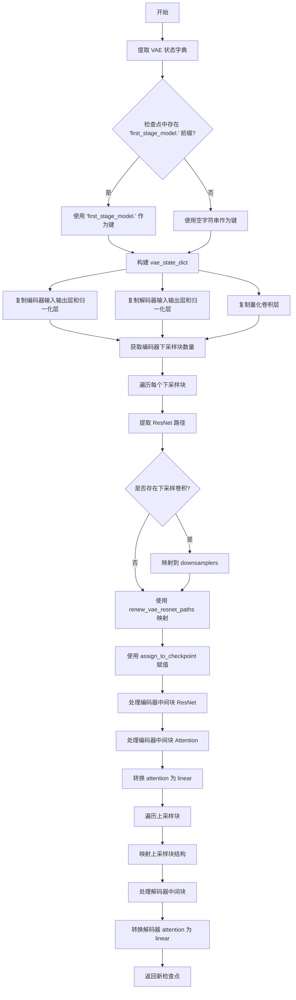

#### 带注释源码

```python
def convert_ldm_vae_checkpoint(checkpoint, config):
    """
    将 LDM VAE 检查点从原始格式转换为 Diffusers 格式
    
    Args:
        checkpoint: LDM 模型的完整检查点字典
        config: VAE 配置字典
    
    Returns:
        转换后的 VAE 检查点字典
    """
    # 提取 VAE 状态字典
    vae_state_dict = {}
    keys = list(checkpoint.keys())
    # 检测是否有 'first_stage_model.' 前缀
    vae_key = "first_stage_model." if any(k.startswith("first_stage_model.") for k in keys) else ""
    for key in keys:
        if key.startswith(vae_key):
            # 移除前缀并存储
            vae_state_dict[key.replace(vae_key, "")] = checkpoint.get(key)

    # 初始化新检查点字典
    new_checkpoint = {}

    # 复制编码器输入层结构
    new_checkpoint["encoder.conv_in.weight"] = vae_state_dict["encoder.conv_in.weight"]
    new_checkpoint["encoder.conv_in.bias"] = vae_state_dict["encoder.conv_in.bias"]
    new_checkpoint["encoder.conv_out.weight"] = vae_state_dict["encoder.conv_out.weight"]
    new_checkpoint["encoder.conv_out.bias"] = vae_state_dict["encoder.conv_out.bias"]
    new_checkpoint["encoder.conv_norm_out.weight"] = vae_state_dict["encoder.norm_out.weight"]
    new_checkpoint["encoder.conv_norm_out.bias"] = vae_state_dict["encoder.norm_out.bias"]

    # 复制解码器输入层结构
    new_checkpoint["decoder.conv_in.weight"] = vae_state_dict["decoder.conv_in.weight"]
    new_checkpoint["decoder.conv_in.bias"] = vae_state_dict["decoder.conv_in.bias"]
    new_checkpoint["decoder.conv_out.weight"] = vae_state_dict["decoder.conv_out.weight"]
    new_checkpoint["decoder.conv_out.bias"] = vae_state_dict["decoder.conv_out.bias"]
    new_checkpoint["decoder.conv_norm_out.weight"] = vae_state_dict["decoder.norm_out.weight"]
    new_checkpoint["decoder.conv_norm_out.bias"] = vae_state_dict["decoder.norm_out.bias"]

    # 复制量化卷积层
    new_checkpoint["quant_conv.weight"] = vae_state_dict["quant_conv.weight"]
    new_checkpoint["quant_conv.bias"] = vae_state_dict["quant_conv.bias"]
    new_checkpoint["post_quant_conv.weight"] = vae_state_dict["post_quant_conv.weight"]
    new_checkpoint["post_quant_conv.bias"] = vae_state_dict["post_quant_conv.bias"]

    # 获取编码器下采样块的数量
    num_down_blocks = len({".".join(layer.split(".")[:3]) for layer in vae_state_dict if "encoder.down" in layer})
    down_blocks = {
        layer_id: [key for key in vae_state_dict if f"down.{layer_id}" in key] for layer_id in range(num_down_blocks)
    }

    # 获取解码器上采样块的数量
    num_up_blocks = len({".".join(layer.split(".")[:3]) for layer in vae_state_dict if "decoder.up" in layer})
    up_blocks = {
        layer_id: [key for key in vae_state_dict if f"up.{layer_id}" in key] for layer_id in range(num_up_blocks)
    }

    # 处理编码器下采样块
    for i in range(num_down_blocks):
        # 提取 ResNet 路径（排除下采样）
        resnets = [key for key in down_blocks[i] if f"down.{i}" in key and f"down.{i}.downsample" not in key]

        # 处理下采样卷积层
        if f"encoder.down.{i}.downsample.conv.weight" in vae_state_dict:
            new_checkpoint[f"encoder.down_blocks.{i}.downsamplers.0.conv.weight"] = vae_state_dict.pop(
                f"encoder.down.{i}.downsample.conv.weight"
            )
            new_checkpoint[f"encoder.down_blocks.{i}.downsamplers.0.conv.bias"] = vae_state_dict.pop(
                f"encoder.down.{i}.downsample.conv.bias"
            )

        # 映射 ResNet 路径并赋值
        paths = renew_vae_resnet_paths(resnets)
        meta_path = {"old": f"down.{i}.block", "new": f"down_blocks.{i}.resnets"}
        assign_to_checkpoint(paths, new_checkpoint, vae_state_dict, additional_replacements=[meta_path], config=config)

    # 处理编码器中间块 ResNet
    mid_resnets = [key for key in vae_state_dict if "encoder.mid.block" in key]
    num_mid_res_blocks = 2
    for i in range(1, num_mid_res_blocks + 1):
        resnets = [key for key in mid_resnets if f"encoder.mid.block_{i}" in key]

        paths = renew_vae_resnet_paths(resnets)
        meta_path = {"old": f"mid.block_{i}", "new": f"mid_block.resnets.{i - 1}"}
        assign_to_checkpoint(paths, new_checkpoint, vae_state_dict, additional_replacements=[meta_path], config=config)

    # 处理编码器中间块 Attention
    mid_attentions = [key for key in vae_state_dict if "encoder.mid.attn" in key]
    paths = renew_vae_attention_paths(mid_attentions)
    meta_path = {"old": "mid.attn_1", "new": "mid_block.attentions.0"}
    assign_to_checkpoint(paths, new_checkpoint, vae_state_dict, additional_replacements=[meta_path], config=config)
    conv_attn_to_linear(new_checkpoint)

    # 处理解码器上采样块
    for i in range(num_up_blocks):
        block_id = num_up_blocks - 1 - i
        resnets = [
            key for key in up_blocks[block_id] if f"up.{block_id}" in key and f"up.{block_id}.upsample" not in key
        ]

        # 处理上采样卷积层
        if f"decoder.up.{block_id}.upsample.conv.weight" in vae_state_dict:
            new_checkpoint[f"decoder.up_blocks.{i}.upsamplers.0.conv.weight"] = vae_state_dict[
                f"decoder.up.{block_id}.upsample.conv.weight"
            ]
            new_checkpoint[f"decoder.up_blocks.{i}.upsamplers.0.conv.bias"] = vae_state_dict[
                f"decoder.up.{block_id}.upsample.conv.bias"
            ]

        # 映射路径并赋值
        paths = renew_vae_resnet_paths(resnets)
        meta_path = {"old": f"up.{block_id}.block", "new": f"up_blocks.{i}.resnets"}
        assign_to_checkpoint(paths, new_checkpoint, vae_state_dict, additional_replacements=[meta_path], config=config)

    # 处理解码器中间块 ResNet
    mid_resnets = [key for key in vae_state_dict if "decoder.mid.block" in key]
    num_mid_res_blocks = 2
    for i in range(1, num_mid_res_blocks + 1):
        resnets = [key for key in mid_resnets if f"decoder.mid.block_{i}" in key]

        paths = renew_vae_resnet_paths(resnets)
        meta_path = {"old": f"mid.block_{i}", "new": f"mid_block.resnets.{i - 1}"}
        assign_to_checkpoint(paths, new_checkpoint, vae_state_dict, additional_replacements=[meta_path], config=config)

    # 处理解码器中间块 Attention
    mid_attentions = [key for key in vae_state_dict if "decoder.mid.attn" in key]
    paths = renew_vae_attention_paths(mid_attentions)
    meta_path = {"old": "mid.attn_1", "new": "mid_block.attentions.0"}
    assign_to_checkpoint(paths, new_checkpoint, vae_state_dict, additional_replacements=[meta_path], config=config)
    conv_attn_to_linear(new_checkpoint)
    
    return new_checkpoint
```


### `convert_ldm_bert_checkpoint`

将 LDM（Latent Diffusion Models）的 BERT 检查点权重转换为 Hugging Face 格式的 `LDMBertModel` 模型。该函数通过逐一复制注意力层、线性层、嵌入层和层归一化等组件的权重，实现从原始 Stable Diffusion 检查点中提取并重构 BERT 文本编码器模型。

参数：

- `checkpoint`：任意类型，包含原始 LDM BERT 检查点的状态字典，其中包含 `transformer` 属性的权重数据（如 `token_emb.weight`、`pos_emb.emb.weight`、`norm`、_attn_layers` 等）
- `config`：`LDMBertConfig` 实例，指定目标模型的配置参数（如 `d_model`、`encoder_layers`、`encoder_ffn_dim` 等）

返回值：`LDMBertModel`，转换后的 Hugging Face 格式 BERT 模型实例

#### 流程图

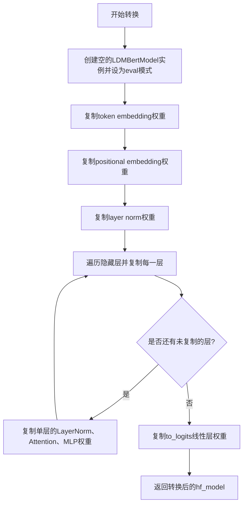

#### 带注释源码

```python
def convert_ldm_bert_checkpoint(checkpoint, config):
    """
    将 LDM BERT 检查点转换为 Hugging Face 格式的 LDMBertModel
    """
    
    def _copy_attn_layer(hf_attn_layer, pt_attn_layer):
        """
        复制注意力层权重：从原始 PT 格式到 HF 格式
        PT格式: to_q, to_k, to_v, to_out
        HF格式: q_proj, k_proj, v_proj, out_proj
        """
        hf_attn_layer.q_proj.weight.data = pt_attn_layer.to_q.weight
        hf_attn_layer.k_proj.weight.data = pt_attn_layer.to_k.weight
        hf_attn_layer.v_proj.weight.data = pt_attn_layer.to_v.weight
        
        hf_attn_layer.out_proj.weight = pt_attn_layer.to_out.weight
        hf_attn_layer.out_proj.bias = pt_attn_layer.to_out.bias

    def _copy_linear(hf_linear, pt_linear):
        """
        复制线性层权重（Linear层）
        """
        hf_linear.weight = pt_linear.weight
        hf_linear.bias = pt_linear.bias

    def _copy_layer(hf_layer, pt_layer):
        """
        复制单个Transformer层
        pt_layer结构: [[attn_LN, attn], [mlp_LN, mlp]]
        """
        # 复制层归一化
        _copy_linear(hf_layer.self_attn_layer_norm, pt_layer[0][0])
        _copy_linear(hf_layer.final_layer_norm, pt_layer[1][0])
        
        # 复制注意力层
        _copy_attn_layer(hf_layer.self_attn, pt_layer[0][1])
        
        # 复制MLP (FFN)
        pt_mlp = pt_layer[1][1]
        _copy_linear(hf_layer.fc1, pt_mlp.net[0][0])  # 第一个Linear
        _copy_linear(hf_layer.fc2, pt_mlp.net[2])       # 第二个Linear

    def _copy_layers(hf_layers, pt_layers):
        """
        批量复制多个Transformer层
        每两个PT层对应一个HF层
        """
        for i, hf_layer in enumerate(hf_layers):
            if i != 0:
                i += i
            pt_layer = pt_layers[i : i + 2]
            _copy_layer(hf_layer, pt_layer)

    # 1. 创建目标模型
    hf_model = LDMBertModel(config).eval()

    # 2. 复制token嵌入
    hf_model.model.embed_tokens.weight = checkpoint.transformer.token_emb.weight
    
    # 3. 复制位置嵌入
    hf_model.model.embed_positions.weight.data = checkpoint.transformer.pos_emb.emb.weight

    # 4. 复制LayerNorm
    _copy_linear(hf_model.model.layer_norm, checkpoint.transformer.norm)

    # 5. 复制隐藏层
    _copy_layers(hf_model.model.layers, checkpoint.transformer.attn_layers.layers)

    # 6. 复制输出层
    _copy_linear(hf_model.to_logits, checkpoint.transformer.to_logits)

    return hf_model
```


### `convert_ldm_clip_checkpoint`

该函数用于将 LDM（Latent Diffusion Models）格式的 CLIP 文本编码器检查点转换为 Hugging Face Diffusers 格式。它从原始检查点中提取 CLIP 文本编码器权重，并将其加载到 `CLIPTextModel` 中，支持多种前缀命名约定。

参数：

- `checkpoint`：`dict[str, torch.Tensor]`，原始 LDM 检查点的状态字典
- `local_files_only`：`bool`，是否仅使用本地文件（默认为 False）
- `text_encoder`：`CLIPTextModel | None`，可选的已存在文本编码器模型，如果提供则直接使用（默认为 None）

返回值：`CLIPTextModel`，转换后的 CLIP 文本编码器模型

#### 流程图

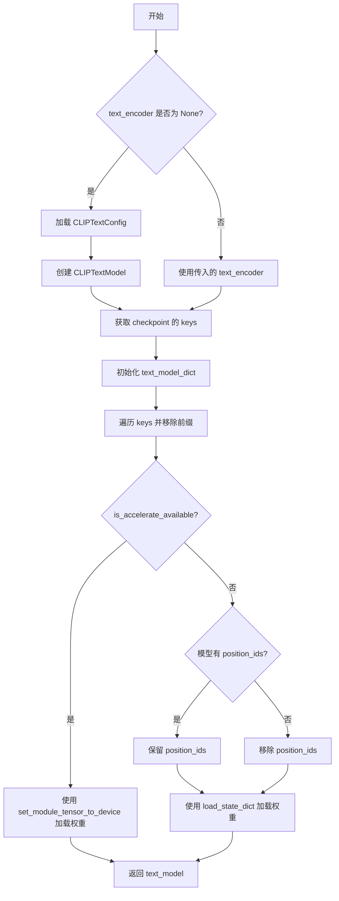

#### 带注释源码

```python
def convert_ldm_clip_checkpoint(checkpoint, local_files_only=False, text_encoder=None):
    """
    将 LDM 格式的 CLIP 文本编码器检查点转换为 Diffusers 格式
    
    参数:
        checkpoint: 原始检查点的状态字典
        local_files_only: 是否仅使用本地文件
        text_encoder: 可选的预加载文本编码器
    """
    # 如果没有提供 text_encoder，则创建一个新的 CLIPTextModel
    if text_encoder is None:
        config_name = "openai/clip-vit-large-patch14"
        try:
            # 从预训练模型加载 CLIPTextConfig
            config = CLIPTextConfig.from_pretrained(config_name, local_files_only=local_files_only)
        except Exception:
            raise ValueError(
                f"With local_files_only set to {local_files_only}, you must first locally save the configuration in the following path: 'openai/clip-vit-large-patch14'."
            )

        # 根据是否安装 accelerate 选择上下文管理器
        ctx = init_empty_weights if is_accelerate_available() else nullcontext
        with ctx():
            # 创建空的 CLIPTextModel
            text_model = CLIPTextModel(config)
    else:
        # 使用提供的 text_encoder
        text_model = text_encoder

    # 获取检查点的所有键
    keys = list(checkpoint.keys())

    # 用于存储转换后的权重
    text_model_dict = {}

    # 需要移除的前缀列表（支持不同的检查点格式）
    remove_prefixes = ["cond_stage_model.transformer", "conditioner.embedders.0.transformer"]

    # 遍历所有键，移除指定前缀
    for key in keys:
        for prefix in remove_prefixes:
            if key.startswith(prefix):
                # 移除前缀并添加到新字典
                text_model_dict[key[len(prefix + ".") :]] = checkpoint[key]

    # 根据是否安装 accelerate 采用不同的权重加载方式
    if is_accelerate_available():
        # 使用 accelerate 的高效设备分配
        for param_name, param in text_model_dict.items():
            set_module_tensor_to_device(text_model, param_name, "cpu", value=param)
    else:
        # 检查模型是否有 position_ids 属性
        if not (hasattr(text_model, "embeddings") and hasattr(text_model.embeddings.position_ids)):
            # 移除 position_ids（如果不存在）
            text_model_dict.pop("text_model.embeddings.position_ids", None)

        # 使用标准的 load_state_dict 加载权重
        text_model.load_state_dict(text_model_dict)

    # 返回转换后的模型
    return text_model
```


### `convert_paint_by_example_checkpoint`

该函数用于将 PaintByExample 模型的原始检查点（Checkpoint）转换为 Hugging Face Diffusers 格式的 `PaintByExampleImageEncoder` 模型。它从原始检查点中提取 CLIP Vision 模型、Mapper 模型、LayerNorm 和投影层的权重，并将其映射到新模型的架构中。

参数：

-  `checkpoint`：`dict[str, torch.Tensor]`，原始 PaintByExample 检查点的状态字典，包含预训练权重
-  `local_files_only`：`bool`，是否仅使用本地文件，传递给 `CLIPVisionConfig.from_pretrained` 的参数，默认为 `False`

返回值：`PaintByExampleImageEncoder`，转换后的 Diffusers 格式图像编码器模型

#### 流程图

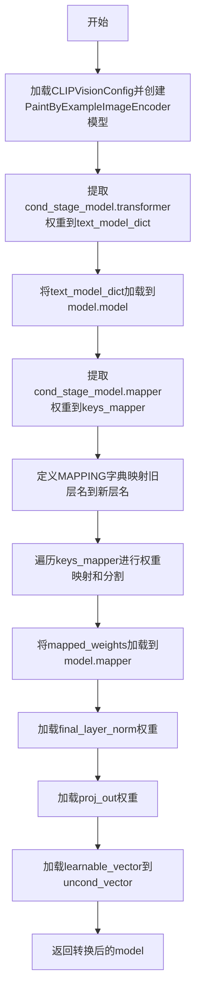

#### 带注释源码

```python
def convert_paint_by_example_checkpoint(checkpoint, local_files_only=False):
    """
    将 PaintByExample 模型的原始检查点转换为 Diffusers 格式的 PaintByExampleImageEncoder 模型。
    
    参数:
        checkpoint: 原始检查点的状态字典
        local_files_only: 是否仅使用本地文件
    返回:
        转换后的 PaintByExampleImageEncoder 模型
    """
    # 1. 从预训练的 CLIP Vision 配置创建模型
    config = CLIPVisionConfig.from_pretrained("openai/clip-vit-large-patch14", local_files_only=local_files_only)
    model = PaintByExampleImageEncoder(config)

    # 2. 获取检查点的所有键
    keys = list(checkpoint.keys())

    # 3. 提取 CLIP Vision 变换器权重
    text_model_dict = {}
    for key in keys:
        if key.startswith("cond_stage_model.transformer"):
            # 移除前缀 "cond_stage_model.transformer."
            text_model_dict[key[len("cond_stage_model.transformer.") :]] = checkpoint[key]

    # 4. 将 CLIP Vision 权重加载到模型的 model 属性
    model.model.load_state_dict(text_model_dict)

    # 5. 提取 Mapper 权重
    keys_mapper = {
        k[len("cond_stage_model.mapper.res"):]: v
        for k, v in checkpoint.items()
        if k.startswith("cond_stage_model.mapper")
    }

    # 6. 定义层名称映射规则
    # 将原始 LDM 层的命名方式映射到 Diffusers 架构
    MAPPING = {
        "attn.c_qkv": ["attn1.to_q", "attn1.to_k", "attn1.to_v"],  # 注意力 QKV 权重拆分
        "attn.c_proj": ["attn1.to_out.0"],                          # 注意力输出投影
        "ln_1": ["norm1"],                                          # 第一层归一化
        "ln_2": ["norm3"],                                          # 第二层归一化
        "mlp.c_fc": ["ff.net.0.proj"],                               # MLP 全连接层
        "mlp.c_proj": ["ff.net.2"],                                 # MLP 输出层
    }

    # 7. 映射权重名称并处理需要拆分的权重（如 QKV）
    mapped_weights = {}
    for key, value in keys_mapper.items():
        # 解析键名以提取前缀、层索引和后缀
        prefix = key[: len("blocks.i")]  # e.g., "blocks.0."
        suffix = key.split(prefix)[-1].split(".")[-1]  # e.g., "weight"
        name = key.split(prefix)[-1].split(suffix)[0][1:-1]  # e.g., "attn.c_qkv"
        
        # 获取映射后的新名称列表
        mapped_names = MAPPING[name]

        # 计算每个子权重的形状（对于 QKV 需要拆分）
        num_splits = len(mapped_names)
        for i, mapped_name in enumerate(mapped_names):
            new_name = ".".join([prefix, mapped_name, suffix])
            shape = value.shape[0] // num_splits
            # 按顺序拆分权重
            mapped_weights[new_name] = value[i * shape : (i + 1) * shape]

    # 8. 加载映射后的 Mapper 权重
    model.mapper.load_state_dict(mapped_weights)

    # 9. 加载最终的 LayerNorm 层
    model.final_layer_norm.load_state_dict(
        {
            "bias": checkpoint["cond_stage_model.final_ln.bias"],
            "weight": checkpoint["cond_stage_model.final_ln.weight"],
        }
    )

    # 10. 加载最终的投影层
    model.proj_out.load_state_dict(
        {
            "bias": checkpoint["proj_out.bias"],
            "weight": checkpoint["proj_out.weight"],
        }
    )

    # 11. 加载无条件向量（learnable vector）
    model.uncond_vector.data = torch.nn.Parameter(checkpoint["learnable_vector"])
    
    return model
```


### `convert_open_clip_checkpoint`

该函数用于将 OpenCLIP 检查点转换为 Hugging Face Diffusers 格式的 CLIP 文本编码器模型，支持从 Stable Diffusion 等模型的检查点中提取并重构文本编码器权重。

参数：

- `checkpoint`：`dict`，原始模型的权重状态字典（state dict），包含需要转换的键值对
- `config_name`：`str`，Hugging Face Hub 上的预训练 CLIP 配置文件名称或本地路径，用于加载模型配置
- `prefix`：`str`，要从前缀键中移除的前缀字符串，默认为 `"cond_stage_model.model."`，用于匹配原始检查点中的键
- `has_projection`：`bool`，是否使用带投影层的 CLIPTextModelWithProjection，默认为 False；为 True 时返回包含投影的模型
- `local_files_only`：`bool`，是否仅使用本地文件，默认为 False；若为 True 且配置文件未本地保存则抛出异常
- `**config_kwargs`：其他传递给 CLIPTextConfig.from_pretrained 的关键字参数，如 `subfolder` 等

返回值：`CLIPTextModel` 或 `CLIPTextModelWithProjection`，转换后的 Hugging Face 格式文本编码器模型实例

#### 流程图

```mermaid
flowchart TD
    A[开始: convert_open_clip_checkpoint] --> B[加载CLIPTextConfig从config_name]
    B --> C{is_accelerate_available?}
    C -->|是| D[使用init_empty_weights创建空模型]
    C -->|否| E[使用nullcontext创建空模型]
    D --> F{has_projection?}
    E --> F
    F -->|是| G[创建CLIPTextModelWithProjection]
    F -->|否| H[创建CLIPTextModel]
    G --> I[获取checkpoint的keys]
    H --> I
    I --> J[处理特殊键: keys_to_ignore]
    J --> K{prefix + 'text_projection' in checkpoint?}
    K -->|是| L[获取d_model维度]
    K -->|否| M[使用默认d_model=1024]
    L --> N[创建position_ids]
    M --> N
    N --> O[遍历所有keys进行转换]
    O --> P{key在keys_to_ignore中?}
    P -->|是| O
    P -->|否| Q{key[len(prefix):] in textenc_conversion_map?}
    Q -->|是| R[根据textenc_conversion_map映射并处理权重]
    Q -->|否| S{key.startswith prefix + 'transformer.'?}
    R --> O
    S -->|是| T{key包含.in_proj_weight?}
    S -->|否| O
    T -->|是| U[分割in_proj_weight为q/k/v权重]
    T -->|否| V{key包含.in_proj_bias?}
    V -->|是| W[分割in_proj_bias为q/k/v偏置]
    V -->|否| X[使用正则替换转换其他transformer键]
    U --> O
    W --> O
    X --> O
    O --> Y{is_accelerate_available?}
    Y -->|是| Z[使用set_module_tensor_to_device加载权重]
    Y -->|否| AA[使用load_state_dict加载权重]
    Z --> AB[返回text_model]
    AA --> AB
```

#### 带注释源码

```python
def convert_open_clip_checkpoint(
    checkpoint,                        # 原始检查点的状态字典
    config_name,                       # HuggingFace配置名称或路径
    prefix="cond_stage_model.model.", # 要移除的键前缀
    has_projection=False,              # 是否使用带投影的模型
    local_files_only=False,            # 是否仅使用本地文件
    **config_kwargs,                   # 传递给配置的其他参数
):
    """
    将OpenCLIP检查点转换为HuggingFace Diffusers格式的CLIPTextModel。
    支持从Stable Diffusion等模型中提取文本编码器权重并重构为标准格式。
    """
    # 尝试从预训练模型加载CLIPTextConfig配置
    try:
        config = CLIPTextConfig.from_pretrained(config_name, **config_kwargs, local_files_only=local_files_only)
    except Exception:
        raise ValueError(
            f"With local_files_only set to {local_files_only}, you must first locally save the configuration in the following path: '{config_name}'."
        )

    # 根据是否可用accelerate库选择创建空模型的上下文管理器
    ctx = init_empty_weights if is_accelerate_available() else nullcontext
    # 使用空权重上下文创建模型，避免加载完整模型到内存
    with ctx():
        # 根据has_projection参数选择创建CLIPTextModelWithProjection或CLIPTextModel
        text_model = CLIPTextModelWithProjection(config) if has_projection else CLIPTextModel(config)

    # 获取检查点中所有键的列表
    keys = list(checkpoint.keys())

    # 需要忽略的键列表，特定于某些模型版本
    keys_to_ignore = []
    # 针对Stable Diffusion 2特定的版本处理（23层 vs 24层）
    if config_name == "stabilityai/stable-diffusion-2" and config.num_hidden_layers == 23:
        # 移除所有以transformer.resblocks.23开头的键和text_projection键
        keys_to_ignore += [k for k in keys if k.startswith("cond_stage_model.model.transformer.resblocks.23")]
        keys_to_ignore += ["cond_stage_model.model.text_projection"]

    # 初始化用于存储转换后权重的字典
    text_model_dict = {}

    # 确定模型的维度，用于分割QKV权重
    if prefix + "text_projection" in checkpoint:
        d_model = int(checkpoint[prefix + "text_projection"].shape[0])
    else:
        d_model = 1024  # 默认维度

    # 添加position_ids到模型字典，用于位置嵌入
    text_model_dict["text_model.embeddings.position_ids"] = text_model.text_model.embeddings.get_buffer("position_ids")

    # 遍历检查点中的所有键进行转换
    for key in keys:
        # 跳过需要忽略的键
        if key in keys_to_ignore:
            continue
        
        # 处理在textenc_conversion_map中直接映射的键
        if key[len(prefix) :] in textenc_conversion_map:
            # 对于text_projection键，需要转置权重矩阵
            if key.endswith("text_projection"):
                value = checkpoint[key].T.contiguous()
            else:
                value = checkpoint[key]
            # 将转换后的键值对存入新字典
            text_model_dict[textenc_conversion_map[key[len(prefix) :]]] = value

        # 处理transformer子模块中的键
        if key.startswith(prefix + "transformer."):
            # 移除前缀获取相对键名
            new_key = key[len(prefix + "transformer.") :]
            
            # 处理in_proj_weight（QKV合并权重），需要分割为q_proj、k_proj、v_proj
            if new_key.endswith(".in_proj_weight"):
                new_key = new_key[: -len(".in_proj_weight")]
                # 使用正则替换将OpenCLIP命名转换为HuggingFace格式
                new_key = textenc_pattern.sub(lambda m: protected[re.escape(m.group(0))], new_key)
                # 将合并的权重按d_model维度分割为Q、K、V
                text_model_dict[new_key + ".q_proj.weight"] = checkpoint[key][:d_model, :]
                text_model_dict[new_key + ".k_proj.weight"] = checkpoint[key][d_model : d_model * 2, :]
                text_model_dict[new_key + ".v_proj.weight"] = checkpoint[key][d_model * 2 :, :]
            # 处理in_proj_bias（QKV合并偏置）
            elif new_key.endswith(".in_proj_bias"):
                new_key = new_key[: -len(".in_proj_bias")]
                new_key = textenc_pattern.sub(lambda m: protected[re.escape(m.group(0))], new_key)
                text_model_dict[new_key + ".q_proj.bias"] = checkpoint[key][:d_model]
                text_model_dict[new_key + ".k_proj.bias"] = checkpoint[key][d_model : d_model * 2]
                text_model_dict[new_key + ".v_proj.bias"] = checkpoint[key][d_model * 2 :]
            # 处理其他常规transformer权重
            else:
                new_key = textenc_pattern.sub(lambda m: protected[re.escape(m.group(0))], new_key)
                text_model_dict[new_key] = checkpoint[key]

    # 根据是否可用accelerate库选择不同的权重加载方式
    if is_accelerate_available():
        # 使用accelerate的set_module_tensor_to_device逐个设置参数到设备
        for param_name, param in text_model_dict.items():
            set_module_tensor_to_device(text_model, param_name, "cpu", value=param)
    else:
        # 如果模型没有position_ids属性则移除该键
        if not (hasattr(text_model, "embeddings") and hasattr(text_model.embeddings.position_ids)):
            text_model_dict.pop("text_model.embeddings.position_ids", None)
        # 使用标准的load_state_dict加载权重
        text_model.load_state_dict(text_model_dict)

    # 返回转换后的文本编码器模型
    return text_model
```


### `stable_unclip_image_encoder`

该函数用于从原始 Stable Diffusion 检查点配置中提取并构建图像编码器和图像预处理模块，支持两种类型的 Stable UnCLIP 模型（分别使用 CLIP 和 OpenCLIP 图像编码器）。

参数：

- `original_config`：`dict`，包含原始 Stable Diffusion 模型配置信息的字典，需包含 `model.params.embedder_config` 字段以指定图像嵌入器类型
- `local_files_only`：`bool`，是否仅使用本地缓存的模型文件，默认为 `False`

返回值：`(CLIPImageProcessor, CLIPVisionModelWithProjection)` 元组，包含图像预处理模块和 CLIP 视觉编码模型

#### 流程图

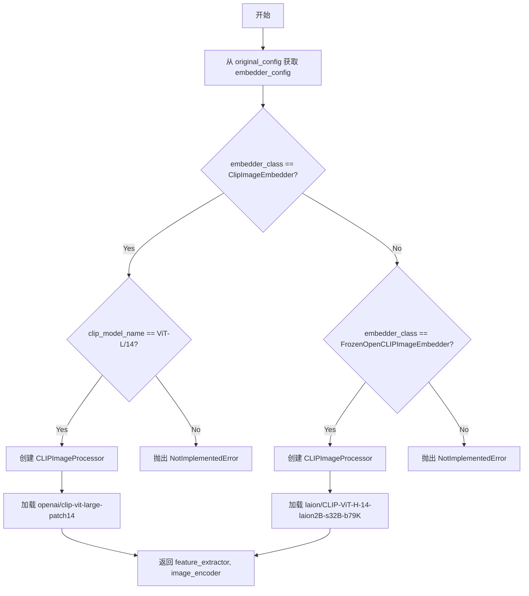

#### 带注释源码

```python
def stable_unclip_image_encoder(original_config, local_files_only=False):
    """
    Returns the image processor and clip image encoder for the img2img unclip pipeline.

    We currently know of two types of stable unclip models which separately use the clip and the openclip image
    encoders.
    """
    # 从原始配置中提取图像嵌入器配置
    image_embedder_config = original_config["model"]["params"]["embedder_config"]

    # 获取嵌入器类名（取最后一个分段）
    sd_clip_image_embedder_class = image_embedder_config["target"]
    sd_clip_image_embedder_class = sd_clip_image_embedder_class.split(".")[-1]

    # 根据嵌入器类型分别处理
    if sd_clip_image_embedder_class == "ClipImageEmbedder":
        # 获取 CLIP 模型名称
        clip_model_name = image_embedder_config.params.model

        if clip_model_name == "ViT-L/14":
            # 使用标准 CLIP 图像处理器
            feature_extractor = CLIPImageProcessor()
            # 加载 CLIP 视觉编码模型（带投影层）
            image_encoder = CLIPVisionModelWithProjection.from_pretrained(
                "openai/clip-vit-large-patch14", local_files_only=local_files_only
            )
        else:
            raise NotImplementedError(f"Unknown CLIP checkpoint name in stable diffusion checkpoint {clip_model_name}")

    elif sd_clip_image_embedder_class == "FrozenOpenCLIPImageEmbedder":
        # 使用 OpenCLIP 图像处理器
        feature_extractor = CLIPImageProcessor()
        # 加载 OpenCLIP 视觉编码模型（带投影层）
        image_encoder = CLIPVisionModelWithProjection.from_pretrained(
            "laion/CLIP-ViT-H-14-laion2B-s32B-b79K", local_files_only=local_files_only
        )
    else:
        raise NotImplementedError(
            f"Unknown CLIP image embedder class in stable diffusion checkpoint {sd_clip_image_embedder_class}"
        )

    return feature_extractor, image_encoder
```


### `stable_unclip_image_noising_components`

该函数用于从原始 Stable Diffusion 配置中提取并转换图像噪声处理组件，包括用于保存 CLIP 统计数据的 `StableUnCLIPImageNormalizer` 和用于保存噪声调度计划的 `DDPMScheduler`，以支持 img2img 和 txt2img 的 unclip 管道。

参数：

- `original_config`：字典类型，包含原始 Stable Diffusion 模型的完整配置对象，从中提取 `noise_aug_config` 配置信息
- `clip_stats_path`：字符串或 None 类型，指定 CLIP 统计数据的文件路径，用于初始化图像归一化器的均值和标准差；当配置中包含 `clip_stats_path` 时必须提供
- `device`：字符串或 None 类型，指定加载 CLIP 统计数据时的目标设备，默认为 None

返回值：元组 `(StableUnCLIPImageNormalizer, DDPMScheduler)`，返回图像归一化器和噪声调度器实例

#### 流程图

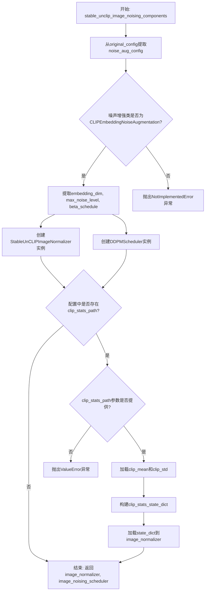

#### 带注释源码

```python
def stable_unclip_image_noising_components(
    original_config, clip_stats_path: str | None = None, device: str | None = None
):
    """
    Returns the noising components for the img2img and txt2img unclip pipelines.

    Converts the stability noise augmentor into
    1. a `StableUnCLIPImageNormalizer` for holding the CLIP stats
    2. a `DDPMScheduler` for holding the noise schedule

    If the noise augmentor config specifies a clip stats path, the `clip_stats_path` must be provided.
    """
    # 从原始配置中提取噪声增强配置
    noise_aug_config = original_config["model"]["params"]["noise_aug_config"]
    # 获取噪声增强类的完整名称并取最后一部分
    noise_aug_class = noise_aug_config["target"]
    noise_aug_class = noise_aug_class.split(".")[-1]

    # 检查是否为CLIPEmbeddingNoiseAugmentation类型
    if noise_aug_class == "CLIPEmbeddingNoiseAugmentation":
        # 获取噪声增强器的参数字典
        noise_aug_config = noise_aug_config.params
        # 提取嵌入维度
        embedding_dim = noise_aug_config.timestep_dim
        # 提取最大噪声级别（训练时间步数）
        max_noise_level = noise_aug_config.noise_schedule_config.timesteps
        # 提取Beta调度方案
        beta_schedule = noise_aug_config.noise_schedule_config.beta_schedule

        # 创建StableUnCLIPImageNormalizer实例用于持有CLIP统计信息
        image_normalizer = StableUnCLIPImageNormalizer(embedding_dim=embedding_dim)
        # 创建DDPMScheduler实例用于持有噪声调度计划
        image_noising_scheduler = DDPMScheduler(num_train_timesteps=max_noise_level, beta_schedule=beta_schedule)

        # 检查配置中是否指定了clip_stats_path
        if "clip_stats_path" in noise_aug_config:
            # 如果配置需要clip_stats_path但未提供，抛出错误
            if clip_stats_path is None:
                raise ValueError("This stable unclip config requires a `clip_stats_path`")

            # 从文件加载CLIP均值和标准差到指定设备
            clip_mean, clip_std = torch.load(clip_stats_path, map_location=device)
            # 为批次维度添加维度以便后续处理
            clip_mean = clip_mean[None, :]
            clip_std = clip_std[None, :]

            # 构建CLIP统计数据状态字典
            clip_stats_state_dict = {
                "mean": clip_mean,
                "std": clip_std,
            }

            # 将CLIP统计信息加载到图像归一化器
            image_normalizer.load_state_dict(clip_stats_state_dict)
    else:
        # 如果遇到未实现的噪声增强器类型，抛出异常
        raise NotImplementedError(f"Unknown noise augmentor class: {noise_aug_class}")

    # 返回图像归一化器和噪声调度器
    return image_normalizer, image_noising_scheduler
```


### `convert_controlnet_checkpoint`

该函数用于将预训练的ControlNet模型检查点从原始的LDM（Latent Diffusion Models）格式转换为Hugging Face Diffusers库支持的格式，并返回一个配置好的`ControlNetModel`实例。

参数：

- `checkpoint`：`dict[str, torch.Tensor]`，原始检查点的状态字典，包含模型的权重参数
- `original_config`：`dict`，原始模型的配置文件，包含模型架构和参数信息
- `checkpoint_path`：`str`，检查点文件的路径，用于日志记录和EMA提取判断
- `image_size`：`int`，模型训练时使用的图像尺寸，用于配置ControlNet的样本大小
- `upcast_attention`：`bool`，是否将注意力计算上浮，用于支持Stable Diffusion 2.1等模型
- `extract_ema`：`bool`，是否提取EMA（指数移动平均）权重
- `use_linear_projection`：`bool | None`，可选参数，指定是否使用线性投影，默认值为`None`
- `cross_attention_dim`：`int | None`，可选参数，指定交叉注意力维度，默认值为`None`

返回值：`ControlNetModel`，转换并加载权重后的ControlNet模型实例

#### 流程图

```mermaid
flowchart TD
    A[开始: convert_controlnet_checkpoint] --> B[调用create_unet_diffusers_config创建ControlNet配置]
    B --> C[设置upcast_attention参数]
    C --> D[移除sample_size配置项]
    D --> E{检查use_linear_projection是否非空}
    E -->|是| F[设置use_linear_projection]
    E -->|否| G{检查cross_attention_dim是否非空}
    F --> G
    G -->|是| H[设置cross_attention_dim]
    G -->|否| I[使用init_empty_weights或nullcontext初始化ControlNet模型]
    I --> J{检查checkpoint中是否存在time_embed.0.weight}
    J -->|是| K[设置skip_extract_state_dict=True]
    J -->|否| L[设置skip_extract_state_dict=False]
    K --> M[调用convert_ldm_unet_checkpoint转换权重]
    L --> M
    M --> N{检查is_accelerate_available}
    N -->|是| O[使用set_module_tensor_to_device加载权重]
    N -->|否| P[使用load_state_dict加载权重]
    O --> Q[返回ControlNetModel实例]
    P --> Q
```

#### 带注释源码

```python
def convert_controlnet_checkpoint(
    checkpoint,  # 原始检查点的状态字典
    original_config,  # 原始模型配置文件
    checkpoint_path,  # 检查点文件路径
    image_size,  # 训练时图像尺寸
    upcast_attention,  # 是否上浮注意力
    extract_ema,  # 是否提取EMA权重
    use_linear_projection=None,  # 可选：线性投影标志
    cross_attention_dim=None,  # 可选：交叉注意力维度
):
    """
    将ControlNet检查点从LDM格式转换为Diffusers格式。
    
    该函数执行以下主要步骤：
    1. 基于原始配置创建ControlNet的配置字典
    2. 初始化一个空的ControlNet模型
    3. 将原始权重转换为Diffusers格式
    4. 将转换后的权重加载到模型中
    """
    
    # 第一步：创建ControlNet的Diffusers配置
    # 使用create_unet_diffusers_config函数（指定controlnet=True）生成配置
    ctrlnet_config = create_unet_diffusers_config(original_config, image_size=image_size, controlnet=True)
    
    # 设置上采样注意力标志，用于SD 2.1等需要上浮注意力的模型
    ctrlnet_config["upcast_attention"] = upcast_attention
    
    # 移除sample_size配置，因为ControlNet不需要这个参数
    ctrlnet_config.pop("sample_size")
    
    # 可选参数：如果提供了use_linear_projection，则添加到配置中
    # 这用于控制是否在transformer中使用线性投影
    if use_linear_projection is not None:
        ctrlnet_config["use_linear_projection"] = use_linear_projection
    
    # 可选参数：如果提供了cross_attention_dim，则添加到配置中
    # 这用于指定交叉注意力机制的维度
    if cross_attention_dim is not None:
        ctrlnet_config["cross_attention_dim"] = cross_attention_dim
    
    # 第二步：初始化空的ControlNet模型
    # 根据是否安装了accelerate库，选择使用init_empty_weights或nullcontext
    ctx = init_empty_weights if is_accelerate_available() else nullcontext
    with ctx():
        controlnet = ControlNetModel(**ctrlnet_config)
    
    # 第三步：判断是否需要跳过state_dict提取
    # 有些ControlNet检查点文件是独立分发的（例如https://huggingface.co/thibaud/controlnet-sd21/）
    # 这些文件的权重键可能不包含"model.diffusion_model."前缀
    # 通过检查是否存在"time_embed.0.weight"键来判断
    if "time_embed.0.weight" in checkpoint:
        skip_extract_state_dict = True  # 权重已经是提取后的格式
    else:
        skip_extract_state_dict = False  # 需要从模型中提取
    
    # 第四步：调用convert_ldm_unet_checkpoint进行权重转换
    # 这个函数会将LDM格式的UNet权重转换为Diffusers格式
    converted_ctrl_checkpoint = convert_ldm_unet_checkpoint(
        checkpoint,
        ctrlnet_config,
        path=checkpoint_path,
        extract_ema=extract_ema,
        controlnet=True,  # 标记为ControlNet转换
        skip_extract_state_dict=skip_extract_state_dict,
    )
    
    # 第五步：将转换后的权重加载到模型中
    if is_accelerate_available():
        # 如果安装了accelerate，使用set_module_tensor_to_device逐个加载参数
        # 这种方式支持大模型的分布式加载
        for param_name, param in converted_ctrl_checkpoint.items():
            set_module_tensor_to_device(controlnet, param_name, "cpu", value=param)
    else:
        # 否则使用PyTorch原生的load_state_dict方法
        controlnet.load_state_dict(converted_ctrl_checkpoint)
    
    # 返回转换并加载完成的ControlNet模型
    return controlnet
```


### `download_from_original_stable_diffusion_ckpt`

该函数是 Stable Diffusion 检查点转换的核心函数，用于将 CompVis 风格的 `.ckpt`/`.safetensors` 检查点文件转换为 Hugging Face Diffusers 格式的 pipeline 对象，支持 SD v1.x、SD v2.x、SDXL、ControlNet、Stable Unclip 等多种模型类型的自动识别和转换。

参数：

- `checkpoint_path_or_dict`：`str | dict[str, torch.Tensor]`，检查点文件路径或包含张量的字典
- `original_config_file`：`str`，原始模型的 YAML 配置文件路径，若为 None 将自动推断
- `image_size`：`int | None`，模型训练时使用的图像尺寸，SD v1.x 和 SD v2 Base 默认 512，SD v2 默认 768
- `prediction_type`：`str | None`，模型训练时的预测类型（epsilon 或 v_prediction）
- `model_type`：`str | None`， pipeline 类型，可选 "FrozenOpenCLIPEmbedder"、"FrozenCLIPEmbedder"、"PaintByExample" 等
- `extract_ema`：`bool`，是否提取 EMA 权重，默认 False
- `scheduler_type`：`str`，调度器类型，默认 "pndm"，可选 "lms"、"heun"、"euler"、"euler-ancestral"、"dpm"、"ddim"
- `num_in_channels`：`int | None`，输入通道数，若为 None 将自动推断
- `upcast_attention`：`bool | None`，是否需要上cast注意力计算（SD 2.1 需要）
- `device`：`str`，加载设备，若为 None 将自动获取
- `from_safetensors`：`bool`，是否从 safetensors 格式加载，默认 False
- `stable_unclip`：`str | None`，Stable Unclip 类型，可选 "img2img" 或 "txt2img"
- `stable_unclip_prior`：`str | None`，Stable Unclip prior 模型，默认 "karlo"
- `clip_stats_path`：`str | None`，CLIP 统计文件路径
- `controlnet`：`bool | None`，是否加载 ControlNet
- `adapter`：`bool | None`，是否加载 Adapter
- `load_safety_checker`：`bool`，是否加载安全检查器，默认 True
- `safety_checker`：`StableDiffusionSafetyChecker | None`，预定义的安全检查器实例
- `feature_extractor`：`AutoFeatureExtractor | None`，预定义的特征提取器实例
- `pipeline_class`：`DiffusionPipeline`，预定义的 pipeline 类
- `local_files_only`：`bool`，是否仅使用本地文件，默认 False
- `vae_path`：`str | None`，VAE 模型路径
- `vae`：`AutoencoderKL | None`，预定义的 VAE 模型实例
- `text_encoder`：`CLIPTextModel | None`，预定义的文本编码器实例
- `text_encoder_2`：`CLIPTextModelWithProjection | None`，SDXL 第二个文本编码器实例
- `tokenizer`：`CLIPTokenizer | None`，预定义的 tokenizer 实例
- `tokenizer_2`：`CLIPTokenizer | None`，SDXL 第二个 tokenizer 实例
- `config_files`：`dict[str, str] | None`，配置文件的字典映射

返回值：`DiffusionPipeline`，转换后的 Stable Diffusion pipeline 对象

#### 流程图

```mermaid
flowchart TD
    A[开始] --> B{checkpoint_path_or_dict<br/>是字符串还是字典?}
    B -->|字符串| C{from_safetensors<br/>为 True?}
    B -->|字典| D[直接使用字典作为 checkpoint]
    C -->|是| E[使用 safetensors 加载检查点]
    C -->|否| F[使用 torch.load 加载检查点]
    E --> G[提取 global_step]
    F --> G
    D --> G
    G --> H{检查点是否有<br/>state_dict 键?}
    H -->|是| I[循环解包 state_dict]
    H -->|否| J{original_config_file<br/>是否为 None?}
    I --> J
    J -->|是| K[自动推断模型类型和配置]
    J -->|否| L[读取配置文件]
    K --> M{检测模型版本<br/>v1 / v2 / XL / Refiner}
    L --> M
    M --> N[创建 UNet 配置]
    N --> O[转换 UNet 检查点]
    O --> P[加载 UNet 模型]
    P --> Q{vae_path 和 vae<br/>都为 None?}
    Q -->|是| R[创建 VAE 配置并转换]
    Q -->|否| S{vae 为 None?}
    R --> T[加载 VAE 模型]
    S -->|否| U[使用传入的 vae]
    S -->|是| V[从预训练加载 VAE]
    U --> W
    V --> W
    T --> W
    W{model_type 类型}
    W -->|FrozenOpenCLIPEmbedder| X[转换 OpenCLIP 文本编码器]
    W -->|FrozenCLIPEmbedder| Y[转换 CLIP 文本编码器]
    W -->|PaintByExample| Z[转换 PaintByExample 模型]
    W -->|SDXL / SDXL-Refiner| AA[转换双文本编码器]
    W -->|其他| AB[转换 LDM Bert 文本编码器]
    X --> AC[构建 pipeline]
    Y --> AC
    Z --> AC
    AA --> AC
    AB --> AC
    AC --> AD[返回 DiffusionPipeline]
```

#### 带注释源码

```python
def download_from_original_stable_diffusion_ckpt(
    checkpoint_path_or_dict: str | dict[str, torch.Tensor],  # 检查点路径或状态字典
    original_config_file: str = None,  # 原始 YAML 配置文件路径
    image_size: int | None = None,  # 训练时图像尺寸
    prediction_type: str = None,  # 预测类型 epsilon 或 v_prediction
    model_type: str = None,  # 模型类型标识
    extract_ema: bool = False,  # 是否提取 EMA 权重
    scheduler_type: str = "pndm",  # 调度器类型
    num_in_channels: int | None = None,  # 输入通道数
    upcast_attention: bool | None = None,  # 是否上cast注意力
    device: str = None,  # 计算设备
    from_safetensors: bool = False,  # 是否从 safetensors 加载
    stable_unclip: str | None = None,  # Stable Unclip 模式
    stable_unclip_prior: str | None = None,  # Stable Unclip prior
    clip_stats_path: str | None = None,  # CLIP 统计路径
    controlnet: bool | None = None,  # 是否加载 ControlNet
    adapter: bool | None = None,  # 是否加载 Adapter
    load_safety_checker: bool = True,  # 是否加载安全检查器
    safety_checker: StableDiffusionSafetyChecker | None = None,  # 安全检查器实例
    feature_extractor: AutoFeatureExtractor | None = None,  # 特征提取器实例
    pipeline_class: DiffusionPipeline = None,  # Pipeline 类
    local_files_only=False,  # 仅本地文件
    vae_path=None,  # VAE 模型路径
    vae=None,  # VAE 模型实例
    text_encoder=None,  # 文本编码器实例
    text_encoder_2=None,  # SDXL 文本编码器2
    tokenizer=None,  # 分词器实例
    tokenizer_2=None,  # SDXL 分词器2
    config_files=None,  # 配置文件字典
) -> DiffusionPipeline:
    """
    Load a Stable Diffusion pipeline object from a CompVis-style `.ckpt`/`.safetensors` file and (ideally) a `.yaml`
    config file.

    Although many of the arguments can be automatically inferred, some of these rely on brittle checks against the
    global step count, which will likely fail for models that have undergone further fine-tuning. Therefore, it is
    recommended that you override the default values and/or supply an `original_config_file` wherever possible.
    """

    # 避免循环导入，在此处导入 pipeline
    from diffusers import (
        LDMTextToImagePipeline,
        PaintByExamplePipeline,
        StableDiffusionControlNetPipeline,
        StableDiffusionInpaintPipeline,
        StableDiffusionPipeline,
        StableDiffusionUpscalePipeline,
        StableDiffusionXLControlNetInpaintPipeline,
        StableDiffusionXLImg2ImgPipeline,
        StableDiffusionXLInpaintPipeline,
        StableDiffusionXLPipeline,
        StableUnCLIPImg2ImgPipeline,
        StableUnCLIPPipeline,
    )

    # 标准化预测类型名称
    if prediction_type == "v-prediction":
        prediction_type = "v_prediction"

    # 加载检查点文件
    if isinstance(checkpoint_path_or_dict, str):
        if from_safetensors:
            from safetensors.torch import load_file as safe_load
            checkpoint = safe_load(checkpoint_path_or_dict, device="cpu")
        else:
            if device is None:
                device = get_device()  # 自动获取设备
                checkpoint = torch.load(checkpoint_path_or_dict, map_location=device)
            else:
                checkpoint = torch.load(checkpoint_path_or_dict, map_location=device)
    elif isinstance(checkpoint_path_or_dict, dict):
        checkpoint = checkpoint_path_or_dict

    # 提取全局步数（用于版本推断）
    if "global_step" in checkpoint:
        global_step = checkpoint["global_step"]
    else:
        logger.debug("global_step key not found in model")
        global_step = None

    # 有些检查点有嵌套的 state_dict，需要解包
    while "state_dict" in checkpoint:
        checkpoint = checkpoint["state_dict"]

    # 如果没有提供配置文件，自动推断并下载
    if original_config_file is None:
        # 定义用于版本检测的关键键名
        key_name_v2_1 = "model.diffusion_model.input_blocks.2.1.transformer_blocks.0.attn2.to_k.weight"
        key_name_sd_xl_base = "conditioner.embedders.1.model.transformer.resblocks.9.mlp.c_proj.bias"
        key_name_sd_xl_refiner = "conditioner.embedders.0.model.transformer.resblocks.9.mlp.c_proj.bias"
        is_upscale = pipeline_class == StableDiffusionUpscalePipeline

        config_url = None

        # 优先使用 config_files 中提供的配置
        if config_files is not None and "v1" in config_files:
            original_config_file = config_files["v1"]
        else:
            # 默认使用 SD v1 推理配置
            config_url = "https://raw.githubusercontent.com/CompVis/stable-diffusion/main/configs/stable-diffusion/v1-inference.yaml"

        # 检测是否为 SD v2.1（通过键名和维度）
        if key_name_v2_1 in checkpoint and checkpoint[key_name_v2_1].shape[-1] == 1024:
            if config_files is not None and "v2" in config_files:
                original_config_file = config_files["v2"]
            else:
                config_url = "https://raw.githubusercontent.com/Stability-AI/stablediffusion/main/configs/stable-diffusion/v2-inference-v.yaml"
            # v2.1 需要上cast注意力
            if global_step == 110000:
                upcast_attention = True
        # 检测是否为 SDXL Base
        elif key_name_sd_xl_base in checkpoint:
            if config_files is not None and "xl" in config_files:
                original_config_file = config_files["xl"]
            else:
                config_url = "https://raw.githubusercontent.com/Stability-AI/generative-models/main/configs/inference/sd_xl_base.yaml"
        # 检测是否为 SDXL Refiner
        elif key_name_sd_xl_refiner in checkpoint:
            if config_files is not None and "xl_refiner" in config_files:
                original_config_file = config_files["xl_refiner"]
            else:
                config_url = "https://raw.githubusercontent.com/Stability-AI/generative-models/main/configs/inference/sd_xl_refiner.yaml"

        # 超分辨率模型特殊处理
        if is_upscale:
            config_url = "https://raw.githubusercontent.com/Stability-AI/stablediffusion/main/configs/stable-diffusion/x4-upscaling.yaml"

        # 从 URL 下载或读取本地文件
        if config_url is not None:
            original_config_file = BytesIO(requests.get(config_url, timeout=DIFFUSERS_REQUEST_TIMEOUT).content)
        else:
            with open(original_config_file, "r") as f:
                original_config_file = f.read()
    else:
        with open(original_config_file, "r") as f:
            original_config_file = f.read()

    # 解析 YAML 配置
    original_config = yaml.safe_load(original_config_file)

    # 从配置中推断模型类型
    if (
        model_type is None
        and "cond_stage_config" in original_config["model"]["params"]
        and original_config["model"]["params"]["cond_stage_config"] is not None
    ):
        model_type = original_config["model"]["params"]["cond_stage_config"]["target"].split(".")[-1]
        logger.debug(f"no `model_type` given, `model_type` inferred as: {model_type}")
    elif model_type is None and original_config["model"]["params"]["network_config"] is not None:
        # 可能是 SDXL 或 SDXL-Refiner
        if original_config["model"]["params"]["network_config"]["params"]["context_dim"] == 2048:
            model_type = "SDXL"
        else:
            model_type = "SDXL-Refiner"
        if image_size is None:
            image_size = 1024

    # 确定默认 pipeline 类
    if pipeline_class is None:
        if model_type not in ["SDXL", "SDXL-Refiner"]:
            pipeline_class = StableDiffusionPipeline if not controlnet else StableDiffusionControlNetPipeline
        else:
            pipeline_class = StableDiffusionXLPipeline if model_type == "SDXL" else StableDiffusionXLImg2ImgPipeline

    # 确定输入通道数
    if num_in_channels is None and pipeline_class in [
        StableDiffusionInpaintPipeline,
        StableDiffusionXLInpaintPipeline,
        StableDiffusionXLControlNetInpaintPipeline,
    ]:
        num_in_channels = 9  # Inpainting 需要额外mask通道
    if num_in_channels is None and pipeline_class == StableDiffusionUpscalePipeline:
        num_in_channels = 7  # 超分辨率需要低分辨率图通道
    elif num_in_channels is None:
        num_in_channels = 4  # 默认 text-to-image

    # 更新配置中的输入通道数
    if "unet_config" in original_config["model"]["params"]:
        original_config["model"]["params"]["unet_config"]["params"]["in_channels"] = num_in_channels
    elif "network_config" in original_config["model"]["params"]:
        original_config["model"]["params"]["network_config"]["params"]["in_channels"] = num_in_channels

    # 根据 parameterization 推断预测类型和图像尺寸
    if (
        "parameterization" in original_config["model"]["params"]
        and original_config["model"]["params"]["parameterization"] == "v"
    ):
        if prediction_type is None:
            # SD 2 base 建议用 epsilon，通过全局步数判断
            prediction_type = "epsilon" if global_step == 875000 else "v_prediction"
        if image_size is None:
            # SD 2 base 需要通过全局步数判断图像尺寸
            image_size = 512 if global_step == 875000 else 768
    else:
        if prediction_type is None:
            prediction_type = "epsilon"
        if image_size is None:
            image_size = 512

    # 转换 ControlNet（如果需要）
    if controlnet is None and "control_stage_config" in original_config["model"]["params"]:
        path = checkpoint_path_or_dict if isinstance(checkpoint_path_or_dict, str) else ""
        controlnet = convert_controlnet_checkpoint(
            checkpoint, original_config, path, image_size, upcast_attention, extract_ema
        )

    # 获取训练时间步数
    if "timesteps" in original_config["model"]["params"]:
        num_train_timesteps = original_config["model"]["params"]["timesteps"]
    else:
        num_train_timesteps = 1000

    # 创建并配置调度器
    if model_type in ["SDXL", "SDXL-Refiner"]:
        scheduler_dict = {
            "beta_schedule": "scaled_linear",
            "beta_start": 0.00085,
            "beta_end": 0.012,
            "interpolation_type": "linear",
            "num_train_timesteps": num_train_timesteps,
            "prediction_type": "epsilon",
            "sample_max_value": 1.0,
            "set_alpha_to_one": False,
            "skip_prk_steps": True,
            "steps_offset": 1,
            "timestep_spacing": "leading",
        }
        scheduler = EulerDiscreteScheduler.from_config(scheduler_dict)
        scheduler_type = "euler"
    else:
        # SD v1/v2 调度器配置
        if "linear_start" in original_config["model"]["params"]:
            beta_start = original_config["model"]["params"]["linear_start"]
        else:
            beta_start = 0.02

        if "linear_end" in original_config["model"]["params"]:
            beta_end = original_config["model"]["params"]["linear_end"]
        else:
            beta_end = 0.085

        scheduler = DDIMScheduler(
            beta_end=beta_end,
            beta_schedule="scaled_linear",
            beta_start=beta_start,
            num_train_timesteps=num_train_timesteps,
            steps_offset=1,
            clip_sample=False,
            set_alpha_to_one=False,
            prediction_type=prediction_type,
        )

    # 确保调度器配置正确
    scheduler.register_to_config(clip_sample=False)

    # 根据 scheduler_type 替换调度器
    if scheduler_type == "pndm":
        config = dict(scheduler.config)
        config["skip_prk_steps"] = True
        scheduler = PNDMScheduler.from_config(config)
    elif scheduler_type == "lms":
        scheduler = LMSDiscreteScheduler.from_config(scheduler.config)
    elif scheduler_type == "heun":
        scheduler = HeunDiscreteScheduler.from_config(scheduler.config)
    elif scheduler_type == "euler":
        scheduler = EulerDiscreteScheduler.from_config(scheduler.config)
    elif scheduler_type == "euler-ancestral":
        scheduler = EulerAncestralDiscreteScheduler.from_config(scheduler.config)
    elif scheduler_type == "dpm":
        scheduler = DPMSolverMultistepScheduler.from_config(scheduler.config)
    elif scheduler_type == "ddim":
        scheduler = scheduler
    else:
        raise ValueError(f"Scheduler of type {scheduler_type} doesn't exist!")

    # 超分辨率 pipeline 需要特殊处理
    if pipeline_class == StableDiffusionUpscalePipeline:
        image_size = original_config["model"]["params"]["unet_config"]["params"]["image_size"]

    # 创建 UNet 配置并转换权重
    unet_config = create_unet_diffusers_config(original_config, image_size=image_size)
    unet_config["upcast_attention"] = upcast_attention

    path = checkpoint_path_or_dict if isinstance(checkpoint_path_or_dict, str) else ""
    converted_unet_checkpoint = convert_ldm_unet_checkpoint(
        checkpoint, unet_config, path=path, extract_ema=extract_ema
    )

    # 加载 UNet 模型
    ctx = init_empty_weights if is_accelerate_available() else nullcontext
    with ctx():
        unet = UNet2DConditionModel(**unet_config)

    if is_accelerate_available():
        if model_type not in ["SDXL", "SDXL-Refiner"]:
            for param_name, param in converted_unet_checkpoint.items():
                set_module_tensor_to_device(unet, param_name, "cpu", value=param)
    else:
        unet.load_state_dict(converted_unet_checkpoint)

    # 转换和加载 VAE
    if vae_path is None and vae is None:
        vae_config = create_vae_diffusers_config(original_config, image_size=image_size)
        converted_vae_checkpoint = convert_ldm_vae_checkpoint(checkpoint, vae_config)

        # 获取 VAE 缩放因子
        if (
            "model" in original_config
            and "params" in original_config["model"]
            and "scale_factor" in original_config["model"]["params"]
        ):
            vae_scaling_factor = original_config["model"]["params"]["scale_factor"]
        else:
            vae_scaling_factor = 0.18215  # 默认 SD 缩放因子

        vae_config["scaling_factor"] = vae_scaling_factor

        ctx = init_empty_weights if is_accelerate_available() else nullcontext
        with ctx():
            vae = AutoencoderKL(**vae_config)

        if is_accelerate_available():
            for param_name, param in converted_vae_checkpoint.items():
                set_module_tensor_to_device(vae, param_name, "cpu", value=param)
        else:
            vae.load_state_dict(converted_vae_checkpoint)
    elif vae is None:
        vae = AutoencoderKL.from_pretrained(vae_path, local_files_only=local_files_only)

    # 根据模型类型转换文本编码器并构建 pipeline
    if model_type == "FrozenOpenCLIPEmbedder":
        # OpenCLIP 文本编码器（SD 2.x）
        config_name = "stabilityai/stable-diffusion-2"
        config_kwargs = {"subfolder": "text_encoder"}

        if text_encoder is None:
            text_model = convert_open_clip_checkpoint(
                checkpoint, config_name, local_files_only=local_files_only, **config_kwargs
            )
        else:
            text_model = text_encoder

        try:
            tokenizer = CLIPTokenizer.from_pretrained(
                "stabilityai/stable-diffusion-2", subfolder="tokenizer", local_files_only=local_files_only
            )
        except Exception:
            raise ValueError(
                f"With local_files_only set to {local_files_only}, you must first locally save the tokenizer in the following path: 'stabilityai/stable-diffusion-2'."
            )

        # 构建对应的 pipeline
        if stable_unclip is None:
            if controlnet:
                pipe = pipeline_class(
                    vae=vae,
                    text_encoder=text_model,
                    tokenizer=tokenizer,
                    unet=unet,
                    scheduler=scheduler,
                    controlnet=controlnet,
                    safety_checker=safety_checker,
                    feature_extractor=feature_extractor,
                )
                if hasattr(pipe, "requires_safety_checker"):
                    pipe.requires_safety_checker = False

            elif pipeline_class == StableDiffusionUpscalePipeline:
                scheduler = DDIMScheduler.from_pretrained(
                    "stabilityai/stable-diffusion-x4-upscaler", subfolder="scheduler"
                )
                low_res_scheduler = DDPMScheduler.from_pretrained(
                    "stabilityai/stable-diffusion-x4-upscaler", subfolder="low_res_scheduler"
                )

                pipe = pipeline_class(
                    vae=vae,
                    text_encoder=text_model,
                    tokenizer=tokenizer,
                    unet=unet,
                    scheduler=scheduler,
                    low_res_scheduler=low_res_scheduler,
                    safety_checker=safety_checker,
                    feature_extractor=feature_extractor,
                )

            else:
                pipe = pipeline_class(
                    vae=vae,
                    text_encoder=text_model,
                    tokenizer=tokenizer,
                    unet=unet,
                    scheduler=scheduler,
                    safety_checker=safety_checker,
                    feature_extractor=feature_extractor,
                )
                if hasattr(pipe, "requires_safety_checker"):
                    pipe.requires_safety_checker = False

        else:
            # Stable Unclip 处理
            image_normalizer, image_noising_scheduler = stable_unclip_image_noising_components(
                original_config, clip_stats_path=clip_stats_path, device=device
            )

            if stable_unclip == "img2img":
                feature_extractor, image_encoder = stable_unclip_image_encoder(original_config)

                pipe = StableUnCLIPImg2ImgPipeline(
                    feature_extractor=feature_extractor,
                    image_encoder=image_encoder,
                    image_normalizer=image_normalizer,
                    image_noising_scheduler=image_noising_scheduler,
                    tokenizer=tokenizer,
                    text_encoder=text_model,
                    unet=unet,
                    scheduler=scheduler,
                    vae=vae,
                )
            elif stable_unclip == "txt2img":
                if stable_unclip_prior is None or stable_unclip_prior == "karlo":
                    karlo_model = "kakaobrain/karlo-v1-alpha"
                    prior = PriorTransformer.from_pretrained(
                        karlo_model, subfolder="prior", local_files_only=local_files_only
                    )

                    try:
                        prior_tokenizer = CLIPTokenizer.from_pretrained(
                            "openai/clip-vit-large-patch14", local_files_only=local_files_only
                        )
                    except Exception:
                        raise ValueError(
                            f"With local_files_only set to {local_files_only}, you must first locally save the tokenizer in the following path: 'openai/clip-vit-large-patch14'."
                        )
                    prior_text_model = CLIPTextModelWithProjection.from_pretrained(
                        "openai/clip-vit-large-patch14", local_files_only=local_files_only
                    )

                    prior_scheduler = UnCLIPScheduler.from_pretrained(
                        karlo_model, subfolder="prior_scheduler", local_files_only=local_files_only
                    )
                    prior_scheduler = DDPMScheduler.from_config(prior_scheduler.config)
                else:
                    raise NotImplementedError(f"unknown prior for stable unclip model: {stable_unclip_prior}")

                pipe = StableUnCLIPPipeline(
                    prior_tokenizer=prior_tokenizer,
                    prior_text_encoder=prior_text_model,
                    prior=prior,
                    prior_scheduler=prior_scheduler,
                    image_normalizer=image_normalizer,
                    image_noising_scheduler=image_noising_scheduler,
                    tokenizer=tokenizer,
                    text_encoder=text_model,
                    unet=unet,
                    scheduler=scheduler,
                    vae=vae,
                )
            else:
                raise NotImplementedError(f"unknown `stable_unclip` type: {stable_unclip}")

    elif model_type == "PaintByExample":
        # PaintByExample 模型
        vision_model = convert_paint_by_example_checkpoint(checkpoint)
        try:
            tokenizer = CLIPTokenizer.from_pretrained(
                "openai/clip-vit-large-patch14", local_files_only=local_files_only
            )
        except Exception:
            raise ValueError(
                f"With local_files_only set to {local_files_only}, you must first locally save the tokenizer in the following path: 'openai/clip-vit-large-patch14'."
            )
        try:
            feature_extractor = AutoFeatureExtractor.from_pretrained(
                "CompVis/stable-diffusion-safety-checker", local_files_only=local_files_only
            )
        except Exception:
            raise ValueError(
                f"With local_files_only set to {local_files_only}, you must first locally save the feature_extractor in the following path: 'CompVis/stable-diffusion-safety-checker'."
            )
        pipe = PaintByExamplePipeline(
            vae=vae,
            image_encoder=vision_model,
            unet=unet,
            scheduler=scheduler,
            safety_checker=None,
            feature_extractor=feature_extractor,
        )

    elif model_type == "FrozenCLIPEmbedder":
        # CLIP 文本编码器（SD 1.x）
        text_model = convert_ldm_clip_checkpoint(
            checkpoint, local_files_only=local_files_only, text_encoder=text_encoder
        )
        try:
            tokenizer = (
                CLIPTokenizer.from_pretrained("openai/clip-vit-large-patch14", local_files_only=local_files_only)
                if tokenizer is None
                else tokenizer
            )
        except Exception:
            raise ValueError(
                f"With local_files_only set to {local_files_only}, you must first locally save the tokenizer in the following path: 'openai/clip-vit-large-patch14'."
            )

        # 加载安全检查器
        if load_safety_checker:
            safety_checker = StableDiffusionSafetyChecker.from_pretrained(
                "CompVis/stable-diffusion-safety-checker", local_files_only=local_files_only
            )
            feature_extractor = AutoFeatureExtractor.from_pretrained(
                "CompVis/stable-diffusion-safety-checker", local_files_only=local_files_only
            )

        if controlnet:
            pipe = pipeline_class(
                vae=vae,
                text_encoder=text_model,
                tokenizer=tokenizer,
                unet=unet,
                controlnet=controlnet,
                scheduler=scheduler,
                safety_checker=safety_checker,
                feature_extractor=feature_extractor,
            )
        else:
            pipe = pipeline_class(
                vae=vae,
                text_encoder=text_model,
                tokenizer=tokenizer,
                unet=unet,
                scheduler=scheduler,
                safety_checker=safety_checker,
                feature_extractor=feature_extractor,
            )

    elif model_type in ["SDXL", "SDXL-Refiner"]:
        # SDXL 或 SDXL-Refiner 模型
        is_refiner = model_type == "SDXL-Refiner"

        if (is_refiner is False) and (tokenizer is None):
            try:
                tokenizer = CLIPTokenizer.from_pretrained(
                    "openai/clip-vit-large-patch14", local_files_only=local_files_only
                )
            except Exception:
                raise ValueError(
                    f"With local_files_only set to {local_files_only}, you must first locally save the tokenizer in the following path: 'openai/clip-vit-large-patch14'."
                )

        if (is_refiner is False) and (text_encoder is None):
            text_encoder = convert_ldm_clip_checkpoint(checkpoint, local_files_only=local_files_only)

        if tokenizer_2 is None:
            try:
                tokenizer_2 = CLIPTokenizer.from_pretrained(
                    "laion/CLIP-ViT-bigG-14-laion2B-39B-b160k", pad_token="!", local_files_only=local_files_only
                )
            except Exception:
                raise ValueError(
                    f"With local_files_only set to {local_files_only}, you must first locally save the tokenizer in the following path: 'laion/CLIP-ViT-bigG-14-laion2B-39B-b160k' with `pad_token` set to '!'."
                )

        if text_encoder_2 is None:
            config_name = "laion/CLIP-ViT-bigG-14-laion2B-39B-b160k"
            config_kwargs = {"projection_dim": 1280}
            prefix = "conditioner.embedders.0.model." if is_refiner else "conditioner.embedders.1.model."

            text_encoder_2 = convert_open_clip_checkpoint(
                checkpoint,
                config_name,
                prefix=prefix,
                has_projection=True,
                local_files_only=local_files_only,
                **config_kwargs,
            )

        # 移动权重到 CPU
        if is_accelerate_available():
            for param_name, param in converted_unet_checkpoint.items():
                set_module_tensor_to_device(unet, param_name, "cpu", value=param)

        # 构建 pipeline
        if controlnet:
            pipe = pipeline_class(
                vae=vae,
                text_encoder=text_encoder,
                tokenizer=tokenizer,
                text_encoder_2=text_encoder_2,
                tokenizer_2=tokenizer_2,
                unet=unet,
                controlnet=controlnet,
                scheduler=scheduler,
                force_zeros_for_empty_prompt=True,
            )
        elif adapter:
            pipe = pipeline_class(
                vae=vae,
                text_encoder=text_encoder,
                tokenizer=tokenizer,
                text_encoder_2=text_encoder_2,
                tokenizer_2=tokenizer_2,
                unet=unet,
                adapter=adapter,
                scheduler=scheduler,
                force_zeros_for_empty_prompt=True,
            )
        else:
            pipeline_kwargs = {
                "vae": vae,
                "text_encoder": text_encoder,
                "tokenizer": tokenizer,
                "text_encoder_2": text_encoder_2,
                "tokenizer_2": tokenizer_2,
                "unet": unet,
                "scheduler": scheduler,
            }

            # Img2Img 和 Inpainting 需要 aesthetic_score
            if (pipeline_class == StableDiffusionXLImg2ImgPipeline) or (
                pipeline_class == StableDiffusionXLInpaintPipeline
            ):
                pipeline_kwargs.update({"requires_aesthetics_score": is_refiner})

            if is_refiner:
                pipeline_kwargs.update({"force_zeros_for_empty_prompt": False})

            pipe = pipeline_class(**pipeline_kwargs)

    else:
        # LDM BERT 文本编码器（旧版本）
        text_config = create_ldm_bert_config(original_config)
        text_model = convert_ldm_bert_checkpoint(checkpoint, text_config)
        tokenizer = BertTokenizerFast.from_pretrained("bert-base-uncased", local_files_only=local_files_only)
        pipe = LDMTextToImagePipeline(vqvae=vae, bert=text_model, tokenizer=tokenizer, unet=unet, scheduler=scheduler)

    return pipe
```


### `download_controlnet_from_original_ckpt`

该函数用于从原始的 Stable Diffusion checkpoint 文件中下载并转换 ControlNet 模型。它支持从 `.ckpt` 或 `.safetensors` 文件中加载模型权重，并根据提供的配置文件将其转换为 Diffusers 格式的 ControlNet 模型。

参数：

- `checkpoint_path`：`str`，原始 checkpoint 文件的路径，支持 .ckpt 或 .safetensors 格式
- `original_config_file`：`str`，原始模型的 YAML 配置文件路径
- `image_size`：`int`，默认为 512，模型训练时使用的图像尺寸
- `extract_ema`：`bool`，默认为 False，是否从 checkpoint 中提取 EMA（指数移动平均）权重
- `num_in_channels`：`int | None`，默认为 None，输入通道数，如果为 None 则从配置中自动推断
- `upcast_attention`：`bool | None`，默认为 None，是否将注意力计算向上转换，用于 Stable Diffusion 2.1
- `device`：`str`，默认为 None，加载模型的目标设备，如果为 None 则自动选择
- `from_safetensors`：`bool`，默认为 False，是否从 safetensors 格式文件加载
- `use_linear_projection`：`bool | None`，默认为 None，是否在 UNet 中使用线性投影
- `cross_attention_dim`：`bool | None`，默认为 None，交叉注意力维度

返回值：`ControlNetModel`，转换后的 Diffusers 格式 ControlNet 模型

#### 流程图

```mermaid
flowchart TD
    A[开始] --> B{from_safetensors?}
    B -->|Yes| C[使用 safe_open 加载 safetensors]
    B -->|No| D{device is None?}
    D -->|Yes| E[获取设备并使用 torch.load 加载]
    D -->|No| F[使用指定设备 torch.load 加载]
    C --> G[检查并移除 state_dict 包装]
    E --> G
    F --> G
    G --> H[打开并解析 YAML 配置文件]
    H --> I{num_in_channels is not None?}
    I -->|Yes| J[更新 in_channels 配置]
    I -->|No| K{control_stage_config 存在?}
    J --> K
    K -->|No| L[抛出 ValueError]
    K -->|Yes| M[调用 convert_controlnet_checkpoint]
    M --> N[返回 ControlNetModel]
    L --> O[结束]
```

#### 带注释源码

```python
def download_controlnet_from_original_ckpt(
    checkpoint_path: str,                    # 原始 checkpoint 文件路径
    original_config_file: str,               # 原始 YAML 配置文件路径
    image_size: int = 512,                   # 图像尺寸，默认 512
    extract_ema: bool = False,                # 是否提取 EMA 权重
    num_in_channels: int | None = None,      # 输入通道数
    upcast_attention: bool | None = None,    # 是否 upcast 注意力
    device: str = None,                      # 加载设备
    from_safetensors: bool = False,           # 是否从 safetensors 加载
    use_linear_projection: bool | None = None, # 是否使用线性投影
    cross_attention_dim: bool | None = None,   # 交叉注意力维度
) -> DiffusionPipeline:                      # 返回类型应为 ControlNetModel
    # 根据文件格式选择加载方式
    if from_safetensors:
        from safetensors import safe_open

        checkpoint = {}
        # 使用 safe_open 加载 safetensors 格式的 checkpoint
        with safe_open(checkpoint_path, framework="pt", device="cpu") as f:
            for key in f.keys():
                checkpoint[key] = f.get_tensor(key)
    else:
        # 确定设备，如果未指定则自动获取
        if device is None:
            device = get_device()
            checkpoint = torch.load(checkpoint_path, map_location=device)
        else:
            checkpoint = torch.load(checkpoint_path, map_location=device)

    # 有些 checkpoint 文件会额外包装一层 state_dict
    # 例如 https://huggingface.co/thibaud/controlnet-canny-sd21
    while "state_dict" in checkpoint:
        checkpoint = checkpoint["state_dict"]

    # 打开并解析原始配置文件（YAML 格式）
    with open(original_config_file, "r") as f:
        original_config_file = f.read()
    original_config = yaml.safe_load(original_config_file)

    # 如果指定了输入通道数，更新配置
    if num_in_channels is not None:
        original_config["model"]["params"]["unet_config"]["params"]["in_channels"] = num_in_channels

    # 检查配置中是否包含 control_stage_config
    # 这是 ControlNet 模型必需的配置文件部分
    if "control_stage_config" not in original_config["model"]["params"]:
        raise ValueError("`control_stage_config` not present in original config")

    # 调用核心转换函数，将 LDM 格式的 checkpoint 转换为 Diffusers 格式
    controlnet = convert_controlnet_checkpoint(
        checkpoint,                 # 原始 checkpoint 权重
        original_config,            # 原始模型配置
        checkpoint_path,            # checkpoint 路径（用于日志）
        image_size,                 # 图像尺寸
        upcast_attention,           # 是否 upcast 注意力
        extract_ema,                # 是否提取 EMA
        use_linear_projection=use_linear_projection,  # 线性投影选项
        cross_attention_dim=cross_attention_dim,       # 交叉注意力维度
    )

    # 返回转换后的 ControlNet 模型
    return controlnet
```

## 关键组件


### 路径重命名与映射系统

负责将LDM/LDMx模型中的权重路径转换为Diffusers格式，包括ResNet路径、注意力路径、VAE路径的局部重命名，以及全局路径分配和权重赋值。

### UNet检查点转换器

将LDM（Latent Diffusion Models）格式的UNet权重转换为Diffusers格式，支持EMA/非EMA权重提取、ControlNet权重转换、注意力层拆分（query/key/value）和时间嵌入重新映射。

### VAE检查点转换器

将LDM格式的VAE（Variational Autoencoder）编码器和解码器权重转换为Diffusers格式，处理下采样/上采样块、残差块和注意力层的路径映射。

### 文本编码器转换器

支持多种文本编码器格式的转换，包括CLIP（FrozenCLIPEmbedder）、OpenCLIP（FrozenOpenCLIPEmbedder）、LDM BERT和PaintByExample，处理位置嵌入、层归一化和注意力权重的映射。

### ControlNet转换器

将LDM格式的ControlNet权重转换为Diffusers格式，包括条件嵌入块、下采样块和中间块的权重重映射。

### 调度器配置工厂

根据原始LDM配置创建Diffusers调度器（DDIMScheduler、DDPMScheduler等），处理时间步、beta调度和预测类型的转换。

### 主转换入口函数

`download_from_original_stable_diffusion_ckpt`是核心入口函数，负责协调整个转换流程：自动推断模型类型（SD v1/v2、SDXL、Refiner）、下载原始配置、转换UNet/VAE/文本编码器权重、加载或创建调度器、组装完整的DiffusionPipeline。

### 图像编码器与噪声组件

处理Stable Unclip模型的图像编码器和噪声增强组件，包括CLIP图像嵌入器配置和噪声调度器的转换。

### 检查点加载与推断系统

负责从`.ckpt`或`.safetensors`文件加载模型权重，自动推断模型类型和配置，处理Safety Checker和Feature Extractor的加载。

### 权重形状转换工具

处理权重张量形状的转换，特别是1D卷积到线性层的转换，以及注意力权重的reshape操作。


## 问题及建议


### 已知问题

-   **函数过长且参数过多**：`download_from_original_stable_diffusion_ckpt` 函数拥有超过 30 个参数，代码行数超过 300 行，导致难以维护和测试
-   **使用 assert 进行业务逻辑验证**：`assign_to_checkpoint` 函数中使用 `assert` 检查路径类型，这在 Python 优化模式（python -O）下会被跳过，导致潜在的安全问题
-   **空操作的函数**：`renew_attention_paths` 函数体中的代码被全部注释，实际上是一个空操作，但未被删除或重命名，容易造成混淆
-   **魔法数字和硬编码值**：多处存在硬编码的数值（如 `vae_scaling_factor = 0.18215`）缺乏解释，且这些值分散在代码各处
-   **低效的字符串操作**：大量使用 `split(".")` 和 `replace` 进行路径操作，在循环中重复执行效率低下
-   **错误处理不完善**：使用 `raise ValueError` 时缺乏具体的错误上下文信息，难以定位问题根源
-   **潜在 bug**：`convert_ldm_bert_checkpoint` 中的 `_copy_layers` 函数存在逻辑错误，`i += i` 导致索引计算错误
-   **缺少类型提示**：虽然代码使用了 `torch` 和 `yaml`，但大部分函数缺乏完整的类型注解
-   **重复代码模式**：多个转换函数（如 `convert_ldm_unet_checkpoint`、`convert_ldm_vae_checkpoint`）存在相似的代码结构，可以抽象为通用函数

### 优化建议

-   **重构大型函数**：将 `download_from_original_stable_diffusion_ckpt` 拆分为多个职责单一的子函数，例如分别处理配置加载、模型转换、pipeline 组装等
-   **替换 assert 为实际异常**：使用 `if ... raise ValueError/TypeError` 替代 assert 进行参数验证
-   **清理死代码**：删除 `renew_attention_paths` 中被注释的代码，或添加 TODO 说明其用途
-   **提取配置常量**：将硬编码的数值（如 VAE 缩放因子）提取为模块级常量或配置文件
-   **添加类型提示**：为所有函数添加完整的参数和返回值类型注解
-   **优化字符串操作**：考虑使用正则表达式预编译或使用专门的路径处理库
-   **修复 bug**：修正 `_copy_layers` 函数中的索引计算逻辑 `i += i` 应为 `i += 1`
-   **添加输入验证**：在关键函数入口处增加参数校验，明确错误信息

## 其它


### 设计目标与约束

本转换脚本的核心设计目标是将CompVis/LDM格式的Stable Diffusion检查点（.ckpt或.safetensors文件）转换为HuggingFace Diffusers格式。主要约束包括：1）支持多种模型变体（v1.x、v2.x、SDXL、ControlNet等）；2）兼容不同的预测类型（epsilon和v_prediction）；3）支持EMA和非EMA权重的选择提取；4）确保与原始模型的特征兼容；同时需要考虑性能约束，如内存使用和转换效率。

### 错误处理与异常设计

代码中包含多处错误处理机制：1）配置加载失败时抛出`ValueError`并提供清晰的错误信息；2）本地文件不存在时提示用户使用`local_files_only`参数；3）不支持的模型类型抛出`NotImplementedError`；4）关键检查点键缺失时使用日志警告而非直接崩溃；5）网络请求超时使用`DIFFUSERS_REQUEST_TIMEOUT`常量控制。异常设计遵循快速失败原则，在转换早期检测问题以避免资源浪费。

### 数据流与状态机

转换流程主要分为以下几个阶段：1）检查点加载阶段（从文件或字典加载）；2）配置推断阶段（自动检测模型版本）；3）各组件转换阶段（UNet、VAE、Text Encoder、Scheduler等）；4）Pipeline组装阶段。状态机主要体现在模型类型判断逻辑（v1/v2/SDXL/SDXL-Refiner），以及根据模型类型选择不同的转换策略和Pipeline类。

### 外部依赖与接口契约

主要外部依赖包括：1）PyTorch（张量操作）；2）transformers（CLIP模型、tokenizer）；3）diffusers（Pipeline类、Scheduler、VAE等）；4）requests（远程配置下载）；5）yaml（配置文件解析）；6）safetensors（安全加载）。接口契约方面，`download_from_original_stable_diffusion_ckpt`是主入口函数，接受检查点路径/字典、配置文件、图像尺寸等参数，返回`DiffusionPipeline`对象。

### 关键算法说明

转换算法核心在于权重路径映射：1）使用`renew_*_paths`系列函数进行局部命名转换；2）`assign_to_checkpoint`函数执行最终赋值和全局重命名；3）注意力层需要特殊处理（分割q/k/v）；4）VAE和UNet采用不同的块结构映射策略。SDXL模型具有双文本编码器（text_encoder和text_encoder_2），需要分别处理。

### 版本兼容性矩阵

支持的模型版本及对应配置：1）SD v1.x：512x512图像，epsilon预测，DDIMScheduler；2）SD v2.1：768x768图像，v_prediction预测，可能需要upcast_attention；3）SDXL：1024x1024图像，双文本编码器，EulerDiscreteScheduler；4）SDXL-Refiner：与SDXL类似但使用不同的embedder配置。

### 资源与性能考量

内存优化策略：1）使用`init_empty_weights`上下文管理器延迟初始化；2）分批处理权重映射；3）使用`set_module_tensor_to_device`按需加载权重。性能考虑包括：1）网络配置缓存避免重复下载；2）状态字典就地修改减少复制开销；3）关键路径使用`is_accelerate_available()`分支优化。

### 安全性考虑

安全检查器集成：1）`StableDiffusionSafetyChecker`用于过滤不当内容；2）可通过`load_safety_checker`参数控制加载；3）某些Pipeline自动禁用安全检查器。检查点加载支持`safetensors`格式以增强安全性，避免pickle潜在的安全风险。

### 配置自动推断逻辑

自动推断机制：1）通过检查特定键（如`model.diffusion_model.input_blocks.2.1.transformer_blocks.0.attn2.to_k.weight`）判断版本；2）使用`global_step`推断训练阶段；3）配置文件URL根据模型类型动态选择；4）回退机制确保鲁棒性（本地文件优先，网络下载备用）。

### 测试与验证建议

建议添加的测试用例：1）各版本模型（v1/v2/SDXL）转换完整性验证；2）权重数值一致性检查（转换前后）；3）生成的Pipeline推理正确性验证；4）异常输入（损坏文件、错误配置）的错误处理测试；5）大规模检查点内存使用压力测试。

    