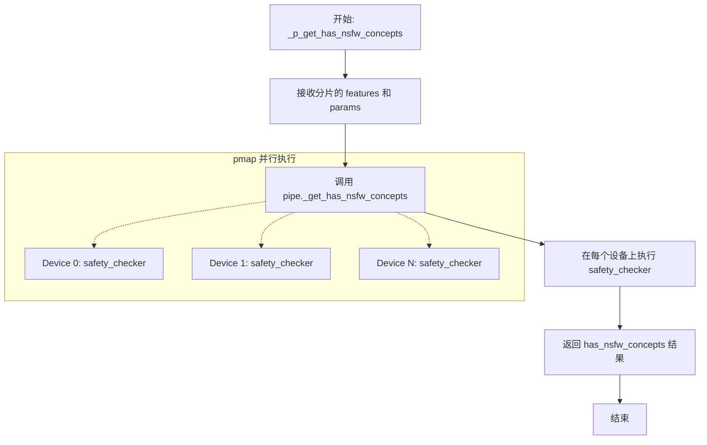
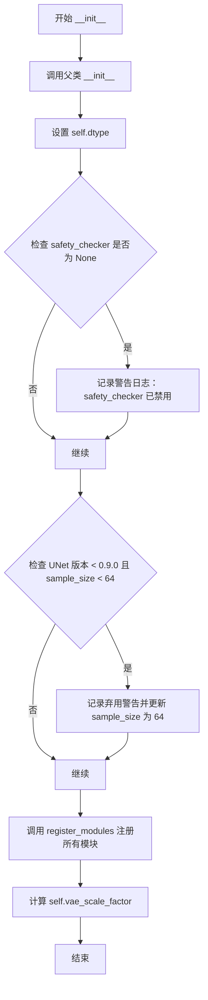
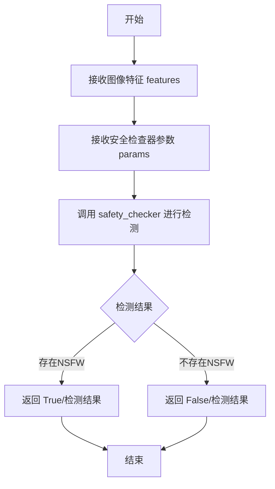
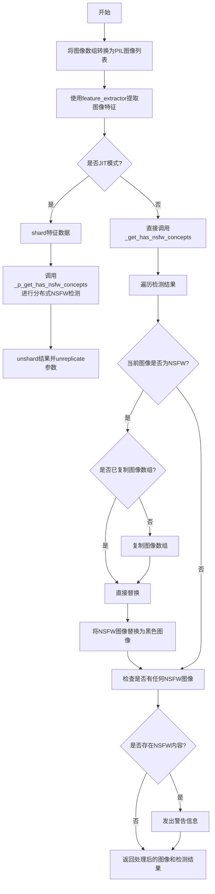
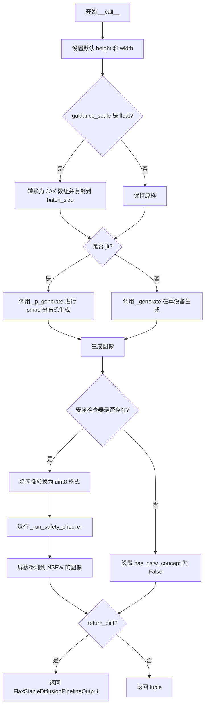

# `diffusers\src\diffusers\pipelines\stable_diffusion\pipeline_flax_stable_diffusion.py` 详细设计文档

Flax实现的Stable Diffusion文本到图像生成流水线，基于JAX/Flax框架，支持多设备并行推理和NSFW内容安全检查。

## 整体流程

```mermaid
graph TD
A[开始: 用户调用 __call__] --> B{检查并设置默认尺寸}
B --> C{guidance_scale 是浮点数?}
C -- 是 --> D[转换为JAX数组并复制到设备]
C -- 否 --> E[直接使用]
D --> F{是否启用JIT?}
E --> F
F -- 是 --> G[_p_generate: 并行生成图像]
F -- 否 --> H[_generate: 串行生成图像]
G --> I[检查safety_checker是否存在]
H --> I
I -- 是 --> J[运行 _run_safety_checker]
I -- 否 --> K[设置 has_nsfw_concept=False]
J --> L{检测到NSFW内容?}
L -- 是 --> M[替换为黑色图像]
L -- 否 --> N[保留原图]
M --> O[返回结果]
N --> O
K --> O
O --> P{return_dict=True?}
P -- 是 --> Q[返回 FlaxStableDiffusionPipelineOutput]
P -- 否 --> R[返回元组 (images, has_nsfw_concept)]
 subgraph _generate内部
S[文本编码: prompt_ids] --> T[空prompt编码: neg_prompt_ids]
T --> U[拼接: [negative_prompt, prompt]]
U --> V[初始化随机latents]
V --> W[设置调度器时间步]
W --> X{DEBUG模式?}
X -- 是 --> Y[Python for循环]
X -- 否 --> Z[jax.lax.fori_loop]
Y --> AA[循环体: 预测噪声 -> 引导 -> 调度器步进]
Z --> AA
AA --> AB{循环完成?}
AB -- 否 --> AA
AB -- 是 --> AC[VAE解码: latents -> image]
AC --> AD[后处理: 归一化并转换维度]
        
end
```

## 类结构

```
FlaxDiffusionPipeline (抽象基类)
└── FlaxStableDiffusionPipeline (主实现类)
```

## 全局变量及字段


### `logger`
    
模块级日志记录器，用于输出调试和信息日志

类型：`logging.Logger`
    


### `DEBUG`
    
调试模式开关，设为True时使用Python循环代替jax.fori_loop以便调试

类型：`bool`
    


### `EXAMPLE_DOC_STRING`
    
示例文档字符串，包含Flax Stable Diffusion Pipeline的使用示例代码

类型：`str`
    


### `FlaxStableDiffusionPipeline.dtype`
    
JAX数据类型，用于模型参数，默认值为jnp.float32

类型：`jnp.dtype`
    


### `FlaxStableDiffusionPipeline.vae`
    
变分自编码器(VAE)模型，用于编码和解码图像与潜在表示

类型：`FlaxAutoencoderKL`
    


### `FlaxStableDiffusionPipeline.text_encoder`
    
冻结的文本编码器，用于将文本提示转换为嵌入向量

类型：`FlaxCLIPTextModel`
    


### `FlaxStableDiffusionPipeline.tokenizer`
    
CLIP分词器，用于将文本提示token化

类型：`CLIPTokenizer`
    


### `FlaxStableDiffusionPipeline.unet`
    
UNet去噪模型，用于在潜在空间中预测噪声残差

类型：`FlaxUNet2DConditionModel`
    


### `FlaxStableDiffusionPipeline.scheduler`
    
噪声调度器，用于控制去噪过程中的噪声调度策略

类型：`FlaxDDIMScheduler | FlaxPNDMScheduler | FlaxLMSDiscreteScheduler | FlaxDPMSolverMultistepScheduler`
    


### `FlaxStableDiffusionPipeline.safety_checker`
    
NSFW内容检查器，用于检测生成图像中是否包含不当内容

类型：`FlaxStableDiffusionSafetyChecker`
    


### `FlaxStableDiffusionPipeline.feature_extractor`
    
CLIP图像特征提取器，用于从生成的图像中提取特征供安全检查器使用

类型：`CLIPImageProcessor`
    


### `FlaxStableDiffusionPipeline.vae_scale_factor`
    
VAE缩放因子，用于将潜在空间坐标映射到像素空间

类型：`int`
    
    

## 全局函数及方法


### `_p_generate`

该函数是 `FlaxStableDiffusionPipeline` 的并行生成封装器，通过 `jax.pmap` 装饰器实现在多个 GPU/TPU 设备上并行执行图像生成逻辑，是 `_generate` 方法的分布式版本，能够高效地利用 JAX 的并行计算能力处理批量提示词。

参数：

-  `pipe`：`FlaxStableDiffusionPipeline`，Flax 稳定扩散流水线实例，提供模型执行上下文
-  `prompt_ids`：`jnp.array`，经过分词器编码后的提示词 ID 数组，形状为 `[batch_size, seq_length]`
-  `params`：`dict | FrozenDict`，包含 text_encoder、unet、vae、scheduler 等模型参数的字典
-  `prng_seed`：`jax.Array`，JAX 随机数生成器种子，用于生成初始噪声
-  `num_inference_steps`：`int`，去噪推理步数，决定生成图像的质量和细节
-  `height`：`int`，生成图像的高度（像素），必须能被 8 整除
-  `width`：`int`，生成图像的宽度（像素），必须能被 8 整除
-  `guidance_scale`：`float | jnp.ndarray`，分类器自由引导尺度，控制文本提示对生成图像的影响程度
-  `latents`：`jnp.ndarray | None`，可选的预生成噪声潜在变量，用于控制生成结果
-  `neg_prompt_ids`：`jnp.ndarray | None`，可选的负面提示词编码，用于避免生成不希望的内容

返回值：返回 `pipe._generate()` 的结果，即去噪后的图像张量，形状为 `[batch_size, height, width, channels]`

#### 流程图

```mermaid
flowchart TD
    A[输入: prompt_ids, params, prng_seed, num_inference_steps, height, width, guidance_scale, latents, neg_prompt_ids] --> B[调用 pipe._generate 方法]
    
    B --> C[文本编码: prompt_ids → prompt_embeds]
    C --> D[负面提示词编码: neg_prompt_ids → negative_prompt_embeds]
    D --> E[拼接 embeddings: [negative_prompt_embeds, prompt_embeds]]
    E --> F[初始化潜在变量: latents 或随机采样]
    
    F --> G[设置调度器时间步]
    G --> H{DEBUG 模式?}
    
    H -->|是| I[Python for 循环执行去噪]
    H -->|否| J[jax.lax.fori_loop 并行去噪]
    
    I --> K[循环体: UNet 预测噪声 → 引导 → 调度器步进]
    J --> K
    
    K --> L[VAE 解码: latents → 图像]
    L --> M[后处理: 归一化 [0,1] + 通道变换]
    
    M --> N[返回生成的图像]
```

#### 带注释源码

```python
# 使用 partial 装饰器配置 jax.pmap，in_axes 指定每个输入参数在哪个维度上进行映射（0 表示映射第一个维度）
# static_broadcasted_argnums 指定静态广播的参数索引（0=pipe, 4=num_inference_steps, 5=height, 6=width）
# 这样可以实现多设备并行执行，prompt_ids、params、prng_seed 等会在多个设备上自动分片
@partial(
    jax.pmap,
    in_axes=(None, 0, 0, 0, None, None, None, 0, 0, 0),
    static_broadcasted_argnums=(0, 4, 5, 6),
)
def _p_generate(
    pipe,                      # FlaxStableDiffusionPipeline 实例，通过 jax.pmap 在设备间共享
    prompt_ids,                # 提示词 ID 张量，形状 [batch_size, seq_len]，在第 0 维分片
    params,                    # 模型参数字典，在第 0 维分片
    prng_seed,                 # 随机种子，在第 0 维分片
    num_inference_steps,       # 推理步数，静态广播（所有设备相同值）
    height,                    # 图像高度，静态广播
    width,                     # 图像宽度，静态广播
    guidance_scale,           # 引导尺度，在第 0 维分片
    latents,                   # 潜在变量，在第 0 维分片
    neg_prompt_ids,            # 负面提示词，在第 0 维分片
):
    """
    并行生成函数，通过 pmap 在多个设备上分布式执行图像生成。
    该函数是 _generate 方法的包装器，利用 JAX 的 pmap 实现数据并行。
    
    参数通过 in_axes 指定映射维度：
    - None: pipe 是非数据并行参数（流水线实例）
    - 0: 动态分片参数，沿批次维度分片到不同设备
    - None (static_broadcasted_argnums): 静态参数在编译时广播到所有设备
    """
    # 调用内部生成方法执行实际的扩散模型推理逻辑
    # 返回去噪后的图像张量
    return pipe._generate(
        prompt_ids,
        params,
        prng_seed,
        num_inference_steps,
        height,
        width,
        guidance_scale,
        latents,
        neg_prompt_ids,
    )
```


### `_p_get_has_nsfw_concepts`

这是一个使用 `jax.pmap` 封装的 NSFW（不适合在工作场所查看的内容）概念检查函数，用于在多个 JAX 设备上并行执行图像安全检查，通过调用管道的 `_get_has_nsfw_concepts` 方法来实现分布式推理。

参数：

- `pipe`：`FlaxStableDiffusionPipeline`，管道实例，包含安全检查器模块
- `features`：`jnp.ndarray`，从生成的图像中提取的特征向量（通过 `feature_extractor` 处理后的像素值），用于安全检查
- `params`：安全检查器的模型参数（已分片），用于执行安全检查模型推理

返回值：`jnp.ndarray`，布尔值数组，表示每个图像是否包含 NSFW 内容（`True` 表示检测到不适合公开的内容）

#### 流程图



#### 带注释源码

```python
@partial(jax.pmap, static_broadcasted_argnums=(0,))
def _p_get_has_nsfw_concepts(pipe, features, params):
    """
    使用 pmap 封装的 NSFW 概念检查函数，支持多设备并行推理。
    
    参数:
        pipe: FlaxStableDiffusionPipeline 实例，包含 safety_checker 模块
        features: 经过特征提取器处理的图像特征 (shape: [num_devices, batch, ...])
        params: 安全检查器的模型参数，已经过 shard 处理
    
    返回:
        has_nsfw_concepts: 每个图像的 NSFW 检测结果，布尔数组
    """
    return pipe._get_has_nsfw_concepts(features, params)
```


### `unshard`

该函数是一个用于合并分片张量的辅助函数，将经过 `pmap` 分片后的张量重新组合成单个批处理维度的张量。在 JAX 的分布式计算中，数据会被分散到多个设备上，该函数完成"分片"操作的逆过程，将分片数据合并回常规张量格式。

参数：

- `x`：`jnp.ndarray`，输入的经过分片（sharded）的张量，通常形状为 `(num_devices, batch_size, ...)`，其中第一维是设备数量，第二维是每个设备上的批次大小。

返回值：`jnp.ndarray`，合并后的张量，形状变为 `(num_devices * batch_size, ...)`，将设备和批次维度合并为一个统一的批次维度。

#### 流程图

```mermaid
flowchart TD
    A[输入分片张量 x<br/>形状: (num_devices, batch_size, ...)] --> B[提取前两个维度]
    B --> C[获取 num_devices 和 batch_size]
    C --> D[获取剩余维度 rest<br/>形状: ...]
    D --> E[重塑张量 reshape]
    E --> F[输出合并张量<br/>形状: (num_devices * batch_size, ...)]
```

#### 带注释源码

```python
def unshard(x: jnp.ndarray):
    """
    将分片张量合并（unshard）的辅助函数。
    
    在 JAX 分布式计算中，pmap 会将数据分散到多个设备上。
    该函数执行相反的操作：将分片数据重新组合成单个批次维度。
    
    等价于 einops.rearrange(x, 'd b ... -> (d b) ...')
    
    Args:
        x: 输入的分片张量，形状为 (num_devices, batch_size, ...)
    
    Returns:
        合并后的张量，形状为 (num_devices * batch_size, ...)
    """
    # 获取前两个维度：设备数量和批次大小
    # 例如：8个设备，每个设备处理2个样本 -> (8, 2, H, W, C)
    num_devices, batch_size = x.shape[:2]
    
    # 获取剩余维度，用于后续重塑
    # 例如：对于图像可能是 (H, W, C)
    rest = x.shape[2:]
    
    # 将张量重塑为 (num_devices * batch_size, H, W, C)
    # 这样就把分散在不同设备上的数据合并到单个批次维度
    return x.reshape(num_devices * batch_size, *rest)
```


### `FlaxStableDiffusionPipeline.__init__`

这是 Flax 稳定扩散管道（Flax Stable Diffusion Pipeline）的初始化方法，负责将 VAE、文本编码器、 tokenizer、UNet、调度器、安全检查器等核心组件注册到管道中，并进行配置验证和默认值设置。

参数：

- `vae`：`FlaxAutoencoderKL`，Variational Auto-Encoder (VAE) 模型，用于编码和解码图像与潜在表示之间的转换
- `text_encoder`：`FlaxCLIPTextModel`，冻结的文本编码器（clip-vit-large-patch14），用于将文本提示转换为嵌入向量
- `tokenizer`：`CLIPTokenizer`，用于将文本提示 token 化的 CLIPTokenizer
- `unet`：`FlaxUNet2DConditionModel`，用于对编码后的图像潜在表示进行去噪的 UNet 模型
- `scheduler`：`FlaxDDIMScheduler | FlaxPNDMScheduler | FlaxLMSDiscreteScheduler | FlaxDPMSolverMultistepScheduler`，与 unet 配合使用对潜在表示进行去噪的调度器
- `safety_checker`：`FlaxStableDiffusionSafetyChecker`，用于评估生成图像是否包含不当或有害内容的分类模块
- `feature_extractor`：`CLIPImageProcessor`，用于从生成的图像中提取特征的 CLIP 图像处理器，作为 safety_checker 的输入
- `dtype`：`jnp.dtype`，可选参数默认为 `jnp.float32`，用于指定模型计算的数据类型

返回值：`None`，`__init__` 方法不返回任何值

#### 流程图



#### 带注释源码

```python
def __init__(
    self,
    vae: FlaxAutoencoderKL,
    text_encoder: FlaxCLIPTextModel,
    tokenizer: CLIPTokenizer,
    unet: FlaxUNet2DConditionModel,
    scheduler: FlaxDDIMScheduler | FlaxPNDMScheduler | FlaxLMSDiscreteScheduler | FlaxDPMSolverMultistepScheduler,
    safety_checker: FlaxStableDiffusionSafetyChecker,
    feature_extractor: CLIPImageProcessor,
    dtype: jnp.dtype = jnp.float32,
):
    # 调用父类 FlaxDiffusionPipeline 的初始化方法
    super().__init__()
    # 设置实例的数据类型属性，用于后续模型计算
    self.dtype = dtype

    # 如果 safety_checker 为 None，发出警告提醒用户注意安全过滤器的禁用
    if safety_checker is None:
        logger.warning(
            f"You have disabled the safety checker for {self.__class__} by passing `safety_checker=None`. Ensure"
            " that you abide to the conditions of the Stable Diffusion license and do not expose unfiltered"
            " results in services or applications open to the public. Both the diffusers team and Hugging Face"
            " strongly recommend to keep the safety filter enabled in all public facing circumstances, disabling"
            " it only for use-cases that involve analyzing network behavior or auditing its results. For more"
            " information, please have a look at https://github.com/huggingface/diffusers/pull/254 ."
        )

    # 检查 UNet 版本是否小于 0.9.0 且 sample_size 是否小于 64
    is_unet_version_less_0_9_0 = (
        unet is not None
        and hasattr(unet.config, "_diffusers_version")
        and version.parse(version.parse(unet.config._diffusers_version).base_version) < version.parse("0.9.0.dev0")
    )
    is_unet_sample_size_less_64 = (
        unet is not None and hasattr(unet.config, "sample_size") and unet.config.sample_size < 64
    )
    # 如果满足条件，发出弃用警告并强制更新 sample_size 为 64
    if is_unet_version_less_0_9_0 and is_unet_sample_size_less_64:
        deprecation_message = (
            "The configuration file of the unet has set the default `sample_size` to smaller than"
            " 64 which seems highly unlikely .If you're checkpoint is a fine-tuned version of any of the"
            " following: \n- CompVis/stable-diffusion-v1-4 \n- CompVis/stable-diffusion-v1-3 \n-"
            " CompVis/stable-diffusion-v1-2 \n- CompVis/stable-diffusion-v1-1 \n- stable-diffusion-v1-5/stable-diffusion-v1-5"
            " \n- stable-diffusion-v1-5/stable-diffusion-inpainting \n you should change 'sample_size' to 64 in the"
            " configuration file. Please make sure to update the config accordingly as leaving `sample_size=32`"
            " in the config might lead to incorrect results in future versions. If you have downloaded this"
            " checkpoint from the Hugging Face Hub, it would be very nice if you could open a Pull request for"
            " the `unet/config.json` file"
        )
        deprecate("sample_size<64", "1.0.0", deprecation_message, standard_warn=False)
        new_config = dict(unet.config)
        new_config["sample_size"] = 64
        # 使用 FrozenDict 更新内部配置字典
        unet._internal_dict = FrozenDict(new_config)

    # 将所有模块注册到管道中，使其可以通过 self.xxx 访问
    self.register_modules(
        vae=vae,
        text_encoder=text_encoder,
        tokenizer=tokenizer,
        unet=unet,
        scheduler=scheduler,
        safety_checker=safety_checker,
        feature_extractor=feature_extractor,
    )
    # 计算 VAE 缩放因子，基于 VAE 块输出通道数的幂次
    self.vae_scale_factor = 2 ** (len(self.vae.config.block_out_channels) - 1) if getattr(self, "vae", None) else 8
```


### `FlaxStableDiffusionPipeline.prepare_inputs`

该方法用于将文本提示（prompt）转换为模型可处理的token ID数组。它接受字符串或字符串列表作为输入，通过tokenizer进行分词、填充和截断处理，最终返回NumPy数组形式的input_ids，供后续的文本编码器使用。

参数：

- `prompt`：`str | list[str]`，用户提供的文本提示，可以是单个字符串或多个字符串组成的列表

返回值：`jnp.array`（实际为`np.ndarray`），tokenizer处理后的输入token ID数组，形状为(batch_size, seq_len)

#### 流程图

```mermaid
flowchart TD
    A["开始: prepare_inputs"] --> B{prompt是否是str或list?}
    B -->|否| C[抛出ValueError异常]
    B -->|是| D[调用self.tokenizer处理prompt]
    D --> E[设置padding='max_length']
    D --> F[设置max_length=tokenizer.model_max_length]
    D --> G[设置truncation=True]
    D --> H[设置return_tensors='np'"]
    E --> I["返回: text_input.input_ids"]
    I --> J["结束"]
    C --> J
```

#### 带注释源码

```python
def prepare_inputs(self, prompt: str | list[str]):
    """
    将文本提示转换为token ID数组
    
    参数:
        prompt: 文本提示，类型为str或list[str]
    
    返回:
        tokenizer处理后的input_ids数组
    """
    # 参数类型检查，确保prompt是字符串或字符串列表
    if not isinstance(prompt, (str, list)):
        raise ValueError(f"`prompt` has to be of type `str` or `list` but is {type(prompt)}")

    # 使用tokenizer对prompt进行编码
    # padding="max_length": 将所有序列填充到最大长度
    # max_length: 使用tokenizer的最大模型长度
    # truncation=True: 超过最大长度的序列进行截断
    # return_tensors="np": 返回NumPy数组
    text_input = self.tokenizer(
        prompt,
        padding="max_length",
        max_length=self.tokenizer.model_max_length,
        truncation=True,
        return_tensors="np",
    )
    # 返回input_ids，用于后续text_encoder处理
    return text_input.input_ids
```


### `FlaxStableDiffusionPipeline._get_has_nsfw_concepts`

该方法用于检测输入图像特征中是否存在NSFW（不适合在工作场合查看）内容。它调用内部的安全检查器（safety_checker）对图像特征进行分析，判断是否包含不当内容。

参数：

- `features`：`jnp.ndarray` 或类似类型，从图像中提取的特征向量，作为安全检查器的输入
- `params`：安全检查器的模型参数，用于执行安全检查

返回值：`has_nsfw_concepts`：返回安全检查器的检测结果，通常为布尔值或布尔数组，表示是否存在NSFW内容

#### 流程图



#### 带注释源码

```python
def _get_has_nsfw_concepts(self, features, params):
    """
    检查给定图像特征是否包含NSFW内容
    
    参数:
        features: 从图像中提取的特征向量，由 feature_extractor 生成
        params: 安全检查器的模型参数
    
    返回:
        has_nsfw_concepts: 安全检查结果，表示是否存在NSFW内容
    """
    # 调用安全检查器模型，传入图像特征和模型参数
    # safety_checker 是 FlaxStableDiffusionSafetyChecker 类的实例
    has_nsfw_concepts = self.safety_checker(features, params)
    
    # 返回检测结果
    return has_nsfw_concepts
```


### `FlaxStableDiffusionPipeline._run_safety_checker`

该方法用于对生成的图像进行安全检查，检测是否包含不适当内容（NSFW），并将检测到的图像替换为黑色图像。

参数：

- `self`：`FlaxStableDiffusionPipeline` 实例，隐式参数
- `images`：`jnp.ndarray | np.ndarray`，生成的图像数组，形状为 (batch_size, height, width, 3)，值域为 [0, 1]
- `safety_model_params`：`dict | FrozenDict`，安全检查器模型参数，用于执行 NSFW 检测
- `jit`：`bool`，是否使用 JIT 编译模式（分布式推理），默认为 `False`

返回值：`(tuple[np.ndarray, jnp.ndarray | np.ndarray])`，返回元组包含：
- `images`：`np.ndarray`，处理后的图像数组，NSFW 图像被替换为黑色图像
- `has_nsfw_concepts`：`jnp.ndarray | np.ndarray`，布尔数组，标识每个图像是否为 NSFW 内容

#### 流程图



#### 带注释源码

```python
def _run_safety_checker(self, images, safety_model_params, jit=False):
    """
    对生成的图像运行安全检查器，检测NSFW内容并将可疑图像替换为黑色图像
    
    参数:
        images: 生成的图像数组，形状为 (batch_size, height, width, 3)，值域 [0, 1]
        safety_model_params: 安全检查器模型参数
        jit: 是否使用JIT编译模式进行分布式推理
    
    返回:
        (处理后的图像, NSFW检测结果)
    """
    # safety_model_params should already be replicated when jit is True
    # 将图像数组转换为PIL图像列表以便进行处理
    pil_images = [Image.fromarray(image) for image in images]
    
    # 使用特征提取器从PIL图像中提取特征向量
    # 返回格式为numpy数组，用于后续安全检查
    features = self.feature_extractor(pil_images, return_tensors="np").pixel_values

    if jit:
        # 在JIT模式下，需要对特征进行shard以适配多设备推理
        features = shard(features)
        
        # 调用pmap版本的NSFW检测函数，支持分布式执行
        has_nsfw_concepts = _p_get_has_nsfw_concepts(self, features, safety_model_params)
        
        # 将分布式结果合并回单设备格式
        has_nsfw_concepts = unshard(has_nsfw_concepts)
        
        # 还原复制的模型参数
        safety_model_params = unreplicate(safety_model_params)
    else:
        # 非JIT模式下直接调用实例方法进行NSFW检测
        has_nsfw_concepts = self._get_has_nsfw_concepts(features, safety_model_params)

    images_was_copied = False
    
    # 遍历每个图像的NSFW检测结果
    for idx, has_nsfw_concept in enumerate(has_nsfw_concepts):
        if has_nsfw_concept:
            # 首次发现NSFW内容时复制图像数组（避免修改原始数据）
            if not images_was_copied:
                images_was_copied = True
                images = images.copy()

            # 将NSFW图像替换为黑色图像（零值数组）
            images[idx] = np.zeros(images[idx].shape, dtype=np.uint8)

    # 如果检测到任何NSFW内容，发出警告提示用户
    if any(has_nsfw_concepts):
        warnings.warn(
            "Potential NSFW content was detected in one or more images. A black image will be returned"
            " instead. Try again with a different prompt and/or seed."
        )

    # 返回处理后的图像数组和NSFW检测结果
    return images, has_nsfw_concepts
```


### FlaxStableDiffusionPipeline._generate

该方法是Flax稳定扩散管道的核心生成方法，负责根据文本提示生成图像。它通过文本编码器获取提示词嵌入，结合负面提示词进行无分类器引导扩散过程，运行UNet进行去噪循环，最后使用VAE解码器将潜在表示解码为最终图像。

参数：

- `self`：`FlaxStableDiffusionPipeline`，管道实例本身
- `prompt_ids`：`jnp.array`，经过tokenize和编码后的文本提示词ID数组，形状为(batch_size, seq_length)
- `params`：`dict | FrozenDict`，包含各模型组件（text_encoder、unet、vae、scheduler）参数的字典
- `prng_seed`：`jax.Array`，JAX随机数生成器种子，用于生成初始噪声
- `num_inference_steps`：`int`，去噪迭代的总步数，决定生成图像的质量和细节
- `height`：`int`，生成图像的高度（像素），必须能被8整除
- `width`：`int`，生成图像的宽度（像素），必须能被8整除
- `guidance_scale`：`float`，引导尺度参数，控制文本提示对生成图像的影响程度，值越大越忠于提示词
- `latents`：`jnp.ndarray | None`，可选的预生成噪声潜在向量，如果为None则随机生成
- `neg_prompt_ids`：`jnp.ndarray | None`，可选的负面提示词编码ID，用于引导模型避免生成相关内容

返回值：`jnp.ndarray`，生成的图像数组，形状为(batch_size, height, width, channels)，数值范围[0, 1]，通道顺序为HWC

#### 流程图

```mermaid
flowchart TD
    A[开始 _generate] --> B{检查 height 和 width 是否能被8整除}
    B -->|否| C[抛出 ValueError 异常]
    B -->|是| D[使用 text_encoder 获取 prompt_embeds]
    E[获取 batch_size] --> F{neg_prompt_ids 是否为 None}
    F -->|是| G[使用 tokenizer 生成空字符串的 uncond_input]
    F -->|否| H[使用提供的 neg_prompt_ids]
    G --> I[获取 negative_prompt_embeds]
    H --> I
    I --> J[拼接 negative_prompt_embeds 和 prompt_embeds]
    J --> K[将 guidance_scale 转换为 float32 tensor]
    L[计算 latents_shape] --> M{latents 是否为 None}
    M -->|是| N[使用 prng_seed 生成随机 latents]
    M -->|否| O{latents.shape 是否匹配 latents_shape}
    O -->|否| P[抛出 ValueError 异常]
    O -->|是| Q[使用提供的 latents]
    N --> R[设置 scheduler timesteps]
    Q --> R
    R --> S[根据 scheduler.init_noise_sigma 缩放 latents]
    S --> T{DEBUG 模式}
    T -->|是| U[使用 Python for 循环]
    T -->|否| V[使用 jax.lax.fori_loop 并行]
    U --> W[循环去噪过程]
    V --> W
    W --> X[loop_body: 复制 latents 用于无分类器引导]
    X --> Y[获取当前 timestep t]
    Y --> Z[使用 scheduler.scale_model_input 缩放输入]
    Z --> AA[调用 UNet 预测噪声残差]
    AA --> AB[分割噪声预测为 unconditional 和 text]
    AB --> AC[计算引导后的噪声预测]
    AC --> AD[调用 scheduler.step 更新 latents]
    AD --> AE[返回更新后的 latents 和 scheduler_state]
    AE --> T
    T -->|循环结束| AF[使用 1/scaling_factor 逆缩放 latents]
    AF --> AG[使用 VAE decode 解码图像]
    AG --> AH[归一化图像到 [0, 1] 范围]
    AH --> AI[转置为 HWC 格式]
    AI --> AJ[返回生成的图像]
```

#### 带注释源码

```python
def _generate(
    self,
    prompt_ids: jnp.array,
    params: dict | FrozenDict,
    prng_seed: jax.Array,
    num_inference_steps: int,
    height: int,
    width: int,
    guidance_scale: float,
    latents: jnp.ndarray | None = None,
    neg_prompt_ids: jnp.ndarray | None = None,
):
    # 验证图像尺寸是否满足VAE下采样的要求（8的倍数）
    if height % 8 != 0 or width % 8 != 0:
        raise ValueError(f"`height` and `width` have to be divisible by 8 but are {height} and {width}.")

    # ===== 第一步：文本编码 =====
    # 使用text_encoder将tokenized的提示词ID转换为文本嵌入向量
    # params["text_encoder"]包含预训练的文本编码器权重
    prompt_embeds = self.text_encoder(prompt_ids, params=params["text_encoder"])[0]

    # 获取批次大小，用于后续处理
    batch_size = prompt_ids.shape[0]
    # 获取序列长度
    max_length = prompt_ids.shape[-1]

    # ===== 第二步：处理负面提示词 =====
    # 如果没有提供负面提示词，使用空字符串
    if neg_prompt_ids is None:
        uncond_input = self.tokenizer(
            [""] * batch_size, padding="max_length", max_length=max_length, return_tensors="np"
        ).input_ids
    else:
        # 使用用户提供的负面提示词
        uncond_input = neg_prompt_ids
    
    # 获取负面提示词的嵌入向量
    negative_prompt_embeds = self.text_encoder(uncond_input, params=params["text_encoder"])[0]
    # 拼接负面和正面提示词嵌入：[negative_prompt_embeds, prompt_embeds]
    # 前面一半是unconditional（用于无分类器引导），后面一半是conditional
    context = jnp.concatenate([negative_prompt_embeds, prompt_embeds])

    # ===== 第三步：准备引导参数 =====
    # 确保模型输出为float32以保证调度器计算的准确性
    guidance_scale = jnp.array([guidance_scale], dtype=jnp.float32)

    # ===== 第四步：初始化或验证latents（潜在向量） =====
    # 计算latents的形状：batch_size x 通道数 x 高度/vae_scale_factor x 宽度/vae_scale_factor
    latents_shape = (
        batch_size,
        self.unet.config.in_channels,
        height // self.vae_scale_factor,
        width // self.vae_scale_factor,
    )
    if latents is None:
        # 如果没有提供latents，使用随机正态分布生成初始噪声
        latents = jax.random.normal(prng_seed, shape=latents_shape, dtype=jnp.float32)
    else:
        # 验证提供的latents形状是否正确
        if latents.shape != latents_shape:
            raise ValueError(f"Unexpected latents shape, got {latents.shape}, expected {latents_shape}")

    # ===== 第五步：去噪循环 =====
    # 定义循环体函数，用于jax.lax.fori_loop或Python for循环
    def loop_body(step, args):
        latents, scheduler_state = args
        
        # 为了进行无分类器引导，我们需要同时处理条件和非条件输入
        # 这里将latents复制两份：一半用于unconditional，一半用于conditional
        latents_input = jnp.concatenate([latents] * 2)

        # 获取当前时间步
        t = jnp.array(scheduler_state.timesteps, dtype=jnp.int32)[step]
        # 广播timestep以匹配latents的batch维度
        timestep = jnp.broadcast_to(t, latents_input.shape[0])

        # 使用调度器缩放模型输入（根据调度器类型可能包括噪声调度）
        latents_input = self.scheduler.scale_model_input(scheduler_state, latents_input, t)

        # 使用UNet预测噪声残差
        noise_pred = self.unet.apply(
            {"params": params["unet"]},
            jnp.array(latents_input),
            jnp.array(timestep, dtype=jnp.int32),
            encoder_hidden_states=context,
        ).sample

        # ===== 执行无分类器引导 =====
        # 将噪声预测分割为unconditional和text两部分
        noise_pred_uncond, noise_prediction_text = jnp.split(noise_pred, 2, axis=0)
        # 应用引导：noise_pred = noise_pred_uncond + guidance_scale * (noise_pred_text - noise_pred_uncond)
        noise_pred = noise_pred_uncond + guidance_scale * (noise_prediction_text - noise_pred_uncond)

        # ===== 调度器步进 =====
        # 根据预测的噪声计算上一步的latents（去噪过程）
        latents, scheduler_state = self.scheduler.step(scheduler_state, noise_pred, t, latents).to_tuple()
        return latents, scheduler_state

    # ===== 第六步：初始化调度器 =====
    # 设置调度器的时间步序列
    scheduler_state = self.scheduler.set_timesteps(
        params["scheduler"], num_inference_steps=num_inference_steps, shape=latents.shape
    )

    # 根据调度器要求的初始噪声标准差缩放latents
    latents = latents * params["scheduler"].init_noise_sigma

    # 选择去噪循环的实现方式
    if DEBUG:
        # 调试模式：使用Python for循环，便于使用调试器
        for i in range(num_inference_steps):
            latents, scheduler_state = loop_body(i, (latents, scheduler_state))
    else:
        # 生产模式：使用JAX的fori_loop以获得更好的性能
        latents, _ = jax.lax.fori_loop(0, num_inference_steps, loop_body, (latents, scheduler_state))

    # ===== 第七步：VAE解码 =====
    # 使用VAE的缩放因子逆缩放latents
    latents = 1 / self.vae.config.scaling_factor * latents
    # 使用VAE解码器将latents转换为图像
    image = self.vae.apply({"params": params["vae"]}, latents, method=self.vae.decode).sample

    # ===== 第八步：后处理 =====
    # 将图像从[-1,1]范围转换到[0,1]范围：(image / 2 + 0.5)
    # 然后clip到[0,1]范围
    # 最后转置从CHW格式转换为HWC格式：(batch, channels, height, width) -> (batch, height, width, channels)
    image = (image / 2 + 0.5).clip(0, 1).transpose(0, 2, 3, 1)
    return image
```


### `FlaxStableDiffusionPipeline.__call__`

该方法是 Flax 实现的 Stable Diffusion 文本到图像生成管道的主入口方法，负责接收提示词 ID 和随机种子，通过去噪过程生成图像，并可选地运行安全检查器过滤不适当内容。

参数：

- `prompt_ids`：`jnp.array`，tokenized 后的提示词 ID 数组
- `params`：`dict | FrozenDict`，包含各模型（text_encoder、unet、vae、scheduler、safety_checker）参数的字典
- `prng_seed`：`jax.Array`，用于生成随机数的 JAX 数组作为随机种子
- `num_inference_steps`：`int`，默认为 50，去噪迭代的步数
- `height`：`int | None`，默认为 None，生成图像的高度（若为 None 则使用 UNet 配置的 sample_size 乘以 vae_scale_factor）
- `width`：`int | None`，默认为 None，生成图像的宽度（若为 None 则使用 UNet 配置的 sample_size 乘以 vae_scale_factor）
- `guidance_scale`：`float | jnp.ndarray`，默认为 7.5，分类器自由引导（CFG）比例，控制文本提示与图像的相关性
- `latents`：`jnp.ndarray`，默认为 None，预生成的噪声潜在向量，若不提供则随机生成
- `neg_prompt_ids`：`jnp.ndarray`，默认为 None，负面提示词 ID，用于引导模型避免生成某些内容
- `return_dict`：`bool`，默认为 True，是否返回 FlaxStableDiffusionPipelineOutput 对象而非元组
- `jit`：`bool`，默认为 False，是否使用 pmap JIT 编译版本进行生成

返回值：`FlaxStableDiffusionPipelineOutput` 或 `tuple`，若 `return_dict` 为 True，返回包含生成图像和 NSFW 检测标志的管道输出对象；否则返回元组 `(images, has_nsfw_concept)`

#### 流程图



#### 带注释源码

```python
@replace_example_docstring(EXAMPLE_DOC_STRING)
def __call__(
    self,
    prompt_ids: jnp.array,                          # 输入：tokenized 后的提示词 ID
    params: dict | FrozenDict,                      # 输入：模型参数字典
    prng_seed: jax.Array,                          # 输入：随机数生成种子
    num_inference_steps: int = 50,                 # 参数：去噪步数，默认为 50
    height: int | None = None,                     # 参数：输出图像高度
    width: int | None = None,                      # 参数：输出图像宽度
    guidance_scale: float | jnp.ndarray = 7.5,    # 参数：CFG 引导强度
    latents: jnp.ndarray = None,                   # 参数：可选的预生成 latents
    neg_prompt_ids: jnp.ndarray = None,             # 参数：可选的负面提示词
    return_dict: bool = True,                       # 参数：是否返回字典格式
    jit: bool = False,                              # 参数：是否使用 JIT/pmap
):
    # 0. Default height and width to unet
    # 如果未指定 height/width，则使用 UNet 配置的 sample_size 乘以 vae_scale_factor 计算默认值
    height = height or self.unet.config.sample_size * self.vae_scale_factor
    width = width or self.unet.config.sample_size * self.vae_scale_factor

    # 处理 guidance_scale：如果是 float 类型，需要转换为与 prompt_ids batch 维度匹配的 JAX 数组
    if isinstance(guidance_scale, float):
        # Convert to a tensor so each device gets a copy. Follow the prompt_ids for
        # shape information, as they may be sharded (when `jit` is `True`), or not.
        guidance_scale = jnp.array([guidance_scale] * prompt_ids.shape[0])
        if len(prompt_ids.shape) > 2:
            # Assume sharded
            guidance_scale = guidance_scale[:, None]

    # 根据 jit 参数选择生成方法：pmap 分布式生成 或 单设备生成
    if jit:
        # 使用 pmap 封装的对等（distributed）生成函数
        images = _p_generate(
            self,
            prompt_ids,
            params,
            prng_seed,
            num_inference_steps,
            height,
            width,
            guidance_scale,
            latents,
            neg_prompt_ids,
        )
    else:
        # 使用实例方法在单设备上生成
        images = self._generate(
            prompt_ids,
            params,
            prng_seed,
            num_inference_steps,
            height,
            width,
            guidance_scale,
            latents,
            neg_prompt_ids,
        )

    # 如果配置了安全检查器，运行 NSFW 检测
    if self.safety_checker is not None:
        safety_params = params["safety_checker"]
        # 将浮点图像转换为 uint8 格式以供安全检查器使用
        images_uint8_casted = (images * 255).round().astype("uint8")
        num_devices, batch_size = images.shape[:2]

        # 重塑图像数组以适应安全检查器的批次处理
        images_uint8_casted = np.asarray(images_uint8_casted).reshape(num_devices * batch_size, height, width, 3)
        # 运行安全检查
        images_uint8_casted, has_nsfw_concept = self._run_safety_checker(images_uint8_casted, safety_params, jit)
        images = np.asarray(images).copy()

        # block images: 如果检测到 NSFW 内容，用黑图替换
        if any(has_nsfw_concept):
            for i, is_nsfw in enumerate(has_nsfw_concept):
                if is_nsfw:
                    images[i, 0] = np.asarray(images_uint8_casted[i])

        # 恢复原始形状
        images = images.reshape(num_devices, batch_size, height, width, 3)
    else:
        # 没有安全检查器时，设置 has_nsfw_concept 为 False
        images = np.asarray(images)
        has_nsfw_concept = False

    # 根据 return_dict 参数决定返回格式
    if not return_dict:
        return (images, has_nsfw_concept)

    # 返回结构化输出对象
    return FlaxStableDiffusionPipelineOutput(images=images, nsfw_content_detected=has_nsfw_concept)
```

## 关键组件


### FlaxStableDiffusionPipeline

基于Flax的Stable Diffusion文本到图像生成管道，继承自FlaxDiffusionPipeline，整合了VAE、文本编码器、UNet、调度器和安全检查器，支持JAX/Flax加速的扩散模型推理。

### 张量索引与惰性加载

通过shard/unshard机制处理分布式张量，使用jax.lax.fori_loop实现循环展开以支持惰性加载和延迟执行，避免一次性加载所有数据到内存。

### 反量化支持

通过dtype参数(jnp.float32默认)控制模型精度，支持vae_scale_factor计算进行潜在空间缩放(1/scaling_factor)，以及init_noise_sigma标准化处理，实现反量化推理。

### 量化策略

支持通过variant="bf16"和dtype=jax.numpy.bfloat16加载量化模型，文本编码器使用FrozenDict封装参数，调度器状态通过params["scheduler"]传递，实现混合精度推理策略。

### prepare_inputs

将文本prompt转换为token IDs，输入参数为prompt(str或list[str])，输出tokenizer处理后的input_ids数组，用于文本编码器生成embedding。

### _generate

核心去噪循环生成方法，执行UNet噪声预测、分类器-free guidance、调度器step更新latents，最终通过VAE解码器将潜在表示转换为图像。

### _run_safety_checker

安全检查模块，将生成的图像转换为PIL格式，提取特征后调用FlaxStableDiffusionSafetyChecker检测NSFW内容，检测到的图像会被替换为黑色图像。

### _p_generate

使用jax.pmap装饰的分布式生成函数，支持多设备并行推理，通过static_broadcasted_argnums优化编译效率，实现跨设备批处理。

### 调度器集成

支持FlaxDDIMScheduler、FlaxDPMSolverMultistepScheduler、FlaxLMSDiscreteScheduler、FlaxPNDMScheduler四种调度器，提供set_timesteps和step方法进行噪声调度。

### unshard

将分片张量(d b ...)重组为批量张量(d*b ...)，用于合并多设备推理结果，支持einops风格的维度变换操作。


## 问题及建议


### 已知问题

- **NSFW警告重复触发**：在`_run_safety_checker`方法中，`warnings.warn("Potential NSFW content was detected...")`位于for循环内部，当检测到NSFW内容时会为每张图片都触发一次警告，而非仅触发一次
- **版本检测使用hasattr**：使用`hasattr(unet.config, "_diffusers_version")`进行版本检测是脆弱的，这种基于字符串比较的版本检查方式容易出错
- **DEBUG标志遗留风险**：全局`DEBUG`变量用于切换Python循环和JAX的`fori_loop`，如果忘记改回`False`会导致性能严重下降
- **TODO未实现**：代码中存在TODO注释`# TODO: currently it is assumed do_classifier_free_guidance = guidance_scale > 1.0`，但条件逻辑未被正确实现
- **冗余的数组转换**：在`_generate`方法中，对已经是JAX数组的`latents_input`和`timestep`再次调用`jnp.array()`，造成不必要的开销
- **类型注解不完整**：部分参数如`params`在某些位置缺少类型注解，`scheduler`参数的类型联合定义也不够精确
- **Safety Checker运行在CPU**：safety checker需要先将JAX数组转换为numpy（CPU），再进行特征提取，这成为性能瓶颈
- **图像块处理逻辑复杂**：在`__call__`方法中，图像的reshape和block处理逻辑较为复杂且容易出错，特别是`num_devices`和`batch_size`的计算
- **缺失的文档字符串**：内部方法如`_get_has_nsfw_concepts`、`_run_safety_checker`等缺少详细的文档说明
- **硬编码的默认值**：`guidance_scale`默认值为7.5被硬编码在多处，配置不够灵活

### 优化建议

- 将NSFW警告移至循环外部，仅在检测到NSFW内容时触发一次
- 移除或明确标记`DEBUG`标志，考虑使用环境变量或配置类来控制调试模式
- 移除不必要的`jnp.array()`包装，直接使用已有的JAX数组
- 完善类型注解，特别是对于`params`参数和`scheduler`参数
- 将safety checker部分逻辑迁移到GPU/JAX执行，减少CPU-GPU数据传输
- 重构图像reshape和block逻辑，提取为独立方法以提高可读性和可测试性
- 实现TODO中提到的动态`do_classifier_free_guidance`判断逻辑
- 为所有公共方法和内部方法添加完整的文档字符串
- 将硬编码的默认值提取为类常量或配置参数

## 其它


### 设计目标与约束

**设计目标**：
- 实现基于Flax的文本到图像生成管道，支持Stable Diffusion模型的高效推理
- 提供JAX/Flax原生支持，利用pmap实现多设备并行推理
- 支持典型的文本到图像生成流程：文本编码、潜在空间去噪、VAE解码

**约束条件**：
- 输入图像尺寸必须能被8整除（height % 8 == 0 且 width % 8 == 0）
- prompt_ids必须符合tokenizer定义的最大长度限制
- 仅支持特定的调度器：FlaxDDIMScheduler、FlaxPNDMScheduler、FlaxLMSDiscreteScheduler、FlaxDPMSolverMultistepScheduler
- 安全检查器为可选组件，禁用时不会进行NSFW内容过滤

### 错误处理与异常设计

**参数校验错误**：
- `prepare_inputs`：当prompt类型不是str或list时抛出ValueError
- `_generate`：当height或width不能被8整除时抛出ValueError
- `_generate`：当提供的latents形状与预期不符时抛出ValueError

**运行时警告**：
- 禁用安全检查器时输出警告，建议保持启用状态
- 检测到NSFW内容时输出警告，建议更换prompt或seed

**弃用处理**：
- 当unet配置版本小于0.9.0且sample_size小于64时，提示弃用警告并自动调整配置

### 数据流与状态机

**主生成流程状态机**：
1. **初始化态**：加载预训练模型权重和配置
2. **输入准备态**：tokenize提示词，准备prompt_ids和neg_prompt_ids
3. **编码态**：text_encoder编码文本获取prompt_embeds和negative_prompt_embeds
4. **潜在向量初始化态**：使用jax.random.normal生成或使用提供的latents
5. **去噪循环态**：循环执行UNet预测噪声→调度器步进→更新latents
6. **解码态**：VAE解码latents到图像空间
7. **安全检查态**：可选的安全检查，替换NSFW图像为黑图
8. **输出态**：返回图像和NSFW检测结果

**关键数据变换**：
- prompt → token_ids → prompt_embeds (float32)
- random_seed → latents (float32, shape: batch×4×h/8×w/8)
- latents → denoise_loop → latents_denoised
- latents_denoised → VAE.decode → image (float32, 0-1范围)
- image → safety_checker → image_filtered + has_nsfw_concept

### 外部依赖与接口契约

**核心依赖**：
- `jax` / `jax.numpy`：数值计算和自动微分
- `flax`：神经网络框架和流水线基础类
- `transformers`：CLIP文本编码器和图像处理器
- `diffusers.schedulers`：噪声调度器实现
- `PIL`：图像处理
- `packaging`：版本解析

**模块接口契约**：
- `FlaxDiffusionPipeline`：基类，提供模型注册、设备管理等基础功能
- `FlaxAutoencoderKL`：VAE模型，需提供encode/decode方法和config.scaling_factor
- `FlaxCLIPTextModel`：文本编码器，输入token_ids输出embeddings
- `SchedulerMixin`：调度器基类，需提供set_timesteps、step、scale_model_input方法
- `FlaxStableDiffusionSafetyChecker`：安全检查器，输入图像features输出NSFW概念向量

### 性能考虑与优化空间

**当前优化策略**：
- 使用`jax.lax.fori_loop`替代Python循环以支持JIT编译
- 使用`pmap`实现多设备数据并行
- 模型参数在推理前进行复制(replicate)以适配多设备

**性能瓶颈**：
- UNet去噪循环是主要计算密集点
- 安全检查器在每次生成后都需要执行

**优化建议**：
- 可考虑使用`jax.grad`实现梯度检查点以节省显存
- 调度器状态可考虑序列化以支持断点续生成
- 混合精度推理（当前已支持dtype参数）

### 并发与线程安全

**JAX函数式特性**：
- 管道设计为无状态函数式，所有状态通过参数传递
- `params`字典包含所有模型参数，需确保在多设备间正确分片(shard)
- `prng_seed`需使用jax.random.split进行分片

**全局状态**：
- `DEBUG`标志控制是否使用Python循环（影响并行性能）
- 日志记录器`logger`为模块级单例

### 安全性考虑

**内容安全**：
- 内置NSFW内容检测机制，可选启用
- 检测到问题图像时默认替换为黑图而非直接返回原始图像

**模型安全**：
- 禁用水印或显式内容标记功能
- 依赖外部安全检查器模型判断内容合规性

**使用限制**：
- 文档明确指出需遵守Stable Diffusion许可协议
- 建议在公开服务中保持安全检查器启用状态

### 可配置性与参数调优

**主要可配置参数**：
- `dtype`：计算精度（默认jnp.float32）
- `num_inference_steps`：去噪步数（默认50）
- `guidance_scale`：引导系数（默认7.5），影响文本-图像相关性
- `height`/`width`：输出图像尺寸（默认从unet.config.sample_size计算）
- `latents`：预生成的潜在向量，支持自定义噪声
- `neg_prompt_ids`：负面提示词

**调度器配置**：
- 调度器在set_timesteps时需要提供num_inference_steps和latents.shape

### 版本兼容性

**模型版本检查**：
- 检查unet配置中的_diffusers_version
- 对低于0.9.0版本且sample_size < 64的配置发出警告

**依赖版本要求**：
- 依赖packaging模块进行版本解析
- 建议配合transformers库最新版本使用

### 测试策略建议

**单元测试**：
- 测试prepare_inputs的输入验证
- 测试_generate的尺寸校验
- 测试调度器状态更新逻辑

**集成测试**：
- 完整生成流程测试
- 多设备pmap推理测试
- 安全检查器启用/禁用场景测试

### 部署与运维注意事项

**资源需求**：
- 需要支持JAX的GPU/TPU设备
- 模型权重较大，需确保足够显存

**生产环境建议**：
- 建议保持safety_checker启用
- 监控NSFW检测结果分布
- 记录生成参数和种子以支持复现

### 代码质量观察

**技术债务**：
- TODO注释：实现do_classifier_free_guidance条件判断
- 存在DEBUG标志用于调试，可能在生产环境造成困惑
- 硬编码的warning消息长度较长

**改进空间**：
- 可提取魔法数字（如8、64）作为配置常量
- 安全检查逻辑可拆分为独立方法提高可测试性
- 可添加更详细的性能监控埋点

    