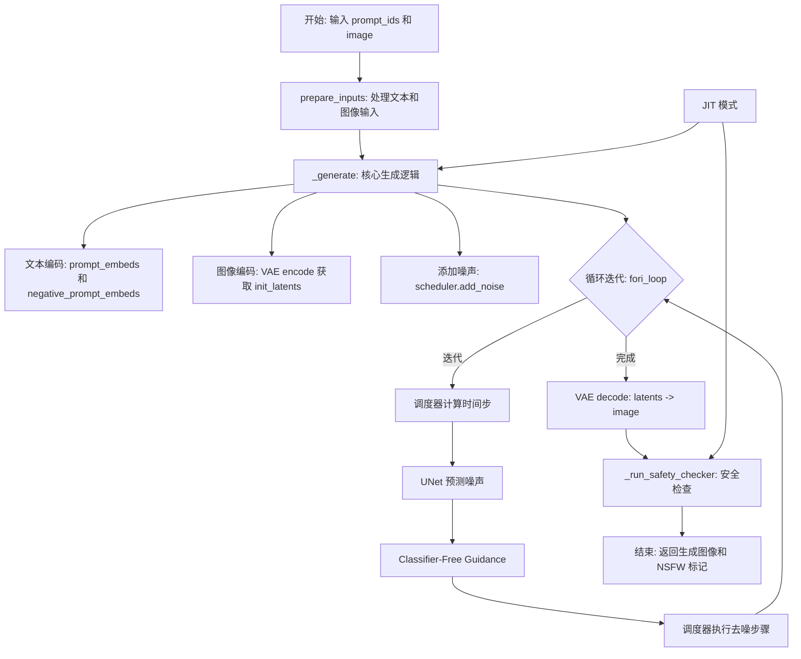
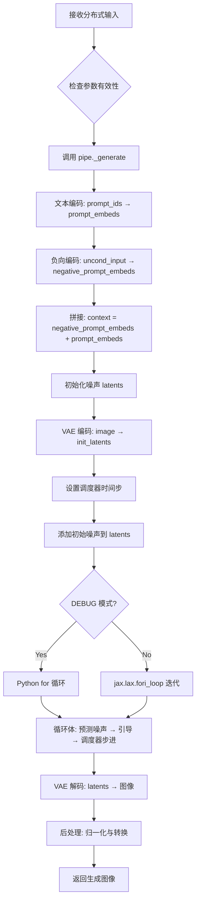
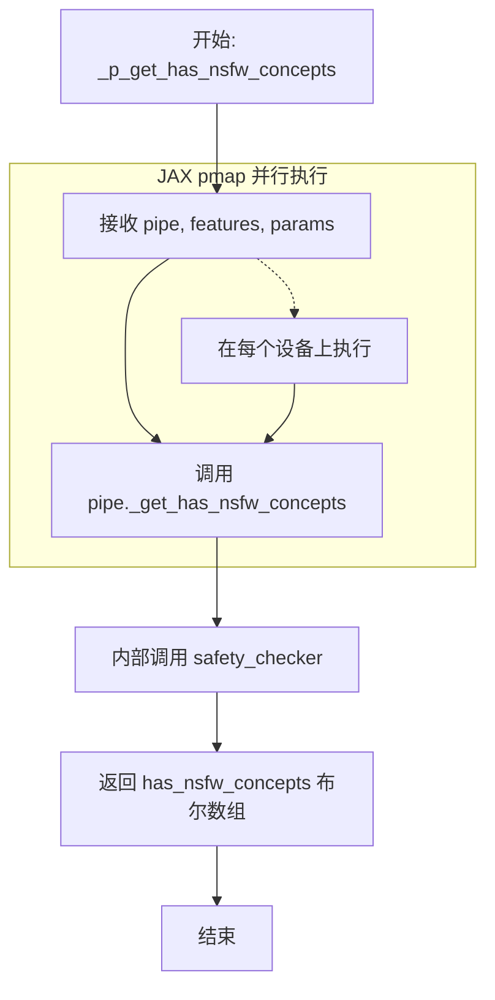
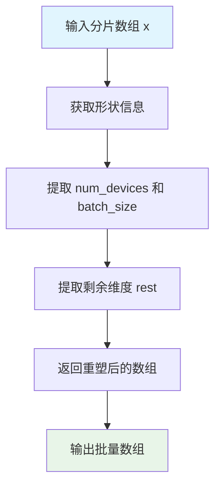
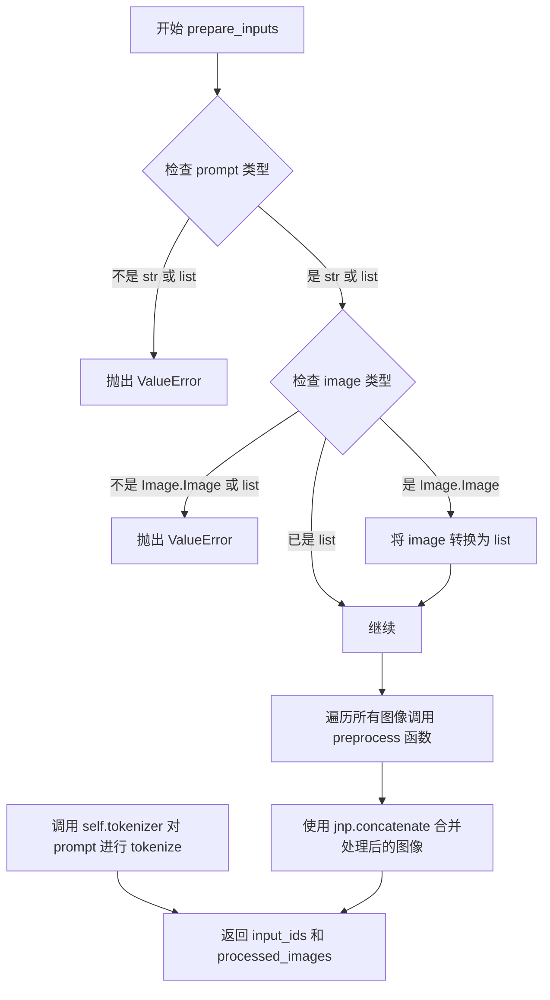
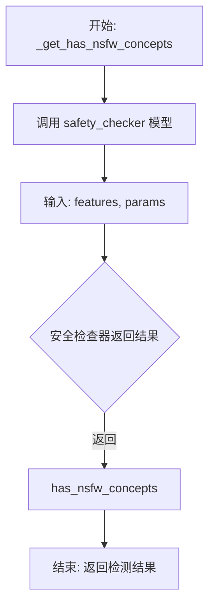
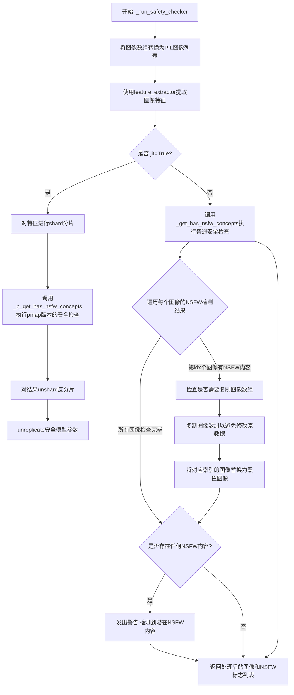
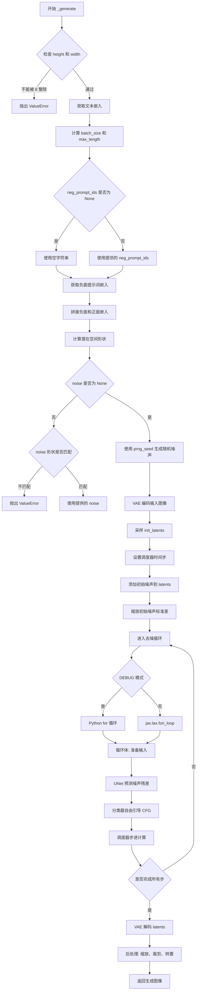
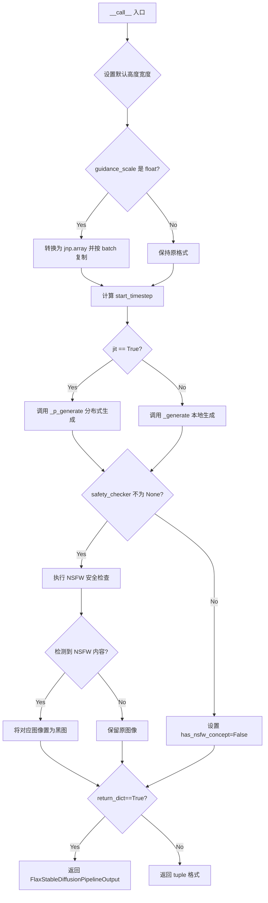

# `diffusers\src\diffusers\pipelines\stable_diffusion\pipeline_flax_stable_diffusion_img2img.py` 详细设计文档

这是一个基于 Flax (JAX) 的 Stable Diffusion 图像到图像 (Img2Img) 生成管道,允许用户通过文本提示将一张初始图像转换为新的图像。该管道整合了 VAE、文本编码器、UNet 和调度器,并集成了安全检查器以过滤不适当内容,支持 JIT 编译加速和分布式推理。

## 整体流程



## 类结构

```
FlaxDiffusionPipeline (抽象基类)
└── FlaxStableDiffusionImg2ImgPipeline
```

## 全局变量及字段


### `logger`
    
模块级日志记录器，用于输出管道运行时的日志信息

类型：`logging.Logger`
    


### `DEBUG`
    
调试模式标志，控制是否使用 Python for 循环代替 jax.fori_loop 以便于调试

类型：`bool`
    


### `EXAMPLE_DOC_STRING`
    
示例文档字符串，包含 pipeline 的使用示例和代码演示

类型：`str`
    


### `FlaxStableDiffusionImg2ImgPipeline.dtype`
    
模型计算数据类型，默认 jnp.float32，决定模型计算的精度

类型：`jnp.dtype`
    


### `FlaxStableDiffusionImg2ImgPipeline.vae`
    
VAE 编解码模型，用于将图像编码到潜在空间并从潜在空间解码还原图像

类型：`FlaxAutoencoderKL`
    


### `FlaxStableDiffusionImg2ImgPipeline.text_encoder`
    
CLIP 文本编码器，用于将文本提示编码为向量表示

类型：`FlaxCLIPTextModel`
    


### `FlaxStableDiffusionImg2ImgPipeline.tokenizer`
    
文本分词器，用于将文本分割为 token 序列

类型：`CLIPTokenizer`
    


### `FlaxStableDiffusionImg2ImgPipeline.unet`
    
去噪 UNet 模型，用于在扩散过程中预测并去除噪声

类型：`FlaxUNet2DConditionModel`
    


### `FlaxStableDiffusionImg2ImgPipeline.scheduler`
    
噪声调度器，控制扩散过程中的噪声添加和去除策略

类型：`FlaxDDIMScheduler | FlaxPNDMScheduler | FlaxLMSDiscreteScheduler | FlaxDPMSolverMultistepScheduler`
    


### `FlaxStableDiffusionImg2ImgPipeline.safety_checker`
    
NSFW 安全检查器，用于检测生成图像中是否包含不当内容

类型：`FlaxStableDiffusionSafetyChecker`
    


### `FlaxStableDiffusionImg2ImgPipeline.feature_extractor`
    
图像特征提取器，用于从图像中提取特征供安全检查器使用

类型：`CLIPImageProcessor`
    


### `FlaxStableDiffusionImg2ImgPipeline.vae_scale_factor`
    
VAE 潜在空间缩放因子，用于将图像尺寸映射到潜在空间的尺寸

类型：`int`
    
    

## 全局函数及方法


### `_p_generate`

JIT 编译的分布式生成函数，使用 JAX 的 `pmap` 在多个设备上并行执行图像生成。该函数是 `_generate` 方法的分布式版本，通过 `jax.pmap` 装饰器实现跨设备并行计算，适用于大规模推理场景。

参数：

- `pipe`：`FlaxStableDiffusionImg2ImgPipeline`，JAX 管道对象，包含模型组件
- `prompt_ids`：`jnp.ndarray`，文本提示的 token 化 IDs 数组
- `image`：`jnp.ndarray`，输入图像的 JAX 数组表示
- `params`：`dict | FrozenDict`，包含所有模型参数的字典
- `prng_seed`：`jax.Array`，JAX 随机数生成器密钥
- `start_timestep`：`int`，去噪过程的起始时间步
- `num_inference_steps`：`int`，去噪迭代的总步数
- `height`：`int`，生成图像的高度（像素）
- `width`：`int`，生成图像的宽度（像素）
- `guidance_scale`：`float | jnp.ndarray`，分类器自由引导的权重
- `noise`：`jnp.ndarray | None`，可选的预生成噪声向量
- `neg_prompt_ids`：`jnp.ndarray | None`，可选的负面提示 token IDs

返回值：`jnp.ndarray`，生成的图像数组

#### 流程图



#### 带注释源码

```python
# 静态 argnums 定义哪些参数在编译时静态绑定
# pipe, start_timestep, num_inference_steps, height, width 在所有设备上相同
# 其他参数按第一维度的 0 位置进行分片（sharded）
@partial(
    jax.pmap,
    in_axes=(None, 0, 0, 0, 0, None, None, None, None, 0, 0, 0),
    static_broadcasted_argnums=(0, 5, 6, 7, 8),
)
def _p_generate(
    pipe,                      # FlaxStableDiffusionImg2ImgPipeline 实例
    prompt_ids,                # 分片的提示 IDs (sharded)
    image,                     # 分片的输入图像 (sharded)
    params,                    # 模型参数（已复制到各设备）
    prng_seed,                 # 分片的随机种子 (sharded)
    start_timestep,            # 静态参数：起始时间步
    num_inference_steps,       # 静态参数：推理步数
    height,                    # 静态参数：图像高度
    width,                     # 静态参数：图像宽度
    guidance_scale,            # 分片的引导尺度 (sharded)
    noise,                     # 可选的预生成噪声 (sharded)
    neg_prompt_ids,            # 可选的负面提示 IDs (sharded)
):
    """
    分布式图像生成函数
    
    该函数使用 jax.pmap 在多个设备上并行执行：
    - 输入参数中 in_axes=(None, 0, 0, ...) 表示除 pipe 外，
      其他参数按第一维度分片到不同设备
    - static_broadcasted_argnums 指定在所有设备上使用相同值的参数
    
    Returns:
        pipe._generate() 返回的生成图像数组
    """
    # 调用管道对象的内部生成方法
    # 该方法执行完整的 Stable Diffusion 推理流程
    return pipe._generate(
        prompt_ids,
        image,
        params,
        prng_seed,
        start_timestep,
        num_inference_steps,
        height,
        width,
        guidance_scale,
        noise,
        neg_prompt_ids,
    )
```


### `_p_get_has_nsfw_concepts`

JIT 编译的 NSFW 概念检测函数，使用 `jax.pmap` 在多个设备上并行执行，用于检测图像特征中是否包含不适合公开的内容。

参数：

- `pipe`：`FlaxStableDiffusionImg2ImgPipeline`，Flax 管道实例，包含安全检查器模块
- `features`：`jnp.ndarray`，从生成的图像中提取的特征向量，通常由 `feature_extractor` 处理图像得到
- `params`：`dict | FrozenDict`，安全检查器的模型参数，已进行分片（sharded）处理

返回值：`jnp.ndarray`，布尔值数组，表示每个图像是否包含 NSFW 内容（True 表示包含，False 表示安全）

#### 流程图



#### 带注释源码

```python
@partial(jax.pmap, static_broadcasted_argnums=(0,))
def _p_get_has_nsfw_concepts(pipe, features, params):
    """
    JIT 编译的 NSFW 概念检测函数
    
    使用 jax.pmap 在多个 TPU/GPU 设备上并行执行安全检查。
    static_broadcasted_argnums=(0,) 表示 pipe 参数在所有设备上共享，
    不进行分片。
    
    参数:
        pipe: FlaxStableDiffusionImg2ImgPipeline 实例
        features: 从图像提取的特征，shape 为 [num_devices, batch_size, ...]
        params: 安全检查器参数，已进行分片处理
    返回:
        has_nsfw_concepts: 布尔数组，shape 与 features 的 batch 维度对应
    """
    # 调用管道实例的内部方法
    # 该方法将 features 和 params 传递给 safety_checker 模型
    return pipe._get_has_nsfw_concepts(features, params)
```

#### 相关内部方法

```python
def _get_has_nsfw_concepts(self, features, params):
    """
    非 JIT 版本的 NSFW 检测内部方法
    
    参数:
        features: 图像特征，shape 为 [batch_size, ...]
        params: 安全检查器参数
    返回:
        has_nsfw_concepts: 布尔数组
    """
    has_nsfw_concepts = self.safety_checker(features, params)
    return has_nsfw_concepts
```

#### 使用上下文

该函数在 `_run_safety_checker` 方法中被调用：

```python
def _run_safety_checker(self, images, safety_model_params, jit=False):
    # ... 提取特征 ...
    if jit:
        features = shard(features)  # 分片特征
        has_nsfw_concepts = _p_get_has_nsfw_concepts(self, features, safety_model_params)
        has_nsfw_concepts = unshard(has_nsfw_concepts)  # 合并结果
        safety_model_params = unreplicate(safety_model_params)
    else:
        has_nsfw_concepts = self._get_has_nsfw_concepts(features, safety_model_params)
    # ... 处理 NSFW 图像 ...
```


### `unshard`

将分片数据重组为批量数据。该函数接收一个经过 JAX pmap 分片处理的数组，将其从 `(num_devices, batch_size, ...)` 的形状重塑为 `((num_devices * batch_size), ...)` 的形式，用于将分布式计算的结果汇总为完整的批量结果。

参数：

- `x`：`jnp.ndarray`，输入的分片数组，通常来自 JAX pmap 操作，形状为 `(num_devices, batch_size, ...)`。

返回值：`jnp.ndarray`，重塑后的批量数组，形状为 `(num_devices * batch_size, ...)`。

#### 流程图



#### 带注释源码

```
def unshard(x: jnp.ndarray):
    # einops.rearrange(x, 'd b ... -> (d b) ...')
    # 获取数组的前两个维度：设备数量和批量大小
    num_devices, batch_size = x.shape[:2]
    # 获取剩余的维度信息（如高度、宽度、通道等）
    rest = x.shape[2:]
    # 将分片数据重塑为批量数据
    # 从 (num_devices, batch_size, ...) 转换为 (num_devices * batch_size, ...)
    return x.reshape(num_devices * batch_size, *rest)
```


### `preprocess`

该函数是图像预处理函数，用于将 PIL 图像转换为 Stable Diffusion 模型所需的格式。具体操作包括：将图像尺寸调整为 32 的整数倍（满足 UNet 的尺寸要求）、使用 Lanczos 重采样进行缩放、将像素值归一化到 [-1, 1] 范围，以及调整通道维度顺序（HWC -> CHW）。

参数：

-  `image`：`PIL.Image.Image`，输入的 PIL 图像对象
-  `dtype`：`jnp.dtype`，目标数据类型，用于后续 JAX 计算

返回值：`jnp.ndarray`，预处理后的图像数组，形状为 (1, C, H, W)，像素值范围为 [-1, 1]

#### 流程图

```mermaid
graph TD
    A[开始: 输入 PIL Image] --> B[获取图像宽度 w 和高度 h]
    B --> C{检查尺寸是否需要调整}
    C -->|是| D[计算新的宽高: w - w%32, h - h%32]
    C -->|否| E[保持原尺寸]
    D --> F[使用 Lanczos 重采样调整图像大小]
    E --> F
    F --> G[转换为 JAX 数组并转换为目标 dtype]
    G --> H[像素值归一化: 除以 255.0]
    H --> I[添加批次维度: image[None]]
    I --> J[转置通道顺序: HWC -> CHW]
    J --> K[像素值映射: 2.0 * image - 1.0]
    K --> L[结束: 输出 jnp.ndarray]
```

#### 带注释源码

```python
def preprocess(image, dtype):
    # 获取原始图像的宽度和高度
    w, h = image.size
    
    # 将宽高调整为 32 的整数倍，确保能被 UNet 整除
    # 这是因为 Stable Diffusion 的 UNet 要求尺寸为 8 的倍数（VAE 的缩放因子为 8）
    w, h = (x - x % 32 for x in (w, h))
    
    # 使用 Lanczos 重采样方法调整图像大小（高质量插值）
    image = image.resize((w, h), resample=PIL_INTERPOLATION["lanczos"])
    
    # 将 PIL 图像转换为 JAX 数组，并转换为目标数据类型
    # 同时将像素值从 [0, 255] 归一化到 [0, 1]
    image = jnp.array(image).astype(dtype) / 255.0
    
    # 添加批次维度 (H, W, C) -> (1, H, W, C)
    # 然后转置为 (1, C, H, W) 格式，符合 PyTorch/JAX 的通道优先约定
    image = image[None].transpose(0, 3, 1, 2)
    
    # 将像素值从 [0, 1] 映射到 [-1, 1]，这是 Stable Diffusion 模型的输入标准
    return 2.0 * image - 1.0
```


### `FlaxStableDiffusionImg2ImgPipeline.__init__`

该方法是 `FlaxStableDiffusionImg2ImgPipeline` 类的构造函数，负责初始化基于 Flax 的 Stable Diffusion Image-to-Image  pipeline 的所有核心组件，包括 VAE、文本编码器、分词器、UNet、调度器、安全检查器和特征提取器，并设置数据类型和 VAE 缩放因子。

参数：

- `vae`：`FlaxAutoencoderKL`，Variational Auto-Encoder (VAE) 模型，用于将图像编码到潜在空间并从潜在空间解码恢复图像
- `text_encoder`：`FlaxCLIPTextModel`，冻结的文本编码器 (clip-vit-large-patch14)，用于将文本提示转换为嵌入向量
- `tokenizer`：`CLIPTokenizer`，CLIP 分词器，用于将文本提示 token 化
- `unet`：`FlaxUNet2DConditionModel`，带条件机制的 UNet2D 模型，用于对潜在图像进行去噪
- `scheduler`：`FlaxDDIMScheduler | FlaxPNDMScheduler | FlaxLMSDiscreteScheduler | FlaxDPMSolverMultistepScheduler`，调度器，用于在去噪过程中计算噪声残差并逐步更新潜在表示
- `safety_checker`：`FlaxStableDiffusionSafetyChecker`，安全检查器模块，用于检测生成图像是否包含不当内容
- `feature_extractor`：`CLIPImageProcessor`，CLIP 图像处理器，用于从生成图像中提取特征作为安全检查器的输入
- `dtype`：`jnp.dtype`，可选参数，默认为 `jnp.float32`，指定模型计算使用的数据类型（如 float32、bfloat16 等）

返回值：`None`，构造函数无返回值，仅初始化实例属性

#### 流程图

```mermaid
flowchart TD
    A[开始 __init__] --> B[调用 super().__init__]
    B --> C[设置 self.dtype]
    C --> D{检查 safety_checker 是否为 None}
    D -->|是| E[发出安全警告日志]
    D -->|否| F[继续执行]
    E --> F
    F --> G[调用 self.register_modules 注册所有模块]
    G --> H[计算 self.vae_scale_factor]
    H --> I[结束 __init__]
    
    style A fill:#f9f,color:#000
    style I fill:#9f9,color:#000
    style H fill:#ff9,color:#000
```

#### 带注释源码

```python
def __init__(
    self,
    vae: FlaxAutoencoderKL,
    text_encoder: FlaxCLIPTextModel,
    tokenizer: CLIPTokenizer,
    unet: FlaxUNet2DConditionModel,
    scheduler: FlaxDDIMScheduler | FlaxPNDMScheduler | FlaxLMSDiscreteScheduler | FlaxDPMSolverMultistepScheduler,
    safety_checker: FlaxStableDiffusionSafetyChecker,
    feature_extractor: CLIPImageProcessor,
    dtype: jnp.dtype = jnp.float32,
):
    """
    初始化 Flax Stable Diffusion Image-to-Image Pipeline
    
    参数:
        vae: VAE 模型，用于图像编码/解码
        text_encoder: CLIP 文本编码器
        tokenizer: CLIP 分词器
        unet: 去噪 UNet 模型
        scheduler: 噪声调度器
        safety_checker: NSFW 安全检查器
        feature_extractor: 图像特征提取器
        dtype: 计算数据类型，默认为 float32
    """
    # 调用父类 FlaxDiffusionPipeline 的初始化方法
    # 父类会初始化一些基础配置和工具方法
    super().__init__()
    
    # 设置实例的数据类型，用于后续模型计算
    # 支持 float32, bfloat16 等不同精度
    self.dtype = dtype

    # 安全检查器为 None 时发出警告
    # 提示用户遵守 Stable Diffusion 许可证
    if safety_checker is None:
        logger.warning(
            f"You have disabled the safety checker for {self.__class__} by passing `safety_checker=None`. Ensure"
            " that you abide to the conditions of the Stable Diffusion license and do not expose unfiltered"
            " results in services or applications open to the public. Both the diffusers team and Hugging Face"
            " strongly recommend to keep the safety filter enabled in all public facing circumstances, disabling"
            " it only for use-cases that involve analyzing network behavior or auditing its results. For more"
            " information, please have a look at https://github.com/huggingface/diffusers/pull/254 ."
        )

    # 注册所有子模块，使它们可以通过 self.xxx 访问
    # 同时保存到 self._modules 字典中，便于保存/加载
    self.register_modules(
        vae=vae,
        text_encoder=text_encoder,
        tokenizer=tokenizer,
        unet=unet,
        scheduler=scheduler,
        safety_checker=safety_checker,
        feature_extractor=feature_extractor,
    )
    
    # 计算 VAE 缩放因子
    # VAE 通常将图像缩小 2^(num_layers-1) 倍
    # 标准 VAE 有 3 个下采样层，缩放因子为 2^(3-1) = 4
    # 但代码中用 2^(len-1)，默认通道数为 [128, 256, 512]，len=3，结果为 4
    # 如果 vae 不存在，默认使用 8
    self.vae_scale_factor = 2 ** (len(self.vae.config.block_out_channels) - 1) if getattr(self, "vae", None) else 8
```


### `FlaxStableDiffusionImg2ImgPipeline.prepare_inputs`

该方法用于将用户输入的文本提示（prompt）和图像（image）进行预处理，将其转换为管道所需的格式：文本经过tokenize后生成input_ids，图像经过预处理（调整大小、归一化）后转换为JAX数组。

参数：

- `prompt`：`str | list[str]`，文本提示，可以是单个字符串或字符串列表
- `image`：`Image.Image | list[Image.Image]`，输入图像，可以是单个PIL图像或图像列表

返回值：`tuple[jnp.ndarray, jnp.ndarray]`，返回两个元素的元组——第一个是文本的input_ids（token化后的结果），第二个是处理后的图像数组

#### 流程图



#### 带注释源码

```python
def prepare_inputs(self, prompt: str | list[str], image: Image.Image | list[Image.Image]):
    """
    准备输入数据：将文本提示和图像转换为管道所需的格式
    
    参数:
        prompt: 文本提示，str或list[str]
        image: 输入图像，Image.Image或list[Image.Image]
    
    返回:
        tuple: (text_input.input_ids, processed_images)
    """
    # 检查prompt类型是否合法
    if not isinstance(prompt, (str, list)):
        raise ValueError(f"`prompt` has to be of type `str` or `list` but is {type(prompt)}")

    # 检查image类型是否合法
    if not isinstance(image, (Image.Image, list)):
        raise ValueError(f"image has to be of type `PIL.Image.Image` or list but is {type(image)}")

    # 如果是单个PIL图像，转换为列表以便统一处理
    if isinstance(image, Image.Image):
        image = [image]

    # 对所有图像进行预处理并拼接成batch
    # preprocess函数负责：调整尺寸为32的倍数、转换为JAX数组、归一化到[-1,1]
    processed_images = jnp.concatenate([preprocess(img, jnp.float32) for img in image])

    # 使用tokenizer对文本进行tokenize
    text_input = self.tokenizer(
        prompt,
        padding="max_length",           # 填充到最大长度
        max_length=self.tokenizer.model_max_length,  # 最大长度由模型决定
        truncation=True,                # 超过最大长度进行截断
        return_tensors="np",            # 返回numpy数组
    )
    
    # 返回token化后的input_ids和处理后的图像
    return text_input.input_ids, processed_images
```


### `FlaxStableDiffusionImg2ImgPipeline._get_has_nsfw_concepts`

该方法是一个内部方法，用于调用安全检查器（safety_checker）来检测输入图像特征是否包含不适合工作内容（NSFW）。它接收图像特征和模型参数，通过安全检查器模型判断是否需要屏蔽图像，并将检测结果返回给调用者。

参数：

- `features`：`jnp.ndarray`，从图像中提取的特征向量，作为安全检查器的输入
- `params`：模型参数，用于安全检查器的前向传播

返回值：`jnp.ndarray`，布尔数组，表示每个图像是否包含NSFW内容（True表示包含）

#### 流程图



#### 带注释源码

```python
def _get_has_nsfw_concepts(self, features, params):
    """
    检测输入特征是否包含NSFW内容
    
    Args:
        features: 从图像中提取的特征向量，用于安全检查
        params: 安全检查器的模型参数
    
    Returns:
        has_nsfw_concepts: 布尔值或布尔数组，表示是否检测到NSFW内容
    """
    # 调用类中注册的安全检查器模块，对图像特征进行NSFW检测
    # safety_checker 是 FlaxStableDiffusionSafetyChecker 类型的模型
    has_nsfw_concepts = self.safety_checker(features, params)
    
    # 返回检测结果，可能是单个布尔值或布尔数组（取决于batch大小）
    return has_nsfw_concepts
```


### `FlaxStableDiffusionImg2ImgPipeline._run_safety_checker`

该方法负责检查生成的图像是否包含潜在的不当内容（NSFW），通过特征提取器提取图像特征并使用安全检查器模型进行判断，如果检测到不安全内容则将对应图像替换为黑色图像。

参数：

- `self`：`FlaxStableDiffusionImg2ImgPipeline` 实例，包含管道组件
- `images`：`jnp.ndarray`，生成的图像数组，形状为 `(batch_size, height, width, 3)`，值范围 [0, 1]
- `safety_model_params`：`dict | FrozenDict`，安全检查器模型的参数
- `jit`：`bool`，可选，默认为 `False`，是否使用 JIT 编译的 pmap 版本进行加速

返回值：`tuple`，包含两个元素：
- 第一个元素：`jnp.ndarray`，处理后的图像数组，不安全的图像已被替换为黑色图像
- 第二个元素：`list[bool] | jnp.ndarray`，每个图像是否包含 NSFW 内容的布尔标志列表

#### 流程图



#### 带注释源码

```python
def _run_safety_checker(self, images, safety_model_params, jit=False):
    """
    运行安全检查器以检测生成的图像中是否包含NSFW内容
    
    参数:
        images: 生成的图像数组，形状为 (batch_size, height, width, 3)
        safety_model_params: 安全检查器模型的参数
        jit: 是否使用JIT编译的pmap版本
    
    返回:
        (处理后的图像, NSFW标志列表)
    """
    
    # safety_model_params should already be replicated when jit is True
    # 将图像数组转换为PIL图像列表以便进行处理
    pil_images = [Image.fromarray(image) for image in images]
    
    # 使用特征提取器从PIL图像中提取特征
    # 返回的pixel_values将作为安全检查器的输入
    features = self.feature_extractor(pil_images, return_tensors="np").pixel_values

    # 根据jit参数选择不同的执行路径
    if jit:
        # JIT模式：使用pmap进行分布式处理
        # 对特征进行shard以匹配设备数量
        features = shard(features)
        
        # 调用pmap版本的NSFW概念检测函数
        has_nsfw_concepts = _p_get_has_nsfw_concepts(self, features, safety_model_params)
        
        # 重新组织结果维度：从 (num_devices, batch, ...) 变为 (batch, ...)
        has_nsfw_concepts = unshard(has_nsfw_concepts)
        
        # 还原复制的模型参数
        safety_model_params = unreplicate(safety_model_params)
    else:
        # 非JIT模式：直接调用实例方法执行安全检查
        has_nsfw_concepts = self._get_has_nsfw_concepts(features, safety_model_params)

    # 初始化标志，用于跟踪是否需要复制图像数组
    images_was_copied = False
    
    # 遍历每个图像的NSFW检测结果
    for idx, has_nsfw_concept in enumerate(has_nsfw_concepts):
        if has_nsfw_concept:
            # 如果检测到NSFW内容，替换为黑色图像
            if not images_was_copied:
                # 首次检测到NSFW时复制图像数组，避免修改原始数据
                images_was_copied = True
                images = images.copy()

            # 用黑色图像替换不安全的图像
            images[idx] = np.zeros(images[idx].shape, dtype=np.uint8)

    # 如果存在任何NSFW内容，发出警告
    if any(has_nsfw_concepts):
        warnings.warn(
            "Potential NSFW content was detected in one or more images. A black image will be returned"
            " instead. Try again with a different prompt and/or seed."
        )

    # 返回处理后的图像和NSFW标志列表
    return images, has_nsfw_concepts
```


### FlaxStableDiffusionImg2ImgPipeline.get_timestep_start

该方法用于计算图像到图像（Img2Img）pipeline中去噪过程的起始时间步（timestep）。它根据推理步骤数和图像转换强度（strength）来计算从哪个时间步开始进行去噪，强度越高，起始时间步越接近原始噪声状态，从而实现从噪声图像逐步恢复为目标图像的过程。

参数：

- `num_inference_steps`：`int`，推理过程中使用的去噪步骤总数，決定了生成图像的迭代次数
- `strength`：`float`，图像转换的强度系数，取值范围通常为0到1之间，值越大表示对原始图像的改变程度越大

返回值：`int`，返回去噪过程的起始时间步索引，用于后续的噪声调度和图像生成过程

#### 流程图

```mermaid
flowchart TD
    A[开始] --> B[计算 init_timestep = min(int(num_inference_steps * strength), num_inference_steps)]
    B --> C[计算 t_start = max(num_inference_steps - init_timestep, 0)]
    C --> D[返回 t_start]
    D --> E[结束]
```

#### 带注释源码

```python
def get_timestep_start(self, num_inference_steps, strength):
    """
    计算图像到图像转换的起始时间步。
    
    该方法根据推理步骤数和转换强度计算去噪过程的起始点。
    strength参数决定了从原图开始还是从完全噪声开始。
    
    Args:
        num_inference_steps: 推理步骤总数
        strength: 转换强度，值越大表示添加的噪声越多
        
    Returns:
        起始时间步索引
    """
    
    # get the original timestep using init_timestep
    # 计算初始时间步，基于强度参数和推理步骤数
    # strength * num_inference_steps 得到应该保留的原始图像信息量
    # 使用min确保不超过总步骤数
    init_timestep = min(int(num_inference_steps * strength), num_inference_steps)

    # 计算起始时间步：总步骤数减去初始时间步
    # 这样当strength=1时，t_start=0，从完全噪声开始
    # 当strength较小时，t_start较大，保留更多原始图像特征
    t_start = max(num_inference_steps - init_timestep, 0)

    return t_start
```


### `FlaxStableDiffusionImg2ImgPipeline._generate`

该方法是 Flax 版本的 Stable Diffusion 图像到图像（Img2Img）管道的核心生成函数，负责将文本提示和初始图像转换为目标图像。该方法通过 VAE 编码输入图像为潜在表示，使用 UNet 进行迭代去噪，结合文本嵌入进行分类器自由引导（CFG），最终通过 VAE 解码生成新图像。

参数：

- `prompt_ids`：`jnp.ndarray`，经过分词处理的文本提示 ID 数组，用于获取文本嵌入
- `image`：`jnp.ndarray`，输入图像的 JAX 数组表示，作为图像到图像转换的起点
- `params`：`dict | FrozenDict`，包含所有模型（text_encoder、vae、unet、scheduler）参数的字典
- `prng_seed`：`jax.Array`，JAX 随机数生成器密钥，用于采样噪声和 VAE 解码
- `start_timestep`：`int`，去噪过程的起始时间步，根据 strength 参数计算得出
- `num_inference_steps`：`int`，去噪迭代的总步数，决定生成过程的精细程度
- `height`：`int`，生成图像的高度（像素），必须能被 8 整除
- `width`：`int`，生成图像的宽度（像素），必须能被 8 整除
- `guidance_scale`：`float`，分类器自由引导（CFG）尺度，值越大生成的图像与提示词相关性越高
- `noise`：`jnp.ndarray | None`，可选的预生成噪声数组，用于可复现的生成
- `neg_prompt_ids`：`jnp.ndarray | None`，可选的负面提示词 ID，用于引导模型避免生成特定内容

返回值：`jnp.ndarray`，生成的图像数组，形状为 (batch_size, height, width, channels)，值域为 [0, 1]

#### 流程图



#### 带注释源码

```python
def _generate(
    self,
    prompt_ids: jnp.ndarray,
    image: jnp.ndarray,
    params: dict | FrozenDict,
    prng_seed: jax.Array,
    start_timestep: int,
    num_inference_steps: int,
    height: int,
    width: int,
    guidance_scale: float,
    noise: jnp.ndarray | None = None,
    neg_prompt_ids: jnp.ndarray | None = None,
):
    # 验证图像尺寸是否满足 VAE 和 UNet 的要求（必须能被 8 整除）
    if height % 8 != 0 or width % 8 != 0:
        raise ValueError(f"`height` and `width` have to be divisible by 8 but are {height} and {width}.")

    # 步骤 1: 获取文本提示的嵌入表示
    # 使用 text_encoder 将 token IDs 转换为文本嵌入向量
    prompt_embeds = self.text_encoder(prompt_ids, params=params["text_encoder"])[0]

    # 确定批量大小（基于 prompt_ids 的第一维）
    batch_size = prompt_ids.shape[0]

    # 获取文本的最大长度（padding 后的长度）
    max_length = prompt_ids.shape[-1]

    # 步骤 2: 处理负面提示词
    # 如果没有提供负面提示词，则使用空字符串
    if neg_prompt_ids is None:
        uncond_input = self.tokenizer(
            [""] * batch_size, padding="max_length", max_length=max_length, return_tensors="np"
        ).input_ids
    else:
        uncond_input = neg_prompt_ids
    
    # 获取负面提示词的文本嵌入
    negative_prompt_embeds = self.text_encoder(uncond_input, params=params["text_encoder"])[0]
    
    # 步骤 3: 拼接负面和正面嵌入用于分类器自由引导（CFG）
    # 格式: [negative_prompt_embeds, positive_prompt_embeds]
    context = jnp.concatenate([negative_prompt_embeds, prompt_embeds])

    # 步骤 4: 计算潜在空间的形状
    # 潜在空间大小是像素空间的 1/vae_scale_factor（通常是 8）
    latents_shape = (
        batch_size,
        self.unet.config.in_channels,  # 通常为 4
        height // self.vae_scale_factor,
        width // self.vae_scale_factor,
    )

    # 步骤 5: 生成或验证噪声
    if noise is None:
        # 使用 PRNG 种子生成随机噪声
        noise = jax.random.normal(prng_seed, shape=latents_shape, dtype=jnp.float32)
    else:
        # 验证提供的噪声形状是否匹配预期
        if noise.shape != latents_shape:
            raise ValueError(f"Unexpected latents shape, got {noise.shape}, expected {latents_shape}")

    # 步骤 6: 使用 VAE 编码输入图像到潜在空间
    # encode 方法返回潜在分布，然后从中采样
    init_latent_dist = self.vae.apply({"params": params["vae"]}, image, method=self.vae.encode).latent_dist
    init_latents = init_latent_dist.sample(key=prng_seed).transpose((0, 3, 1, 2))
    # 应用 VAE 缩放因子
    init_latents = self.vae.config.scaling_factor * init_latents

    # 定义去噪循环的主体函数
    def loop_body(step, args):
        latents, scheduler_state = args
        
        # 为了进行分类器自由引导（CFG），将 latents 复制两份
        # 第一次用于无条件预测，第二次用于条件预测
        latents_input = jnp.concatenate([latents] * 2)

        # 获取当前时间步
        t = jnp.array(scheduler_state.timesteps, dtype=jnp.int32)[step]
        # 广播时间步以匹配批量大小
        timestep = jnp.broadcast_to(t, latents_input.shape[0])

        # 调度器缩放模型输入（根据噪声调度算法）
        latents_input = self.scheduler.scale_model_input(scheduler_state, latents_input, t)

        # 步骤 7: 使用 UNet 预测噪声残差
        noise_pred = self.unet.apply(
            {"params": params["unet"]},
            jnp.array(latents_input),
            jnp.array(timestep, dtype=jnp.int32),
            encoder_hidden_states=context,
        ).sample

        # 步骤 8: 执行分类器自由引导（CFG）
        # 将预测结果拆分为无条件预测和条件预测
        noise_pred_uncond, noise_prediction_text = jnp.split(noise_pred, 2, axis=0)
        # 根据 guidance_scale 计算引导后的噪声预测
        noise_pred = noise_pred_uncond + guidance_scale * (noise_prediction_text - noise_pred_uncond)

        # 步骤 9: 调度器执行一步去噪
        # 计算前一个（更少噪声的）潜在表示 x_t -> x_{t-1}
        latents, scheduler_state = self.scheduler.step(scheduler_state, noise_pred, t, latents).to_tuple()
        
        return latents, scheduler_state

    # 步骤 10: 初始化调度器，设置去噪步骤
    scheduler_state = self.scheduler.set_timesteps(
        params["scheduler"], num_inference_steps=num_inference_steps, shape=latents_shape
    )

    # 步骤 11: 计算初始潜在时间步
    # 根据 start_timestep 选择起始点，并复制到整个批量
    latent_timestep = scheduler_state.timesteps[start_timestep : start_timestep + 1].repeat(batch_size)

    # 步骤 12: 向初始潜在表示添加噪声
    latents = self.scheduler.add_noise(params["scheduler"], init_latents, noise, latent_timestep)

    # 步骤 13: 根据调度器的初始噪声 sigma 缩放潜在表示
    latents = latents * params["scheduler"].init_noise_sigma

    # 步骤 14: 执行去噪循环
    if DEBUG:
        # 调试模式：使用 Python for 循环（更容易调试）
        for i in range(start_timestep, num_inference_steps):
            latents, scheduler_state = loop_body(i, (latents, scheduler_state))
    else:
        # 生产模式：使用 JAX 的 fori_loop（更高效，可编译）
        latents, _ = jax.lax.fori_loop(start_timestep, num_inference_steps, loop_body, (latents, scheduler_state))

    # 步骤 15: VAE 解码潜在表示到图像空间
    # 首先逆缩放潜在表示
    latents = 1 / self.vae.config.scaling_factor * latents
    # 解码
    image = self.vae.apply({"params": params["vae"]}, latents, method=self.vae.decode).sample

    # 步骤 16: 后处理输出图像
    # 将值从 [-1, 1] 转换到 [0, 1]，并调整维度顺序为 (batch, height, width, channels)
    image = (image / 2 + 0.5).clip(0, 1).transpose(0, 2, 3, 1)
    
    return image
```


### `FlaxStableDiffusionImg2ImgPipeline.__call__`

该方法是Flax实现的Stable Diffusion图像到图像（Img2Img）生成管道的主入口函数。它接受文本提示词ID和输入图像，通过去噪扩散过程将输入图像转换为与文本提示相符的新图像，同时支持NSFW内容过滤和JAX并行加速。

参数：

- `prompt_ids`：`jnp.ndarray`，文本提示词的tokenized IDs，用于引导图像生成
- `image`：`jnp.ndarray`，表示输入图像批次的数组，作为图像生成的起点
- `params`：`dict | FrozenDict`，包含模型参数权重的字典
- `prng_seed`：`jax.Array`，随机数生成器密钥，用于确定性生成
- `strength`：`float`，可选，默认0.8，变换参考图像的程度，值在0到1之间，值越大添加的噪声越多
- `num_inference_steps`：`int`，可选，默认50，去噪步数，越多生成质量越高但推理越慢
- `height`：`int | None`，可选，生成图像的高度像素，默认使用unet配置
- `width`：`int | None`，可选，生成图像的宽度像素，默认使用unet配置
- `guidance_scale`：`float | jnp.ndarray`，可选，默认7.5，引导尺度，鼓励模型生成更贴近文本提示的图像
- `noise`：`jnp.ndarray`，可选，预生成的噪声latents，用于可重复生成
- `neg_prompt_ids`：`jnp.ndarray`，可选，负面提示词IDs，用于Classifier-Free Guidance
- `return_dict`：`bool`，可选，默认True，是否返回字典格式的输出
- `jit`：`bool`，可选，默认False，是否运行pmap版本的生成和安全评分函数

返回值：`FlaxStableDiffusionPipelineOutput` 或 `tuple`，当return_dict为True时返回包含生成图像和NSFW检测标志的管道输出对象，否则返回元组

#### 流程图



#### 带注释源码

```python
@replace_example_docstring(EXAMPLE_DOC_STRING)
def __call__(
    self,
    prompt_ids: jnp.ndarray,           # 文本提示词的tokenized IDs
    image: jnp.ndarray,                 # 输入图像批次
    params: dict | FrozenDict,         # 模型参数字典
    prng_seed: jax.Array,               # 随机数种子
    strength: float = 0.8,              # 图像变换强度
    num_inference_steps: int = 50,      # 去噪推理步数
    height: int | None = None,          # 输出图像高度
    width: int | None = None,           # 输出图像宽度
    guidance_scale: float | jnp.ndarray = 7.5,  # 引导尺度
    noise: jnp.ndarray = None,          # 预定义噪声
    neg_prompt_ids: jnp.ndarray = None, # 负面提示词
    return_dict: bool = True,           # 返回格式控制
    jit: bool = False,                  # 是否使用JAX pmap
):
    # 0. 默认高度和宽度使用unet配置
    height = height or self.unet.config.sample_size * self.vae_scale_factor
    width = width or self.unet.config.sample_size * self.vae_scale_factor

    # 处理guidance_scale：如果是float则转换为tensor
    # 这样每个设备都能获得副本，按prompt_ids的shape信息
    if isinstance(guidance_scale, float):
        guidance_scale = jnp.array([guidance_scale] * prompt_ids.shape[0])
        if len(prompt_ids.shape) > 2:
            # 假设是sharded的
            guidance_scale = guidance_scale[:, None]

    # 计算起始时间步，基于strength和num_inference_steps
    start_timestep = self.get_timestep_start(num_inference_steps, strength)

    # 根据jit参数选择生成函数
    if jit:
        # 使用pmap分布式生成（跨设备）
        images = _p_generate(
            self,
            prompt_ids,
            image,
            params,
            prng_seed,
            start_timestep,
            num_inference_steps,
            height,
            width,
            guidance_scale,
            noise,
            neg_prompt_ids,
        )
    else:
        # 本地单设备生成
        images = self._generate(
            prompt_ids,
            image,
            params,
            prng_seed,
            start_timestep,
            num_inference_steps,
            height,
            width,
            guidance_scale,
            noise,
            neg_prompt_ids,
        )

    # 如果配置了安全检查器，执行NSFW检测
    if self.safety_checker is not None:
        safety_params = params["safety_checker"]
        # 将图像转换为uint8格式用于安全检查
        images_uint8_casted = (images * 255).round().astype("uint8")
        num_devices, batch_size = images.shape[:2]

        # 重塑数组以进行安全检查
        images_uint8_casted = np.asarray(images_uint8_casted).reshape(
            num_devices * batch_size, height, width, 3
        )
        # 运行安全检查器
        images_uint8_casted, has_nsfw_concept = self._run_safety_checker(
            images_uint8_casted, safety_params, jit
        )
        images = np.asarray(images)

        # 屏蔽检测到NSFW内容的图像
        if any(has_nsfw_concept):
            for i, is_nsfw in enumerate(has_nsfw_concept):
                if is_nsfw:
                    images[i] = np.asarray(images_uint8_casted[i])

        # 恢复原始形状
        images = images.reshape(num_devices, batch_size, height, width, 3)
    else:
        # 无安全检查器时
        images = np.asarray(images)
        has_nsfw_concept = False

    # 根据return_dict决定返回格式
    if not return_dict:
        return (images, has_nsfw_concept)

    # 返回管道输出对象
    return FlaxStableDiffusionPipelineOutput(
        images=images, 
        nsfw_content_detected=has_nsfw_concept
    )
```

## 关键组件


### FlaxStableDiffusionImg2ImgPipeline

基于Flax的Stable Diffusion图像到图像（Img2Img）生成管道，继承自FlaxDiffusionPipeline，通过接收文本提示和初始图像，在潜在空间中进行去噪处理生成新图像。

### 核心组件：VAE（变分自编码器）

负责将图像编码到潜在空间以及从潜在空间解码回图像，使用FlaxAutoencoderKL模型，通过encode生成latent分布，通过decode重建图像。

### 核心组件：UNet条件模型

FlaxUNet2DConditionModel用于去噪潜在表示，接收噪声潜在变量、时间步嵌入和文本条件嵌入作为输入，预测噪声残差。

### 核心组件：文本编码器

FlaxCLIPTextModel将tokenized的文本提示转换为文本嵌入向量，用于条件引导图像生成过程。

### 核心组件：调度器（Scheduler）

支持多种噪声调度策略，包括FlaxDDIMScheduler、FlaxDPMSolverMultistepScheduler、FlaxLMSDiscreteScheduler和FlaxPNDMScheduler，用于控制去噪步骤和噪声时间表。

### 核心组件：安全检查器

FlaxStableDiffusionSafetyChecker用于检测生成图像是否包含NSFW（不宜内容）内容，如果检测到则用黑图替换。

### 输入预处理（prepare_inputs）

负责验证和预处理用户输入的prompt和图像，将PIL图像转换为JAX数组并将文本token化，返回处理后的text_input_ids和processed_images。

### 图像预处理（preprocess函数）

将PIL图像调整为32的整数倍，使用Lanczos重采样，将像素值归一化到[-1, 1]范围，转换为CHW格式以适配模型输入。

### 核心生成方法（_generate）

实现完整的图像生成流程：文本嵌入提取、条件与无条件嵌入拼接、潜在空间初始化、基于调度器的去噪循环（支持jax.lax.fori_loop和Python循环两种模式）、VAE解码输出最终图像。

### 时间步计算（get_timestep_start）

根据num_inference_steps和strength参数计算去噪过程的起始时间步，用于控制图像变形的强度。

### 安全检查执行（_run_safety_checker）

执行NSFW检测流程：将图像转换为特征、调用safety_checker判断、替换问题图像为零值图像、输出警告信息。

### JAX分布式执行（_p_generate和_p_get_has_nsfw_concepts）

使用jax.pmap实现跨多设备并行生成和安全检查，通过static_broadcasted_argnums固定非张量参数，提高大规模推理效率。

### unshard函数

将分片（sharded）的JAX数组重新组合为批量维度，用于将pmap输出的分布式结果汇总。

### 引导缩放处理

在__call__方法中处理guidance_scale，将其转换为适配sharded输入的tensor格式，确保在分布式环境下正确广播。


## 问题及建议


### 已知问题

- **TODO未实现**：代码中包含TODO注释 `# TODO: currently it is assumed do_classifier_free_guidance = guidance_scale > 1.0 implement this conditional`，表明`do_classifier_free_guidance`的条件逻辑尚未完全实现。
- **NSFW检查逻辑冗余**：在`_run_safety_checker`方法中，`if any(has_nsfw_concepts):`警告被放在`for`循环内部，每次迭代都会重复检查，效率低下且逻辑不当。
- **重复的数组转换**：在`_generate`方法中多次使用`jnp.array()`对已经是JAX数组的对象进行转换（如`jnp.array(latents_input)`、`jnp.array(timestep, dtype=jnp.int32)`），这些输入通常是JAX数组，无需重复转换。
- **类型注解兼容性问题**：使用了Python 3.10+的联合类型语法 `FlaxDDIMScheduler | FlaxPNDMScheduler | ...`，如果运行在Python 3.9环境会导致语法错误。
- **不必要的PIL图像创建**：在`_run_safety_checker`中，先将numpy数组转为PIL图像用于特征提取，然后又丢弃这些PIL图像，中间存在不必要的内存开销。
- **魔法数字**：代码中多处使用硬编码的数字如`32`（图像resize）、`8`（vae_scale_factor默认值），缺乏常量定义。
- **条件变量访问**：虽然`self.vae`已通过`register_modules`注册，但在`__init__`中仍使用`getattr(self, "vae", None)`进行条件检查，逻辑略显冗余。

### 优化建议

- **提取常量**：将`32`（图像尺寸对齐）、`2.0`、`1.0`（图像归一化系数）等魔法数字提取为模块级常量，提高可维护性。
- **重构长方法**：将`_generate`方法拆分为更小的子方法，例如将噪声添加、调度器设置、循环去噪等逻辑分别提取到独立方法中。
- **优化NSFW检查**：将`if any(has_nsfw_concepts):`警告移到`for`循环外部，避免重复执行。
- **移除冗余转换**：检查并移除不必要的`jnp.array()`包装，直接使用已有的JAX数组。
- **类型注解降级**：将联合类型改为`Union[FlaxDDIMScheduler, FlaxPNDMScheduler, ...]`以兼容Python 3.9。
- **添加输入验证**：在`preprocess`函数中添加对输入图像尺寸、格式的验证，防止异常输入导致后续错误。
- **考虑使用JAX的`jtu`工具**：对于需要确保JAX数组类型的地方，可以使用`jtu`提供的工具函数进行更规范的处理。

## 其它


### 设计目标与约束

**设计目标**：实现一个基于Flax的Stable Diffusion图像到图像（Img2Img）生成管道，支持在JAX/TPU硬件上高效运行条件图像生成任务，能够根据文本提示和初始图像生成相关内容，同时集成NSFW内容安全检查机制。

**主要约束**：
- 依赖JAX生态系统（Flax、Haiku等），必须在JAX兼容硬件（TPU/GPU）上运行
- 输入图像尺寸必须为32的整数倍
- 当前实现不支持classifier-free guidance的条件分支预测优化
- 管道不支持动态图（Eager mode）下的完全自动向量化
- 安全检查器为可选组件，默认启用

### 错误处理与异常设计

**参数校验**：
- `prompt`类型必须为`str`或`list[str]`，否则抛出`ValueError`
- `image`类型必须为`PIL.Image.Image`或`list`，否则抛出`ValueError`
- `height`和`width`必须能被8整除，否则在`_generate`中抛出`ValueError`
- `noise`形状必须与`latents_shape`匹配，否则抛出`ValueError`

**运行时警告**：
- 当安全检查器被禁用时，发出`logger.warning`提醒潜在风险
- 当检测到NSFW内容时，发出`warnings.warn`警告用户

**异常传播**：
- JAX底层异常（如形状不匹配、设备不可用）将直接向上传播
- 调度器step失败会导致整个生成过程终止

### 数据流与状态机

**主要数据流**：
1. **输入预处理阶段**：原始图像和文本提示经过`prepare_inputs`方法处理
   - 图像：PIL Image → JAX数组（归一化到[-1, 1]）
   - 文本：字符串 → tokenizer → input_ids

2. **编码阶段**：
   - 文本通过`text_encoder`生成embeddings
   - 图像通过VAE encoder生成latent分布

3. **去噪循环阶段**（状态机）：
   ```
   初始化 → [UNet预测噪声 → CFG计算 → 调度器step] → ... → 达到目标步数
   ```

4. **解码阶段**：最终latents通过VAE decoder转换为图像

5. **安全检查阶段**：生成的图像经过safety_checker检查NSFW内容

**关键状态**：
- `scheduler_state`：包含当前调度器的内部状态（timesteps等）
- `latents`：当前去噪过程中的潜在表示
- `prng_seed`：JAX随机数生成器状态

### 外部依赖与接口契约

**核心依赖**：
- `jax` / `jax.numpy`：数值计算后端
- `flax`：神经网络框架
- `transformers`：CLIP文本编码器和图像处理器
- `diffusers`：扩散模型组件（VAE、UNet、调度器）
- `PIL`：图像处理
- `numpy`：数组转换

**模块间接口**：
- 管道继承自`FlaxDiffusionPipeline`，遵循统一加载/保存接口
- 组件通过`register_modules`注册，支持运行时替换
- `safety_checker`和`feature_extractor`为可选依赖

**第三方模型约定**：
- 文本编码器：必须实现`__call__`方法返回hidden states
- VAE：必须实现`encode`和`decode`方法
- UNet：必须接受`sample`、`timestep`、`encoder_hidden_states`参数

### 性能考虑

**计算优化**：
- 使用`jax.lax.fori_loop`替代Python循环以支持XLA编译
- 使用`pmap`实现多设备并行推理
- 静态参数通过`static_broadcasted_argnums`避免每次编译

**内存优化**：
- 中间结果使用sharded数组分布到多设备
- 潜在表示在去噪循环中保持JAX数组格式，避免频繁转换

**权衡因素**：
- `DEBUG=True`时使用Python循环，便于调试但损失性能
- `jit=False`时跳过pmap优化，适用于单设备调试

### 并发与线程安全

**JAX并发模型**：
- 使用`pmap`实现数据并行，各设备执行相同计算
- `shard`函数将输入数据分布到各设备
- `unreplicate`将参数从多设备状态恢复为单设备

**状态隔离**：
- 每个推理调用需要独立的`prng_seed`
- 参数字典`params`应为replicated状态以适配pmap

**线程安全**：
- 管道对象本身无状态（除模型引用外），可安全共享
- 多个并发调用需各自独立的`params`和`prng_seed`

### 安全性考虑

**输入验证**：
- 未对`prompt`内容进行过滤
- 未对图像尺寸设置上限，可能导致内存问题

**输出过滤**：
- 默认启用`safety_checker`检测NSFW内容
- 检测到问题时返回黑色图像而非原始内容
- 警告用户可能检测到不当内容

**模型加载安全**：
- 加载预训练模型需遵守Hugging Face Hub使用条款
- 商业使用需注意Stable Diffusion许可证限制

### 配置管理

**运行时配置**：
- `dtype`：计算精度（默认jnp.float32）
- `strength`：图像变换强度（0-1）
- `num_inference_steps`：去噪步数
- `guidance_scale`：CFG引导强度
- `jit`：是否启用JAX编译优化

**模型配置**：
- 通过`from_pretrained`加载时指定dtype和revision
- 组件配置存储在各自模块的`config`属性中

### 资源管理

**GPU/TPU内存**：
- 典型配置下需要约8-12GB显存（TPU v4或等效GPU）
- 批量大小受设备数量和内存限制

**临时文件**：
- 不生成中间临时文件
- 所有计算在内存中完成

### 监控与可观测性

**日志记录**：
- 使用`logging.get_logger(__name__)`获取模块级日志器
- 输出警告和提示信息，辅助问题诊断

**调试支持**：
- `DEBUG`标志支持Python循环模式，便于使用传统调试器
- `jit=False`支持Eager模式调试

### 测试策略

**单元测试**：
- 参数类型校验测试
- 调度器状态转换测试

**集成测试**：
- 完整端到端生成流程测试
- 多设备并行推理测试

**回归测试**：
- 确保生成结果稳定性（固定种子）
- 模型更新后的输出一致性验证

### 部署注意事项

**环境要求**：
- Python 3.8+
- JAX兼容硬件（TPU强烈推荐）
- 依赖库版本需与预训练模型匹配

**容器化**：
- 推荐使用Hugging Face官方Docker镜像
- 需要确保JAX设备驱动正确安装

**扩展性**：
- 可通过替换调度器实现不同采样算法
- 可通过替换safety_checker实现自定义安全策略

### 版本兼容性

**依赖版本**：
- diffusers库需与模型版本匹配
- transformers库版本影响文本编码器兼容性
- Flax版本影响神经网络构建方式

**API稳定性**：
- 公共接口（`__call__`、`prepare_inputs`）相对稳定
- 内部实现（`_generate`、loop_body）可能随版本变化

### 使用限制和许可证

**许可证**：
- 代码采用Apache License 2.0
- 预训练模型受Stable Diffusion许可证约束
- 商业使用需注意潜在的知识产权风险

**使用限制**：
- 不得用于生成有害或违法内容
- 需遵守模型卡片的建议用途
- 某些司法管辖区对AI生成内容有特殊规定

### 日志记录策略

**日志级别**：
- `logger.warning`：安全检查器禁用、潜在NSFW内容检测
- 标准Python `warnings.warn`：运行时警告（如NSFW检测）

**日志内容**：
- 模块初始化信息
- 运行时配置参数（非敏感）
- 异常和错误信息

**调试模式**：
- 启用`DEBUG`标志时，输出详细循环执行信息
- Eager模式下可查看中间张量形状


    