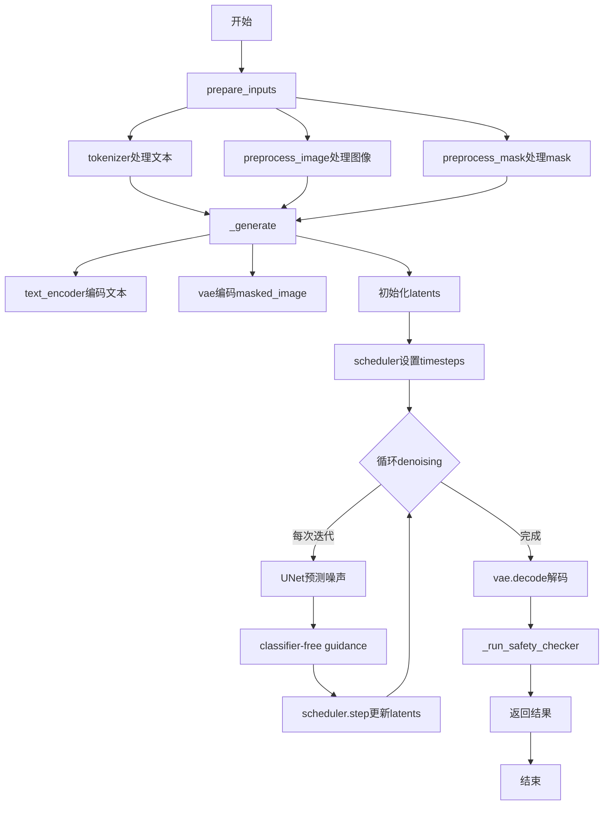
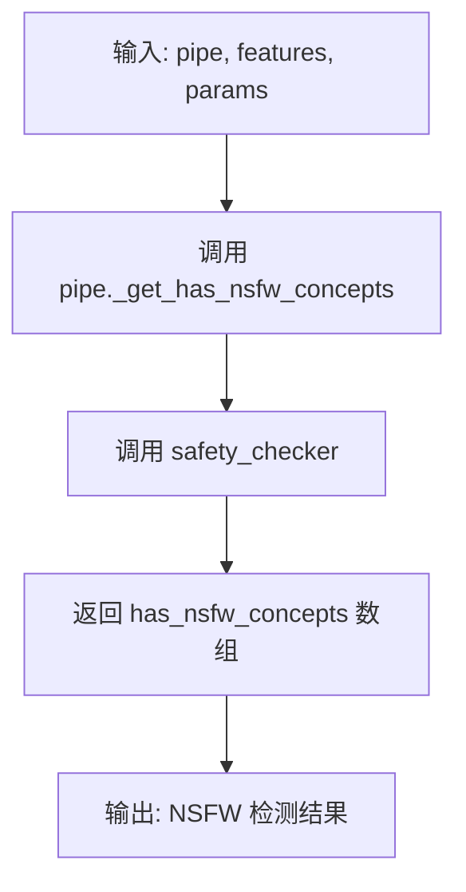
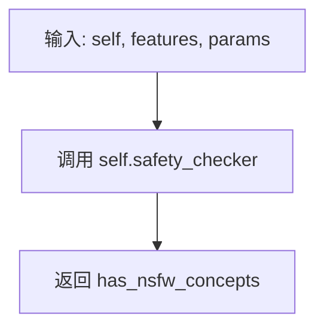
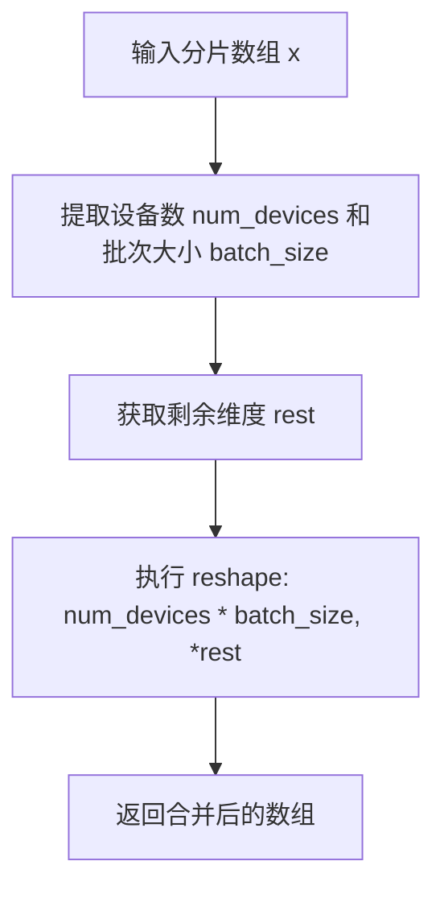
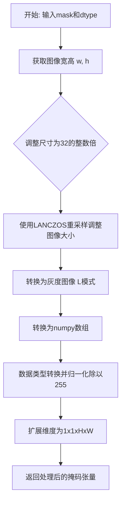
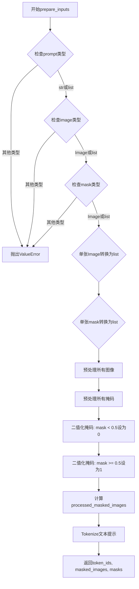
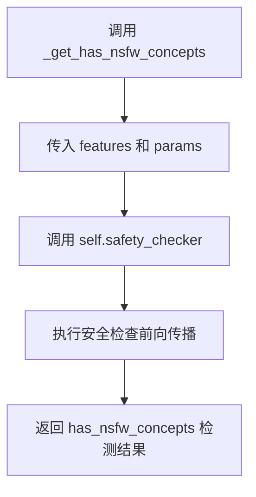
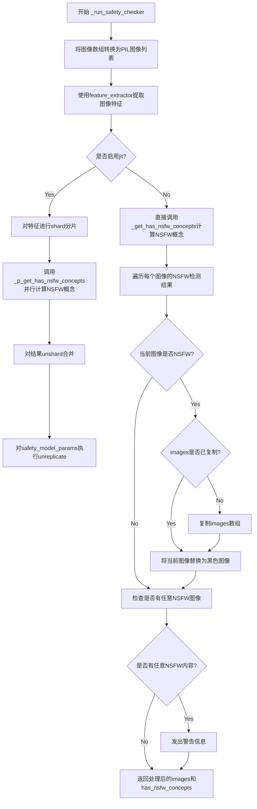
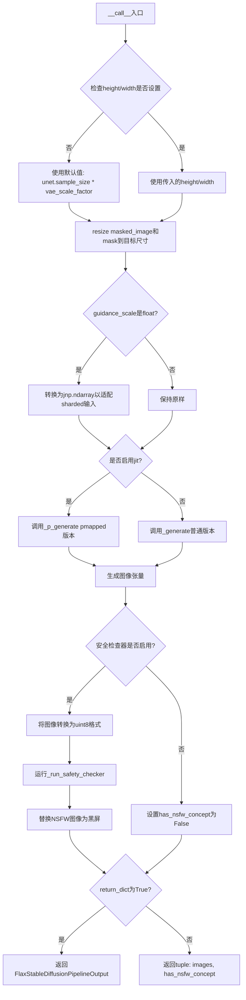

# `diffusers\src\diffusers\pipelines\stable_diffusion\pipeline_flax_stable_diffusion_inpaint.py` 详细设计文档

这是一个基于Flax的Stable Diffusion图像修复（inpainting）pipeline，通过文本提示引导对图像中指定区域进行修复和重建。

## 整体流程



## 类结构

```
FlaxDiffusionPipeline (基类)
└── FlaxStableDiffusionInpaintPipeline (图像修复pipeline)
```

## 全局变量及字段


### `DEBUG`
    
调试标志，设为True时使用Python循环代替jax.fori_loop以便更容易调试

类型：`bool`
    


### `logger`
    
模块级日志记录器，用于输出警告和信息消息

类型：`logging.Logger`
    


### `EXAMPLE_DOC_STRING`
    
包含FlaxStableDiffusionInpaintPipeline使用示例的文档字符串

类型：`str`
    


### `FlaxStableDiffusionInpaintPipeline.dtype`
    
JAX数组数据类型，用于模型计算的数值精度，默认为jnp.float32

类型：`jnp.dtype`
    


### `FlaxStableDiffusionInpaintPipeline.vae_scale_factor`
    
VAE缩放因子，用于调整潜在空间的维度，基于VAE块输出通道数计算

类型：`int`
    
    

## 全局函数及方法


### `_p_generate`

这是一个使用 JAX pmapped 的图像生成函数，用于在多个设备上并行执行 Stable Diffusion 图像修复（inpainting）任务的生成逻辑。该函数是 `_generate` 方法的分布式版本，通过 `jax.pmap` 装饰器实现跨多个设备（GPU/TPU）的并行计算。

参数：

- `pipe`：`FlaxStableDiffusionInpaintPipeline`，管道对象，包含模型和配置信息
- `prompt_ids`：`jnp.ndarray`，经过 tokenized 的文本 prompt IDs，用于文本编码
- `mask`：`jnp.ndarray`，用于 inpainting 的二进制 mask，指示需要修复的区域
- `masked_image`：`jnp.ndarray`，被 mask 覆盖的原始图像，作为 inpainting 的输入
- `params`：`dict | FrozenDict`，包含各模型（text_encoder, vae, unet, scheduler）的参数
- `prng_seed`：`jax.Array`，JAX 随机数生成器种子，用于采样噪声和latents
- `num_inference_steps`：`int`，去噪过程的迭代步数，决定生成图像的质量和细节
- `height`：`int`，生成图像的高度（像素），必须能被 8 整除
- `width`：`int`，生成图像的宽度（像素），必须能被 8 整除
- `guidance_scale`：`float | jnp.ndarray`，分类器自由引导（CFG）比例，控制生成图像与文本 prompt 的相关性
- `latents`：`jnp.ndarray | None`，可选的预生成噪声 latents，如果为 None 则随机生成
- `neg_prompt_ids`：`jnp.ndarray | None`，可选的 negative prompt IDs，用于排除不需要的元素

返回值：`jnp.ndarray`，去噪后的图像张量，形状为 (batch_size, height, width, channels)，像素值在 [0, 1] 范围内

#### 流程图

```mermaid
flowchart TD
    A[接收分布式输入] --> B{检查latents是否为空}
    B -->|是| C[使用prng_seed随机生成latents]
    B -->|否| D[使用提供的latents]
    C --> E[文本编码: prompt_ids → prompt_embeds]
    D --> E
    E --> F[负文本编码: neg_prompt_ids → negative_prompt_embeds]
    F --> G[拼接negative和positive embeddings]
    G --> H[VAE编码masked_image → masked_image_latents]
    H --> I[调整mask尺寸匹配latents]
    I --> J[初始化scheduler设置timesteps]
    J --> K[循环去噪: for i in range num_inference_steps]
    K --> L[Scheduler scale model input]
    L --> M[拼接latents, mask, masked_image_latents]
    M --> N[UNet预测噪声残差]
    N --> O[Classifier-free guidance计算]
    O --> P[Scheduler step更新latents]
    P --> K
    K --> Q{是否完成所有步数}
    Q -->|否| K
    Q -->|是| R[VAE解码latents → 图像]
    R --> S[图像后处理: 归一化到[0,1]]
    S --> T[返回生成的图像]
```

#### 带注释源码

```python
# 使用 partial 装饰器配置 jax.pmap，启用分布式并行计算
# in_axes: 指定输入参数在哪个维度上被映射 (None表示该参数在所有设备间保持一致，0表示按第一维分散)
# static_broadcasted_argnums: 指定静态参数（不参与pmap计算但在所有设备间广播）
@partial(
    jax.pmap,
    in_axes=(None, 0, 0, 0, 0, 0, None, None, None, 0, 0, 0),
    static_broadcasted_argnums=(0, 6, 7, 8),
)
def _p_generate(
    pipe,                    # 管道对象 (static, 所有设备共享)
    prompt_ids,              # 文本prompt的token IDs (按batch维度分散到各设备)
    mask,                    # inpainting mask (按batch维度分散)
    masked_image,            # 被mask覆盖的图像 (按batch维度分散)
    params,                  # 模型参数 (按batch维度分散)
    prng_seed,               # 随机数种子 (按batch维度分散)
    num_inference_steps,     # 推理步数 (static, 所有设备使用相同值)
    height,                  # 生成图像高度 (static, 所有设备使用相同值)
    width,                   # 生成图像宽度 (static, 所有设备使用相同值)
    guidance_scale,          # CFG引导强度 (按batch维度分散)
    latents,                 # 初始噪声latents (按batch维度分散)
    neg_prompt_ids,          # negative prompt的token IDs (按batch维度分散)
):
    # 调用管道实例的内部 _generate 方法执行实际的生成逻辑
    # 这是一个封装函数，将 pmapped 的输入转发给核心生成方法
    return pipe._generate(
        prompt_ids,
        mask,
        masked_image,
        params,
        prng_seed,
        num_inference_steps,
        height,
        width,
        guidance_scale,
        latents,
        neg_prompt_ids,
    )
```


### `_p_get_has_nsfw_concepts`

该函数是一个使用 `jax.pmap` 装饰的并行化包装函数，用于在多个设备上并行检测一批图像特征中是否包含 NSFW（不宜公开）内容。它通过调用管道的 `_get_has_nsfw_concepts` 方法来执行实际的安全检查逻辑。

参数：

- `pipe`：`FlaxStableDiffusionInpaintPipeline`，管道实例，持有安全检查器和其他组件
- `features`：`jnp.ndarray`，通过 `feature_extractor` 提取的图像像素值特征，形状为 `[batch_size, ...]`
- `params`：安全检查器的参数，通常是经过 `replicate` 处理的参数字典，用于在多设备间共享

返回值：`jnp.ndarray`，布尔类型数组，表示每个图像是否检测到 NSFW 内容

#### 流程图



#### 带注释源码

```python
@partial(jax.pmap, static_broadcasted_argnums=(0,))
def _p_get_has_nsfw_concepts(pipe, features, params):
    """
    使用 pmap 并行化检测 NSFW 内容的函数。
    
    Args:
        pipe: FlaxStableDiffusionInpaintPipeline 实例
        features: 经过 feature_extractor 提取的图像特征
        params: 安全检查器的参数（已复制到各设备）
    
    Returns:
        has_nsfw_concepts: 表示每个图像是否包含 NSFW 内容的布尔数组
    """
    return pipe._get_has_nsfw_concepts(features, params)
```

---

### `FlaxStableDiffusionInpaintPipeline._get_has_nsfw_concepts`

这是管道类的实例方法，执行实际的 NSFW 检测逻辑。

参数：

- `self`：`FlaxStableDiffusionInpaintPipeline`，管道实例
- `features`：`jnp.ndarray`，通过 `feature_extractor` 提取的图像像素值特征
- `params`：安全检查器的参数

返回值：`jnp.ndarray`，安全检查器返回的 NSFW 检测结果数组

#### 流程图



#### 带注释源码

```python
def _get_has_nsfw_concepts(self, features, params):
    """
    执行 NSFW 概念检测的实际方法。
    
    该方法是一个简单的包装器，将调用转发给安全检查器模块。
    它被设计为可被 _p_get_has_nsfw_concepts 通过 pmap 调用，
    以实现跨多个 JAX 设备的并行检测。
    
    Args:
        features: 从生成的图像中提取的特征，通常由 feature_extractor 生成
        params: 安全检查器的模型参数
    
    Returns:
        has_nsfw_concepts: 布尔数组，指示哪些图像包含 NSFW 内容
    """
    has_nsfw_concepts = self.safety_checker(features, params)
    return has_nsfw_concepts
```


### `unshard`

该函数用于将分片（sharded）的 JAX 数组解分片（unshard），即将设备维度（device dimension）和批次维度合并为一个维度，常用于将 `pmap` 分布计算的结果汇总回单设备视角。

参数：

- `x`：`jnp.ndarray`，输入的已分片的 JAX 数组，通常形状为 `[num_devices, batch_size, ...]`

返回值：`jnp.ndarray`，重塑后的 JAX 数组，形状变为 `[num_devices * batch_size, ...]`

#### 流程图



#### 带注释源码

```python
def unshard(x: jnp.ndarray):
    """
    将分片的 JAX 数组解分片（unshard），合并设备维度和批次维度。
    
    类似于 einops.rearrange(x, 'd b ... -> (d b) ...')
    """
    # 获取数组的前两个维度：设备数量和批次大小
    num_devices, batch_size = x.shape[:2]
    
    # 获取剩余维度信息
    rest = x.shape[2:]
    
    # 将设备维度和批次维度合并为单一维度
    # 例如：从 [num_devices, batch_size, H, W, C] 转换为 [num_devices * batch_size, H, W, C]
    return x.reshape(num_devices * batch_size, *rest)
```


### `preprocess_image`

将 PIL 图像预处理为适合 Stable Diffusion 模型输入的格式，包括将图像尺寸调整为 32 的整数倍、归一化像素值到 [-1, 1] 范围，以及转换维度顺序以匹配模型预期输入。

参数：

- `image`：`PIL.Image.Image`，输入的原始 PIL 图像对象
- `dtype`：`jnp.dtype`，输出数据的 JAX 数据类型（通常为 jnp.float32）

返回值：`jnp.ndarray`，处理后的图像数组，形状为 (1, C, H, W)，像素值归一化到 [-1, 1]

#### 流程图

```mermaid
graph TD
    A[开始] --> B[获取图像尺寸 w, h]
    B --> C{计算32的整数倍}
    C --> D[使用Lanczos重采样调整图像大小]
    D --> E[转换为numpy数组并转换为dtype]
    E --> F[归一化: 除以255.0]
    F --> G[添加批次维度: image[None]]
    G --> H[维度转换: HWC → CHW]
    H --> I[值域变换: 2.0 * image - 1.0]
    I --> J[返回处理后的图像]
```

#### 带注释源码

```python
def preprocess_image(image, dtype):
    """
    将PIL图像预处理为适合模型输入的格式
    
    参数:
        image: PIL图像对象
        dtype: 目标数据类型 (如 jnp.float32)
    
    返回:
        预处理后的图像数组，形状 (1, C, H, W)，值域 [-1, 1]
    """
    # 获取原始图像的宽高
    w, h = image.size
    
    # 将宽高调整为32的整数倍，确保与VAE下采样兼容
    # 例如: 512 -> 512, 513 -> 512
    w, h = (x - x % 32 for x in (w, h))
    
    # 使用Lanczos重采样调整图像大小（高质量插值）
    image = image.resize((w, h), resample=PIL_INTERPOLATION["lanczos"])
    
    # 转换为JAX数组，归一化到 [0, 1]
    image = jnp.array(image).astype(dtype) / 255.0
    
    # 添加批次维度: (H, W, C) -> (1, H, W, C)
    image = image[None].transpose(0, 3, 1, 2)
    # 此时形状: (1, C, H, W)
    
    # 将值域从 [0, 1] 变换到 [-1, 1]
    # 这是Stable Diffusion模型预期的输入范围
    return 2.0 * image - 1.0
```


### `preprocess_mask`

该函数用于将 PIL 掩码图像预处理为模型可用的掩码张量，主要完成尺寸调整、灰度转换、归一化和维度扩展等操作。

参数：

- `mask`：`PIL.Image.Image`，输入的掩码图像（PIL格式）
- `dtype`：`jnp.dtype`，目标数据类型（如 jnp.float32）

返回值：`jnp.ndarray`，处理后的掩码数组，形状为 (1, 1, H, W)，值域为 [0, 1]

#### 流程图



#### 带注释源码

```python
def preprocess_mask(mask, dtype):
    """
    预处理掩码图像，将其转换为模型所需的格式。
    
    处理步骤：
    1. 调整尺寸为32的整数倍（Stable Diffusion要求）
    2. 转换为灰度图
    3. 归一化到[0,1]范围
    4. 扩展维度以匹配批处理格式
    """
    # 获取掩码图像的宽度和高度
    w, h = mask.size
    
    # 将宽高调整为32的整数倍，确保符合模型输入要求
    # 例如: 512 -> 512, 513 -> 512
    w, h = (x - x % 32 for x in (w, h))  # resize to integer multiple of 32
    
    # 使用Lanczos重采样调整图像大小
    mask = mask.resize((w, h))
    
    # 转换为灰度图像（"L"模式），然后转换为numpy数组
    # 除以255进行归一化，将像素值映射到[0,1]范围
    mask = jnp.array(mask.convert("L")).astype(dtype) / 255.0
    
    # 扩展维度，添加批次维度和通道维度
    # 从 (H, W) 变为 (1, 1, H, W)
    mask = jnp.expand_dims(mask, axis=(0, 1))

    return mask
```


### `FlaxStableDiffusionInpaintPipeline.__init__`

该方法是 Flax 稳定扩散图像修复管道的构造函数，负责初始化所有核心组件（VAE、文本编码器、UNet、调度器、安全检查器等），并对旧版本 UNet 配置进行兼容性处理。

参数：

- `vae`：`FlaxAutoencoderKL`，变分自编码器模型，用于将图像编码到潜在空间并从潜在空间解码恢复图像
- `text_encoder`：`FlaxCLIPTextModel`，冻结的 CLIP 文本编码器，用于将文本提示转换为嵌入向量
- `tokenizer`：`CLIPTokenizer`，CLIP 分词器，用于将文本提示转换为 token ID 序列
- `unet`：`FlaxUNet2DConditionModel`，条件 UNet2D 模型，用于对图像潜在表示进行去噪
- `scheduler`：`FlaxDDIMScheduler | FlaxPNDMScheduler | FlaxLMSDiscreteScheduler | FlaxDPMSolverMultistepScheduler`，噪声调度器，用于控制去噪过程中的噪声添加和去除
- `safety_checker`：`FlaxStableDiffusionSafetyChecker`，安全检查器，用于检测并过滤可能有害的生成图像
- `feature_extractor`：`CLIPImageProcessor`，CLIP 图像处理器，用于从生成的图像中提取特征供安全检查器使用
- `dtype`：`jnp.dtype`，JAX 数据类型，默认为 `jnp.float32`，用于指定模型计算的数据精度

返回值：`None`，构造函数无返回值，通过实例属性存储初始化后的组件

#### 流程图

```mermaid
flowchart TD
    A[开始 __init__] --> B[调用 super().__init__]
    B --> C[设置 self.dtype]
    C --> D{检查 safety_checker 是否为 None}
    D -->|是| E[记录警告日志：已禁用安全检查器]
    D -->|否| F[跳过警告]
    E --> G[检查 UNet 版本是否 < 0.9.0]
    F --> G
    G -->|是| H[检查 sample_size 是否 < 64]
    G -->|否| I[跳过版本检查]
    H -->|是| J[记录弃用警告]
    H -->|否| I
    J --> K[更新 unet.config 的 sample_size 为 64]
    K --> L[调用 register_modules 注册所有组件]
    I --> L
    L --> M[计算 self.vae_scale_factor]
    M --> N[结束 __init__]
```

#### 带注释源码

```python
def __init__(
    self,
    vae: FlaxAutoencoderKL,
    text_encoder: FlaxCLIPTextModel,
    tokenizer: CLIPTokenizer,
    unet: FlaxUNet2DConditionModel,
    scheduler: FlaxDDIMScheduler | FlaxPNDMScheduler | FlaxLMSDiscreteScheduler | FlaxDPMSolverMultistepScheduler,
    safety_checker: FlaxStableDiffusionSafetyChecker,
    feature_extractor: CLIPImageProcessor,
    dtype: jnp.dtype = jnp.float32,
):
    """
    初始化 Flax 稳定扩散图像修复管道
    
    参数:
        vae: FlaxAutoencoderKL 模型，用于图像编码/解码
        text_encoder: FlaxCLIPTextModel，文本编码器
        tokenizer: CLIPTokenizer，文本分词器
        unet: FlaxUNet2DConditionModel，去噪网络
        scheduler: 噪声调度器，支持 DDIM/PNDM/LMS/DPM-Solver
        safety_checker: 安全检查器，可为 None
        feature_extractor: CLIP 图像处理器
        dtype: 计算数据类型，默认为 float32
    """
    # 调用父类 FlaxDiffusionPipeline 的初始化方法
    # 设置基础管道配置和设备管理
    super().__init__()
    
    # 存储计算数据类型，用于后续所有模型推理
    self.dtype = dtype

    # 检查安全检查器是否被禁用
    # 如果为 None，输出警告提醒用户潜在的风险
    if safety_checker is None:
        logger.warning(
            f"You have disabled the safety checker for {self.__class__} by passing `safety_checker=None`. Ensure"
            " that you abide to the conditions of the Stable Diffusion license and do not expose unfiltered"
            " results in services or applications open to the public. Both the diffusers team and Hugging Face"
            " strongly recommend to keep the safety filter enabled in all public facing circumstances, disabling"
            " it only for use-cases that involve analyzing network behavior or auditing its results. For more"
            " information, please have a look at https://github.com/huggingface/diffusers/pull/254 ."
        )

    # 检查 UNet 配置版本和 sample_size 的兼容性
    # 这是一个技术债务处理：早期版本的 checkpoint 默认 sample_size 为 32
    # 需要升级到 64 以确保正确的生成结果
    is_unet_version_less_0_9_0 = (
        unet is not None
        and hasattr(unet.config, "_diffusers_version")
        and version.parse(version.parse(unet.config._diffusers_version).base_version) < version.parse("0.9.0.dev0")
    )
    is_unet_sample_size_less_64 = (
        unet is not None and hasattr(unet.config, "sample_size") and unet.config.sample_size < 64
    )
    
    # 如果检测到旧版本配置，发出弃用警告并自动修复
    if is_unet_version_less_0_9_0 and is_unet_sample_size_less_64:
        deprecation_message = (
            "The configuration file of the unet has set the default `sample_size` to smaller than"
            " 64 which seems highly unlikely .If you're checkpoint is a fine-tuned version of any of the"
            " following: \n- CompVis/stable-diffusion-v1-4 \n- CompVis/stable-diffusion-v1-3 \n-"
            " CompVis/stable-diffusion-v1-2 \n- CompVis/stable-diffusion-v1-1 \n- stable-diffusion-v1-5/stable-diffusion-v1-5"
            " \n- stable-diffusion-v1-5/stable-diffusion-inpainting \n you should change 'sample_size' to 64 in the"
            " configuration file. Please make sure to update the config accordingly as leaving `sample_size=32`"
            " in the config might lead to incorrect results in future versions. If you have downloaded this"
            " checkpoint from the Hugging Face Hub, it would be very nice if you could open a Pull request for"
            " the `unet/config.json` file"
        )
        deprecate("sample_size<64", "1.0.0", deprecation_message, standard_warn=False)
        
        # 创建新的配置字典并将 sample_size 更新为 64
        new_config = dict(unet.config)
        new_config["sample_size"] = 64
        
        # 使用 FrozenDict 冻结配置，防止意外修改
        unet._internal_dict = FrozenDict(new_config)

    # 注册所有模型组件到管道
    # 使得各组件可以通过 self.xxx 访问，并且支持 save_pretrained/from_pretrained
    self.register_modules(
        vae=vae,
        text_encoder=text_encoder,
        tokenizer=tokenizer,
        unet=unet,
        scheduler=scheduler,
        safety_checker=safety_checker,
        feature_extractor=feature_extractor,
    )
    
    # 计算 VAE 缩放因子
    # 用于在潜在空间和像素空间之间进行尺寸转换
    # 计算公式: 2^(len(block_out_channels) - 1)，典型值为 8
    self.vae_scale_factor = 2 ** (len(self.vae.config.block_out_channels) - 1) if getattr(self, "vae", None) else 8
```


### `FlaxStableDiffusionInpaintPipeline.prepare_inputs`

该方法负责将用户提供的文本提示、图像和掩码进行预处理，转换为模型所需的格式，包括图像和掩码的预处理（缩放、归一化）、掩码的二值化处理，以及文本的tokenization处理，最终返回tokenized的文本ID、处理后的掩码图像和处理后的掩码。

参数：

- `self`：`FlaxStableDiffusionInpaintPipeline`，Pipeline实例本身
- `prompt`：`str | list[str]`，文本提示，可以是单个字符串或字符串列表
- `image`：`Image.Image | list[Image.Image]`，输入图像，PIL Image对象或列表
- `mask`：`Image.Image | list[Image.Image]`，掩码图像，PIL Image对象或列表

返回值：`tuple[jnp.ndarray, jnp.ndarray, jnp.ndarray]`，返回一个包含三个元素的元组：
  - 第一个元素：文本输入的token IDs（jnp.ndarray）
  - 第二个元素：处理后的掩码图像（jnp.ndarray）
  - 第三个元素：处理后的二值掩码（jnp.ndarray）

#### 流程图



#### 带注释源码

```python
def prepare_inputs(
    self,
    prompt: str | list[str],
    image: Image.Image | list[Image.Image],
    mask: Image.Image | list[Image.Image],
):
    # 参数类型检查：确保prompt是字符串或字符串列表
    if not isinstance(prompt, (str, list)):
        raise ValueError(f"`prompt` has to be of type `str` or `list` but is {type(prompt)}")

    # 参数类型检查：确保image是PIL Image或列表
    if not isinstance(image, (Image.Image, list)):
        raise ValueError(f"image has to be of type `PIL.Image.Image` or list but is {type(image)}")

    # 如果是单张图像，转换为列表以便批量处理
    if isinstance(image, Image.Image):
        image = [image]

    # 参数类型检查：确保mask是PIL Image或列表
    if not isinstance(mask, (Image.Image, list)):
        raise ValueError(f"image has to be of type `PIL.Image.Image` or list but is {type(image)}")

    # 如果是单张掩码，转换为列表以便批量处理
    if isinstance(mask, Image.Image):
        mask = [mask]

    # 使用preprocess_image函数处理所有图像并 concatenate
    # 预处理包括：缩放到32的倍数、归一化到[-1, 1]
    processed_images = jnp.concatenate([preprocess_image(img, jnp.float32) for img in image])
    
    # 使用preprocess_mask函数处理所有掩码并 concatenate
    processed_masks = jnp.concatenate([preprocess_mask(m, jnp.float32) for m in mask])
    
    # 使用JAX的at/set方式进行掩码二值化
    # 阈值小于0.5的像素设为0
    # processed_masks[processed_masks < 0.5] = 0
    processed_masks = processed_masks.at[processed_masks < 0.5].set(0)
    
    # 阈值大于等于0.5的像素设为1
    # processed_masks[processed_masks >= 0.5] = 1
    processed_masks = processed_masks.at[processed_masks >= 0.5].set(1)

    # 计算处理后的掩码图像：原图 * (掩码 < 0.5)
    # 即保留未被掩码覆盖的区域（原图部分）
    processed_masked_images = processed_images * (processed_masks < 0.5)

    # 使用tokenizer对文本提示进行tokenize
    # padding到最大长度，截断过长的文本，返回numpy数组
    text_input = self.tokenizer(
        prompt,
        padding="max_length",
        max_length=self.tokenizer.model_max_length,
        truncation=True,
        return_tensors="np",
    )
    
    # 返回tokenized的input_ids、处理后的掩码图像和掩码
    return text_input.input_ids, processed_masked_images, processed_masks
```


### `FlaxStableDiffusionInpaintPipeline._get_has_nsfw_concepts`

该方法是一个私有内部方法，用于调用安全检查器（safety_checker）来检测输入图像特征中是否包含不适合工作内容（NSFW）的概念。它充当了管道与安全检查器之间的简单包装器，将图像特征和模型参数传递给安全检查器并返回检测结果。

参数：

- `features`：`jnp.ndarray`，从图像中提取的特征（pixel_values），由 feature_extractor 生成的图像特征张量，用于安全检查
- `params`：`dict | FrozenDict`，安全检查器的模型参数，用于执行安全检查前向传播

返回值：`jax.numpy.ndarray`，布尔值数组，表示每个图像是否包含 NSFW 内容（True 表示包含，False 表示不包含）

#### 流程图



#### 带注释源码

```python
def _get_has_nsfw_concepts(self, features, params):
    """
    调用安全检查器检测图像特征中是否包含 NSFW 内容。
    
    Args:
        features: 从图像中提取的特征向量，通常是经过 feature_extractor 处理后的像素值
        params: 安全检查器模型的参数，用于执行前向传播
    
    Returns:
        has_nsfw_concepts: 布尔数组，表示每个图像是否包含 NSFW 内容
    """
    # 调用类成员 safety_checker，传入图像特征和模型参数
    # safety_checker 是一个 FlaxStableDiffusionSafetyChecker 实例
    has_nsfw_concepts = self.safety_checker(features, params)
    
    # 返回检测结果数组
    return has_nsfw_concepts
```


### `FlaxStableDiffusionInpaintPipeline._run_safety_checker`

该方法用于对生成的图像进行安全检查（NSFW检测），通过特征提取器提取图像特征，并使用安全检查器模型判断图像是否包含不当内容。对于检测到不当内容的图像，该方法会用黑色图像替换，并返回相应的检测结果。

参数：

- `self`：`FlaxStableDiffusionInpaintPipeline` 实例本身，隐式参数
- `images`：`jnp.ndarray` 或 `np.ndarray`，输入的图像数组，通常是批次图像，维度为 (batch_size, height, width, 3)
- `safety_model_params`：`dict` 或 `FrozenDict`，安全检查器模型的参数，用于执行模型推理
- `jit`：`bool`（可选，默认为 `False`），是否使用 JIT 编译和并行化（pmap）来加速安全检查

返回值：`tuple`，包含两个元素：

1. `images`：`np.ndarray`，处理后的图像数组，不当内容已被替换为黑色图像
2. `has_nsfw_concepts`：`np.ndarray`，布尔数组，标识每个图像是否检测到 NSFW 内容

#### 流程图



#### 带注释源码

```python
def _run_safety_checker(self, images, safety_model_params, jit=False):
    """
    运行安全检查器，对生成的图像进行NSFW检测
    
    参数:
        images: 输入的图像数组，形状为 (batch_size, height, width, 3)
        safety_model_params: 安全检查器模型的参数
        jit: 是否使用pmap进行并行化处理
    
    返回:
        tuple: (处理后的图像数组, NSFW检测结果布尔数组)
    """
    # safety_model_params should already be replicated when jit is True
    # 将图像数组转换为PIL图像列表
    pil_images = [Image.fromarray(image) for image in images]
    
    # 使用特征提取器提取图像特征
    # 返回值包含pixel_values，形状为 (batch_size, 3, height, width)
    features = self.feature_extractor(pil_images, return_tensors="np").pixel_values

    if jit:
        # 如果启用JIT模式，需要对输入进行shard分片
        features = shard(features)
        
        # 调用pmap版本的NSFW概念检测函数（_p_get_has_nsfw_concepts）
        # 这会在多个设备上并行执行
        has_nsfw_concepts = _p_get_has_nsfw_concepts(self, features, safety_model_params)
        
        # 合并多设备的结果
        has_nsfw_concepts = unshard(has_nsfw_concepts)
        
        # 还原safety_model_params为单副本
        safety_model_params = unreplicate(safety_model_params)
    else:
        # 非JIT模式，直接调用实例方法进行NSFW检测
        has_nsfw_concepts = self._get_has_nsfw_concepts(features, safety_model_params)

    # 初始化标记，记录是否已经复制了images数组
    images_was_copied = False
    
    # 遍历每个图像的NSFW检测结果
    for idx, has_nsfw_concept in enumerate(has_nsfw_concepts):
        if has_nsfw_concept:
            # 如果尚未复制images数组，则进行复制（避免修改原始数组）
            if not images_was_copied:
                images_was_copied = True
                images = images.copy()

            # 将NSFW图像替换为黑色图像（全零数组）
            images[idx] = np.zeros(images[idx].shape, dtype=np.uint8)  # black image

    # 检查是否检测到任何NSFW内容
    if any(has_nsfw_concepts):
        # 发出警告，提醒用户可能检测到不当内容
        warnings.warn(
            "Potential NSFW content was detected in one or more images. A black image will be returned"
            " instead. Try again with a different prompt and/or seed."
        )

    # 返回处理后的图像和NSFW检测结果
    return images, has_nsfw_concepts
```


### `FlaxStableDiffusionInpaintPipeline._generate`

该方法是 FlaxStableDiffusionInpaintPipeline 的核心生成方法，负责在给定提示词、掩码和被掩码覆盖的图像条件下，通过去噪过程生成修复后的图像。该方法遵循标准的 Stable Diffusion 推理流程，包括文本嵌入提取、潜在变量初始化、噪声预测循环、分类器自由引导以及最终的 VAE 解码。

参数：

- `self`：FlaxStableDiffusionInpaintPipeline 实例本身
- `prompt_ids`：`jnp.ndarray`，经过分词处理后的提示词 ID 序列，用于获取文本嵌入
- `mask`：`jnp.ndarray`，图像修复掩码，标识需要修复的区域（值为 0 或 1）
- `masked_image`：`jnp.ndarray`，被掩码覆盖的图像，即原始图像与掩码相乘后的结果
- `params`：`dict | FrozenDict`，包含各模型组件（text_encoder、vae、unet、scheduler）的参数字典
- `prng_seed`：`jax.Array`，用于生成随机数的 JAX 随机种子
- `num_inference_steps`：`int`，去噪推理的步数，步数越多通常图像质量越高
- `height`：`int`，生成图像的高度（像素），必须能被 8 整除
- `width`：`int`，生成图像的宽度（像素），必须能被 8 整除
- `guidance_scale`：`float`，分类器自由引导（CFG）比例，用于控制生成图像与提示词的相关性
- `latents`：`jnp.ndarray | None`，可选的预生成潜在变量，如果为 None 则随机生成
- `neg_prompt_ids`：`jnp.ndarray | None`，可选的负面提示词 ID，用于引导模型避免生成特定内容

返回值：`jnp.ndarray`，生成的修复后图像，形状为 (batch_size, height, width, channels)，值范围在 [0, 1]

#### 流程图

```mermaid
flowchart TD
    A[开始 _generate] --> B{验证 height 和 width 是否能被 8 整除}
    B -->|否| E[抛出 ValueError]
    B -->|是| C[提取提示词文本嵌入]
    C --> F[获取负面提示词嵌入或使用空字符串]
    F --> G[拼接负向和正向嵌入 context]
    G --> H{latents 是否为 None}
    H -->|是| I[使用 prng_seed 随机生成 latents]
    H -->|否| J[验证 latents 形状]
    I --> K[分割随机种子]
    J --> K
    K --> L[使用 VAE 编码 masked_image 生成 masked_image_latents]
    L --> M[调整 mask 大小以匹配 latents]
    M --> N{验证通道数配置是否正确}
    N -->|否| O[抛出 ValueError]
    N -->|是| P[初始化调度器并设置时间步]
    P --> Q[将初始噪声乘以调度器的初始噪声标准差]
    Q --> R{DEBUG 模式}
    R -->|是| S[使用 Python for 循环执行去噪]
    R -->|否| T[使用 jax.lax.fori_loop 并行执行去噪]
    S --> U[执行 loop_body]
    T --> U
    U --> V[每个步骤: 复制输入用于 CFG]
    V --> W[获取当前时间步 t]
    W --> X[调度器 scale_model_input]
    X --> Y[拼接 latents, mask, masked_image_latents]
    Y --> Z[UNet 预测噪声残差]
    Z --> AA[分离噪声预测: uncond + text]
    AA --> AB[计算 CFG 后的噪声预测]
    AB --> AC[调度器 step 计算上一步的 latents]
    AC --> AD{是否完成所有推理步骤}
    AD -->|否| V
    AD -->|是| AE[使用 VAE 解码 latents 生成图像]
    AE --> AF[图像归一化到 [0, 1] 范围]
    AF --> AG[返回生成的图像]
```

#### 带注释源码

```python
def _generate(
    self,
    prompt_ids: jnp.ndarray,
    mask: jnp.ndarray,
    masked_image: jnp.ndarray,
    params: dict | FrozenDict,
    prng_seed: jax.Array,
    num_inference_steps: int,
    height: int,
    width: int,
    guidance_scale: float,
    latents: jnp.ndarray | None = None,
    neg_prompt_ids: jnp.ndarray | None = None,
):
    # 1. 验证输入尺寸有效性，确保高度和宽度能被 8 整除
    # 这是因为 VAE 和 UNet 会对图像进行 8 倍下采样
    if height % 8 != 0 or width % 8 != 0:
        raise ValueError(f"`height` and `width` have to be divisible by 8 but are {height} and {width}.")

    # 2. 获取提示词文本嵌入
    # 使用 text_encoder 将 token IDs 转换为文本特征向量
    prompt_embeds = self.text_encoder(prompt_ids, params=params["text_encoder"])[0]

    # 3. 获取负面提示词嵌入
    # 如果没有提供负面提示词，则使用空字符串
    batch_size = prompt_ids.shape[0]
    max_length = prompt_ids.shape[-1]

    if neg_prompt_ids is None:
        # 为每个样本创建空字符串的 token IDs
        uncond_input = self.tokenizer(
            [""] * batch_size, padding="max_length", max_length=max_length, return_tensors="np"
        ).input_ids
    else:
        uncond_input = neg_prompt_ids
    # 获取负面提示词的文本嵌入
    negative_prompt_embeds = self.text_encoder(uncond_input, params=params["text_encoder"])[0]
    # 4. 拼接负面和正面嵌入用于分类器自由引导
    # 前面是负向（无条件）嵌入，后面是正向（条件）嵌入
    context = jnp.concatenate([negative_prompt_embeds, prompt_embeds])

    # 5. 计算潜在变量的形状
    # VAE 的潜在空间通道数和下采样后的尺寸
    latents_shape = (
        batch_size,
        self.vae.config.latent_channels,
        height // self.vae_scale_factor,
        width // self.vae_scale_factor,
    )
    
    # 6. 初始化潜在变量
    if latents is None:
        # 使用随机噪声初始化潜在变量
        latents = jax.random.normal(prng_seed, shape=latents_shape, dtype=self.dtype)
    else:
        # 验证提供的 latents 形状是否匹配预期
        if latents.shape != latents_shape:
            raise ValueError(f"Unexpected latents shape, got {latents.shape}, expected {latents_shape}")

    # 7. 分割随机种子，用于后续 VAE 采样
    prng_seed, mask_prng_seed = jax.random.split(prng_seed)

    # 8. 对被掩码覆盖的图像进行 VAE 编码
    # 获取潜在分布并采样
    masked_image_latent_dist = self.vae.apply(
        {"params": params["vae"]}, masked_image, method=self.vae.encode
    ).latent_dist
    # 从分布中采样并调整维度顺序
    masked_image_latents = masked_image_latent_dist.sample(key=mask_prng_seed).transpose((0, 3, 1, 2))
    # 应用 VAE 缩放因子
    masked_image_latents = self.vae.config.scaling_factor * masked_image_latents
    del mask_prng_seed  # 删除不再需要的随机种子

    # 9. 调整掩码大小以匹配潜在变量的空间维度
    mask = jax.image.resize(mask, (*mask.shape[:-2], *masked_image_latents.shape[-2:]), method="nearest")

    # 10. 验证通道数配置的一致性
    # UNet 的输入通道数应等于 latent_channels + mask_channels + masked_image_channels
    num_channels_latents = self.vae.config.latent_channels
    num_channels_mask = mask.shape[1]
    num_channels_masked_image = masked_image_latents.shape[1]
    if num_channels_latents + num_channels_mask + num_channels_masked_image != self.unet.config.in_channels:
        raise ValueError(
            f"Incorrect configuration settings! The config of `pipeline.unet`: {self.unet.config} expects"
            f" {self.unet.config.in_channels} but received `num_channels_latents`: {num_channels_latents} +"
            f" `num_channels_mask`: {num_channels_mask} + `num_channels_masked_image`: {num_channels_masked_image}"
            f" = {num_channels_latents + num_channels_masked_image + num_channels_mask}. Please verify the config of"
            " `pipeline.unet` or your `mask_image` or `image` input."
        )

    # 11. 定义去噪循环的主体函数
    def loop_body(step, args):
        latents, mask, masked_image_latents, scheduler_state = args
        
        # 12. 复制输入以同时进行条件和无条件预测（分类器自由引导）
        latents_input = jnp.concatenate([latents] * 2)
        mask_input = jnp.concatenate([mask] * 2)
        masked_image_latents_input = jnp.concatenate([masked_image_latents] * 2)

        # 13. 获取当前时间步
        t = jnp.array(scheduler_state.timesteps, dtype=jnp.int32)[step]
        timestep = jnp.broadcast_to(t, latents_input.shape[0])

        # 14. 调度器根据时间步调整输入
        latents_input = self.scheduler.scale_model_input(scheduler_state, latents_input, t)
        
        # 15. 在通道维度拼接潜在变量、掩码和被掩码覆盖的图像潜在表示
        latents_input = jnp.concatenate([latents_input, mask_input, masked_image_latents_input], axis=1)

        # 16. 使用 UNet 预测噪声残差
        noise_pred = self.unet.apply(
            {"params": params["unet"]},
            jnp.array(latents_input),
            jnp.array(timestep, dtype=jnp.int32),
            encoder_hidden_states=context,
        ).sample
        
        # 17. 分离无条件预测和条件预测，执行分类器自由引导
        noise_pred_uncond, noise_prediction_text = jnp.split(noise_pred, 2, axis=0)
        # 根据引导比例混合无条件预测和条件预测
        noise_pred = noise_pred_uncond + guidance_scale * (noise_prediction_text - noise_pred_uncond)

        # 18. 调度器执行一步去噪，计算前一个时间步的潜在变量
        latents, scheduler_state = self.scheduler.step(scheduler_state, noise_pred, t, latents).to_tuple()
        return latents, mask, masked_image_latents, scheduler_state

    # 19. 初始化调度器并设置推理步骤
    scheduler_state = self.scheduler.set_timesteps(
        params["scheduler"], num_inference_steps=num_inference_steps, shape=latents.shape
    )

    # 20. 根据调度器要求缩放初始噪声
    latents = latents * params["scheduler"].init_noise_sigma

    # 21. 执行去噪循环
    if DEBUG:
        # 调试模式：使用 Python 循环便于调试
        for i in range(num_inference_steps):
            latents, mask, masked_image_latents, scheduler_state = loop_body(
                i, (latents, mask, masked_image_latents, scheduler_state)
            )
    else:
        # 生产模式：使用 JAX 并行循环提高性能
        latents, _, _, _ = jax.lax.fori_loop(
            0, num_inference_steps, loop_body, (latents, mask, masked_image_latents, scheduler_state)
        )

    # 22. 缩放潜在变量并使用 VAE 解码为图像
    latents = 1 / self.vae.config.scaling_factor * latents
    image = self.vae.apply({"params": params["vae"]}, latents, method=self.vae.decode).sample

    # 23. 后处理：将图像值从 [-1, 1] 转换到 [0, 1] 并调整维度顺序
    # 从 (batch, channels, height, width) 转换为 (batch, height, width, channels)
    image = (image / 2 + 0.5).clip(0, 1).transpose(0, 2, 3, 1)
    return image
```


### FlaxStableDiffusionInpaintPipeline.__call__

该方法是FlaxStableDiffusionInpaintPipeline管道的主入口点，用于根据文本提示和掩码对图像进行修复（inpainting）生成。它接收预处理后的文本ID、掩码和被掩码覆盖的图像，通过VAE编码、UNet去噪、VAE解码等步骤，结合分类器-free guidance技术生成修复后的图像，并可选地通过安全检查器过滤不适宜内容。

参数：

- `prompt_ids`：`jnp.ndarray`，预处理后的文本token ID数组，形状为(batch_size, seq_len)，作为文本编码器的输入
- `mask`：`jnp.ndarray`，图像掩码，指示需要修复的区域，值为0或1
- `masked_image`：`jnp.ndarray`，被掩码覆盖的图像，用于提供修复区域的上下文信息
- `params`：`dict | FrozenDict`，包含各模型（text_encoder、vae、unet、scheduler、safety_checker）参数的字典
- `prng_seed`：`jax.Array`，JAX随机数生成器种子，用于生成随机噪声和潜在向量
- `num_inference_steps`：`int`，去噪推理步数，默认为50，步数越多生成质量越高但推理越慢
- `height`：`int | None`，生成图像的高度，默认为unet.config.sample_size * vae_scale_factor（512）
- `width`：`int | None`，生成图像的宽度，默认为unet.config.sample_size * vae_scale_factor（512）
- `guidance_scale`：`float | jnp.ndarray`，分类器-free guidance缩放因子，默认为7.5，值越大越忠于文本提示
- `latents`：`jnp.ndarray`，可选的预生成噪声潜在向量，用于可重现的生成
- `neg_prompt_ids`：`jnp.ndarray`，可选的负面提示token ID，用于避免生成不希望的内容
- `return_dict`：`bool`，是否返回字典格式的输出，默认为True
- `jit`：`bool`，是否使用JAX pmapped版本进行加速，默认为False

返回值：`FlaxStableDiffusionPipelineOutput`或`tuple`，当return_dict为True时返回包含images和nsfw_content_detected的输出对象，否则返回(images, has_nsfw_concept)元组

#### 流程图



#### 带注释源码

```python
@replace_example_docstring(EXAMPLE_DOC_STRING)
def __call__(
    self,
    prompt_ids: jnp.ndarray,          # 预处理后的文本token ID
    mask: jnp.ndarray,                # 图像修复掩码
    masked_image: jnp.ndarray,        # 被掩码覆盖的图像
    params: dict | FrozenDict,         # 模型参数字典
    prng_seed: jax.Array,              # 随机数种子
    num_inference_steps: int = 50,    # 去噪步数
    height: int | None = None,         # 输出高度
    width: int | None = None,          # 输出宽度
    guidance_scale: float | jnp.ndarray = 7.5,  # guidance缩放因子
    latents: jnp.ndarray = None,       # 预生成latents
    neg_prompt_ids: jnp.ndarray = None,  # 负面提示
    return_dict: bool = True,         # 返回格式选择
    jit: bool = False,                 # 是否使用jit/pmap
):
    # 1. 设置默认高度和宽度，基于UNet配置和VAE缩放因子
    height = height or self.unet.config.sample_size * self.vae_scale_factor
    width = width or self.unet.config.sample_size * self.vae_scale_factor

    # 2. 将masked_image和mask resize到目标尺寸
    # 使用bicubic插值调整图像，nearest插值调整掩码
    masked_image = jax.image.resize(masked_image, (*masked_image.shape[:-2], height, width), method="bicubic")
    mask = jax.image.resize(mask, (*mask.shape[:-2], height, width), method="nearest")

    # 3. 处理guidance_scale，确保其与prompt_ids的batch维度匹配
    # 如果是float，转换为数组以便支持sharded输入
    if isinstance(guidance_scale, float):
        guidance_scale = jnp.array([guidance_scale] * prompt_ids.shape[0])
        if len(prompt_ids.shape) > 2:
            # 假设输入是sharded的
            guidance_scale = guidance_scale[:, None]

    # 4. 根据jit参数选择生成函数
    # jit=True时使用pmapped版本实现多设备并行
    if jit:
        images = _p_generate(
            self,
            prompt_ids,
            mask,
            masked_image,
            params,
            prng_seed,
            num_inference_steps,
            height,
            width,
            guidance_scale,
            latents,
            neg_prompt_ids,
        )
    else:
        images = self._generate(
            prompt_ids,
            mask,
            masked_image,
            params,
            prng_seed,
            num_inference_steps,
            height,
            width,
            guidance_scale,
            latents,
            neg_prompt_ids,
        )

    # 5. 如果启用了安全检查器，检查生成的图像是否包含NSFW内容
    if self.safety_checker is not None:
        safety_params = params["safety_checker"]
        # 将图像转换为uint8格式用于安全检查
        images_uint8_casted = (images * 255).round().astype("uint8")
        num_devices, batch_size = images.shape[:2]

        # reshape以适配安全检查器的输入格式
        images_uint8_casted = np.asarray(images_uint8_casted).reshape(num_devices * batch_size, height, width, 3)
        # 运行安全检查
        images_uint8_casted, has_nsfw_concept = self._run_safety_checker(images_uint8_casted, safety_params, jit)
        images = np.asarray(images)

        # 如果检测到NSFW内容，将对应图像替换为黑屏
        if any(has_nsfw_concept):
            for i, is_nsfw in enumerate(has_nsfw_concept):
                if is_nsfw:
                    images[i] = np.asarray(images_uint8_casted[i])

        # 恢复原始shape
        images = images.reshape(num_devices, batch_size, height, width, 3)
    else:
        images = np.asarray(images)
        has_nsfw_concept = False

    # 6. 根据return_dict参数返回相应格式的结果
    if not return_dict:
        return (images, has_nsfw_concept)

    # 返回包含图像和NSFW检测标志的输出对象
    return FlaxStableDiffusionPipelineOutput(images=images, nsfw_content_detected=has_nsfw_concept)
```

## 关键组件


### FlaxStableDiffusionInpaintPipeline

主类，基于Flax的Stable Diffusion图像修复管道，继承自FlaxDiffusionPipeline，整合VAE、文本编码器、UNet和调度器实现文本引导的图像修复功能。

### prepare_inputs

预处理方法，将提示词、图像和掩码进行标准化处理，包括图像resize、归一化、掩码二值化，以及文本tokenization。

### _generate

核心生成方法，执行去噪循环，包含UNet推理、分类器自由引导(CFG)、调度器步进，以及最终VAE解码生成修复图像。

### __call__

管道入口方法，支持JIT编译模式，处理图像尺寸默认、Guidance scale张量化、并行安全检查，以及返回标准化输出。

### _run_safety_checker

安全检查执行器，调用feature_extractor提取特征，通过safety_checker检测NSFW内容，并将违规图像替换为黑色图像。

### _p_generate

基于jax.pmap的分布式生成函数，支持多设备并行推理，通过static_broadcasted_argnums优化编译效率。

### _p_get_has_nsfw_concepts

分布式NSFW概念检测函数，用于多设备并行安全审查。

### preprocess_image

图像预处理函数，执行Lanczos重采样、归一化至[-1,1]范围、通道维度调整以适配模型输入。

### preprocess_mask

掩码预处理函数，转换为灰度图并进行归一化处理，保持与图像相同的尺寸对齐。

### unshard

张量重塑函数，将分布式输出(d, b, ...)展平为(d*b, ...)以便于后续处理。

### VAE (FlaxAutoencoderKL)

变分自编码器组件，负责将图像编码到潜在空间并从潜在表示解码重建图像，支持latent_dist采样。

### UNet (FlaxUNet2DConditionModel)

条件去噪UNet模型，在潜在空间执行噪声预测，接受text_embeddings作为条件信息。

### Scheduler

调度器组件，支持DDIM、DPM、LMS、PNDM等算法，管理去噪过程中的时间步和噪声预测更新。

### Safety Checker (FlaxStableDiffusionSafetyChecker)

NSFW内容检测模块，对生成的图像进行分类评估，防止输出不当内容。

### Text Encoder (FlaxCLIPTextModel)

CLIP文本编码器，将tokenized文本转换为embedding向量，用于条件生成。


## 问题及建议


### 已知问题

-   **DEBUG标志未实际使用**：`DEBUG = False`全局变量用于切换循环方式，但代码中没有任何基于DEBUG的调试输出或条件逻辑，实际调试能力有限。
-   **NSFW检查效率低下**：在`_run_safety_checker`方法中，`any(has_nsfw_concepts)`检查放在for循环内部，每次迭代都会执行，复杂度为O(n²)，应该移到循环外部。
-   **硬编码的默认值**：`vae_scale_factor`计算中默认使用8作为fallback值，mask和image的resize使用硬编码的32倍数，缺乏灵活性。
-   **未完成的TODO注释**：代码中存在TODO注释"currently it is assumed `do_classifier_free_guidance = guidance_scale > 1.0` implement this conditional"，功能未完全实现。
-   **重复的类型转换**：在`_generate`方法中，`jnp.array(latents_input)`和`jnp.array(timestep, dtype=jnp.int32)`被重复调用，而输入已经是JAX数组。
-   **mask处理逻辑冗余**：`prepare_inputs`中先有注释掉的代码`# processed_masks[processed_masks < 0.5] = 0`，然后用`.at[]`实现相同功能，代码不够清晰。
- **变量命名不一致**：示例文档中`img_url`和`mask_url`变量命名不准确（应该是init_image）。
- **未使用的导入**：`shard`函数从flax.training.common_utils导入，但在代码中主要在示例文档中使用，主体代码未直接使用。
- **缺失的参数验证**：部分方法（如`_generate`）缺少对关键输入参数的完整验证，如guidance_scale的有效性检查。

### 优化建议

-   **移除或完善DEBUG机制**：要么完全移除DEBUG标志和相关的for循环分支，要么增加更完善的调试功能（如中间结果打印、梯度检查点等）。
-   **优化NSFW检查逻辑**：将`any(has_nsfw_concepts)`检查移到for循环外部，避免重复计算。
-   **配置化硬编码值**：将32、8等硬编码值提取为类属性或配置参数，提高灵活性。
-   **完善TODO功能**：实现`do_classifier_free_guidance`的条件逻辑，使代码更加完整。
-   **减少不必要的类型转换**：检查输入类型，避免对已经是JAX数组的对象进行重复转换。
-   **清理注释代码**：移除注释掉的代码或用更清晰的方式实现等价功能。
-   **增加输入验证**：在`_generate`等核心方法中增加更完善的参数验证逻辑。
-   **性能优化**：考虑使用`jax.lax.cond`替代部分条件分支，合并部分小操作以减少内核启动开销。
-   **增加类型注解**：为更多函数和方法添加类型注解，提高代码可维护性。
-   **完善文档字符串**：为私有方法添加文档字符串，特别是`_get_has_nsfw_concepts`和`_run_safety_checker`等关键方法。


## 其它


### 设计目标与约束

**设计目标**：实现一个基于Flax的文本引导图像修复（inpainting）管道，利用Stable Diffusion模型进行高质量图像生成，支持多设备并行推理和JIT编译优化。

**约束条件**：
- 输入图像尺寸必须能被8整除
- 支持的调度器类型限于DDIMScheduler、PNDMScheduler、LMSDiscreteScheduler和DPMSolverMultistepScheduler
- 默认使用float32数据类型
- 潜在向量通道数、掩码通道数和掩码图像通道数之和必须等于UNet的输入通道数
- 高度和宽度受限于VAE的scale factor和UNet的sample_size

### 错误处理与异常设计

**参数验证错误**：
- `prepare_inputs`方法检查prompt类型（str或list）、image类型（PIL.Image或list）、mask类型（PIL.Image或list）
- `_generate`方法验证height和width是否可被8整除
- 检查latents形状是否与预期形状匹配
- 验证UNet配置中的通道数是否与输入通道数匹配

**运行时警告**：
- 当safety_checker为None时发出警告，提醒可能违反Stable Diffusion许可协议
- 检测到潜在NSFW内容时发出警告，建议更换prompt或seed
- 当UNet版本小于0.9.0且sample_size小于64时发出弃用警告

**异常处理**：
- 使用ValueError处理参数类型和值不匹配的情况
- 使用warnings.warn处理运行时警告
- NSFW图像会被替换为黑色图像而非抛出异常

### 数据流与状态机

**主数据流**：
1. 输入准备阶段：prompt、image、mask经过prepare_inputs处理
2. 文本编码阶段：tokenizer将prompt转换为input_ids，text_encoder生成文本嵌入
3. 图像编码阶段：VAE encode masked_image生成潜在表示
4. 噪声预测循环：UNet根据当前latents、mask、masked_image_latents预测噪声
5. 调度器更新：根据噪声预测更新latents
6. 解码阶段：VAE decode latents生成最终图像
7. 安全检查：safety_checker检测NSFW内容

**状态机转换**：
- 初始状态：原始图像和掩码
- 预处理状态：processed_images、processed_masks、processed_masked_images
- 潜在空间状态：latents、masked_image_latents
- 去噪循环状态：scheduler_state管理时间步和噪声调度
- 最终状态：解码后的图像

### 外部依赖与接口契约

**核心依赖**：
- `jax` / `jax.numpy`：JAX数值计算
- `flax`：神经网络框架
- `transformers`：CLIP文本编码器和图像处理器
- `diffusers`：Stable Diffusion模型组件
- `PIL`：图像处理
- `packaging`：版本解析

**模块接口**：
- `FlaxDiffusionPipeline`：基类管道接口
- `FlaxAutoencoderKL`：VAE编解码器接口
- `FlaxUNet2DConditionModel`：条件UNet接口
- `FlaxStableDiffusionSafetyChecker`：安全检查器接口
- 调度器接口：必须实现set_timesteps、step方法

**输入契约**：
- prompt：字符串或字符串列表
- image：PIL.Image或列表
- mask：PIL.Image或列表
- params：包含vae、text_encoder、unet、scheduler、safety_checker参数的字典
- prng_seed：JAX随机数生成器
- num_inference_steps：去噪步数
- height/width：输出图像尺寸
- guidance_scale：分类器自由引导系数

**输出契约**：
- 返回FlaxStableDiffusionPipelineOutput或元组(images, has_nsfw_concept)
- images：生成的图像数组
- nsfw_content_detected：NSFW检测结果布尔列表

### 并行化与分布式策略

**设备并行**：
- 使用jax.device_count()获取可用设备数
- 使用jax.random.split配合device_count分割随机种子
- 使用shard函数分片输入张量
- 使用pmap进行分布式计算

**JIT编译**：
- _p_generate函数使用pmap装饰器进行编译
- 静态参数通过static_broadcasted_argnums指定
- 支持jit参数切换JIT模式

**内存优化**：
- 使用FrozenDict存储配置
- 及时删除不再需要的变量（如mask_prng_seed）
- 图像数据使用uint8类型存储以节省内存
</content]
    