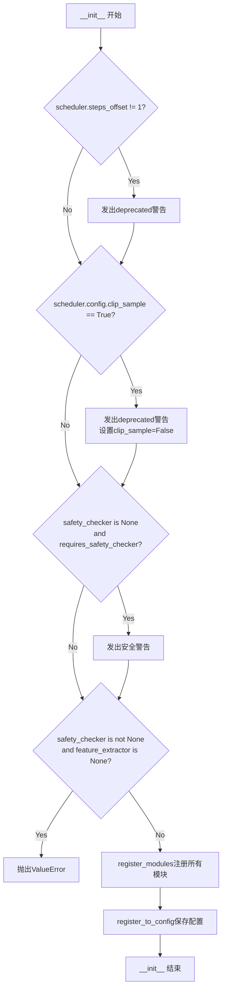
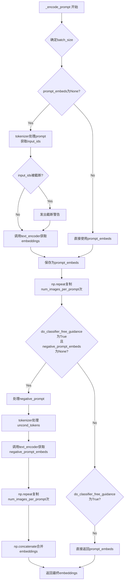
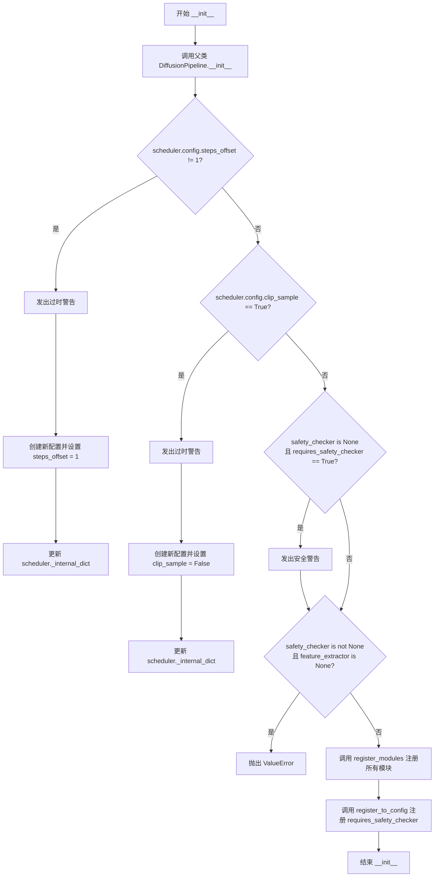
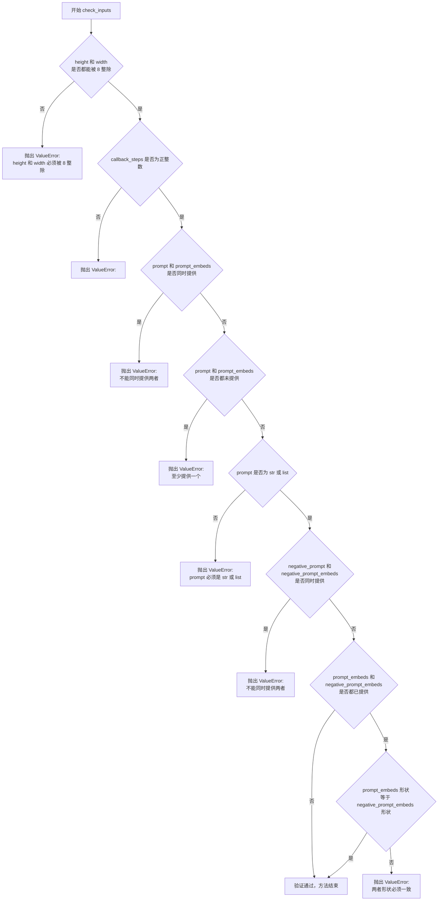
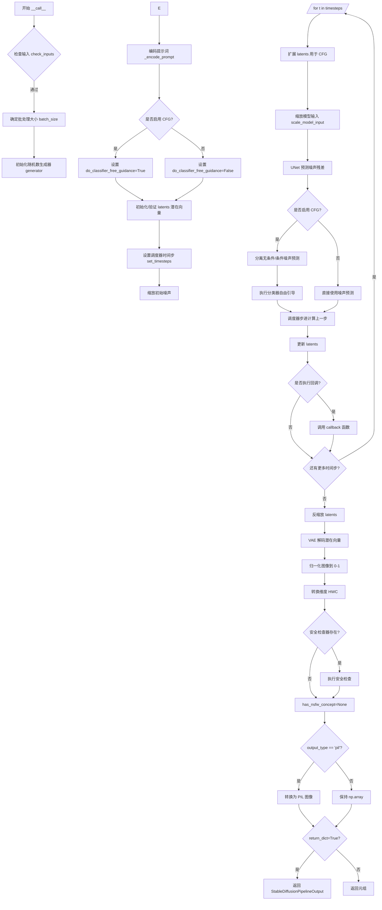
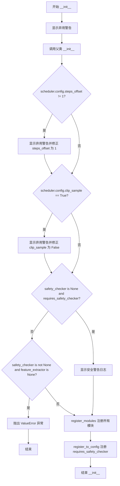

```mermaid
flowchart TD
    A[__call__ 开始] --> B[check_inputs验证输入]
    B --> C[确定batch_size]
    C --> D{generator为None?}
    D -->|Yes| E[使用np.random]
    D -->|No| F[使用提供的generator]
    E --> G[_encode_prompt编码提示]
    F --> G
    G --> H[初始化或验证latents]
    H --> I[scheduler设置timesteps]
    I --> J[latents乘以init_noise_sigma]
    J --> K[准备extra_step_kwargs]
    K --> L{获取timestep_dtype}
    L --> M[开始迭代timesteps]
    M --> N{是分类器自由引导?}
    N -->|Yes| O[latent_model_input拼接2份]
    N -->|No| P[直接使用latents]
    O --> Q[scale_model_input]
    P --> Q
    Q --> R[UNet预测噪声]
    R --> S{是分类器自由引导?}
    S -->|Yes| T[分离uncond和text预测<br/>应用guidance_scale]
    S -->|No| U[直接使用noise_pred]
    T --> V[scheduler.step计算上一步]
    U --> V
    V --> W[更新latents]
    W --> X{回调函数存在<br/>且满足callback_steps?}
    X -->|Yes| Y[调用callback]
    X -->|No| Z{还有更多timesteps?}
    Y --> Z
    Z -->|Yes| M
    Z -->|No| AA[latents除以0.18215]
    AA --> BB[vae_decoder解码]
    BB --> CC[clip图像到0-1范围]
    CC --> DD[transpose图像维度]
    DD --> EE{safety_checker存在?}
    EE -->|Yes| FF[运行安全检查]
    EE -->|No| GG[has_nsfw_concept=None]
    FF --> HH{output_type是pil?}
    GG --> HH
    HH -->|Yes| II[numpy_to_pil转换]
    HH -->|No| JJ[返回原始数组]
    II --> KK{return_dict为True?}
    JJ --> KK
    KK -->|Yes| LL[返回StableDiffusionPipelineOutput]
    KK -->|No| MM[返回tuple]
```

# `diffusers\src\diffusers\pipelines\stable_diffusion\pipeline_onnx_stable_diffusion.py` 详细设计文档

这是一个ONNX Runtime版本的Stable Diffusion Pipeline实现，允许在ONNX Runtime上运行Stable Diffusion模型进行文本到图像的生成。该管道包含了VAE编码器/解码器、文本编码器、UNet模型、调度器以及可选的安全检查器，支持Classifier-Free Guidance生成技术。

## 整体流程

```mermaid
graph TD
    A[开始: 用户调用 __call__] --> B[check_inputs: 验证输入参数]
B --> C[计算 batch_size]
C --> D[_encode_prompt: 编码提示词和负向提示词]
D --> E[初始化或验证 latents]
E --> F[scheduler.set_timesteps: 设置推理步骤]
F --> G[latents = latents * init_noise_sigma]
G --> H{for i, t in enumerate(timesteps)}
H -->|是| I[扩展 latents 用于 CFG]
I --> J[scheduler.scale_model_input]
J --> K[unet 预测噪声残差]
K --> L{do_classifier_free_guidance}
L -->|是| M[计算 noise_pred_uncond 和 noise_pred_text]
L -->|否| N[直接使用 noise_pred]
M --> O[noise_pred = noise_pred_uncond + guidance_scale * (noise_pred_text - noise_pred_uncond)]
N --> O
O --> P[scheduler.step: 计算上一步的 latents]
P --> Q{callback and i % callback_steps == 0}
Q -->|是| R[调用 callback]
Q -->|否| S{循环结束?}
R --> S
S -->|否| H
S -->|是| T[latents = latents / 0.18215]
T --> U[vae_decoder 解码 latents 为图像]
U --> V{self.safety_checker is not None}
V -->|是| W[safety_checker 检查 NSFW 内容]
V -->|否| X[has_nsfw_concept = None]
W --> X
X --> Y{output_type == 'pil'}
Y -->|是| Z[numpy_to_pil 转换]
Y -->|否| AA[保持 numpy 数组]
Z --> AB[return_dict?]
AA --> AB
AB -->|是| AC[返回 StableDiffusionPipelineOutput]
AB -->|否| AD[返回 tuple (images, has_nsfw_concept)]
```

## 类结构

```
DiffusionPipeline (基类)
└── OnnxStableDiffusionPipeline
    └── StableDiffusionOnnxPipeline (已弃用,继承自OnnxStableDiffusionPipeline)
```

## 全局变量及字段


### `logger`
    
模块级日志记录器

类型：`logging.Logger`
    


### `ORT_TO_NP_TYPE`
    
ONNX到NumPy类型映射

类型：`dict`
    


### `OnnxStableDiffusionPipeline.vae_encoder`
    
VAE编码器模型

类型：`OnnxRuntimeModel`
    


### `OnnxStableDiffusionPipeline.vae_decoder`
    
VAE解码器模型

类型：`OnnxRuntimeModel`
    


### `OnnxStableDiffusionPipeline.text_encoder`
    
CLIP文本编码器模型

类型：`OnnxRuntimeModel`
    


### `OnnxStableDiffusionPipeline.tokenizer`
    
CLIP分词器

类型：`CLIPTokenizer`
    


### `OnnxStableDiffusionPipeline.unet`
    
UNet噪声预测模型

类型：`OnnxRuntimeModel`
    


### `OnnxStableDiffusionPipeline.scheduler`
    
噪声调度器

类型：`DDIMScheduler | PNDMScheduler | LMSDiscreteScheduler`
    


### `OnnxStableDiffusionPipeline.safety_checker`
    
NSFW内容检查器

类型：`OnnxRuntimeModel`
    


### `OnnxStableDiffusionPipeline.feature_extractor`
    
图像特征提取器

类型：`CLIPImageProcessor`
    


### `OnnxStableDiffusionPipeline._optional_components`
    
可选组件列表

类型：`List[str]`
    


### `OnnxStableDiffusionPipeline._is_onnx`
    
标识为ONNX管道

类型：`bool`
    
    

## 全局函数及方法


### `OnnxStableDiffusionPipeline`

该类是基于ONNX Runtime的Stable Diffusion推理管道，封装了VAE编码器/解码器、文本编码器、UNet和调度器等核心组件，支持通过文本提示生成图像，并集成了安全检查器以过滤不当内容。

#### 类的字段信息

- `vae_encoder: OnnxRuntimeModel` - VAE编码器模型，用于将图像编码为潜在表示
- `vae_decoder: OnnxRuntimeModel` - VAE解码器模型，用于将潜在表示解码为图像
- `text_encoder: OnnxRuntimeModel` - 文本编码器模型，将文本转换为嵌入向量
- `tokenizer: CLIPTokenizer` - CLIP分词器，用于对文本进行分词
- `unet: OnnxRuntimeModel` - UNet模型，用于预测噪声残差
- `scheduler: DDIMScheduler | PNDMScheduler | LMSDiscreteScheduler` - 噪声调度器，控制去噪过程
- `safety_checker: OnnxRuntimeModel` - 安全检查器，用于检测NSFW内容
- `feature_extractor: CLIPImageProcessor` - 图像特征提取器，用于安全检查

#### 全局变量和全局函数

- `logger: logging.Logger` - 模块级日志记录器
- `ORT_TO_NP_TYPE: dict` - ONNX类型到NumPy类型的映射字典

#### 类方法

---

### `OnnxStableDiffusionPipeline.__init__`

构造函数，初始化ONNX Stable Diffusion pipeline的所有组件，并进行配置验证和兼容性检查。

参数：

- `vae_encoder: OnnxRuntimeModel` - VAE编码器模型实例
- `vae_decoder: OnnxRuntimeModel` - VAE解码器模型实例
- `text_encoder: OnnxRuntimeModel` - 文本编码器ONNX模型
- `tokenizer: CLIPTokenizer` - CLIP分词器
- `unet: OnnxRuntimeModel` - UNet ONNX模型
- `scheduler: DDIMScheduler | PNDMScheduler | LMSDiscreteScheduler` - 调度器实例
- `safety_checker: OnnxRuntimeModel` - 安全检查器模型
- `feature_extractor: CLIPImageProcessor` - CLIP图像处理器
- `requires_safety_checker: bool` - 是否需要安全检查器，默认为True

返回值：`None`，构造函数无返回值

#### 流程图



#### 带注释源码

```python
def __init__(
    self,
    vae_encoder: OnnxRuntimeModel,
    vae_decoder: OnnxRuntimeModel,
    text_encoder: OnnxRuntimeModel,
    tokenizer: CLIPTokenizer,
    unet: OnnxRuntimeModel,
    scheduler: DDIMScheduler | PNDMScheduler | LMSDiscreteScheduler,
    safety_checker: OnnxRuntimeModel,
    feature_extractor: CLIPImageProcessor,
    requires_safety_checker: bool = True,
):
    super().__init__()

    # 检查scheduler的steps_offset配置，过时配置会导致不正确的结果
    if scheduler is not None and getattr(scheduler.config, "steps_offset", 1) != 1:
        deprecation_message = (
            f"The configuration file of this scheduler: {scheduler} is outdated. `steps_offset`"
            f" should be set to 1 instead of {scheduler.config.steps_offset}. Please make sure "
            "to update the config accordingly as leaving `steps_offset` might led to incorrect results"
            " in future versions. If you have downloaded this checkpoint from the Hugging Face Hub,"
            " it would be very nice if you could open a Pull request for the `scheduler/scheduler_config.json`"
            " file"
        )
        deprecate("steps_offset!=1", "1.0.0", deprecation_message, standard_warn=False)
        # 强制更新配置，将steps_offset设置为1
        new_config = dict(scheduler.config)
        new_config["steps_offset"] = 1
        scheduler._internal_dict = FrozenDict(new_config)

    # 检查scheduler的clip_sample配置，确保设置为False以避免错误结果
    if scheduler is not None and getattr(scheduler.config, "clip_sample", False) is True:
        deprecation_message = (
            f"The configuration file of this scheduler: {scheduler} has not set the configuration `clip_sample`."
            " `clip_sample` should be set to False in the configuration file. Please make sure to update the"
            " config accordingly as not setting `clip_sample` in the config might lead to incorrect results in"
            " future versions. If you have downloaded this checkpoint from the Hugging Face Hub, it would be very"
            " nice if you could open a Pull request for the `scheduler/scheduler_config.json` file"
        )
        deprecate("clip_sample not set", "1.0.0", deprecation_message, standard_warn=False)
        new_config = dict(scheduler.config)
        new_config["clip_sample"] = False
        scheduler._internal_dict = FrozenDict(new_config)

    # 当safety_checker被禁用时发出警告，提醒遵守Stable Diffusion许可证
    if safety_checker is None and requires_safety_checker:
        logger.warning(
            f"You have disabled the safety checker for {self.__class__} by passing `safety_checker=None`. Ensure"
            " that you abide to the conditions of the Stable Diffusion license and do not expose unfiltered"
            " results in services or applications open to the public. Both the diffusers team and Hugging Face"
            " strongly recommend to keep the safety filter enabled in all public facing circumstances, disabling"
            " it only for use-cases that involve analyzing network behavior or auditing its results. For more"
            " information, please have a look at https://github.com/huggingface/diffusers/pull/254 ."
        )

    # 确保在使用safety_checker时必须提供feature_extractor
    if safety_checker is not None and feature_extractor is None:
        raise ValueError(
            "Make sure to define a feature extractor when loading {self.__class__} if you want to use the safety"
            " checker. If you do not want to use the safety checker, you can pass `'safety_checker=None'` instead."
        )

    # 注册所有模块到pipeline中
    self.register_modules(
        vae_encoder=vae_encoder,
        vae_decoder=vae_decoder,
        text_encoder=text_encoder,
        tokenizer=tokenizer,
        unet=unet,
        scheduler=scheduler,
        safety_checker=safety_checker,
        feature_extractor=feature_extractor,
    )
    # 保存requires_safety_checker配置
    self.register_to_config(requires_safety_checker=requires_safety_checker)
```

---

### `OnnxStableDiffusionPipeline._encode_prompt`

将文本提示编码为文本编码器的隐藏状态向量，支持批量处理和分类器自由引导。

参数：

- `prompt: str | list[str]` - 要编码的文本提示，可以是字符串或字符串列表
- `num_images_per_prompt: int | None` - 每个提示生成的图像数量
- `do_classifier_free_guidance: bool` - 是否使用分类器自由引导
- `negative_prompt: str | None` - 负面提示，用于引导图像生成排除某些内容
- `prompt_embeds: np.ndarray | None` - 预生成的文本嵌入，可用于轻松调整文本输入
- `negative_prompt_embeds: np.ndarray | None` - 预生成的负面文本嵌入

返回值：`np.ndarray` - 编码后的提示嵌入向量

#### 流程图



#### 带注释源码

```python
def _encode_prompt(
    self,
    prompt: str | list[str],
    num_images_per_prompt: int | None,
    do_classifier_free_guidance: bool,
    negative_prompt: str | None,
    prompt_embeds: np.ndarray | None = None,
    negative_prompt_embeds: np.ndarray | None = None,
):
    # 确定批次大小：根据prompt类型或已有embeddings确定
    if prompt is not None and isinstance(prompt, str):
        batch_size = 1
    elif prompt is not None and isinstance(prompt, list):
        batch_size = len(prompt)
    else:
        batch_size = prompt_embeds.shape[0]

    # 如果未提供prompt_embeds，则从prompt生成
    if prompt_embeds is None:
        # 使用tokenizer将prompt转换为token IDs
        text_inputs = self.tokenizer(
            prompt,
            padding="max_length",
            max_length=self.tokenizer.model_max_length,
            truncation=True,
            return_tensors="np",
        )
        text_input_ids = text_inputs.input_ids
        # 获取未截断的token IDs用于比较
        untruncated_ids = self.tokenizer(prompt, padding="max_length", return_tensors="np").input_ids

        # 检测是否发生了截断，CLIP模型有最大token长度限制
        if not np.array_equal(text_input_ids, untruncated_ids):
            removed_text = self.tokenizer.batch_decode(
                untruncated_ids[:, self.tokenizer.model_max_length - 1 : -1]
            )
            logger.warning(
                "The following part of your input was truncated because CLIP can only handle sequences up to"
                f" {self.tokenizer.model_max_length} tokens: {removed_text}"
            )

        # 调用ONNX text_encoder获取文本嵌入
        prompt_embeds = self.text_encoder(input_ids=text_input_ids.astype(np.int32))[0]

    # 为每个prompt生成多个图像时复制embeddings
    prompt_embeds = np.repeat(prompt_embeds, num_images_per_prompt, axis=0)

    # 获取无分类器引导所需的无条件嵌入
    if do_classifier_free_guidance and negative_prompt_embeds is None:
        uncond_tokens: list[str]
        if negative_prompt is None:
            # 如果没有提供negative_prompt，使用空字符串
            uncond_tokens = [""] * batch_size
        elif type(prompt) is not type(negative_prompt):
            raise TypeError(
                f"`negative_prompt` should be the same type to `prompt`, but got {type(negative_prompt)} !="
                f" {type(prompt)}."
            )
        elif isinstance(negative_prompt, str):
            uncond_tokens = [negative_prompt] * batch_size
        elif batch_size != len(negative_prompt):
            raise ValueError(
                f"`negative_prompt`: {negative_prompt} has batch size {len(negative_prompt)}, but `prompt`:"
                f" {prompt} has batch size {batch_size}. Please make sure that passed `negative_prompt` matches"
                " the batch size of `prompt`."
            )
        else:
            uncond_tokens = negative_prompt

        max_length = prompt_embeds.shape[1]
        uncond_input = self.tokenizer(
            uncond_tokens,
            padding="max_length",
            max_length=max_length,
            truncation=True,
            return_tensors="np",
        )
        # 获取负面提示的嵌入
        negative_prompt_embeds = self.text_encoder(input_ids=uncond_input.input_ids.astype(np.int32))[0]

    # 如果使用分类器自由引导，需要复制negative_prompt_embeds
    if do_classifier_free_guidance:
        negative_prompt_embeds = np.repeat(negative_prompt_embeds, num_images_per_prompt, axis=0)

        # 将无条件嵌入和文本嵌入拼接为一个批次，避免两次前向传播
        # 这是分类器自由引导的核心技巧
        prompt_embeds = np.concatenate([negative_prompt_embeds, prompt_embeds])

    return prompt_embeds
```

---

### `OnnxStableDiffusionPipeline.check_inputs`

验证输入参数的有效性，确保所有参数符合管道要求。

参数：

- `prompt: str | list[str]` - 文本提示
- `height: int | None` - 生成图像的高度
- `width: int | None` - 生成图像的宽度
- `callback_steps: int` - 回调函数调用间隔步数
- `negative_prompt: str | None` - 负面提示
- `prompt_embeds: np.ndarray | None` - 预生成的提示嵌入
- `negative_prompt_embeds: np.ndarray | None` - 预生成的负面提示嵌入

返回值：`None`，验证函数无返回值，验证失败则抛出异常

#### 流程图

```mermaid
flowchart TD
    A[check_inputs 开始] --> B{height % 8 != 0<br/>或 width % 8 != 0?}
    B -->|Yes| C[抛出ValueError<br/>高度和宽度必须能被8整除]
    B -->|No| D{callback_steps无效?}
    D -->|Yes| E[抛出ValueError<br/>callback_steps必须是正整数]
    D -->|No| F{prompt和prompt_embeds<br/>同时提供?}
    F -->|Yes| G[抛出ValueError<br/>只能提供其中一个]
    F -->|No| H{prompt和prompt_embeds<br/>都未提供?}
    H -->|Yes| I[抛出ValueError<br/>至少提供一个]
    H -->|No| J{prompt类型无效?]
    J -->|Yes| K[抛出ValueError<br/>prompt必须是str或list]
    J -->|No| L{negative_prompt和<br/>negative_prompt_embeds<br/>同时提供?]
    L -->|Yes| M[抛出ValueError<br/>只能提供其中一个]
    L -->|No| N{prompt_embeds和<br/>negative_prompt_embeds<br/>形状不匹配?]
    N -->|Yes| O[抛出ValueError<br/>形状必须一致]
    N -->|No| P[验证通过]
```

#### 带注释源码

```python
def check_inputs(
    self,
    prompt: str | list[str],
    height: int | None,
    width: int | None,
    callback_steps: int,
    negative_prompt: str | None = None,
    prompt_embeds: np.ndarray | None = None,
    negative_prompt_embeds: np.ndarray | None = None,
):
    # 验证图像尺寸：Stable Diffusion的VAE下采样因子为8
    if height % 8 != 0 or width % 8 != 0:
        raise ValueError(f"`height` and `width` have to be divisible by 8 but are {height} and {width}.")

    # 验证callback_steps：必须是正整数
    if (callback_steps is None) or (
        callback_steps is not None and (not isinstance(callback_steps, int) or callback_steps <= 0)
    ):
        raise ValueError(
            f"`callback_steps` has to be a positive integer but is {callback_steps} of type"
            f" {type(callback_steps)}."
        )

    # 验证prompt和prompt_embeds：不能同时提供
    if prompt is not None and prompt_embeds is not None:
        raise ValueError(
            f"Cannot forward both `prompt`: {prompt} and `prompt_embeds`: {prompt_embeds}. Please make sure to"
            " only forward one of the two."
        )
    # 至少要提供一个
    elif prompt is None and prompt_embeds is None:
        raise ValueError(
            "Provide either `prompt` or `prompt_embeds`. Cannot leave both `prompt` and `prompt_embeds` undefined."
        )
    # 验证prompt的类型
    elif prompt is not None and (not isinstance(prompt, str) and not isinstance(prompt, list)):
        raise ValueError(f"`prompt` has to be of type `str` or `list` but is {type(prompt)}")

    # 验证negative_prompt和negative_prompt_embeds：不能同时提供
    if negative_prompt is not None and negative_prompt_embeds is not None:
        raise ValueError(
            f"Cannot forward both `negative_prompt`: {negative_prompt} and `negative_prompt_embeds`:"
            f" {negative_prompt_embeds}. Please make sure to only forward one of the two."
        )

    # 验证embeddings的形状一致性
    if prompt_embeds is not None and negative_prompt_embeds is not None:
        if prompt_embeds.shape != negative_prompt_embeds.shape:
            raise ValueError(
                "`prompt_embeds` and `negative_prompt_embeds` must have the same shape when passed directly, but"
                f" got: `prompt_embeds` {prompt_embeds.shape} != `negative_prompt_embeds`"
                f" {negative_prompt_embeds.shape}."
            )
```

---

### `OnnxStableDiffusionPipeline.__call__`

执行图像生成的主方法，通过去噪过程从文本提示生成图像。

参数：

- `prompt: str | list[str] | None` - 引导图像生成的文本提示
- `height: int | None` - 生成图像的高度，默认512
- `width: int | None` - 生成图像的宽度，默认512
- `num_inference_steps: int | None` - 去噪步数，默认50
- `guidance_scale: float | None` - 引导比例，默认7.5
- `negative_prompt: str | list[str] | None` - 负面提示
- `num_images_per_prompt: int | None` - 每个提示生成的图像数，默认1
- `eta: float | None` - DDIM论文中的η参数，默认0.0
- `generator: np.random.RandomState | None` - 随机数生成器
- `latents: np.ndarray | None` - 预生成的噪声潜在向量
- `prompt_embeds: np.ndarray | None` - 预生成的文本嵌入
- `negative_prompt_embeds: np.ndarray | None` - 预生成的负面文本嵌入
- `output_type: str | None` - 输出格式，默认"pil"
- `return_dict: bool | None` - 是否返回字典格式结果，默认True
- `callback: Callable[[int, int, np.ndarray], None] | None` - 回调函数
- `callback_steps: int` - 回调函数调用频率，默认1

返回值：`StableDiffusionPipelineOutput` 或 `tuple` - 包含生成图像和NSFW检测结果的输出

#### 流程图



#### 带注释源码

```python
def __call__(
    self,
    prompt: str | list[str] = None,
    height: int | None = 512,
    width: int | None = 512,
    num_inference_steps: int | None = 50,
    guidance_scale: float | None = 7.5,
    negative_prompt: str | list[str] | None = None,
    num_images_per_prompt: int | None = 1,
    eta: float | None = 0.0,
    generator: np.random.RandomState | None = None,
    latents: np.ndarray | None = None,
    prompt_embeds: np.ndarray | None = None,
    negative_prompt_embeds: np.ndarray | None = None,
    output_type: str | None = "pil",
    return_dict: bool = True,
    callback: Callable[[int, int, np.ndarray], None] | None = None,
    callback_steps: int = 1,
):
    # 步骤1: 验证输入参数
    self.check_inputs(
        prompt, height, width, callback_steps, negative_prompt, prompt_embeds, negative_prompt_embeds
    )

    # 步骤2: 确定批次大小
    if prompt is not None and isinstance(prompt, str):
        batch_size = 1
    elif prompt is not None and isinstance(prompt, list):
        batch_size = len(prompt)
    else:
        batch_size = prompt_embeds.shape[0]

    # 步骤3: 设置随机数生成器
    if generator is None:
        generator = np.random

    # 步骤4: 确定是否使用分类器自由引导
    # guidance_scale > 1 时启用，模拟Imagen论文中的权重w
    do_classifier_free_guidance = guidance_scale > 1.0

    # 步骤5: 编码文本提示
    prompt_embeds = self._encode_prompt(
        prompt,
        num_images_per_prompt,
        do_classifier_free_guidance,
        negative_prompt,
        prompt_embeds=prompt_embeds,
        negative_prompt_embeds=negative_prompt_embeds,
    )

    # 步骤6: 准备初始噪声
    latents_dtype = prompt_embeds.dtype
    latents_shape = (batch_size * num_images_per_prompt, 4, height // 8, width // 8)
    if latents is None:
        # 从随机分布生成噪声
        latents = generator.randn(*latents_shape).astype(latents_dtype)
    elif latents.shape != latents_shape:
        raise ValueError(f"Unexpected latents shape, got {latents.shape}, expected {latents_shape}")

    # 步骤7: 设置去噪调度器的时间步
    self.scheduler.set_timesteps(num_inference_steps)

    # 步骤8: 根据调度器要求缩放初始噪声
    latents = latents * self.scheduler.init_noise_sigma

    # 步骤9: 准备调度器额外参数
    # eta仅用于DDIM调度器，其他调度器会忽略
    accepts_eta = "eta" in set(inspect.signature(self.scheduler.step).parameters.keys())
    extra_step_kwargs = {}
    if accepts_eta:
        extra_step_kwargs["eta"] = eta

    # 步骤10: 获取timestep的数据类型，用于ONNX模型输入
    timestep_dtype = next(
        (input.type for input in self.unet.model.get_inputs() if input.name == "timestep"), "tensor(float)"
    )
    timestep_dtype = ORT_TO_NP_TYPE[timestep_dtype]

    # 步骤11: 主去噪循环
    for i, t in enumerate(self.progress_bar(self.scheduler.timesteps)):
        # 分类器自由引导：扩展latents为两倍
        latent_model_input = np.concatenate([latents] * 2) if do_classifier_free_guidance else latents
        latent_model_input = self.scheduler.scale_model_input(torch.from_numpy(latent_model_input), t)
        latent_model_input = latent_model_input.cpu().numpy()

        # 使用UNet预测噪声残差
        timestep = np.array([t], dtype=timestep_dtype)
        noise_pred = self.unet(sample=latent_model_input, timestep=timestep, encoder_hidden_states=prompt_embeds)
        noise_pred = noise_pred[0]

        # 执行分类器自由引导
        if do_classifier_free_guidance:
            # 分离无条件预测和文本条件预测
            noise_pred_uncond, noise_pred_text = np.split(noise_pred, 2)
            # 应用引导：w * (text - uncond) + uncond
            noise_pred = noise_pred_uncond + guidance_scale * (noise_pred_text - noise_pred_uncond)

        # 计算上一步的样本 x_t -> x_t-1
        scheduler_output = self.scheduler.step(
            torch.from_numpy(noise_pred), t, torch.from_numpy(latents), **extra_step_kwargs
        )
        latents = scheduler_output.prev_sample.numpy()

        # 调用回调函数（如果提供）
        if callback is not None and i % callback_steps == 0:
            step_idx = i // getattr(self.scheduler, "order", 1)
            callback(step_idx, t, latents)

    # 步骤12: VAE解码潜在向量到图像空间
    # 缩放因子来自原始Stable Diffusion训练配置
    latents = 1 / 0.18215 * latents
    # 注意：半精度VAE在batchsize>1时有奇怪结果，所以逐个处理
    image = np.concatenate(
        [self.vae_decoder(latent_sample=latents[i : i + 1])[0] for i in range(latents.shape[0])]
    )

    # 步骤13: 后处理图像
    # 将图像从[-1,1]转换到[0,1]
    image = np.clip(image / 2 + 0.5, 0, 1)
    # 转换维度从CHW到HWC
    image = image.transpose((0, 2, 3, 1))

    # 步骤14: 安全检查
    if self.safety_checker is None:
        has_nsfw_concept = None
    else:
        # 准备安全检查器输入
        safety_checker_input = self.feature_extractor(
            self.numpy_to_pil(image), return_tensors="np"
        ).pixel_values.astype(image.dtype)

        images, has_nsfw_concept = [], []
        for i in range(image.shape[0]):
            # 逐个检查每张图像
            image_i, has_nsfw_concept_i = self.safety_checker(
                clip_input=safety_checker_input[i : i + 1], images=image[i : i + 1]
            )
            images.append(image_i)
            has_nsfw_concept.append(has_nsfw_concept_i[0])
        image = np.concatenate(images)

    # 步骤15: 输出格式转换
    if output_type == "pil":
        image = self.numpy_to_pil(image)

    # 步骤16: 返回结果
    if not return_dict:
        return (image, has_nsfw_concept)

    return StableDiffusionPipelineOutput(images=image, nsfw_content_detected=has_nsfw_concept)
```

---

### 关键组件信息

| 组件名称 | 一句话描述 |
|---------|-----------|
| `OnnxRuntimeModel` | ONNX Runtime封装的模型类，支持在CPU/GPU上高效运行ONNX模型 |
| `DiffusionPipeline` | 扩散模型的基类管道，提供通用的pipeline基础设施 |
| `CLIPTokenizer` | CLIP模型的分词器，将文本转换为token IDs |
| `DDIMScheduler` | DDIM去噪调度器，支持确定性采样 |
| `PNDMScheduler` | PNDM去噪调度器，支持更快的采样 |
| `LMSDiscreteScheduler` | LMS离散调度器，支持线性多步采样 |
| `StableDiffusionPipelineOutput` | 输出封装类，包含生成的图像和NSFW检测结果 |

---

### 潜在的技术债务与优化空间

1. **VAE解码批处理问题**：代码中逐个处理VAE解码（`for i in range(latents.shape[0])`），这会导致批处理效率低下，应研究并修复半精度VAE的批处理问题。

2. **硬编码的缩放因子**：`latents = 1 / 0.18215 * latents` 硬编码了VAE缩放因子，应从VAE配置中读取。

3. **类型检查使用type()**：在`_encode_prompt`中使用`type(prompt) is not type(negative_prompt)`进行类型比较，建议使用`isinstance()`。

4. **缺失的文档字符串参数**：`__call__`方法文档中提到`image`参数但实际未使用。

5. **调度器兼容性检查**：使用`inspect.signature`检查调度器参数的方式较为脆弱，建议使用更规范的调度器接口。

6. **回调函数类型不完整**：回调函数签名与文档描述不完全一致（文档提到`timestep: int`但实际传递的是`timestep`对象）。

---

### 其它项目

#### 设计目标与约束

- **目标**：提供基于ONNX Runtime的Stable Diffusion推理能力，支持在各种硬件上高效运行
- **约束**：图像尺寸必须能被8整除（VAE下采样因子）
- **约束**：使用分类器自由引导时，负面提示的批次大小必须与正向提示一致

#### 错误处理与异常设计

- 输入验证失败时抛出`ValueError`
- 类型不匹配时抛出`TypeError`
- 已废弃的类使用会发出deprecation警告
- 截断的输入会发出warning但继续执行

#### 数据流与状态机

1. **文本编码流程**：prompt → tokenizer → text_encoder → prompt_embeds
2. **噪声预测流程**：latents + timestep + prompt_embeds → unet → noise_pred
3. **去噪迭代流程**：重复"预测噪声 → 应用引导 → 调度器步进"直到完成
4. **图像生成流程**：最终latents → vae_decoder → 后处理 → 图像

#### 外部依赖与接口契约

- 依赖`transformers`库的CLIP模型组件
- 依赖`diffusers`库的调度器和工具类
- 依赖`onnxruntime`执行ONNX模型
- 输出遵循`StableDiffusionPipelineOutput`接口契约


### `OnnxStableDiffusionPipeline.__init__`

初始化ONNX版本的Stable Diffusion Pipeline，设置各个核心组件（VAE编码器/解码器、文本编码器、Tokenizer、UNet、调度器、安全检查器、特征提取器），并对调度器配置进行兼容性检查和自动修复。

参数：

- `vae_encoder`：`OnnxRuntimeModel`，VAE编码器模型，用于将图像编码为潜在表示
- `vae_decoder`：`OnnxRuntimeModel`，VAE解码器模型，用于将潜在表示解码为图像
- `text_encoder`：`OnnxRuntimeModel`，CLIP文本编码器模型，用于将文本提示编码为嵌入向量
- `tokenizer`：`CLIPTokenizer`，CLIP分词器，用于将文本分割为token
- `unet`：`OnnxRuntimeModel`，UNet模型，用于预测噪声残差
- `scheduler`：`DDIMScheduler | PNDMScheduler | LMSDiscreteScheduler`，噪声调度器，控制去噪过程的采样策略
- `safety_checker`：`OnnxRuntimeModel`，安全检查器模型，用于过滤不安全内容
- `feature_extractor`：`CLIPImageProcessor`，CLIP图像特征提取器，用于为安全检查器提取图像特征
- `requires_safety_checker`：`bool = True`，是否要求启用安全检查器

返回值：`None`，构造函数无返回值，仅进行对象状态初始化

#### 流程图



#### 带注释源码

```python
def __init__(
    self,
    vae_encoder: OnnxRuntimeModel,
    vae_decoder: OnnxRuntimeModel,
    text_encoder: OnnxRuntimeModel,
    tokenizer: CLIPTokenizer,
    unet: OnnxRuntimeModel,
    scheduler: DDIMScheduler | PNDMScheduler | LMSDiscreteScheduler,
    safety_checker: OnnxRuntimeModel,
    feature_extractor: CLIPImageProcessor,
    requires_safety_checker: bool = True,
):
    """
    初始化 ONNX 版本的 Stable Diffusion Pipeline。
    
    参数:
        vae_encoder: VAE 编码器模型
        vae_decoder: VAE 解码器模型
        text_encoder: CLIP 文本编码器
        tokenizer: CLIP 分词器
        unet: UNet 噪声预测模型
        scheduler: 扩散调度器
        safety_checker: NSFW 安全检查器
        feature_extractor: CLIP 图像特征提取器
        requires_safety_checker: 是否强制要求安全检查器
    """
    # 调用父类 DiffusionPipeline 的初始化方法
    super().__init__()

    # --- 调度器兼容性检查与修复 ---
    
    # 检查步骤偏移量配置是否过时
    if scheduler is not None and getattr(scheduler.config, "steps_offset", 1) != 1:
        # 构建弃用警告消息
        deprecation_message = (
            f"The configuration file of this scheduler: {scheduler} is outdated. `steps_offset`"
            f" should be set to 1 instead of {scheduler.config.steps_offset}. Please make sure "
            "to update the config accordingly as leaving `steps_offset` might led to incorrect results"
            " in future versions. If you have downloaded this checkpoint from the Hugging Face Hub,"
            " it would be very nice if you could open a Pull request for the `scheduler/scheduler_config.json`"
            " file"
        )
        # 发出弃用警告
        deprecate("steps_offset!=1", "1.0.0", deprecation_message, standard_warn=False)
        # 创建新配置并修复 steps_offset
        new_config = dict(scheduler.config)
        new_config["steps_offset"] = 1
        scheduler._internal_dict = FrozenDict(new_config)

    # 检查 clip_sample 配置
    if scheduler is not None and getattr(scheduler.config, "clip_sample", False) is True:
        deprecation_message = (
            f"The configuration file of this scheduler: {scheduler} has not set the configuration `clip_sample`."
            " `clip_sample` should be set to False in the configuration file. Please make sure to update the"
            " config accordingly as not setting `clip_sample` in the config might lead to incorrect results in"
            " future versions. If you have downloaded this checkpoint from the Hugging Face Hub, it would be very"
            " nice if you could open a Pull request for the `scheduler/scheduler_config.json` file"
        )
        deprecate("clip_sample not set", "1.0.0", deprecation_message, standard_warn=False)
        new_config = dict(scheduler.config)
        new_config["clip_sample"] = False
        scheduler._internal_dict = FrozenDict(new_config)

    # --- 安全检查器验证 ---
    
    # 如果禁用了安全检查器但要求启用，则发出警告
    if safety_checker is None and requires_safety_checker:
        logger.warning(
            f"You have disabled the safety checker for {self.__class__} by passing `safety_checker=None`. Ensure"
            " that you abide to the conditions of the Stable Diffusion license and do not expose unfiltered"
            " results in services or applications open to the public. Both the diffusers team and Hugging Face"
            " strongly recommend to keep the safety filter enabled in all public facing circumstances, disabling"
            " it only for use-cases that involve analyzing network behavior or auditing its results. For more"
            " information, please have a look at https://github.com/huggingface/diffusers/pull/254 ."
        )

    # 如果启用了安全检查器但没有特征提取器，则抛出错误
    if safety_checker is not None and feature_extractor is None:
        raise ValueError(
            "Make sure to define a feature extractor when loading {self.__class__} if you want to use the safety"
            " checker. If you do not want to use the safety checker, you can pass `'safety_checker=None'` instead."
        )

    # --- 模块注册 ---
    
    # 注册所有子模块到 pipeline
    self.register_modules(
        vae_encoder=vae_encoder,
        vae_decoder=vae_decoder,
        text_encoder=text_encoder,
        tokenizer=tokenizer,
        unet=unet,
        scheduler=scheduler,
        safety_checker=safety_checker,
        feature_extractor=feature_extractor,
    )
    # 将 requires_safety_checker 注册到配置中
    self.register_to_config(requires_safety_checker=requires_safety_checker)
```


### `OnnxStableDiffusionPipeline._encode_prompt`

该方法负责将文本提示词（prompt）编码为文本_encoder所需的嵌入向量（embeddings），支持批量处理、负面提示词以及无分类器引导（Classifier-Free Guidance）功能。

参数：

- `prompt`：`str | list[str]`，要编码的文本提示词
- `num_images_per_prompt`：`int | None`，每个提示词需要生成的图像数量
- `do_classifier_free_guidance`：`bool`，是否启用无分类器引导
- `negative_prompt`：`str | None`，不引导图像生成的负面提示词
- `prompt_embeds`：`np.ndarray | None`，预生成的文本嵌入，如未提供则从 prompt 生成
- `negative_prompt_embeds`：`np.ndarray | None`，预生成的负面文本嵌入，如未提供则从 negative_prompt 生成

返回值：`np.ndarray`，编码后的文本嵌入向量，用于后续 UNet 的噪声预测

#### 流程图

```mermaid
flowchart TD
    A[开始 _encode_prompt] --> B{判断 batch_size}
    B --> C[prompt 是 str]
    C --> D[batch_size = 1]
    B --> E[prompt 是 list]
    E --> F[batch_size = len&#40;prompt&#41;]
    B --> G[否则使用 prompt_embeds.shape[0]]
    
    D --> H{prompt_embeds is None?}
    F --> H
    G --> H
    
    H -->|Yes| I[使用 tokenizer 编码 prompt]
    I --> J[获取 text_input_ids]
    J --> K{检查是否被截断}
    K -->|是| L[记录警告日志]
    K -->|否| M[直接使用]
    L --> N[调用 text_encoder 生成嵌入]
    M --> N
    H -->|No| O[直接使用传入的 prompt_embeds]
    
    N --> P[按 num_images_per_prompt 重复嵌入]
    P --> Q{do_classifier_free_guidance?}
    
    Q -->|Yes| R{negative_prompt_embeds is None?}
    R -->|Yes| S{negative_prompt is None?}
    S -->|Yes| T[uncond_tokens = [''] * batch_size]
    S -->|No| U{检查 negative_prompt 类型}
    U --> V[negative_prompt 是 str]
    V --> W[uncond_tokens = [negative_prompt] * batch_size]
    U --> X[negative_prompt 是 list]
    X --> Y[uncond_tokens = negative_prompt]
    
    T --> Z[tokenizer 处理 uncond_tokens]
    W --> Z
    Y --> Z
    
    Z --> AA[调用 text_encoder 生成 negative_prompt_embeds]
    R -->|No| AB[直接使用传入的 negative_prompt_embeds]
    
    AA --> AC[按 num_images_per_prompt 重复 negative_prompt_embeds]
    AB --> AC
    Q -->|No| AD[跳过 CFG 处理]
    
    AC --> AE[拼接: np.concatenate&#40;[negative_prompt_embeds, prompt_embeds]&#41;]
    AD --> AF[返回 prompt_embeds]
    
    AE --> AG[返回处理后的 prompt_embeds]
    
    O --> P
```

#### 带注释源码

```python
def _encode_prompt(
    self,
    prompt: str | list[str],
    num_images_per_prompt: int | None,
    do_classifier_free_guidance: bool,
    negative_prompt: str | None,
    prompt_embeds: np.ndarray | None = None,
    negative_prompt_embeds: np.ndarray | None = None,
):
    r"""
    Encodes the prompt into text encoder hidden states.

    Args:
        prompt (`str` or `list[str]`):
            prompt to be encoded
        num_images_per_prompt (`int`):
            number of images that should be generated per prompt
        do_classifier_free_guidance (`bool`):
            whether to use classifier free guidance or not
        negative_prompt (`str` or `list[str]`):
            The prompt or prompts not to guide the image generation. Ignored when not using guidance (i.e., ignored
            if `guidance_scale` is less than `1`).
        prompt_embeds (`np.ndarray`, *optional*):
            Pre-generated text embeddings. Can be used to easily tweak text inputs, *e.g.* prompt weighting. If not
            provided, text embeddings will be generated from `prompt` input argument.
        negative_prompt_embeds (`np.ndarray`, *optional*):
            Pre-generated negative text embeddings. Can be used to easily tweak text inputs, *e.g.* prompt
            weighting. If not provided, negative_prompt_embeds will be generated from `negative_prompt` input
            argument.
    """
    # 确定批次大小（batch_size）
    # 根据 prompt 类型或已存在的 prompt_embeds 确定
    if prompt is not None and isinstance(prompt, str):
        batch_size = 1
    elif prompt is not None and isinstance(prompt, list):
        batch_size = len(prompt)
    else:
        batch_size = prompt_embeds.shape[0]

    # 如果未提供预计算的 prompt_embeds，则从原始 prompt 生成
    if prompt_embeds is None:
        # 使用 tokenizer 将文本转换为 token ID 序列
        # 设置 max_length 为 tokenizer 支持的最大长度，启用截断
        text_inputs = self.tokenizer(
            prompt,
            padding="max_length",
            max_length=self.tokenizer.model_max_length,
            truncation=True,
            return_tensors="np",
        )
        text_input_ids = text_inputs.input_ids
        
        # 获取未截断的 token IDs 用于比较
        untruncated_ids = self.tokenizer(prompt, padding="max_length", return_tensors="np").input_ids

        # 检测并警告用户输入被截断的情况
        # CLIP 模型有最大 token 长度限制
        if not np.array_equal(text_input_ids, untruncated_ids):
            # 解码被截断的部分供用户参考
            removed_text = self.tokenizer.batch_decode(
                untruncated_ids[:, self.tokenizer.model_max_length - 1 : -1]
            )
            logger.warning(
                "The following part of your input was truncated because CLIP can only handle sequences up to"
                f" {self.tokenizer.model_max_length} tokens: {removed_text}"
            )

        # 调用 ONNX 文本编码器模型生成文本嵌入
        # 输入需要转换为 int32 类型
        prompt_embeds = self.text_encoder(input_ids=text_input_ids.astype(np.int32))[0]

    # 根据每个提示词生成的图像数量重复嵌入
    # 例如：如果 num_images_per_prompt=2，则每个提示词的嵌入复制2份
    prompt_embeds = np.repeat(prompt_embeds, num_images_per_prompt, axis=0)

    # 获取无分类器引导（CFG）所需的无条件嵌入
    # CFG 需要同时使用条件嵌入（文本）和无条件嵌入（空或负面文本）
    if do_classifier_free_guidance and negative_prompt_embeds is None:
        uncond_tokens: list[str]
        
        # 处理负面提示词的各种情况
        if negative_prompt is None:
            # 如果未提供负面提示词，使用空字符串
            uncond_tokens = [""] * batch_size
        elif type(prompt) is not type(negative_prompt):
            # 类型不匹配时抛出错误
            raise TypeError(
                f"`negative_prompt` should be the same type to `prompt`, but got {type(negative_prompt)} !="
                f" {type(prompt)}."
            )
        elif isinstance(negative_prompt, str):
            # 负面提示词是单个字符串时，扩展为批次大小
            uncond_tokens = [negative_prompt] * batch_size
        elif batch_size != len(negative_prompt):
            # 批次大小不匹配时抛出错误
            raise ValueError(
                f"`negative_prompt`: {negative_prompt} has batch size {len(negative_prompt)}, but `prompt`:"
                f" {prompt} has batch size {batch_size}. Please make sure that passed `negative_prompt` matches"
                " the batch size of `prompt`."
            )
        else:
            # 负面提示词已经是列表形式
            uncond_tokens = negative_prompt

        # 确定用于编码的长度（与 prompt_embeds 相同）
        max_length = prompt_embeds.shape[1]
        
        # 使用 tokenizer 编码无条件 tokens
        uncond_input = self.tokenizer(
            uncond_tokens,
            padding="max_length",
            max_length=max_length,
            truncation=True,
            return_tensors="np",
        )
        
        # 生成负面提示词的文本嵌入
        negative_prompt_embeds = self.text_encoder(input_ids=uncond_input.input_ids.astype(np.int32))[0]

    # 如果启用 CFG，对负面提示词嵌入也进行重复处理
    if do_classifier_free_guidance:
        negative_prompt_embeds = np.repeat(negative_prompt_embeds, num_images_per_prompt, axis=0)

        # 对于无分类器引导，需要同时考虑条件和无条件嵌入
        # 将无条件嵌入和条件嵌入拼接在一起，避免执行两次前向传播
        # 拼接顺序：[negative_prompt_embeds, prompt_embeds]
        # 后续在推理时，会分别计算并利用无条件预测和条件预测的差异
        prompt_embeds = np.concatenate([negative_prompt_embeds, prompt_embeds])

    # 返回处理后的文本嵌入
    # 如果启用 CFG：返回的形状为 [2*batch_size*num_images_per_prompt, seq_len, hidden_dim]
    # 如果未启用 CFG：返回的形状为 [batch_size*num_images_per_prompt, seq_len, hidden_dim]
    return prompt_embeds
```


### `OnnxStableDiffusionPipeline.check_inputs`

该方法用于验证 Stable Diffusion ONNX Pipeline 的输入参数合法性，包括图像尺寸必须是 8 的倍数、callback_steps 必须为正整数、prompt 和 prompt_embeds 不能同时提供、negative_prompt 和 negative_prompt_embeds 不能同时提供，以及 prompt_embeds 和 negative_prompt_embeds 的形状必须一致。

参数：

- `self`：隐式参数，OnnxStableDiffusionPipeline 实例本身
- `prompt`：`str | list[str]`，用于指导图像生成的文本提示，可以是单个字符串或字符串列表
- `height`：`int | None`，生成图像的高度，必须为 8 的倍数
- `width`：`int | None`，生成图像的宽度，必须为 8 的倍数
- `callback_steps`：`int`，回调函数被调用的频率，必须为正整数
- `negative_prompt`：`str | None`，可选的负面提示，用于指导图像生成时避免的内容
- `prompt_embeds`：`np.ndarray | None`，可选的预生成文本嵌入，与 prompt 互斥
- `negative_prompt_embeds`：`np.ndarray | None`，可选的预生成负面文本嵌入，与 negative_prompt 互斥

返回值：无返回值（`None`），该方法通过抛出 ValueError 来表示验证失败

#### 流程图



#### 带注释源码

```python
def check_inputs(
    self,
    prompt: str | list[str],
    height: int | None,
    width: int | None,
    callback_steps: int,
    negative_prompt: str | None = None,
    prompt_embeds: np.ndarray | None = None,
    negative_prompt_embeds: np.ndarray | None = None,
):
    """
    验证输入参数的合法性。
    
    检查项：
    1. height 和 width 必须是 8 的倍数（因为 VAE 的 8 倍下采样）
    2. callback_steps 必须是正整数
    3. prompt 和 prompt_embeds 互斥，不能同时提供
    4. prompt 和 prompt_embeds 至少提供一个
    5. prompt 必须是 str 或 list 类型
    6. negative_prompt 和 negative_prompt_embeds 互斥
    7. prompt_embeds 和 negative_prompt_embeds 形状必须一致（如果都提供）
    """
    
    # 检查图像尺寸是否为 8 的倍数（VAE 解码器要求）
    if height % 8 != 0 or width % 8 != 0:
        raise ValueError(f"`height` and `width` have to be divisible by 8 but are {height} and {width}.")

    # 检查 callback_steps 是否为正整数
    if (callback_steps is None) or (
        callback_steps is not None and (not isinstance(callback_steps, int) or callback_steps <= 0)
    ):
        raise ValueError(
            f"`callback_steps` has to be a positive integer but is {callback_steps} of type"
            f" {type(callback_steps)}."
        )

    # 检查 prompt 和 prompt_embeds 互斥
    if prompt is not None and prompt_embeds is not None:
        raise ValueError(
            f"Cannot forward both `prompt`: {prompt} and `prompt_embeds`: {prompt_embeds}. Please make sure to"
            " only forward one of the two."
        )
    # 至少提供一个
    elif prompt is None and prompt_embeds is None:
        raise ValueError(
            "Provide either `prompt` or `prompt_embeds`. Cannot leave both `prompt` and `prompt_embeds` undefined."
        )
    # 检查 prompt 类型
    elif prompt is not None and (not isinstance(prompt, str) and not isinstance(prompt, list)):
        raise ValueError(f"`prompt` has to be of type `str` or `list` but is {type(prompt)}")

    # 检查 negative_prompt 和 negative_prompt_embeds 互斥
    if negative_prompt is not None and negative_prompt_embeds is not None:
        raise ValueError(
            f"Cannot forward both `negative_prompt`: {negative_prompt} and `negative_prompt_embeds`:"
            f" {negative_prompt_embeds}. Please make sure to only forward one of the two."
        )

    # 检查两个 embeds 形状一致性
    if prompt_embeds is not None and negative_prompt_embeds is not None:
        if prompt_embeds.shape != negative_prompt_embeds.shape:
            raise ValueError(
                "`prompt_embeds` and `negative_prompt_embeds` must have the same shape when passed directly, but"
                f" got: `prompt_embeds` {prompt_embeds.shape} != `negative_prompt_embeds`"
                f" {negative_prompt_embeds.shape}."
            )
```


### `OnnxStableDiffusionPipeline.__call__`

这是 ONNX 版本的 Stable Diffusion Pipeline 的主调用方法，用于根据文本提示生成图像。它执行完整的扩散过程，包括文本编码、噪声预测、潜在空间迭代解码，并可选地进行安全检查，最终返回生成的图像。

参数：

- `prompt`：`str | list[str] | None`，用于引导图像生成的文本提示。如果未定义，则必须传递 `prompt_embeds`。
- `height`：`int | None`，生成图像的高度，默认为 512。
- `width`：`int | None`，生成图像的宽度，默认为 512。
- `num_inference_steps`：`int | None`，去噪步骤数，默认为 50。更多步骤通常导致更高质量的图像，但推理速度较慢。
- `guidance_scale`：`float | None`，分类器自由引导（CFG）尺度，默认为 7.5。值大于 1 启用引导，值越高越贴近文本提示。
- `negative_prompt`：`str | list[str] | None`，不引导图像生成的负面提示，仅在启用 CFG 时生效。
- `num_images_per_prompt`：`int | None`，每个提示生成的图像数量，默认为 1。
- `eta`：`float | None`，DDIM 调度器的 eta 参数，仅对 DDIMScheduler 有效，默认为 0.0。
- `generator`：`np.random.RandomState | None`，用于生成确定性随机数的 NumPy 随机状态。
- `latents`：`np.ndarray | None`，预生成的噪声潜在向量，用于图像生成。如未提供，将使用随机生成器采样。
- `prompt_embeds`：`np.ndarray | None`，预生成的文本嵌入，可用于轻松调整文本输入。
- `negative_prompt_embeds`：`np.ndarray | None`，预生成的负面文本嵌入。
- `output_type`：`str | None`，输出格式，默认为 "pil"（PIL.Image.Image 或 np.array）。
- `return_dict`：`bool`，是否返回 StableDiffusionPipelineOutput，默认为 True。
- `callback`：`Callable[[int, int, np.ndarray], None] | None`，每 `callback_steps` 步调用的回调函数，接收 (step, timestep, latents) 参数。
- `callback_steps`：`int`，回调函数调用频率，默认为 1。

返回值：`StableDiffusionPipelineOutput | tuple`，如果 `return_dict` 为 True，返回包含生成图像和 NSFW 检测标志的对象；否则返回元组 (images, has_nsfw_concept)。

#### 流程图



#### 带注释源码

```python
def __call__(
    self,
    prompt: str | list[str] = None,
    height: int | None = 512,
    width: int | None = 512,
    num_inference_steps: int | None = 50,
    guidance_scale: float | None = 7.5,
    negative_prompt: str | list[str] | None = None,
    num_images_per_prompt: int | None = 1,
    eta: float | None = 0.0,
    generator: np.random.RandomState | None = None,
    latents: np.ndarray | None = None,
    prompt_embeds: np.ndarray | None = None,
    negative_prompt_embeds: np.ndarray | None = None,
    output_type: str | None = "pil",
    return_dict: bool = True,
    callback: Callable[[int, int, np.ndarray], None] | None = None,
    callback_steps: int = 1,
):
    r"""
    Function invoked when calling the pipeline for generation.
    """
    # 步骤1: 检查输入参数有效性
    self.check_inputs(
        prompt, height, width, callback_steps, negative_prompt, prompt_embeds, negative_prompt_embeds
    )

    # 步骤2: 确定批处理大小
    if prompt is not None and isinstance(prompt, str):
        batch_size = 1
    elif prompt is not None and isinstance(prompt, list):
        batch_size = len(prompt)
    else:
        batch_size = prompt_embeds.shape[0]

    # 步骤3: 初始化随机数生成器（默认使用 NumPy 全局随机状态）
    if generator is None:
        generator = np.random

    # 步骤4: 判断是否启用分类器自由引导（CFG）
    # guidance_scale > 1.0 时启用，越大越贴近文本提示
    do_classifier_free_guidance = guidance_scale > 1.0

    # 步骤5: 编码提示词文本为嵌入向量
    prompt_embeds = self._encode_prompt(
        prompt,
        num_images_per_prompt,
        do_classifier_free_guidance,
        negative_prompt,
        prompt_embeds=prompt_embeds,
        negative_prompt_embeds=negative_prompt_embeds,
    )

    # 步骤6: 准备潜在向量（噪声）
    latents_dtype = prompt_embeds.dtype  # 与提示嵌入保持相同数据类型
    # 计算潜在向量形状: batch * num_images, 4通道, height/8, width/8
    latents_shape = (batch_size * num_images_per_prompt, 4, height // 8, width // 8)
    
    # 如果未提供 latents，则从随机分布采样生成
    if latents is None:
        latents = generator.randn(*latents_shape).astype(latents_dtype)
    # 验证 latents 形状是否匹配
    elif latents.shape != latents_shape:
        raise ValueError(f"Unexpected latents shape, got {latents.shape}, expected {latents_shape}")

    # 步骤7: 设置调度器的时间步
    self.scheduler.set_timesteps(num_inference_steps)

    # 步骤8: 根据调度器要求缩放初始噪声
    latents = latents * self.scheduler.init_noise_sigma

    # 步骤9: 准备调度器额外参数（处理不同调度器签名差异）
    # eta 仅用于 DDIMScheduler，其他调度器忽略
    accepts_eta = "eta" in set(inspect.signature(self.scheduler.step).parameters.keys())
    extra_step_kwargs = {}
    if accepts_eta:
        extra_step_kwargs["eta"] = eta

    # 步骤10: 确定时间步数据类型（从 UNet 模型输入推断）
    timestep_dtype = next(
        (input.type for input in self.unet.model.get_inputs() if input.name == "timestep"), "tensor(float)"
    )
    timestep_dtype = ORT_TO_NP_TYPE[timestep_dtype]

    # 步骤11: 主去噪循环（UNet 迭代推理）
    for i, t in enumerate(self.progress_bar(self.scheduler.timesteps)):
        # 11a: 如果启用 CFG，扩展 latents 以同时处理条件/无条件预测
        latent_model_input = np.concatenate([latents] * 2) if do_classifier_free_guidance else latents
        latent_model_input = self.scheduler.scale_model_input(torch.from_numpy(latent_model_input), t)
        latent_model_input = latent_model_input.cpu().numpy()

        # 11b: UNet 预测噪声残差
        timestep = np.array([t], dtype=timestep_dtype)
        noise_pred = self.unet(sample=latent_model_input, timestep=timestep, encoder_hidden_states=prompt_embeds)
        noise_pred = noise_pred[0]

        # 11c: 执行分类器自由引导（CFG）
        if do_classifier_free_guidance:
            noise_pred_uncond, noise_pred_text = np.split(noise_pred, 2)
            # 公式: noise_pred = noise_pred_uncond + scale * (noise_pred_text - noise_pred_uncond)
            noise_pred = noise_pred_uncond + guidance_scale * (noise_pred_text - noise_pred_uncond)

        # 11d: 调度器步进：计算上一步的去噪潜在向量
        scheduler_output = self.scheduler.step(
            torch.from_numpy(noise_pred), t, torch.from_numpy(latents), **extra_step_kwargs
        )
        latents = scheduler_output.prev_sample.numpy()

        # 11e: 调用回调函数（如果提供且满足步数条件）
        if callback is not None and i % callback_steps == 0:
            step_idx = i // getattr(self.scheduler, "order", 1)
            callback(step_idx, t, latents)

    # 步骤12: 最终解码 - 将潜在向量转换为图像
    # 反缩放因子 1/0.18215 是 VAE 的标准缩放系数
    latents = 1 / 0.18215 * latents
    
    # VAE 解码（处理批量大于1时的半精度问题，逐个解码后拼接）
    image = np.concatenate(
        [self.vae_decoder(latent_sample=latents[i : i + 1])[0] for i in range(latents.shape[0])]
    )

    # 步骤13: 后处理 - 归一化并转换维度
    image = np.clip(image / 2 + 0.5, 0, 1)  # 从 [-1,1] 归一化到 [0,1]
    image = image.transpose((0, 2, 3, 1))    # 从 CHW 转换为 HWC

    # 步骤14: 安全检查（可选）
    if self.safety_checker is not None:
        # 准备安全检查器输入
        safety_checker_input = self.feature_extractor(
            self.numpy_to_pil(image), return_tensors="np"
        ).pixel_values.astype(image.dtype)

        images, has_nsfw_concept = [], []
        # 逐个图像进行安全检查
        for i in range(image.shape[0]):
            image_i, has_nsfw_concept_i = self.safety_checker(
                clip_input=safety_checker_input[i : i + 1], images=image[i : i + 1]
            )
            images.append(image_i)
            has_nsfw_concept.append(has_nsfw_concept_i[0])
        image = np.concatenate(images)
    else:
        has_nsfw_concept = None

    # 步骤15: 输出格式转换
    if output_type == "pil":
        image = self.numpy_to_pil(image)

    # 步骤16: 返回结果
    if not return_dict:
        return (image, has_nsfw_concept)

    return StableDiffusionPipelineOutput(images=image, nsfw_content_detected=has_nsfw_concept)
```


### `StableDiffusionOnnxPipeline.__init__`

该方法是 `StableDiffusionOnnxPipeline` 类的构造函数，用于初始化 ONNX 版本的 Stable Diffusion 管道。它继承自 `OnnxStableDiffusionPipeline`，主要功能是接收多个 ONNX 模型组件（VAE 编码器/解码器、文本编码器、tokenizer、UNet、调度器、安全检查器、特征提取器），并通过调用父类构造函数完成管道的初始化和配置。同时，该类已被标记为弃用，建议使用 `OnnxStableDiffusionPipeline` 替代。

参数：

- `vae_encoder`：`OnnxRuntimeModel`，VAE 编码器模型，用于将图像编码为潜在表示
- `vae_decoder`：`OnnxRuntimeModel`，VAE 解码器模型，用于将潜在表示解码为图像
- `text_encoder`：`OnnxRuntimeModel`，文本编码器模型，用于将文本提示编码为嵌入向量
- `tokenizer`：`CLIPTokenizer`，CLIP 分词器，用于将文本分词为 token ID
- `unet`：`OnnxRuntimeModel`，UNet 模型，用于预测噪声残差
- `scheduler`：`DDIMScheduler | PNDMScheduler | LMSDiscreteScheduler`，调度器，用于控制去噪过程的采样策略
- `safety_checker`：`OnnxRuntimeModel`，安全检查器模型，用于检测 NSFW 内容
- `feature_extractor`：`CLIPImageProcessor`，CLIP 图像处理器，用于提取图像特征供安全检查器使用

返回值：`None`，构造函数无返回值

#### 流程图



#### 带注释源码

```python
def __init__(
    self,
    vae_encoder: OnnxRuntimeModel,
    vae_decoder: OnnxRuntimeModel,
    text_encoder: OnnxRuntimeModel,
    tokenizer: CLIPTokenizer,
    unet: OnnxRuntimeModel,
    scheduler: DDIMScheduler | PNDMScheduler | LMSDiscreteScheduler,
    safety_checker: OnnxRuntimeModel,
    feature_extractor: CL\IPImageProcessor,
):
    """
    初始化 StableDiffusionOnnxPipeline 实例。
    
    参数:
        vae_encoder: ONNX 格式的 VAE 编码器模型
        vae_decoder: ONNX 格式的 VAE 解码器模型
        text_encoder: ONNX 格式的文本编码器模型
        tokenizer: CLIP 分词器
        unet: ONNX 格式的 UNet 模型
        scheduler: 调度器实例，支持 DDIMScheduler、PNDMScheduler 或 LMSDiscreteScheduler
        safety_checker: ONNX 格式的安全检查器模型
        feature_extractor: CLIP 图像处理器
    
    注意:
        该类已被弃用，请使用 OnnxStableDiffusionPipeline 代替。
    """
    # 显示弃用警告，建议使用 OnnxStableDiffusionPipeline
    deprecation_message = "Please use `OnnxStableDiffusionPipeline` instead of `StableDiffusionOnnxPipeline`."
    deprecate("StableDiffusionOnnxPipeline", "1.0.0", deprecation_message)
    
    # 调用父类构造函数，传递所有模型组件
    super().__init__(
        vae_encoder=vae_encoder,
        vae_decoder=vae_decoder,
        text_encoder=text_encoder,
        tokenizer=tokenizer,
        unet=unet,
        scheduler=scheduler,
        safety_checker=safety_checker,
        feature_extractor=feature_extractor,
    )
```

## 关键组件


### OnnxStableDiffusionPipeline

核心Pipeline类，封装了Stable Diffusion的ONNX推理流程，支持文本到图像生成、分类器自由引导（CFG）、NSFW安全检查等功能。

### OnnxRuntimeModel

ONNX运行时模型封装类，用于加载和执行VAE、UNet、Text Encoder等模型的ONNX格式。

### VAE Encoder/Decoder

变分自编码器的编码器和解码器组件，用于将图像编码到潜在空间并从潜在空间解码回图像。

### Text Encoder + CLIPTokenizer

CLIP文本编码器和分词器，将文本提示转换为文本嵌入向量，用于引导图像生成。

### UNet Model

噪声预测网络，在去噪过程中预测噪声残差，是扩散模型的核心组件。

### Scheduler (DDIMScheduler/PNDMScheduler/LMSDiscreteScheduler)

扩散调度器，控制去噪步骤的时间步调度和噪声预测到图像的转换逻辑。

### Safety Checker + Feature Extractor

NSFW内容安全检查器和对应的CLIP图像特征提取器，用于检测和过滤不安全的生成内容。

### _encode_prompt 方法

将文本提示编码为文本嵌入向量，支持批量生成、分类器自由引导和无条件嵌入。

### check_inputs 方法

验证输入参数的合法性，包括图像尺寸、回调步骤、提示和嵌入向量的类型与维度检查。

### __call__ 方法

主流水线方法，执行完整的文本到图像生成流程，包括：输入验证、提示编码、潜在向量初始化、去噪循环、VAE解码、图像后处理和安全检查。

### 张量索引与批处理

在VAE解码和Safety Checker中采用逐样本处理策略（使用切片索引），避免半精度VAE解码器在批处理大于1时的异常结果。

### ONNX类型转换

在模型推理过程中进行NumPy与ONNX数据类型之间的转换，特别是timestep参数的dtype处理。

### 调度器兼容性处理

通过inspect检查调度器step方法的签名，动态适配不同调度器的参数差异（如eta参数）。


## 问题及建议


### 已知问题

-   **魔法数字硬编码**：`latents = 1 / 0.18215 * latents`中的`0.18215`是VAE缩放因子，属于硬编码的魔法数字，缺乏文档说明且难以维护。
-   **过长方法**：`__call__`方法超过200行，承担了过多职责（输入检查、编码、调度、推理循环、后处理等），违反单一职责原则。
-   **批量处理退化为循环**：VAE解码器使用`for i in range(latents.shape[0])`循环处理每个样本，而非批量处理，虽然注释说明是为了解决半精度问题，但仍是性能瓶颈。
-   **类型检查不一致**：`check_inputs`方法验证了`prompt`的类型（str或list），但未验证`negative_prompt`的类型，存在潜在bug。
-   **随机数生成器处理**：`generator = np.random`作为默认参数使用可变对象模式，且`generator.randn`的用法在类型注解为`np.random.RandomState | None`时不一致。
-   **字符串格式化错误**：错误消息中`"Make sure to define a feature extractor when loading {self.__class__}"`缺少f-string的引号，实际不会正确格式化。
-   **缺失参数验证**：未检查`num_inference_steps`是否为正整数，未检查`height`和`width`的最小值限制。

### 优化建议

-   **提取配置常量**：将`0.18215`等魔法数字提取为类常量或配置属性，如`self.vae_scale_factor = 0.18215`。
-   **重构长方法**：将`__call__`拆分为多个私有方法，如`_prepare_latents`、`_denoise`、`_post_process`等。
-   **优化批量处理**：研究并解决VAE解码器的批量处理问题，或使用动态分批策略平衡性能和内存。
-   **完善类型检查**：在`check_inputs`中添加`negative_prompt`的类型验证，与`prompt`保持一致。
-   **修复字符串格式化**：将`{self.__class__}`改为f-string格式`f"{self.__class__}"`。
-   **添加输入范围验证**：为`num_inference_steps`、`height`、`width`添加范围检查，确保值在合理范围内。
-   **消除deprecated类**：考虑移除`StableDiffusionOnnxPipeline`类或标记为完全废弃，因其仅是对`OnnxStableDiffusionPipeline`的包装。

## 其它


### 设计目标与约束

本pipeline的设计目标是将Stable Diffusion模型运行在ONNX Runtime上，以实现跨平台推理能力。主要约束包括：1) 依赖ONNX Runtime进行推理，不支持PyTorch后端；2) 仅支持DDIMScheduler、PNDMScheduler和LMSDiscreteScheduler三种调度器；3) 输入图像尺寸必须能被8整除；4) 文本编码长度受CLIPTokenizer的model_max_length限制。

### 错误处理与异常设计

代码中实现了多层次错误处理机制：1) check_inputs方法验证输入参数合法性，包括尺寸检查、类型检查和互斥参数检查；2) __init__方法中对scheduler配置进行兼容性检查（steps_offset和clip_sample），并通过deprecate函数发出警告；3) 对safety_checker和feature_extractor的依赖关系进行强制校验，缺失时抛出ValueError；4) negative_prompt与prompt类型不匹配时抛出TypeError；5) latents形状不匹配时抛出ValueError；6) 使用logger.warning提示潜在问题（如安全检查器被禁用、文本被截断等）。

### 数据流与状态机

Pipeline的数据流如下：1) 首先通过_encode_prompt将文本prompt转换为embedding；2) 生成或使用提供的latents作为初始噪声；3) 在每个timestep中，通过UNet预测噪声残差；4) 如果启用classifier-free guidance，同时计算有条件和无条件预测并进行加权组合；5) Scheduler根据噪声预测计算上一个时间步的latents；6) 循环结束后，通过VAE decoder将latents解码为图像；7) 可选的safety_checker对输出进行NSFW检测。整个过程遵循DiffusionPipeline的有限状态机模型，状态转换由scheduler的timesteps驱动。

### 外部依赖与接口契约

本pipeline依赖以下外部组件：1) ONNX Runtime (OnnxRuntimeModel) - 用于执行VAE encoder/decoder、Text encoder、UNet和Safety checker的ONNX模型；2) Hugging Face Transformers (CLIPTokenizer, CLIPImageProcessor) - 用于文本编码和图像特征提取；3) Diffusers库 (DiffusionPipeline, Scheduler类, FrozenDict, logging) - 核心pipeline框架和调度器；4) NumPy - 用于数值计算和数组操作；5) PyTorch - 仅用于scheduler的tensor操作和类型转换（torch.from_numpy）。接口契约包括：所有ONNX模型输入输出必须符合特定格式要求，scheduler必须实现step方法且支持特定参数签名。

### 安全性考虑

代码包含完善的安全机制：1) Safety checker作为可选组件，可通过safety_checker=None禁用；2) 当safety_checker为None但requires_safety_checker为True时，会发出警告提醒用户注意许可证要求；3) 强制要求当safety_checker存在时必须提供feature_extractor；4) 输出包含nsfw_content_detected标志，供调用者过滤不当内容；5) 文档中明确提醒用户遵守Stable Diffusion许可证，不在公共服务中暴露未过滤结果。

### 性能考虑与优化

代码中包含多项性能优化：1) 使用ONNX Runtime相比PyTorch通常具有更低的推理延迟和更好的跨平台兼容性；2) 在VAE decoder阶段采用batch_size=1的分块处理方式，避免半精度VAE decoder在batch大于1时出现异常结果；3) 通过np.repeat预计算prompt_embeds以支持多图生成；4) 利用numpy进行批量计算减少Python开销；5) 支持generator参数允许使用预定义的随机状态以实现可重复生成。

### 版本兼容性与迁移路径

代码考虑了向后兼容性：1) StableDiffusionOnnxPipeline作为OnnxStableDiffusionPipeline的别名，通过deprecate函数引导用户迁移；2) Scheduler配置兼容性检查会自动修复steps_offset和clip_sample参数；3) 支持通过prompt_embeds和negative_prompt_embeds直接传入预计算的embedding，兼容自定义pipeline场景；4) 输出类型支持PIL.Image和numpy array两种格式。

### 配置管理与扩展性

Pipeline采用模块化设计：1) 通过register_modules方法动态注册各组件，支持组件替换；2) 通过register_to_config将requires_safety_checker等配置保存到内部字典；3) _optional_components定义了可选组件列表；4) 支持通过callback机制在推理过程中注入自定义逻辑；5) Scheduler类型在运行时多态支持，扩展新调度器只需实现兼容接口。

### 资源管理与限制

资源使用方面：1) 内存占用主要由模型大小决定（UNet、VAE、Text Encoder）；2) 图像尺寸直接影响latents和中间计算结果的内存占用；3) num_images_per_prompt参数控制单次生成的图像数量，直接影响内存使用；4) callback_steps参数允许控制回调频率以减少开销；5) 生成过程在GPU上执行时需确保CUDA内存充足。

### 使用示例与最佳实践

典型使用方式如下：1) 首先加载ONNX模型并初始化pipeline；2) 调用pipeline时指定prompt、尺寸、推理步数等参数；3) 建议启用safety_checker以符合许可证要求；4) 对于批量生成，合理设置num_images_per_prompt以平衡效率和内存；5) 如需自定义生成过程，可通过callback监控推理进度；6) 复用prompt_embeds可以避免重复编码文本，提高效率。


    