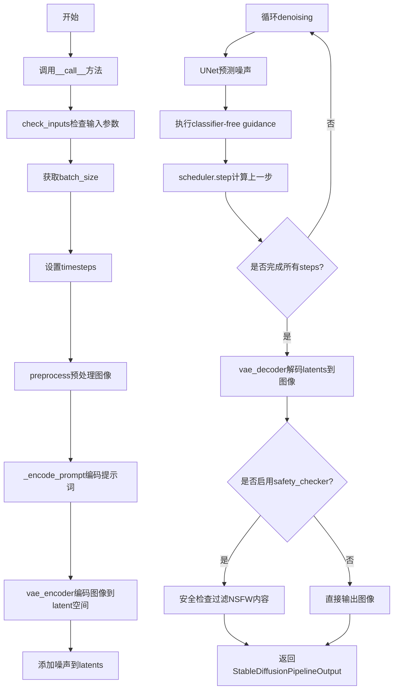
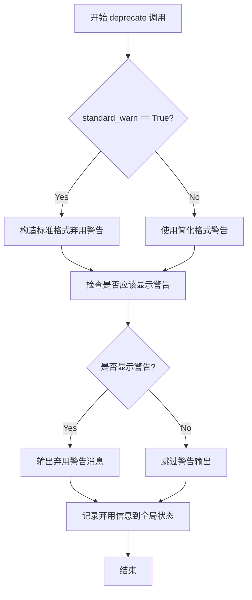
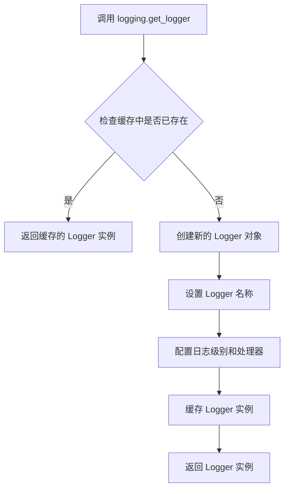
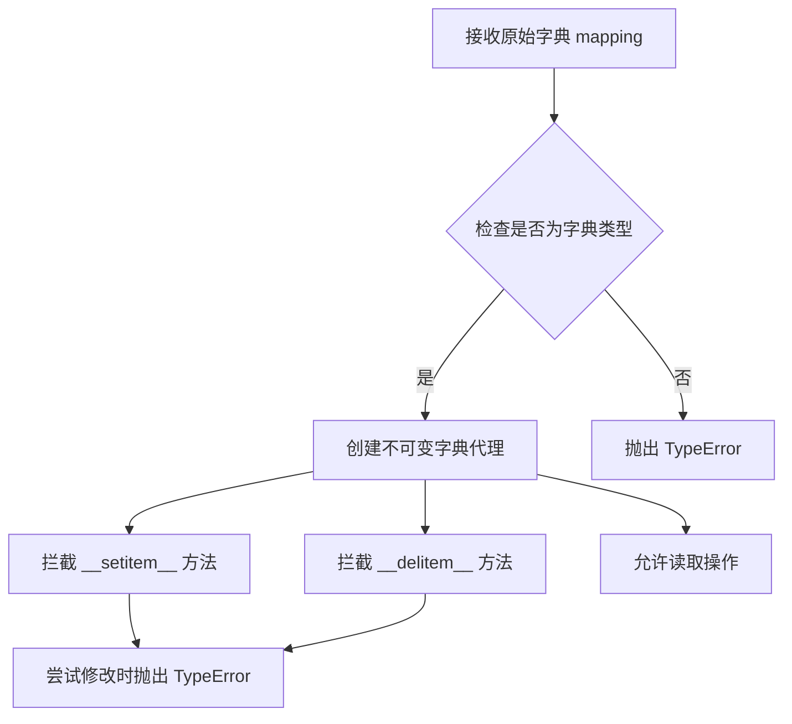
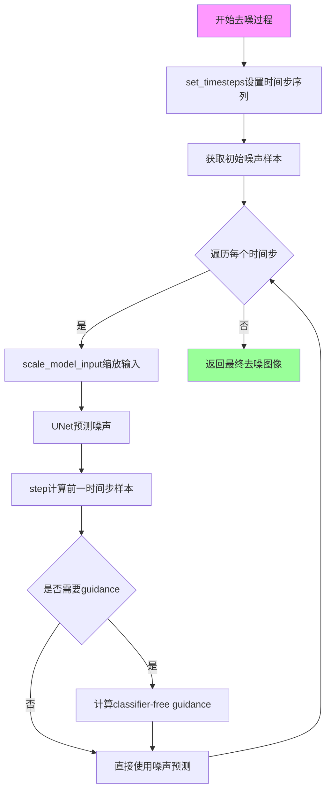
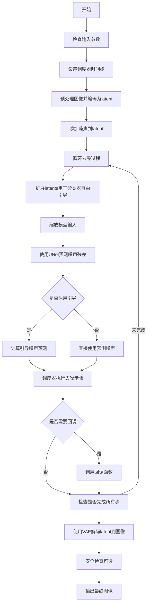
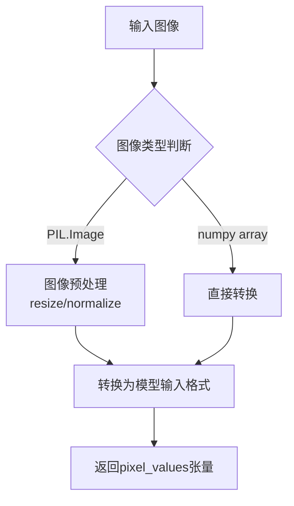
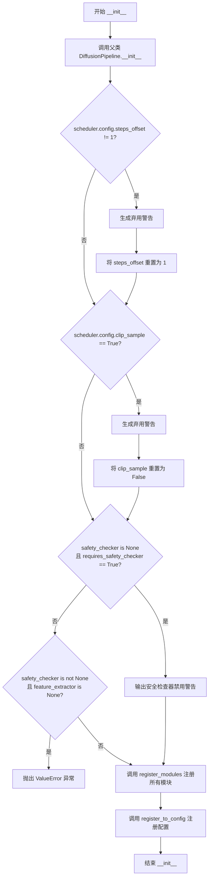

# `diffusers\src\diffusers\pipelines\stable_diffusion\pipeline_onnx_stable_diffusion_img2img.py` 详细设计文档

这是一个基于ONNX Runtime的Stable Diffusion图像到图像（Img2Img）生成管道，用于根据文本提示和初始图像生成目标图像。该管道继承自DiffusionPipeline，使用ONNX模型进行推理，实现了图像风格迁移、内容替换等功能的深度学习推理流程。

## 整体流程



## 类结构

```
DiffusionPipeline (基类)
└── OnnxStableDiffusionImg2ImgPipeline
```

## 全局变量及字段


### `logger`
    
模块级日志记录器，用于记录管道运行时的警告和信息

类型：`logging.Logger`
    


### `ORT_TO_NP_TYPE`
    
ONNX到NumPy类型映射字典，用于ONNX运行时数据类型转换

类型：`dict`
    


### `StableDiffusionPipelineOutput`
    
管道输出数据类，包含生成的图像和NSFW检测结果

类型：`dataclass`
    


### `OnnxStableDiffusionImg2ImgPipeline.vae_encoder`
    
VAE编码器模型，用于将输入图像编码到潜在空间

类型：`OnnxRuntimeModel`
    


### `OnnxStableDiffusionImg2ImgPipeline.vae_decoder`
    
VAE解码器模型，用于将潜在表示解码回图像

类型：`OnnxRuntimeModel`
    


### `OnnxStableDiffusionImg2ImgPipeline.text_encoder`
    
文本编码器ONNX模型，用于将文本提示编码为嵌入向量

类型：`OnnxRuntimeModel`
    


### `OnnxStableDiffusionImg2ImgPipeline.tokenizer`
    
CLIP分词器，用于将文本分割为token序列

类型：`CLIPTokenizer`
    


### `OnnxStableDiffusionImg2ImgPipeline.unet`
    
条件U-Net去噪模型，用于预测噪声残差

类型：`OnnxRuntimeModel`
    


### `OnnxStableDiffusionImg2ImgPipeline.scheduler`
    
噪声调度器，控制去噪过程中的噪声调度

类型：`DDIMScheduler | PNDMScheduler | LMSDiscreteScheduler`
    


### `OnnxStableDiffusionImg2ImgPipeline.safety_checker`
    
安全检查器模型，用于检测生成图像是否包含不当内容

类型：`OnnxRuntimeModel`
    


### `OnnxStableDiffusionImg2ImgPipeline.feature_extractor`
    
图像特征提取器，用于提取图像特征供安全检查器使用

类型：`CLIPImageProcessor`
    


### `OnnxStableDiffusionImg2ImgPipeline._optional_components`
    
可选组件列表，包含safety_checker和feature_extractor

类型：`list`
    


### `OnnxStableDiffusionImg2ImgPipeline._is_onnx`
    
标识为ONNX管道的标志，固定为True

类型：`bool`
    
    

## 全局函数及方法


### `preprocess`

预处理输入图像函数，将 PIL Image 或 PyTorch Tensor 格式的图像转换为模型所需的张量格式，并进行标准化处理。

参数：

-  `image`：`torch.Tensor | PIL.Image.Image | list[PIL.Image.Image]`，输入图像，可以是单个图像或图像列表

返回值：`torch.Tensor`，预处理后的图像张量，形状为 (N, C, H, W)，值域在 [-1, 1]

#### 流程图

```mermaid
flowchart TD
    A[开始: image] --> B{image 是 torch.Tensor?}
    B -->|是| C[直接返回 image]
    B -->|否| D{image 是 PIL.Image.Image?}
    D -->|是| E[转换为列表: image = [image]]
    D -->|否| F[假设是列表, 继续]
    E --> G{image[0] 是 PIL.Image.Image?}
    G -->|是| H[获取图像尺寸 w, h]
    G -->|否| I{image[0] 是 torch.Tensor?}
    H --> J[调整尺寸到64的倍数: w, h = (x - x % 64 for x in (w, h))]
    J --> K[使用Lanczos重采样调整大小]
    K --> L[转换为NumPy数组]
    L --> M[归一化到 [0, 1]: / 255.0]
    M --> N[转置: (H, W, C) -> (C, H, W)]
    N --> O[缩放到 [-1, 1]: 2.0 * image - 1.0]
    O --> P[转换为 torch.Tensor]
    I -->|是| Q[沿 dim=0 拼接张量: torch.cat]
    P --> R[返回预处理后的图像]
    Q --> R
```

#### 带注释源码

```
# 从 diffusers.pipelines.stable_diffusion.pipeline_stable_diffusion_img2img.preprocess 复制, 参数 8->64
def preprocess(image):
    # 发出弃用警告,提示用户使用 VaeImageProcessor.preprocess 替代
    deprecation_message = "The preprocess method is deprecated and will be removed in diffusers 1.0.0. Please use VaeImageProcessor.preprocess(...) instead"
    deprecate("preprocess", "1.0.0", deprecation_message, standard_warn=False)
    
    # 如果输入已经是 torch.Tensor,直接返回
    if isinstance(image, torch.Tensor):
        return image
    # 如果是单个 PIL Image,转换为列表以便统一处理
    elif isinstance(image, PIL.Image.Image):
        image = [image]

    # 处理 PIL Image 类型的图像
    if isinstance(image[0], PIL.Image.Image):
        # 获取第一张图像的尺寸
        w, h = image[0].size
        # 将尺寸调整为64的整数倍,以便模型处理
        w, h = (x - x % 64 for x in (w, h))  # resize to integer multiple of 64

        # 对每张图像进行预处理: resize -> numpy array -> 添加批次维度
        image = [np.array(i.resize((w, h), resample=PIL_INTERPOLATION["lanczos"]))[None, :] for i in image]
        # 沿批次维度拼接
        image = np.concatenate(image, axis=0)
        # 归一化到 [0, 1] 范围
        image = np.array(image).astype(np.float32) / 255.0
        # 转置: 从 (N, H, W, C) 转换为 (N, C, H, W)
        image = image.transpose(0, 3, 1, 2)
        # 缩放到 [-1, 1] 范围,这 是 Stable Diffusion 使用的输入格式
        image = 2.0 * image - 1.0
        # 转换为 PyTorch Tensor
        image = torch.from_numpy(image)
    # 处理已经是 torch.Tensor 类型的图像列表
    elif isinstance(image[0], torch.Tensor):
        # 沿批次维度拼接
        image = torch.cat(image, dim=0)
    
    return image
```


### `deprecate` (全局函数)

该函数是 Hugging Face diffusers 库中的通用弃用警告工具函数，用于在代码中标记已弃用的功能并向用户发出警告。

参数：

-  `deprecated_function_name`：`str`，被弃用的函数或方法的名称
-  `deprecated_function_version`：`str`，计划移除该功能的版本号（如 "1.0.0"）
-  `deprecation_message`：`str`，描述弃用原因和替代方案的详细消息
-  `standard_warn`：`bool`（可选），是否使用标准警告格式，默认为 True

返回值：`None`，该函数不返回任何值，仅打印或记录弃用警告

#### 流程图



#### 带注释源码

```
# 以下为代码中实际使用 deprecate 函数的示例

# 示例 1: preprocess 函数中的弃用警告
deprecation_message = "The preprocess method is deprecated and will be removed in diffusers 1.0.0. Please use VaeImageProcessor.preprocess(...) instead"
deprecate("preprocess", "1.0.0", deprecation_message, standard_warn=False)

# 示例 2: __init__ 中 scheduler steps_offset 配置的弃用警告
deprecation_message = (
    f"The configuration file of this scheduler: {scheduler} is outdated. `steps_offset`"
    f" should be set to 1 instead of {scheduler.config.steps_offset}. Please make sure "
    "to update the config accordingly as leaving `steps_offset` might led to incorrect results"
    " in future versions. If you have downloaded this checkpoint from the Hugging Face Hub,"
    " it would be very nice if you could open a Pull request for the `scheduler/scheduler_config.json`"
    " file"
)
deprecate("steps_offset!=1", "1.0.0", deprecation_message, standard_warn=False)

# 示例 3: __init__ 中 scheduler clip_sample 配置的弃用警告
deprecation_message = (
    f"The configuration file of this scheduler: {scheduler} has not set the configuration `clip_sample`."
    " `clip_sample` should be set to False in the configuration file. Please make sure to update the"
    " config accordingly as not setting `clip_sample` in the config might lead to incorrect results in"
    " future versions. If you have downloaded this checkpoint from the Hugging Face Hub, it would be very"
    " nice if you could open a Pull request for the `scheduler/scheduler_config.json` file"
)
deprecate("clip_sample not set", "1.0.0", deprecation_message, standard_warn=False)

# 示例 4: __call__ 中 prompt 数量与 image 数量不匹配的弃用警告
deprecation_message = (
    f"You have passed {len(prompt)} text prompts (`prompt`), but only {init_latents.shape[0]} initial"
    " images (`image`). Initial images are now duplicating to match the number of text prompts. Note"
    " that this behavior is deprecated and will be removed in a version 1.0.0. Please make sure to update"
    " your script to pass as many initial images as text prompts to suppress this warning."
)
deprecate("len(prompt) != len(image)", "1.0.0", deprecation_message, standard_warn=False)
```


### `logging.get_logger`

获取一个与指定模块关联的日志记录器（Logger）实例，用于在该模块中记录日志。

参数：

- `name`：`str`，日志记录器的名称，通常传入 `__name__` 以获取当前模块的日志记录器

返回值：`logging.Logger`，返回 Python 标准库的 Logger 对象，用于记录日志信息

#### 流程图



#### 带注释源码

```python
# 从 diffusers 项目的 utils 模块导入 logging 对象
from ...utils import logging

# 使用 logging.get_logger 获取当前模块的日志记录器
# __name__ 是 Python 内置变量，表示当前模块的完全限定名
# 例如：diffusers.pipelines.stable_diffusion.pipeline_onnx_stable_diffusion_img2img
logger = logging.get_logger(__name__)  # pylint: disable=invalid-name
```

> **注意**：该函数的具体实现源码不在当前代码片段中，它属于 `diffusers.utils.logging` 模块的实现。该模块通常提供类似于 Python 标准库 `logging` 模块的功能，但针对库的使用场景进行了定制化配置。


### FrozenDict

FrozenDict 是一个不可变（冻结）的字典类，用于创建只读的字典实例。在配置管理中用于确保配置字典不会被意外修改。

参数：

-  `mapping`：字典类型，要冻结的原始字典对象

返回值：FrozenDict，返回一个不可变的字典代理对象

#### 流程图



#### 带注释源码

```python
# FrozenDict 类定义（位于 configuration_utils 模块中）
# 以下是基于代码中使用方式的推断实现

class FrozenDict(dict):
    """
    一个不可变的字典子类。
    继承自 dict，提供所有标准字典操作，但禁止任何修改操作。
    用于确保配置字典在运行时保持不变。
    """
    
    def __init__(self, *args, **kwargs):
        """
        初始化 FrozenDict。
        
        参数:
            *args: 位置参数，传递给父类 dict
            **kwargs: 关键字参数，传递给父类 dict
        """
        super().__init__(*args, **kwargs)
    
    def __setitem__(self, key, value):
        """
        禁止设置字典项。
        
        尝试修改 FrozenDict 时抛出 TypeError。
        """
        raise TypeError("'FrozenDict' object does not support item assignment")
    
    def __delitem__(self, key):
        """
        禁止删除字典项。
        
        尝试从 FrozenDict 删除项时抛出 TypeError。
        """
        raise TypeError("'FrozenDict' object does not support item deletion")
    
    def pop(self, key, *args):
        """
        禁止 pop 操作。
        
        尝试从 FrozenDict 删除项时抛出 TypeError。
        """
        raise TypeError("'FrozenDict' object does not support pop operation")
    
    def clear(self):
        """
        禁止 clear 操作。
        
        尝试清空 FrozenDict 时抛出 TypeError。
        """
        raise TypeError("'FrozenDict' object does not support clear operation")
    
    def update(self, *args, **kwargs):
        """
        禁止 update 操作。
        
        尝试更新 FrozenDict 时抛出 TypeError。
        """
        raise TypeError("'FrozenDict' object does not support update operation")
    
    def setdefault(self, key, default=None):
        """
        禁止 setdefault 操作。
        
        尝试设置默认值时抛出 TypeError。
        """
        raise TypeError("'FrozenDict' object does not support setdefault operation")


# 在代码中的使用示例（来自 OnnxStableDiffusionImg2ImgPipeline.__init__）:
# new_config = dict(scheduler.config)
# new_config["steps_offset"] = 1
# scheduler._internal_dict = FrozenDict(new_config)
# 
# 上述代码创建一个新的配置字典，然后将其冻结为 FrozenDict，
# 以确保调度器的内部配置不会被后续代码修改。
```

---

**注意**：由于用户提供的代码片段是从 `configuration_utils` 导入 `FrozenDict` 的使用方，而 `FrozenDict` 类的实际定义位于 `configuration_utils` 模块中，因此上述源码是基于 Python 常见FrozenDict实现模式和代码中使用方式的推断。


### DDIMScheduler

DDIMScheduler是Denoising Diffusion Implicit Models（DDIM）调度器，用于在Stable Diffusion等扩散模型的推理过程中管理和执行去噪步骤。DDIM调度器提供了一种比传统DDPM更高效的采样方法，可以在较少的步骤内生成高质量图像。

#### 带注释源码（基于代码中的使用方式）

```python
# DDIMScheduler 从 diffusers 库中导入
# 这是一个调度器类，用于控制扩散模型的采样过程
from ...schedulers import DDIMScheduler

# 在 pipeline 中的类型声明
scheduler: DDIMScheduler | PNDMScheduler | LMSDiscreteScheduler
```

#### 代码中的实际使用方式

由于DDIMScheduler是外部导入的类，以下是代码中对其方法的调用方式：

**1. set_timesteps - 设置去噪步骤**

```python
# 设置推理的时间步数
self.scheduler.set_timesteps(num_inference_steps)
```

**2. add_noise - 添加噪声**

```python
# 向初始图像的latent表示添加噪声
noise = generator.randn(*init_latents.shape).astype(latents_dtype)
init_latents = self.scheduler.add_noise(
    torch.from_numpy(init_latents), 
    torch.from_numpy(noise), 
    torch.from_numpy(timesteps)
)
```

**3. scale_model_input - 缩放模型输入**

```python
# 根据当前时间步缩放输入
latent_model_input = self.scheduler.scale_model_input(
    torch.from_numpy(latent_model_input), 
    t
)
```

**4. step - 执行去噪步骤**

```python
# 执行单步去噪预测
# 参数：噪声预测、当前时间步、当前latent、额外参数（如eta）
scheduler_output = self.scheduler.step(
    torch.from_numpy(noise_pred), 
    t, 
    torch.from_numpy(latents), 
    **extra_step_kwargs  # 包含 eta 参数
)
latents = scheduler_output.prev_sample.numpy()
```

**5. timesteps - 获取时间步**

```python
# 获取调度器的时间步
timesteps = self.scheduler.timesteps.numpy()[-init_timestep]
timesteps = np.array([timesteps] * batch_size * num_images_per_prompt)
```

**6. config - 获取配置**

```python
# 访问调度器配置
offset = self.scheduler.config.get("steps_offset", 0)
```

#### 关键特性说明

1. **eta参数**：DDIM调度器支持eta参数（η），用于控制采样过程中的随机性
   - eta=0：确定性采样（DDIM）
   - eta=1：随机采样（DDPM）

2. **steps_offset**：用于调整时间步的偏移量，确保与训练过程一致

3. **clip_sample**：配置项，控制是否对采样进行裁剪

#### 与其他调度器的兼容性

代码支持三种调度器：
- `DDIMScheduler`：确定性采样，效率高
- `PNDMScheduler`：基于PNDM的调度器
- `LMSDiscreteScheduler`：LMS调度器

这些调度器通过统一的接口（SchedulerMixin）进行抽象，代码中使用`inspect.signature`来检查各调度器支持的参数。


# LMSDiscreteScheduler 详细设计文档

### LMSDiscreteScheduler

LMSDiscreteScheduler是diffusers库中的一个离散调度器类，用于扩散模型的推理过程。它基于线性多步法（Linear Multistep Method）来计算去噪过程中的噪声预测，实现图像从噪声状态逐步去噪到清晰图像的转换。该调度器继承自SchedulerMixin，提供了时间步设置、噪声添加、模型输入缩放和单步去噪等核心功能。

> **注意**：由于提供的代码中仅包含对LMSDiscreteScheduler的使用（作为OnnxStableDiffusionImg2ImgPipeline的一个组件），并未包含该类的完整实现源码，因此以下信息基于diffusers库中LMSDiscreteScheduler的标准接口和代码中的使用模式推断得出。

## 参数

由于LMSDiscreteScheduler是通过import引入的外部类，其构造函数参数需参考diffusers官方实现。以下为代码中涉及的相关配置和使用方式：

- `scheduler`：在OnnxStableDiffusionImg2ImgPipeline中作为参数传入的调度器实例，类型为 `DDIMScheduler | PNDMScheduler | LMSDiscreteScheduler`

## 类主要方法

### set_timesteps

设置推理过程中使用的时间步序列。

- **参数**：
  - `num_inference_steps`：`int`，推理步数，决定去噪过程需要执行多少次迭代
- **返回值**：`None`

### add_noise

向初始图像或潜向量添加噪声。

- **参数**：
  - `sample`：`torch.Tensor`，要添加噪声的样本（图像潜向量）
  - `noise`：`torch.Tensor`，要添加的噪声
  - `timestep`：`torch.Tensor`，当前的时间步
- **返回值**：`torch.Tensor`，添加噪声后的样本

### scale_model_input

根据当前时间步缩放模型输入。

- **参数**：
  - `sample`：`torch.Tensor`，输入样本
  - `timestep`：`int`或`torch.Tensor`，当前时间步
- **返回值**：`torch.Tensor`，缩放后的样本

### step

执行单步去噪计算，基于噪声预测计算前一时间步的样本。

- **参数**：
  - `model_output`：`torch.Tensor`，模型预测的噪声
  - `timestep`：`int`或`torch.Tensor`，当前时间步
  - `sample`：`torch.Tensor`，当前样本
  - `eta`：`float`（可选），DDIM论文中的η参数，用于控制随机性
- **返回值**：包含`prev_sample`（前一时间步的样本）的对象

### timesteps（属性）

返回调度器的时间步张量。

- **返回值**：`torch.Tensor`，时间步序列

### config（属性）

返回调度器的配置字典。

- **返回值**：`FrozenDict`或类似字典对象，包含如`steps_offset`、`clip_sample`等配置项

## 流程图



## 关键组件信息

| 组件名称 | 一句话描述 |
|---------|-----------|
| LMSDiscreteScheduler | 基于线性多步法的离散时间步调度器，用于扩散模型的去噪推理过程 |
| DDIMScheduler | 基于DDIM算法的调度器，支持确定性去噪路径 |
| PNDMScheduler | 基于PNDM算法的调度器，使用伪数值方法加速去噪 |
| SchedulerMixin | 扩散模型调度器的基类，定义通用接口 |

## 潜在技术债务与优化空间

1. **调度器兼容性处理复杂**：代码中需要检查多种调度器类型并分别处理它们的接口差异（如`eta`参数），增加了维护成本。建议统一调度器接口或使用适配器模式。

2. **动态类型检查开销**：`accept_eta`检查使用`inspect.signature`遍历参数键，每次推理都会执行一次，可考虑缓存结果。

3. **ONNX模型特殊处理**：代码中包含大量ONNX特定的类型转换和批处理处理逻辑（如VAE解码器的逐个处理），与通用pipeline相比有较多分支。

4. **废弃API兼容**：代码中保留了大量废弃警告逻辑（如`steps_offset!=1`和`clip_sample not set`），这些兼容性代码随时间推移可能成为技术债务。

## 其它项目

### 设计目标与约束
- 支持ONNX运行时优化
- 兼容多种调度器（DDIM、PNDM、LMS）
- 支持classifier-free guidance
- 支持图像到图像的转换任务

### 错误处理与异常设计
- 输入验证：检查`callback_steps`为正整数、`prompt`和`prompt_embeds`不能同时提供、`strength`必须在[0,1]范围内
- 调度器配置验证：自动修复过时的`steps_offset`配置
- 安全检查器验证：要求同时提供`feature_extractor`和`safety_checker`

### 数据流与状态机
1. **预处理阶段**：图像预处理→编码为潜向量
2. **噪声调度阶段**：计算初始噪声→设置时间步→添加噪声
3. **去噪循环阶段**：缩放输入→UNet预测→guidance计算→调度器步骤更新
4. **后处理阶段**：VAE解码→安全检查→格式转换

### 外部依赖与接口契约
- **torch**：张量计算
- **numpy**：数值计算和数组操作
- **PIL**：图像处理
- **transformers**：CLIP tokenizer和image processor
- **onnxruntime**：ONNX模型推理
- **diffusers**：调度器和管道基类


### OnnxStableDiffusionImg2ImgPipeline.__call__

描述：该方法是 OnnxStableDiffusionImg2ImgPipeline 的主生成方法，接收文本提示和初始图像，通过调度器（可能是 PNDMScheduler）进行多步去噪处理，最终生成符合提示的图像。

参数：

- `prompt`：`str | list[str]`，指导图像生成的文本提示
- `image`：`np.ndarray | PIL.Image.Image`，用作起点的图像
- `strength`：`float`，概念上表示对参考图像的变换程度，默认为 0.8
- `num_inference_steps`：`int | None`，去噪步数，默认为 50
- `guidance_scale`：`float | None`，分类器自由引导参数，默认为 7.5
- `negative_prompt`：`str | list[str] | None`，不引导图像生成的提示
- `num_images_per_prompt`：`int | None`，每个提示生成的图像数量，默认为 1
- `eta`：`float | None`，DDIM 论文中的参数，仅对 DDIMScheduler 有效
- `generator`：`np.random.RandomState | None`，用于生成确定性随机数
- `prompt_embeds`：`np.ndarray | None`，预生成的文本嵌入
- `negative_prompt_embeds`：`np.ndarray | None`，预生成的负面文本嵌入
- `output_type`：`str | None`，生成图像的输出格式，默认为 "pil"
- `return_dict`：`bool`，是否返回字典格式结果，默认为 True
- `callback`：`Callable[[int, int, np.ndarray], None] | None`，每步调用的回调函数
- `callback_steps`：`int`，回调函数调用频率，默认为 1

返回值：`StableDiffusionPipelineOutput | tuple`，生成的图像及 NSFW 检测结果

#### 流程图



#### 带注释源码

```python
def __call__(
    self,
    prompt: str | list[str],
    image: np.ndarray | PIL.Image.Image = None,
    strength: float = 0.8,
    num_inference_steps: int | None = 50,
    guidance_scale: float | None = 7.5,
    negative_prompt: str | list[str] | None = None,
    num_images_per_prompt: int | None = 1,
    eta: float | None = 0.0,
    generator: np.random.RandomState | None = None,
    prompt_embeds: np.ndarray | None = None,
    negative_prompt_embeds: np.ndarray | None = None,
    output_type: str | None = "pil",
    return_dict: bool = True,
    callback: Callable[[int, int, np.ndarray], None] | None = None,
    callback_steps: int = 1,
):
    # 步骤1: 检查输入参数的有效性
    self.check_inputs(prompt, callback_steps, negative_prompt, prompt_embeds, negative_prompt_embeds)

    # 步骤2: 确定批次大小
    if prompt is not None and isinstance(prompt, str):
        batch_size = 1
    elif prompt is not None and isinstance(prompt, list):
        batch_size = len(prompt)
    else:
        batch_size = prompt_embeds.shape[0]

    # 步骤3: 验证 strength 参数范围
    if strength < 0 or strength > 1:
        raise ValueError(f"The value of strength should in [0.0, 1.0] but is {strength}")

    # 步骤4: 设置随机数生成器
    if generator is None:
        generator = np.random

    # 步骤5: 设置调度器的时间步（调度器可能是 PNDMScheduler）
    self.scheduler.set_timesteps(num_inference_steps)

    # 步骤6: 预处理输入图像
    image = preprocess(image).cpu().numpy()

    # 步骤7: 判断是否启用分类器自由引导
    do_classifier_free_guidance = guidance_scale > 1.0

    # 步骤8: 编码提示词
    prompt_embeds = self._encode_prompt(
        prompt,
        num_images_per_prompt,
        do_classifier_free_guidance,
        negative_prompt,
        prompt_embeds=prompt_embeds,
        negative_prompt_embeds=negative_prompt_embeds,
    )

    # 步骤9: 确定数据类型并编码图像到 latent 空间
    latents_dtype = prompt_embeds.dtype
    image = image.astype(latents_dtype)
    init_latents = self.vae_encoder(sample=image)[0]
    init_latents = 0.18215 * init_latents

    # 步骤10: 处理提示词和图像数量的匹配
    # ... (省略部分代码)

    # 步骤11: 计算初始时间步
    offset = self.scheduler.config.get("steps_offset", 0)
    init_timestep = int(num_inference_steps * strength) + offset
    init_timestep = min(init_timestep, num_inference_steps)

    timesteps = self.scheduler.timesteps.numpy()[-init_timestep]
    timesteps = np.array([timesteps] * batch_size * num_images_per_prompt)

    # 步骤12: 使用调度器添加噪声（PNDMScheduler 的 add_noise 方法）
    noise = generator.randn(*init_latents.shape).astype(latents_dtype)
    init_latents = self.scheduler.add_noise(
        torch.from_numpy(init_latents), torch.from_numpy(noise), torch.from_numpy(timesteps)
    )
    init_latents = init_latents.numpy()

    # 步骤13: 准备调度器的额外参数
    accepts_eta = "eta" in set(inspect.signature(self.scheduler.step).parameters.keys())
    extra_step_kwargs = {}
    if accepts_eta:
        extra_step_kwargs["eta"] = eta

    latents = init_latents

    # 步骤14: 设置去噪循环的起始位置
    t_start = max(num_inference_steps - init_timestep + offset, 0)
    timesteps = self.scheduler.timesteps[t_start:].numpy()

    # 步骤15: 获取时间步数据类型
    timestep_dtype = next(
        (input.type for input in self.unet.model.get_inputs() if input.name == "timestep"), "tensor(float)"
    )
    timestep_dtype = ORT_TO_NP_TYPE[timestep_dtype]

    # 步骤16: 主去噪循环
    for i, t in enumerate(self.progress_bar(timesteps)):
        # 扩展 latents 用于分类器自由引导
        latent_model_input = np.concatenate([latents] * 2) if do_classifier_free_guidance else latents
        # 使用调度器缩放模型输入（PNDMScheduler 的 scale_model_input 方法）
        latent_model_input = self.scheduler.scale_model_input(torch.from_numpy(latent_model_input), t)
        latent_model_input = latent_model_input.cpu().numpy()

        # 预测噪声残差
        timestep = np.array([t], dtype=timestep_dtype)
        noise_pred = self.unet(sample=latent_model_input, timestep=timestep, encoder_hidden_states=prompt_embeds)[0]

        # 执行分类器自由引导
        if do_classifier_free_guidance:
            noise_pred_uncond, noise_pred_text = np.split(noise_pred, 2)
            noise_pred = noise_pred_uncond + guidance_scale * (noise_pred_text - noise_pred_uncond)

        # 使用调度器执行去噪步骤（PNDMScheduler 的 step 方法）
        scheduler_output = self.scheduler.step(
            torch.from_numpy(noise_pred), t, torch.from_numpy(latents), **extra_step_kwargs
        )
        latents = scheduler_output.prev_sample.numpy()

        # 调用回调函数
        if callback is not None and i % callback_steps == 0:
            step_idx = i // getattr(self.scheduler, "order", 1)
            callback(step_idx, t, latents)

    # 步骤17: 使用 VAE 解码 latent 到图像
    latents = 1 / 0.18215 * latents
    image = np.concatenate(
        [self.vae_decoder(latent_sample=latents[i : i + 1])[0] for i in range(latents.shape[0])]
    )

    # 步骤18: 后处理图像
    image = np.clip(image / 2 + 0.5, 0, 1)
    image = image.transpose((0, 2, 3, 1))

    # 步骤19: 安全检查
    if self.safety_checker is not None:
        # ... (安全检查代码省略)
        pass
    else:
        has_nsfw_concept = None

    # 步骤20: 输出最终结果
    if output_type == "pil":
        image = self.numpy_to_pil(image)

    if not return_dict:
        return (image, has_nsfw_concept)

    return StableDiffusionPipelineOutput(images=image, nsfw_content_detected=has_nsfw_concept)
```

### PNDMScheduler 相关信息

注意：该代码文件中并未直接定义 PNDMScheduler 类，而是从 `...schedulers` 模块导入。PNDMScheduler 是 diffusers 库中的调度器类，在此 Pipeline 中通过 `self.scheduler` 属性使用。

#### 调度器在 Pipeline 中的核心调用

1. **set_timesteps(num_inference_steps)**：设置去噪的时间步序列
2. **add_noise(original_samples, noise, timesteps)**：在给定时间步向样本添加噪声
3. **scale_model_input(sample, step)**：根据当前步骤缩放输入
4. **step(noise_pred, timestep, sample, **extra_kwargs)**：执行单步去噪，返回上一步的样本

#### 调度器类型约束

- 类型：`DDIMScheduler | PNDMScheduler | LMSDiscreteScheduler`
- 在 `__init__` 中接受并验证调度器配置
- 检查 `steps_offset` 和 `clip_sample` 配置参数


### CLIPImageProcessor

`CLIPImageProcessor` 是从 `transformers` 库导入的图像处理器类，用于将图像转换为 CLIP 模型所需的格式。在该管道中，它作为 `feature_extractor`（特征提取器）使用，负责为安全检查器（safety_checker）提取图像特征。

参数：

- `images`：`np.ndarray` 或 `PIL.Image.Image`，需要处理的图像或图像批次
- `return_tensors`：可选参数，指定返回的张量类型（如 "np"、"pt" 等）

返回值：`ImageProcessorOutput` 或类似对象，包含 `pixel_values` 属性，表示处理后的像素值张量

#### 流程图



#### 带注释源码

```python
# CLIPImageProcessor 是 transformers 库中的类，此处为代码中的使用示例
# 该类负责将图像转换为 CLIP 模型可处理的格式

# 在 OnnxStableDiffusionImg2ImgPipeline 中的使用：
safety_checker_input = self.feature_extractor(  # feature_extractor 即为 CLIPImageProcessor
    self.numpy_to_pil(image),  # 将 numpy 数组转换为 PIL 图像
    return_tensors="np"         # 指定返回 numpy 类型的张量
).pixel_values                  # 获取处理后的像素值

# 完整调用链说明：
# 1. self.numpy_to_pil(image) - 将管道输出的 numpy 图像转换为 PIL 图像
# 2. self.feature_extractor(...) - 调用 CLIPImageProcessor 的 __call__ 方法
#    - 自动进行图像 resize、normalize 等预处理
#    - 返回包含 pixel_values 的输出对象
# 3. .pixel_values - 提取处理后的像素值张量
# 4. .astype(image.dtype) - 确保数据类型一致
```

> **注意**：由于 `CLIPImageProcessor` 是从 `transformers` 库导入的外部类，其完整源码实现不在本项目范围内。上述信息基于代码中的使用方式进行了描述。


### `OnnxStableDiffusionImg2ImgPipeline._encode_prompt`

使用CLIPTokenizer对文本提示进行编码，将文本转换为文本编码器hidden states的核心方法。

参数：

- `prompt`：`str | list[str]`，要编码的提示文本
- `num_images_per_prompt`：`int | None`，每个提示要生成的图像数量
- `do_classifier_free_guidance`：`bool`，是否使用无分类器引导
- `negative_prompt`：`str | None`，用于引导的负面提示
- `prompt_embeds`：`np.ndarray | None = None`，预生成的文本嵌入
- `negative_prompt_embeds`：`np.ndarray | None = None`，预生成的负面文本嵌入

返回值：`np.ndarray`，编码后的提示嵌入向量

#### 流程图

```mermaid
flowchart TD
    A[开始 _encode_prompt] --> B{判断 prompt 类型}
    B -->|str| C[batch_size = 1]
    B -->|list| D[batch_size = len(prompt)]
    B -->|其他| E[batch_size = prompt_embeds.shape[0]]
    C --> F{prompt_embeds 为空?}
    D --> F
    E --> F
    F -->|是| G[调用 self.tokenizer 编码 prompt]
    G --> H[检查是否被截断]
    H -->|是| I[记录警告日志]
    H -->|否| J[调用 self.text_encoder 获取嵌入]
    F -->|否| K[使用传入的 prompt_embeds]
    I --> J
    J --> L[根据 num_images_per_prompt 重复嵌入]
    K --> L
    L --> M{需要无分类器引导?}
    M -->|是 且 negative_prompt_embeds 为空| N[处理 negative_prompt]
    M -->|否| O[返回 prompt_embeds]
    N --> P[调用 self.tokenizer 编码 uncond_tokens]
    P --> Q[调用 self.text_encoder 获取 negative_prompt_embeds]
    Q --> R[重复 negative_prompt_embeds]
    R --> S[拼接 negative_prompt_embeds 和 prompt_embeds]
    S --> O
```

#### 带注释源码

```python
def _encode_prompt(
    self,
    prompt: str | list[str],
    num_images_per_prompt: int | None,
    do_classifier_free_guidance: bool,
    negative_prompt: str | None,
    prompt_embeds: np.ndarray | None = None,
    negative_prompt_embeds: np.ndarray | None = None,
):
    r"""
    Encodes the prompt into text encoder hidden states.

    Args:
        prompt (`str` or `list[str]`):
            prompt to be encoded
        num_images_per_prompt (`int`):
            number of images that should be generated per prompt
        do_classifier_free_guidance (`bool`):
            whether to use classifier free guidance or not
        negative_prompt (`str` or `list[str]`):
            The prompt or prompts not to guide the image generation. Ignored when not using guidance (i.e., ignored
            if `guidance_scale` is less than `1`).
        prompt_embeds (`np.ndarray`, *optional*):
            Pre-generated text embeddings. Can be used to easily tweak text inputs, *e.g.* prompt weighting. If not
            provided, text embeddings will be generated from `prompt` input argument.
        negative_prompt_embeds (`np.ndarray`, *optional*):
            Pre-generated negative text embeddings. Can be used to easily tweak text inputs, *e.g.* prompt
            weighting. If not provided, negative_prompt_embeds will be generated from `negative_prompt` input
            argument.
    """
    # 确定批量大小：根据输入的prompt类型或已编码的prompt_embeds维度
    if prompt is not None and isinstance(prompt, str):
        batch_size = 1
    elif prompt is not None and isinstance(prompt, list):
        batch_size = len(prompt)
    else:
        batch_size = prompt_embeds.shape[0]

    # 如果未提供预编码的嵌入，则从文本生成
    if prompt_embeds is None:
        # 使用tokenizer将prompt转换为模型输入格式
        text_inputs = self.tokenizer(
            prompt,
            padding="max_length",  # 填充到最大长度
            max_length=self.tokenizer.model_max_length,  # 使用tokenizer的最大长度限制
            truncation=True,  # 允许截断超过最大长度的输入
            return_tensors="np",  # 返回numpy数组
        )
        text_input_ids = text_inputs.input_ids  # 获取输入ID
        # 获取未截断的完整输入（用于检测截断）
        untruncated_ids = self.tokenizer(prompt, padding="max_length", return_tensors="np").input_ids

        # 检测并警告截断情况
        if not np.array_equal(text_input_ids, untruncated_ids):
            # 解码被截断的部分
            removed_text = self.tokenizer.batch_decode(
                untruncated_ids[:, self.tokenizer.model_max_length - 1 : -1]
            )
            logger.warning(
                "The following part of your input was truncated because CLIP can only handle sequences up to"
                f" {self.tokenizer.model_max_length} tokens: {removed_text}"
            )

        # 通过text_encoder获取文本嵌入
        prompt_embeds = self.text_encoder(input_ids=text_input_ids.astype(np.int32))[0]

    # 根据每个prompt生成的图像数量重复嵌入
    prompt_embeds = np.repeat(prompt_embeds, num_images_per_prompt, axis=0)

    # 为无分类器引导准备无条件嵌入
    if do_classifier_free_guidance and negative_prompt_embeds is None:
        uncond_tokens: list[str]
        if negative_prompt is None:
            # 如果未提供负面提示，使用空字符串
            uncond_tokens = [""] * batch_size
        elif type(prompt) is not type(negative_prompt):
            raise TypeError(
                f"`negative_prompt` should be the same type to `prompt`, but got {type(negative_prompt)} !="
                f" {type(prompt)}."
            )
        elif isinstance(negative_prompt, str):
            uncond_tokens = [negative_prompt] * batch_size
        elif batch_size != len(negative_prompt):
            raise ValueError(
                f"`negative_prompt`: {negative_prompt} has batch size {len(negative_prompt)}, but `prompt`:"
                f" {prompt} has batch size {batch_size}. Please make sure that passed `negative_prompt` matches"
                " the batch size of `prompt`."
            )
        else:
            uncond_tokens = negative_prompt

        # 使用与prompt_embeds相同的长度
        max_length = prompt_embeds.shape[1]
        uncond_input = self.tokenizer(
            uncond_tokens,
            padding="max_length",
            max_length=max_length,
            truncation=True,
            return_tensors="np",
        )
        # 获取无条件嵌入
        negative_prompt_embeds = self.text_encoder(input_ids=uncond_input.input_ids.astype(np.int32))[0]

    # 如果使用无分类器引导，重复负面嵌入
    if do_classifier_free_guidance:
        negative_prompt_embeds = np.repeat(negative_prompt_embeds, num_images_per_prompt, axis=0)

        # 拼接无条件嵌入和条件嵌入以避免两次前向传播
        # 格式：[negative_prompt_embeds, prompt_embeds]
        prompt_embeds = np.concatenate([negative_prompt_embeds, prompt_embeds])

    return prompt_embeds
```


让我仔细分析代码，找出 `OnnxRuntimeModel` 类的定义和使用情况。

从代码中我可以看到：

1. **OnnxRuntimeModel 的导入**：`from ..onnx_utils import ORT_TO_NP_TYPE, OnnxRuntimeModel`
2. **OnnxRuntimeModel 的使用方式**：
   - 作为类型标注：`vae_encoder: OnnxRuntimeModel`、`vae_decoder: OnnxRuntimeModel`、`text_encoder: OnnxRuntimeModel`、`unet: OnnxRuntimeModel`、`safety_checker: OnnxRuntimeModel`
   - 被调用：`self.text_encoder(input_ids=text_input_ids.astype(np.int32))[0]`
   - 被调用：`self.vae_encoder(sample=image)[0]`
   - 被调用：`self.unet(sample=latent_model_input, timestep=timestep, encoder_hidden_states=prompt_embeds)[0]`
   - 被调用：`self.vae_decoder(latent_sample=latents[i : i + 1])[0]`
   - 被调用：`self.safety_checker(clip_input=safety_checker_input[i : i + 1], images=image[i : i + 1])`

但是，**当前提供的代码中并没有包含 `OnnxRuntimeModel` 类的实际定义**。该类是从 `..onnx_utils` 模块导入的，这意味着类定义在另一个文件 `onnx_utils.py` 中。

为了生成完整的详细设计文档，我需要知道：

1. **`OnnxRuntimeModel` 类的源代码** - 您能否提供 `onnx_utils.py` 文件的内容？
2. 或者您希望我从代码的使用方式推断 `OnnxRuntimeModel` 的接口？

请提供 `OnnxRuntimeModel` 类的定义，这样我才能生成准确的详细设计文档，包括：
- 类的完整字段和方法信息
- 每个方法的参数、返回值详情
- Mermaid 流程图
- 带注释的源代码


### `OnnxStableDiffusionImg2ImgPipeline.__init__`

初始化 ONNX 版本的 Stable Diffusion 图片到图片生成管道，设置各组件并验证配置兼容性。

参数：

- `vae_encoder`：`OnnxRuntimeModel`，VAE 编码器模型，用于将输入图像编码到潜在表示空间
- `vae_decoder`：`OnnxRuntimeModel`，VAE 解码器模型，用于将潜在表示解码回图像
- `text_encoder`：`OnnxRuntimeModel`，文本编码器模型，将文本提示转换为嵌入向量
- `tokenizer`：`CLIPTokenizer`，CLIP 分词器，用于对文本进行分词处理
- `unet`：`OnnxRuntimeModel`，条件 U-Net 模型，用于对图像潜在表示进行去噪
- `scheduler`：`DDIMScheduler | PNDMScheduler | LMSDiscreteScheduler`，去噪调度器，决定噪声添加和去除的策略
- `safety_checker`：`OnnxRuntimeModel`，安全检查器模型，用于检测生成图像是否包含不当内容
- `feature_extractor`：`CLIPImageProcessor`，特征提取器，从生成的图像中提取特征供安全检查器使用
- `requires_safety_checker`：`bool`，是否需要安全检查器，默认为 True

返回值：`None`，构造函数无返回值，仅完成管道初始化

#### 流程图



#### 带注释源码

```python
def __init__(
    self,
    vae_encoder: OnnxRuntimeModel,
    vae_decoder: OnnxRuntimeModel,
    text_encoder: OnnxRuntimeModel,
    tokenizer: CLIPTokenizer,
    unet: OnnxRuntimeModel,
    scheduler: DDIMScheduler | PNDMScheduler | LMSDiscreteScheduler,
    safety_checker: OnnxRuntimeModel,
    feature_extractor: CLIPImageProcessor,
    requires_safety_checker: bool = True,
):
    """
    初始化 OnnxStableDiffusionImg2ImgPipeline 管道实例。
    
    参数:
        vae_encoder: Variational Auto-Encoder 编码器模型
        vae_decoder: Variational Auto-Encoder 解码器模型
        text_encoder: CLIP 文本编码器模型
        tokenizer: CLIP 分词器
        unet: 条件 U-Net 去噪模型
        scheduler: 噪声调度器 (DDIM/PNDM/LMSDiscrete)
        safety_checker: 安全检查器模型
        feature_extractor: CLIP 图像特征提取器
        requires_safety_checker: 是否启用安全检查器
    """
    # 调用父类 DiffusionPipeline 的初始化方法
    # 继承基础管道功能，如设备管理、序列化等
    super().__init__()

    # 检查调度器的 steps_offset 配置
    # 如果不等于 1 则输出弃用警告并强制重置为 1
    # 旧版本配置的 steps_offset 可能导致错误的推理结果
    if scheduler is not None and getattr(scheduler.config, "steps_offset", 1) != 1:
        deprecation_message = (
            f"The configuration file of this scheduler: {scheduler} is outdated. `steps_offset`"
            f" should be set to 1 instead of {scheduler.config.steps_offset}. Please make sure "
            "to update the config accordingly as leaving `steps_offset` might led to incorrect results"
            " in future versions. If you have downloaded this checkpoint from the Hugging Face Hub,"
            " it would be very nice if you could open a Pull request for the `scheduler/scheduler_config.json`"
            " file"
        )
        deprecate("steps_offset!=1", "1.0.0", deprecation_message, standard_warn=False)
        new_config = dict(scheduler.config)
        new_config["steps_offset"] = 1
        # 使用 FrozenDict 确保配置不可变
        scheduler._internal_dict = FrozenDict(new_config)

    # 检查调度器的 clip_sample 配置
    # 如果为 True 则输出弃用警告并重置为 False
    # clip_sample=True 可能导致错误的推理结果
    if scheduler is not None and getattr(scheduler.config, "clip_sample", False) is True:
        deprecation_message = (
            f"The configuration file of this scheduler: {scheduler} has not set the configuration `clip_sample`."
            " `clip_sample` should be set to False in the configuration file. Please make sure to update the"
            " config accordingly as not setting `clip_sample` in the config might lead to incorrect results in"
            " future versions. If you have downloaded this checkpoint from the Hugging Face Hub, it would be very"
            " nice if you could open a Pull request for the `scheduler/scheduler_config.json` file"
        )
        deprecate("clip_sample not set", "1.0.0", deprecation_message, standard_warn=False)
        new_config = dict(scheduler.config)
        new_config["clip_sample"] = False
        scheduler._internal_dict = FrozenDict(new_config)

    # 如果 safety_checker 为 None 但 requires_safety_checker 为 True
    # 发出警告提示安全检查器已被禁用
    if safety_checker is None and requires_safety_checker:
        logger.warning(
            f"You have disabled the safety checker for {self.__class__} by passing `safety_checker=None`. Ensure"
            " that you abide to the conditions of the Stable Diffusion license and do not expose unfiltered"
            " results in services or applications open to the public. Both the diffusers team and Hugging Face"
            " strongly recommend to keep the safety filter enabled in all public facing circumstances, disabling"
            " it only for use-cases that involve analyzing network behavior or auditing its results. For more"
            " information, please have a look at https://github.com/huggingface/diffusers/pull/254 ."
        )

    # 如果提供了 safety_checker 但未提供 feature_extractor
    # 抛出 ValueError 异常，因为安全检查需要特征提取器
    if safety_checker is not None and feature_extractor is None:
        raise ValueError(
            "Make sure to define a feature extractor when loading {self.__class__} if you want to use the safety"
            " checker. If you do not want to use the safety checker, you can pass `'safety_checker=None'` instead."
        )

    # 注册所有模块到管道中
    # 使这些组件可以通过管道对象直接访问
    # 同时支持管道的保存和加载功能
    self.register_modules(
        vae_encoder=vae_encoder,
        vae_decoder=vae_decoder,
        text_encoder=text_encoder,
        tokenizer=tokenizer,
        unet=unet,
        scheduler=scheduler,
        safety_checker=safety_checker,
        feature_extractor=feature_extractor,
    )
    # 将 requires_safety_checker 注册到配置中
    # 用于保存/加载管道时保留该设置
    self.register_to_config(requires_safety_checker=requires_safety_checker)
```


### `OnnxStableDiffusionImg2ImgPipeline._encode_prompt`

该方法负责将文本提示词（prompt）编码为文本编码器（text_encoder）的隐藏状态向量（embeddings），用于后续的图像生成过程。它处理正面提示词和负面提示词（用于分类器自由引导），并支持预计算的嵌入向量，以实现文本到图像的语义控制。

参数：

- `prompt`：`str | list[str]`，要编码的文本提示词，支持单个字符串或字符串列表
- `num_images_per_prompt`：`int | None`，每个提示词需要生成的图像数量，用于批量生成
- `do_classifier_free_guidance`：`bool`，是否启用分类器自由引导（CFG），为True时需要生成负面提示词嵌入
- `negative_prompt`：`str | None`，负面提示词，用于引导图像远离不希望的内容
- `prompt_embeds`：`np.ndarray | None = None`，可选的预计算正面提示词嵌入，若提供则直接使用
- `negative_prompt_embeds`：`np.ndarray | None = None`，可选的预计算负面提示词嵌入，若提供则直接使用

返回值：`np.ndarray`，编码后的提示词嵌入向量，形状为 `[batch_size * num_images_per_prompt, seq_len, hidden_dim]`，当启用CFG时会在前面拼接负面嵌入

#### 流程图

```mermaid
flowchart TD
    A[开始 _encode_prompt] --> B{判断 prompt 类型}
    B -->|str| C[batch_size = 1]
    B -->|list| D[batch_size = len(prompt)]
    B -->|None| E[batch_size = prompt_embeds.shape[0]]
    
    C --> F{prompt_embeds 是否为 None?}
    D --> F
    E --> F
    
    F -->|是| G[调用 tokenizer 编码 prompt]
    G --> H[检查是否发生截断]
    H -->|是| I[记录警告日志: 超出CLIP最大token数]
    I --> J[调用 text_encoder 生成嵌入]
    J --> K[沿batch维度重复 num_images_per_prompt 次]
    
    F -->|否| K
    
    K --> L{是否启用 CFG 且 negative_prompt_embeds 为 None?}
    
    L -->|是| M{处理 negative_prompt}
    M -->|None| N[uncond_tokens = [''] * batch_size]
    M -->|str| O[uncond_tokens = [negative_prompt] * batch_size]
    M -->|list| P{长度匹配检查}
    P -->|匹配| Q[uncond_tokens = negative_prompt]
    P -->|不匹配| R[抛出 ValueError]
    
    N --> S[调用 tokenizer 编码 uncond_tokens]
    O --> S
    Q --> S
    
    S --> T[调用 text_encoder 生成 negative_prompt_embeds]
    T --> U[沿batch维度重复 num_images_per_prompt 次]
    
    L -->|否| V{CFG启用?}
    
    U --> V
    
    V -->|是| W[拼接: np.concatenate([negative_prompt_embeds, prompt_embeds])]
    V -->|否| X[直接返回 prompt_embeds]
    
    W --> Y[返回最终嵌入]
    X --> Y
    R --> Z[抛出异常]
    
    O -.->|type不匹配| R
```

#### 带注释源码

```python
def _encode_prompt(
    self,
    prompt: str | list[str],
    num_images_per_prompt: int | None,
    do_classifier_free_guidance: bool,
    negative_prompt: str | None,
    prompt_embeds: np.ndarray | None = None,
    negative_prompt_embeds: np.ndarray | None = None,
):
    r"""
    Encodes the prompt into text encoder hidden states.

    Args:
        prompt (`str` or `list[str]`):
            prompt to be encoded
        num_images_per_prompt (`int`):
            number of images that should be generated per prompt
        do_classifier_free_guidance (`bool`):
            whether to use classifier free guidance or not
        negative_prompt (`str` or `list[str]`):
            The prompt or prompts not to guide the image generation. Ignored when not using guidance (i.e., ignored
            if `guidance_scale` is less than `1`).
        prompt_embeds (`np.ndarray`, *optional*):
            Pre-generated text embeddings. Can be used to easily tweak text inputs, *e.g.* prompt weighting. If not
            provided, text embeddings will be generated from `prompt` input argument.
        negative_prompt_embeds (`np.ndarray`, *optional*):
            Pre-generated negative text embeddings. Can be used to easily tweak text inputs, *e.g.* prompt
            weighting. If not provided, negative_prompt_embeds will be generated from `negative_prompt` input
            argument.
    """
    # 确定batch_size: 根据prompt类型或已提供的prompt_embeds形状
    if prompt is not None and isinstance(prompt, str):
        batch_size = 1
    elif prompt is not None and isinstance(prompt, list):
        batch_size = len(prompt)
    else:
        batch_size = prompt_embeds.shape[0]

    # 如果未提供prompt_embeds，则从prompt文本生成
    if prompt_embeds is None:
        # 使用tokenizer将文本转换为token id序列
        text_inputs = self.tokenizer(
            prompt,
            padding="max_length",
            max_length=self.tokenizer.model_max_length,
            truncation=True,
            return_tensors="np",
        )
        text_input_ids = text_inputs.input_ids
        
        # 获取未截断的token id用于检测截断
        untruncated_ids = self.tokenizer(prompt, padding="max_length", return_tensors="np").input_ids

        # 检测是否发生了截断（CLIP有最大token长度限制）
        if not np.array_equal(text_input_ids, untruncated_ids):
            # 解码被截断的部分用于警告信息
            removed_text = self.tokenizer.batch_decode(
                untruncated_ids[:, self.tokenizer.model_max_length - 1 : -1]
            )
            logger.warning(
                "The following part of your input was truncated because CLIP can only handle sequences up to"
                f" {self.tokenizer.model_max_length} tokens: {removed_text}"
            )

        # 调用ONNX text_encoder生成文本嵌入
        prompt_embeds = self.text_encoder(input_ids=text_input_ids.astype(np.int32))[0]

    # 沿batch维度重复嵌入，以匹配num_images_per_prompt
    prompt_embeds = np.repeat(prompt_embeds, num_images_per_prompt, axis=0)

    # 获取无分类器引导所需的无条件嵌入
    if do_classifier_free_guidance and negative_prompt_embeds is None:
        uncond_tokens: list[str]
        
        # 处理负面提示词为空的情况
        if negative_prompt is None:
            uncond_tokens = [""] * batch_size
        # 类型检查：确保negative_prompt与prompt类型一致
        elif type(prompt) is not type(negative_prompt):
            raise TypeError(
                f"`negative_prompt` should be the same type to `prompt`, but got {type(negative_prompt)} !="
                f" {type(prompt)}."
            )
        # 字符串类型的负面提示词
        elif isinstance(negative_prompt, str):
            uncond_tokens = [negative_prompt] * batch_size
        # 列表类型：验证batch_size匹配
        elif batch_size != len(negative_prompt):
            raise ValueError(
                f"`negative_prompt`: {negative_prompt} has batch size {len(negative_prompt)}, but `prompt`:"
                f" {prompt} has batch size {batch_size}. Please make sure that passed `negative_prompt` matches"
                " the batch size of `prompt`."
            )
        else:
            uncond_tokens = negative_prompt

        # 获取序列长度（与prompt_embeds相同）
        max_length = prompt_embeds.shape[1]
        
        # 对无条件token进行编码
        uncond_input = self.tokenizer(
            uncond_tokens,
            padding="max_length",
            max_length=max_length,
            truncation=True,
            return_tensors="np",
        )
        
        # 生成负面提示词嵌入
        negative_prompt_embeds = self.text_encoder(input_ids=uncond_input.input_ids.astype(np.int32))[0]

    # 如果启用CFG，对negative_prompt_embeds也进行重复
    if do_classifier_free_guidance:
        negative_prompt_embeds = np.repeat(negative_prompt_embeds, num_images_per_prompt, axis=0)

        # 拼接无条件嵌入和条件嵌入
        # 格式: [negative_prompt_embeds, prompt_embeds]
        # 这样可以在一次前向传播中同时计算无条件噪声和条件噪声
        prompt_embeds = np.concatenate([negative_prompt_embeds, prompt_embeds])

    return prompt_embeds
```


### `OnnxStableDiffusionImg2ImgPipeline.check_inputs`

该方法用于验证图像到图像生成管道的输入参数有效性，确保 `prompt`、`callback_steps`、`negative_prompt`、`prompt_embeds` 和 `negative_prompt_embeds` 等参数的合法性和一致性，若参数不符合要求则抛出相应的 `ValueError` 异常。

参数：

- `self`：`OnnxStableDiffusionImg2ImgPipeline` 实例本身
- `prompt`：`str | list[str]`，用户提供的文本提示，用于指导图像生成
- `callback_steps`：`int`，回调函数被调用的频率步数，必须为正整数
- `negative_prompt`：`str | list[str] | None`，可选的负面提示，用于指导图像生成时避免的内容
- `prompt_embeds`：`np.ndarray | None`，可选的预生成文本嵌入向量
- `negative_prompt_embeds`：`np.ndarray | None`，可选的预生成负面文本嵌入向量

返回值：无（`None`），该方法仅进行参数验证，不返回任何值

#### 流程图

```mermaid
flowchart TD
    A[开始 check_inputs] --> B{callback_steps 为 None<br/>或不是正整数?}
    B -->|是| C[抛出 ValueError:<br/>callback_steps 必须是正整数]
    B -->|否| D{prompt 和 prompt_embeds<br/>同时提供?}
    D -->|是| E[抛出 ValueError:<br/>不能同时提供两者]
    D -->|否| F{prompt 和 prompt_embeds<br/>都未提供?}
    F -->|是| G[抛出 ValueError:<br/>必须提供至少一个]
    F -->|否| H{prompt 不为 None<br/>且不是 str 或 list?]
    H -->|是| I[抛出 ValueError:<prompt 类型错误]
    H -->|否| J{negative_prompt 和<br/>negative_prompt_embeds<br/>同时提供?}
    J -->|是| K[抛出 ValueError:<br/>不能同时提供两者]
    J -->|否| L{prompt_embeds 和<br/>negative_prompt_embeds<br/>都提供了?}
    L -->|是| M{prompt_embeds.shape !=<br/>negative_prompt_embeds.shape?}
    M -->|是| N[抛出 ValueError:<br/>两者形状必须相同]
    M -->|否| O[验证通过]
    L -->|否| O[验证通过]
    C --> P[结束]
    E --> P
    G --> P
    I --> P
    K --> P
    N --> P
    O --> P
```

#### 带注释源码

```python
def check_inputs(
    self,
    prompt: str | list[str],
    callback_steps: int,
    negative_prompt: str | list[str] | None = None,
    prompt_embeds: np.ndarray | None = None,
    negative_prompt_embeds: np.ndarray | None = None,
):
    """
    验证图像到图像生成管道的输入参数有效性。

    参数:
        prompt: 文本提示，可以是单个字符串或字符串列表
        callback_steps: 回调函数被调用的频率步数
        negative_prompt: 可选的负面提示
        prompt_embeds: 可选的预生成文本嵌入
        negative_prompt_embeds: 可选的预生成负面文本嵌入
    """
    # 检查 callback_steps 参数的有效性
    # 必须为正整数，不能为 None 或非正数
    if (callback_steps is None) or (
        callback_steps is not None and (not isinstance(callback_steps, int) or callback_steps <= 0)
    ):
        raise ValueError(
            f"`callback_steps` has to be a positive integer but is {callback_steps} of type"
            f" {type(callback_steps)}."
        )

    # 检查 prompt 和 prompt_embeds 不能同时提供
    # 两者是互斥的，只能选择其中一种方式提供文本信息
    if prompt is not None and prompt_embeds is not None:
        raise ValueError(
            f"Cannot forward both `prompt`: {prompt} and `prompt_embeds`: {prompt_embeds}. Please make sure to"
            " only forward one of the two."
        )
    # 检查至少要提供 prompt 或 prompt_embeds 之一
    elif prompt is None and prompt_embeds is None:
        raise ValueError(
            "Provide either `prompt` or `prompt_embeds`. Cannot leave both `prompt` and `prompt_embeds` undefined."
        )
    # 检查 prompt 的类型必须是 str 或 list
    elif prompt is not None and (not isinstance(prompt, str) and not isinstance(prompt, list)):
        raise ValueError(f"`prompt` has to be of type `str` or `list` but is {type(prompt)}")

    # 检查 negative_prompt 和 negative_prompt_embeds 不能同时提供
    if negative_prompt is not None and negative_prompt_embeds is not None:
        raise ValueError(
            f"Cannot forward both `negative_prompt`: {negative_prompt} and `negative_prompt_embeds`:"
            f" {negative_prompt_embeds}. Please make sure to only forward one of the two."
        )

    # 如果同时提供了 prompt_embeds 和 negative_prompt_embeds
    # 则必须确保两者的形状一致
    if prompt_embeds is not None and negative_prompt_embeds is not None:
        if prompt_embeds.shape != negative_prompt_embeds.shape:
            raise ValueError(
                "`prompt_embeds` and `negative_prompt_embeds` must have the same shape when passed directly, but"
                f" got: `prompt_embeds` {prompt_embeds.shape} != `negative_prompt_embeds`"
                f" {negative_prompt_embeds.shape}."
            )
```


### OnnxStableDiffusionImg2ImgPipeline.__call__

该方法是OnnxStableDiffusionImg2ImgPipeline的核心调用方法，用于实现基于Stable Diffusion的图像到图像（img2img）生成任务。该方法接收文本提示词和输入图像，通过编码图像为latent表示、添加噪声、执行去噪推理过程，最终解码生成目标图像。支持分类器自由引导（CFG）、NSFW内容检测、回调函数等高级功能。

参数：

- `prompt`：`str | list[str]`，用于指导图像生成的文本提示词
- `image`：`np.ndarray | PIL.Image.Image`，用作生成起点的输入图像
- `strength`：`float`，默认值0.8，概念上表示对参考图像的变换程度，值越大变换越多
- `num_inference_steps`：`int | None`，默认值50，去噪步数，越多图像质量越高但推理越慢
- `guidance_scale`：`float | None`，默认值7.5，分类器自由引导尺度，值越大越忠于文本提示
- `negative_prompt`：`str | list[str] | None`，不用于指导图像生成的负面提示词
- `num_images_per_prompt`：`int | None`，默认值1，每个提示词生成的图像数量
- `eta`：`float | None`，默认值0.0，DDIM论文中的η参数，仅对DDIM调度器有效
- `generator`：`np.random.RandomState | None`，用于使生成具有确定性
- `prompt_embeds`：`np.ndarray | None`，预生成的文本嵌入
- `negative_prompt_embeds`：`np.ndarray | None`，预生成的负面文本嵌入
- `output_type`：`str | None`，默认值"pil"，输出格式，可选"pil"或"np.array"
- `return_dict`：`bool`，默认值True，是否返回StableDiffusionPipelineOutput
- `callback`：`Callable[[int, int, np.ndarray], None] | None`，每步推理调用的回调函数
- `callback_steps`：`int`，默认值1，回调函数被调用的频率

返回值：`StableDiffusionPipelineOutput | tuple`，返回生成的图像列表和NSFW检测结果布尔列表

#### 流程图

```mermaid
flowchart TD
    A[开始 __call__] --> B[检查输入参数 check_inputs]
    B --> C[确定批次大小 batch_size]
    C --> D{strength 是否在 [0,1] 范围}
    D -->|否| E[抛出 ValueError]
    D -->|是| F[初始化随机数生成器 generator]
    F --> G[设置调度器时间步 set_timesteps]
    G --> H[预处理输入图像 preprocess]
    H --> I[计算是否使用分类器自由引导 do_classifier_free_guidance]
    I --> J[编码提示词 _encode_prompt]
    J --> K[将图像编码为latent并缩放 init_latents]
    K --> L[处理批次大小不匹配情况]
    L --> M[计算初始时间步 init_timestep]
    M --> N[计算实际使用的时间步 timesteps]
    N --> O[添加噪声到latent]
    O --> P[准备调度器额外参数]
    P --> Q[设置推理起始索引 t_start]
    Q --> R[开始去噪循环]
    
    R --> S{是否还有时间步}
    S -->|是| T[扩展latents用于CFG]
    T --> U[缩放模型输入]
    U --> V[预测噪声残差 unet]
    V --> W{是否使用CFG}
    W -->|是| X[执行分类器自由引导]
    W -->|否| Y[直接使用预测噪声]
    X --> Z[计算上一步样本 scheduler.step]
    Y --> Z
    Z --> AA[更新latents]
    AA --> AB{是否需要回调}
    AB -->|是| AC[调用回调函数]
    AB -->|否| AD[继续下一轮循环]
    AC --> AD
    AD --> S
    
    S -->|否| AE[缩放latents回原始尺度]
    AE --> AF[解码latents为图像 vae_decoder]
    AG{是否有 safety_checker}
    AG -->|是| AH[执行NSFW检测]
    AG -->|否| AI[has_nsfw_concept = None]
    AH --> AJ[整理输出格式]
    AI --> AJ
    
    AJ --> AK{output_type == 'pil'}
    AK -->|是| AL[转换为PIL图像]
    AK -->|否| AM[保持numpy数组]
    AL --> AN
    AM --> AN
    
    AN --> AO{return_dict == True}
    AO -->|是| AP[返回 StableDiffusionPipelineOutput]
    AO -->|否| AQ[返回 tuple]
    AP --> AR[结束]
    AQ --> AR
    E --> AR
```

#### 带注释源码

```python
def __call__(
    self,
    prompt: str | list[str],
    image: np.ndarray | PIL.Image.Image = None,
    strength: float = 0.8,
    num_inference_steps: int | None = 50,
    guidance_scale: float | None = 7.5,
    negative_prompt: str | list[str] | None = None,
    num_images_per_prompt: int | None = 1,
    eta: float | None = 0.0,
    generator: np.random.RandomState | None = None,
    prompt_embeds: np.ndarray | None = None,
    negative_prompt_embeds: np.ndarray | None = None,
    output_type: str | None = "pil",
    return_dict: bool = True,
    callback: Callable[[int, int, np.ndarray], None] | None = None,
    callback_steps: int = 1,
):
    r"""
    Function invoked when calling the pipeline for generation.

    Args:
        prompt (`str` or `list[str]`): The prompt or prompts to guide the image generation.
        image (`np.ndarray` or `PIL.Image.Image`): `Image`, or tensor representing an image batch.
        strength (`float`, *optional*, defaults to 0.8): How much to transform the reference image.
        num_inference_steps (`int`, *optional*, defaults to 50): The number of denoising steps.
        guidance_scale (`float`, *optional*, defaults to 7.5): Guidance scale for classifier-free guidance.
        negative_prompt (`str` or `list[str]`, *optional*): Negative prompt to guide generation.
        num_images_per_prompt (`int`, *optional*, defaults to 1): Number of images per prompt.
        eta (`float`, *optional*, defaults to 0.0): DDIM parameter eta.
        generator (`np.random.RandomState`, *optional*): Random state for reproducibility.
        prompt_embeds (`np.ndarray`, *optional*): Pre-generated text embeddings.
        negative_prompt_embeds (`np.ndarray`, *optional*): Pre-generated negative text embeddings.
        output_type (`str`, *optional*, defaults to `"pil"`): Output format.
        return_dict (`bool`, *optional*, defaults to `True`): Whether to return StableDiffusionPipelineOutput.
        callback (`Callable`, *optional*): Callback function called during inference.
        callback_steps (`int`, *optional*, defaults to 1): Frequency of callback calls.
    """

    # 1. 检查输入参数是否合法
    self.check_inputs(prompt, callback_steps, negative_prompt, prompt_embeds, negative_prompt_embeds)

    # 2. 确定批次大小
    if prompt is not None and isinstance(prompt, str):
        batch_size = 1
    elif prompt is not None and isinstance(prompt, list):
        batch_size = len(prompt)
    else:
        batch_size = prompt_embeds.shape[0]

    # 3. 验证strength参数范围
    if strength < 0 or strength > 1:
        raise ValueError(f"The value of strength should in [0.0, 1.0] but is {strength}")

    # 4. 初始化随机数生成器
    if generator is None:
        generator = np.random

    # 5. 设置调度器的时间步
    self.scheduler.set_timesteps(num_inference_steps)

    # 6. 预处理输入图像并转换为numpy数组
    image = preprocess(image).cpu().numpy()

    # 7. 确定是否使用分类器自由引导（CFG）
    do_classifier_free_guidance = guidance_scale > 1.0

    # 8. 编码提示词为文本嵌入
    prompt_embeds = self._encode_prompt(
        prompt,
        num_images_per_prompt,
        do_classifier_free_guidance,
        negative_prompt,
        prompt_embeds=prompt_embeds,
        negative_prompt_embeds=negative_prompt_embeds,
    )

    # 9. 确定latents的数据类型并转换图像
    latents_dtype = prompt_embeds.dtype
    image = image.astype(latents_dtype)

    # 10. 使用VAE编码器将图像编码为latent表示并缩放
    init_latents = self.vae_encoder(sample=image)[0]
    init_latents = 0.18215 * init_latents

    # 11. 处理提示词数量与图像数量不匹配的情况
    if isinstance(prompt, str):
        prompt = [prompt]
    if len(prompt) > init_latents.shape[0] and len(prompt) % init_latents.shape[0] == 0:
        # 扩展init_latents以匹配批次大小
        additional_image_per_prompt = len(prompt) // init_latents.shape[0]
        init_latents = np.concatenate([init_latents] * additional_image_per_prompt * num_images_per_prompt, axis=0)
    elif len(prompt) > init_latents.shape[0] and len(prompt) % init_latents.shape[0] != 0:
        raise ValueError(f"Cannot duplicate `image` of batch size {init_latents.shape[0]} to {len(prompt)} text prompts.")
    else:
        init_latents = np.concatenate([init_latents] * num_images_per_prompt, axis=0)

    # 12. 计算初始时间步
    offset = self.scheduler.config.get("steps_offset", 0)
    init_timestep = int(num_inference_steps * strength) + offset
    init_timestep = min(init_timestep, num_inference_steps)

    # 13. 获取实际使用的时间步
    timesteps = self.scheduler.timesteps.numpy()[-init_timestep]
    timesteps = np.array([timesteps] * batch_size * num_images_per_prompt)

    # 14. 向latents添加噪声
    noise = generator.randn(*init_latents.shape).astype(latents_dtype)
    init_latents = self.scheduler.add_noise(
        torch.from_numpy(init_latents), torch.from_numpy(noise), torch.from_numpy(timesteps)
    )
    init_latents = init_latents.numpy()

    # 15. 准备调度器额外参数（eta）
    accepts_eta = "eta" in set(inspect.signature(self.scheduler.step).parameters.keys())
    extra_step_kwargs = {}
    if accepts_eta:
        extra_step_kwargs["eta"] = eta

    # 16. 初始化latents
    latents = init_latents

    # 17. 计算推理起始索引
    t_start = max(num_inference_steps - init_timestep + offset, 0)
    timesteps = self.scheduler.timesteps[t_start:].numpy()

    # 18. 获取timestep的数据类型
    timestep_dtype = next(
        (input.type for input in self.unet.model.get_inputs() if input.name == "timestep"), "tensor(float)"
    )
    timestep_dtype = ORT_TO_NP_TYPE[timestep_dtype]

    # 19. 去噪循环
    for i, t in enumerate(self.progress_bar(timesteps)):
        # 20. 扩展latents用于分类器自由引导
        latent_model_input = np.concatenate([latents] * 2) if do_classifier_free_guidance else latents
        latent_model_input = self.scheduler.scale_model_input(torch.from_numpy(latent_model_input), t)
        latent_model_input = latent_model_input.cpu().numpy()

        # 21. 预测噪声残差
        timestep = np.array([t], dtype=timestep_dtype)
        noise_pred = self.unet(sample=latent_model_input, timestep=timestep, encoder_hidden_states=prompt_embeds)[0]

        # 22. 执行分类器自由引导
        if do_classifier_free_guidance:
            noise_pred_uncond, noise_pred_text = np.split(noise_pred, 2)
            noise_pred = noise_pred_uncond + guidance_scale * (noise_pred_text - noise_pred_uncond)

        # 23. 计算上一步的样本
        scheduler_output = self.scheduler.step(
            torch.from_numpy(noise_pred), t, torch.from_numpy(latents), **extra_step_kwargs
        )
        latents = scheduler_output.prev_sample.numpy()

        # 24. 调用回调函数
        if callback is not None and i % callback_steps == 0:
            step_idx = i // getattr(self.scheduler, "order", 1)
            callback(step_idx, t, latents)

    # 25. 反缩放latents
    latents = 1 / 0.18215 * latents

    # 26. 使用VAE解码器将latents解码为图像
    # 注意：半精度VAE解码器在batchsize>1时有异常结果，所以逐个处理
    image = np.concatenate(
        [self.vae_decoder(latent_sample=latents[i : i + 1])[0] for i in range(latents.shape[0])]
    )

    # 27. 后处理图像
    image = np.clip(image / 2 + 0.5, 0, 1)
    image = image.transpose((0, 2, 3, 1))

    # 28. 执行NSFW安全检查
    if self.safety_checker is not None:
        safety_checker_input = self.feature_extractor(
            self.numpy_to_pil(image), return_tensors="np"
        ).pixel_values.astype(image.dtype)
        # safety_checker不支持批量输入，所以逐个处理
        images, has_nsfw_concept = [], []
        for i in range(image.shape[0]):
            image_i, has_nsfw_concept_i = self.safety_checker(
                clip_input=safety_checker_input[i : i + 1], images=image[i : i + 1]
            )
            images.append(image_i)
            has_nsfw_concept.append(has_nsfw_concept_i[0])
        image = np.concatenate(images)
    else:
        has_nsfw_concept = None

    # 29. 转换输出格式
    if output_type == "pil":
        image = self.numpy_to_pil(image)

    # 30. 返回结果
    if not return_dict:
        return (image, has_nsfw_concept)

    return StableDiffusionPipelineOutput(images=image, nsfw_content_detected=has_nsfw_concept)
```

## 关键组件


### OnnxStableDiffusionImg2ImgPipeline

主流水线类，继承自DiffusionPipeline，用于实现基于Stable Diffusion的ONNX图像到图像（img2img）推理，支持文本引导的图像转换与生成。

### VAE编码器/解码器 (vae_encoder/vae_decoder)

两个OnnxRuntimeModel实例，分别负责将输入图像编码为潜在表示以及将潜在表示解码回图像，是图像-潜在空间转换的核心组件。

### 文本编码器 (text_encoder)

OnnxRuntimeModel实例，将输入文本提示转换为文本嵌入向量，为UNet提供条件引导信息。

### UNet模型 (unet)

OnnxRuntimeModel实例，执行噪声预测的去噪过程，是扩散模型的核心推理组件。

### 调度器 (scheduler)

支持DDIMScheduler、PNDMScheduler或LMSDiscreteScheduler的实例，控制去噪步骤的时间步长和噪声调度策略。

### Safety Checker & Feature Extractor

安全检查模块，用于检测生成图像是否包含不当内容（NSFW），feature_extractor用于提取图像特征供安全检查器使用。

### preprocess 函数

图像预处理函数，将PIL图像或PyTorch张量转换为标准化张量格式（归一化到[-1, 1]），支持批量处理。

### _encode_prompt 方法

将文本提示编码为文本嵌入向量，支持分类器自由引导（CFG），处理无条件嵌入和条件嵌入的拼接。

### check_inputs 方法

验证输入参数的合法性，检查prompt、callback_steps、prompt_embeds等参数的类型和一致性。

### __call__ 方法

主推理方法，执行完整的图像到图像生成流程：编码提示→编码图像到潜在空间→添加噪声→迭代去噪→解码潜在空间→后处理→安全检查。

### 张量索引与批量处理

代码中通过numpy数组索引实现张量批量处理，包括init_latents的重复扩展、noise_pred的分割（CFG引导）、以及VAE解码时的逐样本处理。

### ONNX运行时优化

代码针对ONNX运行时进行了优化，包括获取模型输入类型用于timestep转换、避免批处理VAE解码（half-precision问题）、以及使用numpy进行大部分计算以提高性能。

### 调度器兼容性处理

通过inspect.signature动态检查调度器step方法是否接受eta参数，实现对不同调度器的兼容支持。


## 问题及建议


### 已知问题

-   **已废弃的preprocess函数仍被使用**：代码中使用了已废弃的`preprocess`函数，该函数已被标记为将在diffusers 1.0.0版本移除，应改用`VaeImageProcessor.preprocess()`替代
-   **硬编码的VAE缩放因子**：VAE编码/解码使用的`0.18215`缩放因子被硬编码在代码中，应从VAE配置中获取以提高可维护性
-   **VAE解码器批处理效率低下**：由于注释中提到的半精度VAE解码器在batchsize>1时存在问题，代码使用循环逐个处理图像，这会导致推理性能显著下降
-   **安全检查器循环调用**：安全检查器目前不支持批量输入，在`__call__`方法中通过循环逐个调用，这在批量生成时效率低下
-   **类型检查方式不当**：使用`type(prompt) is not type(negative_prompt)`进行类型检查不够健壮，应使用`isinstance()`替代
-   **调度器配置私有API修改**：通过访问`scheduler._internal_dict`来修改调度器配置使用了私有API，这种方式可能在未来版本中失效
-   **图像数据类型转换冗余**：preprocess函数中图像在PIL、numpy、torch之间多次转换，导致不必要的性能开销
-   **格式字符串错误**：错误消息中使用了未正确格式化的占位符（如`{self.__class__}`），影响错误信息的准确性

### 优化建议

-   移除废弃的`preprocess`函数引用，改为使用`VaeImageProcessor`类处理图像预处理
-   将VAE缩放因子`0.18215`提取为配置参数或从`vae.config.scaling_factor`获取
-   优化VAE解码器调用逻辑，支持真正的批量处理或使用分批策略提高吞吐量
-   改进安全检查器调用方式，尝试实现真正的批量推理或优化循环结构
-   使用`isinstance()`进行类型检查以提高代码健壮性
-   通过官方API或配置方式修改调度器参数，避免直接访问私有属性
-   简化图像预处理流程，减少不必要的数据类型转换
-   修正所有错误消息中的格式字符串，确保错误提示准确可读

## 其它


### 设计目标与约束

本pipeline的设计目标是将Stable Diffusion图像到图像（img2img）功能移植到ONNX运行时，以实现跨平台部署和推理加速。核心约束包括：1) 仅支持ONNX Runtime作为推理后端；2) 强制要求文本编码器、U-Net、VAE编码器/解码器均为OnnxRuntimeModel类型；3) 安全检查器为可选组件但若启用则必须同时提供feature_extractor；4) 支持DDIMScheduler、LMSDiscreteScheduler、PNDMScheduler三种调度器；5) 图像尺寸必须调整为64的整数倍；6) guidance_scale>1时启用无分类器引导（classifier-free guidance）。

### 错误处理与异常设计

代码采用分层错误处理策略。输入验证在`check_inputs`方法中集中处理，包括：callback_steps必须为正整数、prompt与prompt_embeds不能同时提供、negative_prompt与negative_prompt_embeds不能同时提供、embeds维度必须匹配。数值范围检查在`__call__`方法中进行：strength必须在[0,1]范围内。类型检查涵盖：prompt必须为str或list类型、negative_prompt类型必须与prompt一致、batch_size必须匹配。弃用警告通过`deprecate`函数在scheduler配置检查时触发。安全检查器相关错误在初始化时捕获：若safety_checker不为None但feature_extractor为None则抛出ValueError。

### 数据流与状态机

Pipeline的数据流遵循以下状态转换：初始状态（接收原始图像和prompt）→预处理状态（preprocess函数将图像转换为latent格式）→编码状态（_encode_prompt生成文本embedding）→潜在空间编码状态（vae_encoder将图像编码为latent）→噪声注入状态（scheduler.add_noise根据strength添加噪声）→迭代去噪状态（UNet预测噪声残差，scheduler.step更新latents，循环num_inference_steps次）→解码状态（vae_decoder将latent转换回图像空间）→安全检查状态（可选，safety_checker检测NSFW内容）→输出状态（根据output_type转换为PIL或numpy）。状态转换由scheduler的timesteps驱动，每个timestep执行一次UNet推理和scheduler更新。

### 外部依赖与接口契约

核心依赖包括：transformers提供CLIPTokenizer和CLIPImageProcessor；onnxruntime提供OnnxRuntimeModel；diffusers库提供DiffusionPipeline基类、调度器和配置工具；PIL/Pillow提供图像处理；numpy提供数值计算；torch提供张量操作（主要用于与scheduler交互）。接口契约方面：所有OnnxRuntimeModel必须实现__call__方法并返回包含output名称的元组；scheduler必须实现set_timesteps、add_noise、step方法且step方法接受noise_pred、timestep、sample参数；vae_encoder/vae_decoder的输出在索引0位置；unet输入包含sample、timestep、encoder_hidden_states三个张量；safety_checker接受clip_input和images参数。

### 配置与参数设计

Pipeline配置通过register_to_config保存以下参数：requires_safety_checker（布尔值，默认为True）控制安全检查器启用状态。运行时参数包括：prompt（文本提示）、image（输入图像）、strength（0.8默认值，控制噪声添加程度）、num_inference_steps（50默认值）、guidance_scale（7.5默认值）、negative_prompt（可选）、num_images_per_prompt（1默认值）、eta（0.0默认值，仅DDIM有效）、generator（numpy随机状态）、prompt_embeds/negative_prompt_embeds（预计算embedding）、output_type（"pil"或"np"）、return_dict（True默认值）、callback（回调函数）、callback_steps（1默认值）。

### 性能优化考量

代码包含多项性能优化：1) vae_decoder采用逐样本处理（batch_size=1）以避免半精度下的异常结果；2) 文本embedding在batch内重复而非重复调用text_encoder；3) classifier-free guidance通过单次前向传播实现（concatenate正负embedding）；4) timesteps使用numpy数组以适配ONNX Runtime；5) 回调函数通过step索引控制调用频率而非每步调用。潜在优化空间包括：safety_checker的循环处理可改为批处理；vae_encoder可支持动态batch；可引入xformers或TensorRT加速。

### 安全性与合规性

安全性设计体现在多个层面：safety_checker模块用于检测潜在有害内容（NSFW）；requires_safety_checker配置允许强制启用安全检查；初始化时当safety_checker为None会发出警告并建议保持启用；输出包含nsfw_content_detected标志供调用者判断。合规性方面：代码遵循Apache 2.0许可证；使用CLIP模型需遵守OpenAI许可；生成的图像可能受版权法约束。

### 版本兼容性说明

本代码明确声明弃用策略：preprocess方法将在diffusers 1.0.0移除，建议使用VaeImageProcessor.preprocess；scheduler的steps_offset和clip_sample配置检查将在1.0.0弃用；len(prompt)与len(image)不匹配的警告也将在1.0.0移除。版本兼容性依赖：Python 3.8+；numpy 1.x；PyTorch 1.x；ONNX Runtime >=1.0；transformers >=4.21.0。

### 线程安全与并发说明

本pipeline本身不维护可变状态，理论上可安全并发调用，但需注意：1) OnnxRuntimeModel的session可能非线程安全，取决于ONNX Runtime配置；2) numpy.random全局状态若未指定generator参数则可能产生竞态；3) scheduler内部状态（timesteps等）在每次调用__call__时会通过set_timesteps重置。建议多线程场景下为每个线程创建独立pipeline实例或使用线程锁保护共享资源。

### 测试策略建议

应覆盖的测试场景包括：1) 输入验证测试（各种错误输入应抛出ValueError）；2) 调度器兼容性测试（DDIM/LMS/PNDM均需验证）；3) strength参数边界测试（0和1的行为）；4) guidance_scale=1的无引导模式测试；5) 多prompt/batch处理测试；6) 安全检查器启用/禁用状态测试；7) output_type为pil和np的输出格式测试；8) callback函数调用频率测试；9) 预计算embedding传递测试；10) 图像尺寸非64倍数时的处理测试。


    