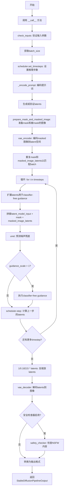
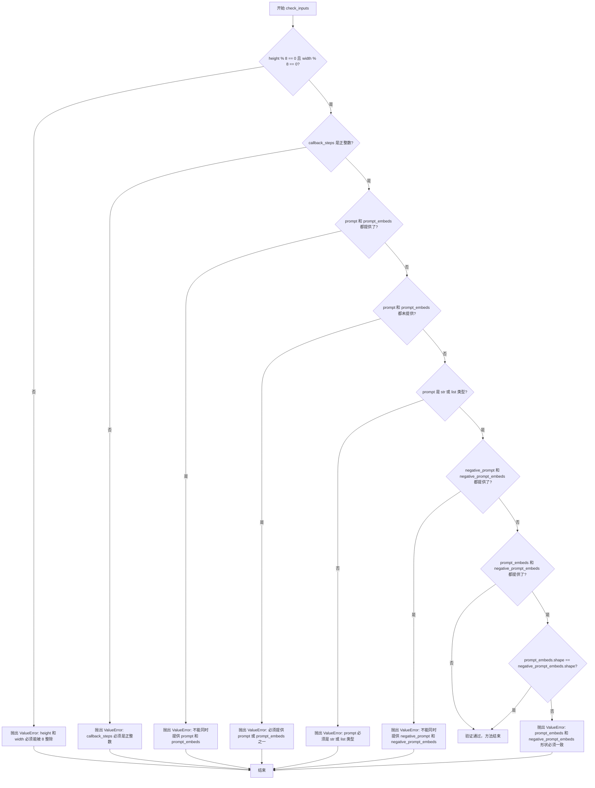
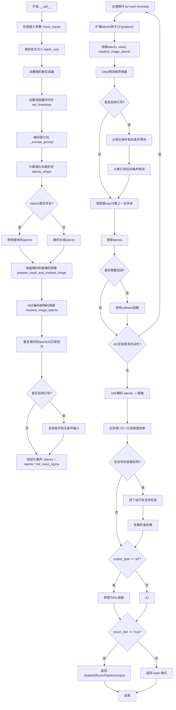

# `diffusers\src\diffusers\pipelines\stable_diffusion\pipeline_onnx_stable_diffusion_inpaint.py` 详细设计文档

一个基于ONNX Runtime的Stable Diffusion图像修复（Inpainting）管道，通过文本提示引导图像修复过程，使用VAE编码器/解码器、文本编码器、U-Net和调度器实现图像生成与修复。

## 整体流程



## 类结构

```
DiffusionPipeline (基类)
└── OnnxStableDiffusionInpaintPipeline
```

## 全局变量及字段


### `NUM_UNET_INPUT_CHANNELS`
    
U-Net输入通道数(9)

类型：`int`
    


### `NUM_LATENT_CHANNELS`
    
Latent通道数(4)

类型：`int`
    


### `logger`
    
日志记录器

类型：`logging.Logger`
    


### `OnnxStableDiffusionInpaintPipeline.vae_encoder`
    
VAE编码器模型

类型：`OnnxRuntimeModel`
    


### `OnnxStableDiffusionInpaintPipeline.vae_decoder`
    
VAE解码器模型

类型：`OnnxRuntimeModel`
    


### `OnnxStableDiffusionInpaintPipeline.text_encoder`
    
文本编码器ONNX模型

类型：`OnnxRuntimeModel`
    


### `OnnxStableDiffusionInpaintPipeline.tokenizer`
    
CLIP分词器

类型：`CLIPTokenizer`
    


### `OnnxStableDiffusionInpaintPipeline.unet`
    
条件U-Net去噪模型

类型：`OnnxRuntimeModel`
    


### `OnnxStableDiffusionInpaintPipeline.scheduler`
    
噪声调度器

类型：`DDIMScheduler | PNDMScheduler | LMSDiscreteScheduler`
    


### `OnnxStableDiffusionInpaintPipeline.safety_checker`
    
安全检查器模型

类型：`OnnxRuntimeModel`
    


### `OnnxStableDiffusionInpaintPipeline.feature_extractor`
    
图像特征提取器

类型：`CLIPImageProcessor`
    


### `OnnxStableDiffusionInpaintPipeline._optional_components`
    
可选组件列表

类型：`list`
    


### `OnnxStableDiffusionInpaintPipeline._is_onnx`
    
ONNX标志

类型：`bool`
    
    

## 全局函数及方法


### `prepare_mask_and_masked_image`

该函数用于将输入的原始图像和掩码图像转换为适用于Stable Diffusion图像修复（inpainting）流程的numpy数组格式，包括图像的归一化、掩码的生成以及掩码图像的创建。

参数：

- `image`：`PIL.Image.Image`，原始RGB图像，将被修复的目标图像
- `mask`：`PIL.Image.Image`，掩码图像，白色像素表示需要重绘的区域，黑色像素表示保留的区域
- `latents_shape`：`tuple`，潜在空间的形状，通常为(height//8, width//8)，用于确定输出尺寸

返回值：

- `mask`：`numpy.ndarray`，形状为(1, 1, H, W)的二值掩码数组，值为0或1
- `masked_image`：`numpy.ndarray`，形状为(1, C, H, W)的被掩码处理的图像数组，值域为[-1, 1]

#### 流程图

```mermaid
flowchart TD
    A[开始: prepare_mask_and_masked_image] --> B[将image转换为RGB并resize到latents_shape[1]*8, latents_shape[0]*8]
    B --> C[转换为numpy数组并调整维度: [H,W,C] -> [C,H,W]]
    C --> D[归一化: 除以127.5并减1, 值域[-1, 1]
    D --> E[将mask转换为灰度并resize到latents_shape[1]*8, latents_shape[0]*8]
    E --> F[生成masked_image: image * mask像素值&lt;127.5的位置保留]
    F --> G[将mask resize到latents_shape大小]
    G --> H[转换为灰度numpy数组]
    H --> I[归一化: 除以255.0, 值域[0, 1]
    I --> J[调整维度: 添加batch和channel维度]
    J --> K[二值化处理: mask&lt;0.5设为0, mask>=0.5设为1]
    K --> L[返回: mask, masked_image]
```

#### 带注释源码

```python
def prepare_mask_and_masked_image(image, mask, latents_shape):
    """
    准备mask和被mask的图像数组，用于Stable Diffusion图像修复
    
    参数:
        image: PIL.Image.Image - 原始RGB图像
        mask: PIL.Image.Image - 掩码图像
        latents_shape: tuple - 潜在空间形状 (height//8, width//8)
    
    返回:
        mask: numpy.ndarray - 二值掩码 (1, 1, H, W)
        masked_image: numpy.ndarray - 被掩码的图像 (C, H, W)
    """
    
    # 第一步: 处理原始图像
    # 将图像转换为RGB模式并resize到latents_shape的8倍大小
    # 因为latents是原图的1/8，所以这里要放大8倍
    image = np.array(image.convert("RGB").resize((latents_shape[1] * 8, latents_shape[0] * 8)))
    
    # 调整维度顺序: 从 (H, W, C) 转换为 (C, H, W)
    # [None] 添加batch维度，transpose重新排列维度
    image = image[None].transpose(0, 3, 1, 2)
    
    # 归一化到 [-1, 1] 范围 (Stable Diffusion的标准输入范围)
    # 原始 uint8 [0, 255] -> float32 [0, 1] -> [-1, 1]
    image = image.astype(np.float32) / 127.5 - 1.0
    
    # 第二步: 创建被mask的图像
    # 将mask转换为灰度并resize到与image相同的大小
    image_mask = np.array(mask.convert("L").resize((latents_shape[1] * 8, latents_shape[0] * 8)))
    
    # 应用mask: 黑色像素(<127.5)保留原图像素，白色像素(>=127.5)设为0
    # 这样在修复区域会显示为黑色（待重绘）
    masked_image = image * (image_mask < 127.5)
    
    # 第三步: 处理mask用于UNet输入
    # 将mask resize到latents_shape大小（不需要8倍，因为UNet处理的是latent空间）
    mask = mask.resize((latents_shape[1], latents_shape[0]), PIL_INTERPOLATION["nearest"])
    
    # 转换为灰度numpy数组
    mask = np.array(mask.convert("L"))
    
    # 归一化到 [0, 1] 范围
    mask = mask.astype(np.float32) / 255.0
    
    # 添加batch和channel维度: (H, W) -> (1, 1, H, W)
    mask = mask[None, None]
    
    # 二值化处理: 低于0.5设为0，高于或等于0.5设为1
    # 这确保了mask是严格的黑白二值图
    mask[mask < 0.5] = 0
    mask[mask >= 0.5] = 1
    
    # 返回处理后的mask和masked_image
    return mask, masked_image
```


### `OnnxStableDiffusionInpaintPipeline.__init__`

初始化OnnxStableDiffusionInpaintPipeline管道，设置所有必需的组件（包括VAE编码器/解码器、文本编码器、分词器、UNet、调度器和安全检查器），并验证调度器配置参数。

参数：

- `vae_encoder`：`OnnxRuntimeModel`，用于将图像编码到潜在空间的VAE编码器ONNX模型
- `vae_decoder`：`OnnxRuntimeModel`，用于将潜在表示解码回图像的VAE解码器ONNX模型
- `text_encoder`：`OnnxRuntimeModel`，用于将文本提示编码为嵌入的CLIP文本编码器ONNX模型
- `tokenizer`：`CLIPTokenizer`，用于将文本提示分词的CLIP分词器
- `unet`：`OnnxRuntimeModel`，用于去噪图像潜在表示的条件U-Net ONNX模型
- `scheduler`：`DDIMScheduler | PNDMScheduler | LMSDiscreteScheduler`，与UNet结合使用去噪图像潜在表示的调度器
- `safety_checker`：`OnnxRuntimeModel`，用于评估生成图像是否包含不当或有害内容的稳定扩散安全检查器ONNX模型
- `feature_extractor`：`CLIPImageProcessor`，用于从生成图像中提取特征作为安全检查器输入的CLIP图像处理器
- `requires_safety_checker`：`bool`（默认值：`True`），指示是否需要安全检查器的布尔标志

返回值：`None`，该方法不返回值，仅初始化对象状态

#### 流程图

```mermaid
flowchart TD
    A[__init__ 开始] --> B[调用 super().__init__]
    B --> C{scheduler.config.steps_offset != 1?}
    C -->|是| D[输出deprecation警告并修正steps_offset为1]
    C -->|否| E{scheduler.config.clip_sample == True?}
    D --> E
    E -->|是| F[输出deprecation警告并设置clip_sample为False]
    E -->|否| G{safety_checker is None and requires_safety_checker?}
    F --> G
    G -->|是| H[输出安全检查器禁用的警告]
    G -->|否| I{safety_checker is not None and feature_extractor is None?}
    H --> J
    I -->|是| K[抛出ValueError异常]
    I -->|否| J
    K --> L[异常: 必须定义feature_extractor]
    J --> M[register_modules: 注册所有组件]
    M --> N[register_to_config: 注册requires_safety_checker]
    N --> O[__init__ 结束]
```

#### 带注释源码

```python
def __init__(
    self,
    vae_encoder: OnnxRuntimeModel,          # VAE编码器ONNX模型
    vae_decoder: OnnxRuntimeModel,          # VAE解码器ONNX模型
    text_encoder: OnnxRuntimeModel,          # CLIP文本编码器ONNX模型
    tokenizer: CLIPTokenizer,               # CLIP分词器
    unet: OnnxRuntimeModel,                  # 条件U-Net ONNX模型
    scheduler: DDIMScheduler | PNDMScheduler | LMSDiscreteScheduler,  # 去噪调度器
    safety_checker: OnnxRuntimeModel,        # 安全检查器ONNX模型
    feature_extractor: CLIPImageProcessor,  # CLIP图像处理器
    requires_safety_checker: bool = True,   # 是否需要安全检查器标志
):
    # 调用父类DiffusionPipeline的初始化方法
    super().__init__()
    
    # 记录该管道是实验性功能的警告日志
    logger.info("`OnnxStableDiffusionInpaintPipeline` is experimental and will very likely change in the future.")

    # 检查调度器的steps_offset配置是否为1，若不是则发出警告并修正
    if scheduler is not None and getattr(scheduler.config, "steps_offset", 1) != 1:
        deprecation_message = (
            f"The configuration file of this scheduler: {scheduler} is outdated. `steps_offset`"
            f" should be set to 1 instead of {scheduler.config.steps_offset}. Please make sure "
            "to update the config accordingly as leaving `steps_offset` might led to incorrect results"
            " in future versions. If you have downloaded this checkpoint from the Hugging Face Hub,"
            " it would be very nice if you could open a Pull request for the `scheduler/scheduler_config.json`"
            " file"
        )
        deprecate("steps_offset!=1", "1.0.0", deprecation_message, standard_warn=False)
        new_config = dict(scheduler.config)
        new_config["steps_offset"] = 1
        scheduler._internal_dict = FrozenDict(new_config)

    # 检查调度器的clip_sample配置是否为True，若是则发出警告并修正为False
    if scheduler is not None and getattr(scheduler.config, "clip_sample", False) is True:
        deprecation_message = (
            f"The configuration file of this scheduler: {scheduler} has not set the configuration `clip_sample`."
            " `clip_sample` should be set to False in the configuration file. Please make sure to update the"
            " config accordingly as not setting `clip_sample` in the config might lead to incorrect results in"
            " future versions. If you have downloaded this checkpoint from the Hugging Face Hub, it would be very"
            " nice if you could open a Pull request for the `scheduler/scheduler_config.json` file"
        )
        deprecate("clip_sample not set", "1.0.0", deprecation_message, standard_warn=False)
        new_config = dict(scheduler.config)
        new_config["clip_sample"] = False
        scheduler._internal_dict = FrozenDict(new_config)

    # 如果safety_checker为None但requires_safety_checker为True，发出警告
    if safety_checker is None and requires_safety_checker:
        logger.warning(
            f"You have disabled the safety checker for {self.__class__} by passing `safety_checker=None`. Ensure"
            " that you abide to the conditions of the Stable Diffusion license and do not expose unfiltered"
            " results in services or applications open to the public. Both the diffusers team and Hugging Face"
            " strongly recommend to keep the safety filter enabled in all public facing circumstances, disabling"
            " it only for use-cases that involve analyzing network behavior or auditing its results. For more"
            " information, please have a look at https://github.com/huggingface/diffusers/pull/254 ."
        )

    # 如果safety_checker不为None但feature_extractor为None，抛出ValueError异常
    if safety_checker is not None and feature_extractor is None:
        raise ValueError(
            "Make sure to define a feature extractor when loading {self.__class__} if you want to use the safety"
            " checker. If you do not want to use the safety checker, you can pass `'safety_checker=None'` instead."
        )

    # 注册所有模块到管道中
    self.register_modules(
        vae_encoder=vae_encoder,
        vae_decoder=vae_decoder,
        text_encoder=text_encoder,
        tokenizer=tokenizer,
        unet=unet,
        scheduler=scheduler,
        safety_checker=safety_checker,
        feature_extractor=feature_extractor,
    )
    
    # 将requires_safety_checker配置注册到管道的配置中
    self.register_to_config(requires_safety_checker=requires_safety_checker)
```


### `OnnxStableDiffusionInpaintPipeline._encode_prompt`

将文本提示词（prompt）编码为文本嵌入向量（text embeddings），供后续图像生成使用。该方法支持批量处理、提示词复制以及无分类器自由引导（Classifier-Free Guidance）所需的负面提示词嵌入计算。

参数：

- `self`：`OnnxStableDiffusionInpaintPipeline` 实例本身
- `prompt`：`str | list[str]`，要编码的文本提示词，可以是单个字符串或字符串列表
- `num_images_per_prompt`：`int | None`，每个提示词要生成的图像数量，用于复制文本嵌入
- `do_classifier_free_guidance`：`bool`，是否启用无分类器自由引导
- `negative_prompt`：`str | None`，负面提示词，用于引导生成时排除相关内容
- `prompt_embeds`：`np.ndarray | None = None`，可选的预计算文本嵌入，如提供则直接使用
- `negative_prompt_embeds`：`np.ndarray | None = None`，可选的预计算负面文本嵌入

返回值：`np.ndarray`，编码后的文本嵌入向量，形状为 `[batch_size * num_images_per_prompt, seq_len, hidden_dim]`，如果启用 CFG 则在第一维度包含级联的无条件嵌入和条件嵌入

#### 流程图

```mermaid
flowchart TD
    A[开始 _encode_prompt] --> B{判断 prompt 类型}
    B -->|str| C[batch_size = 1]
    B -->|list| D[batch_size = len(prompt)]
    B -->|其他| E[batch_size = prompt_embeds.shape[0]]
    
    C --> F{prompt_embeds 是否为 None}
    D --> F
    E --> F
    
    F -->|是| G[调用 tokenizer 处理 prompt]
    G --> H[检查是否被截断]
    H --> I[调用 text_encoder 生成嵌入]
    F -->|否| J[使用传入的 prompt_embeds]
    
    I --> K[根据 num_images_per_prompt 复制 prompt_embeds]
    J --> K
    
    K --> L{是否启用 CFG 且 negative_prompt_embeds 为 None}
    
    L -->|是| M{negative_prompt 是否为 None}
    M -->|是| N[uncond_tokens = [''] * batch_size]
    M -->|否| O{negative_prompt 类型检查}
    O -->|str| P[uncond_tokens = [negative_prompt] * batch_size]
    O -->|list| Q{长度匹配检查}
    Q -->|匹配| R[uncond_tokens = negative_prompt]
    Q -->|不匹配| S[抛出 ValueError]
    M -->|类型不匹配| T[抛出 TypeError]
    
    N --> U[调用 tokenizer 处理 uncond_tokens]
    P --> U
    R --> U
    T --> U
    
    U --> V[调用 text_encoder 生成 negative_prompt_embeds]
    L -->|否| W[跳过negative embedding计算]
    
    V --> X{启用 CFG?}
    W --> X
    
    X -->|是| Y[复制 negative_prompt_embeds]
    Y --> Z[级联: np.concatenate([negative_prompt_embeds, prompt_embeds])]
    X -->|否| AA[直接返回 prompt_embeds]
    
    Z --> AB[返回最终嵌入]
    AA --> AB
    
    style S fill:#ffcccc
    style T fill:#ffcccc
```

#### 带注释源码

```python
def _encode_prompt(
    self,
    prompt: str | list[str],
    num_images_per_prompt: int | None,
    do_classifier_free_guidance: bool,
    negative_prompt: str | None,
    prompt_embeds: np.ndarray | None = None,
    negative_prompt_embeds: np.ndarray | None = None,
):
    r"""
    Encodes the prompt into text encoder hidden states.

    Args:
        prompt (`str` or `list[str]`):
            prompt to be encoded
        num_images_per_prompt (`int`):
            number of images that should be generated per prompt
        do_classifier_free_guidance (`bool`):
            whether to use classifier free guidance or not
        negative_prompt (`str` or `list[str]`):
            The prompt or prompts not to guide the image generation. Ignored when not using guidance (i.e., ignored
            if `guidance_scale` is less than `1`).
        prompt_embeds (`np.ndarray`, *optional*):
            Pre-generated text embeddings. Can be used to easily tweak text inputs, *e.g.* prompt weighting. If not
            provided, text embeddings will be generated from `prompt` input argument.
        negative_prompt_embeds (`np.ndarray`, *optional*):
            Pre-generated negative text embeddings. Can be used to easily tweak text inputs, *e.g.* prompt
            weighting. If not provided, negative_prompt_embeds will be generated from `negative_prompt` input
            argument.
    """
    # Step 1: 确定批次大小
    # 根据 prompt 的类型确定 batch_size：字符串为1，列表为长度，否则使用 prompt_embeds 的形状
    if prompt is not None and isinstance(prompt, str):
        batch_size = 1
    elif prompt is not None and isinstance(prompt, list):
        batch_size = len(prompt)
    else:
        batch_size = prompt_embeds.shape[0]

    # Step 2: 如果未提供预计算的 prompt_embeds，则从 prompt 生成
    if prompt_embeds is None:
        # 使用 tokenizer 将文本转换为 token IDs
        text_inputs = self.tokenizer(
            prompt,
            padding="max_length",
            max_length=self.tokenizer.model_max_length,
            truncation=True,
            return_tensors="np",
        )
        text_input_ids = text_inputs.input_ids
        
        # 获取未截断的 token IDs，用于检测是否有内容被截断
        untruncated_ids = self.tokenizer(prompt, padding="max_length", return_tensors="np").input_ids

        # 检查并警告用户是否有内容被截断
        if not np.array_equal(text_input_ids, untruncated_ids):
            removed_text = self.tokenizer.batch_decode(
                untruncated_ids[:, self.tokenizer.model_max_length - 1 : -1]
            )
            logger.warning(
                "The following part of your input was truncated because CLIP can only handle sequences up to"
                f" {self.tokenizer.model_max_length} tokens: {removed_text}"
            )

        # 调用 text_encoder 模型生成文本嵌入
        prompt_embeds = self.text_encoder(input_ids=text_input_ids.astype(np.int32))[0]

    # Step 3: 根据 num_images_per_prompt 复制 prompt_embeds 以生成多张图像
    prompt_embeds = np.repeat(prompt_embeds, num_images_per_prompt, axis=0)

    # Step 4: 处理无分类器自由引导（CFG）的负面提示词嵌入
    # 如果启用 CFG 且未提供 negative_prompt_embeds，则生成无条件嵌入
    if do_classifier_free_guidance and negative_prompt_embeds is None:
        uncond_tokens: list[str]
        
        # 处理 negative_prompt 为空的情况，使用空字符串
        if negative_prompt is None:
            uncond_tokens = [""] * batch_size
        # 类型检查：negative_prompt 应与 prompt 类型一致
        elif type(prompt) is not type(negative_prompt):
            raise TypeError(
                f"`negative_prompt` should be the same type to `prompt`, but got {type(negative_prompt)} !="
                f" {type(prompt)}."
            )
        # 字符串类型，复制 batch_size 份
        elif isinstance(negative_prompt, str):
            uncond_tokens = [negative_prompt] * batch_size
        # 列表类型，检查批次大小是否匹配
        elif batch_size != len(negative_prompt):
            raise ValueError(
                f"`negative_prompt`: {negative_prompt} has batch size {len(negative_prompt)}, but `prompt`:"
                f" {prompt} has batch size {batch_size}. Please make sure that passed `negative_prompt` matches"
                " the batch size of `prompt`."
            )
        else:
            uncond_tokens = negative_prompt

        # 获取序列长度
        max_length = prompt_embeds.shape[1]
        
        # 对负面提示词进行 tokenize
        uncond_input = self.tokenizer(
            uncond_tokens,
            padding="max_length",
            max_length=max_length,
            truncation=True,
            return_tensors="np",
        )
        
        # 生成负面提示词的文本嵌入
        negative_prompt_embeds = self.text_encoder(input_ids=uncond_input.input_ids.astype(np.int32))[0]

    # Step 5: 如果启用 CFG，复制 negative_prompt_embeds 并与 prompt_embeds 级联
    if do_classifier_free_guidance:
        # 复制负面嵌入以匹配生成的图像数量
        negative_prompt_embeds = np.repeat(negative_prompt_embeds, num_images_per_prompt, axis=0)

        # 对于 CFG，需要同时输入无条件嵌入和条件嵌入
        # 将无条件嵌入（前面）和条件嵌入（后面）级联在一起
        # 这样可以在一次前向传播中同时计算两种预测
        prompt_embeds = np.concatenate([negative_prompt_embeds, prompt_embeds])

    # Step 6: 返回最终的文本嵌入
    return prompt_embeds
```


### `OnnxStableDiffusionInpaintPipeline.check_inputs`

验证输入参数的有效性，确保传入的参数符合管道要求。如果参数无效，则抛出相应的 ValueError 异常。

参数：

- `self`：隐式参数，管道实例本身
- `prompt`：`str | list[str]`，要引导图像生成的提示词或提示词列表
- `height`：`int | None`，生成图像的高度（像素），必须能被 8 整除
- `width`：`int | None`，生成图像的宽度（像素），必须能被 8 整除
- `callback_steps`：`int`，推理过程中调用回调函数的频率，必须为正整数
- `negative_prompt`：`str | list[str] | None`，不引导图像生成的提示词，默认为 None
- `prompt_embeds`：`np.ndarray | None`，预生成的文本嵌入，默认为 None
- `negative_prompt_embeds`：`np.ndarray | None`，预生成的负面文本嵌入，默认为 None

返回值：`None`，该方法不返回值，仅进行参数验证

#### 流程图



#### 带注释源码

```python
def check_inputs(
    self,
    prompt: str | list[str],
    height: int | None,
    width: int | None,
    callback_steps: int,
    negative_prompt: str | None = None,
    prompt_embeds: np.ndarray | None = None,
    negative_prompt_embeds: np.ndarray | None = None,
):
    """
    验证输入参数的有效性。

    Args:
        prompt: 引导图像生成的文本提示
        height: 生成图像的高度
        width: 生成图像的宽度
        callback_steps: 回调函数调用频率
        negative_prompt: 负面提示词
        prompt_embeds: 预计算的提示词嵌入
        negative_prompt_embeds: 预计算的负面提示词嵌入
    """
    # 验证图像尺寸必须能被 8 整除（因为 VAE 编码器会将图像缩小 8 倍）
    if height % 8 != 0 or width % 8 != 0:
        raise ValueError(f"`height` and `width` have to be divisible by 8 but are {height} and {width}.")

    # 验证 callback_steps 必须是正整数
    if (callback_steps is None) or (
        callback_steps is not None and (not isinstance(callback_steps, int) or callback_steps <= 0)
    ):
        raise ValueError(
            f"`callback_steps` has to be a positive integer but is {callback_steps} of type"
            f" {type(callback_steps)}."
        )

    # 验证 prompt 和 prompt_embeds 不能同时提供（互斥参数）
    if prompt is not None and prompt_embeds is not None:
        raise ValueError(
            f"Cannot forward both `prompt`: {prompt} and `prompt_embeds`: {prompt_embeds}. Please make sure to"
            " only forward one of the two."
        )
    # 验证至少提供一个生成提示
    elif prompt is None and prompt_embeds is None:
        raise ValueError(
            "Provide either `prompt` or `prompt_embeds`. Cannot leave both `prompt` and `prompt_embeds` undefined."
        )
    # 验证 prompt 的类型必须是 str 或 list
    elif prompt is not None and (not isinstance(prompt, str) and not isinstance(prompt, list)):
        raise ValueError(f"`prompt` has to be of type `str` or `list` but is {type(prompt)}")

    # 验证 negative_prompt 和 negative_prompt_embeds 不能同时提供
    if negative_prompt is not None and negative_prompt_embeds is not None:
        raise ValueError(
            f"Cannot forward both `negative_prompt`: {negative_prompt} and `negative_prompt_embeds`:"
            f" {negative_prompt_embeds}. Please make sure to only forward one of the two."
        )

    # 如果两者都提供了，验证形状必须一致
    if prompt_embeds is not None and negative_prompt_embeds is not None:
        if prompt_embeds.shape != negative_prompt_embeds.shape:
            raise ValueError(
                "`prompt_embeds` and `negative_prompt_embeds` must have the same shape when passed directly, but"
                f" got: `prompt_embeds` {prompt_embeds.shape} != `negative_prompt_embeds`"
                f" {negative_prompt_embeds.shape}."
            )
```


### `OnnxStableDiffusionInpaintPipeline.__call__`

主推理方法，执行图像修复（Inpainting）任务。根据文本提示词、原始图像和掩码图像，通过去噪过程生成修复后的图像。该方法是管道的核心入口点，协调各个组件完成从文本到图像的生成过程。

参数：

- `prompt`：`str | list[str]`，引导图像生成的文本提示词
- `image`：`PIL.Image.Image`，需要修复的原始图像，将被掩码覆盖后根据提示词重新生成
- `mask_image`：`PIL.Image.Image`，掩码图像，白色像素区域将被重新绘制，黑色像素保留
- `height`：`int | None`，生成图像的高度（像素），默认512
- `width`：`int | None`，生成图像的宽度（像素），默认512
- `num_inference_steps`：`int`，去噪迭代步数，越多图像质量越高但推理越慢，默认50
- `guidance_scale`：`float`，分类器自由引导比例，>1时启用引导，默认7.5
- `negative_prompt`：`str | list[str] | None`，不引导图像生成的负面提示词
- `num_images_per_prompt`：`int`，每个提示词生成的图像数量，默认1
- `eta`：`float`，DDIM调度器的eta参数，控制随机性，仅DDIM调度器有效，默认0.0
- `generator`：`np.random.RandomState | None`，随机数生成器，用于确保可重复性
- `latents`：`np.ndarray | None`，预生成的噪声潜在向量，可用于相同提示词的不同生成
- `prompt_embeds`：`np.ndarray | None`，预生成的文本嵌入，用于提示词加权等微调
- `negative_prompt_embeds`：`np.ndarray | None`，预生成的负面文本嵌入
- `output_type`：`str | None`，输出格式，"pil"返回PIL图像，否则返回numpy数组，默认"pil"
- `return_dict`：`bool`，是否返回字典格式而非元组，默认True
- `callback`：`Callable[[int, int, np.ndarray], None] | None`，每步推理的回调函数
- `callback_steps`：`int`，回调函数调用频率，每隔多少步调用一次，默认1

返回值：`StableDiffusionPipelineOutput | tuple`，返回生成的图像列表和NSFW检测结果布尔列表的元组，或包含`images`和`nsfw_content_detected`字段的输出对象

#### 流程图



#### 带注释源码

```python
@torch.no_grad()
def __call__(
    self,
    prompt: str | list[str],                     # 文本提示词
    image: PIL.Image.Image,                      # 待修复的输入图像
    mask_image: PIL.Image.Image,                 # 掩码图像
    height: int | None = 512,                    # 输出高度
    width: int | None = 512,                     # 输出宽度
    num_inference_steps: int = 50,               # 去噪步数
    guidance_scale: float = 7.5,                 # 引导比例
    negative_prompt: str | list[str] | None = None,  # 负面提示词
    num_images_per_prompt: int | None = 1,       # 每提示词生成数
    eta: float = 0.0,                            # DDIM eta参数
    generator: np.random.RandomState | None = None,  # 随机生成器
    latents: np.ndarray | None = None,           # 预定义潜在向量
    prompt_embeds: np.ndarray | None = None,     # 预定义提示词嵌入
    negative_prompt_embeds: np.ndarray | None = None,  # 预定义负面嵌入
    output_type: str | None = "pil",             # 输出格式
    return_dict: bool = True,                    # 返回格式
    callback: Callable[[int, int, np.ndarray], None] | None = None,  # 回调函数
    callback_steps: int = 1,                     # 回调频率
):
    # 1. 检查输入参数合法性
    self.check_inputs(
        prompt, height, width, callback_steps, negative_prompt, prompt_embeds, negative_prompt_embeds
    )

    # 2. 确定批次大小（根据提示词类型或预定义嵌入）
    if prompt is not None and isinstance(prompt, str):
        batch_size = 1
    elif prompt is not None and isinstance(prompt, list):
        batch_size = len(prompt)
    else:
        batch_size = prompt_embeds.shape[0]

    # 3. 设置随机数生成器（默认使用numpy全局随机状态）
    if generator is None:
        generator = np.random

    # 4. 配置调度器的时间步序列
    self.scheduler.set_timesteps(num_inference_steps)

    # 5. 判断是否启用分类器自由引导（CFG）
    do_classifier_free_guidance = guidance_scale > 1.0

    # 6. 编码提示词为文本嵌入
    prompt_embeds = self._encode_prompt(
        prompt,
        num_images_per_prompt,
        do_classifier_free_guidance,
        negative_prompt,
        prompt_embeds=prompt_embeds,
        negative_prompt_embeds=negative_prompt_embeds,
    )

    # 7. 计算潜在向量维度（图像尺寸除以8，因为VAE下采样8倍）
    num_channels_latents = NUM_LATENT_CHANNELS  # 4
    latents_shape = (batch_size * num_images_per_prompt, num_channels_latents, height // 8, width // 8)
    latents_dtype = prompt_embeds.dtype

    # 8. 初始化或验证潜在向量
    if latents is None:
        latents = generator.randn(*latents_shape).astype(latents_dtype)  # 随机噪声
    else:
        if latents.shape != latents_shape:
            raise ValueError(f"Unexpected latents shape, got {latents.shape}, expected {latents_shape}")

    # 9. 预处理掩码和被掩码图像
    mask, masked_image = prepare_mask_and_masked_image(image, mask_image, latents_shape[-2:])
    mask = mask.astype(latents.dtype)
    masked_image = masked_image.astype(latents.dtype)

    # 10. VAE编码被掩码图像为潜在表示
    masked_image_latents = self.vae_encoder(sample=masked_image)[0]
    masked_image_latents = 0.18215 * masked_image_latents  # VAE缩放因子

    # 11. 为每个提示词复制掩码和编码后的图像latents
    mask = mask.repeat(batch_size * num_images_per_prompt, 0)
    masked_image_latents = masked_image_latents.repeat(batch_size * num_images_per_prompt, 0)

    # 12. 如果启用CFG，复制条件和无条件输入
    mask = np.concatenate([mask] * 2) if do_classifier_free_guidance else mask
    masked_image_latents = (
        np.concatenate([masked_image_latents] * 2) if do_classifier_free_guidance else masked_image_latents
    )

    # 13. 验证UNet输入通道数配置正确
    num_channels_mask = mask.shape[1]
    num_channels_masked_image = masked_image_latents.shape[1]
    unet_input_channels = NUM_UNET_INPUT_CHANNELS  # 9
    if num_channels_latents + num_channels_mask + num_channels_masked_image != unet_input_channels:
        raise ValueError("Incorrect configuration settings! ...")

    # 14. 重新设置时间步（确保一致性）
    self.scheduler.set_timesteps(num_inference_steps)

    # 15. 根据调度器要求缩放初始噪声
    latents = latents * self.scheduler.init_noise_sigma

    # 16. 准备调度器额外参数（eta仅DDIM使用）
    accepts_eta = "eta" in set(inspect.signature(self.scheduler.step).parameters.keys())
    extra_step_kwargs = {}
    if accepts_eta:
        extra_step_kwargs["eta"] = eta

    # 17. 确定时间步数据类型（适配ONNX Runtime）
    timestep_dtype = next(
        (input.type for input in self.unet.model.get_inputs() if input.name == "timestep"), "tensor(float)"
    )
    timestep_dtype = ORT_TO_NP_TYPE[timestep_dtype]

    # 18. 主去噪循环
    for i, t in enumerate(self.progress_bar(self.scheduler.timesteps)):
        # 扩展latents用于CFG
        latent_model_input = np.concatenate([latents] * 2) if do_classifier_free_guidance else latents
        
        # 拼接latents、mask和编码后的图像作为UNet输入
        latent_model_input = self.scheduler.scale_model_input(torch.from_numpy(latent_model_input), t)
        latent_model_input = latent_model_input.cpu().numpy()
        latent_model_input = np.concatenate([latent_model_input, mask, masked_image_latents], axis=1)

        # UNet预测噪声残差
        timestep = np.array([t], dtype=timestep_dtype)
        noise_pred = self.unet(sample=latent_model_input, timestep=timestep, encoder_hidden_states=prompt_embeds)[0]

        # 执行分类器自由引导
        if do_classifier_free_guidance:
            noise_pred_uncond, noise_pred_text = np.split(noise_pred, 2)
            noise_pred = noise_pred_uncond + guidance_scale * (noise_pred_text - noise_pred_uncond)

        # 调度器计算上一步的潜在向量
        scheduler_output = self.scheduler.step(
            torch.from_numpy(noise_pred), t, torch.from_numpy(latents), **extra_step_kwargs
        )
        latents = scheduler_output.prev_sample.numpy()

        # 调用回调函数（如果提供）
        if callback is not None and i % callback_steps == 0:
            step_idx = i // getattr(self.scheduler, "order", 1)
            callback(step_idx, t, latents)

    # 19. 反缩放latents并VAE解码为图像
    latents = 1 / 0.18215 * latents
    # 逐个解码以避免半精度VAE解码异常
    image = np.concatenate(
        [self.vae_decoder(latent_sample=latents[i : i + 1])[0] for i in range(latents.shape[0])]
    )

    # 20. 后处理：归一化到[0,1]并转换维度顺序
    image = np.clip(image / 2 + 0.5, 0, 1)
    image = image.transpose((0, 2, 3, 1))

    # 21. 安全性检查
    if self.safety_checker is not None:
        safety_checker_input = self.feature_extractor(
            self.numpy_to_pil(image), return_tensors="np"
        ).pixel_values.astype(image.dtype)
        
        # 逐个检查（因为检查器不支持批处理）
        images, has_nsfw_concept = [], []
        for i in range(image.shape[0]):
            image_i, has_nsfw_concept_i = self.safety_checker(
                clip_input=safety_checker_input[i : i + 1], images=image[i : i + 1]
            )
            images.append(image_i)
            has_nsfw_concept.append(has_nsfw_concept_i[0])
        image = np.concatenate(images)
    else:
        has_nsfw_concept = None

    # 22. 转换为目标输出格式
    if output_type == "pil":
        image = self.numpy_to_pil(image)

    # 23. 返回结果
    if not return_dict:
        return (image, has_nsfw_concept)

    return StableDiffusionPipelineOutput(images=image, nsfw_content_detected=has_nsfw_concept)
```

## 关键组件


### 张量索引与批处理

代码中使用 numpy 数组进行张量索引和批处理操作。主要包括：使用 `.repeat()` 方法复制 mask 和 masked_image_latents 以匹配每 prompt 生成的图像数量；使用 `np.concatenate()` 在通道维度上连接潜在表示、mask 和被遮罩的图像 latent；在 classifier-free guidance 模式下将 latents 复制两份以同时预测有条件和无条件噪声。

### 惰性加载模式

该 Pipeline 采用惰性加载设计：ONNX 模型（vae_encoder、vae_decoder、text_encoder、unet、safety_checker）在 `__init__` 中注册但不立即执行推理；实际的图像生成逻辑延迟到 `__call__` 方法被调用时才执行；文本嵌入（prompt_embeds）支持预计算并通过参数传入，避免重复编码。

### Mask 与图像预处理

`prepare_mask_and_masked_image` 函数负责将 PIL 图像和 mask 转换为适合模型输入的格式。该函数将图像 resize 到 latent 空间的 8 倍尺寸（因为 VAE 通常将图像缩小 8 倍），将图像像素值归一化到 [-1, 1]，将 mask 转换为单通道并二值化（阈值 0.5），同时保留被遮罩区域的原始图像内容用于后续的图像修复任务。

### Scheduler 配置与兼容性检查

在初始化时，Pipeline 会对 scheduler 配置进行兼容性检查和自动修复。如果检测到 `steps_offset != 1` 或 `clip_sample` 未正确设置，会发出警告并自动修正配置为推荐值，确保 DDIMScheduler、LMSDiscreteScheduler 和 PNDMScheduler 的兼容性。

### VAE 编码与潜在空间操作

使用 VAE encoder 将 masked image 编码到潜在空间，并通过常数 0.18215 进行缩放（这是 Stable Diffusion 原始训练时使用的 VAE 缩放因子）；在去噪完成后，使用逆缩放因子 1/0.18215 恢复潜在表示，然后通过 VAE decoder 解码为图像。

### 安全检查器批处理

代码中的 safety_checker 不支持批处理输入，因此采用循环方式逐个处理图像：`for i in range(image.shape[0])` 对每张图像单独调用 safety_checker，然后将结果拼接。这种设计反映了早期 ONNX 安全检查器模型的限制。

### 回调机制与进度监控

Pipeline 支持通过 `callback` 参数在每个去噪步骤后执行自定义回调函数。回调频率由 `callback_steps` 控制，步骤索引通过 `i // getattr(self.scheduler, "order", 1)` 计算，以兼容不同类型的 scheduler 实现。


## 问题及建议


### 已知问题

-   **硬编码的VAE缩放因子**: 代码中多处使用硬编码值 `0.18215`（如 `masked_image_latents = 0.18215 * masked_image_latents` 和 `latents = 1 / 0.18215 * latents`），该值应作为类常量或配置参数提取，以提高可维护性。
-   **f-string语法错误**: 在 `__init__` 方法的错误提示中使用了 `"{self.__class__}"` 而非 `f"{{self.__class__}}"` 或正确的f-string语法，导致字符串不会被正确格式化。
-   **性能效率低下**: VAE解码器在批处理大于1时存在已知问题，代码使用 `np.concatenate` 配合循环逐个处理图像（`for i in range(latents.shape[0])`），这种方式效率较低，应寻求批量处理的解决方案。
-   **数据格式转换冗余**: 代码在numpy和PyTorch张量之间频繁转换（如 `latent_model_input` 先转为torch进行scale_model_input再转回numpy），增加了不必要的开销。
-   **安全检查器逐个处理**: 安全检查器同样使用循环逐个处理图像（`for i in range(image.shape[0])`），注释表明"batched inputs yet not supported"，这限制了推理效率。
-   **魔法数字缺乏解释**: `prepare_mask_and_masked_image` 函数中使用 `127.5`、`255.0` 等数值进行归一化，缺乏常量定义和注释说明。
-   **类型注解兼容性**: 使用了Python 3.10+的联合类型语法（如 `DDIMScheduler | PNDMScheduler`），可能与较低版本的Python不兼容。
-   **latents_shape隐式依赖**: 使用 `latents_shape[-2:]` 获取高宽是隐式依赖，容易因维度顺序错误导致bug，应显式传递 `(height // 8, width // 8)`。

### 优化建议

-   将 `0.18215` 提取为类级别常量 `VAE_SCALE_FACTOR`，或从VAE配置中动态获取。
-   修复f-string语法错误，确保错误信息能正确显示类名。
-   考虑使用torch统一数据格式，减少numpy与torch之间的反复转换。
-   将 `127.5`、`255.0` 等归一化因子定义为模块级常量（如 `NORMALIZATION_FACTOR = 127.5`），提高代码可读性。
-   优化安全检查器的批量处理能力，或在文档中明确说明当前的性能限制。
-   考虑兼容旧版Python，使用 `Union[DDIMScheduler, PNDMScheduler, LMSDiscreteScheduler]` 替代联合类型语法。
-   添加输入验证逻辑，检测并警告潜在的非预期输入格式问题。

## 其它


### 设计目标与约束

1. **核心目标**：提供基于ONNX运行时的Stable Diffusion图像修复（inpainting）能力，支持文本引导的图像局部重绘功能。
2. **性能约束**：使用ONNX运行时优化推理性能，支持批量生成（num_images_per_prompt），但VAE解码器由于半精度问题需逐个处理样本。
3. **输入约束**：
   - 图像尺寸必须能被8整除（height % 8 == 0, width % 8 == 0）
   - prompt最长支持tokenizer.model_max_length（通常为77）个token
   - callback_steps必须为正整数
4. **模型约束**：仅支持DDIMScheduler、LMSDiscreteScheduler、PNDMScheduler三种调度器
5. **ONNX特定约束**：unet输入通道数固定为9（4个latent通道 + 1个mask通道 + 4个masked_image通道）

### 错误处理与异常设计

1. **输入验证**：
   - height和width必须能被8整除，否则抛出ValueError
   - callback_steps必须为正整数，否则抛出ValueError
   - prompt和prompt_embeds不能同时提供，否则抛出ValueError
   - negative_prompt和negative_prompt_embeds不能同时提供，否则抛出ValueError
   - 如果使用safety_checker但未提供feature_extractor，抛出ValueError
   - prompt_embeds和negative_prompt_embeds形状必须匹配，否则抛出ValueError

2. **类型检查**：
   - prompt必须为str或list类型，否则抛出ValueError
   - negative_prompt类型必须与prompt类型一致，否则抛出TypeError
   - negative_prompt的batch_size必须与prompt的batch_size匹配，否则抛出ValueError

3. **警告机制**：
   - 如果safety_checker为None但requires_safety_checker为True，发出警告
   - 如果scheduler的steps_offset不为1，发出警告并自动修正
   - 如果scheduler的clip_sample为True，发出警告并自动修正
   - 如果输入被tokenizer截断，发出警告

4. **Latents形状验证**：
   - 如果提供的latents形状与预期不符，抛出ValueError

### 数据流与状态机

1. **主处理流程**：
   - 输入验证 → 编码prompt → 初始化latents → 准备mask和masked_image → VAE编码masked_image → UNet去噪循环 → VAE解码 → 安全检查 → 输出格式化

2. **Prompt编码流程**：
   - 字符串/列表prompt → Tokenizer分词 → CLIP text_encoder编码 → 处理classifier-free guidance的unconditional embeddings → 重复以匹配num_images_per_prompt

3. **去噪循环状态机**：
   - 初始化（set_timesteps）→ 循环（scale_model_input → UNet预测噪声 → scheduler.step计算上一步 → 更新latents）→ 结束

4. **Mask处理流程**：
   - PIL Image → 转换为L通道 → 调整大小到latent空间尺寸 → 二值化（<0.5为0，>=0.5为1）

5. **图像处理流程**：
   - RGB转换为latent空间尺寸 → 归一化到[-1,1] → 应用mask → VAE编码 → 缩放因子0.18215

### 外部依赖与接口契约

1. **核心依赖**：
   - transformers: CLIPTokenizer, CLIPImageProcessor
   - onnxruntime: OnnxRuntimeModel
   - diffusers: DiffusionPipeline, DDIMScheduler, LMSDiscreteScheduler, PNDMScheduler, StableDiffusionPipelineOutput
   - numpy: 数组操作
   - PIL: 图像处理
   - torch: 张量转换（仅用于scheduler交互）

2. **模块接口**：
   - vae_encoder: 编码masked_image到latent空间，输入[batch, 3, H, W]，输出[batch, 4, H/8, W/8]
   - vae_decoder: 解码latent到图像，输入[batch, 4, H/8, W/8]，输出[batch, 3, H, W]
   - text_encoder: 编码text input ids到embeddings
   - unet: 去噪预测，输入[batch, 9, H/8, W/8] + timestep + text_embeds，输出噪声预测

3. **调度器接口**：
   - 必须实现set_timesteps方法
   - 必须实现step方法，参数包含noise_pred, timestep, latents
   - 可能接受eta参数（DDIM）

4. **可选组件**：
   - safety_checker: 检查NSFW内容，输入图像和clip features，输出检查结果
   - feature_extractor: 从图像提取CLIP特征

### 性能考虑

1. **批量处理优化**：
   - prompt_embeds和negative_prompt_embeds在num_images_per_prompt维度重复
   - mask和masked_image_latents在批量维度重复
   - UNet推理支持批量输入

2. **内存优化**：
   - VAE解码器由于半精度问题需逐个样本处理（latents[i:i+1]）
   - 使用numpy数组避免不必要的torch张量转换
   - latents在去噪循环中被原地更新

3. **推理优化**：
   - 使用ONNX运行时进行推理
   - 预计算timestep类型避免每次循环查询
   - scheduler的init_noise_sigma用于初始噪声缩放

### 安全性考虑

1. **NSFW过滤**：
   - 提供safety_checker组件进行内容过滤
   - safety_checker不支持批量输入，需逐个处理
   - 可通过设置safety_checker=None禁用（需自行承担风险）

2. **用户警告**：
   - 禁用safety_checker时发出明确警告
   - 提示遵守Stable Diffusion许可协议

3. **实验性标记**：
   - 管道明确标记为experimental
   - 可能在未来版本中发生变化

### 版本兼容性与配置管理

1. **Scheduler配置检查**：
   - 检查steps_offset必须为1（自动修正）
   - 检查clip_sample必须为False（自动修正）
   - 使用FrozenDict保护配置不被意外修改

2. **模块注册**：
   - 使用register_modules统一管理所有子模块
   - 使用register_to_config保存配置参数

3. **可选组件管理**：
   - _optional_components列表标记可选模块
   - _is_onnx标记ONNX特定实现

### 资源管理

1. **内存释放**：
   - 中间变量如prompt_embeds、latents在函数结束时自动释放
   - 无显式资源清理需求

2. **随机性控制**：
   - 支持传入np.random.RandomState实现确定性生成
   - 默认使用np.random

### 测试策略建议

1. **单元测试**：
   - 测试prepare_mask_and_masked_image函数的各种输入
   - 测试check_inputs的各种边界条件
   - 测试_encode_prompt的embeddings输出形状

2. **集成测试**：
   - 端到端生成测试
   - 各种调度器兼容性测试
   - NSFW过滤功能测试

3. **性能测试**：
   - 推理时间基准测试
   - 内存使用监控

### 部署注意事项

1. **环境要求**：
   - 需要安装onnxruntime
   - 需要ONNX格式的模型权重
   - Python版本兼容性考虑

2. **模型转换**：
   - PyTorch模型需转换为ONNX格式
   - 注意各组件的ONNX导出配置

3. **生产环境建议**：
   - 建议启用safety_checker
   - 监控内存使用
   - 考虑使用FP16推理（如兼容）


    