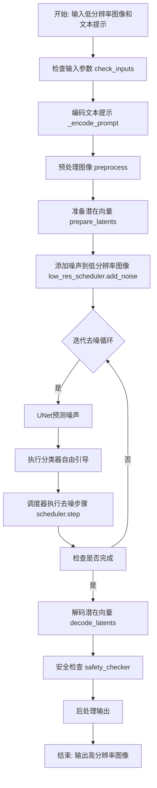
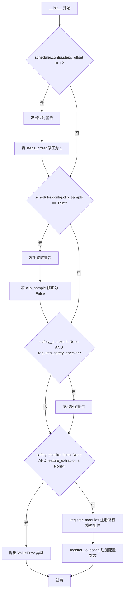
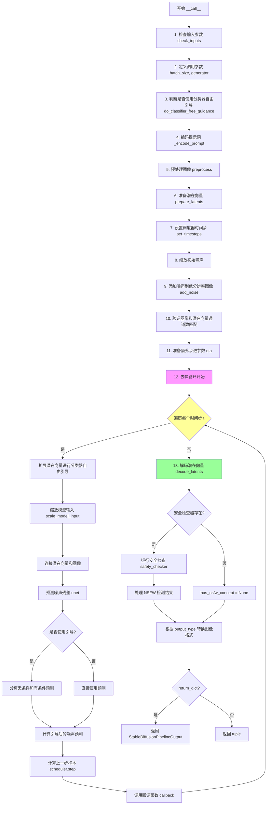

# `diffusers\src\diffusers\pipelines\stable_diffusion\pipeline_onnx_stable_diffusion_upscale.py` 详细设计文档

这是一个基于ONNX Runtime的Stable Diffusion图像放大管道（Upscale Pipeline），通过预训练的VAE、文本编码器、UNet和调度器，将低分辨率图像放大并使用Stable Diffusion模型进行去噪处理，生成高分辨率图像。

## 整体流程



## 类结构

```
DiffusionPipeline (基类)
└── OnnxStableDiffusionUpscalePipeline
```

## 全局变量及字段


### `logger`
    
Logger instance for tracking pipeline execution and warnings

类型：`logging.Logger`
    


### `ORT_TO_NP_TYPE`
    
Mapping from ONNX runtime types to NumPy dtype for type conversion

类型：`Dict[str, np.dtype]`
    


### `StableDiffusionPipelineOutput`
    
Output dataclass containing generated images and NSFW detection results

类型：`Type[StableDiffusionPipelineOutput]`
    


### `OnnxStableDiffusionUpscalePipeline.vae`
    
Variational Autoencoder model for encoding images to latent space and decoding latents back to images

类型：`OnnxRuntimeModel`
    


### `OnnxStableDiffusionUpscalePipeline.text_encoder`
    
CLIP text encoder model for converting text prompts into embedding vectors

类型：`OnnxRuntimeModel`
    


### `OnnxStableDiffusionUpscalePipeline.tokenizer`
    
CLIP tokenizer for converting text prompts into token IDs

类型：`CLIPTokenizer`
    


### `OnnxStableDiffusionUpscalePipeline.unet`
    
UNet model for predicting noise residuals during the denoising process

类型：`OnnxRuntimeModel`
    


### `OnnxStableDiffusionUpscalePipeline.low_res_scheduler`
    
Denoising diffusion probabilistic model scheduler for adding noise to low-resolution images

类型：`DDPMScheduler`
    


### `OnnxStableDiffusionUpscalePipeline.scheduler`
    
Karras diffusion scheduler for managing the main upscaling denoising steps

类型：`KarrasDiffusionSchedulers`
    


### `OnnxStableDiffusionUpscalePipeline.safety_checker`
    
Optional model for detecting and filtering NSFW content in generated images

类型：`OnnxRuntimeModel`
    


### `OnnxStableDiffusionUpscalePipeline.feature_extractor`
    
CLIP image processor for preparing images as input to the safety checker

类型：`CLIPImageProcessor`
    


### `OnnxStableDiffusionUpscalePipeline._optional_components`
    
List of optional pipeline components that can be None (safety_checker, feature_extractor)

类型：`List[str]`
    


### `OnnxStableDiffusionUpscalePipeline._is_onnx`
    
Flag indicating whether the pipeline is running in ONNX runtime mode

类型：`bool`
    


### `OnnxStableDiffusionUpscalePipeline.config`
    
Immutable configuration dictionary storing pipeline parameters like max_noise_level and channel counts

类型：`FrozenDict`
    
    

## 全局函数及方法


### `preprocess`

该函数负责将各种格式的输入图像（`PIL.Image.Image`、`torch.Tensor` 或它们的列表）统一预处理为 `torch.Tensor` 格式，以便后续在 Stable Diffusion pipeline 中使用。函数会调整图像尺寸为 64 的整数倍，并将像素值归一化到 [-1, 1] 范围。

参数：

-  `image`：`torch.Tensor | PIL.Image.Image | list[PIL.Image.Image] | list[torch.Tensor]`，输入图像，可以是单张图像或图像列表

返回值：`torch.Tensor`，预处理后的图像张量，形状为 (batch_size, height, width, channels)，像素值范围 [-1, 1]

#### 流程图

```mermaid
flowchart TD
    A[开始 preprocess] --> B{image 是 torch.Tensor?}
    B -->|是| C[直接返回 image]
    B -->|否| D{image 是 PIL.Image.Image?}
    D -->|是| E[将 image 包装为列表]
    D -->|否| F[假设 image 是列表]
    E --> G{image[0] 是 PIL.Image.Image?}
    F --> G
    G -->|是| H[获取图像尺寸 w, h]
    G -->|否| I{image[0] 是 torch.Tensor?}
    H --> J[将 w, h 调整为 64 的整数倍]
    I --> K[torch.cat 沿 dim=0 拼接]
    J --> L[将每张图像 resize 到 (w, h)]
    L --> M[转换为 numpy 数组]
    M --> N[归一化像素值到 [0, 1]: / 255.0]
    N --> O[转置维度: (B, H, W, C) -> (B, C, H, W)]
    O --> P[缩放到 [-1, 1]: 2.0 * image - 1.0]
    P --> Q[转换为 torch.Tensor]
    Q --> R[返回预处理后的图像]
    C --> R
    K --> R
```

#### 带注释源码

```python
def preprocess(image):
    # 如果输入已经是 torch.Tensor，直接返回，不做任何处理
    if isinstance(image, torch.Tensor):
        return image
    # 如果输入是单张 PIL Image，转换为列表以便统一处理
    elif isinstance(image, PIL.Image.Image):
        image = [image]

    # 判断列表中的第一个元素类型，确定后续处理方式
    if isinstance(image[0], PIL.Image.Image):
        # 获取第一张图像的尺寸
        w, h = image[0].size
        # 将尺寸调整为 64 的整数倍（实际是 32 的倍数，因为后面还会除以 2）
        # 确保图像尺寸满足 U-Net 的要求
        w, h = (x - x % 64 for x in (w, h))

        # 对每张图像进行 resize 并转换为 numpy 数组
        # [None, :] 在数组开头添加一个维度，方便后续拼接
        image = [np.array(i.resize((w, h)))[None, :] for i in image]
        # 在 batch 维度拼接所有图像
        image = np.concatenate(image, axis=0)
        # 转换为 float32 类型并归一化到 [0, 1]
        image = np.array(image).astype(np.float32) / 255.0
        # 转置维度从 (B, H, W, C) 变为 (B, C, H, W)
        # 这是 PyTorch 期望的图像格式
        image = image.transpose(0, 3, 1, 2)
        # 将像素值从 [0, 1] 缩放到 [-1, 1]
        # 这是 Stable Diffusion 使用的归一化方式
        image = 2.0 * image - 1.0
        # 转换为 torch.Tensor
        image = torch.from_numpy(image)
    # 如果是 torch.Tensor 列表，则在 batch 维度拼接
    elif isinstance(image[0], torch.Tensor):
        image = torch.cat(image, dim=0)

    return image
```


### `OnnxStableDiffusionUpscalePipeline.__init__`

该方法是 `OnnxStableDiffusionUpscalePipeline` 类的构造函数，负责初始化 ONNX 版本的 Stable Diffusion 放大管道。它接收各种 ONNX 模型（VAE、文本编码器、UNet）和调度器，进行配置验证，注册模块，并设置管道配置参数。

参数：

- `vae`：`OnnxRuntimeModel`，Variational Autoencoder 模型，用于图像的编码和解码
- `text_encoder`：`OnnxRuntimeModel`，CLIP 文本编码器模型，用于将文本提示转换为嵌入向量
- `tokenizer`：`Any`，CLIP 分词器，用于将文本分割成 token
- `unet`：`OnnxRuntimeModel`，UNet 模型，用于去噪预测
- `low_res_scheduler`：`DDPMScheduler`，低分辨率图像的噪声调度器
- `scheduler`：`KarrasDiffusionSchedulers`，主扩散调度器，用于控制去噪过程
- `safety_checker`：`OnnxRuntimeModel | None`，可选的安全检查器模型，用于过滤不安全内容
- `feature_extractor`：`CLIPImageProcessor | None`，可选的 CLIP 图像特征提取器
- `max_noise_level`：`int`，最大噪声级别，默认 350
- `num_latent_channels`：默认 4，潜在空间的通道数
- `num_unet_input_channels`：默认 7，UNet 输入的通道数
- `requires_safety_checker`：`bool`，是否需要安全检查器，默认 True

返回值：`None`，构造函数无返回值

#### 流程图



#### 带注释源码

```python
def __init__(
    self,
    vae: OnnxRuntimeModel,
    text_encoder: OnnxRuntimeModel,
    tokenizer: Any,
    unet: OnnxRuntimeModel,
    low_res_scheduler: DDPMScheduler,
    scheduler: KarrasDiffusionSchedulers,
    safety_checker: OnnxRuntimeModel | None = None,
    feature_extractor: CLIPImageProcessor | None = None,
    max_noise_level: int = 350,
    num_latent_channels=4,
    num_unet_input_channels=7,
    requires_safety_checker: bool = True,
):
    # 调用父类 DiffusionPipeline 的构造函数进行基础初始化
    super().__init__()

    # 检查调度器的 steps_offset 配置是否正确
    # 如果不等于 1，发出过时警告并修正配置
    if scheduler is not None and getattr(scheduler.config, "steps_offset", 1) != 1:
        deprecation_message = (
            f"The configuration file of this scheduler: {scheduler} is outdated. `steps_offset`"
            f" should be set to 1 instead of {scheduler.config.steps_offset}. Please make sure "
            "to update the config accordingly as leaving `steps_offset` might led to incorrect results"
            " in future versions. If you have downloaded this checkpoint from the Hugging Face Hub,"
            " it would be very nice if you could open a Pull request for the `scheduler/scheduler_config.json`"
            " file"
        )
        deprecate("steps_offset!=1", "1.0.0", deprecation_message, standard_warn=False)
        new_config = dict(scheduler.config)
        new_config["steps_offset"] = 1
        scheduler._internal_dict = FrozenDict(new_config)

    # 检查调度器的 clip_sample 配置
    # 如果为 True，发出过时警告并修正为 False
    if scheduler is not None and getattr(scheduler.config, "clip_sample", False) is True:
        deprecation_message = (
            f"The configuration file of this scheduler: {scheduler} has not set the configuration `clip_sample`."
            " `clip_sample` should be set to False in the configuration file. Please make sure to update the"
            " config accordingly as not setting `clip_sample` in the config might lead to incorrect results in"
            " future versions. If you have downloaded this checkpoint from the Hugging Face Hub, it would be very"
            " nice if you could open a Pull request for the `scheduler/scheduler_config.json` file"
        )
        deprecate("clip_sample not set", "1.0.0", deprecation_message, standard_warn=False)
        new_config = dict(scheduler.config)
        new_config["clip_sample"] = False
        scheduler._internal_dict = FrozenDict(new_config)

    # 如果 safety_checker 为 None 但 requires_safety_checker 为 True，发出安全警告
    if safety_checker is None and requires_safety_checker:
        logger.warning(
            f"You have disabled the safety checker for {self.__class__} by passing `safety_checker=None`. Ensure"
            " that you abide to the conditions of the Stable Diffusion license and do not expose unfiltered"
            " results in services or applications open to the public. Both the diffusers team and Hugging Face"
            " strongly recommend to keep the safety filter enabled in all public facing circumstances, disabling"
            " it only for use-cases that involve analyzing network behavior or auditing its results. For more"
            " information, please have a look at https://github.com/huggingface/diffusers/pull/254 ."
        )

    # 验证 safety_checker 和 feature_extractor 的一致性
    # 如果有 safety_checker 但没有 feature_extractor，抛出异常
    if safety_checker is not None and feature_extractor is None:
        raise ValueError(
            "Make sure to define a feature extractor when loading {self.__class__} if you want to use the safety"
            " checker. If you do not want to use the safety checker, you can pass `'safety_checker=None'` instead."
        )

    # 注册所有模型组件到管道中
    self.register_modules(
        vae=vae,
        text_encoder=text_encoder,
        tokenizer=tokenizer,
        unet=unet,
        scheduler=scheduler,
        low_res_scheduler=low_res_scheduler,
        safety_checker=safety_checker,
        feature_extractor=feature_extractor,
    )

    # 注册配置参数到管道的 config 中
    self.register_to_config(
        max_noise_level=max_noise_level,
        num_latent_channels=num_latent_channels,
        num_unet_input_channels=num_unet_input_channels,
    )
```


### `OnnxStableDiffusionUpscalePipeline.check_inputs`

该方法用于验证扩散管道输入参数的有效性，确保用户提供的prompt、图像、噪声级别等参数符合管道要求，若参数无效则抛出相应的ValueError异常。

参数：

- `self`：隐式参数，OnnxStableDiffusionUpscalePipeline实例本身
- `prompt`：`str | list[str]`，要生成的文本提示，支持单个字符串或字符串列表
- `image`：任意类型，输入图像，支持torch.Tensor、np.ndarray、PIL.Image.Image或list类型
- `noise_level`：任意类型，噪声级别，用于控制添加到图像的噪声量
- `callback_steps`：任意类型，回调函数调用间隔步数，必须为正整数
- `negative_prompt`：可选参数，用于指定不希望出现的负面提示
- `prompt_embeds`：可选参数，预生成的文本嵌入向量
- `negative_prompt_embeds`：可选参数，预生成的负面文本嵌入向量

返回值：`None`，该方法不返回任何值，仅进行参数验证

#### 流程图

```mermaid
flowchart TD
    A[开始 check_inputs] --> B{检查 callback_steps}
    B -->|无效| C[抛出 ValueError: callback_steps 必须为正整数]
    B -->|有效| D{prompt 和 prompt_embeds 同时存在?}
    D -->|是| D1[抛出 ValueError: 不能同时指定]
    D -->|否| E{prompt 和 prompt_embeds 都未指定?}
    E -->|是| E1[抛出 ValueError: 至少指定一个]
    E -->|否| F{prompt 类型是否有效}
    F -->|否| F1[抛出 ValueError: prompt 类型错误]
    F -->|是| G{negative_prompt 和 negative_prompt_embeds 同时存在?}
    G -->|是| G1[抛出 ValueError: 不能同时指定]
    G -->|否| H{prompt_embeds 和 negative_prompt_embeds 都存在?}
    H -->|是| I{形状是否一致?}
    H -->|否| J{image 类型是否有效}
    I -->|否| I1[抛出 ValueError: 形状不匹配]
    I -->|是| J
    J -->|否| J1[抛出 ValueError: image 类型错误]
    J -->|是| K{image 是 list 或 array?}
    K -->|是| L{计算 batch_size}
    K -->|否| M{检查 noise_level <= max_noise_level}
    L --> N{prompt 和 image batch_size 是否一致}
    N -->|否| N1[抛出 ValueError: batch_size 不匹配]
    N -->|是| M
    M -->|否| M1[抛出 ValueError: noise_level 超过最大值]
    M -->|是| O{再次检查 callback_steps]
    O -->|无效| O1[抛出 ValueError]
    O -->|有效| P[结束]
    
    style C fill:#ff9999
    style D1 fill:#ff9999
    style E1 fill:#ff9999
    style F1 fill:#ff9999
    style G1 fill:#ff9999
    style I1 fill:#ff9999
    style J1 fill:#ff9999
    style N1 fill:#ff9999
    style M1 fill:#ff9999
    style O1 fill:#ff9999
    style P fill:#99ff99
```

#### 带注释源码

```python
def check_inputs(
    self,
    prompt: str | list[str],
    image,
    noise_level,
    callback_steps,
    negative_prompt=None,
    prompt_embeds=None,
    negative_prompt_embeds=None,
):
    # 验证 callback_steps 参数：必须为正整数
    if (callback_steps is None) or (
        callback_steps is not None and (not isinstance(callback_steps, int) or callback_steps <= 0)
    ):
        raise ValueError(
            f"`callback_steps` has to be a positive integer but is {callback_steps} of type"
            f" {type(callback_steps)}."
        )

    # 验证 prompt 和 prompt_embeds 不能同时提供
    if prompt is not None and prompt_embeds is not None:
        raise ValueError(
            f"Cannot forward both `prompt`: {prompt} and `prompt_embeds`: {prompt_embeds}. Please make sure to"
            " only forward one of the two."
        )
    # 验证 prompt 和 prompt_embeds 至少提供一个
    elif prompt is None and prompt_embeds is None:
        raise ValueError(
            "Provide either `prompt` or `prompt_embeds`. Cannot leave both `prompt` and `prompt_embeds` undefined."
        )
    # 验证 prompt 的类型必须是 str 或 list
    elif prompt is not None and (not isinstance(prompt, str) and not isinstance(prompt, list)):
        raise ValueError(f"`prompt` has to be of type `str` or `list` but is {type(prompt)}")

    # 验证 negative_prompt 和 negative_prompt_embeds 不能同时提供
    if negative_prompt is not None and negative_prompt_embeds is not None:
        raise ValueError(
            f"Cannot forward both `negative_prompt`: {negative_prompt} and `negative_prompt_embeds`:"
            f" {negative_prompt_embeds}. Please make sure to only forward one of the two."
        )

    # 验证 prompt_embeds 和 negative_prompt_embeds 形状一致性
    if prompt_embeds is not None and negative_prompt_embeds is not None:
        if prompt_embeds.shape != negative_prompt_embeds.shape:
            raise ValueError(
                "`prompt_embeds` and `negative_prompt_embeds` must have the same shape when passed directly, but"
                f" got: `prompt_embeds` {prompt_embeds.shape} != `negative_prompt_embeds`"
                f" {negative_prompt_embeds.shape}."
            )

    # 验证 image 的类型：支持 torch.Tensor、np.ndarray、PIL.Image.Image 或 list
    if (
        not isinstance(image, torch.Tensor)
        and not isinstance(image, PIL.Image.Image)
        and not isinstance(image, np.ndarray)
        and not isinstance(image, list)
    ):
        raise ValueError(
            f"`image` has to be of type `torch.Tensor`, `np.ndarray`, `PIL.Image.Image` or `list` but is {type(image)}"
        )

    # 验证批次大小：当 image 为 list 或 numpy array 时，检查 prompt 和 image 的批次大小是否一致
    if isinstance(image, (list, np.ndarray)):
        # 根据 prompt 类型确定批次大小
        if prompt is not None and isinstance(prompt, str):
            batch_size = 1
        elif prompt is not None and isinstance(prompt, list):
            batch_size = len(prompt)
        else:
            batch_size = prompt_embeds.shape[0]

        # 获取 image 的批次大小
        if isinstance(image, list):
            image_batch_size = len(image)
        else:
            image_batch_size = image.shape[0]
        
        # 批次大小不匹配时抛出错误
        if batch_size != image_batch_size:
            raise ValueError(
                f"`prompt` has batch size {batch_size} and `image` has batch size {image_batch_size}."
                " Please make sure that passed `prompt` matches the batch size of `image`."
            )

    # 验证 noise_level 不能超过配置的最大噪声级别
    if noise_level > self.config.max_noise_level:
        raise ValueError(f"`noise_level` has to be <= {self.config.max_noise_level} but is {noise_level}")

    # 重复验证 callback_steps（代码中重复了此检查，可能是冗余代码）
    if (callback_steps is None) or (
        callback_steps is not None and (not isinstance(callback_steps, int) or callback_steps <= 0)
    ):
        raise ValueError(
            f"`callback_steps` has to be a positive integer but is {callback_steps} of type"
            f" {type(callback_steps)}."
        )
```


### `OnnxStableDiffusionUpscalePipeline.prepare_latents`

该方法负责为扩散模型准备潜在向量（latents）。它根据指定的批次大小、通道数、高度和宽度生成随机潜在向量，如果已提供潜在向量则验证其形状是否符合预期，否则使用随机生成器创建新的潜在向量。这是图像上采样扩散管道的关键步骤，确保输入到UNet的潜在表示具有正确的维度。

参数：

- `batch_size`：`int`，批次大小，决定同时处理的图像数量
- `num_channels_latents`：`int`，潜在通道数，通常为4（对应于Stable Diffusion的潜在空间维度）
- `height`：`int`，潜在向量张量的高度维度
- `width`：`int`，潜在向量张量的宽度维度
- `dtype`：`dtype`，生成潜在向量的数据类型（numpy dtype）
- `generator`：`np.random.RandomState`，随机数生成器，用于生成确定性噪声
- `latents`：`np.ndarray | None`，可选的预生成潜在向量，如果为None则自动生成

返回值：`np.ndarray`，准备好的潜在向量张量，形状为(batch_size, num_channels_latents, height, width)

#### 流程图

```mermaid
flowchart TD
    A[开始 prepare_latents] --> B[计算 shape = (batch_size, num_channels_latents, height, width)]
    B --> C{latents 是否为 None?}
    C -->|是| D[使用 generator.randn 生成随机潜在向量]
    D --> F[将潜在向量转换为指定 dtype]
    F --> H[返回 latents]
    C -->|否| E{latents.shape 是否等于 shape?}
    E -->|是| H
    E -->|否| I[抛出 ValueError 异常]
    I --> J[结束]
    H --> J
```

#### 带注释源码

```python
def prepare_latents(self, batch_size, num_channels_latents, height, width, dtype, generator, latents=None):
    """
    准备用于扩散过程的潜在向量。
    
    参数:
        batch_size: 批次大小
        num_channels_latents: 潜在通道数
        height: 高度
        width: 宽度
        dtype: 数据类型
        generator: 随机数生成器
        latents: 可选的预生成潜在向量
    
    返回:
        准备好的潜在向量
    """
    # 1. 根据参数计算期望的潜在向量形状
    shape = (batch_size, num_channels_latents, height, width)
    
    # 2. 如果没有提供潜在向量，则使用随机生成器创建新的
    if latents is None:
        # 使用生成器创建指定形状的随机数组，并转换为指定数据类型
        latents = generator.randn(*shape).astype(dtype)
    
    # 3. 如果提供了潜在向量，验证其形状是否与预期匹配
    elif latents.shape != shape:
        # 形状不匹配时抛出详细的错误信息
        raise ValueError(f"Unexpected latents shape, got {latents.shape}, expected {shape}")

    # 4. 返回准备好的潜在向量
    return latents
```


### `OnnxStableDiffusionUpscalePipeline.decode_latents`

该方法将 VAE 解码器应用于潜在空间表示（latents），通过逆变换将压缩的潜在向量解码为最终的像素图像，并进行必要的归一化和维度转换以便后续处理。

参数：

- `latents`：`np.ndarray`，潜在空间表示，来自扩散模型的去噪潜在向量，需要通过 VAE 解码器转换为像素空间

返回值：`np.ndarray`，解码后的图像数组，形状为 (batch_size, height, width, channels)，像素值范围 [0, 1]

#### 流程图

```mermaid
flowchart TD
    A[接收 latents 输入] --> B[缩放 latents: latents = 1/0.08333 × latents]
    B --> C[调用 VAE 解码器: vae.decode_latents]
    C --> D[图像归一化: np.clip(image/2 + 0.5, 0, 1)]
    D --> E[维度转换: transpose(0, 2, 3, 1)]
    E --> F[返回图像数组]
```

#### 带注释源码

```python
def decode_latents(self, latents):
    """
    将潜在空间表示解码为图像像素值
    
    参数:
        latents: np.ndarray，VAE编码后的潜在表示，形状为 (batch, num_channels, height, width)
    
    返回:
        np.ndarray，解码后的图像，形状为 (batch, height, width, channels)，像素值范围 [0, 1]
    """
    # Step 1: 缩放潜在向量
    # 0.08333 是 VAE 的标准缩放因子倒数 (1/0.08333 ≈ 12)
    # 用于将潜在向量恢复到适当的数值范围，以便 VAE 解码器正确处理
    latents = 1 / 0.08333 * latents
    
    # Step 2: 使用 VAE 解码器进行解码
    # 调用 ONNX 运行时模型执行 VAE 解码
    # 输入: latent_sample=latents (潜在向量)
    # 输出: [0] 取第一个输出元素，即解码后的图像
    image = self.vae(latent_sample=latents)[0]
    
    # Step 3: 归一化图像到 [0, 1] 范围
    # VAE 输出通常在 [-1, 1] 范围，通过 (x/2 + 0.5) 转换到 [0, 1]
    # np.clip 确保所有值都在 [0, 1] 范围内
    image = np.clip(image / 2 + 0.5, 0, 1)
    
    # Step 4: 调整维度顺序
    # 从 (batch, channels, height, width) 转换为 (batch, height, width, channels)
    # 以符合常见的图像表示格式 (HWC)
    image = image.transpose((0, 2, 3, 1))
    
    # Step 5: 返回解码后的图像数组
    return image
```


### `OnnxStableDiffusionUpscalePipeline._encode_prompt`

该方法负责将文本提示词（prompt）编码为文本编码器隐藏状态（text encoder hidden states），用于后续的图像生成任务。它支持批量处理、每个提示词生成多张图像（num_images_per_prompt）、无分类器自由引导（Classifier-Free Guidance）以及预计算的提示词嵌入。

参数：

- `prompt`：`str | list[str]`，要编码的提示词，可以是单个字符串或字符串列表
- `num_images_per_prompt`：`int | None`，每个提示词生成的图像数量
- `do_classifier_free_guidance`：`bool`，是否使用无分类器自由引导
- `negative_prompt`：`str | None`，负提示词，用于指导图像生成时不希望出现的内容
- `prompt_embeds`：`np.ndarray | None`，预生成的提示词嵌入，可用于轻松调整文本输入
- `negative_prompt_embeds`：`np.ndarray | None`，预生成的负提示词嵌入

返回值：`np.ndarray`，编码后的提示词嵌入

#### 流程图

```mermaid
flowchart TD
    A[开始 _encode_prompt] --> B{判断 prompt 类型}
    B -->|str| C[batch_size = 1]
    B -->|list| D[batch_size = len(prompt)]
    B -->|其他| E[batch_size = prompt_embeds.shape[0]]
    
    C --> F{prompt_embeds 为空?}
    D --> F
    E --> F
    
    F -->|是| G[调用 tokenizer 编码 prompt]
    G --> H{是否被截断?}
    H -->|是| I[记录警告日志]
    H -->|否| J[跳过警告]
    I --> K[调用 text_encoder 生成 embeddings]
    J --> K
    F -->|否| L[使用传入的 prompt_embeds]
    
    K --> M[按 num_images_per_prompt 重复 embeddings]
    L --> M
    
    M --> N{需要 CFG 且 negative_prompt_embeds 为空?}
    N -->|是| O{negative_prompt 为空?}
    O -->|是| P[uncond_tokens = [''] * batch_size]
    O -->|否| Q[验证 negative_prompt 类型一致性]
    Q --> R{negative_prompt 是 str?}
    R -->|是| S[uncond_tokens = [negative_prompt] * batch_size]
    R -->|否| T[验证 batch_size 一致性]
    T --> U[uncond_tokens = negative_prompt]
    
    P --> V[调用 tokenizer 编码 uncond_tokens]
    S --> V
    U --> V
    
    N -->|否| W[直接使用传入的 negative_prompt_embeds]
    
    V --> X[调用 text_encoder 生成 negative_prompt_embeds]
    W --> Y{需要 CFG?}
    
    X --> Y
    
    Y -->|是| Z[重复 negative_prompt_embeds]
    Y -->|否| AA[跳过重复]
    
    Z --> AB[拼接 negative_prompt_embeds 和 prompt_embeds]
    AA --> AC[返回 prompt_embeds]
    AB --> AD[返回拼接后的 embeddings]
    
    AC --> AE[结束]
    AD --> AE
```

#### 带注释源码

```python
def _encode_prompt(
    self,
    prompt: str | list[str],
    num_images_per_prompt: int | None,
    do_classifier_free_guidance: bool,
    negative_prompt: str | None,
    prompt_embeds: np.ndarray | None = None,
    negative_prompt_embeds: np.ndarray | None = None,
):
    r"""
    Encodes the prompt into text encoder hidden states.

    Args:
        prompt (`str` or `list[str]`):
            prompt to be encoded
        num_images_per_prompt (`int`):
            number of images that should be generated per prompt
        do_classifier_free_guidance (`bool`):
            whether to use classifier free guidance or not
        negative_prompt (`str` or `list[str]`):
            The prompt or prompts not to guide the image generation. Ignored when not using guidance (i.e., ignored
            if `guidance_scale` is less than `1`).
        prompt_embeds (`np.ndarray`, *optional*):
            Pre-generated text embeddings. Can be used to easily tweak text inputs, *e.g.* prompt weighting. If not
            provided, text embeddings will be generated from `prompt` input argument.
        negative_prompt_embeds (`np.ndarray`, *optional*):
            Pre-generated negative text embeddings. Can be used to easily tweak text inputs, *e.g.* prompt
            weighting. If not provided, negative_prompt_embeds will be generated from `negative_prompt` input
            argument.
    """
    # 1. 确定批次大小
    if prompt is not None and isinstance(prompt, str):
        batch_size = 1
    elif prompt is not None and isinstance(prompt, list):
        batch_size = len(prompt)
    else:
        batch_size = prompt_embeds.shape[0]

    # 2. 如果没有提供 prompt_embeds，则从 prompt 生成
    if prompt_embeds is None:
        # get prompt text embeddings
        text_inputs = self.tokenizer(
            prompt,
            padding="max_length",
            max_length=self.tokenizer.model_max_length,
            truncation=True,
            return_tensors="np",
        )
        text_input_ids = text_inputs.input_ids
        # 获取未截断的 token ids 用于检测截断
        untruncated_ids = self.tokenizer(prompt, padding="max_length", return_tensors="np").input_ids

        # 检测是否发生了截断
        if not np.array_equal(text_input_ids, untruncated_ids):
            removed_text = self.tokenizer.batch_decode(
                untruncated_ids[:, self.tokenizer.model_max_length - 1 : -1]
            )
            logger.warning(
                "The following part of your input was truncated because CLIP can only handle sequences up to"
                f" {self.tokenizer.model_max_length} tokens: {removed_text}"
            )

        # 通过 text_encoder 生成 embeddings
        prompt_embeds = self.text_encoder(input_ids=text_input_ids.astype(np.int32))[0]

    # 3. 根据 num_images_per_prompt 重复 embeddings
    prompt_embeds = np.repeat(prompt_embeds, num_images_per_prompt, axis=0)

    # 4. 获取无分类器自由引导的无条件 embeddings
    if do_classifier_free_guidance and negative_prompt_embeds is None:
        uncond_tokens: list[str]
        if negative_prompt is None:
            uncond_tokens = [""] * batch_size
        elif type(prompt) is not type(negative_prompt):
            raise TypeError(
                f"`negative_prompt` should be the same type to `prompt`, but got {type(negative_prompt)} !="
                f" {type(prompt)}."
            )
        elif isinstance(negative_prompt, str):
            uncond_tokens = [negative_prompt] * batch_size
        elif batch_size != len(negative_prompt):
            raise ValueError(
                f"`negative_prompt`: {negative_prompt} has batch size {len(negative_prompt)}, but `prompt`:"
                f" {prompt} has batch size {batch_size}. Please make sure that passed `negative_prompt` matches"
                " the batch size of `prompt`."
            )
        else:
            uncond_tokens = negative_prompt

        max_length = prompt_embeds.shape[1]
        uncond_input = self.tokenizer(
            uncond_tokens,
            padding="max_length",
            max_length=max_length,
            truncation=True,
            return_tensors="np",
        )
        negative_prompt_embeds = self.text_encoder(input_ids=uncond_input.input_ids.astype(np.int32))[0]

    # 5. 处理无分类器自由引导
    if do_classifier_free_guidance:
        negative_prompt_embeds = np.repeat(negative_prompt_embeds, num_images_per_prompt, axis=0)

        # For classifier free guidance, we need to do two forward passes.
        # Here we concatenate the unconditional and text embeddings into a single batch
        # to avoid doing two forward passes
        prompt_embeds = np.concatenate([negative_prompt_embeds, prompt_embeds])

    return prompt_embeds
```


### `OnnxStableDiffusionUpscalePipeline.__call__`

该方法是 ONNX 版本的 Stable Diffusion 上采样管道的核心调用方法，用于将低分辨率图像根据文本提示上采样到更高分辨率的图像。方法内部完成了输入验证、文本编码、潜在向量准备、噪声调度、去噪循环、潜在向量解码以及安全检查等完整的上采样流程。

参数：

- `prompt`：`str | list[str]`，引导图像生成的文本提示
- `image`：`np.ndarray | PIL.Image.Image | list[PIL.Image.Image]`，用作上采样起点的低分辨率图像
- `num_inference_steps`：`int`，去噪步数，默认为 75
- `guidance_scale`：`float`，分类器自由引导比例，默认为 9.0
- `noise_level`：`int`，添加到初始图像的噪声级别，默认为 20
- `negative_prompt`：`str | list[str] | None`，不引导图像生成的负面提示
- `num_images_per_prompt`：`int | None`，每个提示生成的图像数量，默认为 1
- `eta`：`float`，DDIM 论文中的 eta 参数，默认为 0.0
- `generator`：`np.random.RandomState | list[np.random.RandomState] | None`，用于生成确定性结果的随机数生成器
- `latents`：`np.ndarray | None`，预生成的有噪声潜在向量
- `prompt_embeds`：`np.ndarray | None`，预生成的文本嵌入
- `negative_prompt_embeds`：`np.ndarray | None`，预生成的负面文本嵌入
- `output_type`：`str | None`，输出格式，可选 "pil" 或 "np"，默认为 "pil"
- `return_dict`：`bool`，是否返回字典格式结果，默认为 True
- `callback`：`Callable[[int, int, np.ndarray], None] | None`，每步调用的回调函数
- `callback_steps`：`int | None`，回调函数调用频率，默认为 1

返回值：`StableDiffusionPipelineOutput | tuple`，当 return_dict 为 True 时返回 StableDiffusionPipelineOutput 对象，包含生成的图像列表和 NSFW 检测结果布尔列表；否则返回元组 (images, nsfw_content_detected)

#### 流程图



#### 带注释源码

```python
def __call__(
    self,
    prompt: str | list[str],
    image: np.ndarray | PIL.Image.Image | list[PIL.Image.Image],
    num_inference_steps: int = 75,
    guidance_scale: float = 9.0,
    noise_level: int = 20,
    negative_prompt: str | list[str] | None = None,
    num_images_per_prompt: int | None = 1,
    eta: float = 0.0,
    generator: np.random.RandomState | list[np.random.RandomState] | None = None,
    latents: np.ndarray | None = None,
    prompt_embeds: np.ndarray | None = None,
    negative_prompt_embeds: np.ndarray | None = None,
    output_type: str | None = "pil",
    return_dict: bool = True,
    callback: Callable[[int, int, np.ndarray], None] | None = None,
    callback_steps: int | None = 1,
):
    r"""
    Function invoked when calling the pipeline for generation.

    Args:
        prompt (`str` or `list[str]`):
            The prompt or prompts to guide the image generation.
        image (`np.ndarray` or `PIL.Image.Image`):
            `Image`, or tensor representing an image batch, that will be used as the starting point for the
            process.
        num_inference_steps (`int`, *optional*, defaults to 50):
            The number of denoising steps. More denoising steps usually lead to a higher quality image at the
            expense of slower inference. This parameter will be modulated by `strength`.
        guidance_scale (`float`, *optional*, defaults to 7.5):
            Guidance scale as defined in [Classifier-Free Diffusion
            Guidance](https://huggingface.co/papers/2207.12598). `guidance_scale` is defined as `w` of equation 2.
            of [Imagen Paper](https://huggingface.co/papers/2205.11487). Guidance scale is enabled by setting
            `guidance_scale > 1`. Higher guidance scale encourages to generate images that are closely linked to
            the text `prompt`, usually at the expense of lower image quality.
        noise_level (`float`, defaults to 0.2):
            Deteremines the amount of noise to add to the initial image before performing upscaling.
        negative_prompt (`str` or `list[str]`, *optional*):
            The prompt or prompts not to guide the image generation. Ignored when not using guidance (i.e., ignored
            if `guidance_scale` is less than `1`).
        num_images_per_prompt (`int`, *optional*, defaults to 1):
            The number of images to generate per prompt.
        eta (`float`, *optional*, defaults to 0.0):
            Corresponds to parameter eta (η) in the DDIM paper: https://huggingface.co/papers/2010.02502. Only
            applies to [`schedulers.DDIMScheduler`], will be ignored for others.
        generator (`np.random.RandomState`, *optional*):
            A np.random.RandomState to make generation deterministic.
        latents (`torch.Tensor`, *optional*):
            Pre-generated noisy latents, sampled from a Gaussian distribution, to be used as inputs for image
            generation. Can be used to tweak the same generation with different prompts. If not provided, a latents
            tensor will be generated by sampling using the supplied random `generator`.
        prompt_embeds (`np.ndarray`, *optional*):
            Pre-generated text embeddings. Can be used to easily tweak text inputs, *e.g.* prompt weighting. If not
            provided, text embeddings will be generated from `prompt` input argument.
        negative_prompt_embeds (`np.ndarray`, *optional*):
            Pre-generated negative text embeddings. Can be used to easily tweak text inputs, *e.g.* prompt
            weighting. If not provided, negative_prompt_embeds will be generated from `negative_prompt` input
            argument.
        output_type (`str`, *optional*, defaults to `"pil"`):
            The output format of the generate image. Choose between
            [PIL](https://pillow.readthedocs.io/en/stable/): `PIL.Image.Image` or `np.array`.
        return_dict (`bool`, *optional*, defaults to `True`):
            Whether or not to return a [`~pipelines.stable_diffusion.StableDiffusionPipelineOutput`] instead of a
            plain tuple.
        callback (`Callable`, *optional*):
            A function that will be called every `callback_steps` steps during inference. The function will be
            called with the following arguments: `callback(step: int, timestep: int, latents: np.ndarray)`.
        callback_steps (`int`, *optional*, defaults to 1):
            The frequency at which the `callback` function will be called. If not specified, the callback will be
            called at every step.

    Returns:
        [`~pipelines.stable_diffusion.StableDiffusionPipelineOutput`] or `tuple`:
        [`~pipelines.stable_diffusion.StableDiffusionPipelineOutput`] if `return_dict` is True, otherwise a `tuple.
        When returning a tuple, the first element is a list with the generated images, and the second element is a
        list of `bool`s denoting whether the corresponding generated image likely represents "not-safe-for-work"
        (nsfw) content, according to the `safety_checker`.
    """

    # 1. Check inputs
    # 验证所有输入参数的有效性，包括 prompt、image、noise_level、callback_steps 等
    self.check_inputs(
        prompt,
        image,
        noise_level,
        callback_steps,
        negative_prompt,
        prompt_embeds,
        negative_prompt_embeds,
    )

    # 2. Define call parameters
    # 根据 prompt 类型确定批处理大小
    if prompt is not None and isinstance(prompt, str):
        batch_size = 1
    elif prompt is not None and isinstance(prompt, list):
        batch_size = len(prompt)
    else:
        batch_size = prompt_embeds.shape[0]

    # 如果没有提供随机生成器，使用 numpy 的随机状态
    if generator is None:
        generator = np.random

    # here `guidance_scale` is defined analog to the guidance weight `w` of equation (2)
    # of the Imagen paper: https://huggingface.co/papers/2205.11487 . `guidance_scale = 1`
    # corresponds to doing no classifier free guidance.
    # 判断是否使用分类器自由引导（CFG），当 guidance_scale > 1.0 时启用
    do_classifier_free_guidance = guidance_scale > 1.0

    # 3. Encode prompt
    # 调用内部方法 _encode_prompt 将文本提示编码为嵌入向量
    prompt_embeds = self._encode_prompt(
        prompt,
        num_images_per_prompt,
        do_classifier_free_guidance,
        negative_prompt,
        prompt_embeds=prompt_embeds,
        negative_prompt_embeds=negative_prompt_embeds,
    )

    # 获取潜在向量的数据类型
    latents_dtype = prompt_embeds.dtype
    
    # 4. Preprocess image
    # 预处理输入图像：调整大小、转换为张量、归一化到 [-1, 1]
    image = preprocess(image).cpu().numpy()
    height, width = image.shape[2:]

    # 5. Prepare latents
    # 准备初始潜在向量，如果未提供则随机生成
    latents = self.prepare_latents(
        batch_size * num_images_per_prompt,
        self.config.num_latent_channels,
        height,
        width,
        latents_dtype,
        generator,
    )
    # 确保图像数据类型与潜在向量一致
    image = image.astype(latents_dtype)

    # 6. Set timesteps
    # 设置调度器的时间步
    self.scheduler.set_timesteps(num_inference_steps)
    timesteps = self.scheduler.timesteps

    # Scale the initial noise by the standard deviation required by the scheduler
    # 根据调度器要求的初始噪声标准差缩放潜在向量
    latents = latents * self.scheduler.init_noise_sigma

    # 5. Add noise to image
    # 向低分辨率图像添加噪声以进行上采样
    noise_level = np.array([noise_level]).astype(np.int64)
    noise = generator.randn(*image.shape).astype(latents_dtype)

    # 使用低分辨率调度器向图像添加噪声
    image = self.low_res_scheduler.add_noise(
        torch.from_numpy(image), torch.from_numpy(noise), torch.from_numpy(noise_level)
    )
    image = image.numpy()

    # 为分类器自由引导复制图像和噪声级别
    batch_multiplier = 2 if do_classifier_free_guidance else 1
    image = np.concatenate([image] * batch_multiplier * num_images_per_prompt)
    noise_level = np.concatenate([noise_level] * image.shape[0])

    # 7. Check that sizes of image and latents match
    # 验证 U-Net 输入通道配置是否正确
    num_channels_image = image.shape[1]
    if self.config.num_latent_channels + num_channels_image != self.config.num_unet_input_channels:
        raise ValueError(
            "Incorrect configuration settings! The config of `pipeline.unet` expects"
            f" {self.config.num_unet_input_channels} but received `num_channels_latents`: {self.config.num_latent_channels} +"
            f" `num_channels_image`: {num_channels_image} "
            f" = {self.config.num_latent_channels + num_channels_image}. Please verify the config of"
            " `pipeline.unet` or your `image` input."
        )

    # 8. Prepare extra step kwargs. TODO: Logic should ideally just be moved out of the pipeline
    # 检查调度器是否接受 eta 参数
    accepts_eta = "eta" in set(inspect.signature(self.scheduler.step).parameters.keys())
    extra_step_kwargs = {}
    if accepts_eta:
        extra_step_kwargs["eta"] = eta

    # 获取 U-Net 时间步输入的正确数据类型
    timestep_dtype = next(
        (input.type for input in self.unet.model.get_inputs() if input.name == "timestep"), "tensor(float)"
    )
    timestep_dtype = ORT_TO_NP_TYPE[timestep_dtype]

    # 9. Denoising loop
    # 计算预热步数
    num_warmup_steps = len(timesteps) - num_inference_steps * self.scheduler.order
    with self.progress_bar(total=num_inference_steps) as progress_bar:
        for i, t in enumerate(timesteps):
            # expand the latents if we are doing classifier free guidance
            # 如果使用分类器自由引导，复制潜在向量以同时预测有条件和无条件噪声
            latent_model_input = np.concatenate([latents] * 2) if do_classifier_free_guidance else latents

            # concat latents, mask, masked_image_latents in the channel dimension
            # 缩放模型输入并连接潜在向量和图像
            latent_model_input = self.scheduler.scale_model_input(latent_model_input, t)
            latent_model_input = np.concatenate([latent_model_input, image], axis=1)

            # timestep to tensor
            # 将时间步转换为正确的 dtype
            timestep = np.array([t], dtype=timestep_dtype)

            # predict the noise residual
            # 使用 U-Net 预测噪声残差
            noise_pred = self.unet(
                sample=latent_model_input,
                timestep=timestep,
                encoder_hidden_states=prompt_embeds,
                class_labels=noise_level,
            )[0]

            # perform guidance
            # 执行分类器自由引导：分离无条件和有条件预测，计算引导后的噪声
            if do_classifier_free_guidance:
                noise_pred_uncond, noise_pred_text = np.split(noise_pred, 2)
            noise_pred = noise_pred_uncond + guidance_scale * (noise_pred_text - noise_pred_uncond)

            # compute the previous noisy sample x_t -> x_t-1
            # 使用调度器计算上一步的去噪样本
            latents = self.scheduler.step(
                torch.from_numpy(noise_pred), t, torch.from_numpy(latents), **extra_step_kwargs
            ).prev_sample
            latents = latents.numpy()

            # call the callback, if provided
            # 在适当的步数调用回调函数
            if i == len(timesteps) - 1 or ((i + 1) > num_warmup_steps and (i + 1) % self.scheduler.order == 0):
                progress_bar.update()
                if callback is not None and i % callback_steps == 0:
                    step_idx = i // getattr(self.scheduler, "order", 1)
                    callback(step_idx, t, latents)

    # 10. Post-processing
    # 解码潜在向量得到最终图像
    image = self.decode_latents(latents)

    # 11. Run safety checker
    # 如果存在安全检查器，运行 NSFW 检测
    if self.safety_checker is not None:
        safety_checker_input = self.feature_extractor(
            self.numpy_to_pil(image), return_tensors="np"
        ).pixel_values.astype(image.dtype)

        images, has_nsfw_concept = [], []
        for i in range(image.shape[0]):
            image_i, has_nsfw_concept_i = self.safety_checker(
                clip_input=safety_checker_input[i : i + 1], images=image[i : i + 1]
            )
            images.append(image_i)
            has_nsfw_concept.append(has_nsfw_concept_i[0])
        image = np.concatenate(images)
    else:
        has_nsfw_concept = None

    # 12. Convert to output format
    # 根据 output_type 转换图像格式
    if output_type == "pil":
        image = self.numpy_to_pil(image)

    # 13. Return result
    # 根据 return_dict 返回结果
    if not return_dict:
        return (image, has_nsfw_concept)

    return StableDiffusionPipelineOutput(images=image, nsfw_content_detected=has_nsfw_concept)
```


## 关键组件


### 张量索引与惰性加载

OnnxStableDiffusionUpscalePipeline 类中的 `decode_latents` 方法使用索引 `[0]` 从 VAE 模型的输出元组中提取图像数据，实现了张量索引操作。此外，在 `__call__` 方法中使用 `np.split` 对噪声预测进行分割，以及使用切片操作 `image[i : i + 1]` 处理批量图像，体现了张量索引的应用。管道采用惰性加载模式，通过 `register_modules` 方法在初始化时注册各个 ONNX 模型组件，这些模型在首次调用时才加载到内存中。

### 反量化支持

代码中的 `decode_latents` 方法实现了反量化操作：使用 `1 / 0.08333 * latents` 对潜在变量进行反量化（0.08333 约等于 1/12，即 VAE 缩放因子的倒数）。随后通过 `np.clip(image / 2 + 0.5, 0, 1)` 将图像值从 [-1, 1] 范围反量化到 [0, 1] 范围，最后进行通道维度转换以适配图像格式。

### 量化策略

OnnxRuntimeModel 类型的各个组件（vae、text_encoder、unet、safety_checker）均以预量化形式加载。代码通过 `ORT_TO_NP_TYPE` 字典将 ONNX 运行时数据类型映射到 NumPy 类型，实现量化模型与推理框架之间的类型兼容。在 `prepare_latents` 方法中使用传入的 `dtype` 参数确保潜在变量与模型量化格式一致。

### 输入预处理与图像格式化

`preprocess` 全局函数负责将多种输入格式（PIL.Image、torch.Tensor、numpy 数组）统一转换为管道所需的 torch.Tensor 格式。该函数实现了自动尺寸调整（对齐到 64 的倍数）、数据类型转换（float32）、归一化（除以 255）、通道重排（CHW 格式）以及值域变换（[-1, 1]）等预处理步骤。

### 调度器与噪声管理

管道使用双调度器架构：low_res_scheduler（DDPMScheduler）负责向低分辨率输入图像添加噪声，scheduler（KarrasDiffusionSchedulers）执行主要的去噪迭代。`__call__` 方法中通过 `self.scheduler.init_noise_sigma` 对初始潜在变量进行噪声缩放，并通过 `noise_level` 参数控制添加到输入图像的噪声强度。

### 安全检查器集成

Safety_checker 作为可选组件，通过 feature_extractor 提取图像特征后进行 NSFW 内容检测。代码实现了条件加载逻辑：当 safety_checker 为 None 时记录警告，当 safety_checker 存在但 feature_extractor 缺失时抛出异常。在推理完成后对每张图像单独进行安全检查，并将结果聚合到 `has_nsfw_concept` 列表中。

### 分类器自由引导实现

`_encode_prompt` 方法支持分类器自由引导（CFG），通过生成无条件嵌入和条件嵌入的拼接来实现。在 `__call__` 方法中，使用 `np.concatenate([negative_prompt_embeds, prompt_embeds])` 将无条件嵌入和文本嵌入拼接为单一批次，从而在单次前向传播中完成引导计算，避免了两次独立的前向传播开销。


## 问题及建议


### 已知问题

-   **硬编码数值**：在 `decode_latents` 方法中使用 `1 / 0.08333` 硬编码值进行潜在变量解码，应从 VAE 配置中获取缩放因子
-   **重复验证逻辑**：`callback_steps` 参数验证在 `check_inputs` 方法中出现两次，造成代码冗余
-   **类型比较不当**：在 `_encode_prompt` 中使用 `type(prompt) is not type(negative_prompt)` 比较类型，应使用 `isinstance()` 进行更稳健的类型检查
-   **字符串格式化错误**：在 `__init__` 方法中关于 `safety_checker` 的错误消息使用了 `{self.__class__}` 但未正确格式化，应使用 `f"{self.__class__}"` 或移除该占位符
-   **缺失类型注解**：`num_latent_channels`、`num_unet_input_channels` 等参数在 `__init__` 中缺少类型注解
-   **魔法数字**：多处使用魔法数字如 `2.0`（图像归一化）、`350`（默认噪声等级），应提取为常量或从配置读取

### 优化建议

-   将 `decode_latents` 中的硬编码缩放因子替换为从 VAE 配置读取的对应参数
-   移除 `check_inputs` 中重复的 `callback_steps` 验证逻辑
-   统一使用 `isinstance()` 进行类型检查，替换所有 `type() is` 的比较方式
-   修复 `__init__` 中错误消息的字符串格式化问题
-   为 `__init__` 方法的参数添加完整的类型注解
-   将图像预处理中的归一化常数和调度器相关常量提取为模块级常量或配置项
-   考虑将 `prepare_latents` 中的默认随机生成逻辑抽象为独立的随机数生成器接口，提高可测试性

## 其它


### 设计目标与约束

该管道旨在使用 ONNX 运行时对低分辨率图像进行超分辨率处理，核心目标是将输入图像通过 Stable Diffusion 模型上采样至更高分辨率。设计约束包括：必须使用 ONNX 格式的模型（vae、text_encoder、unet、safety_checker），输入图像尺寸必须为 64 的整数倍，噪声等级需控制在 max_noise_level（默认 350）以内，输出格式支持 PIL.Image 或 numpy 数组。

### 错误处理与异常设计

管道在多个环节实现了完善的错误处理机制。在 check_inputs 方法中验证：callback_steps 必须为正整数、prompt 与 prompt_embeds 互斥、image 类型必须为 torch.Tensor、np.ndarray、PIL.Image.Image 或 list、prompt 与 image 的批次大小必须匹配、noise_level 必须在有效范围内。此外，__init__ 中对 scheduler 的 steps_offset 和 clip_sample 配置进行了兼容性检查并自动修复。缺少 safety_checker 时会发出警告但允许运行，缺少 feature_extractor 但存在 safety_checker 时会抛出 ValueError。

### 数据流与状态机

数据流遵循以下流程：输入图像经 preprocess 函数处理（转换为 torch.Tensor、归一化到 [-1,1]）→ 通过低分辨率 scheduler 添加噪声 → UNet 预测噪声残差 → 主 scheduler 执行去噪步骤 → VAE 解码潜在向量 → 可选的 safety_checker 过滤内容 → 输出图像。状态转换由 scheduler 的 timesteps 控制，典型配置为 75 个推理步骤。

### 外部依赖与接口契约

核心依赖包括：transformers 库提供 CLIPTokenizer 和 CLIPImageProcessor，diffusers 库提供 DDPMScheduler、KarrasDiffusionSchedulers 和 DiffusionPipeline 基类，onnxruntime 提供 OnnxRuntimeModel，numpy 和 PIL 用于图像处理。接口契约规定：vae、text_encoder、unet 必需为 OnnxRuntimeModel 实例，tokenizer 必需为 CLIPTokenizer，scheduler 必需为 KarrasDiffusionSchedulers 子类，low_res_scheduler 必需为 DDPMScheduler。

### 配置与参数设计

管道通过 register_to_config 注册以下配置参数：max_noise_level（默认 350）限制最大噪声等级，num_latent_channels（默认 4）指定潜在空间通道数，num_unet_input_channels（默认 7）定义 UNet 输入通道数（4 个潜在通道 + 3 个图像通道）。运行时参数包括：num_inference_steps（默认 75）控制去噪步数，guidance_scale（默认 9.0）控制分类器自由引导强度，noise_level（默认 20）控制初始噪声添加量。

### 性能考虑与优化点

性能优化体现在：使用 ONNX 运行时避免 PyTorch 推理开销，numpy 和 torch 混合运算时尽量保持数组在相同设备上，classifier free guidance 通过单次前向传播实现（拼接无条件 embeddings 和条件 embeddings），批量处理多个图像。潜在优化点包括：减少 numpy 与 torch 之间的转换次数、缓存 timestep_dtype 查询结果、考虑使用动态量化、可能的并行 safety_checker 调用。

### 安全性考虑

管道集成了 safety_checker 用于检测 NSFW 内容，默认情况下要求启用 safety_checker。当 safety_checker 为 None 且 requires_safety_checker 为 True 时会发出警告。返回结果中包含 nsfw_content_detected 标志供调用者判断是否过滤。设计者强调在公开服务中应保持 safety filter 启用，仅在特定分析场景下禁用。

### 版本兼容性与迁移

代码对多个兼容性进行了处理：通过 deprecate 函数标记过时配置的警告，steps_offset 不为 1 时自动修复并警告，clip_sample 为 True 时自动设置为 False 并警告。_is_onnex 标志指示这是 ONNX 版本的管道，_optional_components 定义了可选组件列表（safety_checker、feature_extractor），便于跨版本兼容。

### 测试策略建议

应覆盖的测试场景包括：各种输入类型（torch.Tensor、PIL.Image、np.ndarray、list）的预处理正确性，输入验证的边界条件（负数 callback_steps、不匹配的批次大小、超出范围的 noise_level），去噪流程的完整性和输出质量，safety_checker 启用/禁用状态下的行为，ONNX 模型推理的正确性验证，以及 pipeline 输出与 PyTorch 版本的数值一致性对比。

    