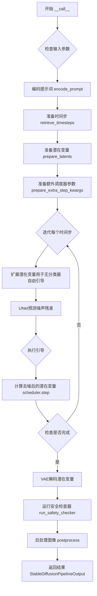
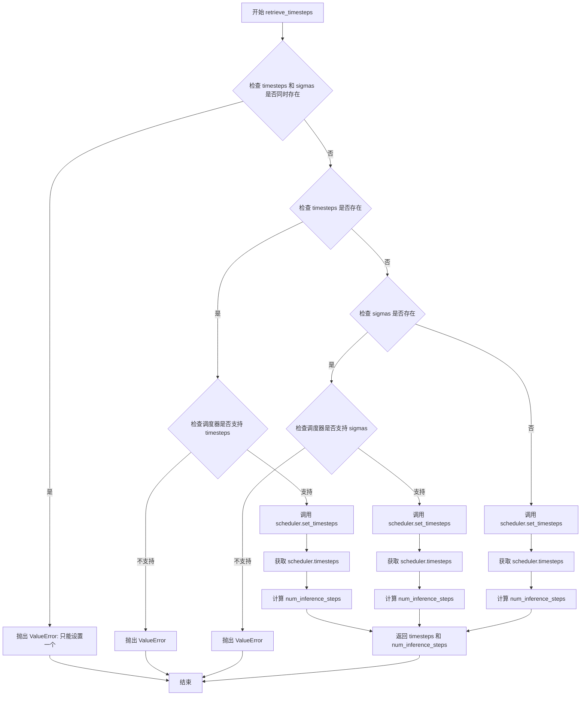
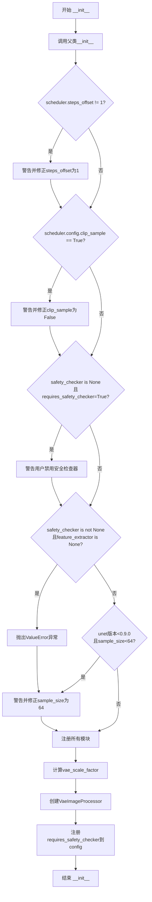
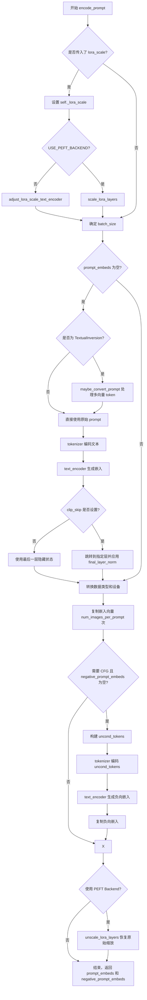
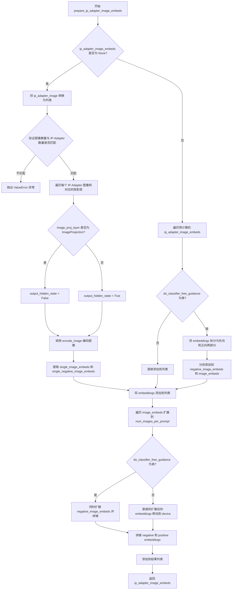
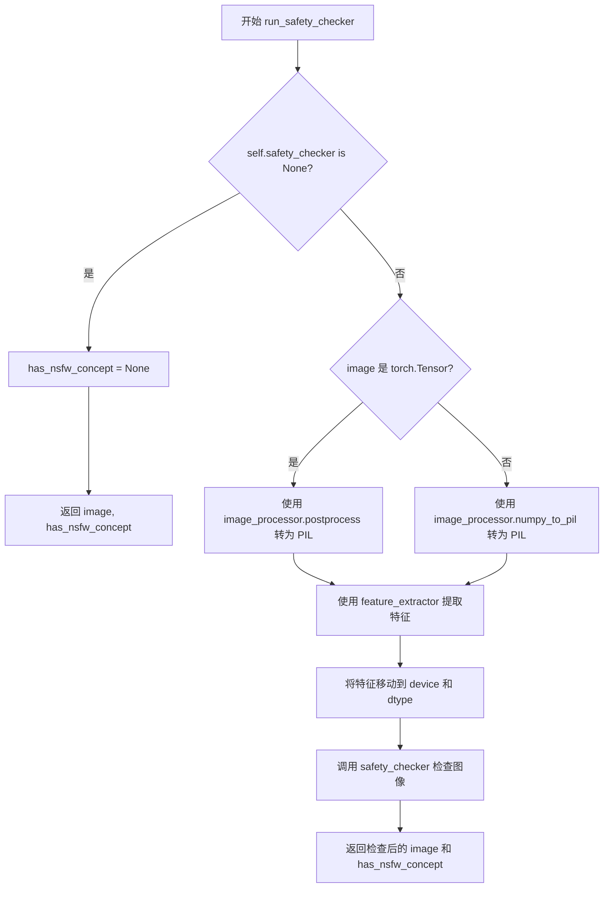
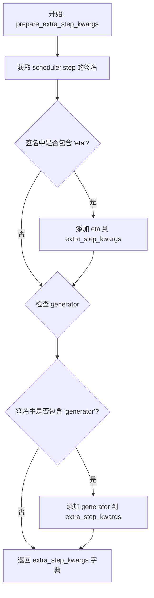
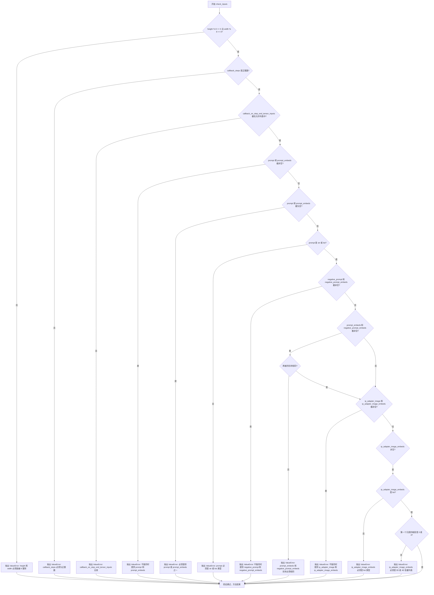
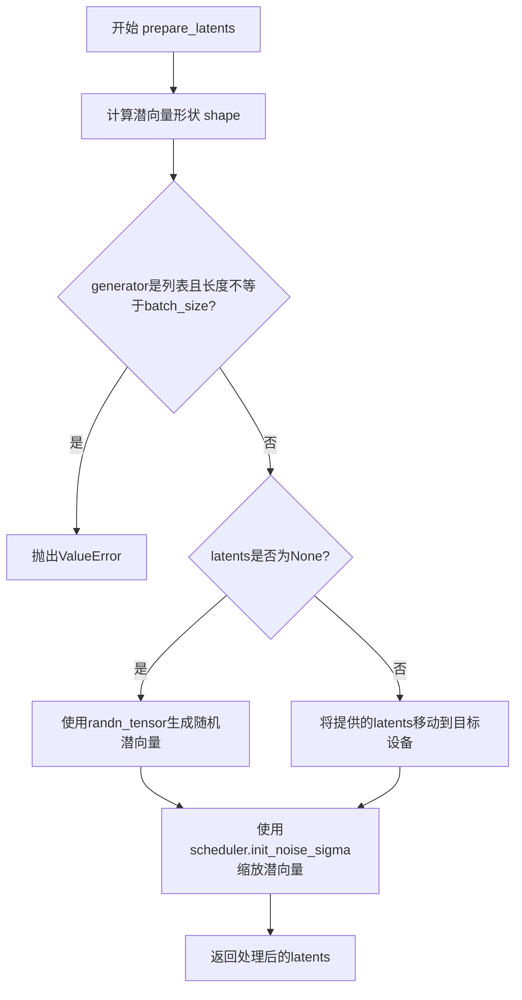
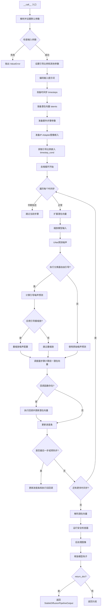

# `diffusers\src\diffusers\pipelines\stable_diffusion\pipeline_stable_diffusion.py` 详细设计文档

Stable Diffusion文本到图像生成管道，支持LoRA、Textual Inversion、IP-Adapter等多种功能，可将文本提示转换为高质量图像

## 整体流程



## 类结构

```
DiffusionPipeline (基类)
├── StableDiffusionMixin
├── TextualInversionLoaderMixin
├── StableDiffusionLoraLoaderMixin
├── IPAdapterMixin
├── FromSingleFileMixin
└── StableDiffusionPipeline
```

## 全局变量及字段


### `logger`
    
Logger instance for the module, used for logging warnings and messages

类型：`logging.Logger`
    


### `EXAMPLE_DOC_STRING`
    
Documentation string containing usage examples for the pipeline

类型：`str`
    


### `XLA_AVAILABLE`
    
Boolean flag indicating whether PyTorch XLA is available for TPU support

类型：`bool`
    


### `StableDiffusionPipeline.vae`
    
Variational Auto-Encoder (VAE) model to encode and decode images to and from latent representations

类型：`AutoencoderKL`
    


### `StableDiffusionPipeline.text_encoder`
    
Frozen text-encoder (clip-vit-large-patch14) for encoding text prompts into embeddings

类型：`CLIPTextModel`
    


### `StableDiffusionPipeline.tokenizer`
    
CLIP tokenizer to tokenize text prompts into token IDs

类型：`CLIPTokenizer`
    


### `StableDiffusionPipeline.unet`
    
UNet2DConditionModel to denoise the encoded image latents during diffusion process

类型：`UNet2DConditionModel`
    


### `StableDiffusionPipeline.scheduler`
    
Diffusion scheduler to be used in combination with unet to denoise encoded image latents

类型：`KarrasDiffusionSchedulers`
    


### `StableDiffusionPipeline.safety_checker`
    
Classification module that estimates whether generated images could be considered offensive or harmful

类型：`StableDiffusionSafetyChecker`
    


### `StableDiffusionPipeline.feature_extractor`
    
CLIP image processor to extract features from generated images for safety checking

类型：`CLIPImageProcessor`
    


### `StableDiffusionPipeline.image_encoder`
    
Optional CLIP vision model with projection for IP-Adapter image embeddings

类型：`CLIPVisionModelWithProjection`
    


### `StableDiffusionPipeline.vae_scale_factor`
    
Scale factor derived from VAE block out channels for image processing

类型：`int`
    


### `StableDiffusionPipeline.image_processor`
    
Image processor for VAE encoding/decoding and post-processing generated images

类型：`VaeImageProcessor`
    


### `StableDiffusionPipeline.model_cpu_offload_seq`
    
String defining the sequence of models for CPU offload (text_encoder->image_encoder->unet->vae)

类型：`str`
    


### `StableDiffusionPipeline._optional_components`
    
List of optional pipeline components (safety_checker, feature_extractor, image_encoder)

类型：`list`
    


### `StableDiffusionPipeline._exclude_from_cpu_offload`
    
List of components to exclude from CPU offload (safety_checker)

类型：`list`
    


### `StableDiffusionPipeline._callback_tensor_inputs`
    
List of tensor input names that can be passed to callback functions (latents, prompt_embeds, negative_prompt_embeds)

类型：`list`
    


### `StableDiffusionPipeline._guidance_scale`
    
Guidance scale value for classifier-free guidance, controls image-text alignment vs quality tradeoff

类型：`float`
    


### `StableDiffusionPipeline._guidance_rescale`
    
Guidance rescale factor to fix overexposure when using zero terminal SNR schedulers

类型：`float`
    


### `StableDiffusionPipeline._clip_skip`
    
Number of layers to skip from CLIP text encoder when computing prompt embeddings

类型：`int`
    


### `StableDiffusionPipeline._cross_attention_kwargs`
    
Dictionary of cross attention kwargs passed to UNet for custom attention processing

类型：`dict`
    


### `StableDiffusionPipeline._num_timesteps`
    
Total number of timesteps used in the current generation process

类型：`int`
    


### `StableDiffusionPipeline._interrupt`
    
Boolean flag to interrupt the denoising loop when set to True

类型：`bool`
    


### `StableDiffusionPipeline._is_unet_config_sample_size_int`
    
Boolean flag indicating whether UNet config sample_size is an integer (vs a tuple)

类型：`bool`
    
    

## 全局函数及方法


### `rescale_noise_cfg`

该函数用于根据 guidance_rescale 参数重新缩放噪声预测张量，以改善图像质量并修复过度曝光问题。该方法基于 Common Diffusion Noise Schedules and Sample Steps are Flawed 论文（第3.4节）的设计，通过计算文本预测噪声和整体噪声的标准差比率来重新调整噪声配置，然后使用 guidance_rescale 因子混合原始预测结果和重新缩放后的结果，从而避免生成"平淡无奇"的图像。

参数：

- `noise_cfg`：`torch.Tensor`，引导扩散过程中预测的噪声张量
- `noise_pred_text`：`torch.Tensor`，文本引导扩散过程中预测的噪声张量
- `guidance_rescale`：`float`，可选，默认值为 0.0，应用于噪声预测的重新缩放因子

返回值：`torch.Tensor`，重新缩放后的噪声预测张量

#### 流程图

```mermaid
flowchart TD
    A[输入: noise_cfg, noise_pred_text, guidance_rescale] --> B[计算noise_pred_text的标准差 std_text]
    B --> C[计算noise_cfg的标准差 std_cfg]
    C --> D[重新缩放: noise_pred_rescaled = noise_cfg × std_text / std_cfg]
    D --> E{guidance_rescale > 0?}
    E -->|是| F[混合: noise_cfg = guidance_rescale × noise_pred_rescaled + (1 - guidance_rescale) × noise_cfg]
    E -->|否| G[保持原值]
    F --> H[输出: 重新缩放后的noise_cfg]
    G --> H
```

#### 带注释源码

```python
def rescale_noise_cfg(noise_cfg, noise_pred_text, guidance_rescale=0.0):
    r"""
    Rescales `noise_cfg` tensor based on `guidance_rescale` to improve image quality and fix overexposure. Based on
    Section 3.4 from [Common Diffusion Noise Schedules and Sample Steps are
    Flawed](https://huggingface.co/papers/2305.08891).

    Args:
        noise_cfg (`torch.Tensor`):
            The predicted noise tensor for the guided diffusion process.
        noise_pred_text (`torch.Tensor`):
            The predicted noise tensor for the text-guided diffusion process.
        guidance_rescale (`float`, *optional*, defaults to 0.0):
            A rescale factor applied to the noise predictions.

    Returns:
        noise_cfg (`torch.Tensor`): The rescaled noise prediction tensor.
    """
    # 计算文本预测噪声在空间维度上的标准差
    # keepdim=True 保持维度以便后续广播操作
    std_text = noise_pred_text.std(dim=list(range(1, noise_pred_text.ndim)), keepdim=True)
    
    # 计算整体噪声配置在空间维度上的标准差
    std_cfg = noise_cfg.std(dim=list(range(1, noise_cfg.ndim)), keepdim=True)
    
    # 根据标准差比率重新缩放噪声预测结果（修复过度曝光问题）
    noise_pred_rescaled = noise_cfg * (std_text / std_cfg)
    
    # 使用 guidance_rescale 因子混合原始结果和重新缩放后的结果
    # 这样可以避免生成"plain looking"（平淡无奇）的图像
    noise_cfg = guidance_rescale * noise_pred_rescaled + (1 - guidance_rescale) * noise_cfg
    
    return noise_cfg
```


### `retrieve_timesteps`

该函数是Stable Diffusion pipeline中的工具函数，负责调用调度器的`set_timesteps`方法并获取生成图像所需的时间步序列。它支持三种模式：使用指定的推理步数、使用自定义时间步列表或使用自定义sigmas列表，并能根据设备参数将生成的时间步移动到相应设备。

参数：

- `scheduler`：`SchedulerMixin`，要获取时间步的调度器对象
- `num_inference_steps`：`int | None`，生成样本时使用的扩散步数，如果使用此参数则`timesteps`必须为`None`
- `device`：`str | torch.device | None`，时间步要移动到的设备，如果为`None`则不移动
- `timesteps`：`list[int] | None`，自定义时间步列表，用于覆盖调度器的默认时间步间隔策略
- `sigmas`：`list[float] | None`，自定义sigmas列表，用于覆盖调度器的默认sigma间隔策略
- `**kwargs`：任意关键字参数，将传递给调度器的`set_timesteps`方法

返回值：`tuple[torch.Tensor, int]`，返回包含两个元素的元组——第一个元素是调度器的时间步张量（torch.Tensor），第二个元素是推理步数（int）

#### 流程图



#### 带注释源码

```python
def retrieve_timesteps(
    scheduler,
    num_inference_steps: int | None = None,
    device: str | torch.device | None = None,
    timesteps: list[int] | None = None,
    sigmas: list[float] | None = None,
    **kwargs,
):
    r"""
    Calls the scheduler's `set_timesteps` method and retrieves timesteps from the scheduler after the call. Handles
    custom timesteps. Any kwargs will be supplied to `scheduler.set_timesteps`.

    Args:
        scheduler (`SchedulerMixin`):
            The scheduler to get timesteps from.
        num_inference_steps (`int`):
            The number of diffusion steps used when generating samples with a pre-trained model. If used, `timesteps`
            must be `None`.
        device (`str` or `torch.device`, *optional*):
            The device to which the timesteps should be moved to. If `None`, the timesteps are not moved.
        timesteps (`list[int]`, *optional*):
            Custom timesteps used to override the timestep spacing strategy of the scheduler. If `timesteps` is passed,
            `num_inference_steps` and `sigmas` must be `None`.
        sigmas (`list[float]`, *optional*):
            Custom sigmas used to override the timestep spacing strategy of the scheduler. If `sigmas` is passed,
            `num_inference_steps` and `timesteps` must be `None`.

    Returns:
        `tuple[torch.Tensor, int]`: A tuple where the first element is the timestep schedule from the scheduler and the
        second element is the number of inference steps.
    """
    # 检查是否同时传入了timesteps和sigmas，这是不允许的
    if timesteps is not None and sigmas is not None:
        raise ValueError("Only one of `timesteps` or `sigmas` can be passed. Please choose one to set custom values")
    
    # 处理自定义timesteps的情况
    if timesteps is not None:
        # 检查调度器的set_timesteps方法是否支持timesteps参数
        accepts_timesteps = "timesteps" in set(inspect.signature(scheduler.set_timesteps).parameters.keys())
        if not accepts_timesteps:
            raise ValueError(
                f"The current scheduler class {scheduler.__class__}'s `set_timesteps` does not support custom"
                f" timestep schedules. Please check whether you are using the correct scheduler."
            )
        # 调用调度器的set_timesteps方法设置自定义时间步
        scheduler.set_timesteps(timesteps=timesteps, device=device, **kwargs)
        # 从调度器获取设置后的时间步
        timesteps = scheduler.timesteps
        # 计算推理步数（时间步的数量）
        num_inference_steps = len(timesteps)
    # 处理自定义sigmas的情况
    elif sigmas is not None:
        # 检查调度器的set_timesteps方法是否支持sigmas参数
        accept_sigmas = "sigmas" in set(inspect.signature(scheduler.set_timesteps).parameters.keys())
        if not accept_sigmas:
            raise ValueError(
                f"The current scheduler class {scheduler.__class__}'s `set_timesteps` does not support custom"
                f" sigmas schedules. Please check whether you are using the correct scheduler."
            )
        # 调用调度器的set_timesteps方法设置自定义sigmas
        scheduler.set_timesteps(sigmas=sigmas, device=device, **kwargs)
        # 从调度器获取设置后的时间步
        timesteps = scheduler.timesteps
        # 计算推理步数
        num_inference_steps = len(timesteps)
    # 默认情况：使用num_inference_steps设置时间步
    else:
        scheduler.set_timesteps(num_inference_steps, device=device, **kwargs)
        timesteps = scheduler.timesteps
    
    # 返回时间步张量和推理步数
    return timesteps, num_inference_steps
```


### `StableDiffusionPipeline.__init__`

该方法是StableDiffusionPipeline类的构造函数，负责初始化Stable Diffusion文生图管道的所有核心组件（包括VAE、文本编码器、UNet、调度器等），并进行配置校验、兼容性处理和模块注册。

参数：

- `vae`：`AutoencoderKL`，变分自编码器模型，用于将图像编码和解码到潜在表示空间
- `text_encoder`：`CLIPTextModel`，冻结的文本编码器（clip-vit-large-patch14），用于将文本提示转换为嵌入向量
- `tokenizer`：`CLIPTokenizer`，CLIP分词器，用于对文本进行tokenize
- `unet`：`UNet2DConditionModel`，条件UNet模型，用于对编码后的图像潜在表示进行去噪
- `scheduler`：`KarrasDiffusionSchedulers`，扩散调度器，与UNet配合使用对图像潜在表示进行去噪
- `safety_checker`：`StableDiffusionSafetyChecker`，安全检查模块，用于评估生成的图像是否包含不当内容
- `feature_extractor`：`CLIPImageProcessor`，CLIP图像处理器，用于从生成的图像中提取特征作为安全检查器的输入
- `image_encoder`：`CLIPVisionModelWithProjection`，可选的CLIP视觉编码器，用于IP-Adapter功能
- `requires_safety_checker`：`bool`，是否需要启用安全检查器，默认为True

返回值：`None`，构造函数无返回值（隐式返回None）

#### 流程图



#### 带注释源码

```python
def __init__(
    self,
    vae: AutoencoderKL,
    text_encoder: CLIPTextModel,
    tokenizer: CLIPTokenizer,
    unet: UNet2DConditionModel,
    scheduler: KarrasDiffusionSchedulers,
    safety_checker: StableDiffusionSafetyChecker,
    feature_extractor: CLIPImageProcessor,
    image_encoder: CLIPVisionModelWithProjection = None,
    requires_safety_checker: bool = True,
):
    """
    初始化StableDiffusionPipeline管道。
    
    参数:
        vae: Variational Auto-Encoder (VAE)模型，用于图像编解码
        text_encoder: 冻结的文本编码器(CLIP)
        tokenizer: CLIP分词器
        unet: 条件UNet模型，用于去噪
        scheduler: 扩散调度器
        safety_checker: 安全检查器，用于检测NSFW内容
        feature_extractor: 图像特征提取器
        image_encoder: 可选的视觉编码器，用于IP-Adapter
        requires_safety_checker: 是否启用安全检查
    """
    # 调用父类DiffusionPipeline的初始化方法
    super().__init__()

    # ========== 步骤1: 校验并修正scheduler配置 ==========
    # 检查scheduler的steps_offset配置是否正确（应为1）
    if scheduler is not None and getattr(scheduler.config, "steps_offset", 1) != 1:
        deprecation_message = (
            f"The configuration file of this scheduler: {scheduler} is outdated. `steps_offset`"
            f" should be set to 1 instead of {scheduler.config.steps_offset}. Please make sure "
            "to update the config accordingly as leaving `steps_offset` might led to incorrect results"
            " in future versions. If you have downloaded this checkpoint from the Hugging Face Hub,"
            " it would be very nice if you could open a Pull request for the `scheduler/scheduler_config.json`"
            " file"
        )
        deprecate("steps_offset!=1", "1.0.0", deprecation_message, standard_warn=False)
        # 创建新配置并更新_internal_dict
        new_config = dict(scheduler.config)
        new_config["steps_offset"] = 1
        scheduler._internal_dict = FrozenDict(new_config)

    # 检查scheduler的clip_sample配置（应为False）
    if scheduler is not None and getattr(scheduler.config, "clip_sample", False) is True:
        deprecation_message = (
            f"The configuration file of this scheduler: {scheduler} has not set the configuration `clip_sample`."
            " `clip_sample` should be set to False in the configuration file. Please make sure to update the"
            " config accordingly as not setting `clip_sample` in the config might lead to incorrect results in"
            " future versions. If you have downloaded this checkpoint from the Hugging Face Hub, it would be very"
            " nice if you could open a Pull request for the `scheduler/scheduler_config.json` file"
        )
        deprecate("clip_sample not set", "1.0.0", deprecation_message, standard_warn=False)
        new_config = dict(scheduler.config)
        new_config["clip_sample"] = False
        scheduler._internal_dict = FrozenDict(new_config)

    # ========== 步骤2: 安全检查器校验 ==========
    # 如果safety_checker为None但requires_safety_checker为True，发出警告
    if safety_checker is None and requires_safety_checker:
        logger.warning(
            f"You have disabled the safety checker for {self.__class__} by passing `safety_checker=None`. Ensure"
            " that you abide to the conditions of the Stable Diffusion license and do not expose unfiltered"
            " results in services or applications open to the public. Both the diffusers team and Hugging Face"
            " strongly recommend to keep the safety filter enabled in all public facing circumstances, disabling"
            " it only for use-cases that involve analyzing network behavior or auditing its results. For more"
            " information, please have a look at https://github.com/huggingface/diffusers/pull/254 ."
        )

    # 如果提供了safety_checker但没有feature_extractor，抛出错误
    if safety_checker is not None and feature_extractor is None:
        raise ValueError(
            "Make sure to define a feature extractor when loading {self.__class__} if you want to use the safety"
            " checker. If you do not want to use the safety checker, you can pass `'safety_checker=None'` instead."
        )

    # ========== 步骤3: UNet配置校验和修正 ==========
    # 检查UNet版本是否小于0.9.0
    is_unet_version_less_0_9_0 = (
        unet is not None
        and hasattr(unet.config, "_diffusers_version")
        and version.parse(version.parse(unet.config._diffusers_version).base_version) < version.parse("0.9.0.dev0")
    )
    # 检查UNet的sample_size是否为int类型
    self._is_unet_config_sample_size_int = unet is not None and isinstance(unet.config.sample_size, int)
    # 检查sample_size是否小于64
    is_unet_sample_size_less_64 = (
        unet is not None
        and hasattr(unet.config, "sample_size")
        and self._is_unet_config_sample_size_int
        and unet.config.sample_size < 64
    )
    # 如果同时满足版本<0.9.0且sample_size<64，发出警告并修正
    if is_unet_version_less_0_9_0 and is_unet_sample_size_less_64:
        deprecation_message = (
            "The configuration file of the unet has set the default `sample_size` to smaller than"
            " 64 which seems highly unlikely. If your checkpoint is a fine-tuned version of any of the"
            " following: \n- CompVis/stable-diffusion-v1-4 \n- CompVis/stable-diffusion-v1-3 \n-"
            " CompVis/stable-diffusion-v1-2 \n- CompVis/stable-diffusion-v1-1 \n- stable-diffusion-v1-5/stable-diffusion-v1-5"
            " \n- stable-diffusion-v1-5/stable-diffusion-inpainting \n you should change 'sample_size' to 64 in the"
            " configuration file. Please make sure to update the config accordingly as leaving `sample_size=32`"
            " in the config might lead to incorrect results in future versions. If you have downloaded this"
            " checkpoint from the Hugging Face Hub, it would be very nice if you could open a Pull request for"
            " the `unet/config.json` file"
        )
        deprecate("sample_size<64", "1.0.0", deprecation_message, standard_warn=False)
        new_config = dict(unet.config)
        new_config["sample_size"] = 64
        unet._internal_dict = FrozenDict(new_config)

    # ========== 步骤4: 注册所有模块 ==========
    # 将所有模型组件注册到pipeline的_modules字典中，便于统一管理和保存
    self.register_modules(
        vae=vae,
        text_encoder=text_encoder,
        tokenizer=tokenizer,
        unet=unet,
        scheduler=scheduler,
        safety_checker=safety_checker,
        feature_extractor=feature_extractor,
        image_encoder=image_encoder,
    )

    # ========== 步骤5: 初始化图像处理相关属性 ==========
    # 计算VAE的缩放因子，基于block_out_channels的深度
    # 例如: 如果block_out_channels=[128, 256, 512, 512]，则vae_scale_factor=2^(4-1)=8
    self.vae_scale_factor = 2 ** (len(self.vae.config.block_out_channels) - 1) if getattr(self, "vae", None) else 8
    
    # 创建VAE图像处理器，用于图像的后处理（解码后的处理）
    self.image_processor = VaeImageProcessor(vae_scale_factor=self.vae_scale_factor)

    # ========== 步骤6: 注册配置到config ==========
    # 将requires_safety_checker保存到pipeline的配置中
    self.register_to_config(requires_safety_checker=requires_safety_checker)
```


### StableDiffusionPipeline._encode_prompt

该方法是StableDiffusionPipeline类的一个已弃用的内部方法，用于将文本提示编码为文本编码器的隐藏状态。它通过调用新的`encode_prompt()`方法来实现功能，但为了向后兼容性，将返回的元组重新拼接为单个张量（negative_prompt_embeds在前，prompt_embeds在后）。

参数：

- `self`：StableDiffusionPipeline实例，方法的调用对象
- `prompt`：str 或 list[str]，要编码的提示文本，可以是单个字符串或字符串列表
- `device`：torch.device，PyTorch设备，用于将张量移动到指定设备
- `num_images_per_prompt`：int，每个提示生成的图像数量，用于复制提示嵌入
- `do_classifier_free_guidance`：bool，是否使用无分类器自由引导
- `negative_prompt`：str 或 list[str]，可选，用于指导不包含在图像生成中的提示
- `prompt_embeds`：torch.Tensor，可选，预生成的文本嵌入，可用于轻松调整文本输入
- `negative_prompt_embeds`：torch.Tensor，可选，预生成的负面文本嵌入
- `lora_scale`：float，可选，将应用于文本编码器所有LoRA层的LoRA比例
- `**kwargs`：dict，其他可选参数传递给encode_prompt方法

返回值：`torch.Tensor`，拼接后的提示嵌入张量，形状为`(batch_size * num_images_per_prompt, seq_len, hidden_dim)`，其中negative_prompt_embeds在前，prompt_embeds在后（为了向后兼容）

#### 流程图

```mermaid
flowchart TD
    A[开始 _encode_prompt] --> B[记录弃用警告]
    B --> C[调用 encode_prompt 方法]
    C --> D[获取返回的元组 prompt_embeds_tuple]
    D --> E[将元组拼接为单个张量]
    E --> F[torch.cat prompt_embeds_tuple[1] 和 prompt_embeds_tuple[0]]
    F --> G[返回拼接后的 prompt_embeds]
```

#### 带注释源码

```python
def _encode_prompt(
    self,
    prompt,
    device,
    num_images_per_prompt,
    do_classifier_free_guidance,
    negative_prompt=None,
    prompt_embeds: torch.Tensor | None = None,
    negative_prompt_embeds: torch.Tensor | None = None,
    lora_scale: float | None = None,
    **kwargs,
):
    """
    编码提示到文本编码器隐藏状态（已弃用方法）
    
    注意：此方法已弃用，将在未来版本中移除。请使用 encode_prompt() 替代。
    同时注意输出格式已从拼接的张量改为元组形式。
    """
    # 记录弃用警告，提示用户使用新方法
    deprecation_message = "`_encode_prompt()` is deprecated and it will be removed in a future version. Use `encode_prompt()` instead. Also, be aware that the output format changed from a concatenated tensor to a tuple."
    deprecate("_encode_prompt()", "1.0.0", deprecation_message, standard_warn=False)

    # 调用新的encode_prompt方法获取编码结果
    # 返回值为元组 (prompt_embeds, negative_prompt_embeds)
    prompt_embeds_tuple = self.encode_prompt(
        prompt=prompt,
        device=device,
        num_images_per_prompt=num_images_per_prompt,
        do_classifier_free_guidance=do_classifier_free_guidance,
        negative_prompt=negative_prompt,
        prompt_embeds=prompt_embeds,
        negative_prompt_embeds=negative_prompt_embeds,
        lora_scale=lora_scale,
        **kwargs,
    )

    # 为了向后兼容性，将元组重新拼接为单个张量
    # 新方法返回 (prompt_embeds, negative_prompt_embeds) 元组
    # 旧方法返回拼接的 [negative_prompt_embeds, prompt_embeds]
    # 因此这里需要 [1] 在前，[0] 在后以保持旧的行为
    prompt_embeds = torch.cat([prompt_embeds_tuple[1], prompt_embeds_tuple[0]])

    return prompt_embeds
```


### `StableDiffusionPipeline.encode_prompt`

该方法将文本提示词编码为文本编码器的隐藏状态向量（embeddings），支持批量生成、Classifier-Free Guidance、LoRA 权重缩放以及 CLIP 层的跳过配置。它负责处理文本分词、嵌入生成、条件与非条件嵌入的复制，以及潜在的无条件引导嵌入的生成。

参数：

- `self`：`StableDiffusionPipeline` 实例本身
- `prompt`：`str | list[str] | None`，要编码的文本提示词，可以是单个字符串或字符串列表
- `device`：`torch.device`，PyTorch 设备，用于将计算移到指定设备（CPU/CUDA）
- `num_images_per_prompt`：`int`，每个提示词要生成的图像数量，用于复制嵌入向量
- `do_classifier_free_guidance`：`bool`，是否启用 Classifier-Free Guidance（无分类器引导）
- `negative_prompt`：`str | list[str] | None`，负面提示词，用于引导图像不包含特定内容
- `prompt_embeds`：`torch.Tensor | None`，预生成的提示词嵌入向量，如果提供则直接使用
- `negative_prompt_embeds`：`torch.Tensor | None`，预生成的负面提示词嵌入向量
- `lora_scale`：`float | None`，LoRA 缩放因子，用于调整 LoRA 层的影响权重
- `clip_skip`：`int | None`，CLIP 模型中要跳过的层数，用于获取不同深度的特征表示

返回值：`tuple[torch.Tensor, torch.Tensor]`，返回包含两个元素的元组——第一个是提示词嵌入（prompt_embeds），第二个是负面提示词嵌入（negative_prompt_embeds），两者形状均为 `(batch_size * num_images_per_prompt, seq_len, hidden_dim)`

#### 流程图



#### 带注释源码

```python
def encode_prompt(
    self,
    prompt,                          # 输入的文本提示词 (str 或 list[str])
    device,                         # torch.device, 计算设备
    num_images_per_prompt,          # int, 每个提示词生成的图像数量
    do_classifier_free_guidance,    # bool, 是否启用无分类器引导
    negative_prompt=None,           # str|list[str]|None, 负面提示词
    prompt_embeds: torch.Tensor | None = None,   # 预计算的提示嵌入
    negative_prompt_embeds: torch.Tensor | None = None,  # 预计算的负向嵌入
    lora_scale: float | None = None,  # float|None, LoRA 缩放因子
    clip_skip: int | None = None,    # int|None, CLIP 跳过层数
):
    r"""
    Encodes the prompt into text encoder hidden states.

    Args:
        prompt (`str` or `list[str]`, *optional*):
            prompt to be encoded
        device: (`torch.device`):
            torch device
        num_images_per_prompt (`int`):
            number of images that should be generated per prompt
        do_classifier_free_guidance (`bool`):
            whether to use classifier free guidance or not
        negative_prompt (`str` or `list[str]`, *optional*):
            The prompt or prompts not to guide the image generation. If not defined, one has to pass
            `negative_prompt_embeds` instead. Ignored when not using guidance (i.e., ignored if `guidance_scale` is
            less than `1`).
        prompt_embeds (`torch.Tensor`, *optional*):
            Pre-generated text embeddings. Can be used to easily tweak text inputs, *e.g.* prompt weighting. If not
            provided, text embeddings will be generated from `prompt` input argument.
        negative_prompt_embeds (`torch.Tensor`, *optional*):
            Pre-generated negative text embeddings. Can be used to easily tweak text inputs, *e.g.* prompt
            weighting. If not provided, negative_prompt_embeds will be generated from `negative_prompt` input
            argument.
        lora_scale (`float`, *optional*):
            A LoRA scale that will be applied to all LoRA layers of the text encoder if LoRA layers are loaded.
        clip_skip (`int`, *optional*):
            Number of layers to be skipped from CLIP while computing the prompt embeddings. A value of 1 means that
            the output of the pre-final layer will be used for computing the prompt embeddings.
    """
    # ------------------- 1. 设置 LoRA 缩放因子 -------------------
    # 如果传入了 lora_scale 且当前管线支持 LoRA，则设置并动态调整 LoRA 权重
    if lora_scale is not None and isinstance(self, StableDiffusionLoraLoaderMixin):
        self._lora_scale = lora_scale

        # 根据是否使用 PEFT backend 选择不同的缩放方式
        if not USE_PEFT_BACKEND:
            adjust_lora_scale_text_encoder(self.text_encoder, lora_scale)
        else:
            scale_lora_layers(self.text_encoder, lora_scale)

    # ------------------- 2. 确定批次大小 -------------------
    # 根据 prompt 类型或已提供的 prompt_embeds 确定批次大小
    if prompt is not None and isinstance(prompt, str):
        batch_size = 1
    elif prompt is not None and isinstance(prompt, list):
        batch_size = len(prompt)
    else:
        batch_size = prompt_embeds.shape[0]

    # ------------------- 3. 生成提示词嵌入 -------------------
    if prompt_embeds is None:
        # 如果是 TextualInversion 模式，处理多向量 token
        if isinstance(self, TextualInversionLoaderMixin):
            prompt = self.maybe_convert_prompt(prompt, self.tokenizer)

        # 使用 tokenizer 将文本转换为 token IDs
        text_inputs = self.tokenizer(
            prompt,
            padding="max_length",
            max_length=self.tokenizer.model_max_length,
            truncation=True,
            return_tensors="pt",
        )
        text_input_ids = text_inputs.input_ids
        
        # 获取未截断的 token IDs 用于检测截断警告
        untruncated_ids = self.tokenizer(prompt, padding="longest", return_tensors="pt").input_ids

        # 检测并警告是否有内容被截断
        if untruncated_ids.shape[-1] >= text_input_ids.shape[-1] and not torch.equal(
            text_input_ids, untruncated_ids
        ):
            removed_text = self.tokenizer.batch_decode(
                untruncated_ids[:, self.tokenizer.model_max_length - 1 : -1]
            )
            logger.warning(
                "The following part of your input was truncated because CLIP can only handle sequences up to"
                f" {self.tokenizer.model_max_length} tokens: {removed_text}"
            )

        # 获取 attention mask（如果 text_encoder 支持）
        if hasattr(self.text_encoder.config, "use_attention_mask") and self.text_encoder.config.use_attention_mask:
            attention_mask = text_inputs.attention_mask.to(device)
        else:
            attention_mask = None

        # 根据是否设置 clip_skip 决定如何获取嵌入
        if clip_skip is None:
            # 直接获取最后一层隐藏状态
            prompt_embeds = self.text_encoder(text_input_ids.to(device), attention_mask=attention_mask)
            prompt_embeds = prompt_embeds[0]
        else:
            # 获取所有隐藏状态，然后跳转到指定层
            prompt_embeds = self.text_encoder(
                text_input_ids.to(device), attention_mask=attention_mask, output_hidden_states=True
            )
            # hidden_states 是一个元组，包含所有编码器层的输出
            # index into the tuple to access the hidden states from the desired layer
            prompt_embeds = prompt_embeds[-1][-(clip_skip + 1)]
            # 应用 final_layer_norm 以获得正确的表示
            prompt_embeds = self.text_encoder.text_model.final_layer_norm(prompt_embeds)

    # ------------------- 4. 确定嵌入的数据类型 -------------------
    # 优先使用 text_encoder 的 dtype，其次使用 unet 的 dtype
    if self.text_encoder is not None:
        prompt_embeds_dtype = self.text_encoder.dtype
    elif self.unet is not None:
        prompt_embeds_dtype = self.unet.dtype
    else:
        prompt_embeds_dtype = prompt_embeds.dtype

    # ------------------- 5. 转换设备并复制嵌入向量 -------------------
    # 将嵌入转换到正确的设备和数据类型
    prompt_embeds = prompt_embeds.to(dtype=prompt_embeds_dtype, device=device)

    # 获取形状信息
    bs_embed, seq_len, _ = prompt_embeds.shape
    
    # 复制嵌入向量以支持每个提示生成多个图像
    # duplicate text embeddings for each generation per prompt, using mps friendly method
    prompt_embeds = prompt_embeds.repeat(1, num_images_per_prompt, 1)
    prompt_embeds = prompt_embeds.view(bs_embed * num_images_per_prompt, seq_len, -1)

    # ------------------- 6. 生成负面提示词嵌入（用于 CFG）-------------------
    # get unconditional embeddings for classifier free guidance
    if do_classifier_free_guidance and negative_prompt_embeds is None:
        uncond_tokens: list[str]
        
        # 处理负面提示词的各种输入形式
        if negative_prompt is None:
            uncond_tokens = [""] * batch_size
        elif prompt is not None and type(prompt) is not type(negative_prompt):
            raise TypeError(
                f"`negative_prompt` should be the same type to `prompt`, but got {type(negative_prompt)} !="
                f" {type(prompt)}."
            )
        elif isinstance(negative_prompt, str):
            uncond_tokens = [negative_prompt]
        elif batch_size != len(negative_prompt):
            raise ValueError(
                f"`negative_prompt`: {negative_prompt} has batch size {len(negative_prompt)}, but `prompt`:"
                f" {prompt} has batch size {batch_size}. Please make sure that passed `negative_prompt` matches"
                " the batch size of `prompt`."
            )
        else:
            uncond_tokens = negative_prompt

        # 处理 TextualInversion
        if isinstance(self, TextualInversionLoaderMixin):
            uncond_tokens = self.maybe_convert_prompt(uncond_tokens, self.tokenizer)

        # 使用与 prompt_embeds 相同的长度
        max_length = prompt_embeds.shape[1]
        
        # tokenize 负面提示词
        uncond_input = self.tokenizer(
            uncond_tokens,
            padding="max_length",
            max_length=max_length,
            truncation=True,
            return_tensors="pt",
        )

        # 获取 attention mask
        if hasattr(self.text_encoder.config, "use_attention_mask") and self.text_encoder.config.use_attention_mask:
            attention_mask = uncond_input.attention_mask.to(device)
        else:
            attention_mask = None

        # 生成负面提示词嵌入
        negative_prompt_embeds = self.text_encoder(
            uncond_input.input_ids.to(device),
            attention_mask=attention_mask,
        )
        negative_prompt_embeds = negative_prompt_embeds[0]

    # ------------------- 7. 处理 CFG 情况下的负向嵌入 -------------------
    if do_classifier_free_guidance:
        # duplicate unconditional embeddings for each generation per prompt
        seq_len = negative_prompt_embeds.shape[1]

        # 转换数据类型和设备
        negative_prompt_embeds = negative_prompt_embeds.to(dtype=prompt_embeds_dtype, device=device)

        # 复制以匹配生成的图像数量
        negative_prompt_embeds = negative_prompt_embeds.repeat(1, num_images_per_prompt, 1)
        negative_prompt_embeds = negative_prompt_embeds.view(batch_size * num_images_per_prompt, seq_len, -1)

    # ------------------- 8. 清理 LoRA 缩放（如果使用了 PEFT）-------------------
    if self.text_encoder is not None:
        if isinstance(self, StableDiffusionLoraLoaderMixin) and USE_PEFT_BACKEND:
            # Retrieve the original scale by scaling back the LoRA layers
            unscale_lora_layers(self.text_encoder, lora_scale)

    # ------------------- 9. 返回结果 -------------------
    return prompt_embeds, negative_prompt_embeds
```


### `StableDiffusionPipeline.encode_image`

该方法用于将输入图像编码为图像嵌入向量（image embeddings），支持条件和无条件两种模式，用于图像到图像的引导生成或IP-Adapter等场景。

参数：

- `image`：`Union[Image.Image, np.ndarray, torch.Tensor]`，输入图像，可以是PIL图像、numpy数组或PyTorch张量
- `device`：`torch.device`，指定计算设备
- `num_images_per_prompt`：`int`，每个提示词生成的图像数量，用于批量扩展
- `output_hidden_states`：`bool | None`，可选参数，默认为None，是否输出图像编码器的隐藏状态

返回值：`tuple[torch.Tensor, torch.Tensor]`，返回两个张量元组——条件图像嵌入（image_embeds）和无条件图像嵌入（uncond_image_embeds），用于后续的Classifier-Free Guidance

#### 流程图

```mermaid
flowchart TD
    A[开始 encode_image] --> B[获取image_encoder的dtype]
    B --> C{image是否为torch.Tensor?}
    C -->|否| D[使用feature_extractor提取像素值]
    C -->|是| E[直接使用image]
    D --> F[将image移动到指定device并转换dtype]
    E --> F
    F --> G{output_hidden_states是否为True?}
    G -->|是| H[调用image_encoder获取隐藏状态]
    H --> I[取倒数第二层隐藏状态hidden_states[-2]]
    I --> J[repeat_interleave扩展到num_images_per_prompt]
    J --> K[创建零张量作为uncond隐藏状态]
    K --> L[repeat_interleave扩展uncond隐藏状态]
    L --> M[返回 image_enc_hidden_states, uncond_image_enc_hidden_states]
    G -->|否| N[调用image_encoder获取image_embeds]
    N --> O[repeat_interleave扩展到num_images_per_prompt]
    O --> P[创建与image_embeds相同形状的零张量]
    P --> Q[返回 image_embeds, uncond_image_embeds]
    M --> R[结束]
    Q --> R
```

#### 带注释源码

```python
def encode_image(self, image, device, num_images_per_prompt, output_hidden_states=None):
    """
    将输入图像编码为图像嵌入向量。
    
    Args:
        image: 输入图像，支持PIL Image、numpy数组或torch.Tensor格式
        device: torch设备对象，指定计算设备
        num_images_per_prompt: 每个提示词生成的图像数量
        output_hidden_states: 是否输出隐藏状态，用于获取更细粒度的图像特征
    
    Returns:
        tuple: (条件图像嵌入, 无条件图像嵌入) 的元组
    """
    # 获取图像编码器的参数数据类型
    dtype = next(self.image_encoder.parameters()).dtype

    # 如果输入不是张量格式，则使用特征提取器转换为张量
    if not isinstance(image, torch.Tensor):
        image = self.feature_extractor(image, return_tensors="pt").pixel_values

    # 将图像移动到指定设备并转换数据类型
    image = image.to(device=device, dtype=dtype)
    
    # 根据output_hidden_states参数决定输出格式
    if output_hidden_states:
        # 获取图像编码器的隐藏状态（倒数第二层，通常包含更丰富的特征）
        image_enc_hidden_states = self.image_encoder(image, output_hidden_states=True).hidden_states[-2]
        # 扩展条件嵌入到每个提示词对应的图像数量
        image_enc_hidden_states = image_enc_hidden_states.repeat_interleave(num_images_per_prompt, dim=0)
        
        # 创建零张量作为无条件嵌入（用于Classifier-Free Guidance）
        uncond_image_enc_hidden_states = self.image_encoder(
            torch.zeros_like(image), output_hidden_states=True
        ).hidden_states[-2]
        # 同样扩展无条件嵌入
        uncond_image_enc_hidden_states = uncond_image_enc_hidden_states.repeat_interleave(
            num_images_per_prompt, dim=0
        )
        return image_enc_hidden_states, uncond_image_enc_hidden_states
    else:
        # 直接获取图像嵌入向量
        image_embeds = self.image_encoder(image).image_embeds
        # 扩展条件嵌入
        image_embeds = image_embeds.repeat_interleave(num_images_per_prompt, dim=0)
        # 创建零张量作为无条件嵌入
        uncond_image_embeds = torch.zeros_like(image_embeds)

        return image_embeds, uncond_image_embeds
```


### `StableDiffusionPipeline.prepare_ip_adapter_image_embeds`

该方法用于准备IP-Adapter的图像嵌入（image embeds），支持两种输入模式：直接输入图像或预计算的图像嵌入。当使用分类器自由引导（classifier-free guidance）时，该方法会同时处理正向和负向图像嵌入，并将结果扩展到与每个prompt生成的图像数量相匹配。

参数：

- `self`：`StableDiffusionPipeline` 实例，Pipeline对象本身
- `ip_adapter_image`：`PipelineImageInput | None`，要处理的IP-Adapter输入图像，可以是单张图像、图像列表或None
- `ip_adapter_image_embeds`：`list[torch.Tensor] | None`，预计算的图像嵌入列表，每个元素应为形状为`(batch_size, num_images, emb_dim)`的张量，当启用classifier-free guidance时应包含负向图像嵌入
- `device`：`str | torch.device`，目标设备，用于将处理后的嵌入移动到指定设备
- `num_images_per_prompt`：`int`，每个prompt生成的图像数量，用于扩展图像嵌入
- `do_classifier_free_guidance`：`bool`，是否启用分类器自由引导，启用时需要处理正向和负向两种图像嵌入

返回值：`list[torch.Tensor]`，处理后的IP-Adapter图像嵌入列表，每个元素为拼接了负向和正向嵌入的张量，形状为`(num_images_per_prompt * 2, emb_dim)`（当启用guidance时）或`(num_images_per_prompt, emb_dim)`（当未启用guidance时）

#### 流程图



#### 带注释源码

```python
def prepare_ip_adapter_image_embeds(
    self, ip_adapter_image, ip_adapter_image_embeds, device, num_images_per_prompt, do_classifier_free_guidance
):
    """
    准备IP-Adapter的图像嵌入。
    
    该方法处理两种输入情况：
    1. 输入为原始图像（ip_adapter_image）：需要通过 encode_image 方法编码为嵌入
    2. 输入为预计算的嵌入（ip_adapter_image_embeds）：直接进行处理
    
    当启用 classifier-free guidance 时，会同时处理负向和正向嵌入。
    """
    
    # 初始化正向图像嵌入列表
    image_embeds = []
    
    # 如果启用 classifier-free guidance，初始化负向图像嵌入列表
    if do_classifier_free_guidance:
        negative_image_embeds = []
    
    # ===== 情况1：需要从原始图像编码 =====
    if ip_adapter_image_embeds is None:
        # 确保 ip_adapter_image 是列表（统一处理）
        if not isinstance(ip_adapter_image, list):
            ip_adapter_image = [ip_adapter_image]

        # 验证图像数量必须与 IP-Adapter 数量匹配
        # 每个 IP-Adapter 对应一个图像投影层
        if len(ip_adapter_image) != len(self.unet.encoder_hid_proj.image_projection_layers):
            raise ValueError(
                f"`ip_adapter_image` must have same length as the number of IP Adapters. Got {len(ip_adapter_image)} images and {len(self.unet.encoder_hid_proj.image_projection_layers)} IP Adapters."
            )

        # 遍历每个 IP-Adapter 的图像和对应的图像投影层
        for single_ip_adapter_image, image_proj_layer in zip(
            ip_adapter_image, self.unet.encoder_hid_proj.image_projection_layers
        ):
            # 判断是否需要输出隐藏状态
            # 如果投影层不是 ImageProjection 类型，则需要输出隐藏状态
            output_hidden_state = not isinstance(image_proj_layer, ImageProjection)
            
            # 调用 encode_image 方法编码单个图像
            # 参数：图像、设备、每prompt生成的图像数量、是否输出隐藏状态
            single_image_embeds, single_negative_image_embeds = self.encode_image(
                single_ip_adapter_image, device, 1, output_hidden_state
            )

            # 将编码后的嵌入添加到列表（添加批次维度）
            image_embeds.append(single_image_embeds[None, :])
            
            # 如果启用 classifier-free guidance，同时处理负向嵌入
            if do_classifier_free_guidance:
                negative_image_embeds.append(single_negative_image_embeds[None, :])
    
    # ===== 情况2：使用预计算的嵌入 =====
    else:
        # 遍历预计算的图像嵌入
        for single_image_embeds in ip_adapter_image_embeds:
            # 如果启用 classifier-free guidance，需要拆分嵌入
            # 预计算的嵌入应该是负向和正向拼接在一起的张量
            if do_classifier_free_guidance:
                # chunk(2) 将嵌入分成两半：前半为负向，后半为正向
                single_negative_image_embeds, single_image_embeds = single_image_embeds.chunk(2)
                negative_image_embeds.append(single_negative_image_embeds)
            
            # 将处理后的嵌入添加到列表
            image_embeds.append(single_image_embeds)

    # ===== 后处理：扩展嵌入数量并移动到目标设备 =====
    ip_adapter_image_embeds = []
    
    # 遍历每个图像嵌入
    for i, single_image_embeds in enumerate(image_embeds):
        # 扩展正向嵌入以匹配每prompt生成的图像数量
        # 例如：[1, emb_dim] -> [num_images_per_prompt, emb_dim]
        single_image_embeds = torch.cat([single_image_embeds] * num_images_per_prompt, dim=0)
        
        if do_classifier_free_guidance:
            # 同样扩展负向嵌入
            single_negative_image_embeds = torch.cat([negative_image_embeds[i]] * num_images_per_prompt, dim=0)
            
            # 拼接负向和正向嵌入
            # 结果形状：[num_images_per_prompt * 2, emb_dim]
            # 前半部分为负向嵌入（无条件），后半部分为正向嵌入（条件于图像）
            single_image_embeds = torch.cat([single_negative_image_embeds, single_image_embeds], dim=0)

        # 将处理后的嵌入移动到目标设备
        single_image_embeds = single_image_embeds.to(device=device)
        
        # 添加到最终结果列表
        ip_adapter_image_embeds.append(single_image_embeds)

    return ip_adapter_image_embeds
```


### StableDiffusionPipeline.run_safety_checker

该方法用于对生成的图像进行安全检查，检测图像是否包含不适宜内容（NSFW）。如果没有配置安全检查器，则直接返回原始图像和 None。

参数：

- `image`：`torch.Tensor | numpy.ndarray`，待检查的图像数据
- `device`：`torch.device`，用于将特征提取器输入移动到指定设备
- `dtype`：`torch.dtype`，用于将 CLIP 输入转换为指定数据类型

返回值：

- `image`：处理后的图像（如果安全检查器存在，可能被修改）
- `has_nsfw_concept`：`list[bool] | None`，指示每个图像是否包含不安全内容

#### 流程图



#### 带注释源码

```python
def run_safety_checker(self, image, device, dtype):
    """
    运行安全检查器，对生成的图像进行 NSFW 检测。

    参数:
        image: 生成的图像，可以是 torch.Tensor 或 numpy.ndarray 格式
        device: 计算设备，用于将特征提取器输入移动到该设备
        dtype: 数据类型，用于将 CLIP 输入转换为该类型

    返回:
        tuple: 包含 (处理后的图像, NSFW 检测结果)
            - image: 检查后的图像
            - has_nsfw_concept: 布尔列表，标识每个图像是否包含不安全内容
    """
    # 如果未配置安全检查器，直接返回空结果
    if self.safety_checker is None:
        has_nsfw_concept = None
    else:
        # 根据图像类型进行预处理
        if torch.is_tensor(image):
            # 将 tensor 格式图像转换为 PIL 图像
            feature_extractor_input = self.image_processor.postprocess(image, output_type="pil")
        else:
            # 将 numpy 数组转换为 PIL 图像
            feature_extractor_input = self.image_processor.numpy_to_pil(image)
        
        # 使用特征提取器提取图像特征并转换为 tensor
        safety_checker_input = self.feature_extractor(feature_extractor_input, return_tensors="pt").to(device)
        
        # 调用安全检查器进行 NSFW 检测
        # 将 CLIP 输入转换为指定的数据类型以匹配模型权重
        image, has_nsfw_concept = self.safety_checker(
            images=image, 
            clip_input=safety_checker_input.pixel_values.to(dtype)
        )
    
    # 返回处理后的图像和检测结果
    return image, has_nsfw_concept
```


### `StableDiffusionPipeline.decode_latents`

该方法用于将 VAE 编码的潜在表示解码为可视化的图像数组。它通过 VAE 解码器将潜在向量反卷积为像素空间，并进行值域转换和格式转换。

参数：

- `latents`：`torch.Tensor`，从 VAE 编码器输出的潜在表示张量，通常形状为 (batch_size, latent_channels, height, width)

返回值：`numpy.ndarray`，解码后的图像数组，形状为 (batch_size, height, width, channels)，像素值范围 [0, 1]

#### 流程图

```mermaid
flowchart TD
    A[开始 decode_latents] --> B[发出弃用警告]
    B --> C[将 latents 乘以 1/scaling_factor 进行缩放]
    C --> D[调用 VAE decode 方法解码]
    D --> E[将图像值从 [-1, 1] 映射到 [0, 1]]
    E --> F[将张量移到 CPU 并转换为 numpy 数组]
    F --> G[返回图像数组]
```

#### 带注释源码

```python
def decode_latents(self, latents):
    # 发出弃用警告，提示用户使用 VaeImageProcessor.postprocess 替代
    deprecation_message = "The decode_latents method is deprecated and will be removed in 1.0.0. Please use VaeImageProcessor.postprocess(...) instead"
    deprecate("decode_latents", "1.0.0", deprecation_message, standard_warn=False)

    # 缩放 latents：VAE 在编码时乘以了 scaling_factor，解码时需要除以该因子还原
    latents = 1 / self.vae.config.scaling_factor * latents
    
    # 使用 VAE 解码器将潜在表示解码为图像，返回元组，取第一个元素 [0]
    image = self.vae.decode(latents, return_dict=False)[0]
    
    # 将图像值从 [-1, 1] 范围归一化到 [0, 1] 范围
    # 公式：image = (image / 2 + 0.5).clamp(0, 1)
    # 等价于：image = (image + 1) / 2 然后 clamp 到 [0, 1]
    image = (image / 2 + 0.5).clamp(0, 1)
    
    # 将图像张量从 GPU 移到 CPU，转换维度顺序从 (B, C, H, W) 到 (B, H, W, C)
    # 并转换为 float32 类型以兼容 bfloat16，同时转换为 numpy 数组便于后续处理
    # we always cast to float32 as this does not cause significant overhead and is compatible with bfloat16
    image = image.cpu().permute(0, 2, 3, 1).float().numpy()
    
    return image
```


### `StableDiffusionPipeline.prepare_extra_step_kwargs`

该方法用于为调度器（scheduler）的 `step` 方法准备额外的关键字参数。由于不同的调度器具有不同的签名（例如 DDIMScheduler 使用 `eta` 参数，而其他调度器可能不使用），该方法通过检查调度器的 `step` 方法签名来动态构建合适的参数字典。

参数：

- `generator`：`torch.Generator | list[torch.Generator] | None`，用于生成确定性随机数的生成器。如果调度器支持，则将其传递给 `scheduler.step`。
- `eta`：`float`，DDIM 调度器使用的 eta (η) 参数，对应 DDIM 论文中的参数，值应介于 [0, 1] 之间。如果调度器不支持，则该参数将被忽略。

返回值：`dict`，包含调度器 `step` 方法所需额外参数的字典，可能包含 `eta` 和/或 `generator` 键。

#### 流程图



#### 带注释源码

```python
def prepare_extra_step_kwargs(self, generator, eta):
    # 准备调度器步骤的额外参数，因为并非所有调度器都具有相同的签名。
    # eta (η) 仅在 DDIMScheduler 中使用，对于其他调度器将被忽略。
    # eta 对应 DDIM 论文中的 η：https://huggingface.co/papers/2010.02502
    # 取值范围应为 [0, 1]。

    # 检查调度器的 step 方法签名是否接受 eta 参数
    accepts_eta = "eta" in set(inspect.signature(self.scheduler.step).parameters.keys())
    # 初始化空字典用于存储额外参数
    extra_step_kwargs = {}
    # 如果调度器接受 eta，则将其添加到参数字典
    if accepts_eta:
        extra_step_kwargs["eta"] = eta

    # 检查调度器是否接受 generator 参数
    accepts_generator = "generator" in set(inspect.signature(self.scheduler.step).parameters.keys())
    # 如果调度器接受 generator，则将其添加到参数字典
    if accepts_generator:
        extra_step_kwargs["generator"] = generator
    
    # 返回包含调度器所需额外参数的字典
    return extra_step_kwargs
```


### `StableDiffusionPipeline.check_inputs`

该方法用于验证 Stable Diffusion 管道在执行图像生成之前的所有输入参数是否合法，确保用户提供的提示词、图像尺寸、回调函数等参数符合管道的运行要求，从而提前捕获并报告潜在的配置错误。

参数：

- `prompt`：`str | list[str] | None`，用户提供的文本提示词，用于指导图像生成
- `height`：`int`，生成图像的高度（像素），必须能被 8 整除
- `width`：`int`，生成图像的宽度（像素），必须能被 8 整除
- `callback_steps`：`int | None`，每隔多少步调用一次回调函数，必须为正整数
- `negative_prompt`：`str | list[str] | None`，反向提示词，用于指定不希望出现在生成图像中的内容
- `prompt_embeds`：`torch.Tensor | None`，预计算的文本嵌入向量，与 prompt 不能同时提供
- `negative_prompt_embeds`：`torch.Tensor | None`，预计算的反向文本嵌入向量
- `ip_adapter_image`：`PipelineImageInput | None`，IP-Adapter 图像输入
- `ip_adapter_image_embeds`：`list[torch.Tensor] | None`，预计算的 IP-Adapter 图像嵌入
- `callback_on_step_end_tensor_inputs`：`list[str] | None`，在每步结束时回调函数需要接收的 tensor 输入列表

返回值：`None`，该方法不返回任何值，仅进行参数验证并在参数非法时抛出 `ValueError` 异常

#### 流程图



#### 带注释源码

```python
def check_inputs(
    self,
    prompt,                      # 文本提示词，str 或 list[str] 或 None
    height,                      # 生成图像高度，必须能被 8 整除
    width,                       # 生成图像宽度，必须能被 8 整除
    callback_steps,              # 回调步数，必须为正整数
    negative_prompt=None,        # 反向提示词，str 或 list[str] 或 None
    prompt_embeds=None,          # 预计算的文本嵌入，torch.Tensor 或 None
    negative_prompt_embeds=None, # 预计算的反向文本嵌入，torch.Tensor 或 None
    ip_adapter_image=None,       # IP-Adapter 图像输入
    ip_adapter_image_embeds=None, # 预计算的 IP-Adapter 图像嵌入
    callback_on_step_end_tensor_inputs=None, # 回调函数接收的 tensor 输入列表
):
    # 验证图像尺寸必须能被 8 整除（VAE 的下采样因子）
    if height % 8 != 0 or width % 8 != 0:
        raise ValueError(f"`height` and `width` have to be divisible by 8 but are {height} and {width}.")

    # 验证 callback_steps 是正整数
    if callback_steps is not None and (not isinstance(callback_steps, int) or callback_steps <= 0):
        raise ValueError(
            f"`callback_steps` has to be a positive integer but is {callback_steps} of type"
            f" {type(callback_steps)}."
        )
    
    # 验证回调的 tensor 输入必须在允许列表中
    # 允许列表定义在类属性 _callback_tensor_inputs = ["latents", "prompt_embeds", "negative_prompt_embeds"]
    if callback_on_step_end_tensor_inputs is not None and not all(
        k in self._callback_tensor_inputs for k in callback_on_step_end_tensor_inputs
    ):
        raise ValueError(
            f"`callback_on_step_end_tensor_inputs` has to be in {self._callback_tensor_inputs}, but found {[k for k in callback_on_step_end_tensor_inputs if k not in self._callback_tensor_inputs]}"
        )

    # 验证 prompt 和 prompt_embeds 不能同时提供
    if prompt is not None and prompt_embeds is not None:
        raise ValueError(
            f"Cannot forward both `prompt`: {prompt} and `prompt_embeds`: {prompt_embeds}. Please make sure to"
            " only forward one of the two."
        )
    # 验证至少提供一个 prompt 输入
    elif prompt is None and prompt_embeds is None:
        raise ValueError(
            "Provide either `prompt` or `prompt_embeds`. Cannot leave both `prompt` and `prompt_embeds` undefined."
        )
    # 验证 prompt 类型正确
    elif prompt is not None and (not isinstance(prompt, str) and not isinstance(prompt, list)):
        raise ValueError(f"`prompt` has to be of type `str` or `list` but is {type(prompt)}")

    # 验证 negative_prompt 和 negative_prompt_embeds 不能同时提供
    if negative_prompt is not None and negative_prompt_embeds is not None:
        raise ValueError(
            f"Cannot forward both `negative_prompt`: {negative_prompt} and `negative_prompt_embeds`:"
            f" {negative_prompt_embeds}. Please make sure to only forward one of the two."
        )

    # 验证 prompt_embeds 和 negative_prompt_embeds 形状一致（用于分类器自由引导）
    if prompt_embeds is not None and negative_prompt_embeds is not None:
        if prompt_embeds.shape != negative_prompt_embeds.shape:
            raise ValueError(
                "`prompt_embeds` and `negative_prompt_embeds` must have the same shape when passed directly, but"
                f" got: `prompt_embeds` {prompt_embeds.shape} != `negative_prompt_embeds`"
                f" {negative_prompt_embeds.shape}."
            )

    # 验证 IP-Adapter 图像输入和嵌入不能同时提供
    if ip_adapter_image is not None and ip_adapter_image_embeds is not None:
        raise ValueError(
            "Provide either `ip_adapter_image` or `ip_adapter_image_embeds`. Cannot leave both `ip_adapter_image` and `ip_adapter_image_embeds` defined."
        )

    # 验证 IP-Adapter 图像嵌入的格式
    if ip_adapter_image_embeds is not None:
        # 必须是 list 类型
        if not isinstance(ip_adapter_image_embeds, list):
            raise ValueError(
                f"`ip_adapter_image_embeds` has to be of type `list` but is {type(ip_adapter_image_embeds)}"
            )
        # 每个元素必须是 3D 或 4D 张量
        elif ip_adapter_image_embeds[0].ndim not in [3, 4]:
            raise ValueError(
                f"`ip_adapter_image_embeds` has to be a list of 3D or 4D tensors but is {ip_adapter_image_embeds[0].ndim}D"
            )
```


### `StableDiffusionPipeline.prepare_latents`

该方法用于为Stable Diffusion生成过程准备初始噪声潜向量（latents）。它根据批次大小、图像尺寸和VAE缩放因子计算潜向量形状，如果未提供则使用随机张量生成噪声，并利用调度器的初始噪声标准差对噪声进行缩放以适配去噪过程。

参数：

- `batch_size`：`int`，生成图像的批次大小
- `num_channels_latents`：`int`，潜在空间的通道数，通常对应UNet的输入通道数
- `height`：`int`，目标图像的高度（像素）
- `width`：`int`，目标图像的宽度（像素）
- `dtype`：`torch.dtype`，生成潜向量所使用的数据类型
- `device`：`torch.device`，生成潜向量所在的设备（CPU/CUDA）
- `generator`：`torch.Generator` 或 `list[torch.Generator]`，可选的随机数生成器，用于确保可复现性
- `latents`：`torch.Tensor` 或 `None`，可选的预生成潜向量，如果为None则随机生成

返回值：`torch.Tensor`，准备好的噪声潜向量，已根据调度器的初始噪声标准差进行缩放

#### 流程图



#### 带注释源码

```python
def prepare_latents(
    self,
    batch_size: int,
    num_channels_latents: int,
    height: int,
    width: int,
    dtype: torch.dtype,
    device: torch.device,
    generator: torch.Generator | list[torch.Generator] | None,
    latents: torch.Tensor | None = None,
) -> torch.Tensor:
    """
    为扩散过程准备初始噪声潜向量。

    Args:
        batch_size: 生成的批次大小
        num_channels_latents: 潜在空间的通道数
        height: 图像高度
        width: 图像宽度
        dtype: 张量数据类型
        device: 计算设备
        generator: 随机数生成器
        latents: 可选的预生成潜向量

    Returns:
        准备好的噪声潜向量
    """
    # 计算潜向量形状：批次大小 × 通道数 × (高度/VAE缩放因子) × (宽度/VAE缩放因子)
    # VAE的缩放因子通常为8，因此潜在空间尺寸是像素尺寸的1/8
    shape = (
        batch_size,
        num_channels_latents,
        int(height) // self.vae_scale_factor,
        int(width) // self.vae_scale_factor,
    )

    # 检查生成器列表长度是否与批次大小匹配
    if isinstance(generator, list) and len(generator) != batch_size:
        raise ValueError(
            f"You have passed a list of generators of length {len(generator)}, but requested an effective batch"
            f" size of {batch_size}. Make sure the batch size matches the length of the generators."
        )

    # 如果未提供潜向量，则随机生成
    if latents is None:
        # 使用randn_tensor生成标准正态分布的随机噪声
        latents = randn_tensor(shape, generator=generator, device=device, dtype=dtype)
    else:
        # 否则将提供的潜向量移动到目标设备
        latents = latents.to(device)

    # 使用调度器的初始噪声标准差缩放初始噪声
    # 不同的调度器可能使用不同的噪声缩放策略（如DDIM使用1.0，LMSD使用其他值）
    latents = latents * self.scheduler.init_noise_sigma

    return latents
```


### `StableDiffusionPipeline.get_guidance_scale_embedding`

该函数用于生成指导比例（guidance scale）的嵌入向量，将标量指导比例值映射到高维向量空间，以便后续丰富时间步嵌入（timestep embeddings）。该实现基于 sinusoidal 位置编码方法，生成具有周期特性的嵌入向量供 UNet 的时间条件投影层使用。

参数：

- `w`：`torch.Tensor`，输入的指导比例标量值，用于生成嵌入向量
- `embedding_dim`：`int`，可选，默认值为 `512`，生成嵌入向量的维度
- `dtype`：`torch.dtype`，可选，默认值为 `torch.float32`，生成嵌入向量的数据类型

返回值：`torch.Tensor`，形状为 `(len(w), embedding_dim)` 的嵌入向量矩阵

#### 流程图

```mermaid
flowchart TD
    A[开始: 输入 w, embedding_dim, dtype] --> B{验证 w 维度}
    B -->|assert len == 1| C[将 w 乘以 1000.0]
    B -->|assert 失败| E[抛出 AssertionError]
    
    C --> F[计算 half_dim = embedding_dim // 2]
    F --> G[计算基础频率 emb = log(10000.0) / (half_dim - 1)]
    G --> H[生成指数衰减序列 emb = exp(arange(half_dim) * -emb)]
    H --> I[向量相乘: emb = w[:, None] * emb[None, :]]
    I --> J[拼接正弦余弦: emb = concat([sin(emb), cos(emb)], dim=1)]
    
    J --> K{embedding_dim 是否奇数}
    K -->|是| L[零填充: pad(emb, (0, 1))]
    K -->|否| M[跳过填充]
    
    L --> N{验证输出形状}
    M --> N
    
    N -->|assert 通过| O[返回嵌入向量]
    N -->|assert 失败| P[抛出 AssertionError]
```

#### 带注释源码

```python
def get_guidance_scale_embedding(
    self, w: torch.Tensor, embedding_dim: int = 512, dtype: torch.dtype = torch.float32
) -> torch.Tensor:
    """
    See https://github.com/google-research/vdm/blob/dc27b98a554f65cdc654b800da5aa1846545d41b/model_vdm.py#L298

    Args:
        w (`torch.Tensor`):
            Generate embedding vectors with a specified guidance scale to subsequently enrich timestep embeddings.
        embedding_dim (`int`, *optional*, defaults to 512):
            Dimension of the embeddings to generate.
        dtype (`torch.dtype`, *optional*, defaults to `torch.float32`):
            Data type of the generated embeddings.

    Returns:
        `torch.Tensor`: Embedding vectors with shape `(len(w), embedding_dim)`.
    """
    # 验证输入 w 是一维向量
    assert len(w.shape) == 1
    
    # 将指导比例缩放 1000 倍，以适配模型的时间嵌入范围
    w = w * 1000.0

    # 计算嵌入维度的一半（用于生成正弦和余弦两种编码）
    half_dim = embedding_dim // 2
    
    # 计算对数空间中的频率基础值：log(10000) / (half_dim - 1)
    # 这创建了一个从大到小的频率衰减序列
    emb = torch.log(torch.tensor(10000.0)) / (half_dim - 1)
    
    # 生成指数衰减的频率序列：exp(-emb * k), k from 0 to half_dim-1
    # 低索引对应高频，高索引对应低频
    emb = torch.exp(torch.arange(half_dim, dtype=dtype) * -emb)
    
    # 将指导比例值与频率序列相乘，创建加权的频率调制
    # 结果形状: (batch_size, half_dim)
    emb = w.to(dtype)[:, None] * emb[None, :]
    
    # 对加权结果分别计算正弦和余弦，生成最终的嵌入向量
    # 形状: (batch_size, embedding_dim)
    emb = torch.cat([torch.sin(emb), torch.cos(emb)], dim=1)
    
    # 如果目标维度为奇数，需要在最后填充一个零（保持维度一致）
    if embedding_dim % 2 == 1:  # zero pad
        emb = torch.nn.functional.pad(emb, (0, 1))
    
    # 最终验证输出形状是否符合预期
    assert emb.shape == (w.shape[0], embedding_dim)
    return emb
```


### `StableDiffusionPipeline.__call__`

该方法是Stable Diffusion管道的主入口方法，用于根据文本提示生成图像。它接收各种参数来控制图像生成过程，包括提示词、图像尺寸、推理步数、引导强度等，并通过去噪循环逐步从噪声潜在向量生成最终图像。

参数：

- `prompt`：`str | list[str] | None`，用于引导图像生成的文本提示。如果未定义，则需要传递`prompt_embeds`
- `height`：`int | None`，生成图像的高度（像素），默认为`self.unet.config.sample_size * self.vae_scale_factor`
- `width`：`int | None`，生成图像的宽度（像素），默认为`self.unet.config.sample_size * self.vae_scale_factor`
- `num_inference_steps`：`int`，去噪步数，默认为50。更多去噪步数通常能生成更高质量的图像，但推理速度更慢
- `timesteps`：`list[int] | None`，自定义时间步，用于支持`timesteps`参数的调度器。如果未定义，将使用默认行为
- `sigmas`：`list[float] | None`，自定义sigma值，用于支持`sigmas`参数的调度器。如果未定义，将使用默认行为
- `guidance_scale`：`float`，引导比例，默认为7.5。较高的值会促使模型生成与文本提示更紧密相关的图像，但图像质量可能较低
- `negative_prompt`：`str | list[str] | None`，不希望出现在生成图像中的提示词。如果未定义，需要传递`negative_prompt_embeds`
- `num_images_per_prompt`：`int`，每个提示词生成的图像数量，默认为1
- `eta`：`float`，DDIM论文中的eta参数，默认为0.0。仅适用于DDIMScheduler
- `generator`：`torch.Generator | list[torch.Generator] | None`，用于使生成具有确定性
- `latents`：`torch.Tensor | None`，预生成的噪声潜在向量，可用于使用不同提示词调整相同生成
- `prompt_embeds`：`torch.Tensor | None`，预生成的文本嵌入，可用于轻松调整文本输入
- `negative_prompt_embeds`：`torch.Tensor | None`，预生成的负向文本嵌入
- `ip_adapter_image`：`PipelineImageInput | None`，用于IP适配器的可选图像输入
- `ip_adapter_image_embeds`：`list[torch.Tensor] | None`，IP适配器的预生成图像嵌入列表
- `output_type`：`str | None`，生成图像的输出格式，默认为"pil"，可选"pil"或"np.array"
- `return_dict`：`bool`，是否返回`StableDiffusionPipelineOutput`，默认为True
- `cross_attention_kwargs`：`dict[str, Any] | None`，传递给注意力处理器的 kwargs 字典
- `guidance_rescale`：`float`，引导重缩放因子，用于修复过度曝光问题
- `clip_skip`：`int | None`，CLIP计算提示嵌入时跳过的层数
- `callback_on_step_end`：`Callable | PipelineCallback | MultiPipelineCallbacks | None`，每个去噪步骤结束时调用的函数
- `callback_on_step_end_tensor_inputs`：`list[str]`，传递给回调函数的张量输入列表，默认为["latents"]
- `**kwargs`：其他关键字参数

返回值：`StableDiffusionPipelineOutput | tuple`，如果`return_dict`为True，返回`StableDiffusionPipelineOutput`，否则返回包含生成图像列表和NSFW检测布尔值列表的元组

#### 流程图



#### 带注释源码

```python
@torch.no_grad()
@replace_example_docstring(EXAMPLE_DOC_STRING)
def __call__(
    self,
    prompt: str | list[str] = None,
    height: int | None = None,
    width: int | None = None,
    num_inference_steps: int = 50,
    timesteps: list[int] = None,
    sigmas: list[float] = None,
    guidance_scale: float = 7.5,
    negative_prompt: str | list[str] | None = None,
    num_images_per_prompt: int | None = 1,
    eta: float = 0.0,
    generator: torch.Generator | list[torch.Generator] | None = None,
    latents: torch.Tensor | None = None,
    prompt_embeds: torch.Tensor | None = None,
    negative_prompt_embeds: torch.Tensor | None = None,
    ip_adapter_image: PipelineImageInput | None = None,
    ip_adapter_image_embeds: list[torch.Tensor] | None = None,
    output_type: str | None = "pil",
    return_dict: bool = True,
    cross_attention_kwargs: dict[str, Any] | None = None,
    guidance_rescale: float = 0.0,
    clip_skip: int | None = None,
    callback_on_step_end: Callable[[int, int], None] | PipelineCallback | MultiPipelineCallbacks | None = None,
    callback_on_step_end_tensor_inputs: list[str] = ["latents"],
    **kwargs,
):
    r"""
    The call function to the pipeline for generation.

    Args:
        prompt (`str` or `list[str]`, *optional*):
            The prompt or prompts to guide image generation. If not defined, you need to pass `prompt_embeds`.
        height (`int`, *optional*, defaults to `self.unet.config.sample_size * self.vae_scale_factor`):
            The height in pixels of the generated image.
        width (`int`, *optional*, defaults to `self.unet.config.sample_size * self.vae_scale_factor`):
            The width in pixels of the generated image.
        num_inference_steps (`int`, *optional*, defaults to 50):
            The number of denoising steps. More denoising steps usually lead to a higher quality image at the
            expense of slower inference.
        timesteps (`list[int]`, *optional*):
            Custom timesteps to use for the denoising process with schedulers which support a `timesteps` argument
            in their `set_timesteps` method. If not defined, the default behavior when `num_inference_steps` is
            passed will be used. Must be in descending order.
        sigmas (`list[float]`, *optional*):
            Custom sigmas to use for the denoising process with schedulers which support a `sigmas` argument in
            their `set_timesteps` method. If not defined, the default behavior when `num_inference_steps` is passed
            will be used.
        guidance_scale (`float`, *optional*, defaults to 7.5):
            A higher guidance scale value encourages the model to generate images closely linked to the text
            `prompt` at the expense of lower image quality. Guidance scale is enabled when `guidance_scale > 1`.
        negative_prompt (`str` or `list[str]`, *optional*):
            The prompt or prompts to guide what to not include in image generation. If not defined, you need to
            pass `negative_prompt_embeds` instead. Ignored when not using guidance (`guidance_scale < 1`).
        num_images_per_prompt (`int`, *optional*, defaults to 1):
            The number of images to generate per prompt.
        eta (`float`, *optional*, defaults to 0.0):
            Corresponds to parameter eta (η) from the [DDIM](https://huggingface.co/papers/2010.02502) paper. Only
            applies to the [`~schedulers.DDIMScheduler`], and is ignored in other schedulers.
        generator (`torch.Generator` or `list[torch.Generator]`, *optional*):
            A [`torch.Generator`](https://pytorch.org/docs/stable/generated/torch.Generator.html) to make
            generation deterministic.
        latents (`torch.Tensor`, *optional*):
            Pre-generated noisy latents sampled from a Gaussian distribution, to be used as inputs for image
            generation. Can be used to tweak the same generation with different prompts. If not provided, a latents
            tensor is generated by sampling using the supplied random `generator`.
        prompt_embeds (`torch.Tensor`, *optional*):
            Pre-generated text embeddings. Can be used to easily tweak text inputs (prompt weighting). If not
            provided, text embeddings are generated from the `prompt` input argument.
        negative_prompt_embeds (`torch.Tensor`, *optional*):
            Pre-generated negative text embeddings. Can be used to easily tweak text inputs (prompt weighting). If
            not provided, `negative_prompt_embeds` are generated from the `negative_prompt` input argument.
        ip_adapter_image: (`PipelineImageInput`, *optional*): Optional image input to work with IP Adapters.
        ip_adapter_image_embeds (`list[torch.Tensor]`, *optional*):
            Pre-generated image embeddings for IP-Adapter. It should be a list of length same as number of
            IP-adapters. Each element should be a tensor of shape `(batch_size, num_images, emb_dim)`. It should
            contain the negative image embedding if `do_classifier_free_guidance` is set to `True`. If not
            provided, embeddings are computed from the `ip_adapter_image` input argument.
        output_type (`str`, *optional*, defaults to `"pil"`):
            The output format of the generated image. Choose between `PIL.Image` or `np.array`.
        return_dict (`bool`, *optional*, defaults to `True`):
            Whether or not to return a [`~pipelines.stable_diffusion.StableDiffusionPipelineOutput`] instead of a
            plain tuple.
        cross_attention_kwargs (`dict`, *optional*):
            A kwargs dictionary that if specified is passed along to the [`AttentionProcessor`] as defined in
            [`self.processor`](https://github.com/huggingface/diffusers/blob/main/src/diffusers/models/attention_processor.py).
        guidance_rescale (`float`, *optional*, defaults to 0.0):
            Guidance rescale factor from [Common Diffusion Noise Schedules and Sample Steps are
            Flawed](https://huggingface.co/papers/2305.08891). Guidance rescale factor should fix overexposure when
            using zero terminal SNR.
        clip_skip (`int`, *optional*):
            Number of layers to be skipped from CLIP while computing the prompt embeddings. A value of 1 means that
            the output of the pre-final layer will be used for computing the prompt embeddings.
        callback_on_step_end (`Callable`, `PipelineCallback`, `MultiPipelineCallbacks`, *optional*):
            A function or a subclass of `PipelineCallback` or `MultiPipelineCallbacks` that is called at the end of
            each denoising step during the inference. with the following arguments: `callback_on_step_end(self:
            DiffusionPipeline, step: int, timestep: int, callback_kwargs: Dict)`. `callback_kwargs` will include a
            list of all tensors as specified by `callback_on_step_end_tensor_inputs`.
        callback_on_step_end_tensor_inputs (`list`, *optional*):
            The list of tensor inputs for the `callback_on_step_end` function. The tensors specified in the list
            will be passed as `callback_kwargs` argument. You will only be able to include variables listed in the
            `._callback_tensor_inputs` attribute of your pipeline class.

    Examples:

    Returns:
        [`~pipelines.stable_diffusion.StableDiffusionPipelineOutput`] or `tuple`:
            If `return_dict` is `True`, [`~pipelines.stable_diffusion.StableDiffusionPipelineOutput`] is returned,
            otherwise a `tuple` is returned where the first element is a list with the generated images and the
            second element is a list of `bool`s indicating whether the corresponding generated image contains
            "not-safe-for-work" (nsfw) content.
    """

    # 1. 处理旧版回调参数并发出警告
    callback = kwargs.pop("callback", None)
    callback_steps = kwargs.pop("callback_steps", None)

    if callback is not None:
        deprecate(
            "callback",
            "1.0.0",
            "Passing `callback` as an input argument to `__call__` is deprecated, consider using `callback_on_step_end`",
        )
    if callback_steps is not None:
        deprecate(
            "callback_steps",
            "1.0.0",
            "Passing `callback_steps` as an input argument to `__call__` is deprecated, consider using `callback_on_step_end`",
        )

    # 处理新的回调类型，获取其张量输入列表
    if isinstance(callback_on_step_end, (PipelineCallback, MultiPipelineCallbacks)):
        callback_on_step_end_tensor_inputs = callback_on_step_end.tensor_inputs

    # 2. 默认高度和宽度设置为UNet的配置值
    if not height or not width:
        height = (
            self.unet.config.sample_size
            if self._is_unet_config_sample_size_int
            else self.unet.config.sample_size[0]
        )
        width = (
            self.unet.config.sample_size
            if self._is_unet_config_sample_size_int
            else self.unet.config.sample_size[1]
        )
        # 根据VAE缩放因子调整尺寸
        height, width = height * self.vae_scale_factor, width * self.vae_scale_factor

    # 3. 检查输入参数的合法性
    self.check_inputs(
        prompt,
        height,
        width,
        callback_steps,
        negative_prompt,
        prompt_embeds,
        negative_prompt_embeds,
        ip_adapter_image,
        ip_adapter_image_embeds,
        callback_on_step_end_tensor_inputs,
    )

    # 4. 设置内部属性
    self._guidance_scale = guidance_scale
    self._guidance_rescale = guidance_rescale
    self._clip_skip = clip_skip
    self._cross_attention_kwargs = cross_attention_kwargs
    self._interrupt = False

    # 5. 确定批次大小
    if prompt is not None and isinstance(prompt, str):
        batch_size = 1
    elif prompt is not None and isinstance(prompt, list):
        batch_size = len(prompt)
    else:
        batch_size = prompt_embeds.shape[0]

    # 获取执行设备
    device = self._execution_device

    # 6. 编码输入提示词
    lora_scale = (
        self.cross_attention_kwargs.get("scale", None) if self.cross_attention_kwargs is not None else None
    )

    prompt_embeds, negative_prompt_embeds = self.encode_prompt(
        prompt,
        device,
        num_images_per_prompt,
        self.do_classifier_free_guidance,
        negative_prompt,
        prompt_embeds=prompt_embeds,
        negative_prompt_embeds=negative_prompt_embeds,
        lora_scale=lora_scale,
        clip_skip=self.clip_skip,
    )

    # 7. 为了分类器自由引导，需要将无条件嵌入和文本嵌入连接成单个批次
    if self.do_classifier_free_guidance:
        prompt_embeds = torch.cat([negative_prompt_embeds, prompt_embeds])

    # 8. 准备IP-Adapter图像嵌入
    if ip_adapter_image is not None or ip_adapter_image_embeds is not None:
        image_embeds = self.prepare_ip_adapter_image_embeds(
            ip_adapter_image,
            ip_adapter_image_embeds,
            device,
            batch_size * num_images_per_prompt,
            self.do_classifier_free_guidance,
        )

    # 9. 准备时间步
    timestep_device = device
    if XLA_AVAILABLE:
        timestep_device = "cpu"
    timesteps, num_inference_steps = retrieve_timesteps(
        self.scheduler, num_inference_steps, timestep_device, timesteps, sigmas
    )

    # 10. 准备潜在变量
    num_channels_latents = self.unet.config.in_channels
    latents = self.prepare_latents(
        batch_size * num_images_per_prompt,
        num_channels_latents,
        height,
        width,
        prompt_embeds.dtype,
        device,
        generator,
        latents,
    )

    # 11. 准备额外步骤参数
    extra_step_kwargs = self.prepare_extra_step_kwargs(generator, eta)

    # 12. 为IP-Adapter添加图像嵌入条件
    added_cond_kwargs = (
        {"image_embeds": image_embeds}
        if (ip_adapter_image is not None or ip_adapter_image_embeds is not None)
        else None
    )

    # 13. 可选地获取引导比例嵌入
    timestep_cond = None
    if self.unet.config.time_cond_proj_dim is not None:
        guidance_scale_tensor = torch.tensor(self.guidance_scale - 1).repeat(batch_size * num_images_per_prompt)
        timestep_cond = self.get_guidance_scale_embedding(
            guidance_scale_tensor, embedding_dim=self.unet.config.time_cond_proj_dim
        ).to(device=device, dtype=latents.dtype)

    # 14. 去噪循环
    num_warmup_steps = len(timesteps) - num_inference_steps * self.scheduler.order
    self._num_timesteps = len(timesteps)
    with self.progress_bar(total=num_inference_steps) as progress_bar:
        for i, t in enumerate(timesteps):
            # 检查中断标志
            if self.interrupt:
                continue

            # 如果使用分类器自由引导，则扩展潜在向量
            latent_model_input = torch.cat([latents] * 2) if self.do_classifier_free_guidance else latents
            if hasattr(self.scheduler, "scale_model_input"):
                latent_model_input = self.scheduler.scale_model_input(latent_model_input, t)

            # 预测噪声残差
            noise_pred = self.unet(
                latent_model_input,
                t,
                encoder_hidden_states=prompt_embeds,
                timestep_cond=timestep_cond,
                cross_attention_kwargs=self.cross_attention_kwargs,
                added_cond_kwargs=added_cond_kwargs,
                return_dict=False,
            )[0]

            # 执行引导
            if self.do_classifier_free_guidance:
                noise_pred_uncond, noise_pred_text = noise_pred.chunk(2)
                noise_pred = noise_pred_uncond + self.guidance_scale * (noise_pred_text - noise_pred_uncond)

            # 应用引导重缩放
            if self.do_classifier_free_guidance and self.guidance_rescale > 0.0:
                # Based on 3.4. in https://huggingface.co/papers/2305.08891
                noise_pred = rescale_noise_cfg(noise_pred, noise_pred_text, guidance_rescale=self.guidance_rescale)

            # 计算前一个噪声样本 x_t -> x_t-1
            latents = self.scheduler.step(noise_pred, t, latents, **extra_step_kwargs, return_dict=False)[0]

            # 执行步骤结束时的回调
            if callback_on_step_end is not None:
                callback_kwargs = {}
                for k in callback_on_step_end_tensor_inputs:
                    callback_kwargs[k] = locals()[k]
                callback_outputs = callback_on_step_end(self, i, t, callback_kwargs)

                latents = callback_outputs.pop("latents", latents)
                prompt_embeds = callback_outputs.pop("prompt_embeds", prompt_embeds)
                negative_prompt_embeds = callback_outputs.pop("negative_prompt_embeds", negative_prompt_embeds)

            # 调用旧版回调（如果提供）
            if i == len(timesteps) - 1 or ((i + 1) > num_warmup_steps and (i + 1) % self.scheduler.order == 0):
                progress_bar.update()
                if callback is not None and i % callback_steps == 0:
                    step_idx = i // getattr(self.scheduler, "order", 1)
                    callback(step_idx, t, latents)

            # XLA 设备同步
            if XLA_AVAILABLE:
                xm.mark_step()

    # 15. 解码潜在向量为图像
    if not output_type == "latent":
        image = self.vae.decode(latents / self.vae.config.scaling_factor, return_dict=False, generator=generator)[
            0
        ]
        image, has_nsfw_concept = self.run_safety_checker(image, device, prompt_embeds.dtype)
    else:
        image = latents
        has_nsfw_concept = None

    # 16. 处理NSFW检测结果并反规范化
    if has_nsfw_concept is None:
        do_denormalize = [True] * image.shape[0]
    else:
        do_denormalize = [not has_nsfw for has_nsfw in has_nsfw_concept]
    if XLA_AVAILABLE:
        xm.mark_step()
    image = self.image_processor.postprocess(image, output_type=output_type, do_denormalize=do_denormalize)

    # 17. 释放所有模型
    self.maybe_free_model_hooks()

    # 18. 返回结果
    if not return_dict:
        return (image, has_nsfw_concept)

    return StableDiffusionPipelineOutput(images=image, nsfw_content_detected=has_nsfw_concept)
```

## 关键组件


### StableDiffusionPipeline

核心的文生图扩散管道类，整合VAE、文本编码器、UNet和调度器实现图像生成。

### encode_prompt

将文本提示编码为文本编码器的隐藏状态，支持LoRA权重调整、提示嵌入复用和分类器自由引导。

### prepare_latents

准备初始潜在变量，根据批大小、通道数、图像尺寸生成或复用噪声潜在张量，并按调度器的初始噪声标准差进行缩放。

### encode_image

将输入图像编码为图像嵌入向量，支持IP-Adapter的条件图像编码，返回条件和非条件图像嵌入。

### prepare_ip_adapter_image_embeds

为IP-Adapter准备图像嵌入，处理多IP-Adapter场景，支持分类器自由引导下的负样本嵌入。

### rescale_noise_cfg

根据guidance_rescale参数重缩放噪声预测张量，用于解决过度曝光问题，基于Common Diffusion Noise Schedules论文的方法。

### retrieve_timesteps

从调度器获取时间步，支持自定义时间步和sigma值，处理不同调度器的参数差异。

### decode_latents

将潜在变量解码为图像（已弃用），调用VAE解码器并执行后处理包括归一化和类型转换。

### run_safety_checker

运行安全检查器检测NSFW内容，对生成图像进行后处理并调用StableDiffusionSafetyChecker。

### 张量索引操作

管道中多处使用张量索引操作，包括：chunk方法分割引导与无条件噪声预测、repeat/repeat_interleave复制嵌入用于多图生成、view方法重塑张量形状用于批处理。

### 调度器集成

管道与多种KarrasDiffusionSchedulers调度器集成，支持DDIMScheduler、LMSDiscreteScheduler等，通过prepare_extra_step_kwargs处理不同调度器的参数差异。

### 引导策略

实现分类器自由引导(CFG)策略，通过串联无条件嵌入与条件嵌入实现单次前向传播完成引导生成，支持guidance_rescale参数调整引导强度。


## 问题及建议


### 已知问题

-   **方法冗余**：`decode_latents` 和 `_encode_prompt` 方法已被标记为废弃（deprecated），但仍保留在代码库中，可能导致维护负担和潜在的未来兼容性问题
-   **职责过重**：`__call__` 方法过于庞大（超过300行），同时处理输入验证、prompt编码、调度器设置、去噪循环、后处理等多个职责，违反单一职责原则
-   **动态属性滥用**：`_guidance_scale`、`_guidance_rescale`、`_clip_skip`、`_cross_attention_kwargs`、`_interrupt` 等属性在运行时动态设置，缺乏明确的初始化定义，降低了代码可读性和类型安全性
-   **设备转换冗余**：代码中多次出现 `.to(device=device, dtype=...)` 或 `.to(device)` 调用，尤其在 `encode_prompt` 和去噪循环中，可能导致不必要的内存分配和性能开销
-   **XLA 支持代码散落**：XLA 相关的条件判断和 `xm.mark_step()` 调用分散在多处（`retrieve_timesteps`、`__call__` 循环和后处理），增加了代码复杂度
-   **错误处理分散**：输入验证逻辑（`check_inputs`）与主流程分离，且部分校验逻辑在 `__call__` 方法内部重复出现（如 prompt 和 prompt_embeds 的互斥检查）
-   **类型注解缺失**：部分方法参数使用 `Any` 类型（如 `cross_attention_kwargs: dict[str, Any]`），降低了静态检查能力

### 优化建议

-   **移除废弃方法**：在下一主版本中移除 `decode_latents` 和 `_encode_prompt` 方法，统一使用 `VaeImageProcessor.postprocess` 和 `encode_prompt`
-   **重构主流程**：将 `__call__` 方法拆分为多个私有方法（如 `_prepare_latents`、`_denoise`、`_postprocess`），每个方法负责单一职责
-   **明确属性初始化**：在 `__init__` 中初始化所有运行时属性，或使用 dataclass/attrs 模式管理状态
-   **合并设备转换**：在进入去噪循环前对所有 tensor 进行一次设备统一转换，减少循环内的设备迁移
-   **封装 XLA 逻辑**：创建专门的调度器包装类或上下文管理器处理 XLA 设备切换逻辑
-   **集中错误处理**：将所有输入验证逻辑统一到 `check_inputs` 方法，并在方法开头统一调用
-   **完善类型注解**：使用更具体的类型替代 `Any`，或引入 Protocol 定义跨注意力参数的接口契约

## 其它


### 设计目标与约束

**设计目标**：
- 实现 Stable Diffusion 文本到图像生成管道
- 支持多种高级功能：LoRA 微调、Textual Inversion 嵌入、IP-Adapter 图像提示、ControlNet 兼容
- 遵循 diffusers 库的统一架构模式，支持模型加载、保存、设备迁移

**约束条件**：
- 输入高度和宽度必须能被 8 整除
- callback_steps 必须为正整数
- prompt 和 prompt_embeds 不能同时传递
- negative_prompt 和 negative_prompt_embeds 不能同时传递
- ip_adapter_image 和 ip_adapter_image_embeds 不能同时传递

### 错误处理与异常设计

**参数验证 (check_inputs 方法)**：
- 检查 height 和 width 是否能被 8 整除，否则抛出 ValueError
- 检查 callback_steps 是否为正整数
- 检查 callback_on_step_end_tensor_inputs 是否在允许的列表中
- 检查 prompt 和 prompt_embeds 的互斥关系
- 检查 negative_prompt 和 negative_prompt_embeds 的互斥关系
- 检查 prompt_embeds 和 negative_prompt_embeds 的形状一致性
- 检查 ip_adapter_image 相关参数的合法性

**弃用处理**：
- 使用 deprecate 函数提示弃用的参数和方法
- _encode_prompt 已弃用，指向 encode_prompt
- decode_latents 已弃用，指向 VaeImageProcessor.postprocess

**条件检查**：
- 检查 scheduler 的 steps_offset 配置
- 检查 scheduler 的 clip_sample 配置
- 检查 unet 的 sample_size 配置
- 安全检查器缺失但 requires_safety_checker 为 True 时发出警告

### 数据流与状态机

**主处理流程**：
```
1. 输入验证 (check_inputs)
2. 设置推理参数 (_guidance_scale, _guidance_rescale, _clip_skip, _cross_attention_kwargs)
3. 编码提示词 (encode_prompt) → 生成 prompt_embeds 和 negative_prompt_embeds
4. 准备时间步 (retrieve_timesteps)
5. 准备潜在向量 (prepare_latents)
6. 准备额外参数 (prepare_extra_step_kwargs)
7. 准备 IP-Adapter 图像嵌入 (prepare_ip_adapter_image_embeds)
8. 去噪循环 (for t in timesteps):
   - 扩展潜在向量 (classifier-free guidance)
   - UNet 预测噪声
   - 执行 guidance
   - 调度器步进
   - 回调处理
9. 解码潜在向量 (vae.decode)
10. 安全检查 (run_safety_checker)
11. 后处理图像 (image_processor.postprocess)
```

**状态管理**：
- _guidance_scale: guidance scale 值
- _guidance_rescale: guidance 重缩放因子
- _clip_skip: CLIP 跳过的层数
- _cross_attention_kwargs: 交叉注意力参数
- _num_timesteps: 时间步总数
- _interrupt: 中断标志

### 外部依赖与接口契约

**核心依赖**：
- transformers: CLIPTextModel, CLIPTokenizer, CLIPImageProcessor, CLIPVisionModelWithProjection
- torch: 张量操作
- diffusers 内部模块：DiffusionPipeline, StableDiffusionMixin, 各种加载器 mixin
- packaging.version: 版本比较

**可选组件**：
- safety_checker: NSFW 内容检测
- feature_extractor: 图像特征提取
- image_encoder: IP-Adapter 图像编码

**配置文件**：
- 使用 FrozenDict 确保配置不可变
- 支持从单文件加载 (.ckpt)
- 支持 LoRA权重加载和保存
- 支持 Textual Inversion 嵌入加载

### 扩展性设计

**Mixin 继承结构**：
- DiffusionPipeline: 基础管道功能
- StableDiffusionMixin: Stable Diffusion 特定功能
- TextualInversionLoaderMixin: Textual Inversion 支持
- StableDiffusionLoraLoaderMixin: LoRA 支持
- IPAdapterMixin: IP-Adapter 支持
- FromSingleFileMixin: 单文件加载支持

**可选组件机制**：
- _optional_components 定义可选组件列表
- 支持动态注册模块 (register_modules)
- 支持配置化组件 (register_to_config)

### 性能优化与资源管理

**内存优化**：
- model_cpu_offload_seq: 定义模型卸载顺序 "text_encoder->image_encoder->unet->vae"
- _exclude_from_cpu_offload: 安全检查器排除在 CPU 卸载之外
- maybe_free_model_hooks: 推理完成后释放模型钩子

**XLA 支持**：
- 检测 torch_xla 可用性
- 在去噪循环中使用 xm.mark_step() 进行 XLA 编译
- 时间步设备可切换到 CPU

**批处理优化**：
- prompt_embeds 复制以支持 num_images_per_prompt
- 使用 repeat 和 view 进行批量生成

### 安全性考虑

**NSFW 检测**：
- 集成 StableDiffusionSafetyChecker
- 支持可选的安全检查器配置
- 发出许可证和道德使用警告

**输入验证**：
- 严格的参数类型检查
- 批处理大小一致性验证
- 嵌入形状匹配检查

### 版本兼容性处理

**配置兼容性**：
- 自动修复 steps_offset 配置
- 自动修复 clip_sample 配置
- 自动修复 sample_size 配置
- 版本检查 (unet config._diffusers_version)
</think>

这是对给定的 Stable Diffusion 管道代码的详细设计文档扩展，包含了设计目标与约束、错误处理与异常设计、数据流与状态机、外部依赖与接口契约、扩展性设计、性能优化与资源管理、安全性考虑以及版本兼容性处理等项目。
    