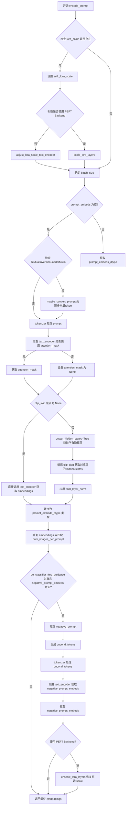
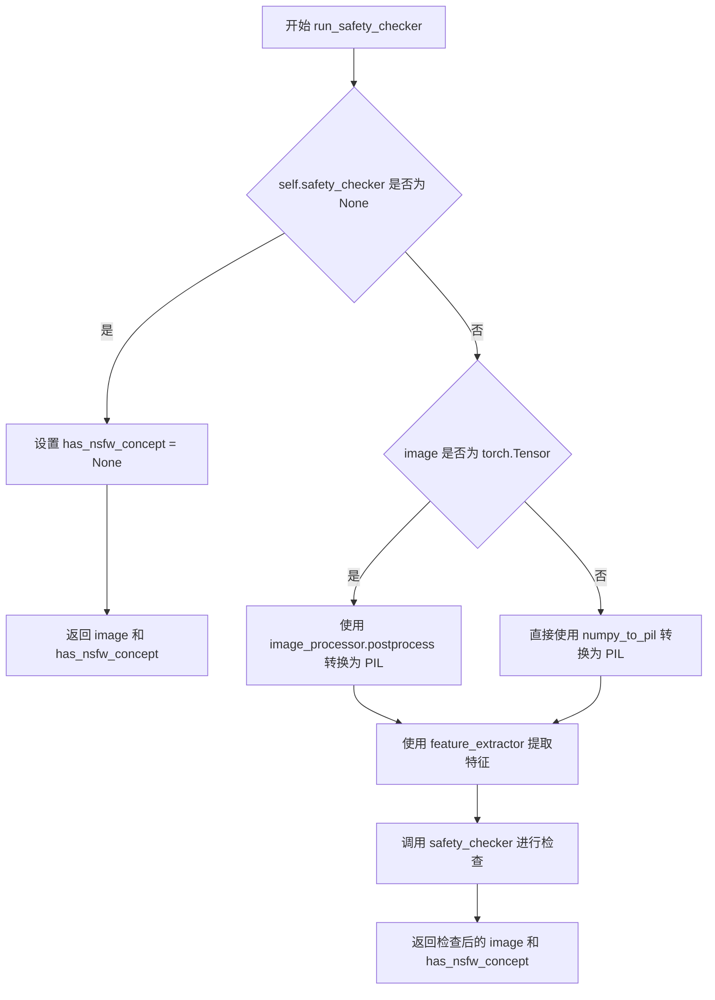
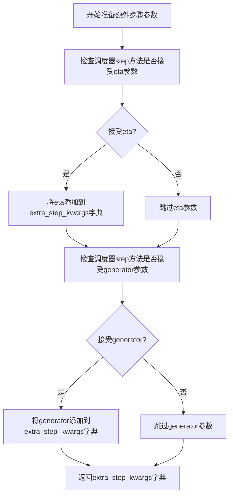
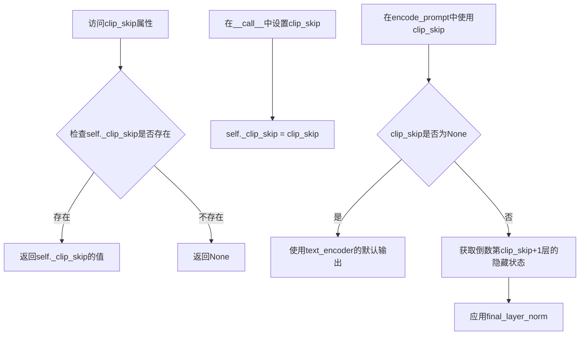
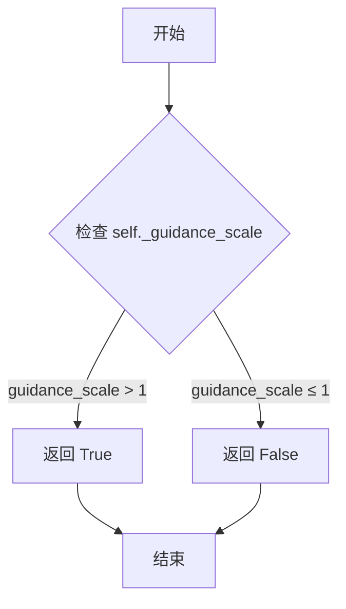
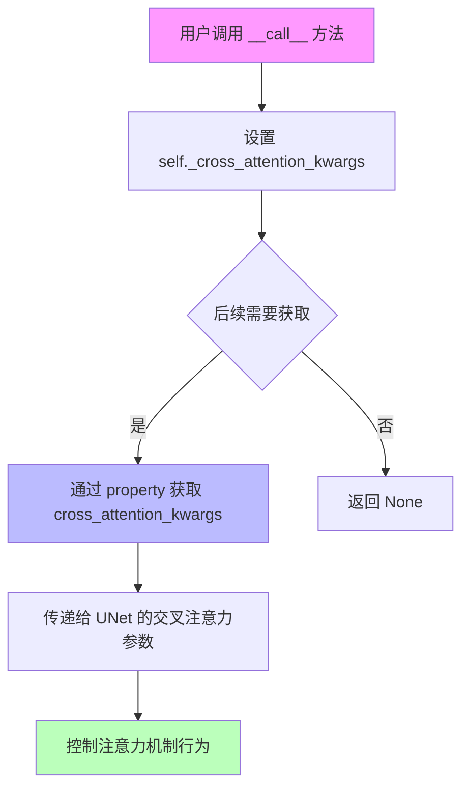
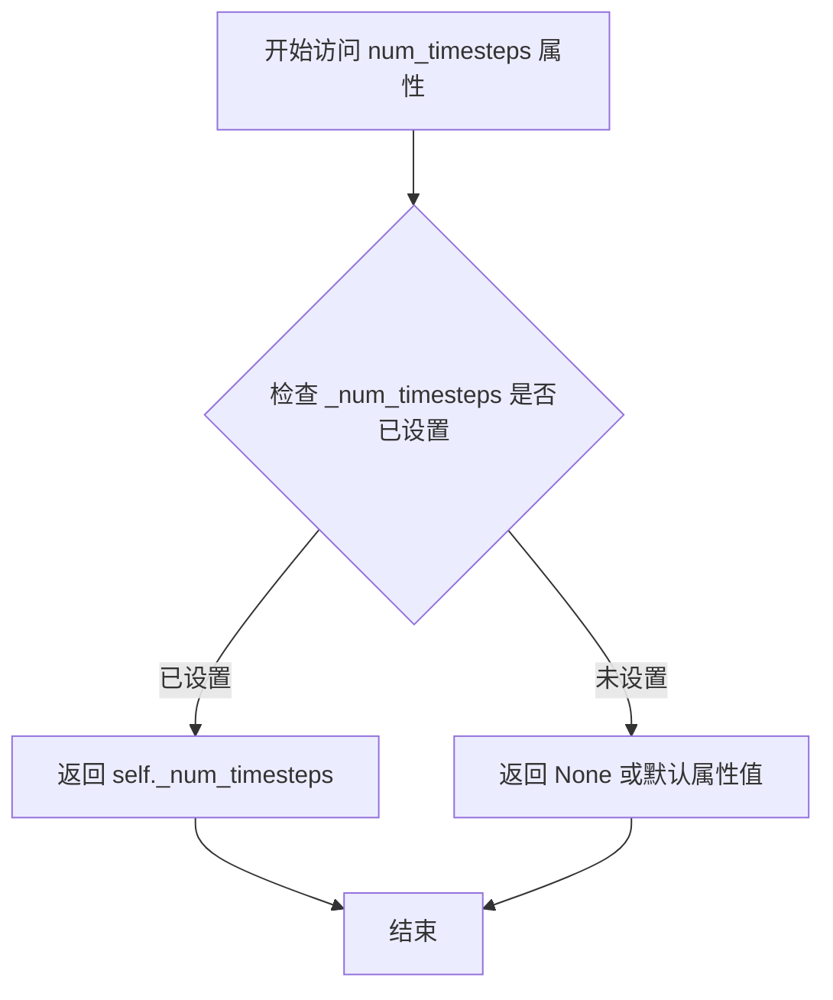

```mermaid
flowchart TD
    A[开始 __call__] --> B[检查输入参数 check_inputs]
    B --> C[定义批次大小和设备]
    C --> D[编码输入提示词 encode_prompt]
    D --> E{是否使用分类器自由引导?}
    E -->|是| F[拼接负面和正面提示词嵌入]
    E -->|否| G[继续]
    F --> G
    G --> H[准备深度图 prepare_depth_map]
    H --> I[预处理图像 image_processor.preprocess]
    I --> J[设置时间步 scheduler.set_timesteps]
    J --> K[获取时间步 get_timesteps]
    K --> L[准备潜在变量 prepare_latents]
    L --> M[准备额外步骤参数 prepare_extra_step_kwargs]
    M --> N[初始化进度条]
    N --> O[进入去噪循环 for t in timesteps]
    O --> P[扩展潜在变量以进行分类器自由引导]
    P --> Q[缩放模型输入 scheduler.scale_model_input]
    Q --> R[拼接潜在变量和深度掩码]
    R --> S[UNet预测噪声噪声残差]
    S --> T{是否使用分类器自由引导?}
    T -->|是| U[分离无条件噪声预测和条件噪声预测]
    T -->|否| V[继续]
    U --> W[计算引导后的噪声预测]
    W --> V
    V --> X[scheduler.step计算上一步的潜在变量]
    X --> Y{是否有callback_on_step_end?}
    Y -->|是| Z[执行回调函数并更新潜在变量]
    Y -->|否| AA[继续]
    Z --> AB
    AA --> AB{是否完成去噪?}
    AB -->|否| O
    AB -->|是| AC{output_type是否为latent?}
    AC -->|否| AD[VAE解码潜在变量]
    AC -->|是| AE[直接使用潜在变量作为图像]
    AD --> AE
    AE --> AF[后处理图像 image_processor.postprocess]
    AF --> AG[释放模型钩子 maybe_free_model_hooks]
    AG --> AH{return_dict为True?}
    AH -->|是| AI[返回ImagePipelineOutput]
    AH -->|否| AJ[返回元组]
    AI --> AK[结束]
    AJ --> AK
```

# `diffusers\src\diffusers\pipelines\stable_diffusion\pipeline_stable_diffusion_depth2img.py` 详细设计文档

StableDiffusionDepth2ImgPipeline是一个用于基于深度信息的图像到图像生成的Stable Diffusion管道。该管道继承自DiffusionPipeline，结合了DPT深度估计模型和Stable Diffusion模型，通过文本提示和深度图引导图像生成，实现从源图像到目标图像的条件转换。

## 整体流程

```mermaid
graph TD
A[开始 __call__] --> B[1. 检查输入参数]
B --> C[2. 定义调用参数 batch_size]
C --> D[3. 编码输入提示词 encode_prompt]
D --> E{是否使用CFG?}
E -- 是 --> F[拼接negative_prompt_embeds和prompt_embeds]
E -- 否 --> G[4. 准备深度图 prepare_depth_map]
F --> G
G --> H[5. 预处理图像 image_processor.preprocess]
H --> I[6. 设置时间步长 scheduler.set_timesteps]
I --> J[7. 准备潜在变量 prepare_latents]
J --> K[8. 准备额外步进参数 prepare_extra_step_kwargs]
K --> L[9. 去噪循环]
L --> M{是否完成所有步?}
M -- 否 --> N[扩展latents for CFG]
N --> O[scheduler.scale_model_input]
O --> P[拼接latent_model_input和depth_mask]
P --> Q[UNet预测噪声]
Q --> R{是否使用CFG?}
R -- 是 --> S[计算guidance: noise_pred_uncond + guidance_scale * (noise_pred_text - noise_pred_uncond)]
R -- 否 --> T[scheduler.step计算上一步]
S --> T
T --> U[回调处理 callback_on_step_end]
U --> L
M -- 是 --> V[10. 解码VAE decode latents]
V --> W[11. 后处理图像 postprocess]
W --> X[返回ImagePipelineOutput]
```

## 类结构

```
DiffusionPipeline (基类)
├── TextualInversionLoaderMixin (混入)
│   └── 提供文本反转嵌入加载功能
└── StableDiffusionLoraLoaderMixin (混入)
    └── 提供LoRA权重加载/保存功能
└── StableDiffusionDepth2ImgPipeline (主类)
    ├── 模型组件 (vae, text_encoder, tokenizer, unet, scheduler)
    ├── 深度估计组件 (depth_estimator, feature_extractor)
    └── 图像处理组件 (image_processor)
```

## 全局变量及字段


### `logger`
    
模块级日志记录器，用于记录运行时信息

类型：`logging.Logger`
    


### `XLA_AVAILABLE`
    
标志位，指示XLA是否可用

类型：`bool`
    


### `StableDiffusionDepth2ImgPipeline.vae`
    
VAE模型，用于图像与潜在表示之间的编码和解码

类型：`AutoencoderKL`
    


### `StableDiffusionDepth2ImgPipeline.text_encoder`
    
冻结的文本编码器，用于将文本提示转换为嵌入向量

类型：`CLIPTextModel`
    


### `StableDiffusionDepth2ImgPipeline.tokenizer`
    
CLIP分词器，用于将文本分割为token序列

类型：`CLIPTokenizer`
    


### `StableDiffusionDepth2ImgPipeline.unet`
    
条件UNet模型，用于在扩散过程中对潜在表示进行去噪

类型：`UNet2DConditionModel`
    


### `StableDiffusionDepth2ImgPipeline.scheduler`
    
扩散调度器，用于控制去噪过程的噪声调度

类型：`KarrasDiffusionSchedulers`
    


### `StableDiffusionDepth2ImgPipeline.depth_estimator`
    
DPT深度估计模型，用于预测输入图像的深度图

类型：`DPTForDepthEstimation`
    


### `StableDiffusionDepth2ImgPipeline.feature_extractor`
    
DPT图像处理器，用于预处理图像以供深度估计模型使用

类型：`DPTImageProcessor`
    


### `StableDiffusionDepth2ImgPipeline.vae_scale_factor`
    
VAE缩放因子，用于调整潜在空间的分辨率

类型：`int`
    


### `StableDiffusionDepth2ImgPipeline.image_processor`
    
VAE图像处理器，用于图像的预处理和后处理

类型：`VaeImageProcessor`
    


### `StableDiffusionDepth2ImgPipeline.model_cpu_offload_seq`
    
CPU卸载顺序字符串，定义模型组件卸载到CPU的顺序

类型：`str`
    


### `StableDiffusionDepth2ImgPipeline._callback_tensor_inputs`
    
回调函数可用的张量输入名称列表

类型：`list`
    


### `StableDiffusionDepth2ImgPipeline._guidance_scale`
    
分类器自由引导比例，用于控制文本提示对生成图像的影响程度

类型：`float`
    


### `StableDiffusionDepth2ImgPipeline._clip_skip`
    
CLIP跳过的层数，用于控制使用哪一层隐藏状态生成提示嵌入

类型：`int`
    


### `StableDiffusionDepth2ImgPipeline._cross_attention_kwargs`
    
交叉注意力机制的关键字参数字典，用于自定义注意力操作

类型：`dict`
    


### `StableDiffusionDepth2ImgPipeline._num_timesteps`
    
扩散过程的时间步总数，记录当前运行的步数

类型：`int`
    
    

## 全局函数及方法


### `retrieve_latents`

该函数是 Stable Diffusion 系列管道中的工具函数，用于从 VAE 编码器的输出中检索潜在表示（latents）。它支持三种获取方式：从潜在分布中采样、从潜在分布中取众数（argmax），或直接返回预存的 latents 属性。这是实现图像到图像生成任务的关键中间步骤。

参数：

- `encoder_output`：`torch.Tensor`，编码器输出对象，通常是 VAE 的 EncodeOutput，包含 `latent_dist`（潜在分布）或 `latents`（直接潜在向量）属性
- `generator`：`torch.Generator | None`，可选的 PyTorch 生成器，用于控制随机采样过程，确保生成可复现
- `sample_mode`：`str`，采样模式，默认为 `"sample"`（从分布中采样），也可设为 `"argmax"`（取分布的众数/最可能值）

返回值：`torch.Tensor`，检索到的潜在表示张量，可用于后续的去噪过程

#### 流程图

```mermaid
flowchart TD
    A[开始: retrieve_latents] --> B{encoder_output 是否有 latent_dist 属性?}
    B -->|是| C{sample_mode == 'sample'?}
    C -->|是| D[返回 encoder_output.latent_dist.sample(generator)]
    C -->|否| E{sample_mode == 'argmax'?}
    E -->|是| F[返回 encoder_output.latent_dist.mode()]
    E -->|否| G[抛出 AttributeError]
    B -->|否| H{encoder_output 是否有 latents 属性?}
    H -->|是| I[返回 encoder_output.latents]
    H -->|否| J[抛出 AttributeError: Could not access latents]
    D --> K[结束: 返回 latents 张量]
    F --> K
    I --> K
    G --> L[结束: 异常]
    J --> L
```

#### 带注释源码

```python
# Copied from diffusers.pipelines.stable_diffusion.pipeline_stable_diffusion_img2img.retrieve_latents
def retrieve_latents(
    encoder_output: torch.Tensor, generator: torch.Generator | None = None, sample_mode: str = "sample"
):
    """
    从 encoder_output 中检索 latents 潜在向量。
    
    该函数支持多种获取潜在表示的方式：
    1. 当 encoder_output 包含 latent_dist 属性时，根据 sample_mode 从分布中采样或取众数
    2. 当 encoder_output 直接包含 latents 属性时，直接返回该属性
    
    参数:
        encoder_output: 编码器输出，通常是 VAE 的输出对象
        generator: 可选的随机生成器，用于采样时的随机性控制
        sample_mode: 采样模式，'sample' 从分布采样，'argmax' 取分布模式
    
    返回:
        潜在表示张量
    
    异常:
        AttributeError: 当无法从 encoder_output 访问 latents 时抛出
    """
    # 检查 encoder_output 是否有 latent_dist 属性（VAE 编码器的概率输出）
    if hasattr(encoder_output, "latent_dist") and sample_mode == "sample":
        # 模式1: 从潜在分布中随机采样（保留随机性）
        return encoder_output.latent_dist.sample(generator)
    elif hasattr(encoder_output, "latent_dist") and sample_mode == "argmax":
        # 模式2: 取潜在分布的众数/最可能值（确定性输出）
        return encoder_output.latent_dist.mode()
    elif hasattr(encoder_output, "latents"):
        # 模式3: 直接返回预存的 latents（编码结果已确定）
        return encoder_output.latents
    else:
        # 错误处理: encoder_output 不包含任何可访问的 latents
        raise AttributeError("Could not access latents of provided encoder_output")
```


### `preprocess`

预处理图像（已弃用），将PIL图像或图像列表转换为适合Stable Diffusion处理的张量格式，包括尺寸调整、归一化等操作。该方法已被弃用，建议使用`VaeImageProcessor.preprocess()`替代。

参数：

- `image`：`torch.Tensor | PIL.Image.Image | list[PIL.Image.Image]`，输入图像，可以是张量、PIL图像或图像列表

返回值：`torch.Tensor`，处理后的图像张量，形状为(batch, channel, height, width)，值域为[-1, 1]

#### 流程图

```mermaid
flowchart TD
    A[开始 preprocess] --> B{image 是 torch.Tensor?}
    B -->|是| C[直接返回 image]
    B -->|否| D{image 是 PIL.Image.Image?}
    D -->|是| E[转换为列表 image = [image]
    D -->|否| F[保持原列表]
    E --> G
    F --> G{image[0] 是 PIL.Image?}
    G -->|是| H[获取图像尺寸 w, h]
    H --> I[调整尺寸为8的整数倍: w = w - w%8, h = h - h%8]
    I --> J[使用lanczos重采样调整大小]
    J --> K[转换为numpy数组]
    K --> L[归一化到 [0, 1]: / 255.0]
    L --> M[转换维度: transpose(0, 3, 1, 2)]
    M --> N[缩放到 [-1, 1]: 2.0 * image - 1.0]
    N --> O[转换为torch.Tensor]
    O --> P[返回处理后的张量]
    G -->|否| Q{image[0] 是 torch.Tensor?}
    Q -->|是| R[沿dim=0拼接: torch.cat]
    R --> P
    Q -->|否| S[抛出异常或返回]
```

#### 带注释源码

```python
def preprocess(image):
    """
    预处理输入图像，将其转换为模型可处理的张量格式。
    
    注意：此方法已弃用，请使用 VaeImageProcessor.preprocess() 代替。
    """
    # 发出弃用警告，提示用户使用新方法
    deprecation_message = "The preprocess method is deprecated and will be removed in diffusers 1.0.0. Please use VaeImageProcessor.preprocess(...) instead"
    deprecate("preprocess", "1.0.0", deprecation_message, standard_warn=False)
    
    # 如果输入已经是torch.Tensor，直接返回（passthrough）
    if isinstance(image, torch.Tensor):
        return image
    # 如果是单个PIL图像，转换为列表以便统一处理
    elif isinstance(image, PIL.Image.Image):
        image = [image]

    # 处理PIL图像列表
    if isinstance(image[0], PIL.Image.Image):
        # 获取第一张图像的尺寸
        w, h = image[0].size
        # 调整尺寸为8的整数倍，以适配UNet的潜在空间要求
        # Stable Diffusion的潜在空间通常是图像尺寸的1/8
        w, h = (x - x % 8 for x in (w, h))

        # 对每张图像进行resize并转换为numpy数组
        # [None, :] 在数组开头添加batch维度
        image = [np.array(i.resize((w, h), resample=PIL_INTERPOLATION["lanczos"]))[None, :] for i in image]
        # 在batch维度上拼接所有图像
        image = np.concatenate(image, axis=0)
        # 归一化到[0, 1]范围（原本是0-255）
        image = np.array(image).astype(np.float32) / 255.0
        # 转换维度顺序从 (batch, height, width, channel) 到 (batch, channel, height, width)
        # 这是PyTorch的标准图像格式
        image = image.transpose(0, 3, 1, 2)
        # 缩放到[-1, 1]范围，这是Stable Diffusion模型期望的输入范围
        image = 2.0 * image - 1.0
        # 转换为PyTorch张量
        image = torch.from_numpy(image)
    # 处理torch.Tensor列表
    elif isinstance(image[0], torch.Tensor):
        # 在batch维度上拼接多个张量
        image = torch.cat(image, dim=0)
    
    return image
```


### `StableDiffusionDepth2ImgPipeline.__init__`

该方法是 StableDiffusionDepth2ImgPipeline 类的构造函数，用于初始化深度到图像生成管道。它接收 VAE、文本编码器、分词器、UNet、调度器、深度估计器和特征提取器等核心组件，并进行版本兼容性检查和模块注册。

参数：

- `vae`：`AutoencoderKL`，Variational Auto-Encoder (VAE) 模型，用于编码和解码图像与潜在表示
- `text_encoder`：`CLIPTextModel`，冻结的文本编码器 (clip-vit-large-patch14)
- `tokenizer`：`CLIPTokenizer`，用于对文本进行分词的 CLIPTokenizer
- `unet`：`UNet2DConditionModel`，用于对编码后的图像潜在表示进行去噪的 UNet 模型
- `scheduler`：`KarrasDiffusionSchedulers`，与 unet 结合使用进行潜在表示去噪的调度器
- `depth_estimator`：`DPTForDepthEstimation`，用于预测图像深度信息的 DPT 深度估计模型
- `feature_extractor`：`DPTImageProcessor`，用于处理图像以进行深度估计的 DPT 图像处理器

返回值：无（构造函数）

#### 流程图

```mermaid
flowchart TD
    A[开始 __init__] --> B[调用 super().__init__]
    B --> C{检查 UNet 版本 < 0.9.0 且 sample_size < 64}
    C -->|是| D[生成弃用警告消息]
    D --> E[更新 unet.config sample_size 为 64]
    C -->|否| F[跳过版本检查]
    E --> G[注册所有模块]
    F --> G
    G --> H[计算 vae_scale_factor]
    H --> I[创建 VaeImageProcessor]
    I --> J[结束 __init__]
```

#### 带注释源码

```python
def __init__(
    self,
    vae: AutoencoderKL,
    text_encoder: CLIPTextModel,
    tokenizer: CLIPTokenizer,
    unet: UNet2DConditionModel,
    scheduler: KarrasDiffusionSchedulers,
    depth_estimator: DPTForDepthEstimation,
    feature_extractor: DPTImageProcessor,
):
    """
    初始化 StableDiffusionDepth2ImgPipeline 管道。
    
    参数:
        vae: Variational Auto-Encoder (VAE) 模型，用于编码和解码图像
        text_encoder: CLIP 文本编码器
        tokenizer: CLIP 分词器
        unet: 用于去噪的条件 UNet2D 模型
        scheduler: 扩散调度器
        depth_estimator: DPT 深度估计模型
        feature_extractor: DPT 图像处理器
    """
    # 调用父类 DiffusionPipeline 的初始化方法
    super().__init__()

    # 检查 UNet 配置版本是否小于 0.9.0
    is_unet_version_less_0_9_0 = (
        unet is not None
        and hasattr(unet.config, "_diffusers_version")
        and version.parse(version.parse(unet.config._diffusers_version).base_version) < version.parse("0.9.0.dev0")
    )
    # 检查 UNet sample_size 是否小于 64
    is_unet_sample_size_less_64 = (
        unet is not None and hasattr(unet.config, "sample_size") and unet.config.sample_size < 64
    )
    # 如果 UNet 版本较旧且 sample_size 小于 64，发出弃用警告并更新配置
    if is_unet_version_less_0_9_0 and is_unet_sample_size_less_64:
        deprecation_message = (
            "The configuration file of the unet has set the default `sample_size` to smaller than"
            " 64 which seems highly unlikely .If you're checkpoint is a fine-tuned version of any of the"
            " following: \n- CompVis/stable-diffusion-v1-4 \n- CompVis/stable-diffusion-v1-3 \n-"
            " CompVis/stable-diffusion-v1-2 \n- CompVis/stable-diffusion-v1-1 \n- stable-diffusion-v1-5/stable-diffusion-v1-5"
            " \n- stable-diffusion-v1-5/stable-diffusion-inpainting \n you should change 'sample_size' to 64 in the"
            " configuration file. Please make sure to update the config accordingly as leaving `sample_size=32`"
            " in the config might lead to incorrect results in future versions. If you have downloaded this"
            " checkpoint from the Hugging Face Hub, it would be very nice if you could open a Pull request for"
            " the `unet/config.json` file"
        )
        deprecate("sample_size<64", "1.0.0", deprecation_message, standard_warn=False)
        new_config = dict(unet.config)
        new_config["sample_size"] = 64
        unet._internal_dict = FrozenDict(new_config)

    # 注册所有模块，使管道可以访问和保存这些组件
    self.register_modules(
        vae=vae,
        text_encoder=text_encoder,
        tokenizer=tokenizer,
        unet=unet,
        scheduler=scheduler,
        depth_estimator=depth_estimator,
        feature_extractor=feature_extractor,
    )
    # 计算 VAE 缩放因子，基于 VAE 块输出通道数
    self.vae_scale_factor = 2 ** (len(self.vae.config.block_out_channels) - 1) if getattr(self, "vae", None) else 8
    # 创建图像处理器，用于预处理和后处理图像
    self.image_processor = VaeImageProcessor(vae_scale_factor=self.vae_scale_factor)
```


### `StableDiffusionDepth2ImgPipeline._encode_prompt`

该方法是Stable Diffusion Depth2Img Pipeline中用于编码提示词的已弃用方法。它内部调用新的`encode_prompt`方法，并为了保持向后兼容性，将返回的元组（包含提示词嵌入和负面提示词嵌入）反向连接成一个单一的tensor。该方法将在diffusers 1.0.0版本中移除，建议使用`encode_prompt()`方法替代。

参数：

- `prompt`：`str | list[str]`，需要编码的文本提示词，可以是单个字符串或字符串列表
- `device`：`torch.device`，指定计算设备（CPU/CUDA）
- `num_images_per_prompt`：`int`，每个提示词要生成的图像数量
- `do_classifier_free_guidance`：`bool`，是否启用无分类器引导（CFG）
- `negative_prompt`：`str | list[str] | None`，负面提示词，用于引导不生成的内容
- `prompt_embeds`：`torch.Tensor | None`，可选的预计算提示词嵌入
- `negative_prompt_embeds`：`torch.Tensor | None`，可选的预计算负面提示词嵌入
- `lora_scale`：`float | None`，可选的LoRA缩放因子
- `**kwargs`：其他可选关键字参数

返回值：`torch.Tensor`，连接后的提示词嵌入tensor（为了向后兼容性，将负面提示词嵌入和正向提示词嵌入反向连接）

#### 流程图

```mermaid
flowchart TD
    A[开始 _encode_prompt] --> B[发出弃用警告]
    B --> C[调用 self.encode_prompt 方法]
    C --> D[获取返回的元组 prompt_embeds_tuple]
    D --> E[连接 tensor: torch.cat<br/>[prompt_embeds_tuple[1], prompt_embeds_tuple[0]]]
    E --> F[返回连接后的 prompt_embeds]
```

#### 带注释源码

```
def _encode_prompt(
    self,
    prompt,
    device,
    num_images_per_prompt,
    do_classifier_free_guidance,
    negative_prompt=None,
    prompt_embeds: torch.Tensor | None = None,
    negative_prompt_embeds: torch.Tensor | None = None,
    lora_scale: float | None = None,
    **kwargs,
):
    # 发出弃用警告，提示用户使用 encode_prompt() 代替
    deprecation_message = "`_encode_prompt()` is deprecated and it will be removed in a future version. Use `encode_prompt()` instead. Also, be aware that the output format changed from a concatenated tensor to a tuple."
    deprecate("_encode_prompt()", "1.0.0", deprecation_message, standard_warn=False)

    # 调用新的 encode_prompt 方法获取提示词嵌入元组
    # 返回值为 (prompt_embeds, negative_prompt_embeds) 的元组
    prompt_embeds_tuple = self.encode_prompt(
        prompt=prompt,
        device=device,
        num_images_per_prompt=num_images_per_prompt,
        do_classifier_free_guidance=do_classifier_free_guidance,
        negative_prompt=negative_prompt,
        prompt_embeds=prompt_embeds,
        negative_prompt_embeds=negative_prompt_embeds,
        lora_scale=lora_scale,
        **kwargs,
    )

    # 为了向后兼容性，将元组中的两个tensor反向连接
    # 新方法返回 (prompt_embeds, negative_prompt_embeds)
    # 旧方法需要 [negative_prompt_embeds, prompt_embeds] 的顺序
    # concatenate for backwards comp
    prompt_embeds = torch.cat([prompt_embeds_tuple[1], prompt_embeds_tuple[0]])

    return prompt_embeds
```


### `StableDiffusionDepth2ImgPipeline.encode_prompt`

该方法用于将文本提示词编码为文本编码器的隐藏状态（text encoder hidden states），支持LoRA权重调整、classifier-free guidance（无分类器引导）、文本反转（textual inversion）以及clip_skip等功能，最终返回正向和负向的prompt embeddings元组。

参数：

- `self`：`StableDiffusionDepth2ImgPipeline` 类实例
- `prompt`：`str | list[str] | None`，需要编码的文本提示词
- `device`：`torch.device`，PyTorch设备对象
- `num_images_per_prompt`：`int`，每个提示词要生成的图像数量
- `do_classifier_free_guidance`：`bool`，是否启用无分类器引导
- `negative_prompt`：`str | list[str] | None`，负向提示词，用于引导不包含在图像中的内容
- `prompt_embeds`：`torch.Tensor | None`，可选的预生成文本嵌入，用于微调文本输入
- `negative_prompt_embeds`：`torch.Tensor | None`，可选的预生成负向文本嵌入
- `lora_scale`：`float | None`，LoRA缩放因子，用于调整LoRA层的权重
- `clip_skip`：`int | None`，CLIP编码时跳过的层数，用于获取不同层次的表示

返回值：`tuple[torch.Tensor, torch.Tensor]`，返回(prompt_embeds, negative_prompt_embeds)元组，分别代表正向和负向的文本嵌入张量

#### 流程图



#### 带注释源码

```python
def encode_prompt(
    self,
    prompt,
    device,
    num_images_per_prompt,
    do_classifier_free_guidance,
    negative_prompt=None,
    prompt_embeds: torch.Tensor | None = None,
    negative_prompt_embeds: torch.Tensor | None = None,
    lora_scale: float | None = None,
    clip_skip: int | None = None,
):
    r"""
    Encodes the prompt into text encoder hidden states.

    Args:
        prompt (`str` or `list[str]`, *optional*):
            prompt to be encoded
        device: (`torch.device`):
            torch device
        num_images_per_prompt (`int`):
            number of images that should be generated per prompt
        do_classifier_free_guidance (`bool`):
            whether to use classifier free guidance or not
        negative_prompt (`str` or `list[str]`, *optional*):
            The prompt or prompts not to guide the image generation. If not defined, one has to pass
            `negative_prompt_embeds` instead. Ignored when not using guidance (i.e., ignored if `guidance_scale` is
            less than `1`).
        prompt_embeds (`torch.Tensor`, *optional*):
            Pre-generated text embeddings. Can be used to easily tweak text inputs, *e.g.* prompt weighting. If not
            provided, text embeddings will be generated from `prompt` input argument.
        negative_prompt_embeds (`torch.Tensor`, *optional*):
            Pre-generated negative text embeddings. Can be used to easily tweak text inputs, *e.g.* prompt
            weighting. If not provided, negative_prompt_embeds will be generated from `negative_prompt` input
            argument.
        lora_scale (`float`, *optional*):
            A LoRA scale that will be applied to all LoRA layers of the text encoder if LoRA layers are loaded.
        clip_skip (`int`, *optional*):
            Number of layers to be skipped from CLIP while computing the prompt embeddings. A value of 1 means that
            the output of the pre-final layer will be used for computing the prompt embeddings.
    """
    # 设置 lora scale 以便 text encoder 的 LoRA 函数可以正确访问
    if lora_scale is not None and isinstance(self, StableDiffusionLoraLoaderMixin):
        self._lora_scale = lora_scale

        # 动态调整 LoRA scale
        if not USE_PEFT_BACKEND:
            adjust_lora_scale_text_encoder(self.text_encoder, lora_scale)
        else:
            scale_lora_layers(self.text_encoder, lora_scale)

    # 确定 batch_size
    if prompt is not None and isinstance(prompt, str):
        batch_size = 1
    elif prompt is not None and isinstance(prompt, list):
        batch_size = len(prompt)
    else:
        batch_size = prompt_embeds.shape[0]

    # 如果没有提供 prompt_embeds，则从 prompt 生成
    if prompt_embeds is None:
        # textual inversion: 如果需要处理多向量 tokens
        if isinstance(self, TextualInversionLoaderMixin):
            prompt = self.maybe_convert_prompt(prompt, self.tokenizer)

        # 使用 tokenizer 将 prompt 转换为 token ids
        text_inputs = self.tokenizer(
            prompt,
            padding="max_length",
            max_length=self.tokenizer.model_max_length,
            truncation=True,
            return_tensors="pt",
        )
        text_input_ids = text_inputs.input_ids
        
        # 获取未截断的 token ids 用于检测截断
        untruncated_ids = self.tokenizer(prompt, padding="longest", return_tensors="pt").input_ids

        # 检测并警告截断的 tokens
        if untruncated_ids.shape[-1] >= text_input_ids.shape[-1] and not torch.equal(
            text_input_ids, untruncated_ids
        ):
            removed_text = self.tokenizer.batch_decode(
                untruncated_ids[:, self.tokenizer.model_max_length - 1 : -1]
            )
            logger.warning(
                "The following part of your input was truncated because CLIP can only handle sequences up to"
                f" {self.tokenizer.model_max_length} tokens: {removed_text}"
            )

        # 获取 attention_mask
        if hasattr(self.text_encoder.config, "use_attention_mask") and self.text_encoder.config.use_attention_mask:
            attention_mask = text_inputs.attention_mask.to(device)
        else:
            attention_mask = None

        # 根据 clip_skip 参数决定如何获取 prompt embeddings
        if clip_skip is None:
            # 直接获取最后一个隐藏层
            prompt_embeds = self.text_encoder(text_input_ids.to(device), attention_mask=attention_mask)
            prompt_embeds = prompt_embeds[0]
        else:
            # 获取所有隐藏层，然后选择对应层
            prompt_embeds = self.text_encoder(
                text_input_ids.to(device), attention_mask=attention_mask, output_hidden_states=True
            )
            # hidden_states 是一个元组，包含所有编码器层的隐藏状态
            # 根据 clip_skip 选择对应层的输出
            prompt_embeds = prompt_embeds[-1][-(clip_skip + 1)]
            # 应用 final_layer_norm 以保持表示的一致性
            prompt_embeds = self.text_encoder.text_model.final_layer_norm(prompt_embeds)

    # 确定 prompt_embeds 的数据类型
    if self.text_encoder is not None:
        prompt_embeds_dtype = self.text_encoder.dtype
    elif self.unet is not None:
        prompt_embeds_dtype = self.unet.dtype
    else:
        prompt_embeds_dtype = prompt_embeds.dtype

    # 转换 prompt_embeds 的设备和数据类型
    prompt_embeds = prompt_embeds.to(dtype=prompt_embeds_dtype, device=device)

    # 重复 embeddings 以匹配 num_images_per_prompt
    bs_embed, seq_len, _ = prompt_embeds.shape
    # 使用 MPS 友好的方法复制 text embeddings
    prompt_embeds = prompt_embeds.repeat(1, num_images_per_prompt, 1)
    prompt_embeds = prompt_embeds.view(bs_embed * num_images_per_prompt, seq_len, -1)

    # 获取 classifier-free guidance 所需的无条件 embeddings
    if do_classifier_free_guidance and negative_prompt_embeds is None:
        uncond_tokens: list[str]
        if negative_prompt is None:
            uncond_tokens = [""] * batch_size
        elif prompt is not None and type(prompt) is not type(negative_prompt):
            raise TypeError(
                f"`negative_prompt` should be the same type to `prompt`, but got {type(negative_prompt)} !="
                f" {type(prompt)}."
            )
        elif isinstance(negative_prompt, str):
            uncond_tokens = [negative_prompt]
        elif batch_size != len(negative_prompt):
            raise ValueError(
                f"`negative_prompt`: {negative_prompt} has batch size {len(negative_prompt)}, but `prompt`:"
                f" {prompt} has batch size {batch_size}. Please make sure that passed `negative_prompt` matches"
                " the batch size of `prompt`."
            )
        else:
            uncond_tokens = negative_prompt

        # textual inversion: 处理多向量 tokens
        if isinstance(self, TextualInversionLoaderMixin):
            uncond_tokens = self.maybe_convert_prompt(uncond_tokens, self.tokenizer)

        max_length = prompt_embeds.shape[1]
        uncond_input = self.tokenizer(
            uncond_tokens,
            padding="max_length",
            max_length=max_length,
            truncation=True,
            return_tensors="pt",
        )

        # 获取 attention_mask
        if hasattr(self.text_encoder.config, "use_attention_mask") and self.text_encoder.config.use_attention_mask:
            attention_mask = uncond_input.attention_mask.to(device)
        else:
            attention_mask = None

        # 获取 negative prompt embeddings
        negative_prompt_embeds = self.text_encoder(
            uncond_input.input_ids.to(device),
            attention_mask=attention_mask,
        )
        negative_prompt_embeds = negative_prompt_embeds[0]

    # 如果使用 classifier-free guidance，复制 negative embeddings
    if do_classifier_free_guidance:
        seq_len = negative_prompt_embeds.shape[1]

        negative_prompt_embeds = negative_prompt_embeds.to(dtype=prompt_embeds_dtype, device=device)

        # MPS 友好的复制方法
        negative_prompt_embeds = negative_prompt_embeds.repeat(1, num_images_per_prompt, 1)
        negative_prompt_embeds = negative_prompt_embeds.view(batch_size * num_images_per_prompt, seq_len, -1)

    # 如果使用 PEFT Backend，恢复 LoRA 层的原始 scale
    if self.text_encoder is not None:
        if isinstance(self, StableDiffusionLoraLoaderMixin) and USE_PEFT_BACKEND:
            # 通过 unscale 恢复原始 scale
            unscale_lora_layers(self.text_encoder, lora_scale)

    return prompt_embeds, negative_prompt_embeds
```


### `StableDiffusionDepth2ImgPipeline.run_safety_checker`

该方法用于检查生成图像中是否存在不安全内容（如 NSFW），通过安全检查器（Safety Checker）对图像进行评估。如果未配置安全检查器，则直接返回原图像和 `None`。

参数：

- `image`：`torch.Tensor | np.ndarray | list`，待检查的图像，可以是张量、numpy数组或图像列表
- `device`：`torch.device`，执行安全检查的设备（如 CPU 或 CUDA）
- `dtype`：`torch.dtype`，用于安全检查器的数据类型（如 float32）

返回值：`(torch.Tensor | np.ndarray | list, torch.Tensor | None)`，返回处理后的图像和一个布尔张量（表示是否存在 NSFW 内容），如果没有配置安全检查器则返回 `None`

#### 流程图



#### 带注释源码

```python
def run_safety_checker(self, image, device, dtype):
    """
    运行安全检查器以检测图像中是否包含 NSFW 内容。

    参数:
        image: 待检查的图像，支持 torch.Tensor、np.ndarray 或 list 类型
        device: 执行安全检查的设备
        dtype: 安全检查器使用的数据类型

    返回:
        tuple: (处理后的图像, NSFW 检测结果张量或 None)
    """
    # 如果未配置安全检查器，直接返回原图像和 None
    if self.safety_checker is None:
        has_nsfw_concept = None
    else:
        # 将图像转换为 PIL 格式以供 feature_extractor 使用
        if torch.is_tensor(image):
            # 对于张量图像，使用后处理器转换为 PIL 图像
            feature_extractor_input = self.image_processor.postprocess(image, output_type="pil")
        else:
            # 对于 numpy 数组，直接转换为 PIL 图像
            feature_extractor_input = self.image_processor.numpy_to_pil(image)
        
        # 使用特征提取器准备安全检查器的输入
        safety_checker_input = self.feature_extractor(
            feature_extractor_input, 
            return_tensors="pt"
        ).to(device)
        
        # 调用安全检查器进行 NSFW 检测
        # clip_input 参数传入预处理后的像素值
        image, has_nsfw_concept = self.safety_checker(
            images=image, 
            clip_input=safety_checker_input.pixel_values.to(dtype)
        )
    
    return image, has_nsfw_concept
```


### `StableDiffusionDepth2ImgPipeline.decode_latents`

该方法用于将潜在表示（latents）解码为实际图像。它接收VAE编码后的潜在表示，进行逆缩放，使用VAE解码器解码为图像，并对像素值进行归一化处理后转换为NumPy数组返回。此方法已被标记为弃用，将在1.0.0版本中移除，建议使用`VaeImageProcessor.postprocess(...)`替代。

参数：

- `latents`：`torch.Tensor`，需要解码的潜在表示张量

返回值：`np.ndarray`，解码后的图像，形状为(batch_size, height, width, channels)，像素值范围[0, 1]

#### 流程图

```mermaid
flowchart TD
    A[开始 decode_latents] --> B[记录弃用警告]
    B --> C[latents = 1 / scaling_factor * latents]
    C --> D[image = vae.decode(latents)]
    D --> E[image = (image / 2 + 0.5).clamp 0, 1]
    E --> F[image = image.cpu.permute 0, 2, 3, 1.float.numpy]
    F --> G[返回 image NumPy数组]
```

#### 带注释源码

```python
def decode_latents(self, latents):
    """
    将潜在表示解码为图像数组。

    注意：此方法已被弃用，将在1.0.0版本中移除。
    建议使用 VaeImageProcessor.postprocess(...) 替代。
    """
    # 记录弃用警告，提醒用户使用新方法
    deprecation_message = "The decode_latents method is deprecated and will be removed in 1.0.0. Please use VaeImageProcessor.postprocess(...) instead"
    deprecate("decode_latents", "1.0.0", deprecation_message, standard_warn=False)

    # 第一步：逆缩放潜在表示
    # VAE在编码时会乘以scaling_factor，这里需要除以它来还原
    latents = 1 / self.vae.config.scaling_factor * latents

    # 第二步：使用VAE解码器将潜在表示解码为图像
    # vae.decode返回包含多个元素的元组，[0]是解码后的图像张量
    image = self.vae.decode(latents, return_dict=False)[0]

    # 第三步：归一化图像像素值到[0, 1]范围
    # VAE输出通常在[-1, 1]范围，通过(image / 2 + 0.5)转换到[0, 1]
    # .clamp(0, 1)确保像素值不超出有效范围
    image = (image / 2 + 0.5).clamp(0, 1)

    # 第四步：转换为NumPy数组以便后续处理
    # .cpu()将张量从GPU移到CPU
    # .permute(0, 2, 3, 1)重新排列维度，从(CHW)转换为(HWC)格式
    # .float()确保数据类型为float32，兼容bfloat16且不会造成显著性能开销
    # .numpy()将PyTorch张量转换为NumPy数组
    image = image.cpu().permute(0, 2, 3, 1).float().numpy()

    # 返回解码后的图像数组
    return image
```


### `StableDiffusionDepth2ImgPipeline.prepare_extra_step_kwargs`

该方法用于为调度器（scheduler）的步骤准备额外的关键字参数。由于不同的调度器具有不同的签名，该方法通过检查调度器的`step`方法是否接受`eta`和`generator`参数来动态构建需要传递的额外参数字典。主要用于支持DDIMScheduler中的eta参数（对应DDIM论文中的η）以及各种调度器可能需要的generator参数。

参数：

- `generator`：`torch.Generator | list[torch.Generator] | None`，可选参数，用于控制随机数生成的确定性。如果提供，可以确保每次生成的结果一致
- `eta`：`float | None`，对应DDIM论文中的η参数，仅在DDIMScheduler中有效，其他调度器会忽略该参数。值应在[0, 1]范围内

返回值：`dict`，返回一个字典，包含调度器step方法所需的其他关键字参数，如`eta`和`generator`（如果调度器支持这些参数）

#### 流程图



#### 带注释源码

```python
def prepare_extra_step_kwargs(self, generator, eta):
    # 准备调度器的额外参数，因为并非所有调度器都具有相同的签名
    # eta (η) 仅在DDIMScheduler中使用，其他调度器将忽略它
    # eta对应DDIM论文中的η参数：https://huggingface.co/papers/2010.02502
    # eta的值应在[0, 1]之间

    # 使用inspect模块检查调度器的step方法签名，判断是否接受eta参数
    accepts_eta = "eta" in set(inspect.signature(self.scheduler.step).parameters.keys())
    # 初始化空字典用于存储额外参数
    extra_step_kwargs = {}
    # 如果调度器接受eta参数，则将其添加到extra_step_kwargs中
    if accepts_eta:
        extra_step_kwargs["eta"] = eta

    # 检查调度器是否接受generator参数
    accepts_generator = "generator" in set(inspect.signature(self.scheduler.step).parameters.keys())
    # 如果调度器接受generator参数，则将其添加到extra_step_kwargs中
    if accepts_generator:
        extra_step_kwargs["generator"] = generator
    
    # 返回包含额外参数的字典，供调度器step方法使用
    return extra_step_kwargs
```


### `StableDiffusionDepth2ImgPipeline.check_inputs`

该方法用于验证深度到图像生成管道的输入参数是否合法，包括检查强度值、回调步骤、张量输入、提示词和嵌入向量的有效性与一致性，确保用户同时只传递提示词或嵌入向量之一，防止无效的参数组合导致后续处理出错。

参数：

- `self`：`StableDiffusionDepth2ImgPipeline`，管道实例本身
- `prompt`：`str | list[str] | None`，用于引导图像生成的提示词或提示词列表
- `strength`：`float`，图像变换程度，取值范围 [0.0, 1.0]
- `callback_steps`：`int | None`，执行回调函数的步数间隔，必须为正整数
- `negative_prompt`：`str | list[str] | None`，用于引导图像生成时排除的内容
- `prompt_embeds`：`torch.Tensor | None`，预生成的文本嵌入向量
- `negative_prompt_embeds`：`torch.Tensor | None`，预生成的负面文本嵌入向量
- `callback_on_step_end_tensor_inputs`：`list[str] | None`，在每步结束时回调函数需要接收的张量输入列表

返回值：`None`，该方法仅进行参数验证，不返回任何值，若参数无效则抛出 `ValueError` 异常

#### 流程图

```mermaid
flowchart TD
    A[开始检查输入] --> B{strength 在 [0, 1] 范围内?}
    B -->|否| C[抛出 ValueError: strength 超出范围]
    B -->|是| D{callback_steps 是正整数?}
    D -->|否| E[抛出 ValueError: callback_steps 无效]
    D -->|是| F{callback_on_step_end_tensor_inputs 有效?}
    F -->|否| G[抛出 ValueError: 无效的 tensor inputs]
    F -->|是| H{prompt 和 prompt_embeds 同时存在?}
    H -->|是| I[抛出 ValueError: 不能同时传递]
    H -->|否| J{prompt 和 prompt_embeds 都为空?}
    J -->|是| K[抛出 ValueError: 至少需要提供一个]
    J -->|否| L{prompt 类型正确?]
    L -->|否| M[抛出 ValueError: prompt 类型错误]
    L -->|是| N{negative_prompt 和 negative_prompt_embeds 同时存在?}
    N -->|是| O[抛出 ValueError: 不能同时传递]
    N -->|否| P{prompt_embeds 和 negative_prompt_embeds 形状一致?]
    P -->|否| Q[抛出 ValueError: 形状不匹配]
    P -->|是| R[验证通过]
    C --> S[结束]
    E --> S
    G --> S
    I --> S
    K --> S
    M --> S
    O --> S
    Q --> S
    R --> S
```

#### 带注释源码

```python
def check_inputs(
    self,
    prompt,
    strength,
    callback_steps,
    negative_prompt=None,
    prompt_embeds=None,
    negative_prompt_embeds=None,
    callback_on_step_end_tensor_inputs=None,
):
    # 检查 strength 参数是否在有效范围内 [0.0, 1.0]
    if strength < 0 or strength > 1:
        raise ValueError(f"The value of strength should in [0.0, 1.0] but is {strength}")

    # 检查 callback_steps 是否为正整数（如果提供）
    if callback_steps is not None and (not isinstance(callback_steps, int) or callback_steps <= 0):
        raise ValueError(
            f"`callback_steps` has to be a positive integer but is {callback_steps} of type"
            f" {type(callback_steps)}."
        )

    # 检查 callback_on_step_end_tensor_inputs 中的所有键是否都在允许的列表中
    if callback_on_step_end_tensor_inputs is not None and not all(
        k in self._callback_tensor_inputs for k in callback_on_step_end_tensor_inputs
    ):
        raise ValueError(
            f"`callback_on_step_end_tensor_inputs` has to be in {self._callback_tensor_inputs}, but found {[k for k in callback_on_step_end_tensor_inputs if k not in self._callback_tensor_inputs]}"
        )
    
    # 检查 prompt 和 prompt_embeds 不能同时提供（互斥）
    if prompt is not None and prompt_embeds is not None:
        raise ValueError(
            f"Cannot forward both `prompt`: {prompt} and `prompt_embeds`: {prompt_embeds}. Please make sure to"
            " only forward one of the two."
        )
    # 检查至少需要提供 prompt 或 prompt_embeds 之一
    elif prompt is None and prompt_embeds is None:
        raise ValueError(
            "Provide either `prompt` or `prompt_embeds`. Cannot leave both `prompt` and `prompt_embeds` undefined."
        )
    # 检查 prompt 的类型是否为 str 或 list
    elif prompt is not None and (not isinstance(prompt, str) and not isinstance(prompt, list)):
        raise ValueError(f"`prompt` has to be of type `str` or `list` but is {type(prompt)}")

    # 检查 negative_prompt 和 negative_prompt_embeds 不能同时提供
    if negative_prompt is not None and negative_prompt_embeds is not None:
        raise ValueError(
            f"Cannot forward both `negative_prompt`: {negative_prompt} and `negative_prompt_embeds`:"
            f" {negative_prompt_embeds}. Please make sure to only forward one of the two."
        )

    # 如果同时提供了 prompt_embeds 和 negative_prompt_embeds，检查它们的形状是否一致
    if prompt_embeds is not None and negative_prompt_embeds is not None:
        if prompt_embeds.shape != negative_prompt_embeds.shape:
            raise ValueError(
                "`prompt_embeds` and `negative_prompt_embeds` must have the same shape when passed directly, but"
                f" got: `prompt_embeds` {prompt_embeds.shape} != `negative_prompt_embeds`"
                f" {negative_prompt_embeds.shape}."
            )
```


### `StableDiffusionDepth2ImgPipeline.get_timesteps`

该方法用于计算Stable Diffusion深度到图像管道的去噪时间步。它根据推理步数和图像变换强度（strength）来确定实际用于去噪的时间步序列，从而控制原始图像对生成结果的影响程度。

参数：

- `num_inference_steps`：`int`，总推理步数，即去噪过程的迭代次数
- `strength`：`float`，图像变换强度，值在0到1之间，决定了多少原始图像信息被保留
- `device`：`torch.device`，用于张量操作的设备

返回值：`tuple[torch.Tensor, int]`，返回一个元组，包含用于去噪的时间步张量（torch.Tensor）和实际执行的推理步数（int）

#### 流程图

```mermaid
flowchart TD
    A[开始 get_timesteps] --> B[计算 init_timestep = min(num_inference_steps * strength, num_inference_steps)]
    B --> C[计算 t_start = max(num_inference_steps - init_timestep, 0)]
    C --> D[从 scheduler.timesteps 中切片获取时间步: timesteps = timesteps[t_start * order :]]
    D --> E{scheduler 是否有 set_begin_index 方法?}
    E -->|是| F[调用 scheduler.set_begin_index(t_start * order)]
    E -->|否| G[跳过]
    F --> H[返回 timesteps 和 num_inference_steps - t_start]
    G --> H
```

#### 带注释源码

```python
def get_timesteps(self, num_inference_steps, strength, device):
    """
    计算用于去噪过程的时间步。
    
    根据strength参数确定从完整时间步序列中截取哪一段作为实际去噪使用。
    较高的strength值意味着更少的初始时间步，从而保留更多原始图像特征。
    
    参数:
        num_inference_steps: 总推理步数
        strength: 变换强度 (0-1)，值越大意味着对原图改动越大
        device: 计算设备
    
    返回:
        timesteps: 用于去噪的时间步序列
        actual_steps: 实际执行的推理步数
    """
    # 根据强度计算初始时间步数
    # 如果strength为1.0，则使用全部num_inference_steps步
    # 如果strength为0.8，则使用80%的步数
    init_timestep = min(int(num_inference_steps * strength), num_inference_steps)
    
    # 计算起始索引，决定从时间步序列的哪个位置开始
    # strength越大，t_start越小，使用的起始时间步越早（噪声越多）
    t_start = max(num_inference_steps - init_timestep, 0)
    
    # 从调度器获取时间步序列，按order切片
    # scheduler.order 表示调度器的阶数，用于多步调度器
    timesteps = self.scheduler.timesteps[t_start * self.scheduler.order :]
    
    # 对于某些调度器，需要设置起始索引
    if hasattr(self.scheduler, "set_begin_index"):
        self.scheduler.set_begin_index(t_start * self.scheduler.order)
    
    # 返回时间步和实际步数
    return timesteps, num_inference_steps - t_start
```


### `StableDiffusionDepth2ImgPipeline.prepare_latents`

该方法负责将输入图像转换为潜在向量（latents），并根据给定的时间步长添加噪声，为深度到图像的扩散模型推理准备输入数据。

参数：

- `self`：`StableDiffusionDepth2ImgPipeline` 实例，隐式参数，管道对象本身
- `image`：`torch.Tensor | PIL.Image.Image | list`，输入的图像，可以是张量、PIL图像或图像列表
- `timestep`：`torch.Tensor`，当前去噪步骤的时间步，用于添加噪声
- `batch_size`：`int`，文本提示的批处理大小
- `num_images_per_prompt`：`int`，每个提示词生成的图像数量
- `dtype`：`torch.dtype`，潜在向量的数据类型（如 float16、float32）
- `device`：`torch.device`，计算设备（cuda 或 cpu）
- `generator`：`torch.Generator | list[torch.Generator] | None`，可选的随机数生成器，用于确保生成的可重复性

返回值：`torch.Tensor`，处理后的潜在向量，可直接用于 UNet 去噪

#### 流程图

```mermaid
flowchart TD
    A[开始 prepare_latents] --> B{验证 image 类型}
    B -->|类型无效| C[抛出 ValueError]
    B -->|类型有效| D[将 image 移动到 device 和 dtype]
    E[计算有效批处理大小: batch_size * num_images_per_prompt] --> F{image.shape[1] == 4?}
    F -->|是| G[直接作为 init_latents]
    F -->|否| H{处理 generator 列表}
    H -->|generator 是列表且长度不匹配| I[抛出 ValueError]
    H -->|generator 是列表| J[逐个编码图像获取 latents]
    H -->|generator 是单个| K[批量编码图像获取 latents]
    J --> L[拼接所有 init_latents]
    K --> M[应用 VAE 缩放因子]
    L --> M
    G --> N{批处理大小扩展检查}
    M --> N
    N -->|需要扩展| O[复制 init_latents 以匹配批处理大小]
    N -->|不需要| P[生成随机噪声]
    O --> P
    Q[使用 scheduler.add_noise 添加噪声] --> R[返回 latents]
```

#### 带注释源码

```python
def prepare_latents(
    self,
    image,
    timestep,
    batch_size,
    num_images_per_prompt,
    dtype,
    device,
    generator=None
):
    """
    准备用于扩散模型的潜在向量。
    
    处理流程：
    1. 验证并转换输入图像到指定设备和数据类型
    2. 计算有效批处理大小
    3. 如果图像已经是潜在向量（4通道），直接使用
    4. 否则使用 VAE 编码图像获取潜在向量
    5. 处理批处理大小不匹配的情况
    6. 生成噪声并添加到初始潜在向量
    """
    
    # 1. 验证输入类型：确保 image 是张量、PIL图像或列表
    if not isinstance(image, (torch.Tensor, PIL.Image.Image, list)):
        raise ValueError(
            f"`image` has to be of type `torch.Tensor`, `PIL.Image.Image` or list but is {type(image)}"
        )

    # 2. 将图像移动到指定设备和数据类型
    image = image.to(device=device, dtype=dtype)

    # 3. 计算有效批处理大小（考虑每提示生成多张图像）
    batch_size = batch_size * num_images_per_prompt

    # 4. 检查图像是否已经是潜在向量（4通道）
    if image.shape[1] == 4:
        # 图像已经是 latents 格式，直接使用
        init_latents = image
    else:
        # 5. 需要通过 VAE 编码获取潜在向量
        # 处理多个生成器的场景
        if isinstance(generator, list) and len(generator) != batch_size:
            raise ValueError(
                f"You have passed a list of generators of length {len(generator)}, but requested an effective batch"
                f" size of {batch_size}. Make sure the batch size matches the length of the generators."
            )
        # 处理图像批处理大小与目标批处理大小不匹配的情况
        elif isinstance(generator, list):
            if image.shape[0] < batch_size and batch_size % image.shape[0] == 0:
                # 复制图像以匹配批处理大小
                image = torch.cat([image] * (batch_size // image.shape[0]), dim=0)
            elif image.shape[0] < batch_size and batch_size % image.shape[0] != 0:
                raise ValueError(
                    f"Cannot duplicate `image` of batch size {image.shape[0]} to effective batch_size {batch_size} "
                )

            # 逐个处理图像，使用对应的 generator
            init_latents = [
                retrieve_latents(self.vae.encode(image[i : i + 1]), generator=generator[i])
                for i in range(batch_size)
            ]
            init_latents = torch.cat(init_latents, dim=0)
        else:
            # 单个 generator，批量编码
            init_latents = retrieve_latents(self.vae.encode(image), generator=generator)

        # 6. 应用 VAE 缩放因子
        init_latents = self.vae.config.scaling_factor * init_latents

    # 7. 处理批处理大小扩展（文本提示数多于图像数的情况）
    if batch_size > init_latents.shape[0] and batch_size % init_latents.shape[0] == 0:
        # 扩展 init_latents 以匹配批处理大小
        deprecation_message = (
            f"You have passed {batch_size} text prompts (`prompt`), but only {init_latents.shape[0]} initial"
            " images (`image`). Initial images are now duplicating to match the number of text prompts. Note"
            " that this behavior is deprecated and will be removed in a version 1.0.0. Please make sure to update"
            " your script to pass as many initial images as text prompts to suppress this warning."
        )
        deprecate("len(prompt) != len(image)", "1.0.0", deprecation_message, standard_warn=False)
        additional_image_per_prompt = batch_size // init_latents.shape[0]
        init_latents = torch.cat([init_latents] * additional_image_per_prompt, dim=0)
    elif batch_size > init_latents.shape[0] and batch_size % init_latents.shape[0] != 0:
        raise ValueError(
            f"Cannot duplicate `image` of batch size {init_latents.shape[0]} to {batch_size} text prompts."
        )
    else:
        # 确保 init_latents 是批次张量
        init_latents = torch.cat([init_latents], dim=0)

    # 8. 生成噪声并添加到初始潜在向量
    shape = init_latents.shape
    # 使用 randn_tensor 生成随机噪声（支持 MPS/CUDA 等多种后端）
    noise = randn_tensor(shape, generator=generator, device=device, dtype=dtype)

    # 9. 根据时间步使用 scheduler 添加噪声
    init_latents = self.scheduler.add_noise(init_latents, noise, timestep)
    latents = init_latents

    return latents
```

### 关键组件信息

| 组件名称 | 描述 |
|---------|------|
| `retrieve_latents` | 从 VAE 编码输出中提取潜在向量的辅助函数 |
| `randn_tensor` | 生成符合指定形状和设备的高斯随机张量 |
| `self.vae` | Variational Auto-Encoder 模型，用于编码图像到潜在空间 |
| `self.scheduler` | 扩散调度器，提供 add_noise 方法用于添加噪声 |

### 潜在技术债务或优化空间

1. **重复图像复制逻辑**：图像批处理大小扩展的逻辑在两个地方重复（generator 列表处理和后面的批处理扩展），可以考虑提取为独立方法
2. **隐式类型转换**：代码依赖 Python 的动态类型特性，某些边界情况（如空列表）可能产生意外行为
3. **警告消息已弃用**：批处理扩展的警告逻辑使用 `deprecate`，这表明未来版本可能会改变行为
4. **性能考虑**：逐个编码图像（当使用 generator 列表时）效率较低，可以考虑批量处理

### 其它项目

**设计目标与约束**：
- 支持多种输入格式（tensor、pil image、list）
- 支持可重现生成（通过 generator 参数）
- 需要处理批处理大小不匹配的各种边界情况
- 遵循扩散模型的潜伏空间处理规范

**错误处理与异常设计**：
- 输入类型验证失败时抛出 `ValueError`
- generator 列表长度不匹配时抛出 `ValueError`
- 无法复制图像以匹配批处理大小时抛出 `ValueError`
- 使用 `deprecate` 标记已弃用但仍支持的行为

**数据流与状态机**：
- 输入：原始图像 → VAE 编码 → 潜在向量 → 添加噪声 → 输出
- 关键转换点：图像到潜在空间、噪声添加时机
- 状态依赖：依赖 scheduler 的当前状态进行噪声添加

**外部依赖与接口契约**：
- 依赖 `self.vae.encode()` 进行图像编码
- 依赖 `self.scheduler.add_noise()` 进行噪声添加
- 依赖 `retrieve_latents()` 提取潜在向量
- 潜在向量格式：通常为 `[batch, 4, height/8, width/8]` 的 4D 张量


### `StableDiffusionDepth2ImgPipeline.prepare_depth_map`

该方法负责为 Stable Diffusion 深度图像生成管道准备深度图（depth map）。它接受原始图像或预计算的深度图，将其统一转换为标准化格式，调整尺寸以匹配 VAE 的潜在空间分辨率，执行深度值的归一化处理，并根据是否启用无分类器指导（classifier-free guidance）来复制深度图以用于双分支推理。

参数：

- `self`：`StableDiffusionDepth2ImgPipeline` 实例本身，管道对象。
- `image`：`PIL.Image.Image | np.ndarray | torch.Tensor | list`，输入的原始图像或图像列表，用于提取或验证图像尺寸。
- `depth_map`：`torch.Tensor | None`，可选的预计算深度图。如果为 `None`，则使用 `depth_estimator` 预测深度。
- `batch_size`：`int`，目标批次大小，用于确保深度图的批次维度与生成批处理匹配。
- `do_classifier_free_guidance`：`bool`，是否启用无分类器指导。如果为 `True`，深度图会在维度上复制以同时处理条件和非条件输入。
- `dtype`：`torch.dtype`，计算使用的数据类型（如 `torch.float16`）。
- `device`：`torch.device`，计算设备（如 CUDA 或 CPU）。

返回值：`torch.Tensor`，处理并归一化后的深度图，形状为 `[B, 1, H, W]`，可直接作为 UNet 的条件输入。

#### 流程图

```mermaid
flowchart TD
    A[开始 prepare_depth_map] --> B{image 是 PIL.Image?}
    B -- 是 --> C[将 image 转为 list]
    B -- 否 --> D[将 image 转为 list]
    C --> E{确定图像尺寸}
    D --> E
    E --> F{depth_map 是否为 None?}
    F -- 是 --> G[使用 feature_extractor 处理图像]
    G --> H{设备是 MPS?}
    H -- 是 --> I[不使用 autocast]
    H -- 否 --> J[使用 torch.autocast]
    I --> K[调用 depth_estimator 预测深度]
    J --> K
    F -- 否 --> L[将 depth_map 移动到指定设备和 dtype]
    K --> M[调整深度图尺寸]
    L --> M
    M --> N[归一化深度值到 [-1, 1]]
    N --> O{depth_map 批次 < batch_size?}
    O -- 是 --> P[重复 depth_map 以匹配 batch_size]
    O -- 否 --> Q{do_classifier_free_guidance?}
    P --> Q
    Q -- 是 --> R[复制 depth_map 一份]
    Q -- 否 --> S[返回 depth_map]
    R --> S
```

#### 带注释源码

```python
def prepare_depth_map(
    self,
    image: "PIL.Image.Image | np.ndarray | torch.Tensor | list",
    depth_map: "torch.Tensor | None",
    batch_size: int,
    do_classifier_free_guidance: bool,
    dtype: torch.dtype,
    device: torch.device,
):
    # 1. 标准化图像输入为列表格式，以便统一处理
    if isinstance(image, PIL.Image.Image):
        image = [image]
    else:
        image = list(image)

    # 2. 从图像列表中提取原始宽和高
    # 不同的输入类型（ PIL, numpy, tensor ）获取尺寸的方式不同
    if isinstance(image[0], PIL.Image.Image):
        width, height = image[0].size
    elif isinstance(image[0], np.ndarray):
        width, height = image[0].shape[:-1]
    else:
        height, width = image[0].shape[-2:]

    # 3. 如果未提供深度图，则使用 DPT 模型进行预测
    if depth_map is None:
        # 使用特征提取器将图像转换为模型输入格式 (pixel_values)
        pixel_values = self.feature_extractor(images=image, return_tensors="pt").pixel_values
        pixel_values = pixel_values.to(device=device, dtype=dtype)
        
        # DPT-Hybrid 模型使用 batch-norm 层，不兼容 fp16。
        # 因此在非 MPS 设备上使用 autocast 进行半精度推理，MPS 暂不支持 autocast
        if torch.backends.mps.is_available():
            # MPS 设备：此处不使用 autocast，并给出警告
            autocast_ctx = contextlib.nullcontext()
            logger.warning(
                "The DPT-Hybrid model uses batch-norm layers which are not compatible with fp16, but autocast is not yet supported on MPS."
            )
        else:
            # 其他设备（CUDA, CPU）：启用 autocast 以支持 fp16 推理
            autocast_ctx = torch.autocast(device.type, dtype=dtype)

        with autocast_ctx:
            # 调用深度估计模型获取预测深度
            # predicted_depth 形状通常为 [B, 1, H, W]
            depth_map = self.depth_estimator(pixel_values).predicted_depth
    else:
        # 如果提供了预计算的深度图，只需将其移至目标设备并转换类型
        depth_map = depth_map.to(device=device, dtype=dtype)

    # 4. 将深度图调整大小以匹配 VAE 的潜在空间分辨率
    # latent 空间的尺寸是图像尺寸除以 vae_scale_factor (通常为 8)
    depth_map = torch.nn.functional.interpolate(
        depth_map.unsqueeze(1), # 确保输入是 4D [B, 1, H, W]
        size=(height // self.vae_scale_factor, width // self.vae_scale_factor),
        mode="bicubic",
        align_corners=False,
    )

    # 5. 将深度图归一化到 [-1, 1] 范围
    # 这是一种常见的深度归一化策略，使深度值与噪声调度器的输入分布对齐
    depth_min = torch.amin(depth_map, dim=[1, 2, 3], keepdim=True)
    depth_max = torch.amax(depth_map, dim=[1, 2, 3], keepdim=True)
    # min-max 归一化: (x - min) / (max - min) -> [0, 1]
    # 然后映射到 [-1, 1]: 2.0 * x - 1.0
    depth_map = 2.0 * (depth_map - depth_min) / (depth_max - depth_min) - 1.0
    depth_map = depth_map.to(dtype)

    # 6. 如果深度图的批次大小小于目标 batch_size，进行复制以匹配
    # 这通常发生在单个图像生成多个样本的情况
    if depth_map.shape[0] < batch_size:
        repeat_by = batch_size // depth_map.shape[0]
        depth_map = depth_map.repeat(repeat_by, 1, 1, 1)

    # 7. 如果启用无分类器指导（Classifier-Free Guidance），则复制深度图
    # 在 CFG 中，我们需要同时处理条件（带文本 embedding）和非条件（不带文本 embedding）的输入
    # 深度图作为额外的条件输入，也需要对应复制
    depth_map = torch.cat([depth_map] * 2) if do_classifier_free_guidance else depth_map
    return depth_map
```


### `StableDiffusionDepth2ImgPipeline.__call__`

这是Stable Diffusion深度到图像流水线的主调用方法，负责执行基于深度信息的图像到图像生成任务。该方法接收文本提示和输入图像，通过去噪过程生成与文本描述和深度信息一致的新图像。

参数：

- `prompt`：`str | list[str]`，用于指导图像生成的文本提示词，若未定义则需提供prompt_embeds
- `image`：`PipelineImageInput`，用作起点的输入图像批次，可接受torch.Tensor、PIL.Image.Image、np.ndarray或列表形式
- `depth_map`：`torch.Tensor | None`，用于图像生成的深度预测，若未定义则自动使用depth_estimator预测深度
- `strength`：`float`，表示变换参考图像的程度，值必须在0到1之间，默认为0.8
- `num_inference_steps`：`int | None`，去噪步骤数量，默认值为50
- `guidance_scale`：`float | None`，引导比例，控制图像与提示词的相关性，默认值为7.5
- `negative_prompt`：`str | list[str] | None`，指导图像生成时不包含的内容
- `num_images_per_prompt`：`int | None`，每个提示词生成的图像数量，默认值为1
- `eta`：`float | None`，DDIM论文中的eta参数，仅适用于DDIMScheduler，默认值为0.0
- `generator`：`torch.Generator | list[torch.Generator] | None`，用于生成确定性结果的随机数生成器
- `prompt_embeds`：`torch.Tensor | None`，预生成的文本嵌入，可用于调整提示词权重
- `negative_prompt_embeds`：`torch.Tensor | None`，预生成的负面文本嵌入
- `output_type`：`str | None`，生成图像的输出格式，可选"pil"或"np.array"，默认值为"pil"
- `return_dict`：`bool`，是否返回ImagePipelineOutput而非元组，默认值为True
- `cross_attention_kwargs`：`dict[str, Any] | None`，传递给AttentionProcessor的 kwargs
- `clip_skip`：`int | None`，计算提示词嵌入时从CLIP跳过的层数
- `callback_on_step_end`：`Callable[[int, int], None] | None`，每个去噪步骤结束时调用的函数
- `callback_on_step_end_tensor_inputs`：`list[str]` - 回调函数需要的张量输入列表，默认为["latents"]
- `**kwargs`：其他可选参数，包括已弃用的callback和callback_steps参数

返回值：`ImagePipelineOutput`或`tuple`，当return_dict为True时返回ImagePipelineOutput对象（包含images属性），否则返回元组第一个元素为生成的图像列表

#### 流程图



#### 带注释源码

```python
@torch.no_grad()
def __call__(
    self,
    prompt: str | list[str] = None,
    image: PipelineImageInput = None,
    depth_map: torch.Tensor | None = None,
    strength: float = 0.8,
    num_inference_steps: int | None = 50,
    guidance_scale: float | None = 7.5,
    negative_prompt: str | list[str] | None = None,
    num_images_per_prompt: int | None = 1,
    eta: float | None = 0.0,
    generator: torch.Generator | list[torch.Generator] | None = None,
    prompt_embeds: torch.Tensor | None = None,
    negative_prompt_embeds: torch.Tensor | None = None,
    output_type: str | None = "pil",
    return_dict: bool = True,
    cross_attention_kwargs: dict[str, Any] | None = None,
    clip_skip: int | None = None,
    callback_on_step_end: Callable[[int, int], None] | None = None,
    callback_on_step_end_tensor_inputs: list[str] = ["latents"],
    **kwargs,
):
    r"""
    执行流水线生成的主调用函数。

    参数说明：
    - prompt: 指导图像生成的文本提示词
    - image: 用作起点的输入图像
    - depth_map: 深度预测信息，用于条件生成
    - strength: 图像变换程度，值越大变换越多
    - num_inference_steps: 去噪迭代次数
    - guidance_scale: 引导强度，越大越忠于提示词
    - negative_prompt: 负面提示词
    - num_images_per_prompt: 每个提示生成的图像数
    - eta: DDIM scheduler的eta参数
    - generator: 随机数生成器，确保可重复性
    - prompt_embeds: 预计算的提示词嵌入
    - negative_prompt_embeds: 预计算的负面提示词嵌入
    - output_type: 输出格式（pil或numpy）
    - return_dict: 是否返回字典格式
    - cross_attention_kwargs: 注意力机制额外参数
    - clip_skip: CLIP跳过的层数
    - callback_on_step_end: 每步结束时的回调函数
    - callback_on_step_end_tensor_inputs: 回调函数关注的张量

    返回：
    - ImagePipelineOutput或tuple: 生成的图像
    """

    # 处理已弃用的callback参数
    callback = kwargs.pop("callback", None)
    callback_steps = kwargs.pop("callback_steps", None)

    if callback is not None:
        deprecate(
            "callback",
            "1.0.0",
            "Passing `callback` as an input argument to `__call__` is deprecated, consider use `callback_on_step_end`",
        )
    if callback_steps is not None:
        deprecate(
            "callback_steps",
            "1.0.0",
            "Passing `callback_steps` as an input argument to `__call__` is deprecated, consider use `callback_on_step_end`",
        )

    # 步骤1: 检查输入参数的有效性
    self.check_inputs(
        prompt,
        strength,
        callback_steps,
        negative_prompt=negative_prompt,
        prompt_embeds=prompt_embeds,
        negative_prompt_embeds=negative_prompt_embeds,
        callback_on_step_end_tensor_inputs=callback_on_step_end_tensor_inputs,
    )

    # 设置内部状态变量
    self._guidance_scale = guidance_scale
    self._clip_skip = clip_skip
    self._cross_attention_kwargs = cross_attention_kwargs

    # 确保image不为空
    if image is None:
        raise ValueError("`image` input cannot be undefined.")

    # 步骤2: 定义调用参数，确定批次大小
    if prompt is not None and isinstance(prompt, str):
        batch_size = 1
    elif prompt is not None and isinstance(prompt, list):
        batch_size = len(prompt)
    else:
        batch_size = prompt_embeds.shape[0]

    # 获取执行设备
    device = self._execution_device

    # 步骤3: 编码输入提示词
    text_encoder_lora_scale = (
        self.cross_attention_kwargs.get("scale", None) if self.cross_attention_kwargs is not None else None
    )
    prompt_embeds, negative_prompt_embeds = self.encode_prompt(
        prompt,
        device,
        num_images_per_prompt,
        self.do_classifier_free_guidance,
        negative_prompt,
        prompt_embeds=prompt_embeds,
        negative_prompt_embeds=negative_prompt_embeds,
        lora_scale=text_encoder_lora_scale,
        clip_skip=self.clip_skip,
    )

    # 对于分类器自由引导，需要进行两次前向传播
    # 这里将无条件嵌入和文本嵌入拼接成单个批次，避免两次前向传播
    if self.do_classifier_free_guidance:
        prompt_embeds = torch.cat([negative_prompt_embeds, prompt_embeds])

    # 步骤4: 准备深度掩码
    depth_mask = self.prepare_depth_map(
        image,
        depth_map,
        batch_size * num_images_per_prompt,
        self.do_classifier_free_guidance,
        prompt_embeds.dtype,
        device,
    )

    # 步骤5: 预处理图像
    image = self.image_processor.preprocess(image)

    # 步骤6: 设置时间步
    self.scheduler.set_timesteps(num_inference_steps, device=device)
    timesteps, num_inference_steps = self.get_timesteps(num_inference_steps, strength, device)
    latent_timestep = timesteps[:1].repeat(batch_size * num_images_per_prompt)

    # 步骤7: 准备潜在变量
    latents = self.prepare_latents(
        image, latent_timestep, batch_size, num_images_per_prompt, prompt_embeds.dtype, device, generator
    )

    # 步骤8: 准备额外步骤参数
    extra_step_kwargs = self.prepare_extra_step_kwargs(generator, eta)

    # 步骤9: 去噪循环
    num_warmup_steps = len(timesteps) - num_inference_steps * self.scheduler.order
    self._num_timesteps = len(timesteps)
    with self.progress_bar(total=num_inference_steps) as progress_bar:
        for i, t in enumerate(timesteps):
            # 如果使用分类器自由引导则扩展潜在变量
            latent_model_input = torch.cat([latents] * 2) if self.do_classifier_free_guidance else latents
            latent_model_input = self.scheduler.scale_model_input(latent_model_input, t)
            # 将深度掩码与潜在变量拼接作为条件输入
            latent_model_input = torch.cat([latent_model_input, depth_mask], dim=1)

            # 预测噪声残差
            noise_pred = self.unet(
                latent_model_input,
                t,
                encoder_hidden_states=prompt_embeds,
                cross_attention_kwargs=self.cross_attention_kwargs,
                return_dict=False,
            )[0]

            # 执行分类器自由引导
            if self.do_classifier_free_guidance:
                noise_pred_uncond, noise_pred_text = noise_pred.chunk(2)
                noise_pred = noise_pred_uncond + self.guidance_scale * (noise_pred_text - noise_pred_uncond)

            # 计算上一步的噪声样本 x_t -> x_t-1
            latents = self.scheduler.step(noise_pred, t, latents, **extra_step_kwargs, return_dict=False)[0]

            # 如果提供了回调函数则在每步结束时执行
            if callback_on_step_end is not None:
                callback_kwargs = {}
                for k in callback_on_step_end_tensor_inputs:
                    callback_kwargs[k] = locals()[k]
                callback_outputs = callback_on_step_end(self, i, t, callback_kwargs)

                # 更新可能被回调函数修改的变量
                latents = callback_outputs.pop("latents", latents)
                prompt_embeds = callback_outputs.pop("prompt_embeds", prompt_embeds)
                negative_prompt_embeds = callback_outputs.pop("negative_prompt_embeds", negative_prompt_embeds)
                depth_mask = callback_outputs.pop("depth_mask", depth_mask)

            # 调用进度回调
            if i == len(timesteps) - 1 or ((i + 1) > num_warmup_steps and (i + 1) % self.scheduler.order == 0):
                progress_bar.update()
                if callback is not None and i % callback_steps == 0:
                    step_idx = i // getattr(self.scheduler, "order", 1)
                    callback(step_idx, t, latents)

            # 如果使用XLA则标记步骤
            if XLA_AVAILABLE:
                xm.mark_step()

    # 步骤10: 解码潜在变量生成最终图像
    if not output_type == "latent":
        image = self.vae.decode(latents / self.vae.config.scaling_factor, return_dict=False)[0]
    else:
        image = latents

    # 后处理图像
    image = self.image_processor.postprocess(image, output_type=output_type)
    self.maybe_free_model_hooks()

    # 返回结果
    if not return_dict:
        return (image,)

    return ImagePipelineOutput(images=image)
```


### `StableDiffusionDepth2ImgPipeline.guidance_scale`

该属性返回用于图像生成过程中的分类器自由引导（Classifier-Free Guidance）的比例因子。guidance_scale 控制文本提示对生成图像的影响程度，值大于1时启用引导，值为1时表示不进行引导。

参数： 无（属性访问器不接受参数）

返回值：`float`，guidance_scale 值，用于控制文本提示对生成图像的影响程度。值为1时不进行引导，大于1时启用分类器自由引导。

#### 流程图

```mermaid
flowchart TD
    A[__call__ 方法设置 self._guidance_scale] --> B[guidance_scale 属性被访问]
    B --> C{返回值}
    C --> D[返回 self._guidance_scale]
    D --> E[用于噪声预测计算]
    E --> F[noise_pred = noise_pred_uncond + guidance_scale * (noise_pred_text - noise_pred_uncond)]
```

#### 带注释源码

```python
@property
def guidance_scale(self):
    """
    返回用于分类器自由引导的 guidance_scale 值。
    
    该值在 __call__ 方法中被设置，默认值为 7.5。
    当 guidance_scale > 1 时，do_classifier_free_guidance 返回 True，
    启用分类器自由引导以使生成的图像更紧密地跟随文本提示。
    
    返回:
        float: guidance_scale 值，控制文本引导的强度
    """
    return self._guidance_scale
```


### `StableDiffusionDepth2ImgPipeline.clip_skip`

这是一个类属性（property），用于获取或设置在计算提示词嵌入时从CLIP文本编码器中跳过的层数。它允许用户控制使用CLIP模型的哪一层输出，从而影响文本条件的表示方式。

参数：该属性没有显式参数（通过self访问）

返回值：`int | None`，返回当前设置的跳过的CLIP层数，如果未设置则为None

#### 流程图



#### 带注释源码

```python
@property
def clip_skip(self):
    """
    属性：clip_skip
    
    说明：
        这是一个只读属性，用于返回在文本编码过程中CLIP模型跳过的层数。
        该值在__call__方法中被设置，通过self._clip_skip实例变量存储。
        
        clip_skip的作用是在CLIP文本编码器计算提示词嵌入时，
        可以选择不使用最后一层的输出，而是使用倒数第clip_skip+1层的输出。
        这可以提供更细粒度的文本控制。
        
        例如：
        - clip_skip=None: 使用最后一层输出（默认行为）
        - clip_skip=1: 使用倒数第二层输出
        - clip_skip=2: 使用倒数第三层输出
        
    返回值：
        int | None: 跳过的层数，如果未设置则为None
    """
    return self._clip_skip
```

#### 相关使用代码示例

```python
# 在__call__方法中设置clip_skip
self._clip_skip = clip_skip

# 在encode_prompt方法中使用clip_skip
def encode_prompt(
    self,
    prompt,
    device,
    num_images_per_prompt,
    do_classifier_free_guidance,
    negative_prompt=None,
    prompt_embeds: torch.Tensor | None = None,
    negative_prompt_embeds: torch.Tensor | None = None,
    lora_scale: float | None = None,
    clip_skip: int | None = None,  # 参数定义
):
    """
    clip_skip参数说明：
        Number of layers to be skipped from CLIP while computing the prompt embeddings. 
        A value of 1 means that the output of the pre-final layer will be used 
        for computing the prompt embeddings.
    """
    
    # clip_skip的使用逻辑
    if clip_skip is None:
        # 默认行为：使用最后一层
        prompt_embeds = self.text_encoder(text_input_ids.to(device), attention_mask=attention_mask)
        prompt_embeds = prompt_embeds[0]
    else:
        # 获取所有隐藏状态
        prompt_embeds = self.text_encoder(
            text_input_ids.to(device), attention_mask=attention_mask, output_hidden_states=True
        )
        # 访问倒数第clip_skip+1层的隐藏状态
        # 例如clip_skip=1时，获取倒数第二层
        prompt_embeds = prompt_embeds[-1][-(clip_skip + 1)]
        # 应用最终的LayerNorm以确保表示正确
        prompt_embeds = self.text_encoder.text_model.final_layer_norm(prompt_embeds)
```

#### 关键组件信息

| 组件名称 | 描述 |
|---------|------|
| `self._clip_skip` | 实例变量，存储clip_skip的当前值 |
| `encode_prompt` | 方法，使用clip_skip参数来控制CLIP输出的层数 |
| `text_encoder` | CLIP文本编码器模型 |

#### 潜在的技术债务或优化空间

1. **缺乏验证**：clip_skip的值没有验证，如果设置过大的值可能导致索引错误
2. **属性命名**：使用clip_skip作为属性名可能与参数名混淆，建议添加更明确的文档说明
3. **默认值处理**：建议在__init__方法中设置默认的_clip_skip值，而不是依赖None

#### 其它说明

- **设计目标**：clip_skip属性允许用户在文本编码时使用更深层的表示，这有助于改善某些特定场景下的生成质量
- **约束条件**：clip_skip的值必须小于CLIP模型的层数，否则会导致索引越界
- **错误处理**：当前代码没有对clip_skip的值进行边界检查，如果设置不当可能导致运行时错误


### `StableDiffusionDepth2ImgPipeline.do_classifier_free_guidance`

该属性用于判断当前管道是否启用 Classifier-Free Guidance（CFG）技术。CF 是一种在扩散模型中同时使用条件（text-conditioned）和无条件（unconditional）预测的技术，通过比较两者的差异来引导生成更符合文本提示的图像。当 `guidance_scale` 参数大于 1 时启用此技术。

参数：

- `self`：隐含的实例参数，表示当前管道对象本身，无需显式传递

返回值：`bool`，返回 `True` 表示启用 CFG（guidance_scale > 1），返回 `False` 表示禁用 CFG（guidance_scale ≤ 1）

#### 流程图



#### 带注释源码

```python
@property
def do_classifier_free_guidance(self):
    """
    判断是否启用 Classifier-Free Guidance（无分类器引导）技术。
    
    Classifier-Free Guidance (CFG) 是一种在扩散模型生成过程中常用的技术，
    通过同时进行条件预测和无条件预测，然后用条件预测减去无条件预测的方式，
    来增强生成图像与文本提示的一致性。
    
    当 guidance_scale > 1 时启用此技术：
    - guidance_scale = 1: 不使用 CFG，等同于标准扩散
    - guidance_scale > 1: 使用 CFG，数值越大，生成图像与提示词相关性越强，
                         但可能降低图像质量或导致过度饱和
    
    Returns:
        bool: 如果 guidance_scale > 1 则返回 True，表示启用 CFG；
             否则返回 False，表示禁用 CFG
    """
    return self._guidance_scale > 1
```


### `StableDiffusionDepth2ImgPipeline.cross_attention_kwargs`

这是一个属性访问器（property），用于获取在图像生成过程中传递给UNet模型的交叉注意力关键字参数（cross-attention kwargs）。该属性允许用户自定义注意力机制的行为，例如调整LoRA权重 scale、控制注意力dropout等。

参数： 无（这是一个getter属性，不接受任何参数）

返回值：`dict[str, Any] | None`，返回之前通过`__call__`方法设置的交叉注意力参数字典，如果未设置则返回`None`。

#### 流程图



#### 带注释源码

```python
@property
def cross_attention_kwargs(self):
    """
    获取交叉注意力关键字参数的属性访问器。
    
    该属性返回在 pipeline 调用时设置的交叉注意力参数。
    这些参数会被传递给 UNet 模型，用于控制注意力机制的行为。
    
    典型用途：
    - LoRA 权重缩放因子（scale）
    - 注意力处理器自定义参数
    - 其他模型特定的注意力配置
    
    返回:
        dict[str, Any] | None: 交叉注意力参数字典，如果未设置则返回 None
    """
    return self._cross_attention_kwargs
```

#### 使用场景说明

该属性在 pipeline 中被用于以下两个主要场景：

1. **编码提示词时获取 LoRA scale**：
   ```python
   text_encoder_lora_scale = (
       self.cross_attention_kwargs.get("scale", None) if self.cross_attention_kwargs is not None else None
   )
   ```

2. **UNet 去噪时传递注意力参数**：
   ```python
   noise_pred = self.unet(
       latent_model_input,
       t,
       encoder_hidden_states=prompt_embeds,
       cross_attention_kwargs=self.cross_attention_kwargs,
       return_dict=False,
   )[0]
   ```

#### 潜在的技术债务或优化空间

1. **命名一致性**：属性名称为 `cross_attention_kwargs`，但实际存储在私有变量 `_cross_attention_kwargs` 中，这种模式在 pipeline 中重复出现，建议统一管理。

2. **文档缺失**：虽然该属性是公共接口，但缺少详细的文档说明参数的具体格式和可用选项。

3. **类型提示不够精确**：返回类型 `dict[str, Any]` 过于宽泛，建议定义具体的类型或 dataclass 来提高代码可维护性。


### `StableDiffusionDepth2ImgPipeline.num_timesteps`

该属性用于返回当前扩散管道在推理过程中实际使用的时间步数量。该值在 `__call__` 方法的去噪循环开始前被设置，反映了基于 `strength` 参数和 `num_inference_steps` 计算后的实际时间步数。

参数： 无

返回值：`int`，表示去噪过程中实际使用的时间步数量，用于跟踪和管理扩散模型的迭代次数。

#### 流程图



#### 带注释源码

```python
@property
def num_timesteps(self):
    """
    属性方法：返回当前扩散管道在推理过程中实际使用的时间步数量。

    该属性提供了对内部状态 _num_timesteps 的只读访问。
    _num_timesteps 在 __call__ 方法中被设置为去噪循环的时间步长度：
    self._num_timesteps = len(timesteps)

    时间步的数量取决于 num_inference_steps 和 strength 参数：
    - num_inference_steps: 用户指定的去噪步数
    - strength: 图像变换强度，影响实际使用的时间步范围

    Returns:
        int: 实际使用的时间步数量。如果在 __call__ 之前访问，将返回类属性的默认值。
    """
    return self._num_timesteps
```

## 关键组件


### 张量索引与惰性加载

代码通过`torch.chunk(2)`对噪声预测进行分割，实现无条件和文本条件的分离；通过`latents.repeat()`和`view()`方法对张量进行批量复制以适应多提示词生成；使用`randn_tensor`惰性生成噪声张量，避免提前分配大量内存。

### 反量化支持

通过`torch.autocast`上下文管理器在半精度推理时动态切换计算精度；使用`.to(dtype=prompt_embeds_dtype, device=device)`将张量转换到目标设备类型；针对MPS设备使用`contextlib.nullcontext()`跳过自动混合精度以避免兼容性问题。

### 量化策略

支持`torch.float16`等低精度数据类型进行推理加速；通过`prompt_embeds_dtype`动态确定文本编码器数据类型；调度器参数`eta`支持DDIMscheduler的确定性生成。

### 深度估计组件

`DPTForDepthEstimation`模型用于单目深度预测；`feature_extractor`用于提取图像特征；`prepare_depth_map`方法将深度图插值到潜在空间尺寸并进行归一化处理。

### 图像预处理与后处理

`VaeImageProcessor.preprocess`统一处理PIL图像、numpy数组和PyTorch张量格式；`postprocess`将潜在变量解码并转换为目标输出格式；`vae_scale_factor`根据VAE块输出通道数动态计算缩放因子。

### LoRA权重加载与调整

`StableDiffusionLoraLoaderMixin`提供LoRA权重加载和保存功能；`adjust_lora_scale_text_encoder`和`scale_lora_layers`/`unscale_lora_layers`分别用于PEFT和非PEFT后端的LoRA scale动态调整；`lora_scale`参数在文本编码器前向传播时生效。

### 扩散调度器

`KarrasDiffusionSchedulers`实现Karras噪声调度策略；`prepare_extra_step_kwargs`通过签名检查适配不同调度器的参数；支持`eta`参数控制DDIM调度器的随机性。

### 潜在变量管理

`retrieve_latents`函数从VAE编码器输出中提取潜在分布样本或直接获取潜在张量；`prepare_latents`方法处理图像编码、噪声添加和批量扩展；通过`scaling_factor`进行潜在空间缩放。

### 安全检查器

`run_safety_checker`方法使用`safety_checker`和`feature_extractor`检测NSFW内容；支持张量和PIL图像两种输入格式的兼容性处理。

### 回调与监控机制

`callback_on_step_end`支持在每个去噪步骤结束后执行自定义回调；`_callback_tensor_inputs`定义允许在回调中访问的张量列表；支持进度条显示和XLA设备标记同步。


## 问题及建议


### 已知问题

-   **已弃用的方法仍保留**：代码中包含多个已弃用但未移除的方法，如 `preprocess`、`decode_latents` 和 `_encode_prompt`，这些方法会产生弃用警告，增加了代码维护负担。
-   **兼容性问题处理复杂**：`__init__` 中包含针对旧版本 UNet 的兼容性检查逻辑（0.9.0 之前版本），这增加了代码复杂度，且这些特殊处理逻辑难以长期维护。
-   **MPS 设备特殊处理**：`prepare_depth_map` 方法中针对 MPS 设备的处理使用了 `contextlib.nullcontext()` 并打印警告，但警告信息不完整（未显示具体原因），且未提供替代方案。
-   **类型注解不一致**：部分参数使用了 Python 3.10+ 的联合类型注解（如 `str | list[str]`），但某些内部变量仍使用旧式注解或缺少注解，影响代码可读性。
-   **回调机制新旧并存**：代码同时支持新的 `callback_on_step_end` 和已弃用的 `callback`/`callback_steps`，增加了条件判断逻辑和潜在的维护成本。
-   **LoRA 缩放逻辑重复**：`encode_prompt` 方法中多处重复 LoRA 缩放和取消缩放的逻辑，违反了 DRY 原则。

### 优化建议

-   **移除已弃用方法**：在下一个主版本更新中移除 `preprocess`、`decode_latents` 和 `_encode_prompt` 方法，统一使用新方法。
-   **简化兼容性代码**：将 UNet 版本兼容性检查封装到独立的配置类或工具函数中，或考虑在最低支持版本提升后移除这些检查。
-   **改进设备检测**：将 MPS 设备的特殊处理抽象为通用的设备兼容性检查工具，提供更清晰的日志和文档。
-   **统一类型注解**：全面审查并统一代码中的类型注解，采用一致的注解风格。
-   **移除旧回调机制**：只保留 `callback_on_step_end`，移除对已弃用 `callback` 和 `callback_steps` 的支持。
-   **提取 LoRA 逻辑**：将 LoRA 缩放相关逻辑提取为独立的工具方法或混入类中，减少重复代码。
-   **优化深度图处理**：在 `prepare_depth_map` 中增加对不支持图像类型的更友好处理，如提供清晰的错误提示或自动转换。

## 其它


### 设计目标与约束

本Pipeline的设计目标是将文本引导的深度估计图像转换技术应用于Stable Diffusion模型，实现基于深度信息的图像到图像生成。核心约束包括：1) 必须使用Stable Diffusion架构的VAE、UNet和文本编码器组件；2) 深度图必须通过DPTForDepthEstimation模型生成或外部提供；3) 支持LoRA权重加载和Textual Inversion嵌入；4) 必须在Python 3.8+环境中运行，依赖PyTorch 1.9+和Transformers库；5) 图像处理流程中尺寸必须调整为8的倍数以适配VAE下采样。

### 错误处理与异常设计

代码采用多层异常处理机制：1) 在`check_inputs`方法中验证输入参数合法性，包括strength范围[0,1]、callback_steps正整数、prompt类型、prompt_embeds与negative_prompt_embeds形状一致性等，不合法输入抛出ValueError；2) `prepare_latents`方法检查image类型是否为torch.Tensor、PIL.Image.Image或list；3) 编码器输出属性检查使用hasattr和条件分支，缺少latent_dist或latents属性时抛出AttributeError；4) 使用deprecate函数标记废弃方法并警告用户；5) 全局使用try-except块和条件检查防止无效状态传播。

### 数据流与状态机

Pipeline执行流程为状态机模式：1) 初始态(CHECK_INPUTS)：验证prompt、image、strength等输入合法性；2) 编码态(ENCODE_PROMPT)：将文本prompt通过CLIPTokenizer编码为token ids，再通过CLIPTextModel生成prompt_embeds和negative_prompt_embeds；3) 深度准备态(PREPARE_DEPTH)：使用DPTForDepthEstimation预测深度图或使用外部depth_map，经插值和归一化后生成depth_mask；4) 图像预处理态(PREPROCESS)：调用VaeImageProcessor将输入图像转换为latent空间的初始表示；5) 去噪循环态(DENOISING)：多步迭代执行UNet预测噪声、scheduler.step更新latents、depth_mask作为额外条件；6) 解码态(DECODE)：VAE解码latents为最终图像；7) 后处理态(POSTPROCESS)：图像类型转换和格式输出。

### 外部依赖与接口契约

核心依赖包括：1) transformers库提供CLIPTextModel、CLIPTokenizer、DPTForDepthEstimation、DPTImageProcessor；2) diffusers库提供AutoencoderKL、UNet2DConditionModel、KarrasDiffusionSchedulers、VaeImageProcessor；3) numpy和PIL用于图像数组操作；4) torch提供张量运算和模型推理；5) packaging库用于版本比较。接口契约：pipeline输入接受prompt(str/list)、image(PIL/ndarray/tensor)、depth_map(tensor可选)，输出ImagePipelineOutput或tuple；所有模型组件通过register_modules注册，支持.from_pretrained()方式加载；LoRA和Textual Inversion通过mixin类接口加载。

### 配置参数说明

关键配置参数：1) vae_scale_factor=2^(len(vae.config.block_out_channels)-1)用于latent空间与像素空间的缩放；2) guidance_scale控制classifier-free guidance强度，默认7.5；3) strength控制图像变换程度，0.8为默认值；4) num_inference_steps控制去噪步数，默认50；5) clip_skip控制CLIP跳过层数，影响prompt embedding质量；6) cross_attention_kwargs传递注意力机制自定义参数；7) model_cpu_offload_seq定义模型卸载顺序"text_encoder->unet->vae"；8) _callback_tensor_inputs定义回调支持的tensor输入列表。

### 性能考虑与优化

性能优化策略：1) 使用torch.no_grad()装饰器禁用梯度计算减少内存占用；2) 支持XLA加速通过is_torch_xla_available检查和xm.mark_step()；3) 模型CPU卸载通过model_cpu_offload_seq和maybe_free_model_hooks实现；4) VAE解码采用半精度(FP16)时使用autocast上下文；5) batch处理时使用repeat而非循环提高GPU利用率；6) 图像预处理阶段将尺寸调整为8的倍数避免后续动态padding开销；7) 深度图预测使用bicubic插值平衡质量和速度。

### 安全性考虑

安全机制包括：1) NSFW内容检测通过run_safety_checker方法实现，可选配safety_checker组件；2) 输入验证防止非法参数导致模型异常行为；3) 弃用警告通过deprecate函数提示用户接口变更；4) 内存安全检查防止tensor shape不匹配导致的崩溃；5) 设备兼容性检查确保MPS等特殊设备的正确处理。需要注意DPT-Hybrid模型因batch-norm层不支持FP16，需要autocast上下文处理。

### 版本兼容性

版本兼容设计：1) UNet版本检查：解析_diffusers_version并与0.9.0.dev0比较，小于此版本且sample_size<64时发出警告并强制设为64；2) scheduler兼容性通过inspect.signature动态检测step方法参数，支持不同scheduler实现；3) PEFT后端检测通过USE_PEFT_BACKEND标志区分LoRA处理方式；4) 弃用方法标记：preprocess、decode_latents等方法标记为1.0.0移除；5) 回调接口迁移：callback/callback_steps参数已弃用，改用callback_on_step_end和callback_on_step_end_tensor_inputs；6) 输出格式变更：encode_prompt返回tuple而非concatenated tensor。

### 限制和已知问题

已知限制：1) 图像尺寸必须能被8整除，否则自动裁剪；2) CLIP tokenizer最大长度限制为model_max_length，超长文本会被截断并警告；3) depth_map为None时必须使用DPT模型预测，会增加推理时间；4) 批处理大小不匹配时图像会被重复复制，可能导致内存浪费；5) MPS设备上DPT模型因autocast不支持可能影响深度预测精度；6) classifier-free guidance需要双倍内存和计算资源；7) LoRA和Textual Inversion同时使用时需注意加载顺序和兼容性问题。

    