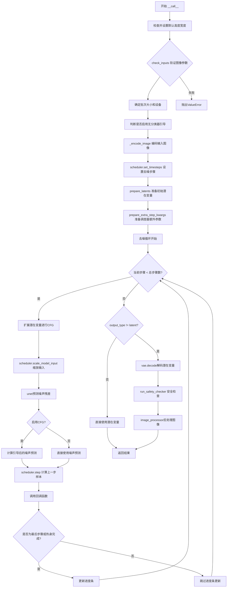
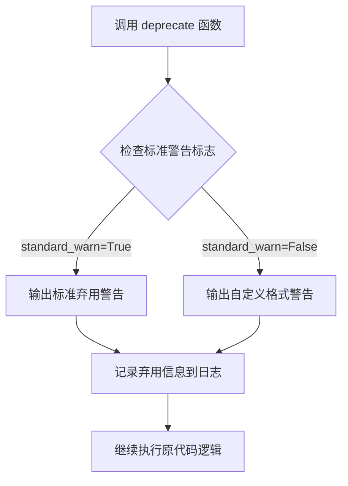
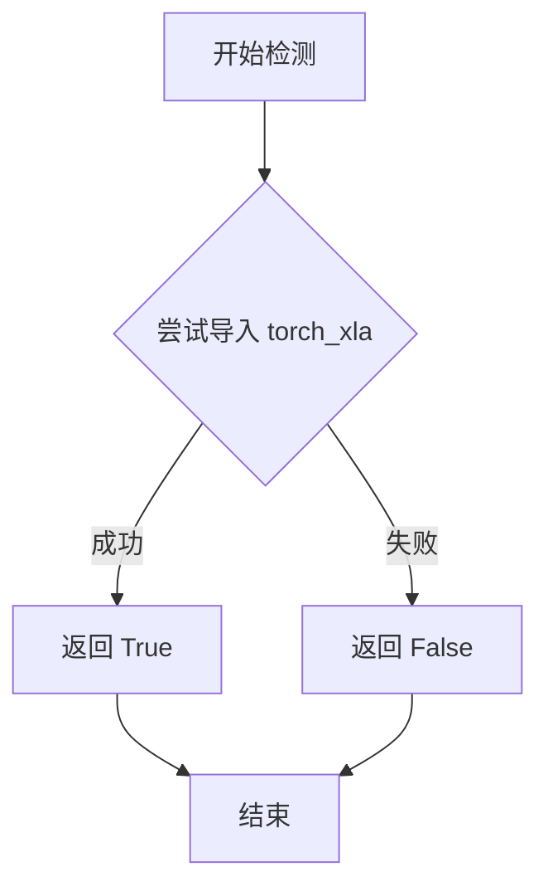
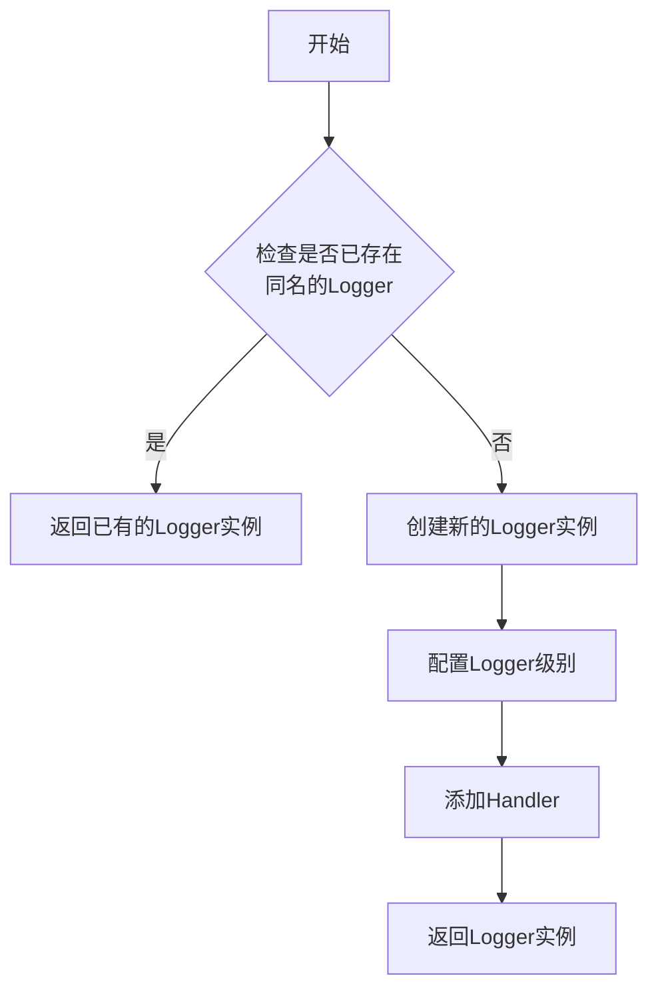
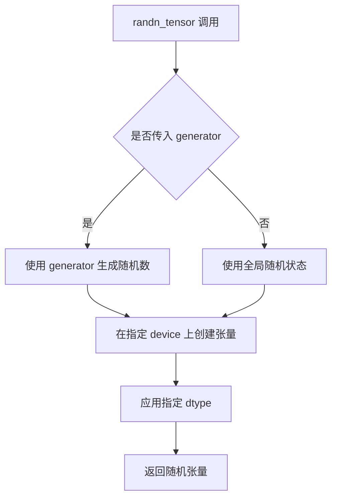
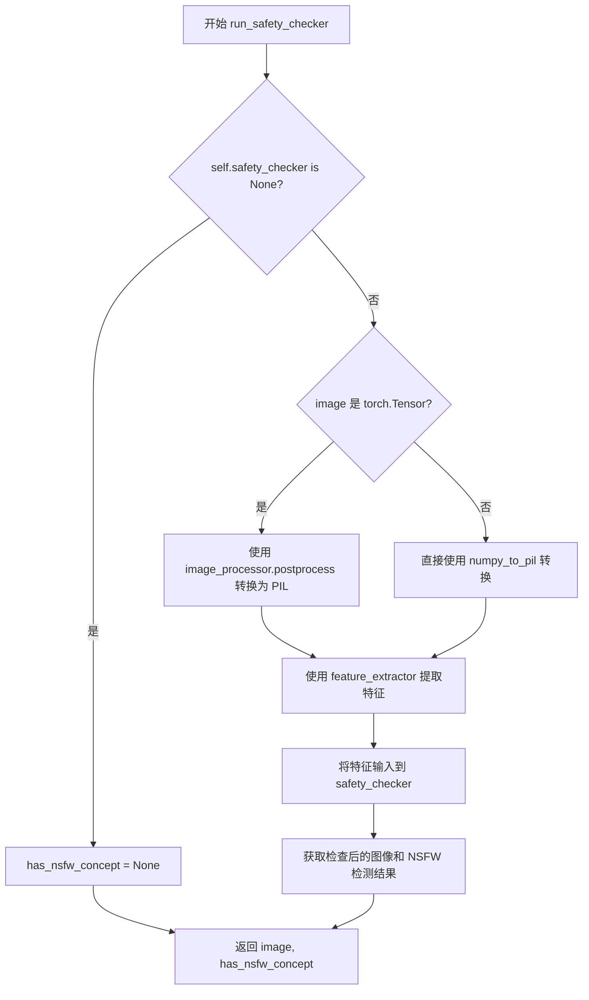
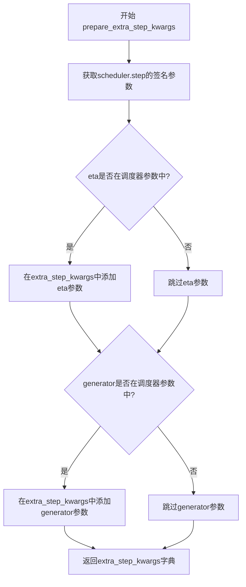
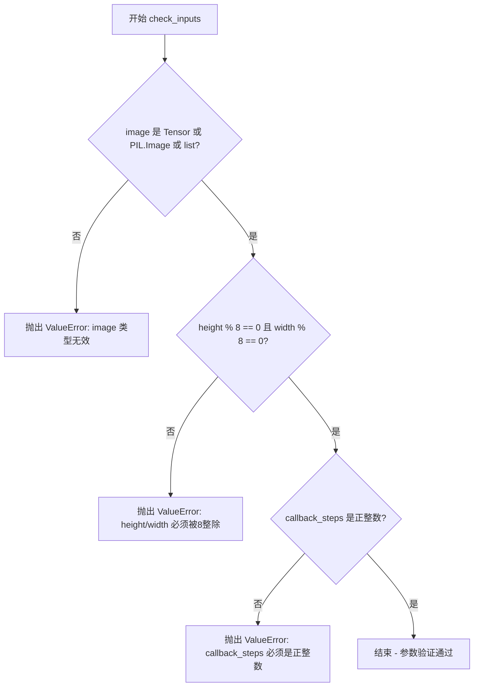
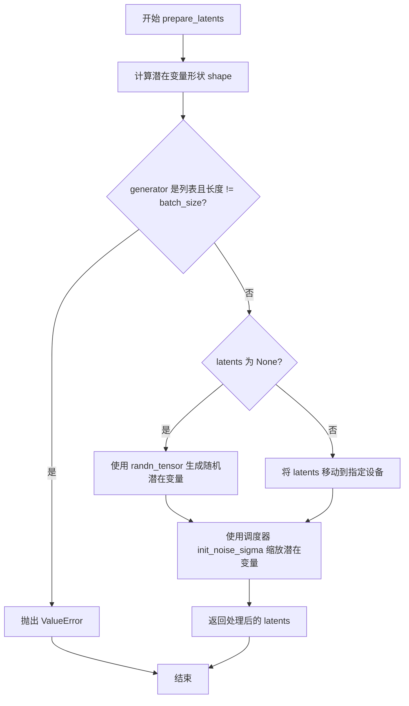
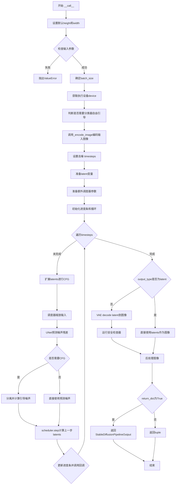

# `diffusers\src\diffusers\pipelines\stable_diffusion\pipeline_stable_diffusion_image_variation.py` 详细设计文档

StableDiffusionImageVariationPipeline是一个基于Stable Diffusion的图像变体生成管道，接收输入图像，通过CLIP图像编码器提取特征，利用条件扩散模型生成与输入图像风格相关的变体图像，同时可选地进行安全内容过滤。

## 整体流程



## 类结构

```
DiffusionPipeline (抽象基类)
└── StableDiffusionImageVariationPipeline (图像变体管道)
    └── StableDiffusionMixin (混入类)
```

## 全局变量及字段


### `logger`
    
Logger instance for the module, used to log warnings and deprecation notices.

类型：`logging.Logger`
    


### `XLA_AVAILABLE`
    
Flag indicating whether PyTorch XLA is available for TPU support.

类型：`bool`
    


### `StableDiffusionImageVariationPipeline.vae`
    
Variational Auto-Encoder model for encoding/decoding images to/from latent space.

类型：`AutoencoderKL`
    


### `StableDiffusionImageVariationPipeline.image_encoder`
    
CLIP vision model used to embed input images into embeddings for guidance.

类型：`CLIPVisionModelWithProjection`
    


### `StableDiffusionImageVariationPipeline.unet`
    
U-Net model that performs denoising of latents conditioned on image embeddings.

类型：`UNet2DConditionModel`
    


### `StableDiffusionImageVariationPipeline.scheduler`
    
Diffusion scheduler controlling the denoising schedule and noise step updates.

类型：`KarrasDiffusionSchedulers`
    


### `StableDiffusionImageVariationPipeline.safety_checker`
    
Optional safety checker that detects NSFW content in generated images.

类型：`StableDiffusionSafetyChecker`
    


### `StableDiffusionImageVariationPipeline.feature_extractor`
    
CLIP image processor that extracts features from images for safety checking and encoding.

类型：`CLIPImageProcessor`
    


### `StableDiffusionImageVariationPipeline.vae_scale_factor`
    
Scaling factor derived from VAE's block out channels, used to adjust latent dimensions.

类型：`int`
    


### `StableDiffusionImageVariationPipeline.image_processor`
    
Processor for converting between VAE latents and PIL images, handling normalization.

类型：`VaeImageProcessor`
    


### `StableDiffusionImageVariationPipeline._optional_components`
    
List of optional pipeline components (e.g., safety_checker) that can be omitted.

类型：`List[str]`
    


### `StableDiffusionImageVariationPipeline.model_cpu_offload_seq`
    
Sequence string specifying the order for CPU offloading of models.

类型：`str`
    


### `StableDiffusionImageVariationPipeline._exclude_from_cpu_offload`
    
List of component names to exclude from CPU offload (e.g., safety_checker).

类型：`List[str]`
    
    

## 全局函数及方法


### `deprecate`

从给定代码中提取的不是 `deprecate` 函数的定义，而是该函数在此代码中的**使用方式**。`deprecate` 函数是从 `...utils` 导入的外部工具函数，下面详细说明其在代码中的具体应用：

参数（调用方式）：

- `deprecate("decode_latents", "1.0.0", deprecation_message, standard_warn=False)`
  - 第一个参数：`str` 类型，要弃用的功能名称
  - 第二个参数：`str` 类型，目标弃用版本号
  - 第三个参数：`str` 类型，弃用说明信息
  - 第四个参数：`bool` 类型，是否使用标准警告格式

- `deprecate("sample_size<64", "1.0.0", deprecation_message, standard_warn=False)`
  - 第一个参数：`str` 类型，要弃用的配置项名称
  - 第二个参数：`str` 类型，目标弃用版本号
  - 第三个参数：`str` 类型，弃用说明信息
  - 第四个参数：`bool` 类型，是否使用标准警告格式

返回值：`None`（该函数仅执行警告输出，不返回任何值）

#### 流程图



#### 带注释源码

```python
# deprecate 函数调用示例 1：decode_latents 方法弃用
def decode_latents(self, latents):
    """
    已弃用的 latent 解码方法
    
    Args:
        latents: 需要解码的潜在表示张量
    
    Returns:
        解码后的图像数据
    """
    # 定义弃用提示信息
    deprecation_message = (
        "The decode_latents method is deprecated and will be removed in 1.0.0. "
        "Please use VaeImageProcessor.postprocess(...) instead"
    )
    # 调用 deprecate 函数发出警告
    # 参数说明：
    #   "decode_latents": 要弃用的方法名
    #   "1.0.0": 计划移除版本
    #   deprecation_message: 详细说明
    #   standard_warn=False: 使用自定义警告格式
    deprecate("decode_latents", "1.0.0", deprecation_message, standard_warn=False)

    # 原有实现逻辑继续保留
    latents = 1 / self.vae.config.scaling_factor * latents
    image = self.vae.decode(latents, return_dict=False)[0]
    image = (image / 2 + 0.5).clamp(0, 1)
    # 转换为 float32 格式以兼容 bfloat16
    image = image.cpu().permute(0, 2, 3, 1).float().numpy()
    return image


# deprecate 函数调用示例 2：sample_size 配置项弃用
# （位于 __init__ 方法中）
if is_unet_version_less_0_9_0 and is_unet_sample_size_less_64:
    deprecation_message = (
        "The configuration file of the unet has set the default `sample_size` to smaller than"
        " 64 which seems highly unlikely .If you're checkpoint is a fine-tuned version of any of the"
        " following: \n- CompVis/stable-diffusion-v1-4 \n- CompVis/stable-diffusion-v1-3 \n-"
        " CompVis/stable-diffusion-v1-2 \n- CompVis/stable-diffusion-v1-1 \n- stable-diffusion-v1-5/stable-diffusion-v1-5"
        " \n- stable-diffusion-v1-5/stable-diffusion-inpainting \n you should change 'sample_size' to 64 in the"
        " configuration file. Please make sure to update the config accordingly as leaving `sample_size=32`"
        " in the config might lead to incorrect results in future versions. If you have downloaded this"
        " checkpoint from the Hugging Face Hub, it would be very nice if you could open a Pull request for"
        " the `unet/config.json` file"
    )
    # 调用 deprecate 函数
    # 参数说明：
    #   "sample_size<64": 要弃用的配置条件
    #   "1.0.0": 计划移除版本
    #   deprecation_message: 详细说明
    #   standard_warn=False: 使用自定义警告格式
    deprecate("sample_size<64", "1.0.0", deprecation_message, standard_warn=False)
    
    # 自动修复配置：将 sample_size 设置为 64
    new_config = dict(unet.config)
    new_config["sample_size"] = 64
    unet._internal_dict = FrozenDict(new_config)
```


### `is_torch_xla_available`

该函数用于检测当前环境中是否安装了 PyTorch XLA（Accelerated Library for Linear Algebra），即判断是否可以在 TPU 或其他加速器上运行 PyTorch。

参数：该函数无参数。

返回值：`bool`，返回 `True` 表示 PyTorch XLA 可用，`False` 表示不可用。

#### 流程图



#### 带注释源码

```
# is_torch_xla_available 是从 diffusers 库的 utils 模块导入的函数
# 下面展示的是该函数在当前文件中的使用方式以及推断的实现逻辑

# 实际使用示例（来自给定代码）:
if is_torch_xla_available():
    # 如果 XLA 可用，则导入 XLA 的核心模块
    import torch_xla.core.xla_model as xm
    XLA_AVAILABLE = True
else:
    XLA_AVAILABLE = False

# 推断的函数实现逻辑（基于常见模式）:
def is_torch_xla_available() -> bool:
    """
    检测 PyTorch XLA 是否可用。
    
    该函数通常通过尝试导入 'torch_xla' 模块来判断。
    如果导入成功，说明环境中有 XLA 支持，返回 True；
    否则返回 False。
    
    Returns:
        bool: 如果 torch_xla 可用返回 True，否则返回 False
    """
    try:
        import torch_xla
        return True
    except ImportError:
        return False
```

#### 备注

`is_torch_xla_available` 并不是在当前文件中定义的，而是通过以下代码从 `diffusers` 库的 `utils` 模块导入的：

```python
from ...utils import deprecate, is_torch_xla_available, logging
```

该函数的主要用途是在代码中条件性地导入 `torch_xla` 相关的模块，以便在 TPU 等加速器上运行 Stable Diffusion 推理。在给定的代码中，它被用于在 TPU 环境下调用 `xm.mark_step()` 来优化 XLA 编译器的性能。


### `logging.get_logger`

获取与指定模块关联的日志记录器（Logger），用于在模块中记录日志信息。

参数：

- `name`：`str`，模块名称，通常使用 `__name__` 变量，用于标识日志来源

返回值：`logging.Logger`，返回一个日志记录器实例，用于记录日志信息

#### 流程图



#### 带注释源码

```
# 从代码中的使用方式推断的源码结构
# actual implementation is in ...utils.logging module

def get_logger(name: str) -> logging.Logger:
    """
    获取或创建一个与指定名称关联的日志记录器。
    
    Args:
        name: 模块名称，通常使用 __name__
    
    Returns:
        配置好的Logger实例
    """
    # 获取或创建logger
    logger = logging.getLogger(name)
    
    # 如果logger没有handler，则添加一个
    if not logger.handlers:
        handler = logging.StreamHandler()
        formatter = logging.Formatter(
            '%(asctime)s - %(name)s - %(levelname)s - %(message)s'
        )
        handler.setFormatter(formatter)
        logger.addHandler(handler)
    
    return logger

# 代码中的实际使用：
logger = logging.get_logger(__name__)
```


### `randn_tensor`

该函数用于生成指定形状的正态分布（高斯）随机张量，常用于扩散模型中生成初始噪声。在`StableDiffusionImageVariationPipeline`中，该函数被`prepare_latents`方法调用，以生成用于去噪过程的初始潜在向量。

参数：

- `shape`：`torch.Size` 或 `tuple`，需要生成的随机张量的形状
- `generator`：`torch.Generator` 或 `list[torch.Generator]` 或 `None`，用于控制随机数生成的确定性
- `device`：`torch.device`，生成的张量应该放置的设备（如CPU或CUDA）
- `dtype`：`torch.dtype`，生成张量的数据类型（如`torch.float32`）

返回值：`torch.Tensor`，符合指定形状、设备和数据类型的正态分布随机张量

#### 流程图



#### 带注释源码

```python
# 该函数定义在 diffusers/src/diffusers/utils/torch_utils.py 中
# 以下为调用处的源码展示

def prepare_latents(self, batch_size, num_channels_latents, height, width, dtype, device, generator, latents=None):
    # 计算潜在向量的形状
    shape = (
        batch_size,
        num_channels_latents,
        int(height) // self.vae_scale_factor,
        int(width) // self.vae_scale_factor,
    )
    
    # 如果没有提供预生成的 latents，则使用 randn_tensor 生成随机噪声
    if latents is None:
        # 调用 randn_tensor 生成符合正态分布的随机张量
        # shape: 指定输出张量的维度
        # generator: 可选的随机生成器，用于控制随机性
        # device: 指定张量存放的设备
        # dtype: 指定张量的数据类型
        latents = randn_tensor(shape, generator=generator, device=device, dtype=dtype)
    else:
        # 如果提供了 latents，则将其移动到指定设备
        latents = latents.to(device)

    # 根据调度器的初始噪声标准差缩放初始噪声
    latents = latents * self.scheduler.init_noise_sigma
    return latents
```


### `StableDiffusionImageVariationPipeline.__init__`

该方法是 `StableDiffusionImageVariationPipeline` 类的构造函数，负责初始化图像变化生成管道所需的所有核心组件，包括 VAE 编码器、图像编码器、UNet 模型、调度器、安全检查器和特征提取器，并进行配置验证和兼容性处理。

参数：

- `vae`：`AutoencoderKL`，变分自编码器模型，用于将图像编码到潜在表示并进行解码重建
- `image_encoder`：`CLIPVisionModelWithProjection`，CLIP 图像编码器模型，用于提取输入图像的特征嵌入
- `unet`：`UNet2DConditionModel`，UNet 条件模型，用于对潜在表示进行去噪处理
- `scheduler`：`KarrasDiffusionSchedulers`，扩散调度器，用于控制去噪过程的噪声调度
- `safety_checker`：`StableDiffusionSafetyChecker`，安全检查器模块，用于检测生成图像是否包含不当内容
- `feature_extractor`：`CLIPImageProcessor`，CLIP 图像处理器，用于预处理图像以供安全检查器使用
- `requires_safety_checker`：`bool`，可选参数，默认为 `True`，指定是否需要安全检查器

返回值：无（`None`），构造函数不返回任何值，仅初始化对象状态

#### 流程图

```mermaid
flowchart TD
    A[开始 __init__] --> B[调用 super().__init__]
    B --> C{ safety_checker is None 且 requires_safety_checker?}
    C -->|是| D[输出安全警告日志]
    C -->|否| E{ safety_checker 不为空 且 feature_extractor 为空?}
    D --> E
    E -->|是| F[抛出 ValueError 异常]
    E -->|否| G[检查 UNet 版本和 sample_size]
    F --> H[异常终止]
    G --> H{版本 < 0.9.0 且 sample_size < 64?}
    H -->|是| I[输出弃用警告并修改配置为 sample_size=64]
    H -->|否| J[调用 register_modules 注册所有模块]
    I --> J
    J --> K[计算 vae_scale_factor]
    K --> L[创建 VaeImageProcessor 实例]
    L --> M[调用 register_to_config 注册 requires_safety_checker]
    M --> N[结束 __init__]
```

#### 带注释源码

```python
def __init__(
    self,
    vae: AutoencoderKL,
    image_encoder: CLIPVisionModelWithProjection,
    unet: UNet2DConditionModel,
    scheduler: KarrasDiffusionSchedulers,
    safety_checker: StableDiffusionSafetyChecker,
    feature_extractor: CLIPImageProcessor,
    requires_safety_checker: bool = True,
):
    """
    初始化 StableDiffusionImageVariationPipeline 管道
    
    参数:
        vae: Variational Auto-Encoder 模型，用于图像编码/解码
        image_encoder: CLIP 图像编码器，用于提取图像特征
        unet: UNet 去噪模型
        scheduler: 扩散调度器
        safety_checker: NSFW 安全检查器
        feature_extractor: 图像特征提取器
        requires_safety_checker: 是否必须启用安全检查器
    """
    # 调用父类 DiffusionPipeline 的初始化方法
    super().__init__()

    # 如果 safety_checker 为 None 但 requires_safety_checker 为 True，发出警告
    # 提示用户关闭安全检查器可能违反 Stable Diffusion 许可条款
    if safety_checker is None and requires_safety_checker:
        logger.warning(
            f"You have disabled the safety checker for {self.__class__} by passing `safety_checker=None`. Ensure"
            " that you abide to the conditions of the Stable Diffusion license and do not expose unfiltered"
            " results in services or applications open to the public. Both the diffusers team and Hugging Face"
            " strongly recommend to keep the safety filter enabled in all public facing circumstances, disabling"
            " it only for use-cases that involve analyzing network behavior or auditing its results. For more"
            " information, please have a look at https://github.com/huggingface/diffusers/pull/254 ."
        )

    # 如果提供了 safety_checker 但没有提供 feature_extractor，抛出错误
    # 安全检查器需要 feature_extractor 来处理图像
    if safety_checker is not None and feature_extractor is None:
        raise ValueError(
            "Make sure to define a feature extractor when loading {self.__class__} if you want to use the safety"
            " checker. If you do not want to use the safety checker, you can pass `'safety_checker=None'` instead."
        )

    # 检查 UNet 配置版本和 sample_size 的兼容性
    # 如果 UNet 版本低于 0.9.0 且 sample_size 小于 64，发出弃用警告
    is_unet_version_less_0_9_0 = (
        unet is not None
        and hasattr(unet.config, "_diffusers_version")
        and version.parse(version.parse(unet.config._diffusers_version).base_version) < version.parse("0.9.0.dev0")
    )
    is_unet_sample_size_less_64 = (
        unet is not None and hasattr(unet.config, "sample_size") and unet.config.sample_size < 64
    )
    
    # 对于旧版 Stable Diffusion checkpoint，可能存在 sample_size=32 的配置
    # 这可能导致错误结果，因此自动修正为 64
    if is_unet_version_less_0_9_0 and is_unet_sample_size_less_64:
        deprecation_message = (
            "The configuration file of the unet has set the default `sample_size` to smaller than"
            " 64 which seems highly unlikely .If you're checkpoint is a fine-tuned version of any of the"
            " following: \n- CompVis/stable-diffusion-v1-4 \n- CompVis/stable-diffusion-v1-3 \n-"
            " CompVis/stable-diffusion-v1-2 \n- CompVis/stable-diffusion-v1-1 \n- stable-diffusion-v1-5/stable-diffusion-v1-5"
            " \n- stable-diffusion-v1-5/stable-diffusion-inpainting \n you should change 'sample_size' to 64 in the"
            " configuration file. Please make sure to update the config accordingly as leaving `sample_size=32`"
            " in the config might lead to incorrect results in future versions. If you have downloaded this"
            " checkpoint from the Hugging Face Hub, it would be very nice if you could open a Pull request for"
            " the `unet/config.json` file"
        )
        deprecate("sample_size<64", "1.0.0", deprecation_message, standard_warn=False)
        
        # 创建新的配置字典并更新 sample_size
        new_config = dict(unet.config)
        new_config["sample_size"] = 64
        unet._internal_dict = FrozenDict(new_config)

    # 注册所有模块到管道，使这些组件可以通过管道对象访问
    self.register_modules(
        vae=vae,
        image_encoder=image_encoder,
        unet=unet,
        scheduler=scheduler,
        safety_checker=safety_checker,
        feature_extractor=feature_extractor,
    )
    
    # 计算 VAE 缩放因子，基于 VAE 块输出通道数的幂
    # 这用于确定潜在空间与像素空间之间的缩放比例
    self.vae_scale_factor = 2 ** (len(self.vae.config.block_out_channels) - 1) if getattr(self, "vae", None) else 8
    
    # 创建 VAE 图像处理器，用于图像的预处理和后处理
    self.image_processor = VaeImageProcessor(vae_scale_factor=self.vae_scale_factor)
    
    # 将 requires_safety_checker 注册到配置中
    self.register_to_config(requires_safety_checker=requires_safety_checker)
```


### `StableDiffusionImageVariationPipeline._encode_image`

该方法负责将输入图像编码为图像嵌入向量（image embeddings），供后续的UNet去噪过程使用。它首先将图像转换为张量格式，然后通过CLIP图像编码器提取特征，并根据是否启用无分类器自由引导（classifier-free guidance）来处理嵌入向量。

参数：

-  `image`：`Union[PIL.Image.Image, torch.Tensor]`，输入图像，可以是PIL图像或已转换的torch张量
-  `device`：`torch.device`，指定计算设备（如cuda或cpu）
-  `num_images_per_prompt`：`int`，每个提示词生成的图像数量，用于复制嵌入向量
-  `do_classifier_free_guidance`：`bool`，是否启用无分类器自由引导，若为True则在嵌入前拼接零向量

返回值：`torch.Tensor`，编码后的图像嵌入向量，形状为`(batch_size * num_images_per_prompt, seq_len, embedding_dim)`，若启用guidance则batch_size翻倍

#### 流程图

```mermaid
flowchart TD
    A[开始 _encode_image] --> B[获取image_encoder参数的数据类型dtype]
    B --> C{image是否为torch.Tensor?}
    C -->|否| D[使用feature_extractor将image转换为pixel_values张量]
    C -->|是| E[直接使用image]
    D --> F[将image移动到指定device并转换dtype]
    E --> F
    F --> G[通过image_encoder获取image_embeds]
    G --> H[对image_embeddings进行unsqueeze(1)操作]
    H --> I[复制嵌入向量以匹配num_images_per_prompt]
    I --> J{do_classifier_free_guidance为True?}
    J -->|是| K[创建与image_embeddings形状相同的零张量negative_prompt_embeds]
    K --> L[将negative_prompt_embeds与image_embeddings拼接]
    J -->|否| M[直接返回image_embeddings]
    L --> M
    M --> N[结束，返回图像嵌入向量]
```

#### 带注释源码

```python
def _encode_image(self, image, device, num_images_per_prompt, do_classifier_free_guidance):
    """
    将输入图像编码为图像嵌入向量，供UNet去噪过程使用
    
    参数:
        image: 输入图像，PIL.Image或torch.Tensor格式
        device: 计算设备
        num_images_per_prompt: 每个提示生成的图像数量
        do_classifier_free_guidance: 是否启用无分类器自由引导
    """
    # 获取image_encoder模型参数的数据类型，用于保持一致性
    dtype = next(self.image_encoder.parameters()).dtype

    # 如果输入不是torch.Tensor，则使用feature_extractor进行预处理
    if not isinstance(image, torch.Tensor):
        # 使用CLIPImageProcessor将图像转换为模型所需的像素值张量
        image = self.feature_extractor(images=image, return_tensors="pt").pixel_values

    # 将图像张量移动到指定设备并转换为正确的dtype
    image = image.to(device=device, dtype=dtype)
    
    # 通过CLIP图像编码器提取图像嵌入向量
    image_embeddings = self.image_encoder(image).image_embeds
    
    # 在seq_len维度前添加维度，使其形状变为[batch, 1, embed_dim]
    image_embeddings = image_embeddings.unsqueeze(1)

    # 为每个提示复制图像嵌入向量，以生成多张图像
    # 使用mps友好的方法进行复制
    bs_embed, seq_len, _ = image_embeddings.shape
    image_embeddings = image_embeddings.repeat(1, num_images_per_prompt, 1)
    # 重塑形状为[batch * num_images_per_prompt, seq_len, embed_dim]
    image_embeddings = image_embeddings.view(bs_embed * num_images_per_prompt, seq_len, -1)

    # 如果启用无分类器自由引导，需要准备负样本嵌入
    if do_classifier_free_guidance:
        # 创建与图像嵌入形状相同的零张量作为无条件嵌入
        negative_prompt_embeds = torch.zeros_like(image_embeddings)

        # 为了避免两次前向传播，我们将无条件嵌入和条件嵌入拼接成单个batch
        # 这样可以在一次前向传播中同时计算有条件和无条件的噪声预测
        image_embeddings = torch.cat([negative_prompt_embeds, image_embeddings])

    return image_embeddings
```


### `StableDiffusionImageVariationPipeline.run_safety_checker`

该方法用于对生成的图像进行安全检查（NSFW检测），通过安全检查器判断图像是否包含不适合公开的内容，并返回检查后的图像及检测结果。

参数：

- `image`：需要进行安全检查的图像，支持 `torch.Tensor` 或其他图像格式（如 PIL.Image、numpy array 等）
- `device`：`torch.device`，指定运行安全检查器所使用的设备（如 CPU 或 CUDA）
- `dtype`：`torch.dtype`，指定图像数据的数据类型（如 torch.float32）

返回值：`Tuple[Any, Optional[List[bool]]]`，返回两个元素的元组——第一个是处理后的图像，第二个是布尔值列表，表示每张图像是否被检测为 NSFW 内容（None 表示未检测）

#### 流程图



#### 带注释源码

```python
def run_safety_checker(self, image, device, dtype):
    """
    运行安全检查器以检测图像是否包含 NSFW 内容
    
    参数:
        image: 输入图像，可以是 torch.Tensor 或其他格式
        device: 计算设备
        dtype: 数据类型
    
    返回:
        (image, has_nsfw_concept): 检查后的图像和 NSFW 检测结果
    """
    # 如果未配置安全检查器，直接返回 None
    if self.safety_checker is None:
        has_nsfw_concept = None
    else:
        # 将图像转换为 PIL 格式以供特征提取器使用
        if torch.is_tensor(image):
            # 如果是 tensor，使用后处理器转换为 PIL 图像
            feature_extractor_input = self.image_processor.postprocess(image, output_type="pil")
        else:
            # 如果是其他格式（如 numpy array），直接转换为 PIL
            feature_extractor_input = self.image_processor.numpy_to_pil(image)
        
        # 使用特征提取器提取图像特征，并移动到指定设备
        safety_checker_input = self.feature_extractor(feature_extractor_input, return_tensors="pt").to(device)
        
        # 调用安全检查器进行 NSFW 检测
        # clip_input 使用指定的数据类型
        image, has_nsfw_concept = self.safety_checker(
            images=image, 
            clip_input=safety_checker_input.pixel_values.to(dtype)
        )
    
    # 返回处理后的图像和检测结果
    return image, has_nsfw_concept
```


### `StableDiffusionImageVariationPipeline.decode_latents`

该方法用于将VAE编码后的潜在表示(latents)解码为实际的图像数组。由于该方法已被标记为废弃，未来版本中将移除，建议使用`VaeImageProcessor.postprocess()`替代。

参数：

- `latents`：`torch.Tensor`，VAE编码后的潜在表示张量

返回值：`numpy.ndarray`，解码后的图像，形状为(batch_size, height, width, channels)，值域为[0, 1]

#### 流程图

```mermaid
flowchart TD
    A[开始 decode_latents] --> B[记录废弃警告]
    B --> C[根据scaling_factor缩放latents]
    C --> D[调用VAE.decode解码latents]
    D --> E[图像值归一化到0-1范围]
    E --> F[转换为float32并移动到CPU]
    F --> G[维度重排: (N, C, H, W) -> (N, H, W, C)]
    G --> H[转换为numpy数组]
    H --> I[返回图像数组]
```

#### 带注释源码

```python
def decode_latents(self, latents):
    """
    将潜在表示解码为图像数组
    
    注意: 此方法已废弃，将在1.0.0版本移除
    """
    # 记录废弃警告，建议使用VaeImageProcessor.postprocess替代
    deprecation_message = "The decode_latents method is deprecated and will be removed in 1.0.0. Please use VaeImageProcessor.postprocess(...) instead"
    deprecate("decode_latents", "1.0.0", deprecation_message, standard_warn=False)

    # 第一步: 反缩放latents
    # VAE在编码时会乘以scaling_factor，这里需要除以回来
    latents = 1 / self.vae.config.scaling_factor * latents
    
    # 第二步: 使用VAE解码器将latents解码为图像
    # return_dict=False时返回(batch_size, channels, height, width)的张量
    image = self.vae.decode(latents, return_dict=False)[0]
    
    # 第三步: 将图像值从[-1, 1]范围归一化到[0, 1]范围
    # VAE解码输出通常在[-1, 1]区间
    image = (image / 2 + 0.5).clamp(0, 1)
    
    # 第四步: 转换为numpy数组用于后续处理
    # 1. 移动到CPU
    # 2. 维度重排: (N, C, H, W) -> (N, H, W, C)
    # 3. 转换为float32（兼容bfloat16且开销可忽略）
    image = image.cpu().permute(0, 2, 3, 1).float().numpy()
    
    # 返回解码后的图像数组
    return image
```


### `StableDiffusionImageVariationPipeline.prepare_extra_step_kwargs`

该方法用于为调度器（scheduler）的`step`方法准备额外的关键字参数。由于不同调度器的签名不同，该方法通过检查调度器是否支持`eta`和`generator`参数来动态构建需要传递的额外参数字典，确保与各类调度器兼容。

参数：

- `generator`：`torch.Generator | list[torch.Generator] | None`，用于控制生成随机数的确定性生成器，默认为`None`
- `eta`：`float`，DDIM调度器参数（η），取值范围为[0,1]，仅在DDIMScheduler中生效，其他调度器会忽略该参数

返回值：`dict`，包含调度器`step`方法所需的关键字参数字典，可能包含`eta`和/或`generator`键值对

#### 流程图



#### 带注释源码

```python
def prepare_extra_step_kwargs(self, generator, eta):
    """
    准备调度器step方法的额外关键字参数
    
    由于并非所有调度器都具有相同的函数签名，此方法用于检查
    当前调度器支持哪些参数，并据此构建需要传递的额外参数字典。
    
    参数:
        generator: torch.Generator或None，用于生成确定性随机数的生成器
        eta: float，对应DDIM论文中的η参数，仅DDIMScheduler使用此参数
    
    返回:
        dict: 包含调度器step所需的关键字参数
    """
    # 使用inspect模块获取scheduler.step方法的签名参数
    accepts_eta = "eta" in set(inspect.signature(self.scheduler.step).parameters.keys())
    extra_step_kwargs = {}
    
    # 如果调度器接受eta参数，则将其添加到extra_step_kwargs中
    # eta (η) 仅在DDIMScheduler中使用，其他调度器会忽略此参数
    # eta对应DDIM论文中的η参数，取值范围为[0, 1]
    if accepts_eta:
        extra_step_kwargs["eta"] = eta

    # 检查调度器是否接受generator参数
    accepts_generator = "generator" in set(inspect.signature(self.scheduler.step).parameters.keys())
    if accepts_generator:
        extra_step_kwargs["generator"] = generator
    
    return extra_step_kwargs
```


### `StableDiffusionImageVariationPipeline.check_inputs`

该方法用于验证输入参数的有效性，确保图像类型正确、尺寸符合模型要求（高度和宽度必须是8的倍数），以及回调步数为正整数。

参数：

- `image`：`torch.Tensor | PIL.Image.Image | list[PIL.Image.Image]`，输入的图像数据，可以是PyTorch张量、PIL图像或图像列表
- `height`：`int`，生成的图像高度（像素）
- `width`：`int`，生成的图像宽度（像素）
- `callback_steps`：`int`，回调函数的调用步数，必须为正整数

返回值：`None`，该方法不返回任何值，仅进行参数校验并通过抛出ValueError异常处理无效输入

#### 流程图



#### 带注释源码

```python
def check_inputs(self, image, height, width, callback_steps):
    """
    验证输入参数的有效性
    
    参数:
        image: 输入图像，类型可以是 torch.Tensor、PIL.Image.Image 或 list[PIL.Image.Image]
        height: 生成图像的高度（像素）
        width: 生成图像的宽度（像素）
        callback_steps: 回调函数的调用步数，必须为正整数
    """
    
    # 检查 image 参数的类型是否合法
    # 支持三种类型：torch.Tensor（张量）、PIL.Image.Image（单张图像）、list（图像列表）
    if (
        not isinstance(image, torch.Tensor)
        and not isinstance(image, PIL.Image.Image)
        and not isinstance(image, list)
    ):
        raise ValueError(
            "`image` has to be of type `torch.Tensor` or `PIL.Image.Image` or `list[PIL.Image.Image]` but is"
            f" {type(image)}"
        )

    # 验证 height 和 width 是否能被 8 整除
    # 这是因为 Stable Diffusion 的 UNet 和 VAE 模型内部使用 8 倍下采样/上采样
    if height % 8 != 0 or width % 8 != 0:
        raise ValueError(f"`height` and `width` have to be divisible by 8 but are {height} and {width}.")

    # 验证 callback_steps 参数
    # 必须是整数类型且值大于 0，用于控制回调函数的调用频率
    if (callback_steps is None) or (
        callback_steps is not None and (not isinstance(callback_steps, int) or callback_steps <= 0)
    ):
        raise ValueError(
            f"`callback_steps` has to be a positive integer but is {callback_steps} of type"
            f" {type(callback_steps)}."
        )
```


### `StableDiffusionImageVariationPipeline.prepare_latents`

该方法负责为图像变体生成流程准备初始潜在变量（latents）。它根据指定的批次大小、图像尺寸和数据类型创建或处理潜在变量张量，并利用调度器的初始噪声标准差对其进行缩放，以确保与去噪过程的要求相匹配。

参数：

- `batch_size`：`int`，生成的图像批次大小，决定了同时处理的图像数量。
- `num_channels_latents`：`int`，潜在变量的通道数，通常对应于 UNet 模型的输入通道配置。
- `height`：`int`，生成图像的高度（像素），用于计算潜在变量的空间维度。
- `width`：`int`，生成图像的宽度（像素），用于计算潜在变量的空间维度。
- `dtype`：`torch.dtype`，潜在变量的数据类型（如 torch.float32），确保与模型计算精度一致。
- `device`：`torch.device`，计算设备（CPU 或 CUDA），决定张量存储的硬件位置。
- `generator`：`torch.Generator | list[torch.Generator] | None`，可选的随机数生成器，用于确保生成过程的可重复性。
- `latents`：`torch.Tensor | None`，可选的预生成潜在变量张量；若为 None，则随机初始化。

返回值：`torch.Tensor`，处理后的潜在变量张量，已根据调度器的要求进行缩放。

#### 流程图



#### 带注释源码

```python
def prepare_latents(
    self,
    batch_size: int,
    num_channels_latents: int,
    height: int,
    width: int,
    dtype: torch.dtype,
    device: torch.device,
    generator: torch.Generator | list[torch.Generator] | None,
    latents: torch.Tensor | None = None,
) -> torch.Tensor:
    """
    准备用于去噪过程的潜在变量张量。

    该方法根据批处理参数计算潜在变量的形状，并根据是否提供预生成的
    潜在变量来决定是随机初始化还是使用提供的潜在变量。最后，应用
    调度器要求的初始噪声标准差进行缩放。

    参数:
        batch_size: 批次大小，决定生成图像的数量。
        num_channels_latents: 潜在变量的通道数，通常与UNet配置相关。
        height: 输出图像的高度（像素），会被VAE缩放因子除。
        width: 输出图像的宽度（像素），会被VAE缩放因子除。
        dtype: 张量的数据类型，确保与模型精度匹配。
        device: 计算设备，用于分配张量内存。
        generator: 随机生成器，用于确保可重复的随机采样。
        latents: 可选的预生成潜在变量，若为None则随机生成。

    返回:
        torch.Tensor: 经过调度器缩放处理后的潜在变量张量。
    """
    # 计算潜在变量的形状：批次大小 × 通道数 × 高度缩放 × 宽度缩放
    # VAE缩放因子用于将像素空间映射到潜在空间
    shape = (
        batch_size,
        num_channels_latents,
        int(height) // self.vae_scale_factor,
        int(width) // self.vae_scale_factor,
    )

    # 验证generator列表长度与批次大小的一致性
    if isinstance(generator, list) and len(generator) != batch_size:
        raise ValueError(
            f"You have passed a list of generators of length {len(generator)}, but requested an effective batch"
            f" size of {batch_size}. Make sure the batch size matches the length of the generators."
        )

    # 根据是否有预生成的latents决定初始化方式
    if latents is None:
        # 使用randn_tensor从标准正态分布采样随机潜在变量
        # generator参数确保可重复性（当提供时）
        latents = randn_tensor(shape, generator=generator, device=device, dtype=dtype)
    else:
        # 如果提供了潜在变量，确保其位于正确的计算设备上
        latents = latents.to(device)

    # 根据调度器的要求缩放初始噪声
    # 不同的调度器（如DDIM、LMS等）可能需要不同的初始噪声标准差
    # 这确保了潜在变量与调度器的去噪算法兼容
    latents = latents * self.scheduler.init_noise_sigma

    return latents
```


### `StableDiffusionImageVariationPipeline.__call__`

该方法是Stable Diffusion图像变体生成管道的核心调用函数，负责接收输入图像并生成图像变体。方法通过CLIP图像编码器提取输入图像的嵌入表示，结合去噪UNet模型和调度器，在潜在空间中进行迭代去噪处理，最终通过VAE解码器将潜在表示转换为输出图像。支持分类器自由引导(CFG)、NSFW安全检查、回调函数等功能。

参数：

- `image`：`PIL.Image.Image | list[PIL.Image.Image] | torch.Tensor`，用于引导图像生成的输入图像，支持PIL图像、图像列表或张量格式
- `height`：`int | None = None`，生成图像的高度（像素），默认为unet配置sample_size乘以vae_scale_factor
- `width`：`int | None = None`，生成图像的宽度（像素），默认为unet配置sample_size乘以vae_scale_factor
- `num_inference_steps`：`int = 50`，去噪迭代步数，更多步数通常生成更高质量图像但推理速度更慢
- `guidance_scale`：`float = 7.5`，分类器自由引导的权重参数，值为1时表示不进行引导，值越大生成的图像与输入图像关联越紧密
- `num_images_per_prompt`：`int | None = 1`，每个提示词生成的图像数量
- `eta`：`float = 0.0`，DDIM调度器的eta参数，仅对DDIMScheduler有效
- `generator`：`torch.Generator | list[torch.Generator] | None = None`，用于确保生成可复现性的随机数生成器
- `latents`：`torch.Tensor | None = None`，预先生成的噪声潜在向量，可用于使用不同提示词进行相同生成
- `output_type`：`str | None = "pil"`，生成图像的输出格式，可选"pil"或"np.array"
- `return_dict`：`bool = True`，是否返回PipelineOutput对象而非元组
- `callback`：`Callable[[int, int, torch.Tensor], None] | None = None`，每callback_steps步调用的回调函数，参数为(step, timestep, latents)
- `callback_steps`：`int = 1`，回调函数调用频率

返回值：`StableDiffusionPipelineOutput | tuple`，当return_dict为True时返回StableDiffusionPipelineOutput对象（包含images和nsfw_content_detected），否则返回(image, has_nsfw_concept)元组

#### 流程图



#### 带注释源码

```python
@torch.no_grad()
def __call__(
    self,
    image: PIL.Image.Image | list[PIL.Image.Image] | torch.Tensor,
    height: int | None = None,
    width: int | None = None,
    num_inference_steps: int = 50,
    guidance_scale: float = 7.5,
    num_images_per_prompt: int | None = 1,
    eta: float = 0.0,
    generator: torch.Generator | list[torch.Generator] | None = None,
    latents: torch.Tensor | None = None,
    output_type: str | None = "pil",
    return_dict: bool = True,
    callback: Callable[[int, int, torch.Tensor], None] | None = None,
    callback_steps: int = 1,
):
    """
    The call function to the pipeline for generation.

    Args:
        image: Image or images to guide image generation.
        height: The height in pixels of the generated image.
        width: The width in pixels of the generated image.
        num_inference_steps: The number of denoising steps.
        guidance_scale: A higher guidance scale value encourages the model to generate images closely linked to the text prompt.
        num_images_per_prompt: The number of images to generate per prompt.
        eta: Corresponds to parameter eta from the DDIM paper.
        generator: A torch.Generator to make generation deterministic.
        latents: Pre-generated noisy latents sampled from a Gaussian distribution.
        output_type: The output format of the generated image. Choose between PIL.Image or np.array.
        return_dict: Whether or not to return a StableDiffusionPipelineOutput instead of a plain tuple.
        callback: A function that calls every callback_steps steps during inference.
        callback_steps: The frequency at which the callback function is called.

    Returns:
        StableDiffusionPipelineOutput or tuple: Generated images and NSFW detection results.
    """
    # 0. Default height and width to unet
    # 如果未指定height和width，则使用UNet配置的sample_size乘以VAE缩放因子作为默认值
    height = height or self.unet.config.sample_size * self.vae_scale_factor
    width = width or self.unet.config.sample_size * self.vae_scale_factor

    # 1. Check inputs. Raise error if not correct
    # 验证输入参数的有效性：图像类型、高度宽度可被8整除、callback_steps为正整数
    self.check_inputs(image, height, width, callback_steps)

    # 2. Define call parameters
    # 根据输入图像类型确定batch_size：单张PIL图像为1，列表为列表长度，张量则为批次维度
    if isinstance(image, PIL.Image.Image):
        batch_size = 1
    elif isinstance(image, list):
        batch_size = len(image)
    else:
        batch_size = image.shape[0]
    # 获取执行设备（考虑设备放置和模型卸载）
    device = self._execution_device
    # 判断是否启用分类器自由引导（guidance_scale > 1.0时启用）
    # guidance_scale对应Imagen论文中的权重w，值为1表示不进行引导
    do_classifier_free_guidance = guidance_scale > 1.0

    # 3. Encode input image
    # 使用CLIP图像编码器将输入图像编码为图像嵌入向量
    image_embeddings = self._encode_image(image, device, num_images_per_prompt, do_classifier_free_guidance)

    # 4. Prepare timesteps
    # 根据推理步数设置调度器的时间步
    self.scheduler.set_timesteps(num_inference_steps, device=device)
    timesteps = self.scheduler.timesteps

    # 5. Prepare latent variables
    # 获取UNet的潜在通道数，准备初始噪声潜在向量
    num_channels_latents = self.unet.config.in_channels
    latents = self.prepare_latents(
        batch_size * num_images_per_prompt,  # 总批次大小
        num_channels_latents,
        height,
        width,
        image_embeddings.dtype,  # 使用图像嵌入的数据类型
        device,
        generator,
        latents,  # 如果提供了latents则使用，否则生成随机噪声
    )

    # 6. Prepare extra step kwargs. TODO: Logic should ideally just be moved out of the pipeline
    # 准备调度器额外参数（eta和generator），因为不同调度器签名不同
    extra_step_kwargs = self.prepare_extra_step_kwargs(generator, eta)

    # 7. Denoising loop
    # 计算预热步数（总步数减去实际推理步数乘以调度器阶数）
    num_warmup_steps = len(timesteps) - num_inference_steps * self.scheduler.order
    with self.progress_bar(total=num_inference_steps) as progress_bar:
        for i, t in enumerate(timesteps):
            # expand the latents if we are doing classifier free guidance
            # 如果启用CFG，需要将latents复制两份：一份无条件，一份有条件
            latent_model_input = torch.cat([latents] * 2) if do_classifier_free_guidance else latents
            # 调度器缩放输入（根据当前时间步调整噪声水平）
            latent_model_input = self.scheduler.scale_model_input(latent_model_input, t)

            # predict the noise residual
            # UNet预测噪声残差，输入为潜在向量、时间步和图像嵌入
            noise_pred = self.unet(latent_model_input, t, encoder_hidden_states=image_embeddings).sample

            # perform guidance
            # 执行分类器自由引导：将预测分为无条件预测和条件预测
            if do_classifier_free_guidance:
                noise_pred_uncond, noise_pred_text = noise_pred.chunk(2)
                # 按照guidance_scale权重组合无条件和条件预测
                noise_pred = noise_pred_uncond + guidance_scale * (noise_pred_text - noise_pred_uncond)

            # compute the previous noisy sample x_t -> x_t-1
            # 使用调度器根据预测的噪声计算上一步的潜在向量
            latents = self.scheduler.step(noise_pred, t, latents, **extra_step_kwargs).prev_sample

            # call the callback, if provided
            # 在最后一步或预热步之后按调度器阶数调用回调函数
            if i == len(timesteps) - 1 or ((i + 1) > num_warmup_steps and (i + 1) % self.scheduler.order == 0):
                progress_bar.update()
                if callback is not None and i % callback_steps == 0:
                    step_idx = i // getattr(self.scheduler, "order", 1)
                    callback(step_idx, t, latents)

            # 如果使用XLA（PyTorch XLA），标记计算步骤
            if XLA_AVAILABLE:
                xm.mark_step()

    # 释放模型钩子（如果有）
    self.maybe_free_model_hooks()

    # 8. Post-processing
    # 如果不需要潜在输出，则解码潜在向量为图像
    if not output_type == "latent":
        # VAE解码：将潜在向量除以缩放因子后解码
        image = self.vae.decode(latents / self.vae.config.scaling_factor, return_dict=False)[0]
        # 运行安全检查器检测NSFW内容
        image, has_nsfw_concept = self.run_safety_checker(image, device, image_embeddings.dtype)
    else:
        # 直接返回潜在向量
        image = latents
        has_nsfw_concept = None

    # 9. Prepare output
    # 根据是否有NSFW概念确定是否需要去归一化
    if has_nsfw_concept is None:
        do_denormalize = [True] * image.shape[0]
    else:
        do_denormalize = [not has_nsfw for has_nsfw in has_nsfw_concept]

    # 后处理图像：去归一化并转换为目标输出格式
    image = self.image_processor.postprocess(image, output_type=output_type, do_denormalize=do_denormalize)

    # 再次释放模型钩子
    self.maybe_free_model_hooks()

    # 10. Return output
    if not return_dict:
        return (image, has_nsfw_concept)

    # 返回结构化输出对象
    return StableDiffusionPipelineOutput(images=image, nsfw_content_detected=has_nsfw_concept)
```

## 关键组件


### StableDiffusionImageVariationPipeline

主pipeline类，继承自DiffusionPipeline和StableDiffusionMixin，用于根据输入图像生成图像变体。该类整合了VAE、图像编码器、UNet和调度器等核心组件，实现了完整的图像变体生成流程。

### AutoencoderKL (vae)

变分自编码器模型，用于将图像编码到潜在空间并从潜在表示解码回图像。与UNet配合实现图像的压缩和重建功能。

### CLIPVisionModelWithProjection (image_encoder)

冻结的CLIP图像编码器，用于将输入图像编码为图像嵌入向量，为UNet提供条件信息。

### UNet2DConditionModel (unet)

条件UNet模型，用于对编码后的图像潜在表示进行去噪处理，是扩散模型的核心生成组件。

### KarrasDiffusionSchedulers (scheduler)

Karras扩散调度器，管理去噪过程中的时间步和噪声调度策略，支持DDIM、LMSDiscrete、PNDM等多种调度算法。

### StableDiffusionSafetyChecker (safety_checker)

安全检查模块，用于检测生成的图像是否包含不当内容（NSFW），保护输出内容的安全性。

### CLIPImageProcessor (feature_extractor)

CLIP图像处理器，用于从图像中提取特征向量，作为安全检查器的输入。

### VaeImageProcessor (image_processor)

VAE图像处理器，负责图像的预处理和后处理，包括归一化、去归一化和格式转换等功能。

### _encode_image 方法

将输入图像（支持PIL.Image、列表或Tensor格式）编码为图像嵌入向量。支持分类器自由引导（classifier-free guidance），需要为每个提示生成多个图像时自动复制嵌入向量。

### check_inputs 方法

验证输入参数的合法性，检查图像类型、高度和宽度是否可被8整除，以及回调步数是否为正整数。

### prepare_latents 方法

准备初始潜在变量，根据批量大小、通道数、高度和宽度生成随机潜在张量，或使用提供的潜在张量。并根据调度器的要求对初始噪声进行缩放。

### prepare_extra_step_kwargs 方法

为调度器准备额外的关键字参数，包括eta（DDIM调度器用）和generator，确保不同调度器的兼容性。

### __call__ 方法

主生成方法，执行完整的图像变体生成流程：编码输入图像→准备时间步→准备潜在变量→去噪循环→解码潜在变量→后处理→安全检查。支持分类器自由引导、回调函数、XLA设备优化等功能。

### decode_latents 方法

已弃用的方法，原本用于将潜在变量解码为图像。现已被VaeImageProcessor.postprocess替代。

### run_safety_checker 方法

执行安全检查，将生成的图像通过特征提取器处理后送入安全检查器，检测是否包含不当内容。

### XLA支持模块

通过is_torch_xla_available条件导入，支持TPU加速。当TPU可用时，在去噪循环中使用xm.mark_step()优化执行效率。


## 问题及建议


### 已知问题

- **过时的版本检查逻辑**：对 UNet 版本的检查 (`is_unet_version_less_0_9_0`) 仍然针对 0.9.0.dev0 版本进行检查，这在当前版本中可能已不适用，属于遗留代码。
- **弃用方法仍存在**：`decode_latents` 方法已被标记为弃用 (`deprecate("decode_latents", "1.0.0", ...)`)，但仍保留在代码中，增加了维护负担。
- **不完整的字符串格式化**：在 `ValueError` 异常消息中使用了 `{self.__class__}` 的 f-string 格式化，但实际代码中直接写成了字符串 `"Make sure to define a feature extractor when loading {self.__class__}"`，导致错误消息显示字面量而非实际类名。
- **TODO 注释未完成**：代码中有关于 `feature_extractor` 的 TODO 注释 ("TODO: feature_extractor is required to encode images...")，但并未完全实现相关逻辑。
- **XLA 支持的不一致性**：XLA 支持通过 `xm.mark_step()` 在循环结束时调用，但未在循环开始或关键路径上进行更精细的控制，可能影响 TPU 性能。
- **重复代码**：多个方法（如 `run_safety_checker`、`prepare_extra_step_kwargs`、`check_inputs` 等）从其他 Pipeline 复制而来，缺乏统一的抽象。

### 优化建议

- **移除弃用方法**：尽快移除 `decode_latents` 方法，强制用户使用 `VaeImageProcessor.postprocess()` 替代。
- **修复字符串格式化错误**：将错误消息中的 `{self.__class__}` 正确替换为 f-string 格式化或使用 `.format()` 方法。
- **简化版本检查逻辑**：移除或更新针对旧版本 (0.9.0) 的检查逻辑，使其与当前版本兼容。
- **统一超类抽象**：将重复的辅助方法提取到 Mixin 或基类中，减少代码冗余。
- **改进 XLA 优化**：考虑将 `xm.mark_step()` 移到更合适的位置，或使用 `xm.optimizer_step()` 等更高级的 API 以提升 TPU 性能。
- **增强输入验证**：扩展 `check_inputs` 方法以支持更多图像类型（如 numpy array），并提供更详细的错误信息。
- **移除过时的注释**：清理 TODO 注释或将其转换为正式的 GitHub Issue 以跟踪。

## 其它


### 设计目标与约束

本管道的设计目标是根据输入图像生成相应的图像变体，采用Stable Diffusion架构，通过CLIP图像编码器提取图像特征，然后利用UNet进行去噪生成。约束条件包括：输入图像尺寸必须能被8整除、输出图像分辨率受限于UNet配置和VAE缩放因子、NSFW内容检测等。

### 错误处理与异常设计

代码在多个关键点实现了错误检查和异常处理：`check_inputs`方法验证输入图像类型（支持PIL.Image、torch.Tensor、list三种格式）、图像尺寸（height和width必须能被8整除）、callback_steps参数有效性（必须为正整数）；`prepare_latents`方法检查generator列表长度与batch_size是否匹配；构造函数中检查safety_checker和feature_extractor的依赖关系；deprecated方法使用`deprecate`函数提示版本迁移信息。

### 数据流与状态机

管道的数据流遵循以下状态机流程：输入图像 → CLIP图像编码器编码 → 图像嵌入（Image Embeddings）→ 与噪声潜在向量结合 → UNet去噪循环（迭代num_inference_steps次） → VAE解码 → NSFW安全检查 → 后处理输出图像。主状态包括：初始状态、编码状态、去噪循环状态（包含Classifier-Free Guidance条件分支）、解码状态、安全检查状态、最终输出状态。

### 外部依赖与接口契约

本管道依赖以下外部组件：PIL.Image用于图像输入输出、torch和torchvision用于张量计算、transformers库的CLIPImageProcessor和CLIPVisionModelWithProjection用于图像特征提取、diffusers库的AutoencoderKL（VAE）、UNet2DConditionModel、KarrasDiffusionSchedulers（调度器）、VaeImageProcessor（图像处理）、StableDiffusionSafetyChecker（安全检查）。接口契约包括：from_pretrained方法加载预训练模型、__call__方法执行推理、register_modules方法注册各组件模块。

### 性能考虑与优化空间

性能优化点包括：使用torch.no_grad()装饰器禁用梯度计算减少内存占用、XLA支持（通过is_torch_xla_available检测）可加速TPU执行、模型CPU卸载序列定义（image_encoder→unet→vae）允许分阶段释放显存、progress_bar提供推理进度可视化、callback机制支持外部监控。潜在优化空间：decode_latents方法已标记为deprecated但仍保留、prepare_extra_step_kwargs方法存在TODO注释建议逻辑迁移、可以考虑使用xformers优化注意力计算。

### 内存管理与资源释放

管道实现了智能内存管理：通过model_cpu_offload_seq定义模型卸载顺序、通过maybe_free_model_hooks方法在推理结束后释放模型钩子、使用self._execution_device获取执行设备。VAE的scale_factor根据block_out_channels动态计算（2^(len-1)），用于正确缩放潜在向量维度。

### 版本兼容性与迁移策略

代码包含版本检查逻辑：检查UNet版本是否小于0.9.0、sample_size是否小于64，若满足条件则显示deprecation警告并自动修改配置。_optional_components允许safety_checker为可选，requires_safety_checker配置项控制是否强制要求安全检查器。_diffusers_version用于追踪模型配置版本。

### 配置参数详细说明

主要配置参数包括：vae_scale_factor（VAE缩放因子，默认为8）、image_processor（VAE图像处理器）、requires_safety_checker（是否需要安全检查器，默认为True）、model_cpu_offload_seq（模型卸载序列）、_exclude_from_cpu_offload（排除自动卸载的模块如safety_checker）、_optional_components（可选组件列表）。UNet配置中的sample_size、in_channels等参数影响管道行为。

### 并行与批处理支持

管道支持批量生成（num_images_per_prompt参数）、支持多个generator（需与batch_size匹配）、支持classifier-free guidance（通过guidance_scale > 1.0启用）、图像嵌入会按num_images_per_prompt复制以支持批量生成。推理过程中通过torch.cat实现无条件和有条件预测的批量处理。

### 安全过滤机制

安全检查流程：生成的图像首先通过VAE解码，然后使用CLIPImageProcessor提取特征送入StableDiffusionSafetyChecker评估，返回has_nsfw_concept标志位。NSFW图像会被替换或标记，最终输出包含nsfw_content_detected列表。当safety_checker为None时该功能被禁用，但会输出警告提示潜在风险。

    