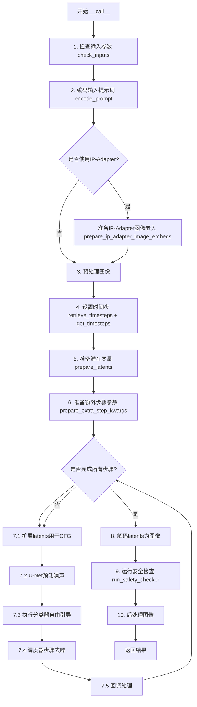
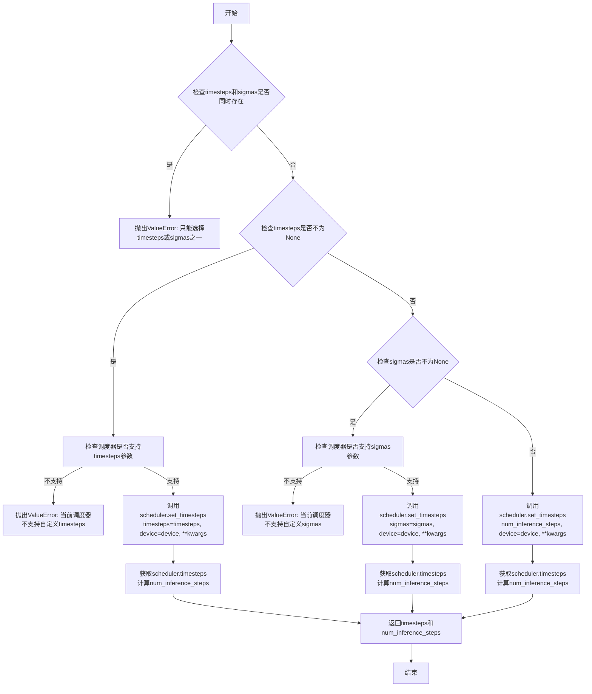
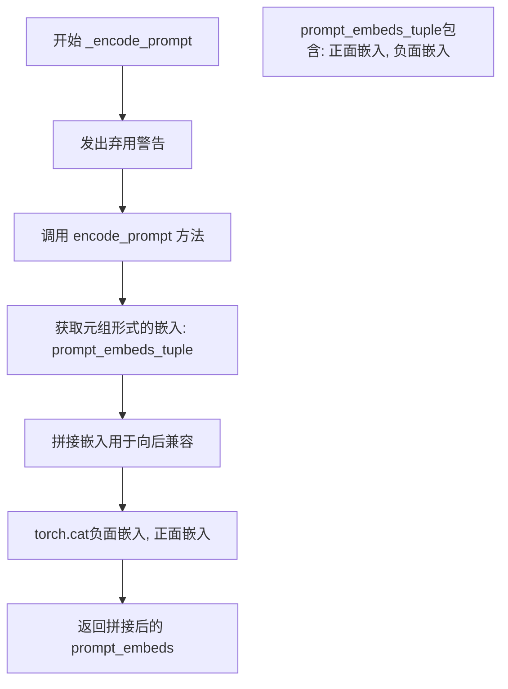
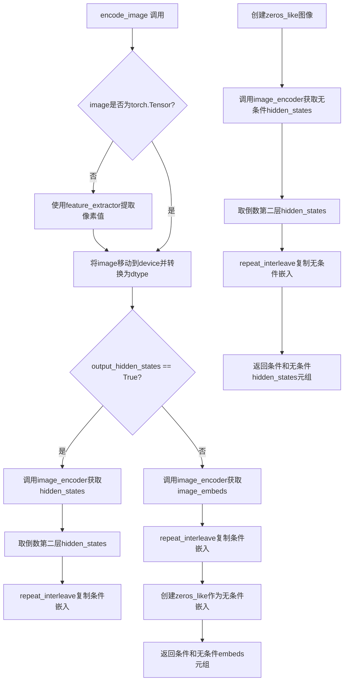
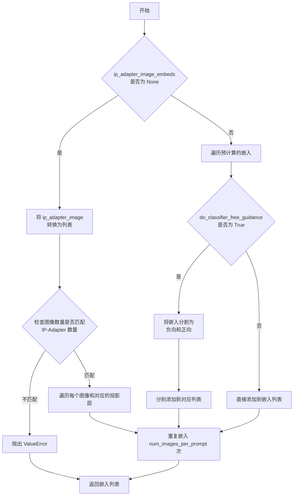
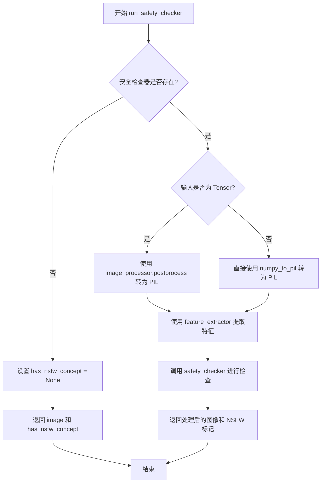
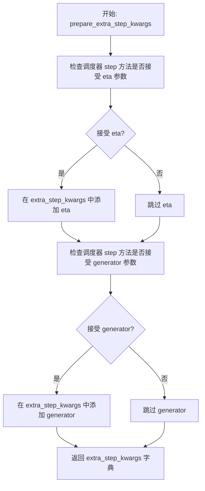
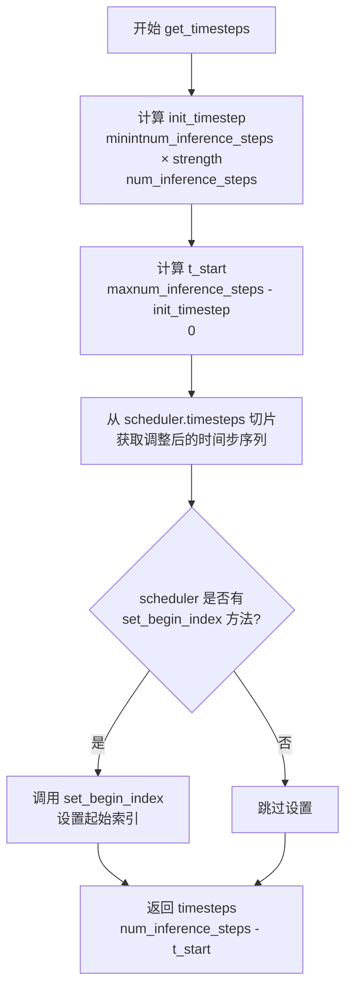
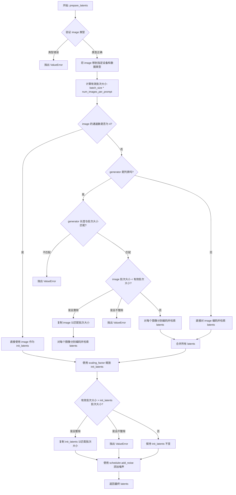

```mermaid
flowchart TD
    A[开始 __call__] --> B[解析并验证回调参数]
    B --> C{检查输入参数}
    C -->|失败| D[抛出错误]
    C -->|成功| E[设置管道内部状态]
    E --> F[定义批次大小]
    F --> G[获取执行设备]
    G --> H[编码输入提示词]
    H --> I{是否使用 CFG}
    I -->|是| J[拼接负面和正面提示嵌入]
    I -->|否| K[准备 IP-Adapter 图像嵌入]
    J --> K
    K --> L[预处理输入图像]
    L --> M[设置时间步]
    M --> N[获取调整后的时间步]
    N --> O[准备潜在变量]
    O --> P[准备额外步骤参数]
    P --> Q[添加 IP-Adapter 条件]
    Q --> R[获取引导比例嵌入]
    R --> S[开始去噪循环]
    S --> T{遍历每个时间步}
    T -->|当前| U[扩展潜在变量 CFG]
    U --> V[缩放模型输入]
    V --> W[UNet 预测噪声残差]
    W --> X{是否使用 CFG}
    X -->|是| Y[计算引导后的噪声预测]
    X -->|否| Z[调度器步骤计算前一潜在]
    Y --> Z
    Z --> AA{是否有回调}
    AA -->|是| AB[执行回调并更新潜在]
    AA -->|否| AC{是否最后一步或暖身步}
    AB --> AC
    AC --> AD[更新进度条]
    AD --> AE{还有更多时间步}
    AE -->|是| T
    AE -->|否| AF{XLA 可用}
    AF -->|是| AG[标记步骤]
    AF -->|否| AH{输出类型是否为 latent}
    AG --> AH
    AH -->|否| AI[VAE 解码潜在到图像]
    AI --> AJ[运行安全性检查]
    AH -->|是| AK[潜在作为图像]
    AJ --> AL[后处理图像]
    AK --> AL
    AL --> AM[卸载模型钩子]
    AM --> AN{return_dict}
    AN -->|是| AO[返回 StableDiffusionPipelineOutput]
    AN -->|否| AP[返回元组]
    AO --> AQ[结束]
    AP --> AQ
```

# `diffusers\src\diffusers\pipelines\stable_diffusion\pipeline_stable_diffusion_img2img.py` 详细设计文档

Stable Diffusion图像到图像（Img2Img）生成管道，基于文本提示将输入图像转换为目标风格图像。该管道继承自DiffusionPipeline，整合了VAE、文本编码器、U-Net和调度器，支持LoRA、Textual Inversion、IP-Adapter等高级功能。

## 整体流程



## 类结构

```
DiffusionPipeline (基类)
├── StableDiffusionMixin
├── TextualInversionLoaderMixin
├── IPAdapterMixin
├── StableDiffusionLoraLoaderMixin
├── FromSingleFileMixin
└── StableDiffusionImg2ImgPipeline
```

## 全局变量及字段


### `logger`
    
模块级日志记录器，用于记录运行时信息

类型：`logging.Logger`
    


### `EXAMPLE_DOC_STRING`
    
示例文档字符串，包含pipelines使用示例代码

类型：`str`
    


### `XLA_AVAILABLE`
    
XLA可用性标志，指示torch_xla是否可用

类型：`bool`
    


### `StableDiffusionImg2ImgPipeline.vae`
    
VAE模型，用于编码/解码图像与latent

类型：`AutoencoderKL`
    


### `StableDiffusionImg2ImgPipeline.text_encoder`
    
冻结的文本编码器，用于将文本转换为嵌入向量

类型：`CLIPTextModel`
    


### `StableDiffusionImg2ImgPipeline.tokenizer`
    
CLIP分词器，用于将文本分词为token

类型：`CLIPTokenizer`
    


### `StableDiffusionImg2ImgPipeline.unet`
    
去噪U-Net模型，用于预测噪声

类型：`UNet2DConditionModel`
    


### `StableDiffusionImg2ImgPipeline.scheduler`
    
扩散调度器，控制去噪过程的步进

类型：`KarrasDiffusionSchedulers`
    


### `StableDiffusionImg2ImgPipeline.safety_checker`
    
安全检查器，用于检测生成图像是否包含不当内容

类型：`StableDiffusionSafetyChecker`
    


### `StableDiffusionImg2ImgPipeline.feature_extractor`
    
图像特征提取器，用于提取图像特征供安全检查器使用

类型：`CLIPImageProcessor`
    


### `StableDiffusionImg2ImgPipeline.image_encoder`
    
图像编码器(可选)，用于IP-Adapter图像嵌入

类型：`CLIPVisionModelWithProjection`
    


### `StableDiffusionImg2ImgPipeline.vae_scale_factor`
    
VAE缩放因子，用于计算图像到latent的缩放比例

类型：`int`
    


### `StableDiffusionImg2ImgPipeline.image_processor`
    
图像处理器，用于图像的预处理和后处理

类型：`VaeImageProcessor`
    


### `StableDiffusionImg2ImgPipeline.model_cpu_offload_seq`
    
CPU卸载顺序，指定模型组件卸载到CPU的顺序

类型：`str`
    


### `StableDiffusionImg2ImgPipeline._optional_components`
    
可选组件列表，列出可选择性加载的组件

类型：`list`
    


### `StableDiffusionImg2ImgPipeline._exclude_from_cpu_offload`
    
排除CPU卸载的组件列表，这些组件不会被卸载到CPU

类型：`list`
    


### `StableDiffusionImg2ImgPipeline._callback_tensor_inputs`
    
回调张量输入列表，指定哪些张量可传递给回调函数

类型：`list`
    
    

## 全局函数及方法


### `retrieve_latents`

该函数用于从 VAE 编码器的输出中提取潜在表示（latents）。它支持三种提取模式：通过 latent_dist 采样（随机采样或取模）、直接返回预存的 latents 属性。这是 Stable Diffusion 图像生成流程中图像编码阶段的关键辅助函数。

参数：

- `encoder_output`：`torch.Tensor`，编码器的输出对象，通常是 VAE 编码后的结果，可能包含 `latent_dist` 或 `latents` 属性
- `generator`：`torch.Generator | None`，可选的随机数生成器，用于控制采样过程的随机性，确保结果可复现
- `sample_mode`：`str`，采样模式，默认为 `"sample"`；可选 `"sample"`（从分布中采样）或 `"argmax"`（取分布的众数）

返回值：`torch.Tensor`，提取出的潜在表示张量，可用于后续的 UNet 去噪过程

#### 流程图

```mermaid
flowchart TD
    A[开始: retrieve_latents] --> B{encoder_output 是否有 latent_dist 属性?}
    B -- 是 --> C{sample_mode == 'sample'?}
    C -- 是 --> D[调用 encoder_output.latent_dist.sample(generator)]
    D --> F[返回采样结果]
    C -- 否 --> E{sample_mode == 'argmax'?}
    E -- 是 --> G[调用 encoder_output.latent_dist.mode()]
    G --> F
    E -- 否 --> H{encoder_output 是否有 latents 属性?}
    H -- 是 --> I[返回 encoder_output.latents]
    I --> F
    B -- 否 --> H
    H -- 否 --> J[抛出 AttributeError]
    J --> K[结束: 异常退出]
    F --> K
```

#### 带注释源码

```python
def retrieve_latents(
    encoder_output: torch.Tensor, generator: torch.Generator | None = None, sample_mode: str = "sample"
):
    """
    从 encoder_output 中提取 latents。
    
    支持三种提取方式：
    1. 从 latent_dist 分布中采样（随机）
    2. 从 latent_dist 分布中取众数（确定性）
    3. 直接返回预存的 latents 属性
    
    Args:
        encoder_output: VAE 编码器的输出，包含 latent_dist 或 latents 属性
        generator: 可选的随机数生成器，用于控制采样随机性
        sample_mode: 采样模式，'sample' 或 'argmax'
    
    Returns:
        torch.Tensor: 提取的潜在表示
    """
    # 情况1: encoder_output 有 latent_dist 属性且模式为 sample
    if hasattr(encoder_output, "latent_dist") and sample_mode == "sample":
        # 从潜在分布中随机采样，支持通过 generator 控制随机性
        return encoder_output.latent_dist.sample(generator)
    
    # 情况2: encoder_output 有 latent_dist 属性且模式为 argmax
    elif hasattr(encoder_output, "latent_dist") and sample_mode == "argmax":
        # 取潜在分布的众数（最可能的值），确定性输出
        return encoder_output.latent_dist.mode()
    
    # 情况3: encoder_output 直接有 latents 属性
    elif hasattr(encoder_output, "latents"):
        return encoder_output.latents
    
    # 错误处理: 无法从 encoder_output 中提取 latents
    else:
        raise AttributeError("Could not access latents of provided encoder_output")
```


### `preprocess`

预处理图像函数，用于将 PIL Image 或 PyTorch Tensor 格式的图像转换为模型所需的张量格式。该函数已弃用，建议使用 `VaeImageProcessor.preprocess` 替代。

参数：

- `image`：`torch.Tensor | PIL.Image.Image | list[PIL.Image.Image]`，输入图像，支持单个或多个 PIL 图像，或已经是张量形式的图像

返回值：`torch.Tensor`，处理后的图像张量，形状为 (B, C, H, W)，数值范围为 [-1, 1]

#### 流程图

```mermaid
flowchart TD
    A[开始 preprocess] --> B{image 是 torch.Tensor?}
    B -->|是| C[直接返回 image]
    B -->|否| D{image 是 PIL.Image.Image?}
    D -->|是| E[将 image 转为列表]
    D -->|否| K[直接使用列表]
    E --> K
    K --> F{列表第一个元素是 PIL.Image?}
    F -->|是| G[调整图像尺寸为8的倍数]
    G --> H[使用 lanczos 重采样]
    H --> I[转换为 numpy 数组]
    I --> J[归一化到 [0, 1] 并转换为张量]
    J --> L[缩放到 [-1, 1]]
    F -->|否| M{列表第一个元素是 torch.Tensor?}
    M -->|是| N[沿 dim=0 拼接张量]
    M -->|否| O[抛出异常]
    L --> P[返回处理后的张量]
    N --> P
    C --> P
```

#### 带注释源码

```python
def preprocess(image):
    """
    预处理图像，将 PIL Image 或 Tensor 转换为模型输入格式
    
    Args:
        image: 输入图像，可以是 torch.Tensor、PIL.Image.Image 或列表形式
        
    Returns:
        处理后的 torch.Tensor，形状为 (B, C, H, W)，范围 [-1, 1]
    """
    # 发出弃用警告，提示用户使用新的 VaeImageProcessor.preprocess 方法
    deprecation_message = "The preprocess method is deprecated and will be removed in diffusers 1.0.0. Please use VaeImageProcessor.preprocess(...) instead"
    deprecate("preprocess", "1.0.0", deprecation_message, standard_warn=False)
    
    # 如果已经是张量，直接返回（不进行处理）
    if isinstance(image, torch.Tensor):
        return image
    # 如果是单个 PIL Image，转换为列表以便统一处理
    elif isinstance(image, PIL.Image.Image):
        image = [image]

    # 处理 PIL Image 列表
    if isinstance(image[0], PIL.Image.Image):
        # 获取图像尺寸
        w, h = image[0].size
        # 将尺寸调整为 8 的倍数，确保与 UNet 的 stride=8 对齐
        w, h = (x - x % 8 for x in (w, h))

        # 对每个图像进行 resize 并转换为 numpy 数组
        # [None, :] 添加批次维度 -> (1, H, W, C)
        image = [np.array(i.resize((w, h), resample=PIL_INTERPOLATION["lanczos"]))[None, :] for i in image]
        # 沿批次维度拼接: (B, H, W, C)
        image = np.concatenate(image, axis=0)
        # 归一化到 [0, 1] 范围，转换为 float32
        image = np.array(image).astype(np.float32) / 255.0
        # 转换为 (B, C, H, W) 格式
        image = image.transpose(0, 3, 1, 2)
        # 缩放到 [-1, 1] 范围，符合图像生成模型的标准输入
        image = 2.0 * image - 1.0
        # 转换为 PyTorch 张量
        image = torch.from_numpy(image)
    # 处理 Tensor 列表
    elif isinstance(image[0], torch.Tensor):
        # 沿第0维（批次维）拼接多个张量
        image = torch.cat(image, dim=0)
    
    return image
```


### `retrieve_timesteps`

该函数是扩散模型管线中的时间步获取工具函数，负责调用调度器的 `set_timesteps` 方法并从中获取时间步序列。它支持自定义时间步（timesteps）或自定义噪声调度参数（sigmas），同时也支持通过 `num_inference_steps` 自动计算时间步。函数会检查调度器是否支持所请求的自定义参数，并在参数冲突时抛出相应的错误。

参数：

- `scheduler`：`SchedulerMixin`，执行扩散过程的时间步调度器，用于生成和管理时间步序列。
- `num_inference_steps`：`int | None`，生成样本时使用的扩散步数。如果使用此参数，则 `timesteps` 必须为 `None`。
- `device`：`str | torch.device | None`，时间步需要移动到的设备。如果为 `None`，则时间步不会被移动。
- `timesteps`：`list[int] | None`，用于覆盖调度器时间步间隔策略的自定义时间步列表。如果传入此参数，`num_inference_steps` 和 `sigmas` 必须为 `None`。
- `sigmas`：`list[float] | None`，用于覆盖调度器噪声调度策略的自定义 sigma 列表。如果传入此参数，`num_inference_steps` 和 `timesteps` 必须为 `None`。
- `**kwargs`：其他关键字参数，将传递给调度器的 `set_timesteps` 方法。

返回值：`tuple[torch.Tensor, int]`，返回一个元组，其中第一个元素是来自调度器的时间步序列（torch.Tensor），第二个元素是推理步数（int）。

#### 流程图



#### 带注释源码

```python
def retrieve_timesteps(
    scheduler,
    num_inference_steps: int | None = None,
    device: str | torch.device | None = None,
    timesteps: list[int] | None = None,
    sigmas: list[float] | None = None,
    **kwargs,
):
    r"""
    Calls the scheduler's `set_timesteps` method and retrieves timesteps from the scheduler after the call. Handles
    custom timesteps. Any kwargs will be supplied to `scheduler.set_timesteps`.

    Args:
        scheduler (`SchedulerMixin`):
            The scheduler to get timesteps from.
        num_inference_steps (`int`):
            The number of diffusion steps used when generating samples with a pre-trained model. If used, `timesteps`
            must be `None`.
        device (`str` or `torch.device`, *optional*):
            The device to which the timesteps should be moved to. If `None`, the timesteps are not moved.
        timesteps (`list[int]`, *optional*):
            Custom timesteps used to override the timestep spacing strategy of the scheduler. If `timesteps` is passed,
            `num_inference_steps` and `sigmas` must be `None`.
        sigmas (`list[float]`, *optional*):
            Custom sigmas used to override the timestep spacing strategy of the scheduler. If `sigmas` is passed,
            `num_inference_steps` and `timesteps` must be `None`.

    Returns:
        `tuple[torch.Tensor, int]`: A tuple where the first element is the timestep schedule from the scheduler and the
        second element is the number of inference steps.
    """
    # 检查是否同时传入了timesteps和sigmas，这是不允许的，只能选择其中一种
    if timesteps is not None and sigmas is not None:
        raise ValueError("Only one of `timesteps` or `sigmas` can be passed. Please choose one to set custom values")
    
    # 处理自定义时间步的情况
    if timesteps is not None:
        # 通过inspect检查调度器的set_timesteps方法是否支持timesteps参数
        accepts_timesteps = "timesteps" in set(inspect.signature(scheduler.set_timesteps).parameters.keys())
        if not accepts_timesteps:
            raise ValueError(
                f"The current scheduler class {scheduler.__class__}'s `set_timesteps` does not support custom"
                f" timestep schedules. Please check whether you are using the correct scheduler."
            )
        # 调用调度器的set_timesteps方法设置自定义时间步
        scheduler.set_timesteps(timesteps=timesteps, device=device, **kwargs)
        # 从调度器获取更新后的时间步序列
        timesteps = scheduler.timesteps
        # 计算推理步数
        num_inference_steps = len(timesteps)
    # 处理自定义sigmas的情况
    elif sigmas is not None:
        # 通过inspect检查调度器的set_timesteps方法是否支持sigmas参数
        accept_sigmas = "sigmas" in set(inspect.signature(scheduler.set_timesteps).parameters.keys())
        if not accept_sigmas:
            raise ValueError(
                f"The current scheduler class {scheduler.__class__}'s `set_timesteps` does not support custom"
                f" sigmas schedules. Please check whether you are using the correct scheduler."
            )
        # 调用调度器的set_timesteps方法设置自定义sigmas
        scheduler.set_timesteps(sigmas=sigmas, device=device, **kwargs)
        # 从调度器获取更新后的时间步序列
        timesteps = scheduler.timesteps
        # 计算推理步数
        num_inference_steps = len(timesteps)
    # 处理默认情况：使用num_inference_steps自动计算时间步
    else:
        scheduler.set_timesteps(num_inference_steps, device=device, **kwargs)
        timesteps = scheduler.timesteps
        num_inference_steps = len(timesteps)
    
    # 返回时间步序列和推理步数
    return timesteps, num_inference_steps
```


### `StableDiffusionImg2ImgPipeline.__init__`

初始化图像到图像（Img2Img）生成管道，用于基于Stable Diffusion的文本引导图像转换。

参数：

- `vae`：`AutoencoderKL`，Variational Auto-Encoder (VAE) 模型，用于编码和解码图像与潜在表示
- `text_encoder`：`CLIPTextModel`，冻结的文本编码器 (clip-vit-large-patch14)
- `tokenizer`：`CLIPTokenizer`，用于对文本进行分词
- `unet`：`UNet2DConditionModel`，用于对编码后的图像潜在表示进行去噪
- `scheduler`：`KarrasDiffusionSchedulers`，与 `unet` 结合使用以对编码图像潜在表示进行去噪的调度器
- `safety_checker`：`StableDiffusionSafetyChecker`，分类模块，用于评估生成的图像是否被认为是不安全或有害的
- `feature_extractor`：`CLIPImageProcessor`，用于从生成的图像中提取特征，作为 `safety_checker` 的输入
- `image_encoder`：`CLIPVisionModelWithProjection`，可选的图像编码器，用于IP-Adapter功能
- `requires_safety_checker`：`bool`，是否需要安全检查器，默认为 `True`

返回值：`None`，该方法为构造函数，不返回任何值

#### 流程图

```mermaid
flowchart TD
    A[开始 __init__] --> B[调用 super().__init__]
    B --> C{scheduler.config.steps_offset != 1?}
    C -->|是| D[发出弃用警告并修正 steps_offset]
    C -->|否| E{scheduler.config.clip_sample == True?}
    E -->|是| F[发出弃用警告并设置 clip_sample=False]
    E -->|否| G{safety_checker is None and requires_safety_checker?}
    G -->|是| H[发出安全警告]
    G -->|否| I{safety_checker is not None and feature_extractor is None?}
    I -->|是| J[抛出 ValueError]
    I -->|否| K{unet版本 < 0.9.0 且 sample_size < 64?}
    K -->|是| L[发出弃用警告并设置 sample_size=64]
    K -->|否| M[注册所有模块]
    M --> N[计算 vae_scale_factor]
    N --> O[初始化 VaeImageProcessor]
    O --> P[注册 requires_safety_checker 到配置]
    P --> Q[结束 __init__]
    
    D --> E
    F --> G
    H --> I
    L --> M
```

#### 带注释源码

```python
def __init__(
    self,
    vae: AutoencoderKL,                                    # VAE模型：编码/解码图像到潜在空间
    text_encoder: CLIPTextModel,                            # CLIP文本编码器：将文本转为embedding
    tokenizer: CLIPTokenizer,                               # CLIP分词器：分词文本输入
    unet: UNet2DConditionModel,                            # 条件UNet：去噪潜在表示
    scheduler: KarrasDiffusionSchedulers,                   # 扩散调度器：控制去噪步骤
    safety_checker: StableDiffusionSafetyChecker,           # 安全检查器：过滤不安全内容
    feature_extractor: CLIPImageProcessor,                  # 特征提取器：为安全检查器提取图像特征
    image_encoder: CLIPVisionModelWithProjection = None,   # 图像编码器：可选，用于IP-Adapter
    requires_safety_checker: bool = True,                  # 标志：是否需要安全检查器
):
    # 调用父类DiffusionPipeline的初始化方法
    super().__init__()

    # ==================== 调度器配置检查与修正 ====================
    # 检查scheduler的steps_offset配置是否正确（旧版本默认为1）
    if scheduler is not None and getattr(scheduler.config, "steps_offset", 1) != 1:
        deprecation_message = (
            f"The configuration file of this scheduler: {scheduler} is outdated. `steps_offset`"
            f" should be set to 1 instead of {scheduler.config.steps_offset}. Please make sure "
            "to update the config accordingly as leaving `steps_offset` might led to incorrect results"
            " in future versions. If you have downloaded this checkpoint from the Hugging Face Hub,"
            " it would be very nice if you could open a Pull request for the `scheduler/scheduler_config.json`"
            " file"
        )
        deprecate("steps_offset!=1", "1.0.0", deprecation_message, standard_warn=False)
        # 创建新配置并修正steps_offset
        new_config = dict(scheduler.config)
        new_config["steps_offset"] = 1
        scheduler._internal_dict = FrozenDict(new_config)

    # 检查scheduler的clip_sample配置（旧版本可能未设置）
    if scheduler is not None and getattr(scheduler.config, "clip_sample", False) is True:
        deprecation_message = (
            f"The configuration file of this scheduler: {scheduler} has not set the configuration `clip_sample`."
            " `clip_sample` should be set to False in the configuration file. Please make sure to update the"
            " config accordingly as not setting `clip_sample` in the config might lead to incorrect results in"
            " future versions. If you have downloaded this checkpoint from the Hugging Face Hub, it would be very"
            " nice if you could open a Pull request for the `scheduler/scheduler_config.json` file"
        )
        deprecate("clip_sample not set", "1.0.0", deprecation_message, standard_warn=False)
        # 修正clip_sample设置
        new_config = dict(scheduler.config)
        new_config["clip_sample"] = False
        scheduler._internal_dict = FrozenDict(new_config)

    # ==================== 安全检查器验证 ====================
    # 如果禁用了安全检查器但requires_safety_checker为True，发出警告
    if safety_checker is None and requires_safety_checker:
        logger.warning(
            f"You have disabled the safety checker for {self.__class__} by passing `safety_checker=None`. Ensure"
            " that you abide to the conditions of the Stable Diffusion license and do not expose unfiltered"
            " results in services or applications open to the public. Both the diffusers team and Hugging Face"
            " strongly recommend to keep the safety filter enabled in all public facing circumstances, disabling"
            " it only for use-cases that involve analyzing network behavior or auditing its results. For more"
            " information, please have a look at https://github.com/huggingface/diffusers/pull/254 ."
        )

    # 确保安全检查器和特征提取器同时存在
    if safety_checker is not None and feature_extractor is None:
        raise ValueError(
            "Make sure to define a feature extractor when loading {self.__class__} if you want to use the safety"
            " checker. If you do not want to use the safety checker, you can pass `'safety_checker=None'` instead."
        )

    # ==================== UNet配置检查与修正 ====================
    # 检查UNet版本和sample_size配置（旧版本可能使用了不正确的默认值）
    is_unet_version_less_0_9_0 = (
        unet is not None
        and hasattr(unet.config, "_diffusers_version")
        and version.parse(version.parse(unet.config._diffusers_version).base_version) < version.parse("0.9.0.dev0")
    )
    is_unet_sample_size_less_64 = (
        unet is not None and hasattr(unet.config, "sample_size") and unet.config.sample_size < 64
    )
    if is_unet_version_less_0_9_0 and is_unet_sample_size_less_64:
        deprecation_message = (
            "The configuration file of the unet has set the default `sample_size` to smaller than"
            " 64 which seems highly unlikely. If your checkpoint is a fine-tuned version of any of the"
            " following: \n- CompVis/stable-diffusion-v1-4 \n- CompVis/stable-diffusion-v1-3 \n-"
            " CompVis/stable-diffusion-v1-2 \n- CompVis/stable-diffusion-v1-1 \n- stable-diffusion-v1-5/stable-diffusion-v1-5"
            " \n- stable-diffusion-v1-5/stable-diffusion-inpainting \n you should change 'sample_size' to 64 in the"
            " configuration file. Please make sure to update the config accordingly as leaving `sample_size=32`"
            " in the config might lead to incorrect results in future versions. If you have downloaded this"
            " checkpoint from the Hugging Face Hub, it would be very nice if you could open a Pull request for"
            " the `unet/config.json` file"
        )
        deprecate("sample_size<64", "1.0.0", deprecation_message, standard_warn=False)
        new_config = dict(unet.config)
        new_config["sample_size"] = 64
        unet._internal_dict = FrozenDict(new_config)

    # ==================== 模块注册 ====================
    # 将所有组件模块注册到管道中，使其可以通过self.xxx访问
    self.register_modules(
        vae=vae,
        text_encoder=text_encoder,
        tokenizer=tokenizer,
        unet=unet,
        scheduler=scheduler,
        safety_checker=safety_checker,
        feature_extractor=feature_extractor,
        image_encoder=image_encoder,
    )

    # ==================== 图像处理初始化 ====================
    # 计算VAE缩放因子：基于VAE的block_out_channels计算
    # VAE通常有[128, 256, 512, 512]通道，2^(len-1)=2^3=8
    self.vae_scale_factor = 2 ** (len(self.vae.config.block_out_channels) - 1) if getattr(self, "vae", None) else 8
    
    # 初始化VAE图像处理器，用于预处理和后处理图像
    self.image_processor = VaeImageProcessor(vae_scale_factor=self.vae_scale_factor)

    # ==================== 配置注册 ====================
    # 将requires_safety_checker标志注册到管道配置中
    self.register_to_config(requires_safety_checker=requires_safety_checker)
```


### `StableDiffusionImg2ImgPipeline._encode_prompt`

该方法是StableDiffusionImg2ImgPipeline中用于编码文本提示词的已弃用方法。它是对`encode_prompt`方法的包装，主要用于向后兼容旧版本代码。该方法将提示词编码为文本嵌入向量，以便后续在图像生成过程中使用。

参数：

- `prompt`：`str`或`list[str]`或`None`，要编码的提示词
- `device`：`torch.device`，torch设备对象
- `num_images_per_prompt`：`int`，每个提示词生成的图像数量
- `do_classifier_free_guidance`：`bool`，是否使用无分类器自由引导
- `negative_prompt`：`str`或`list[str]`或`None`，负面提示词，用于引导不包含某些内容的生成
- `prompt_embeds`：`torch.Tensor`或`None`，预生成的文本嵌入，可用于轻松调整文本输入
- `negative_prompt_embeds`：`torch.Tensor`或`None`，预生成的负面文本嵌入
- `lora_scale`：`float`或`None`，LoRA缩放因子
- `**kwargs`：其他可选参数

返回值：`torch.Tensor`，拼接后的提示词嵌入向量（包含负面和正面嵌入）

#### 流程图



#### 带注释源码

```python
def _encode_prompt(
    self,
    prompt,
    device,
    num_images_per_prompt,
    do_classifier_free_guidance,
    negative_prompt=None,
    prompt_embeds: torch.Tensor | None = None,
    negative_prompt_embeds: torch.Tensor | None = None,
    lora_scale: float | None = None,
    **kwargs,
):
    # 发出弃用警告，提示用户使用 encode_prompt 方法替代
    # 同时警告输出格式已从拼接的tensor改为元组
    deprecation_message = "`_encode_prompt()` is deprecated and it will be removed in a future version. Use `encode_prompt()` instead. Also, be aware that the output format changed from a concatenated tensor to a tuple."
    deprecate("_encode_prompt()", "1.0.0", deprecation_message, standard_warn=False)

    # 调用新的 encode_prompt 方法获取元组形式的嵌入
    # 元组顺序为: (positive_prompt_embeds, negative_prompt_embeds)
    prompt_embeds_tuple = self.encode_prompt(
        prompt=prompt,
        device=device,
        num_images_per_prompt=num_images_per_prompt,
        do_classifier_free_guidance=do_classifier_free_guidance,
        negative_prompt=negative_prompt,
        prompt_embeds=prompt_embeds,
        negative_prompt_embeds=negative_prompt_embeds,
        lora_scale=lora_scale,
        **kwargs,
    )

    # 为了向后兼容性，需要将元组中的嵌入拼接回单一tensor
    # 旧版本格式: [negative_prompt_embeds, positive_prompt_embeds] 拼接在一起
    # 新版本返回的是元组 (positive, negative)，需要重新排列拼接
    prompt_embeds = torch.cat([prompt_embeds_tuple[1], prompt_embeds_tuple[0]])

    return prompt_embeds
```


### `StableDiffusionImg2ImgPipeline.encode_prompt`

该方法负责将文本提示词（prompt）编码为文本编码器（text encoder）的隐藏状态向量（hidden states），支持批量生成、LoRA 权重调整、CLIP 层跳过以及无分类器引导（classifier-free guidance）所需的负面提示词嵌入处理。

参数：

- `prompt`：`str | list[str] | None`，要编码的文本提示词，支持单字符串或字符串列表
- `device`：`torch.device`，torch 计算设备（如 cuda 或 cpu）
- `num_images_per_prompt`：`int`，每个提示词需要生成的图像数量，用于复制embeddings
- `do_classifier_free_guidance`：`bool`，是否启用无分类器引导，若为 True 则需要生成负面提示词embeddings
- `negative_prompt`：`str | list[str] | None`，负面提示词，用于引导图像生成时避免出现指定内容
- `prompt_embeds`：`torch.Tensor | None`，预生成的文本嵌入向量，若提供则直接使用而不从prompt生成
- `negative_prompt_embeds`：`torch.Tensor | None`，预生成的负面文本嵌入向量
- `lora_scale`：`float | None`，LoRA 缩放因子，用于调整LoRA层的影响权重
- `clip_skip`：`int | None`，CLIP编码器中要跳过的层数，若设置则使用倒数第(clip_skip+1)层的隐藏状态

返回值：`tuple[torch.Tensor, torch.Tensor]`，返回两个张量——第一个是处理后的 `prompt_embeds`，第二个是处理后的 `negative_prompt_embeds`，两者形状均为 `(batch_size * num_images_per_prompt, seq_len, hidden_dim)`

#### 流程图

```mermaid
flowchart TD
    A[开始 encode_prompt] --> B{检查 lora_scale 是否存在}
    B -->|是| C[设置 self._lora_scale]
    B -->|否| D[跳过 LoRA 调整]
    C --> C1{使用 PEFT 后端?}
    C1 -->|是| C2[scale_lora_layers]
    C1 -->|否| C3[adjust_lora_scale_text_encoder]
    C2 --> D
    C3 --> D
    
    D --> E{确定 batch_size}
    E -->|prompt 是 str| E1[batch_size = 1]
    E -->|prompt 是 list| E2[batch_size = len(prompt)]
    E -->|否则| E3[batch_size = prompt_embeds.shape[0]]
    E1 --> F
    E2 --> F
    E3 --> F
    
    F{prompt_embeds 为 None?}
    F -->|是| G[检查 TextualInversion 并转换 prompt]
    F -->|否| L[直接使用 prompt_embeds]
    
    G --> H[tokenizer 处理 prompt]
    H --> I[text_encoder 编码]
    I --> J{clip_skip 是否设置?}
    J -->|否| J1[使用输出[0]]
    J -->|是| J2[获取倒数第 clip_skip+1 层隐藏状态]
    J2 --> J3[应用 final_layer_norm]
    J1 --> K
    J3 --> K
    
    L --> M[转换 dtype 和 device]
    M --> N[重复 embeddings num_images_per_prompt 次]
    N --> O
    
    K --> M
    
    O{do_classifier_free_guidance 为真<br/>且 negative_prompt_embeds 为 None?}
    O -->|是| P[生成 uncond_tokens]
    O -->|否| Q[直接返回]
    
    P --> R{negative_prompt 类型检查]
    R -->|None| R1[uncond_tokens = [''] * batch_size]
    R -->|str| R2[uncond_tokens = [negative_prompt]]
    R -->|list| R3[uncond_tokens = negative_prompt]
    R1 --> S
    R2 --> S
    R3 --> S
    
    S --> T[tokenizer 处理 uncond_tokens]
    T --> U[text_encoder 编码生成 negative_prompt_embeds]
    U --> V[转换 dtype 和 device]
    V --> W[重复 negative_prompt_embeds num_images_per_prompt 次]
    W --> X{使用 PEFT 后端<br/>且是 StableDiffusionLoraLoaderMixin?}
    X -->|是| Y[unscale_lora_layers 恢复原始权重]
    X -->|否| Q
    
    Y --> Q
    
    Q --> Z[返回 prompt_embeds, negative_prompt_embeds]
```

#### 带注释源码

```python
def encode_prompt(
    self,
    prompt,
    device,
    num_images_per_prompt,
    do_classifier_free_guidance,
    negative_prompt=None,
    prompt_embeds: torch.Tensor | None = None,
    negative_prompt_embeds: torch.Tensor | None = None,
    lora_scale: float | None = None,
    clip_skip: int | None = None,
):
    r"""
    Encodes the prompt into text encoder hidden states.

    Args:
        prompt (`str` or `list[str]`, *optional*):
            prompt to be encoded
        device: (`torch.device`):
            torch device
        num_images_per_prompt (`int`):
            number of images that should be generated per prompt
        do_classifier_free_guidance (`bool`):
            whether to use classifier free guidance or not
        negative_prompt (`str` or `list[str]`, *optional*):
            The prompt or prompts not to guide the image generation. If not defined, one has to pass
            `negative_prompt_embeds` instead. Ignored when not using guidance (i.e., ignored if `guidance_scale` is
            less than `1`).
        prompt_embeds (`torch.Tensor`, *optional*):
            Pre-generated text embeddings. Can be used to easily tweak text inputs, *e.g.* prompt weighting. If not
            provided, text embeddings will be generated from `prompt` input argument.
        negative_prompt_embeds (`torch.Tensor`, *optional*):
            Pre-generated negative text embeddings. Can be used to easily tweak text inputs, *e.g.* prompt
            weighting. If not provided, negative_prompt_embeds will be generated from `negative_prompt` input
            argument.
        lora_scale (`float`, *optional*):
            A LoRA scale that will be applied to all LoRA layers of the text encoder if LoRA layers are loaded.
        clip_skip (`int`, *optional*):
            Number of layers to be skipped from CLIP while computing the prompt embeddings. A value of 1 means that
            the output of the pre-final layer will be used for computing the prompt embeddings.
    """
    # 设置 lora scale 以便 text encoder 的 LoRA 函数能正确访问
    # 如果传入了 lora_scale 且当前 pipeline 支持 LoRA，则保存该缩放因子
    if lora_scale is not None and isinstance(self, StableDiffusionLoraLoaderMixin):
        self._lora_scale = lora_scale

        # 动态调整 LoRA 缩放因子
        # 根据是否使用 PEFT 后端选择不同的调整方式
        if not USE_PEFT_BACKEND:
            adjust_lora_scale_text_encoder(self.text_encoder, lora_scale)
        else:
            scale_lora_layers(self.text_encoder, lora_scale)

    # 确定批处理大小（batch_size）
    # 根据 prompt 的类型或已存在的 prompt_embeds 来确定
    if prompt is not None and isinstance(prompt, str):
        batch_size = 1
    elif prompt is not None and isinstance(prompt, list):
        batch_size = len(prompt)
    else:
        # 如果 prompt 为 None，则必须提供 prompt_embeds
        batch_size = prompt_embeds.shape[0]

    # 如果没有提供 prompt_embeds，则需要从 prompt 生成
    if prompt_embeds is None:
        # 处理 Textual Inversion：如果启用了文本反转嵌入，转换 prompt
        if isinstance(self, TextualInversionLoaderMixin):
            prompt = self.maybe_convert_prompt(prompt, self.tokenizer)

        # 使用 tokenizer 将文本转换为 token IDs
        text_inputs = self.tokenizer(
            prompt,
            padding="max_length",
            max_length=self.tokenizer.model_max_length,
            truncation=True,
            return_tensors="pt",
        )
        text_input_ids = text_inputs.input_ids
        
        # 同时进行不截断的 tokenize，用于检测是否发生了截断
        untruncated_ids = self.tokenizer(prompt, padding="longest", return_tensors="pt").input_ids

        # 检查是否发生了截断，如果是则记录警告信息
        if untruncated_ids.shape[-1] >= text_input_ids.shape[-1] and not torch.equal(
            text_input_ids, untruncated_ids
        ):
            removed_text = self.tokenizer.batch_decode(
                untruncated_ids[:, self.tokenizer.model_max_length - 1 : -1]
            )
            logger.warning(
                "The following part of your input was truncated because CLIP can only handle sequences up to"
                f" {self.tokenizer.model_max_length} tokens: {removed_text}"
            )

        # 获取 attention mask（如果 text_encoder 需要）
        if hasattr(self.text_encoder.config, "use_attention_mask") and self.text_encoder.config.use_attention_mask:
            attention_mask = text_inputs.attention_mask.to(device)
        else:
            attention_mask = None

        # 根据是否设置 clip_skip 来决定如何获取 embeddings
        if clip_skip is None:
            # 直接使用 text_encoder 获取输出（最后一层的 hidden states）
            prompt_embeds = self.text_encoder(text_input_ids.to(device), attention_mask=attention_mask)
            prompt_embeds = prompt_embeds[0]
        else:
            # 获取所有隐藏状态，然后选择倒数第 (clip_skip + 1) 层
            prompt_embeds = self.text_encoder(
                text_input_ids.to(device), attention_mask=attention_mask, output_hidden_states=True
            )
            # prompt_embeds[-1] 包含所有层的隐藏状态元组
            prompt_embeds = prompt_embeds[-1][-(clip_skip + 1)]
            # 应用 final_layer_norm 以获得正确的表示
            prompt_embeds = self.text_encoder.text_model.final_layer_norm(prompt_embeds)

    # 确定 prompt_embeds 的数据类型（dtype）
    # 优先使用 text_encoder 的 dtype，其次使用 unet 的 dtype，最后使用 embeddings 本身的 dtype
    if self.text_encoder is not None:
        prompt_embeds_dtype = self.text_encoder.dtype
    elif self.unet is not None:
        prompt_embeds_dtype = self.unet.dtype
    else:
        prompt_embeds_dtype = prompt_embeds.dtype

    # 将 prompt_embeds 转换为适当的 dtype 和 device
    prompt_embeds = prompt_embeds.to(dtype=prompt_embeds_dtype, device=device)

    # 获取 embeddings 的形状信息
    bs_embed, seq_len, _ = prompt_embeds.shape
    # 复制 embeddings 以匹配 num_images_per_prompt
    # 使用 MPS 友好的方法（repeat 而不是 repeat_interleave）
    prompt_embeds = prompt_embeds.repeat(1, num_images_per_prompt, 1)
    prompt_embeds = prompt_embeds.view(bs_embed * num_images_per_prompt, seq_len, -1)

    # 获取无分类器引导所需的负面 embeddings
    if do_classifier_free_guidance and negative_prompt_embeds is None:
        uncond_tokens: list[str]
        
        # 处理不同的 negative_prompt 情况
        if negative_prompt is None:
            # 如果没有提供负面提示，使用空字符串
            uncond_tokens = [""] * batch_size
        elif prompt is not None and type(prompt) is not type(negative_prompt):
            raise TypeError(
                f"`negative_prompt` should be the same type to `prompt`, but got {type(negative_prompt)} !="
                f" {type(prompt)}."
            )
        elif isinstance(negative_prompt, str):
            uncond_tokens = [negative_prompt]
        elif batch_size != len(negative_prompt):
            raise ValueError(
                f"`negative_prompt`: {negative_prompt} has batch size {len(negative_prompt)}, but `prompt`:"
                f" {prompt} has batch size {batch_size}. Please make sure that passed `negative_prompt` matches"
                " the batch size of `prompt`."
            )
        else:
            uncond_tokens = negative_prompt

        # 处理 Textual Inversion
        if isinstance(self, TextualInversionLoaderMixin):
            uncond_tokens = self.maybe_convert_prompt(uncond_tokens, self.tokenizer)

        # 获取最大序列长度（与 prompt_embeds 相同）
        max_length = prompt_embeds.shape[1]
        
        # Tokenize 负面提示
        uncond_input = self.tokenizer(
            uncond_tokens,
            padding="max_length",
            max_length=max_length,
            truncation=True,
            return_tensors="pt",
        )

        # 获取 attention mask
        if hasattr(self.text_encoder.config, "use_attention_mask") and self.text_encoder.config.use_attention_mask:
            attention_mask = uncond_input.attention_mask.to(device)
        else:
            attention_mask = None

        # 编码负面提示生成 negative_prompt_embeds
        negative_prompt_embeds = self.text_encoder(
            uncond_input.input_ids.to(device),
            attention_mask=attention_mask,
        )
        negative_prompt_embeds = negative_prompt_embeds[0]

    # 如果使用无分类器引导，处理 negative_prompt_embeds
    if do_classifier_free_guidance:
        # 复制 negative_prompt_embeds 以匹配 num_images_per_prompt
        seq_len = negative_prompt_embeds.shape[1]

        # 转换 dtype 和 device
        negative_prompt_embeds = negative_prompt_embeds.to(dtype=prompt_embeds_dtype, device=device)

        # 复制并 reshape
        negative_prompt_embeds = negative_prompt_embeds.repeat(1, num_images_per_prompt, 1)
        negative_prompt_embeds = negative_prompt_embeds.view(batch_size * num_images_per_prompt, seq_len, -1)

    # 如果使用了 PEFT 后端且启用了 LoRA，需要恢复原始权重缩放
    if self.text_encoder is not None:
        if isinstance(self, StableDiffusionLoraLoaderMixin) and USE_PEFT_BACKEND:
            # 通过 unscale 恢复原始权重
            unscale_lora_layers(self.text_encoder, lora_scale)

    # 返回处理后的 prompt_embeds 和 negative_prompt_embeds
    return prompt_embeds, negative_prompt_embeds
```


### `StableDiffusionImg2ImgPipeline.encode_image`

该方法用于将输入图像编码为特征向量（image_embeds）或隐藏状态（hidden_states），以便在Stable Diffusion图像到图像（Img2Img）管道中进行条件生成。如果启用无分类器自由引导（classifier-free guidance），该方法会同时返回条件嵌入和对应的无条件嵌入。

参数：

- `image`：`torch.Tensor | PIL.Image.Image | np.ndarray | list`，输入图像，可以是PyTorch张量、PIL图像、numpy数组或图像列表
- `device`：`torch.device`，目标设备，用于将图像移动到指定设备
- `num_images_per_prompt`：`int`，每个提示词生成的图像数量，用于复制嵌入以匹配批量大小
- `output_hidden_states`：`bool | None`，可选参数，指定是否返回CLIP图像编码器的隐藏状态而非图像嵌入

返回值：`tuple[torch.Tensor, torch.Tensor]`，返回两个张量组成的元组——第一个是条件图像嵌入/隐藏状态，第二个是无条件（零）图像嵌入/隐藏状态。当`output_hidden_states=True`时返回隐藏状态，否则返回图像嵌入。

#### 流程图



#### 带注释源码

```python
def encode_image(self, image, device, num_images_per_prompt, output_hidden_states=None):
    # 获取图像编码器的参数数据类型（dtype）
    # 通常为float32或float16，用于保持精度一致
    dtype = next(self.image_encoder.parameters()).dtype

    # 如果输入不是PyTorch张量，使用CLIP特征提取器进行预处理
    # 将PIL图像、numpy数组等转换为模型所需的像素值张量
    if not isinstance(image, torch.Tensor):
        image = self.feature_extractor(image, return_tensors="pt").pixel_values

    # 将图像移动到目标设备（CPU/GPU）并转换为正确的dtype
    # 确保图像数据与模型参数在同一设备上
    image = image.to(device=device, dtype=dtype)
    
    # 根据output_hidden_states参数决定输出类型
    if output_hidden_states:
        # 路径1：返回CLIP图像编码器的隐藏状态
        # 获取图像的隐藏状态表示（倒数第二层，通常包含更丰富的特征）
        image_enc_hidden_states = self.image_encoder(image, output_hidden_states=True).hidden_states[-2]
        
        # 复制条件嵌入以匹配每个提示词生成的图像数量
        # repeat_interleave在batch维度上重复，dim=0
        image_enc_hidden_states = image_enc_hidden_states.repeat_interleave(num_images_per_prompt, dim=0)
        
        # 创建零张量作为无条件的图像表示（用于classifier-free guidance）
        # 使用torch.zeros_like创建与输入形状相同的零张量
        uncond_image_enc_hidden_states = self.image_encoder(
            torch.zeros_like(image), output_hidden_states=True
        ).hidden_states[-2]
        
        # 同样复制无条件嵌入以匹配批量大小
        uncond_image_enc_hidden_states = uncond_image_enc_hidden_states.repeat_interleave(
            num_images_per_prompt, dim=0
        )
        
        # 返回条件和无条件隐藏状态的元组
        return image_enc_hidden_states, uncond_image_enc_hidden_states
    else:
        # 路径2：返回图像嵌入（image_embeds）
        # CLIP图像编码器输出的图像特征向量
        image_embeds = self.image_encoder(image).image_embeds
        
        # 复制图像嵌入以匹配每个提示词生成的图像数量
        image_embeds = image_embeds.repeat_interleave(num_images_per_prompt, dim=0)
        
        # 创建零张量作为无条件图像嵌入
        # 在无分类器引导时使用，类似于text条件中的空文本嵌入
        uncond_image_embeds = torch.zeros_like(image_embeds)

        # 返回条件和无条件图像嵌入的元组
        return image_embeds, uncond_image_embeds
```


### `StableDiffusionImg2ImgPipeline.prepare_ip_adapter_image_embeds`

该方法用于准备 IP-Adapter 的图像嵌入，处理输入图像或预计算的图像嵌入，并根据是否启用无分类器指导（classifier-free guidance）来生成对应的正向和负向图像嵌入。

参数：

- `self`：`StableDiffusionImg2ImgPipeline` 实例本身
- `ip_adapter_image`：`PipelineImageInput | None`，要用于 IP-Adapter 的输入图像
- `ip_adapter_image_embeds`：`list[torch.Tensor] | None`，预计算的图像嵌入列表
- `device`：`torch.device`，目标设备
- `num_images_per_prompt`：`int`，每个提示要生成的图像数量
- `do_classifier_free_guidance`：`bool`，是否启用无分类器指导

返回值：`list[torch.Tensor]`，处理后的 IP-Adapter 图像嵌入列表

#### 流程图



#### 带注释源码

```python
def prepare_ip_adapter_image_embeds(
    self, ip_adapter_image, ip_adapter_image_embeds, device, num_images_per_prompt, do_classifier_free_guidance
):
    """
    准备 IP-Adapter 的图像嵌入。
    
    参数:
        ip_adapter_image: 输入图像或图像列表
        ip_adapter_image_embeds: 预计算的图像嵌入（可选）
        device: 目标设备
        num_images_per_prompt: 每个提示生成的图像数量
        do_classifier_free_guidance: 是否启用无分类器指导
    """
    # 初始化正向图像嵌入列表
    image_embeds = []
    
    # 如果启用无分类器指导，同时初始化负向图像嵌入列表
    if do_classifier_free_guidance:
        negative_image_embeds = []
    
    # 如果没有预计算的嵌入，则从图像编码
    if ip_adapter_image_embeds is None:
        # 确保输入图像是列表格式
        if not isinstance(ip_adapter_image, list):
            ip_adapter_image = [ip_adapter_image]

        # 验证图像数量与 IP-Adapter 数量是否匹配
        if len(ip_adapter_image) != len(self.unet.encoder_hid_proj.image_projection_layers):
            raise ValueError(
                f"`ip_adapter_image` must have same length as the number of IP Adapters. Got {len(ip_adapter_image)} images and {len(self.unet.encoder_hid_proj.image_projection_layers)} IP Adapters."
            )

        # 遍历每个 IP-Adapter 的图像和对应的投影层
        for single_ip_adapter_image, image_proj_layer in zip(
            ip_adapter_image, self.unet.encoder_hid_proj.image_projection_layers
        ):
            # 确定是否需要输出隐藏状态（ImageProjection 类型不需要）
            output_hidden_state = not isinstance(image_proj_layer, ImageProjection)
            
            # 编码图像获取嵌入
            single_image_embeds, single_negative_image_embeds = self.encode_image(
                single_ip_adapter_image, device, 1, output_hidden_state
            )

            # 添加批次维度并存储
            image_embeds.append(single_image_embeds[None, :])
            
            # 如果启用无分类器指导，同时处理负向嵌入
            if do_classifier_free_guidance:
                negative_image_embeds.append(single_negative_image_embeds[None, :])
    else:
        # 使用预计算的嵌入
        for single_image_embeds in ip_adapter_image_embeds:
            # 如果启用无分类器指导，需要分割正负嵌入
            if do_classifier_free_guidance:
                single_negative_image_embeds, single_image_embeds = single_image_embeds.chunk(2)
                negative_image_embeds.append(single_negative_image_embeds)
            
            image_embeds.append(single_image_embeds)

    # 处理每个嵌入，重复以匹配 num_images_per_prompt
    ip_adapter_image_embeds = []
    for i, single_image_embeds in enumerate(image_embeds):
        # 重复正向嵌入
        single_image_embeds = torch.cat([single_image_embeds] * num_images_per_prompt, dim=0)
        
        if do_classifier_free_guidance:
            # 重复负向嵌入并与正向嵌入拼接
            single_negative_image_embeds = torch.cat([negative_image_embeds[i]] * num_images_per_prompt, dim=0)
            single_image_embeds = torch.cat([single_negative_image_embeds, single_image_embeds], dim=0)

        # 移动到目标设备
        single_image_embeds = single_image_embeds.to(device=device)
        ip_adapter_image_embeds.append(single_image_embeds)

    return ip_adapter_image_embeds
```


### `StableDiffusionImg2ImgPipeline.run_safety_checker`

该方法用于在图像生成完成后，检查生成的图像是否包含不适合公开的内容（NSFW），通过调用安全检查器对图像进行分类评估。

参数：

- `image`：`torch.Tensor | np.ndarray | PIL.Image`，需要检查的图像数据
- `device`：`torch.device`，执行检查的设备（如 cuda 或 cpu）
- `dtype`：`torch.dtype`，图像数据的类型（通常为 float32 或 float16）

返回值：`tuple[torch.Tensor | np.ndarray, list[bool] | None]`，返回处理后的图像和一个布尔列表，表示每张图像是否包含不安全内容

#### 流程图



#### 带注释源码

```python
def run_safety_checker(self, image, device, dtype):
    """
    运行安全检查器，检查生成的图像是否包含 NSFW 内容。
    
    参数:
        image: 输入图像，可以是 torch.Tensor、numpy 数组或 PIL Image
        device: 运行安全检查的设备
        dtype: 图像数据类型
    
    返回:
        tuple: (处理后的图像, NSFW 标记列表)
    """
    # 如果安全检查器未初始化，直接返回 None
    if self.safety_checker is None:
        has_nsfw_concept = None
    else:
        # 根据图像类型进行预处理
        if torch.is_tensor(image):
            # Tensor 类型的图像需要后处理为 PIL 格式
            feature_extractor_input = self.image_processor.postprocess(image, output_type="pil")
        else:
            # 已经是 PIL 或 numpy 格式的图像
            feature_extractor_input = self.image_processor.numpy_to_pil(image)
        
        # 使用特征提取器准备安全检查器的输入
        safety_checker_input = self.feature_extractor(feature_extractor_input, return_tensors="pt").to(device)
        
        # 调用安全检查器进行 NSFW 检测
        image, has_nsfw_concept = self.safety_checker(
            images=image, 
            clip_input=safety_checker_input.pixel_values.to(dtype)
        )
    
    # 返回处理后的图像和 NSFW 检测结果
    return image, has_nsfw_concept
```


### `StableDiffusionImg2ImgPipeline.decode_latents`

该方法用于将VAE的潜在表示解码为图像数组。由于VAE的潜在空间通常被缩放（scaled），因此首先需要对潜在向量进行反缩放操作，然后使用VAE解码器将其转换为图像，最后进行归一化和格式转换以返回numpy数组。

参数：

- `latents`：`torch.Tensor`，经过扩散过程产生的潜在表示张量，通常形状为 `(batch_size, channels, height, width)`

返回值：`numpy.ndarray`，解码后的图像数组，形状为 `(batch_size, height, width, channels)`，像素值范围为 [0, 1]

#### 流程图

```mermaid
flowchart TD
    A[输入: latents 潜在张量] --> B[反缩放: latents = 1/scaling_factor \* latents]
    B --> C[VAE解码: image = vae.decode(latents)]
    C --> D[归一化: image = (image / 2 + 0.5).clamp(0, 1)]
    D --> E[转移到CPU并转换维度: image.cpu().permute(0, 2, 3, 1)]
    E --> F[转换为float32 numpy数组]
    F --> G[输出: numpy.ndarray 图像数组]
```

#### 带注释源码

```python
def decode_latents(self, latents):
    # 发出弃用警告，提醒用户在未来版本中使用 VaeImageProcessor.postprocess 替代
    deprecation_message = "The decode_latents method is deprecated and will be removed in 1.0.0. Please use VaeImageProcessor.postprocess(...) instead"
    deprecate("decode_latents", "1.0.0", deprecation_message, standard_warn=False)

    # VAE的潜在空间通常被缩放以提高数值稳定性，这里进行反缩放操作
    # scaling_factor 是VAE配置中的一个参数，用于缩放潜在向量
    latents = 1 / self.vae.config.scaling_factor * latents
    
    # 使用VAE解码器将潜在表示解码为图像
    # vae.decode 返回一个元组，(image, ...) 我们取第一个元素
    image = self.vae.decode(latents, return_dict=False)[0]
    
    # 将图像从 [-1, 1] 范围归一化到 [0, 1] 范围
    # 这是因为扩散模型通常使用 tanh 输出，范围在 [-1, 1]
    # (image / 2 + 0.5) 将 [-1, 1] 映射到 [0, 1]
    # .clamp(0, 1) 确保值不会超出 [0, 1] 范围
    image = (image / 2 + 0.5).clamp(0, 1)
    
    # 将图像转移到CPU以释放GPU内存
    # 转换维度从 (batch, channels, height, width) 到 (batch, height, width, channels)
    # 这是为了符合常见的图像表示格式
    # 转换为float32，因为这是兼容性最好的数据类型，与bfloat16也能良好配合
    # 最后转换为numpy数组以便返回
    image = image.cpu().permute(0, 2, 3, 1).float().numpy()
    
    return image
```


### `StableDiffusionImg2ImgPipeline.prepare_extra_step_kwargs`

该方法用于为调度器（scheduler）的 `step` 方法准备额外的关键字参数。由于不同的调度器具有不同的签名，该方法通过检查调度器的 `step` 方法是否接受 `eta` 和 `generator` 参数来动态构建需要传递的参数字典。

参数：

- `self`：`StableDiffusionImg2ImgPipeline` 实例，隐式参数
- `generator`：`torch.Generator | list[torch.Generator] | None`，用于控制生成随机性的 PyTorch 生成器对象
- `eta`：`float | None`，DDIM 调度器专用的 eta 参数（η），对应 DDIM 论文中的参数，取值范围应为 [0, 1]

返回值：`dict`，包含调度器 `step` 方法所需额外参数（`eta` 和/或 `generator`）的字典

#### 流程图



#### 带注释源码

```python
def prepare_extra_step_kwargs(self, generator, eta):
    # 该方法为调度器 step 准备额外参数，因为并非所有调度器都具有相同的签名
    # eta (η) 仅在 DDIMScheduler 中使用，其他调度器会忽略该参数
    # eta 对应 DDIM 论文 (https://huggingface.co/papers/2010.02502) 中的 η，取值范围应为 [0, 1]
    
    # 使用 inspect 模块检查调度器的 step 方法签名，判断是否接受 eta 参数
    accepts_eta = "eta" in set(inspect.signature(self.scheduler.step).parameters.keys())
    
    # 初始化空字典用于存储额外的关键字参数
    extra_step_kwargs = {}
    
    # 如果调度器接受 eta 参数，则将其添加到 extra_step_kwargs 中
    if accepts_eta:
        extra_step_kwargs["eta"] = eta

    # 检查调度器的 step 方法是否接受 generator 参数
    accepts_generator = "generator" in set(inspect.signature(self.scheduler.step).parameters.keys())
    
    # 如果调度器接受 generator 参数，则将其添加到 extra_step_kwargs 中
    if accepts_generator:
        extra_step_kwargs["generator"] = generator
    
    # 返回包含调度器所需额外参数的字典
    return extra_step_kwargs
```


### `StableDiffusionImg2ImgPipeline.check_inputs`

该方法用于验证图像到图像（Image-to-Image）扩散管道的输入参数是否合法。它检查如 `prompt`、`strength`、`callback_steps`、`prompt_embeds`、IP Adapter 相关参数等关键输入是否符合管道的要求，确保在执行推理前能够捕获并报告潜在的配置错误。

参数：

-  `self`：`StableDiffusionImg2ImgPipeline`，管道实例本身
-  `prompt`：`str | list[str] | None`，文本提示，用于指导图像生成
-  `strength`：`float`，图像变换强度，必须在 [0.0, 1.0] 范围内
-  `callback_steps`：`int | None`，回调函数的调用步数间隔
-  `negative_prompt`：`str | list[str] | None`，负面文本提示，用于指导不包含在图像中的内容
-  `prompt_embeds`：`torch.Tensor | None`，预生成的文本嵌入向量
-  `negative_prompt_embeds`：`torch.Tensor | None`，预生成的负面文本嵌入向量
-  `ip_adapter_image`：`PipelineImageInput | None`，IP Adapter 图像输入
-  `ip_adapter_image_embeds`：`list[torch.Tensor] | None`，预生成的 IP Adapter 图像嵌入
-  `callback_on_step_end_tensor_inputs`：`list[str] | None`，在每步结束时回调的 Tensor 输入列表

返回值：`None`，该方法不返回任何值，仅通过抛出 `ValueError` 来指示验证失败

#### 流程图

```mermaid
flowchart TD
    A[开始 check_inputs] --> B{strength 是否在 [0, 1] 范围内}
    B -->|否| C[抛出 ValueError: strength 超出范围]
    B -->|是| D{callback_steps 是否为正整数}
    D -->|否| E[抛出 ValueError: callback_steps 无效]
    D -->|是| F{callback_on_step_end_tensor_inputs 是否合法}
    F -->|否| G[抛出 ValueError: 包含非法 Tensor 输入]
    F -->|是| H{prompt 和 prompt_embeds 是否同时存在}
    H -->|是| I[抛出 ValueError: 不能同时提供]
    H -->|否| J{prompt 和 prompt_embeds 是否都未提供}
    J -->|是| K[抛出 ValueError: 至少提供一个]
    J -->|否| L{prompt 类型是否合法]
    L -->|否| M[抛出 ValueError: prompt 类型错误]
    L -->|是| N{negative_prompt 和 negative_prompt_embeds 是否同时存在}
    N -->|是| O[抛出 ValueError: 不能同时提供]
    N -->|否| P{prompt_embeds 和 negative_prompt_embeds 形状是否一致]
    P -->|否| Q[抛出 ValueError: 形状不匹配]
    P -->|是| R{ip_adapter_image 和 ip_adapter_image_embeds 是否同时存在}
    R -->|是| S[抛出 ValueError: 不能同时提供]
    R -->|否| T{ip_adapter_image_embeds 格式是否合法]
    T -->|否| U[抛出 ValueError: 格式错误]
    T -->|是| V[验证通过，返回 None]
    C --> V
    E --> V
    G --> V
    I --> V
    K --> V
    M --> V
    O --> V
    Q --> V
    S --> V
    U --> V
```

#### 带注释源码

```python
def check_inputs(
    self,
    prompt,                          # 文本提示，str 或 list[str] 或 None
    strength,                       # 变换强度，float，必须在 [0.0, 1.0]
    callback_steps,                 # 回调步数间隔，int 或 None
    negative_prompt=None,           # 负面提示，str 或 list[str] 或 None
    prompt_embeds=None,             # 预生成文本嵌入，Tensor 或 None
    negative_prompt_embeds=None,    # 预生成负面文本嵌入，Tensor 或 None
    ip_adapter_image=None,          # IP Adapter 图像输入
    ip_adapter_image_embeds=None,  # IP Adapter 图像嵌入列表
    callback_on_step_end_tensor_inputs=None,  # 回调 Tensor 输入列表
):
    # 验证 strength 参数必须在 [0.0, 1.0] 范围内
    if strength < 0 or strength > 1:
        raise ValueError(f"The value of strength should in [0.0, 1.0] but is {strength}")

    # 验证 callback_steps 如果提供必须是正整数
    if callback_steps is not None and (not isinstance(callback_steps, int) or callback_steps <= 0):
        raise ValueError(
            f"`callback_steps` has to be a positive integer but is {callback_steps} of type"
            f" {type(callback_steps)}."
        )

    # 验证 callback_on_step_end_tensor_inputs 中的所有键都在允许列表中
    if callback_on_step_end_tensor_inputs is not None and not all(
        k in self._callback_tensor_inputs for k in callback_on_step_end_tensor_inputs
    ):
        raise ValueError(
            f"`callback_on_step_end_tensor_inputs` has to be in {self._callback_tensor_inputs}, but found {[k for k in callback_on_step_end_tensor_inputs if k not in self._callback_tensor_inputs]}"
        )

    # 验证 prompt 和 prompt_embeds 不能同时提供
    if prompt is not None and prompt_embeds is not None:
        raise ValueError(
            f"Cannot forward both `prompt`: {prompt} and `prompt_embeds`: {prompt_embeds}. Please make sure to"
            " only forward one of the two."
        )
    # 验证 prompt 和 prompt_embeds 至少提供一个
    elif prompt is None and prompt_embeds is None:
        raise ValueError(
            "Provide either `prompt` or `prompt_embeds`. Cannot leave both `prompt` and `prompt_embeds` undefined."
        )
    # 验证 prompt 类型必须是 str 或 list
    elif prompt is not None and (not isinstance(prompt, str) and not isinstance(prompt, list)):
        raise ValueError(f"`prompt` has to be of type `str` or `list` but is {type(prompt)}")

    # 验证 negative_prompt 和 negative_prompt_embeds 不能同时提供
    if negative_prompt is not None and negative_prompt_embeds is not None:
        raise ValueError(
            f"Cannot forward both `negative_prompt`: {negative_prompt} and `negative_prompt_embeds`:"
            f" {negative_prompt_embeds}. Please make sure to only forward one of the two."
        )

    # 验证 prompt_embeds 和 negative_prompt_embeds 形状必须一致
    if prompt_embeds is not None and negative_prompt_embeds is not None:
        if prompt_embeds.shape != negative_prompt_embeds.shape:
            raise ValueError(
                "`prompt_embeds` and `negative_prompt_embeds` must have the same shape when passed directly, but"
                f" got: `prompt_embeds` {prompt_embeds.shape} != `negative_prompt_embeds`"
                f" {negative_prompt_embeds.shape}."
            )

    # 验证 ip_adapter_image 和 ip_adapter_image_embeds 不能同时提供
    if ip_adapter_image is not None and ip_adapter_image_embeds is not None:
        raise ValueError(
            "Provide either `ip_adapter_image` or `ip_adapter_image_embeds`. Cannot leave both `ip_adapter_image` and `ip_adapter_image_embeds` defined."
        )

    # 验证 ip_adapter_image_embeds 格式必须是 list 且元素是 3D 或 4D Tensor
    if ip_adapter_image_embeds is not None:
        if not isinstance(ip_adapter_image_embeds, list):
            raise ValueError(
                f"`ip_adapter_image_embeds` has to be of type `list` but is {type(ip_adapter_image_embeds)}"
            )
        elif ip_adapter_image_embeds[0].ndim not in [3, 4]:
            raise ValueError(
                f"`ip_adapter_image_embeds` has to be a list of 3D or 4D tensors but is {ip_adapter_image_embeds[0].ndim}D"
            )
```


### StableDiffusionImg2ImgPipeline.get_timesteps

根据推理步数和强度（strength）计算图像到图像扩散过程中的时间步（timesteps），用于控制在去噪过程中从原始图像开始添加多少噪声。

参数：

- `num_inference_steps`：`int`，推理步数，即去噪迭代的总次数
- `strength`：`float`，强度值，范围在0到1之间，决定加入多少噪声以及使用多少原始图像信息
- `device`：`torch.device`，计算设备（CPU或CUDA）

返回值：`tuple[torch.Tensor, int]`，返回两个元素：第一个是时间步序列（torch.Tensor），第二个是实际执行的推理步数（int）

#### 流程图



#### 带注释源码

```python
def get_timesteps(self, num_inference_steps, strength, device):
    # 根据强度计算初始时间步数
    # strength 越高，加入的噪声越多，使用的原始图像信息越少
    # 例如：num_inference_steps=50, strength=0.8 → init_timestep=40
    init_timestep = min(int(num_inference_steps * strength), num_inference_steps)

    # 计算起始索引，确定从时间步序列的哪个位置开始
    # 这决定了从哪个时间点开始去噪（即跳过前几个时间步）
    t_start = max(num_inference_steps - init_timestep, 0)

    # 从调度器获取时间步序列，根据 t_start 进行切片
    # scheduler.order 表示调度器的阶数，用于正确索引
    timesteps = self.scheduler.timesteps[t_start * self.scheduler.order :]

    # 如果调度器支持 set_begin_index 方法，设置起始索引
    # 这是为了某些调度器能够正确追踪当前的去噪阶段
    if hasattr(self.scheduler, "set_begin_index"):
        self.scheduler.set_begin_index(t_start * self.scheduler.order)

    # 返回调整后的时间步序列和实际推理步数
    # 实际步数 = 总步数 - 跳过的步数
    return timesteps, num_inference_steps - t_start
```


### `StableDiffusionImg2ImgPipeline.prepare_latents`

该方法负责将输入图像编码为潜在向量（latents），并根据给定的时间步和噪声生成初始的噪声潜在向量，为后续的去噪过程做准备。

参数：

- `self`：`StableDiffusionImg2ImgPipeline` 实例本身
- `image`：`torch.Tensor | PIL.Image.Image | list`，输入的初始图像
- `timestep`：`torch.Tensor`，当前的时间步，用于向潜在向量添加噪声
- `batch_size`：`int`，批次大小（基于提示词数量）
- `num_images_per_prompt`：`int`，每个提示词生成的图像数量
- `dtype`：`torch.dtype`，潜在向量的数据类型
- `device`：`torch.device`，计算设备
- `generator`：`torch.Generator | list[torch.Generator] | None`，用于生成确定性噪声的随机数生成器

返回值：`torch.Tensor`，添加噪声后的潜在向量

#### 流程图



#### 带注释源码

```python
def prepare_latents(
    self,
    image,
    timestep,
    batch_size,
    num_images_per_prompt,
    dtype,
    device,
    generator=None
):
    """
    准备用于图像生成的潜在向量。
    
    该方法执行以下步骤：
    1. 验证并转换输入图像到正确的设备和数据类型
    2. 使用 VAE 编码图像获取潜在向量
    3. 根据有效批次大小调整潜在向量
    4. 添加噪声以创建初始噪声潜在向量
    
    参数:
        image: 输入图像，可以是 torch.Tensor, PIL.Image.Image 或列表
        timestep: 当前扩散时间步
        batch_size: 提示词批次大小
        num_images_per_prompt: 每个提示词生成的图像数
        dtype: 目标数据类型
        device: 目标设备
        generator: 可选的随机数生成器，用于确定性生成
        
    返回:
        添加噪声后的潜在向量
    """
    
    # === 步骤1: 验证图像类型 ===
    # 确保输入是支持的图像类型之一
    if not isinstance(image, (torch.Tensor, PIL.Image.Image, list)):
        raise ValueError(
            f"`image` has to be of type `torch.Tensor`, `PIL.Image.Image` or list but is {type(image)}"
        )

    # === 步骤2: 设备转换 ===
    # 将图像移到指定的设备和数据类型
    image = image.to(device=device, dtype=dtype)

    # === 步骤3: 计算有效批次大小 ===
    # 有效批次 = 基础批次 × 每提示图像数
    batch_size = batch_size * num_images_per_prompt

    # === 步骤4: 检查图像格式 ===
    # 如果图像已经有4个通道（已经是latent格式），直接使用
    if image.shape[1] == 4:
        init_latents = image
    else:
        # === 步骤5: 处理生成器列表 ===
        # 验证生成器列表长度是否匹配
        if isinstance(generator, list) and len(generator) != batch_size:
            raise ValueError(
                f"You have passed a list of generators of length {len(generator)}, but requested an effective batch"
                f" size of {batch_size}. Make sure the batch size matches the length of the generators."
            )

        # === 步骤6: VAE 编码 ===
        # 有多个生成器时，需要逐个编码
        elif isinstance(generator, list):
            # 尝试复制图像以匹配批次大小
            if image.shape[0] < batch_size and batch_size % image.shape[0] == 0:
                image = torch.cat([image] * (batch_size // image.shape[0]), dim=0)
            elif image.shape[0] < batch_size and batch_size % image.shape[0] != 0:
                raise ValueError(
                    f"Cannot duplicate `image` of batch size {image.shape[0]} to effective batch_size {batch_size} "
                )

            # 对每个图像分别编码，使用对应的生成器
            init_latents = [
                retrieve_latents(self.vae.encode(image[i : i + 1]), generator=generator[i])
                for i in range(batch_size)
            ]
            # 合并所有 latents
            init_latents = torch.cat(init_latents, dim=0)
        else:
            # 单一生成器，直接编码整个批次
            init_latents = retrieve_latents(self.vae.encode(image), generator=generator)

        # === 步骤7: 缩放潜在向量 ===
        # VAE 的 scaling_factor 用于缩放潜在空间
        init_latents = self.vae.config.scaling_factor * init_latents

    # === 步骤8: 处理批次大小不匹配 ===
    # 如果提示词数量大于图像数量，需要复制潜在向量
    if batch_size > init_latents.shape[0] and batch_size % init_latents.shape[0] == 0:
        # 扩展 init_latents 以匹配批次大小
        deprecation_message = (
            f"You have passed {batch_size} text prompts (`prompt`), but only {init_latents.shape[0]} initial"
            " images (`image`). Initial images are now duplicating to match the number of text prompts. Note"
            " that this behavior is deprecated and will be removed in a version 1.0.0. Please make sure to update"
            " your script to pass as many initial images as text prompts to suppress this warning."
        )
        deprecate("len(prompt) != len(image)", "1.0.0", deprecation_message, standard_warn=False)
        additional_image_per_prompt = batch_size // init_latents.shape[0]
        init_latents = torch.cat([init_latents] * additional_image_per_prompt, dim=0)
    elif batch_size > init_latents.shape[0] and batch_size % init_latents.shape[0] != 0:
        raise ValueError(
            f"Cannot duplicate `image` of batch size {init_latents.shape[0]} to {batch_size} text prompts."
        )
    else:
        init_latents = torch.cat([init_latents], dim=0)

    # === 步骤9: 添加噪声 ===
    # 生成与潜在向量形状相同的随机噪声
    shape = init_latents.shape
    noise = randn_tensor(shape, generator=generator, device=device, dtype=dtype)

    # 使用调度器在给定时间步将噪声添加到潜在向量
    init_latents = self.scheduler.add_noise(init_latents, noise, timestep)
    latents = init_latents

    # === 步骤10: 返回最终潜在向量 ===
    return latents
```


### `StableDiffusionImg2ImgPipeline.get_guidance_scale_embedding`

该方法用于根据引导比例（guidance scale）生成对应的嵌入向量（embedding），是实现时间条件引导（time-conditional guidance）的关键组件。该函数基于正弦和余弦函数生成周期性的高维向量表示，使模型能够根据不同的引导强度条件化地去噪过程，灵感来源于VDM论文中的实现。

参数：

- `self`：`StableDiffusionImg2ImgPipeline`，管道实例本身
- `w`：`torch.Tensor`，一维张量，表示要生成的引导比例值，用于生成对应的嵌入向量
- `embedding_dim`：`int`，可选，默认值为 512，生成的嵌入向量的维度
- `dtype`：`torch.dtype`，可选，默认值为 `torch.float32`，生成嵌入的数据类型

返回值：`torch.Tensor`，形状为 `(len(w), embedding_dim)` 的嵌入向量矩阵

#### 流程图

```mermaid
flowchart TD
    A[开始: 输入w, embedding_dim, dtype] --> B{验证输入}
    B -->|assert len<br/>w.shape == 1| C[将w乘以1000.0]
    C --> D[计算half_dim<br/>= embedding_dim // 2]
    D --> E[计算频率系数emb<br/>log 10000 / (half_dim - 1)]
    E --> F[生成频率序列<br/>exp arange(-emb)]
    F --> G[计算w与emb的外积<br/>w[:, None] * emb[None, :]]
    G --> H[拼接sin和cos<br/>torch.cat sin and cos]
    H --> I{embedding_dim<br/>是否为奇数}
    I -->|是| J[填充零列<br/>pad 1 element]
    I -->|否| K[验证输出形状]
    J --> K
    K -->|assert emb.shape| L[返回嵌入向量]
```

#### 带注释源码

```python
def get_guidance_scale_embedding(
    self, w: torch.Tensor, embedding_dim: int = 512, dtype: torch.dtype = torch.float32
) -> torch.Tensor:
    """
    生成引导比例嵌入向量，基于VDM论文的实现
    
    参数:
        w: 引导比例张量，一维，用于生成对应的嵌入向量
        embedding_dim: 嵌入维度，默认512
        dtype: 嵌入数据类型，默认float32
    
    返回:
        形状为(len(w), embedding_dim)的嵌入向量
    """
    # 验证输入维度，确保w是一维张量
    assert len(w.shape) == 1
    
    # 将引导比例放大1000倍，以便更好地适应嵌入空间
    w = w * 1000.0

    # 计算嵌入维度的一半，用于生成sin和cos两个部分
    half_dim = embedding_dim // 2
    
    # 计算对数空间的频率基础值，类似于transformer中的位置编码
    # 使用log(10000)作为基础频率
    emb = torch.log(torch.tensor(10000.0)) / (half_dim - 1)
    
    # 生成从0到half_dim-1的指数衰减频率序列
    emb = torch.exp(torch.arange(half_dim, dtype=dtype) * -emb)
    
    # 将引导比例w与频率进行外积运算，生成广播后的嵌入矩阵
    emb = w.to(dtype)[:, None] * emb[None, :]
    
    # 对每个值同时计算sin和cos，生成周期性的嵌入表示
    emb = torch.cat([torch.sin(emb), torch.cos(emb)], dim=1)
    
    # 如果嵌入维度为奇数，需要在最右侧填充一个零列
    if embedding_dim % 2 == 1:  # zero pad
        emb = torch.nn.functional.pad(emb, (0, 1))
    
    # 最终验证输出形状是否符合预期
    assert emb.shape == (w.shape[0], embedding_dim)
    
    return emb
```


### `StableDiffusionImg2ImgPipeline.__call__`

这是 Stable Diffusion Img2Img Pipeline 的核心调用方法，用于根据文本提示和输入图像生成图像变体（即图像到图像的转换）。该方法执行完整的去噪过程，包括输入图像编码、文本嵌入、潜在空间的噪声添加、去噪循环、潜在解码和安全性检查。

参数：

- `prompt`：`str | list[str] | None`，用于引导图像生成的文本提示。如果未定义，则需要传递 `prompt_embeds`
- `image`：`PipelineImageInput | None`，用作起点的图像输入，支持 PyTorch 张量、PIL 图像、NumPy 数组或它们的列表
- `strength`：`float`（默认 0.8），表示转换参考图像的程度，必须在 0 到 1 之间
- `num_inference_steps`：`int | None`（默认 50），去噪步骤数，更多步骤通常意味着更高质量的图像
- `timesteps`：`list[int] | None`，用于去噪过程的自定义时间步
- `sigmas`：`list[float] | None`，用于去噪过程的自定义 sigma 值
- `guidance_scale`：`float | None`（默认 7.5），引导比例，用于控制图像与提示词的相关性
- `negative_prompt`：`str | list[str] | None`，用于引导不包含内容的负面提示词
- `num_images_per_prompt`：`int | None`（默认 1），每个提示词生成的图像数量
- `eta`：`float | None`（默认 0.0），DDIM 调度器的 eta 参数
- `generator`：`torch.Generator | list[torch.Generator] | None`，用于使生成具有确定性
- `prompt_embeds`：`torch.Tensor | None`，预生成的文本嵌入
- `negative_prompt_embeds`：`torch.Tensor | None`，预生成的负面文本嵌入
- `ip_adapter_image`：`PipelineImageInput | None`，IP-Adapter 的图像输入
- `ip_adapter_image_embeds`：`list[torch.Tensor] | None`，IP-Adapter 的预生成图像嵌入
- `output_type`：`str | None`（默认 "pil"），生成图像的输出格式
- `return_dict`：`bool`（默认 True），是否返回 StableDiffusionPipelineOutput
- `cross_attention_kwargs`：`dict[str, Any] | None`，传递给注意力处理器的 kwargs
- `clip_skip`：`int | None`，CLIP 计算提示嵌入时跳过的层数
- `callback_on_step_end`：`Callable | PipelineCallback | MultiPipelineCallbacks | None`，每步结束时调用的回调函数
- `callback_on_step_end_tensor_inputs`：`list[str]`（默认 ["latents"]），回调函数接受的张量输入列表

返回值：`StableDiffusionPipelineOutput | tuple`，当 `return_dict=True` 时返回包含生成图像和 NSFW 检测结果的 `StableDiffusionPipelineOutput`，否则返回元组

#### 流程图



#### 带注释源码

```python
@torch.no_grad()
@replace_example_docstring(EXAMPLE_DOC_STRING)
def __call__(
    self,
    prompt: str | list[str] = None,
    image: PipelineImageInput = None,
    strength: float = 0.8,
    num_inference_steps: int | None = 50,
    timesteps: list[int] = None,
    sigmas: list[float] = None,
    guidance_scale: float | None = 7.5,
    negative_prompt: str | list[str] | None = None,
    num_images_per_prompt: int | None = 1,
    eta: float | None = 0.0,
    generator: torch.Generator | list[torch.Generator] | None = None,
    prompt_embeds: torch.Tensor | None = None,
    negative_prompt_embeds: torch.Tensor | None = None,
    ip_adapter_image: PipelineImageInput | None = None,
    ip_adapter_image_embeds: list[torch.Tensor] | None = None,
    output_type: str | None = "pil",
    return_dict: bool = True,
    cross_attention_kwargs: dict[str, Any] | None = None,
    clip_skip: int = None,
    callback_on_step_end: Callable[[int, int], None] | PipelineCallback | MultiPipelineCallbacks | None = None,
    callback_on_step_end_tensor_inputs: list[str] = ["latents"],
    **kwargs,
):
    r"""
    执行图像到图像生成的管道调用方法。
    
    参数详细说明见函数签名上方的文档字符串。
    """
    # 从 kwargs 中提取已废弃的回调参数
    callback = kwargs.pop("callback", None)
    callback_steps = kwargs.pop("callback_steps", None)

    # 对已废弃的回调参数发出警告
    if callback is not None:
        deprecate(
            "callback",
            "1.0.0",
            "Passing `callback` as an input argument to `__call__` is deprecated, consider use `callback_on_step_end`",
        )
    if callback_steps is not None:
        deprecate(
            "callback_steps",
            "1.0.0",
            "Passing `callback_steps` as an input argument to `__call__` is deprecated, consider use `callback_on_step_end`",
        )

    # 如果使用新的回调类，提取其支持的张量输入
    if isinstance(callback_on_step_end, (PipelineCallback, MultiPipelineCallbacks)):
        callback_on_step_end_tensor_inputs = callback_on_step_end.tensor_inputs

    # 1. 检查输入参数，若不正确则抛出错误
    self.check_inputs(
        prompt,
        strength,
        callback_steps,
        negative_prompt,
        prompt_embeds,
        negative_prompt_embeds,
        ip_adapter_image,
        ip_adapter_image_embeds,
        callback_on_step_end_tensor_inputs,
    )

    # 设置管道内部状态变量
    self._guidance_scale = guidance_scale
    self._clip_skip = clip_skip
    self._cross_attention_kwargs = cross_attention_kwargs
    self._interrupt = False

    # 2. 定义调用参数
    # 根据 prompt 或 prompt_embeds 确定批次大小
    if prompt is not None and isinstance(prompt, str):
        batch_size = 1
    elif prompt is not None and isinstance(prompt, list):
        batch_size = len(prompt)
    else:
        batch_size = prompt_embeds.shape[0]

    # 获取执行设备
    device = self._execution_device

    # 3. 编码输入提示词
    # 获取 LoRA 缩放因子
    text_encoder_lora_scale = (
        self.cross_attention_kwargs.get("scale", None) if self.cross_attention_kwargs is not None else None
    )
    # 编码提示词得到正负嵌入
    prompt_embeds, negative_prompt_embeds = self.encode_prompt(
        prompt,
        device,
        num_images_per_prompt,
        self.do_classifier_free_guidance,
        negative_prompt,
        prompt_embeds=prompt_embeds,
        negative_prompt_embeds=negative_prompt_embeds,
        lora_scale=text_encoder_lora_scale,
        clip_skip=self.clip_skip,
    )
    
    # 对于分类器自由引导，需要进行两次前向传播
    # 这里将无条件嵌入和文本嵌入拼接成单个批次以避免两次前向传播
    if self.do_classifier_free_guidance:
        prompt_embeds = torch.cat([negative_prompt_embeds, prompt_embeds])

    # 如果有 IP-Adapter 图像或嵌入，准备其嵌入
    if ip_adapter_image is not None or ip_adapter_image_embeds is not None:
        image_embeds = self.prepare_ip_adapter_image_embeds(
            ip_adapter_image,
            ip_adapter_image_embeds,
            device,
            batch_size * num_images_per_prompt,
            self.do_classifier_free_guidance,
        )

    # 4. 预处理图像
    image = self.image_processor.preprocess(image)

    # 5. 设置时间步
    # 对于 XLA 设备，时间步放在 CPU 上
    if XLA_AVAILABLE:
        timestep_device = "cpu"
    else:
        timestep_device = device
    # 从调度器获取时间步
    timesteps, num_inference_steps = retrieve_timesteps(
        self.scheduler, num_inference_steps, timestep_device, timesteps, sigmas
    )
    # 根据强度调整时间步
    timesteps, num_inference_steps = self.get_timesteps(num_inference_steps, strength, device)
    # 为每个生成的图像重复初始时间步
    latent_timestep = timesteps[:1].repeat(batch_size * num_images_per_prompt)

    # 6. 准备潜在变量
    latents = self.prepare_latents(
        image,
        latent_timestep,
        batch_size,
        num_images_per_prompt,
        prompt_embeds.dtype,
        device,
        generator,
    )

    # 7. 准备额外步骤参数
    extra_step_kwargs = self.prepare_extra_step_kwargs(generator, eta)

    # 7.1 为 IP-Adapter 添加图像嵌入
    added_cond_kwargs = (
        {"image_embeds": image_embeds}
        if ip_adapter_image is not None or ip_adapter_image_embeds is not None
        else None
    )

    # 7.2 可选获取引导比例嵌入
    timestep_cond = None
    if self.unet.config.time_cond_proj_dim is not None:
        guidance_scale_tensor = torch.tensor(self.guidance_scale - 1).repeat(batch_size * num_images_per_prompt)
        timestep_cond = self.get_guidance_scale_embedding(
            guidance_scale_tensor, embedding_dim=self.unet.config.time_cond_proj_dim
        ).to(device=device, dtype=latents.dtype)

    # 8. 去噪循环
    num_warmup_steps = len(timesteps) - num_inference_steps * self.scheduler.order
    self._num_timesteps = len(timesteps)
    with self.progress_bar(total=num_inference_steps) as progress_bar:
        for i, t in enumerate(timesteps):
            # 检查是否中断
            if self.interrupt:
                continue

            # 如果正在进行分类器自由引导则扩展潜在变量
            latent_model_input = torch.cat([latents] * 2) if self.do_classifier_free_guidance else latents
            latent_model_input = self.scheduler.scale_model_input(latent_model_input, t)

            # 预测噪声残差
            noise_pred = self.unet(
                latent_model_input,
                t,
                encoder_hidden_states=prompt_embeds,
                timestep_cond=timestep_cond,
                cross_attention_kwargs=self.cross_attention_kwargs,
                added_cond_kwargs=added_cond_kwargs,
                return_dict=False,
            )[0]

            # 执行引导
            if self.do_classifier_free_guidance:
                noise_pred_uncond, noise_pred_text = noise_pred.chunk(2)
                noise_pred = noise_pred_uncond + self.guidance_scale * (noise_pred_text - noise_pred_uncond)

            # 计算前一个噪声样本 x_t -> x_t-1
            latents = self.scheduler.step(noise_pred, t, latents, **extra_step_kwargs, return_dict=False)[0]

            # 如果有步骤结束回调则执行
            if callback_on_step_end is not None:
                callback_kwargs = {}
                for k in callback_on_step_end_tensor_inputs:
                    callback_kwargs[k] = locals()[k]
                callback_outputs = callback_on_step_end(self, i, t, callback_kwargs)

                # 更新回调返回的潜在和嵌入
                latents = callback_outputs.pop("latents", latents)
                prompt_embeds = callback_outputs.pop("prompt_embeds", prompt_embeds)
                negative_prompt_embeds = callback_outputs.pop("negative_prompt_embeds", negative_prompt_embeds)

            # 调用旧式回调（如果提供）
            if i == len(timesteps) - 1 or ((i + 1) > num_warmup_steps and (i + 1) % self.scheduler.order == 0):
                progress_bar.update()
                if callback is not None and i % callback_steps == 0:
                    step_idx = i // getattr(self.scheduler, "order", 1)
                    callback(step_idx, t, latents)

            # XLA 特定：标记步骤
            if XLA_AVAILABLE:
                xm.mark_step()

    # 9. 解码潜在变量为图像
    if not output_type == "latent":
        # 使用 VAE 解码
        image = self.vae.decode(latents / self.vae.config.scaling_factor, return_dict=False, generator=generator)[
            0
        ]
        # 运行安全性检查
        image, has_nsfw_concept = self.run_safety_checker(image, device, prompt_embeds.dtype)
    else:
        # 直接输出潜在变量
        image = latents
        has_nsfw_concept = None

    # 10. 处理 NSFW 检测结果，确定是否需要反归一化
    if has_nsfw_concept is None:
        do_denormalize = [True] * image.shape[0]
    else:
        do_denormalize = [not has_nsfw for has_nsfw in has_nsfw_concept]

    # 11. 后处理图像到指定输出格式
    image = self.image_processor.postprocess(image, output_type=output_type, do_denormalize=do_denormalize)

    # 12. 卸载所有模型
    self.maybe_free_model_hooks()

    # 13. 返回结果
    if not return_dict:
        return (image, has_nsfw_concept)

    return StableDiffusionPipelineOutput(images=image, nsfw_content_detected=has_nsfw_concept)
```

## 关键组件


### StableDiffusionImg2ImgPipeline

Stable Diffusion图像到图像（img2img）生成管道的主类，继承自DiffusionPipeline和相关Mixin类，负责协调VAE、文本编码器、UNet和调度器完成图像转换任务。

### retrieve_latents

从VAE编码器输出中提取潜在表示，支持通过`sample_mode`参数选择采样方式（sample或argmax），处理latent_dist和直接latents两种输出格式。

### retrieve_timesteps

获取去噪调度器的时间步序列，支持自定义timesteps和sigmas参数，处理调度器的set_timesteps调用并返回更新后的时间步。

### encode_prompt

将文本提示编码为文本编码器的隐藏状态，支持LoRA权重调整、文本反转嵌入、clip_skip跳过层功能，并处理分类器自由引导（CFG）的无条件嵌入生成。

### prepare_latents

准备图像去噪的潜在变量，处理图像到潜在空间的编码，支持批量生成、噪声添加、生成器管理，以及图像批次大小与提示批次大小的适配。

### decode_latents

将潜在表示解码为图像（已弃用方法），使用VAE解码器进行反向处理，包含缩放因子应用和值域归一化。

### get_timesteps

根据转换强度（strength）计算实际去噪时间步，确定初始时间步数量并调整调度器的时间步序列起始位置。

### prepare_ip_adapter_image_embeds

为IP-Adapter准备图像嵌入，处理图像编码、条件嵌入复制和分类器自由引导的负向嵌入生成。

### VaeImageProcessor

图像预处理组件，负责将PIL图像、NumPy数组或PyTorch张量转换为统一格式，并处理VAE的缩放因子。

### 潜在空间缩放机制

通过`vae_scale_factor`和`scaling_factor`进行潜在空间的缩放与反缩放，确保VAE编码/解码与UNet去噪过程之间的数值一致性。

### 分类器自由引导（CFG）实现

在去噪循环中通过`torch.cat`拼接条件与无条件噪声预测，应用guidance_scale权重进行引导生成，支持negative_prompt_embeds预计算。

### 调度器集成

通过`prepare_extra_step_kwargs`适配不同调度器的签名差异，支持eta参数和generator参数的统一处理。

### 图像编码器集成

支持CLIPVisionModelWithProjection进行图像特征提取，用于IP-Adapter和safety_checker的输入处理。

### 回调机制

通过callback_on_step_end支持步骤结束的定制化回调，支持tensor_inputs列表指定需要传递的张量，实现去噪过程的中间干预。


## 问题及建议


### 已知问题

-   **废弃方法仍存在**：`preprocess()`、`decode_latents()` 方法已被标记为废弃(`deprecated`)，但仍在代码中保留，会增加维护负担
-   **API兼容代码冗余**：代码中包含大量对旧API的兼容处理（如`callback`/`callback_steps`参数的废弃处理），增加了代码复杂度
- **XLA集成不够优雅**：通过全局变量`XLA_AVAILABLE`条件导入和手动调用`xm.mark_step()`，这种方式不够Pythonic
- **动态参数检查开销**：使用`inspect.signature()`动态检查调度器是否支持某些参数（如`eta`、`generator`），每次调用都有性能开销
- **图像编码效率问题**：`prepare_latents()`中逐个处理图像时使用循环遍历编码，没有利用批处理优化
- **类型注解不一致**：混用了Python 3.10+的新类型注解语法(`|`运算符)和传统的`Union`类型
- **LoRA缩放逻辑重复**：LoRA层缩放在`encode_prompt`中有多处处理（包括`adjust_lora_scale_text_encoder`和`scale_lora_layers`/`unscale_lora_layers`），逻辑分散
- **条件导入在函数内部**：虽然`XLA_AVAILABLE`在模块顶层定义，但实际的导入逻辑隐藏在函数内部执行

### 优化建议

-   **移除废弃代码**：计划在1.0.0版本中完全移除`preprocess()`、`decode_latents()`、`_encode_prompt()`等废弃方法
-   **简化兼容层**：在主版本升级时清理旧API兼容代码，使用新的回调机制`callback_on_step_end`
-   **改进XLA支持**：考虑使用官方PyTorch XLA集成或提供更优雅的设备抽象层
-   **缓存签名检查结果**：将调度器的参数签名检查结果缓存，避免每次调用都进行`inspect`操作
-   **优化图像批处理**：在`prepare_latents()`中重构图像编码逻辑，支持真正的批处理
-   **统一类型注解风格**：统一使用更现代的类型注解风格或保持与传统风格一致
-   **集中LoRA缩放逻辑**：将LoRA相关操作集中到Mixin类中处理，减少重复代码
-   **条件导入优化**：使用`importlib`或延迟导入模式优化模块加载

## 其它


### 设计目标与约束

该 Pipeline 的设计目标是实现高效的图像到图像（Image-to-Image）生成能力，允许用户通过文本提示对现有图像进行风格迁移、内容修改或创意改编。核心约束包括：1) 必须与 Stable Diffusion 系列模型兼容；2) 支持 LoRA、Textual Inversion、IP-Adapter 等微调技术；3) 遵循 Diffusers 库的标准化接口设计；4) 需要在 CPU 和 GPU 环境下均可运行，并支持 XLA 加速；5) 必须集成安全检查器以过滤不当内容。

### 错误处理与异常设计

代码采用多层错误处理机制：1) 参数验证阶段通过 `check_inputs` 方法全面检查输入合法性，包括 strength 范围、callback_steps 正整数性、prompt 与 prompt_embeds 互斥性、negative_prompt 与 negative_prompt_embeds 互斥性、以及 IP-Adapter 相关参数验证；2) Scheduler 配置兼容性检查在 `__init__` 中执行，验证 steps_offset 和 clip_sample 配置；3) UNet 版本和 sample_size 兼容性检查；4) 缺失必需模块时的默认值处理和警告机制；5) 使用 `deprecate` 函数标记废弃功能并提供升级路径。

### 数据流与状态机

Pipeline 的数据流遵循以下状态机：初始化状态（加载模型组件）→ 输入验证状态（check_inputs）→ 编码状态（encode_prompt 生成文本嵌入）→ 图像预处理状态（image_processor.preprocess）→ 时间步计算状态（retrieve_timesteps + get_timesteps）→ 潜在变量准备状态（prepare_latents）→ 去噪循环状态（UNet 迭代预测噪声）→ 解码状态（vae.decode）→ 安全检查状态（run_safety_checker）→ 后处理状态（image_processor.postprocess）→ 输出状态。每个状态都有明确的前置条件和后置条件，状态转换由返回值和异常控制。

### 外部依赖与接口契约

主要外部依赖包括：1) PyTorch 作为深度学习框架；2) Transformers 库提供 CLIPTextModel、CLIPTokenizer、CLIPImageProcessor、CLIPVisionModelWithProjection；3) Diffusers 自身库提供 UNet2DConditionModel、AutoencoderKL、各类 Scheduler；4) PIL 和 NumPy 用于图像处理；5) packaging 用于版本解析。接口契约方面：所有模型组件通过 `register_modules` 注册；Pipeline 继承 DiffusionPipeline 获得标准化方法；组件必须实现特定接口（如 SchedulerMixin、ImageProjection）；LoRA 权重通过 StableDiffusionLoraLoaderMixin 加载；IP-Adapter 通过 IPAdapterMixin 集成。

### 性能考虑与优化空间

性能优化策略：1) 模型 CPU offload 序列定义（model_cpu_offload_seq）支持智能内存管理；2) 支持 PyTorch XLA 加速（is_torch_xla_available）；3) VAE 缩放因子计算优化解码效率；4) 混合精度支持（dtype 参数）；5) Generator 确定性生成支持。优化空间：1) 编译器优化（如 torch.compile）；2) 梯度检查点技术；3) VAE tiling 用于超大图像；4) 量化模型支持；5) 批处理优化；6) 异步图像预处理。

### 安全性考虑

安全机制包含多个层面：1) Safety Checker（StableDiffusionSafetyChecker）检测 NSFW 内容；2) Feature Extractor 提取图像特征用于安全检查；3) 可配置的 requires_safety_checker 参数允许禁用但默认启用；4) 许可证合规性警告（Stable Diffusion 许可要求）；5) offload 排除机制保护安全检查器不被移出内存。当前限制：安全检查器本身可能产生误判，且基于深度学习的检测存在绕过风险。

### 版本兼容性与迁移策略

版本兼容性设计：1) 通过 version.parse 检查 UNet 配置版本；2) 废弃警告机制（deprecate）提供平滑迁移；3) _optional_components 定义可选组件；4) 向后兼容的 _encode_prompt 方法保留但标记废弃。迁移策略：1) preprocess 方法已废弃，推荐使用 VaeImageProcessor.preprocess；2) decode_latents 方法已废弃，推荐使用 VaeImageProcessor.postprocess；3) callback 参数已废弃，改用 callback_on_step_end。

### 并发与资源管理

资源管理机制：1) maybe_free_model_hooks 在推理完成后自动释放模型；2) progress_bar 提供进度跟踪；3) XLA mark_step 用于分布式训练同步。并发考虑：1) 支持多个 Generator 用于批处理确定性生成；2) 支持多图像生成（num_images_per_prompt）；3) IP-Adapter 多适配器支持。当前限制：主要面向单次推理调用设计，批处理并发需外部调度。

### 配置管理与扩展性

配置管理：1) FrozenDict 确保配置不可变；2) register_to_config 注册配置参数；3) Scheduler 配置动态修改；4) 多种输出格式支持（pil、latent、np.array）。扩展性设计：1) 继承多个 Mixin 类（TextualInversionLoaderMixin、IPAdapterMixin、StableDiffusionLoraLoaderMixin、FromSingleFileMixin）；2) callback_on_step_end 支持自定义后处理；3) cross_attention_kwargs 传递注意力控制参数；4) clip_skip 支持自定义 CLIP 层选择。

### 测试考虑

测试应覆盖：1) 参数边界值验证（strength、callback_steps）；2) 多种输入类型组合测试（torch.Tensor、PIL.Image、numpy.ndarray、list）；3) Classifier-free guidance 开/关状态；4) IP-Adapter 集成；5) LoRA 权重加载；6) 安全检查器启用/禁用；7) 不同 Scheduler 兼容性；8) XLA 环境适配；9) 内存泄漏检测；10) 多平台（CPU/GPU）一致性。

### 已知限制与使用注意事项

已知限制：1) 输入图像尺寸必须是 8 的倍数；2) strength 参数直接影响去噪步数计算；3) 自定义 timesteps/sigmas 与 num_inference_steps 互斥；4) IP-Adapter 图像数量必须匹配适配器数量；5) LoRA 缩放与 PEFT 后端动态调整；6) 安全检查器需要 feature_extractor配合；7) CUDA out-of-memory 风险与图像分辨率正相关。使用建议：1) 生产环境保持安全检查器启用；2) 大批量生成考虑梯度清空和模型卸载；3) 优先使用 eta=0.0 以提高兼容性。


    