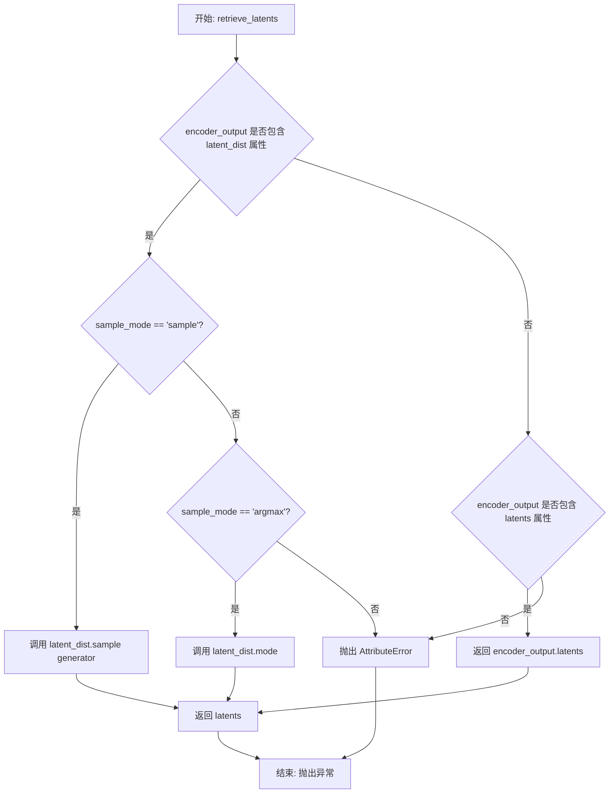
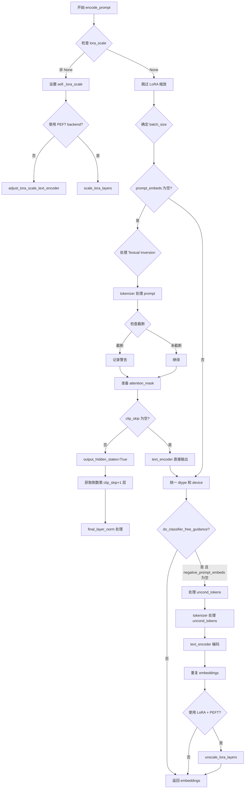
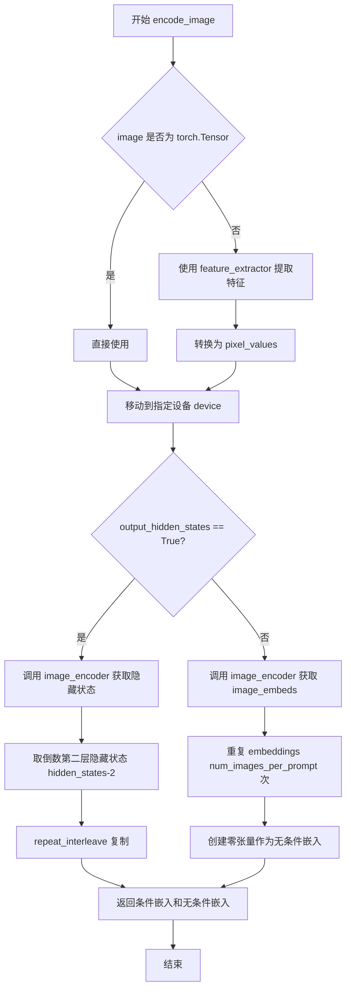
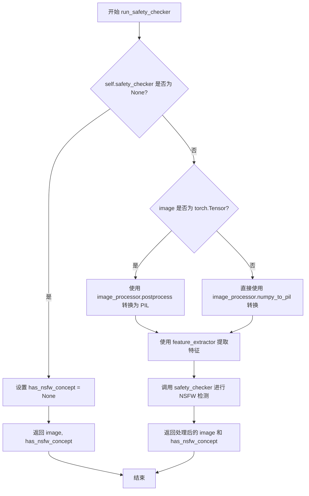
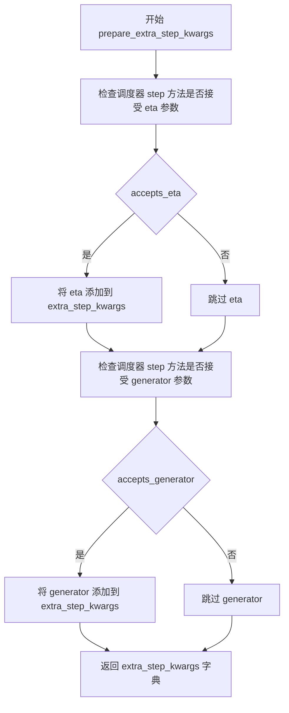
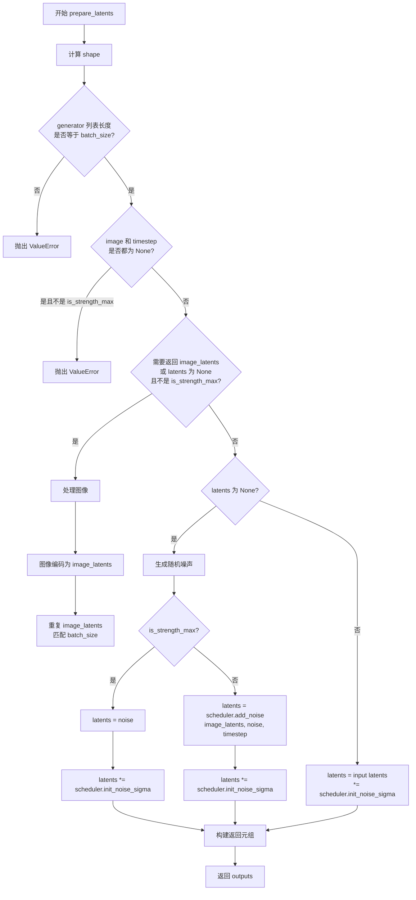
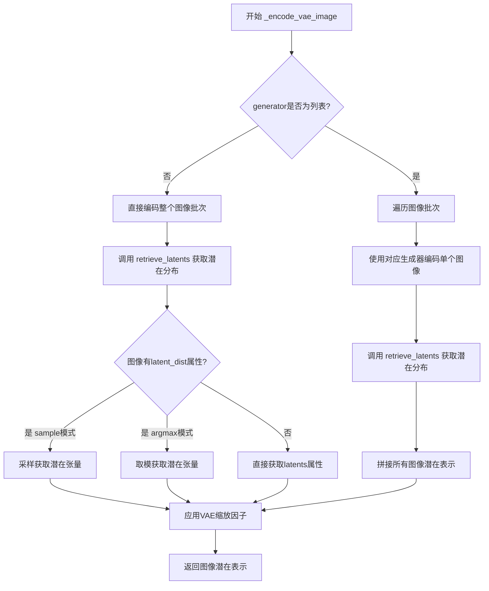
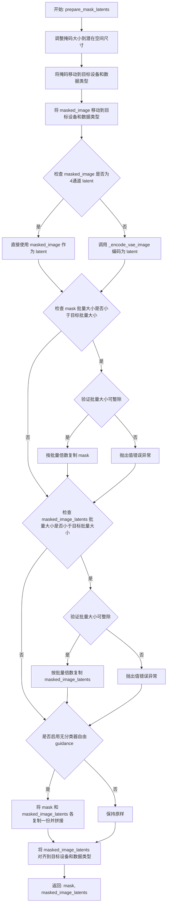

# `diffusers\src\diffusers\pipelines\stable_diffusion\pipeline_stable_diffusion_inpaint.py` 详细设计文档

这是一个基于Stable Diffusion的图像修复(Inpainting)Pipeline，接收带mask的图像、mask图像和文本提示，利用VAE编码、UNet去噪和文本编码器生成符合文本描述的修复后图像。该Pipeline支持多种功能包括LoRA、IP-Adapter、Textual Inversion等高级特性。

## 整体流程

```mermaid
graph TD
    A[开始: __call__] --> B[检查输入参数 check_inputs]
B --> C[获取默认高度和宽度]
C --> D[编码提示词 encode_prompt]
D --> E{是否使用IP-Adapter?}
E -- 是 --> F[prepare_ip_adapter_image_embeds]
E -- 否 --> G[设置timesteps retrieve_timesteps]
F --> G
G --> H[get_timesteps计算实际步数]
H --> I[预处理图像和mask]
I --> J[准备latents变量 prepare_latents]
J --> K[准备mask latents prepare_mask_latents]
K --> L{检查mask通道配置}
L --> M[准备额外步骤参数 prepare_extra_step_kwargs]
M --> N{UNet有时间条件嵌入?}
N -- 是 --> O[get_guidance_scale_embedding]
N -- 否 --> P[开始去噪循环]
O --> P
P --> Q[遍历每个timestep]
Q --> R[扩展latents用于CFG]
R --> S[拼接mask和masked_image_latents]
S --> T[UNet预测噪声]
T --> U[执行分类器自由引导]
U --> V[scheduler.step更新latents]
V --> W{是否需要回调?]
W -- 是 --> X[执行callback_on_step_end]
W -- 否 --> Y{还有更多timestep?}
X --> Y
Y -- 是 --> Q
Y -- 否 --> Z[VAE解码生成最终图像]
Z --> AA[运行安全检查 run_safety_checker]
AA --> AB[后处理图像 postprocess]
AB --> AC[返回结果]
```

## 类结构

```
DiffusionPipeline (基类)
├── StableDiffusionMixin
├── TextualInversionLoaderMixin
├── IPAdapterMixin
├── StableDiffusionLoraLoaderMixin
├── FromSingleFileMixin
└── StableDiffusionInpaintPipeline (主类)
```

## 全局变量及字段


### `logger`
    
模块级日志记录器，用于输出运行时的日志信息

类型：`logging.Logger`
    


### `XLA_AVAILABLE`
    
XLA是否可用的标志，用于判断是否可以使用torch_xla进行加速

类型：`bool`
    


### `StableDiffusionInpaintPipeline.vae`
    
VAE模型用于编码和解码图像到潜在表示

类型：`AutoencoderKL | AsymmetricAutoencoderKL`
    


### `StableDiffusionInpaintPipeline.text_encoder`
    
冻结的文本编码器，用于将文本提示转换为嵌入向量

类型：`CLIPTextModel`
    


### `StableDiffusionInpaintPipeline.tokenizer`
    
CLIP分词器，用于将文本分词为token序列

类型：`CLIPTokenizer`
    


### `StableDiffusionInpaintPipeline.unet`
    
条件UNet模型，用于对图像潜在表示进行去噪

类型：`UNet2DConditionModel`
    


### `StableDiffusionInpaintPipeline.scheduler`
    
扩散调度器，用于控制去噪过程中的时间步

类型：`KarrasDiffusionSchedulers`
    


### `StableDiffusionInpaintPipeline.safety_checker`
    
安全检查器，用于检测生成图像是否包含不当内容

类型：`StableDiffusionSafetyChecker`
    


### `StableDiffusionInpaintPipeline.feature_extractor`
    
CLIP图像特征提取器，用于从图像中提取特征供安全检查器使用

类型：`CLIPImageProcessor`
    


### `StableDiffusionInpaintPipeline.image_encoder`
    
CLIP视觉编码器，用于IP-Adapter图像提示

类型：`CLIPVisionModelWithProjection`
    


### `StableDiffusionInpaintPipeline.vae_scale_factor`
    
VAE缩放因子，用于计算潜在空间的尺寸

类型：`int`
    


### `StableDiffusionInpaintPipeline.image_processor`
    
图像预处理器，用于图像的预处理和后处理

类型：`VaeImageProcessor`
    


### `StableDiffusionInpaintPipeline.mask_processor`
    
掩码预处理器，用于掩码的预处理和二值化

类型：`VaeImageProcessor`
    


### `StableDiffusionInpaintPipeline._guidance_scale`
    
分类器自由引导强度，控制文本提示对生成图像的影响程度

类型：`float`
    


### `StableDiffusionInpaintPipeline._clip_skip`
    
CLIP跳过的层数，用于控制使用CLIP的哪一层输出

类型：`int`
    


### `StableDiffusionInpaintPipeline._cross_attention_kwargs`
    
交叉注意力参数，用于控制注意力机制的行为

类型：`dict[str, Any]`
    


### `StableDiffusionInpaintPipeline._num_timesteps`
    
扩散过程的时间步总数

类型：`int`
    


### `StableDiffusionInpaintPipeline._interrupt`
    
中断标志，用于在推理过程中中断生成过程

类型：`bool`
    
    

## 全局函数及方法


### `retrieve_latents`

从 encoder 输出中提取 latents，支持多种提取模式（采样或取模），同时兼容不同的 encoder 输出格式。

参数：

- `encoder_output`：`torch.Tensor`，encoder 的输出对象，通常包含 `latent_dist` 或 `latents` 属性
- `generator`：`torch.Generator | None`，可选的随机数生成器，用于采样时的随机性控制
- `sample_mode`：`str`，采样模式，`"sample"` 表示从分布中采样，`"argmax"` 表示取分布的众数（默认值：`"sample"`）

返回值：`torch.Tensor`，提取出的 latents 张量

#### 流程图



#### 带注释源码

```python
def retrieve_latents(
    encoder_output: torch.Tensor, generator: torch.Generator | None = None, sample_mode: str = "sample"
):
    """
    从 encoder 输出中提取 latents。
    
    该函数支持三种提取方式：
    1. 当 encoder_output 包含 latent_dist 属性且 sample_mode='sample' 时，从分布中采样
    2. 当 encoder_output 包含 latent_dist 属性且 sample_mode='argmax' 时，取分布的众数
    3. 当 encoder_output 直接包含 latents 属性时，直接返回该属性
    
    Args:
        encoder_output: encoder 的输出，通常是 VAE 的编码结果，包含 latent_dist 或 latents 属性
        generator: 可选的随机数生成器，用于控制采样过程中的随机性
        sample_mode: 采样模式，'sample' 表示随机采样，'argmax' 表示取众数
    
    Returns:
        torch.Tensor: 提取出的 latents 张量
    
    Raises:
        AttributeError: 当 encoder_output 既不包含 latent_dist 也不包含 latents 属性时抛出
    """
    # 检查 encoder_output 是否包含 latent_dist 属性，并且采样模式为 'sample'
    if hasattr(encoder_output, "latent_dist") and sample_mode == "sample":
        # 从潜在分布中采样得到 latents，可选使用 generator 控制随机性
        return encoder_output.latent_dist.sample(generator)
    # 检查 encoder_output 是否包含 latent_dist 属性，并且采样模式为 'argmax'
    elif hasattr(encoder_output, "latent_dist") and sample_mode == "argmax":
        # 取潜在分布的众数（最可能的值）作为 latents
        return encoder_output.latent_dist.mode()
    # 检查 encoder_output 是否直接包含 latents 属性
    elif hasattr(encoder_output, "latents"):
        # 直接返回预存的 latents 属性
        return encoder_output.latents
    # 如果都不满足，抛出异常
    else:
        raise AttributeError("Could not access latents of provided encoder_output")
```


### `retrieve_timesteps`

该函数负责调用调度器（scheduler）的 `set_timesteps` 方法并从中获取时间步长调度表。它支持自定义时间步长或自定义 sigmas，并能验证调度器是否支持这些自定义参数，最后返回时间步长数组和推理步数。

参数：

- `scheduler`：`SchedulerMixin`，调度器对象，用于获取时间步长
- `num_inference_steps`：`int | None`，生成样本时使用的扩散步数，如果使用此参数则 `timesteps` 必须为 `None`
- `device`：`str | torch.device | None`，时间步长要移动到的设备，如果为 `None` 则不移动
- `timesteps`：`list[int] | None`，用于覆盖调度器时间步长间隔策略的自定义时间步长，如果传递了 `timesteps`，则 `num_inference_steps` 和 `sigmas` 必须为 `None`
- `sigmas`：`list[float] | None`，用于覆盖调度器时间步长间隔策略的自定义 sigmas，如果传递了 `sigmas`，则 `num_inference_steps` 和 `timesteps` 必须为 `None`
- `**kwargs`：任意关键字参数，将传递给 `scheduler.set_timesteps`

返回值：`tuple[torch.Tensor, int]`，元组包含调度器的时间步长调度表（第一个元素）和推理步数（第二个元素）

#### 流程图

```mermaid
flowchart TD
    A[开始] --> B{检查: timesteps 和 sigmas 是否同时存在?}
    B -->|是| C[抛出 ValueError: 只能选择一个]
    B -->|否| D{检查: timesteps 是否存在?}
    D -->|是| E{调度器是否支持 timesteps?}
    D -->|否| F{检查: sigmas 是否存在?}
    E -->|否| G[抛出 ValueError: 调度器不支持自定义 timesteps]
    E -->|是| H[调用 scheduler.set_timesteps<br/>参数: timesteps=timesteps, device=device]
    F -->|是| I{调度器是否支持 sigmas?}
    F -->|否| J[调用 scheduler.set_timesteps<br/>参数: num_inference_steps, device=device]
    I -->|否| K[抛出 ValueError: 调度器不支持自定义 sigmas]
    I -->|是| L[调用 scheduler.set_timesteps<br/>参数: sigmas=sigmas, device=device]
    H --> M[获取 scheduler.timesteps]
    L --> M
    J --> M
    M --> N[计算 num_inference_steps = len(timesteps)]
    N --> O[返回 timesteps, num_inference_steps]
```

#### 带注释源码

```python
# 从 diffusers.pipelines.stable_diffusion.pipeline_stable_diffusion 中复制的 retrieve_timesteps 函数
def retrieve_timesteps(
    scheduler,  # SchedulerMixin: 调度器对象
    num_inference_steps: int | None = None,  # int 或 None: 推理步数
    device: str | torch.device | None = None,  # str/torch.device/None: 目标设备
    timesteps: list[int] | None = None,  # list[int] 或 None: 自定义时间步长
    sigmas: list[float] | None = None,  # list[float] 或 None: 自定义 sigmas
    **kwargs,  # 任意关键字参数，传递给 scheduler.set_timesteps
):
    r"""
    调用调度器的 `set_timesteps` 方法并在调用后从中获取时间步长。支持自定义时间步长。
    任何 kwargs 将被提供给 `scheduler.set_timesteps`。

    参数:
        scheduler (SchedulerMixin):
            用于获取时间步长的调度器。
        num_inference_steps (int):
            使用预训练模型生成样本时使用的扩散步数。如果使用此参数，`timesteps` 必须为 `None`。
        device (str 或 torch.device, 可选):
            时间步长应移动到的设备。如果为 `None`，则不移动时间步长。
        timesteps (list[int], 可选):
            用于覆盖调度器时间步长间隔策略的自定义时间步长。如果传递了 `timesteps`，
            则 `num_inference_steps` 和 `sigmas` 必须为 `None`。
        sigmas (list[float], 可选):
            用于覆盖调度器时间步长间隔策略的自定义 sigmas。如果传递了 `sigmas`，
            则 `num_inference_steps` 和 `timesteps` 必须为 `None`。

    返回:
        tuple[torch.Tensor, int]: 元组，其中第一个元素是调度器的时间步长调度表，
        第二个元素是推理步数。
    """
    # 校验：不能同时传递 timesteps 和 sigmas
    if timesteps is not None and sigmas is not None:
        raise ValueError("Only one of `timesteps` or `sigmas` can be passed. Please choose one to set custom values")
    
    # 处理自定义 timesteps 的情况
    if timesteps is not None:
        # 检查调度器的 set_timesteps 方法是否接受 timesteps 参数
        accepts_timesteps = "timesteps" in set(inspect.signature(scheduler.set_timesteps).parameters.keys())
        if not accepts_timesteps:
            raise ValueError(
                f"The current scheduler class {scheduler.__class__}'s `set_timesteps` does not support custom"
                f" timestep schedules. Please check whether you are using the correct scheduler."
            )
        # 调用调度器的 set_timesteps 方法设置自定义时间步长
        scheduler.set_timesteps(timesteps=timesteps, device=device, **kwargs)
        # 从调度器获取设置后的时间步长
        timesteps = scheduler.timesteps
        # 计算推理步数
        num_inference_steps = len(timesteps)
    
    # 处理自定义 sigmas 的情况
    elif sigmas is not None:
        # 检查调度器的 set_timesteps 方法是否接受 sigmas 参数
        accept_sigmas = "sigmas" in set(inspect.signature(scheduler.set_timesteps).parameters.keys())
        if not accept_sigmas:
            raise ValueError(
                f"The current scheduler class {scheduler.__class__}'s `set_timesteps` does not support custom"
                f" sigmas schedules. Please check whether you are using the correct scheduler."
            )
        # 调用调度器的 set_timesteps 方法设置自定义 sigmas
        scheduler.set_timesteps(sigmas=sigmas, device=device, **kwargs)
        # 从调度器获取设置后的时间步长
        timesteps = scheduler.timesteps
        # 计算推理步数
        num_inference_steps = len(timesteps)
    
    # 处理默认情况：使用 num_inference_steps
    else:
        # 调用调度器的 set_timesteps 方法设置推理步数
        scheduler.set_timesteps(num_inference_steps, device=device, **kwargs)
        # 从调度器获取设置后的时间步长
        timesteps = scheduler.timesteps
    
    # 返回时间步长数组和推理步数
    return timesteps, num_inference_steps
```


### `StableDiffusionInpaintPipeline.__init__`

该方法是 Stable Diffusion 图像修复管道的构造函数，负责初始化所有核心组件（VAE、文本编码器、UNet、调度器等），验证配置参数，注册模块，并设置图像处理器和掩码处理器。

参数：

- `vae`：`AutoencoderKL | AsymmetricAutoencoderKL`，用于将图像编码和解码到潜在表示的变分自编码器模型
- `text_encoder`：`CLIPTextModel`，冻结的文本编码器（如 clip-vit-large-patch14）
- `tokenizer`：`~transformers.CLIPTokenizer`，用于对文本进行分词的 CLIPTokenizer
- `unet`：`UNet2DConditionModel`，用于对编码后的图像潜在表示进行去噪的 UNet2DConditionModel
- `scheduler`：`KarrasDiffusionSchedulers`，与 unet 结合使用以对编码后的图像潜在表示进行去噪的调度器
- `safety_checker`：`StableDiffusionSafetyChecker`，用于评估生成的图像是否可以被认为是攻击性或有害的分类模块
- `feature_extractor`：`~transformers.CLIPImageProcessor`，用于从生成的图像中提取特征的 CLIPImageProcessor，作为 safety_checker 的输入
- `image_encoder`：`CLIPVisionModelWithProjection = None`，用于 IP-Adapter 的 CLIP 视觉模型，可选
- `requires_safety_checker`：`bool = True`，是否需要安全检查器

返回值：`None`，构造函数无返回值

#### 流程图

```mermaid
flowchart TD
    A[开始 __init__] --> B[调用 super().__init__]
    B --> C{scheduler.config.steps_offset != 1?}
    C -->|Yes| D[发出弃用警告并修改 steps_offset 为 1]
    C -->|No| E{scheduler.config.skip_prk_steps == False?}
    D --> E
    E -->|Yes| F[发出弃用警告并设置 skip_prk_steps = True]
    E -->|No| G{safety_checker is None && requires_safety_checker?}
    F --> G
    G -->|Yes| H[发出安全警告]
    G -->|No| I{safety_checker is not None && feature_extractor is None?}
    H --> I
    I -->|Yes| J[抛出 ValueError]
    I -->|No| K{unet 版本 < 0.9.0 且 sample_size < 64?}
    J --> K
    K -->|Yes| L[发出弃用警告并修改 sample_size 为 64]
    K -->|No| M{unet.config.in_channels != 9?}
    L --> M
    M -->|Yes| N[记录日志提示输入通道数]
    M -->|No| O[调用 self.register_modules 注册所有模块]
    O --> P[计算 vae_scale_factor]
    P --> Q[创建 VaeImageProcessor 用于图像处理]
    Q --> R[创建 VaeImageProcessor 用于掩码处理]
    R --> S[调用 self.register_to_config 注册配置]
    S --> T[结束 __init__]
```

#### 带注释源码

```python
def __init__(
    self,
    vae: AutoencoderKL | AsymmetricAutoencoderKL,
    text_encoder: CLIPTextModel,
    tokenizer: CLIPTokenizer,
    unet: UNet2DConditionModel,
    scheduler: KarrasDiffusionSchedulers,
    safety_checker: StableDiffusionSafetyChecker,
    feature_extractor: CLIPImageProcessor,
    image_encoder: CLIPVisionModelWithProjection = None,
    requires_safety_checker: bool = True,
):
    # 调用父类 DiffusionPipeline 的初始化方法
    super().__init__()

    # 检查调度器的 steps_offset 配置是否为 1，如果不是则发出弃用警告并修正
    if scheduler is not None and getattr(scheduler.config, "steps_offset", 1) != 1:
        deprecation_message = (
            f"The configuration file of this scheduler: {scheduler} is outdated. `steps_offset`"
            f" should be set to 1 instead of {scheduler.config.steps_offset}. Please make sure "
            "to update the config accordingly as leaving `steps_offset` might led to incorrect results"
            " in future versions. If you have downloaded this checkpoint from the Hugging Face Hub,"
            " it would be very nice if you could open a Pull request for the `scheduler/scheduler_config.json`"
            " file"
        )
        deprecate("steps_offset!=1", "1.0.0", deprecation_message, standard_warn=False)
        new_config = dict(scheduler.config)
        new_config["steps_offset"] = 1
        scheduler._internal_dict = FrozenDict(new_config)

    # 检查调度器的 skip_prk_steps 配置，如果未设置则发出弃用警告并设置为 True
    if scheduler is not None and getattr(scheduler.config, "skip_prk_steps", True) is False:
        deprecation_message = (
            f"The configuration file of this scheduler: {scheduler} has not set the configuration"
            " `skip_prk_steps`. `skip_prk_steps` should be set to True in the configuration file. Please make"
            " sure to update the config accordingly as not setting `skip_prk_steps` in the config might lead to"
            " incorrect results in future versions. If you have downloaded this checkpoint from the Hugging Face"
            " Hub, it would be very nice if you could open a Pull request for the"
            " `scheduler/scheduler_config.json` file"
        )
        deprecate("skip_prk_steps not set", "1.0.0", deprecation_message, standard_warn=False)
        new_config = dict(scheduler.config)
        new_config["skip_prk_steps"] = True
        scheduler._internal_dict = FrozenDict(new_config)

    # 如果 safety_checker 为 None 但 requires_safety_checker 为 True，发出安全警告
    if safety_checker is None and requires_safety_checker:
        logger.warning(
            f"You have disabled the safety checker for {self.__class__} by passing `safety_checker=None`. Ensure"
            " that you abide to the conditions of the Stable Diffusion license and do not expose unfiltered"
            " results in services or applications open to the public. Both the diffusers team and Hugging Face"
            " strongly recommend to keep the safety filter enabled in all public facing circumstances, disabling"
            " it only for use-cases that involve analyzing network behavior or auditing its results. For more"
            " information, please have a look at https://github.com/huggingface/diffusers/pull/254 ."
        )

    # 如果 safety_checker 不为 None 但 feature_extractor 为 None，抛出 ValueError
    if safety_checker is not None and feature_extractor is None:
        raise ValueError(
            "Make sure to define a feature extractor when loading {self.__class__} if you want to use the safety"
            " checker. If you do not want to use the safety checker, you can pass `'safety_checker=None'` instead."
        )

    # 检查 UNet 版本和 sample_size 配置，如果版本小于 0.9.0 且 sample_size 小于 64 则发出弃用警告
    is_unet_version_less_0_9_0 = (
        unet is not None
        and hasattr(unet.config, "_diffusers_version")
        and version.parse(version.parse(unet.config._diffusers_version).base_version) < version.parse("0.9.0.dev0")
    )
    is_unet_sample_size_less_64 = (
        unet is not None and hasattr(unet.config, "sample_size") and unet.config.sample_size < 64
    )
    if is_unet_version_less_0_9_0 and is_unet_sample_size_less_64:
        deprecation_message = (
            "The configuration file of the unet has set the default `sample_size` to smaller than"
            " 64 which seems highly unlikely .If you're checkpoint is a fine-tuned version of any of the"
            " following: \n- CompVis/stable-diffusion-v1-4 \n- CompVis/stable-diffusion-v1-3 \n-"
            " CompVis/stable-diffusion-v1-2 \n- CompVis/stable-diffusion-v1-1 \n- stable-diffusion-v1-5/stable-diffusion-v1-5"
            " \n- stable-diffusion-v1-5/stable-diffusion-inpainting \n you should change 'sample_size' to 64 in the"
            " configuration file. Please make sure to update the config accordingly as leaving `sample_size=32`"
            " in the config might lead to incorrect results in future versions. If you have downloaded this"
            " checkpoint from the Hugging Face Hub, it would be very nice if you could open a Pull request for"
            " the `unet/config.json` file"
        )
        deprecate("sample_size<64", "1.0.0", deprecation_message, standard_warn=False)
        new_config = dict(unet.config)
        new_config["sample_size"] = 64
        unet._internal_dict = FrozenDict(new_config)

    # 检查 UNet 输入通道数，如果不等于 9 则记录日志（假设 num_channels_latents == 4, num_channels_mask == 1, num_channels_masked == 4）
    if unet is not None and unet.config.in_channels != 9:
        logger.info(f"You have loaded a UNet with {unet.config.in_channels} input channels which.")

    # 注册所有模块到管道
    self.register_modules(
        vae=vae,
        text_encoder=text_encoder,
        tokenizer=tokenizer,
        unet=unet,
        scheduler=scheduler,
        safety_checker=safety_checker,
        feature_extractor=feature_extractor,
        image_encoder=image_encoder,
    )

    # 计算 VAE 缩放因子，基于 VAE 块输出通道数的幂
    self.vae_scale_factor = 2 ** (len(self.vae.config.block_out_channels) - 1) if getattr(self, "vae", None) else 8

    # 创建图像处理器，用于预处理和后处理图像
    self.image_processor = VaeImageProcessor(vae_scale_factor=self.vae_scale_factor)

    # 创建掩码处理器，用于预处理掩码图像，包含归一化、二值化和灰度转换
    self.mask_processor = VaeImageProcessor(
        vae_scale_factor=self.vae_scale_factor, do_normalize=False, do_binarize=True, do_convert_grayscale=True
    )

    # 将 requires_safety_checker 注册到配置中
    self.register_to_config(requires_safety_checker=requires_safety_checker)
```


### `StableDiffusionInpaintPipeline._encode_prompt`

该方法是Stable Diffusion图像修复管道的旧版提示词编码方法，已被标记为弃用。它内部调用新版`encode_prompt`方法并将返回的元组结果进行反向兼容的拼接处理，以维持旧版API的输出格式。

参数：

- `prompt`：`str | list[str] | None`，要编码的提示词，可以是单个字符串或字符串列表
- `device`：`torch.device`，PyTorch设备，用于将数据移动到指定设备
- `num_images_per_prompt`：`int`，每个提示词生成的图像数量
- `do_classifier_free_guidance`：`bool`，是否使用无分类器自由引导
- `negative_prompt`：`str | list[str] | None`，负面提示词，用于指导不包含在图像生成中的内容
- `prompt_embeds`：`torch.Tensor | None`，预生成的提示词嵌入向量，如果提供则直接从此处获取
- `negative_prompt_embeds`：`torch.Tensor | None`，预生成的负面提示词嵌入向量
- `lora_scale`：`float | None`，LoRA权重缩放因子，用于调整LoRA层的影响
- `**kwargs`：可变关键字参数，会传递给`encode_prompt`方法

返回值：`torch.Tensor`，拼接后的提示词嵌入向量（包含负面嵌入和正向嵌入，用于后向兼容）

#### 流程图

```mermaid
flowchart TD
    A[开始 _encode_prompt] --> B[发出弃用警告]
    B --> C[调用 encode_prompt 方法]
    C --> D[获取元组返回结果 prompt_embeds_tuple]
    D --> E[拼接结果: torch.cat[negative_prompt_embeds, prompt_embeds]]
    E --> F[返回拼接后的张量]
    
    style A fill:#f9f,stroke:#333
    style F fill:#9f9,stroke:#333
    style B fill:#ff9,stroke:#333
```

#### 带注释源码

```python
def _encode_prompt(
    self,
    prompt,                          # 输入的文本提示词
    device,                          # 计算设备
    num_images_per_prompt,           # 每个提示词生成的图像数量
    do_classifier_free_guidance,     # 是否启用无分类器引导
    negative_prompt=None,             # 负面提示词
    prompt_embeds: torch.Tensor | None = None,    # 预计算的提示词嵌入
    negative_prompt_embeds: torch.Tensor | None = None,  # 预计算的负面嵌入
    lora_scale: float | None = None,  # LoRA缩放因子
    **kwargs,                        # 其他传递给encode_prompt的参数
):
    """
    弃用的提示词编码方法，内部调用新版encode_prompt并保持向后兼容的输出格式。
    
    注意：此方法将在未来版本中移除，建议使用encode_prompt()方法。
    输出格式已从拼接的张量改为元组形式。
    """
    # 发出弃用警告，提醒用户使用新方法encode_prompt()
    deprecation_message = "`_encode_prompt()` is deprecated and it will be removed in a future version. Use `encode_prompt()` instead. Also, be aware that the output format changed from a concatenated tensor to a tuple."
    deprecate("_encode_prompt()", "1.0.0", deprecation_message, standard_warn=False)

    # 调用新版的encode_prompt方法，获取元组形式的返回结果
    # 元组包含: (prompt_embeds, negative_prompt_embeds)
    prompt_embeds_tuple = self.encode_prompt(
        prompt=prompt,
        device=device,
        num_images_per_prompt=num_images_per_prompt,
        do_classifier_free_guidance=do_classifier_free_guidance,
        negative_prompt=negative_prompt,
        prompt_embeds=prompt_embeds,
        negative_prompt_embeds=negative_prompt_embeds,
        lora_scale=lora_scale,
        **kwargs,
    )

    # 为保持向后兼容性，将元组结果拼接回单一张量
    # 旧版格式: [negative_prompt_embeds, prompt_embeds] 沿第一维拼接
    # 注意：元组顺序是(prompt_embeds, negative_prompt_embeds)，所以取[1]为negative，[0]为positive
    prompt_embeds = torch.cat([prompt_embeds_tuple[1], prompt_embeds_tuple[0]])

    return prompt_embeds
```


### `StableDiffusionInpaintPipeline.encode_prompt`

该方法负责将文本提示词编码为文本 encoder 的隐藏状态（embedding），支持 LoRA 权重调整、CLIP 层跳过、文本反转（Textual Inversion）以及无分类器引导（Classifier-Free Guidance）的条件嵌入生成。

参数：

- `prompt`：`str | list[str] | None`，要编码的文本提示词，支持单字符串或字符串列表
- `device`：`torch.device`，PyTorch 设备，用于将数据移动到指定设备
- `num_images_per_prompt`：`int`，每个提示词需要生成的图像数量，用于复制 embeddings
- `do_classifier_free_guidance`：`bool`，是否启用无分类器引导
- `negative_prompt`：`str | list[str] | None`，负面提示词，用于引导图像不包含指定内容
- `prompt_embeds`：`torch.Tensor | None`，预生成的提示词嵌入，若提供则直接使用
- `negative_prompt_embeds`：`torch.Tensor | None`，预生成的负面提示词嵌入
- `lora_scale`：`float | None`，LoRA 层的缩放因子，用于调整 LoRA 权重
- `clip_skip`：`int | None`，CLIP 编码时跳过的层数，用于获取不同层次的表示

返回值：`tuple[torch.Tensor, torch.Tensor]`，返回编码后的提示词嵌入和负面提示词嵌入组成的元组

#### 流程图



#### 带注释源码

```python
def encode_prompt(
    self,
    prompt,
    device,
    num_images_per_prompt,
    do_classifier_free_guidance,
    negative_prompt=None,
    prompt_embeds: torch.Tensor | None = None,
    negative_prompt_embeds: torch.Tensor | None = None,
    lora_scale: float | None = None,
    clip_skip: int | None = None,
):
    r"""
    Encodes the prompt into text encoder hidden states.

    Args:
        prompt (`str` or `list[str]`, *optional*):
            prompt to be encoded
        device: (`torch.device`):
            torch device
        num_images_per_prompt (`int`):
            number of images that should be generated per prompt
        do_classifier_free_guidance (`bool`):
            whether to use classifier free guidance or not
        negative_prompt (`str` or `list[str]`, *optional*):
            The prompt or prompts not to guide the image generation. If not defined, one has to pass
            `negative_prompt_embeds` instead. Ignored when not using guidance (i.e., ignored if `guidance_scale` is
            less than `1`).
        prompt_embeds (`torch.Tensor`, *optional*):
            Pre-generated text embeddings. Can be used to easily tweak text inputs, *e.g.* prompt weighting. If not
            provided, text embeddings will be generated from `prompt` input argument.
        negative_prompt_embeds (`torch.Tensor`, *optional*):
            Pre-generated negative text embeddings. Can be used to easily tweak text inputs, *e.g.* prompt
            weighting. If not provided, negative_prompt_embeds will be generated from `negative_prompt` input
            argument.
        lora_scale (`float`, *optional*):
            A LoRA scale that will be applied to all LoRA layers of the text encoder if LoRA layers are loaded.
        clip_skip (`int`, *optional*):
            Number of layers to be skipped from CLIP while computing the prompt embeddings. A value of 1 means that
            the output of the pre-final layer will be used for computing the prompt embeddings.
    """
    # 设置 lora scale，以便 text encoder 的 LoRA 函数可以正确访问
    # 这是一个猴子补丁机制，允许动态调整 LoRA 权重
    if lora_scale is not None and isinstance(self, StableDiffusionLoraLoaderMixin):
        self._lora_scale = lora_scale

        # 动态调整 LoRA 缩放
        if not USE_PEFT_BACKEND:
            adjust_lora_scale_text_encoder(self.text_encoder, lora_scale)
        else:
            scale_lora_layers(self.text_encoder, lora_scale)

    # 确定批次大小：根据 prompt 类型或已提供的 embeddings 确定
    if prompt is not None and isinstance(prompt, str):
        batch_size = 1
    elif prompt is not None and isinstance(prompt, list):
        batch_size = len(prompt)
    else:
        batch_size = prompt_embeds.shape[0]

    # 如果未提供 prompt_embeds，则需要从 prompt 生成
    if prompt_embeds is None:
        # 文本反转：如有需要，处理多向量 token
        if isinstance(self, TextualInversionLoaderMixin):
            prompt = self.maybe_convert_prompt(prompt, self.tokenizer)

        # 使用 tokenizer 将文本转换为 token ID
        text_inputs = self.tokenizer(
            prompt,
            padding="max_length",
            max_length=self.tokenizer.model_max_length,
            truncation=True,
            return_tensors="pt",
        )
        text_input_ids = text_inputs.input_ids
        # 获取未截断的 token 序列用于比较
        untruncated_ids = self.tokenizer(prompt, padding="longest", return_tensors="pt").input_ids

        # 检查是否发生了截断，并记录警告信息
        if untruncated_ids.shape[-1] >= text_input_ids.shape[-1] and not torch.equal(
            text_input_ids, untruncated_ids
        ):
            removed_text = self.tokenizer.batch_decode(
                untruncated_ids[:, self.tokenizer.model_max_length - 1 : -1]
            )
            logger.warning(
                "The following part of your input was truncated because CLIP can only handle sequences up to"
                f" {self.tokenizer.model_max_length} tokens: {removed_text}"
            )

        # 准备 attention mask
        if hasattr(self.text_encoder.config, "use_attention_mask") and self.text_encoder.config.use_attention_mask:
            attention_mask = text_inputs.attention_mask.to(device)
        else:
            attention_mask = None

        # 根据是否 skip CLIP 层选择不同的编码方式
        if clip_skip is None:
            # 直接获取最后一层的 hidden states
            prompt_embeds = self.text_encoder(text_input_ids.to(device), attention_mask=attention_mask)
            prompt_embeds = prompt_embeds[0]
        else:
            # 获取所有层的 hidden states，然后选择指定层
            prompt_embeds = self.text_encoder(
                text_input_ids.to(device), attention_mask=attention_mask, output_hidden_states=True
            )
            # hidden_states 是一个元组，包含所有编码器层的输出
            # 选择倒数第 clip_skip+1 层（即跳过 clip_skip 层后的最后一层）
            prompt_embeds = prompt_embeds[-1][-(clip_skip + 1)]
            # 应用 final_layer_norm 以保持表示的一致性
            prompt_embeds = self.text_encoder.text_model.final_layer_norm(prompt_embeds)

    # 确定 prompt_embeds 的数据类型
    if self.text_encoder is not None:
        prompt_embeds_dtype = self.text_encoder.dtype
    elif self.unet is not None:
        prompt_embeds_dtype = self.unet.dtype
    else:
        prompt_embeds_dtype = prompt_embeds.dtype

    # 将 prompt_embeds 转换为适当的 dtype 和 device
    prompt_embeds = prompt_embeds.to(dtype=prompt_embeds_dtype, device=device)

    # 获取 embeddings 的形状信息
    bs_embed, seq_len, _ = prompt_embeds.shape
    # 为每个 prompt 复制 embeddings（mps 友好的方法）
    prompt_embeds = prompt_embeds.repeat(1, num_images_per_prompt, 1)
    prompt_embeds = prompt_embeds.view(bs_embed * num_images_per_prompt, seq_len, -1)

    # 为无分类器引导获取无条件 embeddings
    if do_classifier_free_guidance and negative_prompt_embeds is None:
        uncond_tokens: list[str]
        if negative_prompt is None:
            # 如果没有提供负面提示词，使用空字符串
            uncond_tokens = [""] * batch_size
        elif prompt is not None and type(prompt) is not type(negative_prompt):
            raise TypeError(
                f"`negative_prompt` should be the same type to `prompt`, but got {type(negative_prompt)} !="
                f" {type(prompt)}."
            )
        elif isinstance(negative_prompt, str):
            uncond_tokens = [negative_prompt]
        elif batch_size != len(negative_prompt):
            raise ValueError(
                f"`negative_prompt`: {negative_prompt} has batch size {len(negative_prompt)}, but `prompt`:"
                f" {prompt} has batch size {batch_size}. Please make sure that passed `negative_prompt` matches"
                " the batch size of `prompt`."
            )
        else:
            uncond_tokens = negative_prompt

        # 文本反转：如有需要，处理多向量 token
        if isinstance(self, TextualInversionLoaderMixin):
            uncond_tokens = self.maybe_convert_prompt(uncond_tokens, self.tokenizer)

        max_length = prompt_embeds.shape[1]
        # 使用 tokenizer 处理无条件 tokens
        uncond_input = self.tokenizer(
            uncond_tokens,
            padding="max_length",
            max_length=max_length,
            truncation=True,
            return_tensors="pt",
        )

        # 准备 attention mask
        if hasattr(self.text_encoder.config, "use_attention_mask") and self.text_encoder.config.use_attention_mask:
            attention_mask = uncond_input.attention_mask.to(device)
        else:
            attention_mask = None

        # 编码无条件 embeddings
        negative_prompt_embeds = self.text_encoder(
            uncond_input.input_ids.to(device),
            attention_mask=attention_mask,
        )
        negative_prompt_embeds = negative_prompt_embeds[0]

    # 如果使用无分类器引导，复制无条件 embeddings
    if do_classifier_free_guidance:
        seq_len = negative_prompt_embeds.shape[1]

        # 转换 dtype 和 device
        negative_prompt_embeds = negative_prompt_embeds.to(dtype=prompt_embeds_dtype, device=device)

        # 复制 embeddings 以匹配每个 prompt 的图像数量
        negative_prompt_embeds = negative_prompt_embeds.repeat(1, num_images_per_prompt, 1)
        negative_prompt_embeds = negative_prompt_embeds.view(batch_size * num_images_per_prompt, seq_len, -1)

    # 如果使用了 LoRA + PEFT，需要恢复原始缩放
    if self.text_encoder is not None:
        if isinstance(self, StableDiffusionLoraLoaderMixin) and USE_PEFT_BACKEND:
            # 通过 unscale 恢复原始权重
            unscale_lora_layers(self.text_encoder, lora_scale)

    return prompt_embeds, negative_prompt_embeds
```


### `StableDiffusionInpaintPipeline.encode_image`

该方法用于将输入图像编码为图像嵌入向量，支持两种模式：直接输出图像嵌入或输出隐藏状态。可用于IP-Adapter图像提示功能，为生成过程提供图像条件引导。

参数：

- `self`：`StableDiffusionInpaintPipeline` 实例本身
- `image`：`Union[torch.Tensor, PIL.Image, numpy.ndarray, List]`（根据 PipelineImageInput 类型），待编码的输入图像
- `device`：`torch.device`，图像数据要迁移到的目标设备
- `num_images_per_prompt`：`int`，每个文本提示生成的图像数量，用于复制图像嵌入
- `output_hidden_states`：`Optional[bool]`，是否输出隐藏状态。默认为 `None`（`False`）

返回值：`Tuple[torch.Tensor, torch.Tensor]`，返回两个张量组成的元组：
- 第一个是条件图像嵌入（`image_embeds` 或 `image_enc_hidden_states`）
- 第二个是无条件图像嵌入（`uncond_image_embeds` 或 `uncond_image_enc_hidden_states`）

#### 流程图



#### 带注释源码

```python
def encode_image(self, image, device, num_images_per_prompt, output_hidden_states=None):
    """
    将输入图像编码为图像嵌入向量，用于IP-Adapter图像提示功能。
    
    Args:
        image: 输入图像，支持PIL.Image、torch.Tensor、numpy.ndarray或列表形式
        device: 目标设备（torch.device）
        num_images_per_prompt: 每个提示生成的图像数量，用于复制embeddings
        output_hidden_states: 是否返回完整的隐藏状态（用于更细粒度的图像特征）
    
    Returns:
        Tuple[torch.Tensor, torch.Tensor]: (条件嵌入, 无条件嵌入)
    """
    
    # 1. 获取图像编码器的参数数据类型（dtype），确保一致性
    dtype = next(self.image_encoder.parameters()).dtype
    
    # 2. 如果输入不是torch.Tensor，使用feature_extractor转换为张量
    if not isinstance(image, torch.Tensor):
        # 使用CLIP图像处理器提取特征并转换为像素值张量
        image = self.feature_extractor(image, return_tensors="pt").pixel_values
    
    # 3. 将图像数据移动到目标设备并转换数据类型
    image = image.to(device=device, dtype=dtype)
    
    # 4. 根据output_hidden_states标志选择不同的处理路径
    if output_hidden_states:
        # === 路径A：输出隐藏状态模式 ===
        
        # 编码图像获取所有隐藏状态，取倒数第二层（通常是最后第二层，含有更丰富的信息）
        image_enc_hidden_states = self.image_encoder(image, output_hidden_states=True).hidden_states[-2]
        
        # 重复 embeddings 以匹配 num_images_per_prompt（沿batch维度）
        image_enc_hidden_states = image_enc_hidden_states.repeat_interleave(num_images_per_prompt, dim=0)
        
        # 创建零张量作为无条件的图像隐藏状态（用于classifier-free guidance）
        uncond_image_enc_hidden_states = self.image_encoder(
            torch.zeros_like(image), output_hidden_states=True
        ).hidden_states[-2]
        
        # 同样复制无条件嵌入
        uncond_image_enc_hidden_states = uncond_image_enc_hidden_states.repeat_interleave(
            num_images_per_prompt, dim=0
        )
        
        # 返回隐藏状态形式的嵌入（更高维度的特征表示）
        return image_enc_hidden_states, uncond_image_enc_hidden_states
    else:
        # === 路径B：直接输出图像嵌入模式 ===
        
        # 编码图像获取图像嵌入向量（image_embeds是CLIP投影后的单一向量）
        image_embeds = self.image_encoder(image).image_embeds
        
        # 重复 embeddings 以匹配 num_images_per_prompt
        image_embeds = image_embeds.repeat_interleave(num_images_per_prompt, dim=0)
        
        # 创建零张量作为无条件图像嵌入（与条件嵌入形状相同的零向量）
        # 这是为了在classifier-free guidance时使用
        uncond_image_embeds = torch.zeros_like(image_embeds)
        
        # 返回图像嵌入和对应的无条件嵌入
        return image_embeds, uncond_image_embeds
```


### `StableDiffusionInpaintPipeline.prepare_ip_adapter_image_embeds`

该方法用于准备IP适配器（IP-Adapter）的图像嵌入，将输入的IP适配器图像或预计算的图像嵌入转换为符合Stable Diffusion pipeline要求的格式，支持无分类器自由引导（classifier-free guidance）模式。

参数：

- `self`：`StableDiffusionInpaintPipeline` 实例本身
- `ip_adapter_image`：`PipelineImageInput | None`，待编码的IP适配器输入图像，支持PIL.Image、torch.Tensor、np.ndarray或它们的列表
- `ip_adapter_image_embeds`：`list[torch.Tensor] | None`，预计算的图像嵌入，如果提供则直接使用，跳过编码过程
- `device`：`torch.device`，目标设备，用于将结果张量移动到指定设备
- `num_images_per_prompt`：`int`，每个提示词生成的图像数量，用于复制图像嵌入
- `do_classifier_free_guidance`：`bool`，是否启用无分类器自由引导，若为True则需要生成负向图像嵌入

返回值：`list[torch.Tensor]`，处理后的IP适配器图像嵌入列表，每个元素为张量，形状为 `(num_images_per_prompt, emb_dim)` 或在启用引导时为 `(2 * num_images_per_prompt, emb_dim)`

#### 流程图

```mermaid
flowchart TD
    A[开始] --> B[初始化空列表 image_embeds]
    B --> C{do_classifier_free_guidance?}
    C -->|Yes| D[初始化空列表 negative_image_embeds]
    C -->|No| E{ip_adapter_image_embeds is None?}
    
    D --> E
    E -->|Yes| F{ip_adapter_image是列表?}
    F -->|No| G[将ip_adapter_image转为列表]
    F -->|Yes| H[检查图像数量与IP适配器数量是否匹配]
    
    G --> H
    H -->|不匹配| I[抛出ValueError]
    H -->|匹配| J[遍历每个IP适配器图像和对应的projection层]
    
    J --> K[调用encode_image编码单张图像]
    K --> L[获取image_embeds和negative_image_embeds]
    L --> M[将单图像嵌入添加到列表]
    M --> N[是否还有更多IP适配器?]
    N -->|Yes| J
    N -->|No| O[进入最终处理阶段]
    
    E -->|No| P[遍历预计算的ip_adapter_image_embeds]
    P --> Q{do_classifier_free_guidance?}
    Q -->|Yes| R[将嵌入按chunk(2)分割为negative和positive]
    Q -->|No| S[直接添加嵌入到列表]
    
    R --> T[分别添加到negative_image_embeds和image_embeds]
    S --> O
    T --> O
    
    O --> U[初始化最终输出列表]
    U --> V[遍历image_embeds]
    V --> W[复制嵌入num_images_per_prompt次]
    W --> X{do_classifier_free_guidance?}
    X -->|Yes| Y[复制negative嵌入num_images_per_prompt次并拼接]
    X -->|No| Z[将嵌入移动到目标设备]
    
    Y --> Z
    Z --> AA[添加到最终输出列表]
    AA --> BB{是否还有更多嵌入?}
    BB -->|Yes| V
    BB -->|No| CC[返回ip_adapter_image_embeds]
    
    I --> DD[错误处理]
```

#### 带注释源码

```python
def prepare_ip_adapter_image_embeds(
    self, ip_adapter_image, ip_adapter_image_embeds, device, num_images_per_prompt, do_classifier_free_guidance
):
    """
    准备IP适配器的图像嵌入。
    
    该方法处理两种输入模式：
    1. ip_adapter_image: 原始图像，需要通过encode_image编码
    2. ip_adapter_image_embeds: 预计算的嵌入，直接使用
    
    支持无分类器自由引导模式，此时每个嵌入会包含负向和正向两部分。
    
    参数:
        ip_adapter_image: 输入的IP适配器图像
        ip_adapter_image_embeds: 预计算的图像嵌入
        device: 目标设备
        num_images_per_prompt: 每个提示生成的图像数量
        do_classifier_free_guidance: 是否启用无分类器自由引导
    """
    # 初始化正向图像嵌入列表
    image_embeds = []
    
    # 如果启用无分类器引导，同时初始化负向图像嵌入列表
    if do_classifier_free_guidance:
        negative_image_embeds = []
    
    # 情况1: 没有预计算嵌入，需要从图像编码
    if ip_adapter_image_embeds is None:
        # 确保输入图像是列表格式（支持单张或多张图像）
        if not isinstance(ip_adapter_image, list):
            ip_adapter_image = [ip_adapter_image]

        # 验证图像数量必须与IP适配器数量匹配
        # IP适配器数量由unet的encoder_hid_proj.image_projection_layers决定
        if len(ip_adapter_image) != len(self.unet.encoder_hid_proj.image_projection_layers):
            raise ValueError(
                f"`ip_adapter_image` must have same length as the number of IP Adapters. "
                f"Got {len(ip_adapter_image)} images and {len(self.unet.encoder_hid_proj.image_projection_layers)} IP Adapters."
            )

        # 遍历每个IP适配器图像和对应的图像投影层
        for single_ip_adapter_image, image_proj_layer in zip(
            ip_adapter_image, self.unet.encoder_hid_proj.image_projection_layers
        ):
            # 判断是否需要输出隐藏状态
            # ImageProjection类型不需要，而CrossAttention类型需要
            output_hidden_state = not isinstance(image_proj_layer, ImageProjection)
            
            # 调用encode_image编码单张图像
            # 返回正向和负向（如果启用CFG）两种嵌入
            single_image_embeds, single_negative_image_embeds = self.encode_image(
                single_ip_adapter_image, device, 1, output_hidden_state
            )

            # 将编码后的嵌入添加到列表（注意添加维度以匹配后续处理）
            image_embeds.append(single_image_embeds[None, :])
            
            # 如果启用CFG，同时保存负向嵌入
            if do_classifier_free_guidance:
                negative_image_embeds.append(single_negative_image_embeds[None, :])
    
    # 情况2: 已经提供了预计算的嵌入
    else:
        # 遍历预计算的嵌入
        for single_image_embeds in ip_adapter_image_embeds:
            if do_classifier_free_guidance:
                # 预计算嵌入通常包含正向和负向两部分，需要分割
                # 格式: [negative_embeds, positive_embeds] 在维度0上拼接
                single_negative_image_embeds, single_image_embeds = single_image_embeds.chunk(2)
                negative_image_embeds.append(single_negative_image_embeds)
            
            # 将处理后的嵌入添加到列表
            image_embeds.append(single_image_embeds)

    # 最终处理：将嵌入扩展到每个提示生成的图像数量
    ip_adapter_image_embeds = []
    
    for i, single_image_embeds in enumerate(image_embeds):
        # 复制正向嵌入num_images_per_prompt次
        # 例如: (1, 768) -> (num_images_per_prompt, 768)
        single_image_embeds = torch.cat([single_image_embeds] * num_images_per_prompt, dim=0)
        
        if do_classifier_free_guidance:
            # 同样复制负向嵌入
            single_negative_image_embeds = torch.cat([negative_image_embeds[i]] * num_images_per_prompt, dim=0)
            # 拼接负向和正向嵌入: [negative, positive]
            # 最终形状: (2 * num_images_per_prompt, emb_dim)
            single_image_embeds = torch.cat([single_negative_image_embeds, single_image_embeds], dim=0)

        # 将最终结果移动到目标设备
        single_image_embeds = single_image_embeds.to(device=device)
        
        # 添加到输出列表
        ip_adapter_image_embeds.append(single_image_embeds)

    return ip_adapter_image_embeds
```


### `StableDiffusionInpaintPipeline.run_safety_checker`

该方法用于对生成的图像进行安全检查（NSFW检测），通过特征提取器处理图像并调用安全检查器判断图像是否包含不当内容。

参数：

- `image`：`torch.Tensor | list | numpy.ndarray`，待检查的图像数据，可以是张量、列表或numpy数组格式
- `device`：`torch.device`，图像处理所在的设备（如CPU或CUDA设备）
- `dtype`：`torch.dtype`，用于安全检查器的数据类型（通常为float16或float32）

返回值：`tuple`，返回两个元素——第一个是处理后的图像（类型同输入），第二个是是否存在NSFW概念的布尔标志（若safety_checker为None则返回None）

#### 流程图



#### 带注释源码

```python
def run_safety_checker(self, image, device, dtype):
    # 如果安全检查器未配置（为None），则直接返回原图像和None
    if self.safety_checker is None:
        has_nsfw_concept = None
    else:
        # 判断输入图像是否为PyTorch张量
        if torch.is_tensor(image):
            # 将张量图像后处理为PIL图像格式，供特征提取器使用
            feature_extractor_input = self.image_processor.postprocess(image, output_type="pil")
        else:
            # 对于numpy数组或其他格式，直接转换为PIL图像
            feature_extractor_input = self.image_processor.numpy_to_pil(image)
        
        # 使用特征提取器处理图像，转换为PyTorch张量并移至指定设备
        safety_checker_input = self.feature_extractor(feature_extractor_input, return_tensors="pt").to(device)
        
        # 调用安全检查器进行NSFW检测，传入图像和CLIP输入
        # 返回处理后的图像和NSFW概念检测结果
        image, has_nsfw_concept = self.safety_checker(
            images=image, clip_input=safety_checker_input.pixel_values.to(dtype)
        )
    
    # 返回处理后的图像和NSFW检测标志
    return image, has_nsfw_concept
```


### `StableDiffusionInpaintPipeline.prepare_extra_step_kwargs`

该方法用于准备调度器（scheduler）的额外参数。由于不同的调度器具有不同的签名，该方法会检查当前调度器是否接受 `eta` 和 `generator` 参数，并将接受的参数封装到字典中返回，供后续调度器步骤使用。

参数：

- `self`：隐式参数，StableDiffusionInpaintPipeline 实例本身
- `generator`：`torch.Generator | list[torch.Generator] | None`，用于控制随机数生成的生成器，以确保可重复性
- `eta`：`float`，DDIM 调度器使用的 eta 参数（对应 DDIM 论文中的 η），取值范围为 [0, 1]

返回值：`dict[str, Any]`，包含调度器步骤所需额外参数（如 eta 和 generator）的字典

#### 流程图



#### 带注释源码

```python
def prepare_extra_step_kwargs(self, generator, eta):
    # 准备调度器步骤的额外参数，因为并非所有调度器都具有相同的签名
    # eta (η) 仅在 DDIMScheduler 中使用，其他调度器会忽略它
    # eta 对应 DDIM 论文中的 η: https://huggingface.co/papers/2010.02502
    # 取值应在 [0, 1] 范围内

    # 使用 inspect 模块检查调度器的 step 方法是否接受 eta 参数
    accepts_eta = "eta" in set(inspect.signature(self.scheduler.step).parameters.keys())
    
    # 初始化额外参数字典
    extra_step_kwargs = {}
    
    # 如果调度器接受 eta 参数，则将其添加到 extra_step_kwargs
    if accepts_eta:
        extra_step_kwargs["eta"] = eta

    # 检查调度器是否接受 generator 参数
    accepts_generator = "generator" in set(inspect.signature(self.scheduler.step).parameters.keys())
    
    # 如果调度器接受 generator 参数，则将其添加到 extra_step_kwargs
    if accepts_generator:
        extra_step_kwargs["generator"] = generator
    
    # 返回包含调度器所需参数的字典
    return extra_step_kwargs
```


### `StableDiffusionInpaintPipeline.check_inputs`

该方法用于验证 Stable Diffusion 图像修复管道的输入参数是否合法，确保用户提供的参数符合管道要求，在管道执行前进行全面的参数校验，防止因参数错误导致的运行时异常。

参数：

- `prompt`：`str | list[str] | None`，要引导图像生成的文本提示，若未定义则需传递 `prompt_embeds`
- `image`：`PipelineImageInput`，要修复的图像输入，可以是张量、PIL图像、numpy数组或它们的列表
- `mask_image`：`PipelineImageInput`，用于遮罩图像的蒙版图像，白色像素将被重绘，黑色像素保留
- `height`：`int`，生成图像的高度（像素）
- `width`：`int`，生成图像的宽度（像素）
- `strength`：`float`，图像变换程度，必须在 [0.0, 1.0] 范围内
- `callback_steps`：`int | None`，回调函数调用间隔步数，必须为正整数
- `output_type`：`str`，生成图像的输出格式，默认为 "pil"
- `negative_prompt`：`str | list[str] | None`，不包含在图像生成中的负面提示
- `prompt_embeds`：`torch.Tensor | None`，预生成的文本嵌入，用于调整文本输入
- `negative_prompt_embeds`：`torch.Tensor | None`，预生成的负面文本嵌入
- `ip_adapter_image`：`PipelineImageInput | None`，可选的IP适配器图像输入
- `ip_adapter_image_embeds`：`list[torch.Tensor] | None`，预生成的IP适配器图像嵌入列表
- `callback_on_step_end_tensor_inputs`：`list[str] | None`，在每步结束时回调的Tensor输入列表
- `padding_mask_crop`：`int | None`，应用于图像和遮罩的裁剪边距大小

返回值：`None`，该方法不返回任何值，仅进行参数验证并抛出异常

#### 流程图

```mermaid
flowchart TD
    A[开始 check_inputs] --> B{strength 在 [0, 1] 范围?}
    B -->|否| B1[抛出 ValueError]
    B -->|是| C{height 和 width 可被 8 整除?}
    C -->|否| C1[抛出 ValueError]
    C -->|是| D{callback_steps 是正整数?}
    D -->|否| D1[抛出 ValueError]
    D -->|是| E{callback_on_step_end_tensor_inputs 合法?}
    E -->|否| E1[抛出 ValueError]
    E -->|是| F{prompt 和 prompt_embeds 同时提供?}
    F -->|是| F1[抛出 ValueError]
    F -->|否| G{prompt 和 prompt_embeds 都未提供?}
    G -->|是| G1[抛出 ValueError]
    G -->|否| H{prompt 类型合法?}
    H -->|否| H1[抛出 ValueError]
    H -->|是| I{negative_prompt 和 negative_prompt_embeds 同时提供?}
    I -->|是| I1[抛出 ValueError]
    I -->|否| J{prompt_embeds 和 negative_prompt_embeds 形状相同?}
    J -->|否| J1[抛出 ValueError]
    J -->|是| K{padding_mask_crop 不为空?}
    K -->|是| K1{image 是 PIL.Image?}
    K1 -->|否| K2[抛出 ValueError]
    K1 -->|是| L{mask_image 是 PIL.Image?}
    L -->|否| L1[抛出 ValueError]
    L -->|是| M{output_type 是 'pil'?}
    M -->|否| M1[抛出 ValueError]
    M -->|是| K
    K -->|否| N{ip_adapter_image 和 ip_adapter_image_embeds 同时提供?}
    N -->|是| N1[抛出 ValueError]
    N -->|否| O{ip_adapter_image_embeds 存在?}
    O -->|是| P{ip_adapter_image_embeds 是列表?}
    P -->|否| P1[抛出 ValueError]
    P -->|是| Q{元素是 3D 或 4D 张量?}
    Q -->|否| Q1[抛出 ValueError]
    Q -->|是| R[验证通过]
    O -->|否| R
    B1 --> R
    C1 --> R
    D1 --> R
    E1 --> R
    F1 --> R
    G1 --> R
    H1 --> R
    I1 --> R
    J1 --> R
    K2 --> R
    L1 --> R
    M1 --> R
    N1 --> R
    P1 --> R
    Q1 --> R
```

#### 带注释源码

```python
def check_inputs(
    self,
    prompt,
    image,
    mask_image,
    height,
    width,
    strength,
    callback_steps,
    output_type,
    negative_prompt=None,
    prompt_embeds=None,
    negative_prompt_embeds=None,
    ip_adapter_image=None,
    ip_adapter_image_embeds=None,
    callback_on_step_end_tensor_inputs=None,
    padding_mask_crop=None,
):
    # 验证 strength 参数必须在 [0.0, 1.0] 范围内
    if strength < 0 or strength > 1:
        raise ValueError(f"The value of strength should in [0.0, 1.0] but is {strength}")

    # 验证 height 和 width 必须能被 8 整除（VAE 缩放因子要求）
    if height % self.vae_scale_factor != 0 or width % self.vae_scale_factor != 0:
        raise ValueError(f"`height` and `width` have to be divisible by 8 but are {height} and {width}.")

    # 验证 callback_steps 必须是正整数
    if callback_steps is not None and (not isinstance(callback_steps, int) or callback_steps <= 0):
        raise ValueError(
            f"`callback_steps` has to be a positive integer but is {callback_steps} of type"
            f" {type(callback_steps)}."
        )

    # 验证 callback_on_step_end_tensor_inputs 中的所有键都在 _callback_tensor_inputs 中
    if callback_on_step_end_tensor_inputs is not None and not all(
        k in self._callback_tensor_inputs for k in callback_on_step_end_tensor_inputs
    ):
        raise ValueError(
            f"`callback_on_step_end_tensor_inputs` has to be in {self._callback_tensor_inputs}, but found {[k for k in callback_on_step_end_tensor_inputs if k not in self._callback_tensor_inputs]}"
        )

    # 验证 prompt 和 prompt_embeds 不能同时提供
    if prompt is not None and prompt_embeds is not None:
        raise ValueError(
            f"Cannot forward both `prompt`: {prompt} and `prompt_embeds`: {prompt_embeds}. Please make sure to"
            " only forward one of the two."
        )
    # 验证至少提供 prompt 或 prompt_embeds 之一
    elif prompt is None and prompt_embeds is None:
        raise ValueError(
            "Provide either `prompt` or `prompt_embeds`. Cannot leave both `prompt` and `prompt_embeds` undefined."
        )
    # 验证 prompt 必须是字符串或列表类型
    elif prompt is not None and (not isinstance(prompt, str) and not isinstance(prompt, list)):
        raise ValueError(f"`prompt` has to be of type `str` or `list` but is {type(prompt)}")

    # 验证 negative_prompt 和 negative_prompt_embeds 不能同时提供
    if negative_prompt is not None and negative_prompt_embeds is not None:
        raise ValueError(
            f"Cannot forward both `negative_prompt`: {negative_prompt} and `negative_prompt_embeds`:"
            f" {negative_prompt_embeds}. Please make sure to only forward one of the two."
        )

    # 验证 prompt_embeds 和 negative_prompt_embeds 形状必须相同
    if prompt_embeds is not None and negative_prompt_embeds is not None:
        if prompt_embeds.shape != negative_prompt_embeds.shape:
            raise ValueError(
                "`prompt_embeds` and `negative_prompt_embeds` must have the same shape when passed directly, but"
                f" got: `prompt_embeds` {prompt_embeds.shape} != `negative_prompt_embeds`"
                f" {negative_prompt_embeds.shape}."
            )
    
    # 如果使用 padding_mask_crop，验证相关参数
    if padding_mask_crop is not None:
        # 验证 image 必须是 PIL 图像
        if not isinstance(image, PIL.Image.Image):
            raise ValueError(
                f"The image should be a PIL image when inpainting mask crop, but is of type {type(image)}."
            )
        # 验证 mask_image 必须是 PIL 图像
        if not isinstance(mask_image, PIL.Image.Image):
            raise ValueError(
                f"The mask image should be a PIL image when inpainting mask crop, but is of type"
                f" {type(mask_image)}."
            )
        # 验证 output_type 必须是 "pil"
        if output_type != "pil":
            raise ValueError(f"The output type should be PIL when inpainting mask crop, but is {output_type}.")

    # 验证 ip_adapter_image 和 ip_adapter_image_embeds 不能同时提供
    if ip_adapter_image is not None and ip_adapter_image_embeds is not None:
        raise ValueError(
            "Provide either `ip_adapter_image` or `ip_adapter_image_embeds`. Cannot leave both `ip_adapter_image` and `ip_adapter_image_embeds` defined."
        )

    # 验证 ip_adapter_image_embeds 的类型和维度
    if ip_adapter_image_embeds is not None:
        if not isinstance(ip_adapter_image_embeds, list):
            raise ValueError(
                f"`ip_adapter_image_embeds` has to be of type `list` but is {type(ip_adapter_image_embeds)}"
            )
        elif ip_adapter_image_embeds[0].ndim not in [3, 4]:
            raise ValueError(
                f"`ip_adapter_image_embeds` has to be a list of 3D or 4D tensors but is {ip_adapter_image_embeds[0].ndim}D"
            )
```


### `StableDiffusionInpaintPipeline.prepare_latents`

该方法负责为图像修复（inpainting）流程准备初始潜在向量（latents），根据是否使用纯噪声或图像+噪声组合来初始化latents，并支持返回噪声和图像latents以供后续处理使用。

参数：

- `batch_size`：`int`，批次大小，指定生成的图像数量
- `num_channels_latents`：`int`，潜在通道数，通常为4
- `height`：`int`，目标图像高度（像素）
- `width`：`int`，目标图像宽度（像素）
- `dtype`：`torch.dtype`，张量的数据类型
- `device`：`torch.device`，计算设备
- `generator`：`torch.Generator | list[torch.Generator] | None`，随机数生成器，用于确保可复现性
- `latents`：`torch.Tensor | None`，可选的预生成潜在向量
- `image`：`torch.Tensor | None`，用于修复的输入图像
- `timestep`：`torch.Tensor | None`，噪声 timesteps
- `is_strength_max`：`bool`，是否为最大强度（纯噪声），默认为 True
- `return_noise`：`bool`，是否返回噪声，默认为 False
- `return_image_latents`：`bool`，是否返回图像 latents，默认为 False

返回值：`tuple[torch.Tensor, ...]`，返回包含 latents 的元组，可选包含 noise 和 image_latents

#### 流程图



#### 带注释源码

```python
def prepare_latents(
    self,
    batch_size,
    num_channels_latents,
    height,
    width,
    dtype,
    device,
    generator,
    latents=None,
    image=None,
    timestep=None,
    is_strength_max=True,
    return_noise=False,
    return_image_latents=False,
):
    # 计算潜在向量的形状，考虑 VAE 缩放因子
    # 形状: (batch_size, num_channels_latents, height/vae_scale, width/vae_scale)
    shape = (
        batch_size,
        num_channels_latents,
        int(height) // self.vae_scale_factor,
        int(width) // self.vae_scale_factor,
    )
    
    # 验证 generator 列表长度与批次大小匹配
    if isinstance(generator, list) and len(generator) != batch_size:
        raise ValueError(
            f"You have passed a list of generators of length {len(generator)}, but requested an effective batch"
            f" size of {batch_size}. Make sure the batch size matches the length of the generators."
        )

    # 强度小于 1 时，需要图像和 timestep 来初始化 latents
    if (image is None or timestep is None) and not is_strength_max:
        raise ValueError(
            "Since strength < 1. initial latents are to be initialised as a combination of Image + Noise."
            "However, either the image or the noise timestep has not been provided."
        )

    # 处理需要返回图像 latents 或需要混合图像的情况
    if return_image_latents or (latents is None and not is_strength_max):
        # 将图像移动到指定设备和数据类型
        image = image.to(device=device, dtype=dtype)

        # 如果图像已经是潜在表示（4通道），直接使用；否则用 VAE 编码
        if image.shape[1] == 4:
            image_latents = image
        else:
            image_latents = self._encode_vae_image(image=image, generator=generator)
        
        # 重复图像 latents 以匹配批次大小
        image_latents = image_latents.repeat(batch_size // image_latents.shape[0], 1, 1, 1)

    # 根据是否有预生成的 latents 初始化
    if latents is None:
        # 生成随机噪声
        noise = randn_tensor(shape, generator=generator, device=device, dtype=dtype)
        
        # 根据强度决定初始化方式：
        # is_strength_max=True: 使用纯噪声
        # is_strength_max=False: 混合图像和噪声
        latents = noise if is_strength_max else self.scheduler.add_noise(image_latents, noise, timestep)
        
        # 纯噪声情况下，使用调度器的初始噪声sigma缩放
        latents = latents * self.scheduler.init_noise_sigma if is_strength_max else latents
    else:
        # 使用传入的 latents 并用调度器 sigma 缩放
        noise = latents.to(device)
        latents = noise * self.scheduler.init_noise_sigma

    # 构建返回元组：始终包含 latents
    outputs = (latents,)

    # 可选：返回噪声
    if return_noise:
        outputs += (noise,)

    # 可选：返回图像 latents
    if return_image_latents:
        outputs += (image_latents,)

    return outputs
```


### `StableDiffusionInpaintPipeline._encode_vae_image`

该方法负责将输入图像编码为VAE潜在空间表示，是图像修复pipeline中的关键组件。它通过VAE编码器处理图像，并根据是否提供单个或多个随机生成器来选择不同的编码策略，最后应用VAE的缩放因子得到最终的潜在表示。

参数：

- `image`：`torch.Tensor`，输入的要编码为潜在表示的图像张量
- `generator`：`torch.Generator`，用于生成确定性随机数的PyTorch生成器，支持单个生成器或生成器列表

返回值：`torch.Tensor`，编码后的图像潜在表示张量

#### 流程图



#### 带注释源码

```python
def _encode_vae_image(self, image: torch.Tensor, generator: torch.Generator):
    """
    使用VAE编码器将图像编码为潜在空间表示
    
    参数:
        image: torch.Tensor - 输入图像张量，形状为 (B, C, H, W)
        generator: torch.Generator - 随机生成器，用于确保生成的可重复性
    
    返回:
        torch.Tensor - 编码后的潜在表示，形状为 (B, latent_channels, H//8, W//8)
    """
    # 判断generator是否为列表（每个图像对应一个生成器）
    if isinstance(generator, list):
        # 批次中有多个生成器，需要逐个编码图像
        image_latents = [
            # 对每个图像使用对应的生成器进行编码
            retrieve_latents(self.vae.encode(image[i : i + 1]), generator=generator[i])
            for i in range(image.shape[0])
        ]
        # 将多个潜在表示在批次维度拼接
        image_latents = torch.cat(image_latents, dim=0)
    else:
        # 单一生成器，直接编码整个批次
        image_latents = retrieve_latents(self.vae.encode(image), generator=generator)

    # 应用VAE配置中的缩放因子，将潜在表示调整到正确的数值范围
    # 这是Stable Diffusion中VAE的标准处理方式
    image_latents = self.vae.config.scaling_factor * image_latents

    return image_latents
```


### `StableDiffusionInpaintPipeline.prepare_mask_latents`

该方法用于准备图像修复（inpainting）任务中的掩码（mask）和被掩码图像（masked image）的潜在表示。它将掩码调整到与潜在空间匹配的大小，对被掩码图像进行VAE编码，并根据批量大小和是否使用无分类器自由guidance来复制掩码和被掩码图像的潜在表示，以适配UNet的输入要求。

参数：

- `mask`：`torch.Tensor`，输入的掩码张量，用于指示需要修复的区域
- `masked_image`：`torch.Tensor`，被掩码覆盖的图像，即原始图像中被mask覆盖的部分
- `batch_size`：`int`，批处理大小，用于确定需要复制的次数
- `height`：`int`，目标图像的高度（像素单位）
- `width`：`int`，目标图像的宽度（像素单位）
- `dtype`：`torch.dtype`，目标数据类型，用于张量转换
- `device`：`torch.device`，目标设备，用于张量移动
- `generator`：`torch.Generator | None`，随机数生成器，用于VAE编码时的随机采样
- `do_classifier_free_guidance`：`bool`，是否启用无分类器自由guidance，如果为true则复制一份用于unconditional guidance

返回值：`(torch.Tensor, torch.Tensor)`，返回处理后的掩码和被掩码图像的潜在表示

#### 流程图



#### 带注释源码

```python
def prepare_mask_latents(
    self, mask, masked_image, batch_size, height, width, dtype, device, generator, do_classifier_free_guidance
):
    """
    准备掩码和被掩码图像的潜在表示，用于图像修复Pipeline
    
    处理步骤：
    1. 将掩码调整到与VAE潜在空间匹配的大小
    2. 将被掩码图像编码为潜在表示（如未编码）
    3. 根据批量大小复制掩码和潜在表示
    4. 如果使用无分类器自由guidance，则复制一份用于unconditional预测
    """
    
    # 使用双线性插值将掩码调整到潜在空间的尺寸
    # 在转换为dtype之前进行此操作，以避免在使用cpu_offload和半精度时出现问题
    mask = torch.nn.functional.interpolate(
        mask, size=(height // self.vae_scale_factor, width // self.vae_scale_factor)
    )
    # 将掩码移动到目标设备并转换为目标数据类型
    mask = mask.to(device=device, dtype=dtype)

    # 将被掩码图像移动到目标设备并转换为目标数据类型
    masked_image = masked_image.to(device=device, dtype=dtype)

    # 检查被掩码图像是否已经是4通道的latent表示
    if masked_image.shape[1] == 4:
        # 已经是latent格式，直接使用
        masked_image_latents = masked_image
    else:
        # 通过VAE编码将图像转换为latent表示
        masked_image_latents = self._encode_vae_image(masked_image, generator=generator)

    # 为每个prompt复制mask和masked_image_latents，使用mps友好的方法
    # 如果mask的批量大小小于目标批量大小，则需要复制
    if mask.shape[0] < batch_size:
        # 验证批量大小是否可整除
        if not batch_size % mask.shape[0] == 0:
            raise ValueError(
                "The passed mask and the required batch size don't match. Masks are supposed to be duplicated to"
                f" a total batch size of {batch_size}, but {mask.shape[0]} masks were passed. Make sure the number"
                " of masks that you pass is divisible by the total requested batch size."
            )
        # 按批量倍数复制mask
        mask = mask.repeat(batch_size // mask.shape[0], 1, 1, 1)
    
    # 同样的逻辑应用于masked_image_latents
    if masked_image_latents.shape[0] < batch_size:
        if not batch_size % masked_image_latents.shape[0] == 0:
            raise ValueError(
                "The passed images and the required batch size don't match. Images are supposed to be duplicated"
                f" to a total batch size of {batch_size}, but {masked_image_latents.shape[0]} images were passed."
                " Make sure the number of images that you pass is divisible by the total requested batch size."
            )
        masked_image_latents = masked_image_latents.repeat(batch_size // masked_image_latents.shape[0], 1, 1, 1)

    # 如果启用无分类器自由guidance，需要复制一份用于unconditional预测
    # 这是因为在CFG中需要同时考虑有条件和无条件的噪声预测
    mask = torch.cat([mask] * 2) if do_classifier_free_guidance else mask
    masked_image_latents = (
        torch.cat([masked_image_latents] * 2) if do_classifier_free_guidance else masked_image_latents
    )

    # 将设备对齐，以防止与latent模型输入拼接时出现设备错误
    masked_image_latents = masked_image_latents.to(device=device, dtype=dtype)
    
    # 返回处理后的掩码和被掩码图像latent
    return mask, masked_image_latents
```


### `StableDiffusionInpaintPipeline.get_timesteps`

该方法用于根据给定的推理步数和图像修复强度（strength）计算并返回调整后的时间步（timesteps）。它根据 strength 参数确定从完整时间步序列中跳过多少步，从而实现对原始图像的不同程度的保留或重绘。

参数：

- `num_inference_steps`：`int`，推理过程中使用的去噪步数
- `strength`：`float`，图像变换程度，值在 0 到 1 之间，1 表示完全重绘，0 表示保留原图
- `device`：`str` 或 `torch.device`，时间步要移动到的设备

返回值：`tuple[torch.Tensor, int]`，第一个元素是调整后的时间步序列，第二个元素是实际用于推理的步数

#### 流程图

```mermaid
flowchart TD
    A[开始 get_timesteps] --> B[计算 init_timestep = min(int(num_inference_steps * strength), num_inference_steps)]
    B --> C[计算 t_start = max(num_inference_steps - init_timestep, 0)]
    C --> D[从 scheduler.timesteps 中提取子序列: timesteps = scheduler.timesteps[t_start * scheduler.order :]]
    D --> E{scheduler 是否有 set_begin_index 方法?}
    E -->|是| F[调用 scheduler.set_begin_index(t_start * scheduler.order)]
    E -->|否| G[跳过此步骤]
    F --> H[返回 timesteps 和 num_inference_steps - t_start]
    G --> H
```

#### 带注释源码

```python
def get_timesteps(self, num_inference_steps, strength, device):
    """
    根据推理步数和强度获取调整后的时间步。
    
    参数:
        num_inference_steps: 推理步数
        strength: 图像变换强度 (0-1)
        device: 计算设备
    
    返回:
        timesteps: 调整后的时间步序列
        num_inference_steps - t_start: 有效推理步数
    """
    # 根据 strength 计算初始时间步数
    # strength 越低，init_timestep 越小，意味着跳过的步数越多，保留更多原始图像信息
    init_timestep = min(int(num_inference_steps * strength), num_inference_steps)

    # 计算起始索引，确定从时间步序列的哪个位置开始
    # 如果 strength=1，init_timestep=num_inference_steps，t_start=0，使用全部时间步
    # 如果 strength<1，init_timestep<num_inference_steps，t_start>0，跳过前面的时间步
    t_start = max(num_inference_steps - init_timestep, 0)
    
    # 从完整的时间步序列中提取子序列
    # scheduler.order 表示调度器的阶数，用于正确索引
    timesteps = self.scheduler.timesteps[t_start * self.scheduler.order :]
    
    # 如果调度器支持 set_begin_index，设置起始索引以确保正确处理
    if hasattr(self.scheduler, "set_begin_index"):
        self.scheduler.set_begin_index(t_start * self.scheduler.order)

    # 返回调整后的时间步和实际推理步数
    return timesteps, num_inference_steps - t_start
```


### `StableDiffusionInpaintPipeline.get_guidance_scale_embedding`

该方法用于生成指导比例（guidance scale）的嵌入向量，将标量指导值转换为高维向量表示，以便后续丰富时间步嵌入（timestep embeddings）。该实现基于VDM（Variational Diffusion Models）论文中的正弦位置编码方法，将连续的指导比例值映射到512维（或指定维度）的向量空间中，用于增强扩散模型的条件生成能力。

参数：

- `w`：`torch.Tensor`，输入的指导比例标量值，通常是经过归一化处理的guidance_scale减1，用于生成对应的嵌入向量
- `embedding_dim`：`int`，可选，默认为512，嵌入向量的维度，决定输出tensor的最后一个维度大小
- `dtype`：`torch.dtype`，可选，默认为torch.float32，生成嵌入向量时所使用的数据类型

返回值：`torch.Tensor`，形状为`(len(w), embedding_dim)`的嵌入向量张量，用于后续与时间步嵌入进行拼接或融合

#### 流程图

```mermaid
flowchart TD
    A[开始: 输入w, embedding_dim, dtype] --> B{验证输入}
    B -->|通过| C[将w乘以1000.0进行缩放]
    C --> D[计算半维度: half_dim = embedding_dim // 2]
    D --> E[计算对数基础: log_base = log10000 / (half_dim - 1)]
    E --> F[生成频率向量: freq = exparangehalf_dim * -log_base]
    F --> G[叉乘权重与频率: emb = w_scaled * freq]
    G --> H[拼接sin和cos: emb = catsin, cos]
    H --> I{embedding_dim为奇数?}
    I -->|是| J[补零填充: pademb, 0, 1]
    I -->|否| K[验证输出形状]
    J --> K
    K --> L[返回嵌入向量]
```

#### 带注释源码

```python
def get_guidance_scale_embedding(
    self, w: torch.Tensor, embedding_dim: int = 512, dtype: torch.dtype = torch.float32
) -> torch.Tensor:
    """
    See https://github.com/google-research/vdm/blob/dc27b98a554f65cdc654b800da5aa1846545d41b/model_vdm.py#L298

    Args:
        w (`torch.Tensor`):
            Generate embedding vectors with a specified guidance scale to subsequently enrich timestep embeddings.
        embedding_dim (`int`, *optional*, defaults to 512):
            Dimension of the embeddings to generate.
        dtype (`torch.dtype`, *optional*, defaults to `torch.float32`):
            Data type of the generated embeddings.

    Returns:
        `torch.Tensor`: Embedding vectors with shape `(len(w), embedding_dim)`.
    """
    # 断言确保输入w是一维张量
    assert len(w.shape) == 1
    
    # 将指导比例值放大1000倍，使较小的数值差异在嵌入空间中更明显
    w = w * 1000.0

    # 计算嵌入维度的一半（用于同时存储sin和cos编码）
    half_dim = embedding_dim // 2
    
    # 计算对数基础值: log(10000) / (half_dim - 1)
    # 这决定了频率的衰减速度
    emb = torch.log(torch.tensor(10000.0)) / (half_dim - 1)
    
    # 生成频率指数序列: [0, 1, 2, ..., half_dim-1] * -emb
    # 产生从1逐渐减小的频率值
    emb = torch.exp(torch.arange(half_dim, dtype=dtype) * -emb)
    
    # 将缩放后的指导值与频率进行外积运算
    # w[:, None]将形状从(n,)变为(n,1), emb[None,:]从(m,)变为(1,m)
    # 结果形状为(n, m)，每个指导值对应一组频率权重
    emb = w.to(dtype)[:, None] * emb[None, :]
    
    # 对每个频率权重分别计算sin和cos值，然后沿最后一个维度拼接
    # 这就是经典的正弦位置编码公式
    emb = torch.cat([torch.sin(emb), torch.cos(emb)], dim=1)
    
    # 如果目标嵌入维度为奇数，需要在最后补一个零
    # 这是因为half_dim * 2可能小于embedding_dim
    if embedding_dim % 2 == 1:  # zero pad
        emb = torch.nn.functional.pad(emb, (0, 1))
    
    # 最终验证输出形状是否符合预期
    assert emb.shape == (w.shape[0], embedding_dim)
    return emb
```


### `StableDiffusionInpaintPipeline.__call__`

该方法是 Stable Diffusion 图像修复（Inpainting）Pipeline 的核心调用函数，负责接收提示词、待修复图像和掩码，通过去噪过程生成修复后的图像。该方法整合了文本编码、潜在空间处理、UNet 去噪、VAE 解码和安全性检查等完整流程。

参数：

- `prompt`：`str | list[str] | None`，引导图像生成的提示词，若未定义需传递 `prompt_embeds`
- `image`：`PipelineImageInput | None`，待修复的输入图像，支持张量、PIL图像、numpy数组或列表形式
- `mask_image`：`PipelineImageInput | None`，掩码图像，白色像素区域将被重新绘制，黑色像素保留
- `masked_image_latents`：`torch.Tensor | None`，预生成的掩码图像潜在表示
- `height`：`int | None`，生成图像的高度像素，默认为 `self.unet.config.sample_size * self.vae_scale_factor`
- `width`：`int | None`，生成图像的宽度像素，默认为 `self.unet.config.sample_size * self.vae_scale_factor`
- `padding_mask_crop`：`int | None`，裁剪边距大小，用于局部修复场景
- `strength`：`float`，图像变换程度，范围 0-1，值越大变换越多，默认为 1.0
- `num_inference_steps`：`int`，去噪步数，默认为 50
- `timesteps`：`list[int] | None`，自定义时间步，用于支持自定义调度器
- `sigmas`：`list[float] | None`，自定义 sigma 值，用于支持自定义调度器
- `guidance_scale`：`float`，引导尺度，控制文本提示与图像的相关性，默认为 7.5
- `negative_prompt`：`str | list[str] | None`，负面提示词，用于引导不包含的内容
- `num_images_per_prompt`：`int`，每个提示词生成的图像数量，默认为 1
- `eta`：`float`，DDIM 调度器参数 eta，默认为 0.0
- `generator`：`torch.Generator | list[torch.Generator] | None`，随机数生成器，用于可重复生成
- `latents`：`torch.Tensor | None`，预生成的噪声潜在向量
- `prompt_embeds`：`torch.Tensor | None`，预生成的文本嵌入
- `negative_prompt_embeds`：`torch.Tensor | None`，预生成的负面文本嵌入
- `ip_adapter_image`：`PipelineImageInput | None`，IP-Adapter 图像输入
- `ip_adapter_image_embeds`：`list[torch.Tensor] | None`，预生成的 IP-Adapter 图像嵌入
- `output_type`：`str | None`，输出格式，默认为 "pil"
- `return_dict`：`bool`，是否返回字典格式结果，默认为 True
- `cross_attention_kwargs`：`dict[str, Any] | None`，交叉注意力额外参数
- `clip_skip`：`int | None`，CLIP 跳过的层数
- `callback_on_step_end`：`Callable | PipelineCallback | MultiPipelineCallbacks | None`，每步结束时的回调函数
- `callback_on_step_end_tensor_inputs`：`list[str]`，回调函数接收的张量输入列表，默认为 ["latents"]

返回值：`StableDiffusionPipelineOutput | tuple`，返回生成的图像列表和 NSFW 检测标志的元组或包含图像和检测结果的管道输出对象

#### 流程图

```mermaid
flowchart TD
    A[开始 __call__] --> B[解析 callback 和 callback_steps 参数]
    B --> C[设置默认高度和宽度]
    C --> D[调用 check_inputs 验证输入参数]
    D --> E[设置引导_scale、clip_skip、cross_attention_kwargs 和 interrupt 标志]
    E --> F[确定批次大小 batch_size]
    F --> G[获取执行设备 device]
    G --> H[编码输入提示词 encode_prompt]
    H --> I[如果是分类器自由引导，拼接负向和正向提示词嵌入]
    J{JA: 存在 IP-Adapter?}
    J -->|是| K[准备 IP-Adapter 图像嵌入 prepare_ip_adapter_image_embeds]
    J -->|否| L[跳过 IP-Adapter]
    K --> L
    L --> M[获取时间步 retrieve_timesteps]
    M --> N[根据 strength 计算调整后的时间步 get_timesteps]
    N --> O[验证推理步数 >= 1]
    O --> P[创建初始潜在向量 latent_timestep]
    P --> Q{有 padding_mask_crop?}
    Q -->|是| R[计算裁剪区域并设置 resize_mode]
    Q -->|否| S[设置 crops_coords=None 和 resize_mode=default]
    R --> T
    S --> T
    T --> U[预处理原始图像 preprocess]
    U --> V[准备潜在变量 prepare_latents]
    V --> W[预处理掩码图像 preprocess mask]
    W --> X{有 masked_image_latents?}
    X -->|否| Y[使用 init_image 和 mask_condition 创建 masked_image]
    X -->|是| Z[使用提供的 masked_image_latents]
    Y --> AA
    Z --> AA
    AA --> AB[准备掩码潜在变量 prepare_mask_latents]
    AB -> AC{num_channels_unet == 9?}
    AC -->|是| AD[验证配置：latents + mask + masked_image 通道数匹配]
    AC -->|否| AE{num_channels_unet == 4?}
    AE -->|是| AF[继续]
    AE -->|否| AG[抛出错误]
    AD --> AF
    AF --> AH[准备额外步骤参数 prepare_extra_step_kwargs]
    AH --> AI{存在 IP-Adapter?}
    AI -->|是| AJ[设置 added_cond_kwargs 包含 image_embeds]
    AI -->|否| AK[设置 added_cond_kwargs=None]
    AJ --> AL
    AK --> AL
    AL => AM{时间步循环: for t in timesteps}
    AM --> AN{interrupt 标志?}
    AN -->|是| AO[继续下一个循环]
    AN -->|否| AP[扩展潜在向量以支持分类器自由引导]
    AP --> AQ[拼接 latents, mask, masked_image_latents]
    AQ --> AR[使用调度器缩放模型输入 scale_model_input]
    AR --> AS[UNet 预测噪声残差]
    AT{do_classifier_free_guidance?}
    AS --> AT
    AT -->|是| AU[分离无条件和有条件噪声预测，执行引导]
    AT -->|否| AV[直接使用预测噪声]
    AU --> AV
    AV --> AW[调度器执行去噪步骤 step]
    AW --> AX{num_channels_unet == 4?}
    AX -->|是| AY[混合原始图像潜在和去噪潜在]
    AX -->|否| AZ[跳过混合]
    AY --> AZ
    AZ --> BA[执行回调 callback_on_step_end]
    BA --> BB[更新进度条]
    BB --> BC{XLA 可用?}
    BC -->|是| BD[标记 XLA 步骤]
    BC -->|否| BE[继续]
    BD --> BF{循环结束?}
    BE --> BF
    BF -->|否| AM
    BF -->|是| BG{output_type == 'latent'?}
    BG -->|是| BH[直接使用潜在向量作为输出]
    BG -->|否| BI[VAE 解码潜在向量]
    BI --> BJ[运行安全性检查 run_safety_checker]
    BJ --> BK[后处理图像 postprocess]
    BK --> BL{有 padding_mask_crop?}
    BL -->|是| BM[应用覆盖层 apply_overlay]
    BL -->|否| BN[跳过覆盖层]
    BM --> BO
    BH --> BO
    BO --> BP[释放模型钩子 maybe_free_model_hooks]
    BP --> BQ{return_dict == True?}
    BQ -->|是| BR[返回 StableDiffusionPipelineOutput]
    BQ -->|否| BS[返回元组 (images, nsfw_content_detected)]
    BR --> BT[结束]
    BS --> BT
```

#### 带注释源码

```python
@torch.no_grad()
def __call__(
    self,
    prompt: str | list[str] = None,
    image: PipelineImageInput = None,
    mask_image: PipelineImageInput = None,
    masked_image_latents: torch.Tensor = None,
    height: int | None = None,
    width: int | None = None,
    padding_mask_crop: int | None = None,
    strength: float = 1.0,
    num_inference_steps: int = 50,
    timesteps: list[int] = None,
    sigmas: list[float] = None,
    guidance_scale: float = 7.5,
    negative_prompt: str | list[str] | None = None,
    num_images_per_prompt: int | None = 1,
    eta: float = 0.0,
    generator: torch.Generator | list[torch.Generator] | None = None,
    latents: torch.Tensor | None = None,
    prompt_embeds: torch.Tensor | None = None,
    negative_prompt_embeds: torch.Tensor | None = None,
    ip_adapter_image: PipelineImageInput | None = None,
    ip_adapter_image_embeds: list[torch.Tensor] | None = None,
    output_type: str | None = "pil",
    return_dict: bool = True,
    cross_attention_kwargs: dict[str, Any] | None = None,
    clip_skip: int = None,
    callback_on_step_end: Callable[[int, int], None] | PipelineCallback | MultiPipelineCallbacks | None = None,
    callback_on_step_end_tensor_inputs: list[str] = ["latents"],
    **kwargs,
):
    r"""
    执行图像修复pipeline的主方法
    
    参数:
        prompt: 文本提示词或提示词列表
        image: 待修复的输入图像
        mask_image: 掩码图像，定义需要修复的区域
        masked_image_latents: 可选的预计算掩码图像潜在表示
        height/width: 输出图像尺寸
        padding_mask_crop: 裁剪边距参数
        strength: 修复强度 (0-1)
        num_inference_steps: 去噪步数
        timesteps/sigmas: 自定义调度器参数
        guidance_scale: 文本引导强度
        negative_prompt: 负面提示词
        num_images_per_prompt: 每个提示生成的图像数
        eta: DDIM调度器参数
        generator: 随机数生成器
        latents: 预生成噪声潜在向量
        prompt_embeds/negative_prompt_embeds: 预计算文本嵌入
        ip_adapter_image/embeds: IP-Adapter相关参数
        output_type: 输出格式 (pil/numpy/latent)
        return_dict: 是否返回字典格式
        cross_attention_kwargs: 交叉注意力额外参数
        clip_skip: CLIP跳过的层数
        callback_on_step_end: 迭代结束回调
        callback_on_step_end_tensor_inputs: 回调接收的张量列表
    """
    # 提取旧版回调参数 (已弃用)
    callback = kwargs.pop("callback", None)
    callback_steps = kwargs.pop("callback_steps", None)

    # 处理已弃用的回调参数警告
    if callback is not None:
        deprecate("callback", "1.0.0", "Passing `callback` as an input argument to `__call__` is deprecated, consider use `callback_on_step_end`")
    if callback_steps is not None:
        deprecate("callback_steps", "1.0.0", "Passing `callback_steps` as an input argument to `__call__` is deprecated, consider use `callback_on_step_end`")

    # 处理新的回调接口
    if isinstance(callback_on_step_end, (PipelineCallback, MultiPipelineCallbacks)):
        callback_on_step_end_tensor_inputs = callback_on_step_end.tensor_inputs

    # 0. 设置默认高度和宽度 (基于UNet配置)
    height = height or self.unet.config.sample_size * self.vae_scale_factor
    width = width or self.unet.config.sample_size * self.vae_scale_factor

    # 1. 验证输入参数
    self.check_inputs(
        prompt, image, mask_image, height, width, strength, callback_steps,
        output_type, negative_prompt, prompt_embeds, negative_prompt_embeds,
        ip_adapter_image, ip_adapter_image_embeds, callback_on_step_end_tensor_inputs,
        padding_mask_crop,
    )

    # 设置内部状态变量
    self._guidance_scale = guidance_scale
    self._clip_skip = clip_skip
    self._cross_attention_kwargs = cross_attention_kwargs
    self._interrupt = False

    # 2. 确定批次大小
    if prompt is not None and isinstance(prompt, str):
        batch_size = 1
    elif prompt is not None and isinstance(prompt, list):
        batch_size = len(prompt)
    else:
        batch_size = prompt_embeds.shape[0]

    device = self._execution_device

    # 3. 编码提示词
    text_encoder_lora_scale = (
        cross_attention_kwargs.get("scale", None) if cross_attention_kwargs is not None else None
    )
    prompt_embeds, negative_prompt_embeds = self.encode_prompt(
        prompt, device, num_images_per_prompt, self.do_classifier_free_guidance,
        negative_prompt, prompt_embeds=prompt_embeds, negative_prompt_embeds=negative_prompt_embeds,
        lora_scale=text_encoder_lora_scale, clip_skip=self.clip_skip,
    )

    # 为分类器自由引导准备条件和无条件嵌入
    if self.do_classifier_free_guidance:
        prompt_embeds = torch.cat([negative_prompt_embeds, prompt_embeds])

    # 处理IP-Adapter图像嵌入
    if ip_adapter_image is not None or ip_adapter_image_embeds is not None:
        image_embeds = self.prepare_ip_adapter_image_embeds(
            ip_adapter_image, ip_adapter_image_embeds, device,
            batch_size * num_images_per_prompt, self.do_classifier_free_guidance,
        )

    # 4. 设置时间步
    if XLA_AVAILABLE:
        timestep_device = "cpu"
    else:
        timestep_device = device
    timesteps, num_inference_steps = retrieve_timesteps(
        self.scheduler, num_inference_steps, timestep_device, timesteps, sigmas
    )
    timesteps, num_inference_steps = self.get_timesteps(
        num_inference_steps=num_inference_steps, strength=strength, device=device
    )

    # 验证推理步数有效
    if num_inference_steps < 1:
        raise ValueError(f"After adjusting the num_inference_steps by strength parameter: {strength}, the number of pipeline steps is {num_inference_steps} which is < 1")

    # 设置初始噪声时间步
    latent_timestep = timesteps[:1].repeat(batch_size * num_images_per_prompt)
    is_strength_max = strength == 1.0

    # 5. 预处理掩码和图像
    if padding_mask_crop is not None:
        crops_coords = self.mask_processor.get_crop_region(mask_image, width, height, pad=padding_mask_crop)
        resize_mode = "fill"
    else:
        crops_coords = None
        resize_mode = "default"

    original_image = image
    init_image = self.image_processor.preprocess(
        image, height=height, width=width, crops_coords=crops_coords, resize_mode=resize_mode
    )
    init_image = init_image.to(dtype=torch.float32)

    # 6. 准备潜在变量
    num_channels_latents = self.vae.config.latent_channels
    num_channels_unet = self.unet.config.in_channels
    return_image_latents = num_channels_unet == 4

    latents_outputs = self.prepare_latents(
        batch_size * num_images_per_prompt, num_channels_latents, height, width,
        prompt_embeds.dtype, device, generator, latents, image=init_image,
        timestep=latent_timestep, is_strength_max=is_strength_max,
        return_noise=True, return_image_latents=return_image_latents,
    )

    if return_image_latents:
        latents, noise, image_latents = latents_outputs
    else:
        latents, noise = latents_outputs

    # 7. 准备掩码潜在变量
    mask_condition = self.mask_processor.preprocess(
        mask_image, height=height, width=width, resize_mode=resize_mode, crops_coords=crops_coords
    )

    if masked_image_latents is None:
        masked_image = init_image * (mask_condition < 0.5)
    else:
        masked_image = masked_image_latents

    mask, masked_image_latents = self.prepare_mask_latents(
        mask_condition, masked_image, batch_size * num_images_per_prompt,
        height, width, prompt_embeds.dtype, device, generator,
        self.do_classifier_free_guidance,
    )

    # 8. 验证尺寸匹配
    if num_channels_unet == 9:
        num_channels_mask = mask.shape[1]
        num_channels_masked_image = masked_image_latents.shape[1]
        if num_channels_latents + num_channels_mask + num_channels_masked_image != self.unet.config.in_channels:
            raise ValueError(f"Incorrect configuration settings...")
    elif num_channels_unet != 4:
        raise ValueError(f"The unet should have either 4 or 9 input channels, not {self.unet.config.in_channels}.")

    # 9. 准备额外步骤参数
    extra_step_kwargs = self.prepare_extra_step_kwargs(generator, eta)

    # 添加IP-Adapter条件
    added_cond_kwargs = (
        {"image_embeds": image_embeds}
        if ip_adapter_image is not None or ip_adapter_image_embeds is not None
        else None
    )

    # 准备引导尺度嵌入 (可选)
    timestep_cond = None
    if self.unet.config.time_cond_proj_dim is not None:
        guidance_scale_tensor = torch.tensor(self.guidance_scale - 1).repeat(batch_size * num_images_per_prompt)
        timestep_cond = self.get_guidance_scale_embedding(
            guidance_scale_tensor, embedding_dim=self.unet.config.time_cond_proj_dim
        ).to(device=device, dtype=latents.dtype)

    # 10. 去噪循环
    num_warmup_steps = len(timesteps) - num_inference_steps * self.scheduler.order
    self._num_timesteps = len(timesteps)
    with self.progress_bar(total=num_inference_steps) as progress_bar:
        for i, t in enumerate(timesteps):
            if self.interrupt:
                continue

            # 扩展潜在向量 (分类器自由引导)
            latent_model_input = torch.cat([latents] * 2) if self.do_classifier_free_guidance else latents

            # 拼接潜在、掩码、掩码图像潜在
            latent_model_input = self.scheduler.scale_model_input(latent_model_input, t)

            if num_channels_unet == 9:
                latent_model_input = torch.cat([latent_model_input, mask, masked_image_latents], dim=1)

            # UNet预测噪声残差
            noise_pred = self.unet(
                latent_model_input, t, encoder_hidden_states=prompt_embeds,
                timestep_cond=timestep_cond, cross_attention_kwargs=self.cross_attention_kwargs,
                added_cond_kwargs=added_cond_kwargs, return_dict=False,
            )[0]

            # 执行引导
            if self.do_classifier_free_guidance:
                noise_pred_uncond, noise_pred_text = noise_pred.chunk(2)
                noise_pred = noise_pred_uncond + self.guidance_scale * (noise_pred_text - noise_pred_uncond)

            # 计算前一个噪声样本 x_t -> x_t-1
            latents = self.scheduler.step(noise_pred, t, latents, **extra_step_kwargs, return_dict=False)[0]

            # 处理潜在混合 (可选)
            if num_channels_unet == 4:
                init_latents_proper = image_latents
                if self.do_classifier_free_guidance:
                    init_mask, _ = mask.chunk(2)
                else:
                    init_mask = mask

                if i < len(timesteps) - 1:
                    noise_timestep = timesteps[i + 1]
                    init_latents_proper = self.scheduler.add_noise(
                        init_latents_proper, noise, torch.tensor([noise_timestep])
                    )

                latents = (1 - init_mask) * init_latents_proper + init_mask * latents

            # 执行步结束回调
            if callback_on_step_end is not None:
                callback_kwargs = {}
                for k in callback_on_step_end_tensor_inputs:
                    callback_kwargs[k] = locals()[k]
                callback_outputs = callback_on_step_end(self, i, t, callback_kwargs)

                latents = callback_outputs.pop("latents", latents)
                prompt_embeds = callback_outputs.pop("prompt_embeds", prompt_embeds)
                negative_prompt_embeds = callback_outputs.pop("negative_prompt_embeds", negative_prompt_embeds)
                mask = callback_outputs.pop("mask", mask)
                masked_image_latents = callback_outputs.pop("masked_image_latents", masked_image_latents)

            # 更新进度条
            if i == len(timesteps) - 1 or ((i + 1) > num_warmup_steps and (i + 1) % self.scheduler.order == 0):
                progress_bar.update()
                if callback is not None and i % callback_steps == 0:
                    step_idx = i // getattr(self.scheduler, "order", 1)
                    callback(step_idx, t, latents)

            if XLA_AVAILABLE:
                xm.mark_step()

    # 11. 解码潜在向量到图像
    if not output_type == "latent":
        condition_kwargs = {}
        if isinstance(self.vae, AsymmetricAutoencoderKL):
            init_image = init_image.to(device=device, dtype=masked_image_latents.dtype)
            init_image_condition = init_image.clone()
            init_image = self._encode_vae_image(init_image, generator=generator)
            mask_condition = mask_condition.to(device=device, dtype=masked_image_latents.dtype)
            condition_kwargs = {"image": init_image_condition, "mask": mask_condition}
        
        image = self.vae.decode(
            latents / self.vae.config.scaling_factor, return_dict=False,
            generator=generator, **condition_kwargs
        )[0]
        image, has_nsfw_concept = self.run_safety_checker(image, device, prompt_embeds.dtype)
    else:
        image = latents
        has_nsfw_concept = None

    # 12. 后处理
    if has_nsfw_concept is None:
        do_denormalize = [True] * image.shape[0]
    else:
        do_denormalize = [not has_nsfw for has_nsfw in has_nsfw_concept]

    image = self.image_processor.postprocess(image, output_type=output_type, do_denormalize=do_denormalize)

    # 应用覆盖层 (可选)
    if padding_mask_crop is not None:
        image = [self.image_processor.apply_overlay(mask_image, original_image, i, crops_coords) for i in image]

    # 释放模型
    self.maybe_free_model_hooks()

    # 13. 返回结果
    if not return_dict:
        return (image, has_nsfw_concept)

    return StableDiffusionPipelineOutput(images=image, nsfw_content_detected=has_nsfw_concept)
```

## 关键组件


### 核心功能概述
该代码实现了一个基于Stable Diffusion的图像修复（Inpainting）管道，通过文本提示引导用户对图像的特定区域进行修复或重绘，同时支持IP-Adapter、LoRA等多种高级功能。

### 关键组件信息

### retrieve_latents
从VAE encoder输出中提取latent分布样本或直接获取latents，支持多种采样模式（sample/argmax）和不同的encoder输出格式。

### retrieve_timesteps
调度器时间步管理函数，支持自定义timesteps和sigmas，调用scheduler的set_timesteps方法并返回调整后的时间步序列和推理步数。

### StableDiffusionInpaintPipeline
主要的图像修复管道类，继承自DiffusionPipeline和多个Mixin类，负责整合VAE、Text Encoder、UNet、Scheduler等组件完成图像生成。

### _encode_prompt
已弃用的提示词编码方法，保留向后兼容性，内部调用encode_prompt并将结果拼接返回。

### encode_prompt
将文本提示转换为text encoder的hidden states，支持LoRA权重调整、CLIP skip层、文本反转（Textual Inversion）以及classifier-free guidance所需的unconditional embeddings。

### encode_image
将输入图像编码为image encoder的embeddings，支持IP-Adapter使用，返回条件和无条件图像嵌入。

### prepare_ip_adapter_image_embeds
为IP-Adapter准备图像嵌入，处理多Adapter情况，支持classifier-free guidance下的negative embeddings。

### run_safety_checker
运行NSFW安全检查器，对生成的图像进行过滤，返回处理后的图像和是否包含不安全内容的标志。

### check_inputs
验证所有输入参数的合法性，包括prompt、image、mask_image、height、width、strength等，检查维度匹配和类型正确性。

### prepare_latents
准备去噪过程的初始latents，根据strength参数决定是纯噪声还是图像+噪声的组合，支持返回噪声和图像latents。

### _encode_vae_image
使用VAE编码器将图像转换为latent表示，支持批量处理和单个generator或generator列表。

### prepare_mask_latents
处理mask和masked image的latents，将mask插值到latent空间，与masked image latents进行复制以匹配batch size，并处理classifier-free guidance。

### get_timesteps
根据strength参数计算实际使用的timesteps，确定去噪的起始点，支持调度器的order属性。

### get_guidance_scale_embedding
生成guidance scale embedding用于时间条件投影，将标量w转换为正弦余弦位置编码形式的embedding。

### __call__
管道的主入口方法，执行完整的图像修复流程：编码提示词→准备latents和mask→去噪循环→VAE解码→后处理→安全检查。

### StableDiffusionPipelineOutput
返回类型，包含生成的图像列表和NSFW检测结果。

### 潜在技术债务与优化空间

### 1. 已弃用API清理
代码中保留了`_encode_prompt`等已弃用方法，增加了代码复杂度，建议在未来版本中完全移除。

### 2. 回调机制冗余
同时支持旧的`callback`和新的`callback_on_step_end`两种回调机制，增加了维护成本。

### 3. 大量复制方法
很多方法标记为"Copied from"，表明存在代码重复，可以通过继承或组合模式重构。

### 4. 条件分支复杂
`__call__`方法中大量的if分支（如处理不同channel数、不同的output_type等）可以通过策略模式优化。

### 5. 类型检查可以增强
很多地方使用`hasattr`进行运行时类型检查，可以使用 Protocol 或泛型进行静态类型检查。

### 设计目标与约束

### 设计目标
- 支持Stable Diffusion 1.5的9通道inpainting模型
- 兼容多种加载方式（FromSingleFileMixin、IPAdapterMixin、LoRA等）
- 提供灵活的输入格式支持（PIL、numpy、tensor）

### 约束
- height和width必须能被vae_scale_factor整除
- strength参数必须在[0,1]范围内
- prompt和prompt_embeds不能同时提供
- IP-Adapter图像和embeddings不能同时提供

### 错误处理与异常设计
- 参数验证通过check_inputs统一处理
- 使用deprecation_message记录版本警告
- 调度器配置兼容性检查
- Batch size不匹配时抛出详细错误信息

### 数据流与状态机

### 主流水线
```
Prompt → Text Encoder → Prompt Embeds
                    ↓
Image + Mask → VAE Encoder → Latents
                    ↓
           UNet Denoising Loop
                    ↓
           VAE Decoder → Output Image
                    ↓
           Safety Checker → Final Output
```

### 外部依赖与接口契约

### 核心依赖
- transformers: CLIPTextModel, CLIPTokenizer, CLIPImageProcessor
- diffusers: UNet2DConditionModel, AutoencoderKL, KarrasDiffusionSchedulers
- torch: 张量运算和随机数生成

### 关键配置参数
- guidance_scale: 控制生成与提示词的相关性
- num_inference_steps: 去噪步数
- strength: 图像到噪声的混合比例
- clip_skip: CLIP层跳跃数

## 问题及建议


### 已知问题

- **大量代码重复**：多个方法（如 `encode_prompt`、`encode_image`、`prepare_ip_adapter_image_embeds` 等）是从其他管道复制的，导致代码冗余，维护成本高。
- **弃用代码堆积**：`callback` 和 `callback_steps` 参数虽已弃用但仍保留处理逻辑，`_encode_prompt` 方法标记为 deprecated 但仍支持向后兼容，增加了代码复杂度。
- **`check_inputs` 方法过于庞大**：包含大量输入验证逻辑，违反单一职责原则，可读性和可维护性差。
- **条件检查频繁**：在 `__call__` 方法中存在大量 `if` 分支判断（如 `do_classifier_free_guidance`、`num_channels_unet == 9` 等），每次推理都会执行这些检查，影响性能。
- **张量复制操作频繁**：如 `prompt_embeds.repeat()` 和 `torch.cat()` 操作在多处重复，可能导致不必要的内存开销。
- **类型检查不够严格**：多处使用 `isinstance(prompt, str)` 和 `isinstance(prompt, list)` 进行类型判断，未充分利用类型提示进行编译时检查。
- **XLA 特定代码耦合**：`XLA_AVAILABLE` 的条件分支散布在代码中，增加了跨平台适配的复杂性。
- **scheduler 兼容性处理复杂**：多处通过 `inspect.signature` 动态检查 scheduler 是否支持某些参数（如 `eta`、`generator`），运行时开销较大。
- **日志和警告信息冗余**：多个 `deprecation_message` 和 `logger.warning` 在每次实例化时都可能触发，增加启动时间。

### 优化建议

- **抽取公共基类或工具模块**：将复用的方法统一到基类或工具类中，避免代码重复。
- **移除弃用代码**：逐步淘汰 `callback` 和 `callback_steps` 参数的处理，删除 `_encode_prompt` 方法。
- **拆分 `check_inputs` 方法**：将验证逻辑按功能模块化，如分为图像验证、提示验证、适配器验证等。
- **缓存条件判断结果**：对于不变化的配置（如 `do_classifier_free_guidance`、`num_channels_unet`），在初始化时缓存结果，避免在 `__call__` 中重复计算。
- **优化张量操作**：使用视图（view）替代部分复制操作，或在必要时进行原地操作以减少内存分配。
- **强化类型注解**：在关键路径上增加运行时类型检查或使用 Pydantic 等库进行数据验证。
- **封装 XLA 逻辑**：将平台特定代码抽取到独立模块，通过抽象接口调用。
- **统一 scheduler 参数检查**：在初始化时检查 scheduler 能力并缓存支持的参数列表，避免运行时反射。
- **延迟日志和警告**：对于非关键性警告，使用延迟评估或日志级别控制，减少初始化开销。

## 其它


### 设计目标与约束

本pipeline的设计目标是实现基于Stable Diffusion模型的图像修复（inpainting）功能，允许用户通过文本提示（prompt）指导模型在指定区域内生成新的图像内容。核心约束包括：1）输入图像尺寸必须能被vae_scale_factor（默认8）整除；2）mask_image必须为单通道灰度图；3）strength参数必须在[0,1]范围内；4）仅支持4通道或9通道的UNet模型；5）不支持梯度计算（使用@torch.no_grad()装饰器）。

### 错误处理与异常设计

代码中实现了多层次错误检查机制：1）check_inputs方法验证所有输入参数的合法性，包括strength范围、图像尺寸整除性、callback_steps正整数检查、prompt与prompt_embeds互斥检查、negative_prompt与negative_prompt_embeds互斥检查、prompt_embeds形状一致性、padding_mask_crop类型检查、IP-Adapter参数互斥检查等；2）ValueError用于参数验证失败场景；3）AttributeError用于encoder_output属性访问失败；4）TypeError用于类型不匹配；5）deprecation警告用于已废弃API的向后兼容提示。

### 数据流与状态机

Pipeline的核心数据流为：1）接收prompt、image、mask_image输入；2）encode_prompt将文本转换为embedding；3）image_processor.preprocess处理输入图像；4）prepare_latents生成初始噪声或图像+噪声混合；5）prepare_mask_latents处理mask和masked_image；6）去噪循环（denoising loop）中UNet预测噪声残差，scheduler执行降噪步骤；7）vae.decode将latents解码为图像；8）run_safety_checker执行NSFW内容检查；9）postprocess输出最终图像。状态机涉及：初始化状态→编码状态→潜在变量准备状态→去噪状态→解码状态→后处理状态→完成状态。

### 外部依赖与接口契约

主要依赖包括：1）transformers库提供CLIPTextModel、CLIPTokenizer、CLIPImageProcessor、CLIPVisionModelWithProjection；2）torch提供张量运算和神经网络计算；3）PIL.Image提供图像处理；4）packaging.version用于版本比较；5）diffusers内部模块提供调度器、VAE、UNet等模型组件。接口契约方面：encode_prompt返回(prompt_embeds, negative_prompt_embeds)元组；__call__方法接受灵活参数组合但prompt/prompt_embeds必须至少提供一个；IP-Adapter相关参数ip_adapter_image和ip_adapter_image_embeds互斥；输出支持"pil"、"np.array"、"latent"三种类型。

### 性能考虑与优化点

性能优化点包括：1）model_cpu_offload_seq定义模型卸载顺序"text_encoder->image_encoder->unet->vae"；2）XLA支持通过is_torch_xla_available()检测并使用torch_xla.core.xla_model.mark_step()；3）batch处理时使用repeat和repeat_interleave而非循环；4）classifier-free guidance通过单次前向传播实现（concat条件和非条件embedding）；5）可选组件通过OptionalComponents机制延迟加载。潜在优化空间：1）当前不支持梯度检查点（gradient checkpointing）；2）多GPU推理未显式优化；3）可以添加float8推理支持。

### 安全性考虑

Safety机制通过StableDiffusionSafetyChecker实现：1）可选的safety_checker通过requires_safety_checker参数控制；2）禁用时输出警告提示潜在法律风险；3）has_nsfw_concept检测结果用于决定是否对输出图像进行去归一化；4）feature_extractor必须与safety_checker配套使用；5）NSFW内容检测为None时默认对所有图像进行去归一化处理。图像后处理时保留原始mask和图像用于overlay应用。

### 兼容性考虑

向后兼容性设计：1）_encode_prompt方法标记deprecated但仍支持旧API调用；2）callback和callback_steps参数标记deprecated但仍可使用；3）steps_offset和skip_prk_steps配置自动修正；4）sample_size < 64时自动调整；5）Lora加载支持PEFT和原生两种后端；6）TextualInversion支持多向量token处理。版本约束：UNet版本<0.9.0时自动调整配置；支持单文件.ckpt加载（FromSingleFileMixin）。

### 测试策略建议

建议测试覆盖：1）单元测试验证各方法输入输出正确性；2）集成测试验证完整pipeline运行；3）参数边界测试（strength=0/1、height/width边界值、empty prompt等）；4）不同scheduler兼容性测试；5）LoRA和TextualInversion加载测试；6）IP-Adapter功能测试；7）CPU/GPU环境测试；8）XLA环境测试；9）安全性检查启用/禁用场景测试；10）内存占用测试（batch_size增大场景）。

### 版本历史与变更记录

本代码基于diffusers库，继承了StableDiffusionPipeline的核心方法（_encode_prompt、encode_prompt、encode_image、prepare_ip_adapter_image_embeds、run_safety_checker、prepare_extra_step_kwargs等），并针对inpainting场景新增：prepare_mask_latents方法处理mask和masked_image latents；check_inputs增加mask相关验证；__call__方法中增加mask处理和unet 9通道支持逻辑。


    