# `diffusers\src\diffusers\pipelines\stable_diffusion\pipeline_stable_diffusion_instruct_pix2pix.py` 详细设计文档

Stable Diffusion InstructPix2Pix Pipeline是一个基于Stable Diffusion的图像编辑管道，通过文本指令实现像素级图像编辑。该管道接收提示词和输入图像，在潜在空间中对图像进行去噪处理，同时考虑文本和图像的双重引导，生成符合文本指令的编辑后图像。

## 整体流程

```mermaid
graph TD
A[开始 __call__] --> B[检查输入参数 check_inputs]
B --> C[编码提示词 _encode_prompt]
C --> D[预处理图像 image_processor.preprocess]
D --> E[设置时间步 scheduler.set_timesteps]
E --> F[准备图像潜在变量 prepare_image_latents]
F --> G[准备潜在变量 prepare_latents]
G --> H{验证通道数匹配}
H -->|不匹配| I[抛出 ValueError]
H -->|匹配| J[准备额外步骤参数 prepare_extra_step_kwargs]
J --> K[循环: 对每个时间步去噪]
K --> L[扩展潜在变量 (classifier-free guidance)]
L --> M[拼接潜在变量和图像潜在变量]
M --> N[UNet预测噪声残差]
N --> O[执行guidance计算]
O --> P[scheduler.step更新潜在变量]
P --> Q[执行callback_on_step_end]
Q --> K
K -->|去噪完成| R{output_type == 'latent'}
R -->|否| S[VAE解码 latents -> 图像]
R -->|是| T[直接返回latents]
S --> U[运行安全检查 run_safety_checker]
U --> V[后处理图像 image_processor.postprocess]
V --> W[返回 StableDiffusionPipelineOutput]
T --> W
```

## 类结构

```
DiffusionPipeline (基类)
├── StableDiffusionMixin
├── TextualInversionLoaderMixin
├── StableDiffusionLoraLoaderMixin
├── IPAdapterMixin
├── FromSingleFileMixin
└── StableDiffusionInstructPix2PixPipeline
```

## 全局变量及字段


### `logger`
    
模块级日志记录器

类型：`logging.Logger`
    


### `XLA_AVAILABLE`
    
标识是否可用XLA加速

类型：`bool`
    


### `deprecation_message`
    
弃用警告消息

类型：`str`
    


### `StableDiffusionInstructPix2PixPipeline.vae`
    
VAE模型，用于编码/解码图像与潜在表示

类型：`AutoencoderKL`
    


### `StableDiffusionInstructPix2PixPipeline.text_encoder`
    
冻结的文本编码器

类型：`CLIPTextModel`
    


### `StableDiffusionInstructPix2PixPipeline.tokenizer`
    
CLIP分词器

类型：`CLIPTokenizer`
    


### `StableDiffusionInstructPix2PixPipeline.unet`
    
去噪UNet模型

类型：`UNet2DConditionModel`
    


### `StableDiffusionInstructPix2PixPipeline.scheduler`
    
扩散调度器

类型：`KarrasDiffusionSchedulers`
    


### `StableDiffusionInstructPix2PixPipeline.safety_checker`
    
安全检查器

类型：`StableDiffusionSafetyChecker`
    


### `StableDiffusionInstructPix2PixPipeline.feature_extractor`
    
特征提取器

类型：`CLIPImageProcessor`
    


### `StableDiffusionInstructPix2PixPipeline.image_encoder`
    
图像编码器(IP-Adapter用)

类型：`CLIPVisionModelWithProjection | None`
    


### `StableDiffusionInstructPix2PixPipeline.vae_scale_factor`
    
VAE缩放因子

类型：`int`
    


### `StableDiffusionInstructPix2PixPipeline.image_processor`
    
图像处理器

类型：`VaeImageProcessor`
    


### `StableDiffusionInstructPix2PixPipeline._guidance_scale`
    
文本引导_scale

类型：`float`
    


### `StableDiffusionInstructPix2PixPipeline._image_guidance_scale`
    
图像引导_scale

类型：`float`
    


### `StableDiffusionInstructPix2PixPipeline._num_timesteps`
    
时间步数

类型：`int`
    


### `StableDiffusionInstructPix2PixPipeline.model_cpu_offload_seq`
    
CPU卸载顺序

类型：`str`
    


### `StableDiffusionInstructPix2PixPipeline._optional_components`
    
可选组件列表

类型：`list`
    


### `StableDiffusionInstructPix2PixPipeline._exclude_from_cpu_offload`
    
排除CPU卸载的组件

类型：`list`
    


### `StableDiffusionInstructPix2PixPipeline._callback_tensor_inputs`
    
回调张量输入列表

类型：`list`
    
    

## 全局函数及方法


### `preprocess`

该函数是图像预处理模块，负责将 PIL Image 或 torch.Tensor 格式的输入图像转换为符合 Stable Diffusion 模型要求的张量格式（归一化到 [-1, 1] 范围并调整尺寸为 8 的整数倍）。该方法已被弃用，建议使用 `VaeImageProcessor.preprocess` 替代。

参数：

- `image`：`Union[torch.Tensor, PIL.Image.Image, List[torch.Tensor], List[PIL.Image.Image]]`，输入图像，可以是单张 PIL Image、torch.Tensor，或它们的列表形式

返回值：`torch.Tensor`，预处理后的图像张量，形状为 (B, C, H, W)，值域范围 [-1, 1]

#### 流程图

```mermaid
flowchart TD
    A[开始 preprocess] --> B{检查 image 类型}
    B -->|torch.Tensor| C[直接返回 tensor]
    B -->|PIL.Image.Image| D[转换为列表]
    B -->|List| E{检查列表首元素类型}
    
    D --> E
    E -->|PIL.Image.Image| F[获取图像尺寸]
    E -->|torch.Tensor| G[沿 dim=0 拼接]
    
    F --> H[计算 8 的整数倍尺寸]
    H --> I[使用 lanczos 重采样调整尺寸]
    I --> J[转换为 numpy 数组]
    J --> K[归一化到 [0, 1]]
    K --> L[转置为 CHW 格式]
    L --> M[缩放到 [-1, 1]]
    M --> N[转换为 torch.Tensor]
    N --> O[返回结果]
    
    G --> O
    C --> O
```

#### 带注释源码

```python
def preprocess(image):
    """
    预处理图像数据，将其转换为适合 Stable Diffusion 模型的张量格式。
    
    注意：此方法已在 diffusers 1.0.0 版本弃用，请使用 VaeImageProcessor.preprocess 替代。
    """
    # 发出弃用警告，提示用户使用新方法
    deprecation_message = (
        "The preprocess method is deprecated and will be removed in diffusers 1.0.0. "
        "Please use VaeImageProcessor.preprocess(...) instead"
    )
    deprecate("preprocess", "1.0.0", deprecation_message, standard_warn=False)
    
    # 如果已经是 torch.Tensor 类型，直接返回（跳过处理）
    if isinstance(image, torch.Tensor):
        return image
    # 单张 PIL Image 转换为列表以便统一处理
    elif isinstance(image, PIL.Image.Image):
        image = [image]

    # 处理 PIL Image 类型的图像列表
    if isinstance(image[0], PIL.Image.Image):
        # 获取图像宽高
        w, h = image[0].size
        # 将尺寸调整为 8 的整数倍，确保与 VAE 下采样兼容
        w, h = (x - x % 8 for x in (w, h))
        
        # 对每张图像进行 resize、转为 numpy 并添加批次维度
        image = [
            np.array(i.resize((w, h), resample=PIL_INTERPOLATION["lanczos"]))[None, :] 
            for i in image
        ]
        # 在批次维度上拼接
        image = np.concatenate(image, axis=0)
        # 转换为 float32 并归一化到 [0, 1]
        image = np.array(image).astype(np.float32) / 255.0
        # 从 HWC 转换为 CHW 格式
        image = image.transpose(0, 3, 1, 2)
        # 线性变换到 [-1, 1] 区间，符合模型预期输入范围
        image = 2.0 * image - 1.0
        # 转换为 PyTorch 张量
        image = torch.from_numpy(image)
    
    # 处理 torch.Tensor 类型的图像列表
    elif isinstance(image[0], torch.Tensor):
        # 在批次维度上拼接多个 tensor
        image = torch.cat(image, dim=0)
    
    return image
```


### `retrieve_latents`

从 encoder_output 中检索潜在表示，根据 sample_mode 参数从 latent_dist 中采样或取模，或者直接从 encoder_output 的 latents 属性中获取。

参数：

- `encoder_output`：`torch.Tensor`，编码器输出对象，可能包含 `latent_dist` 或 `latents` 属性
- `generator`：`torch.Generator | None`，可选的随机数生成器，用于采样过程中的随机性控制
- `sample_mode`：`str`，采样模式，值为 `"sample"` 时从分布采样，值为 `"argmax"` 时取分布的众数

返回值：`torch.Tensor`，检索到的潜在表示张量

#### 流程图

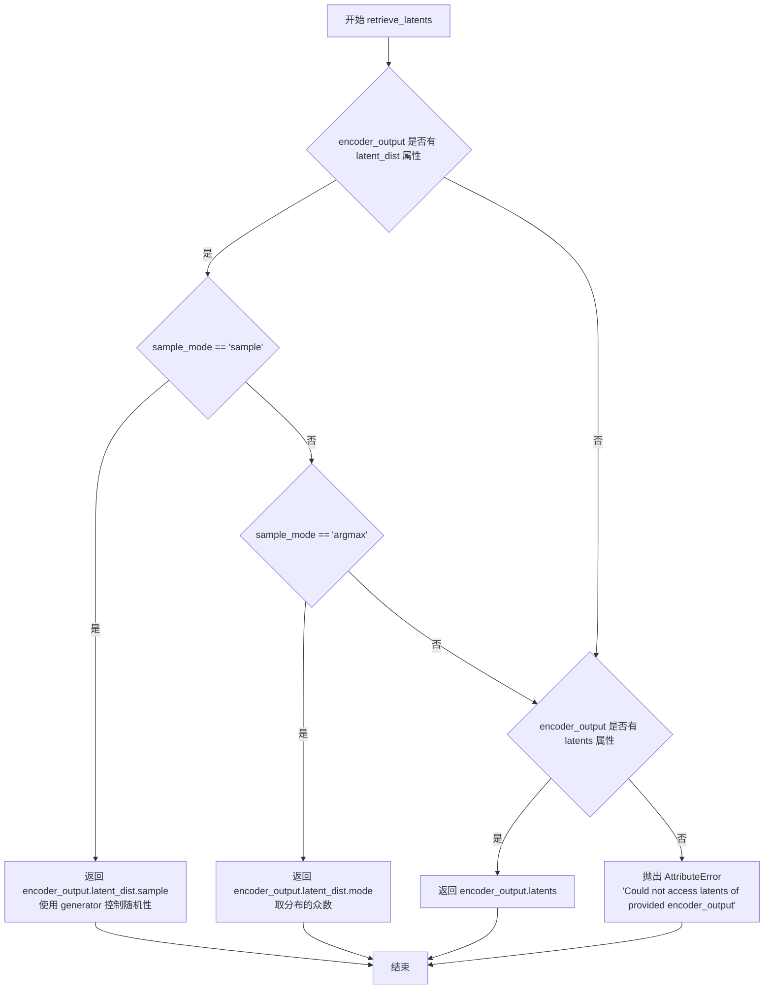

#### 带注释源码

```python
# Copied from diffusers.pipelines.stable_diffusion.pipeline_stable_diffusion_img2img.retrieve_latents
def retrieve_latents(
    encoder_output: torch.Tensor, generator: torch.Generator | None = None, sample_mode: str = "sample"
):
    """
    从 encoder_output 中检索潜在表示。
    
    Args:
        encoder_output: 编码器输出，包含 latent_dist 或 latents 属性
        generator: 可选的随机生成器，用于采样
        sample_mode: 采样模式，'sample' 或 'argmax'
    
    Returns:
        检索到的潜在表示张量
    """
    # 检查 encoder_output 是否有 latent_dist 属性且采样模式为 "sample"
    if hasattr(encoder_output, "latent_dist") and sample_mode == "sample":
        # 从潜在分布中采样，使用 generator 控制随机性
        return encoder_output.latent_dist.sample(generator)
    # 检查 encoder_output 是否有 latent_dist 属性且采样模式为 "argmax"
    elif hasattr(encoder_output, "latent_dist") and sample_mode == "argmax":
        # 返回潜在分布的众数（最大概率值）
        return encoder_output.latent_dist.mode()
    # 检查 encoder_output 是否有直接的 latents 属性
    elif hasattr(encoder_output, "latents"):
        return encoder_output.latents
    # 如果无法访问潜在表示，抛出属性错误
    else:
        raise AttributeError("Could not access latents of provided encoder_output")
```


### `StableDiffusionInstructPix2PixPipeline.__init__`

初始化 InstructPix2Pix 管道组件，包括 VAE、文本编码器、Tokenizer、UNet、调度器、安全检查器和特征提取器，并进行参数校验与模块注册。

参数：

- `vae`：`AutoencoderKL`，变分自编码器模型，用于将图像编码和解码为潜在表示
- `text_encoder`：`CLIPTextModel`，冻结的文本编码器（clip-vit-large-patch14），用于将文本提示转换为嵌入向量
- `tokenizer`：`CLIPTokenizer`，CLIP 分词器，用于对文本进行分词
- `unet`：`UNet2DConditionModel`，条件 UNet 模型，用于对图像潜在表示进行去噪
- `scheduler`：`KarrasDiffusionSchedulers`，扩散调度器，用于与 UNet 结合对图像潜在表示进行去噪
- `safety_checker`：`StableDiffusionSafetyChecker`，安全检查模块，用于评估生成的图像是否包含不当内容
- `feature_extractor`：`CLIPImageProcessor`，CLIP 图像处理器，用于从生成的图像中提取特征作为安全检查器的输入
- `image_encoder`：`CLIPVisionModelWithProjection | None`，可选的图像编码器，用于 IP-Adapter 功能
- `requires_safety_checker`：`bool`，是否需要安全检查器，默认为 True

返回值：无（`None`），构造函数用于初始化对象状态，不返回任何值

#### 流程图

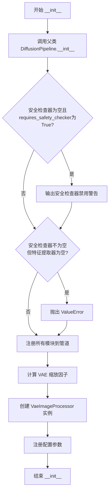

#### 带注释源码

```python
def __init__(
    self,
    vae: AutoencoderKL,
    text_encoder: CLIPTextModel,
    tokenizer: CLIPTokenizer,
    unet: UNet2DConditionModel,
    scheduler: KarrasDiffusionSchedulers,
    safety_checker: StableDiffusionSafetyChecker,
    feature_extractor: CLIPImageProcessor,
    image_encoder: CLIPVisionModelWithProjection | None = None,
    requires_safety_checker: bool = True,
):
    """
    初始化 InstructPix2Pix 管道
    
    参数:
        vae: 变分自编码器模型，用于图像与潜在表示之间的转换
        text_encoder: CLIP文本编码器，将文本提示编码为嵌入向量
        tokenizer: CLIP分词器，对输入文本进行分词处理
        unet: 条件UNet模型，执行扩散去噪过程
        scheduler: 扩散调度器，控制去噪步骤的时间表
        safety_checker: 安全检查器，过滤不当生成内容
        feature_extractor: 图像特征提取器，为安全检查器提供输入
        image_encoder: 可选的图像编码器，用于IP-Adapter功能
        requires_safety_checker: 是否强制启用安全检查器
    """
    # 调用父类 DiffusionPipeline 的初始化方法
    # 设置管道的基本结构和配置
    super().__init__()

    # 安全检查：如果用户禁用了安全检查器但仍需要它，发出警告
    # 这是为了确保用户了解潜在的合规性和安全风险
    if safety_checker is None and requires_safety_checker:
        logger.warning(
            f"You have disabled the safety checker for {self.__class__} by passing `safety_checker=None`. Ensure"
            " that you abide to the conditions of the Stable Diffusion license and do not expose unfiltered"
            " results in services or applications open to the public. Both the diffusers team and Hugging Face"
            " strongly recommend to keep the safety filter enabled in all public facing circumstances, disabling"
            " it only for use-cases that involve analyzing network behavior or auditing its results. For more"
            " information, please have a look at https://github.com/huggingface/diffusers/pull/254 ."
        )

    # 验证：如果使用安全检查器，必须同时提供特征提取器
    # 因为安全检查器需要从图像中提取特征来进行判断
    if safety_checker is not None and feature_extractor is None:
        raise ValueError(
            "Make sure to define a feature extractor when loading {self.__class__} if you want to use the safety"
            " checker. If you do not want to use the safety checker, you can pass `'safety_checker=None'` instead."
        )

    # 注册所有模块：这是DiffusionPipeline的核心机制
    # 通过register_modules，管道可以统一管理所有子组件
    # 这样在模型移动（to）、保存（save）、加载（load）等操作时会自动处理所有组件
    self.register_modules(
        vae=vae,
        text_encoder=text_encoder,
        tokenizer=tokenizer,
        unet=unet,
        scheduler=scheduler,
        safety_checker=safety_checker,
        feature_extractor=feature_extractor,
        image_encoder=image_encoder,
    )

    # 计算VAE缩放因子：用于调整潜在空间的尺寸
    # VAE的block_out_channels决定了输出特征图的通道数
    # 缩放因子 = 2^(block_out_channels长度 - 1)，典型值为8
    self.vae_scale_factor = 2 ** (len(self.vae.config.block_out_channels) - 1) if getattr(self, "vae", None) else 8

    # 创建图像处理器：用于预处理输入图像和后处理生成图像
    # VaeImageProcessor 负责图像与潜在表示之间的转换
    self.image_processor = VaeImageProcessor(vae_scale_factor=self.vae_scale_factor)

    # 将 requires_safety_checker 注册到配置中
    # 这样可以在保存和加载管道时保留这个设置
    self.register_to_config(requires_safety_checker=requires_safety_checker)
```


### StableDiffusionInstructPix2PixPipeline.__call__

主生成方法，执行图像编辑。根据文本提示（prompt）对输入图像进行编辑，支持分类器-free guidance（分类器自由引导）和图像引导，支持IP-Adapter，可选调用回调函数并在每步结束后进行自定义处理，最终返回编辑后的图像或包含图像和NSFW检测结果的输出对象。

参数：

- `prompt`：`str | list[str] | None`，引导图像生成的文本提示，如果未定义则需传递`prompt_embeds`
- `image`：`PipelineImageInput`，要重新编辑的图像或图像张量批次，也可接受图像潜在向量作为输入
- `num_inference_steps`：`int`，去噪步数，默认为100，步数越多通常图像质量越高但推理越慢
- `guidance_scale`：`float`，文本引导比例，默认为7.5，值越大生成的图像与文本提示越相关但质量可能降低
- `image_guidance_scale`：`float`，图像引导比例，默认为1.5，用于将生成图像推向初始图像，值越大与原图越相似
- `negative_prompt`：`str | list[str] | None`，反向提示，用于指定不包含在图像中的内容
- `num_images_per_prompt`：`int`，每个提示生成的图像数量，默认为1
- `eta`：`float`，DDIM调度器的参数η，默认为0.0，仅对DDIMScheduler有效
- `generator`：`torch.Generator | list[torch.Generator] | None`，用于生成确定性结果的随机数生成器
- `latents`：`torch.Tensor | None`，预生成的噪声潜在向量，可用于使用不同提示重复生成
- `prompt_embeds`：`torch.Tensor | None`，预生成的文本嵌入，用于轻松调整文本输入
- `negative_prompt_embeds`：`torch.Tensor | None`，预生成的负向文本嵌入
- `ip_adapter_image`：`PipelineImageInput | None`，IP-Adapter的可选图像输入
- `ip_adapter_image_embeds`：`list[torch.Tensor] | None`，IP-Adapter的预计算图像嵌入
- `output_type`：`str`，输出格式，默认为"pil"，可选"pil"或"np.array"
- `return_dict`：`bool`，是否返回`StableDiffusionPipelineOutput`，默认为True
- `callback_on_step_end`：`Callable | PipelineCallback | MultiPipelineCallbacks | None`，每步结束时调用的回调函数
- `callback_on_step_end_tensor_inputs`：`list[str]`，回调函数接收的张量输入列表，默认为["latents"]
- `cross_attention_kwargs`：`dict[str, Any] | None`，传递给注意力处理器的额外关键字参数

返回值：`StableDiffusionPipelineOutput | tuple`，如果`return_dict`为True返回`StableDiffusionPipelineOutput`对象（包含生成的图像和NSFW检测标志），否则返回元组（图像列表，NSFW标志列表）

#### 流程图

```mermaid
flowchart TD
    A[开始 __call__] --> B[解析callback参数]
    B --> C[检查输入参数 check_inputs]
    C --> D[获取执行设备device]
    D --> E{检查image是否存在}
    E -->|不存在| F[抛出ValueError]
    E -->|存在| G[确定batch_size]
    G --> H[编码提示词 _encode_prompt]
    H --> I{检查IP-Adapter输入}
    I -->|是| J[prepare_ip_adapter_image_embeds]
    I -->|否| K[跳过IP-Adapter处理]
    J --> L[预处理图像 preprocess]
    K --> L
    L --> M[设置调度器时间步 set_timesteps]
    M --> N[准备图像潜在向量 prepare_image_latents]
    N --> O[计算输出高度宽度]
    O --> P[准备潜在变量 prepare_latents]
    P --> Q[检查UNet通道配置匹配]
    Q -->|不匹配| R[抛出ValueError]
    Q -->|匹配| S[准备额外步骤参数 prepare_extra_step_kwargs]
    S --> T[初始化进度条和循环]
    T --> U[遍历每个时间步]
    U --> V{是否使用分类器自由引导}
    V -->|是| W[扩展潜在向量为3倍]
    V -->|否| X[不扩展潜在向量]
    W --> Y[拼接潜在向量和图像潜在向量]
    X --> Y
    Y --> Z[UNet预测噪声残差]
    Z --> AA{guidance_scale > 1}
    AA -->|是| AB[执行分类器自由引导计算]
    AA -->|否| AC[跳过引导计算]
    AB --> AD[调度器步进计算上一时刻]
    AC --> AD
    AD --> AE{callback_on_step_end存在}
    AE -->|是| AF[执行回调处理]
    AE -->|否| AG[跳过回调]
    AF --> AH[更新进度条]
    AG --> AH
    AH --> AI{是否完成所有步}
    AI -->|否| U
    AI -->|是| AJ{output_type是否为latent}
    AJ -->|否| AK[VAE解码 latents转图像]
    AJ -->|是| AL[直接使用latents作为图像]
    AK --> AM[运行安全检查器 run_safety_checker]
    AL --> AN[has_nsfw_concept设为None]
    AM --> AO[后处理图像 postprocess]
    AN --> AO
    AO --> AP[释放模型资源 maybe_free_model_hooks]
    AP --> AQ{return_dict为True]
    AQ -->|是| AR[返回StableDiffusionPipelineOutput]
    AQ -->|否| AS[返回tuple]
```

#### 带注释源码

```python
@torch.no_grad()
def __call__(
    self,
    prompt: str | list[str] = None,
    image: PipelineImageInput = None,
    num_inference_steps: int = 100,
    guidance_scale: float = 7.5,
    image_guidance_scale: float = 1.5,
    negative_prompt: str | list[str] | None = None,
    num_images_per_prompt: int | None = 1,
    eta: float = 0.0,
    generator: torch.Generator | list[torch.Generator] | None = None,
    latents: torch.Tensor | None = None,
    prompt_embeds: torch.Tensor | None = None,
    negative_prompt_embeds: torch.Tensor | None = None,
    ip_adapter_image: PipelineImageInput | None = None,
    ip_adapter_image_embeds: list[torch.Tensor] | None = None,
    output_type: str | None = "pil",
    return_dict: bool = True,
    callback_on_step_end: Callable[[int, int], None] | PipelineCallback | MultiPipelineCallbacks | None = None,
    callback_on_step_end_tensor_inputs: list[str] = ["latents"],
    cross_attention_kwargs: dict[str, Any] | None = None,
    **kwargs,
):
    # 解析旧版callback参数（已弃用）
    callback = kwargs.pop("callback", None)
    callback_steps = kwargs.pop("callback_steps", None)

    # 旧版参数弃用警告
    if callback is not None:
        deprecate("callback", "1.0.0", "使用 callback_on_step_end 替代")
    if callback_steps is not None:
        deprecate("callback_steps", "1.0.0", "使用 callback_on_step_end 替代")

    # 处理回调对象
    if isinstance(callback_on_step_end, (PipelineCallback, MultiPipelineCallbacks)):
        callback_on_step_end_tensor_inputs = callback_on_step_end.tensor_inputs

    # 0. 检查输入参数
    self.check_inputs(
        prompt,
        callback_steps,
        negative_prompt,
        prompt_embeds,
        negative_prompt_embeds,
        ip_adapter_image,
        ip_adapter_image_embeds,
        callback_on_step_end_tensor_inputs,
    )
    # 保存引导比例
    self._guidance_scale = guidance_scale
    self._image_guidance_scale = image_guidance_scale

    # 获取执行设备
    device = self._execution_device

    # 图像不能为空
    if image is None:
        raise ValueError("`image` input cannot be undefined.")

    # 1. 定义批次大小
    if prompt is not None and isinstance(prompt, str):
        batch_size = 1
    elif prompt is not None and isinstance(prompt, list):
        batch_size = len(prompt)
    else:
        batch_size = prompt_embeds.shape[0]

    # 2. 编码输入提示词
    prompt_embeds = self._encode_prompt(
        prompt,
        device,
        num_images_per_prompt,
        self.do_classifier_free_guidance,
        negative_prompt,
        prompt_embeds=prompt_embeds,
        negative_prompt_embeds=negative_prompt_embeds,
    )

    # 2.1 处理IP-Adapter图像嵌入
    if ip_adapter_image is not None or ip_adapter_image_embeds is not None:
        image_embeds = self.prepare_ip_adapter_image_embeds(
            ip_adapter_image,
            ip_adapter_image_embeds,
            device,
            batch_size * num_images_per_prompt,
            self.do_classifier_free_guidance,
        )
    
    # 3. 预处理图像
    image = self.image_processor.preprocess(image)

    # 4. 设置时间步
    self.scheduler.set_timesteps(num_inference_steps, device=device)
    timesteps = self.scheduler.timesteps

    # 5. 准备图像潜在向量
    image_latents = self.prepare_image_latents(
        image,
        batch_size,
        num_images_per_prompt,
        prompt_embeds.dtype,
        device,
        self.do_classifier_free_guidance,
    )

    # 计算输出尺寸（考虑VAE缩放因子）
    height, width = image_latents.shape[-2:]
    height = height * self.vae_scale_factor
    width = width * self.vae_scale_factor

    # 6. 准备潜在变量
    num_channels_latents = self.vae.config.latent_channels
    latents = self.prepare_latents(
        batch_size * num_images_per_prompt,
        num_channels_latents,
        height,
        width,
        prompt_embeds.dtype,
        device,
        generator,
        latents,
    )

    # 7. 验证UNet通道配置
    num_channels_image = image_latents.shape[1]
    if num_channels_latents + num_channels_image != self.unet.config.in_channels:
        raise ValueError(
            f"Incorrect configuration! Expected {self.unet.config.in_channels} but received "
            f"num_channels_latents: {num_channels_latents} + num_channels_image: {num_channels_image}"
        )

    # 8. 准备额外步骤参数
    extra_step_kwargs = self.prepare_extra_step_kwargs(generator, eta)

    # 8.1 添加IP-Adapter图像嵌入
    added_cond_kwargs = {"image_embeds": image_embeds} if ip_adapter_image is not None else None

    # 9. 去噪循环
    num_warmup_steps = len(timesteps) - num_inference_steps * self.scheduler.order
    self._num_timesteps = len(timesteps)
    with self.progress_bar(total=num_inference_steps) as progress_bar:
        for i, t in enumerate(timesteps):
            # 扩展潜在向量用于分类器自由引导
            # 对于pix2pix，引导同时应用于文本和输入图像，所以扩展3倍
            latent_model_input = torch.cat([latents] * 3) if self.do_classifier_free_guidance else latents

            # 在通道维度拼接潜在向量和图像潜在向量
            scaled_latent_model_input = self.scheduler.scale_model_input(latent_model_input, t)
            scaled_latent_model_input = torch.cat([scaled_latent_model_input, image_latents], dim=1)

            # 预测噪声残差
            noise_pred = self.unet(
                scaled_latent_model_input,
                t,
                encoder_hidden_states=prompt_embeds,
                added_cond_kwargs=added_cond_kwargs,
                cross_attention_kwargs=cross_attention_kwargs,
                return_dict=False,
            )[0]

            # 执行引导
            if self.do_classifier_free_guidance:
                noise_pred_text, noise_pred_image, noise_pred_uncond = noise_pred.chunk(3)
                noise_pred = (
                    noise_pred_uncond
                    + self.guidance_scale * (noise_pred_text - noise_pred_image)
                    + self.image_guidance_scale * (noise_pred_image - noise_pred_uncond)
                )

            # 计算上一时刻的潜在向量 x_t -> x_t-1
            latents = self.scheduler.step(noise_pred, t, latents, **extra_step_kwargs, return_dict=False)[0]

            # 步骤结束回调
            if callback_on_step_end is not None:
                callback_kwargs = {}
                for k in callback_on_step_end_tensor_inputs:
                    callback_kwargs[k] = locals()[k]
                callback_outputs = callback_on_step_end(self, i, t, callback_kwargs)

                # 更新回调返回的值
                latents = callback_outputs.pop("latents", latents)
                prompt_embeds = callback_outputs.pop("prompt_embeds", prompt_embeds)
                negative_prompt_embeds = callback_outputs.pop("negative_prompt_embeds", negative_prompt_embeds)
                image_latents = callback_outputs.pop("image_latents", image_latents)

            # 进度更新和旧版回调
            if i == len(timesteps) - 1 or ((i + 1) > num_warmup_steps and (i + 1) % self.scheduler.order == 0):
                progress_bar.update()
                if callback is not None and i % callback_steps == 0:
                    step_idx = i // getattr(self.scheduler, "order", 1)
                    callback(step_idx, t, latents)

            # XLA设备优化
            if XLA_AVAILABLE:
                xm.mark_step()

    # 10. 后处理
    if not output_type == "latent":
        # 解码潜在向量到图像
        image = self.vae.decode(latents / self.vae.config.scaling_factor, return_dict=False)[0]
        # 运行安全检查
        image, has_nsfw_concept = self.run_safety_checker(image, device, prompt_embeds.dtype)
    else:
        image = latents
        has_nsfw_concept = None

    # 处理去归一化
    if has_nsfw_concept is None:
        do_denormalize = [True] * image.shape[0]
    else:
        do_denormalize = [not has_nsfw for has_nsfw in has_nsfw_concept]

    # 后处理图像输出
    image = self.image_processor.postprocess(image, output_type=output_type, do_denormalize=do_denormalize)

    # 释放模型资源
    self.maybe_free_model_hooks()

    # 返回结果
    if not return_dict:
        return (image, has_nsfw_concept)

    return StableDiffusionPipelineOutput(images=image, nsfw_content_detected=has_nsfw_concept)
```


### `StableDiffusionInstructPix2PixPipeline._encode_prompt`

将文本提示词（prompt）编码为文本编码器的隐藏状态向量（text encoder hidden states），支持批量处理、文本反转（Textual Inversion）和无分类器引导（Classifier-Free Guidance）。

参数：

- `self`：隐式参数，Pipeline 实例本身
- `prompt`：`str | list[str] | None`，要编码的文本提示词，可以是单个字符串或字符串列表
- `device`：`torch.device`，PyTorch 设备，用于将数据移动到指定设备
- `num_images_per_prompt`：`int`，每个提示词需要生成的图像数量，用于复制嵌入向量
- `do_classifier_free_guidance`：`bool`，是否启用无分类器引导，当为 True 时需要生成无条件嵌入
- `negative_prompt`：`str | list[str] | None`，负面提示词，用于引导图像生成时排除某些内容
- `prompt_embeds`：`torch.Tensor | None`，可选，预生成的文本嵌入，如果提供则直接使用，跳过从 prompt 生成
- `negative_prompt_embeds`：`torch.Tensor | None`，可选，预生成的负面文本嵌入

返回值：`torch.Tensor`，编码后的文本嵌入向量，形状为 `(batch_size * num_images_per_prompt, seq_len, hidden_dim)`

#### 流程图

```mermaid
flowchart TD
    A[开始 _encode_prompt] --> B{判断 batch_size}
    B -->|prompt 是 str| C[batch_size = 1]
    B -->|prompt 是 list| D[batch_size = len(prompt)]
    B -->|其他情况| E[batch_size = prompt_embeds.shape[0]]
    
    C --> F{prompt_embeds 为 None?}
    D --> F
    E --> F
    
    F -->|是| G{self 是 TextualInversionLoaderMixin?}
    F -->|否| L[跳过文本编码]
    
    G -->|是| H[调用 maybe_convert_prompt 处理多向量 token]
    G -->|否| I[跳过 textual inversion]
    
    H --> J[tokenizer 编码 prompt]
    I --> J
    J --> K[提取 input_ids 和 attention_mask]
    
    K --> M{text_encoder 使用 attention_mask?}
    M -->|是| N[将 attention_mask 移到 device]
    M -->|否| O[attention_mask = None]
    
    N --> P[text_encoder forward pass]
    O --> P
    
    P --> Q[提取 prompt_embeds = output[0]]
    L --> Q
    
    Q --> R{do_classifier_free_guidance 为真<br>且 negative_prompt_embeds 为 None?}
    
    R -->|是| S{negative_prompt 是否为 None?}
    R -->|否| Z[直接返回 prompt_embeds]
    
    S -->|是| T[uncond_tokens = [''] * batch_size]
    S -->|否| U{negative_prompt 类型检查}
    
    U -->|str| V[uncond_tokens = [negative_prompt]]
    U -->|list| W[uncond_tokens = negative_prompt]
    
    T --> X[tokenizer 编码 uncond_tokens]
    V --> X
    W --> X
    
    X --> Y[text_encoder 生成 negative_prompt_embeds]
    Y --> AA{do_classifier_free_guidance?}
    
    AA -->|是| AB[复制 negative_prompt_embeds<br>num_images_per_prompt 次]
    AA -->|否| Z
    
    AB --> AC[拼接: prompt_embeds +<br>negative_prompt_embeds +<br>negative_prompt_embeds]
    AC --> AD[调整形状为<br>(batch_size * num_images_per_prompt, seq_len, hidden_dim)]
    AD --> Z
    
    Z[返回 prompt_embeds] --> AE[结束]
```

#### 带注释源码

```python
def _encode_prompt(
    self,
    prompt,
    device,
    num_images_per_prompt,
    do_classifier_free_guidance,
    negative_prompt=None,
    prompt_embeds: torch.Tensor | None = None,
    negative_prompt_embeds: torch.Tensor | None = None,
):
    r"""
    Encodes the prompt into text encoder hidden states.

    Args:
         prompt (`str` or `list[str]`, *optional*):
            prompt to be encoded
        device: (`torch.device`):
            torch device
        num_images_per_prompt (`int`):
            number of images that should be generated per prompt
        do_classifier_free_guidance (`bool`):
            whether to use classifier free guidance or not
        negative_ prompt (`str` or `list[str]`, *optional*):
            The prompt or prompts not to guide the image generation. If not defined, one has to pass
            `negative_prompt_embeds` instead. Ignored when not using guidance (i.e., ignored if `guidance_scale` is
            less than `1`).
        prompt_embeds (`torch.Tensor`, *optional*):
            Pre-generated text embeddings. Can be used to easily tweak text inputs, *e.g.* prompt weighting. If not
            provided, text embeddings will be generated from `prompt` input argument.
        negative_prompt_embeds (`torch.Tensor`, *optional*):
            Pre-generated negative text embeddings. Can be used to easily tweak text inputs, *e.g.* prompt
            weighting. If not provided, negative_prompt_embeds will be generated from `negative_prompt` input
            argument.
    """
    # 确定批次大小（batch_size）
    if prompt is not None and isinstance(prompt, str):
        batch_size = 1
    elif prompt is not None and isinstance(prompt, list):
        batch_size = len(prompt)
    else:
        # 如果没有提供 prompt，则从已编码的 prompt_embeds 获取批次大小
        batch_size = prompt_embeds.shape[0]

    # 如果没有提供预编码的 prompt_embeds，则需要从 prompt 编码生成
    if prompt_embeds is None:
        # textual inversion: process multi-vector tokens if necessary
        # 如果是 TextualInversionLoaderMixin 的实例，处理多向量 token
        if isinstance(self, TextualInversionLoaderMixin):
            prompt = self.maybe_convert_prompt(prompt, self.tokenizer)

        # 使用 tokenizer 将文本转换为 token IDs
        text_inputs = self.tokenizer(
            prompt,
            padding="max_length",
            max_length=self.tokenizer.model_max_length,
            truncation=True,
            return_tensors="pt",
        )
        text_input_ids = text_inputs.input_ids
        
        # 获取未截断的 token IDs 用于检测截断
        untruncated_ids = self.tokenizer(prompt, padding="longest", return_tensors="pt").input_ids

        # 检查是否发生了截断，如果是则记录警告信息
        if untruncated_ids.shape[-1] >= text_input_ids.shape[-1] and not torch.equal(
            text_input_ids, untruncated_ids
        ):
            removed_text = self.tokenizer.batch_decode(
                untruncated_ids[:, self.tokenizer.model_max_length - 1 : -1]
            )
            logger.warning(
                "The following part of your input was truncated because CLIP can only handle sequences up to"
                f" {self.tokenizer.model_max_length} tokens: {removed_text}"
            )

        # 检查 text_encoder 是否配置了 use_attention_mask
        if hasattr(self.text_encoder.config, "use_attention_mask") and self.text_encoder.config.use_attention_mask:
            attention_mask = text_inputs.attention_mask.to(device)
        else:
            attention_mask = None

        # 将 token IDs 传入 text_encoder 获取文本嵌入
        prompt_embeds = self.text_encoder(text_input_ids.to(device), attention_mask=attention_mask)
        prompt_embeds = prompt_embeds[0]  # 提取隐藏状态，形状为 (batch_size, seq_len, hidden_dim)

    # 确定 prompt_embeds 的数据类型，优先使用 text_encoder 的 dtype，否则使用 unet 的 dtype
    if self.text_encoder is not None:
        prompt_embeds_dtype = self.text_encoder.dtype
    else:
        prompt_embeds_dtype = self.unet.dtype

    # 将 prompt_embeds 转换为正确的 dtype 和 device
    prompt_embeds = prompt_embeds.to(dtype=prompt_embeds_dtype, device=device)

    # 获取当前 prompt_embeds 的形状信息
    bs_embed, seq_len, _ = prompt_embeds.shape
    
    # 复制文本嵌入以匹配每个 prompt 生成的图像数量
    # 使用 MPS 友好的方法
    prompt_embeds = prompt_embeds.repeat(1, num_images_per_prompt, 1)
    prompt_embeds = prompt_embeds.view(bs_embed * num_images_per_prompt, seq_len, -1)

    # 获取无分类器引导所需的无条件嵌入
    if do_classifier_free_guidance and negative_prompt_embeds is None:
        uncond_tokens: list[str]
        
        # 处理 negative_prompt
        if negative_prompt is None:
            # 如果没有提供 negative_prompt，使用空字符串
            uncond_tokens = [""] * batch_size
        elif type(prompt) is not type(negative_prompt):
            raise TypeError(
                f"`negative_prompt` should be the same type to `prompt`, but got {type(negative_prompt)} !="
                f" {type(prompt)}."
            )
        elif isinstance(negative_prompt, str):
            uncond_tokens = [negative_prompt]
        elif batch_size != len(negative_prompt):
            raise ValueError(
                f"`negative_prompt`: {negative_prompt} has batch size {len(negative_prompt)}, but `prompt`:"
                f" {prompt} has batch size {batch_size}. Please make sure that passed `negative_prompt` matches"
                " the batch size of `prompt`."
            )
        else:
            uncond_tokens = negative_prompt

        # textual inversion: process multi-vector tokens if necessary
        if isinstance(self, TextualInversionLoaderMixin):
            uncond_tokens = self.maybe_convert_prompt(uncond_tokens, self.tokenizer)

        # 获取 prompt_embeds 的序列长度用于编码 negative_prompt
        max_length = prompt_embeds.shape[1]
        
        # tokenizer 编码 negative_prompt
        uncond_input = self.tokenizer(
            uncond_tokens,
            padding="max_length",
            max_length=max_length,
            truncation=True,
            return_tensors="pt",
        )

        # 处理 attention_mask
        if hasattr(self.text_encoder.config, "use_attention_mask") and self.text_encoder.config.use_attention_mask:
            attention_mask = uncond_input.attention_mask.to(device)
        else:
            attention_mask = None

        # 生成 negative_prompt_embeds
        negative_prompt_embeds = self.text_encoder(
            uncond_input.input_ids.to(device),
            attention_mask=attention_mask,
        )
        negative_prompt_embeds = negative_prompt_embeds[0]

    # 如果使用无分类器引导
    if do_classifier_free_guidance:
        # 复制无条件嵌入以匹配每个 prompt 生成的图像数量
        seq_len = negative_prompt_embeds.shape[1]

        # 转换 dtype 和 device
        negative_prompt_embeds = negative_prompt_embeds.to(dtype=prompt_embeds_dtype, device=device)

        # 复制操作
        negative_prompt_embeds = negative_prompt_embeds.repeat(1, num_images_per_prompt, 1)
        negative_prompt_embeds = negative_prompt_embeds.view(batch_size * num_images_per_prompt, seq_len, -1)

        # 对于无分类器引导，需要执行两次前向传播
        # 这里我们将无条件嵌入和文本嵌入拼接成单个批次以避免两次前向传播
        # pix2pix 有两个负向嵌入，与其他 pipeline 不同，latents 的顺序为 [prompt_embeds, negative_prompt_embeds, negative_prompt_embeds]
        prompt_embeds = torch.cat([prompt_embeds, negative_prompt_embeds, negative_prompt_embeds])

    return prompt_embeds
```


### `StableDiffusionInstructPix2PixPipeline.encode_image`

该方法将输入图像编码为嵌入向量，支持两种输出模式：返回图像特征嵌入（image_embeds）或中间隐藏状态（hidden_states），同时生成对应的无条件和有条件嵌入，用于后续的图像编辑扩散过程。

参数：

- `image`：`PipelineImageInput`（torch.Tensor | PIL.Image.Image | list），待编码的输入图像
- `device`：`torch.device`，图像张量将放置的目标设备
- `num_images_per_prompt`：`int`，每个提示词生成的图像数量，用于复制嵌入维度
- `output_hidden_states`：`bool | None`，是否返回中间隐藏状态而非图像嵌入

返回值：`tuple[torch.Tensor, torch.Tensor]`，返回两个张量元组——有条件嵌入和无条件（零）嵌入；当 `output_hidden_states=True` 时返回隐藏状态，否则返回图像嵌入。

#### 流程图

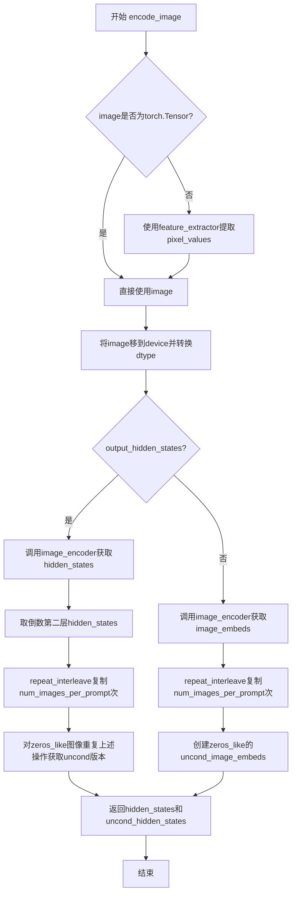

#### 带注释源码

```python
def encode_image(self, image, device, num_images_per_prompt, output_hidden_states=None):
    """
    将输入图像编码为嵌入向量，用于指导图像编辑过程。
    
    Args:
        image: 输入图像，支持torch.Tensor、PIL.Image或列表形式
        device: 目标计算设备
        num_images_per_prompt: 每个提示词生成的图像数量
        output_hidden_states: 是否返回中间隐藏状态而非最终图像嵌入
    
    Returns:
        Tuple of (image_embeddings, uncond_embeddings) - 有条件与无条件嵌入
    """
    # 获取图像编码器的参数dtype，确保数据类型一致
    dtype = next(self.image_encoder.parameters()).dtype

    # 如果输入不是torch.Tensor，使用特征提取器转换为张量
    if not isinstance(image, torch.Tensor):
        image = self.feature_extractor(image, return_tensors="pt").pixel_values

    # 将图像数据移动到指定设备并转换数据类型
    image = image.to(device=device, dtype=dtype)
    
    # 根据output_hidden_states参数选择返回隐藏状态或图像嵌入
    if output_hidden_states:
        # 获取编码器的中间隐藏状态（取倒数第二层，通常效果较好）
        image_enc_hidden_states = self.image_encoder(image, output_hidden_states=True).hidden_states[-2]
        # 重复扩展以匹配每提示生成的图像数量
        image_enc_hidden_states = image_enc_hidden_states.repeat_interleave(num_images_per_prompt, dim=0)
        
        # 为无条件嵌入创建零张量（保持结构一致性）
        uncond_image_enc_hidden_states = self.image_encoder(
            torch.zeros_like(image), output_hidden_states=True
        ).hidden_states[-2]
        uncond_image_enc_hidden_states = uncond_image_enc_hidden_states.repeat_interleave(
            num_images_per_prompt, dim=0
        )
        return image_enc_hidden_states, uncond_image_enc_hidden_states
    else:
        # 直接获取图像嵌入向量
        image_embeds = self.image_encoder(image).image_embeds
        image_embeds = image_embeds.repeat_interleave(num_images_per_prompt, dim=0)
        
        # 创建零张量作为无条件图像嵌入（引导生成时使用）
        uncond_image_embeds = torch.zeros_like(image_embeds)

        return image_embeds, uncond_image_embeds
```


### `StableDiffusionInstructPix2PixPipeline.prepare_ip_adapter_image_embeds`

该方法用于准备IP-Adapter的图像嵌入（image embeds），支持两种输入模式：当未预计算图像嵌入时，对输入图像进行编码；当已提供图像嵌入时，对嵌入进行复制和拼接处理以适应分类器自由引导（CFG）模式。最终返回处理后的图像嵌入列表，用于后续的图像编辑扩散过程。

参数：

- `self`：`StableDiffusionInstructPix2PixPipeline`，Pipeline实例本身
- `ip_adapter_image`：`PipelineImageInput | None`，IP-Adapter的输入图像，支持torch.Tensor、PIL.Image.Image、np.ndarray或它们的列表
- `ip_adapter_image_embeds`：`list[torch.Tensor] | None`，预计算的图像嵌入列表，若为None则需要对输入图像进行编码
- `device`：`torch.device`，计算设备（CPU/CUDA）
- `num_images_per_prompt`：`int`，每个prompt生成的图像数量
- `do_classifier_free_guidance`：`bool`，是否启用分类器自由引导

返回值：`list[torch.Tensor]`，处理后的图像嵌入列表，每个元素对应一个IP-Adapter的嵌入张量

#### 流程图

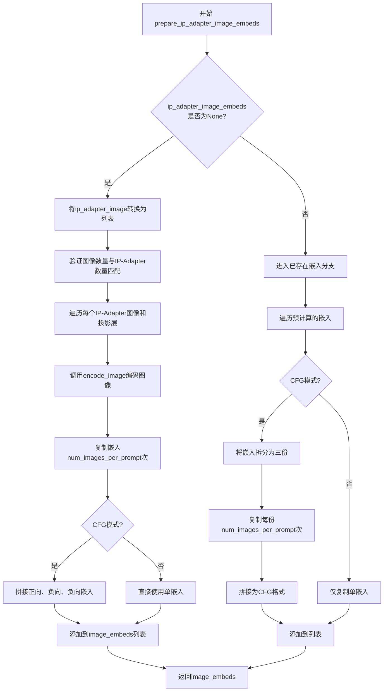

#### 带注释源码

```python
def prepare_ip_adapter_image_embeds(
    self, 
    ip_adapter_image, 
    ip_adapter_image_embeds, 
    device, 
    num_images_per_prompt, 
    do_classifier_free_guidance
):
    """
    准备IP-Adapter图像嵌入
    
    处理两种情况:
    1. 提供原始图像 -> 使用image_encoder编码为嵌入
    2. 提供预计算嵌入 -> 进行复制和拼接以适配CFG
    """
    
    # 情况1: 需要对图像进行编码
    if ip_adapter_image_embeds is None:
        # 确保图像是列表格式（支持单图或多图）
        if not isinstance(ip_adapter_image, list):
            ip_adapter_image = [ip_adapter_image]

        # 验证输入图像数量与IP-Adapter数量匹配
        # IP-Adapter通过unet.encoder_hid_proj.image_projection_layers配置
        if len(ip_adapter_image) != len(self.unet.encoder_hid_proj.image_projection_layers):
            raise ValueError(
                f"`ip_adapter_image` must have same length as the number of IP Adapters. "
                f"Got {len(ip_adapter_image)} images and "
                f"{len(self.unet.encoder_hid_proj.image_projection_layers)} IP Adapters."
            )

        image_embeds = []
        # 遍历每个IP-Adapter的图像和对应的投影层
        for single_ip_adapter_image, image_proj_layer in zip(
            ip_adapter_image, 
            self.unet.encoder_hid_proj.image_projection_layers
        ):
            # 判断是否需要输出隐藏状态（ImageProjection类型不需要）
            output_hidden_state = not isinstance(image_proj_layer, ImageProjection)
            
            # 编码单张图像得到正向和负向嵌入
            single_image_embeds, single_negative_image_embeds = self.encode_image(
                single_ip_adapter_image, 
                device, 
                1,  # 每个IP-Adapter生成1个嵌入
                output_hidden_state
            )
            
            # 为每个prompt复制对应的嵌入
            single_image_embeds = torch.stack(
                [single_image_embeds] * num_images_per_prompt, 
                dim=0
            )
            single_negative_image_embeds = torch.stack(
                [single_negative_image_embeds] * num_images_per_prompt, 
                dim=0
            )

            # CFG模式下: [正向嵌入, 负向嵌入, 负向嵌入]
            # 这是InstructPix2Pix的特殊格式，用于同时考虑条件和非条件图像引导
            if do_classifier_free_guidance:
                single_image_embeds = torch.cat(
                    [single_image_embeds, single_negative_image_embeds, single_negative_image_embeds]
                )
                single_image_embeds = single_image_embeds.to(device)

            image_embeds.append(single_image_embeds)
    
    # 情况2: 使用预计算的嵌入
    else:
        repeat_dims = [1]  # 用于控制重复维度的辅助列表
        image_embeds = []
        
        for single_image_embeds in ip_adapter_image_embeds:
            if do_classifier_free_guidance:
                # 预计算嵌入已经是CFG格式，需要拆分
                (
                    single_image_embeds,
                    single_negative_image_embeds,
                    single_negative_image_embeds,
                ) = single_image_embeds.chunk(3)
                
                # 重复嵌入以匹配num_images_per_prompt
                single_image_embeds = single_image_embeds.repeat(
                    num_images_per_prompt, 
                    *(repeat_dims * len(single_image_embeds.shape[1:]))
                )
                single_negative_image_embeds = single_negative_image_embeds.repeat(
                    num_images_per_prompt, 
                    *(repeat_dims * len(single_negative_image_embeds.shape[1:]))
                )
                
                # 重新拼接为CFG格式
                single_image_embeds = torch.cat(
                    [single_image_embeds, single_negative_image_embeds, single_negative_image_embeds]
                )
            else:
                # 非CFG模式仅需复制
                single_image_embeds = single_image_embeds.repeat(
                    num_images_per_prompt, 
                    *(repeat_dims * len(single_image_embeds.shape[1:]))
                )
            
            image_embeds.append(single_image_embeds)

    return image_embeds
```


### `StableDiffusionInstructPix2PixPipeline.run_safety_checker`

运行安全检查器，检测生成的图像是否包含不适合在工作场所查看的内容（NSFW）。

参数：

- `image`：`torch.Tensor | np.ndarray | PIL.Image.Image`，需要检查的图像数据，可以是张量、numpy数组或PIL图像
- `device`：`torch.device`，用于运行安全检查的设备（如CPU或CUDA设备）
- `dtype`：`torch.dtype`，输入图像的数据类型（如float16、float32等）

返回值：`tuple[Image, list[bool]]`，返回两个元素的元组——第一个是处理后的图像（可能被替换为纯色图像如果检测到NSFW内容），第二个是布尔值列表，表示每个图像是否包含NSFW内容

#### 流程图

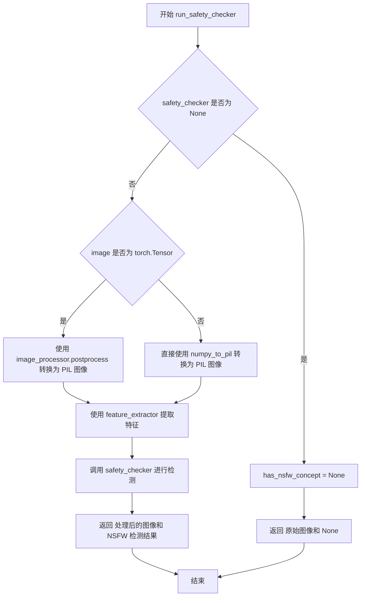

#### 带注释源码

```python
def run_safety_checker(self, image, device, dtype):
    """
    运行安全检查器，检测图像中是否包含不适合在工作场所查看的内容。

    Args:
        image: 输入图像，可以是 PyTorch 张量、NumPy 数组或 PIL 图像
        device: 运行检查的设备
        dtype: 输入数据的 dtype

    Returns:
        Tuple of (processed_image, has_nsfw_concept):
            - processed_image: 处理后的图像（如果检测到 NSFW 内容可能被替换）
            - has_nsfw_concept: 布尔列表，表示每个图像是否为 NSFW
    """
    # 如果安全检查器未初始化，直接返回 None 表示没有 NSFW 检测
    if self.safety_checker is None:
        has_nsfw_concept = None
    else:
        # 将图像转换为 PIL 图像格式供特征提取器使用
        if torch.is_tensor(image):
            # 如果是 PyTorch 张量，先转换为 PIL 图像
            feature_extractor_input = self.image_processor.postprocess(image, output_type="pil")
        else:
            # 如果是 NumPy 数组，直接转换为 PIL 图像
            feature_extractor_input = self.image_processor.numpy_to_pil(image)
        
        # 使用特征提取器处理图像，提取用于安全检查的特征
        safety_checker_input = self.feature_extractor(
            feature_extractor_input, 
            return_tensors="pt"
        ).to(device)
        
        # 调用安全检查器，传入图像和 CLIP 输入
        # safety_checker 会返回处理后的图像和 NSFW 概念检测结果
        image, has_nsfw_concept = self.safety_checker(
            images=image, 
            clip_input=safety_checker_input.pixel_values.to(dtype)
        )
    
    # 返回处理后的图像和 NSFW 检测结果
    return image, has_nsfw_concept
```


### `StableDiffusionInstructPix2PixPipeline.prepare_extra_step_kwargs`

准备调度器（scheduler）的额外参数。由于并非所有调度器都具有相同的函数签名，该方法通过检查调度器的 `step` 方法是否接受特定参数（如 `eta` 和 `generator`），来动态构建需要传递给调度器的额外参数字典。

参数：

- `self`：隐含的类实例，代表 `StableDiffusionInstructPix2PixPipeline` 管道对象。
- `generator`：`torch.Generator | None`，可选的 PyTorch 随机数生成器，用于确保生成过程的可重复性。如果为 `None`，则使用随机种子。
- `eta`：`float`，DDIM 调度器专用的噪声参数（η），对应 DDIM 论文中的 η 参数，取值范围应在 [0, 1] 之间。对于其他调度器，此参数会被忽略。

返回值：`dict`，返回一个包含调度器额外参数的字典。可能包含 `eta`（如果调度器接受）和/或 `generator`（如果调度器接受）键值对。

#### 流程图

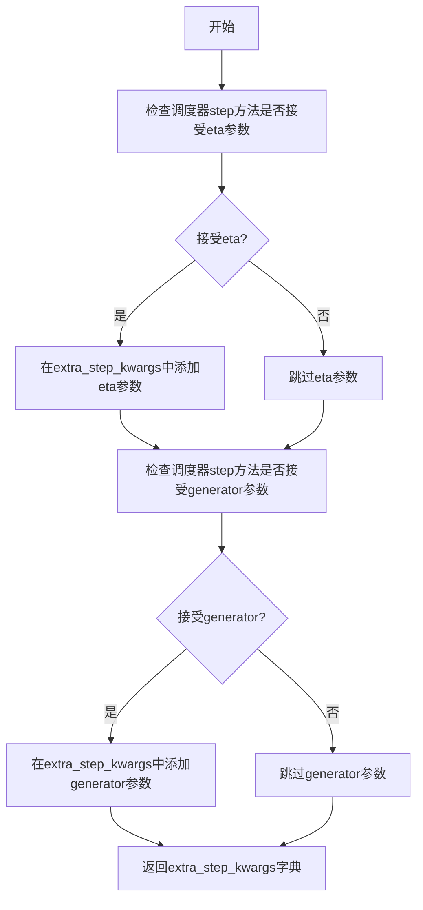

#### 带注释源码

```python
def prepare_extra_step_kwargs(self, generator, eta):
    # 准备调度器步骤所需的额外参数，因为并非所有调度器都具有相同的函数签名
    # eta (η) 仅在 DDIMScheduler 中使用，对于其他调度器将被忽略
    # eta 对应 DDIM 论文中的 η: https://huggingface.co/papers/2010.02502
    # 取值应在 [0, 1] 范围内

    # 使用 inspect 模块检查调度器的 step 方法是否接受 'eta' 参数
    accepts_eta = "eta" in set(inspect.signature(self.scheduler.step).parameters.keys())
    # 初始化空字典用于存储额外参数
    extra_step_kwargs = {}
    # 如果调度器接受 eta 参数，则将其添加到参数字典中
    if accepts_eta:
        extra_step_kwargs["eta"] = eta

    # 检查调度器是否接受 generator 参数
    accepts_generator = "generator" in set(inspect.signature(self.scheduler.step).parameters.keys())
    # 如果调度器接受 generator 参数，则将其添加到参数字典中
    if accepts_generator:
        extra_step_kwargs["generator"] = generator
    # 返回构建好的额外参数字典
    return extra_step_kwargs
```


### `StableDiffusionInstructPix2PixPipeline.decode_latents`

该方法用于将VAE的潜在表示解码为可视化图像，通过逆缩放、VAE解码、像素值归一化和格式转换等步骤，将潜在空间向量转换为人眼可读的图像格式。由于该方法已被弃用，建议使用`VaeImageProcessor.postprocess(...)`替代。

参数：

- `self`：`StableDiffusionInstructPix2PixPipeline` 实例，调用该方法的对象本身
- `latents`：`torch.Tensor`，需要进行解码的潜在表示张量，通常是去噪过程中的中间结果

返回值：`numpy.ndarray`，解码后的图像数据，形状为(batch_size, height, width, channels)，像素值范围为[0, 1]

#### 流程图

```mermaid
flowchart TD
    A[开始 decode_latents] --> B[发出弃用警告]
    B --> C[逆缩放 latents: latents = 1/scaling_factor * latents]
    C --> D[VAE 解码: image = vae.decode(latents)]
    D --> E[像素值归一化: image = (image/2 + 0.5).clamp(0, 1)]
    E --> F[转换为 CPU float32 numpy 数组]
    F --> G[维度重排: (B, C, H, W) -> (B, H, W, C)]
    G --> H[返回图像数组]
```

#### 带注释源码

```python
def decode_latents(self, latents):
    """
    将潜在表示解码为图像（已弃用方法）
    
    该方法执行以下操作：
    1. 对潜在向量进行逆缩放处理
    2. 使用VAE解码器将潜在向量转换为图像
    3. 将图像像素值归一化到[0, 1]范围
    4. 转换为NumPy数组格式以便后续处理
    
    注意：此方法已被弃用，将在diffusers 1.0.0版本中移除。
    建议使用 VaeImageProcessor.postprocess(...) 方法替代。
    
    参数:
        latents (torch.Tensor): VAE编码后的潜在表示张量，形状为 (batch_size, latent_channels, height, width)
        
    返回:
        numpy.ndarray: 解码后的图像数组，形状为 (batch_size, height, width, channels)，像素值范围[0, 1]
    """
    # 发出弃用警告，提醒用户使用新方法
    deprecation_message = "The decode_latents method is deprecated and will be removed in 1.0.0. Please use VaeImageProcessor.postprocess(...) instead"
    deprecate("decode_latents", "1.0.0", deprecation_message, standard_warn=False)

    # 第一步：逆缩放潜在表示
    # VAE在编码时会将潜在向量乘以scaling_factor以稳定训练，解码时需要除以该因子还原
    latents = 1 / self.vae.config.scaling_factor * latents
    
    # 第二步：使用VAE解码器将潜在向量解码为图像
    # vae.decode返回包含多个元素的元组，其中第一个元素是解码后的图像张量
    image = self.vae.decode(latents, return_dict=False)[0]
    
    # 第三步：像素值归一化
    # VAE输出通常在[-1, 1]范围，需要转换到[0, 1]范围便于显示和处理
    # 公式: (image / 2 + 0.5) 将[-1, 1]映射到[0, 1]
    # .clamp(0, 1) 确保值不会超出[0, 1]范围
    image = (image / 2 + 0.5).clamp(0, 1)
    
    # 第四步：格式转换
    # 1. 移到CPU：避免占用GPU内存
    # 2. 维度重排：将PyTorch格式(B, C, H, W)转换为NumPy格式(B, H, W, C)
    # 3. 转换为float32：兼容bfloat16且不会导致显著性能开销
    # 4. 转为NumPy数组：便于后续图像处理和返回
    image = image.cpu().permute(0, 2, 3, 1).float().numpy()
    
    # 返回解码后的图像数组
    return image
```


### `StableDiffusionInstructPix2PixPipeline.check_inputs`

验证输入参数的有效性，确保传入的提示词、嵌入向量、图像适配器等参数符合管道运行的前置条件，若参数不合规则抛出相应的 `ValueError` 异常。

参数：

- `self`：`StableDiffusionInstructPix2PixPipeline` 类的实例自身
- `prompt`：`str | list[str] | None`，用户提供的文本提示词，用于指导图像生成
- `callback_steps`：`int | None`，可选的回调步数，用于指定每隔多少步执行一次回调函数
- `negative_prompt`：`str | list[str] | None`，可选的负面提示词，用于指定生成时应避免的内容
- `prompt_embeds`：`torch.Tensor | None`，可选的预计算文本嵌入向量
- `negative_prompt_embeds`：`torch.Tensor | None`，可选的预计算负面文本嵌入向量
- `ip_adapter_image`：`PipelineImageInput | None`，可选的 IP 适配器输入图像
- `ip_adapter_image_embeds`：`list[torch.Tensor] | None`，可选的 IP 适配器预计算图像嵌入
- `callback_on_step_end_tensor_inputs`：`list[str] | None`，可选的回调函数可访问的张量输入名称列表

返回值：`None`，本方法不返回任何值，仅通过抛出异常来处理无效输入。

#### 流程图

```mermaid
flowchart TD
    A[开始 check_inputs] --> B{callback_steps 是否存在且非正整数}
    B -->|是| C[抛出 ValueError: callback_steps 必须是正整数]
    B -->|否| D{callback_on_step_end_tensor_inputs 是否存在}
    D -->|是| E{所有输入是否在 _callback_tensor_inputs 中}
    D -->|否| F{prompt 和 prompt_embeds 是否同时存在}
    E -->|否| G[抛出 ValueError: 包含非法张量输入]
    E -->|是| F
    F -->|是| H[抛出 ValueError: 不能同时提供 prompt 和 prompt_embeds]
    F -->|否| I{prompt 和 prompt_embeds 是否都为 None}
    I -->|是| J[抛出 ValueError: 必须提供 prompt 或 prompt_embeds 之一]
    I -->|否| K{prompt 是否为 str 或 list 类型]
    K -->|否| L[抛出 ValueError: prompt 类型错误]
    K -->|是| M{negative_prompt 和 negative_prompt_embeds 是否同时存在}
    M -->|是| N[抛出 ValueError: 不能同时提供 negative_prompt 和 negative_prompt_embeds]
    M -->|否| O{prompt_embeds 和 negative_prompt_embeds 是否都存在]
    O -->|是| P{两者的 shape 是否相同]
    P -->|否| Q[抛出 ValueError: shape 不匹配]
    P -->|是| R{ip_adapter_image 和 ip_adapter_image_embeds 是否同时存在]
    O -->|否| R
    R -->|是| S[抛出 ValueError: 不能同时提供 IP 适配器图像和嵌入]
    R -->|否| T{ip_adapter_image_embeds 是否为 list 类型]
    T -->|否| U[抛出 ValueError: 必须是 list 类型]
    T -->|是| V{嵌入的维度是否为 3D 或 4D]
    V -->|否| W[抛出 ValueError: 维度必须是 3D 或 4D]
    V -->|是| X[验证通过，方法结束]
    C --> X
    G --> X
    H --> X
    J --> X
    L --> X
    N --> X
    Q --> X
    S --> X
    U --> X
    W --> X
```

#### 带注释源码

```python
def check_inputs(
    self,
    prompt,
    callback_steps,
    negative_prompt=None,
    prompt_embeds=None,
    negative_prompt_embeds=None,
    ip_adapter_image=None,
    ip_adapter_image_embeds=None,
    callback_on_step_end_tensor_inputs=None,
):
    """
    验证输入参数的有效性，确保符合管道运行的前置条件。
    
    该方法会依次检查以下各项参数：
    1. callback_steps 必须为正整数（如果提供）
    2. callback_on_step_end_tensor_inputs 中的所有元素必须在 _callback_tensor_inputs 中
    3. prompt 和 prompt_embeds 不能同时提供，也不能同时为空
    4. prompt 必须是字符串或字符串列表
    5. negative_prompt 和 negative_prompt_embeds 不能同时提供
    6. prompt_embeds 和 negative_prompt_embeds 如果都提供，shape 必须一致
    7. ip_adapter_image 和 ip_adapter_image_embeds 不能同时提供
    8. ip_adapter_image_embeds 必须是列表，且包含 3D 或 4D 张量
    
    若任何检查未通过，将抛出 ValueError 异常并附带详细的错误信息。
    """
    
    # 检查 callback_steps：如果提供，必须是正整数
    if callback_steps is not None and (not isinstance(callback_steps, int) or callback_steps <= 0):
        raise ValueError(
            f"`callback_steps` has to be a positive integer but is {callback_steps} of type"
            f" {type(callback_steps)}."
        )

    # 检查 callback_on_step_end_tensor_inputs：必须在允许的张量输入列表中
    if callback_on_step_end_tensor_inputs is not None and not all(
        k in self._callback_tensor_inputs for k in callback_on_step_end_tensor_inputs
    ):
        raise ValueError(
            f"`callback_on_step_end_tensor_inputs` has to be in {self._callback_tensor_inputs}, but found {[k for k in callback_on_step_end_tensor_inputs if k not in self._callback_tensor_inputs]}"
        )

    # 检查 prompt 和 prompt_embeds 的互斥关系：不能同时提供
    if prompt is not None and prompt_embeds is not None:
        raise ValueError(
            f"Cannot forward both `prompt`: {prompt} and `prompt_embeds`: {prompt_embeds}. Please make sure to"
            " only forward one of the two."
        )
    # 不能两者都未提供
    elif prompt is None and prompt_embeds is None:
        raise ValueError(
            "Provide either `prompt` or `prompt_embeds`. Cannot leave both `prompt` and `prompt_embeds` undefined."
        )
    # prompt 必须是 str 或 list 类型
    elif prompt is not None and (not isinstance(prompt, str) and not isinstance(prompt, list)):
        raise ValueError(f"`prompt` has to be of type `str` or `list` but is {type(prompt)}")

    # 检查 negative_prompt 和 negative_prompt_embeds 的互斥关系
    if negative_prompt is not None and negative_prompt_embeds is not None:
        raise ValueError(
            f"Cannot forward both `negative_prompt`: {negative_prompt} and `negative_prompt_embeds`:"
            f" {negative_prompt_embeds}. Please make sure to only forward one of the two."
        )

    # 如果两者都提供了，必须 shape 相同
    if prompt_embeds is not None and negative_prompt_embeds is not None:
        if prompt_embeds.shape != negative_prompt_embeds.shape:
            raise ValueError(
                "`prompt_embeds` and `negative_prompt_embeds` must have the same shape when passed directly, but"
                f" got: `prompt_embeds` {prompt_embeds.shape} != `negative_prompt_embeds`"
                f" {negative_prompt_embeds.shape}."
            )

    # 检查 IP 适配器图像和嵌入的互斥关系
    if ip_adapter_image is not None and ip_adapter_image_embeds is not None:
        raise ValueError(
            "Provide either `ip_adapter_image` or `ip_adapter_image_embeds`. Cannot leave both `ip_adapter_image` and `ip_adapter_image_embeds` defined."
        )

    # 检查 ip_adapter_image_embeds 的类型和维度
    if ip_adapter_image_embeds is not None:
        if not isinstance(ip_adapter_image_embeds, list):
            raise ValueError(
                f"`ip_adapter_image_embeds` has to be of type `list` but is {type(ip_adapter_image_embeds)}"
            )
        elif ip_adapter_image_embeds[0].ndim not in [3, 4]:
            raise ValueError(
                f"`ip_adapter_image_embeds` has to be a list of 3D or 4D tensors but is {ip_adapter_image_embeds[0].ndim}D"
            )
```


### `StableDiffusionInstructPix2PixPipeline.prepare_latents`

该方法用于准备初始的潜在变量（latents），即用于去噪过程的噪声样本。它根据批次大小、图像尺寸和VAE的缩放因子计算潜在变量的形状，如果未提供预生成的潜在变量，则使用随机张量生成器创建高斯噪声，最后根据调度器的初始噪声标准差对潜在变量进行缩放。

参数：

- `batch_size`：`int`，生成的图像批次大小
- `num_channels_latents`：`int`，潜在变量的通道数，通常对应于VAE的潜在通道配置
- `height`：`int`，目标图像的高度（像素单位）
- `width`：`int`，目标图像的宽度（像素单位）
- `dtype`：`torch.dtype`，潜在变量的数据类型（如torch.float32）
- `device`：`torch.device`，计算设备（CPU或CUDA）
- `generator`：`torch.Generator | list[torch.Generator] | None`，用于确保可重复生成的随机数生成器，可为单个或列表
- `latents`：`torch.Tensor | None`，可选的预生成潜在变量，如果提供则直接使用，否则随机生成

返回值：`torch.Tensor`，处理后的潜在变量张量，形状为 (batch_size, num_channels_latents, height // vae_scale_factor, width // vae_scale_factor)

#### 流程图

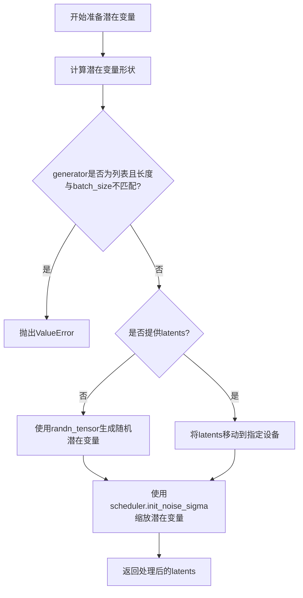

#### 带注释源码

```python
def prepare_latents(
    self,
    batch_size: int,
    num_channels_latents: int,
    height: int,
    width: int,
    dtype: torch.dtype,
    device: torch.device,
    generator: torch.Generator | list[torch.Generator] | None,
    latents: torch.Tensor | None = None,
):
    """
    准备用于去噪过程的初始潜在变量。

    参数:
        batch_size: 生成的批次大小
        num_channels_latents: VAE潜在空间的通道数
        height: 目标图像高度
        width: 目标图像宽度
        dtype: 潜在变量的数据类型
        device: 计算设备
        generator: 随机数生成器，用于可重复生成
        latents: 可选的预生成潜在变量

    返回:
        初始化并缩放后的潜在变量张量
    """
    # 计算潜在变量的形状，需要除以VAE的缩放因子
    # 因为VAE在编码/解码时会进行下采样/上采样
    shape = (
        batch_size,
        num_channels_latents,
        int(height) // self.vae_scale_factor,
        int(width) // self.vae_scale_factor,
    )
    
    # 验证生成器列表长度是否与批次大小匹配
    if isinstance(generator, list) and len(generator) != batch_size:
        raise ValueError(
            f"You have passed a list of generators of length {len(generator)}, but requested an effective batch"
            f" size of {batch_size}. Make sure the batch size matches the length of the generators."
        )

    # 如果没有提供潜在变量，则随机生成
    if latents is None:
        # 使用randn_tensor生成符合标准正态分布的随机张量
        latents = randn_tensor(shape, generator=generator, device=device, dtype=dtype)
    else:
        # 如果提供了潜在变量，确保其在正确的设备上
        latents = latents.to(device)

    # 根据调度器的要求缩放初始噪声
    # 不同的调度器可能需要不同的初始噪声标准差
    latents = latents * self.scheduler.init_noise_sigma
    
    return latents
```


### `StableDiffusionInstructPix2PixPipeline.prepare_image_latents`

该方法负责将输入图像转换为图像潜在变量（latents），以便在InstructPix2Pixpipeline中使用。它处理图像类型检查、设备转移、VAE编码，以及批量大小的适配，同时支持classifier-free guidance模式下的无条件图像潜在变量生成。

参数：

- `self`：`StableDiffusionInstructPix2PixPipeline`，Pipeline实例本身
- `image`：`torch.Tensor | PIL.Image.Image | list`，输入图像，可以是PyTorch张量、PIL图像或图像列表
- `batch_size`：`int`，文本提示的批处理大小
- `num_images_per_prompt`：`int`，每个提示生成的图像数量
- `dtype`：`torch.dtype`，目标数据类型
- `device`：`torch.device`，目标设备
- `do_classifier_free_guidance`：`bool`，是否启用classifier-free guidance
- `generator`：`torch.Generator | None`，可选的随机数生成器

返回值：`torch.Tensor`，处理后的图像潜在变量张量

#### 流程图

```mermaid
flowchart TD
    A[开始: prepare_image_latents] --> B{检查image类型}
    B -->|类型无效| C[抛出ValueError]
    B -->|类型有效| D[将image转移到device和dtype]
    E[计算batch_size] --> E[batch_size = batch_size * num_images_per_prompt]
    E --> F{image.shape[1] == 4?}
    F -->|是| G[image_latents = image]
    F -->|否| H[调用vae.encode获取latents]
    G --> I{batch_size > image_latents.shape[0]?}
    H --> I
    I -->|是且能整除| J[重复image_latents]
    I -->|是且不能整除| K[抛出ValueError]
    I -->|否| L[保持image_latents不变]
    J --> M{do_classifier_free_guidance?}
    L --> M
    K --> N[结束: 返回image_latents]
    M -->|是| O[生成uncond_image_latents全零张量]
    M -->|否| P[直接返回image_latents]
    O --> Q[拼接: cat[image_latents, image_latents, uncond_image_latents]]
    P --> N
    Q --> N
```

#### 带注释源码

```
def prepare_image_latents(
    self, image, batch_size, num_images_per_prompt, dtype, device, do_classifier_free_guidance, generator=None
):
    """
    准备图像潜在变量用于InstructPix2Pixpipeline
    
    参数:
        image: 输入图像，支持torch.Tensor, PIL.Image.Image或list类型
        batch_size: 批处理大小
        num_images_per_prompt: 每个提示生成的图像数量
        dtype: 目标数据类型
        device: 目标设备
        do_classifier_free_guidance: 是否启用无分类器指导
        generator: 可选的随机生成器
    
    返回:
        图像潜在变量张量
    """
    
    # 1. 类型检查：确保image是支持的类型
    if not isinstance(image, (torch.Tensor, PIL.Image.Image, list)):
        raise ValueError(
            f"`image` has to be of type `torch.Tensor`, `PIL.Image.Image` or list but is {type(image)}"
        )

    # 2. 设备转移：将图像转移到指定设备和数据类型
    image = image.to(device=device, dtype=dtype)

    # 3. 计算实际批处理大小：考虑每个提示生成的图像数量
    batch_size = batch_size * num_images_per_prompt

    # 4. 编码或直接使用图像潜在变量
    if image.shape[1] == 4:
        # 如果图像已经是4通道（潜在空间表示），直接使用
        image_latents = image
    else:
        # 否则使用VAE编码图像到潜在空间，使用argmax采样模式
        image_latents = retrieve_latents(self.vae.encode(image), sample_mode="argmax")

    # 5. 处理批处理大小不匹配的情况
    if batch_size > image_latents.shape[0] and batch_size % image_latents.shape[0] == 0:
        # 扩展image_latents以匹配batch_size（已弃用行为）
        deprecation_message = (
            f"You have passed {batch_size} text prompts (`prompt`), but only {image_latents.shape[0]} initial"
            " images (`image`). Initial images are now duplicating to match the number of text prompts. Note"
            " that this behavior is deprecated and will be removed in a version 1.0.0. Please make sure to update"
            " your script to pass as many initial images as text prompts to suppress this warning."
        )
        deprecate("len(prompt) != len(image)", "1.0.0", deprecation_message, standard_warn=False)
        additional_image_per_prompt = batch_size // image_latents.shape[0]
        image_latents = torch.cat([image_latents] * additional_image_per_prompt, dim=0)
    elif batch_size > image_latents.shape[0] and batch_size % image_latents.shape[0] != 0:
        # 无法均匀复制图像时抛出错误
        raise ValueError(
            f"Cannot duplicate `image` of batch size {image_latents.shape[0]} to {batch_size} text prompts."
        )
    else:
        # 批处理大小匹配或小于图像潜在变量数量
        image_latents = torch.cat([image_latents], dim=0)

    # 6. 处理classifier-free guidance：需要无条件图像潜在变量
    if do_classifier_free_guidance:
        # 创建与image_latents形状相同的零张量作为无条件表示
        uncond_image_latents = torch.zeros_like(image_latents)
        # 拼接：[条件, 条件, 无条件] 用于后续guidance计算
        image_latents = torch.cat([image_latents, image_latents, uncond_image_latents], dim=0)

    return image_latents
```


### `StableDiffusionInstructPix2PixPipeline.guidance_scale`

获取文本引导强度（guidance_scale）属性，该属性用于控制生成图像与文本提示的匹配程度。较高的 guidance_scale 值会促使模型生成更紧密关联文本提示的图像，但可能牺牲图像质量。

参数：

- `self`：`StableDiffusionInstructPix2PixPipeline`，隐含的实例参数

返回值：`float`，返回当前设置的文本引导强度值（guidance_scale），该值在调用管道时通过参数传入并存储。

#### 流程图

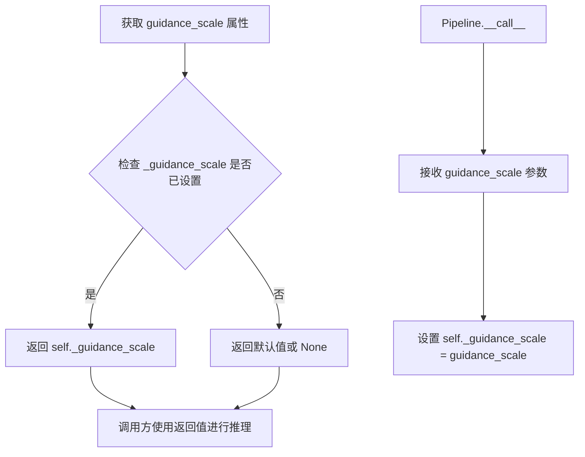

#### 带注释源码

```python
@property
def guidance_scale(self):
    """
    Property getter for guidance_scale.
    
    Guidance scale is a parameter that controls the influence of the text prompt
    on the generated image. Higher values (e.g., 7.5) make the image follow the 
    prompt more closely, while lower values allow more creativity.
    
    This property simply returns the internally stored _guidance_scale value
    that was set during the pipeline's __call__ method.
    
    Returns:
        float: The guidance scale value used during inference.
    """
    return self._guidance_scale
```


### `StableDiffusionInstructPix2PixPipeline.image_guidance_scale`

该属性是一个只读的 getter 属性，用于获取图像引导比例（image_guidance_scale）。该参数控制生成图像与原始输入图像之间的相似度，数值越高表示生成结果越接近输入图像。在 `__call__` 方法中通过 `self._image_guidance_scale = image_guidance_scale` 进行赋值初始化。

参数：無（该属性为 getter 方法，不接受任何参数）

返回值：`float`，返回当前管道使用的图像引导比例值，该值在推理时影响图像生成过程中对输入图像的保持程度。

#### 流程图

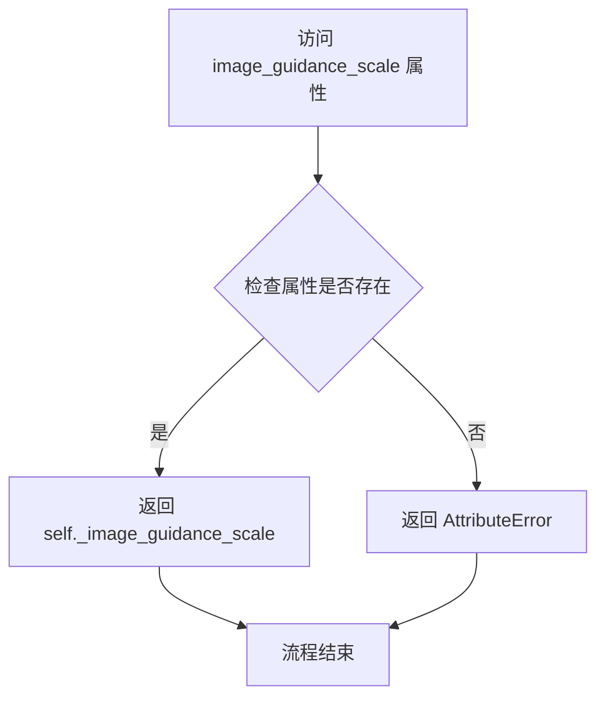

#### 带注释源码

```python
@property
def image_guidance_scale(self):
    """
    获取图像引导比例属性。
    
    该属性返回一个浮点数，表示当前管道配置中的图像引导比例（image_guidance_scale）。
    该参数在 Stable Diffusion InstructPix2Pix 管道中用于控制生成图像与输入图像之间的相似度：
    - 较高的值（如 > 1.0）会使生成结果更紧密地遵循输入图像的结构
    - 值等于 1.0 表示不使用图像引导
    - 根据 do_classifier_free_guidance 属性的逻辑，该值必须 >= 1.0 才会启用图像引导
    
    Returns:
        float: 当前设置的图像引导比例值
    """
    return self._image_guidance_scale
```


### `StableDiffusionInstructPix2PixPipeline.num_timesteps`

获取扩散模型在推理过程中使用的时间步数，用于追踪去噪迭代的总数。

参数： 无

返回值：`int`，返回去噪过程的时间步总数。

#### 流程图

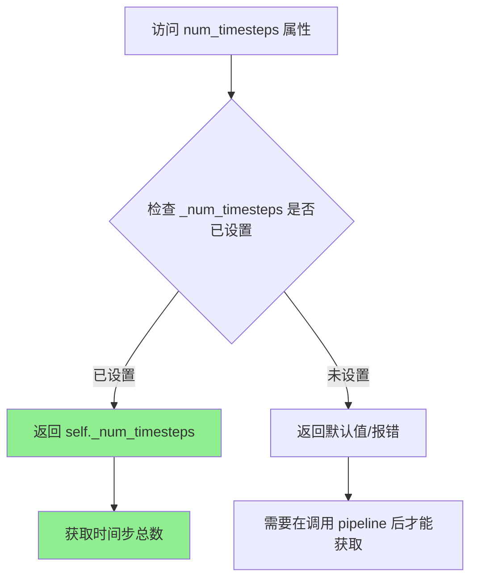

#### 带注释源码

```python
@property
def num_timesteps(self):
    """
    获取扩散模型在推理过程中使用的时间步数。
    
    该属性返回在去噪循环中设置的时间步总数。
    _num_timesteps 在 __call__ 方法中被设置为 len(timesteps)，
    其中 timesteps 来自 scheduler.set_timesteps() 调用的结果。
    """
    return self._num_timesteps
```


### `StableDiffusionInstructPix2PixPipeline.do_classifier_free_guidance`

该属性用于判断是否启用无分类器引导（Classifier-Free Guidance）。通过检查 `guidance_scale` 和 `image_guidance_scale` 两个属性的值来决定：当 `guidance_scale > 1.0` 且 `image_guidance_scale >= 1.0` 时启用引导，否则不启用。

参数：无

返回值：`bool`，返回 `True` 表示启用无分类器引导，返回 `False` 表示不启用。

#### 流程图

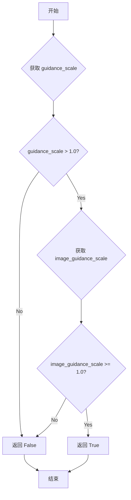

#### 带注释源码

```python
@property
def do_classifier_free_guidance(self):
    """
    属性：判断是否启用无分类器引导
    
    根据 Imagen 论文中的定义，guidance_scale 对应方程(2)中的权重 w。
    当 guidance_scale = 1 时，表示不进行无分类器引导。
    
    该方法同时检查 text guidance (guidance_scale) 和 image guidance (image_guidance_scale)，
    只有两者都满足启用条件时，才返回 True 启用引导。
    
    Returns:
        bool: 如果 guidance_scale > 1.0 且 image_guidance_scale >= 1.0，返回 True；
              否则返回 False。
    """
    # 同时检查 text guidance 和 image guidance 是否都满足启用条件
    # text guidance: guidance_scale > 1.0
    # image guidance: image_guidance_scale >= 1.0 (注意：image guidance 允许等于 1.0)
    return self.guidance_scale > 1.0 and self.image_guidance_scale >= 1.0
```

## 关键组件


### 张量索引与惰性加载

在 `prepare_image_latents` 方法中实现，支持对图像 latent 的延迟处理。当输入图像已经是 latent 形式时（`image.shape[1] == 4`），直接使用而不重新编码；否则调用 `retrieve_latents` 从 VAE 编码结果中提取 latents。这种设计避免了不必要的重复编码计算。

### 反量化支持

在 `decode_latents` 和 `__call__` 方法中实现。通过 `self.vae.config.scaling_factor` 对 latents 进行缩放反量化，然后使用 VAE decode 将 latent 空间转换回像素空间，最后通过 `image_processor.postprocess` 进行归一化和格式转换。

### 量化策略

虽然没有显式的量化/反量化类，但通过 `vae_scale_factor`（基于 VAE 块输出通道数计算）和 `scaling_factor`（VAE 配置中的缩放因子）实现了 latent 空间的缩放管理。在图像预处理和后处理阶段通过 `VaeImageProcessor` 统一处理张量与 PIL 图像之间的转换。

### 图像 Guidance 机制

在 `__call__` 方法的去噪循环中实现双重 guidance：文本 guidance（`guidance_scale`）和图像 guidance（`image_guidance_scale`）。通过 `torch.cat([latents] * 3)` 扩展 latents，并在预测噪声后使用特定的组合公式：`noise_pred_uncond + guidance_scale * (noise_pred_text - noise_pred_image) + image_guidance_scale * (noise_pred_image - noise_pred_uncond)`。

### IP-Adapter 集成

通过 `prepare_ip_adapter_image_embeds` 方法实现，支持通过图像提示增强生成效果。该方法处理图像编码、投影层映射，并针对 classifier-free guidance 进行条件 embeddings 的复制和拼接。

### 安全检查器

通过 `run_safety_checker` 方法集成 NSFW 内容检测，在图像生成后对输出进行安全审查，支持 Tensor 和 PIL 图像两种输入格式。

### 调度器与噪声管理

通过 `prepare_extra_step_kwargs` 方法抽象化不同调度器的签名差异，支持 eta 和 generator 参数的统一传递。`prepare_latents` 方法使用 `randn_tensor` 生成初始噪声并根据调度器的 `init_noise_sigma` 进行缩放。


## 问题及建议


### 已知问题

-   **弃用方法未清理**：代码中包含已弃用的 `preprocess` 方法和 `decode_latents` 方法，这些方法被标记为在 1.0.0 版本移除但仍保留在代码库中，增加了维护负担。
-   **类型检查使用不当**：`type(prompt) is not type(negative_prompt)` 使用了不推荐的身份检查方式，应使用 `isinstance()` 代替。
-   **错误消息占位符未格式化**：在 `__init__` 方法的 `ValueError` 错误消息中使用了未格式化的 f-string 占位符 `{self.__class__}`，导致错误信息不准确。
-   **重复代码**：多个方法（如 `run_safety_checker`、`prepare_extra_step_kwargs`、`encode_image`）从其他 Pipeline 复制而来，未进行抽象和复用。
-   **IP Adapter 逻辑复杂**：`prepare_ip_adapter_image_embeds` 方法包含大量重复的图像处理逻辑和嵌套的条件判断，可读性和可维护性较差。
-   **魔法数字和硬编码**：去噪循环中 `latents` 扩展为 3 倍的硬编码值（`torch.cat([latents] * 3)`），缺乏对这种特定行为的解释。
-   **属性暴露不一致**：部分属性通过 `@property` 暴露（如 `guidance_scale`），而其他属性直接使用私有变量（如 `_num_timesteps`），缺乏一致的访问模式。

### 优化建议

-   **清理弃用代码**：移除已弃用的 `preprocess` 和 `decode_latents` 方法，迁移到使用 `VaeImageProcessor` 的标准方法。
-   **修复类型检查**：将 `type(prompt) is not type(negative_prompt)` 改为 `isinstance(prompt, type(negative_prompt))` 或 `type(prompt) != type(negative_prompt)`。
-   **修复错误消息**：将 `"Make sure to define a feature extractor when loading {self.__class__}"` 改为 `f"Make sure to define a feature extractor when loading {self.__class__}"`。
-   **提取共享逻辑**：将跨 Pipeline 共享的方法提取到基类或 mixin 中，减少代码重复。
-   **重构 IP Adapter 逻辑**：将 `prepare_ip_adapter_image_embeds` 方法拆分为更小的辅助方法，提高可读性。
-   **添加配置常量**：将硬编码的数值（如扩展倍数）提取为类常量或配置属性，并添加文档注释说明其含义。
-   **统一属性访问**：统一使用 `@property` 装饰器暴露所有需要公开访问的内部状态，或创建统一的状态管理机制。

## 其它


### 设计目标与约束

本Pipeline的设计目标是实现基于文本指令的图像编辑功能，通过结合文本提示和原始图像，生成符合用户意图的编辑后图像。核心约束包括：1) 必须使用Stable Diffusion架构作为基础；2) 支持图像引导的生成过程（image guidance）；3) 支持IP-Adapter以实现图像提示功能；4) 必须包含安全检查机制以过滤不当内容；5) 遵循diffusers库的通用Pipeline接口规范。

### 错误处理与异常设计

代码中的错误处理主要通过以下方式实现：1) 参数校验在`check_inputs`方法中集中处理，包括对`prompt`和`prompt_embeds`的互斥检查、`negative_prompt`和`negative_prompt_embeds`的互斥检查、回调函数参数验证、IP-Adapter参数验证等；2) 数值校验如`callback_steps`必须为正整数、`batch_size`必须与`generator`列表长度匹配；3) 类型检查覆盖所有输入参数的类型（如`prompt`必须为`str`或`list`类型）；4) 配置验证在`__init__`中检查`safety_checker`和`feature_extractor`的一致性；5) 异常信息通过`ValueError`抛出并携带详细的错误描述和预期值。

### 数据流与状态机

Pipeline的执行流程遵循以下状态转换：1) 初始状态（输入准备）：接收prompt、image、引导参数等输入；2) 编码状态：将文本prompt编码为embeddings，同时预处理输入图像；3) 调度状态：设置扩散scheduler的时间步；4) 潜在空间准备状态：将图像编码为latents，准备初始噪声latents；5) 去噪循环状态（核心迭代）：在每个时间步执行UNet预测、分类器自由引导计算、scheduler步进；6) 解码状态：将最终latents解码为图像；7) 后处理状态：运行安全检查、归一化处理、格式转换；8) 结束状态：返回生成结果。状态转换由`__call__`方法中的流程控制，关键中间状态（latents、prompt_embeds、image_latents）可通过callback机制在迭代间修改。

### 外部依赖与接口契约

本Pipeline依赖以下核心外部组件：1) `transformers`库：提供CLIPTextModel（文本编码器）、CLIPTokenizer（分词器）、CLIPImageProcessor（图像特征提取）、CLIPVisionModelWithProjection（图像编码器，用于IP-Adapter）；2) diffusers核心库：提供DiffusionPipeline基类、各类Mixin（TextualInversionLoaderMixin、StableDiffusionLoraLoaderMixin、IPAdapterMixin、FromSingleFileMixin）、AutoencoderKL（VAE模型）、UNet2DConditionModel（UNet去噪网络）、KarrasDiffusionSchedulers（调度器）、PipelineImageInput和VaeImageProcessor（图像处理工具）；3) torch和numpy用于数值计算；4) PIL用于图像操作。接口契约要求：VAE的latent_channels必须与UNet的in_channels减去image_latents通道数匹配；scheduler必须实现标准step接口；safety_checker必须与feature_extractor配套使用。

### 性能考虑与优化空间

性能方面的设计考量包括：1) 使用`@torch.no_grad()`装饰器禁用梯度计算以减少显存占用；2) 支持XLA设备加速（通过torch_xla的mark_step）；3) 提供模型CPU offload机制（model_cpu_offload_seq定义卸载顺序）；4) 支持梯度 checkpointing 扩展。优化空间包括：1) 当前实现中图像预处理和latent准备存在多次设备转换，可优化；2) UNet推理部分可进一步优化内存使用；3) 调度器step的extra_step_kwargs构建逻辑可简化；4) 多处使用list拼接操作，可考虑预分配内存。

### 安全性考虑

安全性设计涵盖以下方面：1) 内置StableDiffusionSafetyChecker用于检测NSFW内容；2) 提供`requires_safety_checker`配置选项控制安全检查开关；3) 安全检查结果（has_nsfw_concept）随返回结果一起提供；4) 默认启用安全检查并在文档中强调其重要性；5) 当禁用safety_checker时，系统会发出警告提醒用户遵守Stable Diffusion许可协议；6) 安全检查器输出与原始图像一同返回，便于用户自行判断。

### 兼容性考虑

代码的兼容性设计包括：1) 通过`_optional_components`定义可选组件（safety_checker、feature_extractor、image_encoder），允许在部分组件缺失时运行；2) 使用`deprecate`函数标记废弃的方法和参数；3) 兼容多种输入格式（torch.Tensor、PIL.Image.Image、np.ndarray及其列表形式）；4) 支持多种输出类型（"pil"、"np.array"、"latent"）；5) 通过`_exclude_from_cpu_offload`排除特定组件的CPU offload；6) 适配不同类型的调度器实现，通过`inspect.signature`动态检查scheduler.step接受的参数。

### 使用示例与最佳实践

典型使用流程包括：1) 通过`from_pretrained`加载预训练模型；2) 准备输入图像并调整尺寸；3) 构造编辑指令prompt；4) 设置合适的guidance_scale（文本引导强度）和image_guidance_scale（图像引导强度）；5) 调用pipeline执行推理；6) 处理返回结果。最佳实践建议：1) 图像尺寸应调整为8的倍数以确保VAE处理正确；2) guidance_scale建议值为7.5，image_guidance_scale建议值为1.5；3) 优先使用fp16精度以提升推理速度；4) 在生产环境中保持safety_checker启用；5) 对于批量生成，合理设置num_images_per_prompt参数。

### 版本历史与变更记录

该代码基于diffusers库构建，遵循以下版本策略：1) preprocess方法标记为废弃，建议使用VaeImageProcessor.preprocess替代；2) decode_latents方法标记为废弃，建议使用VaeImageProcessor.postprocess替代；3) callback和callback_steps参数已废弃，建议使用callback_on_step_end和callback_on_step_end_tensor_inputs；4) 未来版本可能移除图像重复警告的行为，当前行为是自动复制图像以匹配prompt数量。

    