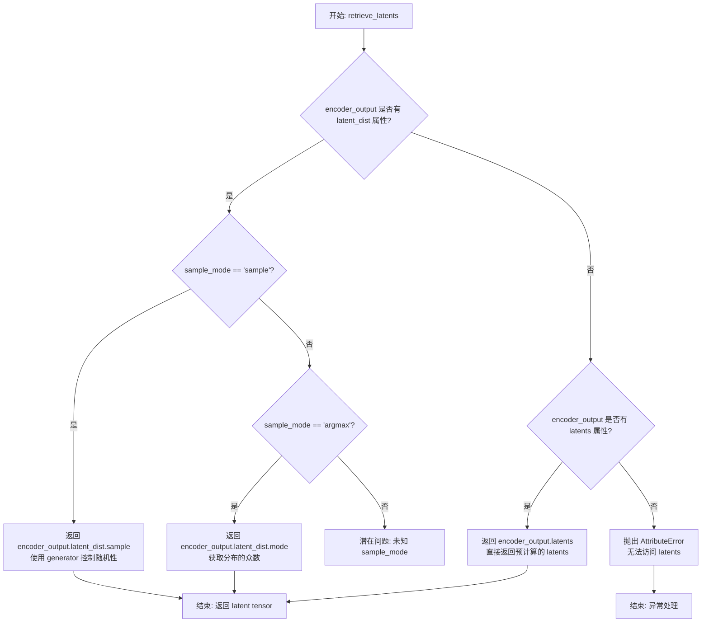
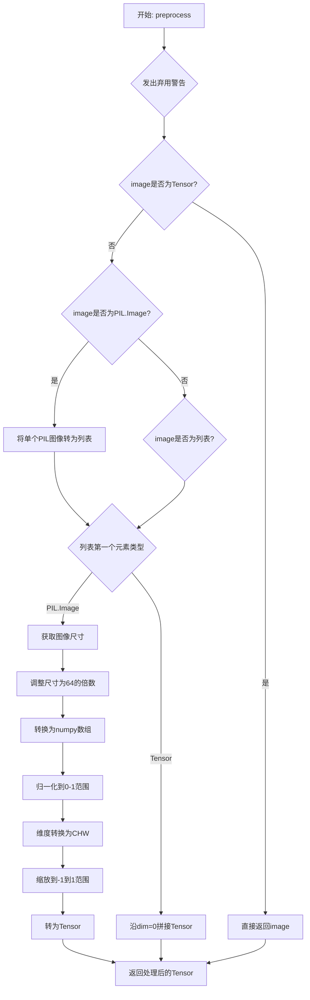
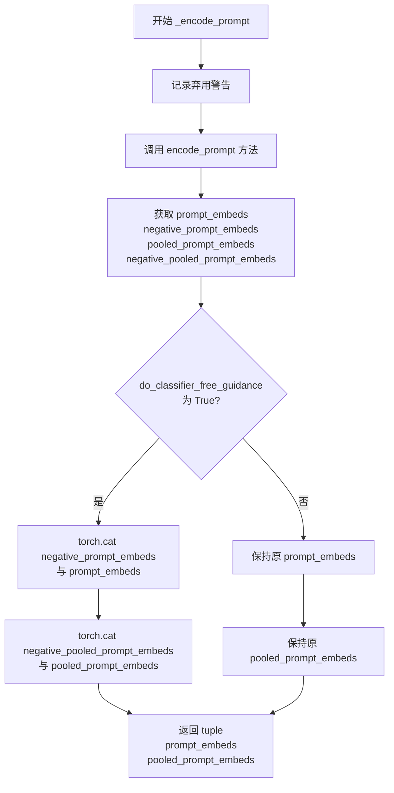
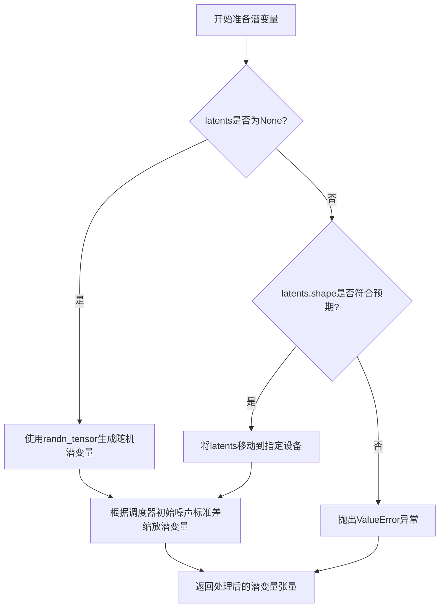

```mermaid
flowchart TD
    A[开始 __call__] --> B[检查输入参数 check_inputs]
    B --> C[定义批次大小和设备]
    C --> D{guidance_scale > 1?}
    D -->|是| E[启用 classifier-free guidance]
    D -->|否| F[设置空提示]
    E --> G[编码提示 encode_prompt]
    F --> G
    G --> H{do_classifier_free_guidance?}
    H -->|是| I[拼接负向和正向提示嵌入]
    H -->|否| J[预处理图像 preprocess]
    I --> J
    J --> K{图像通道数 == 3?}
    K -->|是| L[使用 VAE 编码图像为潜在表示]
    K -->|否| M[设置时间步]
    L --> M
    M --> N[准备噪声潜在向量 prepare_latents]
    N --> O[图像插值放大 x2]
    O --> P[添加噪声条件 设为0]
    P --> Q[创建时间步条件]
    Q --> R[进入去噪循环]
    R --> S{遍历每个时间步}
    S -->|当前步| T[扩展潜在向量]
    T --> U[缩放模型输入]
    U --> V[拼接条件图像]
    V --> W[计算噪声预测 UNet]
    W --> X[提取有效噪声预测]
    X --> Y[应用预处理 Karras et al.]
    Y --> Z{guidance_scale > 1?}
    Z -->|是| AA[应用 classifier-free guidance]
    Z -->|否| AB[ scheduler.step 计算上一步]
    AA --> AB
    AB --> AC[调用回调函数]
    AC --> AD{是否最后一步?}
    AD -->|否| S
    AD -->|是| AE{output_type == 'latent'?}
    AE -->|否| AF[VAE 解码潜在向量]
    AE -->|是| AG[直接使用潜在向量]
    AF --> AH[后处理图像 postprocess]
    AG --> AH
    AH --> AI[释放模型钩子]
    AI --> AJ[返回结果]
```

# `diffusers\src\diffusers\pipelines\stable_diffusion\pipeline_stable_diffusion_latent_upscale.py` 详细设计文档

这是一个用于对 Stable Diffusion 生成的潜在表示（latents）或低分辨率图像进行 2 倍超分辨率上采样的扩散管道（Pipeline）。它结合了 VAE、文本编码器（CLIP）、条件 UNet 和调度器来实现图像增强。

## 整体流程

```mermaid
graph TD
    Start([开始 __call__]) --> CheckInputs{check_inputs}
    CheckInputs --> EncodePrompt[encode_prompt]
    EncodePrompt --> PreprocessImage[image_processor.preprocess]
    PreprocessImage --> EncodeLatents{vae.encode if not latent}
    EncodeLatents --> PrepareNoise[prepare_latents]
    PrepareNoise --> SetTimesteps[scheduler.set_timesteps]
    SetTimesteps --> UpscaleCondition[Prepare Upscale Conditions]
    UpscaleCondition --> DenoiseLoop{去噪循环 (for t in timesteps)}
    DenoiseLoop --> UNetForward[self.unet.forward]
    UNetForward --> SchedulerStep[scheduler.step]
    SchedulerStep --> DenoiseLoopCheck{是否结束?}
    DenoiseLoopCheck -- No --> DenoiseLoop
    DenoiseLoopCheck -- Yes --> DecodeLatents[vae.decode]
    DecodeLatents --> PostProcess[self.image_processor.postprocess]
    PostProcess --> End([返回 ImagePipelineOutput])
```

## 类结构

```
DiffusionPipeline (基类)
├── StableDiffusionMixin (混入)
├── FromSingleFileMixin (混入)
└── StableDiffusionLatentUpscalePipeline (主类)
    ├── 辅助函数: retrieve_latents
    └── 辅助函数: preprocess (已弃用)
```

## 全局变量及字段


### `logger`
    
用于记录日志的全局 logger 对象

类型：`logging.Logger`
    


### `XLA_AVAILABLE`
    
标识是否安装了 PyTorch XLA 的布尔标志

类型：`bool`
    


### `StableDiffusionLatentUpscalePipeline.vae`
    
VAE 模型，用于编解码图像与潜在空间

类型：`AutoencoderKL`
    


### `StableDiffusionLatentUpscalePipeline.text_encoder`
    
文本编码器

类型：`CLIPTextModel`
    


### `StableDiffusionLatentUpscalePipeline.tokenizer`
    
文本分词器

类型：`CLIPTokenizer`
    


### `StableDiffusionLatentUpscalePipeline.unet`
    
去噪 UNet 模型

类型：`UNet2DConditionModel`
    


### `StableDiffusionLatentUpscalePipeline.scheduler`
    
噪声调度器

类型：`EulerDiscreteScheduler`
    


### `StableDiffusionLatentUpscalePipeline.vae_scale_factor`
    
VAE 缩放因子

类型：`int`
    


### `StableDiffusionLatentUpscalePipeline.image_processor`
    
图像预/后处理器

类型：`VaeImageProcessor`
    
    

## 全局函数及方法


### `retrieve_latents`

该函数从 VAE 编码器输出中提取 latent 分布的样本或模式，支持三种模式：从 latent_dist 采样（sample 模式）、获取 latent_dist 的众数（argmax 模式）或直接返回预计算的 latents 属性。

参数：

-  `encoder_output`：`torch.Tensor`，VAE 编码器的输出对象，通常包含 `latent_dist` 属性或 `latents` 属性
-  `generator`：`torch.Generator | None`，可选的随机数生成器，用于采样时的随机性控制
-  `sample_mode`：`str`，采样模式，默认为 "sample"，可选值为 "sample"（从分布采样）或 "argmax"（获取分布的众数/均值）

返回值：`torch.Tensor`，提取的 latent 张量

#### 流程图



#### 带注释源码

```
# 从 VAE 编码器输出中提取 latent 分布的样本或模式
# Copied from diffusers.pipelines.stable_diffusion.pipeline_stable_diffusion_img2img.retrieve_latents
def retrieve_latents(
    encoder_output: torch.Tensor,  # VAE 编码器的输出，包含 latent_dist 或 latents 属性
    generator: torch.Generator | None = None,  # 可选的随机生成器，用于控制采样随机性
    sample_mode: str = "sample"  # 采样模式: "sample" 从分布采样, "argmax" 获取众数
):
    # 情况1: encoder_output 包含 latent_dist 属性且模式为 sample
    # 从潜在分布中采样，获得一个 latent 向量/张量
    if hasattr(encoder_output, "latent_dist") and sample_mode == "sample":
        return encoder_output.latent_dist.sample(generator)
    
    # 情况2: encoder_output 包含 latent_dist 属性且模式为 argmax
    # 获取潜在分布的众数（即最可能的值），相当于取均值
    elif hasattr(encoder_output, "latent_dist") and sample_mode == "argmax":
        return encoder_output.latent_dist.mode()
    
    # 情况3: encoder_output 直接包含 latents 属性
    # 直接返回预计算的 latents，适用于已经计算过 latent 的情况
    elif hasattr(encoder_output, "latents"):
        return encoder_output.latents
    
    # 错误情况: 无法从 encoder_output 中提取 latent
    # 抛出属性错误，提示用户 encoder_output 格式不正确
    else:
        raise AttributeError("Could not access latents of provided encoder_output")
```

#### 关键组件信息

| 组件名称 | 一句话描述 |
|---------|-----------|
| `latent_dist` | VAE 编码器输出的潜在空间分布对象，通常包含 `sample()` 和 `mode()` 方法 |
| `latents` | VAE 编码器输出的预计算潜在表示张量 |

#### 潜在的技术债务或优化空间

1. **错误处理不够友好**：当前直接抛出 `AttributeError`，可以提供更详细的错误信息，包括期望的属性名称
2. **sample_mode 验证缺失**：如果传入非法的 `sample_mode` 值（如 "random"），会静默跳过而非给出警告
3. **类型注解不够精确**：`encoder_output` 标注为 `torch.Tensor`，但实际通常是包含特殊属性的自定义对象（如 `DiffusionDecoderOutput` 或类似对象）
4. **缺少文档注释**：函数本身缺少 docstring，调用者需要查看源码才能理解其行为


### `preprocess`

将 PIL 图像或张量转换为模型可用的张量格式（已弃用）。该函数早期用于图像预处理，现在建议使用 `VaeImageProcessor.preprocess` 替代。

参数：

- `image`：`torch.Tensor | PIL.Image.Image | list[torch.Tensor] | list[PIL.Image.Image]`，输入图像，可以是张量、PIL图像或它们的列表

返回值：`torch.Tensor`，返回符合模型输入要求的张量格式图像

#### 流程图



#### 带注释源码

```python
def preprocess(image):
    """
    将 PIL 图像或张量转换为模型可用的张量格式（已弃用）
    
    参数:
        image: 输入图像，支持 torch.Tensor、PIL.Image.Image 或它们的列表
        
    返回:
        torch.Tensor: 处理后的图像张量
    """
    # 发出弃用警告，提示用户使用 VaeImageProcessor.preprocess 替代
    warnings.warn(
        "The preprocess method is deprecated and will be removed in a future version. Please"
        " use VaeImageProcessor.preprocess instead",
        FutureWarning,
    )
    
    # 如果已经是 Tensor，直接返回
    if isinstance(image, torch.Tensor):
        return image
    # 如果是单个 PIL Image，转换为列表以便统一处理
    elif isinstance(image, PIL.Image.Image):
        image = [image]

    # 处理 PIL Image 列表
    if isinstance(image[0], PIL.Image.Image):
        # 获取图像宽高
        w, h = image[0].size
        # 将宽高调整为64的倍数（模型要求）
        w, h = (x - x % 64 for x in (w, h))
        
        # 调整每个图像尺寸并转换为numpy数组
        # [None, :] 添加batch维度
        image = [np.array(i.resize((w, h)))[None, :] for i in image]
        # 在batch维度拼接
        image = np.concatenate(image, axis=0)
        
        # 归一化: 像素值从 [0, 255] 转为 [0, 1]
        image = np.array(image).astype(np.float32) / 255.0
        # 维度转换: HWC -> CHW
        image = image.transpose(0, 3, 1, 2)
        # 缩放: [0, 1] -> [-1, 1]
        image = 2.0 * image - 1.0
        # 转换为PyTorch张量
        image = torch.from_numpy(image)
    # 处理 Tensor 列表
    elif isinstance(image[0], torch.Tensor):
        # 在batch维度拼接
        image = torch.cat(image, dim=0)
    
    return image
```


### `StableDiffusionLatentUpscalePipeline.__init__`

这是 Stable Diffusion Latent Upscale Pipeline 的初始化方法，负责接收并注册 VAE 模型、文本编码器、分词器、UNet 模型和调度器等核心组件，并初始化 VAE 缩放因子和图像处理器，为后续的图像上采样 pipeline 运行做好准备。

参数：

- `self`：隐式参数，StableDiffusionLatentUpscalePipeline 实例本身
- `vae`：`AutoencoderKL`，Variational Auto-Encoder (VAE) 模型，用于编码和解码图像与潜在表示
- `text_encoder`：`CLIPTextModel`，冻结的文本编码器 (clip-vit-large-patch14)，用于将文本转换为嵌入向量
- `tokenizer`：`CLIPTokenizer`，CLIP 分词器，用于对文本进行分词处理
- `unet`：`UNet2DConditionModel`，条件 UNet 模型，用于对编码后的图像潜在表示进行去噪
- `scheduler`：`EulerDiscreteScheduler`，Euler 离散调度器，用于与 unet 配合对图像潜在表示进行去噪

返回值：`None`，该方法为初始化方法，不返回任何值，仅初始化实例属性

#### 流程图

```mermaid
flowchart TD
    A[开始 __init__] --> B[调用 super().__init__ 初始化基类]
    B --> C[调用 register_modules 注册 vae<br/>text_encoder<br/>tokenizer<br/>unet<br/>scheduler]
    C --> D{检查 vae 是否存在}
    D -->|是| E[计算 vae_scale_factor<br/>2 ** (len(vae.config.block_out_channels) - 1)]
    D -->|否| F[设置 vae_scale_factor = 8]
    E --> G[创建 VaeImageProcessor 实例]
    F --> G
    G --> H[结束 __init__]
```

#### 带注释源码

```python
def __init__(
    self,
    vae: AutoencoderKL,
    text_encoder: CLIPTextModel,
    tokenizer: CLIPTokenizer,
    unet: UNet2DConditionModel,
    scheduler: EulerDiscreteScheduler,
):
    """
    初始化 StableDiffusionLatentUpscalePipeline。

    参数:
        vae: Variational Auto-Encoder (VAE) 模型，用于编码和解码图像到潜在表示
        text_encoder: 冻结的 CLIP 文本编码器，用于生成文本嵌入
        tokenizer: CLIP 分词器，用于对文本进行分词
        unet: 条件 UNet 模型，用于去噪潜在表示
        scheduler: Euler 离散调度器，用于控制去噪过程
    """
    # 调用父类 DiffusionPipeline 的初始化方法
    # 继承基础 pipeline 功能（如设备管理、模型钩子等）
    super().__init__()

    # 将传入的模型组件注册到 pipeline 中
    # 这些模块可以通过 self.vae, self.text_encoder 等访问
    # 同时支持模型卸载和保存/加载功能
    self.register_modules(
        vae=vae,
        text_encoder=text_encoder,
        tokenizer=tokenizer,
        unet=unet,
        scheduler=scheduler,
    )

    # 计算 VAE 缩放因子，用于潜在空间与图像空间之间的转换
    # 基于 VAE 的块输出通道数计算：2^(层数-1)
    # 例如：[128, 256, 512, 512] -> 2^3 = 8
    # 如果 VAE 不存在，则使用默认的缩放因子 8
    self.vae_scale_factor = 2 ** (len(self.vae.config.block_out_channels) - 1) if getattr(self, "vae", None) else 8

    # 创建图像预处理器，用于处理输入图像和输出图像
    # vae_scale_factor: 控制潜在空间的缩放
    # resample: 图像重采样方法，使用双三次插值
    self.image_processor = VaeImageProcessor(vae_scale_factor=self.vae_scale_factor, resample="bicubic")
```


### `StableDiffusionLatentUpscalePipeline._encode_prompt`

该方法是 `StableDiffusionLatentUpscalePipeline` 类中的一个已弃用（deprecated）的内部方法，用于将文本提示（prompt）编码为文本编码器的隐藏状态（hidden states）和池化输出（pooled output）。它通过调用 `encode_prompt` 方法实现编码功能，并将负面提示嵌入与正向提示嵌入在指定维度上进行拼接，以支持无分类器自由引导（Classifier-Free Guidance）功能。

参数：

- `self`：隐式参数，`StableDiffusionLatentUpscalePipeline` 类的实例本身
- `prompt`：`str` 或 `list[str]` 或 `None`，要编码的文本提示，可以是单个字符串、字符串列表或 None
- `device`：`torch.device`，torch 设备，用于将数据移动到指定的计算设备上
- `do_classifier_free_guidance`：`bool`，是否启用无分类器自由引导，当为 True 时会在推理过程中同时考虑正向和负向提示
- `negative_prompt`：`str` 或 `list[str]` 或 `None`，可选的负向提示，用于指导图像生成时避免包含指定内容
- `prompt_embeds`：`torch.Tensor | None`，可选的预生成正向文本嵌入，如果提供则跳过从 prompt 生成嵌入的过程
- `negative_prompt_embeds`：`torch.Tensor | None`，可选的预生成负向文本嵌入，用于无分类器自由引导
- `pooled_prompt_embeds`：`torch.Tensor | None`，可选的预生成池化正向文本嵌入
- `negative_pooled_prompt_embeds`：`torch.Tensor | None`，可选的预生成池化负向文本嵌入
- `**kwargs`：可变关键字参数，用于传递其他可选参数给 `encode_prompt` 方法

返回值：`tuple[torch.Tensor, torch.Tensor]`，返回一个包含两个元素的元组 — 第一个元素是拼接后的提示嵌入（torch.Tensor），维度为 `[batch_size * 2, seq_len, hidden_dim]`，其中前半部分为负向嵌入，后半部分为正向嵌入；第二个元素是拼接后的池化提示嵌入（torch.Tensor），维度为 `[batch_size * 2, hidden_dim]`。这种拼接格式是为了方便后续在推理时同时计算无分类器自由引导的噪声预测。

#### 流程图



#### 带注释源码

```python
def _encode_prompt(
    self,
    prompt,
    device,
    do_classifier_free_guidance,
    negative_prompt=None,
    prompt_embeds: torch.Tensor | None = None,
    negative_prompt_embeds: torch.Tensor | None = None,
    pooled_prompt_embeds: torch.Tensor | None = None,
    negative_pooled_prompt_embeds: torch.Tensor | None = None,
    **kwargs,
):
    """
    已弃用：此方法已被移除，建议使用 encode_prompt() 方法。
    同时请注意输出格式已从拼接的 tensor 改为元组形式。
    """
    # 记录弃用警告，提示用户使用 encode_prompt() 替代
    deprecation_message = "`_encode_prompt()` is deprecated and it will be removed in a future version. Use `encode_prompt()` instead. Also, be aware that the output format changed from a concatenated tensor to a tuple."
    deprecate("_encode_prompt()", "1.0.0", deprecation_message, standard_warn=False)

    # 调用 encode_prompt 方法获取所有文本嵌入
    (
        prompt_embeds,
        negative_prompt_embeds,
        pooled_prompt_embeds,
        negative_pooled_prompt_embeds,
    ) = self.encode_prompt(
        prompt=prompt,
        device=device,
        do_classifier_free_guidance=do_classifier_free_guidance,
        negative_prompt=negative_prompt,
        prompt_embeds=prompt_embeds,
        negative_prompt_embeds=negative_prompt_embeds,
        pooled_prompt_embeds=pooled_prompt_embeds,
        negative_pooled_prompt_embeds=negative_pooled_prompt_embeds,
        **kwargs,
    )

    # 将负向和正向的 prompt_embeds 在 batch 维度（dim=0）上进行拼接
    # 拼接后前半部分为 negative，后半部分为 positive
    # 这种格式便于在后续推理中一次性计算 classifier-free guidance
    prompt_embeds = torch.cat([negative_prompt_embeds, prompt_embeds])
    
    # 同样拼接池化后的嵌入
    pooled_prompt_embeds = torch.cat([negative_pooled_prompt_embeds, pooled_prompt_embeds])

    # 返回拼接后的嵌入元组
    # 注意：这里只返回两个元素，而 encode_prompt 返回四个元素
    # 这种变化是为了兼容旧代码的调用方式
    return prompt_embeds, pooled_prompt_embeds
```


### `StableDiffusionLatentUpscalePipeline.encode_prompt`

该方法将文本提示（prompt）编码为文本 encoder 的隐藏状态（hidden states）和池化输出（pooled output），支持 Classifier-Free Guidance（CFG）技术，可以同时生成正向和负向的文本嵌入。

参数：

- `self`：`StableDiffusionLatentUpscalePipeline` 实例本身
- `prompt`：`str` 或 `list[int]`，要编码的文本提示，可以是单个字符串或字符串列表
- `device`：`torch.device`，torch 设备
- `do_classifier_free_guidance`：`bool`，是否使用 Classifier-Free Guidance
- `negative_prompt`：`str` 或 `list[str]` 或 `None`，负向提示，用于引导图像生成排除某些内容
- `prompt_embeds`：`torch.Tensor | None`，预生成的文本嵌入，如果提供则直接使用
- `negative_prompt_embeds`：`torch.Tensor | None`，预生成的负向文本嵌入
- `pooled_prompt_embeds`：`torch.Tensor | None`，预生成的池化文本嵌入
- `negative_pooled_prompt_embeds`：`torch.Tensor | None`，预生成的负向池化文本嵌入

返回值：`tuple[torch.Tensor, torch.Tensor, torch.Tensor, torch.Tensor]`，返回四个张量：prompt_embeds（文本隐藏状态）、negative_prompt_embeds（负向文本隐藏状态）、pooled_prompt_embeds（池化文本输出）、negative_pooled_prompt_embeds（负向池化文本输出）

#### 流程图

```mermaid
graph TD
    A([开始 encode_prompt]) --> B{判断 prompt 类型}
    B -->|str| C[batch_size = 1]
    B -->|list| D[batch_size = len(prompt)]
    B -->|其他| E[batch_size = prompt_embeds.shape[0]]
    C --> F{prompt_embeds 为 None?}
    D --> F
    E --> F
    F -->|是| G[Tokenizer 编码 prompt]
    G --> H{untruncated_ids 截断检查}
    H -->|是| I[记录截断警告]
    H -->|否| J[Text Encoder 编码]
    I --> J
    J --> K[获取 hidden_states 和 pooler_output]
    K --> L[保存 prompt_embeds 和 pooled_prompt_embeds]
    F -->|否| M{do_classifier_free_guidance?}
    L --> M
    M -->|是| N{negative_prompt_embeds 为 None?}
    N -->|是| O{处理 negative_prompt 类型}
    O -->|None| P[uncond_tokens = [空字符串] * batch_size]
    O -->|str| Q[uncond_tokens = [negative_prompt]]
    O -->|list| R[uncond_tokens = negative_prompt]
    P --> S[Tokenizer 编码 uncond_tokens]
    Q --> S
    R --> S
    S --> T[Text Encoder 编码获取负向 embeddings]
    T --> U[保存 negative_prompt_embeds 和 negative_pooled_prompt_embeds]
    N -->|否| V[返回四个 embeddings]
    U --> V
    M -->|否| V
    V --> W([结束])
```

#### 带注释源码

```python
def encode_prompt(
    self,
    prompt,  # str 或 list[int]，要编码的提示
    device,  # torch.device，设备
    do_classifier_free_guidance,  # bool，是否使用 CFG
    negative_prompt=None,  # str 或 list[str] 或 None，负向提示
    prompt_embeds: torch.Tensor | None = None,  # 预计算的提示嵌入
    negative_prompt_embeds: torch.Tensor | None = None,  # 预计算的负向嵌入
    pooled_prompt_embeds: torch.Tensor | None = None,  # 预计算的池化嵌入
    negative_pooled_prompt_embeds: torch.Tensor | None = None,  # 预计算的负向池化嵌入
):
    r"""
    Encodes the prompt into text encoder hidden states.

    该方法将文本提示编码为文本 encoder 的隐藏状态和池化输出。
    支持 Classifier-Free Guidance 技术，可以同时生成正向和负向的文本嵌入。

    Args:
        prompt: prompt to be encoded (str 或 list)
        device: torch device
        do_classifier_free_guidance: whether to use classifier free guidance or not
        negative_prompt: The prompt or prompts not to guide the image generation
        prompt_embeds: Pre-generated text embeddings
        negative_prompt_embeds: Pre-generated negative text embeddings
        pooled_prompt_embeds: Pre-generated pooled text embeddings
        negative_pooled_prompt_embeds: Pre-generated negative pooled text embeddings
    """
    # 1. 确定 batch_size
    # 如果 prompt 是字符串，batch_size = 1
    # 如果 prompt 是列表，batch_size = 列表长度
    # 否则使用 prompt_embeds 的 batch 大小
    if prompt is not None and isinstance(prompt, str):
        batch_size = 1
    elif prompt is not None and isinstance(prompt, list):
        batch_size = len(prompt)
    else:
        batch_size = prompt_embeds.shape[0]

    # 2. 如果未提供 prompt_embeds，则从 prompt 生成
    if prompt_embeds is None or pooled_prompt_embeds is None:
        # 使用 tokenizer 将文本转换为 token IDs
        text_inputs = self.tokenizer(
            prompt,
            padding="max_length",
            max_length=self.tokenizer.model_max_length,
            truncation=True,
            return_length=True,
            return_tensors="pt",
        )
        text_input_ids = text_inputs.input_ids

        # 获取未截断的 token 序列用于检查
        untruncated_ids = self.tokenizer(prompt, padding="longest", return_tensors="pt").input_ids

        # 检查是否发生了截断，并记录警告信息
        if untruncated_ids.shape[-1] >= text_input_ids.shape[-1] and not torch.equal(
            text_input_ids, untruncated_ids
        ):
            removed_text = self.tokenizer.batch_decode(
                untruncated_ids[:, self.tokenizer.model_max_length - 1 : -1]
            )
            logger.warning(
                "The following part of your input was truncated because CLIP can only handle sequences up to"
                f" {self.tokenizer.model_max_length} tokens: {removed_text}"
            )

        # 使用 text_encoder 编码获取隐藏状态
        # output_hidden_states=True 确保返回所有层的隐藏状态
        text_encoder_out = self.text_encoder(
            text_input_ids.to(device),
            output_hidden_states=True,
        )
        # 获取最后一层的隐藏状态作为 prompt_embeds
        prompt_embeds = text_encoder_out.hidden_states[-1]
        # 获取池化输出用于某些模型的条件输入
        pooled_prompt_embeds = text_encoder_out.pooler_output

    # 3. 获取用于 Classifier Free Guidance 的无条件嵌入
    if do_classifier_free_guidance:
        if negative_prompt_embeds is None or negative_pooled_prompt_embeds is None:
            uncond_tokens: list[str]
            
            # 处理不同类型的 negative_prompt
            if negative_prompt is None:
                # 如果没有负向提示，使用空字符串
                uncond_tokens = [""] * batch_size
            elif type(prompt) is not type(negative_prompt):
                # 类型不匹配，抛出类型错误
                raise TypeError(
                    f"`negative_prompt` should be the same type to `prompt`, but got {type(negative_prompt)} !="
                    f" {type(prompt)}."
                )
            elif isinstance(negative_prompt, str):
                # 负向提示是字符串，转换为单元素列表
                uncond_tokens = [negative_prompt]
            elif batch_size != len(negative_prompt):
                # batch 大小不匹配
                raise ValueError(
                    f"`negative_prompt`: {negative_prompt} has batch size {len(negative_prompt)}, but `prompt`:"
                    f" {prompt} has batch size {batch_size}. Please make sure that passed `negative_prompt` matches"
                    " the batch size of `prompt`."
                )
            else:
                uncond_tokens = negative_prompt

            # 使用与正向提示相同的长度进行 tokenize
            max_length = text_input_ids.shape[-1]
            uncond_input = self.tokenizer(
                uncond_tokens,
                padding="max_length",
                max_length=max_length,
                truncation=True,
                return_length=True,
                return_tensors="pt",
            )

            # 编码负向提示
            uncond_encoder_out = self.text_encoder(
                uncond_input.input_ids.to(device),
                output_hidden_states=True,
            )

            # 获取负向的隐藏状态和池化输出
            negative_prompt_embeds = uncond_encoder_out.hidden_states[-1]
            negative_pooled_prompt_embeds = uncond_encoder_out.pooler_output

    # 4. 返回四个嵌入向量
    return prompt_embeds, negative_prompt_embeds, pooled_prompt_embeds, negative_pooled_prompt_embeds
```


### `StableDiffusionLatentUpscalePipeline.decode_latents`

该方法是 StableDiffusionLatentUpscalePipeline 类中的一个已弃用的方法，用于将 VAE 潜在表示（latents）解码为图像。由于已被标记为弃用，建议使用 VaeImageProcessor.postprocess(...) 方法替代。

参数：

-  `latents`：`torch.Tensor`，需要解码的潜在表示张量，通常来自扩散模型的输出

返回值：`np.ndarray`，解码后的图像，形状为 (batch_size, height, width, channels)，像素值范围 [0, 1]

#### 流程图

```mermaid
flowchart TD
    A[开始 decode_latents] --> B[发出弃用警告]
    B --> C[latents = 1 / scaling_factor * latents]
    C --> D[调用 vae.decode 解码]
    D --> E[归一化到 [0, 1] 范围]
    E --> F[转换为 float32 numpy 数组]
    F --> G[返回图像数组]
```

#### 带注释源码

```python
def decode_latents(self, latents):
    """
    将 VAE 潜在表示解码为图像（已弃用）。

    注意：此方法已在 1.0.0 版本中弃用，建议使用 VaeImageProcessor.postprocess(...) 替代。
    """
    # 发出弃用警告，提示用户使用新方法
    deprecation_message = "The decode_latents method is deprecated and will be removed in 1.0.0. Please use VaeImageProcessor.postprocess(...) instead"
    deprecate("decode_latents", "1.0.0", deprecation_message, standard_warn=False)

    # 第一步：缩放潜在表示
    # VAE 在编码时会乘以 scaling_factor，解码时需要除以它来还原
    latents = 1 / self.vae.config.scaling_factor * latents
    
    # 第二步：使用 VAE 解码器将潜在表示解码为图像
    # vae.decode 返回一个元组，第一个元素是解码后的图像
    image = self.vae.decode(latents, return_dict=False)[0]
    
    # 第三步：将图像归一化到 [0, 1] 范围
    # VAE 输出的图像范围是 [-1, 1]，通过 (image / 2 + 0.5) 转换到 [0, 1]
    # .clamp(0, 1) 确保所有像素值都在有效范围内
    image = (image / 2 + 0.5).clamp(0, 1)
    
    # 第四步：转换为 NumPy 数组
    # 移动到 CPU：.cpu()
    # 维度重排：从 (B, C, H, W) 转换为 (B, H, W, C)：.permute(0, 2, 3, 1)
    # 转换为 float32：.float()
    # 转换为 NumPy 数组：.numpy()
    # 使用 float32 是因为它不会引起显著的开销，并且与 bfloat16 兼容
    image = image.cpu().permute(0, 2, 3, 1).float().numpy()
    
    # 返回解码后的图像数组
    return image
```


### `StableDiffusionLatentUpscalePipeline.check_inputs`

该方法用于验证传入管道的输入参数的有效性，确保`prompt`、`image`、`callback_steps`等参数符合管道的要求，包括类型检查、形状检查和必填参数检查等。

参数：

- `self`：`StableDiffusionLatentUpscalePipeline` 实例，管道自身引用
- `prompt`：`str | list[str] | None`，要编码的提示词，可以是单个字符串或字符串列表
- `image`：`torch.Tensor | np.ndarray | PIL.Image.Image | list`，要升尺度的图像或张量
- `callback_steps`：`int`，回调函数被调用的频率，必须是正整数
- `negative_prompt`：`str | list[str] | None`，用于指导不包含内容的提示词
- `prompt_embeds`：`torch.Tensor | None`，预生成的文本嵌入向量
- `negative_prompt_embeds`：`torch.Tensor | None`，预生成的负面文本嵌入向量
- `pooled_prompt_embeds`：`torch.Tensor | None`，预生成的池化文本嵌入向量
- `negative_pooled_prompt_embeds`：`torch.Tensor | None`，预生成的负面池化文本嵌入向量

返回值：`None`，该方法不返回值，仅进行参数验证，若参数无效则抛出 `ValueError` 异常

#### 流程图

```mermaid
flowchart TD
    A[开始 check_inputs] --> B{prompt 和 prompt_embeds 是否同时存在?}
    B -->|是| C[抛出 ValueError: 不能同时提供]
    B -->|否| D{prompt 和 prompt_embeds 是否都为 None?}
    D -->|是| E[抛出 ValueError: 必须提供至少一个]
    D -->|否| F{prompt 是否为 str 或 list 类型?}
    F -->|否| G[抛出 ValueError: prompt 类型错误]
    F -->|是| H{negative_prompt 和 negative_prompt_embeds 是否同时存在?}
    H -->|是| I[抛出 ValueError: 不能同时提供]
    H -->|否| J{prompt_embeds 和 negative_prompt_embeds 形状是否相同?]
    J -->|否| K[抛出 ValueError: 形状不匹配]
    J -->|是| L{prompt_embeds 存在但 pooled_prompt_embeds 为 None?}
    L -->|是| M[抛出 ValueError: 必须提供 pooled_prompt_embeds]
    L -->|否| N{negative_prompt_embeds 存在但 negative_pooled_prompt_embeds 为 None?}
    N -->|是| O[抛出 ValueError: 必须提供 negative_pooled_prompt_embeds]
    N -->|否| P{image 类型是否合法?}
    P -->|否| Q[抛出 ValueError: image 类型错误]
    P -->|是| R{image 是 list 或 tensor 吗?}
    R -->|是| S[验证 prompt 和 image 的 batch size 是否匹配]
    R -->|否| T{callback_steps 是否为正整数?}
    S --> U{batch size 匹配?}
    U -->|否| V[抛出 ValueError: batch size 不匹配]
    U -->|是| T
    T -->|否| W[抛出 ValueError: callback_steps 无效]
    T -->|是| X[验证通过]
```

#### 带注释源码

```python
def check_inputs(
    self,
    prompt,
    image,
    callback_steps,
    negative_prompt=None,
    prompt_embeds=None,
    negative_prompt_embeds=None,
    pooled_prompt_embeds=None,
    negative_pooled_prompt_embeds=None,
):
    """
    检查输入参数的有效性，确保符合管道运行的要求。
    
    参数:
        prompt: 提示词，字符串或字符串列表
        image: 要处理的图像
        callback_steps: 回调步骤间隔
        negative_prompt: 负面提示词
        prompt_embeds: 预计算的提示词嵌入
        negative_prompt_embeds: 预计算的负面提示词嵌入
        pooled_prompt_embeds: 预计算的池化提示词嵌入
        negative_pooled_prompt_embeds: 预计算的负面池化提示词嵌入
    
    异常:
        ValueError: 当任一输入参数不符合要求时抛出
    """
    
    # 检查1: prompt 和 prompt_embeds 不能同时提供
    if prompt is not None and prompt_embeds is not None:
        raise ValueError(
            f"Cannot forward both `prompt`: {prompt} and `prompt_embeds`: {prompt_embeds}. Please make sure to"
            " only forward one of the two."
        )
    
    # 检查2: prompt 和 prompt_embeds 至少提供一个
    elif prompt is None and prompt_embeds is None:
        raise ValueError(
            "Provide either `prompt` or `prompt_embeds`. Cannot leave both `prompt` and `prompt_embeds` undefined."
        )
    
    # 检查3: prompt 必须是 str 或 list 类型
    elif prompt is not None and not isinstance(prompt, str) and not isinstance(prompt, list):
        raise ValueError(f"`prompt` has to be of type `str` or `list` but is {type(prompt)}")

    # 检查4: negative_prompt 和 negative_prompt_embeds 不能同时提供
    if negative_prompt is not None and negative_prompt_embeds is not None:
        raise ValueError(
            f"Cannot forward both `negative_prompt`: {negative_prompt} and `negative_prompt_embeds`:"
            f" {negative_prompt_embeds}. Please make sure to only forward one of the two."
        )

    # 检查5: prompt_embeds 和 negative_prompt_embeds 形状必须相同
    if prompt_embeds is not None and negative_prompt_embeds is not None:
        if prompt_embeds.shape != negative_prompt_embeds.shape:
            raise ValueError(
                "`prompt_embeds` and `negative_prompt_embeds` must have the same shape when passed directly, but"
                f" got: `prompt_embeds` {prompt_embeds.shape} != `negative_prompt_embeds`"
                f" {negative_prompt_embeds.shape}."
            )

    # 检查6: 如果提供了 prompt_embeds，必须同时提供 pooled_prompt_embeds
    if prompt_embeds is not None and pooled_prompt_embeds is None:
        raise ValueError(
            "If `prompt_embeds` are provided, `pooled_prompt_embeds` also have to be passed. Make sure to generate `pooled_prompt_embeds` from the same text encoder that was used to generate `prompt_embeds`."
        )

    # 检查7: 如果提供了 negative_prompt_embeds，必须同时提供 negative_pooled_prompt_embeds
    if negative_prompt_embeds is not None and negative_pooled_prompt_embeds is None:
        raise ValueError(
            "If `negative_prompt_embeds` are provided, `negative_pooled_prompt_embeds` also have to be passed. Make sure to generate `negative_pooled_prompt_embeds` from the same text encoder that was used to generate `negative_prompt_embeds`."
        )

    # 检查8: image 必须是支持的类型之一
    if (
        not isinstance(image, torch.Tensor)
        and not isinstance(image, np.ndarray)
        and not isinstance(image, PIL.Image.Image)
        and not isinstance(image, list)
    ):
        raise ValueError(
            f"`image` has to be of type `torch.Tensor`, `PIL.Image.Image` or `list` but is {type(image)}"
        )

    # 检查9: 验证 prompt 和 image 的 batch size 是否一致
    # 当 image 是 list 或 tensor 时，需要确保 batch size 匹配
    if isinstance(image, (list, torch.Tensor)):
        # 确定 prompt 的 batch size
        if prompt is not None:
            if isinstance(prompt, str):
                batch_size = 1
            else:
                batch_size = len(prompt)
        else:
            batch_size = prompt_embeds.shape[0]

        # 确定 image 的 batch size
        if isinstance(image, list):
            image_batch_size = len(image)
        else:
            image_batch_size = image.shape[0] if image.ndim == 4 else 1
        
        # 验证 batch size 是否匹配
        if batch_size != image_batch_size:
            raise ValueError(
                f"`prompt` has batch size {batch_size} and `image` has batch size {image_batch_size}."
                " Please make sure that passed `prompt` matches the batch size of `image`."
            )

    # 检查10: callback_steps 必须是正整数
    if (callback_steps is None) or (
        callback_steps is not None and (not isinstance(callback_steps, int) or callback_steps <= 0)
    ):
        raise ValueError(
            f"`callback_steps` has to be a positive integer but is {callback_steps} of type"
            f" {type(callback_steps)}."
        )
```


### `StableDiffusionLatentUpscalePipeline.prepare_latents`

该方法用于准备潜空间（latent space）的初始噪声张量，根据指定的批次大小、通道数、高度和宽度生成或验证潜变量，并依据调度器的初始噪声标准差进行缩放。

参数：

- `batch_size`：`int`，批次大小，指定要生成的潜变量数量
- `num_channels_latents`：`int`，潜变量通道数，对应VAE潜在空间的通道维度
- `height`：`int`，潜变量张量的高度
- `width`：`int`，潜变量张量的宽度
- `dtype`：`torch.dtype`，潜变量张量的数据类型
- `device`：`torch.device`，潜变量张量存放的设备
- `generator`：`torch.Generator | None`，可选的随机数生成器，用于确保可重复性
- `latents`：`torch.Tensor | None`，可选的预生成潜变量张量，若提供则直接使用，否则随机生成

返回值：`torch.Tensor`，准备好的潜变量张量，已根据调度器的初始噪声标准差进行缩放

#### 流程图



#### 带注释源码

```python
def prepare_latents(self, batch_size, num_channels_latents, height, width, dtype, device, generator, latents=None):
    """
    准备用于去噪过程的潜变量张量。
    
    参数:
        batch_size: 批次大小
        num_channels_latents: 潜变量通道数
        height: 潜变量高度
        width: 潜变量宽度
        dtype: 数据类型
        device: 计算设备
        generator: 随机数生成器
        latents: 可选的预生成潜变量
    
    返回:
        准备好的潜变量张量
    """
    # 计算期望的潜变量形状
    shape = (batch_size, num_channels_latents, height, width)
    
    # 如果未提供潜变量，则使用随机张量生成
    if latents is None:
        latents = randn_tensor(shape, generator=generator, device=device, dtype=dtype)
    else:
        # 验证提供的潜变量形状是否与预期匹配
        if latents.shape != shape:
            raise ValueError(f"Unexpected latents shape, got {latents.shape}, expected {shape}")
        # 将已有潜变量移动到指定设备
        latents = latents.to(device)

    # 根据调度器的要求缩放初始噪声
    # init_noise_sigma是调度器定义的初始噪声标准差
    latents = latents * self.scheduler.init_noise_sigma
    
    return latents
```


### `StableDiffusionLatentUpscalePipeline.__call__`

该方法是 StableDiffusionLatentUpscalePipeline 的核心调用函数，用于将 Stable Diffusion 生成的潜在表示（latents）或图像放大 2 倍。它通过去噪过程将低分辨率的图像潜在向量逐步上采样为高分辨率图像，支持文本提示引导的图像放大、条件-free guidance 以及自定义回调功能。

参数：

- `prompt`：`str | list[str] | None`，用于指导图像放大的文本提示
- `image`：`PipelineImageInput`，待放大的图像（可以是 torch.Tensor、PIL.Image.Image、np.ndarray 或列表形式），若是 4 通道则视为潜在表示，否则使用 VAE 编码
- `num_inference_steps`：`int`，去噪步数，默认 75
- `guidance_scale`：`float`，引导比例，默认 9.0，用于控制文本提示的影响力
- `negative_prompt`：`str | list[str] | None`，负面提示，用于指导不希望出现的内容
- `generator`：`torch.Generator | list[torch.Generator] | None`，随机数生成器，用于确保可重复性
- `latents`：`torch.Tensor | None`，预生成的噪声潜在向量，若不提供则随机生成
- `prompt_embeds`：`torch.Tensor | None`，预生成的文本嵌入向量
- `negative_prompt_embeds`：`torch.Tensor | None`，预生成的负面文本嵌入向量
- `pooled_prompt_embeds`：`torch.Tensor | None`，池化后的提示嵌入
- `negative_pooled_prompt_embeds`：`torch.Tensor | None`，池化后的负面提示嵌入
- `output_type`：`str | None`，输出格式，可选 "pil" 或 "latent"，默认 "pil"
- `return_dict`：`bool`，是否返回字典格式的输出，默认 True
- `callback`：`Callable[[int, int, torch.Tensor], None] | None`，每步去噪后调用的回调函数
- `callback_steps`：`int`，回调函数被调用的频率，默认 1

返回值：`ImagePipelineOutput | tuple`，若 `return_dict=True` 返回 `ImagePipelineOutput` 对象（包含 `images` 列表），否则返回元组

#### 流程图



#### 带注释源码

```python
@torch.no_grad()
def __call__(
    self,
    prompt: str | list[str] = None,
    image: PipelineImageInput = None,
    num_inference_steps: int = 75,
    guidance_scale: float = 9.0,
    negative_prompt: str | list[str] | None = None,
    generator: torch.Generator | list[torch.Generator] | None = None,
    latents: torch.Tensor | None = None,
    prompt_embeds: torch.Tensor | None = None,
    negative_prompt_embeds: torch.Tensor | None = None,
    pooled_prompt_embeds: torch.Tensor | None = None,
    negative_pooled_prompt_embeds: torch.Tensor | None = None,
    output_type: str | None = "pil",
    return_dict: bool = True,
    callback: Callable[[int, int, torch.Tensor], None] | None = None,
    callback_steps: int = 1,
):
    # 1. 检查输入参数的有效性
    # 验证 prompt、image、callback_steps 等参数的合法性
    self.check_inputs(
        prompt,
        image,
        callback_steps,
        negative_prompt,
        prompt_embeds,
        negative_prompt_embeds,
        pooled_prompt_embeds,
        negative_pooled_prompt_embeds,
    )

    # 2. 定义调用参数
    # 根据 prompt 类型确定批次大小
    if prompt is not None:
        batch_size = 1 if isinstance(prompt, str) else len(prompt)
    else:
        batch_size = prompt_embeds.shape[0]
    
    # 获取执行设备
    device = self._execution_device
    
    # 判断是否启用 classifier-free guidance
    # guidance_scale > 1 时启用，类似于 Imagen 论文中的权重 w
    do_classifier_free_guidance = guidance_scale > 1.0

    # guidance_scale 为 0 时使用空提示
    if guidance_scale == 0:
        prompt = [""] * batch_size

    # 3. 编码输入提示
    # 调用 encode_prompt 生成文本嵌入向量
    (
        prompt_embeds,
        negative_prompt_embeds,
        pooled_prompt_embeds,
        negative_pooled_prompt_embeds,
    ) = self.encode_prompt(
        prompt,
        device,
        do_classifier_free_guidance,
        negative_prompt,
        prompt_embeds,
        negative_prompt_embeds,
        pooled_prompt_embeds,
        negative_pooled_prompt_embeds,
    )

    # 如果启用 CFG，将负向和正向提示嵌入拼接
    if do_classifier_free_guidance:
        prompt_embeds = torch.cat([negative_prompt_embeds, prompt_embeds])
        pooled_prompt_embeds = torch.cat([negative_pooled_prompt_embeds, pooled_prompt_embeds])

    # 4. 预处理图像
    # 将输入图像转换为统一格式
    image = self.image_processor.preprocess(image)
    image = image.to(dtype=prompt_embeds.dtype, device=device)
    
    # 如果图像是 3 通道（RGB），则使用 VAE 编码为潜在表示
    if image.shape[1] == 3:
        # 编码图像并乘以缩放因子
        image = retrieve_latents(self.vae.encode(image), generator=generator) * self.vae.config.scaling_factor

    # 5. 设置时间步
    self.scheduler.set_timesteps(num_inference_steps, device=device)
    timesteps = self.scheduler.timesteps

    # 为 classifier-free guidance 准备批次乘数
    batch_multiplier = 2 if do_classifier_free_guidance else 1
    
    # 调整图像维度以便批量处理
    image = image[None, :] if image.ndim == 3 else image
    image = torch.cat([image] * batch_multiplier)

    # 5. 添加噪声（设置为 0）
    # 根据作者说明，此步骤理论上可改善模型在分布外输入上的表现，但通常会使输出与输入匹配度降低，因此默认关闭
    noise_level = torch.tensor([0.0], dtype=torch.float32, device=device)
    noise_level = torch.cat([noise_level] * image.shape[0])
    inv_noise_level = (noise_level**2 + 1) ** (-0.5)

    # 对图像进行 2 倍插值放大
    image_cond = F.interpolate(image, scale_factor=2, mode="nearest") * inv_noise_level[:, None, None, None]
    image_cond = image_cond.to(prompt_embeds.dtype)

    # 创建噪声级别嵌入条件
    noise_level_embed = torch.cat(
        [
            # 创建与 pooled_prompt_embeds 批次大小相同的条件张量
            torch.ones(pooled_prompt_embeds.shape[0], 64, dtype=pooled_prompt_embeds.dtype, device=device),
            torch.zeros(pooled_prompt_embeds.shape[0], 64, dtype=pooled_prompt_embeds.dtype, device=device),
        ],
        dim=1,
    )

    # 拼接噪声级别嵌入和池化提示嵌入作为时间步条件
    timestep_condition = torch.cat([noise_level_embed, pooled_prompt_embeds], dim=1)

    # 6. 准备潜在变量
    height, width = image.shape[2:]
    num_channels_latents = self.vae.config.latent_channels
    
    # 生成或使用提供的潜在向量，尺寸为放大后的 2 倍
    latents = self.prepare_latents(
        batch_size,
        num_channels_latents,
        height * 2,  # 2x upscale
        width * 2,
        prompt_embeds.dtype,
        device,
        generator,
        latents,
    )

    # 7. 检查图像和潜在向量的通道数配置是否匹配
    num_channels_image = image.shape[1]
    if num_channels_latents + num_channels_image != self.unet.config.in_channels:
        raise ValueError(
            f"Incorrect configuration settings! The config of `pipeline.unet`: {self.unet.config} expects"
            f" {self.unet.config.in_channels} but received `num_channels_latents`: {num_channels_latents} +"
            f" `num_channels_image`: {num_channels_image} "
            f" = {num_channels_latents + num_channels_image}. Please verify the config of"
            " `pipeline.unet` or your `image` input."
        )

    # 9. 去噪循环
    num_warmup_steps = 0

    with self.progress_bar(total=num_inference_steps) as progress_bar:
        for i, t in enumerate(timesteps):
            # 获取当前步的 sigma 值
            sigma = self.scheduler.sigmas[i]
            
            # 扩展潜在向量以进行 classifier-free guidance
            latent_model_input = torch.cat([latents] * 2) if do_classifier_free_guidance else latents
            
            # 缩放模型输入
            scaled_model_input = self.scheduler.scale_model_input(latent_model_input, t)

            # 将条件图像与缩放后的模型输入拼接
            scaled_model_input = torch.cat([scaled_model_input, image_cond], dim=1)
            
            # 基于 Karras et al. (2022) 的预处理参数（表 1）
            timestep = torch.log(sigma) * 0.25

            # 使用 UNet 进行噪声预测
            noise_pred = self.unet(
                scaled_model_input,
                timestep,
                encoder_hidden_states=prompt_embeds,
                timestep_cond=timestep_condition,
            ).sample

            # 原始输出包含未使用的方差通道，丢弃它
            noise_pred = noise_pred[:, :-1]

            # 应用预处理，基于 Karras et al. (2022) 表 1
            inv_sigma = 1 / (sigma**2 + 1)
            noise_pred = inv_sigma * latent_model_input + self.scheduler.scale_model_input(sigma, t) * noise_pred

            # 执行 guidance
            if do_classifier_free_guidance:
                noise_pred_uncond, noise_pred_text = noise_pred.chunk(2)
                noise_pred = noise_pred_uncond + guidance_scale * (noise_pred_text - noise_pred_uncond)

            # 计算上一步的噪声样本 x_t -> x_t-1
            latents = self.scheduler.step(noise_pred, t, latents).prev_sample

            # 调用回调函数（如果提供）
            if i == len(timesteps) - 1 or ((i + 1) > num_warmup_steps and (i + 1) % self.scheduler.order == 0):
                progress_bar.update()
                if callback is not None and i % callback_steps == 0:
                    step_idx = i // getattr(self.scheduler, "order", 1)
                    callback(step_idx, t, latents)

            # XLA 设备支持
            if XLA_AVAILABLE:
                xm.mark_step()

    # 8. 解码潜在向量为图像
    if not output_type == "latent":
        # 使用 VAE 解码潜在向量
        image = self.vae.decode(latents / self.vae.config.scaling_factor, return_dict=False)[0]
    else:
        # 直接返回潜在向量
        image = latents

    # 后处理图像
    image = self.image_processor.postprocess(image, output_type=output_type)

    # 释放模型钩子
    self.maybe_free_model_hooks()

    # 返回结果
    if not return_dict:
        return (image,)

    return ImagePipelineOutput(images=image)
```

## 关键组件


### StableDiffusionLatentUpscalePipeline

Stable Diffusion潜在空间上采样管道，继承自DiffusionPipeline，用于将Stable Diffusion模型的输出图像分辨率放大2倍，支持文本条件引导和噪声级别调节。

### VAE (AutoencoderKL)

变分自编码器模型，负责将图像编码到潜在空间并从潜在空间解码重建图像，支持潜在表示的缩放因子配置。

### UNet2DConditionModel

条件去噪UNet模型，接收噪声潜在表示、时间步条件、文本嵌入和噪声级别条件作为输入，预测需要去除的噪声。

### CLIPTextModel & CLIPTokenizer

冻结的CLIP文本编码器模型和对应的分词器，用于将文本提示转换为文本嵌入表示，支持CLIP模型最大序列长度处理。

### EulerDiscreteScheduler

欧拉离散调度器，用于在去噪过程中生成时间步序列，配合UNet进行迭代去噪，支持Karras等人(2022)的预处理参数化方案。

### VaeImageProcessor

VAE图像处理器，负责图像的预处理（缩放、归一化、转置）和后处理（反归一化、格式转换），使用双三次重采样方法。

### retrieve_latents

全局工具函数，从encoder输出中提取潜在表示，支持sample模式和argmax模式，优先使用latent_dist属性。

### encode_prompt

文本编码核心方法，将文本提示转换为文本encoder的隐藏状态嵌入，支持分类器自由引导（CFG）生成无条件嵌入。

### check_inputs

输入验证方法，检查prompt、图像、callback_steps等参数的有效性和一致性，确保批处理大小匹配。

### prepare_latents

潜在变量准备方法，生成或验证噪声潜在张量，根据调度器的初始噪声标准差进行缩放。

### __call__

管道主调用方法，执行完整的图像上采样流程：编码提示→预处理图像→编码图像到潜在空间→设置时间步→去噪循环→解码潜在表示→后处理输出。

### Classifier-Free Guidance

分类器自由引导机制，通过拼接负向提示嵌入和正向提示嵌入，在推理时动态切换条件和非条件预测，实现无分类器的文本引导。

### 噪声级别调节 (Noise Level Conditioning)

基于Karras等人(2022)论文的噪声级别调节机制，将噪声级别嵌入与池化文本嵌入拼接作为时间步条件输入UNet，提升模型对不同噪声水平的适应性。

### 图像条件编码

将输入图像编码为潜在表示并与噪声潜在表示在通道维度拼接，作为UNet的额外输入，实现对低分辨率输入图像的条件建模。

### XLA支持

通过torch_xla模块支持Google XLA编译加速，使用xm.mark_step()在推理循环中显式标记计算步骤。


## 问题及建议


### 已知问题

-   **文档与代码不一致**：在`__call__`方法的文档字符串中，`num_inference_steps`默认值标注为50，但实际默认值为75；`guidance_scale`默认值标注为7.5，但实际为9.0
-   **步骤注释跳跃**：代码中注释从"5. set timesteps"直接跳到"6. Prepare latent variables"，然后是"9. Denoising loop"，缺少步骤7和8的注释，导致文档与实际执行流程不对应
-   **冗余的条件检查**：在`check_inputs`方法中检查`callback_steps`时，先检查`callback_steps is None`再检查`callback_steps is not None`，逻辑冗余
-   **类型注解兼容性**：代码使用Python 3.10+的联合类型语法（如`torch.Tensor | None`），可能与较低版本Python不兼容
-   **缺失的输入验证**：`prepare_latents`方法未验证`num_channels_latents`、`height`、`width`等参数的有效性
-   **已弃用方法仍在使用**：`decode_latents`方法虽已标记弃用，但在`__call__`中被间接调用（通过条件判断）
-   **循环内张量拼接性能问题**：在去噪循环中每次迭代都进行`torch.cat`操作（`latent_model_input`和`scaled_model_input`），可预先分配内存优化
-   **XLA标记位置不当**：`xm.mark_step()`仅在循环结束后检查，但在循环内部调用，存在条件不一致

### 优化建议

-   修正文档字符串中的默认值以匹配实际代码逻辑
-   补充或调整步骤编号注释，使其与实际执行顺序一致
-   简化`callback_steps`的条件检查逻辑
-   考虑使用`typing.Optional`替代`|`操作符以提高兼容性
-   在`prepare_latents`中添加参数有效性验证
-   完全移除对已弃用`decode_latents`方法的依赖，统一使用`VaeImageProcessor`
-   预先分配张量以减少循环中的内存分配开销
-   统一XLA相关检查的位置，或在循环内部添加条件判断

## 其它


### 设计目标与约束

**设计目标：**
- 将Stable Diffusion生成的图像分辨率提高2倍
- 基于文本提示引导的图像超分辨率增强
- 支持Classifier-Free Guidance (CFG)以提升生成质量
- 兼容Hugging Face Diffusers框架的标准化接口

**设计约束：**
- 输入图像必须为4通道latent表示或普通图像
- 输出图像尺寸为输入的2倍（宽高各放大2倍）
- 仅支持2倍放大，不支持任意倍率
- 不支持Inpainting/Outpainting功能
- 推理步数默认75步，低于标准SD的50步
- guidance_scale默认9.0，高于标准SD的7.5

### 错误处理与异常设计

**参数校验：**
- `check_inputs()`方法全面校验所有输入参数
- 校验prompt与prompt_embeds不能同时提供
- 校验negative_prompt与negative_prompt_embeds不能同时提供
- 校验prompt_embeds与negative_prompt_embeds形状必须一致
- 校验pooled_prompt_embeds与negative_pooled_prompt_embeds必须成对提供
- 校验image类型必须为Tensor、numpy数组、PIL图像或列表
- 校验callback_steps必须为正整数

**运行时异常：**
- AttributeError: 当encoder_output无法访问latents时抛出
- ValueError: 当latents形状与预期不符时抛出
- ValueError: 当unet配置与输入通道数不匹配时抛出
- TypeError: 当negative_prompt与prompt类型不匹配时抛出

**弃用警告：**
- `decode_latents()`方法标记为deprecated，1.0.0版本将移除
- `_encode_prompt()`方法标记为deprecated
- `preprocess()`全局函数标记为deprecated

### 数据流与状态机

**主流程状态机：**
1. **初始化态**：Pipeline对象创建，各模块（VAE、TextEncoder、UNet、Scheduler）注册
2. **输入校验态**：调用check_inputs()验证所有输入参数有效性
3. **编码态**：encode_prompt()将文本prompt编码为embeddings，若启用CFG同时生成unconditional embeddings
4. **预处理态**：image_processor.preprocess()处理输入图像，若为普通图像则通过VAE编码为latent
5. **噪声调节态**：根据噪声等级对条件图像进行插值和缩放
6. **潜在变量准备态**：prepare_latents()初始化或验证latent张量
7. **去噪循环态**：循环执行UNet推理和Scheduler步骤更新latents
8. **解码态**：VAE decode将latents转换为最终图像
9. **后处理态**：image_processor.postprocess()转换为输出格式（pil/numpy/tensor）

**关键数据转换：**
- PIL/numpy/tensor → latents：VAE encode + scaling_factor
- latents → PIL/numpy/tensor：VAE decode + 归一化 + postprocess
- prompt → prompt_embeds：CLIPTextModel编码

### 外部依赖与接口契约

**核心依赖：**
- `transformers`: CLIPTextModel, CLIPTokenizer
- `diffusers`: AutoencoderKL, UNet2DConditionModel, EulerDiscreteScheduler, DiffusionPipeline
- `torch`: 张量运算与神经网络
- `numpy`: 数组操作
- `PIL`: 图像处理
- `torch_xla`: 可选的XLA设备支持

**接口契约：**
- 输入图像：支持PipelineImageInput类型（PIL.Image/numpy/tensor/list）
- 输出图像：通过ImagePipelineOutput返回images列表
- 设备支持：自动检测CPU/CUDA/XLA设备
- 模型卸载：支持model_cpu_offload_seq顺序卸载

**Mixin继承：**
- DiffusionPipeline: 基础管道功能
- StableDiffusionMixin: 稳定扩散特定功能
- FromSingleFileMixin: 支持从单文件加载.ckpt模型

### 性能考虑

**计算优化：**
- 默认使用torch.no_grad()禁用梯度计算
- 支持XLA加速（is_torch_xla_available）
- 图像预处理使用VaeImageProcessor替代deprecated的preprocess函数
- 批量处理时使用chunk(2)分离CFG的conditional和unconditional预测

**内存优化：**
- 使用model_cpu_offload_seq实现顺序模型卸载
- 支持enable_sequential_cpu_offload()进一步降低显存
- 中间张量及时释放，避免不必要的引用保持

**默认配置：**
- num_inference_steps=75（较高质量要求）
- guidance_scale=9.0（强引导）
- output_type="pil"（用户友好）

### 安全性考虑

**输入安全：**
- prompt长度自动截断至tokenizer.model_max_length
- 截断时发出警告并显示被截断内容
- negative_prompt类型校验防止注入攻击

**模型安全：**
- 不包含NSFW过滤器（需用户自行处理）
- 无内置内容审核机制

### 配置与参数说明

**Pipeline初始化参数：**
- vae: AutoencoderKL模型，用于编解码latent
- text_encoder: CLIPTextModel，文本编码
- tokenizer: CLIPTokenizer，分词器
- unet: UNet2DConditionModel，去噪网络
- scheduler: EulerDiscreteScheduler，调度器

**__call__核心参数：**
- prompt: 文本提示，支持字符串或字符串列表
- image: 待放大的图像（latent或普通图像）
- num_inference_steps: 推理步数，默认75
- guidance_scale: CFG权重，默认9.0
- negative_prompt: 负面提示
- output_type: 输出格式，默认"pil"
- callback: 进度回调函数
- callback_steps: 回调频率

### 使用示例与用例

**基础用法：**
```python
from diffusers import StableDiffusionLatentUpscalePipeline
import torch

upscaler = StableDiffusionLatentUpscalePipeline.from_pretrained(
    "stabilityai/sd-x2-latent-upscaler",
    torch_dtype=torch.float16
)
upscaler.to("cuda")

upscaled_image = upscaler(
    prompt="high quality, detailed",
    image=low_res_latents,
    num_inference_steps=20,
    guidance_scale=0
).images[0]
```

**典型场景：**
- 两阶段生成：先使用StableDiffusionPipeline生成低分辨率latent，再使用本Pipeline放大
- 纯噪声放大：直接使用随机噪声作为输入

### 版本历史与兼容性

**版本信息：**
- 代码版权：Apache 2.0
- 框架版本：基于Hugging Face Diffusers
- Python版本：建议3.8+

**兼容性说明：**
- 继承DiffusionPipeline的标准接口
- from_single_file方法支持加载.ckpt格式模型
- VAE缩放因子基于vae.config.block_out_channels自动计算

### 线程安全与并发

**线程安全：**
- Pipeline对象非线程安全，不建议多线程共享同一实例
- 每个线程应创建独立的Pipeline实例
- generator参数支持多generator列表用于批处理

**并发限制：**
- CUDA推理通常需要顺序执行
- XLA支持有限的并发能力

### 资源管理与清理

**模型卸载：**
- maybe_free_model_hooks(): 在推理结束后自动调用释放模型内存
- 支持enable_sequential_cpu_offload()手动控制卸载时机

**显存管理：**
- 使用torch.cuda.empty_cache()清理缓存（如需要）
- 长期运行应用应定期创建新Pipeline实例

    