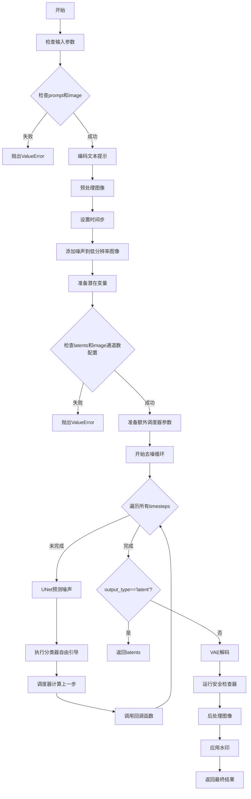
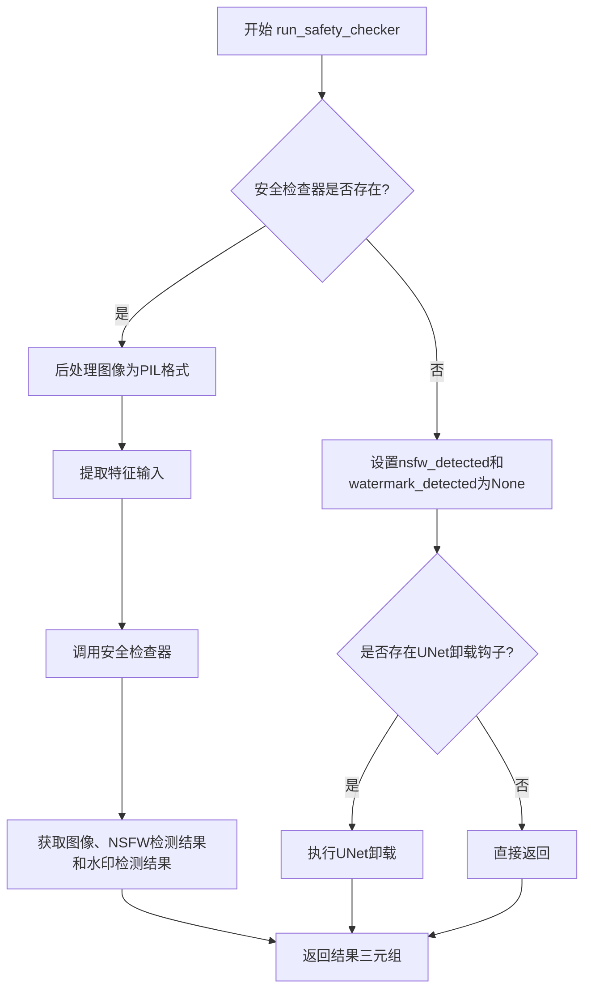
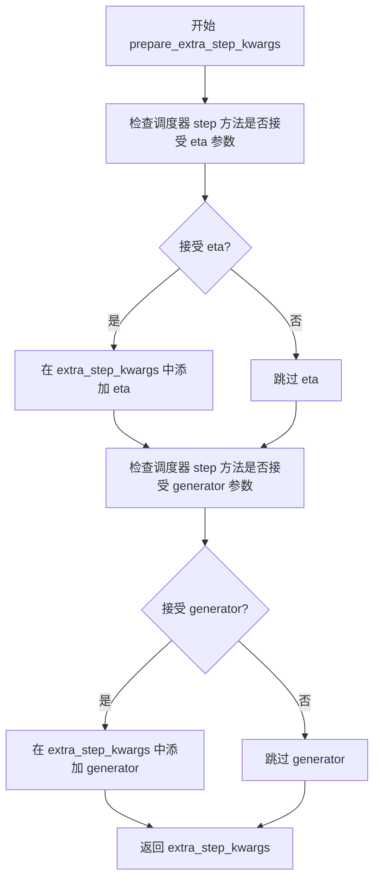
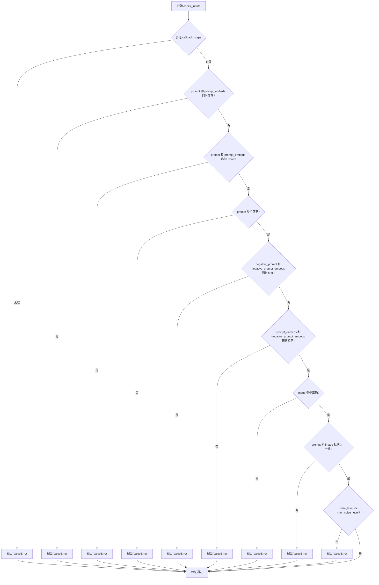
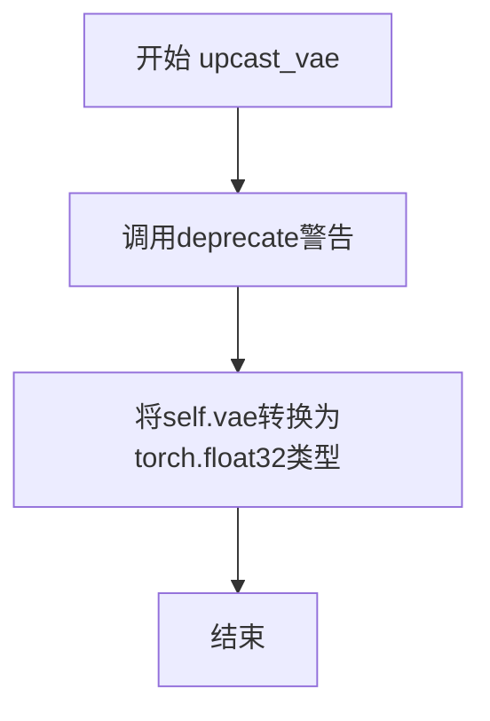

```mermaid
flowchart TD
    A[开始 __call__] --> B[1. 检查输入参数]
    B --> C[2. 定义调用参数<br/>batch_size, device, guidance_scale]
    C --> D[3. 编码输入提示<br/>encode_prompt]
    D --> E{do_classifier_free_guidance?}
    E -->|Yes| F[连接负向和正向提示嵌入]
    E -->|No| G[跳过连接]
    F --> G
    G --> H[4. 预处理图像<br/>image_processor.preprocess]
    H --> I[5. 设置时间步<br/>scheduler.set_timesteps]
    I --> J[5. 添加噪声到图像<br/>low_res_scheduler.add_noise]
    J --> K[复制图像和噪声级别用于分类器自由引导]
    K --> L[6. 准备潜在变量<br/>prepare_latents]
    L --> M[7. 验证图像和潜在变量尺寸匹配]
    M --> N[8. 准备额外步骤参数<br/>prepare_extra_step_kwargs]
    N --> O[9. 去噪循环]
    O --> P[展开潜在变量用于分类器自由引导]
    P --> Q[缩放潜在变量输入]
    Q --> R[连接潜在变量和图像]
    R --> S[UNet预测噪声残差]
    S --> T{do_classifier_free_guidance?}
    T -->|Yes| U[执行引导计算]
    T -->|No| V[跳过引导]
    U --> V
    V --> W[scheduler.step计算上一步]
    W --> X{是否完成所有时间步?}
    X -->|No| O
    X -->|Yes| Y{output_type == 'latent'?}
    Y -->|No| Z[VAE解码潜在变量]
    Y -->|Yes| AA[使用潜在变量作为图像]
    Z --> AB[运行安全检查器]
    AA --> AC[后处理图像]
    AB --> AC
    AC --> AD[应用水印]
    AD --> AE[释放模型钩子]
    AE --> AF[返回结果]
```

# `diffusers\src\diffusers\pipelines\stable_diffusion\pipeline_stable_diffusion_upscale.py` 详细设计文档

Stable Diffusion Upscale Pipeline是一个基于Stable Diffusion 2的图像超分辨率模型，能够将低分辨率图像通过文本提示引导放大4倍，支持LoRA、Textual Inversion等高级功能，可用于图像增强和质量提升。

## 整体流程



## 类结构

```
DiffusionPipeline (抽象基类)
├── StableDiffusionMixin (Mixins)
├── TextualInversionLoaderMixin (Mixins)
├── StableDiffusionLoraLoaderMixin (Mixins)
├── FromSingleFileMixin (Mixins)
└── StableDiffusionUpscalePipeline (主类)
```

## 全局变量及字段


### `preprocess`
    
预处理图像函数，将PIL图像或张量转换为模型输入格式

类型：`function`
    


### `XLA_AVAILABLE`
    
是否支持XLA加速

类型：`bool`
    


### `logger`
    
模块级日志记录器

类型：`logging.Logger`
    


### `StableDiffusionUpscalePipeline.vae`
    
VAE编解码器模型，用于图像与潜在表示的相互转换

类型：`AutoencoderKL`
    


### `StableDiffusionUpscalePipeline.text_encoder`
    
冻结的文本编码器，用于将文本提示转换为嵌入向量

类型：`CLIPTextModel`
    


### `StableDiffusionUpscalePipeline.tokenizer`
    
CLIP分词器，用于将文本转换为token ids

类型：`CLIPTokenizer`
    


### `StableDiffusionUpscalePipeline.unet`
    
条件UNet模型，用于根据文本嵌入和噪声图像去噪

类型：`UNet2DConditionModel`
    


### `StableDiffusionUpscalePipeline.low_res_scheduler`
    
低分辨率图像的噪声调度器，用于添加初始噪声

类型：`DDPMScheduler`
    


### `StableDiffusionUpscalePipeline.scheduler`
    
主噪声调度器，控制去噪过程的噪声调度

类型：`KarrasDiffusionSchedulers`
    


### `StableDiffusionUpscalePipeline.safety_checker`
    
NSFW内容安全检查器

类型：`Any | None`
    


### `StableDiffusionUpscalePipeline.feature_extractor`
    
CLIP图像特征提取器，用于安全检查

类型：`CLIPImageProcessor | None`
    


### `StableDiffusionUpscalePipeline.watermarker`
    
水印处理器，用于在输出图像上添加水印

类型：`Any | None`
    


### `StableDiffusionUpscalePipeline.vae_scale_factor`
    
VAE缩放因子，用于计算潜在空间的维度

类型：`int`
    


### `StableDiffusionUpscalePipeline.image_processor`
    
图像预处理器，用于图像的预处理和后处理

类型：`VaeImageProcessor`
    


### `StableDiffusionUpscalePipeline.model_cpu_offload_seq`
    
CPU卸载顺序字符串，指定模型组件的卸载优先级

类型：`str`
    


### `StableDiffusionUpscalePipeline._optional_components`
    
可选组件列表，包含水印器、安全检查器和特征提取器

类型：`list`
    


### `StableDiffusionUpscalePipeline._exclude_from_cpu_offload`
    
排除CPU卸载的组件列表，安全检查器被排除

类型：`list`
    
    

## 全局函数及方法


### `preprocess`

该函数是一个已弃用的图像预处理函数，用于将 PIL 图像或 PyTorch 张量转换为模型可用的归一化张量格式。它接受多种输入类型（PIL.Image、torch.Tensor 或它们的列表），并将图像像素值归一化到 [-1, 1] 范围内，同时调整尺寸为 64 的整数倍。已被 `VaeImageProcessor.preprocess` 取代。

参数：

- `image`：`torch.Tensor | PIL.Image.Image | list[PIL.Image.Image]`，输入图像，可以是张量、单张 PIL 图像或图像列表

返回值：`torch.Tensor`，返回处理后的图像张量，形状为 (B, C, H, W)，像素值归一化到 [-1, 1]

#### 流程图

```mermaid
flowchart TD
    A[开始: preprocess] --> B{检查 image 类型}
    B -->|torch.Tensor| C[直接返回原张量]
    B -->|PIL.Image| D[转换为列表]
    D --> E{列表首元素类型}
    E -->|PIL.Image| F[获取图像尺寸 w, h]
    F --> G[调整尺寸为64的整数倍]
    G --> H[使用np.array转换为numpy数组]
    H --> I[拼接数组并归一化到 [0, 1]]
    I --> J[转换为CHW格式]
    J --> K[归一化到 [-1, 1]]
    K --> L[转换为torch.Tensor]
    L --> M[返回处理后的张量]
    E -->|torch.Tensor| N[沿 dim=0 拼接张量]
    N --> M
```

#### 带注释源码

```python
def preprocess(image):
    """
    已弃用的图像预处理函数。
    
    注意：此函数已被弃用，将在未来的版本中移除。
    建议使用 VaeImageProcessor.preprocess 替代。
    
    参数:
        image: 输入图像，支持以下类型:
            - torch.Tensor: 直接返回
            - PIL.Image.Image: 转换为列表后处理
            - list[PIL.Image.Image] 或 list[torch.Tensor]: 批量处理
    
    返回:
        torch.Tensor: 处理后的图像张量，形状为 (batch, channels, height, width)
                     像素值归一化到 [-1, 1] 范围
    """
    # 发出弃用警告，建议使用 VaeImageProcessor.preprocess 替代
    warnings.warn(
        "The preprocess method is deprecated and will be removed in a future version. Please"
        " use VaeImageProcessor.preprocess instead",
        FutureWarning,
    )
    
    # 如果输入已经是 torch.Tensor，直接返回（不做任何处理）
    if isinstance(image, torch.Tensor):
        return image
    # 如果是单张 PIL 图像，转换为列表以便统一处理
    elif isinstance(image, PIL.Image.Image):
        image = [image]

    # 处理 PIL 图像列表
    if isinstance(image[0], PIL.Image.Image):
        # 获取第一张图像的尺寸
        w, h = image[0].size
        # 将尺寸调整为 64 的整数倍（向下取整）
        # 这是因为 VAE 通常使用 8x 的下采样率，需要确保尺寸能被 8 整除
        w, h = (x - x % 64 for x in (w, h))

        # 对每张图像进行尺寸调整并转换为 numpy 数组
        # [None, :] 添加批次维度 -> (1, H, W, C)
        image = [np.array(i.resize((w, h)))[None, :] for i in image]
        # 在批次维度上拼接 -> (B, H, W, C)
        image = np.concatenate(image, axis=0)
        # 转换为 float32 类型并归一化到 [0, 1]
        image = np.array(image).astype(np.float32) / 255.0
        # 从 HWC 转换为 CHW 格式
        image = image.transpose(0, 3, 1, 2)
        # 归一化到 [-1, 1] 范围（Stable Diffusion 使用的范围）
        image = 2.0 * image - 1.0
        # 转换为 PyTorch 张量
        image = torch.from_numpy(image)
    # 处理 torch.Tensor 列表
    elif isinstance(image[0], torch.Tensor):
        # 在批次维度（dim=0）上拼接多个张量
        image = torch.cat(image, dim=0)
    
    return image
```


### `StableDiffusionUpscalePipeline.__init__`

该方法是StableDiffusionUpscalePipeline类的构造函数，负责初始化图像超分辨率管道所需的所有核心组件，包括VAE模型、文本编码器、UNet模型、调度器等，并对VAE的scaling_factor进行兼容性检查和配置。

参数：

- `vae`：`AutoencoderKL`，Variational Auto-Encoder (VAE) 模型，用于将图像编码和解码到潜在表示空间
- `text_encoder`：`CLIPTextModel`，冻结的文本编码器，用于将文本提示转换为嵌入向量
- `tokenizer`：`CLIPTokenizer`，CLIP分词器，用于将文本分词
- `unet`：`UNet2DConditionModel`，UNet2D条件模型，用于对编码的图像潜在表示进行去噪
- `low_res_scheduler`：`DDPMScheduler`，用于向低分辨率 conditioning 图像添加初始噪声的调度器
- `scheduler`：`KarrasDiffusionSchedulers`，与unet结合使用以对编码的图像潜在表示进行去噪的调度器
- `safety_checker`：`Any | None = None`，可选的安全检查器，用于检测和过滤不适当的内容
- `feature_extractor`：`CLIPImageProcessor | None = None`，可选的特征提取器，用于从图像中提取特征
- `watermarker`：`Any | None = None`，可选的水印器，用于在输出图像上添加水印
- `max_noise_level`：`int = 350`，噪声级别的最大值，用于控制图像增强过程中的噪声水平

返回值：无（`None`），构造函数不返回任何值，只是初始化对象状态

#### 流程图

```mermaid
flowchart TD
    A[开始 __init__] --> B[调用 super().__init__]
    B --> C{检查 vae 是否有 config 属性}
    C -->|是| D{检查 scaling_factor 是否为 0.08333}
    C -->|否| F
    D -->|否| E[发出弃用警告并设置 scaling_factor=0.08333]
    D -->|是| F
    E --> F
    F[调用 self.register_modules 注册所有模块]
    F --> G[计算 vae_scale_factor: 2^(len(vae.config.block_out_channels)-1)]
    G --> H[创建 VaeImageProcessor 实例]
    H --> I[调用 self.register_to_config 注册 max_noise_level]
    I --> J[结束 __init__]
```

#### 带注释源码

```python
def __init__(
    self,
    vae: AutoencoderKL,
    text_encoder: CLIPTextModel,
    tokenizer: CLIPTokenizer,
    unet: UNet2DConditionModel,
    low_res_scheduler: DDPMScheduler,
    scheduler: KarrasDiffusionSchedulers,
    safety_checker: Any | None = None,
    feature_extractor: CLIPImageProcessor | None = None,
    watermarker: Any | None = None,
    max_noise_level: int = 350,
):
    """
    初始化 StableDiffusionUpscalePipeline 管道
    
    参数:
        vae: Variational Auto-Encoder (VAE) 模型，用于图像编码和解码
        text_encoder: CLIP 文本编码器
        tokenizer: CLIP 分词器
        unet: UNet2DConditionModel 去噪模型
        low_res_scheduler: 低分辨率图像的噪声调度器
        scheduler: 主去噪调度器
        safety_checker: 安全检查器（可选）
        feature_extractor: 特征提取器（可选）
        watermarker: 水印器（可选）
        max_noise_level: 最大噪声级别（默认350）
    """
    # 调用父类构造函数初始化基础管道功能
    super().__init__()

    # 检查 VAE 模型配置中的 scaling_factor 是否正确设置
    # 这是为了兼容 stabilityai/stable-diffusion-x4-upscaler 检查点
    if hasattr(vae, "config"):
        # 检查 scaling_factor 是否设置为 0.08333
        is_vae_scaling_factor_set_to_0_08333 = (
            hasattr(vae.config, "scaling_factor") and vae.config.scaling_factor == 0.08333
        )
        # 如果未正确设置，发出弃用警告并自动修正
        if not is_vae_scaling_factor_set_to_0_08333:
            deprecation_message = (
                "The configuration file of the vae does not contain `scaling_factor` or it is set to"
                f" {vae.config.scaling_factor}, which seems highly unlikely. If your checkpoint is a fine-tuned"
                " version of `stabilityai/stable-diffusion-x4-upscaler` you should change 'scaling_factor' to"
                " 0.08333 Please make sure to update the config accordingly, as not doing so might lead to"
                " incorrect results in future versions. If you have downloaded this checkpoint from the Hugging"
                " Face Hub, it would be very nice if you could open a Pull Request for the `vae/config.json` file"
            )
            # 发出弃用警告
            deprecate("wrong scaling_factor", "1.0.0", deprecation_message, standard_warn=False)
            # 自动修正配置
            vae.register_to_config(scaling_factor=0.08333)

    # 注册所有模块到管道，使它们可以通过管道属性访问
    self.register_modules(
        vae=vae,
        text_encoder=text_encoder,
        tokenizer=tokenizer,
        unet=unet,
        low_res_scheduler=low_res_scheduler,
        scheduler=scheduler,
        safety_checker=safety_checker,
        watermarker=watermarker,
        feature_extractor=feature_extractor,
    )

    # 计算 VAE 缩放因子，基于 VAE 的块输出通道数
    # 这用于确定潜在空间与像素空间之间的缩放关系
    self.vae_scale_factor = 2 ** (len(self.vae.config.block_out_channels) - 1) if getattr(self, "vae", None) else 8

    # 创建图像处理器，用于预处理输入图像和后处理输出图像
    self.image_processor = VaeImageProcessor(vae_scale_factor=self.vae_scale_factor, resample="bicubic")

    # 将 max_noise_level 注册到管道配置中
    self.register_to_config(max_noise_level=max_noise_level)
```


### `StableDiffusionUpscalePipeline.run_safety_checker`

该方法用于在图像生成完成后检查输出图像是否包含不适合工作场所（NSFW）的内容或水印。如果安全检查器存在，则对图像进行后处理并调用安全检查器进行检测；如果不存在安全检查器，则执行UNet模型的卸载操作。

参数：
- `image`：`torch.Tensor`，需要进行检查的图像张量
- `device`：`torch.device`，执行检查的设备（如CPU或CUDA设备）
- `dtype`：`torch.dtype`，图像张量的数据类型（如float16或float32）

返回值：`tuple[torch.Tensor, Any, Any]`，返回包含处理后的图像、NSFW检测结果和水印检测结果的三元组

#### 流程图



#### 带注释源码

```python
def run_safety_checker(self, image, device, dtype):
    """
    运行安全检查器，检查图像是否包含NSFW内容或水印
    
    参数:
        image: 需要检查的图像张量
        device: 运行检查的设备
        dtype: 图像张量的数据类型
    
    返回:
        tuple: (处理后的图像, NSFW检测结果, 水印检测结果)
    """
    # 检查安全检查器是否已配置
    if self.safety_checker is not None:
        # 将图像后处理为PIL图像格式以供特征提取器使用
        feature_extractor_input = self.image_processor.postprocess(image, output_type="pil")
        # 使用特征提取器提取输入特征并转移到指定设备
        safety_checker_input = self.feature_extractor(feature_extractor_input, return_tensors="pt").to(device)
        # 调用安全检查器进行NSFW和水印检测
        image, nsfw_detected, watermark_detected = self.safety_checker(
            images=image,
            clip_input=safety_checker_input.pixel_values.to(dtype=dtype),
        )
    else:
        # 如果没有安全检查器，初始化检测结果为None
        nsfw_detected = None
        watermark_detected = None

        # 如果存在UNet卸载钩子，执行卸载操作以释放显存
        if hasattr(self, "unet_offload_hook") and self.unet_offload_hook is not None:
            self.unet_offload_hook.offload()

    # 返回处理后的图像及检测结果
    return image, nsfw_detected, watermark_detected
```


### `StableDiffusionUpscalePipeline._encode_prompt`

该方法是StableDiffusionUpscalePipeline类的私有方法，用于将文本提示编码为文本嵌入向量。该方法已被弃用，内部实际调用`encode_prompt`方法，但为了向后兼容性，将返回的元组重新拼接为单个张量。

参数：

- `prompt`：`str` 或 `list[str]`，要编码的文本提示
- `device`：`torch.device`，torch设备
- `num_images_per_prompt`：`int`，每个提示要生成的图像数量
- `do_classifier_free_guidance`：`bool`，是否使用无分类器引导
- `negative_prompt`：`str` 或 `list[str]`，可选，不包含在图像生成中的提示
- `prompt_embeds`：`torch.Tensor | None`，可选，预生成的文本嵌入
- `negative_prompt_embeds`：`torch.Tensor | None`，可选，预生成的负面文本嵌入
- `lora_scale`：`float | None`，可选，要应用于文本编码器所有LoRA层的LoRA比例

返回值：`torch.Tensor`，拼接后的提示嵌入张量

#### 流程图

```mermaid
flowchart TD
    A[开始 _encode_prompt] --> B[发出弃用警告]
    B --> C[调用 self.encode_prompt]
    C --> D[获取返回的元组 prompt_embeds_tuple]
    E[拼接张量: torch.cat[prompt_embeds_tuple[1], prompt_embeds_tuple[0]]] --> F[返回拼接后的 prompt_embeds]
    
    D --> E
```

#### 带注释源码

```python
# Copied from diffusers.pipelines.stable_diffusion.pipeline_stable_diffusion.StableDiffusionPipeline._encode_prompt
def _encode_prompt(
    self,
    prompt,
    device,
    num_images_per_prompt,
    do_classifier_free_guidance,
    negative_prompt=None,
    prompt_embeds: torch.Tensor | None = None,
    negative_prompt_embeds: torch.Tensor | None = None,
    lora_scale: float | None = None,
    **kwargs,
):
    """
    编码提示到文本编码器隐藏状态。
    
    注意：此方法已被弃用，将在未来版本中移除。请使用 encode_prompt() 代替。
    同时请注意输出格式已从拼接张量更改为元组。
    """
    # 发出弃用警告，提示用户使用 encode_prompt() 代替
    deprecation_message = "`_encode_prompt()` is deprecated and it will be removed in a future version. Use `encode_prompt()` instead. Also, be aware that the output format changed from a concatenated tensor to a tuple."
    deprecate("_encode_prompt()", "1.0.0", deprecation_message, standard_warn=False)

    # 调用 encode_prompt 方法获取嵌入元组
    # 返回格式为 (prompt_embeds, negative_prompt_embeds)
    prompt_embeds_tuple = self.encode_prompt(
        prompt=prompt,
        device=device,
        num_images_per_prompt=num_images_per_prompt,
        do_classifier_free_guidance=do_classifier_free_guidance,
        negative_prompt=negative_prompt,
        prompt_embeds=prompt_embeds,
        negative_prompt_embeds=negative_prompt_embeds,
        lora_scale=lora_scale,
        **kwargs,
    )

    # 为了向后兼容性，将元组中的两个张量拼接回来
    # 原始格式是 [negative_prompt_embeds, prompt_embeds] 拼接在一起
    # 现在需要恢复为原来的格式：先拼接 negative 再拼接 positive
    # 注意：元组顺序是 (positive, negative)，所以需要 [1] 在前，[0] 在后
    prompt_embeds = torch.cat([prompt_embeds_tuple[1], prompt_embeds_tuple[0]])

    return prompt_embeds
```


### `StableDiffusionUpscalePipeline.encode_prompt`

该方法负责将文本提示词（prompt）编码为文本编码器的隐藏状态向量（embeddings），支持批量处理、LoRA权重调整、无分类器自由引导（CFG）以及CLIP层跳过等高级功能。

参数：

- `prompt`：`str | list[str] | None`，需要编码的文本提示词，可以是单个字符串或字符串列表
- `device`：`torch.device`，PyTorch设备对象，指定计算设备
- `num_images_per_prompt`：`int`，每个提示词需要生成的图像数量，用于批量复制embeddings
- `do_classifier_free_guidance`：`bool`，是否启用无分类器自由引导，若为True则需要生成负面提示词embeddings
- `negative_prompt`：`str | list[str] | None`，负面提示词，用于引导模型避免生成不希望的内容
- `prompt_embeds`：`torch.Tensor | None`，可选的预生成文本embeddings，若提供则直接使用而忽略prompt参数
- `negative_prompt_embeds`：`torch.Tensor | None`，可选的预生成负面文本embeddings
- `lora_scale`：`float | None`，LoRA层的缩放因子，用于调整LoRA权重的影响程度
- `clip_skip`：`int | None`，CLIP编码器跳过的层数，用于获取不同层次的文本特征

返回值：`tuple[torch.Tensor, torch.Tensor]`，返回一个元组，包含编码后的提示词embeddings（第一个元素）和负面提示词embeddings（第二个元素）

#### 流程图

```mermaid
flowchart TD
    A[开始 encode_prompt] --> B{检查 lora_scale}
    B -->|非 None| C[设置 LoRA scale 并调整权重]
    B -->|None| D{检查 prompt 类型}
    
    D -->|str| E[batch_size = 1]
    D -->|list| F[batch_size = len(prompt)]
    D -->|其他| G[batch_size = prompt_embeds.shape[0]]
    
    E --> H{prompt_embeds 为空?}
    F --> H
    G --> H
    
    H -->|是| I[检查 TextualInversion 并转换 prompt]
    H -->|否| J[使用提供的 prompt_embeds]
    
    I --> K[tokenizer 编码文本]
    K --> L{clip_skip 为空?}
    
    L -->|是| M[text_encoder 前向传播获取最后一层]
    L -->|否| N[text_encoder 前向获取所有隐藏状态]
    N --> O[根据 clip_skip 选择对应层的隐藏状态]
    O --> P[应用 final_layer_norm]
    M --> Q
    
    P --> Q{do_classifier_free_guidance 为真且 negative_prompt_embeds 为空?}
    J --> Q
    
    Q -->|是| R[处理 negative_prompt]
    Q -->|否| S[返回最终 embeddings]
    
    R --> T[tokenizer 编码 negative_prompt]
    T --> U[text_encoder 编码获取 uncond embeddings]
    U --> V{do_classifier_free_guidance 为真?}
    V -->|是| W[复制 negative_prompt_embeds 匹配 num_images_per_prompt]
    V -->|否| S
    
    W --> X[调整 LoRA 层权重回原始值]
    X --> S
    
    S --> Y[返回 (prompt_embeds, negative_prompt_embeds)]
```

#### 带注释源码

```python
def encode_prompt(
    self,
    prompt,
    device,
    num_images_per_prompt,
    do_classifier_free_guidance,
    negative_prompt=None,
    prompt_embeds: torch.Tensor | None = None,
    negative_prompt_embeds: torch.Tensor | None = None,
    lora_scale: float | None = None,
    clip_skip: int | None = None,
):
    r"""
    Encodes the prompt into text encoder hidden states.

    Args:
        prompt (`str` or `list[str]`, *optional*):
            prompt to be encoded
        device: (`torch.device`):
            torch device
        num_images_per_prompt (`int`):
            number of images that should be generated per prompt
        do_classifier_free_guidance (`bool`):
            whether to use classifier free guidance or not
        negative_prompt (`str` or `list[str]`, *optional*):
            The prompt or prompts not to guide the image generation. If not defined, one has to pass
            `negative_prompt_embeds` instead. Ignored when not using guidance (i.e., ignored if `guidance_scale` is
            less than `1`).
        prompt_embeds (`torch.Tensor`, *optional*):
            Pre-generated text embeddings. Can be used to easily tweak text inputs, *e.g.* prompt weighting. If not
            provided, text embeddings will be generated from `prompt` input argument.
        negative_prompt_embeds (`torch.Tensor`, *optional*):
            Pre-generated negative text embeddings. Can be used to easily tweak text inputs, *e.g.* prompt
            weighting. If not provided, negative_prompt_embeds will be generated from `negative_prompt` input
            argument.
        lora_scale (`float`, *optional*):
            A LoRA scale that will be applied to all LoRA layers of the text encoder if LoRA layers are loaded.
        clip_skip (`int`, *optional*):
            Number of layers to be skipped from CLIP while computing the prompt embeddings. A value of 1 means that
            the output of the pre-final layer will be used for computing the prompt embeddings.
    """
    # 如果传入了 lora_scale 且当前pipeline支持LoRA，则设置LoRA scale
    # 这样可以让text encoder的monkey patched LoRA函数正确访问该值
    if lora_scale is not None and isinstance(self, StableDiffusionLoraLoaderMixin):
        self._lora_scale = lora_scale

        # 动态调整LoRA scale
        if not USE_PEFT_BACKEND:
            adjust_lora_scale_text_encoder(self.text_encoder, lora_scale)
        else:
            scale_lora_layers(self.text_encoder, lora_scale)

    # 确定batch_size：如果prompt是字符串则为1，如果是列表则为列表长度，否则使用prompt_embeds的batch维度
    if prompt is not None and isinstance(prompt, str):
        batch_size = 1
    elif prompt is not None and isinstance(prompt, list):
        batch_size = len(prompt)
    else:
        batch_size = prompt_embeds.shape[0]

    # 如果没有提供prompt_embeds，则需要从prompt生成
    if prompt_embeds is None:
        # 处理TextualInversion的多向量tokens（如果有必要）
        if isinstance(self, TextualInversionLoaderMixin):
            prompt = self.maybe_convert_prompt(prompt, self.tokenizer)

        # 使用tokenizer将prompt转为token ids
        text_inputs = self.tokenizer(
            prompt,
            padding="max_length",
            max_length=self.tokenizer.model_max_length,
            truncation=True,
            return_tensors="pt",
        )
        text_input_ids = text_inputs.input_ids
        
        # 为了检测是否发生了截断，使用padding="longest"再处理一次
        untruncated_ids = self.tokenizer(prompt, padding="longest", return_tensors="pt").input_ids

        # 如果untruncated_ids比text_input_ids长，说明发生了截断，记录警告
        if untruncated_ids.shape[-1] >= text_input_ids.shape[-1] and not torch.equal(
            text_input_ids, untruncated_ids
        ):
            removed_text = self.tokenizer.batch_decode(
                untruncated_ids[:, self.tokenizer.model_max_length - 1 : -1]
            )
            logger.warning(
                "The following part of your input was truncated because CLIP can only handle sequences up to"
                f" {self.tokenizer.model_max_length} tokens: {removed_text}"
            )

        # 检查text_encoder是否需要attention_mask
        if hasattr(self.text_encoder.config, "use_attention_mask") and self.text_encoder.config.use_attention_mask:
            attention_mask = text_inputs.attention_mask.to(device)
        else:
            attention_mask = None

        # 如果没有指定clip_skip，直接获取最后一层的隐藏状态
        if clip_skip is None:
            prompt_embeds = self.text_encoder(text_input_ids.to(device), attention_mask=attention_mask)
            prompt_embeds = prompt_embeds[0]
        else:
            # 获取所有隐藏状态
            prompt_embeds = self.text_encoder(
                text_input_ids.to(device), attention_mask=attention_mask, output_hidden_states=True
            )
            # hidden_states是一个tuple，包含所有encoder层的输出
            # 根据clip_skip选择对应层的输出（clip_skip=1表示使用倒数第二层）
            prompt_embeds = prompt_embeds[-1][-(clip_skip + 1)]
            # 应用final_layer_norm以获得正确的表示
            prompt_embeds = self.text_encoder.text_model.final_layer_norm(prompt_embeds)

    # 确定prompt_embeds的dtype（优先使用text_encoder的dtype）
    if self.text_encoder is not None:
        prompt_embeds_dtype = self.text_encoder.dtype
    elif self.unet is not None:
        prompt_embeds_dtype = self.unet.dtype
    else:
        prompt_embeds_dtype = prompt_embeds.dtype

    # 将prompt_embeds转换为正确的dtype和device
    prompt_embeds = prompt_embeds.to(dtype=prompt_embeds_dtype, device=device)

    bs_embed, seq_len, _ = prompt_embeds.shape
    # 为每个prompt复制embeddings以生成多张图像（mps友好的方法）
    prompt_embeds = prompt_embeds.repeat(1, num_images_per_prompt, 1)
    prompt_embeds = prompt_embeds.view(bs_embed * num_images_per_prompt, seq_len, -1)

    # 如果启用CFG且没有提供negative_prompt_embeds，则生成无条件的embeddings
    if do_classifier_free_guidance and negative_prompt_embeds is None:
        uncond_tokens: list[str]
        if negative_prompt is None:
            # 默认使用空字符串
            uncond_tokens = [""] * batch_size
        elif prompt is not None and type(prompt) is not type(negative_prompt):
            raise TypeError(
                f"`negative_prompt` should be the same type to `prompt`, but got {type(negative_prompt)} !="
                f" {type(prompt)}."
            )
        elif isinstance(negative_prompt, str):
            uncond_tokens = [negative_prompt]
        elif batch_size != len(negative_prompt):
            raise ValueError(
                f"`negative_prompt`: {negative_prompt} has batch size {len(negative_prompt)}, but `prompt`:"
                f" {prompt} has batch size {batch_size}. Please make sure that passed `negative_prompt` matches"
                " the batch size of `prompt`."
            )
        else:
            uncond_tokens = negative_prompt

        # 处理TextualInversion
        if isinstance(self, TextualInversionLoaderMixin):
            uncond_tokens = self.maybe_convert_prompt(uncond_tokens, self.tokenizer)

        max_length = prompt_embeds.shape[1]
        # tokenizer编码negative_prompt
        uncond_input = self.tokenizer(
            uncond_tokens,
            padding="max_length",
            max_length=max_length,
            truncation=True,
            return_tensors="pt",
        )

        # 处理attention_mask
        if hasattr(self.text_encoder.config, "use_attention_mask") and self.text_encoder.config.use_attention_mask:
            attention_mask = uncond_input.attention_mask.to(device)
        else:
            attention_mask = None

        # 获取negative_prompt_embeds
        negative_prompt_embeds = self.text_encoder(
            uncond_input.input_ids.to(device),
            attention_mask=attention_mask,
        )
        negative_prompt_embeds = negative_prompt_embeds[0]

    # 如果启用CFG，复制negative_prompt_embeds
    if do_classifier_free_guidance:
        seq_len = negative_prompt_embeds.shape[1]

        negative_prompt_embeds = negative_prompt_embeds.to(dtype=prompt_embeds_dtype, device=device)

        negative_prompt_embeds = negative_prompt_embeds.repeat(1, num_images_per_prompt, 1)
        negative_prompt_embeds = negative_prompt_embeds.view(batch_size * num_images_per_prompt, seq_len, -1)

    # 如果使用了PEFT backend，需要恢复LoRA层的原始scale
    if self.text_encoder is not None:
        if isinstance(self, StableDiffusionLoraLoaderMixin) and USE_PEFT_BACKEND:
            unscale_lora_layers(self.text_encoder, lora_scale)

    return prompt_embeds, negative_prompt_embeds
```


### `StableDiffusionUpscalePipeline.prepare_extra_step_kwargs`

该方法用于为调度器（scheduler）的 `step` 函数准备额外的关键字参数。由于不同的调度器具有不同的签名，该方法通过检查调度器的 `step` 方法是否接受特定参数（如 `eta` 和 `generator`）来动态构建参数字典，避免因参数不兼容导致调用失败。

参数：

-  `self`：`StableDiffusionUpscalePipeline`，Pipeline 实例本身
-  `generator`：`torch.Generator | list[torch.Generator] | None`，用于控制随机数生成的可选生成器，以确保图像生成的可重复性
-  `eta`：`float`，DDIM 调度器的噪声参数（η），取值范围 [0,1]，仅在 DDIMScheduler 中生效，其他调度器会忽略此参数

返回值：`dict[str, Any]`，包含调度器 `step` 方法所接受的额外关键字参数的字典，可能包含 `eta` 和/或 `generator` 键

#### 流程图



#### 带注释源码

```python
def prepare_extra_step_kwargs(self, generator, eta):
    # 准备调度器步骤的额外参数，因为并非所有调度器都具有相同的签名
    # eta (η) 仅与 DDIMScheduler 一起使用，其他调度器将忽略它
    # eta 对应于 DDIM 论文 (https://huggingface.co/papers/2010.02502) 中的 η，值应在 [0, 1] 之间

    # 通过检查调度器 step 方法的签名参数来判断是否接受 eta 参数
    accepts_eta = "eta" in set(inspect.signature(self.scheduler.step).parameters.keys())
    # 初始化空字典用于存储额外的关键字参数
    extra_step_kwargs = {}
    # 如果调度器接受 eta 参数，则将其添加到 extra_step_kwargs 中
    if accepts_eta:
        extra_step_kwargs["eta"] = eta

    # 检查调度器是否接受 generator 参数
    accepts_generator = "generator" in set(inspect.signature(self.scheduler.step).parameters.keys())
    # 如果调度器接受 generator 参数，则将其添加到 extra_step_kwargs 中
    if accepts_generator:
        extra_step_kwargs["generator"] = generator
    
    # 返回包含调度器所需额外参数的字典
    return extra_step_kwargs
```


### `StableDiffusionUpscalePipeline.decode_latents`

该方法是一个已废弃的内部方法，用于将VAE编码的潜在表示（latents）解码为图像张量。它首先根据VAE的缩放因子对潜在表示进行反向缩放，然后使用VAE解码器将潜在表示转换为图像，随后将图像值从[-1,1]范围重新缩放并clamp到[0,1]范围，最后将图像张量转换为NumPy数组返回。

参数：

- `latents`：`torch.Tensor`，需要解码的VAE潜在表示，通常是经过扩散模型处理后的潜在空间向量

返回值：`np.ndarray`，解码后的图像，形状为(batch_size, height, width, channels)，像素值范围为[0,1]

#### 流程图

```mermaid
flowchart TD
    A[开始: 输入latents] --> B[发出废弃警告]
    B --> C[latents = 1 / scaling_factor * latents]
    C --> D[调用self.vae.decode解码latents]
    D --> E[image = (image / 2 + 0.5).clamp(0, 1)]
    E --> F[将tensor移至CPU并转换为numpy]
    F --> G[返回numpy图像数组]
```

#### 带注释源码

```python
def decode_latents(self, latents):
    # 发出废弃警告，提示用户使用VaeImageProcessor.postprocess代替
    deprecation_message = "The decode_latents method is deprecated and will be removed in 1.0.0. Please use VaeImageProcessor.postprocess(...) instead"
    deprecate("decode_latents", "1.0.0", deprecation_message, standard_warn=False)

    # 根据VAE配置中的scaling_factor对latents进行反向缩放
    # VAE在编码时会乘以scaling_factor，解码时需要除以它
    latents = 1 / self.vae.config.scaling_factor * latents
    
    # 使用VAE解码器将潜在表示解码为图像
    # return_dict=False返回tuple，取第一个元素[0]即图像张量
    image = self.vae.decode(latents, return_dict=False)[0]
    
    # 将图像值从[-1, 1]范围重新缩放到[0, 1]范围
    # 公式: (image / 2 + 0.5) 将[-1,1]映射到[0,1]
    # .clamp(0, 1) 确保值不超过[0,1]范围
    image = (image / 2 + 0.5).clamp(0, 1)
    
    # 将图像从torch tensor转换为numpy数组
    # .cpu()将tensor移至CPU（如果之前在GPU上）
    # .permute(0, 2, 3, 1)将通道维度从[batch, channels, height, width]改为[batch, height, width, channels]
    # .float()确保使用float32，因为float16可能导致溢出且bfloat16不兼容
    # .numpy()将tensor转换为numpy数组
    image = image.cpu().permute(0, 2, 3, 1).float().numpy()
    
    # 返回解码后的图像数组
    return image
```


### `StableDiffusionUpscalePipeline.check_inputs`

该方法用于验证 StableDiffusionUpscalePipeline 的输入参数有效性，包括检查 prompt、image、noise_level、callback_steps 等参数的类型、形状和约束条件是否符合要求。如果验证失败，会抛出相应的 ValueError 异常。

参数：

- `prompt`：`str | list[str] | None`，要编码的文本提示词
- `image`：`torch.Tensor | PIL.Image.Image | np.ndarray | list | None`，要放大的输入图像
- `noise_level`：`int`，添加到图像的噪声级别
- `callback_steps`：`int`，回调函数的调用频率
- `negative_prompt`：`str | list[str] | None`，负面提示词
- `prompt_embeds`：`torch.Tensor | None`，预生成的文本嵌入
- `negative_prompt_embeds`：`torch.Tensor | None`，预生成的负面文本嵌入

返回值：`None`，该方法不返回任何值，通过抛出异常来处理验证错误

#### 流程图



#### 带注释源码

```python
def check_inputs(
    self,
    prompt,
    image,
    noise_level,
    callback_steps,
    negative_prompt=None,
    prompt_embeds=None,
    negative_prompt_embeds=None,
):
    # 验证 callback_steps 参数
    # 必须为正整数，否则抛出 ValueError
    if (callback_steps is None) or (
        callback_steps is not None and (not isinstance(callback_steps, int) or callback_steps <= 0)
    ):
        raise ValueError(
            f"`callback_steps` has to be a positive integer but is {callback_steps} of type"
            f" {type(callback_steps)}."
        )

    # 验证 prompt 和 prompt_embeds 不能同时提供
    # 两者只能选择其中一个作为输入
    if prompt is not None and prompt_embeds is not None:
        raise ValueError(
            f"Cannot forward both `prompt`: {prompt} and `prompt_embeds`: {prompt_embeds}. Please make sure to"
            " only forward one of the two."
        )
    # 验证至少需要提供 prompt 或 prompt_embeds 之一
    elif prompt is None and prompt_embeds is None:
        raise ValueError(
            "Provide either `prompt` or `prompt_embeds`. Cannot leave both `prompt` and `prompt_embeds` undefined."
        )
    # 验证 prompt 的类型必须是 str 或 list
    elif prompt is not None and (not isinstance(prompt, str) and not isinstance(prompt, list)):
        raise ValueError(f"`prompt` has to be of type `str` or `list` but is {type(prompt)}")

    # 验证 negative_prompt 和 negative_prompt_embeds 不能同时提供
    if negative_prompt is not None and negative_prompt_embeds is not None:
        raise ValueError(
            f"Cannot forward both `negative_prompt`: {negative_prompt} and `negative_prompt_embeds`:"
            f" {negative_prompt_embeds}. Please make sure to only forward one of the two."
        )

    # 验证 prompt_embeds 和 negative_prompt_embeds 形状必须一致
    if prompt_embeds is not None and negative_prompt_embeds is not None:
        if prompt_embeds.shape != negative_prompt_embeds.shape:
            raise ValueError(
                "`prompt_embeds` and `negative_prompt_embeds` must have the same shape when passed directly, but"
                f" got: `prompt_embeds` {prompt_embeds.shape} != `negative_prompt_embeds`"
                f" {negative_prompt_embeds.shape}."
            )

    # 验证 image 的类型
    # 必须是 torch.Tensor, PIL.Image.Image, np.ndarray, list 之一
    if (
        not isinstance(image, torch.Tensor)
        and not isinstance(image, PIL.Image.Image)
        and not isinstance(image, np.ndarray)
        and not isinstance(image, list)
    ):
        raise ValueError(
            f"`image` has to be of type `torch.Tensor`, `np.ndarray`, `PIL.Image.Image` or `list` but is {type(image)}"
        )

    # 验证 prompt 和 image 的批次大小一致性
    # 当 image 为 list, tensor 或 numpy array 时，需要确保与 prompt 的批次大小匹配
    if isinstance(image, (list, np.ndarray, torch.Tensor)):
        # 根据 prompt 类型确定批次大小
        if prompt is not None and isinstance(prompt, str):
            batch_size = 1
        elif prompt is not None and isinstance(prompt, list):
            batch_size = len(prompt)
        else:
            batch_size = prompt_embeds.shape[0]

        # 获取 image 的批次大小
        if isinstance(image, list):
            image_batch_size = len(image)
        else:
            image_batch_size = image.shape[0]
        
        # 批次大小不一致时抛出错误
        if batch_size != image_batch_size:
            raise ValueError(
                f"`prompt` has batch size {batch_size} and `image` has batch size {image_batch_size}."
                " Please make sure that passed `prompt` matches the batch size of `image`."
            )

    # 验证 noise_level 不能超过配置的最大噪声级别
    if noise_level > self.config.max_noise_level:
        raise ValueError(f"`noise_level` has to be <= {self.config.max_noise_level} but is {noise_level}")

    # 重复验证 callback_steps（代码中有重复的验证逻辑）
    if (callback_steps is None) or (
        callback_steps is not None and (not isinstance(callback_steps, int) or callback_steps <= 0)
    ):
        raise ValueError(
            f"`callback_steps` has to be a positive integer but is {callback_steps} of type"
            f" {type(callback_steps)}."
        )
```


### `StableDiffusionUpscalePipeline.prepare_latents`

该方法负责为图像上采样管道准备潜在的噪声张量。它根据给定的批次大小、通道数、高度和宽度创建形状，如果未提供潜在的噪声张量，则使用随机张量；否则验证提供的潜在张量形状是否符合预期，并将其移动到指定设备。最后，根据调度器的初始噪声标准差对潜在张量进行缩放。

参数：

- `batch_size`：`int`，批次大小，表示要生成的图像数量
- `num_channels_latents`：`int`，潜在通道数，对应 VAE 的潜在空间通道数
- `height`：`int`，潜在张量的高度
- `width`：`int`，潜在张量的宽度
- `dtype`：`torch.dtype`，潜在张量的数据类型
- `device`：`torch.device`，潜在张量所在的设备
- `generator`：`torch.Generator` 或 `list[torch.Generator]`，用于生成确定性随机数的生成器
- `latents`：`torch.Tensor` 或 `None`，可选的预生成潜在噪声张量，如果为 None 则随机生成

返回值：`torch.Tensor`，准备好的潜在噪声张量，已根据调度器的初始噪声标准差进行缩放

#### 流程图

```mermaid
flowchart TD
    A[开始 prepare_latents] --> B[计算 shape = (batch_size, num_channels_latents, height, width)]
    B --> C{latents is None?}
    C -->|是| D[使用 randn_tensor 生成随机潜在张量]
    C -->|否| E{latents.shape == shape?}
    E -->|否| F[抛出 ValueError 异常]
    E -->|是| G[将 latents 移动到指定设备]
    D --> H[latents = latents * self.scheduler.init_noise_sigma]
    G --> H
    F --> I[结束]
    H --> J[返回准备好的 latents]
```

#### 带注释源码

```python
def prepare_latents(
    self,
    batch_size: int,
    num_channels_latents: int,
    height: int,
    width: int,
    dtype: torch.dtype,
    device: torch.device,
    generator: torch.Generator | list[torch.Generator] | None,
    latents: torch.Tensor | None = None,
) -> torch.Tensor:
    """
    为上采样管道准备潜在变量。

    Args:
        batch_size: 批次大小
        num_channels_latents: 潜在通道数
        height: 潜在张量高度
        width: 潜在张量宽度
        dtype: 潜在张量的数据类型
        device: 潜在张量所在的设备
        generator: 随机数生成器，用于确定性生成
        latents: 可选的预生成潜在张量，如果为 None 则随机生成

    Returns:
        准备好的潜在张量，已根据调度器初始噪声标准差进行缩放
    """
    # 计算潜在张量的形状：(batch_size, num_channels_latents, height, width)
    shape = (batch_size, num_channels_latents, height, width)

    # 如果未提供潜在张量，则随机生成
    if latents is None:
        latents = randn_tensor(shape, generator=generator, device=device, dtype=dtype)
    else:
        # 验证提供的潜在张量形状是否与预期形状匹配
        if latents.shape != shape:
            raise ValueError(f"Unexpected latents shape, got {latents.shape}, expected {shape}")
        # 将潜在张量移动到指定设备
        latents = latents.to(device)

    # 根据调度器的初始噪声标准差缩放初始噪声
    # 这是扩散模型去噪过程的关键参数
    latents = latents * self.scheduler.init_noise_sigma

    return latents
```


### `StableDiffusionUpscalePipeline.upcast_vae`

该方法用于将VAE模型转换为float32精度，已被弃用，建议直接使用`pipe.vae.to(torch.float32)`代替。

参数：
- 无（仅包含self参数）

返回值：`None`，无返回值

#### 流程图



#### 带注释源码

```python
def upcast_vae(self):
    """
    将VAE模型上转换为float32类型。
    
    此方法已被弃用，建议直接使用 pipe.vae.to(torch.float32) 代替。
    详细信息请参考: https://github.com/huggingface/diffusers/pull/12619#issue-3606633695
    """
    # 发出弃用警告，提示用户该方法将在1.0.0版本被移除
    deprecate(
        "upcast_vae",
        "1.0.0",
        "`upcast_vae` is deprecated. Please use `pipe.vae.to(torch.float32)`. For more details, please refer to: https://github.com/huggingface/diffusers/pull/12619#issue-3606633695.",
    )
    # 将VAE模型转换为float32精度，以避免在float16下溢出
    self.vae.to(dtype=torch.float32)
```


### `StableDiffusionUpscalePipeline.__call__`

这是 Stable Diffusion Upscale Pipeline 的核心推理方法，用于根据文本提示对低分辨率图像进行超分辨率处理。该方法通过去噪过程将低分辨率图像与文本嵌入结合，生成高分辨率的输出图像。

参数：

- `prompt`：`str | list[str] | None`，用于引导图像生成的文本提示。如果未定义，则需要传递 `prompt_embeds`。
- `image`：`PipelineImageInput`，要放大/超分辨率处理的图像批次，可以是张量、PIL图像、numpy数组或列表。
- `num_inference_steps`：`int`，去噪步骤数，默认为 75。更多去噪步骤通常会带来更高质量的图像，但推理速度更慢。
- `guidance_scale`：`float`，引导比例，默认为 9.0。较高的值会使生成的图像更紧密地跟随文本提示，但图像质量可能较低。
- `noise_level`：`int`，添加到低分辨率图像的噪声级别，默认为 20。
- `negative_prompt`：`str | list[str] | None`，用于引导不包含内容的负向提示。
- `num_images_per_prompt`：`int`，每个提示生成的图像数量，默认为 1。
- `eta`：`float`，DDIM 调度器的 eta 参数，仅适用于 DDIMScheduler。
- `generator`：`torch.Generator | list[torch.Generator] | None`，用于使生成具有确定性的随机数生成器。
- `latents`：`torch.Tensor | None`，预生成的噪声潜在向量，用于图像生成。
- `prompt_embeds`：`torch.Tensor | None`，预生成的文本嵌入，可用于轻松调整文本输入。
- `negative_prompt_embeds`：`torch.Tensor | None`，预生成的负向文本嵌入。
- `output_type`：`str`，输出格式，默认为 "pil"，可选 "np.array"。
- `return_dict`：`bool`，是否返回 StableDiffusionPipelineOutput，默认为 True。
- `callback`：`Callable[[int, int, torch.Tensor], None] | None`，每 callback_steps 步调用的回调函数。
- `callback_steps`：`int`，回调函数调用频率，默认为 1。
- `cross_attention_kwargs`：`dict[str, Any] | None`，传递给注意力处理器的 kwargs 字典。
- `clip_skip`：`int | None`，CLIP 计算提示嵌入时跳过的层数。

返回值：`StableDiffusionPipelineOutput | tuple`，如果 return_dict 为 True，返回包含生成图像列表和 NSFW 检测布尔值的 StableDiffusionPipelineOutput；否则返回元组。

#### 流程图



#### 带注释源码

```python
@torch.no_grad()
def __call__(
    self,
    prompt: str | list[str] = None,
    image: PipelineImageInput = None,
    num_inference_steps: int = 75,
    guidance_scale: float = 9.0,
    noise_level: int = 20,
    negative_prompt: str | list[str] | None = None,
    num_images_per_prompt: int | None = 1,
    eta: float = 0.0,
    generator: torch.Generator | list[torch.Generator] | None = None,
    latents: torch.Tensor | None = None,
    prompt_embeds: torch.Tensor | None = None,
    negative_prompt_embeds: torch.Tensor | None = None,
    output_type: str | None = "pil",
    return_dict: bool = True,
    callback: Callable[[int, int, torch.Tensor], None] | None = None,
    callback_steps: int = 1,
    cross_attention_kwargs: dict[str, Any] | None = None,
    clip_skip: int = None,
):
    r"""
    The call function to the pipeline for generation.

    Args:
        prompt (`str` or `list[str]`, *optional*):
            The prompt or prompts to guide image generation. If not defined, you need to pass `prompt_embeds`.
        image (`torch.Tensor`, `PIL.Image.Image`, `np.ndarray`, `list[torch.Tensor]`, `list[PIL.Image.Image]`, or `list[np.ndarray]`):
            `Image` or tensor representing an image batch to be upscaled.
        num_inference_steps (`int`, *optional*, defaults to 50):
            The number of denoising steps. More denoising steps usually lead to a higher quality image at the
            expense of slower inference.
        guidance_scale (`float`, *optional*, defaults to 7.5):
            A higher guidance scale value encourages the model to generate images closely linked to the text
            `prompt` at the expense of lower image quality. Guidance scale is enabled when `guidance_scale > 1`.
        negative_prompt (`str` or `list[str]`, *optional*):
            The prompt or prompts to guide what to not include in image generation. If not defined, you need to
            pass `negative_prompt_embeds` instead. Ignored when not using guidance (`guidance_scale < 1`).
        num_images_per_prompt (`int`, *optional*, defaults to 1):
            The number of images to generate per prompt.
        eta (`float`, *optional*, defaults to 0.0):
            Corresponds to parameter eta (η) from the [DDIM](https://huggingface.co/papers/2010.02502) paper. Only
            applies to the [`~schedulers.DDIMScheduler`], and is ignored in other schedulers.
        generator (`torch.Generator` or `list[torch.Generator]`, *optional*):
            A [`torch.Generator`](https://pytorch.org/docs/stable/generated/torch.Generator.html) to make
            generation deterministic.
        latents (`torch.Tensor`, *optional*):
            Pre-generated noisy latents sampled from a Gaussian distribution, to be used as inputs for image
            generation. Can be used to tweak the same generation with different prompts. If not provided, a latents
            tensor is generated by sampling using the supplied random `generator`.
        prompt_embeds (`torch.Tensor`, *optional*):
            Pre-generated text embeddings. Can be used to easily tweak text inputs (prompt weighting). If not
            provided, text embeddings are generated from the `prompt` input argument.
        negative_prompt_embeds (`torch.Tensor`, *optional*):
            Pre-generated negative text embeddings. Can be used to easily tweak text inputs (prompt weighting). If
            not provided, `negative_prompt_embeds` are generated from the `negative_prompt` input argument.
        output_type (`str`, *optional*, defaults to `"pil"`):
            The output format of the generated image. Choose between `PIL.Image` or `np.array`.
        return_dict (`bool`, *optional*, defaults to `True`):
            Whether or not to return a [`~pipelines.stable_diffusion.StableDiffusionPipelineOutput`] instead of a
            plain tuple.
        callback (`Callable`, *optional*):
            A function that calls every `callback_steps` steps during inference. The function is called with the
            following arguments: `callback(step: int, timestep: int, latents: torch.Tensor)`.
        callback_steps (`int`, *optional*, defaults to 1):
            The frequency at which the `callback` function is called. If not specified, the callback is called at
            every step.
        cross_attention_kwargs (`dict`, *optional*):
            A kwargs dictionary that if specified is passed along to the [`AttentionProcessor`] as defined in
            [`self.processor`](https://github.com/huggingface/diffusers/blob/main/src/diffusers/models/attention_processor.py).
        clip_skip (`int`, *optional*):
            Number of layers to be skipped from CLIP while computing the prompt embeddings. A value of 1 means that
            the output of the pre-final layer will be used for computing the prompt embeddings.
    """

    # 1. 检查输入参数 - 验证所有必要参数和格式
    self.check_inputs(
        prompt,
        image,
        noise_level,
        callback_steps,
        negative_prompt,
        prompt_embeds,
        negative_prompt_embeds,
    )

    # 确保图像输入存在
    if image is None:
        raise ValueError("`image` input cannot be undefined.")

    # 2. 定义调用参数 - 确定批处理大小和执行设备
    if prompt is not None and isinstance(prompt, str):
        batch_size = 1
    elif prompt is not None and isinstance(prompt, list):
        batch_size = len(prompt)
    else:
        batch_size = prompt_embeds.shape[0]

    device = self._execution_device
    
    # 确定是否使用分类器自由引导（guidance_scale > 1.0）
    do_classifier_free_guidance = guidance_scale > 1.0

    # 3. 编码输入提示 - 生成文本嵌入
    text_encoder_lora_scale = (
        cross_attention_kwargs.get("scale", None) if cross_attention_kwargs is not None else None
    )
    prompt_embeds, negative_prompt_embeds = self.encode_prompt(
        prompt,
        device,
        num_images_per_prompt,
        do_classifier_free_guidance,
        negative_prompt,
        prompt_embeds=prompt_embeds,
        negative_prompt_embeds=negative_prompt_embeds,
        lora_scale=text_encoder_lora_scale,
        clip_skip=clip_skip,
    )
    
    # 对于分类器自由引导，需要进行两次前向传播
    # 将无条件嵌入和文本嵌入连接成单个批次以避免两次前向传播
    if do_classifier_free_guidance:
        prompt_embeds = torch.cat([negative_prompt_embeds, prompt_embeds])

    # 4. 预处理图像 - 将输入图像转换为模型所需格式
    image = self.image_processor.preprocess(image)
    image = image.to(dtype=prompt_embeds.dtype, device=device)

    # 5. 设置时间步 - 配置去噪调度器
    self.scheduler.set_timesteps(num_inference_steps, device=device)
    timesteps = self.scheduler.timesteps

    # 5. 向图像添加噪声 - 使用低分辨率调度器
    noise_level = torch.tensor([noise_level], dtype=torch.long, device=device)
    noise = randn_tensor(image.shape, generator=generator, device=device, dtype=prompt_embeds.dtype)
    image = self.low_res_scheduler.add_noise(image, noise, noise_level)

    # 为分类器自由引导复制图像
    batch_multiplier = 2 if do_classifier_free_guidance else 1
    image = torch.cat([image] * batch_multiplier * num_images_per_prompt)
    noise_level = torch.cat([noise_level] * image.shape[0])

    # 6. 准备潜在变量 - 初始化或使用提供的潜在变量
    height, width = image.shape[2:]
    num_channels_latents = self.vae.config.latent_channels
    latents = self.prepare_latents(
        batch_size * num_images_per_prompt,
        num_channels_latents,
        height,
        width,
        prompt_embeds.dtype,
        device,
        generator,
        latents,
    )

    # 7. 检查图像和潜在变量的尺寸是否匹配
    num_channels_image = image.shape[1]
    if num_channels_latents + num_channels_image != self.unet.config.in_channels:
        raise ValueError(
            f"Incorrect configuration settings! The config of `pipeline.unet`: {self.unet.config} expects"
            f" {self.unet.config.in_channels} but received `num_channels_latents`: {num_channels_latents} +"
            f" `num_channels_image`: {num_channels_image} "
            f" = {num_channels_latents + num_channels_image}. Please verify the config of"
            " `pipeline.unet` or your `image` input."
        )

    # 8. 准备额外步骤参数 - 为调度器步骤准备参数
    extra_step_kwargs = self.prepare_extra_step_kwargs(generator, eta)

    # 9. 去噪循环 - 核心推理过程
    num_warmup_steps = len(timesteps) - num_inference_steps * self.scheduler.order
    with self.progress_bar(total=num_inference_steps) as progress_bar:
        for i, t in enumerate(timesteps):
            # 如果进行分类器自由引导则展开潜在变量
            latent_model_input = torch.cat([latents] * 2) if do_classifier_free_guidance else latents

            # 在通道维度连接潜在变量、掩码和掩码图像潜在变量
            latent_model_input = self.scheduler.scale_model_input(latent_model_input, t)
            latent_model_input = torch.cat([latent_model_input, image], dim=1)

            # 预测噪声残差
            noise_pred = self.unet(
                latent_model_input,
                t,
                encoder_hidden_states=prompt_embeds,
                cross_attention_kwargs=cross_attention_kwargs,
                class_labels=noise_level,
                return_dict=False,
            )[0]

            # 执行引导
            if do_classifier_free_guidance:
                noise_pred_uncond, noise_pred_text = noise_pred.chunk(2)
                noise_pred = noise_pred_uncond + guidance_scale * (noise_pred_text - noise_pred_uncond)

            # 计算前一个噪声样本 x_t -> x_t-1
            latents = self.scheduler.step(noise_pred, t, latents, **extra_step_kwargs, return_dict=False)[0]

            # 调用回调函数（如果提供）
            if i == len(timesteps) - 1 or ((i + 1) > num_warmup_steps and (i + 1) % self.scheduler.order == 0):
                progress_bar.update()
                if callback is not None and i % callback_steps == 0:
                    step_idx = i // getattr(self.scheduler, "order", 1)
                    callback(step_idx, t, latents)

            # 如果使用 XLA 进行加速优化
            if XLA_AVAILABLE:
                xm.mark_step()

    # 10. 解码潜在变量到图像
    if not output_type == "latent":
        # 确保 VAE 处于 float32 模式，因为它在 float16 中会溢出
        needs_upcasting = self.vae.dtype == torch.float16 and self.vae.config.force_upcast

        if needs_upcasting:
            self.upcast_vae()

        # 确保潜在变量始终与 VAE 类型相同
        latents = latents.to(next(iter(self.vae.post_quant_conv.parameters())).dtype)
        image = self.vae.decode(latents / self.vae.config.scaling_factor, return_dict=False)[0]

        # 如果需要，回退到 fp16
        if needs_upcasting:
            self.vae.to(dtype=torch.float16)

        # 运行安全检查器
        image, has_nsfw_concept, _ = self.run_safety_checker(image, device, prompt_embeds.dtype)
    else:
        image = latents
        has_nsfw_concept = None

    # 11. 后处理图像 - 反规范化
    if has_nsfw_concept is None:
        do_denormalize = [True] * image.shape[0]
    else:
        do_denormalize = [not has_nsfw for has_nsfw in has_nsfw_concept]

    image = self.image_processor.postprocess(image, output_type=output_type, do_denormalize=do_denormalize)

    # 12. 应用水印
    if output_type == "pil" and self.watermarker is not None:
        image = self.watermarker.apply_watermark(image)

    # 释放所有模型的钩子
    self.maybe_free_model_hooks()

    # 13. 返回结果
    if not return_dict:
        return (image, has_nsfw_concept)

    return StableDiffusionPipelineOutput(images=image, nsfw_content_detected=has_nsfw_concept)
```

## 关键组件


### StableDiffusionUpscalePipeline

Stable Diffusion图像超分辨率管道的主类，继承自DiffusionPipeline、StableDiffusionMixin、TextualInversionLoaderMixin、StableDiffusionLoraLoaderMixin和FromSingleFileMixin，用于通过文本引导实现图像4倍超分辨率放大。

### AutoencoderKL (vae)

变分自编码器模型，用于将图像编码到潜在空间并从潜在表示解码重建图像，具备可配置的scaling_factor参数。

### CLIPTextModel (text_encoder)

冻结的文本编码器模型，用于将文本提示转换为文本嵌入向量，支持CLIP ViT架构。

### CLIPTokenizer (tokenizer)

CLIP分词器，用于将文本提示tokenize为模型可处理的token序列。

### UNet2DConditionModel (unet)

条件2D UNet模型，用于在去噪过程中预测噪声残差，接受潜在表示、时间步和文本嵌入作为输入。

### KarrasDiffusionSchedulers (scheduler)

Karras扩散调度器，用于控制去噪过程中的噪声调度，支持多种调度算法。

### DDPMScheduler (low_res_scheduler)

DDPM噪声调度器，用于向低分辨率输入图像添加初始噪声，实现噪声条件化。

### VaeImageProcessor

VAE图像处理器，负责图像的预处理（缩放、归一化）和后处理（反归一化、格式转换），支持多种输入格式。

### Safety Checker

内容安全检查模块，用于检测生成图像中是否包含不当内容（NSFW），可选组件。

### Watermarker

水印处理器，用于在生成的图像上添加不可见水印，可选组件。

### TextualInversionLoaderMixin

文本反转嵌入加载混合类，支持加载自定义文本反转embedding。

### StableDiffusionLoraLoaderMixin

LoRA权重加载混合类，支持加载和应用LoRA权重进行微调。

### FromSingleFileMixin

单文件加载混合类，支持从单个.ckpt文件加载模型权重。

### preprocess函数

已弃用的图像预处理函数，建议使用VaeImageProcessor.preprocess替代，支持PIL图像和PyTorch张量的输入格式转换。

### encode_prompt方法

将文本提示编码为文本嵌入向量的核心方法，支持分类器自由引导（CFG）、LoRA缩放和clip_skip功能，返回正向和负向提示嵌入。

### decode_latents方法

已弃用的潜在向量解码方法，建议使用VaeImageProcessor.postprocess替代。

### check_inputs方法

输入验证方法，检查prompt、image、noise_level、callback_steps等参数的合法性。

### prepare_latents方法

准备潜在变量的方法，生成或使用提供的潜在向量，并根据调度器要求进行缩放。

### prepare_extra_step_kwargs方法

为调度器step方法准备额外参数的方法，处理eta和generator参数。

### run_safety_checker方法

运行安全检查器的方法，对生成的图像进行NSFW检测，返回处理后的图像和检测标志。

### upcast_vae方法

已弃用的VAE类型转换方法，建议直接使用pipe.vae.to(torch.float32)。

### __call__方法

管道的主调用方法，执行完整的图像超分辨率生成流程，包括：输入检查、提示编码、图像预处理、噪声添加、去噪循环、潜在解码、后期处理和安全检查。


## 问题及建议


### 已知问题

-   **废弃方法未清理**：`preprocess`、`decode_latents`、`upcast_vae`、`_encode_prompt` 等方法已标记为废弃但仍在代码中保留，增加维护成本且造成代码冗余
-   **重复代码检查**：`check_inputs` 方法中对 `callback_steps` 的验证逻辑重复了两次
-   **类型注解冗余**：`clip_skip: int = None` 应改为 `clip_skip: int | None = None`，当前写法不够规范
-   **潜在空值风险**：`encode_prompt` 返回 `prompt_embeds, negative_prompt_embeds` 但未显式处理 `prompt_embeds` 可能为 `None` 的情况（虽然逻辑上不会发生）
-   **设备转换开销**：`run_safety_checker` 中每次调用都将数据在 `device` 和 `dtype` 间转换，可能造成性能开销
-   **缺乏显存管理**：在处理完大量图像后没有调用 `torch.cuda.empty_cache()`，可能导致显存占用过高
-   **一致性风险**：`_encode_prompt` 方法中返回的是拼接后的 `prompt_embeds`（为了向后兼容），但注释提到输出格式已从拼接tensor改为tuple，实际调用 `encode_prompt` 返回tuple，这种不一致可能造成混淆

### 优化建议

-   移除所有已废弃的方法（`preprocess`、`decode_latents`、`upcast_vae`、`_encode_prompt`），或将其移至单独的废弃兼容模块
-   合并 `check_inputs` 中重复的 `callback_steps` 验证逻辑
-   使用 `torch.cuda.empty_cache()` 在pipeline执行完成后或在显存紧张场景下清理显存
-   考虑在 `run_safety_checker` 中缓存 `safety_checker_input` 的设备转换结果，减少重复计算
-   统一 `encode_prompt` 和 `_encode_prompt` 的返回类型，消除向后兼容逻辑带来的复杂性
-   对 `image` 和 `latents` 的批量处理使用更高效的tensor操作，避免过多的中间tensor创建（如 `torch.cat` 多次）
-   添加类型检查使用 `TYPE_CHECKING` 导入以提高导入速度和运行时性能

## 其它


### 设计目标与约束

本Pipeline的设计目标是实现基于Stable Diffusion 2的图像超分辨率（4倍放大）功能，支持文本引导的图像生成。核心约束包括：1）必须使用Stable Diffusion 2架构；2）支持LoRA权重加载和文本反转embedding；3）支持从单个.ckpt文件加载；4）最大噪声等级限制为350；5）输出图像必须经过安全检查器检测NSFW内容。

### 错误处理与异常设计

本代码采用以下错误处理机制：1）输入验证通过`check_inputs`方法进行，包括prompt类型检查、image类型检查、batch_size匹配检查、噪声等级范围检查、callback_steps正整数检查；2）VAE scaling_factor配置检查与自动修复，若未正确设置则发出警告并自动修正为0.08333；3）潜在值shape验证，确保与预期shape匹配；4）各类参数互斥检查，如prompt与prompt_embeds不能同时传入；5）使用`deprecate`函数标记废弃方法，提示未来版本移除。

### 数据流与状态机

数据流遵循以下路径：1）原始图像输入→VaeImageProcessor.preprocess进行预处理（resize到64倍数、归一化）；2）文本prompt→CLIPTokenizer编码→CLIPTextModel生成prompt_embeds和negative_prompt_embeds；3）低分辨率图像添加噪声（通过low_res_scheduler.add_noise）；4）UNet2DConditionModel执行去噪预测，输入为latent+噪声图像+text_encoder_hidden_states；5）scheduler.step执行去噪步骤迭代；6）VAE decode将latent转换为最终图像；7）安全检查器检测NSFW内容；8）可选添加水印。

### 外部依赖与接口契约

主要外部依赖包括：1）transformers库提供CLIPTextModel、CLIPTokenizer、CLIPImageProcessor；2）diffusers自身提供AutoencoderKL、UNet2DConditionModel、各类Scheduler；3）PIL用于图像处理；4）numpy用于数值计算；5）torch用于张量操作。接口契约方面：1）image输入支持torch.Tensor、PIL.Image.Image、np.ndarray、list四种类型；2）prompt支持str或list[str]；3）输出可通过StableDiffusionPipelineOutput或tuple返回；4）callback函数签名为callback(step: int, timestep: int, latents: torch.Tensor)。

### 性能优化建议

当前实现存在以下优化空间：1）decode_latents方法已标记废弃但仍保留代码，建议完全移除；2）progress_bar使用可以进一步优化以减少IO开销；3）VAE的float16到float32转换可考虑使用torch.cuda.amp.autocast替代；4）安全检查器在CPU offload时可考虑异步执行；5）可添加torch.compile支持以加速UNet推理。

### 安全与合规性

代码包含以下安全机制：1）safety_checker用于检测NSFW内容；2）watermarker用于添加不可见水印；3）XLA设备支持通过torch_xla进行特殊处理；4）模型卸载通过maybe_free_model_hooks实现资源管理；5）LoRA scale的动态调整确保正确的权重应用。

### 版本兼容性

本代码标记了多个废弃点：1）preprocess方法将在未来版本移除，建议使用VaeImageProcessor.preprocess；2）decode_latents将在1.0.0版本移除；3）upcast_vae将在1.0.0版本移除，建议直接使用pipe.vae.to(torch.float32)；4）_encode_prompt已废弃，请使用encode_prompt替代。

    