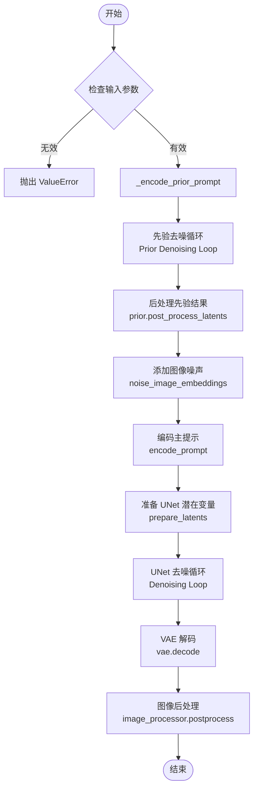
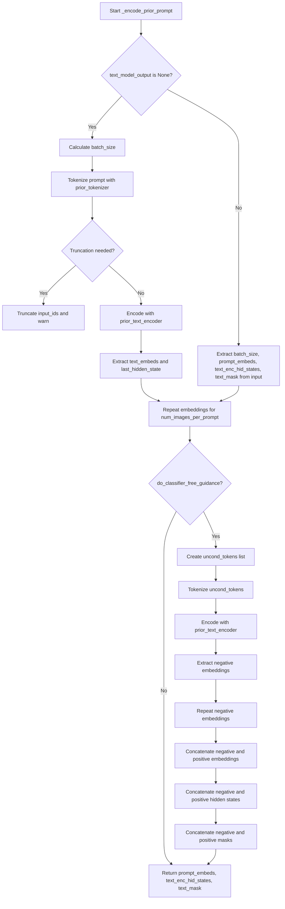
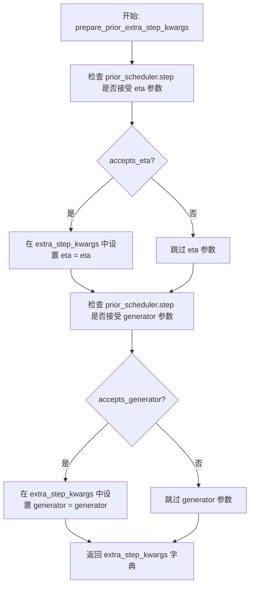
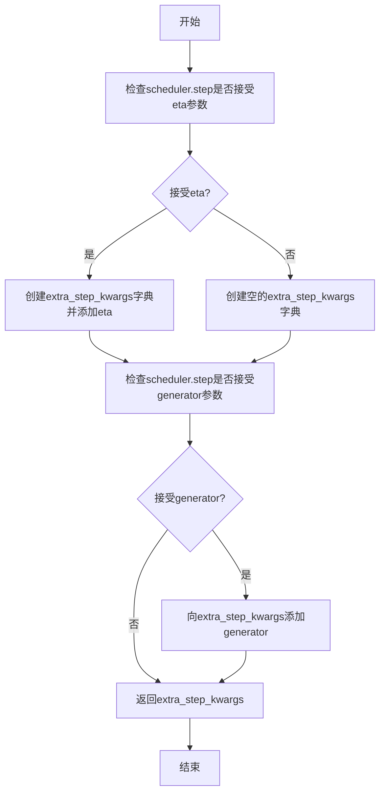
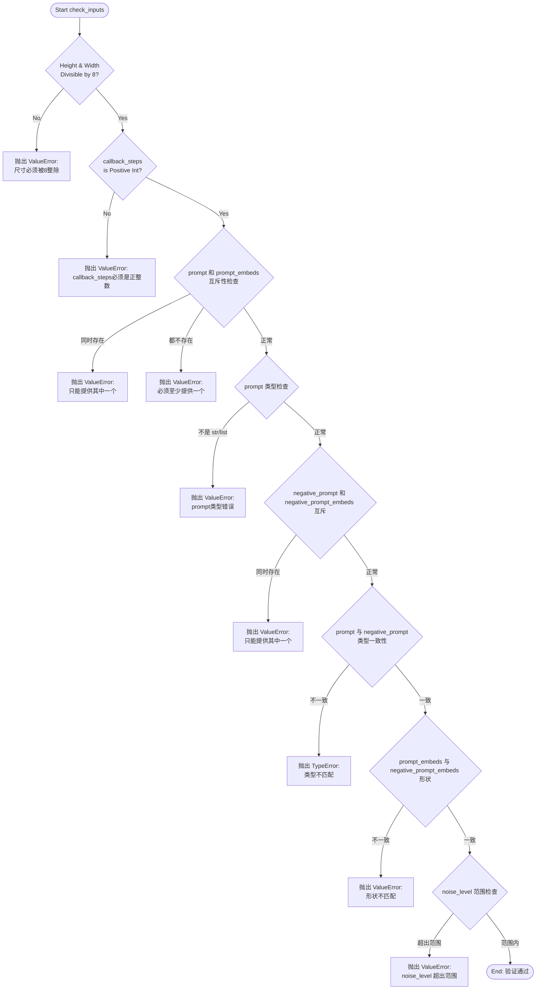
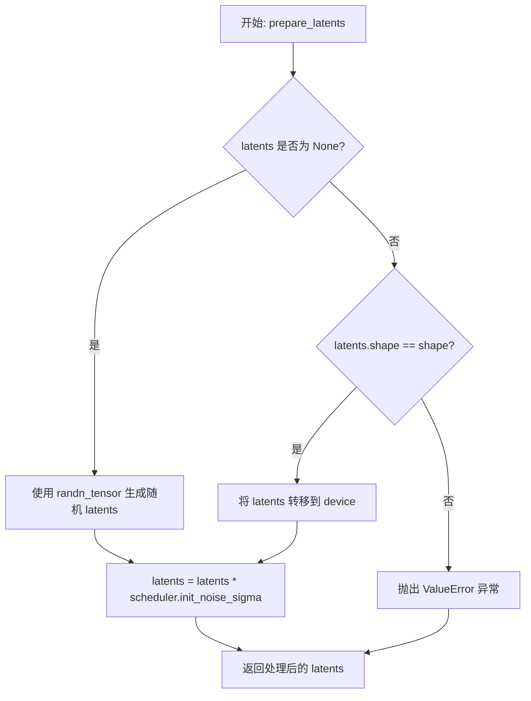
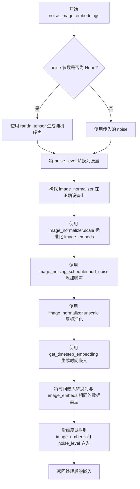
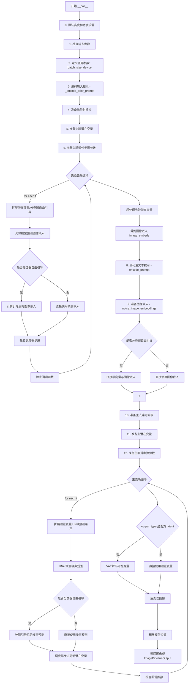

# `diffusers\src\diffusers\pipelines\stable_diffusion\pipeline_stable_unclip.py` 详细设计文档

这是一个基于扩散模型的文本到图像生成管道 (StableUnCLIPPipeline)。它采用两阶段生成策略：首先利用 PriorTransformer 将文本提示编码并生成图像嵌入（先验阶段），随后利用 UNet2DConditionModel 和 AutoencoderKL 对噪声进行去噪并解码为最终图像（解码阶段）。

## 整体流程



## 类结构

```
DiffusionPipeline (抽象基类)
├── StableDiffusionMixin
├── TextualInversionLoaderMixin
├── StableDiffusionLoraLoaderMixin
└── StableUnCLIPPipeline (当前类)
```

## 全局变量及字段


### `logger`
    
模块级日志记录器，用于记录管道运行过程中的信息、警告和错误

类型：`logging.Logger`
    


### `EXAMPLE_DOC_STRING`
    
包含StableUnCLIPPipeline使用示例的文档字符串，提供API调用代码示例

类型：`str`
    


### `XLA_AVAILABLE`
    
标识当前环境是否支持PyTorch XLA的布尔值，用于条件导入和性能优化

类型：`bool`
    


### `StableUnCLIPPipeline.prior_tokenizer`
    
用于先验模型的Tokenizer，负责将文本转换为token序列

类型：`CLIPTokenizer`
    


### `StableUnCLIPPipeline.prior_text_encoder`
    
Frozen先验文本编码器，将token序列编码为文本嵌入向量

类型：`CLIPTextModelWithProjection`
    


### `StableUnCLIPPipeline.prior`
    
将文本嵌入映射为图像嵌入的先验网络，是unCLIP架构的核心组件

类型：`PriorTransformer`
    


### `StableUnCLIPPipeline.prior_scheduler`
    
先验去噪过程的调度器，控制扩散模型的时间步采样

类型：`KarrasDiffusionSchedulers`
    


### `StableUnCLIPPipeline.image_normalizer`
    
图像嵌入的归一化与反归一化处理，确保数值稳定性

类型：`StableUnCLIPImageNormalizer`
    


### `StableUnCLIPPipeline.image_noising_scheduler`
    
控制图像嵌入加噪级别的调度器，调节noise_level参数

类型：`KarrasDiffusionSchedulers`
    


### `StableUnCLIPPipeline.tokenizer`
    
主模型(Decoder)的Tokenizer，处理主阶段文本输入

类型：`CLIPTokenizer`
    


### `StableUnCLIPPipeline.text_encoder`
    
主模型(Decoder)的Frozen文本编码器，生成主阶段文本嵌入

类型：`CLIPTextModel`
    


### `StableUnCLIPPipeline.unet`
    
根据噪声和条件生成图像latent的去噪网络

类型：`UNet2DConditionModel`
    


### `StableUnCLIPPipeline.scheduler`
    
主模型去噪过程的调度器，控制主阶段扩散采样

类型：`KarrasDiffusionSchedulers`
    


### `StableUnCLIPPipeline.vae`
    
将latent编码/解码为图像的变分自编码器，负责生成最终图像

类型：`AutoencoderKL`
    


### `StableUnCLIPPipeline.vae_scale_factor`
    
VAE缩放因子，用于计算图像分辨率和latent空间尺寸

类型：`int`
    


### `StableUnCLIPPipeline.image_processor`
    
处理VAE输出图像的处理器，包括后处理和格式转换

类型：`VaeImageProcessor`
    


### `StableUnCLIPPipeline._exclude_from_cpu_offload`
    
CPU卸载时需排除的组件列表，包含prior和image_normalizer

类型：`list`
    


### `StableUnCLIPPipeline.model_cpu_offload_seq`
    
模型CPU卸载的顺序序列，定义模块卸载优先级

类型：`str`
    
    

## 全局函数及方法


### `StableUnCLIPPipeline.__init__`

该构造函数是 StableUnCLIPPipeline 类的初始化方法，负责接收并注册所有子模型（包括 prior 部分、图像噪声处理部分和常规去噪部分）以及调度器，同时初始化 VAE 缩放因子和图像处理器，为整个文生图流程提供必要的组件支持。

参数：

- `prior_tokenizer`：`CLIPTokenizer`，用于对 prior 部分的文本提示进行编码的 tokenizer
- `prior_text_encoder`：`CLIPTextModelWithProjection`，用于生成 prior 部分文本嵌入的冻结文本编码器
- `prior`：`PriorTransformer`，将文本嵌入近似为图像嵌入的典型 unCLIP prior 模型
- `prior_scheduler`：`KarrasDiffusionSchedulers`，用于 prior 去噪过程的调度器
- `image_normalizer`：`StableUnCLIPImageNormalizer`，用于在噪声应用前后对预测的图像嵌入进行归一化和反归一化
- `image_noising_scheduler`：`KarrasDiffusionSchedulers`，用于向预测图像嵌入添加噪声的噪声调度器，噪声量由 `noise_level` 决定
- `tokenizer`：`CLIPTokenizer`，用于对常规去噪部分文本提示进行编码的 tokenizer
- `text_encoder`：`CLIPTextModel`，用于生成常规去噪部分文本嵌入的冻结文本编码器
- `unet`：`UNet2DConditionModel`，用于对编码后的图像潜在表示进行去噪的 UNet 模型
- `scheduler`：`KarrasDiffusionSchedulers`，与 `unet` 配合使用对编码后的图像潜在表示进行去噪的调度器
- `vae`：`AutoencoderKL`，变分自编码器模型，用于在潜在表示和图像之间进行编码和解码

返回值：无（构造函数不返回任何值）

#### 流程图

```mermaid
flowchart TD
    A[开始 __init__] --> B[调用父类 DiffusionPipeline 的 __init__]
    B --> C[调用 self.register_modules 注册所有子模块]
    C --> D{检查 vae 是否存在}
    D -->|是| E[计算 vae_scale_factor = 2^(len(vae.config.block_out_channels) - 1)]
    D -->|否| F[设置 vae_scale_factor = 8]
    E --> G[创建 VaeImageProcessor 实例]
    F --> G
    G --> H[结束 __init__]
```

#### 带注释源码

```python
def __init__(
    self,
    # prior components - prior 部分的组件
    prior_tokenizer: CLIPTokenizer,           # 用于 prior 的 tokenizer
    prior_text_encoder: CLIPTextModelWithProjection,  # prior 文本编码器
    prior: PriorTransformer,                  # prior 转换器模型
    prior_scheduler: KarrasDiffusionSchedulers,  # prior 调度器
    # image noising components - 图像噪声处理组件
    image_normalizer: StableUnCLIPImageNormalizer,  # 图像嵌入归一化器
    image_noising_scheduler: KarrasDiffusionSchedulers,  # 图像噪声调度器
    # regular denoising components - 常规去噪组件
    tokenizer: CLIPTokenizer,                # 主 tokenizer
    text_encoder: CLIPTextModel,              # 主文本编码器
    unet: UNet2DConditionModel,               # UNet 去噪模型
    scheduler: KarrasDiffusionSchedulers,     # 主调度器
    # vae
    vae: AutoencoderKL,                       # VAE 编解码模型
):
    # 调用父类 DiffusionPipeline 的初始化方法
    super().__init__()

    # 注册所有子模块，使这些组件可以被 pipeline 管理
    # 包括保存引用、配置同步等功能
    self.register_modules(
        prior_tokenizer=prior_tokenizer,
        prior_text_encoder=prior_text_encoder,
        prior=prior,
        prior_scheduler=prior_scheduler,
        image_normalizer=image_normalizer,
        image_noising_scheduler=image_noising_scheduler,
        tokenizer=tokenizer,
        text_encoder=text_encoder,
        unet=unet,
        scheduler=scheduler,
        vae=vae,
    )

    # 计算 VAE 缩放因子，用于潜在空间的缩放
    # 基于 VAE 的 block_out_channels 深度计算，通常为 2^(depth-1)
    # 如果 vae 不存在，则默认为 8
    self.vae_scale_factor = 2 ** (len(self.vae.config.block_out_channels) - 1) if getattr(self, "vae", None) else 8
    
    # 创建图像后处理器，用于将 VAE 输出转换为最终图像格式
    self.image_processor = VaeImageProcessor(vae_scale_factor=self.vae_scale_factor)
```


### `StableUnCLIPPipeline._encode_prior_prompt`

该方法负责将文本提示（prompt）编码为先验阶段（prior stage）所需的文本嵌入向量（text embeddings）和隐藏状态（hidden states）。它首先检查是否需要重新编码或复用已有的编码结果，然后处理批量生成和Classifier-Free Guidance（CFG）的相关逻辑，最终返回包含条件 embedding 和非条件 embedding 的元组。

参数：

-  `prompt`：`str | list[str]`，需要编码的文本提示，可以是单个字符串或字符串列表。
-  `device`：`torch.device`，执行编码的设备（如 CUDA 或 CPU）。
-  `num_images_per_prompt`：`int`，每个提示需要生成的图像数量，用于重复 embeddings 以匹配批量大小。
-  `do_classifier_free_guidance`：`bool`，是否启用无分类器指导（CFG）。若为 True，则会生成负样本（unconditional）embeddings。
-  `text_model_output`：`CLIPTextModelOutput | tuple | None`，可选参数。如果已经计算过 text encoder 的输出，可以直接传入以避免重复计算。
-  `text_attention_mask`：`torch.Tensor | None`，可选参数。传入 `text_model_output` 时需要同步提供的注意力掩码。

返回值：`tuple[torch.Tensor, torch.Tensor, torch.Tensor]`，返回一个元组，包含：
1.  `prompt_embeds`：编码后的提示 embeddings，形状为 `(batch_size * num_images_per_prompt, embed_dim)`。
2.  `text_enc_hid_states`：Text Encoder 的最后一层隐藏状态，形状为 `(batch_size * num_images_per_prompt, seq_len, hidden_dim)`。
3.  `text_mask`：用于指示有效 token 的布尔掩码，形状为 `(batch_size * num_images_per_prompt, seq_len)`。

#### 流程图



#### 带注释源码

```python
def _encode_prior_prompt(
    self,
    prompt,
    device,
    num_images_per_prompt,
    do_classifier_free_guidance,
    text_model_output: CLIPTextModelOutput | tuple | None = None,
    text_attention_mask: torch.Tensor | None = None,
):
    # 如果没有传入预计算的 text_model_output，则需要手动编码 prompt
    if text_model_output is None:
        # 确定批次大小：如果 prompt 是列表，则取其长度；否则为 1
        batch_size = len(prompt) if isinstance(prompt, list) else 1
        
        # 1. 使用 prior_tokenizer 对 prompt 进行分词
        text_inputs = self.prior_tokenizer(
            prompt,
            padding="max_length",
            max_length=self.prior_tokenizer.model_max_length,
            truncation=True,
            return_tensors="pt",
        )
        text_input_ids = text_inputs.input_ids
        # 将 attention_mask 转换为布尔值并移到指定设备
        text_mask = text_inputs.attention_mask.bool().to(device)

        # 2. 检查是否发生了截断，并警告用户
        untruncated_ids = self.prior_tokenizer(prompt, padding="longest", return_tensors="pt").input_ids

        if untruncated_ids.shape[-1] >= text_input_ids.shape[-1] and not torch.equal(
            text_input_ids, untruncated_ids
        ):
            removed_text = self.prior_tokenizer.batch_decode(
                untruncated_ids[:, self.prior_tokenizer.model_max_length - 1 : -1]
            )
            logger.warning(
                "The following part of your input was truncated because CLIP can only handle sequences up to"
                f" {self.prior_tokenizer.model_max_length} tokens: {removed_text}"
            )
            # 截断到模型最大长度
            text_input_ids = text_input_ids[:, : self.prior_tokenizer.model_max_length]

        # 3. 使用 prior_text_encoder 编码文本输入
        prior_text_encoder_output = self.prior_text_encoder(text_input_ids.to(device))

        # 提取 text embeddings (包含 projection 输出) 和 最后的隐藏状态
        prompt_embeds = prior_text_encoder_output.text_embeds
        text_enc_hid_states = prior_text_encoder_output.last_hidden_state

    else:
        # 如果传入了 text_model_output，直接复用其中的数据
        batch_size = text_model_output[0].shape[0]
        prompt_embeds, text_enc_hid_states = text_model_output[0], text_model_output[1]
        text_mask = text_attention_mask

    # 4. 根据 num_images_per_prompt 重复 embeddings，以支持每个 prompt 生成多张图
    prompt_embeds = prompt_embeds.repeat_interleave(num_images_per_prompt, dim=0)
    text_enc_hid_states = text_enc_hid_states.repeat_interleave(num_images_per_prompt, dim=0)
    text_mask = text_mask.repeat_interleave(num_images_per_prompt, dim=0)

    # 5. 如果开启 Classifier-Free Guidance (CFG)
    if do_classifier_free_guidance:
        # 创建空字符串作为无条件 (unconditional) prompt
        uncond_tokens = [""] * batch_size

        # 对无条件 prompt 进行分词和编码
        uncond_input = self.prior_tokenizer(
            uncond_tokens,
            padding="max_length",
            max_length=self.prior_tokenizer.model_max_length,
            truncation=True,
            return_tensors="pt",
        )
        uncond_text_mask = uncond_input.attention_mask.bool().to(device)
        
        # 编码无条件输入
        negative_prompt_embeds_prior_text_encoder_output = self.prior_text_encoder(
            uncond_input.input_ids.to(device)
        )

        negative_prompt_embeds = negative_prompt_embeds_prior_text_encoder_output.text_embeds
        uncond_text_enc_hid_states = negative_prompt_embeds_prior_text_encoder_output.last_hidden_state

        # 重复无条件 embeddings 以匹配生成数量
        seq_len = negative_prompt_embeds.shape[1]
        negative_prompt_embeds = negative_prompt_embeds.repeat(1, num_images_per_prompt)
        negative_prompt_embeds = negative_prompt_embeds.view(batch_size * num_images_per_prompt, seq_len)

        seq_len = uncond_text_enc_hid_states.shape[1]
        uncond_text_enc_hid_states = uncond_text_enc_hid_states.repeat(1, num_images_per_prompt, 1)
        uncond_text_enc_hid_states = uncond_text_enc_hid_states.view(
            batch_size * num_images_per_prompt, seq_len, -1
        )
        uncond_text_mask = uncond_text_mask.repeat_interleave(num_images_per_prompt, dim=0)

        # 6. 拼接：将无条件 embeddings (负样本) 放在前面，有条件 embeddings (正样本) 放在后面
        # 这样在后续计算时，可以通过切片区分：[:neg] 是无条件，[neg:] 是有条件
        prompt_embeds = torch.cat([negative_prompt_embeds, prompt_embeds])
        text_enc_hid_states = torch.cat([uncond_text_enc_hid_states, text_enc_hid_states])

        text_mask = torch.cat([uncond_text_mask, text_mask])

    # 返回：embeddings, 隐藏状态, attention mask
    return prompt_embeds, text_enc_hid_states, text_mask
```


### `StableUnCLIPPipeline._encode_prompt`

该方法是StableUnCLIPPipeline中已废弃的提示编码函数，用于将文本提示编码为文本嵌入向量。它通过调用新的`encode_prompt`方法实现功能，但为了向后兼容性，将返回的元组重新拼接为单个张量（负向提示嵌入在前，正向提示嵌入在后）。建议使用`encode_prompt`方法替代。

参数：

- `prompt`：`str | list[str] | None`，要编码的文本提示
- `device`：`torch.device`，torch设备
- `num_images_per_prompt`：`int`，每个提示生成的图像数量
- `do_classifier_free_guidance`：`bool`，是否使用无分类器自由引导
- `negative_prompt`：`str | list[str] | None`，不用于引导图像生成的负面提示
- `prompt_embeds`：`torch.Tensor | None`，预生成的文本嵌入，可用于轻松调整文本输入
- `negative_prompt_embeds`：`torch.Tensor | None`，预生成的负面文本嵌入
- `lora_scale`：`float | None`，如果加载了LoRA层，将应用于文本编码器所有LoRA层的LoRA比例
- `**kwargs`：其他关键字参数

返回值：`torch.Tensor`，拼接后的提示嵌入张量（负向嵌入在前，正向嵌入在后）

#### 流程图

```mermaid
flowchart TD
    A[开始 _encode_prompt] --> B[记录弃用警告]
    B --> C[调用 encode_prompt 方法]
    C --> D[获取返回的元组 prompt_embeds_tuple]
    D --> E[拼接嵌入: torch.cat[prompt_embeds_tuple[1], prompt_embeds_tuple[0]]]
    E --> F[返回拼接后的提示嵌入]
```

#### 带注释源码

```python
def _encode_prompt(
    self,
    prompt,
    device,
    num_images_per_prompt,
    do_classifier_free_guidance,
    negative_prompt=None,
    prompt_embeds: torch.Tensor | None = None,
    negative_prompt_embeds: torch.Tensor | None = None,
    lora_scale: float | None = None,
    **kwargs,
):
    # 记录弃用警告，提示用户使用 encode_prompt 方法替代
    deprecation_message = "`_encode_prompt()` is deprecated and it will be removed in a future version. Use `encode_prompt()` instead. Also, be aware that the output format changed from a concatenated tensor to a tuple."
    deprecate("_encode_prompt()", "1.0.0", deprecation_message, standard_warn=False)

    # 调用新的 encode_prompt 方法获取编码结果
    # encode_prompt 返回一个元组 (negative_prompt_embeds, prompt_embeds)
    prompt_embeds_tuple = self.encode_prompt(
        prompt=prompt,
        device=device,
        num_images_per_prompt=num_images_per_prompt,
        do_classifier_free_guidance=do_classifier_free_guidance,
        negative_prompt=negative_prompt,
        prompt_embeds=prompt_embeds,
        negative_prompt_embeds=negative_prompt_embeds,
        lora_scale=lora_scale,
        **kwargs,
    )

    # 为了向后兼容性，将元组中的嵌入重新拼接
    # 顺序为: [负向嵌入, 正向嵌入]
    # 元组格式: (negative_prompt_embeds, prompt_embeds)
    # 拼接后: [prompt_embeds, negative_prompt_embeds] 实际是 [negative, positive]
    prompt_embeds = torch.cat([prompt_embeds_tuple[1], prompt_embeds_tuple[0]])

    return prompt_embeds
```


### `StableUnCLIPPipeline.encode_prompt`

该方法负责将文本提示编码为文本编码器的隐藏状态（text encoder hidden states），支持LoRA（Low-Rank Adaptation）和Textual Inversion（文本反转）技术。它处理正向提示和负向提示的嵌入生成，并在启用分类器自由引导（Classifier-Free Guidance）时生成无条件嵌入以实现无分类器引导生成。

参数：

- `prompt`：`str | list[str] | None`，要编码的文本提示，可以是单个字符串、字符串列表或None
- `device`：`torch.device`，PyTorch设备，用于指定计算设备
- `num_images_per_prompt`：`int`，每个提示词要生成的图像数量，用于复制嵌入维度
- `do_classifier_free_guidance`：`bool`，是否启用分类器自由引导，值为True时将生成无条件嵌入
- `negative_prompt`：`str | list[str] | None`，不希望出现在生成图像中的负向提示词
- `prompt_embeds`：`torch.Tensor | None`，预生成的正向提示词嵌入，如果提供则跳过从prompt生成
- `negative_prompt_embeds`：`torch.Tensor | None`，预生成的负向提示词嵌入
- `lora_scale`：`float | None`，LoRA缩放因子，用于调整LoRA层的影响权重
- `clip_skip`：`int | None`，从CLIP编码器跳过的层数，用于获取不同层次的表示

返回值：`tuple[torch.Tensor, torch.Tensor]`，返回包含两个张量的元组——第一个是编码后的正向提示词嵌入（prompt_embeds），第二个是负向提示词嵌入（negative_prompt_embeds）

#### 流程图

```mermaid
flowchart TD
    A[开始 encode_prompt] --> B{检查 lora_scale}
    B -->|非None| C[设置 LoRA scale]
    B -->|None| D[跳过 LoRA 调整]
    C --> E{判断 batch_size}
    D --> E
    E -->|prompt 是 str| F[batch_size = 1]
    E -->|prompt 是 list| G[batch_size = len\prompt\]
    E -->|否则| H[batch_size = prompt_embeds.shape[0]]
    F --> I{prompt_embeds is None?}
    G --> I
    H --> I
    I -->|是| J{检查 Textual Inversion}
    J -->|支持| K[maybe_convert_prompt 处理多向量token]
    J -->|不支持| L[跳过处理]
    K --> M[tokenizer 编码 prompt]
    L --> M
    M --> N{检查 use_attention_mask}
    N -->|是| O[使用 attention_mask]
    N -->|否| P[attention_mask = None]
    O --> Q{clip_skip is None?}
    P --> Q
    Q -->|是| R[text_encoder 获取最后一层]
    Q -->|否| S[text_encoder 获取隐藏 states]
    S --> T[根据 clip_skip 选择层]
    T --> U[应用 final_layer_norm]
    R --> V[转换为 prompt_embeds_dtype]
    U --> V
    I -->|否| V
    V --> W{do_classifier_free_guidance 且 negative_prompt_embeds is None?}
    W -->|是| X{检查 negative_prompt}
    W -->|否| Y[跳过负向嵌入生成]
    X -->|None| Z[uncond_tokens = [\] * batch_size]
    X -->|str| AA[uncond_tokens = [negative_prompt\]]
    X -->|list| AB[uncond_tokens = negative_prompt]
    Z --> AC[tokenizer 编码负向 tokens]
    AA --> AC
    AB --> AC
    AC --> AD[text_encoder 生成负向嵌入]
    AD --> AE[负向嵌入转换为设备]
    Y --> AF[返回 tuple\(prompt_embeds, negative_prompt_embeds\)]
    AE --> AF
```

#### 带注释源码

```python
def encode_prompt(
    self,
    prompt,
    device,
    num_images_per_prompt,
    do_classifier_free_guidance,
    negative_prompt=None,
    prompt_embeds: torch.Tensor | None = None,
    negative_prompt_embeds: torch.Tensor | None = None,
    lora_scale: float | None = None,
    clip_skip: int | None = None,
):
    r"""
    Encodes the prompt into text encoder hidden states.
    
    该方法将文本提示编码为文本编码器的隐藏状态向量，支持以下特性：
    1. LoRA (Low-Rank Adaptation) 权重调整
    2. Textual Inversion 多向量token处理
    3. Classifier-Free Guidance (CFG) 无条件嵌入生成
    4. CLIP skip 层选择以获取不同层次的表示
    
    Args:
        prompt: 要编码的提示词，支持字符串或字符串列表
        device: torch设备对象
        num_images_per_prompt: 每个提示词生成的图像数量
        do_classifier_free_guidance: 是否启用无分类器引导
        negative_prompt: 负向提示词，用于引导不想要的特征
        prompt_embeds: 预生成的提示词嵌入，可选
        negative_prompt_embeds: 预生成的负向提示词嵌入，可选
        lora_scale: LoRA缩放因子，用于调整LoRA层的影响
        clip_skip: CLIP编码器跳过的层数，用于获取不同层次的表示
    """
    # 设置LoRA scale，以便text encoder的LoRA函数可以正确访问
    # 如果当前pipeline支持StableDiffusionLoraLoaderMixin，则应用LoRA调整
    if lora_scale is not None and isinstance(self, StableDiffusionLoraLoaderMixin):
        self._lora_scale = lora_scale

        # 动态调整LoRA scale，根据是否使用PEFT后端选择不同方法
        if not USE_PEFT_BACKEND:
            # 非PEFT后端：直接调整text encoder的LoRA scale
            adjust_lora_scale_text_encoder(self.text_encoder, lora_scale)
        else:
            # PEFT后端：使用scale_lora_layers函数
            scale_lora_layers(self.text_encoder, lora_scale)

    # 确定batch size：检查prompt的类型
    # 情况1：prompt是字符串 -> batch_size = 1
    # 情况2：prompt是列表 -> batch_size = 列表长度
    # 情况3：两者都不是（说明传入了prompt_embeds）-> batch_size = prompt_embeds的batch维度
    if prompt is not None and isinstance(prompt, str):
        batch_size = 1
    elif prompt is not None and isinstance(prompt, list):
        batch_size = len(prompt)
    else:
        batch_size = prompt_embeds.shape[0]

    # 如果没有预提供prompt_embeds，则需要从prompt生成
    if prompt_embeds is None:
        # Textual Inversion处理：如果是TextualInversionLoaderMixin，
        # 调用maybe_convert_prompt处理多向量token（一个token对应多个embedding的情况）
        if isinstance(self, TextualInversionLoaderMixin):
            prompt = self.maybe_convert_prompt(prompt, self.tokenizer)

        # 使用tokenizer将prompt编码为token IDs
        text_inputs = self.tokenizer(
            prompt,
            padding="max_length",  # 填充到最大长度
            max_length=self.tokenizer.model_max_length,  # tokenizer的最大长度
            truncation=True,  # 截断超长序列
            return_tensors="pt",  # 返回PyTorch张量
        )
        text_input_ids = text_inputs.input_ids  # token IDs
        # 获取未截断的token IDs用于长度检查
        untruncated_ids = self.tokenizer(prompt, padding="longest", return_tensors="pt").input_ids

        # 检查是否发生了截断，如果是则记录警告
        if untruncated_ids.shape[-1] >= text_input_ids.shape[-1] and not torch.equal(
            text_input_ids, untruncated_ids
        ):
            removed_text = self.tokenizer.batch_decode(
                untruncated_ids[:, self.tokenizer.model_max_length - 1 : -1]
            )
            logger.warning(
                "The following part of your input was truncated because CLIP can only handle sequences up to"
                f" {self.tokenizer.model_max_length} tokens: {removed_text}"
            )

        # 检查text_encoder配置是否支持attention_mask
        if hasattr(self.text_encoder.config, "use_attention_mask") and self.text_encoder.config.use_attention_mask:
            attention_mask = text_inputs.attention_mask.to(device)
        else:
            attention_mask = None

        # 根据clip_skip参数决定如何获取prompt embeddings
        if clip_skip is None:
            # 不跳过：直接获取最后一层的输出
            prompt_embeds = self.text_encoder(text_input_ids.to(device), attention_mask=attention_mask)
            prompt_embeds = prompt_embeds[0]  # 获取hidden states
        else:
            # 跳过层：获取所有隐藏状态，然后索引到目标层
            prompt_embeds = self.text_encoder(
                text_input_ids.to(device), attention_mask=attention_mask, output_hidden_states=True
            )
            # hidden_states是一个元组，包含所有encoder层的输出
            # index: 0是embedding层, 1~N是encoder层, 最后一个是最终层
            # clip_skip=1表示使用倒数第二层（pre-final layer）
            prompt_embeds = prompt_embeds[-1][-(clip_skip + 1)]
            # 应用final_layer_norm以确保表示正确（因为跳过了最后一层）
            prompt_embeds = self.text_encoder.text_model.final_layer_norm(prompt_embeds)

    # 确定prompt_embeds的数据类型，优先使用text_encoder的dtype
    if self.text_encoder is not None:
        prompt_embeds_dtype = self.text_encoder.dtype
    elif self.unet is not None:
        prompt_embeds_dtype = self.unet.dtype
    else:
        prompt_embeds_dtype = prompt_embeds.dtype

    # 将prompt_embeds转换到正确的设备和dtype
    prompt_embeds = prompt_embeds.to(dtype=prompt_embeds_dtype, device=device)

    # 复制embeddings以匹配每个prompt生成的图像数量
    # 这是为了让每个生成的图像都有对应的文本条件
    bs_embed, seq_len, _ = prompt_embeds.shape
    prompt_embeds = prompt_embeds.repeat(1, num_images_per_prompt, 1)
    prompt_embeds = prompt_embeds.view(bs_embed * num_images_per_prompt, seq_len, -1)

    # 如果启用CFG且没有提供negative_prompt_embeds，则需要生成无条件嵌入
    if do_classifier_free_guidance and negative_prompt_embeds is None:
        # 处理negative_prompt的类型检查和验证
        uncond_tokens: list[str]
        if negative_prompt is None:
            # 如果没有负向prompt，使用空字符串
            uncond_tokens = [""] * batch_size
        elif prompt is not None and type(prompt) is not type(negative_prompt):
            raise TypeError(
                f"`negative_prompt` should be the same type to `prompt`, but got {type(negative_prompt)} !="
                f" {type(prompt)}."
            )
        elif isinstance(negative_prompt, str):
            uncond_tokens = [negative_prompt]
        elif batch_size != len(negative_prompt):
            raise ValueError(
                f"`negative_prompt`: {negative_prompt} has batch size {len(negative_prompt)}, but `prompt`:"
                f" {prompt} has batch size {batch_size}. Please make sure that passed `negative_prompt` matches"
                " the batch size of `prompt`."
            )
        else:
            uncond_tokens = negative_prompt

        # 对负向prompt也进行Textual Inversion处理（如有必要）
        if isinstance(self, TextualInversionLoaderMixin):
            uncond_tokens = self.maybe_convert_prompt(uncond_tokens, self.tokenizer)

        # 使用与prompt_embeds相同的长度进行tokenize
        max_length = prompt_embeds.shape[1]
        uncond_input = self.tokenizer(
            uncond_tokens,
            padding="max_length",
            max_length=max_length,
            truncation=True,
            return_tensors="pt",
        )

        # 处理attention_mask
        if hasattr(self.text_encoder.config, "use_attention_mask") and self.text_encoder.config.use_attention_mask:
            attention_mask = uncond_input.attention_mask.to(device)
        else:
            attention_mask = None

        # 生成负向prompt embeddings
        negative_prompt_embeds = self.text_encoder(
            uncond_input.input_ids.to(device),
            attention_mask=attention_mask,
        )
        negative_prompt_embeds = negative_prompt_embeds[0]

    # 对negative_prompt_embeds进行与prompt_embeds相同的处理
    if do_classifier_free_guidance:
        # 复制embeddings以匹配每个prompt生成的图像数量
        seq_len = negative_prompt_embeds.shape[1]

        negative_prompt_embeds = negative_prompt_embeds.to(dtype=prompt_embeds_dtype, device=device)

        negative_prompt_embeds = negative_prompt_embeds.repeat(1, num_images_per_prompt, 1)
        negative_prompt_embeds = negative_prompt_embeds.view(batch_size * num_images_per_prompt, seq_len, -1)

    # 如果启用了LoRA且使用PEFT后端，需要恢复原始的LoRA scale
    # 通过unscale来获取原始权重
    if self.text_encoder is not None:
        if isinstance(self, StableDiffusionLoraLoaderMixin) and USE_PEFT_BACKEND:
            # 恢复原始scale
            unscale_lora_layers(self.text_encoder, lora_scale)

    # 返回tuple: (prompt_embeds, negative_prompt_embeds)
    return prompt_embeds, negative_prompt_embeds
```


### StableUnCLIPPipeline.decode_latents

该方法已废弃，用于将latents解码为图像。它通过VAE模型将潜在表示解码为图像，并对像素值进行归一化处理后转换为NumPy数组返回。

参数：

- `latents`：`torch.Tensor`，待解码的潜在表示张量，通常来自扩散模型的输出

返回值：`np.ndarray`，解码后的图像，形状为(batch_size, height, width, channels)，像素值范围[0, 1]

#### 流程图

```mermaid
flowchart TD
    A[开始 decode_latents] --> B[显示废弃警告]
    B --> C[缩放latents: latents = 1/scaling_factor * latents]
    C --> D[VAE解码: image = vae.decode(latents)]
    D --> E[像素值归一化: image = (image/2 + 0.5).clamp(0, 1)]
    E --> F[转换为numpy: image.cpu().permute(0, 2, 3, 1).float().numpy()]
    F --> G[返回图像数组]
```

#### 带注释源码

```python
def decode_latents(self, latents):
    """
    解码latents为图像（已废弃）
    
    该方法已被废弃，建议使用 VaeImageProcessor.postprocess(...) 替代。
    它通过VAE将潜在表示解码为图像，并转换为numpy数组格式。
    """
    # 发出废弃警告，提示用户在1.0.0版本中将移除此方法
    deprecation_message = "The decode_latents method is deprecated and will be removed in 1.0.0. Please use VaeImageProcessor.postprocess(...) instead"
    deprecate("decode_latents", "1.0.0", deprecation_message, standard_warn=False)

    # 使用VAE的缩放因子对latents进行逆缩放
    # VAE在编码时会乘以scaling_factor，解码时需要除以该值
    latents = 1 / self.vae.config.scaling_factor * latents
    
    # 使用VAE解码器将latents解码为图像
    # return_dict=False 返回元组，取第一个元素为图像张量
    image = self.vae.decode(latents, return_dict=False)[0]
    
    # 将图像像素值从[-1, 1]范围转换到[0, 1]范围
    # VAE输出通常在[-1, 1]区间，这里进行归一化处理
    image = (image / 2 + 0.5).clamp(0, 1)
    
    # 将图像从PyTorch张量转换为NumPy数组
    # 1. .cpu() 将张量从GPU移至CPU
    # 2. .permute(0, 2, 3, 1) 将通道维度从CHW转换为HWC格式
    # 3. .float() 转换为float32，避免兼容性问题（bfloat16可能有问题）
    # 4. .numpy() 转换为NumPy数组
    image = image.cpu().permute(0, 2, 3, 1).float().numpy()
    
    # 返回解码后的图像数组
    return image
```


### `StableUnCLIPPipeline.prepare_prior_extra_step_kwargs`

为先验调度器（prior_scheduler）准备额外的关键字参数（extra_step_kwargs），通过检查调度器的 `step` 方法签名，动态决定是否添加 `eta` 和 `generator` 参数，以兼容不同的调度器实现。

参数：

- `self`：`StableUnCLIPPipeline` 实例，当前管道对象
- `generator`：`torch.Generator | None`，用于生成随机数的生成器，用于控制噪声生成的随机性
- `eta`：`float`，DDIM 调度器的 eta 参数，对应 DDIM 论文中的 η 值，取值范围为 [0, 1]

返回值：`dict`，包含额外关键字参数的字典，可能包含 `eta` 和/或 `generator` 键

#### 流程图



#### 带注释源码

```
def prepare_prior_extra_step_kwargs(self, generator, eta):
    # 准备先验调度器的额外参数，因为并非所有先验调度器都有相同的函数签名
    # eta (η) 仅在 DDIMScheduler 中使用，对于其他调度器将被忽略
    # eta 对应 DDIM 论文 (https://huggingface.co/papers/2010.02502) 中的 η
    # 取值应在 [0, 1] 范围内

    # 使用 inspect 模块检查 prior_scheduler.step 方法的签名
    # 判断该调度器是否接受 eta 参数
    accepts_eta = "eta" in set(inspect.signature(self.prior_scheduler.step).parameters.keys())
    
    # 初始化空字典用于存储额外参数
    extra_step_kwargs = {}
    
    # 如果调度器接受 eta 参数，则将其添加到 extra_step_kwargs 中
    if accepts_eta:
        extra_step_kwargs["eta"] = eta

    # 检查 prior_scheduler.step 是否接受 generator 参数
    accepts_generator = "generator" in set(inspect.signature(self.prior_scheduler.step).parameters.keys())
    
    # 如果调度器接受 generator 参数，则将其添加到 extra_step_kwargs 中
    if accepts_generator:
        extra_step_kwargs["generator"] = generator
    
    # 返回包含额外参数的字典，供后续调度器 step 方法使用
    return extra_step_kwargs
```


### `StableUnCLIPPipeline.prepare_extra_step_kwargs`

为主调度器（scheduler）准备额外的参数字典，因为不同的调度器（scheduler）可能有不同的签名。该方法检查调度器的`step`方法是否接受`eta`和`generator`参数，并将这些参数传递给调度器的步进函数。

参数：

- `self`：隐式参数，类方法本身
- `generator`：`torch.Generator | None`，用于控制随机数生成的生成器，用于使生成过程具有确定性
- `eta`：`float`，对应DDIM论文中的η参数，仅在DDIMScheduler中有效，其他调度器会忽略此参数，其值应在[0, 1]之间

返回值：`dict[str, Any]`，包含调度器`step`方法所需额外参数（如`eta`和`generator`）的字典

#### 流程图



#### 带注释源码

```python
def prepare_extra_step_kwargs(self, generator, eta):
    # 准备调度器的额外参数，因为并非所有调度器都有相同的签名
    # eta (η) 仅在 DDIMScheduler 中使用，其他调度器会忽略它
    # eta 对应 DDIM 论文 (https://huggingface.co/papers/2010.02502) 中的 η
    # 取值应在 [0, 1] 范围内
    
    # 通过检查调度器 step 方法的签名参数来判断是否接受 eta 参数
    accepts_eta = "eta" in set(inspect.signature(self.scheduler.step).parameters.keys())
    
    # 初始化额外的参数字典
    extra_step_kwargs = {}
    
    # 如果调度器接受 eta 参数，则将其添加到参数字典中
    if accepts_eta:
        extra_step_kwargs["eta"] = eta

    # 检查调度器是否接受 generator 参数
    accepts_generator = "generator" in set(inspect.signature(self.scheduler.step).parameters.keys())
    
    # 如果调度器接受 generator 参数，则将其添加到参数字典中
    if accepts_generator:
        extra_step_kwargs["generator"] = generator
    
    # 返回包含额外参数的字典，供调度器的 step 方法使用
    return extra_step_kwargs
```


### `StableUnCLIPPipeline.check_inputs`

该方法负责验证 `StableUnCLIPPipeline` 在执行图像生成前的输入参数合法性。它通过一系列断言检查确保 `height` 和 `width` 符合模型要求（能被 8 整除），`callback_steps` 为正整数，`prompt` 与 `prompt_embeds` 互斥且类型正确，以及 `noise_level` 在允许的噪声调度器时间步范围内。如果任何检查失败，该方法会抛出具体的 `ValueError` 或 `TypeError` 以阻止不正确的 Pipeline 执行。

#### 参数

- `self`：实例本身，包含 `image_noising_scheduler` 等配置信息。
- `prompt`：`str | list[str] | None`，需要生成的文本提示词。
- `height`：`int`，生成图像的高度（像素），必须能被 8 整除。
- `width`：`int`，生成图像的宽度（像素），必须能被 8 整除。
- `callback_steps`：`int`，回调函数的调用频率，必须为正整数。
- `noise_level`：`int`，添加到图像嵌入的噪声等级，必须在 `[0, num_train_timesteps)` 范围内。
- `negative_prompt`：`str | list[str] | None`，用于引导图像生成的负面提示词。
- `prompt_embeds`：`torch.Tensor | None`，预计算的文本嵌入，与 `prompt` 互斥。
- `negative_prompt_embeds`：`torch.Tensor | None`，预计算的负面文本嵌入，与 `negative_prompt` 互斥。

#### 返回值

`None`。该方法不返回任何数据，仅通过抛出异常来指示错误。

#### 流程图



#### 带注释源码

```python
def check_inputs(
    self,
    prompt,
    height,
    width,
    callback_steps,
    noise_level,
    negative_prompt=None,
    prompt_embeds=None,
    negative_prompt_embeds=None,
):
    # 1. 检查图像尺寸是否满足 VAE 的缩放要求（通常为 8 的倍数）
    if height % 8 != 0 or width % 8 != 0:
        raise ValueError(f"`height` and `width` have to be divisible by 8 but are {height} and {width}.")

    # 2. 检查 callback_steps 是否为有效的正整数
    if (callback_steps is None) or (
        callback_steps is not None and (not isinstance(callback_steps, int) or callback_steps <= 0)
    ):
        raise ValueError(
            f"`callback_steps` has to be a positive integer but is {callback_steps} of type"
            f" {type(callback_steps)}."
        )

    # 3. 检查 prompt 和 prompt_embeds 的互斥关系：不能同时提供
    if prompt is not None and prompt_embeds is not None:
        raise ValueError(
            "Provide either `prompt` or `prompt_embeds`. Please make sure to define only one of the two."
        )

    # 4. 至少需要提供 prompt 或 prompt_embeds 之一
    if prompt is None and prompt_embeds is None:
        raise ValueError(
            "Provide either `prompt` or `prompt_embeds`. Cannot leave both `prompt` and `prompt_embeds` undefined."
        )

    # 5. 验证 prompt 的数据类型是否合法
    if prompt is not None and (not isinstance(prompt, str) and not isinstance(prompt, list)):
        raise ValueError(f"`prompt` has to be of type `str` or `list` but is {type(prompt)}")

    # 6. 检查 negative_prompt 和 negative_prompt_embeds 的互斥关系
    if negative_prompt is not None and negative_prompt_embeds is not None:
        raise ValueError(
            "Provide either `negative_prompt` or `negative_prompt_embeds`. Cannot leave both `negative_prompt` and `negative_prompt_embeds` undefined."
        )

    # 7. 如果同时提供了 prompt 和 negative_prompt，确保它们的类型一致（str 对 str，list 对 list）
    if prompt is not None and negative_prompt is not None:
        if type(prompt) is not type(negative_prompt):
            raise TypeError(
                f"`negative_prompt` should be the same type to `prompt`, but got {type(negative_prompt)} !="
                f" {type(prompt)}."
            )

    # 8. 如果同时提供了 prompt_embeds 和 negative_prompt_embeds，确保它们的形状完全一致
    if prompt_embeds is not None and negative_prompt_embeds is not None:
        if prompt_embeds.shape != negative_prompt_embeds.shape:
            raise ValueError(
                "`prompt_embeds` and `negative_prompt_embeds` must have the same shape when passed directly, but"
                f" got: `prompt_embeds` {prompt_embeds.shape} != `negative_prompt_embeds`"
                f" {negative_prompt_embeds.shape}."
            )

    # 9. 验证 noise_level 是否在图像嵌入噪声调度器的训练时间步范围内
    if noise_level < 0 or noise_level >= self.image_noising_scheduler.config.num_train_timesteps:
        raise ValueError(
            f"`noise_level` must be between 0 and {self.image_noising_scheduler.config.num_train_timesteps - 1}, inclusive."
        )
```


### `StableUnCLIPPipeline.prepare_latents`

该方法用于初始化或调整潜在向量（latents）的形状与噪声，根据是否已有潜在向量进行不同的处理：若未提供则使用随机张量生成，若已提供则验证形状并转移到目标设备，最后乘以调度器的初始噪声 sigma 进行缩放以适配去噪过程。

参数：

- `shape`：`tuple` 或 `torch.Size`，期望的 latents 形状，用于生成随机噪声或验证已有 latents 的形状
- `dtype`：`torch.dtype`，生成或转换 latents 所使用的数据类型（如 `torch.float32`）
- `device`：`torch.device`，latents 所存放的设备（如 `"cuda"` 或 `"cpu"`）
- `generator`：`torch.Generator` 或 `None`，可选的随机数生成器，用于确保可复现的随机采样
- `latents`：`torch.Tensor` 或 `None`，可选的预生成潜在向量；若为 `None` 则随机生成，否则进行验证和转移
- `scheduler`：`KarrasDiffusionSchedulers`，扩散调度器对象，用于获取初始噪声缩放因子 `init_noise_sigma`

返回值：`torch.Tensor`，处理并缩放后的 latents 张量，可直接用于后续的去噪推理过程

#### 流程图



#### 带注释源码

```python
def prepare_latents(self, shape, dtype, device, generator, latents, scheduler):
    """
    准备潜在向量（latents）：初始化或调整形状与噪声
    
    参数:
        shape: 期望的 latents 形状元组
        dtype: torch 数据类型
        device: torch 设备
        generator: 可选的随机数生成器
        latents: 可选的预生成 latents
        scheduler: 扩散调度器，用于获取 init_noise_sigma
    
    返回:
        处理后的 latents 张量
    """
    # 如果未提供 latents，则使用 randn_tensor 生成随机噪声张量
    # 使用 generator 确保可复现性（如需）
    if latents is None:
        latents = randn_tensor(shape, generator=generator, device=device, dtype=dtype)
    else:
        # 验证已有 latents 的形状是否与期望形状匹配
        if latents.shape != shape:
            raise ValueError(f"Unexpected latents shape, got {latents.shape}, expected {shape}")
        # 将 latents 转移到指定设备
        latents = latents.to(device)

    # 使用调度器的初始噪声 sigma 对 latents 进行缩放
    # 这确保 latents 与扩散过程的噪声水平一致
    latents = latents * scheduler.init_noise_sigma
    return latents
```


### `StableUnCLIPPipeline.noise_image_embeddings`

该方法根据 `noise_level` 向图像嵌入添加可控噪声，并通过正弦时间嵌入将噪声级别信息编码到输出中，支持通过 `generator` 实现可重复的噪声生成。

参数：

- `self`：`StableUnCLIPPipeline` 类的实例隐式参数
- `image_embeds`：`torch.Tensor`，待添加噪声的图像嵌入张量
- `noise_level`：`int`，噪声等级，控制添加的噪声量，值越大最终去噪图像的方差越大
- `noise`：`torch.Tensor | None`，可选的预生成噪声张量，如果为 `None` 则自动生成随机噪声
- `generator`：`torch.Generator | None`，可选的随机数生成器，用于确保噪声生成的可重复性

返回值：`torch.Tensor`，添加噪声和时间嵌入后的图像嵌入张量

#### 流程图



#### 带注释源码

```python
def noise_image_embeddings(
    self,
    image_embeds: torch.Tensor,
    noise_level: int,
    noise: torch.Tensor | None = None,
    generator: torch.Generator | None = None,
):
    """
    Add noise to the image embeddings. The amount of noise is controlled by a `noise_level` input. A higher
    `noise_level` increases the variance in the final un-noised images.

    The noise is applied in two ways:
    1. A noise schedule is applied directly to the embeddings.
    2. A vector of sinusoidal time embeddings are appended to the output.

    In both cases, the amount of noise is controlled by the same `noise_level`.

    The embeddings are normalized before the noise is applied and un-normalized after the noise is applied.
    """
    # 如果未提供噪声，则根据图像嵌入的形状、设备和数据类型生成随机噪声张量
    if noise is None:
        noise = randn_tensor(
            image_embeds.shape, generator=generator, device=image_embeds.device, dtype=image_embeds.dtype
        )

    # 将噪声等级转换为与批量大小匹配的 PyTorch 张量，并移至正确设备
    noise_level = torch.tensor([noise_level] * image_embeds.shape[0], device=image_embeds.device)

    # 确保归一化器位于正确的设备上（可能从 CPU 移至 GPU）
    self.image_normalizer.to(image_embeds.device)
    # 对图像嵌入进行归一化（缩放）
    image_embeds = self.image_normalizer.scale(image_embeds)

    # 使用噪声调度器根据噪声等级向嵌入添加噪声
    image_embeds = self.image_noising_scheduler.add_noise(image_embeds, timesteps=noise_level, noise=noise)

    # 对添加噪声后的嵌入进行反归一化（取消缩放）
    image_embeds = self.image_normalizer.unscale(image_embeds)

    # 生成噪声等级的正弦时间嵌入，用于后续去噪过程的时间步编码
    noise_level = get_timestep_embedding(
        timesteps=noise_level, embedding_dim=image_embeds.shape[-1], flip_sin_to_cos=True, downscale_freq_shift=0
    )

    # `get_timestep_embeddings` 返回 f32 张量，但实际可能运行在 fp16 模式下
    # 因此需要在这里进行类型转换
    # 可能存在更好的封装方式
    noise_level = noise_level.to(image_embeds.dtype)

    # 将处理后的嵌入与噪声等级的时间嵌入沿维度1拼接
    # 拼接后的张量包含原始图像特征和时间步信息
    image_embeds = torch.cat((image_embeds, noise_level), 1)

    return image_embeds
```


### `StableUnCLIPPipeline.__call__`

管道执行入口，整合先验生成（从文本到图像嵌入）、噪声处理（对图像嵌入添加可控噪声）和主去噪流程（UNet条件去噪），最终通过VAE解码输出图像。

参数：

- `prompt`：`str | list[str] | None`，用于引导图像生成的文本提示，若未定义则需传递`prompt_embeds`
- `height`：`int | None`，生成图像的高度（像素），默认为`self.unet.config.sample_size * self.vae_scale_factor`
- `width`：`int | None`，生成图像的宽度（像素），默认为`self.unet.config.sample_size * self.vae_scale_factor`
- `num_inference_steps`：`int`，主去噪过程的去噪步数，默认为20
- `guidance_scale`：`float`，引导尺度值，用于控制图像与文本提示的相关性，默认为10.0
- `negative_prompt`：`str | list[str] | None`，引导不包含内容的提示，仅在`guidance_scale > 1`时生效
- `num_images_per_prompt`：`int`，每个提示生成的图像数量，默认为1
- `eta`：`float`，DDIM论文中的η参数，仅对DDIMScheduler有效，默认为0.0
- `generator`：`torch.Generator | None`，用于生成确定性结果的随机数生成器
- `latents`：`torch.Tensor | None`，预生成的噪声潜在向量，用于图像生成
- `prompt_embeds`：`torch.Tensor | None`，预生成的文本嵌入，用于轻松调整文本输入
- `negative_prompt_embeds`：`torch.Tensor | None`，预生成的负面文本嵌入
- `output_type`：`str | None`，生成图像的输出格式，可选"PIL.Image"或"np.array"，默认为"pil"
- `return_dict`：`bool`，是否返回`ImagePipelineOutput`，默认为True
- `callback`：`Callable[[int, int, torch.Tensor], None] | None`，每步调用的回调函数
- `callback_steps`：`int`，回调函数调用频率，默认为1
- `cross_attention_kwargs`：`dict[str, Any] | None`，传递给AttentionProcessor的参数字典
- `noise_level`：`int`，添加到图像嵌入的噪声量，控制最终去噪图像的方差，默认为0
- `prior_num_inference_steps`：`int`，先验去噪过程的去噪步数，默认为25
- `prior_guidance_scale`：`float`，先验过程的引导尺度值，默认为4.0
- `prior_latents`：`torch.Tensor | None`，先验去噪过程预生成的噪声潜在向量
- `clip_skip`：`int | None`，计算提示嵌入时从CLIP跳过的层数

返回值：`ImagePipelineOutput | tuple`，当`return_dict`为True时返回`ImagePipelineOutput`（包含生成的图像列表），否则返回元组。

#### 流程图



#### 带注释源码

```python
@torch.no_grad()
@replace_example_docstring(EXAMPLE_DOC_STRING)
def __call__(
    self,
    # 常规去噪过程参数
    prompt: str | list[str] | None = None,
    height: int | None = None,
    width: int | None = None,
    num_inference_steps: int = 20,
    guidance_scale: float = 10.0,
    negative_prompt: str | list[str] | None = None,
    num_images_per_prompt: int | None = 1,
    eta: float = 0.0,
    generator: torch.Generator | None = None,
    latents: torch.Tensor | None = None,
    prompt_embeds: torch.Tensor | None = None,
    negative_prompt_embeds: torch.Tensor | None = None,
    output_type: str | None = "pil",
    return_dict: bool = True,
    callback: Callable[[int, int, torch.Tensor], None] | None = None,
    callback_steps: int = 1,
    cross_attention_kwargs: dict[str, Any] | None = None,
    noise_level: int = 0,
    # 先验参数
    prior_num_inference_steps: int = 25,
    prior_guidance_scale: float = 4.0,
    prior_latents: torch.Tensor | None = None,
    clip_skip: int | None = None,
):
    """
    管道生成调用的主函数。
    
    执行流程概述:
    1. 设置默认图像尺寸
    2. 验证输入参数
    3. 编码文本提示到先验嵌入
    4. 执行先验去噪循环(文本->图像嵌入)
    5. 对图像嵌入添加噪声
    6. 执行主去噪循环(潜在变量去噪)
    7. VAE解码生成最终图像
    """
    # 0. 默认高度和宽度设置为UNet配置值
    height = height or self.unet.config.sample_size * self.vae_scale_factor
    width = width or self.unet.config.sample_size * self.vae_scale_factor

    # 1. 检查输入参数合法性，抛出错误则不继续执行
    self.check_inputs(
        prompt=prompt,
        height=height,
        width=width,
        callback_steps=callback_steps,
        noise_level=noise_level,
        negative_prompt=negative_prompt,
        prompt_embeds=prompt_embeds,
        negative_prompt_embeds=negative_prompt_embeds,
    )

    # 2. 定义调用参数: 批大小、设备、执行设备
    if prompt is not None and isinstance(prompt, str):
        batch_size = 1
    elif prompt is not None and isinstance(prompt, list):
        batch_size = len(prompt)
    else:
        batch_size = prompt_embeds.shape[0]

    # 每个提示生成多张图像时，批大小需要乘以数量
    batch_size = batch_size * num_images_per_prompt

    device = self._execution_device

    # 先验分类器自由引导标志
    prior_do_classifier_free_guidance = prior_guidance_scale > 1.0

    # 3. 编码输入提示 - 生成先验文本嵌入和隐藏状态
    prior_prompt_embeds, prior_text_encoder_hidden_states, prior_text_mask = self._encode_prior_prompt(
        prompt=prompt,
        device=device,
        num_images_per_prompt=num_images_per_prompt,
        do_classifier_free_guidance=prior_do_classifier_free_guidance,
    )

    # 4. 准备先验时间步 - 设置调度器的去噪步骤
    self.prior_scheduler.set_timesteps(prior_num_inference_steps, device=device)
    prior_timesteps_tensor = self.prior_scheduler.timesteps

    # 5. 准备先验潜在变量 - 初始化噪声潜在向量
    embedding_dim = self.prior.config.embedding_dim
    prior_latents = self.prepare_latents(
        (batch_size, embedding_dim),
        prior_prompt_embeds.dtype,
        device,
        generator,
        prior_latents,
        self.prior_scheduler,
    )

    # 6. 准备先验额外步骤参数 - 处理不同调度器的兼容性
    prior_extra_step_kwargs = self.prepare_prior_extra_step_kwargs(generator, eta)

    # 7. 先验去噪循环 - 从文本嵌入生成图像嵌入
    for i, t in enumerate(self.progress_bar(prior_timesteps_tensor)):
        # 分类器自由引导时扩展潜在变量
        latent_model_input = torch.cat([prior_latents] * 2) if prior_do_classifier_free_guidance else prior_latents
        latent_model_input = self.prior_scheduler.scale_model_input(latent_model_input, t)

        # 先验模型预测图像嵌入
        predicted_image_embedding = self.prior(
            latent_model_input,
            timestep=t,
            proj_embedding=prior_prompt_embeds,
            encoder_hidden_states=prior_text_encoder_hidden_states,
            attention_mask=prior_text_mask,
        ).predicted_image_embedding

        # 应用先验分类器自由引导
        if prior_do_classifier_free_guidance:
            predicted_image_embedding_uncond, predicted_image_embedding_text = predicted_image_embedding.chunk(2)
            predicted_image_embedding = predicted_image_embedding_uncond + prior_guidance_scale * (
                predicted_image_embedding_text - predicted_image_embedding_uncond
            )

        # 先验调度器步进更新
        prior_latents = self.prior_scheduler.step(
            predicted_image_embedding,
            timestep=t,
            sample=prior_latents,
            **prior_extra_step_kwargs,
            return_dict=False,
        )[0]

        # 执行回调函数
        if callback is not None and i % callback_steps == 0:
            callback(i, t, prior_latents)

    # 后处理先验潜在变量
    prior_latents = self.prior.post_process_latents(prior_latents)

    # 图像嵌入 = 先验输出
    image_embeds = prior_latents

    # 主去噪的分类器自由引导标志
    do_classifier_free_guidance = guidance_scale > 1.0

    # 8. 编码主输入提示 - 生成主文本嵌入
    text_encoder_lora_scale = (
        cross_attention_kwargs.get("scale", None) if cross_attention_kwargs is not None else None
    )
    prompt_embeds, negative_prompt_embeds = self.encode_prompt(
        prompt=prompt,
        device=device,
        num_images_per_prompt=num_images_per_prompt,
        do_classifier_free_guidance=do_classifier_free_guidance,
        negative_prompt=negative_prompt,
        prompt_embeds=prompt_embeds,
        negative_prompt_embeds=negative_prompt_embeds,
        lora_scale=text_encoder_lora_scale,
        clip_skip=clip_skip,
    )
    
    # 分类器自由引导时拼接无条件嵌入和有条件嵌入
    if do_classifier_free_guidance:
        prompt_embeds = torch.cat([negative_prompt_embeds, prompt_embeds])

    # 9. 准备图像嵌入 - 对图像嵌入添加噪声
    image_embeds = self.noise_image_embeddings(
        image_embeds=image_embeds,
        noise_level=noise_level,
        generator=generator,
    )

    # 为分类器自由引导准备负向图像嵌入
    if do_classifier_free_guidance:
        negative_prompt_embeds = torch.zeros_like(image_embeds)
        # 拼接用于双次前向传播
        image_embeds = torch.cat([negative_prompt_embeds, image_embeds])

    # 10. 准备主去噪时间步
    self.scheduler.set_timesteps(num_inference_steps, device=device)
    timesteps = self.scheduler.timesteps

    # 11. 准备主潜在变量 - 初始化UNet输入潜在向量
    num_channels_latents = self.unet.config.in_channels
    shape = (
        batch_size,
        num_channels_latents,
        int(height) // self.vae_scale_factor,
        int(width) // self.vae_scale_factor,
    )
    latents = self.prepare_latents(
        shape=shape,
        dtype=prompt_embeds.dtype,
        device=device,
        generator=generator,
        latents=latents,
        scheduler=self.scheduler,
    )

    # 12. 准备主额外步骤参数
    extra_step_kwargs = self.prepare_extra_step_kwargs(generator, eta)

    # 13. 主去噪循环 - 使用UNet去噪潜在变量
    for i, t in enumerate(self.progress_bar(timesteps)):
        # 扩展潜在变量用于分类器自由引导
        latent_model_input = torch.cat([latents] * 2) if do_classifier_free_guidance else latents
        latent_model_input = self.scheduler.scale_model_input(latent_model_input, t)

        # UNet预测噪声残差
        noise_pred = self.unet(
            latent_model_input,
            t,
            encoder_hidden_states=prompt_embeds,
            class_labels=image_embeds,
            cross_attention_kwargs=cross_attention_kwargs,
            return_dict=False,
        )[0]

        # 执行分类器自由引导
        if do_classifier_free_guidance:
            noise_pred_uncond, noise_pred_text = noise_pred.chunk(2)
            noise_pred = noise_pred_uncond + guidance_scale * (noise_pred_text - noise_pred_uncond)

        # 计算前一时间步的噪声样本 x_t -> x_t-1
        latents = self.scheduler.step(noise_pred, t, latents, **extra_step_kwargs, return_dict=False)[0]

        # 执行回调函数
        if callback is not None and i % callback_steps == 0:
            step_idx = i // getattr(self.scheduler, "order", 1)
            callback(step_idx, t, latents)

        # XLA加速时标记计算步骤
        if XLA_AVAILABLE:
            xm.mark_step()

    # 14. 解码或返回潜在变量
    if not output_type == "latent":
        # VAE解码潜在变量到图像
        image = self.vae.decode(latents / self.vae_config.scaling_factor, return_dict=False)[0]
    else:
        image = latents

    # 后处理图像 - 转换为指定输出格式
    image = self.image_processor.postprocess(image, output_type=output_type)

    # 释放所有模型资源
    self.maybe_free_model_hooks()

    # 15. 返回结果
    if not return_dict:
        return (image,)

    return ImagePipelineOutput(images=image)
```

## 关键组件


### 张量索引与惰性加载

代码中使用多种张量索引操作实现惰性加载和高效内存管理，包括 `repeat_interleave` 用于复制文本嵌入以匹配每提示图像数量，`chunk(2)` 用于分类器自由引导时的条件和非条件分割，以及 `view` 和 `reshape` 操作进行张量维度重塑。

### 反量化支持

通过 `prompt_embeds.to(dtype=prompt_embeds_dtype, device=device)` 实现跨设备类型转换，处理 `text_encoder.dtype`、`unet.dtype` 和 `prompt_embeds.dtype` 之间的兼容性，确保在不同精度（fp16/bf16/fp32）下运行。

### 量化策略

代码通过 `scale_lora_layers` 和 `unscale_lora_layers` 配合 `USE_PEFT_BACKEND` 标志实现LoRA层的动态量化缩放，并通过 `adjust_lora_scale_text_encoder` 处理传统LoRA后端的兼容性问题。

### 双阶段去噪流程

Pipeline采用两阶段生成：先通过PriorTransformer将文本嵌入转换为图像嵌入（prior_num_inference_steps=25），再通过UNet2DConditionModel从噪声图像嵌入生成最终图像（num_inference_steps=20）。

### 图像嵌入噪声处理

`noise_image_embeddings` 方法实现图像嵌入的噪声添加，包含归一化/反归一化处理、时间步嵌入拼接，以及通过 `noise_level` 控制噪声强度。

### 分类器自由引导（CFG）

在prior阶段和UNet阶段均实现了CFG，通过 `torch.cat([uncond, cond])` 拼接批量嵌入实现单次前向传播完成条件和非条件预测。

### 模型卸载策略

通过 `_exclude_from_cpu_offload` 和 `model_cpu_offload_seq` 定义模型卸载顺序（text_encoder->prior_text_encoder->unet->vae），以及 `maybe_free_model_hooks` 实现推理后的内存释放。

### 文本编码与提示处理

提供 `_encode_prior_prompt`（prior文本编码）和 `encode_prompt`（主文本编码）双通道，支持文本反转（TextualInversion）、CLIP层跳过（clip_skip）和LoRA权重调整。

### 调度器兼容性处理

通过 `inspect.signature` 动态检查调度器参数签名，适配不同调度器（DDIM、DDPM等）的 `eta` 和 `generator` 参数差异。

### 回调与进度追踪

支持通过 `callback` 函数和 `callback_steps` 进行推理过程监控，使用 `progress_bar` 展示去噪进度，并支持XLA设备的 `xm.mark_step()` 同步。


## 问题及建议


### 已知问题

-   **代码重复**: `prepare_prior_extra_step_kwargs` 和 `prepare_extra_step_kwargs` 方法几乎完全相同，造成代码冗余
-   **已弃用方法仍存在**: `_encode_prompt` 和 `decode_latents` 方法已被标记为将在 1.0.0 版本移除，但仍在代码中存在
-   **类型检查不一致**: 代码中混合使用了 `isinstance()` 和 `type() is` 两种类型检查方式（如 `type(prompt) is not type(negative_prompt)`），后者在某些情况下可能导致问题
-   **TODO 注释未完成**: 代码中存在 TODO 注释（如模型路径更新、逻辑应移出管道等）但尚未完成
-   **参数数量过多**: `__call__` 方法有超过 20 个参数，导致 API 复杂且难以使用，增加了出错概率
-   **混合类型注解风格**: 同时使用了 `|` 联合类型语法（如 `str | list[str]`）和 `Optional[]` 语法，不够统一
-   **设备管理不一致**: 部分地方使用 `self._execution_device`，部分地方直接使用传入的 `device` 参数

### 优化建议

-   **提取公共逻辑**: 将 `prepare_prior_extra_step_kwargs` 和 `prepare_extra_step_kwargs` 合并为一个通用方法，通过参数区分
-   **移除废弃代码**: 删除 `_encode_prompt` 和 `decode_latents` 方法，或完全迁移到新方法
-   **统一类型检查**: 使用 `isinstance()` 替代 `type() is` 进行类型检查，提高鲁棒性
-   **重构参数设计**: 使用配置对象或数据类封装相关参数，减少 `__call__` 方法的签名复杂度
-   **统一类型注解**: 统一使用 Python 3.10+ 的 `|` 联合类型语法，移除 `Optional[]` 的使用
-   **完善设备管理**: 统一使用设备管理抽象层，确保所有模型操作使用一致的设备选择逻辑
-   **完成 TODO 事项**: 实现 TODO 注释中提到的改进，如模型路径更新、逻辑解耦等

## 其它


### 设计目标与约束

**设计目标**：实现基于stable unCLIP的文本到图像生成管道，支持从文本提示生成高质量图像，同时支持图像嵌入的噪声处理以增加生成多样性。

**主要约束**：
- 模型输入：文本提示（str或list[str]）或预计算的文本嵌入
- 输出分辨率：高度和宽度需能被8整除，默认基于UNet配置和VAE缩放因子计算
- 噪声等级范围：0到image_noising_scheduler.config.num_train_timesteps - 1
- Guidance scale：主流程guidance_scale>1时启用分类器自由引导，prior流程prior_guidance_scale>1时启用
- 多步骤推理：主流程默认20步，prior流程默认25步

### 错误处理与异常设计

**参数验证（check_inputs方法）**：
- height和width必须能被8整除，否则抛出ValueError
- callback_steps必须为正整数，否则抛出ValueError
- prompt和prompt_embeds不能同时存在，否则抛出ValueError
- prompt和prompt_embeds至少存在一个，否则抛出ValueError
- prompt类型必须为str或list，否则抛出ValueError
- negative_prompt和negative_prompt_embeds不能同时存在，否则抛出ValueError
- negative_prompt类型必须与prompt类型一致，否则抛出TypeError
- prompt_embeds和negative_prompt_embeds形状必须一致，否则抛出ValueError
- noise_level必须在有效范围内，否则抛出ValueError

**潜在运行时错误处理**：
- latents形状不匹配时抛出ValueError
- 模型设备不匹配时自动转换
- XLA可用时使用mark_step进行设备同步

### 数据流与状态机

**整体数据流**：
1. 输入验证阶段：check_inputs验证所有输入参数
2. Prior编码阶段：_encode_prior_prompt将文本编码为prior_prompt_embeds
3. Prior去噪循环：对prior_latents进行去噪，生成image_embeds
4. 图像嵌入噪声处理：noise_image_embeddings根据noise_level添加噪声
5. 主流程编码阶段：encode_prompt将文本编码为prompt_embeds
6. 主流程去噪循环：对latents进行去噪，生成最终潜在表示
7. VAE解码阶段：将潜在表示解码为图像
8. 后处理阶段：image_processor.postprocess将图像转换为指定输出格式

**状态管理**：
- scheduler通过set_timesteps设置推理步数
- 每个去噪循环迭代更新latents状态
- 可通过callback机制在每步获取中间状态

### 外部依赖与接口契约

**核心依赖模型**：
- prior_tokenizer：CLIPTokenizer，用于prior文本编码
- prior_text_encoder：CLIPTextModelWithProjection，冻结的prior文本编码器
- PriorTransformer：canonical unCLIP prior，将文本嵌入映射到图像嵌入
- image_normalizer：StableUnCLIPImageNormalizer，用于归一化图像嵌入
- image_noising_scheduler：KarrasDiffusionSchedulers，噪声调度器
- tokenizer：CLIPTokenizer，用于主流程文本编码
- text_encoder：CLIPTextModel，冻结的主流程文本编码器
- UNet2DConditionModel：条件UNet，用于去噪
- scheduler：KarrasDiffusionSchedulers，主流程噪声调度器
- vae：AutoencoderKL，变分自编码器

**工具函数依赖**：
- get_timestep_embedding：生成时间步嵌入
- adjust_lora_scale_text_encoder/scale_lora_layers/unscale_lora_layers：LoRA权重调整
- randn_tensor：随机张量生成
- VaeImageProcessor：图像后处理

### 性能考虑

**计算优化**：
- 使用torch.no_grad()装饰器禁用梯度计算
- 支持XLA设备加速（is_torch_xla_available）
- 支持CPU卸载（model_cpu_offload_seq定义卸载顺序）
- 使用repeat_interleave和repeat进行批处理扩展，比循环更高效

**内存优化**：
- 支持模型CPU卸载以节省GPU显存
- 可通过prompt_embeds预计算避免重复编码
- 回调机制支持内存监控

### 安全性考虑

**模型加载安全**：
- 所有文本编码器和UNet为冻结状态，防止梯度意外更新
- LoRA权重支持动态加载和卸载
- TextualInversion支持安全加载嵌入

**输入验证**：
- 严格验证所有输入参数类型和范围
- 截断处理超出模型最大长度限制的文本输入

### 配置与参数说明

**Pipeline配置参数**：
- vae_scale_factor：基于VAE块输出通道数计算，默认8
- _exclude_from_cpu_offload：CPU卸载时排除的模块列表
- model_cpu_offload_seq：模型卸载顺序定义

**推理参数**：
- num_inference_steps：主流程去噪步数，默认20
- guidance_scale：分类器自由引导权重，默认10.0
- prior_num_inference_steps：prior流程去噪步数，默认25
- prior_guidance_scale：prior流程引导权重，默认4.0
- noise_level：图像嵌入噪声等级，默认0
- clip_skip：CLIP跳过层数，用于隐藏状态获取

### 使用示例

```python
import torch
from diffusers import StableUnCLIPPipeline

# 加载pipeline
pipe = StableUnCLIPPipeline.from_pretrained(
    "fusing/stable-unclip-2-1-l", 
    torch_dtype=torch.float16
)
pipe = pipe.to("cuda")

# 基本生成
prompt = "a photo of an astronaut riding a horse on mars"
images = pipe(prompt).images
images[0].save("astronaut_horse.png")

# 带噪声等级的生成
images = pipe(prompt, noise_level=500).images

# 多图生成
images = pipe(prompt, num_images_per_prompt=4).images

# 自定义推理步数
images = pipe(prompt, num_inference_steps=50, prior_num_inference_steps=50).images

# 负向提示词
images = pipe(prompt, negative_prompt="blurry, low quality").images
```

### 版本历史与兼容性

**版本信息**：
- 当前版本：基于diffusers库
- 解码方法decode_latents已弃用，推荐使用VaeImageProcessor.postprocess
- _encode_prompt已弃用，推荐使用encode_prompt

**向后兼容性**：
- 支持旧版decode_latents方法但会发出警告
- 支持预计算的prompt_embeds和negative_prompt_embeds输入
- 支持预计算的prior_latents和latents输入

### 参考资料

- Stable Diffusion UNCLIP：基于OpenAI的unCLIP方法
- DDIM调度器：https://huggingface.co/papers/2010.02502
- Imagen论文：https://huggingface.co/papers/2205.11487
- CLIP模型：用于文本编码
- Karras Diffusion Schedulers：使用Karras等人提出的噪声调度策略

### 术语表

- **Prior**：将文本嵌入映射到图像嵌入的模型
- **Classifier Free Guidance**：分类器自由引导技术，通过无条件生成引导条件生成
- **VAE**：变分自编码器，用于潜在空间与图像空间的转换
- **LoRA**：低秩适应，用于模型权重的高效微调
- **Textual Inversion**：文本反转技术，用于学习自定义概念嵌入
- **Noise Level**：控制图像嵌入噪声程度的参数
- **Timestep**：去噪过程中的时间步
- **Latent**：潜在空间中的表示

    