# `diffusers\src\diffusers\pipelines\stable_diffusion\pipeline_stable_unclip_img2img.py` 详细设计文档

StableUnCLIPImg2ImgPipeline 是一个用于文本引导的图像到图像生成的管道，基于 stable unCLIP 模型。该管道接收输入图像和文本提示，通过 CLIP 模型编码图像和文本，使用噪声调度器进行去噪过程，最终生成与文本提示相关的新图像。

## 整体流程

```mermaid
graph TD
A[开始: __call__] --> B[检查输入参数 check_inputs]
B --> C[定义调用参数: batch_size, device, guidance_scale]
C --> D[编码文本提示 encode_prompt]
D --> E[编码输入图像 _encode_image]
E --> F[准备时间步 scheduler.set_timesteps]
F --> G[准备潜在变量 prepare_latents]
G --> H[准备额外调度器参数 prepare_extra_step_kwargs]
H --> I{遍历每个时间步}
I ---> J[缩放输入 latent_model_input]
J --> K[UNet预测噪声 noise_pred]
K --> L{是否使用CFG?}
L -- 是 --> M[计算guidance: noise_pred_uncond + guidance_scale * (noise_pred_text - noise_pred_uncond)]
L -- 否 --> N[直接使用noise_pred]
M --> O[调度器步骤: latents = scheduler.step]
N --> O
O --> P[回调函数 callback]
P --> I
I -- 全部完成 --> Q{output_type == 'latent'?}
Q -- 是 --> R[直接返回latents]
Q -- 否 --> S[VAE解码: vae.decode]
S --> T[后处理: image_processor.postprocess]
T --> U[释放模型钩子 maybe_free_model_hooks]
U --> V[结束: 返回ImagePipelineOutput]
```

## 类结构

```
DiffusionPipeline (基类)
├── StableDiffusionMixin (混入类)
├── TextualInversionLoaderMixin (混入类)
├── StableDiffusionLoraLoaderMixin (混入类)
└── StableUnCLIPImg2ImgPipeline
```

## 全局变量及字段


### `XLA_AVAILABLE`
    
标记XLA是否可用

类型：`bool`
    


### `logger`
    
模块日志记录器

类型：`logging.Logger`
    


### `EXAMPLE_DOC_STRING`
    
示例文档字符串

类型：`str`
    


### `StableUnCLIPImg2ImgPipeline.feature_extractor`
    
图像预处理特征提取器

类型：`CLIPImageProcessor`
    


### `StableUnCLIPImg2ImgPipeline.image_encoder`
    
CLIP视觉模型编码图像

类型：`CLIPVisionModelWithProjection`
    


### `StableUnCLIPImg2ImgPipeline.image_normalizer`
    
图像嵌入归一化器

类型：`StableUnCLIPImageNormalizer`
    


### `StableUnCLIPImg2ImgPipeline.image_noising_scheduler`
    
图像噪声调度器

类型：`KarrasDiffusionSchedulers`
    


### `StableUnCLIPImg2ImgPipeline.tokenizer`
    
CLIP分词器

类型：`CLIPTokenizer`
    


### `StableUnCLIPImg2ImgPipeline.text_encoder`
    
CLIP文本编码器

类型：`CLIPTextModel`
    


### `StableUnCLIPImg2ImgPipeline.unet`
    
UNet去噪模型

类型：`UNet2DConditionModel`
    


### `StableUnCLIPImg2ImgPipeline.scheduler`
    
主去噪调度器

类型：`KarrasDiffusionSchedulers`
    


### `StableUnCLIPImg2ImgPipeline.vae`
    
VAE编解码器

类型：`AutoencoderKL`
    


### `StableUnCLIPImg2ImgPipeline.vae_scale_factor`
    
VAE缩放因子

类型：`int`
    


### `StableUnCLIPImg2ImgPipeline.image_processor`
    
图像后处理器

类型：`VaeImageProcessor`
    


### `StableUnCLIPImg2ImgPipeline.model_cpu_offload_seq`
    
CPU卸载顺序

类型：`str`
    


### `StableUnCLIPImg2ImgPipeline._exclude_from_cpu_offload`
    
需排除卸载的组件

类型：`list`
    
    

## 全局函数及方法


### `is_torch_xla_available`

检查当前环境是否安装了 PyTorch XLA (Accelerated Linear Algebra) 库，用于支持 TPU 等硬件加速。该函数是一个工具函数，被 `...utils` 模块导出，在此文件中用于条件性地导入 `torch_xla` 库并设置全局标志。

参数：
- 该函数无参数

返回值：`bool`，如果 PyTorch XLA 可用则返回 `True`，否则返回 `False`

#### 流程图

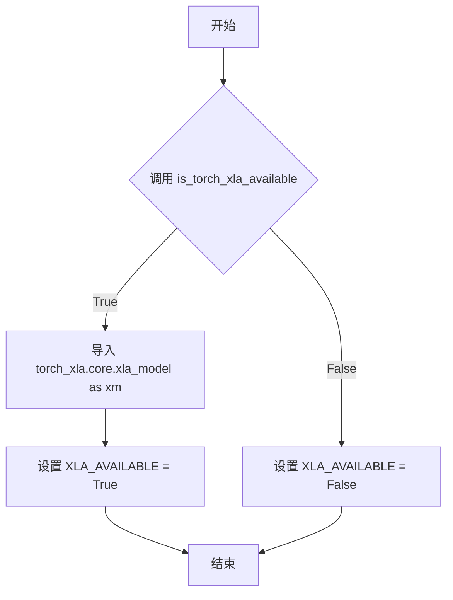

#### 带注释源码

```python
# 从 diffusers 库的 utils 模块导入 is_torch_xla_available 函数
# 该函数用于检查 PyTorch XLA 是否可用
from ...utils import is_torch_xla_available

# 条件检查：尝试导入 torch_xla 并设置全局标志
if is_torch_xla_available():
    # 如果 XLA 可用，导入 torch_xla 的 xla_model 模块
    # 用于后续的 xm.mark_step() 调用（TPU 加速标记）
    import torch_xla.core.xla_model as xm

    # 设置全局标志，表示 XLA 在当前环境中可用
    XLA_AVAILABLE = True
else:
    # XLA 不可用（未安装 torch_xla 或在不支持的平台上）
    XLA_AVAILABLE = False
```

---

**注意**：由于 `is_torch_xla_available` 函数定义在 `diffusers` 库的 `...utils` 模块中，而非当前代码文件内，上述源码是基于该函数在当前文件中的**使用方式**重构的。该函数的完整实现位于 `diffusers/src/diffusers/utils/__init__.py` 或相关 utils 文件中，其核心逻辑通常是尝试导入 `torch_xla` 包并捕获导入异常。


### `logging.get_logger`

获取日志记录器，用于在模块中创建和配置日志记录器实例，以便输出日志信息。

参数：

-  `name`：`str`，日志记录器的名称，通常使用 `__name__` 来表示当前模块

返回值：`logging.Logger`，返回配置好的 Python 标准库日志记录器对象

#### 流程图

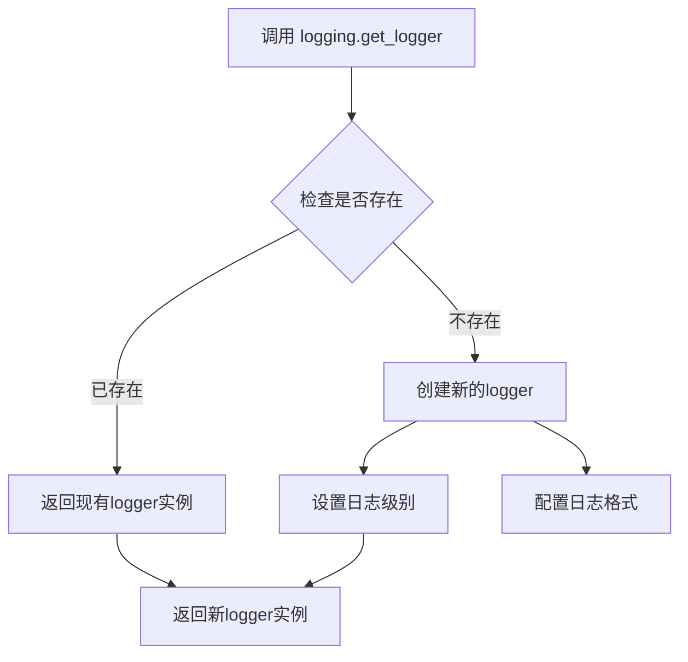

#### 带注释源码

```python
# 从 diffusers.utils 模块导入 logging 对象
from ...utils import (
    USE_PEFT_BACKEND,
    deprecate,
    is_torch_xla_available,
    logging,  # 导入 logging 模块
    replace_example_docstring,
    scale_lora_layers,
    unscale_lora_layers,
)

# 使用 logging.get_logger 获取当前模块的日志记录器
# 参数 __name__ 会自动替换为当前模块的完整路径
# 例如: diffusers.pipelines.stable_diffusion.pipeline_stable_unclip_img2img
logger = logging.get_logger(__name__)  # pylint: disable=invalid-name

# 后续可以在代码中使用 logger 进行日志输出
# logger.warning("The following part of your input was truncated...")
```

#### 备注

- **函数来源**：`diffusers.utils.logging` 模块
- **使用场景**：在 pipelines 中用于输出警告、信息和调试信息
- **日志级别**：默认通常设置为 WARNING 级别，可在需要时调整


### `deprecate`

用于发出弃用警告的实用函数，当代码中使用了已弃用的功能时，会向用户发出警告。

参数：

- `deprecated_name`：`str`，已弃用的函数或方法的名称
- `deprecated_version`：`str`，计划移除该功能的版本号
- `deprecation_message`：`str`，描述弃用原因和替代方案的详细消息
- `standard_warn`：`bool`，是否使用标准警告格式，默认为 `True`
- `stacklevel`：`int`，警告的堆栈层级，默认为 `2`

返回值：`None`，该函数仅用于发出警告，不返回任何值

#### 流程图

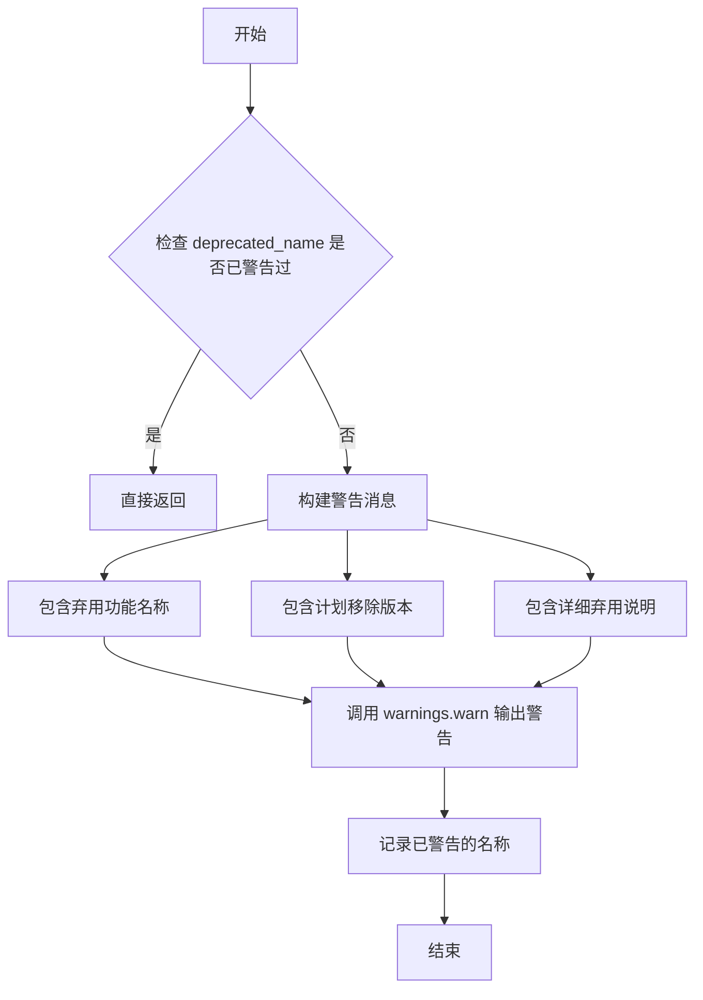

#### 带注释源码

```python
# 注意：此源码基于diffusers库中的deprecate函数实现
# 实际代码位于 src/diffusers/utils/deprecation_utils.py

def deprecate(
    deprecated_name: str,
    deprecated_version: str,
    deprecation_message: str,
    standard_warn: bool = True,
    stacklevel: int = 2,
) -> None:
    """
    发出弃用警告，提醒用户某个功能将在未来版本中被移除。
    
    Args:
        deprecated_name: 已弃用的函数或方法名称
        deprecated_version: 计划移除该功能的版本号
        deprecation_message: 描述弃用原因和替代方案的详细消息
        standard_warn: 是否使用标准警告格式
        stacklevel: 警告的堆栈层级，用于正确显示警告来源
    
    Returns:
        None
    
    Example:
        >>> deprecate("old_method", "2.0.0", "Use new_method() instead")
        # 输出: UserWarning: `old_method` is deprecated and will be removed in version 2.0.0. Use new_method() instead
    """
    # 构建警告消息格式
    warn_message = f"`{deprecated_name}` is deprecated and will be removed in version {deprecated_version}. {deprecation_message}"
    
    # 根据standard_warn参数决定警告格式
    if standard_warn:
        # 使用标准Python warnings模块发出警告
        warnings.warn(warn_message, FutureWarning, stacklevel=stacklevel)
    else:
        # 使用logger记录警告
        logger.warning(warn_message)
```

#### 在代码中的实际调用示例

```python
# 示例1：在 _encode_prompt 方法中调用
def _encode_prompt(self, prompt, device, num_images_per_prompt, ...):
    # 构建弃用消息
    deprecation_message = "`_encode_prompt()` is deprecated and it will be removed in a future version. Use `encode_prompt()` instead. Also, be aware that the output format changed from a concatenated tensor to a tuple."
    
    # 调用 deprecate 函数发出警告
    deprecate("_encode_prompt()", "1.0.0", deprecation_message, standard_warn=False)
    
    # 继续执行替代方法的逻辑
    prompt_embeds_tuple = self.encode_prompt(...)
    ...

# 示例2：在 decode_latents 方法中调用
def decode_latents(self, latents):
    deprecation_message = "The decode_latents method is deprecated and will be removed in 1.0.0. Please use VaeImageProcessor.postprocess(...) instead"
    deprecate("decode_latents", "1.0.0", deprecation_message, standard_warn=False)
    
    # 原有实现逻辑...
    latents = 1 / self.vae.config.scaling_factor * latents
    ...
```


### `randn_tensor`

生成指定形状的随机张量（服从标准正态分布），用于创建噪声或初始化潜在变量。

参数：

- `shape`：`tuple` 或 `int`，输出张量的形状
- `generator`：`torch.Generator`（可选），用于控制随机数生成的生成器，以确保可重复性
- `device`：`torch.device`（可选），生成张量所在的设备
- `dtype`：`torch.dtype`（可选），生成张量的数据类型

返回值：`torch.Tensor`，符合指定形状和属性的随机张量

#### 流程图

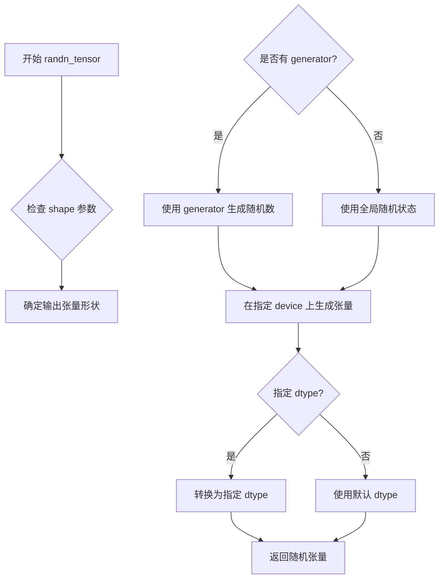

#### 带注释源码

```python
# randn_tensor 函数定义在 diffusers/src/diffusers/utils/torch_utils.py 中
# 以下是基于代码中调用方式的推断实现

def randn_tensor(
    shape: tuple,
    generator: Optional[torch.Generator] = None,
    device: Optional[torch.device] = None,
    dtype: Optional[torch.dtype] = None,
) -> torch.Tensor:
    """
    生成符合标准正态分布的随机张量。
    
    参数:
        shape: 输出张量的形状，例如 (batch_size, channels, height, width)
        generator: 可选的 PyTorch 生成器，用于控制随机性
        device: 可选的设备，用于指定张量存储位置
        dtype: 可选的数据类型，指定张量的数据类型
    
    返回:
        符合标准正态分布的随机张量
    """
    # 如果提供了 generator，使用它生成随机数
    if generator is not None:
        # 从 generator 获取随机状态
        tensor = torch.randn(
            shape, 
            generator=generator, 
            device=device if device is not None else "cpu", 
            dtype=dtype if dtype is not None else torch.float32
        )
    else:
        # 使用全局随机状态
        tensor = torch.randn(
            shape, 
            device=device if device is not None else "cpu", 
            dtype=dtype if dtype is not None else torch.float32
        )
    
    return tensor
```


### `replace_example_docstring`

替换示例文档装饰器（Replace Example Docstring）是一个工具函数，用于自动将示例文档字符串（EXAMPLE_DOC_STRING）添加到被装饰方法的文档中，简化文档编写流程。

参数：

- `docstring`：传入的示例文档字符串

返回值：`Callable`，返回装饰器函数

#### 流程图

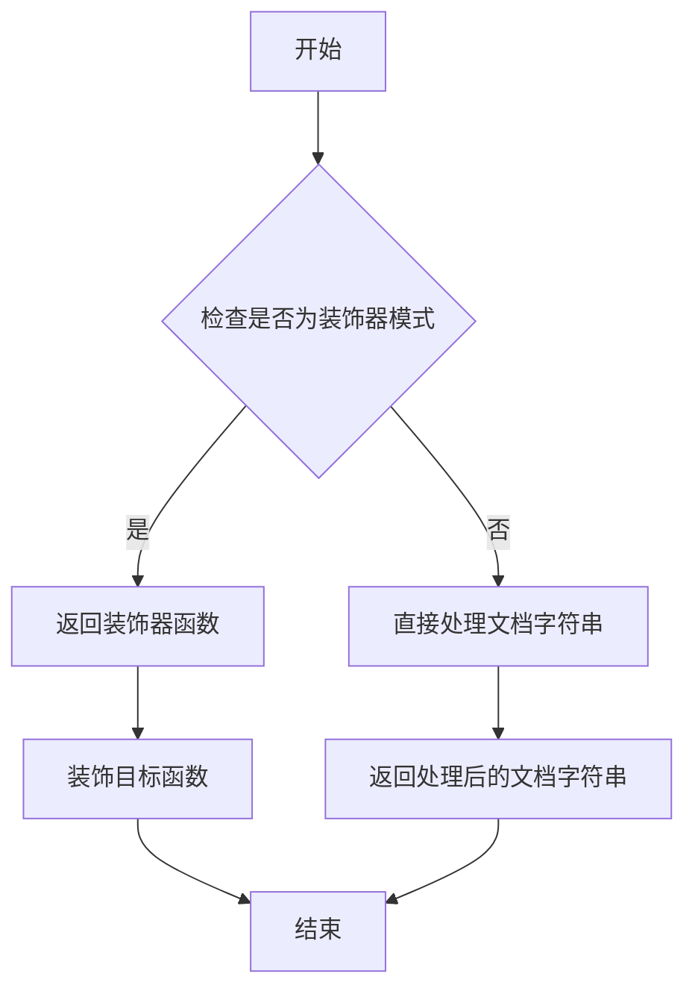

#### 带注释源码

```
# 这是一个从 diffusers.utils 导入的装饰器函数
# 用于将示例文档字符串添加到被装饰方法的 __doc__ 属性中

# 使用方式：
@replace_example_docstring(EXAMPLE_DOC_STRING)
def __call__(self, ...):
    """
    方法的实际文档字符串会被 EXAMPLE_DOC_STRING 替换或补充
    """
    ...

# 源码位置：通常位于 src/diffusers/utils 目录下的相应模块中
# 具体实现可能类似于：
"""
def replace_example_docstring(docstring):
    def decorator(func):
        func.__doc__ = docstring
        return func
    return decorator
"""

# 导入来源
from ...utils import replace_example_docstring

# 使用示例
EXAMPLE_DOC_STRING = """
    Examples:
        ```py
        >>> import requests
        >>> import torch
        >>> from PIL import Image
        >>> from io import BytesIO

        >>> from diffusers import StableUnCLIPImg2ImgPipeline

        >>> pipe = StableUnCLIPImg2ImgPipeline.from_pretrained(
        ...     "stabilityai/stable-diffusion-2-1-unclip-small", torch_dtype=torch.float16
        ... )
        >>> pipe = pipe.to("cuda")

        >>> url = "https://raw.githubusercontent.com/CompVis/stable-diffusion/main/assets/stable-samples/img2img/sketch-mountains-input.jpg"

        >>> response = requests.get(url)
        >>> init_image = Image.open(BytesIO(response.content)).convert("RGB")
        >>> init_image = init_image.resize((768, 512))

        >>> prompt = "A fantasy landscape, trending on artstation"

        >>> images = pipe(init_image, prompt).images
        >>> images[0].save("fantasy_landscape.png")
        ```
"""

@torch.no_grad()
@replace_example_docstring(EXAMPLE_DOC_STRING)
def __call__(self, image, prompt, ...):
    # 方法的实际实现
    ...
```

**注意事项**：

- 该函数定义在 `diffusers` 包的 utils 模块中，不在当前代码文件内
- 它是一个装饰器工厂，接受文档字符串参数
- 主要用于在扩散管道（DiffusionPipeline）类中自动添加示例代码到 `__call__` 方法的文档中
- 有助于保持文档的一致性和简化文档维护工作


### `get_timestep_embedding`

获取时间步嵌入（Get Timestep Embedding）是一个用于将离散的时间步（timesteps）转换为连续向量表示的函数。该函数通常使用正弦和余弦位置编码的方式，将时间步映射到高维嵌入空间，以便于神经网络进行处理。在扩散模型中，这种时间步嵌入用于条件化去噪过程，帮助模型理解当前的噪声水平。

参数：

- `timesteps`：`torch.Tensor`，需要嵌入的时间步张量，通常包含噪声调度的当前时间步
- `embedding_dim`：整数，输出嵌入向量的维度
- `flip_sin_to_cos`：布尔值，是否交换正弦和余弦函数的位置，默认为False
- `downscale_freq_shift`：浮点数或整数，频率缩放因子，用于调整高频成分，默认为0

返回值：`torch.Tensor`，形状为`(batch_size, embedding_dim)`的时间步嵌入向量

#### 流程图

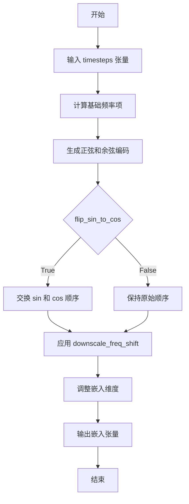

#### 带注释源码

```python
# 注意：以下源码为基于diffusers库常见实现的推断代码
# 实际源码位于 src/diffusers/models/embeddings.py

import math
import torch

def get_timestep_embedding(
    timesteps: torch.Tensor,
    embedding_dim: int,
    flip_sin_to_cos: bool = False,
    downscale_freq_shift: float = 0,
    max_period: float = 10000.0,
):
    """
    将时间步转换为正弦/余弦嵌入向量。
    
    这种编码方式源自Transformer中的位置编码（Positional Encoding），
    允许模型学习不同时间步之间的相对关系。
    
    参数:
        timesteps: 1-D 张量，包含需要嵌入的时间步
        embedding_dim: 输出嵌入的维度，必须是偶数
        flip_sin_to_cos: 是否将正弦和余弦交换位置
        downscale_freq_shift: 频率偏移量，用于控制不同频率成分的衰减
        max_period: 频率的上限，防止高频成分主导
        
    返回:
        形状为 (len(timesteps), embedding_dim) 的嵌入张量
    """
    
    # 断言嵌入维度为偶数，因为需要成对的sin/cos
    assert embedding_dim % 2 == 0, "embedding_dim must be divisible by 2"
    
    # 计算半维度，用于sin和cos
    half_dim = embedding_dim // 2
    
    # 计算频率衰减因子
    # 使用对数空间来均匀分布频率
    exponent = -math.log(max_period) * torch.arange(
        0, half_dim, dtype=torch.float32, device=timesteps.device
    )
    exponent = exponent / (half_dim - downscale_freq_shift)
    
    # 计算每个频率的幅度
    emb = torch.exp(exponent)
    
    # 将timesteps扩展到正确的形状以进行广播
    timesteps = timesteps.float()
    
    # 计算每个时间步的相位
    # 这里计算的是 time * frequency，即时间步与各频率的乘积
    emb = timesteps[:, None] * emb[None, :]
    
    # 组合正弦和余弦部分
    # sin和cos提供不同相位的信息，有助于模型区分相近的时间步
    emb = torch.cat([torch.sin(emb), torch.cos(emb)], dim=-1)
    
    # 根据flip_sin_to_cos参数决定是否交换sin和cos的位置
    if flip_sin_to_cos:
        emb = torch.cat([emb[:, embedding_dim // 2:], emb[:, :embedding_dim // 2]], dim=-1)
    
    return emb
```

#### 补充说明

**设计目标与约束**：
- 时间步嵌入的主要目标是将离散的扩散时间步映射到连续的向量空间，使神经网络能够理解当前处于去噪过程的哪个阶段
- 嵌入维度必须是偶数，因为需要成对的正弦和余弦函数来编码信息

**外部依赖**：
- 该函数依赖于PyTorch库进行张量运算
- 函数定义在`diffusers.models.embeddings`模块中

**使用场景**：
- 在扩散模型的UNet去噪过程中，时间步嵌入被用作条件信息
- 在Stable UnCLIP pipeline中，用于为图像嵌入添加噪声水平信息


### `adjust_lora_scale_text_encoder`

该函数用于动态调整文本编码器（Text Encoder）中 LoRA（Low-Rank Adaptation）层的缩放因子，以控制在生成过程中 LoRA 权重对模型输出的影响程度。

参数：

- `text_encoder`：`torch.nn.Module`，需要调整 LoRA 缩放的文本编码器模型（通常是 CLIPTextModel）。
- `lora_scale`：`float`，LoRA 缩放因子，用于控制 LoRA 层权重的影响力。

返回值：`None`，该函数直接修改传入的 `text_encoder` 模型的内部状态，不返回任何值。

#### 流程图

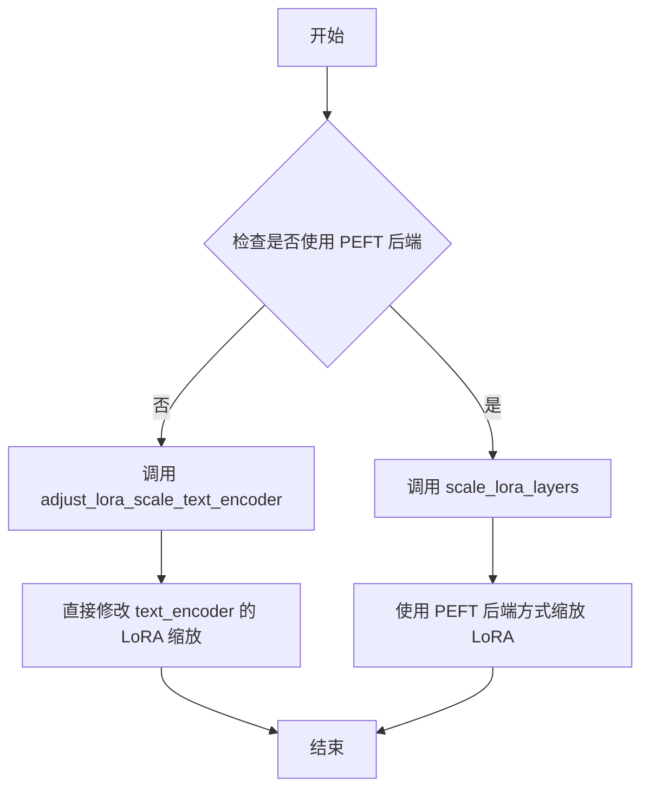

#### 带注释源码

```python
# 注意：以下为基于代码中调用位置的推断实现
# 该函数定义在 ...models.lora 模块中，当前文件通过以下方式导入：
from ...models.lora import adjust_lora_scale_text_encoder

# 在 encode_prompt 方法中的调用位置：
if lora_scale is not None and isinstance(self, StableDiffusionLoraLoaderMixin):
    self._lora_scale = lora_scale

    # 动态调整 LoRA 缩放因子
    if not USE_PEFT_BACKEND:
        # 非 PEFT 后端：直接调整文本编码器的 LoRA 缩放
        adjust_lora_scale_text_encoder(self.text_encoder, lora_scale)
    else:
        # PEFT 后端：使用 PEFT 库的方式缩放 LoRA 层
        scale_lora_layers(self.text_encoder, lora_scale)
```

> **注**：由于 `adjust_lora_scale_text_encoder` 函数的实际定义未包含在提供的代码中，以上信息基于代码中的调用上下文和函数名称进行的推断。该函数通常用于在推理或训练过程中动态调整 LoRA 权重的影响，以实现更好的生成效果或进行参数微调。


### `scale_lora_layers`

该函数用于动态调整（缩放）LoRA（Low-Rank Adaptation）层的权重系数，通常在加载了LoRA权重后，根据用户指定的`lora_scale`参数对模型中的LoRA层进行缩放，以实现对LoRA适配器影响力的动态控制。

参数：

-  `model`：`torch.nn.Module`，需要缩放LoRA层的模型（如`text_encoder`）
-  `lora_scale`：`float`，LoRA层的缩放因子，用于调整LoRA权重的影响程度

返回值：`None`，该函数直接修改传入模型的LoRA层权重，不返回任何值

#### 流程图

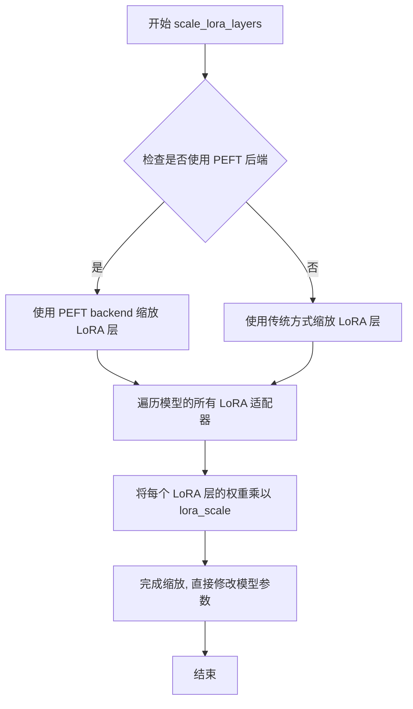

#### 带注释源码

```python
# scale_lora_layers 函数源码（位于 diffusers/src/diffusers/utils/lora_utils.py）
# 此函数根据传入的 lora_scale 参数缩放模型中所有 LoRA 层的权重

def scale_lora_layers(model: torch.nn.Module, lora_scale: float):
    """
    Scale the LoRA layers in the model by the given scale factor.
    
    Args:
        model: The model containing LoRA layers to be scaled
        lora_scale: The scale factor to apply to LoRA weights
    """
    if not USE_PEFT_BACKEND:
        # Non-PEFT path: 直接遍历模型参数，手动缩放 LoRA 权重
        for name, param in model.named_parameters():
            if "lora" in name.lower():
                param.data = param.data * lora_scale
    else:
        # PEFT path: 使用 PEFT 库的功能进行缩放
        # 遍历所有已加载的 LoRA 适配器
        for adapter_name in model.peft_config.keys():
            # 获取 LoRA 适配器并设置缩放因子
            lora_weights = model.get_peft_state_dict(adapter_name=adapter_name)
            # 遍历每个 LoRA 权重张量并应用缩放
            for key in lora_weights.keys():
                lora_weights[key] = lora_weights[key] * lora_scale
            # 将缩放后的权重重新设置到模型中
            model.set_peft_state_dict(adapter_name=adapter_name, peft_state_dict=lora_weights)
```


### `unscale_lora_layers`

取消LoRA层的缩放，将LoRA层的权重恢复到原始 scale 状态，用于在使用完LoRA权重后还原模型参数。

参数：

-  `text_encoder`：`torch.nn.Module`，需要取消缩放的文本编码器模型
-  `lora_scale`：`float`，之前应用到LoRA层的缩放因子

返回值：`None`，该函数直接修改模型内部状态，无返回值

#### 流程图

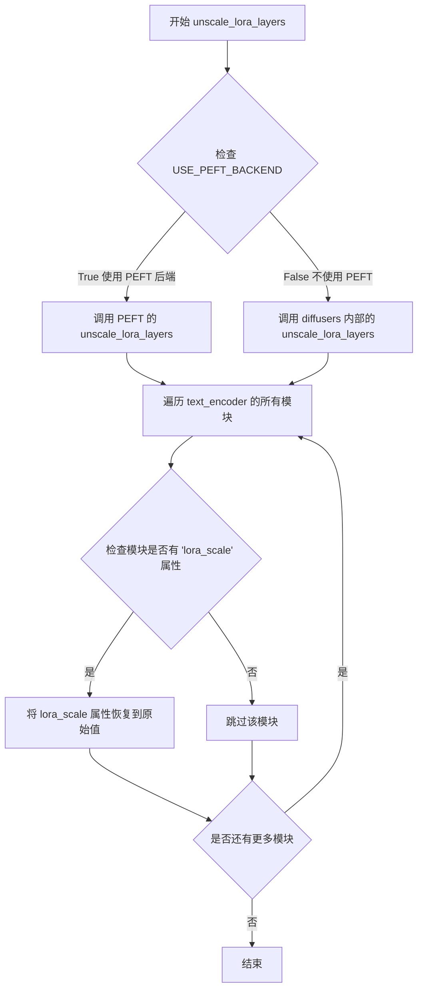

#### 带注释源码

```
# 此函数定义在 diffusers/src/diffusers/utils/lora.py 中
# 以下是基于代码导入和使用的推断实现

def unscale_lora_layers(text_encoder: torch.nn.Module, lora_scale: float):
    """
    取消LoRA层的缩放
    
    当使用LoRA（Low-Rank Adaptation）技术时，模型的权重会乘以一个缩放因子。
    这个函数用于在推理完成后将权重恢复到原始状态，或者用于在特定操作前
    恢复原始权重。
    
    参数:
        text_encoder: 需要取消缩放的文本编码器模型
        lora_scale: 之前应用到LoRA层的缩放因子
    
    返回:
        None，直接修改模型内部状态
    """
    if not USE_PEFT_BACKEND:
        # 如果不使用 PEFT 后端，调用 diffusers 内部实现
        from .lora import unscale_lora_layers as diffusers_unscale
        diffusers_unscale(text_encoder, lora_scale)
    else:
        # 使用 PEFT 后端
        from peft.tuners.lora import unscale_lora_layers as peft_unscale
        peft_unscale(text_encoder, lora_scale)
```

#### 在 `StableUnCLIPImg2ImgPipeline.encode_prompt` 中的使用

```python
# 在 encode_prompt 方法的末尾使用
if self.text_encoder is not None:
    if isinstance(self, StableDiffusionLoraLoaderMixin) and USE_PEFT_BACKEND:
        # Retrieve the original scale by scaling back the LoRA layers
        unscale_lora_layers(self.text_encoder, lora_scale)
```

**使用场景说明：**

该函数在 `encode_prompt` 方法末尾被调用，用于在使用LoRA权重进行文本编码后，取消对文本编码器LoRA层的缩放，恢复到原始状态。这是标准的LoRA使用模式：先缩放LoRA层进行推理，然后取消缩放恢复原始权重。


### `StableUnCLIPImg2ImgPipeline.__init__`

初始化 StableUnCLIP 图像到图像管道的各个组件，包括图像编码器、图像标准化器、噪声调度器、文本编码器、UNet、VAE 等，并注册所有模块并设置图像处理器。

参数：

- `feature_extractor`：`CLIPImageProcessor`，用于在编码前对图像进行预处理
- `image_encoder`：`CLIPVisionModelWithProjection`，用于编码图像的 CLIP 视觉模型
- `image_normalizer`：`StableUnCLIPImageNormalizer`，用于在噪声应用前标准化图像嵌入，并在噪声应用后反标准化
- `image_noising_scheduler`：`KarrasDiffusionSchedulers`，用于向预测的图像嵌入添加噪声的噪声调度器
- `tokenizer`：`CLIPTokenizer`，CLIP 分词器
- `text_encoder`：`CLIPTextModel`，冻结的 CLIP 文本编码器
- `unet`：`UNet2DConditionModel`，用于对编码的图像潜在表示进行去噪
- `scheduler`：`KarrasDiffusionSchedulers`，与 unet 配合使用以对编码的图像潜在表示进行去噪的调度器
- `vae`：`AutoencoderKL`，变分自编码器模型，用于在潜在表示之间编码和解码图像

返回值：`None`，无返回值（`__init__` 方法）

#### 流程图

```mermaid
flowchart TD
    A[开始 __init__] --> B[调用父类 DiffusionPipeline.__init__]
    B --> C[register_modules 注册所有模块]
    C --> C1[注册 feature_extractor]
    C --> C2[注册 image_encoder]
    C --> C3[注册 image_normalizer]
    C --> C4[注册 image_noising_scheduler]
    C --> C5[注册 tokenizer]
    C --> C6[注册 text_encoder]
    C --> C7[注册 unet]
    C --> C8[注册 scheduler]
    C --> C9[注册 vae]
    C --> D{检查 vae 是否存在}
    D -->|是| E[计算 vae_scale_factor: 2^(len(vae.config.block_out_channels)-1)]
    D -->|否| F[设置 vae_scale_factor 为 8]
    E --> G[创建 VaeImageProcessor]
    F --> G
    G --> H[结束 __init__]
```

#### 带注释源码

```python
def __init__(
    self,
    # image encoding components - 图像编码组件
    feature_extractor: CLIPImageProcessor,
    image_encoder: CLIPVisionModelWithProjection,
    # image noising components - 图像噪声处理组件
    image_normalizer: StableUnCLIPImageNormalizer,
    image_noising_scheduler: KarrasDiffusionSchedulers,
    # regular denoising components - 常规去噪组件
    tokenizer: CLIPTokenizer,
    text_encoder: CLIPTextModel,
    unet: UNet2DConditionModel,
    scheduler: KarrasDiffusionSchedulers,
    # vae - 变分自编码器
    vae: AutoencoderKL,
):
    # 调用父类 DiffusionPipeline 的初始化方法
    super().__init__()

    # 注册所有模块到管道中，使它们可以通过 self.xxx 访问
    self.register_modules(
        feature_extractor=feature_extractor,
        image_encoder=image_encoder,
        image_normalizer=image_normalizer,
        image_noising_scheduler=image_noising_scheduler,
        tokenizer=tokenizer,
        text_encoder=text_encoder,
        unet=unet,
        scheduler=scheduler,
        vae=vae,
    )

    # 计算 VAE 缩放因子，用于调整潜在空间的尺度
    # 基于 VAE 的 block_out_channels 计算下采样因子
    self.vae_scale_factor = 2 ** (len(self.vae.config.block_out_channels) - 1) if getattr(self, "vae", None) else 8
    
    # 创建图像处理器，用于预处理输入图像和后处理输出图像
    self.image_processor = VaeImageProcessor(vae_scale_factor=self.vae_scale_factor)
```


### `StableUnCLIPImg2ImgPipeline._encode_prompt`

该方法是一个已弃用的内部方法，用于将文本提示编码为文本编码器的隐藏状态。它通过调用新的 `encode_prompt()` 方法来实现功能，并为了向后兼容性，将返回的元组（prompt_embeds, negative_prompt_embeds）连接成一个张量（先连接negative_prompt_embeds，再连接prompt_embeds）。

参数：

- `prompt`：`str | list[str] | None`，要编码的文本提示
- `device`：`torch.device`，PyTorch 设备
- `num_images_per_prompt`：`int`，每个提示要生成的图像数量
- `do_classifier_free_guidance`：`bool`，是否使用无分类器自由引导
- `negative_prompt`：`str | list[str] | None`，不用于引导图像生成的提示
- `prompt_embeds`：`torch.Tensor | None`，预生成的文本嵌入
- `negative_prompt_embeds`：`torch.Tensor | None`，预生成的负面文本嵌入
- `lora_scale`：`float | None`，要应用于文本编码器所有 LoRA 层的 LoRA 比例
- `**kwargs`：其他关键字参数

返回值：`torch.Tensor`，连接后的提示词嵌入（先负面后正面）

#### 流程图

```mermaid
flowchart TD
    A[开始 _encode_prompt] --> B[记录弃用警告]
    B --> C[调用 encode_prompt 方法]
    C --> D[获取返回的元组 prompt_embeds_tuple]
    D --> E[拼接张量: torch.cat<br/>[prompt_embeds_tuple[1],<br/>prompt_embeds_tuple[0]]]
    E --> F[返回连接后的 prompt_embeds]
    F --> G[结束]
```

#### 带注释源码

```python
def _encode_prompt(
    self,
    prompt,                          # str | list[str] | None: 输入的文本提示
    device,                          # torch.device: PyTorch设备
    num_images_per_prompt,          # int: 每个提示生成的图像数量
    do_classifier_free_guidance,    # bool: 是否使用分类器自由引导
    negative_prompt=None,           # str | list[str] | None: 负面提示
    prompt_embeds: torch.Tensor | None = None,  # 预计算的提示嵌入
    negative_prompt_embeds: torch.Tensor | None = None,  # 预计算的负面提示嵌入
    lora_scale: float | None = None,  # LoRA缩放因子
    **kwargs,                        # 其他关键字参数
):
    # 记录弃用警告，提示用户使用 encode_prompt() 代替
    deprecation_message = "`_encode_prompt()` is deprecated and it will be removed in a future version. Use `encode_prompt()` instead. Also, be aware that the output format changed from a concatenated tensor to a tuple."
    deprecate("_encode_prompt()", "1.0.0", deprecation_message, standard_warn=False)

    # 调用新的 encode_prompt 方法获取元组格式的嵌入
    prompt_embeds_tuple = self.encode_prompt(
        prompt=prompt,
        device=device,
        num_images_per_prompt=num_images_per_prompt,
        do_classifier_free_guidance=do_classifier_free_guidance,
        negative_prompt=negative_prompt,
        prompt_embeds=prompt_embeds,
        negative_prompt_embeds=negative_prompt_embeds,
        lora_scale=lora_scale,
        **kwargs,
    )

    # 为了向后兼容，将元组连接成单个张量
    # 注意：这里先连接负面嵌入，再连接正面嵌入
    # prompt_embeds_tuple[1] 是 negative_prompt_embeds
    # prompt_embeds_tuple[0] 是 prompt_embeds
    prompt_embeds = torch.cat([prompt_embeds_tuple[1], prompt_embeds_tuple[0]])

    return prompt_embeds
```


### `StableUnCLIPImg2ImgPipeline._encode_image`

该方法负责将输入图像编码为CLIP图像嵌入向量，并根据配置添加噪声以及进行分类器自由引导（Classifier-Free Guidance）的处理。

参数：

- `self`：类实例本身，包含图像编码器和相关配置
- `image`：`torch.Tensor | PIL.Image.Image | list[PIL.Image.Image]`，待编码的输入图像，支持PIL图像、Tensor或图像列表
- `device`：`torch.device`，执行计算的设备（CPU/CUDA）
- `batch_size`：`int`，批处理大小，用于确定图像嵌入的重复次数
- `num_images_per_prompt`：`int`，每个提示词生成的图像数量
- `do_classifier_free_guidance`：`bool`，是否启用分类器自由引导
- `noise_level`：`int`，噪声等级，控制添加到图像嵌入的噪声量
- `generator`：`torch.Generator | None`，随机数生成器，用于复现噪声生成
- `image_embeds`：`torch.Tensor | None`，可选的预计算图像嵌入，如提供则直接使用

返回值：`torch.Tensor`，编码后的图像嵌入向量，形状为 `(batch_size * num_images_per_prompt, seq_len)` 或在启用CFG时为 `(2 * batch_size * num_images_per_prompt, seq_len)`

#### 流程图

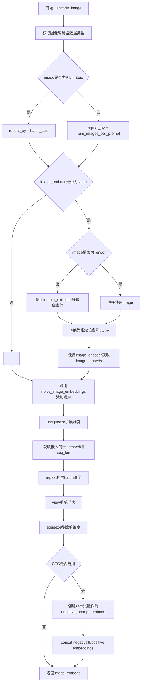

#### 带注释源码

```python
def _encode_image(
    self,
    image,
    device,
    batch_size,
    num_images_per_prompt,
    do_classifier_free_guidance,
    noise_level,
    generator,
    image_embeds,
):
    """
    编码输入图像为嵌入向量，支持噪声添加和分类器自由引导
    
    参数:
        image: 输入图像，支持PIL.Image.Tensor或列表
        device: 目标设备
        batch_size: 批处理大小
        num_images_per_prompt: 每个提示的图像数量
        do_classifier_free_guidance: 是否使用CFG
        noise_level: 噪声等级
        generator: 随机生成器
        image_embeds: 预计算的图像嵌入
    """
    # 1. 获取图像编码器的参数数据类型，用于后续设备转换
    dtype = next(self.image_encoder.parameters()).dtype

    # 2. 确定重复次数repeat_by，用于匹配batch维度
    if isinstance(image, PIL.Image.Image):
        # 如果是PIL图像，需要根据batch_size重复以匹配提示词数量
        repeat_by = batch_size
    else:
        # 假设输入已经是批处理的，只需按num_images_per_prompt重复
        # NOTE: 这里可能存在边界情况未处理，如batched image_embeds
        repeat_by = num_images_per_prompt

    # 3. 如果没有提供预计算的图像嵌入，则需要编码图像
    if image_embeds is None:
        if not isinstance(image, torch.Tensor):
            # 使用CLIP特征提取器将PIL图像转换为tensor
            image = self.feature_extractor(images=image, return_tensors="pt").pixel_values
        
        # 将图像转换到目标设备和数据类型
        image = image.to(device=device, dtype=dtype)
        
        # 使用CLIP vision encoder获取图像嵌入
        image_embeds = self.image_encoder(image).image_embeds

    # 4. 添加噪声到图像嵌入（unCLIP特性）
    image_embeds = self.noise_image_embeddings(
        image_embeds=image_embeds,
        noise_level=noise_level,
        generator=generator,
    )

    # 5. 为每个提示词复制图像嵌入
    # 在seq_len维度前添加batch维度，用于后续处理
    image_embeds = image_embeds.unsqueeze(1)
    bs_embed, seq_len, _ = image_embeds.shape
    
    # 复制嵌入以匹配生成的图像数量
    image_embeds = image_embeds.repeat(1, repeat_by, 1)
    image_embeds = image_embeds.view(bs_embed * repeat_by, seq_len, -1)
    
    # 移除多余的维度
    image_embeds = image_embeds.squeeze(1)

    # 6. 如果启用分类器自由引导，添加负向嵌入
    if do_classifier_free_guidance:
        # 创建与image_embeds形状相同的零张量作为无条件嵌入
        negative_prompt_embeds = torch.zeros_like(image_embeds)

        # 为了避免两次前向传播，将无条件和文本嵌入拼接
        # 最终格式: [negative_prompt_embeds, image_embeds]
        image_embeds = torch.cat([negative_prompt_embeds, image_embeds])

    # 7. 返回处理后的图像嵌入
    return image_embeds
```


### `StableUnCLIPImg2ImgPipeline.encode_prompt`

该方法将文本提示（prompt）编码为文本编码器的隐藏状态（text encoder hidden states），支持 LoRA 权重调整、文本反演（textual inversion）嵌入、以及 classifier-free guidance 所需的无条件嵌入。

参数：

- `prompt`：`str | list[str] | None`，要编码的文本提示，可以是单个字符串或字符串列表
- `device`：`torch.device`，PyTorch 设备，用于将计算结果放置到指定设备上
- `num_images_per_prompt`：`int`，每个提示要生成的图像数量，用于复制文本嵌入
- `do_classifier_free_guidance`：`bool`，是否启用 classifier-free guidance（无分类器指导）
- `negative_prompt`：`str | list[str] | None`，负面提示，用于指导不应生成的内容
- `prompt_embeds`：`torch.Tensor | None`，预生成的文本嵌入，如果提供则直接使用而不从 prompt 生成
- `negative_prompt_embeds`：`torch.Tensor | None`，预生成的负面文本嵌入
- `lora_scale`：`float | None`，LoRA 缩放因子，用于调整 LoRA 层的影响权重
- `clip_skip`：`int | None`，从 CLIP 倒数第二层开始跳过的层数，用于获取不同层次的特征

返回值：`tuple[torch.Tensor, torch.Tensor]`，返回两个张量——`prompt_embeds`（正向提示的嵌入）和 `negative_prompt_embeds`（负面提示的嵌入），用于后续的图像生成过程

#### 流程图

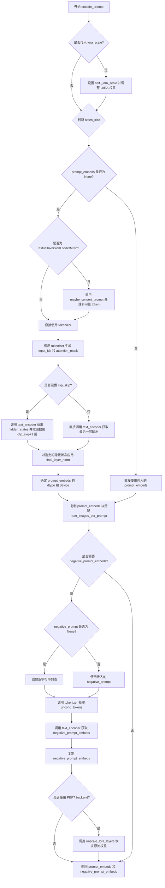

#### 带注释源码

```python
def encode_prompt(
    self,
    prompt,
    device,
    num_images_per_prompt,
    do_classifier_free_guidance,
    negative_prompt=None,
    prompt_embeds: torch.Tensor | None = None,
    negative_prompt_embeds: torch.Tensor | None = None,
    lora_scale: float | None = None,
    clip_skip: int | None = None,
):
    r"""
    Encodes the prompt into text encoder hidden states.

    Args:
        prompt (`str` or `list[str]`, *optional*):
            prompt to be encoded
        device: (`torch.device`):
            torch device
        num_images_per_prompt (`int`):
            number of images that should be generated per prompt
        do_classifier_free_guidance (`bool`):
            whether to use classifier free guidance or not
        negative_prompt (`str` or `list[str]`, *optional*):
            The prompt or prompts not to guide the image generation. If not defined, one has to pass
            `negative_prompt_embeds` instead. Ignored when not using guidance (i.e., ignored if `guidance_scale` is
            less than `1`).
        prompt_embeds (`torch.Tensor`, *optional*):
            Pre-generated text embeddings. Can be used to easily tweak text inputs, *e.g.* prompt weighting. If not
            provided, text embeddings will be generated from `prompt` input argument.
        negative_prompt_embeds (`torch.Tensor`, *optional*):
            Pre-generated negative text embeddings. Can be used to easily tweak text inputs, *e.g.* prompt
            weighting. If not provided, negative_prompt_embeds will be generated from `negative_prompt` input
            argument.
        lora_scale (`float`, *optional*):
            A LoRA scale that will be applied to all LoRA layers of the text encoder if LoRA layers are loaded.
        clip_skip (`int`, *optional*):
            Number of layers to be skipped from CLIP while computing the prompt embeddings. A value of 1 means that
            the output of the pre-final layer will be used for computing the prompt embeddings.
    """
    # 如果传入了 lora_scale 且当前 pipeline 支持 LoRA，则设置 LoRA 缩放因子
    # 这使得 text encoder 的 monkey patched LoRA 函数可以正确访问该值
    if lora_scale is not None and isinstance(self, StableDiffusionLoraLoaderMixin):
        self._lora_scale = lora_scale

        # 动态调整 LoRA 权重
        if not USE_PEFT_BACKEND:
            adjust_lora_scale_text_encoder(self.text_encoder, lora_scale)
        else:
            scale_lora_layers(self.text_encoder, lora_scale)

    # 根据 prompt 的类型确定 batch_size
    if prompt is not None and isinstance(prompt, str):
        batch_size = 1
    elif prompt is not None and isinstance(prompt, list):
        batch_size = len(prompt)
    else:
        # 如果没有提供 prompt，则使用 prompt_embeds 的 batch_size
        batch_size = prompt_embeds.shape[0]

    # 如果没有提供预计算的 prompt_embeds，则从 prompt 生成
    if prompt_embeds is None:
        # 处理 textual inversion：如果包含多向量 token，则进行转换
        if isinstance(self, TextualInversionLoaderMixin):
            prompt = self.maybe_convert_prompt(prompt, self.tokenizer)

        # 使用 tokenizer 将 prompt 转换为 token IDs
        text_inputs = self.tokenizer(
            prompt,
            padding="max_length",
            max_length=self.tokenizer.model_max_length,
            truncation=True,
            return_tensors="pt",
        )
        text_input_ids = text_inputs.input_ids
        # 获取未截断的 token 序列，用于检测是否发生了截断
        untruncated_ids = self.tokenizer(prompt, padding="longest", return_tensors="pt").input_ids

        # 检测是否发生了截断，并记录警告信息
        if untruncated_ids.shape[-1] >= text_input_ids.shape[-1] and not torch.equal(
            text_input_ids, untruncated_ids
        ):
            removed_text = self.tokenizer.batch_decode(
                untruncated_ids[:, self.tokenizer.model_max_length - 1 : -1]
            )
            logger.warning(
                "The following part of your input was truncated because CLIP can only handle sequences up to"
                f" {self.tokenizer.model_max_length} tokens: {removed_text}"
            )

        # 检查 text_encoder 是否使用 attention_mask
        if hasattr(self.text_encoder.config, "use_attention_mask") and self.text_encoder.config.use_attention_mask:
            attention_mask = text_inputs.attention_mask.to(device)
        else:
            attention_mask = None

        # 根据 clip_skip 参数决定从哪一层获取 embeddings
        if clip_skip is None:
            # 直接获取最后一层的 hidden states
            prompt_embeds = self.text_encoder(text_input_ids.to(device), attention_mask=attention_mask)
            prompt_embeds = prompt_embeds[0]
        else:
            # 获取所有层的 hidden states
            prompt_embeds = self.text_encoder(
                text_input_ids.to(device), attention_mask=attention_mask, output_hidden_states=True
            )
            # hidden_states 是一个元组，包含所有 encoder 层的输出
            # 取倒数第 clip_skip+1 层（即跳过最后 clip_skip 层）
            prompt_embeds = prompt_embeds[-1][-(clip_skip + 1)]
            # 应用 final_layer_norm 以保持表示的一致性
            prompt_embeds = self.text_encoder.text_model.final_layer_norm(prompt_embeds)

    # 确定 prompt_embeds 的 dtype（优先使用 text_encoder 的 dtype，其次使用 unet 的 dtype）
    if self.text_encoder is not None:
        prompt_embeds_dtype = self.text_encoder.dtype
    elif self.unet is not None:
        prompt_embeds_dtype = self.unet.dtype
    else:
        prompt_embeds_dtype = prompt_embeds.dtype

    # 将 prompt_embeds 转换为正确的 dtype 和 device
    prompt_embeds = prompt_embeds.to(dtype=prompt_embeds_dtype, device=device)

    # 复制 embeddings 以匹配 num_images_per_prompt
    bs_embed, seq_len, _ = prompt_embeds.shape
    prompt_embeds = prompt_embeds.repeat(1, num_images_per_prompt, 1)
    prompt_embeds = prompt_embeds.view(bs_embed * num_images_per_prompt, seq_len, -1)

    # 如果启用 classifier-free guidance 且没有提供 negative_prompt_embeds，则生成无条件 embeddings
    if do_classifier_free_guidance and negative_prompt_embeds is None:
        uncond_tokens: list[str]
        if negative_prompt is None:
            # 如果没有提供 negative_prompt，使用空字符串
            uncond_tokens = [""] * batch_size
        elif prompt is not None and type(prompt) is not type(negative_prompt):
            raise TypeError(
                f"`negative_prompt` should be the same type to `prompt`, but got {type(negative_prompt)} !="
                f" {type(prompt)}."
            )
        elif isinstance(negative_prompt, str):
            uncond_tokens = [negative_prompt]
        elif batch_size != len(negative_prompt):
            raise ValueError(
                f"`negative_prompt`: {negative_prompt} has batch size {len(negative_prompt)}, but `prompt`:"
                f" {prompt} has batch size {batch_size}. Please make sure that passed `negative_prompt` matches"
                " the batch size of `prompt`."
            )
        else:
            uncond_tokens = negative_prompt

        # 处理 textual inversion
        if isinstance(self, TextualInversionLoaderMixin):
            uncond_tokens = self.maybe_convert_prompt(uncond_tokens, self.tokenizer)

        # 使用与 prompt_embeds 相同的长度进行 tokenize
        max_length = prompt_embeds.shape[1]
        uncond_input = self.tokenizer(
            uncond_tokens,
            padding="max_length",
            max_length=max_length,
            truncation=True,
            return_tensors="pt",
        )

        # 处理 attention_mask
        if hasattr(self.text_encoder.config, "use_attention_mask") and self.text_encoder.config.use_attention_mask:
            attention_mask = uncond_input.attention_mask.to(device)
        else:
            attention_mask = None

        # 获取无条件 embeddings
        negative_prompt_embeds = self.text_encoder(
            uncond_input.input_ids.to(device),
            attention_mask=attention_mask,
        )
        negative_prompt_embeds = negative_prompt_embeds[0]

    # 如果启用 classifier-free guidance，复制 negative_prompt_embeds
    if do_classifier_free_guidance:
        seq_len = negative_prompt_embeds.shape[1]

        negative_prompt_embeds = negative_prompt_embeds.to(dtype=prompt_embeds_dtype, device=device)

        negative_prompt_embeds = negative_prompt_embeds.repeat(1, num_images_per_prompt, 1)
        negative_prompt_embeds = negative_prompt_embeds.view(batch_size * num_images_per_prompt, seq_len, -1)

    # 如果使用了 PEFT backend，恢复 LoRA 权重到原始 scale
    if self.text_encoder is not None:
        if isinstance(self, StableDiffusionLoraLoaderMixin) and USE_PEFT_BACKEND:
            unscale_lora_layers(self.text_encoder, lora_scale)

    # 返回 prompt_embeds 和 negative_prompt_embeds
    return prompt_embeds, negative_prompt_embeds
```


### `StableUnCLIPImg2ImgPipeline.decode_latents`

该方法用于将VAE的潜在向量解码为图像。由于已弃用，未来版本中将移除，建议使用`VaeImageProcessor.postprocess(...)`方法替代。

参数：

- `self`：`StableUnCLIPImg2ImgPipeline` 实例本身
- `latents`：`torch.Tensor`，VAE编码后的潜在向量，表示图像在潜在空间中的压缩表示

返回值：`numpy.ndarray`，解码后的图像数据，形状为 `(batch_size, height, width, channels)`，像素值范围 [0, 1]

#### 流程图

```mermaid
flowchart TD
    A[输入: latents 潜在向量] --> B[反缩放潜在向量: latents = 1 / scaling_factor * latents]
    B --> C[VAE解码: vae.decode latents]
    C --> D[图像归一化: (image / 2 + 0.5).clamp 0, 1]
    D --> E[数据传输到CPU: .cpu]
    E --> F[维度转换: .permute 0,2,3,1]
    F --> G[类型转换: .float .numpy]
    G --> H[输出: numpy.ndarray 图像]
```

#### 带注释源码

```python
def decode_latents(self, latents):
    """
    解码VAE潜在向量为图像（已弃用方法）
    
    该方法将潜在空间中的向量解码为图像。由于已弃用，
    建议使用 VaeImageProcessor.postprocess(...) 替代。
    
    Args:
        latents: VAE编码后的潜在向量张量
        
    Returns:
        解码后的图像，类型为numpy数组，像素值范围[0,1]
    """
    # 发出弃用警告，提示用户在未来版本中该方法将被移除
    deprecation_message = "The decode_latents method is deprecated and will be removed in 1.0.0. Please use VaeImageProcessor.postprocess(...) instead"
    deprecate("decode_latents", "1.0.0", deprecation_message, standard_warn=False)

    # 第一步：反缩放潜在向量
    # VAE在编码时会将潜在向量乘以scaling_factor，这里需要除以回来
    latents = 1 / self.vae.config.scaling_factor * latents
    
    # 第二步：使用VAE解码器将潜在向量解码为图像
    # vae.decode返回一个元组，第一个元素是解码后的图像
    image = self.vae.decode(latents, return_dict=False)[0]
    
    # 第三步：图像归一化
    # 将图像从[-1, 1]范围转换到[0, 1]范围
    # 操作: (image / 2 + 0.5).clamp(0, 1)
    image = (image / 2 + 0.5).clamp(0, 1)
    
    # 第四步：数据传输到CPU并转换为numpy数组
    # 使用float32以避免显著的性能开销，同时兼容bfloat16
    # permute(0, 2, 3, 1) 将通道维度从[C, H, W]转换为[H, W, C]
    image = image.cpu().permute(0, 2, 3, 1).float().numpy()
    
    # 返回解码后的图像
    return image
```


### `StableUnCLIPImg2ImgPipeline.prepare_extra_step_kwargs`

该方法用于准备调度器（scheduler）的额外参数。由于不同的调度器具有不同的签名，该方法通过检查调度器的 `step` 函数是否接受特定参数（如 `eta` 和 `generator`），来动态构建需要传递给调度器的额外关键字参数字典。

参数：

- `generator`：`torch.Generator | None`，随机数生成器，用于使去噪过程可重现
- `eta`：`float`，DDIM 调度器的参数，对应 DDIM 论文中的 η 值，取值范围应在 [0, 1] 之间

返回值：`dict`，包含调度器额外关键字参数字典，可能包含 `eta` 和/或 `generator` 键

#### 流程图

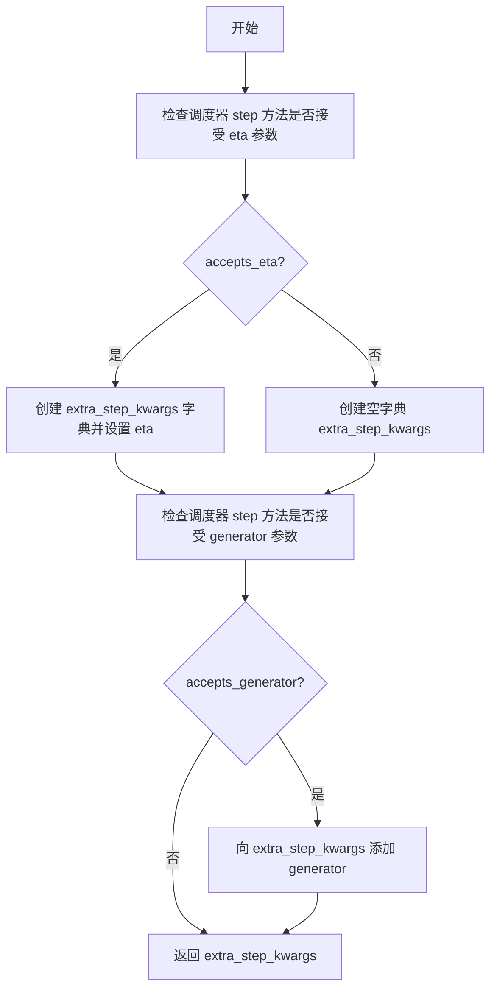

#### 带注释源码

```python
def prepare_extra_step_kwargs(self, generator, eta):
    # 准备调度器步进的额外参数，因为并非所有调度器都具有相同的签名
    # eta (η) 仅与 DDIMScheduler 一起使用，对于其他调度器将被忽略
    # eta 对应 DDIM 论文 (https://huggingface.co/papers/2010.02502) 中的 η
    # 取值应在 [0, 1] 范围内

    # 检查调度器的 step 方法是否接受 eta 参数
    accepts_eta = "eta" in set(inspect.signature(self.scheduler.step).parameters.keys())
    
    # 初始化额外参数字典
    extra_step_kwargs = {}
    
    # 如果调度器接受 eta 参数，则将其添加到 extra_step_kwargs
    if accepts_eta:
        extra_step_kwargs["eta"] = eta

    # 检查调度器是否接受 generator 参数
    accepts_generator = "generator" in set(inspect.signature(self.scheduler.step).parameters.keys())
    
    # 如果调度器接受 generator 参数，则将其添加到 extra_step_kwargs
    if accepts_generator:
        extra_step_kwargs["generator"] = generator
    
    # 返回包含调度器所需额外参数的字典
    return extra_step_kwargs
```


### `StableUnCLIPImg2ImgPipeline.check_inputs`

该方法负责验证 StableUnCLIPImg2ImgPipeline 的输入参数有效性，确保传入的图像尺寸、回调步数、提示词、嵌入向量等参数符合模型要求，若参数无效则抛出相应的 ValueError 或 TypeError 异常。

参数：

- `prompt`：`str | list[str] | None`，文本提示，用于指导图像生成
- `image`：`Any`，输入图像（torch.Tensor、PIL.Image.Image 或列表）
- `height`：`int`，生成图像的高度（像素）
- `width`：`int`，生成图像的宽度（像素）
- `callback_steps`：`int`，回调函数的调用步数
- `noise_level`：`int`，添加到图像嵌入的噪声级别
- `negative_prompt`：`str | list[str] | None`，负面提示，用于指导不希望出现的图像特征
- `prompt_embeds`：`torch.Tensor | None`，预生成的文本嵌入向量
- `negative_prompt_embeds`：`torch.Tensor | None`，预生成的负面文本嵌入向量
- `image_embeds`：`torch.Tensor | None`，预生成的图像嵌入向量

返回值：`None`，该方法仅进行参数验证，不返回任何值

#### 流程图

```mermaid
flowchart TD
    A[开始验证] --> B{height % 8 == 0<br/>width % 8 == 0?}
    B -->|否| B1[抛出 ValueError]
    B -->|是| C{callback_steps 是正整数?}
    C -->|否| C1[抛出 ValueError]
    C -->|是| D{prompt 和 prompt_embeds<br/>都非空?}
    D -->|是| D1[抛出 ValueError]
    D -->|否| E{prompt 和 prompt_embeds<br/>都为空?}
    E -->|是| E1[抛出 ValueError]
    E -->|否| F{prompt 类型正确?<br/>str 或 list}
    F -->|否| F1[抛出 ValueError]
    F -->|是| G{negative_prompt 和<br/>negative_prompt_embeds<br/>都非空?}
    G -->|是| G1[抛出 ValueError]
    G -->|否| H{prompt 和 negative_prompt<br/>类型一致?}
    H -->|否| H1[抛出 TypeError]
    H -->|是| I{prompt_embeds 和<br/>negative_prompt_embeds<br/>形状一致?}
    I -->|否| I1[抛出 ValueError]
    I -->|是| J{noise_level 在有效范围?<br/>[0, num_train_timesteps)}
    J -->|否| J1[抛出 ValueError]
    J -->|是| K{image 和 image_embeds<br/>都非空?}
    K -->|是| K1[抛出 ValueError]
    K -->|否| L{image 和 image_embeds<br/>都为空?}
    L -->|是| L1[抛出 ValueError]
    L -->|否| M{image 类型正确?<br/>Tensor/Image/List}
    M -->|否| M1[抛出 ValueError]
    M -->|是| N[验证通过]
    
    B1 --> O[结束]
    C1 --> O
    D1 --> O
    E1 --> O
    F1 --> O
    G1 --> O
    H1 --> O
    I1 --> O
    J1 --> O
    K1 --> O
    L1 --> O
    M1 --> O
    N --> O
```

#### 带注释源码

```python
def check_inputs(
    self,
    prompt,
    image,
    height,
    width,
    callback_steps,
    noise_level,
    negative_prompt=None,
    prompt_embeds=None,
    negative_prompt_embeds=None,
    image_embeds=None,
):
    # 验证图像尺寸：UNet 要求高度和宽度必须是 8 的倍数
    # 因为 VAE 的编码/解码过程涉及多次下采样操作
    if height % 8 != 0 or width % 8 != 0:
        raise ValueError(f"`height` and `width` have to be divisible by 8 but are {height} and {width}.")

    # 验证回调步数：必须为正整数，用于控制进度回调的频率
    if (callback_steps is None) or (
        callback_steps is not None and (not isinstance(callback_steps, int) or callback_steps <= 0)
    ):
        raise ValueError(
            f"`callback_steps` has to be a positive integer but is {callback_steps} of type"
            f" {type(callback_steps)}."
        )

    # 验证提示词和预生成嵌入的互斥关系：两者只能提供其一
    if prompt is not None and prompt_embeds is not None:
        raise ValueError(
            "Provide either `prompt` or `prompt_embeds`. Please make sure to define only one of the two."
        )

    # 验证至少提供一个提示词输入
    if prompt is None and prompt_embeds is None:
        raise ValueError(
            "Provide either `prompt` or `prompt_embeds`. Cannot leave both `prompt` and `prompt_embeds` undefined."
        )

    # 验证提示词类型：只接受字符串或字符串列表
    if prompt is not None and (not isinstance(prompt, str) and not isinstance(prompt, list)):
        raise ValueError(f"`prompt` has to be of type `str` or `list` but is {type(prompt)}")

    # 验证负面提示词和预生成嵌入的互斥关系
    if negative_prompt is not None and negative_prompt_embeds is not None:
        raise ValueError(
            "Provide either `negative_prompt` or `negative_prompt_embeds`. Cannot leave both `negative_prompt` and `negative_prompt_embeds` undefined."
        )

    # 验证提示词和负面提示词的类型一致性
    if prompt is not None and negative_prompt is not None:
        if type(prompt) is not type(negative_prompt):
            raise TypeError(
                f"`negative_prompt` should be the same type to `prompt`, but got {type(negative_prompt)} !="
                f" {type(prompt)}."
            )

    # 验证文本嵌入和负面文本嵌入的形状一致性（用于分类器自由引导）
    if prompt_embeds is not None and negative_prompt_embeds is not None:
        if prompt_embeds.shape != negative_prompt_embeds.shape:
            raise ValueError(
                "`prompt_embeds` and `negative_prompt_embeds` must have the same shape when passed directly, but"
                f" got: `prompt_embeds` {prompt_embeds.shape} != `negative_prompt_embeds`"
                f" {negative_prompt_embeds.shape}."
            )

    # 验证噪声级别在有效范围内：必须小于训练时的总时间步数
    if noise_level < 0 or noise_level >= self.image_noising_scheduler.config.num_train_timesteps:
        raise ValueError(
            f"`noise_level` must be between 0 and {self.image_noising_scheduler.config.num_train_timesteps - 1}, inclusive."
        )

    # 验证图像和预生成图像嵌入的互斥关系：两者只能提供其一
    if image is not None and image_embeds is not None:
        raise ValueError(
            "Provide either `image` or `image_embeds`. Please make sure to define only one of the two."
        )

    # 验证至少提供一个图像输入
    if image is None and image_embeds is None:
        raise ValueError(
            "Provide either `image` or `image_embeds`. Cannot leave both `image` and `image_embeds` undefined."
        )

    # 验证图像类型：支持 PyTorch 张量、PIL 图像或图像列表
    if image is not None:
        if (
            not isinstance(image, torch.Tensor)
            and not isinstance(image, PIL.Image.Image)
            and not isinstance(image, list)
        ):
            raise ValueError(
                "`image` has to be of type `torch.Tensor` or `PIL.Image.Image` or `list[PIL.Image.Image]` but is"
                f" {type(image)}"
            )
```


### `StableUnCLIPImg2ImgPipeline.prepare_latents`

该方法负责为去噪过程准备初始潜在向量（latents），根据指定的批次大小、图像尺寸和潜在通道数生成随机噪声或使用提供的潜在向量，并按照调度器的初始噪声标准差进行缩放。

参数：

- `batch_size`：`int`，生成的图像批次大小
- `num_channels_latents`：`int`，潜在向量通道数，通常对应于 UNet 的输入通道数
- `height`：`int`，生成图像的高度（像素）
- `width`：`int`，生成图像的宽度（像素）
- `dtype`：`torch.dtype`，潜在向量的数据类型
- `device`：`torch.device`，潜在向量所在的设备
- `generator`：`torch.Generator` 或 `list[torch.Generator]`，可选的随机数生成器，用于确保可复现性
- `latents`：`torch.Tensor | None`，可选的预生成潜在向量，如果为 None 则随机生成

返回值：`torch.Tensor`，处理后的初始潜在向量，已按调度器要求缩放

#### 流程图

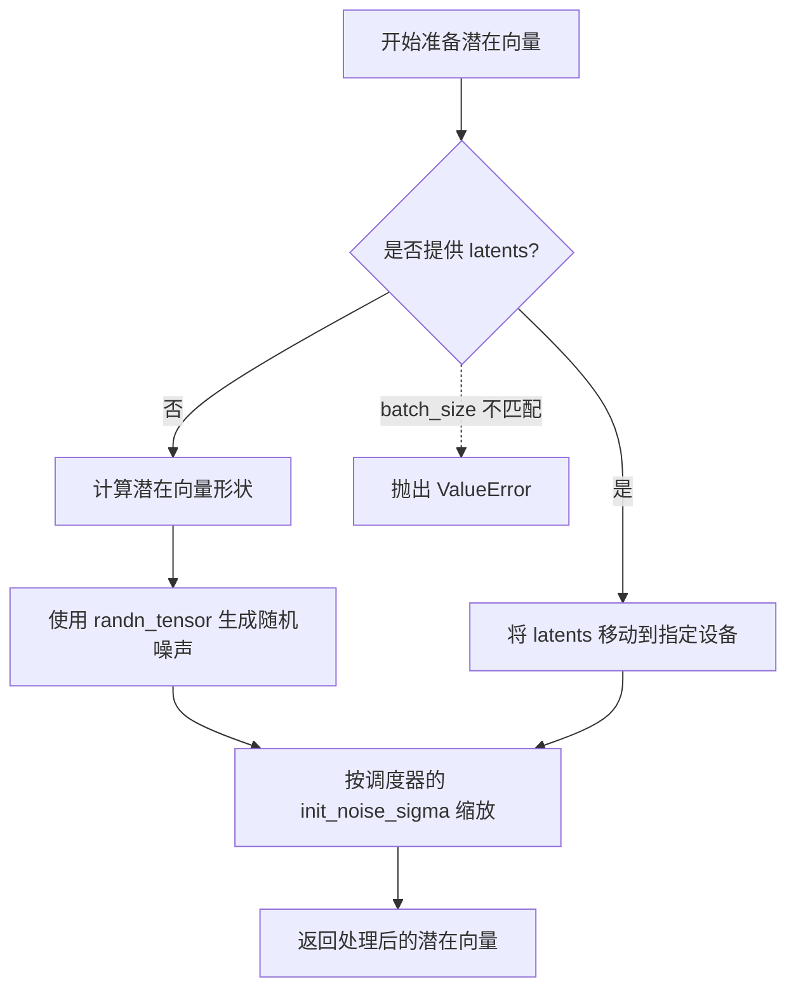

#### 带注释源码

```python
def prepare_latents(
    self,
    batch_size: int,
    num_channels_latents: int,
    height: int,
    width: int,
    dtype: torch.dtype,
    device: torch.device,
    generator: torch.Generator | list[torch.Generator] | None = None,
    latents: torch.Tensor | None = None,
) -> torch.Tensor:
    """
    准备去噪过程的初始潜在向量。
    
    该方法根据指定的批次大小和图像尺寸生成或处理潜在向量。
    如果未提供 latents，则使用随机噪声初始化；如果提供了 latents，
    则将其移动到指定设备。最后根据调度器的要求进行缩放。
    
    Args:
        batch_size: 批次大小
        num_channels_latents: 潜在向量通道数
        height: 图像高度
        width: 图像宽度
        dtype: 数据类型
        device: 设备
        generator: 随机数生成器
        latents: 可选的预生成潜在向量
    
    Returns:
        处理后的初始潜在向量
    """
    # 计算潜在向量的形状，包括 VAE 缩放因子
    # height 和 width 需要除以 vae_scale_factor 以得到潜在空间的尺寸
    shape = (
        batch_size,
        num_channels_latents,
        int(height) // self.vae_scale_factor,
        int(width) // self.vae_scale_factor,
    )
    
    # 验证生成器列表长度与批次大小是否匹配
    if isinstance(generator, list) and len(generator) != batch_size:
        raise ValueError(
            f"You have passed a list of generators of length {len(generator)}, but requested an effective batch"
            f" size of {batch_size}. Make sure the batch size matches the length of the generators."
        )
    
    # 根据是否有预提供的 latents 决定生成方式
    if latents is None:
        # 使用 randn_tensor 生成符合标准正态分布的随机噪声
        latents = randn_tensor(shape, generator=generator, device=device, dtype=dtype)
    else:
        # 如果提供了 latents，确保其在正确的设备上
        latents = latents.to(device)
    
    # 根据调度器的要求缩放初始噪声
    # 不同的调度器可能使用不同的初始噪声标准差
    latents = latents * self.scheduler.init_noise_sigma
    
    return latents
```


### `StableUnCLIPImg2ImgPipeline.noise_image_embeddings`

该方法用于为图像嵌入添加可控噪声，通过 noise_level 参数调节噪声强度，并将时间步嵌入连接到处理后的图像嵌入，以支持后续的去噪过程。

参数：

- `image_embeds`：`torch.Tensor`，输入的CLIP图像嵌入向量
- `noise_level`：`int`，噪声等级，控制添加的噪声量，值越高最终去噪图像的方差越大
- `noise`：`torch.Tensor | None`，可选的预定义噪声张量，若为 None 则自动生成随机噪声
- `generator`：`torch.Generator | None`，可选的随机数生成器，用于确保噪声生成的可复现性

返回值：`torch.Tensor`，添加噪声并连接时间步嵌入后的图像嵌入向量

#### 流程图

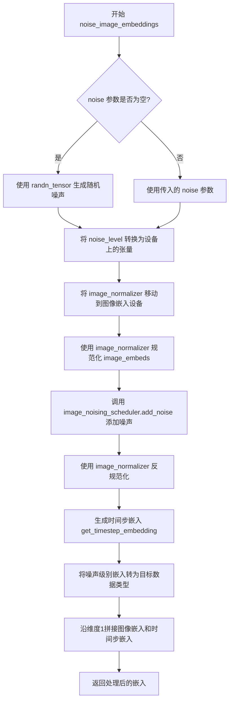

#### 带注释源码

```python
def noise_image_embeddings(
    self,
    image_embeds: torch.Tensor,
    noise_level: int,
    noise: torch.Tensor | None = None,
    generator: torch.Generator | None = None,
):
    """
    为图像嵌入添加噪声。噪声量由 `noise_level` 参数控制。
    较高的 `noise_level` 会增加最终去噪图像的方差。

    噪声通过两种方式应用：
    1. 噪声调度器直接应用于嵌入向量。
    2. 正弦波时间步嵌入向量被追加到输出端。

    在这两种情况下，噪声量都由同一个 `noise_level` 控制。

    嵌入在噪声应用前被规范化，噪声应用后被反规范化。
    """
    # 如果未提供噪声，则生成与图像嵌入形状相同的随机噪声
    if noise is None:
        noise = randn_tensor(
            image_embeds.shape, generator=generator, device=image_embeds.device, dtype=image_embeds.dtype
        )

    # 将噪声级别转换为与图像嵌入相同设备上的张量，用于批量处理
    noise_level = torch.tensor([noise_level] * image_embeds.shape[0], device=image_embeds.device)

    # 确保规范化器位于正确的设备上
    self.image_normalizer.to(image_embeds.device)
    # 对图像嵌入进行规范化（归一化到特定范围）
    image_embeds = self.image_normalizer.scale(image_embeds)

    # 使用噪声调度器根据时间步将噪声添加到嵌入中
    image_embeds = self.image_noising_scheduler.add_noise(image_embeds, timesteps=noise_level, noise=noise)

    # 反规范化图像嵌入，恢复到原始尺度
    image_embeds = self.image_normalizer.unscale(image_embeds)

    # 生成时间步嵌入，用于向模型传达当前的噪声水平
    noise_level = get_timestep_embedding(
        timesteps=noise_level, embedding_dim=image_embeds.shape[-1], flip_sin_to_cos=True, downscale_freq_shift=0
    )

    # `get_timestep_embeddings` 不包含权重且总是返回 f32 张量
    # 但我们可能在 fp16 模式下运行，因此需要在这里进行类型转换
    noise_level = noise_level.to(image_embeds.dtype)

    # 将时间步嵌入连接到图像嵌入的通道维度
    image_embeds = torch.cat((image_embeds, noise_level), 1)

    return image_embeds
```


### `StableUnCLIPImg2ImgPipeline.__call__`

该方法是StableUnCLIPImg2ImgPipeline管道的主调用方法，用于执行基于文本提示和输入图像的图像到图像生成任务。方法通过编码输入图像和文本提示，准备噪声潜在变量，执行去噪循环（UNet迭代），最后解码潜在变量生成输出图像。

参数：

- `image`：`torch.Tensor | PIL.Image.Image`，输入图像或图像批次，将被编码为CLIP嵌入用于条件化UNet
- `prompt`：`str | list[str] | None`，引导图像生成的文本提示，若未定义则使用prompt_embeds
- `height`：`int | None`，生成图像的高度（像素），默认值为unet.config.sample_size * vae_scale_factor
- `width`：`int | None`，生成图像的宽度（像素），默认值为unet.config.sample_size * vae_scale_factor
- `num_inference_steps`：`int`，去噪步数，默认为20，步数越多图像质量越高但推理越慢
- `guidance_scale`：`float`，引导比例，值越高生成的图像与文本提示相关性越强，默认为10.0
- `negative_prompt`：`str | list[str] | None`，不希望出现在生成图像中的引导提示
- `num_images_per_prompt`：`int`，每个提示生成的图像数量，默认为1
- `eta`：`float`，DDIM调度器的η参数，仅对DDIMScheduler有效，默认为0.0
- `generator`：`torch.Generator | None`，用于生成确定性结果的随机数生成器
- `latents`：`torch.Tensor | None`，预生成的噪声潜在变量，可用于通过不同提示微调相同生成
- `prompt_embeds`：`torch.Tensor | None`，预生成的文本嵌入，可用于轻松调整文本输入
- `negative_prompt_embeds`：`torch.Tensor | None`，预生成的负向文本嵌入
- `output_type`：`str`，输出格式，可选"PIL.Image"或"np.array"，默认为"pil"
- `return_dict`：`bool`，是否返回ImagePipelineOutput，默认为True
- `callback`：`Callable | None`，每callback_steps步调用的回调函数，参数为(step, timestep, latents)
- `callback_steps`：`int`，回调函数调用频率，默认为1
- `cross_attention_kwargs`：`dict | None`，传递给AttentionProcessor的kwargs字典
- `noise_level`：`int`，添加到图像嵌入的噪声量，默认为0，影响最终去噪图像的方差
- `image_embeds`：`torch.Tensor | None`，预生成的CLIP嵌入用于条件化UNet
- `clip_skip`：`int | None`，计算提示嵌入时从CLIP跳过的层数

返回值：`ImagePipelineOutput | tuple`，若return_dict为True返回ImagePipelineOutput（包含images列表），否则返回元组

#### 流程图

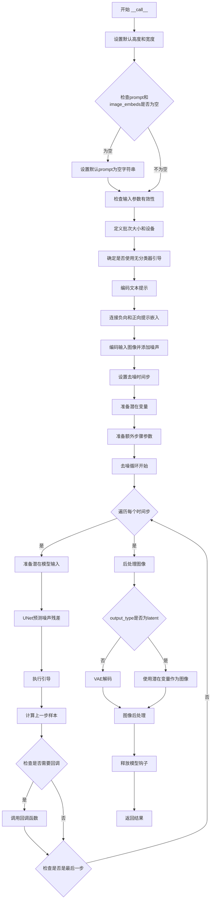

#### 带注释源码

```python
@torch.no_grad()
@replace_example_docstring(EXAMPLE_DOC_STRING)
def __call__(
    self,
    image: torch.Tensor | PIL.Image.Image = None,
    prompt: str | list[str] = None,
    height: int | None = None,
    width: int | None = None,
    num_inference_steps: int = 20,
    guidance_scale: float = 10,
    negative_prompt: str | list[str] | None = None,
    num_images_per_prompt: int | None = 1,
    eta: float = 0.0,
    generator: torch.Generator | None = None,
    latents: torch.Tensor | None = None,
    prompt_embeds: torch.Tensor | None = None,
    negative_prompt_embeds: torch.Tensor | None = None,
    output_type: str | None = "pil",
    return_dict: bool = True,
    callback: Callable[[int, int, torch.Tensor], None] | None = None,
    callback_steps: int = 1,
    cross_attention_kwargs: dict[str, Any] | None = None,
    noise_level: int = 0,
    image_embeds: torch.Tensor | None = None,
    clip_skip: int | None = None,
):
    r"""
    The call function to the pipeline for generation.
    
    参数说明见上文...
    """
    # 0. Default height and width to unet
    # 如果未指定height和width，则使用UNet配置中的sample_size乘以VAE缩放因子作为默认值
    height = height or self.unet.config.sample_size * self.vae_scale_factor
    width = width or self.unet.config.sample_size * self.vae_scale_factor

    # 如果没有提供prompt和prompt_embeds，则根据image类型初始化空prompt
    # 如果image是列表，每个元素对应一个空字符串；否则使用单个空字符串
    if prompt is None and prompt_embeds is None:
        prompt = len(image) * [""] if isinstance(image, list) else ""

    # 1. Check inputs. Raise error if not correct
    # 验证所有输入参数的有效性，包括高度、宽度、callback_steps、噪声级别等
    self.check_inputs(
        prompt=prompt,
        image=image,
        height=height,
        width=width,
        callback_steps=callback_steps,
        noise_level=noise_level,
        negative_prompt=negative_prompt,
        prompt_embeds=prompt_embeds,
        negative_prompt_embeds=negative_prompt_embeds,
        image_embeds=image_embeds,
    )

    # 2. Define call parameters
    # 根据prompt或prompt_embeds确定批次大小
    if prompt is not None and isinstance(prompt, str):
        batch_size = 1
    elif prompt is not None and isinstance(prompt, list):
        batch_size = len(prompt)
    else:
        batch_size = prompt_embeds.shape[0]

    # 批次大小需要乘以每个prompt生成的图像数量
    batch_size = batch_size * num_images_per_prompt

    # 获取执行设备（CPU/CUDA等）
    device = self._execution_device

    # 这里guidance_scale类似于Imagen论文中的权重w，值为1表示不使用无分类器引导
    do_classifier_free_guidance = guidance_scale > 1.0

    # 3. Encode input prompt
    # 从cross_attention_kwargs中提取LoRA scale
    text_encoder_lora_scale = (
        cross_attention_kwargs.get("scale", None) if cross_attention_kwargs is not None else None
    )
    # 编码prompt得到文本嵌入
    prompt_embeds, negative_prompt_embeds = self.encode_prompt(
        prompt=prompt,
        device=device,
        num_images_per_prompt=num_images_per_prompt,
        do_classifier_free_guidance=do_classifier_free_guidance,
        negative_prompt=negative_prompt,
        prompt_embeds=prompt_embeds,
        negative_prompt_embeds=negative_prompt_embeds,
        lora_scale=text_encoder_lora_scale,
    )
    # 对于无分类器引导，需要进行两次前向传播
    # 这里将无条件嵌入和文本嵌入连接到一个批次中以避免两次前向传播
    if do_classifier_free_guidance:
        prompt_embeds = torch.cat([negative_prompt_embeds, prompt_embeds])

    # 4. Encoder input image
    # 将noise_level转换为张量并移动到指定设备
    noise_level = torch.tensor([noise_level], device=device)
    # 编码输入图像得到图像嵌入，并添加噪声
    image_embeds = self._encode_image(
        image=image,
        device=device,
        batch_size=batch_size,
        num_images_per_prompt=num_images_per_prompt,
        do_classifier_free_guidance=do_classifier_free_guidance,
        noise_level=noise_level,
        generator=generator,
        image_embeds=image_embeds,
    )

    # 5. Prepare timesteps
    # 设置去噪调度器的时间步
    self.scheduler.set_timesteps(num_inference_steps, device=device)
    timesteps = self.scheduler.timesteps

    # 6. Prepare latent variables
    # 获取UNet输入通道数，准备初始噪声潜在变量
    num_channels_latents = self.unet.config.in_channels
    if latents is None:
        latents = self.prepare_latents(
            batch_size=batch_size,
            num_channels_latents=num_channels_latents,
            height=height,
            width=width,
            dtype=prompt_embeds.dtype,
            device=device,
            generator=generator,
            latents=latents,
        )

    # 7. Prepare extra step kwargs. TODO: Logic should ideally just be moved out of the pipeline
    # 准备调度器步骤的额外参数（如eta和generator）
    extra_step_kwargs = self.prepare_extra_step_kwargs(generator, eta)

    # 8. Denoising loop
    # 遍历每个时间步进行去噪
    for i, t in enumerate(self.progress_bar(timesteps)):
        # 对于无分类器引导，需要复制潜在变量以同时处理有条件和无条件预测
        latent_model_input = torch.cat([latents] * 2) if do_classifier_free_guidance else latents
        # 根据调度器缩放潜在变量输入
        latent_model_input = self.scheduler.scale_model_input(latent_model_input, t)

        # 预测噪声残差
        # class_labels参数接收图像嵌入作为UNet的条件
        noise_pred = self.unet(
            latent_model_input,
            t,
            encoder_hidden_states=prompt_embeds,
            class_labels=image_embeds,
            cross_attention_kwargs=cross_attention_kwargs,
            return_dict=False,
        )[0]

        # 执行引导
        if do_classifier_free_guidance:
            # 分离无条件预测和文本条件预测
            noise_pred_uncond, noise_pred_text = noise_pred.chunk(2)
            # 应用引导公式：noise_pred = noise_pred_uncond + guidance_scale * (noise_pred_text - noise_pred_uncond)
            noise_pred = noise_pred_uncond + guidance_scale * (noise_pred_text - noise_pred_uncond)

        # 计算前一个噪声样本 x_t -> x_t-1
        latents = self.scheduler.step(noise_pred, t, latents, **extra_step_kwargs, return_dict=False)[0]

        # 如果提供了回调函数且达到调用间隔，则调用回调
        if callback is not None and i % callback_steps == 0:
            step_idx = i // getattr(self.scheduler, "order", 1)
            callback(step_idx, t, latents)

        # 如果使用XLA（PyTorch XLA），标记计算步骤
        if XLA_AVAILABLE:
            xm.mark_step()

    # 9. Post-processing
    # 后处理阶段
    if not output_type == "latent":
        # 使用VAE解码潜在变量得到图像
        image = self.vae.decode(latents / self.vae.config.scaling_factor, return_dict=False)[0]
    else:
        # 直接返回潜在变量
        image = latents

    # 对图像进行后处理并转换为指定输出格式
    image = self.image_processor.postprocess(image, output_type=output_type)

    # 释放所有模型的CPU offload钩子
    self.maybe_free_model_hooks()

    # 根据return_dict决定返回格式
    if not return_dict:
        return (image,)

    # 返回ImagePipelineOutput对象
    return ImagePipelineOutput(images=image)
```

## 关键组件


### StableUnCLIPImg2ImgPipeline

主Pipeline类，用于基于stable unCLIP的文本引导图像到图像生成。该类继承自DiffusionPipeline、StableDiffusionMixin、TextualInversionLoaderMixin和StableDiffusionLoraLoaderMixin，集成了图像编码、噪声调度、文本编码和VAE解码等完整流程。

### feature_extractor (CLIPImageProcessor)

CLIP图像处理器，用于对输入图像进行预处理并提取像素值特征，为image_encoder提供标准化的输入格式。

### image_encoder (CLIPVisionModelWithProjection)

CLIP视觉模型，用于将预处理后的图像编码为图像嵌入向量（image_embeds），作为UNet的条件输入。

### image_normalizer (StableUnCLIPImageNormalizer)

图像嵌入标准化器，用于在噪声添加前后对图像嵌入进行缩放和反缩放操作，确保数值稳定性。

### image_noising_scheduler (KarrasDiffusionSchedulers)

噪声调度器，用于向图像嵌入添加可控水平的噪声，实现unCLIP的随机化图像表示能力。

### tokenizer (CLIPTokenizer)

CLIP分词器，将文本提示转换为token ID序列，供text_encoder编码使用。

### text_encoder (CLIPTextModel)

冻结的CLIP文本编码器，将文本token转换为文本嵌入向量，用于引导图像生成方向。

### unet (UNet2DConditionModel)

条件UNet模型，根据噪声潜在变量、时间步长、文本嵌入和图像嵌入进行去噪预测。

### scheduler (KarrasDiffusionSchedulers)

主去噪调度器，管理扩散过程中的时间步长和噪声预测更新策略。

### vae (AutoencoderKL)

变分自编码器，用于将潜在空间表示解码为最终图像，或将图像编码为潜在表示。

### _encode_prompt

提示编码方法（已弃用），将文本提示编码为文本嵌入向量，支持LoRA权重调整和classifier-free guidance。

### _encode_image

图像编码方法，将输入图像转换为CLIP图像嵌入，并根据noise_level添加噪声，支持批量处理和classifier-free guidance。

### encode_prompt

提示编码方法（当前版本），支持文本反转、LoRA缩放调整和clip_skip功能，将字符串提示转换为文本嵌入张量。

### decode_latents

潜在解码方法（已弃用），将去噪后的潜在变量通过VAE解码为图像，已推荐使用VaeImageProcessor替代。

### check_inputs

输入验证方法，检查所有输入参数的有效性，包括尺寸对齐、类型检查、噪声级别范围验证等。

### prepare_latents

潜在变量准备方法，生成或接收噪声潜在变量，并根据调度器要求进行初始噪声缩放。

### noise_image_embeddings

图像嵌入噪声添加方法，向CLIP图像嵌入添加受控噪声，并通过正弦时间嵌入编码噪声水平，实现unCLIP的核心创新。

### prepare_extra_step_kwargs

额外参数准备方法，检查调度器签名并准备eta和generator等可选参数。

### __call__

主生成方法，执行完整的图像到图像生成流程，包括提示编码、图像编码、潜在变量准备、去噪循环和最终图像后处理。


## 问题及建议


### 已知问题

-   **弃用方法仍被保留**：`decode_latents` 和 `_encode_prompt` 方法已被标记为弃用但仍保留在代码中，可能导致维护困难和代码冗余。
-   **混合使用类型提示语法**：代码混用了 Python 3.10+ 的类型联合语法（`torch.Tensor | None`）和传统的 `Optional` 语法，降低了与旧版 Python 的兼容性。
-   **边界情况处理不完善**：在 `_encode_image` 方法中，注释明确指出"this is probably missing a few number of side cases"，表明对于批处理/非批处理的 `image_embeds` 处理可能存在遗漏。
- **示例代码导入缺失**：文档字符串中使用的 `requests` 库未在文件顶部导入，会导致示例代码直接运行失败。
- **硬编码的设备顺序**：`model_cpu_offload_seq` 是硬编码的字符串，缺少灵活性，无法根据实际部署场景动态调整。

### 优化建议

-   **移除弃用方法**：将弃用的 `_encode_prompt` 和 `decode_latents` 方法完全移除，统一使用新的 `encode_prompt` 和 `VaeImageProcessor`。
-   **统一类型提示风格**：统一使用 `Optional` 语法或添加 `from __future__ import annotations` 以提高兼容性。
-   **完善边界情况处理**：补充 `_encode_image` 方法中对不同输入形态（批处理/非批处理）的完整处理逻辑。
-   **添加缺失导入**：在文件顶部添加 `requests` 的导入，或在示例文档中使用 `diffusers` 提供的其他加载方式。
-   **动态化 offload 顺序**：将 `model_cpu_offload_seq` 改为可配置参数，允许用户根据显存情况自定义模型卸载顺序。
-   **优化设备转移**：在 `_encode_image` 中考虑合并 `to(device)` 调用，减少不必要的数据传输。
-   **统一调度器签名处理**：`prepare_extra_step_kwargs` 方法已处理调度器签名差异，但可以考虑将其扩展为更通用的调度器适配层。

## 其它


### 设计目标与约束

本pipeline的设计目标是实现基于stable unCLIP的图像到图像生成功能，将输入图像编码为CLIP视觉嵌入后作为条件信息，通过UNet2DConditionModel进行去噪处理，最终生成新的图像。设计约束包括：1) 输入图像高度和宽度必须能被8整除；2) 噪声等级必须在0到训练时间步数-1之间；3) prompt和prompt_embeds不能同时提供；4) 支持分类器自由引导（CFG）机制；5) 支持LoRA权重加载和文本反转嵌入；6) 支持XLA设备加速。

### 错误处理与异常设计

代码中的错误处理主要通过check_inputs方法实现集中验证，包括：1) 图像尺寸验证（height和width必须能被8整除）；2) callback_steps参数类型和正整数验证；3) prompt和prompt_embeds互斥验证；4) negative_prompt和negative_prompt_embeds互斥验证；5) prompt类型验证（str或list）；6) noise_level范围验证（0到num_train_timesteps-1）；7) image和image_embeds互斥验证；8) 图像类型验证（torch.Tensor、PIL.Image.Image或list）。异常类型主要包括ValueError和TypeError，使用具体的错误消息帮助用户定位问题。

### 数据流与状态机

Pipeline的数据流如下：1) 首先通过feature_extractor和image_encoder将输入图像编码为CLIP图像嵌入；2) 通过noise_image_embeddings方法向图像嵌入添加噪声（由noise_level控制）；3) 通过tokenizer和text_encoder将文本提示编码为文本嵌入；4) 如果启用CFG，同时生成无条件嵌入；5) 初始化随机潜在变量（latents）；6) 进入去噪循环：UNet预测噪声残差，scheduler执行去噪步骤，重复直到完成；7) 通过VAE解码潜在变量得到最终图像；8) 通过image_processor后处理输出图像。状态转换主要涉及潜在变量的迭代更新，从初始噪声状态逐步去噪到最终清晰图像状态。

### 外部依赖与接口契约

主要外部依赖包括：1) transformers库提供CLIPTokenizer、CLIPTextModel、CLIPImageProcessor、CLIPVisionModelWithProjection；2) diffusers库的内部模块提供AutoencoderKL、UNet2DConditionModel、KarrasDiffusionSchedulers、VaeImageProcessor等；3) PIL库处理图像；4) torch库提供张量操作和神经网络计算；5) 可选的torch_xla库提供XLA加速支持。接口契约方面：__call__方法接受image、prompt、height、width、num_inference_steps、guidance_scale等参数，返回ImagePipelineOutput或tuple格式的生成图像列表；encode_prompt方法返回(prompt_embeds, negative_prompt_embeds)元组；_encode_image方法返回图像嵌入张量。

### 配置与初始化参数

Pipeline通过__init__方法接收并注册以下模块：feature_extractor（CLIPImageProcessor）用于图像预处理；image_encoder（CLIPVisionModelWithProjection）用于编码图像；image_normalizer（StableUnCLIPImageNormalizer）用于归一化图像嵌入；image_noising_scheduler（KarrasDiffusionSchedulers）用于噪声调度；tokenizer（CLIPTokenizer）用于分词；text_encoder（CLIPTextModel）用于编码文本；unet（UNet2DConditionModel）用于去噪；scheduler（KarrasDiffusionSchedulers）用于去噪调度；vae（AutoencoderKL）用于编解码潜在空间。模型通过register_modules方法统一注册管理，支持CPU offload和模型钩子机制。

### 性能优化策略

代码包含以下性能优化：1) 模型CPU offload支持，通过model_cpu_offload_seq指定卸载顺序，image_normalizer被排除在offload之外；2) 支持XLA设备加速，检测到torch_xla可用时使用xm.mark_step()标记计算步骤；3) 使用randn_tensor生成随机张量，支持指定generator实现可重复生成；4) VAE scale factor根据VAE配置动态计算；5) 支持批处理生成，通过num_images_per_prompt参数控制每个prompt生成的图像数量；6) 支持混合精度推理，通过dtype参数控制张量精度。

### 版本兼容性与废弃处理

代码中包含两个已废弃的方法：1) _encode_prompt方法标记为deprecated，将在1.0.0版本移除，建议使用encode_prompt代替，输出格式从连接张量改为元组；2) decode_latents方法标记为deprecated，建议使用VaeImageProcessor.postprocess代替。这些废弃提示通过deprecate函数实现，提供警告信息引导用户迁移到新API。代码还处理了与旧版本的向后兼容性，如在_encode_prompt中连接prompt_embeds元组以保持一致输出格式。

### 引导机制与条件控制

本pipeline实现了两种引导机制：1) 分类器自由引导（Classifier-Free Guidance，CFG）：通过guidance_scale参数控制，当guidance_scale > 1.0时启用，在推理时将条件和无条件预测进行加权组合，公式为noise_pred = noise_pred_uncond + guidance_scale * (noise_pred_text - noise_pred_uncond)；2) 图像条件引导：通过image_embeds或从image编码得到的CLIP视觉嵌入作为UNet的class_labels条件输入，实现图像到图像的转换。此外还支持cross_attention_kwargs传递额外的注意力控制参数，以及clip_skip参数跳过CLIP的最后一层Transformer层以使用更早的隐藏状态。

    