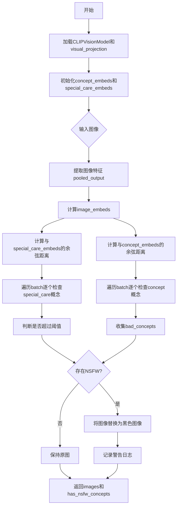
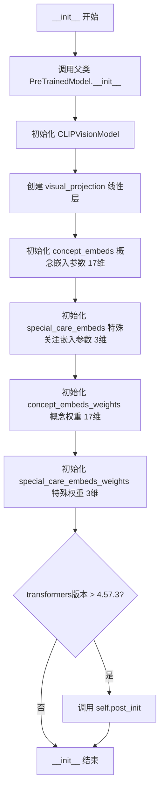
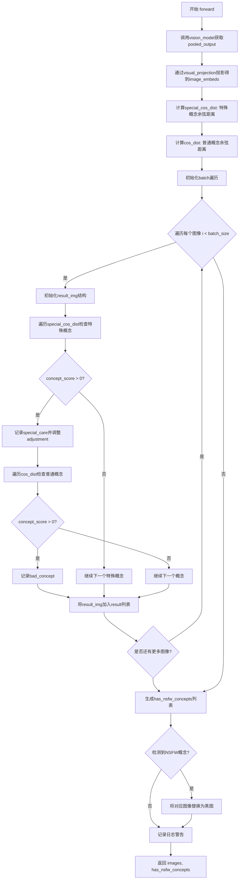

# `diffusers\src\diffusers\pipelines\stable_diffusion\safety_checker.py` 详细设计文档

StableDiffusionSafetyChecker是一个基于CLIP模型的内容安全检查器，用于检测图像中是否包含NSFW（不适合工作环境）内容，通过计算图像嵌入与预定义敏感概念的余弦相似度，识别并用黑色图像替换不安全的图像内容。

## 整体流程



## 类结构

```
StableDiffusionSafetyChecker (PreTrainedModel)
├── config_class: CLIPConfig
├── main_input_name: clip_input
├── _no_split_modules: [CLIPEncoderLayer]
├── vision_model: CLIPVisionModel
├── visual_projection: nn.Linear
├── concept_embeds: nn.Parameter (17, projection_dim)
├── special_care_embeds: nn.Parameter (3, projection_dim)
├── concept_embeds_weights: nn.Parameter (17)
└── special_care_embeds_weights: nn.Parameter (3)
```

## 全局变量及字段


### `logger`
    
模块级日志记录器，用于记录警告信息

类型：`logging.Logger`
    


### `np`
    
数值计算库，用于处理数组和数值运算

类型：`numpy`
    


### `torch`
    
深度学习框架，用于构建和运行神经网络

类型：`torch`
    


### `nn`
    
神经网络模块，提供层和损失函数等组件

类型：`torch.nn`
    


### `CLIPConfig`
    
CLIP配置类，用于存储CLIP模型配置参数

类型：`transformers.CLIPConfig`
    


### `CLIPVisionModel`
    
CLIP视觉模型，用于提取图像特征

类型：`transformers.CLIPVisionModel`
    


### `PreTrainedModel`
    
预训练模型基类，提供模型加载和保存功能

类型：`transformers.PreTrainedModel`
    


### `cosine_distance`
    
计算图像嵌入和文本嵌入之间的余弦相似度

类型：`function`
    


### `StableDiffusionSafetyChecker.vision_model`
    
CLIP视觉模型，用于从输入图像中提取特征向量

类型：`CLIPVisionModel`
    


### `StableDiffusionSafetyChecker.visual_projection`
    
线性投影层，将图像特征映射到投影维度空间

类型：`nn.Linear`
    


### `StableDiffusionSafetyChecker.concept_embeds`
    
17个概念的危险嵌入向量，用于检测不当内容

类型：`nn.Parameter`
    


### `StableDiffusionSafetyChecker.special_care_embeds`
    
3个需要特别关注的概念嵌入向量，用于敏感内容检测

类型：`nn.Parameter`
    


### `StableDiffusionSafetyChecker.concept_embeds_weights`
    
17个概念的阈值权重，用于判断是否为有害内容

类型：`nn.Parameter`
    


### `StableDiffusionSafetyChecker.special_care_embeds_weights`
    
3个特殊概念的阈值权重，用于敏感内容阈值判断

类型：`nn.Parameter`
    


### `StableDiffusionSafetyChecker.config_class`
    
配置类类型，指定为CLIPConfig

类型：`type`
    


### `StableDiffusionSafetyChecker.main_input_name`
    
主输入名称，指定为clip_input

类型：`str`
    


### `StableDiffusionSafetyChecker._no_split_modules`
    
不可拆分的模块列表，用于分布式训练

类型：`list`
    
    

## 全局函数及方法


### `cosine_distance`

该函数用于计算两组嵌入向量（图像嵌入和文本嵌入）之间的余弦相似度，通过对输入向量进行L2归一化后计算矩阵乘法得到相似度矩阵。

参数：

- `image_embeds`：`torch.Tensor`，图像嵌入向量，通常为二维张量，形状为 (batch_size, embedding_dim)
- `text_embeds`：`torch.Tensor`，文本嵌入向量，通常为二维张量，形状为 (num_concepts, embedding_dim)

返回值：`torch.Tensor`，返回余弦相似度矩阵，形状为 (batch_size, num_concepts)

#### 流程图

```mermaid
flowchart TD
    A[开始: cosine_distance] --> B[输入image_embeds和text_embeds]
    B --> C{调用nn.functional.normalize]
    C --> D[对image_embeds进行L2归一化]
    C --> E[对text_embeds进行L2归一化]
    D --> F[执行矩阵乘法: torch.mm]
    E --> F
    F --> G[返回相似度矩阵]
    G --> H[结束]
```

#### 带注释源码

```python
def cosine_distance(image_embeds, text_embeds):
    """
    计算两组嵌入向量之间的余弦相似度
    
    参数:
        image_embeds: 图像嵌入向量，形状为 (batch_size, embedding_dim)
        text_embeds: 文本嵌入向量，形状为 (num_concepts, embedding_dim)
    
    返回:
        余弦相似度矩阵，形状为 (batch_size, num_concepts)
    """
    # 使用L2范数对图像嵌入向量进行归一化，使其单位化
    # 这确保了向量长度为1，只保留方向信息
    normalized_image_embeds = nn.functional.normalize(image_embeds)
    
    # 对文本嵌入向量进行相同的归一化处理
    normalized_text_embeds = nn.functional.normalize(text_embeds)
    
    # 计算归一化向量的矩阵乘法
    # 相当于计算每对向量之间的点积，即余弦相似度
    # .t() 表示转置，将text_embeds从 (num_concepts, embedding_dim) 转为 (embedding_dim, num_concepts)
    # 结果矩阵形状: (batch_size, num_concepts)
    return torch.mm(normalized_image_embeds, normalized_text_embeds.t())
```

---

### 潜在的技术债务或优化空间

1. **命名与功能不匹配**：函数名为 `cosine_distance`（余弦距离），但实际计算的是余弦相似度。余弦距离通常定义为 `1 - 余弦相似度`，建议重命名为 `cosine_similarity` 以避免语义混淆。

2. **缺乏输入验证**：函数未对输入张量的形状、维度或数据类型进行验证，可能导致运行时错误或难以调试的问题。

3. **数值精度问题**：直接使用归一化后的向量进行矩阵乘法，在某些高精度场景下可能累积浮点误差。

---

### 其它项目

#### 设计目标与约束

- **目标**：高效计算大批量嵌入向量之间的余弦相似度，利用矩阵乘法优化性能
- **约束**：输入必须为 PyTorch 张量，且维度兼容

#### 错误处理与异常设计

- 当前无显式错误处理，建议在调用前确保输入张量维度匹配
- 建议添加类型检查和形状验证

#### 外部依赖与接口契约

- 依赖 `torch.nn.functional.normalize` 进行 L2 归一化
- 依赖 `torch.mm` 进行矩阵乘法
- 调用方需保证输入张量形状正确：`image_embeds` 为 (batch, dim)，`text_embeds` 为 (n, dim)


### `StableDiffusionSafetyChecker.__init__`

该方法是 `StableDiffusionSafetyChecker` 类的构造函数，负责初始化安全检查器的核心组件，包括视觉模型、投影层以及用于检测NSFW内容的概念嵌入权重。

参数：

- `self`：实例本身，无需显式传递
- `config`：`CLIPConfig`，包含CLIP模型的配置信息，用于初始化视觉模型和投影层

返回值：`None`，构造函数不返回任何值，仅在实例化时完成模型组件的初始化

#### 流程图



#### 带注释源码

```python
def __init__(self, config: CLIPConfig):
    """
    初始化 StableDiffusionSafetyChecker 模型
    
    参数:
        config: CLIPConfig 对象，包含视觉模型和投影层的配置信息
    """
    # 调用父类 PreTrainedModel 的初始化方法，注册配置
    super().__init__(config)

    # 初始化 CLIP 视觉模型，用于从输入图像提取特征
    # config.vision_config 包含视觉编码器的配置（如层数、隐藏维度等）
    self.vision_model = CLIPVisionModel(config.vision_config)
    
    # 创建视觉投影层，将视觉隐藏状态映射到投影空间
    # 输入维度: config.vision_config.hidden_size
    # 输出维度: config.projection_dim
    # bias=False: 投影层不使用偏置
    self.visual_projection = nn.Linear(config.vision_config.hidden_size, config.projection_dim, bias=False)

    # 初始化概念嵌入参数，用于检测17种不同的NSFW概念
    # 形状: (17, projection_dim)
    # requires_grad=False: 这些是预定义的固定权重，不参与训练
    self.concept_embeds = nn.Parameter(torch.ones(17, config.projection_dim), requires_grad=False)
    
    # 初始化特殊关注嵌入参数，用于检测3种需要特殊处理的敏感内容
    # 形状: (3, projection_dim)
    # requires_grad=False: 固定权重，不参与训练
    self.special_care_embeds = nn.Parameter(torch.ones(3, config.projection_dim), requires_grad=False)

    # 初始化概念嵌入的权重阈值，用于判断是否为NSFW内容
    # 形状: (17,)
    # 初始值为1.0，实际使用时可通过模型加载进行覆盖
    self.concept_embeds_weights = nn.Parameter(torch.ones(17), requires_grad=False)
    
    # 初始化特殊关注嵌入的权重阈值
    # 形状: (3,)
    # 初始值为1.0
    self.special_care_embeds_weights = nn.Parameter(torch.ones(3), requires_grad=False)
    
    # Model requires post_init after transformers v4.57.3
    # 检查 transformers 版本，如果大于 4.57.3 则调用 post_init
    # 这是为了兼容新版 transformers 库的资源初始化方式
    if is_transformers_version(">", "4.57.3"):
        self.post_init()
```


### `StableDiffusionSafetyChecker.forward`

该方法执行Stable Diffusion图像的NSFW（不适合工作内容）安全检查，通过CLIP视觉模型提取图像特征并与预定义的概念嵌入进行余弦相似度比较，检测到不安全内容时将图像替换为黑图并返回检测结果。

参数：

- `self`：实例本身，包含视觉模型、投影层和概念嵌入权重
- `clip_input`：`torch.Tensor`，CLIP模型的输入张量，通常是预处理后的图像张量
- `images`：`torch.Tensor` 或 `List[torch.Tensor]`，待检查的原始图像张量或图像列表

返回值：`Tuple[Any, List[bool]]`，返回处理后的图像（NSFW图像被替换为黑图）和布尔列表（每个图像是否包含NSFW概念）

#### 流程图



#### 带注释源码

```python
@torch.no_grad()
def forward(self, clip_input, images):
    """
    执行NSFW安全检查的前向传播
    
    参数:
        clip_input: CLIP模型的输入张量
        images: 待检查的图像张量或列表
    
    返回:
        处理后的图像和NSFW检测结果
    """
    # 1. 通过CLIP视觉模型获取池化输出
    pooled_output = self.vision_model(clip_input)[1]  # pooled_output
    
    # 2. 将池化输出投影到嵌入空间
    image_embeds = self.visual_projection(pooled_output)

    # 3. 计算与特殊概念嵌入的余弦距离（强制转换为float32以兼容bfloat16）
    special_cos_dist = cosine_distance(image_embeds, self.special_care_embeds).cpu().float().numpy()
    
    # 4. 计算与普通概念嵌入的余弦距离
    cos_dist = cosine_distance(image_embeds, self.concept_embeds).cpu().float().numpy()

    # 5. 初始化结果列表
    result = []
    batch_size = image_embeds.shape[0]
    
    # 6. 遍历batch中的每个图像
    for i in range(batch_size):
        result_img = {
            "special_scores": {},      # 特殊概念得分
            "special_care": [],        # 需要特殊关注的概念
            "concept_scores": {},      # 普通概念得分
            "bad_concepts": []         # 不安全概念列表
        }

        # 调整因子：增加此值会加强NSFW过滤但可能误判正常图像
        adjustment = 0.0

        # 7. 检查特殊概念（高风险类别）
        for concept_idx in range(len(special_cos_dist[0])):
            concept_cos = special_cos_dist[i][concept_idx]
            concept_threshold = self.special_care_embeds_weights[concept_idx].item()
            result_img["special_scores"][concept_idx] = round(concept_cos - concept_threshold + adjustment, 3)
            
            # 如果得分大于0，标记为需要特殊关注
            if result_img["special_scores"][concept_idx] > 0:
                result_img["special_care"].append({concept_idx, result_img["special_scores"][concept_idx]})
                adjustment = 0.01  # 后续概念检查使用更严格的阈值

        # 8. 检查普通概念（17个NSFW类别）
        for concept_idx in range(len(cos_dist[0])):
            concept_cos = cos_dist[i][concept_idx]
            concept_threshold = self.concept_embeds_weights[concept_idx].item()
            result_img["concept_scores"][concept_idx] = round(concept_cos - concept_threshold + adjustment, 3)
            
            # 如果得分大于0，记录为不安全概念
            if result_img["concept_scores"][concept_idx] > 0:
                result_img["bad_concepts"].append(concept_idx)

        result.append(result_img)

    # 9. 判断每个图像是否包含NSFW概念
    has_nsfw_concepts = [len(res["bad_concepts"]) > 0 for res in result]

    # 10. 将检测到NSFW的图像替换为黑图
    for idx, has_nsfw_concept in enumerate(has_nsfw_concepts):
        if has_nsfw_concept:
            if torch.is_tensor(images) or torch.is_tensor(images[0]):
                images[idx] = torch.zeros_like(images[idx])  # PyTorch张量情况
            else:
                images[idx] = np.zeros(images[idx].shape)   # NumPy数组情况

    # 11. 记录警告日志
    if any(has_nsfw_concepts):
        logger.warning(
            "Potential NSFW content was detected in one or more images. A black image will be returned instead."
            " Try again with a different prompt and/or seed."
        )

    # 12. 返回处理后的图像和检测结果
    return images, has_nsfw_concepts
```


### `StableDiffusionSafetyChecker.forward_onnx`

ONNX优化版本的前向传播方法，用于检测图像中是否存在潜在的不安全内容（NSFW），通过计算图像嵌入与预定义概念嵌入之间的余弦相似度来判断，并将检测到的不安全图像替换为黑图。

参数：

- `self`：类的实例方法隐含参数，无需显式传递
- `clip_input`：`torch.Tensor`，CLIP模型的输入图像张量，通常为批次形式的预处理图像数据
- `images`：`torch.Tensor`，原始输入图像张量列表或批次，用于在检测到不安全内容时替换为黑图

返回值：`Tuple[torch.Tensor, torch.Tensor]`，返回两个张量组成的元组：
- 第一个元素为处理后的图像张量，不安全图像已被替换为黑图
- 第二个元素为布尔张量，表示每个图像是否包含不安全概念

#### 流程图

```mermaid
flowchart TD
    A[开始 forward_onnx] --> B[获取CLIP视觉模型的池化输出]
    B --> C[通过视觉投影层获取图像嵌入]
    D[计算特殊概念余弦距离] --> E[计算概念余弦距离]
    C --> D
    C --> E
    E --> F[初始化调整值为0.0]
    F --> G[计算特殊分数: special_scores = special_cos_dist - special_care_embeds_weights]
    G --> H[判断是否有特殊关注概念: special_care = any(special_scores > 0, dim=1)]
    H --> I[计算特殊调整值: special_adjustment = special_care * 0.01]
    I --> J[扩展特殊调整值维度以匹配概念分数形状]
    J --> K[计算最终概念分数: concept_scores = cos_dist - concept_embeds_weights + special_adjustment]
    K --> L[判断是否有不安全概念: has_nsfw_concepts = any(concept_scores > 0, dim=1)]
    L --> M{是否存在不安全概念?}
    M -->|是| N[将对应图像置为黑图: images[has_nsfw_concepts] = 0.0]
    M -->|否| O[保留原始图像]
    N --> P[返回处理后的图像和NSFW标志]
    O --> P
```

#### 带注释源码

```python
@torch.no_grad()
def forward_onnx(self, clip_input: torch.Tensor, images: torch.Tensor):
    """
    ONNX优化版本的前向传播方法，用于安全检查
    
    该方法相比标准forward方法进行了优化：
    1. 移除了CPU转换和numpy操作，全部在GPU/Tensor上完成
    2. 使用向量化操作替代逐样本循环
    3. 移除了精度舍入操作以提高性能
    """
    
    # 步骤1: 通过CLIP视觉模型获取图像的池化输出
    # clip_input: 预处理后的图像张量 [batch_size, num_channels, height, width]
    # pooled_output: 池化后的视觉特征 [batch_size, vision_hidden_size]
    pooled_output = self.vision_model(clip_input)[1]
    
    # 步骤2: 将视觉特征投影到投影空间
    # image_embeds: 投影后的图像嵌入 [batch_size, projection_dim]
    image_embeds = self.visual_projection(pooled_output)
    
    # 步骤3: 计算图像嵌入与特殊概念嵌入之间的余弦距离
    # special_care_embeds: 需要特别关注的概念嵌入 [3, projection_dim]
    # special_cos_dist: 特殊概念余弦距离 [batch_size, 3]
    special_cos_dist = cosine_distance(image_embeds, self.special_care_embeds)
    
    # 步骤4: 计算图像嵌入与所有概念嵌入之间的余弦距离
    # concept_embeds: 所有概念嵌入 [17, projection_dim]
    # cos_dist: 概念余弦距离 [batch_size, 17]
    cos_dist = cosine_distance(image_embeds, self.concept_embeds)
    
    # 步骤5: 设置调整参数（用于调节NSFW检测的敏感度）
    # 增加此值会增强NSFW过滤强度，但可能增加误报的可能性
    adjustment = 0.0
    
    # 步骤6: 计算特殊概念的分数
    # special_care_embeds_weights: 特殊概念的阈值权重 [3]
    # special_scores: 特殊概念分数 [batch_size, 3]
    special_scores = special_cos_dist - self.special_care_embeds_weights + adjustment
    
    # 步骤7: 判断每个图像是否触发特殊关注概念
    # special_care: 布尔张量，标识是否有特殊关注概念 [batch_size]
    special_care = torch.any(special_scores > 0, dim=1)
    
    # 步骤8: 如果触发特殊关注概念，应用调整值0.01
    # 这是一种自适应阈值机制
    special_adjustment = special_care * 0.01
    
    # 步骤9: 扩展调整值维度以匹配概念分数的形状
    # 确保调整值可以广播到所有概念
    special_adjustment = special_adjustment.unsqueeze(1).expand(-1, cos_dist.shape[1])
    
    # 步骤10: 计算最终概念分数（包含特殊调整）
    # concept_embeds_weights: 所有概念的阈值权重 [17]
    # concept_scores: 最终概念分数 [batch_size, 17]
    concept_scores = (cos_dist - self.concept_embeds_weights) + special_adjustment
    
    # 步骤11: 判断每个图像是否包含不安全概念
    # has_nsfw_concepts: 布尔张量，标识是否包含NSFW概念 [batch_size]
    has_nsfw_concepts = torch.any(concept_scores > 0, dim=1)
    
    # 步骤12: 将检测到不安全内容的图像替换为黑图
    # 直接在原始图像张量上进行就地修改
    images[has_nsfw_concepts] = 0.0
    
    # 步骤13: 返回处理后的图像和NSFW检测标志
    return images, has_nsfw_concepts
```

## 关键组件


### 余弦距离计算函数

用于计算图像嵌入和文本嵌入之间的余弦相似度距离，通过L2归一化后进行矩阵乘法得到余弦相似度矩阵。

### StableDiffusionSafetyChecker 类

主安全检查器模型，继承自PreTrainedModel，用于检测图像中是否包含NSFW（不适合在工作场所查看）内容，基于CLIP视觉模型进行内容安全审查。

### CLIPVisionModel 视觉模型

集成的CLIP视觉编码器模型，用于从输入图像中提取视觉特征表示，是安全检查的核心特征提取组件。

### 视觉投影层 (visual_projection)

将CLIP视觉模型的输出 hidden_size 维度映射到 projection_dim 维度的线性层，用于与概念嵌入进行相似度计算。

### 概念嵌入 (concept_embeds)

17个预定义概念的安全检查嵌入向量，用于检测常见的NSFW概念类别，形状为 (17, projection_dim)，无需梯度更新。

### 特殊关注嵌入 (special_care_embeds)

3个需要特殊关注的概念嵌入向量，用于检测更敏感的内容类别，形状为 (3, projection_dim)，无需梯度更新。

### 概念权重参数 (concept_embeds_weights)

17个概念对应的阈值权重，用于判断概念相似度是否超过安全阈值，形状为 (17,)，无需梯度更新。

### 特殊关注权重参数 (special_care_embeds_weights)

3个特殊概念对应的阈值权重，用于更严格的敏感内容检测，形状为 (3,)，无需梯度更新。

### forward 方法

标准PyTorch前向传播方法，对批量图像进行安全检查，返回处理后的图像和NSFW概念检测结果列表，包含逐图像的概念评分计算。

### forward_onnx 方法

针对ONNX推理优化的前向传播方法，使用向量化操作替代循环，提升推理性能，适用于生产环境部署。

### NSFW检测与黑屏处理逻辑

检测到NSFW内容时将图像替换为黑屏（零张量或零数组），提供视觉上的内容过滤保护机制。

### 调整因子机制 (adjustment)

动态调整机制，当特殊概念检测超标时增加微小的调整值（0.01），使后续概念检测更加敏感，增强安全检查的严格性。


## 问题及建议


### 已知问题

-   **设备传输开销**：`forward`方法中多次使用`.cpu().float().numpy()`将张量转移到CPU并转换为NumPy数组，导致不必要的设备间数据传输，影响性能
-   **Python循环效率低**：`forward`方法中使用Python for循环遍历batch，在大批量推理时性能较差，应使用向量化操作
-   **逻辑不一致风险**：`forward`方法和`forward_onnx`方法在计算`concept_scores`时，adjustment的应用逻辑虽然最终结果可能一致，但代码实现风格不统一，增加了维护难度
-   **硬编码维度值**：代码中硬编码了`17`（概念数量）和`3`（特殊关注概念数量），降低了可扩展性
-   **类型检查脆弱性**：在修改图像时使用`torch.is_tensor(images) or torch.is_tensor(images[0])`检查类型，如果`images`是空列表会引发IndexError
-   **API设计问题**：方法命名`forward_onnx`表明是为ONNX优化，但实际未使用ONNX特定优化，且未提供统一接口
-   **版本判断潜在问题**：使用字符串比较`">"`进行版本判断可能在某些版本格式下产生非预期结果
-   **参数命名不一致**：类中`self.concept_embeds_weights`和`self.special_care_embeds_weights`命名为weights但实际用作threshold
-   **缺少输入验证**：没有对`clip_input`和`images`进行形状或类型验证

### 优化建议

-   **向量化操作**：将`forward`方法中的batch循环改为完全向量化的张量操作，使用`torch.where`和掩码操作替代循环
-   **保持设备一致性**：尽量在GPU上完成所有计算，仅在最终返回结果时再考虑设备转换
-   **统一接口**：考虑重构为单一`forward`方法，通过参数控制行为，或提取公共逻辑到私有方法
-   **配置化设计**：将概念数量（17、3）改为从配置对象读取，提高可配置性
-   **健壮性增强**：增加输入验证逻辑，处理空列表、错误类型等边界情况
-   **类型注解完善**：为所有方法添加完整的类型注解，提高代码可读性和IDE支持
-   **文档注释**：为公共方法添加docstring，说明参数、返回值和行为
-   **日志优化**：将warning改为debug级别或提供开关控制，因为每次检测到NSFW都警告可能造成日志噪音
-   **常量提取**：将`0.0`和`0.01`等魔法数字定义为类常量或配置参数


## 其它


### 设计目标与约束

该模块旨在为Stable Diffusion提供NSFW（不适合工作环境）内容过滤功能，确保生成的图像内容符合安全要求。设计约束包括：1) 必须兼容transformers库v4.57.3以上版本的部分特性；2) 模型参数设置为`requires_grad=False`以确保推理模式下的稳定性；3) 图像处理需支持torch.Tensor和numpy数组两种输入格式。

### 错误处理与异常设计

代码中主要的异常处理场景包括：1) 当检测到NSFW内容时，通过logger.warning发出警告而非抛出异常，保证流程继续执行；2) 图像类型检查使用`torch.is_tensor()`判断是否为张量或张量列表，以适配不同的输入格式；3) 版本检查使用`is_transformers_version()`函数进行条件判断，版本兼容性处理 gracefully degrade。潜在改进：可添加对空输入或异常形状输入的校验。

### 数据流与状态机

数据流处理流程：1) 接收clip_input（CLIP处理的图像）和原始images；2) 通过vision_model提取图像特征并pooling；3) 通过visual_projection映射到投影空间；4) 计算与special_care_embeds（3个特殊概念）和concept_embeds（17个普通概念）的余弦相似度；5) 根据阈值和adjustment计算每个概念的得分；6) 标记有问题的概念并决定是否替换为黑色图像；7) 返回处理后的images和has_nsfw_concepts标志。状态机表现为从正常图像到可能替换为黑色图像的状态转换。

### 外部依赖与接口契约

主要外部依赖：1) `numpy` - 数值计算和数组操作；2) `torch` - 深度学习框架；3) `torch.nn` - 神经网络模块；4) `transformers` - CLIPConfig, CLIPVisionModel, PreTrainedModel；5) `transformers.utils` - 版本检查和日志工具。接口契约：forward方法接收clip_input（CLIP处理的图像张量）和images（原始图像），返回处理后的images和has_nsfw_concepts列表；forward_onnx方法为ONNX推理优化版本，接收相同参数但使用纯PyTorch操作。

### 性能考虑

性能优化点：1) 使用`@torch.no_grad()`装饰器禁用梯度计算，减少内存占用；2) 始终将计算结果转换为float32以兼容bfloat16设备；3) CPU转换使用`.cpu().float().numpy()`；4) forward_onnx方法避免CPU转换以提高推理速度。潜在优化空间：批量处理中的循环可向量化以提高效率；概念嵌入和权重可预先计算部分结果。

### 安全考虑

安全机制：1) 检测到NSFW内容时自动替换为黑色图像而非返回原图；2) 参数设置`requires_grad=False`防止意外训练修改；3) 日志警告提示用户尝试其他prompt。安全边界：仅检测预设的20个概念（3个特殊+17个普通），无法覆盖所有NSFW场景；对对抗性输入的鲁棒性有限。

### 配置与参数说明

关键配置参数：1) `config.vision_config.hidden_size` - 视觉模型隐藏层维度；2) `config.projection_dim` - 投影维度（通常为512或768）；3) concept_embeds weights和special_care_embeds weights - 可调整的阈值参数；4) adjustment值（默认0.0）和special_care的额外adjustment（0.01）- 用于控制过滤敏感度。这些参数可通过config对象或直接修改nn.Parameter来调整。

### 版本兼容性

版本相关处理：1) transformers v4.57.3以上版本需要调用`post_init()`方法；2) 使用`is_transformers_version(">", "4.57.3")`进行条件判断；3) 低于该版本时跳过post_init调用。兼容性策略：通过条件分支支持不同版本的功能差异，实现向后兼容。

### 测试考虑

测试应覆盖：1) 正常图像输入不触发过滤；2) NSFW图像被正确识别并替换为黑色；3) batch_size>1的批量处理；4) torch.Tensor和numpy数组两种输入格式；5) 空batch或异常输入的处理；6) forward和forward_onnx结果一致性验证；7) 版本兼容性逻辑的测试覆盖。

### 使用示例

基本用法：
```python
from diffusers import StableDiffusionSafetyChecker
from transformers import CLIPConfig

config = CLIPConfig()
safety_checker = StableDiffusionSafetyChecker(config)
# clip_input来自CLIPProcessor处理后的图像
filtered_images, has_nsfw = safety_checker.forward(clip_input, original_images)
```

ONNX推理用法：
```python
filtered_images, has_nsfw = safety_checker.forward_onnx(clip_input, images)
```


    