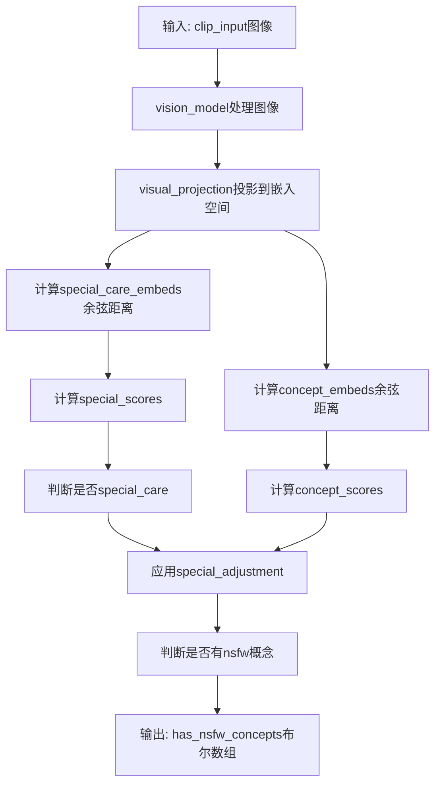
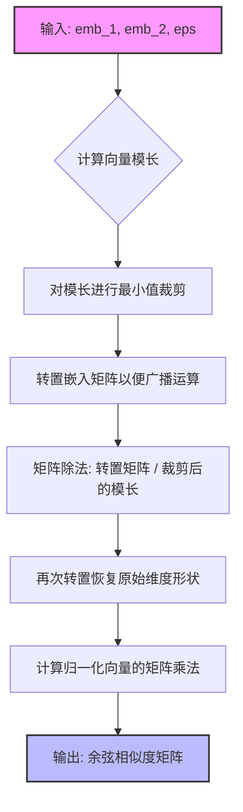
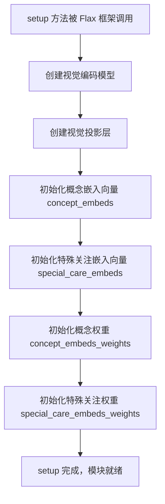
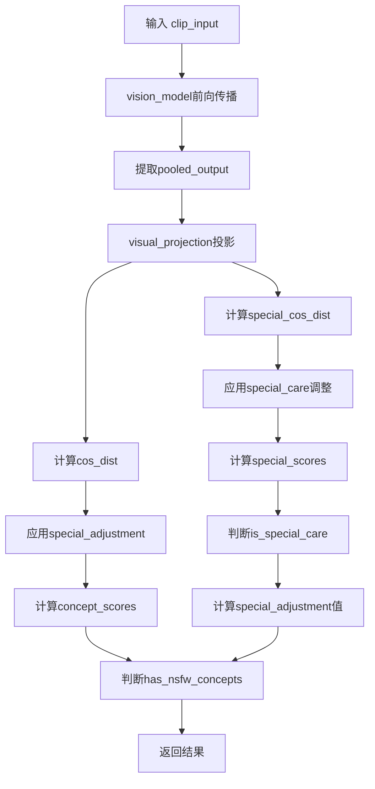
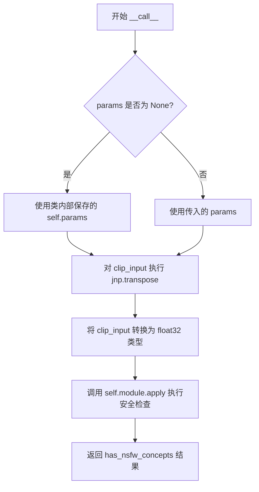

# `diffusers\src\diffusers\pipelines\stable_diffusion\safety_checker_flax.py` 详细设计文档

该代码实现了一个基于CLIP视觉模型的NSFW（不宜内容）安全检查器，用于在Stable Diffusion生成图像后检测并过滤不适当的内容。它使用Flax框架构建，通过计算图像嵌入与预设概念嵌入之间的余弦距离来判断图像是否包含敏感内容。

## 整体流程



## 类结构

```
FlaxPreTrainedModel (transformers基类)
└── FlaxStableDiffusionSafetyChecker
    └── FlaxStableDiffusionSafetyCheckerModule (nn.Module)
```

## 全局变量及字段


### `jax_cosine_distance`
    
全局函数：计算两个嵌入向量之间的余弦距离

类型：`function`
    


### `FlaxCLIPVisionModule`
    
从transformers库导入的CLIP视觉模块，用于提取图像特征

类型：`class (imported)`
    


### `CLIPConfig`
    
CLIP模型配置类，定义模型结构和参数

类型：`class (imported)`
    


### `FlaxPreTrainedModel`
    
Flax预训练模型基类，提供模型初始化和推理的标准接口

类型：`class (imported)`
    


### `FlaxStableDiffusionSafetyCheckerModule.config`
    
CLIP模型配置对象，包含模型架构参数

类型：`CLIPConfig`
    


### `FlaxStableDiffusionSafetyCheckerModule.dtype`
    
数据类型，默认为float32，用于控制计算精度

类型：`jnp.dtype`
    


### `FlaxStableDiffusionSafetyCheckerModule.vision_model`
    
CLIP视觉模型子模块，用于提取图像嵌入向量

类型：`FlaxCLIPVisionModule`
    


### `FlaxStableDiffusionSafetyCheckerModule.visual_projection`
    
视觉嵌入投影层，将图像特征映射到投影空间

类型：`nn.Dense`
    


### `FlaxStableDiffusionSafetyCheckerModule.concept_embeds`
    
17个概念嵌入权重，用于检测NSFW概念

类型：`nn.Parameter`
    


### `FlaxStableDiffusionSafetyCheckerModule.special_care_embeds`
    
3个特殊关注概念嵌入，用于检测需要特别关注的概念

类型：`nn.Parameter`
    


### `FlaxStableDiffusionSafetyCheckerModule.concept_embeds_weights`
    
17个概念权重，用于调整每个概念的检测阈值

类型：`nn.Parameter`
    


### `FlaxStableDiffusionSafetyCheckerModule.special_care_embeds_weights`
    
3个特殊关注权重，用于调整特殊概念的检测阈值

类型：`nn.Parameter`
    


### `FlaxStableDiffusionSafetyChecker.config_class`
    
配置类为CLIPConfig，指定模型使用的配置类型

类型：`type`
    


### `FlaxStableDiffusionSafetyChecker.main_input_name`
    
主输入名称为'clip_input'，定义模型主输入参数名

类型：`str`
    


### `FlaxStableDiffusionSafetyChecker.module_class`
    
模块类为FlaxStableDiffusionSafetyCheckerModule，指定底层实现类

类型：`type`
    
    

## 全局函数及方法


### `jax_cosine_distance`

这是一个全局函数，用于计算两个嵌入矩阵之间的余弦相似度（Cosine Similarity）。该函数首先对输入的两个嵌入向量进行 L2 归一化处理，以消除向量长度的影响，随后计算归一化向量的点积得到相似度矩阵。为了保证数值稳定性，函数内部使用 `eps` 参数对向量的模长进行了最小值裁剪，防止除零错误。

参数：

- `emb_1`：`jnp.ndarray`，第一个嵌入矩阵，通常形状为 `(batch_size, embedding_dim)`，每一行代表一个向量。
- `emb_2`：`jnp.ndarray`，第二个嵌入矩阵，形状应与 `emb_1` 兼容。
- `eps`：`float`，裁剪阈值，用于防止向量模长为零时导致除零错误，默认为 `1e-12`。

返回值：`jnp.ndarray`，返回两个矩阵的余弦相似度矩阵，形状为 `(emb_1行数, emb_2行数)`。矩阵中的每个元素代表 `emb_1` 中对应行向量与 `emb_2` 中对应行向量的余弦相似度。

#### 流程图



#### 带注释源码

```python
def jax_cosine_distance(emb_1, emb_2, eps=1e-12):
    # 步骤 1: 计算 emb_1 每个向量的 L2 范数 (沿着 axis=1 即行方向)
    # 形状从 (N, D) 变为 (N,)
    norms_1 = jnp.linalg.norm(emb_1, axis=1)
    
    # 步骤 2: 使用 eps 裁剪范数最小值，防止除零产生 NaN 或 Inf
    clipped_norms_1 = jnp.clip(norms_1, a_min=eps)
    
    # 步骤 3: 归一化处理
    # emb_1.T 变为 (D, N)，clipped_norms_1 广播为 (D, N)，逐元素除法后转置回 (N, D)
    # 这里实现了 L2 归一化: v / ||v||
    norm_emb_1 = jnp.divide(emb_1.T, clipped_norms_1).T

    # 步骤 4: 对 emb_2 进行相同的归一化处理
    norms_2 = jnp.linalg.norm(emb_2, axis=1)
    clipped_norms_2 = jnp.clip(norms_2, a_min=eps)
    norm_emb_2 = jnp.divide(emb_2.T, clipped_norms_2).T

    # 步骤 5: 计算归一化向量的点积 (即余弦相似度)
    # 形状为 (N, M)，N 和 M 分别为 emb_1 和 emb_2 的 batch 大小
    return jnp.matmul(norm_emb_1, norm_emb_2.T)
```


### FlaxStableDiffusionSafetyCheckerModule.setup

该方法负责在 Flax 模块初始化阶段自动调用，用于初始化安全检查器的核心组件：视觉编码模型、投影层以及四组可训练的概念嵌入向量和权重参数，为后续的内容安全检测提供基础架构。

参数：
由于 `setup()` 是 Flax 框架的内部生命周期方法，在用户代码中不直接调用，因此**无显式参数**。`self` 为隐式参数，表示模块实例本身。

返回值：该方法无显式返回值（`None`），通过 `self.xxx = ...` 的方式在实例上注册子模块和可训练参数。

#### 流程图



#### 带注释源码

```python
def setup(self):
    """
    初始化安全检查器的子模块和可训练参数。
    此方法由 Flax 框架在模块构建时自动调用。
    """
    # 1. 初始化 CLIP 视觉编码模型，用于提取图像特征
    #    输入: vision_config (来自 CLIPConfig)
    #    输出: 图像的潜在表示
    self.vision_model = FlaxCLIPVisionModule(self.config.vision_config)
    
    # 2. 初始化视觉投影层，将视觉特征映射到投影空间
    #    输入维度: 由 vision_config 决定
    #    输出维度: projection_dim (投影维度)
    #    use_bias=False: 投影矩阵无需偏置
    #    dtype: 计算数据类型 (默认 float32)
    self.visual_projection = nn.Dense(
        self.config.projection_dim, 
        use_bias=False, 
        dtype=self.dtype
    )

    # 3. 初始化概念嵌入向量 (concept_embeds)
    #    形状: (17, projection_dim)
    #    17 代表 17 种预设的安全相关概念类别
    #    使用 ones 初始化器进行初始化
    #    这些是模型的可训练参数
    self.concept_embeds = self.param(
        "concept_embeds", 
        jax.nn.initializers.ones, 
        (17, self.config.projection_dim)
    )
    
    # 4. 初始化特殊关注嵌入向量 (special_care_embeds)
    #    形状: (3, projection_dim)
    #    3 代表需要特别关注的概念类别
    #    同样使用 ones 初始化
    self.special_care_embeds = self.param(
        "special_care_embeds", 
        jax.nn.initializers.ones, 
        (3, self.config.projection_dim)
    )

    # 5. 初始化概念嵌入的权重 (concept_embeds_weights)
    #    形状: (17,)
    #    用于调整每种概念的风险阈值
    self.concept_embeds_weights = self.param(
        "concept_embeds_weights", 
        jax.nn.initializers.ones, 
        (17,)
    )
    
    # 6. 初始化特殊关注嵌入的权重 (special_care_embeds_weights)
    #    形状: (3,)
    #    用于调整特殊关注概念的风险阈值
    self.special_care_embeds_weights = self.param(
        "special_care_embeds_weights", 
        jax.nn.initializers.ones, 
        (3,)
    )
```


### `FlaxStableDiffusionSafetyCheckerModule.__call__`

执行安全检查的前向传播过程，将CLIP视觉模型提取的图像特征与预定义的概念嵌入进行余弦相似度计算，通过调整阈值和权重判断输入图像是否包含不当内容（NSFW）。

参数：

- `clip_input`：图像输入张量，来自CLIP视觉模型的预处理结果

返回值：`jnp.ndarray`（布尔类型数组），表示每个输入图像是否包含NSFW概念

#### 流程图



#### 带注释源码

```python
def __call__(self, clip_input):
    """
    执行安全检查前向传播
    
    参数:
        clip_input: 图像输入，形状为(batch, height, width, channels)
                   经过CLIP预处理的图像张量
    
    返回:
        has_nsfw_concepts: 布尔数组，形状为(batch,)
                          True表示图像包含NSFW概念
    """
    # 步骤1: 通过CLIP视觉模型提取图像特征
    # vision_model返回元组(last_hidden_state, pooled_output)
    # pooled_output是图像的全局表示
    pooled_output = self.vision_model(clip_input)[1]
    
    # 步骤2: 将pooled_output投影到投影维度
    # 得到图像的嵌入向量表示
    image_embeds = self.visual_projection(pooled_output)
    
    # 步骤3: 计算图像嵌入与特殊关怀嵌入的余弦距离
    # special_care_embeds: 形状为(3, projection_dim)
    # 用于检测需要特别关注的概念（如暴力、仇恨等）
    special_car_dist = jax_cosine_distance(image_embeds, self.special_care_embeds)
    
    # 步骤4: 计算图像嵌入与一般概念嵌入的余弦距离
    # concept_embeds: 形状为(17, projection_dim)
    # 包含17种不当内容的概念嵌入
    cos_dist = jax_cosine_distance(image_embeds, self.concept_embeds)
    
    # 步骤5: 初始化调整值
    # 可通过增加此值加强NSFW过滤强度
    # 代价是可能增加误报概率
    adjustment = 0.0
    
    # 步骤6: 计算特殊关怀概念得分
    # 得分 = 余弦距离 - 权重 + 调整值
    special_scores = special_cos_dist - self.special_care_embeds_weights[None, :] + adjustment
    # 四舍五入到3位小数，提高数值稳定性
    special_scores = jnp.round(special_scores, 3)
    
    # 步骤7: 判断是否有特殊关怀概念
    # 任一特殊概念得分大于0则标记为需要特殊关怀
    is_special_care = jnp.any(special_scores > 0, axis=1, keepdims=True)
    
    # 步骤8: 计算特殊调整值
    # 如果图像有特殊关怀概念，使用更低的阈值(0.01)
    special_adjustment = is_special_care * 0.01
    
    # 步骤9: 计算一般概念得分
    # 包含特殊调整值的影响
    concept_scores = cos_dist - self.concept_embeds_weights[None, :] + special_adjustment
    concept_scores = jnp.round(concept_scores, 3)
    
    # 步骤10: 判断是否包含NSFW概念
    # 任一概念得分大于0则判定为包含NSFW内容
    has_nsfw_concepts = jnp.any(concept_scores > 0, axis=1)
    
    return has_nsfw_concepts
```


### `FlaxStableDiffusionSafetyChecker.__init__`

初始化安全检查器模型，设置CLIP配置、输入形状、随机种子和数据类型，并创建底层Flax模块实例，然后调用父类构造函数完成模型初始化。

参数：

- `config`：`CLIPConfig`，CLIP模型配置对象，包含视觉配置、投影维度等模型参数
- `input_shape`：`tuple | None`，输入图像的形状，默认为(1, 224, 224, 3)（批次、高度、宽度、通道）
- `seed`：`int`，随机种子，用于模型权重的随机初始化，默认为0
- `dtype`：`jnp.dtype`，JAX数组的数据类型，默认为jnp.float32（32位浮点）
- `_do_init`：`bool`，是否执行实际初始化操作，默认为True；设置为False时仅创建对象结构而不初始化权重
- `**kwargs`：可变关键字参数，会传递给底层模块类和父类构造函数

返回值：`None`，该方法无返回值，直接初始化对象状态

#### 流程图

```mermaid
flowchart TD
    A[开始 __init__] --> B{input_shape is None?}
    B -->|是| C[设置 input_shape = (1, 224, 224, 3)]
    B -->|否| D[使用传入的 input_shape]
    C --> E[创建 FlaxStableDiffusionSafetyCheckerModule 实例]
    D --> E
    E --> F[调用父类 FlaxPreTrainedModel.__init__]
    F --> G[传入 config, module, input_shape, seed, dtype, _do_init]
    G --> H[结束]
```

#### 带注释源码

```
def __init__(
    self,
    config: CLIPConfig,
    input_shape: tuple | None = None,
    seed: int = 0,
    dtype: jnp.dtype = jnp.float32,
    _do_init: bool = True,
    **kwargs,
):
    # 如果未指定输入形状，则使用默认的图像形状 (批次=1, 高=224, 宽=224, 通道=3)
    # 这是CLIP模型标准的输入尺寸
    if input_shape is None:
        input_shape = (1, 224, 224, 3)
    
    # 创建底层Flax模块实例，传入配置和数据类型
    # module_class 指向 FlaxStableDiffusionSafetyCheckerModule
    # 该模块包含视觉模型、投影层、概念嵌入等组件
    module = self.module_class(config=config, dtype=dtype, **kwargs)
    
    # 调用父类 FlaxPreTrainedModel 的构造函数完成初始化
    # 父类会负责：
    # 1. 将配置转换为Flax参数结构
    # 2. 使用给定seed初始化随机数生成器
    # 3. 根据_do_init决定是否执行权重初始化
    # 4. 设置模型的dtype和input_shape属性
    super().__init__(config, module, input_shape=input_shape, seed=seed, dtype=dtype, _do_init=_do_init)
```


### `FlaxStableDiffusionSafetyChecker.init_weights`

该方法负责初始化 FlaxStableDiffusionSafetyChecker 模型的权重，通过使用 JAX 随机数生成器创建随机输入张量，将其拆分为参数和 dropout 使用的随机数，然后调用内部模块的初始化方法生成随机参数并返回。

参数：

- `rng`：`jax.Array`，JAX 随机数生成器，用于生成随机数和拆分随机种子
- `input_shape`：`tuple`，输入张量的形状，通常为 (batch_size, height, width, channels)
- `params`：`FrozenDict`，可选的预定义参数，用于从已有参数初始化（当前未使用）

返回值：`FrozenDict`，包含随机初始化的模型参数

#### 流程图

```mermaid
flowchart TD
    A[开始 init_weights] --> B[使用 rng 和 input_shape 创建随机输入张量 clip_input]
    B --> C[将 rng 拆分为 params_rng 和 dropout_rng]
    C --> D[构建 rngs 字典: {params: params_rng, dropout: dropout_rng}]
    D --> E[调用 self.module.init 并传入 rngs 和 clip_input]
    E --> F[从初始化结果中提取 params]
    F --> G[返回随机初始化的 params]
```

#### 带注释源码

```python
def init_weights(self, rng: jax.Array, input_shape: tuple, params: FrozenDict = None) -> FrozenDict:
    # 使用 JAX 随机数生成器和指定形状创建随机输入张量
    # 作为模型初始化的虚拟输入，用于触发模块的 setup() 和参数初始化
    clip_input = jax.random.normal(rng, input_shape)

    # 将随机数生成器拆分为两个子生成器：
    # - params_rng: 用于初始化模型参数
    # - dropout_rng: 用于 dropout 层（在训练时使用）
    params_rng, dropout_rng = jax.random.split(rng)

    # 构建 rngs 字典，传递给模块的 init 方法
    # 这允许不同组件使用独立的随机数流
    rngs = {"params": params_rng, "dropout": dropout_rng}

    # 调用内部模块的初始化方法
    # 这会执行 FlaxStableDiffusionSafetyCheckerModule 的 setup()
    # 并使用传入的随机数生成随机参数
    random_params = self.module.init(rngs, clip_input)["params"]

    # 从初始化结果字典中提取参数并返回
    return random_params
```


### `FlaxStableDiffusionSafetyChecker.__call__`

该方法是 FlaxStableDiffusionSafetyChecker 类的主要推理接口，接收图像输入和可选参数，对输入进行维度转换后调用内部模块执行内容安全检查，最终返回图像是否存在不宜内容（NSFW）的布尔判断结果。

参数：

- `clip_input`：任意类型，输入的图像张量，通常为 (batch, channels, height, width) 格式
- `params`：字典类型，可选参数，用于指定模型权重，默认为 None（使用内部预训练参数）

返回值：任意类型，返回内部模块 apply 方法的输出，通常为布尔数组，表示每个输入图像是否包含不安全内容

#### 流程图



#### 带注释源码

```python
def __call__(
    self,
    clip_input,
    params: dict = None,
):
    """
    执行安全检查推理的主方法
    
    参数:
        clip_input: 输入图像张量，格式为 (batch, channels, height, width)
        params: 可选的参数字典，如果为 None 则使用模型内置参数
    
    返回:
        安全检查结果数组
    """
    # 将输入从 (batch, channel, height, width) 转换为 (batch, height, width, channel)
    # 这是因为 Flax/JAX 和 PyTorch 的通道顺序不同
    clip_input = jnp.transpose(clip_input, (0, 2, 3, 1))

    # 调用内部模块的 apply 方法进行前向传播
    # 将输入转换为 float32 以确保数值精度
    return self.module.apply(
        {"params": params or self.params},  # 合并参数字典
        jnp.array(clip_input, dtype=jnp.float32),  # 确保数据类型一致
        rngs={},  # 不需要随机数（推理模式）
    )
```

---

### 1. 一段话描述

FlaxStableDiffusionSafetyChecker 是一个基于 Flax 框架的图像内容安全检查模型，用于判断输入图像是否包含不宜公开内容（NSFW）。该模块内部集成了 CLIP 视觉模型，通过计算图像嵌入与预设概念嵌入之间的余弦相似度来检测潜在的不安全内容，并返回布尔数组结果。

### 2. 文件的整体运行流程

```
┌─────────────────────────────────────────────────────────────────────┐
│                     FlaxStableDiffusionSafetyChecker                │
├─────────────────────────────────────────────────────────────────────┤
│  初始化阶段                                                         │
│  ├── __init__(config, input_shape, seed, dtype)                    │
│  │   ├── 创建 FlaxStableDiffusionSafetyCheckerModule               │
│  │   └── 调用父类 FlaxPreTrainedModel 初始化                       │
│  └── init_weights(rng, input_shape)                                │
│      └── 初始化模型权重                                             │
│                                                                     │
│  推理阶段                                                           │
│  ├── __call__(clip_input, params)                                  │
│  │   ├── 输入预处理（维度转换）                                      │
│  │   └── 调用模块 apply 方法                                        │
│  │       └── FlaxStableDiffusionSafetyCheckerModule.__call__       │
│  │           ├── vision_model 提取图像特征                          │
│  │           ├── visual_projection 投影到嵌入空间                   │
│  │           ├── 计算与概念嵌入的余弦距离                           │
│  │           └── 返回 NSFW 判断结果                                 │
└─────────────────────────────────────────────────────────────────────┘
```

### 3. 类的详细信息

#### 3.1 全局函数

**jax_cosine_distance**

- 名称：`jax_cosine_distance`
- 参数：
  - `emb_1`：jnp.ndarray，第一个嵌入向量
  - `emb_2`：jnp.ndarray，第二个嵌入向量
  - `eps`：float，可选，默认 1e-12，用于防止除零
- 返回值：`jnp.ndarray`，余弦相似度矩阵

#### 3.2 类：FlaxStableDiffusionSafetyCheckerModule

**类字段：**

- `config`：CLIPConfig，CLIP 模型配置
- `dtype`：jnp.dtype，计算数据类型，默认为 jnp.float32
- `vision_model`：FlaxCLIPVisionModule，CLIP 视觉编码器
- `visual_projection`：nn.Dense，将视觉输出投影到嵌入空间
- `concept_embeds`：FrozenDict，17 个概念嵌入（NSFW 概念）
- `special_care_embeds`：FrozenDict，3 个特别关注概念嵌入
- `concept_embeds_weights`：FrozenDict，概念嵌入的权重
- `special_care_embeds_weights`：FrozenDict，特别关注概念权重

**类方法：**

- `__call__(self, clip_input)`：执行安全检查推理

#### 3.3 类：FlaxStableDiffusionSafetyChecker

**类字段：**

- `config_class`：类型，CLIPConfig 配置类
- `main_input_name`：str，输入名称，"clip_input"
- `module_class`：类型，对应的模块类 FlaxStableDiffusionSafetyCheckerModule
- `params`：FrozenDict，模型权重参数

**类方法：**

- `__init__`：构造函数
- `init_weights`：权重初始化
- `__call__`：主推理方法

### 4. 关键组件信息

| 组件名称 | 一句话描述 |
|---------|-----------|
| FlaxCLIPVisionModule | 基于 CLIP 架构的视觉编码器，用于提取图像特征 |
| visual_projection | 线性投影层，将视觉特征映射到概念嵌入空间 |
| concept_embeds | 17 维 NSFW 概念嵌入向量，用于内容分类 |
| special_care_embeds | 3 维特别敏感概念嵌入，需要额外阈值调整 |
| jax_cosine_distance | 余弦距离计算函数，用于衡量图像与概念间的相似度 |

### 5. 潜在的技术债务或优化空间

1. **硬编码的阈值**：安全检查阈值（adjustment=0.0, special_adjustment=0.01）硬编码在代码中，缺乏灵活性，应考虑外部配置化。

2. **参数初始化方式**：使用 `jax.nn.initializers.ones` 初始化所有嵌入权重，这可能导致初始状态就触发安全检查，应使用更合理的初始化策略。

3. **缺乏批处理优化**：当前实现未充分利用 JAX 的向量化能力，可考虑添加批量推理优化。

4. **类型注解不完整**：部分变量缺少类型注解，影响代码可维护性。

5. **错误处理缺失**：输入验证、参数检查等错误处理机制不完善。

### 6. 其它项目

#### 设计目标与约束

- **设计目标**：提供基于 CLIP 的图像内容安全检查功能，检测 NSFW 内容
- **约束条件**：依赖 HuggingFace Transformers 库和 Flax 框架，需兼容 JAX 后端

#### 错误处理与异常设计

- 当前版本缺少显式的输入验证和异常处理
- 建议添加：输入形状验证、参数类型检查、模型加载失败处理

#### 数据流与状态机

```
输入图像 (B,C,H,W) 
    → 转置为 (B,H,W,C) 
    → CLIP Vision Model 编码 
    → 视觉投影 
    → 计算余弦距离 
    → 阈值判断 
    → NSFW 标记输出
```

#### 外部依赖与接口契约

- **依赖库**：jax, jax.numpy, flax, transformers, transformers.models.clip.modeling_flax_clip
- **输入格式**：四维张量 (batch, channels, height, width)
- **输出格式**：布尔数组 (batch,)，标识每个图像是否包含不安全内容

## 关键组件


### FlaxStableDiffusionSafetyCheckerModule

这是Flax的神经网络模块（nn.Module），实现了Stable Diffusion的安全检查功能，使用CLIP视觉模型检测输入图像是否包含不适宜内容（NSFW）。

### FlaxStableDiffusionSafetyChecker

这是FlaxPreTrainedModel的子类，作为安全检查器的顶层封装，提供了模型初始化和推理接口。

### jax_cosine_distance

计算两个嵌入向量之间的余弦距离，用于衡量图像嵌入与概念嵌入之间的相似度。

### vision_model (FlaxCLIPVisionModule)

CLIP视觉编码器模块，用于将输入图像转换为视觉特征表示。

### visual_projection (nn.Dense)

将CLIP视觉模型的输出投影到指定维度的嵌入空间，用于与概念嵌入进行相似度比较。

### concept_embeds

可学习的概念嵌入参数，共17个概念，用于检测常见的NSFW内容类别。

### special_care_embeds

可学习的特殊关怀嵌入参数，共3个概念，用于检测需要特殊处理的内容。

### concept_embeds_weights

17个概念嵌入的可学习权重，用于调整每个概念的检测阈值。

### special_care_embeds_weights

3个特殊概念嵌入的可学习权重，用于调整特殊概念的检测敏感度。

### 安全检查流程

通过计算图像嵌入与概念嵌入的余弦相似度，结合可学习权重和调整因子，判断输入图像是否包含NSFW概念。


## 问题及建议


### 已知问题

- **硬编码的魔数（Magic Numbers）**：代码中存在多个硬编码值，包括概念数量（17、3）、阈值调整值（0.01）、默认输入形状（1, 224, 224, 3）和eps值（1e-12），这些值缺乏可配置性，降低了代码的灵活性。
- **初始化方式不当**：使用`jax.nn.initializers.ones`初始化`concept_embeds`和`special_care_embeds` embeddings可能不是最佳实践，通常应使用正态分布或预训练权重。
- **类型注解不一致**：`__call__`方法中`params: dict = None`的注解不够精确，实际应为`FrozenDict`类型，且`input_shape`使用了Python 3.10+的联合类型语法`tuple | None`但未做向后兼容处理。
- **模块级函数设计**：`jax_cosine_distance`作为模块级函数定义，但与`FlaxStableDiffusionSafetyCheckerModule`紧密相关，应考虑作为类的静态方法或工具类以提高内聚性。
- **缺乏输入验证**：未对`clip_input`的形状、类型和值范围进行验证，可能导致运行时错误或难以调试的问题。
- **冗余的数组转换**：在`__call__`方法中每次都执行`jnp.transpose`，且重复使用`jnp.array`进行类型转换，可能带来不必要的性能开销。

### 优化建议

- **提取配置参数**：将硬编码的魔数提取为类属性或配置对象，例如将概念数量、阈值等定义为可配置的类常量或从配置中读取。
- **改进类型注解**：使用`typing.Optional`、`typing.Tuple`替代`|`语法以提高兼容性，明确标注参数和返回值的类型。
- **增强输入验证**：在`__call__`方法开始时添加输入验证逻辑，检查`clip_input`的形状是否符合预期（应为NCHW格式），并提供清晰的错误信息。
- **优化计算路径**：考虑缓存`jnp.transpose`的结果或提供预处理接口，避免在推理时重复进行维度转换。
- **改进初始化策略**：使用更合适的参数初始化方法，如正态分布初始化器，或接受预训练的embeddings作为可选参数。
- **添加文档注释**：为关键方法和函数添加详细的docstring，说明参数含义、返回值和可能的异常情况。

## 其它


### 设计目标与约束

该模块旨在为Stable Diffusion提供NSFW（不适宜工作内容）图像过滤功能，通过CLIP视觉模型检测输入图像是否包含敏感内容。设计约束包括：1) 必须与HuggingFace Transformers和Flax框架兼容；2) 使用float32精度以确保推理一致性；3) 模型权重初始化使用全1初始化，需在使用前从预训练权重加载；4) 支持JAX/XLA加速的推理流程。

### 错误处理与异常设计

主要异常场景包括：1) 输入clip_input维度不是4D（batch, channel, height, width）时，会在nn.transpose或module.apply时抛出ShapeError；2) 当config.vision_config或config.projection_dim未正确配置时，FlaxCLIPVisionModule或nn.Dense初始化会失败；3) 参数params为None且self.params未初始化时，apply调用会返回空参数导致输出全False；4) JAX设备未正确初始化时，jax.numpy操作会抛出RuntimeError。建议在调用前验证输入shape和参数初始化状态。

### 数据流与状态机

数据流：clip_input(4D tensor) → transpose至(batch, H, W, C) → vision_model提取特征 → visual_projection投影 → cosine_distance计算与概念嵌入的相似度 → 阈值比较(is_special_care判断) → concept_scores计算 → has_nsfw_concepts布尔输出。状态机包含：初始化状态（init_weights调用后params可用）、推理状态（__call__执行中）、输出状态（返回has_nsfw_concepts数组）。

### 外部依赖与接口契约

外部依赖：1) jax>=0.4.0 提供计算图编译；2) flax>=0.8.0 提供nn.Module基类；3) transformers>=4.30.0 提供CLIPConfig、FlaxPreTrainedModel和FlaxCLIPVisionModule；4) numpy提供基础数组操作。输入契约：clip_input需为shape (batch, 3, 224, 224)的float32张量，值域建议[0,1]或[-1,1]（取决于vision_model预处理）；输出契约：返回shape (batch,)的bool数组，True表示检测到NSFW概念。

### 性能考虑与优化空间

性能特征：vision_model和visual_projection是主要计算瓶颈，cosine_distance计算为O(batch * concept_num * embedding_dim)。优化建议：1) 概念嵌入和特殊关怀嵌入可在初始化时归一化，减少运行时除法；2) 使用jax.jit编译__call__方法以获得XLA加速；3) 批量处理时预先计算special_care的is_special_care标志避免重复计算；4) 考虑使用jax.lax.cond实现条件分支以提升编译效率；5) 当前使用jnp.round精度调整可移除以减少开销。

### 配置说明

关键配置参数：1) vision_config：CLIP视觉配置，需包含hidden_size、num_hidden_layers等；2) projection_dim：嵌入投影维度，默认768；3) dtype：计算精度，默认jnp.float32。概念嵌入配置：17个概念嵌入（has_nsfw_concepts索引0-16）和3个特殊关怀概念，权重通过param初始化。使用时需从预训练模型加载：FlaxStableDiffusionSafetyChecker.from_pretrained("CompVis/stable-diffusion-safety-checker")。

### 安全性考虑

1) 该模块为安全过滤器，误报会影响用户体验，漏报会产生安全风险；2) 阈值0.0和special_adjustment=0.01为硬编码，建议作为可配置参数；3) concept_embeds_weights和special_care_embeds_weights使用ones初始化，推理前必须从预训练权重加载正确值；4) 未检测到概念时返回全False，可能导致不安全内容通过；5) 建议在生产环境中定期更新概念嵌入以应对新出现的安全挑战。

### 使用示例与集成指南

基础用法：
```python
from transformers import FlaxStableDiffusionSafetyChecker
safety_checker = FlaxStableDiffusionSafetyChecker.from_pretrained("CompVis/stable-diffusion-safety-checker")
# clip_input: (batch, 3, 224, 224)
has_nsfw = safety_checker(clip_input)
# 返回: [True, False, ...]
```
集成到推理 pipeline 时，需在VAE解码前调用safety_checker，根据返回值决定是否返回原始图像或过滤后的模糊图像。

### 版本兼容性与迁移注意事项

兼容版本：jax>=0.4.0, flax>=0.8.0, transformers>=4.30.0。FlaxPreTrainedModel在transformers 4.30+中引入，早期版本无此封装。_do_init参数在0.4.0+版本中支持，用于延迟初始化。迁移时注意：1) input_shape默认(1,224,224,3)但实际使用(1,3,224,224)；2) dtype参数直接透传至FlaxCLIPVisionModule；3) RNG处理使用jax.random.split而非直接传递。

### 测试考虑

单元测试应覆盖：1) 正常输入shape的推理；2) 空batch输入；3) 概念嵌入和权重形状验证；4) is_special_care和has_nsfw_concepts的阈值逻辑；5) 模块序列化/反序列化（save_pretrained/from_pretrained）。集成测试应验证与Stable Diffusion其他组件（VAE、UNet）的连接。

    