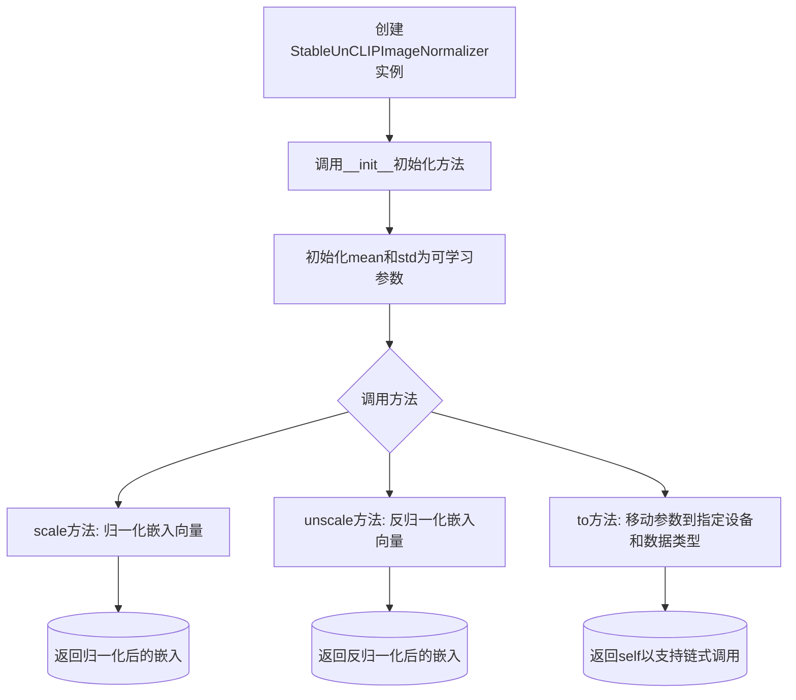
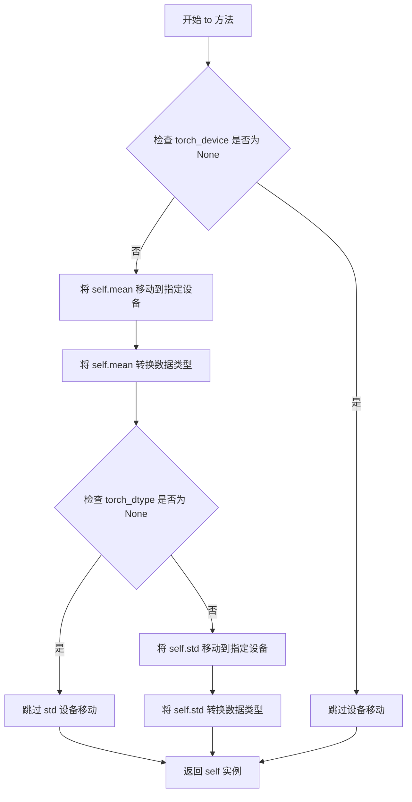
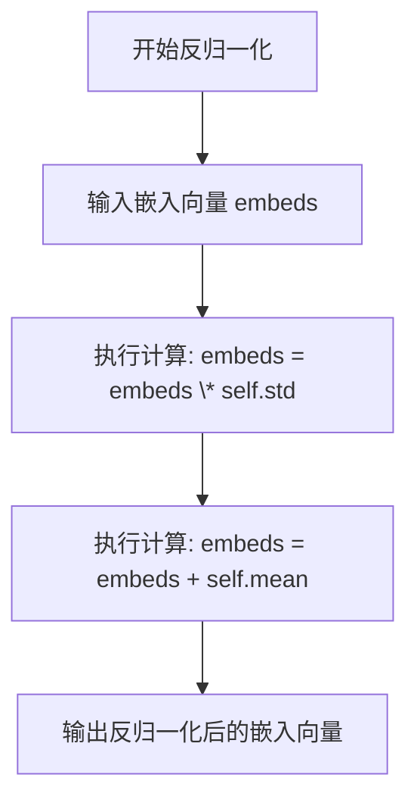

# `diffusers\src\diffusers\pipelines\stable_diffusion\stable_unclip_image_normalizer.py` 详细设计文档

这是一个用于Stable UnCLIP图像规范化的类，主要负责存储CLIP嵌入的均值和标准差，提供scale和unscale方法对图像嵌入进行归一化和反归一化处理，继承自ModelMixin和ConfigMixin基类。

## 整体流程



## 类结构

```
ModelMixin (transformers库基类)
└── StableUnCLIPImageNormalizer

ConfigMixin (transformers库基类)
└── StableUnCLIPImageNormalizer
```

## 全局变量及字段


### `StableUnCLIPImageNormalizer.mean`
    
CLIP嵌入的均值参数，用于归一化

类型：`nn.Parameter`
    


### `StableUnCLIPImageNormalizer.std`
    
CLIP嵌入的标准差参数，用于归一化

类型：`nn.Parameter`
    
    

## 全局函数及方法


### `StableUnCLIPImageNormalizer.__init__`

该方法是 `StableUnCLIPImageNormalizer` 类的构造函数，用于初始化图像归一化器的嵌入维度，并创建用于存储均值和标准差的可学习参数（nn.Parameter），以便对CLIP图像嵌入进行归一化和反归一化处理。

参数：

- `embedding_dim`：`int`，嵌入向量的维度，默认为768，用于确定均值和标准差参数的张量形状

返回值：`None`，构造函数不返回值

#### 流程图

```mermaid
flowchart TD
    A[开始 __init__] --> B[调用 super().__init__ 初始化基类]
    B --> C[创建 self.mean 参数: torch.zeros(1, embedding_dim)]
    C --> D[创建 self.std 参数: torch.ones(1, embedding_dim)]
    D --> E[结束 __init__]
```

#### 带注释源码

```python
@register_to_config
def __init__(
    self,
    embedding_dim: int = 768,  # 嵌入向量维度，默认为768（CLIP ViT-L/14的典型维度）
):
    """
    初始化StableUnCLIPImageNormalizer
    
    参数:
        embedding_dim: 嵌入向量的维度，用于确定均值和标准差参数的张量形状
    """
    # 调用父类的初始化方法，完成基础初始化
    # 包括从ConfigMixin继承的配置注册功能和ModelMixin的模型初始化
    super().__init__()
    
    # 创建可学习的均值参数，形状为 [1, embedding_dim]
    # 初始值为全零，将在训练过程中被学习
    self.mean = nn.Parameter(torch.zeros(1, embedding_dim))
    
    # 创建可学习的标准差参数，形状为 [1, embedding_dim]
    # 初始值为全1，将在训练过程中被学习
    self.std = nn.Parameter(torch.ones(1, embedding_dim))
```


### `StableUnCLIPImageNormalizer.to`

将 `StableUnCLIPImageNormalizer` 实例的均值和标准差参数移动到指定的计算设备并转换数据类型，以便在不同硬件上进行推理或训练。

参数：

-  `torch_device`：`str | torch.device | None`，目标计算设备（如 "cuda:0"、"cpu" 或 torch.device 对象）
-  `torch_dtype`：`torch.dtype | None`，目标数据类型（如 torch.float32、torch.float16）

返回值：`Self`，返回自身实例，支持链式调用

#### 流程图



#### 带注释源码

```python
def to(
    self,
    torch_device: str | torch.device | None = None,
    torch_dtype: torch.dtype | None = None,
):
    """
    将模型的 mean 和 std 参数移动到指定设备并转换数据类型。
    
    参数:
        torch_device: 目标设备，可以是字符串 ("cuda:0")、torch.device 对象或 None
        torch_dtype: 目标数据类型 (如 torch.float32) 或 None
    
    返回:
        self: 返回自身实例，支持链式调用
    """
    # 将 mean 参数移动到目标设备并转换类型
    self.mean = nn.Parameter(self.mean.to(torch_device).to(torch_dtype))
    # 将 std 参数移动到目标设备并转换类型
    self.std = nn.Parameter(self.std.to(torch_device).to(torch_dtype))
    # 返回自身，支持方法链式调用
    return self
```


### `StableUnCLIPImageNormalizer.scale`

该方法对嵌入向量进行归一化处理，通过z-score标准化（减去均值并除以标准差）将输入的嵌入向量转换为中心化且尺度标准化的表示，这是Stable UnCLIP图像处理流程中的关键步骤，用于在噪声应用前后对图像嵌入进行规范化。

参数：

- `embeds`：`torch.Tensor`，输入的嵌入向量，待归一化的原始嵌入数据

返回值：`torch.Tensor`，归一化后的嵌入向量，经过z-score标准化处理

#### 流程图

```mermaid
graph TD
    A[开始 scale 方法] --> B[接收嵌入向量 embeds]
    B --> C[执行归一化: embeds = (embeds - self.mean) * 1.0 / self.std]
    C --> D[减去均值 self.mean]
    D --> E[除以标准差 self.std]
    E --> F[返回归一化后的嵌入向量]
```

#### 带注释源码

```python
def scale(self, embeds):
    """
    对嵌入向量进行归一化处理（z-score标准化）
    
    该方法实现标准化的数学公式：z = (x - μ) / σ
    其中：
        - x (embeds): 输入的原始嵌入向量
        - μ (self.mean): 预设的均值参数
        - σ (self.std): 预设的标准差参数
        - z: 标准化后的结果
    
    参数:
        embeds: 输入的嵌入向量，形状为 (batch_size, embedding_dim)
    
    返回:
        归一化后的嵌入向量，形状与输入相同
    """
    # 步骤1: 减去均值（中心化）
    # 将嵌入向量的分布中心移动到原点
    embeds = (embeds - self.mean) * 1.0 / self.std
    
    # 步骤2: 除以标准差（缩放）
    # 将嵌入向量的尺度标准化，使其具有单位方差
    # 注意：乘以1.0是为了确保浮点数运算（虽然此行实际上冗余）
    
    # 返回标准化后的嵌入向量
    return embeds
```

---

### 类的详细信息

#### `StableUnCLIPImageNormalizer`

描述：用于保存CLIP嵌入器的均值和标准差的类，负责在Stable UnCLIP中对图像嵌入进行归一化和反归一化处理。

类字段：

- `mean`：`nn.Parameter`，可学习的均值参数，形状为 (1, embedding_dim)
- `std`：`nn.Parameter`，可学习的标准差参数，形状为 (1, embedding_dim)

类方法：

| 方法名 | 功能描述 |
|--------|----------|
| `__init__` | 初始化均值和标准差参数 |
| `to` | 将参数移动到指定设备和数据类型 |
| `scale` | 对嵌入向量进行归一化处理 |
| `unscale` | 对嵌入向量进行反归一化处理 |

---

### 关键组件信息

| 组件名称 | 一句话描述 |
|----------|------------|
| `StableUnCLIPImageNormalizer` | Stable UnCLIP图像嵌入归一化器 |
| `scale` 方法 | z-score标准化核心实现 |
| `unscale` 方法 | 反归一化（恢复原始尺度） |
| `mean` 参数 | 可学习的均值向量 |
| `std` 参数 | 可学习的标准差向量 |

---

### 潜在的技术债务或优化空间

1. **冗余计算**：`scale`方法中`* 1.0`操作是冗余的，可以直接删除
2. **数值稳定性**：当`std`为0或接近0时会出现除零错误，建议添加eps参数或数值稳定检查
3. **类型提示缺失**：`embeds`参数缺少类型注解（应为`torch.Tensor`）
4. **设备兼容性**：`to`方法手动重新创建Parameter，可考虑使用`nn.Parameter.to()`的原生支持

---

### 其它项目

**设计目标与约束**：
- 目标：实现可学习的嵌入向量归一化参数
- 约束：继承自`ModelMixin`和`ConfigMixin`，支持配置注册机制

**错误处理与异常设计**：
- 未对`embeds`维度与预设`embedding_dim`一致性进行校验
- 未对`std`为0的情况进行保护
- 建议添加运行时维度验证

**数据流与状态机**：
- 输入：原始嵌入向量 → 归一化处理 → 输出：标准化嵌入向量
- 在Stable UnCLIP流程中，`scale`用于噪声应用前，`unscale`用于噪声应用后

**外部依赖与接口契约**：
- 依赖`torch`和`nn.Parameter`
- 与`ModelMixin`、`ConfigMixin`集成以支持模型加载/保存机制


### `StableUnCLIPImageNormalizer.unscale`

该方法对嵌入向量进行反归一化处理，将归一化的嵌入向量恢复为原始尺度。依据公式 `embeds = (embeds * self.std) + self.mean` 进行反向操作，其中乘以标准差并加上均值，从而还原嵌入向量的原始分布。

参数：

- `embeds`：`torch.Tensor`，需要反归一化的嵌入向量，通常是经过归一化处理的图像嵌入

返回值：`torch.Tensor`，反归一化后的嵌入向量，已恢复到原始尺度

#### 流程图



#### 带注释源码

```python
def unscale(self, embeds):
    """
    对嵌入向量进行反归一化处理
    
    这是 scale 方法的逆操作，将归一化的嵌入向量恢复为原始尺度。
    公式: embeds = (embeds * std) + mean
    
    参数:
        embeds: torch.Tensor, 需要反归一化的嵌入向量
        
    返回值:
        torch.Tensor, 反归一化后的嵌入向量
    """
    # 步骤1: 将嵌入向量乘以标准差（恢复标准差尺度）
    embeds = (embeds * self.std) + self.mean
    # 步骤2: 加上均值（恢复均值偏移）
    return embeds
```

## 关键组件


### StableUnCLIPImageNormalizer 类

用于在 Stable UnCLIP 中保持 CLIP 嵌入的均值和标准差，对图像嵌入进行归一化（normalize）和反归一化（un-normalize）处理的核心组件。

### 归一化参数 (mean, std)

存储可学习的均值和标准差参数，用于对 CLIP 图像嵌入进行归一化和反归一化，支持模型在不同设备间的迁移。

### scale 方法

将输入的嵌入向量按照预计算的均值和标准差进行归一化处理，公式为 `(embeds - mean) * 1.0 / std`。

### unscale 方法

将归一化后的嵌入向量恢复至原始分布，公式为 `(embeds * std) + mean`。

### to 方法

将模型的均值和标准差参数迁移至指定设备（torch_device）并转换数据类型（torch_dtype），支持模型在不同硬件平台上的部署。

### ConfigMixin 和 ModelMixin 继承

通过继承这两个基类，提供了配置注册和模型权重管理功能，使该类能够与 HuggingFace Diffusers 框架无缝集成。


## 问题及建议


### 已知问题

-   **to方法实现不完整**：当前的to方法直接覆盖了nn.Parameter而未调用super().to()，可能导致父类ModelMixin中的其他参数、缓冲区或设备相关状态无法正确转移，且破坏梯度计算图。
-   **参数初始化缺乏实际值**：mean初始化为零向量、std初始化为单位向量，但实际应用中这些值应从预训练CLIP模型中提取，否则归一化操作将无实际意义。
-   **类型提示不完整**：scale和unscale方法的embeds参数缺少类型注解，影响代码可读性和静态检查。
-   **配置参数未被充分利用**：@register_to_config装饰的embedding_dim参数虽然在__init__中接收，但类中未提供从配置文件恢复mean/std维度的逻辑，序列化后可能导致维度不匹配。
-   **缺少预训练权重加载逻辑**：虽然继承自ModelMixin，但未显式实现from_pretrained方法所需的状态字典键映射，可能无法正确加载保存的mean/std值。

### 优化建议

-   **重构to方法**：在to方法中先调用super().to()，然后再对self.mean和self.std进行设备转移，或者改用nn.Parameter的requires_grad属性管理而非重新创建。
-   **添加类方法from_pretrained**：实现类似ModelMixin的from_pretrained逻辑，确保可以从预训练模型中正确加载mean和std的权重。
-   **完善类型注解**：为scale和unscale方法添加Union[torch.Tensor, torch.device]等适当的类型提示。
-   **考虑添加文档注释**：为scale和unscale方法添加详细的参数和返回值说明，提升API可用性。
-   **可选：添加参数验证**：在__init__中验证embedding_dim为正整数，防止无效维度导致后续计算错误。

## 其它


### 设计目标与约束

**设计目标**：
- 为 Stable UnCLIP 提供图像嵌入的归一化和反归一化功能
- 与 HuggingFace Diffusers 框架的模型加载机制无缝集成
- 支持可学习的均值和标准差参数，允许根据具体数据进行训练和调整
- 确保在 CPU 和 GPU 之间的设备转移兼容性

**约束条件**：
- embedding_dim 必须与 CLIP embedder 的输出维度匹配（默认 768）
- 均值和标准差参数必须在训练过程中保持可梯度
- 必须遵循 ConfigMixin 和 ModelMixin 的序列化约定

### 错误处理与异常设计

**参数校验**：
- embedding_dim 必须为正整数，当前代码未进行显式校验
- scale/unscale 方法的输入 embeds 应为 torch.Tensor 类型，若为 None 应抛出 TypeError
- embeds 的最后一维维度应与 embedding_dim 匹配，否则可能导致运行时错误

**设备转移异常**：
- to() 方法中若 torch_device 或 torch_dtype 为 None，应保持原参数不变
- 建议添加设备类型校验，防止无效设备字符串导致异常

**数值稳定性**：
- std 参数存在为 0 的风险，应在 scale 方法中添加除零保护
- 建议添加数值范围检查，防止 NaN 或 Inf 值传播

### 数据流与状态机

**前向数据流**：
- 输入：CLIP 图像嵌入 (batch_size, embedding_dim)
- 归一化流程：scale() → (embeds - mean) * 1.0 / std
- 反归一化流程：unscale() → (embeds * std) + mean
- 输出：归一化或反归一化后的嵌入

**状态管理**：
- 模型包含两种状态：训练模式 (train()) 和推理模式 (eval())
- mean 和 std 参数在不同模式下均保持可训练特性
- 设备状态跟随模型主设备

### 外部依赖与接口契约

**核心依赖**：
- torch: 张量运算和神经网络基础
- nn.Parameter: 可训练参数封装
- ConfigMixin: 配置注册和序列化
- ModelMixin: 模型加载和保存

**接口契约**：
- __init__(embedding_dim: int): 初始化方法，接受嵌入维度参数
- to(torch_device, torch_dtype): 设备转移方法，返回 self
- scale(embeds): 归一化方法，输入任意维度张量，最后一维为 embedding_dim
- unscale(embeds): 反归一化方法，输入任意维度张量，最后一维为 embedding_dim

**兼容性要求**：
- 与 diffusers 库版本兼容（需明确版本范围）
- 支持 PyTorch 1.9.0 及以上版本

### 配置管理

**配置参数**：
- embedding_dim: 嵌入维度，默认 768
- mean: 可学习参数，初始化为零向量
- std: 可学习参数，初始化为全一向量

**序列化支持**：
- 通过 ConfigMixin 支持 to_dict() 和 from_dict() 方法
- 通过 ModelMixin 支持 save_pretrained() 和 from_pretrained() 方法

### 性能考虑

**计算效率**：
- scale 和 unscale 操作均为单次矩阵运算，时间复杂度 O(n)
- 建议：对于批量处理，应利用向量化操作避免循环

**内存优化**：
- mean 和 std 参数占用 2 * embedding_dim * 4 bytes (float32)
- 建议：对于大规模 embedding_dim，考虑使用 float16 精度

**缓存策略**：
- 建议：预先计算 1/std 以减少除法运算次数

### 安全性考虑

**输入验证**：
- 建议：添加嵌入维度校验，防止维度不匹配导致的隐式广播
- 建议：添加 NaN/Inf 检测，防止异常值传播

**参数保护**：
- std 参数应添加下界约束（如 1e-8），防止梯度爆炸

### 版本兼容性

**框架版本**：
- PyTorch: >= 1.9.0
- Diffusers: 需根据实际使用版本确定

**迁移路径**：
- 若 embedding_dim 变化，需要重新初始化 mean 和 std 参数

### 使用示例

```python
# 初始化
normalizer = StableUnCLIPImageNormalizer(embedding_dim=768)

# 设备转移
normalizer = normalizer.to("cuda")

# 归一化
image_embeds = torch.randn(1, 768, device="cuda")
normalized_embeds = normalizer.scale(image_embeds)

# 反归一化
unnormalized_embeds = normalizer.unscale(normalized_embeds)
```

### 扩展性设计

**潜在扩展方向**：
- 支持多层归一化配置
- 支持动态均值和标准差计算
- 支持不同归一化方法（如 LayerNorm、InstanceNorm）
- 支持可配置的缩放因子


    