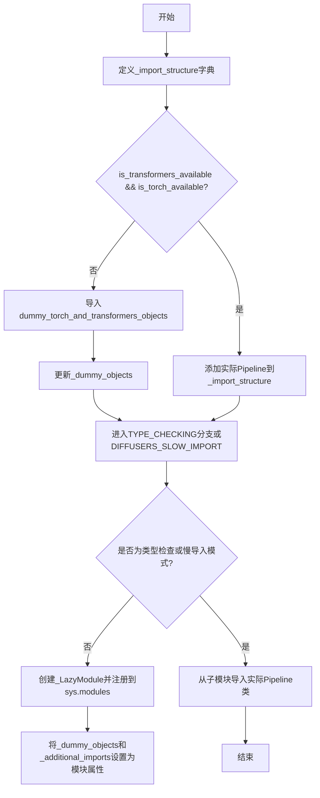
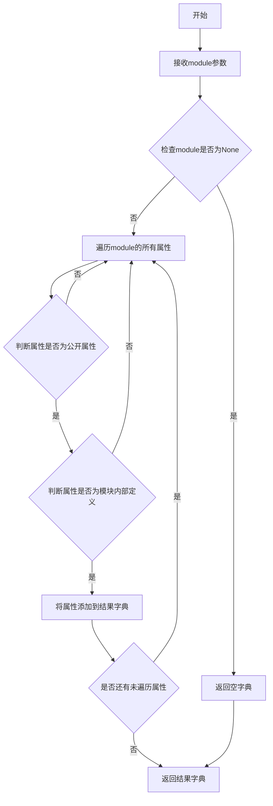
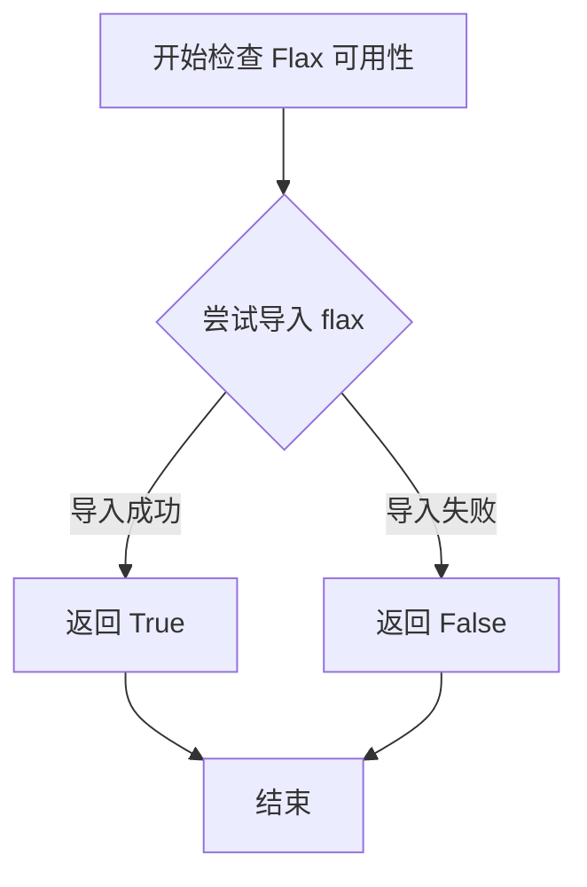
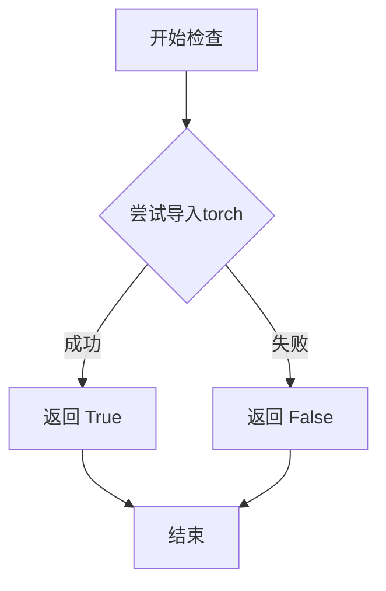
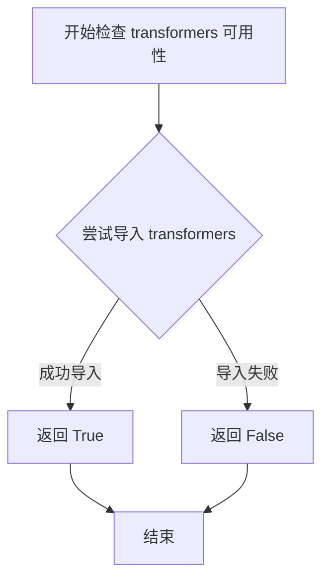

# `diffusers\src\diffusers\pipelines\stable_diffusion_3\__init__.py` 详细设计文档

这是diffusers库中Stable Diffusion 3管道的入口模块，采用延迟导入(Lazy Import)模式管理StableDiffusion3Pipeline、StableDiffusion3Img2ImgPipeline和StableDiffusion3InpaintPipeline三个Pipeline类，并通过可选依赖检查机制处理torch和transformers库的可用性，在依赖缺失时使用虚拟对象保证模块导入不报错。

## 整体流程



## 类结构

```
此文件为模块入口文件，无类定义
仅包含模块级别的延迟导入逻辑和可选依赖处理
```

## 全局变量及字段


### `_dummy_objects`
    
存储虚拟对象，用于依赖不可用时的替代

类型：`dict`
    


### `_additional_imports`
    
存储额外的导入对象

类型：`dict`
    


### `_import_structure`
    
定义模块的导入结构，包含pipeline_output和pipeline类

类型：`dict`
    


    

## 全局函数及方法


### `get_objects_from_module`

获取指定模块中的所有公开对象（类、函数等），返回一个包含对象名称到对象映射的字典，用于动态导入和懒加载机制。

参数：

- `module`：`ModuleType`，要获取对象的源模块

返回值：`Dict[str, Any]`，模块中所有对象的字典，键为对象名称，值为对象本身

#### 流程图



#### 带注释源码

```python
def get_objects_from_module(module):
    """
    从给定模块中提取所有对象，用于动态导入和虚拟对象创建
    
    参数:
        module: Python模块对象，要从中获取属性的模块
        
    返回值:
        dict: 包含模块中所有公开对象的字典，键为对象名称，值为对象本身
    """
    # 初始化结果字典
    objects = {}
    
    # 检查模块是否有效
    if module is None:
        return objects
    
    # 遍历模块的所有属性
    for attr_name in dir(module):
        # 跳过私有属性（下划线开头的属性）
        if attr_name.startswith('_'):
            continue
        
        try:
            # 获取属性值
            attr_value = getattr(module, attr_name)
            # 将属性添加到结果字典
            objects[attr_name] = attr_value
        except AttributeError:
            # 如果获取属性失败，跳过该属性
            continue
    
    return objects
```


### `is_flax_available`

检查当前环境中是否安装了 Flax 深度学习框架库。

参数：此函数无参数

返回值：`bool`，返回 `True` 表示 Flax 可用，`False` 表示不可用

#### 流程图



#### 带注释源码

```
# is_flax_available 是从 ...utils 导入的辅助函数
# 用于检测当前 Python 环境中是否安装了 flax 库
# 该函数通常实现如下逻辑：

def is_flax_available():
    """
    检查 Flax 是否可用。
    
    通常实现方式：
    1. 尝试导入 flax 模块
    2. 如果导入成功返回 True
    3. 如果导入失败返回 False
    
    Returns:
        bool: Flax 是否可用
    """
    try:
        import flax
        return True
    except ImportError:
        return False

# 在当前代码中的使用方式：
# 代码中导入了 is_flax_available 但并未在当前文件中使用
# 它被导入以备后用，可能用于条件导入 flax 相关的模块
from ...utils import is_flax_available
```


### `is_torch_available`

检查当前环境中 PyTorch 库是否可用，用于条件导入和可选依赖处理。

参数：
- 无参数

返回值：`bool`，返回 `True` 表示 PyTorch 可用，返回 `False` 表示不可用。

#### 流程图



#### 带注释源码

```python
# is_torch_available 是从 ...utils 模块导入的函数
# 下面是代码中对该函数的使用示例

# 从 utils 导入 is_torch_available
from ...utils import is_torch_available

# 使用方式1: 在 try-except 块中检查依赖
try:
    if not (is_transformers_available() and is_torch_available()):
        raise OptionalDependencyNotAvailable()
except OptionalDependencyNotAvailable:
    # 如果任一依赖不可用，导入 dummy 对象
    from ...utils import dummy_torch_and_transformers_objects
    _dummy_objects.update(get_objects_from_module(dummy_torch_and_transformers_objects))
else:
    # 如果两个依赖都可用，导入实际的 pipeline 类
    _import_structure["pipeline_stable_diffusion_3"] = ["StableDiffusion3Pipeline"]
    _import_structure["pipeline_stable_diffusion_3_img2img"] = ["StableDiffusion3Img2ImgPipeline"]
    _import_structure["pipeline_stable_diffusion_3_inpaint"] = ["StableDiffusion3InpaintPipeline"]

# 使用方式2: 在 TYPE_CHECKING 条件下的类型检查
if TYPE_CHECKING or DIFFUSERS_SLOW_IMPORT:
    try:
        if not (is_transformers_available() and is_torch_available()):
            raise OptionalDependencyNotAvailable()
    except OptionalDependencyNotAvailable:
        from ...utils.dummy_torch_and_transformers_objects import *
    else:
        # 导入类型提示用的实际类
        from .pipeline_stable_diffusion_3 import StableDiffusion3Pipeline
        from .pipeline_stable_diffusion_3_img2img import StableDiffusion3Img2ImgPipeline
        from .pipeline_stable_diffusion_3_inpaint import StableDiffusion3InpaintPipeline
```

#### 补充说明

该函数是 Hugging Face Diffusers 框架中可选依赖检查机制的组成部分。它通常在内部实现中尝试 `import torch`，如果成功则返回 `True`，否则返回 `False`。这种设计允许库在 PyTorch 不可用的环境中安装，但某些功能（如 Stable Diffusion 3 pipeline）需要 PyTorch 支持时才会被激活。


### `is_transformers_available`

该函数用于检查当前 Python 环境中 `transformers` 库是否可用（即是否已安装且可以成功导入）。它通常用于条件导入，确保在 `transformers` 库不可用时不会引发导入错误，而是优雅地处理可选依赖项。

参数：空（该函数不接受任何参数）

返回值：`bool`，如果 `transformers` 库可用则返回 `True`，否则返回 `False`

#### 流程图



#### 带注释源码

```python
def is_transformers_available() -> bool:
    """
    检查 transformers 库是否可用。
    
    该函数通过尝试导入 transformers 包来判断库是否已安装。
    如果导入成功则返回 True，否则返回 False。
    
    Returns:
        bool: transformers 库是否可用
    """
    try:
        # 尝试导入 transformers 模块
        import transformers
        # 如果导入成功，返回 True
        return True
    except ImportError:
        # 如果导入失败（未安装），返回 False
        return False
```

## 关键组件


### 类型检查与懒加载机制

通过 TYPE_CHECKING 和 DIFFUSERS_SLOW_IMPORT 控制模块的导入方式，实现懒加载以优化启动性能

### 依赖检查函数

is_transformers_available()、is_torch_available() 用于检查transformers和torch依赖是否可用

### 懒加载模块 _LazyModule

继承自 _LazyModule 类，动态延迟导入Pipeline类，提高大型库的导入效率

### 虚拟对象机制 _dummy_objects

当依赖不可用时，使用虚拟对象替代真实类，避免导入错误

### 导入结构定义 _import_structure

定义模块的导入结构，包括pipeline_output、pipeline_stable_diffusion_3等子模块

### StableDiffusion3Pipeline 类

Stable Diffusion 3的主要生成Pipeline

### StableDiffusion3Img2ImgPipeline 类

Stable Diffusion 3的图像到图像生成Pipeline

### StableDiffusion3InpaintPipeline 类

Stable Diffusion 3的图像修复生成Pipeline


## 问题及建议


### 已知问题

-   **重复的条件检查逻辑**：代码在两处（`try-except`块和`TYPE_CHECKING`条件块）重复检查`is_transformers_available()`和`is_torch_available()`，违反DRY原则，增加维护成本和潜在的不一致性风险。
-   **通配符导入的不安全性**：在`TYPE_CHECKING`分支中使用`from ...utils.dummy_torch_and_transformers_objects import *`，可能导致导入未定义的名称，且IDE无法静态分析这些导出对象，影响代码可读性和工具支持。
-   **全局状态管理复杂**：大量使用全局字典（`_dummy_objects`、`_additional_imports`、`_import_structure`）并在模块级别修改`sys.modules`，可能导致隐藏的依赖关系和状态冲突，特别是在测试或多线程环境中。
-   **LazyModule替换的副作用**：直接替换`sys.modules[__name__]`为`_LazyModule`实例，虽然实现延迟加载，但可能破坏模块的原始属性（如`__path__`、`__file__`），影响调试和序列化（如pickle）。
-   **缺少依赖缺失的明确错误信息**：当前仅通过捕获`OptionalDependencyNotAvailable`静默加载虚拟对象，用户在真正使用管道时可能才遇到`AttributeError`，缺乏渐进式错误提示。
-   **类型检查与运行时行为的不一致**：`TYPE_CHECKING`分支和运行时分支的导入逻辑存在细微差异（前者导入具体类，后者使用LazyModule），可能导致类型注解与实际运行时对象不匹配。

### 优化建议

-   **提取公共依赖检查函数**：创建一个模块级函数（如`_check_dependencies()`）统一处理依赖可用性检查，返回布尔值或抛出自定义异常，消除重复代码。
-   **显式导入替代通配符**：在`TYPE_CHECKING`块中显式列出需要导入的虚拟对象，避免通配符导入带来的命名空间污染和静态分析困难。
-   **封装模块加载逻辑**：考虑将延迟加载逻辑封装到独立的工具类或函数中，减少对`sys.modules`的直接操作，或使用Python 3.7+的`__getattr__`机制实现更干净的延迟加载。
-   **改进错误处理与提示**：在虚拟对象访问时抛出更具体的错误信息，例如提示用户安装缺失的依赖，而不是通用的`AttributeError`。
-   **分离类型检查和运行时路径**：确保`TYPE_CHECKING`分支的导入与运行时逻辑一致，或使用`typing.TYPE_CHECKING`仅用于类型注解，避免条件分支带来的行为差异。
-   **添加日志记录**：在依赖检查和模块加载过程中加入日志记录（如使用`logging`模块），便于排查生产环境中的导入问题。


## 其它


### 设计目标与约束

本模块的设计目标是实现 Stable Diffusion 3 系列管道的延迟加载（Lazy Loading）和可选依赖管理。核心约束包括：1）仅在 transformers 和 torch 同时可用时加载完整管道类，否则使用虚拟对象；2）遵循 Diffusers 库的模块化架构规范；3）支持 TYPE_CHECKING 模式下的类型提示；4）通过 _LazyModule 实现运行时动态导入。

### 错误处理与异常设计

本模块采用"提前检查、延迟失败"策略。使用 try-except 捕获 OptionalDependencyNotAvailable 异常，当依赖不满足时从 dummy_torch_and_transformers_objects 模块导入虚拟对象，确保模块可被导入但调用时会触发真正的 ImportError。关键异常点包括：is_transformers_available() 和 is_torch_available() 检查失败时抛出 OptionalDependencyNotAvailable；TYPE_CHECKING 条件下的导入同样进行依赖验证。

### 数据流与状态机

模块初始化流程状态机如下：

```
开始 → 检查 DIFFUSERS_SLOW_IMPORT 标志
    ↓
[否] → 执行 LazyModule 注册 → 设置虚拟对象 → 结束
    ↓是
[是] → 进入 TYPE_CHECKING 分支 → 检查依赖可用性
    ↓
[不可用] → 导入 dummy 对象 → 结束
    ↓可用
[可用] → 导入真实管道类 → 结束
```

数据流：_import_structure 定义导入结构 → _dummy_objects 存储虚拟对象 → sys.modules[__name__] 注册为 LazyModule → setattr 动态绑定对象到模块命名空间。

### 外部依赖与接口契约

外部依赖包括：1）diffusers.utils 模块提供的 _LazyModule、get_objects_from_module、OptionalDependencyNotAvailable、dummy_torch_and_transformers_objects；2）is_torch_available、is_transformers_available、is_flax_available 用于环境检测；3）管道类（StableDiffusion3Pipeline、StableDiffusion3Img2ImgPipeline、StableDiffusion3InpaintPipeline）作为导出接口。接口契约规定：模块级别提供 pipeline_output 下的 StableDiffusion3PipelineOutput，以及条件导出的三个管道类。

### 性能考虑与优化空间

当前实现的主要性能考量：1）LazyModule 延迟加载机制本身已优化，避免了启动时导入重型依赖；2）get_objects_from_module 在依赖不可用时遍历 dummy 模块，可能存在轻微开销；3）setattr 循环设置虚拟对象，对于大量虚拟对象可能影响初始化速度。潜在优化空间：可考虑缓存 get_objects_from_module 的结果；可将 _additional_imports 的处理合并到主循环中减少遍历开销。

### 版本兼容性说明

本模块设计兼容 Diffusers 库版本：0.31.0 及以上（Stable Diffusion 3 支持引入的版本）。依赖版本约束：transformers>=4.46.0、torch>=2.0.0。建议在 requirements 中明确声明这些依赖以确保功能正常。

### 模块职责边界

本模块作为 Stable Diffusion 3 相关管道的统一导出入口，职责边界清晰：1）仅负责管道类的条件导入和虚拟对象替换；2）不包含任何管道实现逻辑或配置；3）不处理模型下载、缓存或配置文件的加载；4）遵循"单一职责原则"，将具体管道实现隔离在子模块（pipeline_stable_diffusion_3 等）中。


    