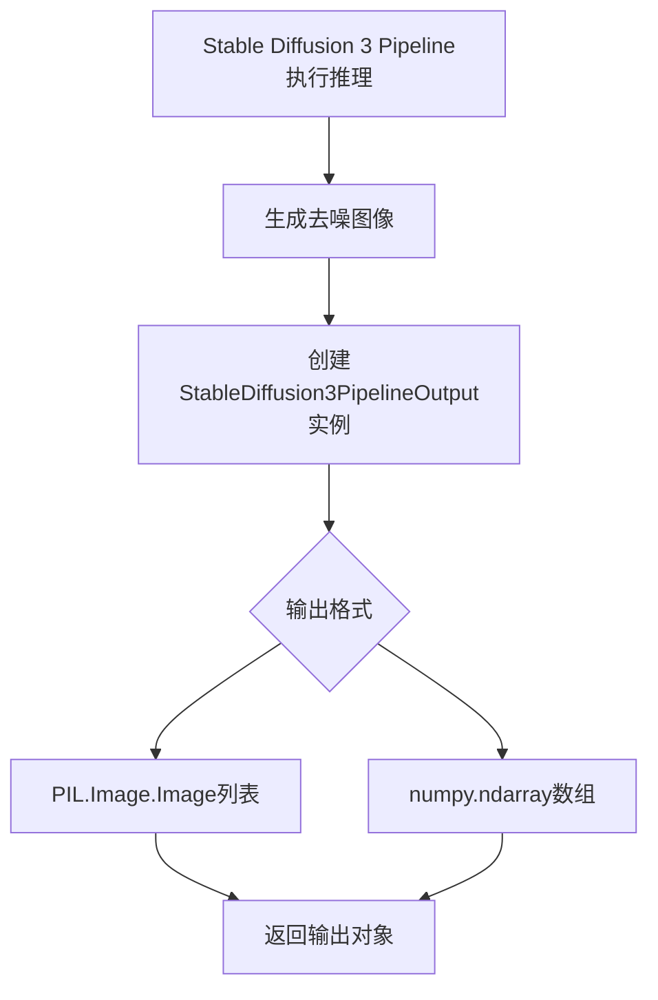

# `diffusers\src\diffusers\pipelines\stable_diffusion_3\pipeline_output.py` 详细设计文档

StableDiffusion3PipelineOutput是一个数据类，继承自BaseOutput，用于封装Stable Diffusion 3管道的输出结果。该类定义了一个images字段，支持PIL.Image.Image列表或numpy.ndarray数组两种形式，以适应不同批处理大小和图像尺寸的去噪图像输出需求。

## 整体流程



## 类结构

```
BaseOutput (抽象基类)
└── StableDiffusion3PipelineOutput (数据类)
```

## 全局变量及字段


### `StableDiffusion3PipelineOutput.StableDiffusion3PipelineOutput`
    
Stable Diffusion 3管道的输出类，继承自BaseOutput，用于封装去噪后的图像结果

类型：`dataclass`
    


### `StableDiffusion3PipelineOutput.images`
    
去噪后的图像列表或数组，可为PIL图像列表或numpy数组，数组形状为(batch_size, height, width, num_channels)

类型：`list[PIL.Image.Image] | np.ndarray`
    
    

## 全局函数及方法


## 关键组件


### StableDiffusion3PipelineOutput

Stable Diffusion 3流水线输出数据类，封装去噪后的图像结果，支持PIL图像列表或NumPy数组两种格式。

### images字段

图像输出字段，类型为`list[PIL.Image.Image] | np.ndarray`，用于存储批量去噪后的图像数据，可返回PIL图像列表或NumPy数组形式。

### BaseOutput基类

从`...utils`模块导入的基础输出类，为所有流水线输出类提供统一的基类接口定义。

### 类型注解支持

支持联合类型注解（`|`操作符），表明输出可以是PIL图像列表或NumPy数组，提供了灵活的输出格式选择。


## 问题及建议


### 已知问题

- **类型兼容性**：使用 `list[PIL.Image.Image] | np.ndarray` 联合类型语法仅支持 Python 3.10+，可能导致与旧版本 Python 环境不兼容
- **文档不完整**：类文档字符串仅说明了参数类型，但未对 `images` 字段的具体用途、格式要求、维度范围等进行详细描述
- **缺少数据验证**：没有对 `images` 字段进行类型和合法性验证，可能导致下游处理出现隐蔽错误
- **类型混合带来的复杂性**：同时支持 PIL Image 列表和 numpy ndarray 两种类型，会增加调用方类型判断和处理逻辑的复杂度
- **扩展性受限**：输出类仅包含 `images` 字段，无法输出其他有用的中间结果（如 latents、masks、debug info 等）

### 优化建议

- 考虑使用 `Union` 类型以提高兼容性，或在文档中明确标注最低 Python 版本要求
- 补充字段级别的文档字符串，对 `images` 字段的来源、格式、维度、默认值等进行完整说明
- 添加 `__post_init__` 方法或使用 `@field_validator` 对输入数据进行校验，确保 images 为有效类型和非空
- 考虑拆分为两个独立输出类或使用泛型，将 PIL 和 numpy 类型的处理分离
- 参考其他 PipelineOutput 设计模式，支持可选字段以增强扩展性


## 其它


### 设计目标与约束

设计目标：
1. 为Stable Diffusion 3 pipeline提供标准化的输出数据结构
2. 支持多种输出格式（PIL图像和NumPy数组）
3. 保持与BaseOutput基类的兼容性
4. 提供清晰的类型提示，支持静态类型检查

设计约束：
1. 必须继承自BaseOutput基类
2. 字段类型必须支持PIL.Image.Image或np.ndarray
3. 使用Python 3.10+的联合类型语法
4. 遵循dataclass的最佳实践

### 错误处理与异常设计

本类为数据容器，不涉及复杂的错误处理逻辑。可能的异常情况：
1. 类型检查失败：当传入的images不是list[PIL.Image.Image]或np.ndarray时，静态类型检查器会发出警告
2. 基类异常：继承自BaseOutput，可能抛出基类定义的异常
3. 建议在调用方进行类型验证和数据合法性检查

### 数据流与状态机

数据流：
1. Pipeline处理过程中生成图像数据
2. 图像数据转换为PIL.Image.Image或np.ndarray格式
3. 创建StableDiffusion3PipelineOutput实例封装结果
4. 返回给调用方

状态机：
- 无状态设计，仅作为数据传输对象（DTO）

### 外部依赖与接口契约

外部依赖：
1. `dataclass` - Python内置装饰器
2. `numpy as np` - NumPy库，用于数值计算和数组操作
3. `PIL.Image` - Pillow库，用于图像处理
4. `BaseOutput` - 项目内部基类，定义输出数据结构的标准接口

接口契约：
- 输入：images参数，类型为list[PIL.Image.Image]或np.ndarray
- 输出：StableDiffusion3PipelineOutput实例
- 兼容性：需与BaseOutput接口兼容

### 性能考虑

1. 使用dataclass装饰器，自动生成__init__、__repr__等方法，性能开销最小
2. 字段类型采用联合类型，避免不必要的类型转换
3. 仅存储数据引用，不进行深拷贝操作
4. 内存占用取决于传入的images数据大小

### 安全性考虑

1. 本类为纯数据容器，无安全风险
2. 建议调用方验证images数据的来源和合法性
3. 避免存储敏感信息到日志或输出中

### 版本兼容性

1. Python版本：需要Python 3.10+以支持联合类型语法（list[PIL.Image.Image] | np.ndarray）
2. 依赖库版本：
   - numpy: 兼容1.x和2.x版本
   - Pillow: 兼容PIL.Image.Image的所有版本
3. BaseOutput: 需与项目内部的BaseOutput版本兼容

### 测试策略

测试用例建议：
1. 单元测试：创建不同类型images的实例，验证类型正确性
2. 集成测试：在完整pipeline中验证输出类的使用
3. 类型测试：使用mypy等工具进行静态类型检查
4. 兼容性测试：验证与不同版本的numpy和PIL的兼容性

### 使用示例

示例1 - 使用PIL图像列表：
```python
from PIL import Image
images = [Image.new('RGB', (512, 512), color='red')]
output = StableDiffusion3PipelineOutput(images=images)
```

示例2 - 使用NumPy数组：
```python
import numpy as np
images = np.random.randint(0, 255, (1, 512, 512, 3), dtype=np.uint8)
output = StableDiffusion3PipelineOutput(images=images)
```

### 配置参数

本类无配置参数，为静态数据结构。配置由调用方在创建实例时通过构造函数参数传入。

### 相关类与模块

1. `BaseOutput` - 基类，定义输出数据结构的标准接口
2. `StableDiffusion3Pipeline` - 实际使用此输出类的Pipeline类
3. 其他Pipeline输出类 - 如StableDiffusionPipelineOutput、StableDiffusionXLPipelineOutput等

### 扩展性建议

1. 可以添加更多字段，如`nsfw_content_detected`、`watermarked`等元信息
2. 可以添加类方法实现数据格式转换
3. 可以添加验证方法确保数据合法性
4. 可以考虑使用泛型支持不同类型的图像数据

### 文档注释

当前代码已包含完整的文档字符串，说明：
- 类的用途：用于Stable Diffusion pipelines的输出类
- images参数：去噪后的PIL图像列表或NumPy数组
- 图像格式：支持PIL images或numpy array，形状为(batch_size, height, width, num_channels)

    