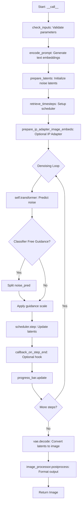
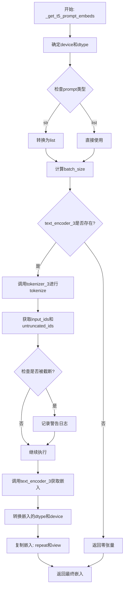
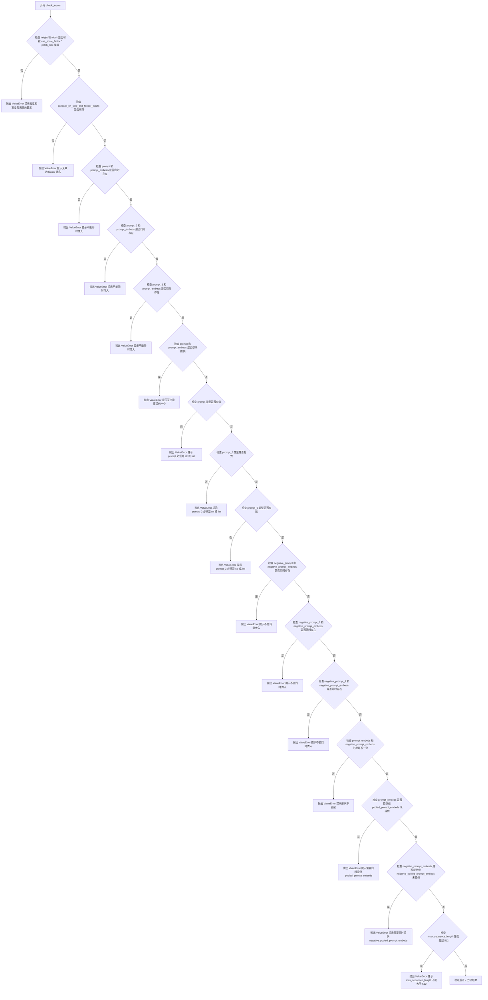
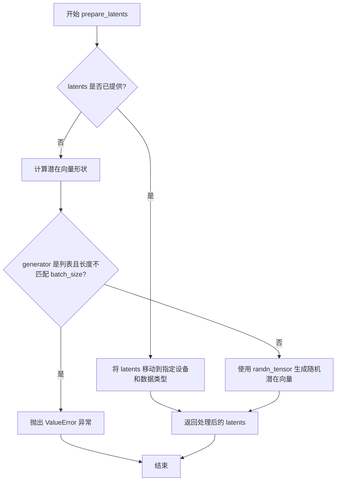
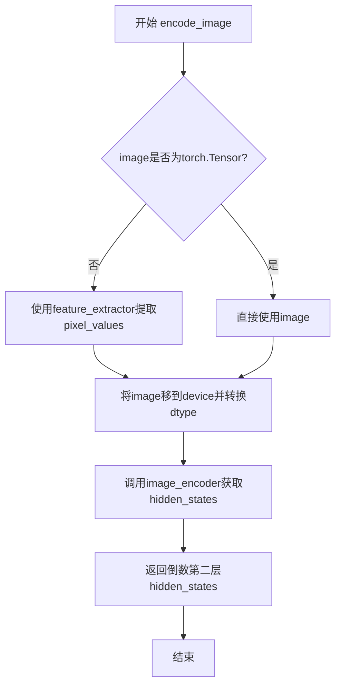
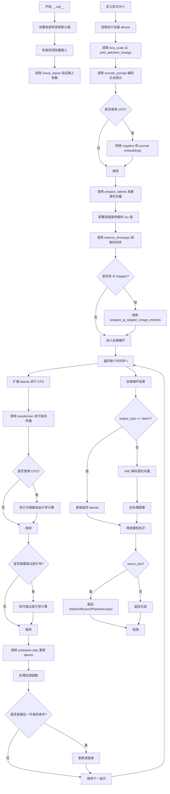

```mermaid
flowchart TD
    A[开始 encode_prompt] --> B{是否设置 lora_scale}
    B -->|是| C[设置 self._lora_scale]
    C --> D{text_encoder 是否存在且使用 PEFT}
    D -->|是| E[scale_lora_layers text_encoder]
    D -->|否| F{text_encoder_2 是否存在且使用 PEFT}
    E --> F
    F -->|是| G[scale_lora_layers text_encoder_2]
    G --> H[将 prompt 规范化为列表]
    F -->|否| H
    H --> I{prompt_embeds 是否为空}
    I -->|是| J[规范 prompt_2 和 prompt_3]
    J --> K[调用 _get_clip_prompt_embeds<br/>clip_model_index=0]
    K --> L[调用 _get_clip_prompt_embeds<br/>clip_model_index=1]
    L --> M[拼接两个CLIP嵌入]
    M --> N[调用 _get_t5_prompt_embeds]
    N --> O[对CLIP嵌入进行padding对齐]
    O --> P[拼接CLIP和T5嵌入]
    P --> Q[拼接池化嵌入]
    I -->|否| R[直接使用输入的 prompt_embeds]
    R --> S{do_classifier_free_guidance 为真<br/>且 negative_prompt_embeds 为空}
    Q --> S
    S -->|是| T[规范化为空字符串]
    T --> U[批量复制负面提示词]
    U --> V[调用 _get_clip_prompt_embeds<br/>处理负面提示词]
    V --> W[调用 _get_t5_prompt_embeds<br/>处理负面提示词]
    W --> X[拼接负面CLIP和T5嵌入]
    X --> Y[拼接负面池化嵌入]
    S -->|否| Z{是否需要恢复LoRA权重}
    Y --> Z
    Z -->|text_encoder 存在| AA[unscale_lora_layers text_encoder]
    AA --> Z2{text_encoder_2 存在}
    Z -->|否| Z2
    Z2 -->|是| AB[unscale_lora_layers text_encoder_2]
    AB --> AC[返回四个嵌入张量]
    Z2 -->|否| AC
    R --> AC
    Z -->|否| AC
```

# `diffusers\src\diffusers\pipelines\stable_diffusion_3\pipeline_stable_diffusion_3.py` 详细设计文档

This file implements the Stable Diffusion 3 (SD3) text-to-image generation pipeline, integrating a transformer model (MMDiT), a variational autoencoder (VAE), and multiple text encoders (CLIP and T5) to synthesize high-quality images from textual prompts, supporting advanced features like LoRA, IP-Adapter, and classifier-free guidance.

## 整体流程



## 类结构

```
DiffusionPipeline (Base Class)
├── StableDiffusion3Pipeline (Main Implementation)
│   ├── SD3LoraLoaderMixin (LoRA Support)
│   ├── FromSingleFileMixin (Single File Loading)
│   └── SD3IPAdapterMixin (Image Prompting)
```

## 全局变量及字段


### `logger`
    
Logging utility for the module.

类型：`logging.Logger`
    


### `EXAMPLE_DOC_STRING`
    
Example usage documentation string.

类型：`str`
    


### `XLA_AVAILABLE`
    
Boolean flag indicating if PyTorch XLA is available.

类型：`bool`
    


### `calculate_shift`
    
Calculates the shift value for dynamic timestep scheduling based on image sequence length.

类型：`function`
    


### `retrieve_timesteps`
    
Retrieves timesteps from a scheduler after calling set_timesteps, handling custom timesteps and sigmas.

类型：`function`
    


### `StableDiffusion3Pipeline.transformer`
    
The core MMDiT denoising model.

类型：`SD3Transformer2DModel`
    


### `StableDiffusion3Pipeline.scheduler`
    
Scheduler for denoising steps.

类型：`FlowMatchEulerDiscreteScheduler`
    


### `StableDiffusion3Pipeline.vae`
    
Model for encoding/decoding images to latent space.

类型：`AutoencoderKL`
    


### `StableDiffusion3Pipeline.text_encoder`
    
Primary CLIP text encoder.

类型：`CLIPTextModelWithProjection`
    


### `StableDiffusion3Pipeline.text_encoder_2`
    
Secondary CLIP text encoder.

类型：`CLIPTextModelWithProjection`
    


### `StableDiffusion3Pipeline.text_encoder_3`
    
T5 text encoder for long-range context.

类型：`T5EncoderModel`
    


### `StableDiffusion3Pipeline.tokenizer`
    
Tokenizer for text_encoder.

类型：`CLIPTokenizer`
    


### `StableDiffusion3Pipeline.tokenizer_2`
    
Tokenizer for text_encoder_2.

类型：`CLIPTokenizer`
    


### `StableDiffusion3Pipeline.tokenizer_3`
    
Tokenizer for text_encoder_3.

类型：`T5TokenizerFast`
    


### `StableDiffusion3Pipeline.image_encoder`
    
Vision encoder for IP-Adapter.

类型：`SiglipVisionModel`
    


### `StableDiffusion3Pipeline.feature_extractor`
    
Image processor for IP-Adapter.

类型：`SiglipImageProcessor`
    


### `StableDiffusion3Pipeline.vae_scale_factor`
    
Scaling factor for VAE latents.

类型：`int`
    


### `StableDiffusion3Pipeline.image_processor`
    
Helper for processing pipeline images.

类型：`VaeImageProcessor`
    


### `StableDiffusion3Pipeline.tokenizer_max_length`
    
Max length for tokenization (default 77).

类型：`int`
    


### `StableDiffusion3Pipeline.default_sample_size`
    
Default image resolution.

类型：`int`
    


### `StableDiffusion3Pipeline.patch_size`
    
Patch size for the transformer.

类型：`int`
    
    

## 全局函数及方法


### `calculate_shift`

该函数是一个全局工具函数，用于根据图像序列长度计算动态偏移（dynamic shifting）所需的 mu 参数。通过线性插值在预定义的基础序列长度和最大序列长度之间计算偏移量，用于调整调度器的采样策略。

参数：

- `image_seq_len`：`int`，图像序列长度，即图像经patchify后的token数量
- `base_seq_len`：`int`，默认为256，基础序列长度，用于线性插值的起点
- `max_seq_len`：`int`，默认为4096，最大序列长度，用于线性插值的终点
- `base_shift`：`float`，默认为0.5，基础偏移量，对应基础序列长度处的偏移值
- `max_shift`：`float`，默认为1.15，最大偏移量，对应最大序列长度处的偏移值

返回值：`float`，计算得到的 mu（动态偏移）参数值，用于调度器的动态偏移功能

#### 流程图

```mermaid
flowchart TD
    A[开始] --> B[计算斜率 m]
    B --> C[计算截距 b]
    C --> D[计算 mu = image_seq_len * m + b]
    D --> E[返回 mu]
    
    B 说明: m = (max_shift - base_shift) / (max_seq_len - base_seq_len)
    C 说明: b = base_shift - m * base_seq_len
```

#### 带注释源码

```python
# Copied from diffusers.pipelines.flux.pipeline_flux.calculate_shift
def calculate_shift(
    image_seq_len,          # 图像序列长度（token数量）
    base_seq_len: int = 256,    # 基础序列长度，默认256
    max_seq_len: int = 4096,    # 最大序列长度，默认4096
    base_shift: float = 0.5,    # 基础偏移量，默认0.5
    max_shift: float = 1.15,    # 最大偏移量，默认1.15
):
    """
    计算动态偏移所需的mu参数。
    
    使用线性插值公式：mu = m * image_seq_len + b
    其中 m 是斜率，b 是截距
    """
    # 计算斜率：两个偏移量之差除以两个序列长度之差
    m = (max_shift - base_shift) / (max_seq_len - base_seq_len)
    # 计算截距：base_shift 减去 m * base_seq_len
    b = base_shift - m * base_seq_len
    # 计算最终的 mu 值
    mu = image_seq_len * m + b
    # 返回计算得到的 mu 参数
    return mu
```


### `retrieve_timesteps`

该函数是Stable Diffusion 3 Pipeline的辅助函数，用于从调度器获取时间步（timesteps），处理自定义时间步或sigmas。它调用调度器的`set_timesteps`方法，并根据传入的参数类型（timesteps、sigmas或num_inference_steps）来设置相应的时间步调度方案，最后返回时间步张量和推理步数。

参数：

- `scheduler`：`SchedulerMixin`，调度器对象，用于获取时间步
- `num_inference_steps`：`int | None`，扩散模型生成样本时使用的去噪步数，如果使用此参数，则`timesteps`必须为`None`
- `device`：`str | torch.device | None`，时间步要移动到的设备，如果为`None`则不移动
- `timesteps`：`list[int] | None`，自定义时间步，用于覆盖调度器的时间步间隔策略，如果传入此参数则`num_inference_steps`和`sigmas`必须为`None`
- `sigmas`：`list[float] | None`，自定义sigmas，用于覆盖调度器的sigma间隔策略，如果传入此参数则`num_inference_steps`和`timesteps`必须为`None`
- `**kwargs`：任意关键字参数，将传递给调度器的`set_timesteps`方法

返回值：`tuple[torch.Tensor, int]`，元组包含两个元素——第一个是调度器的时间步调度（torch.Tensor类型），第二个是推理步数（int类型）

#### 流程图

```mermaid
flowchart TD
    A[开始] --> B{检查timesteps和sigmas是否同时传入}
    B -->|是| C[抛出ValueError: 只能选择timesteps或sigmas之一]
    B -->|否| D{检查timesteps是否传入}
    D -->|是| E{调度器是否支持timesteps参数}
    E -->|否| F[抛出ValueError: 当前调度器不支持自定义timesteps]
    E -->|是| G[调用scheduler.set_timesteps设置自定义timesteps]
    G --> H[获取scheduler.timesteps]
    H --> I[计算num_inference_steps = len(timesteps)]
    I --> J[返回timesteps和num_inference_steps]
    D -->|否| K{检查sigmas是否传入}
    K -->|是| L{调度器是否支持sigmas参数}
    L -->|否| M[抛出ValueError: 当前调度器不支持自定义sigmas]
    L -->|是| N[调用scheduler.set_timesteps设置自定义sigmas]
    N --> O[获取scheduler.timesteps]
    O --> P[计算num_inference_steps = len(timesteps)]
    P --> J
    K -->|否| Q[调用scheduler.set_timesteps使用num_inference_steps]
    Q --> R[获取scheduler.timesteps]
    R --> J
```

#### 带注释源码

```python
# Copied from diffusers.pipelines.stable_diffusion.pipeline_stable_diffusion.retrieve_timesteps
def retrieve_timesteps(
    scheduler,
    num_inference_steps: int | None = None,
    device: str | torch.device | None = None,
    timesteps: list[int] | None = None,
    sigmas: list[float] | None = None,
    **kwargs,
):
    r"""
    Calls the scheduler's `set_timesteps` method and retrieves timesteps from the scheduler after the call. Handles
    custom timesteps. Any kwargs will be supplied to `scheduler.set_timesteps`.

    Args:
        scheduler (`SchedulerMixin`):
            The scheduler to get timesteps from.
        num_inference_steps (`int`):
            The number of diffusion steps used when generating samples with a pre-trained model. If used, `timesteps`
            must be `None`.
        device (`str` or `torch.device`, *optional*):
            The device to which the timesteps should be moved to. If `None`, the timesteps are not moved.
        timesteps (`list[int]`, *optional*):
            Custom timesteps used to override the timestep spacing strategy of the scheduler. If `timesteps` is passed,
            `num_inference_steps` and `sigmas` must be `None`.
        sigmas (`list[float]`, *optional*):
            Custom sigmas used to override the timestep spacing strategy of the scheduler. If `sigmas` is passed,
            `num_inference_steps` and `timesteps` must be `None`.

    Returns:
        `tuple[torch.Tensor, int]`: A tuple where the first element is the timestep schedule from the scheduler and the
        second element is the number of inference steps.
    """
    # 步骤1: 验证输入参数合法性，不能同时传入timesteps和sigmas
    if timesteps is not None and sigmas is not None:
        raise ValueError("Only one of `timesteps` or `sigmas` can be passed. Please choose one to set custom values")
    
    # 步骤2: 处理自定义timesteps的情况
    if timesteps is not None:
        # 通过inspect检查调度器的set_timesteps方法是否支持timesteps参数
        accepts_timesteps = "timesteps" in set(inspect.signature(scheduler.set_timesteps).parameters.keys())
        if not accepts_timesteps:
            raise ValueError(
                f"The current scheduler class {scheduler.__class__}'s `set_timesteps` does not support custom"
                f" timestep schedules. Please check whether you are using the correct scheduler."
            )
        # 调用调度器的set_timesteps方法设置自定义时间步
        scheduler.set_timesteps(timesteps=timesteps, device=device, **kwargs)
        # 从调度器获取设置后的时间步
        timesteps = scheduler.timesteps
        # 计算推理步数
        num_inference_steps = len(timesteps)
    # 步骤3: 处理自定义sigmas的情况
    elif sigmas is not None:
        # 通过inspect检查调度器的set_timesteps方法是否支持sigmas参数
        accept_sigmas = "sigmas" in set(inspect.signature(scheduler.set_timesteps).parameters.keys())
        if not accept_sigmas:
            raise ValueError(
                f"The current scheduler class {scheduler.__class__}'s `set_timesteps` does not support custom"
                f" sigmas schedules. Please check whether you are using the correct scheduler."
            )
        # 调用调度器的set_timesteps方法设置自定义sigmas
        scheduler.set_timesteps(sigmas=sigmas, device=device, **kwargs)
        # 从调度器获取设置后的时间步
        timesteps = scheduler.timesteps
        # 计算推理步数
        num_inference_steps = len(timesteps)
    # 步骤4: 处理默认情况，使用num_inference_steps设置时间步
    else:
        scheduler.set_timesteps(num_inference_steps, device=device, **kwargs)
        timesteps = scheduler.timesteps
    
    # 步骤5: 返回时间步张量和推理步数
    return timesteps, num_inference_steps
```


### `StableDiffusion3Pipeline.__init__`

这是Stable Diffusion 3 Pipeline的初始化方法，负责接收并注册所有必要的模型组件（Transformer、VAE、多个文本编码器、调度器等），并根据模型配置初始化图像处理器、tokenizer最大长度、默认样本尺寸和patch大小等关键参数。

参数：

- `transformer`：`SD3Transformer2DModel`，条件Transformer（MMDiT）架构，用于对编码的图像潜在表示进行去噪
- `scheduler`：`FlowMatchEulerDiscreteScheduler`，与transformer结合使用的调度器，用于对编码的图像潜在表示进行去噪
- `vae`：`AutoencoderKL`，变分自编码器模型，用于在潜在表示和图像之间进行编码和解码
- `text_encoder`：`CLIPTextModelWithProjection`，第一个CLIP文本编码器（clip-vit-large-patch14变体），带投影层
- `tokenizer`：`CLIPTokenizer`，第一个CLIP分词器
- `text_encoder_2`：`CLIPTextModelWithProjection`，第二个CLIP文本编码器（CLIP-ViT-bigG-14-laion2B变体）
- `tokenizer_2`：`CLIPTokenizer`，第二个CLIP分词器
- `text_encoder_3`：`T5EncoderModel`，T5文本编码器（t5-v1_1-xxl变体），用于更长的文本序列
- `tokenizer_3`：`T5TokenizerFast`，T5快速分词器
- `image_encoder`：`SiglipVisionModel | None`，可选的预训练视觉模型，用于IP-Adapter
- `feature_extractor`：`SiglipImageProcessor | None`，可选的图像处理器，用于IP-Adapter

返回值：无（`None`），构造函数仅初始化实例属性

#### 流程图

```mermaid
flowchart TD
    A[开始 __init__] --> B[调用父类 super().__init__]
    B --> C[register_modules 注册所有模型组件]
    C --> D{检查vae是否存在}
    D -->|是| E[计算vae_scale_factor: 2^(len(vae.config.block_out_channels) - 1)]
    D -->|否| F[设置vae_scale_factor为8]
    E --> G[创建VaeImageProcessor实例]
    F --> G
    G --> H[设置tokenizer_max_length]
    H --> I[设置default_sample_size]
    I --> J[设置patch_size]
    J --> K[结束 __init__]
```

#### 带注释源码

```python
def __init__(
    self,
    transformer: SD3Transformer2DModel,  # 核心去噪Transformer模型
    scheduler: FlowMatchEulerDiscreteScheduler,  # 去噪调度器
    vae: AutoencoderKL,  # 变分自编码器
    text_encoder: CLIPTextModelWithProjection,  # CLIP文本编码器1
    tokenizer: CLIPTokenizer,  # CLIP分词器1
    text_encoder_2: CLIPTextModelWithProjection,  # CLIP文本编码器2
    tokenizer_2: CLIPTokenizer,  # CLIP分词器2
    text_encoder_3: T5EncoderModel,  # T5文本编码器
    tokenizer_3: T5TokenizerFast,  # T5快速分词器
    image_encoder: SiglipVisionModel = None,  # 可选：IP-Adapter图像编码器
    feature_extractor: SiglipImageProcessor = None,  # 可选：IP-Adapter图像处理器
):
    # 调用父类DiffusionPipeline的初始化方法
    # 设置基础管道配置和属性
    super().__init__()

    # 将所有模型组件注册到管道中
    # 这样可以在管道中通过self.xxx访问这些组件
    self.register_modules(
        vae=vae,
        text_encoder=text_encoder,
        text_encoder_2=text_encoder_2,
        text_encoder_3=text_encoder_3,
        tokenizer=tokenizer,
        tokenizer_2=tokenizer_2,
        tokenizer_3=tokenizer_3,
        transformer=transformer,
        scheduler=scheduler,
        image_encoder=image_encoder,
        feature_extractor=feature_extractor,
    )

    # 计算VAE的缩放因子
    # 基于VAE的block_out_channels数量，通常为[128, 256, 512, 512]形式
    # 结果用于调整潜在图像的空间尺寸
    self.vae_scale_factor = 2 ** (len(self.vae.config.block_out_channels) - 1) if getattr(self, "vae", None) else 8

    # 创建图像后处理器
    # 用于将VAE解码后的潜在表示转换为可显示的图像格式
    self.image_processor = VaeImageProcessor(vae_scale_factor=self.vae_scale_factor)

    # 获取tokenizer的最大序列长度
    # 如果tokenizer存在则使用其model_max_length属性，否则默认为77（CLIP标准长度）
    self.tokenizer_max_length = (
        self.tokenizer.model_max_length if hasattr(self, "tokenizer") and self.tokenizer is not None else 77
    )

    # 获取transformer的默认样本尺寸
    # 这决定了生成图像的基础分辨率
    self.default_sample_size = (
        self.transformer.config.sample_size
        if hasattr(self, "transformer") and self.transformer is not None
        else 128
    )

    # 获取transformer的patch大小
    # 用于将图像分割成patches进行处理
    self.patch_size = (
        self.transformer.config.patch_size if hasattr(self, "transformer") and self.transformer is not None else 2
    )
```


### `StableDiffusion3Pipeline._get_t5_prompt_embeds`

该方法用于获取T5文本编码器（text_encoder_3）对输入提示（prompt）的嵌入向量表示。它处理文本提示的tokenization、编码，以及为支持批量生成多张图像而进行的嵌入复制。

参数：

- `prompt`：`str | list[str]`，用户输入的文本提示，可以是单个字符串或字符串列表
- `num_images_per_prompt`：`int`，每个提示需要生成的图像数量，用于复制嵌入向量
- `max_sequence_length`：`int`，T5编码器的最大序列长度，默认256
- `device`：`torch.device | None`，执行设备，默认为执行设备
- `dtype`：`torch.dtype | None`，输出的数据类型，默认为text_encoder的数据类型

返回值：`torch.Tensor`，形状为 `(batch_size * num_images_per_prompt, seq_len, joint_attention_dim)` 的嵌入张量

#### 流程图



#### 带注释源码

```python
def _get_t5_prompt_embeds(
    self,
    prompt: str | list[str] = None,
    num_images_per_prompt: int = 1,
    max_sequence_length: int = 256,
    device: torch.device | None = None,
    dtype: torch.dtype | None = None,
):
    """
    获取T5文本编码器的prompt嵌入向量
    
    参数:
        prompt: 输入文本提示
        num_images_per_prompt: 每个提示生成的图像数量
        max_sequence_length: 最大序列长度
        device: 计算设备
        dtype: 数据类型
    """
    # 确定设备和数据类型
    # 如果未指定device，则使用当前执行设备
    device = device or self._execution_device
    # 如果未指定dtype，则使用text_encoder_3的数据类型
    dtype = dtype or self.text_encoder.dtype

    # 统一将prompt转换为列表格式，便于批量处理
    # 如果是单个字符串，包装为列表；如果是列表则直接使用
    prompt = [prompt] if isinstance(prompt, str) else prompt
    # 计算批处理大小
    batch_size = len(prompt)

    # 检查text_encoder_3是否存在
    # 如果T5编码器不存在（可选组件），返回零张量作为placeholder
    if self.text_encoder_3 is None:
        return torch.zeros(
            (
                batch_size * num_images_per_prompt,
                max_sequence_length,
                self.transformer.config.joint_attention_dim,
            ),
            device=device,
            dtype=dtype,
        )

    # 使用T5 tokenizer对prompt进行tokenization
    # padding="max_length": 填充到最大长度
    # truncation=True: 截断超过最大长度的序列
    # add_special_tokens=True: 添加特殊token（如bos/eos）
    # return_tensors="pt": 返回PyTorch张量
    text_inputs = self.tokenizer_3(
        prompt,
        padding="max_length",
        max_length=max_sequence_length,
        truncation=True,
        add_special_tokens=True,
        return_tensors="pt",
    )
    # 获取tokenized后的input_ids
    text_input_ids = text_inputs.input_ids
    # 同时进行不截断的tokenization，用于检测是否发生了截断
    untruncated_ids = self.tokenizer_3(prompt, padding="longest", return_tensors="pt").input_ids

    # 检测输入是否被截断
    # 比较截断后和未截断的序列长度
    if untruncated_ids.shape[-1] >= text_input_ids.shape[-1] and not torch.equal(text_input_ids, untruncated_ids):
        # 提取被截断的部分用于警告信息
        removed_text = self.tokenizer_3.batch_decode(untruncated_ids[:, self.tokenizer_max_length - 1 : -1])
        logger.warning(
            "The following part of your input was truncated because `max_sequence_length` is set to "
            f" {max_sequence_length} tokens: {removed_text}"
        )

    # 将input_ids移动到指定设备，然后通过T5编码器获取嵌入
    # text_encoder_3返回的元组中，第一个元素是隐藏状态
    prompt_embeds = self.text_encoder_3(text_input_ids.to(device))[0]

    # 获取text_encoder_3的dtype并确保嵌入使用正确的dtype和device
    dtype = self.text_encoder_3.dtype
    prompt_embeds = prompt_embeds.to(dtype=dtype, device=device)

    # 获取嵌入的序列长度维度
    _, seq_len, _ = prompt_embeds.shape

    # 为每个prompt复制num_images_per_prompt次
    # 使用mps友好的方法（repeat + view）
    # repeat(1, num_images_per_prompt, 1): 在序列维度复制
    prompt_embeds = prompt_embeds.repeat(1, num_images_per_prompt, 1)
    # view重塑为(batch_size * num_images_per_prompt, seq_len, hidden_dim)
    prompt_embeds = prompt_embeds.view(batch_size * num_images_per_prompt, seq_len, -1)

    return prompt_embeds
```


### `StableDiffusion3Pipeline._get_clip_prompt_embeds`

该方法用于将文本提示（prompt）编码为CLIP模型的嵌入向量（embeddings），支持Stable Diffusion 3中使用的两个CLIP文本编码器（text_encoder和text_encoder_2）。它负责文本 tokenization、编码、嵌入复制以支持每prompt生成多张图像，并返回文本嵌入和池化后的提示嵌入。

参数：

- `prompt`：`str | list[str]`，要编码的文本提示，可以是单个字符串或字符串列表
- `num_images_per_prompt`：`int = 1`，每个提示生成的图像数量，用于复制嵌入向量
- `device`：`torch.device | None`，可选参数，指定计算设备，默认为执行设备
- `clip_skip`：`int | None`，可选参数，跳过的CLIP层数，用于获取不同层的隐藏状态
- `clip_model_index`：`int = 0`，CLIP模型索引，用于选择使用第一个还是第二个CLIP文本编码器（0对应text_encoder和tokenizer，1对应text_encoder_2和tokenizer_2）

返回值：`tuple[torch.Tensor, torch.Tensor]`，返回包含两个张量的元组——第一个是`prompt_embeds`（文本嵌入，形状为`(batch_size * num_images_per_prompt, seq_len, hidden_dim)`），第二个是`pooled_prompt_embeds`（池化后的提示嵌入，形状为`(batch_size * num_images_per_prompt, hidden_dim)`）

#### 流程图

```mermaid
flowchart TD
    A[开始 _get_clip_prompt_embeds] --> B[确定设备 device]
    B --> C[选择 CLIP tokenizer 和 text_encoder]
    C --> D{判断 prompt 类型}
    D -->|str| E[转为 list]
    D -->|list| F[直接使用]
    E --> G[计算 batch_size]
    F --> G
    G --> H[使用 tokenizer 进行 tokenize]
    H --> I[检查是否被截断]
    I --> J[调用 text_encoder 编码]
    J --> K{clip_skip 是否为 None}
    K -->|是| L[取倒数第二层 hidden_states]
    K -->|否| M[取倒数第 clip_skip+2 层]
    L --> N[转换为指定 dtype 和 device]
    M --> N
    N --> O[复制 prompt_embeds]
    O --> P[重塑 prompt_embeds 形状]
    P --> Q[复制 pooled_prompt_embeds]
    Q --> R[重塑 pooled_prompt_embeds 形状]
    R --> S[返回 (prompt_embeds, pooled_prompt_embeds)]
```

#### 带注释源码

```python
def _get_clip_prompt_embeds(
    self,
    prompt: str | list[str],
    num_images_per_prompt: int = 1,
    device: torch.device | None = None,
    clip_skip: int | None = None,
    clip_model_index: int = 0,
):
    """
    将文本提示编码为CLIP文本嵌入向量。
    
    参数:
        prompt: 要编码的文本提示，支持单个字符串或字符串列表
        num_images_per_prompt: 每个提示生成的图像数量
        device: 计算设备，默认为执行设备
        clip_skip: 跳过的CLIP层数，用于获取不同层的特征
        clip_model_index: 选择CLIP模型的索引（0或1）
    
    返回:
        包含(prompt_embeds, pooled_prompt_embeds)的元组
    """
    # 确定设备，如果未指定则使用执行设备
    device = device or self._execution_device

    # 定义CLIP tokenizers和text_encoders列表
    clip_tokenizers = [self.tokenizer, self.tokenizer_2]
    clip_text_encoders = [self.text_encoder, self.text_encoder_2]

    # 根据clip_model_index选择对应的tokenizer和text_encoder
    tokenizer = clip_tokenizers[clip_model_index]
    text_encoder = clip_text_encoders[clip_model_index]

    # 将单个字符串转换为列表，保持一致性
    prompt = [prompt] if isinstance(prompt, str) else prompt
    # 计算批次大小
    batch_size = len(prompt)

    # 使用tokenizer对prompt进行tokenize，padding到最大长度
    text_inputs = tokenizer(
        prompt,
        padding="max_length",
        max_length=self.tokenizer_max_length,
        truncation=True,
        return_tensors="pt",
    )

    # 获取tokenized后的input_ids
    text_input_ids = text_inputs.input_ids
    # 获取未截断的ids用于比较
    untruncated_ids = tokenizer(prompt, padding="longest", return_tensors="pt").input_ids
    
    # 检查是否发生了截断，如果是则记录警告
    if untruncated_ids.shape[-1] >= text_input_ids.shape[-1] and not torch.equal(text_input_ids, untruncated_ids):
        removed_text = tokenizer.batch_decode(untruncated_ids[:, self.tokenizer_max_length - 1 : -1])
        logger.warning(
            "The following part of your input was truncated because CLIP can only handle sequences up to"
            f" {self.tokenizer_max_length} tokens: {removed_text}"
        )
    
    # 调用text_encoder获取隐藏状态，output_hidden_states=True返回所有层的隐藏状态
    prompt_embeds = text_encoder(text_input_ids.to(device), output_hidden_states=True)
    # 获取pooled输出（通常为[CLS]token的输出）
    pooled_prompt_embeds = prompt_embeds[0]

    # 根据clip_skip参数选择隐藏状态层
    if clip_skip is None:
        # 默认使用倒数第二层（最后一层之前的一层）
        prompt_embeds = prompt_embeds.hidden_states[-2]
    else:
        # 根据clip_skip跳过指定层数
        prompt_embeds = prompt_embeds.hidden_states[-(clip_skip + 2)]

    # 将embeddings转换到指定的dtype和device
    prompt_embeds = prompt_embeds.to(dtype=self.text_encoder.dtype, device=device)

    # 获取序列长度
    _, seq_len, _ = prompt_embeds.shape
    
    # 为每个prompt复制num_images_per_prompt次，用于批量生成多张图像
    # 使用MPS友好的repeat方法
    prompt_embeds = prompt_embeds.repeat(1, num_images_per_prompt, 1)
    # 重塑形状为 (batch_size * num_images_per_prompt, seq_len, hidden_dim)
    prompt_embeds = prompt_embeds.view(batch_size * num_images_per_prompt, seq_len, -1)

    # 同样处理pooled_prompt_embeds
    pooled_prompt_embeds = pooled_prompt_embeds.repeat(1, num_images_per_prompt)
    pooled_prompt_embeds = pooled_prompt_embeds.view(batch_size * num_images_per_prompt, -1)

    # 返回promp embeddings和pooled prompt embeddings
    return prompt_embeds, pooled_prompt_embeds
```


### `StableDiffusion3Pipeline.encode_prompt`

该方法负责将文本提示词（prompt）编码为多模态文本嵌入向量，供Stable Diffusion 3的Transformer模型使用。它整合了三个文本编码器（两个CLIP编码器和一个T5编码器）的输出，支持正面提示词和负面提示词的嵌入生成，并处理LoRA权重缩放。

参数：

- `prompt`：`str | list[str]`，主提示词，待编码的主要文本描述
- `prompt_2`：`str | list[str]`，第二提示词，发送给`tokenizer_2`和`text_encoder_2`，若未定义则使用`prompt`
- `prompt_3`：`str | list[str]`，第三提示词，发送给`tokenizer_3`和`text_encoder_3`，若未定义则使用`prompt`
- `device`：`torch.device | None`，指定计算设备，默认为执行设备
- `num_images_per_prompt`：`int`，每个提示词生成的图像数量，用于批量生成
- `do_classifier_free_guidance`：`bool`，是否启用无分类器引导，决定是否生成负面嵌入
- `negative_prompt`：`str | list[str] | None`，负面提示词，用于引导图像生成排除某些元素
- `negative_prompt_2`：`str | list[str] | None`，第二负面提示词，若未定义则使用`negative_prompt`
- `negative_prompt_3`：`str | list[str] | None`，第三负面提示词，若未定义则使用`negative_prompt`
- `prompt_embeds`：`torch.FloatTensor | None`，预生成的文本嵌入，可用于直接输入以微调文本权重
- `negative_prompt_embeds`：`torch.FloatTensor | None`，预生成的负面文本嵌入
- `pooled_prompt_embeds`：`torch.FloatTensor | None`，预生成的池化文本嵌入，包含全局信息
- `negative_pooled_prompt_embeds`：`torch.FloatTensor | None`，预生成的负面池化文本嵌入
- `clip_skip`：`int | None`，CLIP编码器跳过的层数，用于调整特征表示的深度
- `max_sequence_length`：`int`，T5编码器的最大序列长度，默认为256
- `lora_scale`：`float | None`，LoRA层的缩放因子，用于调整适配器权重

返回值：`tuple[torch.FloatTensor, torch.FloatTensor, torch.FloatTensor, torch.FloatTensor]`，返回四个张量——`prompt_embeds`（正向文本嵌入）、`negative_prompt_embeds`（负面文本嵌入）、`pooled_prompt_embeds`（正向池化嵌入）、`negative_pooled_prompt_embeds`（负面池化嵌入）

#### 流程图



#### 带注释源码

```python
def encode_prompt(
    self,
    prompt: str | list[str],
    prompt_2: str | list[str],
    prompt_3: str | list[str],
    device: torch.device | None = None,
    num_images_per_prompt: int = 1,
    do_classifier_free_guidance: bool = True,
    negative_prompt: str | list[str] | None = None,
    negative_prompt_2: str | list[str] | None = None,
    negative_prompt_3: str | list[str] | None = None,
    prompt_embeds: torch.FloatTensor | None = None,
    negative_prompt_embeds: torch.FloatTensor | None = None,
    pooled_prompt_embeds: torch.FloatTensor | None = None,
    negative_pooled_prompt_embeds: torch.FloatTensor | None = None,
    clip_skip: int | None = None,
    max_sequence_length: int = 256,
    lora_scale: float | None = None,
):
    # 确定设备，优先使用传入的device，否则使用执行设备
    device = device or self._execution_device

    # 设置LoRA缩放因子，以便文本编码器的LoRA函数可以正确访问
    if lora_scale is not None and isinstance(self, SD3LoraLoaderMixin):
        self._lora_scale = lora_scale

        # 动态调整LoRA缩放
        if self.text_encoder is not None and USE_PEFT_BACKEND:
            scale_lora_layers(self.text_encoder, lora_scale)
        if self.text_encoder_2 is not None and USE_PEFT_BACKEND:
            scale_lora_layers(self.text_encoder_2, lora_scale)

    # 将单个字符串prompt转换为列表，保持一致性
    prompt = [prompt] if isinstance(prompt, str) else prompt
    
    # 根据prompt或已计算的prompt_embeds确定批次大小
    if prompt is not None:
        batch_size = len(prompt)
    else:
        batch_size = prompt_embeds.shape[0]

    # 如果未提供预计算的prompt_embeds，则需要从原始文本生成
    if prompt_embeds is None:
        # prompt_2和prompt_3默认为prompt值
        prompt_2 = prompt_2 or prompt
        prompt_2 = [prompt_2] if isinstance(prompt_2, str) else prompt_2

        prompt_3 = prompt_3 or prompt
        prompt_3 = [prompt_3] if isinstance(prompt_3, str) else prompt_3

        # 使用第一个CLIP编码器获取文本嵌入（clip_model_index=0对应tokenizer和text_encoder）
        prompt_embed, pooled_prompt_embed = self._get_clip_prompt_embeds(
            prompt=prompt,
            device=device,
            num_images_per_prompt=num_images_per_prompt,
            clip_skip=clip_skip,
            clip_model_index=0,
        )
        
        # 使用第二个CLIP编码器获取文本嵌入（clip_model_index=1对应tokenizer_2和text_encoder_2）
        prompt_2_embed, pooled_prompt_2_embed = self._get_clip_prompt_embeds(
            prompt=prompt_2,
            device=device,
            num_images_per_prompt=num_images_per_prompt,
            clip_skip=clip_skip,
            clip_model_index=1,
        )
        
        # 在最后一个维度拼接两个CLIP编码器的输出
        clip_prompt_embeds = torch.cat([prompt_embed, prompt_2_embed], dim=-1)

        # 使用T5编码器获取文本嵌入（支持更长的序列）
        t5_prompt_embed = self._get_t5_prompt_embeds(
            prompt=prompt_3,
            num_images_per_prompt=num_images_per_prompt,
            max_sequence_length=max_sequence_length,
            device=device,
        )

        # 对CLIP嵌入进行padding，使其与T5嵌入的最后一个维度对齐
        clip_prompt_embeds = torch.nn.functional.pad(
            clip_prompt_embeds, (0, t5_prompt_embed.shape[-1] - clip_prompt_embeds.shape[-1])
        )

        # 在倒数第二个维度拼接CLIP和T5嵌入，形成最终的prompt_embeds
        prompt_embeds = torch.cat([clip_prompt_embeds, t5_prompt_embed], dim=-2)
        
        # 拼接两个CLIP编码器的池化嵌入
        pooled_prompt_embeds = torch.cat([pooled_prompt_embed, pooled_prompt_2_embed], dim=-1)

    # 处理负面提示词嵌入（用于无分类器引导）
    if do_classifier_free_guidance and negative_prompt_embeds is None:
        # 默认将负面提示词设为空字符串
        negative_prompt = negative_prompt or ""
        negative_prompt_2 = negative_prompt_2 or negative_prompt
        negative_prompt_3 = negative_prompt_3 or negative_prompt

        # 将字符串规范化为列表形式
        negative_prompt = batch_size * [negative_prompt] if isinstance(negative_prompt, str) else negative_prompt
        negative_prompt_2 = (
            batch_size * [negative_prompt_2] if isinstance(negative_prompt_2, str) else negative_prompt_2
        )
        negative_prompt_3 = (
            batch_size * [negative_prompt_3] if isinstance(negative_prompt_3, str) else negative_prompt_3
        )

        # 类型检查：确保negative_prompt与prompt类型一致
        if prompt is not None and type(prompt) is not type(negative_prompt):
            raise TypeError(
                f"`negative_prompt` should be the same type to `prompt`, but got {type(negative_prompt)} !="
                f" {type(prompt)}."
            )
        # 批次大小检查
        elif batch_size != len(negative_prompt):
            raise ValueError(
                f"`negative_prompt`: {negative_prompt} has batch size {len(negative_prompt)}, but `prompt`:"
                f" {prompt} has batch size {batch_size}. Please make sure that passed `negative_prompt` matches"
                " the batch size of `prompt`."
            )

        # 处理负面提示词，使用第一个CLIP编码器（clip_skip固定为None）
        negative_prompt_embed, negative_pooled_prompt_embed = self._get_clip_prompt_embeds(
            negative_prompt,
            device=device,
            num_images_per_prompt=num_images_per_prompt,
            clip_skip=None,
            clip_model_index=0,
        )
        
        # 处理负面提示词，使用第二个CLIP编码器
        negative_prompt_2_embed, negative_pooled_prompt_2_embed = self._get_clip_prompt_embeds(
            negative_prompt_2,
            device=device,
            num_images_per_prompt=num_images_per_prompt,
            clip_skip=None,
            clip_model_index=1,
        )
        
        # 拼接负面CLIP嵌入
        negative_clip_prompt_embeds = torch.cat([negative_prompt_embed, negative_prompt_2_embed], dim=-1)

        # 处理负面提示词的T5嵌入
        t5_negative_prompt_embed = self._get_t5_prompt_embeds(
            prompt=negative_prompt_3,
            num_images_per_prompt=num_images_per_prompt,
            max_sequence_length=max_sequence_length,
            device=device,
        )

        # 对负面CLIP嵌入进行padding对齐
        negative_clip_prompt_embeds = torch.nn.functional.pad(
            negative_clip_prompt_embeds,
            (0, t5_negative_prompt_embed.shape[-1] - negative_clip_prompt_embeds.shape[-1]),
        )

        # 拼接最终的负面提示词嵌入
        negative_prompt_embeds = torch.cat([negative_clip_prompt_embeds, t5_negative_prompt_embed], dim=-2)
        
        # 拼接负面池化嵌入
        negative_pooled_prompt_embeds = torch.cat(
            [negative_pooled_prompt_embed, negative_pooled_prompt_2_embed], dim=-1
        )

    # 恢复LoRA层权重（移除之前的缩放）
    if self.text_encoder is not None:
        if isinstance(self, SD3LoraLoaderMixin) and USE_PEFT_BACKEND:
            # 通过取消缩放LoRA层来恢复原始权重
            unscale_lora_layers(self.text_encoder, lora_scale)

    if self.text_encoder_2 is not None:
        if isinstance(self, SD3LoraLoaderMixin) and USE_PEFT_BACKEND:
            unscale_lora_layers(self.text_encoder_2, lora_scale)

    # 返回四个嵌入张量：正向文本嵌入、负面文本嵌入、正向池化嵌入、负面池化嵌入
    return prompt_embeds, negative_prompt_embeds, pooled_prompt_embeds, negative_pooled_prompt_embeds
```


### `StableDiffusion3Pipeline.check_inputs`

该方法用于验证 Stable Diffusion 3 管道输入参数的有效性，确保用户传入的提示词、嵌入向量、图像尺寸等参数符合管道的约束条件，并在参数不符合要求时抛出详细的错误信息。

参数：

- `prompt`：`str | list[str] | None`，用户输入的主提示词，用于指导图像生成
- `prompt_2`：`str | list[str] | None`，发送给第二个文本编码器（CLIP）的提示词
- `prompt_3`：`str | list[str] | None`，发送给第三个文本编码器（T5）的提示词
- `height`：`int`，生成图像的高度（像素）
- `width`：`int`，生成图像的宽度（像素）
- `negative_prompt`：`str | list[str] | None`，不引导图像生成的负面提示词
- `negative_prompt_2`：`str | list[str] | None`，第二个文本编码器的负面提示词
- `negative_prompt_3`：`str | list[str] | None`，第三个文本编码器的负面提示词
- `prompt_embeds`：`torch.FloatTensor | None`，预生成的主提示词嵌入向量
- `negative_prompt_embeds`：`torch.FloatTensor | None`，预生成的负面提示词嵌入向量
- `pooled_prompt_embeds`：`torch.FloatTensor | None`，预生成的池化提示词嵌入向量
- `negative_pooled_prompt_embeds`：`torch.FloatTensor | None`，预生成的池化负面提示词嵌入向量
- `callback_on_step_end_tensor_inputs`：`list[str] | None`，在每个推理步骤结束时回调函数需要接收的张量输入列表
- `max_sequence_length`：`int | None`，文本编码的最大序列长度

返回值：`None`，该方法不返回任何值，仅通过抛出 `ValueError` 来指示参数验证失败

#### 流程图



#### 带注释源码

```python
def check_inputs(
    self,
    prompt,
    prompt_2,
    prompt_3,
    height,
    width,
    negative_prompt=None,
    negative_prompt_2=None,
    negative_prompt_3=None,
    prompt_embeds=None,
    negative_prompt_embeds=None,
    pooled_prompt_embeds=None,
    negative_pooled_prompt_embeds=None,
    callback_on_step_end_tensor_inputs=None,
    max_sequence_length=None,
):
    # 验证生成图像的高度和宽度必须是 VAE 缩放因子与 patch 大小乘积的整数倍
    # 这是因为 Transformer 处理的 token 数量与图像尺寸相关
    if (
        height % (self.vae_scale_factor * self.patch_size) != 0
        or width % (self.vae_scale_factor * self.patch_size) != 0
    ):
        raise ValueError(
            f"`height` and `width` have to be divisible by {self.vae_scale_factor * self.patch_size} but are {height} and {width}."
            f"You can use height {height - height % (self.vae_scale_factor * self.patch_size)} and width {width - width % (self.vae_scale_factor * self.patch_size)}."
        )

    # 验证回调函数张量输入必须在允许的列表中
    # 允许的回调张量输入包括: latents, prompt_embeds, pooled_prompt_embeds
    if callback_on_step_end_tensor_inputs is not None and not all(
        k in self._callback_tensor_inputs for k in callback_on_step_end_tensor_inputs
    ):
        raise ValueError(
            f"`callback_on_step_end_tensor_inputs` has to be in {self._callback_tensor_inputs}, but found {[k for k in callback_on_step_end_tensor_inputs if k not in self._callback_tensor_inputs]}"
        )

    # 验证不能同时提供原始提示词和预计算的嵌入向量（只能二选一）
    if prompt is not None and prompt_embeds is not None:
        raise ValueError(
            f"Cannot forward both `prompt`: {prompt} and `prompt_embeds`: {prompt_embeds}. Please make sure to"
            " only forward one of the two."
        )
    elif prompt_2 is not None and prompt_embeds is not None:
        raise ValueError(
            f"Cannot forward both `prompt_2`: {prompt_2} and `prompt_embeds`: {prompt_embeds}. Please make sure to"
            " only forward one of the two."
        )
    elif prompt_3 is not None and prompt_embeds is not None:
        raise ValueError(
            f"Cannot forward both `prompt_3`: {prompt_2} and `prompt_embeds`: {prompt_embeds}. Please make sure to"
            " only forward one of the two."
        )
    
    # 验证至少要提供提示词或嵌入向量之一
    elif prompt is None and prompt_embeds is None:
        raise ValueError(
            "Provide either `prompt` or `prompt_embeds`. Cannot leave both `prompt` and `prompt_embeds` undefined."
        )
    
    # 验证提示词类型必须是字符串或字符串列表
    elif prompt is not None and (not isinstance(prompt, str) and not isinstance(prompt, list)):
        raise ValueError(f"`prompt` has to be of type `str` or `list` but is {type(prompt)}")
    elif prompt_2 is not None and (not isinstance(prompt_2, str) and not isinstance(prompt_2, list)):
        raise ValueError(f"`prompt_2` has to be of type `str` or `list` but is {type(prompt_2)}")
    elif prompt_3 is not None and (not isinstance(prompt_3, str) and not isinstance(prompt_3, list)):
        raise ValueError(f"`prompt_3` has to be of type `str` or `list` but is {type(prompt_3)}")

    # 验证负面提示词和预计算嵌入也不能同时提供
    if negative_prompt is not None and negative_prompt_embeds is not None:
        raise ValueError(
            f"Cannot forward both `negative_prompt`: {negative_prompt} and `negative_prompt_embeds`:"
            f" {negative_prompt_embeds}. Please make sure to only forward one of the two."
        )
    elif negative_prompt_2 is not None and negative_prompt_embeds is not None:
        raise ValueError(
            f"Cannot forward both `negative_prompt_2`: {negative_prompt_2} and `negative_prompt_embeds`:"
            f" {negative_prompt_embeds}. Please make sure to only forward one of the two."
        )
    elif negative_prompt_3 is not None and negative_prompt_embeds is not None:
        raise ValueError(
            f"Cannot forward both `negative_prompt_3`: {negative_prompt_3} and `negative_prompt_embeds`:"
            f" {negative_prompt_embeds}. Please make sure to only forward one of the two."
        )

    # 验证提示词嵌入和负面提示词嵌入的形状必须匹配（用于 classifier-free guidance）
    if prompt_embeds is not None and negative_prompt_embeds is not None:
        if prompt_embeds.shape != negative_prompt_embeds.shape:
            raise ValueError(
                "`prompt_embeds` and `negative_prompt_embeds` must have the same shape when passed directly, but"
                f" got: `prompt_embeds` {prompt_embeds.shape} != `negative_prompt_embeds`"
                f" {negative_prompt_embeds.shape}."
            )

    # 如果提供了提示词嵌入，必须也提供池化的提示词嵌入（用于交叉注意力机制）
    if prompt_embeds is not None and pooled_prompt_embeds is None:
        raise ValueError(
            "If `prompt_embeds` are provided, `pooled_prompt_embeds` also have to be passed. Make sure to generate `pooled_prompt_embeds` from the same text encoder that was used to generate `prompt_embeds`."
        )

    # 如果提供了负面提示词嵌入，必须也提供池化的负面提示词嵌入
    if negative_prompt_embeds is not None and negative_pooled_prompt_embeds is None:
        raise ValueError(
            "If `negative_prompt_embeds` are provided, `negative_pooled_prompt_embeds` also have to be passed. Make sure to generate `negative_pooled_prompt_embeds` from the same text encoder that was used to generate `negative_prompt_embeds`."
        )

    # 验证最大序列长度不能超过 T5 模型的最大限制（512）
    if max_sequence_length is not None and max_sequence_length > 512:
        raise ValueError(f"`max_sequence_length` cannot be greater than 512 but is {max_sequence_length}")
```


### `StableDiffusion3Pipeline.prepare_latents`

该方法负责为 Stable Diffusion 3 图像生成流程准备初始潜在向量（latents）。如果调用者已提供了 latents，则将其移动到指定的设备和数据类型；否则，根据批量大小、通道数、图像高度和宽度创建随机潜在向量，并考虑 VAE 的缩放因子进行尺寸调整。

参数：

- `batch_size`：`int`，生成的图像批次大小
- `num_channels_latents`：`int`，潜在向量的通道数，通常对应于 transformer 模型的输入通道数
- `height`：`int`，目标生成图像的高度（像素）
- `width`：`int`，目标生成图像的宽度（像素）
- `dtype`：`torch.dtype`，潜在向量的数据类型（如 torch.float32）
- `device`：`torch.device`，潜在向量应放置的计算设备
- `generator`：`torch.Generator` 或 `list[torch.Generator]`，用于确保可重现性的随机数生成器
- `latents`：`torch.FloatTensor | None`，可选的预生成潜在向量，如果提供则直接使用

返回值：`torch.FloatTensor`，准备好的潜在向量张量，形状为 (batch_size, num_channels_latents, height // vae_scale_factor, width // vae_scale_factor)

#### 流程图



#### 带注释源码

```python
def prepare_latents(
    self,
    batch_size,                # 批次大小
    num_channels_latents,      # 潜在向量通道数
    height,                    # 生成图像高度
    width,                     # 生成图像宽度
    dtype,                     # 数据类型
    device,                    # 计算设备
    generator,                 # 随机数生成器
    latents=None,              # 可选的预生成潜在向量
):
    """
    准备用于去噪过程的初始潜在向量。
    
    如果调用者已经提供了潜在向量，直接将其移动到指定的设备和数据类型。
    否则，根据批次大小、通道数和图像尺寸创建随机潜在向量。
    """
    
    # 如果已提供 latents，则直接返回（移动到正确设备和类型）
    if latents is not None:
        return latents.to(device=device, dtype=dtype)

    # 计算潜在向量的形状
    # 注意：需要除以 vae_scale_factor，因为 VAE 会进行上采样
    shape = (
        batch_size,
        num_channels_latents,
        int(height) // self.vae_scale_factor,
        int(width) // self.vae_scale_factor,
    )

    # 验证 generator 列表长度与批次大小是否匹配
    if isinstance(generator, list) and len(generator) != batch_size:
        raise ValueError(
            f"You have passed a list of generators of length {len(generator)}, but requested an effective batch"
            f" size of {batch_size}. Make sure the batch size matches the length of the generators."
        )

    # 使用 randn_tensor 生成随机潜在向量（服从标准正态分布）
    latents = randn_tensor(shape, generator=generator, device=device, dtype=dtype)

    return latents
```


### `StableDiffusion3Pipeline.encode_image`

将给定的图像编码为使用预训练图像编码器（SiglipVisionModel）的特征表示，用于IP-Adapter功能。

参数：

- `image`：`PipelineImageInput`，输入图像，可以是PIL图像、numpy数组或torch.Tensor
- `device`：`torch.device`，Torch设备，用于将图像移到指定设备

返回值：`torch.Tensor`，编码后的图像特征表示（倒数第二层的隐藏状态）

#### 流程图



#### 带注释源码

```python
def encode_image(self, image: PipelineImageInput, device: torch.device) -> torch.Tensor:
    """Encodes the given image into a feature representation using a pre-trained image encoder.

    Args:
        image (`PipelineImageInput`):
            Input image to be encoded.
        device: (`torch.device`):
            Torch device.

    Returns:
        `torch.Tensor`: The encoded image feature representation.
    """
    # 如果输入不是torch.Tensor，则使用feature_extractor将其转换为tensor
    # PipelineImageInput可能是PIL图像、numpy数组等
    if not isinstance(image, torch.Tensor):
        image = self.feature_extractor(image, return_tensors="pt").pixel_values

    # 将图像数据移到指定设备，并转换为pipeline的dtype
    image = image.to(device=device, dtype=self.dtype)

    # 调用image_encoder编码图像，获取所有隐藏状态
    # 返回倒数第二层的隐藏状态作为图像特征表示
    return self.image_encoder(image, output_hidden_states=True).hidden_states[-2]
```


### `StableDiffusion3Pipeline.prepare_ip_adapter_image_embeds`

该方法是 Stable Diffusion 3 管道中用于准备 IP-Adapter 图像嵌入的核心方法。它支持两种输入方式：直接传入图像或传入预计算的图像嵌入，并根据是否启用分类器自由引导（Classifier-Free Guidance）来构造相应的嵌入向量，用于后续的图像生成过程。

参数：

- `self`：`StableDiffusion3Pipeline` 实例本身，隐式传递
- `ip_adapter_image`：`PipelineImageInput | None`，要提取 IP-Adapter 特征的输入图像，可选
- `ip_adapter_image_embeds`：`torch.Tensor | None`，预计算的图像嵌入，可选
- `device`：`torch.device | None`，Torch 设备，默认为执行设备
- `num_images_per_prompt`：`int`，每个 prompt 生成的图像数量，默认为 1
- `do_classifier_free_guidance`：`bool`，是否使用分类器自由引导，默认为 True

返回值：`torch.Tensor`，处理后的图像嵌入向量，可直接用于 IP-Adapter

#### 流程图

```mermaid
flowchart TD
    A[开始] --> B{ip_adapter_image_embeds 是否存在?}
    B -->|是| C{do_classifier_free_guidance 为真?}
    B -->|否| D{ip_adapter_image 是否存在?}
    C -->|是| E[将嵌入按chunk 2分割]
    C -->|否| F[single_image_embeds = ip_adapter_image_embeds]
    E --> G[single_negative_image_embeds, single_image_embeds]
    D -->|是| H[调用 self.encode_image 编码图像]
    D -->|否| I[抛出 ValueError]
    H --> J{do_classifier_free_guidance 为真?}
    J -->|是| K[创建零张量作为 negative embeddings]
    J -->|否| L[跳过 negative embeddings 处理]
    K --> M
    L --> M[image_embeds = repeat single_image_embeds]
    G --> M
    M --> N[image_embeds = torch.cat 重复 num_images_per_prompt 次]
    N --> O{do_classifier_free_guidance 为真?}
    O -->|是| P[negative_image_embeds = repeat negative embeds]
    O -->|否| Q
    P --> R[image_embeds = concat [negative, positive]]
    Q --> S[返回 image_embeds.to device]
    R --> S
    I --> T[结束]
    F --> M
    
    style I fill:#ffcccc
    style T fill:#ffcccc
```

#### 带注释源码

```python
def prepare_ip_adapter_image_embeds(
    self,
    ip_adapter_image: PipelineImageInput | None = None,
    ip_adapter_image_embeds: torch.Tensor | None = None,
    device: torch.device | None = None,
    num_images_per_prompt: int = 1,
    do_classifier_free_guidance: bool = True,
) -> torch.Tensor:
    """Prepares image embeddings for use in the IP-Adapter.

    Either `ip_adapter_image` or `ip_adapter_image_embeds` must be passed.

    Args:
        ip_adapter_image (`PipelineImageInput`, *optional*):
            The input image to extract features from for IP-Adapter.
        ip_adapter_image_embeds (`torch.Tensor`, *optional*):
            Precomputed image embeddings.
        device: (`torch.device`, *optional*):
            Torch device.
        num_images_per_prompt (`int`, defaults to 1):
            Number of images that should be generated per prompt.
        do_classifier_free_guidance (`bool`, defaults to True):
            Whether to use classifier free guidance or not.
    """
    # 确定设备，优先使用传入的 device，否则使用管道的执行设备
    device = device or self._execution_device

    # 分支处理：如果已提供预计算的嵌入
    if ip_adapter_image_embeds is not None:
        if do_classifier_free_guidance:
            # 当启用 CFG 时，嵌入通常成对提供（negative, positive）
            # 使用 chunk(2) 将其分割为两个部分
            single_negative_image_embeds, single_image_embeds = ip_adapter_image_embeds.chunk(2)
        else:
            # 未启用 CFG 时，整个张量就是单一的图像嵌入
            single_image_embeds = ip_adapter_image_embeds
    # 分支处理：需要从图像编码生成嵌入
    elif ip_adapter_image is not None:
        # 调用 encode_image 方法将输入图像编码为特征表示
        single_image_embeds = self.encode_image(ip_adapter_image, device)
        if do_classifier_free_guidance:
            # 为 CFG 创建零张量作为负面图像嵌入
            single_negative_image_embeds = torch.zeros_like(single_image_embeds)
    # 错误处理：两种输入都未提供
    else:
        raise ValueError("Neither `ip_adapter_image_embeds` or `ip_adapter_image_embeds` were provided.")

    # 根据 num_images_per_prompt 复制图像嵌入
    image_embeds = torch.cat([single_image_embeds] * num_images_per_prompt, dim=0)

    # 如果启用 CFG，还需要处理负面嵌入并拼接
    if do_classifier_free_guidance:
        negative_image_embeds = torch.cat([single_negative_image_embeds] * num_images_per_prompt, dim=0)
        # 按 [negative, positive] 顺序拼接，形成最终的嵌入张量
        image_embeds = torch.cat([negative_image_embeds, image_embeds], dim=0)

    # 确保嵌入在正确的设备上
    return image_embeds.to(device=device)
```


### `StableDiffusion3Pipeline.enable_sequential_cpu_offload`

该方法用于启用模型的顺序CPU卸载功能，通过将模型组件依次卸载到CPU以节省显存。在执行卸载前，会检查是否存在`image_encoder`组件，如果存在且未将其排除在CPU卸载之外，则发出警告提示可能存在的问题，最后调用父类方法完成实际的CPU卸载操作。

参数：

- `*args`：可变位置参数，传递给父类的可选位置参数
- `**kwargs`：可变关键字参数，传递给父类的可选关键字参数

返回值：无返回值（`None`），该方法通过副作用完成模型CPU卸载的配置

#### 流程图

```mermaid
flowchart TD
    A[开始 enable_sequential_cpu_offload] --> B{image_encoder 是否存在}
    B -->|是| C{"image_encoder" 是否在排除列表中}
    B -->|否| D[跳过警告检查]
    C -->|不在排除列表| E[记录警告日志<br/>提示 image_encoder 可能失败]
    C -->|在排除列表| D
    E --> F[调用父类方法<br/>super().enable_sequential_cpu_offload]
    D --> F
    F --> G[结束]
```

#### 带注释源码

```python
def enable_sequential_cpu_offload(self, *args, **kwargs):
    """
    启用模型的顺序CPU卸载功能。
    
    该方法允许将pipeline中的模型组件按顺序卸载到CPU以节省显存。
    在调用父类方法之前，会检查image_encoder组件并发出适当的警告。
    
    参数:
        *args: 可变位置参数，传递给父类的参数
        **kwargs: 可变关键字参数，传递给父类的参数
    """
    # 检查image_encoder是否存在且未被排除在CPU卸载之外
    if self.image_encoder is not None and "image_encoder" not in self._exclude_from_cpu_offload:
        # 记录警告信息，提示image_encoder可能存在的问题
        logger.warning(
            "`pipe.enable_sequential_cpu_offload()` might fail for `image_encoder` if it uses "
            "`torch.nn.MultiheadAttention`. You can exclude `image_encoder` from CPU offloading by calling "
            "`pipe._exclude_from_cpu_offload.append('image_encoder')` before `pipe.enable_sequential_cpu_offload()`."
        )

    # 调用父类(DiffusionPipeline)的enable_sequential_cpu_offload方法
    # 执行实际的顺序CPU卸载逻辑
    super().enable_sequential_cpu_offload(*args, **kwargs)
```


### StableDiffusion3Pipeline.__call__

该方法是 Stable Diffusion 3 管道的主入口函数，用于根据文本提示生成图像。它整合了 T5 和 CLIP 文本编码器、SD3Transformer 去噪模型、VAE 解码器以及 Flow Match 调度器，在去噪循环中逐步从随机噪声重建图像潜在表示，最终通过 VAE 解码为可视化图像。

参数：

- `prompt`：`str | list[str] | None`，主文本提示，指导图像生成内容
- `prompt_2`：`str | list[str] | None`，发送给第二个 CLIP 文本编码器的提示
- `prompt_3`：`str | list[str] | None`，发送给 T5 文本编码器的提示
- `height`：`int | None`，生成图像的高度像素值
- `width`：`int | None`，生成图像的宽度像素值
- `num_inference_steps`：`int`，去噪迭代步数，默认 28
- `sigmas`：`list[float] | None`，自定义噪声调度 sigmas 值
- `guidance_scale`：`float`，无分类器自由引导强度，默认 7.0
- `negative_prompt`：`str | list[str] | None`，负面提示，用于引导生成不希望出现的内容
- `negative_prompt_2`：`str | list[str] | None`，第二个 CLIP 编码器的负面提示
- `negative_prompt_3`：`str | list[str] | None`，T5 编码器的负面提示
- `num_images_per_prompt`：`int | None`，每个提示生成的图像数量
- `generator`：`torch.Generator | list[torch.Generator] | None`，随机数生成器，用于可控生成
- `latents`：`torch.FloatTensor | None`，预生成的噪声潜在向量
- `prompt_embeds`：`torch.FloatTensor | None`，预计算的文本嵌入向量
- `negative_prompt_embeds`：`torch.FloatTensor | None`，预计算的负面文本嵌入
- `pooled_prompt_embeds`：`torch.FloatTensor | None`，预计算的池化文本嵌入
- `negative_pooled_prompt_embeds`：`torch.FloatTensor | None`，预计算的负面池化嵌入
- `ip_adapter_image`：`PipelineImageInput | None`，IP Adapter 图像输入
- `ip_adapter_image_embeds`：`torch.Tensor | None`，预计算的 IP Adapter 图像嵌入
- `output_type`：`str | None`，输出格式，默认 "pil"
- `return_dict`：`bool`，是否返回字典格式结果
- `joint_attention_kwargs`：`dict[str, Any] | None`，联合注意力机制 kwargs
- `clip_skip`：`int | None`，CLIP 跳过的层数
- `callback_on_step_end`：`Callable[[int, int], None] | None`，每步结束时的回调函数
- `callback_on_step_end_tensor_inputs`：`list[str]`，回调函数接受的张量输入列表
- `max_sequence_length`：`int`，最大序列长度，默认 256
- `skip_guidance_layers`：`list[int] | None`，跳过引导的层索引列表
- `skip_layer_guidance_scale`：`float`，跳过层的引导强度，默认 2.8
- `skip_layer_guidance_stop`：`float`，跳过层引导停止比例，默认 0.2
- `skip_layer_guidance_start`：`float`，跳过层引导开始比例，默认 0.01
- `mu`：`float | None`，动态偏移 mu 值

返回值：`StableDiffusion3PipelineOutput | tuple`，生成图像的管道输出对象或元组

#### 流程图



#### 带注释源码

```python
@torch.no_grad()
@replace_example_docstring(EXAMPLE_DOC_STRING)
def __call__(
    self,
    prompt: str | list[str] = None,
    prompt_2: str | list[str] | None = None,
    prompt_3: str | list[str] | None = None,
    height: int | None = None,
    width: int | None = None,
    num_inference_steps: int = 28,
    sigmas: list[float] | None = None,
    guidance_scale: float = 7.0,
    negative_prompt: str | list[str] | None = None,
    negative_prompt_2: str | list[str] | None = None,
    negative_prompt_3: str | list[str] | None = None,
    num_images_per_prompt: int | None = 1,
    generator: torch.Generator | list[torch.Generator] | None = None,
    latents: torch.FloatTensor | None = None,
    prompt_embeds: torch.FloatTensor | None = None,
    negative_prompt_embeds: torch.FloatTensor | None = None,
    pooled_prompt_embeds: torch.FloatTensor | None = None,
    negative_pooled_prompt_embeds: torch.FloatTensor | None = None,
    ip_adapter_image: PipelineImageInput | None = None,
    ip_adapter_image_embeds: torch.Tensor | None = None,
    output_type: str | None = "pil",
    return_dict: bool = True,
    joint_attention_kwargs: dict[str, Any] | None = None,
    clip_skip: int | None = None,
    callback_on_step_end: Callable[[int, int], None] | None = None,
    callback_on_step_end_tensor_inputs: list[str] = ["latents"],
    max_sequence_length: int = 256,
    skip_guidance_layers: list[int] = None,
    skip_layer_guidance_scale: float = 2.8,
    skip_layer_guidance_stop: float = 0.2,
    skip_layer_guidance_start: float = 0.01,
    mu: float | None = None,
):
    r"""
    Function invoked when calling the pipeline for generation.

    管道调用的主入口函数，用于根据文本提示生成图像。

    Args:
        prompt: 主提示词或提示词列表
        prompt_2: 第二个 CLIP 编码器的提示词
        prompt_3: T5 编码器的提示词
        height: 生成图像的高度
        width: 生成图像的宽度
        num_inference_steps: 去噪步数
        sigmas: 自定义 sigmas 调度
        guidance_scale: CFG 引导强度
        negative_prompt: 负面提示词
        ... (其他参数见上文)
    """
    # 1. 设置默认高度和宽度（基于 VAE 缩放因子和默认样本大小）
    height = height or self.default_sample_size * self.vae_scale_factor
    width = width or self.default_sample_size * self.vae_scale_factor

    # 2. 处理回调函数配置
    if isinstance(callback_on_step_end, (PipelineCallback, MultiPipelineCallbacks)):
        callback_on_step_end_tensor_inputs = callback_on_step_end.tensor_inputs

    # 3. 检查输入参数有效性
    self.check_inputs(
        prompt, prompt_2, prompt_3, height, width,
        negative_prompt, negative_prompt_2, negative_prompt_3,
        prompt_embeds, negative_prompt_embeds,
        pooled_prompt_embeds, negative_pooled_prompt_embeds,
        callback_on_step_end_tensor_inputs, max_sequence_length,
    )

    # 4. 存储配置参数供内部使用
    self._guidance_scale = guidance_scale
    self._skip_layer_guidance_scale = skip_layer_guidance_scale
    self._clip_skip = clip_skip
    self._joint_attention_kwargs = joint_attention_kwargs
    self._interrupt = False

    # 5. 确定批次大小
    if prompt is not None and isinstance(prompt, str):
        batch_size = 1
    elif prompt is not None and isinstance(prompt, list):
        batch_size = len(prompt)
    else:
        batch_size = prompt_embeds.shape[0]

    device = self._execution_device

    # 6. 提取 LoRA 缩放因子
    lora_scale = (
        self.joint_attention_kwargs.get("scale", None) 
        if self.joint_attention_kwargs is not None else None
    )
    
    # 7. 编码文本提示词
    (
        prompt_embeds,
        negative_prompt_embeds,
        pooled_prompt_embeds,
        negative_pooled_prompt_embeds,
    ) = self.encode_prompt(
        prompt=prompt, prompt_2=prompt_2, prompt_3=prompt_3,
        negative_prompt=negative_prompt,
        negative_prompt_2=negative_prompt_2,
        negative_prompt_3=negative_prompt_3,
        do_classifier_free_guidance=self.do_classifier_free_guidance,
        prompt_embeds=prompt_embeds,
        negative_prompt_embeds=negative_prompt_embeds,
        pooled_prompt_embeds=pooled_prompt_embeds,
        negative_pooled_prompt_embeds=negative_pooled_prompt_embeds,
        device=device, clip_skip=self.clip_skip,
        num_images_per_prompt=num_images_per_prompt,
        max_sequence_length=max_sequence_length,
        lora_scale=lora_scale,
    )

    # 8. 处理分类器自由引导（CFG）
    if self.do_classifier_free_guidance:
        if skip_guidance_layers is not None:
            # 保存原始嵌入用于跳过层引导
            original_prompt_embeds = prompt_embeds
            original_pooled_prompt_embeds = pooled_prompt_embeds
        # 拼接负面和正面提示嵌入
        prompt_embeds = torch.cat([negative_prompt_embeds, prompt_embeds], dim=0)
        pooled_prompt_embeds = torch.cat([negative_pooled_prompt_embeds, pooled_prompt_embeds], dim=0)

    # 9. 准备潜在变量
    num_channels_latents = self.transformer.config.in_channels
    latents = self.prepare_latents(
        batch_size * num_images_per_prompt,
        num_channels_latents,
        height, width,
        prompt_embeds.dtype,
        device,
        generator,
        latents,
    )

    # 10. 配置调度器参数（动态偏移）
    scheduler_kwargs = {}
    if self.scheduler.config.get("use_dynamic_shifting", None) and mu is None:
        _, _, height, width = latents.shape
        image_seq_len = (height // self.transformer.config.patch_size) * (
            width // self.transformer.config.patch_size
        )
        # 计算动态偏移 mu 值
        mu = calculate_shift(
            image_seq_len,
            self.scheduler.config.get("base_image_seq_len", 256),
            self.scheduler.config.get("max_image_seq_len", 4096),
            self.scheduler.config.get("base_shift", 0.5),
            self.scheduler.config.get("max_shift", 1.16),
        )
        scheduler_kwargs["mu"] = mu
    elif mu is not None:
        scheduler_kwargs["mu"] = mu
    
    # 11. 获取时间步序列
    timestep_device = "cpu" if XLA_AVAILABLE else device
    timesteps, num_inference_steps = retrieve_timesteps(
        self.scheduler, num_inference_steps, timestep_device,
        sigmas=sigmas, **scheduler_kwargs,
    )
    num_warmup_steps = max(len(timesteps) - num_inference_steps * self.scheduler.order, 0)
    self._num_timesteps = len(timesteps)

    # 12. 准备 IP Adapter 图像嵌入
    if (ip_adapter_image is not None and self.is_ip_adapter_active) or ip_adapter_image_embeds is not None:
        ip_adapter_image_embeds = self.prepare_ip_adapter_image_embeds(
            ip_adapter_image, ip_adapter_image_embeds, device,
            batch_size * num_images_per_prompt, self.do_classifier_free_guidance,
        )
        if self.joint_attention_kwargs is None:
            self._joint_attention_kwargs = {"ip_adapter_image_embeds": ip_adapter_image_embeds}
        else:
            self._joint_attention_kwargs.update(ip_adapter_image_embeds=ip_adapter_image_embeds)

    # 13. 去噪主循环
    with self.progress_bar(total=num_inference_steps) as progress_bar:
        for i, t in enumerate(timesteps):
            if self.interrupt:
                continue

            # 扩展 latents 用于 CFG
            latent_model_input = torch.cat([latents] * 2) if self.do_classifier_free_guidance else latents
            timestep = t.expand(latent_model_input.shape[0])

            # Transformer 前向传播
            noise_pred = self.transformer(
                hidden_states=latent_model_input,
                timestep=timestep,
                encoder_hidden_states=prompt_embeds,
                pooled_projections=pooled_prompt_embeds,
                joint_attention_kwargs=self.joint_attention_kwargs,
                return_dict=False,
            )[0]

            # 执行 CFG 引导
            if self.do_classifier_free_guidance:
                noise_pred_uncond, noise_pred_text = noise_pred.chunk(2)
                noise_pred = noise_pred_uncond + self.guidance_scale * (noise_pred_text - noise_pred_uncond)
                
                # 处理跳过层引导
                should_skip_layers = (
                    True
                    if i > num_inference_steps * skip_layer_guidance_start
                    and i < num_inference_steps * skip_layer_guidance_stop
                    else False
                )
                if skip_guidance_layers is not None and should_skip_layers:
                    timestep = t.expand(latents.shape[0])
                    latent_model_input = latents
                    noise_pred_skip_layers = self.transformer(
                        hidden_states=latent_model_input,
                        timestep=timestep,
                        encoder_hidden_states=original_prompt_embeds,
                        pooled_projections=original_pooled_prompt_embeds,
                        joint_attention_kwargs=self.joint_attention_kwargs,
                        return_dict=False,
                        skip_layers=skip_guidance_layers,
                    )[0]
                    noise_pred = (
                        noise_pred + (noise_pred_text - noise_pred_skip_layers) * self._skip_layer_guidance_scale
                    )

            # 使用调度器执行去噪步骤
            latents_dtype = latents.dtype
            latents = self.scheduler.step(noise_pred, t, latents, return_dict=False)[0]

            # 处理 MPS 后端类型转换问题
            if latents.dtype != latents_dtype:
                if torch.backends.mps.is_available():
                    latents = latents.to(latents_dtype)

            # 执行回调函数
            if callback_on_step_end is not None:
                callback_kwargs = {k: locals()[k] for k in callback_on_step_end_tensor_inputs}
                callback_outputs = callback_on_step_end(self, i, t, callback_kwargs)
                latents = callback_outputs.pop("latents", latents)
                prompt_embeds = callback_outputs.pop("prompt_embeds", prompt_embeds)
                pooled_prompt_embeds = callback_outputs.pop("pooled_prompt_embeds", pooled_prompt_embeds)

            # 更新进度条
            if i == len(timesteps) - 1 or ((i + 1) > num_warmup_steps and (i + 1) % self.scheduler.order == 0):
                progress_bar.update()

            if XLA_AVAILABLE:
                xm.mark_step()

    # 14. 处理输出
    if output_type == "latent":
        image = latents
    else:
        # VAE 解码
        latents = (latents / self.vae.config.scaling_factor) + self.vae.config.shift_factor
        image = self.vae.decode(latents, return_dict=False)[0]
        image = self.image_processor.postprocess(image, output_type=output_type)

    # 15. 释放模型钩子
    self.maybe_free_model_hooks()

    # 16. 返回结果
    if not return_dict:
        return (image,)
    return StableDiffusion3PipelineOutput(images=image)
```

## 关键组件


### StableDiffusion3Pipeline 类

Stable Diffusion 3的主Pipeline类，继承自DiffusionPipeline，负责协调文本编码、图像生成和VAE解码的完整流程。

### _get_t5_prompt_embeds 方法

使用T5文本编码器将文本prompt编码为embedding向量，支持最大序列长度256，处理批量生成时的embeddings复制。

### _get_clip_prompt_embeds 方法

使用CLIP文本编码器（支持两个CLIP模型）将文本prompt编码为embedding和pooled embedding，支持clip_skip跳过层功能。

### encode_prompt 方法

整合CLIP和T5三种文本编码器的输出，生成联合prompt embeddings，支持分类器自由引导（CFG）和LoRA权重调整。

### check_inputs 方法

验证输入参数的有效性，包括height/width的patch_size对齐检查、prompt和embeddings的互斥检查、max_sequence_length限制等。

### prepare_latents 方法

准备初始噪声latents，支持传入预生成的latents或使用随机生成器创建新latents。

### encode_image 方法

使用SiglipVisionModel编码图像输入，用于IP-Adapter图像提示功能。

### prepare_ip_adapter_image_embeds 方法

准备IP-Adapter的图像embeddings，处理分类器自由引导时的负样本embeddings。

### __call__ 方法

主推理方法，执行完整的Stable Diffusion 3生成流程，包括prompt编码、latents准备、去噪循环、VAE解码。

### retrieve_timesteps 函数

从调度器获取时间步序列，支持自定义timesteps和sigmas参数。

### calculate_shift 函数

计算动态shift值，用于T5文本编码器的动态序列长度调整。

### 跳过层引导（Skip Layer Guidance）

在__call__方法中实现的高级功能，允许在特定时间步范围内跳过某些transformer层的引导计算。

### IP-Adapter 支持

通过encode_image和prepare_ip_adapter_image_embeds方法集成图像提示的ControlNet风格功能。

### LoRA 支持

通过SD3LoraLoaderMixin集成，通过scale_lora_layers和unscale_lora_layers在编码prompt时动态调整LoRA权重。

### 动态Shift计算

在__call__中根据图像序列长度动态计算mu值，用于T5编码器的序列长度自适应。

### VAE解码与后处理

在去噪完成后，使用VAE decode将latents转换为图像，并进行后处理（postprocess）输出。

## 问题及建议


### 已知问题

- **属性初始化缺失**：`guidance_scale`、`skip_guidance_layers`、`clip_skip`、`joint_attention_kwargs`、`num_timesteps`、`interrupt`等属性在`__call__`方法中直接赋值使用，但未在`__init__`中初始化，可能导致意外行为
- **错误信息拼写错误**：`prepare_ip_adapter_image_embeds`方法中，错误消息"Neither `ip_adapter_image_embeds` or `ip_adapter_image_embeds` were provided"存在重复，应为"ip_adapter_image"
- **冗余的类型检查**：`encode_prompt`方法中对`SD3LoraLoaderMixin`的`isinstance`检查是冗余的，因为类已经继承了该mixin
- **LoRA缩放逻辑不一致**：在`encode_prompt`中，lora_scale的设置和撤销逻辑混在一起，且在函数末尾对两个text_encoder都进行了unscale，但只在该条件为True时才设置
- **代码重复**：`_get_clip_prompt_embeds`和`_get_t5_prompt_embeds`中都有截断检测和警告的重复代码
- **类型注解不完整**：部分方法参数缺少类型注解，如`prepare_latents`的`generator`参数

### 优化建议

- 统一在`__init__`或通过`__call__`的初始化方法中设置所有内部状态属性
- 将重复的prompt编码逻辑抽取为私有辅助方法，减少代码冗余
- 修复错误消息中的拼写错误，提高代码质量
- 移除`isinstance(self, SD3LoraLoaderMixin)`的冗余检查，直接使用类继承关系
- 完善类型注解，特别是在可选参数和复杂类型的标注上
- 考虑将`skip_guidance_layers`相关属性封装为更清晰的数据结构或配置类

## 其它


### 设计目标与约束

**设计目标**：实现Stable Diffusion 3图像生成Pipeline，支持基于文本提示的高质量图像合成，具备多文本编码器（CLIP和T5）融合、IP-Adapter图像提示支持、LoRA微调能力，以及跳过层指导（Skip Layer Guidance）等高级功能。

**主要约束**：
- 高度必须能被`vae_scale_factor * patch_size`整除
- `max_sequence_length`不能超过512
- 需要同时使用3个文本编码器和3个tokenizer
- IP-Adapter需要额外的image_encoder和feature_extractor
- 需要兼容XLA设备进行性能优化

### 错误处理与异常设计

**参数验证错误**：
- `height`和`width`必须能被`vae_scale_factor * patch_size`整除，否则抛出`ValueError`并提示正确的尺寸
- `callback_on_step_end_tensor_inputs`中的元素必须在`_callback_tensor_inputs`列表中
- `prompt`和`prompt_embeds`不能同时提供，`negative_prompt`和`negative_prompt_embeds`不能同时提供
- `timesteps`和`sigmas`不能同时提供
- `prompt_embeds`和`negative_prompt_embeds`形状必须一致
- 如果提供`prompt_embeds`则必须同时提供`pooled_prompt_embeds`

**类型检查错误**：
- `prompt`必须是`str`或`list`类型
- 负向提示类型必须与正向提示类型相同
- batch_size必须匹配

**调度器兼容性错误**：
- 检查scheduler是否支持自定义`timesteps`或`sigmas`

### 数据流与状态机

**整体数据流**：
1. **初始化阶段**：加载模型、调度器、文本编码器、VAE等组件
2. **Prompt编码阶段**：将文本prompt通过三个文本编码器（CLIP×2 + T5）编码为embeddings
3. **Latent准备阶段**：初始化随机噪声latents或使用提供的latents
4. **去噪循环阶段**：通过Transformer模型迭代去噪，包含：
   - 条件embeddings与无条件embeddings拼接（Classifier-Free Guidance）
   - 可选的跳过层指导计算
5. **解码阶段**：VAE将latents解码为图像
6. **后处理阶段**：图像后处理（转换为PIL或numpy数组）

**状态管理**：
- `_guidance_scale`：指导强度
- `_clip_skip`：CLIP跳过的层数
- `_joint_attention_kwargs`：联合注意力参数
- `_num_timesteps`：时间步总数
- `_interrupt`：中断标志

### 外部依赖与接口契约

**核心依赖**：
- `transformers`：CLIPTextModelWithProjection, CLIPTokenizer, SiglipImageProcessor, SiglipVisionModel, T5EncoderModel, T5TokenizerFast
- `torch`：深度学习框架
- `diffusers`：Pipeline基类、调度器、VAE、Transformer模型
- `torch_xla`（可选）：XLA设备支持

**模块间接口契约**：
- `encode_prompt`返回4个tensor：`prompt_embeds`, `negative_prompt_embeds`, `pooled_prompt_embeds`, `negative_pooled_prompt_embeds`
- `prepare_latents`接收batch_size, num_channels_latents, height, width, dtype, device, generator, latents参数
- `retrieve_timesteps`返回timesteps和num_inference_steps
- `__call__`返回`StableDiffusion3PipelineOutput`或tuple

### 性能优化策略

**内存优化**：
- `model_cpu_offload_seq`：定义模型卸载顺序"text_encoder->text_encoder_2->text_encoder_3->image_encoder->transformer->vae"
- `enable_sequential_cpu_offload`：支持顺序CPU卸载
- XLA设备支持（`is_torch_xla_available`）

**计算优化**：
- 使用`torch.no_grad()`装饰器禁用梯度计算
- 支持MPS设备特殊处理（避免类型转换bug）
- prompt embeddings重复使用`repeat`方法而非循环

### 版本兼容性设计

**可选组件**：
- `image_encoder`和`feature_extractor`为可选组件（IP-Adapter用）
- 通过`_optional_components`类属性声明

**回调机制**：
- 支持`PipelineCallback`和`MultiPipelineCallbacks`
- `callback_on_step_end`在每个去噪步骤结束后调用
- `callback_on_step_end_tensor_inputs`控制传递的tensor类型

### 配置与扩展性

**LoRA支持**：
- 通过`SD3LoraLoaderMixin`混入提供LoRA加载能力
- `scale_lora_layers`和`unscale_lora_layers`管理LoRA权重缩放

**IP-Adapter支持**：
- 通过`SD3IPAdapterMixin`混入提供IP-Adapter能力
- `encode_image`和`prepare_ip_adapter_image_embeds`处理图像提示

**单文件加载支持**：
- 通过`FromSingleFileMixin`支持从单个safetensors文件加载

### 关键算法说明

**Classifier-Free Guidance (CFG)**：
- 将unconditional embeddings和conditional embeddings拼接
- guidance_scale控制unconditional和conditional之间的权重

**Skip Layer Guidance**：
- 允许跳过某些层进行指导计算
- 通过`skip_guidance_layers`参数指定跳过的层索引
- 通过`skip_layer_guidance_start`和`skip_layer_guidance_stop`控制应用时机

**Dynamic Shifting**：
- 根据图像序列长度动态调整shift参数
- `calculate_shift`函数计算mu值用于动态偏移
    