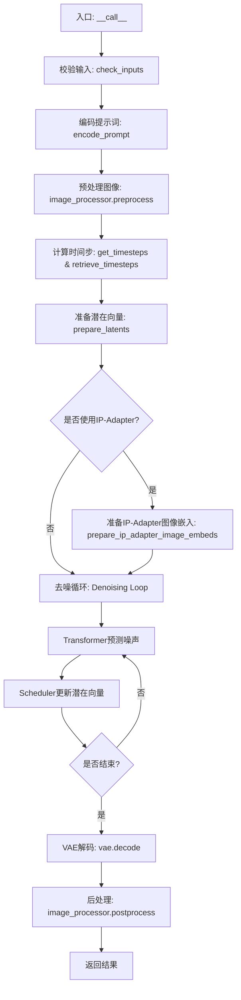
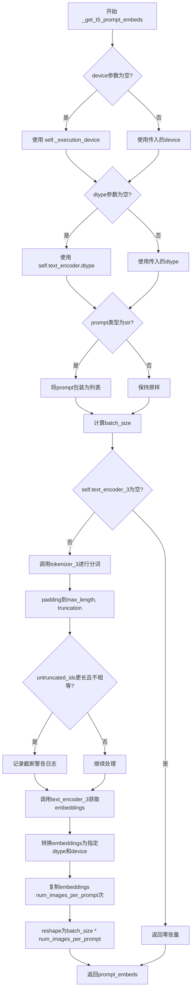
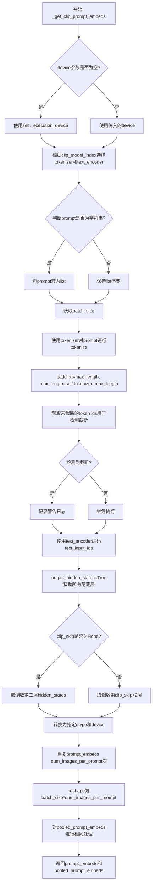
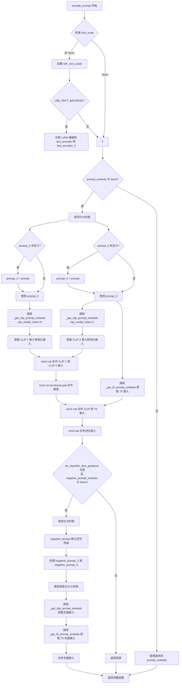
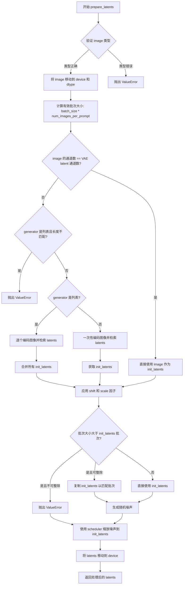
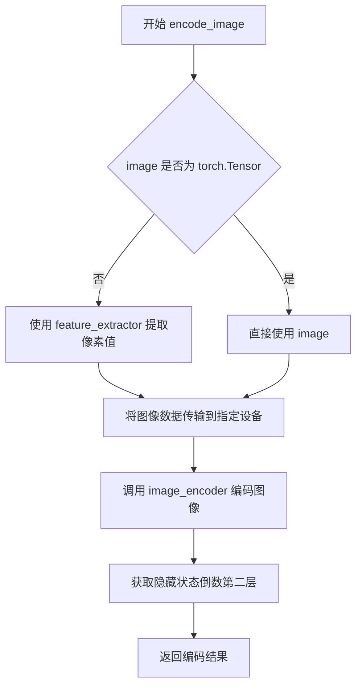
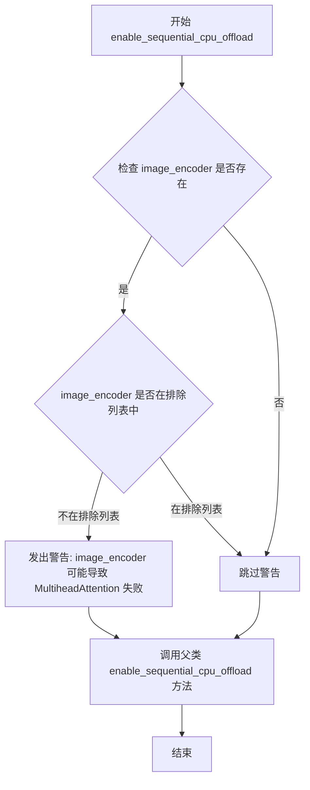

```mermaid
flowchart TD
    A[开始 __call__] --> B[检查输入参数 validity]
    B --> C[设置内部状态<br/>_guidance_scale, _clip_skip, _joint_attention_kwargs]
    C --> D[确定batch_size]
    D --> E[编码提示词<br/>encode_prompt]
    E --> F{是否使用CFG?}
    F -->|是| G[拼接negative和positive prompt_embeds]
    F -->|否| H[仅使用positive prompt_embeds]
    G --> I[预处理输入图像]
    H --> I
    I --> J[计算动态偏移mu<br/>calculate_shift]
    J --> K[获取时间步<br/>retrieve_timesteps]
    K --> L[计算调整后的timesteps<br/>get_timesteps]
    L --> M[准备潜在向量<br/>prepare_latents]
    M --> N{是否启用IP-Adapter?}
    N -->|是| O[准备IP-Adapter图像嵌入]
    N -->|否| P[进入去噪循环]
    O --> P
    P --> Q[初始化进度条和循环计数器]
    Q --> R{循环遍历timesteps}
    R -->|未完成| S[扩展latents for CFG]
    S --> T[Transformer前向传播<br/>预测噪声]
    T --> U{是否使用CFG?}
    U -->|是| V[分离并加权噪声预测]
    U -->|否| W[直接使用噪声预测]
    V --> X[调度器步进<br/>scheduler.step]
    W --> X
    X --> Y[类型转换检查<br/>MPS兼容]
    Y --> Z{是否配置callback?}
    Z -->|是| AA[执行回调函数<br/>callback_on_step_end]
    Z -->|否| AB[更新进度条]
    AA --> AB
    AB --> AC{是否完成所有步数?}
    AC -->|否| R
    AC -->|是| AD{output_type == 'latent'?}
    AD -->|是| AE[直接返回latents]
    AD -->|否| AF[解码latents为图像<br/>vae.decode]
    AF --> AG[后处理图像<br/>postprocess]
    AE --> AH[释放模型钩子]
    AG --> AH
    AH --> AI{return_dict == True?}
    AI -->|是| AJ[返回StableDiffusion3PipelineOutput]
    AI -->|否| AK[返回tuple]
    AJ --> AL[结束]
    AK --> AL
```

# `diffusers\src\diffusers\pipelines\stable_diffusion_3\pipeline_stable_diffusion_3_img2img.py` 详细设计文档

Stable Diffusion 3 Image-to-Image pipeline 是一个基于 PyTorch 的扩散模型实现，用于根据文本提示（prompt）对输入图像进行重绘（img2img）。它集成了多个文本编码器（CLIP、T5）和一个专用的 Transformer (MMDiT) 进行噪声预测，并使用 VAE 进行潜在空间与图像空间的转换。

## 整体流程



## 类结构

```
DiffusionPipeline (抽象基类)
├── StableDiffusion3Img2ImgPipeline (主类)
│   ├── SD3LoraLoaderMixin (LoRA加载特性)
    ├── FromSingleFileMixin (单文件加载特性)
    └── SD3IPAdapterMixin (IP-Adapter特性)
```

## 全局变量及字段


### `logger`
    
Module-level logger for tracking runtime events and debugging

类型：`logging.Logger`
    


### `EXAMPLE_DOC_STRING`
    
Documentation string containing usage examples for the pipeline

类型：`str`
    


### `XLA_AVAILABLE`
    
Boolean flag indicating whether PyTorch XLA is available for accelerated computation

类型：`bool`
    


### `StableDiffusion3Img2ImgPipeline.transformer`
    
Conditional Transformer (MMDiT) architecture for denoising encoded image latents

类型：`SD3Transformer2DModel`
    


### `StableDiffusion3Img2ImgPipeline.scheduler`
    
Scheduler used in combination with transformer to denoise encoded image latents

类型：`FlowMatchEulerDiscreteScheduler`
    


### `StableDiffusion3Img2ImgPipeline.vae`
    
Variational Auto-Encoder Model for encoding and decoding images to and from latent representations

类型：`AutoencoderKL`
    


### `StableDiffusion3Img2ImgPipeline.text_encoder`
    
First CLIP text encoder with projection layer (clip-vit-large-patch14 variant)

类型：`CLIPTextModelWithProjection`
    


### `StableDiffusion3Img2ImgPipeline.text_encoder_2`
    
Second CLIP text encoder (laion/CLIP-ViT-bigG-14-laion2B-39B-b160k variant)

类型：`CLIPTextModelWithProjection`
    


### `StableDiffusion3Img2ImgPipeline.text_encoder_3`
    
Frozen T5 text encoder (t5-v1_1-xxl variant) for enhanced text understanding

类型：`T5EncoderModel`
    


### `StableDiffusion3Img2ImgPipeline.tokenizer`
    
First tokenizer for converting text to tokens

类型：`CLIPTokenizer`
    


### `StableDiffusion3Img2ImgPipeline.tokenizer_2`
    
Second tokenizer for converting text to tokens

类型：`CLIPTokenizer`
    


### `StableDiffusion3Img2ImgPipeline.tokenizer_3`
    
Fast T5 tokenizer for text encoding

类型：`T5TokenizerFast`
    


### `StableDiffusion3Img2ImgPipeline.image_encoder`
    
Pre-trained Vision Model for IP Adapter image feature extraction

类型：`SiglipVisionModel`
    


### `StableDiffusion3Img2ImgPipeline.feature_extractor`
    
Image processor for IP Adapter feature extraction

类型：`SiglipImageProcessor`
    


### `StableDiffusion3Img2ImgPipeline.image_processor`
    
Image processor for VAE preprocessing and postprocessing

类型：`VaeImageProcessor`
    


### `StableDiffusion3Img2ImgPipeline.vae_scale_factor`
    
Scale factor derived from VAE block output channels for latent space computation

类型：`int`
    


### `StableDiffusion3Img2ImgPipeline.tokenizer_max_length`
    
Maximum sequence length supported by the tokenizers

类型：`int`
    


### `StableDiffusion3Img2ImgPipeline.default_sample_size`
    
Default sample size from transformer configuration for image generation

类型：`int`
    


### `StableDiffusion3Img2ImgPipeline.patch_size`
    
Patch size from transformer configuration for spatial processing

类型：`int`
    
    

## 全局函数及方法


### `calculate_shift`

该函数用于根据图像序列长度动态计算去噪调度器的偏移量（shift value），通过线性插值在基础序列长度和最大序列长度之间平滑过渡，适用于 Stable Diffusion 3 等模型的动态时间步长调整。

参数：

- `image_seq_len`：`int`，输入图像的序列长度，通常由图像尺寸、VAE 缩放因子和 Transformer patch size 计算得出
- `base_seq_len`：`int`，默认为 256，基础序列长度的参考值
- `max_seq_len`：`int`，默认为 4096，最大序列长度的参考值
- `base_shift`：`float`，默认为 0.5，基础偏移量，对应 base_seq_len 时的偏移值
- `max_shift`：`float`，默认为 1.15，最大偏移量，对应 max_seq_len 时的偏移值

返回值：`float`，计算得到的动态偏移量 mu，用于调度器的动态时间步长调整

#### 流程图

```mermaid
flowchart TD
    A[开始 calculate_shift] --> B[计算斜率 m = (max_shift - base_shift) / (max_seq_len - base_seq_len)]
    B --> C[计算截距 b = base_shift - m * base_seq_len]
    C --> D[计算偏移量 mu = image_seq_len * m + b]
    D --> E[返回 mu]
```

#### 带注释源码

```python
# Copied from diffusers.pipelines.flux.pipeline_flux.calculate_shift
def calculate_shift(
    image_seq_len,                          # 输入：图像序列长度
    base_seq_len: int = 256,                # 参数：基础序列长度默认值
    max_seq_len: int = 4096,                # 参数：最大序列长度默认值
    base_shift: float = 0.5,                # 参数：基础偏移量默认值
    max_shift: float = 1.15,                # 参数：最大偏移量默认值
):
    # 计算线性插值的斜率 (slope)
    # 表示每单位序列长度变化对应的偏移量变化
    m = (max_shift - base_shift) / (max_seq_len - base_seq_len)
    
    # 计算线性截距 (intercept)
    # 确保在 base_seq_len 时偏移量恰好为 base_shift
    b = base_shift - m * base_seq_len
    
    # 根据输入的图像序列长度计算最终的偏移量 mu
    # 使用线性方程: y = mx + b
    mu = image_seq_len * m + b
    
    # 返回计算得到的动态偏移量
    return mu
```


### `retrieve_latents`

该函数是一个全局工具函数，用于从变分自编码器（VAE）的编码器输出中提取潜在向量（latents）。它支持三种提取模式：通过随机采样获取潜在分布样本、通过argmax获取潜在分布的模式，或者直接返回预存的潜在向量。这是Stable Diffusion系列pipeline中常用的辅助函数，主要在图像到图像的latent预处理阶段被调用。

参数：

- `encoder_output`：`torch.Tensor`，编码器输出对象，通常包含 `latent_dist` 属性（潜在分布）或 `latents` 属性（预存的潜在向量）
- `generator`：`torch.Generator | None`，可选的随机数生成器，用于确保采样过程的可重复性
- `sample_mode`：`str`，采样模式，默认为 "sample"。可选值包括 "sample"（从分布中采样）、"argmax"（取分布的模式）、或直接返回 `latents` 属性

返回值：`torch.Tensor`，从编码器输出中提取的潜在向量张量

#### 流程图

```mermaid
flowchart TD
    A[开始: retrieve_latents] --> B{encoder_output 是否有 latent_dist 属性?}
    B -->|是| C{sample_mode == 'sample'?}
    B -->|否| D{encoder_output 是否有 latents 属性?}
    C -->|是| E[返回 encoder_output.latent_dist.sample<br/>(generator)]
    C -->|否| F{sample_mode == 'argmax'?}
    F -->|是| G[返回 encoder_output.latent_dist.mode<br/>()]
    F -->|否| H[抛出 AttributeError]
    D -->|是| I[返回 encoder_output.latents]
    D -->|否| J[抛出 AttributeError]
    E --> K[结束]
    G --> K
    I --> K
    H --> K
```

#### 带注释源码

```python
# Copied from diffusers.pipelines.stable_diffusion.pipeline_stable_diffusion_img2img.retrieve_latents
def retrieve_latents(
    encoder_output: torch.Tensor, generator: torch.Generator | None = None, sample_mode: str = "sample"
):
    """
    从编码器输出中提取潜在向量（latents）。
    
    该函数处理三种可能的编码器输出格式：
    1. 具有 latent_dist 属性且使用 sample 模式：从分布中采样
    2. 具有 latent_dist 属性且使用 argmax 模式：取分布的均值/模式
    3. 直接具有 latents 属性：直接返回预存的潜在向量
    
    Args:
        encoder_output: 编码器输出，通常是 VAE encode 方法的返回值
        generator: 可选的随机数生成器，用于控制采样随机性
        sample_mode: 采样模式，可选 "sample" 或 "argmax"
    
    Returns:
        torch.Tensor: 提取出的潜在向量
    """
    # 检查编码器输出是否具有 latent_dist 属性（即是否为 Distribution 类型的输出）
    if hasattr(encoder_output, "latent_dist") and sample_mode == "sample":
        # 从潜在分布中进行随机采样，可选使用生成器确保可重复性
        return encoder_output.latent_dist.sample(generator)
    # 如果 latent_dist 存在但模式为 argmax，则返回分布的模式（通常是均值）
    elif hasattr(encoder_output, "latent_dist") and sample_mode == "argmax":
        return encoder_output.latent_dist.mode()
    # 检查是否直接具有 latents 属性（即为预计算的潜在向量）
    elif hasattr(encoder_output, "latents"):
        return encoder_output.latents
    # 如果以上都不满足，抛出属性错误
    else:
        raise AttributeError("Could not access latents of provided encoder_output")
```


### `retrieve_timesteps`

调用调度器的 `set_timesteps` 方法并从调度器中检索时间步。支持自定义时间步或 sigma 值，并返回时间步张量和推理步数。

参数：

- `scheduler`：`SchedulerMixin`，要获取时间步的调度器
- `num_inference_steps`：`int | None`，生成样本时使用的扩散步数，若使用此参数则 `timesteps` 必须为 `None`
- `device`：`str | torch.device | None`，时间步要移动到的设备，若为 `None` 则不移动
- `timesteps`：`list[int] | None`，用于覆盖调度器时间步间隔策略的自定义时间步，若传入此参数则 `num_inference_steps` 和 `sigmas` 必须为 `None`
- `sigmas`：`list[float] | None`，用于覆盖调度器时间步间隔策略的自定义 sigma 值，若传入此参数则 `num_inference_steps` 和 `timesteps` 必须为 `None`
- `**kwargs`：任意额外关键字参数，将传递给调度器的 `set_timesteps` 方法

返回值：`tuple[torch.Tensor, int]`，元组包含调度器的时间步张量和推理步数

#### 流程图

```mermaid
flowchart TD
    A[开始] --> B{检查: timesteps 和 sigmas 是否同时存在?}
    B -->|是| C[抛出 ValueError: 只能指定一个]
    B -->|否| D{检查: timesteps 是否为 None?}
    D -->|否| E[检查调度器是否支持 timesteps 参数]
    E --> F{支持 timesteps?}
    F -->|否| G[抛出 ValueError: 不支持自定义 timesteps]
    F -->|是| H[调用 scheduler.set_timesteps(timesteps=timesteps, device=device, **kwargs)]
    I[获取 scheduler.timesteps]
    J[计算 num_inference_steps = len(timesteps)]
    D -->|是| K{检查: sigmas 是否为 None?}
    K -->|否| L[检查调度器是否支持 sigmas 参数]
    L --> M{支持 sigmas?}
    M -->|否| N[抛出 ValueError: 不支持自定义 sigmas]
    M -->|是| O[调用 scheduler.set_timesteps(sigmas=sigmas, device=device, **kwargs)]
    I2[获取 scheduler.timesteps]
    J2[计算 num_inference_steps = len(timesteps)]
    K -->|是| P[调用 scheduler.set_timesteps(num_inference_steps, device=device, **kwargs)]
    Q[获取 scheduler.timesteps]
    R[返回 timesteps, num_inference_steps]
    
    H --> I
    I --> J
    J --> R
    O --> I2
    I2 --> J2
    J2 --> R
    P --> Q
    Q --> R
```

#### 带注释源码

```python
def retrieve_timesteps(
    scheduler,
    num_inference_steps: int | None = None,
    device: str | torch.device | None = None,
    timesteps: list[int] | None = None,
    sigmas: list[float] | None = None,
    **kwargs,
):
    r"""
    Calls the scheduler's `set_timesteps` method and retrieves timesteps from the scheduler after the call. Handles
    custom timesteps. Any kwargs will be supplied to `scheduler.set_timesteps`.

    Args:
        scheduler (`SchedulerMixin`):
            The scheduler to get timesteps from.
        num_inference_steps (`int`):
            The number of diffusion steps used when generating samples with a pre-trained model. If used, `timesteps`
            must be `None`.
        device (`str` or `torch.device`, *optional*):
            The device to which the timesteps should be moved to. If `None`, the timesteps are not moved.
        timesteps (`list[int]`, *optional*):
            Custom timesteps used to override the timestep spacing strategy of the scheduler. If `timesteps` is passed,
            `num_inference_steps` and `sigmas` must be `None`.
        sigmas (`list[float]`, *optional*):
            Custom sigmas used to override the timestep spacing strategy of the scheduler. If `sigmas` is passed,
            `num_inference_steps` and `timesteps` must be `None`.

    Returns:
        `tuple[torch.Tensor, int]`: A tuple where the first element is the timestep schedule from the scheduler and the
        second element is the number of inference steps.
    """
    # 检查 timesteps 和 sigmas 不能同时指定，只能选择其中一个
    if timesteps is not None and sigmas is not None:
        raise ValueError("Only one of `timesteps` or `sigmas` can be passed. Please choose one to set custom values")
    
    # 处理自定义 timesteps 的情况
    if timesteps is not None:
        # 检查调度器的 set_timesteps 方法是否支持 timesteps 参数
        accepts_timesteps = "timesteps" in set(inspect.signature(scheduler.set_timesteps).parameters.keys())
        if not accepts_timesteps:
            raise ValueError(
                f"The current scheduler class {scheduler.__class__}'s `set_timesteps` does not support custom"
                f" timestep schedules. Please check whether you are using the correct scheduler."
            )
        # 调用调度器的 set_timesteps 方法设置自定义时间步
        scheduler.set_timesteps(timesteps=timesteps, device=device, **kwargs)
        # 从调度器获取时间步
        timesteps = scheduler.timesteps
        # 计算推理步数
        num_inference_steps = len(timesteps)
    # 处理自定义 sigmas 的情况
    elif sigmas is not None:
        # 检查调度器的 set_timesteps 方法是否支持 sigmas 参数
        accept_sigmas = "sigmas" in set(inspect.signature(scheduler.set_timesteps).parameters.keys())
        if not accept_sigmas:
            raise ValueError(
                f"The current scheduler class {scheduler.__class__}'s `set_timesteps` does not support custom"
                f" sigmas schedules. Please check whether you are using the correct scheduler."
            )
        # 调用调度器的 set_timesteps 方法设置自定义 sigmas
        scheduler.set_timesteps(sigmas=sigmas, device=device, **kwargs)
        # 从调度器获取时间步
        timesteps = scheduler.timesteps
        # 计算推理步数
        num_inference_steps = len(timesteps)
    # 处理默认情况：使用 num_inference_steps
    else:
        scheduler.set_timesteps(num_inference_steps, device=device, **kwargs)
        timesteps = scheduler.timesteps
    
    # 返回时间步张量和推理步数
    return timesteps, num_inference_steps
```


### StableDiffusion3Img2ImgPipeline.__init__

该方法是 Stable Diffusion 3 图像到图像（Img2Img）管道的构造函数，负责初始化所有核心模型组件、调度器、图像处理器以及相关配置参数，为后续的图像生成任务准备完整的环境。

参数：

- `transformer`：`SD3Transformer2DModel`，条件 Transformer（MMDiT）架构，用于对编码的图像潜在表示进行去噪
- `scheduler`：`FlowMatchEulerDiscreteScheduler`，与 transformer 配合使用以对编码的图像潜在表示进行去噪的调度器
- `vae`：`AutoencoderKL`，变分自编码器模型，用于在潜在表示和图像之间进行编码和解码
- `text_encoder`：`CLIPTextModelWithProjection`，CLIP 文本编码器（clip-vit-large-patch14 变体），带有一个额外的投影层
- `tokenizer`：`CLIPTokenizer`，CLIP 文本分词器
- `text_encoder_2`：`CLIPTextModelWithProjection`，第二个 CLIP 文本编码器（CLIP-ViT-bigG-14-laion2B 变体）
- `tokenizer_2`：`CLIPTokenizer`，第二个 CLIP 文本分词器
- `text_encoder_3`：`T5EncoderModel`，T5 文本编码器（t5-v1_1-xxl 变体），用于 Stable Diffusion 3
- `tokenizer_3`：`T5TokenizerFast`，T5 文本分词器
- `image_encoder`：`SiglipVisionModel | None`，可选，IP Adapter 使用的预训练视觉模型
- `feature_extractor`：`SiglipImageProcessor | None`，可选，IP Adapter 的图像处理器

返回值：无（`None`），构造函数不返回值，仅初始化实例属性

#### 流程图

```mermaid
flowchart TD
    A[开始 __init__] --> B[调用 super().__init__]
    B --> C[register_modules: 注册所有模型组件]
    C --> D[计算 vae_scale_factor]
    D --> E[获取 latent_channels]
    E --> F[初始化 VaeImageProcessor]
    F --> G[设置 tokenizer_max_length]
    G --> H[设置 default_sample_size]
    H --> I[设置 patch_size]
    I --> J[结束 __init__]
```

#### 带注释源码

```
def __init__(
    self,
    transformer: SD3Transformer2DModel,
    scheduler: FlowMatchEulerDiscreteScheduler,
    vae: AutoencoderKL,
    text_encoder: CLIPTextModelWithProjection,
    tokenizer: CLIPTokenizer,
    text_encoder_2: CLIPTextModelWithProjection,
    tokenizer_2: CLIPTokenizer,
    text_encoder_3: T5EncoderModel,
    tokenizer_3: T5TokenizerFast,
    image_encoder: SiglipVisionModel | None = None,
    feature_extractor: SiglipImageProcessor | None = None,
):
    """
    初始化 StableDiffusion3Img2ImgPipeline
    
    参数:
        transformer: SD3Transformer2DModel 实例，用于去噪的 Transformer 模型
        scheduler: FlowMatchEulerDiscreteScheduler 实例，扩散调度器
        vae: AutoencoderKL 实例，用于编码/解码图像的 VAE 模型
        text_encoder: CLIPTextModelWithProjection 实例，CLIP 文本编码器
        tokenizer: CLIPTokenizer 实例，CLIP 分词器
        text_encoder_2: CLIPTextModelWithProjection 实例，第二个 CLIP 文本编码器
        tokenizer_2: CLIPTokenizer 实例，第二个 CLIP 分词器
        text_encoder_3: T5EncoderModel 实例，T5 文本编码器
        tokenizer_3: T5TokenizerFast 实例，T5 分词器
        image_encoder: SiglipVisionModel，可选，IP Adapter 视觉编码器
        feature_extractor: SiglipImageProcessor，可选，IP Adapter 图像处理器
    """
    # 调用父类 DiffusionPipeline 的初始化方法
    # 设置管道的基本属性和配置
    super().__init__()
    
    # 注册所有模块到管道中，使其可以通过 self.xxx 访问
    # 这些模块会在后续的推理过程中被使用
    self.register_modules(
        vae=vae,
        text_encoder=text_encoder,
        text_encoder_2=text_encoder_2,
        text_encoder_3=text_encoder_3,
        tokenizer=tokenizer,
        tokenizer_2=tokenizer_2,
        tokenizer_3=tokenizer_3,
        transformer=transformer,
        scheduler=scheduler,
        image_encoder=image_encoder,
        feature_extractor=feature_extractor,
    )
    
    # 计算 VAE 缩放因子
    # 基于 VAE 的 block_out_channels 数量计算，通常是 2^(len-1)
    # 例如：如果有 [128, 256, 512, 512] 四个通道，则 scale_factor = 2^3 = 8
    self.vae_scale_factor = 2 ** (len(self.vae.config.block_out_channels) - 1) if getattr(self, "vae", None) else 8
    
    # 获取 VAE 的潜在通道数
    latent_channels = self.vae.config.latent_channels if getattr(self, "vae", None) else 16
    
    # 初始化图像处理器，用于图像的预处理和后处理
    # 包括归一化、调整大小、潜在空间转换等操作
    self.image_processor = VaeImageProcessor(
        vae_scale_factor=self.vae_scale_factor, 
        vae_latent_channels=latent_channels
    )
    
    # 设置分词器的最大长度
    # 默认使用 tokenizer 的 model_max_length，如果不存在则使用 77
    self.tokenizer_max_length = (
        self.tokenizer.model_max_length if hasattr(self, "tokenizer") and self.tokenizer is not None else 77
    )
    
    # 设置默认的样本大小
    # 从 transformer 配置中获取 sample_size，如果不存在则使用 128
    self.default_sample_size = (
        self.transformer.config.sample_size
        if hasattr(self, "transformer") and self.transformer is not None
        else 128
    )
    
    # 设置 Transformer 的 patch_size
    # 用于将图像分割成 patches 进行处理
    self.patch_size = (
        self.transformer.config.patch_size if hasattr(self, "transformer") and self.transformer is not None else 2
    )
```


### `StableDiffusion3Img2ImgPipeline._get_t5_prompt_embeds`

该方法负责将文本提示（prompt）通过T5文本编码器（text_encoder_3）转换为高维向量表示（prompt embeddings），以供Stable Diffusion 3的图像生成pipeline使用。该方法是Stable Diffusion 3多模态文本编码架构的核心组成部分，支持T5-XXL大语言模型的文本理解与向量化。

参数：

- `self`：`StableDiffusion3Img2ImgPipeline`实例本身，隐式传递
- `prompt`：`str | list[str]`，待编码的文本提示，可以是单个字符串或字符串列表
- `num_images_per_prompt`：`int`，每个提示生成的图像数量，用于对prompt embeddings进行复制以匹配批量生成，默认为1
- `max_sequence_length`：`int`，T5编码器的最大序列长度，默认为256
- `device`：`torch.device | None`，指定计算设备，默认为None（自动获取执行设备）
- `dtype`：`torch.dtype | None`，指定tensor的数据类型，默认为None（使用text_encoder的dtype）

返回值：`torch.Tensor`，返回形状为`(batch_size * num_images_per_prompt, max_sequence_length, joint_attention_dim)`的文本嵌入张量，供后续图像生成使用

#### 流程图



#### 带注释源码

```python
def _get_t5_prompt_embeds(
    self,
    prompt: str | list[str] = None,
    num_images_per_prompt: int = 1,
    max_sequence_length: int = 256,
    device: torch.device | None = None,
    dtype: torch.dtype | None = None,
):
    # 确定计算设备：如果未指定，则使用pipeline的默认执行设备
    device = device or self._execution_device
    # 确定数据类型：如果未指定，则使用text_encoder_3的数据类型
    dtype = dtype or self.text_encoder.dtype

    # 标准化输入：将单个字符串转换为列表，以便统一处理
    prompt = [prompt] if isinstance(prompt, str) else prompt
    # 计算批次大小
    batch_size = len(prompt)

    # 边界情况处理：如果text_encoder_3不存在（T5模型未加载），返回零张量
    # 零张量的形状为 (batch_size * num_images_per_prompt, max_sequence_length, joint_attention_dim)
    if self.text_encoder_3 is None:
        return torch.zeros(
            (
                batch_size * num_images_per_prompt,
                max_sequence_length,
                self.transformer.config.joint_attention_dim,
            ),
            device=device,
            dtype=dtype,
        )

    # 使用T5 tokenizer对prompt进行分词处理
    # padding="max_length"：填充到最大长度以确保批量处理时形状一致
    # truncation=True：截断超过max_sequence_length的序列
    # add_special_tokens=True：添加特殊的起始和结束token（如</s>）
    text_inputs = self.tokenizer_3(
        prompt,
        padding="max_length",
        max_length=max_sequence_length,
        truncation=True,
        add_special_tokens=True,
        return_tensors="pt",
    )
    # 获取分词后的input_ids
    text_input_ids = text_inputs.input_ids
    
    # 获取未截断的版本，用于检测是否发生了截断
    untruncated_ids = self.tokenizer_3(prompt, padding="longest", return_tensors="pt").input_ids

    # 检测截断：如果未截断的序列更长且与截断后的序列不相等，说明发生了截断
    # 此时记录警告日志，告知用户被截断的内容
    if untruncated_ids.shape[-1] >= text_input_ids.shape[-1] and not torch.equal(text_input_ids, untruncated_ids):
        removed_text = self.tokenizer_3.batch_decode(untruncated_ids[:, self.tokenizer_max_length - 1 : -1])
        logger.warning(
            "The following part of your input was truncated because `max_sequence_length` is set to "
            f" {max_sequence_length} tokens: {removed_text}"
        )

    # 通过T5 encoder获取文本嵌入表示
    # 输入：tokenized input IDs，输出：隐藏状态向量
    prompt_embeds = self.text_encoder_3(text_input_ids.to(device))[0]

    # 确保embeddings的数据类型和设备与指定的一致
    dtype = self.text_encoder_3.dtype
    prompt_embeds = prompt_embeds.to(dtype=dtype, device=device)

    # 获取embeddings的序列维度信息
    _, seq_len, _ = prompt_embeds.shape

    # 为每个prompt生成多个图像时，需要复制embeddings
    # 使用repeat和view进行内存友好的复制操作（兼容MPS设备）
    # 原始形状: (batch_size, seq_len, hidden_dim)
    # 复制后形状: (batch_size * num_images_per_prompt, seq_len, hidden_dim)
    prompt_embeds = prompt_embeds.repeat(1, num_images_per_prompt, 1)
    prompt_embeds = prompt_embeds.view(batch_size * num_images_per_prompt, seq_len, -1)

    # 返回处理后的prompt embeddings
    return prompt_embeds
```


### `StableDiffusion3Img2ImgPipeline._get_clip_prompt_embeds`

该方法用于将文本提示（prompt）编码为 CLIP 文本嵌入（embeddings）。它支持双 CLIP 文本编码器架构（CLIP1 和 CLIP2），可根据 `clip_model_index` 选择使用哪个文本编码器，并支持 `clip_skip` 参数来跳过 CLIP 模型的最后几层以获取不同层级的特征。

参数：

- `prompt`：`str | list[str]`，要编码的文本提示，可以是单个字符串或字符串列表
- `num_images_per_prompt`：`int = 1`，每个提示生成的图像数量，用于批量复制嵌入向量
- `device`：`torch.device | None = None`，指定计算设备，默认为执行设备
- `clip_skip`：`int | None = None`，可选参数，指定跳过 CLIP 模型最后几层，值为 1 时使用预最后一层的输出
- `clip_model_index`：`int = 0`，选择使用哪个 CLIP 文本编码器（0 表示 `text_encoder`，1 表示 `text_encoder_2`）

返回值：`tuple[torch.Tensor, torch.Tensor]`，返回两个张量：
- 第一个是 `prompt_embeds`：形状为 `(batch_size * num_images_per_prompt, seq_len, hidden_dim)` 的文本嵌入
- 第二个是 `pooled_prompt_embeds`：形状为 `(batch_size * num_images_per_prompt, hidden_dim)` 的池化文本嵌入

#### 流程图



#### 带注释源码

```python
def _get_clip_prompt_embeds(
    self,
    prompt: str | list[str],
    num_images_per_prompt: int = 1,
    device: torch.device | None = None,
    clip_skip: int | None = None,
    clip_model_index: int = 0,
):
    """
    将文本提示编码为CLIP文本嵌入向量。

    Args:
        prompt: 要编码的文本提示，支持单个字符串或字符串列表
        num_images_per_prompt: 每个提示生成的图像数量，用于复制嵌入向量
        device: 计算设备，如果为None则使用执行设备
        clip_skip: 跳过CLIP最后几层，1表示使用预最后层
        clip_model_index: 选择CLIP模型索引，0=tokenizer/text_encoder, 1=tokenizer_2/text_encoder_2

    Returns:
        Tuple of (prompt_embeds, pooled_prompt_embeds)
    """
    # 如果device为None，使用pipeline的默认执行设备
    device = device or self._execution_device

    # 定义两个CLIP tokenizer和text_encoder的列表
    clip_tokenizers = [self.tokenizer, self.tokenizer_2]
    clip_text_encoders = [self.text_encoder, self.text_encoder_2]

    # 根据索引选择要使用的tokenizer和text_encoder
    tokenizer = clip_tokenizers[clip_model_index]
    text_encoder = clip_text_encoders[clip_model_index]

    # 确保prompt是list格式，便于批量处理
    prompt = [prompt] if isinstance(prompt, str) else prompt
    batch_size = len(prompt)

    # 使用tokenizer将prompt转换为token ids
    # padding=max_length: 填充到最大长度
    # max_length: tokenizer的最大长度（默认为77）
    # truncation=True: 截断超过最大长度的序列
    # return_tensors="pt": 返回PyTorch张量
    text_inputs = tokenizer(
        prompt,
        padding="max_length",
        max_length=self.tokenizer_max_length,
        truncation=True,
        return_tensors="pt",
    )

    text_input_ids = text_inputs.input_ids

    # 获取未截断的token ids用于检测输入是否被截断
    # padding="longest": 填充到当前batch中最长的序列长度
    untruncated_ids = tokenizer(prompt, padding="longest", return_tensors="pt").input_ids

    # 检测输入是否被截断，如果被截断则记录警告
    # 条件：未截断序列长度 >= 截断序列长度 且 两者不相等
    if untruncated_ids.shape[-1] >= text_input_ids.shape[-1] and not torch.equal(text_input_ids, untruncated_ids):
        # 解码被截断的部分（取tokenizer_max_length-1到最后的token）
        removed_text = self.tokenizer_3.batch_decode(untruncated_ids[:, self.tokenizer_max_length - 1 : -1])
        logger.warning(
            "The following part of your input was truncated because `max_sequence_length` is set to "
            f" {self.tokenizer_max_length} tokens: {removed_text}"
        )

    # 使用text_encoder编码text_input_ids
    # output_hidden_states=True: 返回所有隐藏层状态
    prompt_embeds = text_encoder(text_input_ids.to(device), output_hidden_states=True)
    # 获取池化的prompt嵌入（第一层的输出）
    pooled_prompt_embeds = prompt_embeds[0]

    # 根据clip_skip参数选择隐藏层
    # clip_skip=None: 使用倒数第二层（通常是最后一层之前的一层）
    # clip_skip=1: 使用倒数第三层，即预最后层
    if clip_skip is None:
        prompt_embeds = prompt_embeds.hidden_states[-2]
    else:
        prompt_embeds = prompt_embeds.hidden_states[-(clip_skip + 2)]

    # 将prompt_embeds转换为指定的dtype和device
    prompt_embeds = prompt_embeds.to(dtype=self.text_encoder.dtype, device=device)

    # 获取序列长度
    _, seq_len, _ = prompt_embeds.shape

    # 复制text embeddings以匹配num_images_per_prompt
    # repeat(1, num_images_per_prompt, 1): 在序列维度复制
    # view(batch_size * num_images_per_prompt, seq_len, -1): 重塑为最终的形状
    prompt_embeds = prompt_embeds.repeat(1, num_images_per_prompt, 1)
    prompt_embeds = prompt_embeds.view(batch_size * num_images_per_prompt, seq_len, -1)

    # 对pooled_prompt_embeds进行相同的复制操作
    pooled_prompt_embeds = pooled_prompt_embeds.repeat(1, num_images_per_prompt)
    pooled_prompt_embeds = pooled_prompt_embeds.view(batch_size * num_images_per_prompt, -1)

    # 返回编码后的prompt embeddings和pooled prompt embeddings
    return prompt_embeds, pooled_prompt_embeds
```


### `StableDiffusion3Img2ImgPipeline.encode_prompt`

该方法负责将文本提示（prompt）编码为文本嵌入向量（text embeddings），供 Stable Diffusion 3 的 Transformer 模型使用。它整合了三个文本编码器（两个 CLIP 编码器和一个 T5 编码器）的输出，支持分类器自由引导（CFG），并处理 LoRA 缩放。

参数：

- `prompt`：`str | list[str]`，要编码的主要文本提示
- `prompt_2`：`str | list[str]`，发送给第二个 CLIP 编码器的提示，若未定义则使用 `prompt`
- `prompt_3`：`str | list[str]`，发送给 T5 编码器的提示，若未定义则使用 `prompt`
- `device`：`torch.device | None`，指定的 torch 设备，若为 None 则使用 `_execution_device`
- `num_images_per_prompt`：`int`，每个提示要生成的图像数量，默认为 1
- `do_classifier_free_guidance`：`bool`，是否启用分类器自由引导
- `negative_prompt`：`str | list[str] | None`，负面提示，用于引导图像生成远离不希望的内容
- `negative_prompt_2`：`str | list[str] | None`，第二个负面提示
- `negative_prompt_3`：`str | list[str] | None`，第三个负面提示
- `prompt_embeds`：`torch.FloatTensor | None`，预生成的文本嵌入，若提供则直接使用
- `negative_prompt_embeds`：`torch.FloatTensor | None`，预生成的负面文本嵌入
- `pooled_prompt_embeds`：`torch.FloatTensor | None`，预生成的池化文本嵌入
- `negative_pooled_prompt_embeds`：`torch.FloatTensor | None`，预生成的负面池化文本嵌入
- `clip_skip`：`int | None`，CLIP 编码时跳过的层数
- `max_sequence_length`：`int`，最大序列长度，默认为 256（T5 编码器）
- `lora_scale`：`float | None`，LoRA 层的缩放因子

返回值：`tuple[torch.FloatTensor, torch.FloatTensor, torch.FloatTensor, torch.FloatTensor]`，返回一个包含四个元素的元组：
1. `prompt_embeds`：编码后的正向文本嵌入
2. `negative_prompt_embeds`：编码后的负面文本嵌入
3. `pooled_prompt_embeds`：编码后的池化正向文本嵌入
4. `negative_pooled_prompt_embeds`：编码后的池化负面文本嵌入

#### 流程图



#### 带注释源码

```python
def encode_prompt(
    self,
    prompt: str | list[str],
    prompt_2: str | list[str],
    prompt_3: str | list[str],
    device: torch.device | None = None,
    num_images_per_prompt: int = 1,
    do_classifier_free_guidance: bool = True,
    negative_prompt: str | list[str] | None = None,
    negative_prompt_2: str | list[str] | None = None,
    negative_prompt_3: str | list[str] | None = None,
    prompt_embeds: torch.FloatTensor | None = None,
    negative_prompt_embeds: torch.FloatTensor | None = None,
    pooled_prompt_embeds: torch.FloatTensor | None = None,
    negative_pooled_prompt_embeds: torch.FloatTensor | None = None,
    clip_skip: int | None = None,
    max_sequence_length: int = 256,
    lora_scale: float | None = None,
):
    """
    编码文本提示为文本嵌入向量，用于图像生成。

    Args:
        prompt: 主要文本提示
        prompt_2: 发送给第二个 CLIP 编码器的提示
        prompt_3: 发送给 T5 编码器的提示
        device: torch 设备
        num_images_per_prompt: 每个提示生成的图像数量
        do_classifier_free_guidance: 是否使用分类器自由引导
        negative_prompt: 负面提示
        negative_prompt_2: 第二个负面提示
        negative_prompt_3: 第三个负面提示
        prompt_embeds: 预生成的文本嵌入
        negative_prompt_embeds: 预生成的负面文本嵌入
        pooled_prompt_embeds: 预生成的池化文本嵌入
        negative_pooled_prompt_embeds: 预生成的负面池化文本嵌入
        clip_skip: CLIP 跳过的层数
        max_sequence_length: 最大序列长度
        lora_scale: LoRA 缩放因子
    """
    # 确定设备，若未指定则使用执行设备
    device = device or self._execution_device

    # 设置 LoRA 缩放，以便 text encoder 的 LoRA 函数正确访问
    if lora_scale is not None and isinstance(self, SD3LoraLoaderMixin):
        self._lora_scale = lora_scale

        # 动态调整 LoRA 缩放
        if self.text_encoder is not None and USE_PEFT_BACKEND:
            scale_lora_layers(self.text_encoder, lora_scale)
        if self.text_encoder_2 is not None and USE_PEFT_BACKEND:
            scale_lora_layers(self.text_encoder_2, lora_scale)

    # 将 prompt 规范化为列表
    prompt = [prompt] if isinstance(prompt, str) else prompt
    if prompt is not None:
        batch_size = len(prompt)
    else:
        # 若 prompt 为 None，则从 prompt_embeds 获取批次大小
        batch_size = prompt_embeds.shape[0]

    # 若未提供 prompt_embeds，则从文本生成嵌入
    if prompt_embeds is None:
        # prompt_2 和 prompt_3 若未定义则使用 prompt
        prompt_2 = prompt_2 or prompt
        prompt_2 = [prompt_2] if isinstance(prompt_2, str) else prompt_2

        prompt_3 = prompt_3 or prompt
        prompt_3 = [prompt_3] if isinstance(prompt_3, str) else prompt_3

        # 获取 CLIP 1 的文本嵌入和池化嵌入
        prompt_embed, pooled_prompt_embed = self._get_clip_prompt_embeds(
            prompt=prompt,
            device=device,
            num_images_per_prompt=num_images_per_prompt,
            clip_skip=clip_skip,
            clip_model_index=0,
        )
        # 获取 CLIP 2 的文本嵌入和池化嵌入
        prompt_2_embed, pooled_prompt_2_embed = self._get_clip_prompt_embeds(
            prompt=prompt_2,
            device=device,
            num_images_per_prompt=num_images_per_prompt,
            clip_skip=clip_skip,
            clip_model_index=1,
        )
        # 在最后一个维度拼接两个 CLIP 嵌入
        clip_prompt_embeds = torch.cat([prompt_embed, prompt_2_embed], dim=-1)

        # 获取 T5 的文本嵌入
        t5_prompt_embed = self._get_t5_prompt_embeds(
            prompt=prompt_3,
            num_images_per_prompt=num_images_per_prompt,
            max_sequence_length=max_sequence_length,
            device=device,
        )

        # 对 CLIP 嵌入进行填充以匹配 T5 嵌入的维度
        clip_prompt_embeds = torch.nn.functional.pad(
            clip_prompt_embeds, (0, t5_prompt_embed.shape[-1] - clip_prompt_embeds.shape[-1])
        )

        # 在倒数第二个维度拼接 CLIP 和 T5 嵌入
        prompt_embeds = torch.cat([clip_prompt_embeds, t5_prompt_embed], dim=-2)
        # 在最后一个维度拼接池化嵌入
        pooled_prompt_embeds = torch.cat([pooled_prompt_embed, pooled_prompt_2_embed], dim=-1)

    # 处理分类器自由引导的负面提示
    if do_classifier_free_guidance and negative_prompt_embeds is None:
        # 默认使用空字符串作为负面提示
        negative_prompt = negative_prompt or ""
        negative_prompt_2 = negative_prompt_2 or negative_prompt
        negative_prompt_3 = negative_prompt_3 or negative_prompt

        # 将字符串规范化为列表
        negative_prompt = batch_size * [negative_prompt] if isinstance(negative_prompt, str) else negative_prompt
        negative_prompt_2 = (
            batch_size * [negative_prompt_2] if isinstance(negative_prompt_2, str) else negative_prompt_2
        )
        negative_prompt_3 = (
            batch_size * [negative_prompt_3] if isinstance(negative_prompt_3, str) else negative_prompt_3
        )

        # 类型校验
        if prompt is not None and type(prompt) is not type(negative_prompt):
            raise TypeError(
                f"`negative_prompt` should be the same type to `prompt`, but got {type(negative_prompt)} !="
                f" {type(prompt)}."
            )
        # 批次大小校验
        elif batch_size != len(negative_prompt):
            raise ValueError(
                f"`negative_prompt`: {negative_prompt} has batch size {len(negative_prompt)}, but `prompt`:"
                f" {prompt} has batch size {batch_size}. Please make sure that passed `negative_prompt` matches"
                " the batch size of `prompt`."
            )

        # 获取负面 CLIP 1 嵌入
        negative_prompt_embed, negative_pooled_prompt_embed = self._get_clip_prompt_embeds(
            negative_prompt,
            device=device,
            num_images_per_prompt=num_images_per_prompt,
            clip_skip=None,
            clip_model_index=0,
        )
        # 获取负面 CLIP 2 嵌入
        negative_prompt_2_embed, negative_pooled_prompt_2_embed = self._get_clip_prompt_embeds(
            negative_prompt_2,
            device=device,
            num_images_per_prompt=num_images_per_prompt,
            clip_skip=None,
            clip_model_index=1,
        )
        # 拼接负面 CLIP 嵌入
        negative_clip_prompt_embeds = torch.cat([negative_prompt_embed, negative_prompt_2_embed], dim=-1)

        # 获取负面 T5 嵌入
        t5_negative_prompt_embed = self._get_t5_prompt_embeds(
            prompt=negative_prompt_3,
            num_images_per_prompt=num_images_per_prompt,
            max_sequence_length=max_sequence_length,
            device=device,
        )

        # 填充负面 CLIP 嵌入
        negative_clip_prompt_embeds = torch.nn.functional.pad(
            negative_clip_prompt_embeds,
            (0, t5_negative_prompt_embed.shape[-1] - negative_clip_prompt_embeds.shape[-1]),
        )

        # 拼接负面嵌入
        negative_prompt_embeds = torch.cat([negative_clip_prompt_embeds, t5_negative_prompt_embed], dim=-2)
        negative_pooled_prompt_embeds = torch.cat(
            [negative_pooled_prompt_embed, negative_pooled_prompt_2_embed], dim=-1
        )

    # 如果使用了 LoRA，缩放回原始值
    if self.text_encoder is not None:
        if isinstance(self, SD3LoraLoaderMixin) and USE_PEFT_BACKEND:
            # 通过缩放回 LoRA 层来恢复原始缩放
            unscale_lora_layers(self.text_encoder, lora_scale)

    if self.text_encoder_2 is not None:
        if isinstance(self, SD3LoraLoaderMixin) and USE_PEFT_BACKEND:
            # 通过缩放回 LoRA 层来恢复原始缩放
            unscale_lora_layers(self.text_encoder_2, lora_scale)

    # 返回四个嵌入向量
    return prompt_embeds, negative_prompt_embeds, pooled_prompt_embeds, negative_pooled_prompt_embeds
```


### `StableDiffusion3Img2ImgPipeline.check_inputs`

该方法用于验证 Stable Diffusion 3 Image-to-Image Pipeline 的输入参数是否合法，确保用户提供的参数符合管道要求，并在参数不符合要求时抛出详细的错误信息。

参数：

-  `prompt`：`str | list[str]`，主提示词，用于指导图像生成
-  `prompt_2`：`str | list[str] | None`，发送给第二个 tokenizer 和 text_encoder_2 的提示词
-  `prompt_3`：`str | list[str] | None`，发送给第三个 tokenizer 和 text_encoder_3 (T5) 的提示词
-  `height`：`int`，生成图像的高度（像素）
-  `width`：`int`，生成图像的宽度（像素）
-  `strength`：`float`，图像转换强度，值在 [0.0, 1.0] 之间，控制对输入图像的修改程度
-  `negative_prompt`：`str | list[str] | None`，不引导图像生成的提示词
-  `negative_prompt_2`：`str | list[str] | None`，发送给 tokenizer_2 和 text_encoder_2 的负面提示词
-  `negative_prompt_3`：`str | list[str] | None`，发送给 tokenizer_3 和 text_encoder_3 的负面提示词
-  `prompt_embeds`：`torch.FloatTensor | None`，预生成的文本嵌入
-  `negative_prompt_embeds`：`torch.FloatTensor | None`，预生成的负面文本嵌入
-  `pooled_prompt_embeds`：`torch.FloatTensor | None`，预生成的池化文本嵌入
-  `negative_pooled_prompt_embeds`：`torch.FloatTensor | None`，预生成的负面池化文本嵌入
-  `callback_on_step_end_tensor_inputs`：`list[str] | None`，在每步结束回调时传递的张量输入列表
-  `max_sequence_length`：`int | None`，T5 编码器的最大序列长度

返回值：`None`，该方法不返回任何值，仅进行参数验证

#### 流程图

```mermaid
flowchart TD
    A[开始 check_inputs] --> B{检查 height 和 width 是否可被 vae_scale_factor * patch_size 整除}
    B -->|否| B1[抛出 ValueError]
    B -->|是| C{检查 strength 是否在 [0.0, 1.0] 范围}
    C -->|否| C1[抛出 ValueError]
    C -->|是| D{检查 callback_on_step_end_tensor_inputs 是否在允许列表中}
    D -->|否| D1[抛出 ValueError]
    D -->|是| E{检查 prompt 和 prompt_embeds 是否同时提供}
    E -->|是| E1[抛出 ValueError: 不能同时提供]
    E -->|否| F{检查 prompt_2 和 prompt_embeds 是否同时提供}
    F -->|是| F1[抛出 ValueError]
    F -->|否| G{检查 prompt_3 和 prompt_embeds 是否同时提供}
    G -->|是| G1[抛出 ValueError]
    G -->|否| H{prompt 和 prompt_embeds 是否都未提供}
    H -->|是| H1[抛出 ValueError: 必须提供至少一个]
    H -->|否| I{检查 prompt 类型是否合法}
    I -->|否| I1[抛出 ValueError: prompt 类型错误]
    I -->|是| J{检查 prompt_2 类型是否合法}
    J -->|否| J1[抛出 ValueError: prompt_2 类型错误]
    J -->|是| K{检查 prompt_3 类型是否合法}
    K -->|否| K1[抛出 ValueError: prompt_3 类型错误]
    K -->|是| L{检查 negative_prompt 和 negative_prompt_embeds 是否同时提供}
    L -->|是| L1[抛出 ValueError]
    L -->|否| M{检查 negative_prompt_2 和 negative_prompt_embeds 是否同时提供}
    M -->|是| M1[抛出 ValueError]
    M -->|否| N{检查 negative_prompt_3 和 negative_prompt_embeds 是否同时提供}
    N -->|是| N1[抛出 ValueError]
    N -->|否| O{prompt_embeds 和 negative_prompt_embeds 形状是否匹配}
    O -->|否| O1[抛出 ValueError: 形状不匹配]
    O -->|是| P{prompt_embeds 提供但 pooled_prompt_embeds 未提供}
    P -->|是| P1[抛出 ValueError: 必须提供 pooled_prompt_embeds]
    P -->|否| Q{negative_prompt_embeds 提供但 negative_pooled_prompt_embeds 未提供}
    Q -->|是| Q1[抛出 ValueError: 必须提供 negative_pooled_prompt_embeds]
    Q -->|否| R{max_sequence_length 是否大于 512}
    R -->|是| R1[抛出 ValueError: 超过最大序列长度]
    R -->|否| S[验证通过，方法结束]

    B1 --> S
    C1 --> S
    D1 --> S
    E1 --> S
    F1 --> S
    G1 --> S
    H1 --> S
    I1 --> S
    J1 --> S
    K1 --> S
    L1 --> S
    M1 --> S
    N1 --> S
    O1 --> S
    P1 --> S
    Q1 --> S
    R1 --> S
```

#### 带注释源码

```python
def check_inputs(
    self,
    prompt,  # 主提示词，str 或 list[str]
    prompt_2,  # 第二提示词，str 或 list[str] 或 None
    prompt_3,  # 第三提示词（T5用），str 或 list[str] 或 None
    height,  # 输出图像高度，必须能被 vae_scale_factor * patch_size 整除
    width,  # 输出图像宽度，必须能被 vae_scale_factor * patch_size 整除
    strength,  # 图像转换强度，必须在 [0.0, 1.0] 范围内
    negative_prompt=None,  # 负面提示词
    negative_prompt_2=None,  # 第二负面提示词
    negative_prompt_3=None,  # 第三负面提示词
    prompt_embeds=None,  # 预计算的提示词嵌入
    negative_prompt_embeds=None,  # 预计算的负面提示词嵌入
    pooled_prompt_embeds=None,  # 预计算的池化提示词嵌入
    negative_pooled_prompt_embeds=None,  # 预计算的负面池化提示词嵌入
    callback_on_step_end_tensor_inputs=None,  # 回调函数可访问的张量列表
    max_sequence_length=None,  # T5最大序列长度，不能超过512
):
    # 检查图像尺寸是否符合 VAE 和 patch size 的要求
    if (
        height % (self.vae_scale_factor * self.patch_size) != 0
        or width % (self.vae_scale_factor * self.patch_size) != 0
    ):
        raise ValueError(
            f"`height` and `width` have to be divisible by {self.vae_scale_factor * self.patch_size} but are {height} and {width}."
            f"You can use height {height - height % (self.vae_scale_factor * self.patch_size)} and width {width - width % (self.vae_scale_factor * self.patch_size)}."
        )

    # 检查 strength 是否在有效范围内
    if strength < 0 or strength > 1:
        raise ValueError(f"The value of strength should in [0.0, 1.0] but is {strength}")

    # 检查回调张量输入是否都在允许的列表中
    if callback_on_step_end_tensor_inputs is not None and not all(
        k in self._callback_tensor_inputs for k in callback_on_step_end_tensor_inputs
    ):
        raise ValueError(
            f"`callback_on_step_end_tensor_inputs` has to be in {self._callback_tensor_inputs}, but found {[k for k in callback_on_step_end_tensor_inputs if k not in self._callback_tensor_inputs]}"
        )

    # 检查提示词和提示词嵌入不能同时提供（互斥）
    if prompt is not None and prompt_embeds is not None:
        raise ValueError(
            f"Cannot forward both `prompt`: {prompt} and `prompt_embeds`: {prompt_embeds}. Please make sure to"
            " only forward one of the two."
        )
    elif prompt_2 is not None and prompt_embeds is not None:
        raise ValueError(
            f"Cannot forward both `prompt_2`: {prompt_2} and `prompt_embeds`: {prompt_embeds}. Please make sure to"
            " only forward one of the two."
        )
    elif prompt_3 is not None and prompt_embeds is not None:
        raise ValueError(
            f"Cannot forward both `prompt_3`: {prompt_2} and `prompt_embeds`: {prompt_embeds}. Please make sure to"
            " only forward one of the two."
        )
    # 必须提供提示词或提示词嵌入之一
    elif prompt is None and prompt_embeds is None:
        raise ValueError(
            "Provide either `prompt` or `prompt_embeds`. Cannot leave both `prompt` and `prompt_embeds` undefined."
        )
    # 检查提示词类型是否合法（str 或 list）
    elif prompt is not None and (not isinstance(prompt, str) and not isinstance(prompt, list)):
        raise ValueError(f"`prompt` has to be of type `str` or `list` but is {type(prompt)}")
    elif prompt_2 is not None and (not isinstance(prompt_2, str) and not isinstance(prompt_2, list)):
        raise ValueError(f"`prompt_2` has to be of type `str` or `list` but is {type(prompt_2)}")
    elif prompt_3 is not None and (not isinstance(prompt_3, str) and not isinstance(prompt_3, list)):
        raise ValueError(f"`prompt_3` has to be of type `str` or `list` but is {type(prompt_3)}")

    # 检查负面提示词和负面提示词嵌入的互斥关系
    if negative_prompt is not None and negative_prompt_embeds is not None:
        raise ValueError(
            f"Cannot forward both `negative_prompt`: {negative_prompt} and `negative_prompt_embeds`:"
            f" {negative_prompt_embeds}. Please make sure to only forward one of the two."
        )
    elif negative_prompt_2 is not None and negative_prompt_embeds is not None:
        raise ValueError(
            f"Cannot forward both `negative_prompt_2`: {negative_prompt_2} and `negative_prompt_embeds`:"
            f" {negative_prompt_embeds}. Please make sure to only forward one of the two."
        )
    elif negative_prompt_3 is not None and negative_prompt_embeds is not None:
        raise ValueError(
            f"Cannot forward both `negative_prompt_3`: {negative_prompt_3} and `negative_prompt_embeds`:"
            f" {negative_prompt_embeds}. Please make sure to only forward one of the two."
        )

    # 检查提示词嵌入和负面提示词嵌入的形状必须匹配
    if prompt_embeds is not None and negative_prompt_embeds is not None:
        if prompt_embeds.shape != negative_prompt_embeds.shape:
            raise ValueError(
                "`prompt_embeds` and `negative_prompt_embeds` must have the same shape when passed directly, but"
                f" got: `prompt_embeds` {prompt_embeds.shape} != `negative_prompt_embeds`"
                f" {negative_prompt_embeds.shape}."
            )

    # 如果提供了提示词嵌入，必须也提供池化提示词嵌入
    if prompt_embeds is not None and pooled_prompt_embeds is None:
        raise ValueError(
            "If `prompt_embeds` are provided, `pooled_prompt_embeds` also have to be passed. Make sure to generate `pooled_prompt_embeds` from the same text encoder that was used to generate `prompt_embeds`."
        )

    # 如果提供了负面提示词嵌入，必须也提供负面池化提示词嵌入
    if negative_prompt_embeds is not None and negative_pooled_prompt_embeds is None:
        raise ValueError(
            "If `negative_prompt_embeds` are provided, `negative_pooled_prompt_embeds` also have to be passed. Make sure to generate `negative_pooled_prompt_embeds` from the same text encoder that was used to generate `negative_prompt_embeds`."
        )

    # 检查最大序列长度不能超过512
    if max_sequence_length is not None and max_sequence_length > 512:
        raise ValueError(f"`max_sequence_length` cannot be greater than 512 but is {max_sequence_length}")
```


### `StableDiffusion3Img2ImgPipeline.get_timesteps`

该方法用于根据图像到图像转换的强度（strength）计算和调整去噪过程的时间步（timesteps）。它通过减少时间步数量来实现从原始图像到生成图像的转换程度控制。

参数：

- `num_inference_steps`：`int`，推理过程中的去噪步数
- `strength`：`float`，图像转换强度，值在0到1之间，决定了从原图开始去噪的程度
- `device`：`torch.device`，用于计算的时间步张量设备

返回值：`tuple[torch.Tensor, int]`，第一个元素是调整后的时间步张量，第二个元素是实际执行的推理步数

#### 流程图

```mermaid
flowchart TD
    A[开始] --> B[计算 init_timestep = min(num_inference_steps × strength, num_inference_steps)]
    B --> C[计算 t_start = max(num_inference_steps - init_timestep, 0)]
    C --> D[从 scheduler.timesteps 中提取子集: timesteps[t_start × scheduler.order:]]
    D --> E{scheduler 是否有 set_begin_index 方法?}
    E -->|是| F[调用 scheduler.set_begin_index(t_start × scheduler.order)]
    E -->|否| G[跳过此步骤]
    F --> H[返回 timesteps 和 num_inference_steps - t_start]
    G --> H
```

#### 带注释源码

```python
def get_timesteps(self, num_inference_steps, strength, device):
    """
    根据图像转换强度计算调整后的时间步。
    
    参数:
        num_inference_steps: 推理总步数
        strength: 转换强度 (0-1)，越高表示变化越大
        device: 计算设备
    """
    # 根据强度计算初始时间步数
    # strength 越高，init_timestep 越大，保留的原图信息越少
    init_timestep = min(num_inference_steps * strength, num_inference_steps)

    # 计算起始索引，决定从时间步序列的哪个位置开始
    # 如果 strength=1.0，则 t_start=0，从头开始
    # 如果 strength=0.5，则 t_start=num_inference_steps/2
    t_start = int(max(num_inference_steps - init_timestep, 0))
    
    # 从调度器的时间步序列中提取从 t_start 开始的部分
    # 乘以 scheduler.order 是因为调度器可能使用多步方法
    timesteps = self.scheduler.timesteps[t_start * self.scheduler.order :]
    
    # 如果调度器支持设置起始索引，则设置它
    # 这对于某些调度器的内部状态管理是必要的
    if hasattr(self.scheduler, "set_begin_index"):
        self.scheduler.set_begin_index(t_start * self.scheduler.order)

    # 返回调整后的时间步和实际执行的步数
    return timesteps, num_inference_steps - t_start
```


### `StableDiffusion3Img2ImgPipeline.prepare_latents`

该方法负责将输入图像编码为潜在的噪声表示，并将其调整为适合去噪过程的格式。它首先验证输入图像的类型，然后使用VAE编码图像（如果需要），最后添加噪声以创建初始潜在变量。

参数：

- `image`：`torch.Tensor | PIL.Image.Image | list`，输入的图像数据，可以是PyTorch张量、PIL图像或图像列表
- `timestep`：`torch.Tensor`，当前的时间步，用于噪声调度
- `batch_size`：`int`，基础批次大小
- `num_images_per_prompt`：`int`，每个提示词生成的图像数量
- `dtype`：`torch.dtype`，目标数据类型
- `device`：`torch.device`，目标设备（CPU/CUDA）
- `generator`：`torch.Generator | list[torch.Generator] | None`，可选的随机数生成器，用于确保可重复性

返回值：`torch.FloatTensor`，处理后的噪声潜在变量，用于后续的去噪过程

#### 流程图



#### 带注释源码

```python
def prepare_latents(
    self,
    image,  # 输入图像：torch.Tensor | PIL.Image.Image | list
    timestep,  # 当前时间步：torch.Tensor
    batch_size,  # 基础批次大小：int
    num_images_per_prompt,  # 每个提示生成的图像数：int
    dtype,  # 目标数据类型：torch.dtype
    device,  # 目标设备：torch.device
    generator=None,  # 随机生成器：torch.Generator | list[torch.Generator] | None
):
    # ========== 步骤1: 输入验证 ==========
    # 验证 image 参数的类型是否合法
    if not isinstance(image, (torch.Tensor, PIL.Image.Image, list)):
        raise ValueError(
            f"`image` has to be of type `torch.Tensor`, `PIL.Image.Image` or list but is {type(image)}"
        )

    # ========== 步骤2: 设备与类型转换 ==========
    # 将图像数据移动到指定的设备和数据类型
    image = image.to(device=device, dtype=dtype)

    # ========== 步骤3: 计算有效批次大小 ==========
    # 考虑每个提示词生成多张图像的情况
    batch_size = batch_size * num_images_per_prompt

    # ========== 步骤4: VAE 编码或直接使用 ==========
    # 检查图像是否已经是 VAE  latent 格式
    if image.shape[1] == self.vae.config.latent_channels:
        # 图像已经是 latent 格式，直接使用
        init_latents = image
    else:
        # ========== 步骤5: 处理随机生成器 ==========
        # 检查 generator 列表长度是否与批次大小匹配
        if isinstance(generator, list) and len(generator) != batch_size:
            raise ValueError(
                f"You have passed a list of generators of length {len(generator)}, but requested an effective batch"
                f" size of {batch_size}. Make sure the batch size matches the length of the generators."
            )

        # ========== 步骤6: VAE 编码图像 ==========
        elif isinstance(generator, list):
            # 使用多个生成器逐个编码图像
            init_latents = [
                retrieve_latents(self.vae.encode(image[i : i + 1]), generator=generator[i])
                for i in range(batch_size)
            ]
            # 合并所有 latent
            init_latents = torch.cat(init_latents, dim=0)
        else:
            # 使用单个生成器编码
            init_latents = retrieve_latents(self.vae.encode(image), generator=generator)

        # ========== 步骤7: 应用 VAE 缩放因子 ==========
        # 归一化 latent 到标准正态分布
        init_latents = (init_latents - self.vae.config.shift_factor) * self.vae.config.scaling_factor

    # ========== 步骤8: 批次大小扩展 ==========
    # 如果有效批次大小大于 latent 数量，需要复制 latent
    if batch_size > init_latents.shape[0] and batch_size % init_latents.shape[0] == 0:
        # expand init_latents for batch_size
        additional_image_per_prompt = batch_size // init_latents.shape[0]
        init_latents = torch.cat([init_latents] * additional_image_per_prompt, dim=0)
    elif batch_size > init_latents.shape[0] and batch_size % init_latents.shape[0] != 0:
        raise ValueError(
            f"Cannot duplicate `image` of batch size {init_latents.shape[0]} to {batch_size} text prompts."
        )
    else:
        init_latents = torch.cat([init_latents], dim=0)

    # ========== 步骤9: 生成噪声 ==========
    shape = init_latents.shape
    # 使用 randn_tensor 生成与 latent 形状相同的随机噪声
    noise = randn_tensor(shape, generator=generator, device=device, dtype=dtype)

    # ========== 步骤10: 噪声调度 ==========
    # 将噪声根据时间步进行缩放，混合初始 latent 和噪声
    # get latents
    init_latents = self.scheduler.scale_noise(init_latents, timestep, noise)
    latents = init_latents.to(device=device, dtype=dtype)

    return latents
```


### `StableDiffusion3Img2ImgPipeline.encode_image`

该方法用于将输入图像编码为特征表示，利用预训练的图像编码器（SiglipVisionModel）提取图像特征，并返回倒数第二层的隐藏状态作为图像嵌入。

参数：

- `image`：`PipelineImageInput`，待编码的输入图像，支持 torch.Tensor、PIL.Image 或列表形式
- `device`：`torch.device`，指定计算设备（CPU/CUDA）

返回值：`torch.Tensor`，编码后的图像特征表示

#### 流程图



#### 带注释源码

```python
def encode_image(self, image: PipelineImageInput, device: torch.device) -> torch.Tensor:
    """Encodes the given image into a feature representation using a pre-trained image encoder.

    Args:
        image (`PipelineImageInput`):
            Input image to be encoded.
        device: (`torch.device`):
            Torch device.

    Returns:
        `torch.Tensor`: The encoded image feature representation.
    """
    # 如果输入不是 PyTorch 张量，则使用特征提取器将其转换为张量
    # feature_extractor 负责将 PIL Image 或其他格式转换为模型所需的 pixel_values
    if not isinstance(image, torch.Tensor):
        image = self.feature_extractor(image, return_tensors="pt").pixel_values

    # 将图像数据移动到指定的计算设备（CPU/CUDA）
    # 同时转换数据类型以匹配模型的 dtype 属性
    image = image.to(device=device, dtype=self.dtype)

    # 使用预训练的图像编码器进行编码
    # output_hidden_states=True 要求返回所有层的隐藏状态
    # hidden_states[-2] 获取倒数第二层的特征表示（通常用于平衡语义信息和细节）
    return self.image_encoder(image, output_hidden_states=True).hidden_states[-2]
```


### `StableDiffusion3Img2ImgPipeline.prepare_ip_adapter_image_embeds`

该方法用于为 IP-Adapter 准备图像嵌入，支持两种输入方式：直接输入图像或预计算的图像嵌入，并根据是否启用无分类器引导来处理正向和负向图像嵌入的拼接与复制。

参数：

- `self`：`StableDiffusion3Img2ImgPipeline` 实例本身
- `ip_adapter_image`：`PipelineImageInput | None`，可选参数，用于提取 IP-Adapter 特征的输入图像
- `ip_adapter_image_embeds`：`torch.Tensor | None`，可选参数，预计算的图像嵌入
- `device`：`torch.device | None`，可选参数，指定 torch 设备，默认为执行设备
- `num_images_per_prompt`：`int`，默认为 1，每个提示生成的图像数量
- `do_classifier_free_guidance`：`bool`，默认为 True，是否使用无分类器引导

返回值：`torch.Tensor`，处理后的图像嵌入张量，可用于 IP-Adapter

#### 流程图

```mermaid
flowchart TD
    A[开始] --> B{ip_adapter_image_embeds<br>是否已提供?}
    B -->|是| C{do_classifier_free_guidance<br>是否为True?}
    C -->|是| D[将嵌入按chunk(2)分割<br>得到negative和positive嵌入]
    C -->|否| E[直接使用<br>ip_adapter_image_embeds]
    B -->|否| F{ip_adapter_image<br>是否已提供?}
    F -->|是| G[调用encode_image<br>编码图像获取嵌入]
    F -->|否| H[抛出ValueError<br>未提供图像或嵌入]
    G --> I{do_classifier_free_guidance<br>是否为True?}
    I -->|是| J[创建零张量作为<br>negative_image_embeds]
    I -->|否| K[继续]
    D --> L[复制正向嵌入<br>num_images_per_prompt次]
    E --> L
    J --> M[复制负向嵌入<br>num_images_per_prompt次]
    K --> N[直接使用正向嵌入]
    L --> O{do_classifier_free_guidance<br>是否为True?}
    O -->|是| P[拼接negative和positive嵌入<br>返回完整嵌入]
    O -->|否| Q[仅返回正向嵌入]
    M --> P
    N --> Q
    P --> R[移动到指定设备]
    Q --> R
    R --> S[返回嵌入张量]
```

#### 带注释源码

```python
def prepare_ip_adapter_image_embeds(
    self,
    ip_adapter_image: PipelineImageInput | None = None,
    ip_adapter_image_embeds: torch.Tensor | None = None,
    device: torch.device | None = None,
    num_images_per_prompt: int = 1,
    do_classifier_free_guidance: bool = True,
) -> torch.Tensor:
    """Prepares image embeddings for use in the IP-Adapter.

    Either `ip_adapter_image` or `ip_adapter_image_embeds` must be passed.

    Args:
        ip_adapter_image (`PipelineImageInput`, *optional*):
            The input image to extract features from for IP-Adapter.
        ip_adapter_image_embeds (`torch.Tensor`, *optional*):
            Precomputed image embeddings.
        device: (`torch.device`, *optional*):
            Torch device.
        num_images_per_prompt (`int`, defaults to 1):
            Number of images that should be generated per prompt.
        do_classifier_free_guidance (`bool`, defaults to True):
            Whether to use classifier free guidance or not.
    """
    # 确定执行设备，优先使用传入的device，否则使用实例的_execution_device
    device = device or self._execution_device

    # 情况1：已提供预计算的图像嵌入
    if ip_adapter_image_embeds is not None:
        # 如果启用无分类器引导，预计算嵌入通常包含negative和positive两部分
        if do_classifier_free_guidance:
            single_negative_image_embeds, single_image_embeds = ip_adapter_image_embeds.chunk(2)
        else:
            # 否则直接使用提供的嵌入作为正向嵌入
            single_image_embeds = ip_adapter_image_embeds
    # 情况2：提供了原始图像，需要编码
    elif ip_adapter_image is not None:
        # 调用encode_image方法将图像编码为特征表示
        single_image_embeds = self.encode_image(ip_adapter_image, device)
        # 如果启用无分类器引导，创建零张量作为负向嵌入（无引导时的默认负向表示）
        if do_classifier_free_guidance:
            single_negative_image_embeds = torch.zeros_like(single_image_embeds)
    # 情况3：既没有提供图像也没有提供嵌入，抛出错误
    else:
        raise ValueError("Neither `ip_adapter_image_embeds` or `ip_adapter_image_embeds` were provided.")

    # 根据num_images_per_prompt复制正向嵌入，以匹配批量生成需求
    image_embeds = torch.cat([single_image_embeds] * num_images_per_prompt, dim=0)

    # 如果启用无分类器引导，同时复制负向嵌入并与正向嵌入拼接
    # 拼接顺序：前半部分为negative embeds，后半部分为positive embeds
    if do_classifier_free_guidance:
        negative_image_embeds = torch.cat([single_negative_image_embeds] * num_images_per_prompt, dim=0)
        image_embeds = torch.cat([negative_image_embeds, image_embeds], dim=0)

    # 确保最终嵌入位于正确的设备上
    return image_embeds.to(device=device)
```


### `StableDiffusion3Img2ImgPipeline.enable_sequential_cpu_offload`

该方法用于启用Pipeline各组件的顺序CPU卸载功能，允许将模型的不同组件按顺序卸载到CPU以节省显存。在执行父类方法之前，如果存在`image_encoder`且未被排除在CPU卸载之外，则会发出警告信息。

参数：

- `*args`：可变位置参数，传递给父类的位置参数
- `**kwargs`：可变关键字参数，传递给父类的关键字参数

返回值：`None`，无返回值（该方法直接调用父类方法）

#### 流程图



#### 带注释源码

```python
# Copied from diffusers.pipelines.stable_diffusion_3.pipeline_stable_diffusion_3.StableDiffusion3Pipeline.enable_sequential_cpu_offload
def enable_sequential_cpu_offload(self, *args, **kwargs):
    """
    启用Pipeline组件的顺序CPU卸载功能。
    
    该方法允许将模型的各个组件（如文本编码器、图像编码器、Transformer、VAE等）
    按顺序从GPU卸载到CPU，以节省显存占用。在实际执行推理前，
    只有需要使用的组件会被加载到GPU上。
    
    Args:
        *args: 可变位置参数，传递给父类DiffusionPipeline的enable_sequential_cpu_offload方法
        **kwargs: 可变关键字参数，传递给父类的方法
        
    Returns:
        None: 该方法不返回任何值，操作直接作用于Pipeline对象本身
    """
    
    # 检查是否存在image_encoder组件，且该组件未被标记为排除项
    if self.image_encoder is not None and "image_encoder" not in self._exclude_from_cpu_offload:
        # 如果image_encoder使用torch.nn.MultiheadAttention，CPU卸载可能失败
        # 因此发出警告提示用户可能的兼容性问题
        logger.warning(
            "`pipe.enable_sequential_cpu_offload()` might fail for `image_encoder` if it uses "
            "`torch.nn.MultiheadAttention`. You can exclude `image_encoder` from CPU offloading by calling "
            "`pipe._exclude_from_cpu_offload.append('image_encoder')` before `pipe.enable_sequential_cpu_offload()`."
        )

    # 调用父类(DiffusionPipeline)的enable_sequential_cpu_offload方法
    # 父类方法会按照model_cpu_offload_seq属性中定义的顺序
    # ("text_encoder->text_encoder_2->text_encoder_3->image_encoder->transformer->vae")
    # 依次将各组件卸载到CPU
    super().enable_sequential_cpu_offload(*args, **kwargs)
```


### `StableDiffusion3Img2ImgPipeline.__call__`

这是Stable Diffusion 3图像到图像（img2img）流水线的主调用方法，负责接收输入图像和文本提示，通过去噪过程生成目标图像。该方法整合了文本编码、图像预处理、潜在向量生成、去噪循环和最终解码等完整流程。

参数：

- `prompt`：`str | list[str]`，主要的文本提示，用于指导图像生成方向
- `prompt_2`：`str | list[str] | None`，发送给第二个CLIP文本编码器的提示，若不指定则使用prompt
- `prompt_3`：`str | list[str] | None`，发送给T5文本编码器的提示，若不指定则使用prompt
- `height`：`int | None`，生成图像的高度像素值，默认为transformer配置sample_size乘以vae_scale_factor
- `width`：`int | None`，生成图像的宽度像素值，默认为transformer配置sample_size乘以vae_scale_factor
- `image`：`PipelineImageInput`，输入的源图像，用于基于该图像进行变换生成
- `strength`：`float`，图像变换强度，值在0到1之间，控制原图像与生成结果的差异程度
- `num_inference_steps`：`int`，去噪迭代次数，默认为50步，步数越多通常图像质量越高
- `sigmas`：`list[float] | None`，自定义sigmas值，用于支持该参数的调度器
- `guidance_scale`：`float`，分类器自由引导尺度，默认为7.0，值越大越贴近文本提示
- `negative_prompt`：`str | list[str] | None`，负面提示，用于指定不希望出现的元素
- `negative_prompt_2`：`str | list[str] | None`，第二个负面提示
- `negative_prompt_3`：`str | list[str] | None`，第三个负面提示（T5用）
- `num_images_per_prompt`：`int | None`，每个提示生成的图像数量，默认为1
- `generator`：`torch.Generator | list[torch.Generator] | None`，随机数生成器，用于控制生成的可重复性
- `latents`：`torch.FloatTensor | None`，预生成的噪声潜在向量，可用于自定义起始点
- `prompt_embeds`：`torch.FloatTensor | None`，预生成的文本嵌入向量
- `negative_prompt_embeds`：`torch.FloatTensor | None`，预生成的负面文本嵌入向量
- `pooled_prompt_embeds`：`torch.FloatTensor | None`，预生成的池化文本嵌入
- `negative_pooled_prompt_embeds`：`torch.FloatTensor | None`，预生成的负面池化嵌入
- `output_type`：`str | None`，输出格式，可选"pil"或"latent"，默认为"pil"
- `ip_adapter_image`：`PipelineImageInput | None`，IP适配器输入图像
- `ip_adapter_image_embeds`：`torch.Tensor | None`，IP适配器预计算图像嵌入
- `return_dict`：`bool`，是否返回字典格式输出，默认为True
- `joint_attention_kwargs`：`dict[str, Any] | None`，传递给注意力处理器的额外参数
- `clip_skip`：`int | None`，CLIP编码时跳过的层数
- `callback_on_step_end`：`Callable[[int, int], None] | None`，每步结束后调用的回调函数
- `callback_on_step_end_tensor_inputs`：`list[str]`，回调函数可访问的张量输入列表，默认为["latents"]
- `max_sequence_length`：`int`，T5编码器的最大序列长度，默认为256
- `mu`：`float | None`，动态偏移参数，用于动态偏移调度器

返回值：`StableDiffusion3PipelineOutput`或`tuple`，返回生成的图像列表或包含图像的元组

#### 流程图



#### 带注释源码

```python
@torch.no_grad()
@replace_example_docstring(EXAMPLE_DOC_STRING)
def __call__(
    self,
    prompt: str | list[str] = None,
    prompt_2: str | list[str] | None = None,
    prompt_3: str | list[str] | None = None,
    height: int | None = None,
    width: int | None = None,
    image: PipelineImageInput = None,
    strength: float = 0.6,
    num_inference_steps: int = 50,
    sigmas: list[float] | None = None,
    guidance_scale: float = 7.0,
    negative_prompt: str | list[str] | None = None,
    negative_prompt_2: str | list[str] | None = None,
    negative_prompt_3: str | list[str] | None = None,
    num_images_per_prompt: int | None = 1,
    generator: torch.Generator | list[torch.Generator] | None = None,
    latents: torch.FloatTensor | None = None,
    prompt_embeds: torch.FloatTensor | None = None,
    negative_prompt_embeds: torch.FloatTensor | None = None,
    pooled_prompt_embeds: torch.FloatTensor | None = None,
    negative_pooled_prompt_embeds: torch.FloatTensor | None = None,
    output_type: str | None = "pil",
    ip_adapter_image: PipelineImageInput | None = None,
    ip_adapter_image_embeds: torch.Tensor | None = None,
    return_dict: bool = True,
    joint_attention_kwargs: dict[str, Any] | None = None,
    clip_skip: int | None = None,
    callback_on_step_end: Callable[[int, int], None] | None = None,
    callback_on_step_end_tensor_inputs: list[str] = ["latents"],
    max_sequence_length: int = 256,
    mu: float | None = None,
):
    # 1. 设置默认图像尺寸，基于transformer的sample_size和VAE的缩放因子
    height = height or self.default_sample_size * self.vae_scale_factor
    width = width or self.default_sample_size * self.vae_scale_factor

    # 2. 验证输入参数的有效性，检查尺寸、强度、提示词等是否符合要求
    self.check_inputs(
        prompt, prompt_2, prompt_3, height, width, strength,
        negative_prompt, negative_prompt_2, negative_prompt_3,
        prompt_embeds, negative_prompt_embeds, pooled_prompt_embeds,
        negative_pooled_prompt_embeds, callback_on_step_end_tensor_inputs,
        max_sequence_length,
    )

    # 3. 存储引导参数，供内部属性方法使用
    self._guidance_scale = guidance_scale
    self._clip_skip = clip_skip
    self._joint_attention_kwargs = joint_attention_kwargs
    self._interrupt = False  # 中断标志，用于提前终止生成

    # 4. 根据输入确定批处理大小
    if prompt is not None and isinstance(prompt, str):
        batch_size = 1
    elif prompt is not None and isinstance(prompt, list):
        batch_size = len(prompt)
    else:
        batch_size = prompt_embeds.shape[0]

    # 获取执行设备
    device = self._execution_device

    # 提取LoRA缩放因子（如果存在）
    lora_scale = (
        self.joint_attention_kwargs.get("scale", None) 
        if self.joint_attention_kwargs is not None else None
    )

    # 5. 编码文本提示，生成文本嵌入向量
    (
        prompt_embeds,
        negative_prompt_embeds,
        pooled_prompt_embeds,
        negative_pooled_prompt_embeds,
    ) = self.encode_prompt(
        prompt=prompt, prompt_2=prompt_2, prompt_3=prompt_3,
        negative_prompt=negative_prompt, negative_prompt_2=negative_prompt_2,
        negative_prompt_3=negative_prompt_3,
        do_classifier_free_guidance=self.do_classifier_free_guidance,
        prompt_embeds=prompt_embeds, negative_prompt_embeds=negative_prompt_embeds,
        pooled_prompt_embeds=pooled_prompt_embeds,
        negative_pooled_prompt_embeds=negative_pooled_prompt_embeds,
        device=device, clip_skip=self.clip_skip,
        num_images_per_prompt=num_images_per_prompt,
        max_sequence_length=max_sequence_length, lora_scale=lora_scale,
    )

    # 6. 应用分类器自由引导（CFG）：将负面和正面提示嵌入拼接
    if self.do_classifier_free_guidance:
        prompt_embeds = torch.cat([negative_prompt_embeds, prompt_embeds], dim=0)
        pooled_prompt_embeds = torch.cat([negative_pooled_prompt_embeds, pooled_prompt_embeds], dim=0)

    # 7. 预处理输入图像：调整尺寸、归一化等操作
    image = self.image_processor.preprocess(image, height=height, width=width)

    # 8. 计算动态偏移参数mu（如果调度器使用动态偏移）
    scheduler_kwargs = {}
    if self.scheduler.config.get("use_dynamic_shifting", None) and mu is None:
        # 计算图像序列长度：高度/VAE缩放因子/Transformer块大小
        image_seq_len = (int(height) // self.vae_scale_factor // self.transformer.config.patch_size) * (
            int(width) // self.vae_scale_factor // self.transformer.config.patch_size
        )
        # 根据图像序列长度计算偏移值
        mu = calculate_shift(
            image_seq_len,
            self.scheduler.config.get("base_image_seq_len", 256),
            self.scheduler.config.get("max_image_seq_len", 4096),
            self.scheduler.config.get("base_shift", 0.5),
            self.scheduler.config.get("max_shift", 1.16),
        )
        scheduler_kwargs["mu"] = mu
    elif mu is not None:
        scheduler_kwargs["mu"] = mu

    # 设置时间步设备（XLA特殊处理）
    timestep_device = "cpu" if XLA_AVAILABLE else device
    
    # 9. 获取调度器的时间步序列
    timesteps, num_inference_steps = retrieve_timesteps(
        self.scheduler, num_inference_steps, timestep_device, 
        sigmas=sigmas, **scheduler_kwargs
    )
    
    # 10. 根据强度调整时间步，确定实际使用的起始时间步
    timesteps, num_inference_steps = self.get_timesteps(num_inference_steps, strength, device)
    latent_timestep = timesteps[:1].repeat(batch_size * num_images_per_prompt)

    # 11. 准备潜在向量：如果未提供，则从图像编码并添加噪声
    if latents is None:
        latents = self.prepare_latents(
            image, latent_timestep, batch_size, num_images_per_prompt,
            prompt_embeds.dtype, device, generator,
        )

    # 12. 准备IP-Adapter图像嵌入（如果启用）
    if (ip_adapter_image is not None and self.is_ip_adapter_active) or ip_adapter_image_embeds is not None:
        ip_adapter_image_embeds = self.prepare_ip_adapter_image_embeds(
            ip_adapter_image, ip_adapter_image_embeds, device,
            batch_size * num_images_per_prompt, self.do_classifier_free_guidance,
        )
        # 将IP嵌入合并到注意力参数中
        if self.joint_attention_kwargs is None:
            self._joint_attention_kwargs = {"ip_adapter_image_embeds": ip_adapter_image_embeds}
        else:
            self._joint_attention_kwargs.update(ip_adapter_image_embeds=ip_adapter_image_embeds)

    # 13. 去噪循环：核心生成过程
    num_warmup_steps = max(len(timesteps) - num_inference_steps * self.scheduler.order, 0)
    self._num_timesteps = len(timesteps)
    
    with self.progress_bar(total=num_inference_steps) as progress_bar:
        for i, t in enumerate(timesteps):
            # 检查中断标志
            if self.interrupt:
                continue

            # 为CFG扩展潜在向量（复制为两份：一份无条件，一份有条件）
            latent_model_input = torch.cat([latents] * 2) if self.do_classifier_free_guidance else latents
            # 扩展时间步以匹配批处理维度
            timestep = t.expand(latent_model_input.shape[0])

            # 14. Transformer前向传播：预测噪声
            noise_pred = self.transformer(
                hidden_states=latent_model_input,
                timestep=timestep,
                encoder_hidden_states=prompt_embeds,
                pooled_projections=pooled_prompt_embeds,
                joint_attention_kwargs=self.joint_attention_kwargs,
                return_dict=False,
            )[0]

            # 15. 执行分类器自由引导
            if self.do_classifier_free_guidance:
                noise_pred_uncond, noise_pred_text = noise_pred.chunk(2)
                # 引导公式：noise_pred = noise_pred_uncond + w * (noise_pred_text - noise_pred_uncond)
                noise_pred = noise_pred_uncond + self.guidance_scale * (noise_pred_text - noise_pred_uncond)

            # 16. 调度器步进：从x_t计算x_{t-1}
            latents_dtype = latents.dtype
            latents = self.scheduler.step(noise_pred, t, latents, return_dict=False)[0]

            # 17. 类型兼容性检查（MPS设备特殊处理）
            if latents.dtype != latents_dtype:
                if torch.backends.mps.is_available():
                    latents = latents.to(latents_dtype)

            # 18. 执行每步结束时的回调函数
            if callback_on_step_end is not None:
                callback_kwargs = {}
                for k in callback_on_step_end_tensor_inputs:
                    callback_kwargs[k] = locals()[k]
                callback_outputs = callback_on_step_end(self, i, t, callback_kwargs)

                # 更新回调返回的张量
                latents = callback_outputs.pop("latents", latents)
                prompt_embeds = callback_outputs.pop("prompt_embeds", prompt_embeds)
                negative_prompt_embeds = callback_outputs.pop("negative_prompt_embeds", negative_prompt_embeds)
                negative_pooled_prompt_embeds = callback_outputs.pop(
                    "negative_pooled_prompt_embeds", negative_pooled_prompt_embeds
                )

            # 19. 更新进度条
            if i == len(timesteps) - 1 or ((i + 1) > num_warmup_steps and (i + 1) % self.scheduler.order == 0):
                progress_bar.update()

            # XLA设备特殊处理
            if XLA_AVAILABLE:
                xm.mark_step()

    # 20. 处理输出
    if output_type == "latent":
        # 直接返回潜在向量（用于后续处理）
        image = latents
    else:
        # 逆VAE缩放：将潜在向量转换回像素空间
        latents = (latents / self.vae.config.scaling_factor) + self.vae.config.shift_factor
        # VAE解码：潜在向量到图像
        image = self.vae.decode(latents, return_dict=False)[0]
        # 后处理：转换为PIL或numpy数组
        image = self.image_processor.postprocess(image, output_type=output_type)

    # 释放模型内存
    self.maybe_free_model_hooks()

    # 21. 返回结果
    if not return_dict:
        return (image,)

    return StableDiffusion3PipelineOutput(images=image)
```

## 关键组件


### 张量索引

在 `retrieve_latents` 函数中，通过检查 `encoder_output` 的不同属性（`latent_dist`、`latents`）来获取潜在变量，支持不同的采样模式（sample/argmax）。在 `__call__` 方法的去噪循环中，使用 `timestep.expand(latent_model_input.shape[0])` 进行时间步的批量广播，以及 `noise_pred.chunk(2)` 实现分类器自由引导的张量分割。

### 惰性加载

`StableDiffusion3Img2ImgPipeline` 通过 `self._execution_device` 延迟确定执行设备，XLA 支持采用条件导入（`is_torch_xla_available`），模型权重通过 `register_modules` 延迟注册，IP-Adapter 图像编码器在需要时才进行编码（`encode_image` 方法）。

### 反量化支持

代码中未发现显式的反量化逻辑，但存在设备间的类型转换处理（如 `latents.to(latents_dtype)`），以及针对 Apple MPS 平台的特殊处理（回退到原始数据类型以避免 pytorch bug）。

### 量化策略

代码中没有实现量化策略，但文档注释中展示了使用 `torch.float16` 半精度进行推理的示例（`torch_dtype=torch.float16`），pipeline 支持不同数据类型的模型加载。


## 问题及建议


### 已知问题

-   **代码重复（Code Duplication）**：多处出现 "Copied from" 的辅助函数（`calculate_shift`、`retrieve_latents`、`retrieve_timesteps`）从其他 Pipeline 复制过来，造成代码重复维护负担，应抽取到共享模块。
-   **魔法数字（Magic Numbers）**：存在多个硬编码的默认值，如 `tokenizer_max_length=77`、`default_sample_size=128`、`patch_size=2`、`max_sequence_length=256` 等，缺乏统一配置管理。
-   **脆弱的回调机制（Fragile Callback）**：`callback_on_step_end` 中使用 `locals()[k]` 捕获局部变量，这种实现方式非常脆弱，容易捕获到非预期的变量，且难以调试。
-   **XLA 设备处理不一致**：条件判断 `if XLA_AVAILABLE` 后将 `timestep_device` 设为 "cpu"，但实际推理仍在原 device 上进行，这种隐式行为可能导致调试困难。
-   **IP Adapter 错误信息错误**：在 `prepare_ip_adapter_image_embeds` 方法中，错误信息里两个分支都写成 "ip_adapter_image_embeds"，应有一个为 "ip_adapter_image"。
-   **类型检查冗余**：`prompt` 的类型检查分散在多处，先检查 `isinstance(prompt, str)` 再检查 `isinstance(prompt, list)`，对其他可迭代类型处理不完整。
-   **scheduler.order 属性假设**：在 `get_timesteps` 中直接使用 `self.scheduler.order`，未检查该属性是否存在，假设所有 scheduler 都具有该属性。
-   **变量遮蔽（Variable Shadowing）**：`image` 变量在方法执行过程中被多次重新赋值（从原始输入到预处理后），代码可读性较差。
-   **MPS 兼容性处理滞后**：在 `scheduler.step` 返回后才检查 `torch.backends.mps.is_available()` 并进行类型转换，这种事后补救的方式不够优雅。

### 优化建议

-   将跨 Pipeline 共用的辅助函数抽取到统一的工具模块中，通过继承或组合方式复用，而非直接复制代码。
-   将硬编码的默认值提取为类级别或模块级别的常量，并在文档中说明其含义和调整方式。
-   重构回调机制，改为显式传递需要传递的变量字典，而非使用 `locals()` 动态获取。
-   统一设备处理逻辑，对 XLA 设备支持进行更清晰的抽象和注释。
-   修正 IP Adapter 相关错误信息，确保错误提示准确反映实际问题。
-   对 `scheduler.order` 等关键属性添加运行时检查或类型注解，提高代码健壮性。
-   使用更具描述性的变量名（如 `original_image`、`preprocessed_image`）替代单一的 `image` 变量，避免歧义。
-   考虑在 Pipeline 初始化时建立 scheduler 属性的验证逻辑，确保必要的属性存在。


## 其它


### 设计目标与约束

本管道的设计目标是实现Stable Diffusion 3的图像到图像（Image-to-Image）生成功能，基于现有的文本到图像扩散模型，通过接受输入图像和文本提示，生成符合文本描述的变体图像。设计约束包括：1）必须使用Stable Diffusion 3的MMDiT Transformer架构进行去噪；2）支持多种文本编码器（CLIP和T5）的联合嵌入；3）遵循diffusers库的DiffusionPipeline标准接口；4）支持LoRA微调和IP-Adapter图像提示功能；5）输出图像尺寸必须能被vae_scale_factor * patch_size整除。

### 错误处理与异常设计

代码中的错误处理主要通过check_inputs方法实现多层次验证：输入参数类型检查（prompt、prompt_2、prompt_3必须为str或list）、尺寸对齐验证（height和width必须能被特定因子整除）、strength参数范围检查（必须在[0,1]范围内）、callback_on_step_end_tensor_inputs的合法字段检查、以及prompt_embeds与negative_prompt_embeds的形状一致性检查。对于模型推理过程中的异常，通过try-except捕获torch.backends.mps的兼容性问题和XLA设备的特定异常。关键异常包括ValueError（参数校验失败）、TypeError（类型不匹配）、AttributeError（encoder_output缺少latents属性）。

### 数据流与状态机

管道的数据流遵循以下状态机：1）初始化状态：加载预训练模型（transformer、vae、text_encoders、tokenizers）；2）输入验证状态：check_inputs验证所有输入参数合法性；3）提示编码状态：encode_prompt将文本prompt转换为多模态嵌入向量；4）图像预处理状态：image_processor.preprocess将输入图像转换为latent表示；5）时间步准备状态：retrieve_timesteps和get_timesteps计算去噪调度的时间步；6）潜在变量准备状态：prepare_latents将图像编码为初始latents并添加噪声；7）去噪循环状态：遍历所有timestep执行transformer推理和scheduler.step；8）解码状态：将最终latents通过vae.decode转换为输出图像；9）后处理状态：image_processor.postprocess将tensor转换为PIL.Image或numpy数组。每个状态都可能触发异常或中断（interrupt标志）。

### 外部依赖与接口契约

外部依赖包括：transformers库（CLIPTextModelWithProjection、CLIPTokenizer、SiglipImageProcessor、SiglipVisionModel、T5EncoderModel、T5TokenizerFast）；torch及torch_xla（XLA加速）；PIL.Image（图像处理）；diffusers内部模块（PipelineImageInput、VaeImageProcessor、AutoencoderKL、SD3Transformer2DModel、FlowMatchEulerDiscreteScheduler）。接口契约方面，管道继承DiffusionPipeline并实现__call__方法作为主入口，接收标准化参数（prompt、image、strength、guidance_scale等），返回StableDiffusion3PipelineOutput或tuple。子模块方法如encode_prompt、prepare_latents、encode_image等有明确的输入输出类型契约。

### 性能优化与资源管理

性能优化策略包括：1）模型卸载顺序定义（model_cpu_offload_seq）实现分阶段CPU卸载；2）enable_sequential_cpu_offload支持顺序CPU卸载；3）enable_model_cpu_offload支持整体模型CPU卸载；4）torch.no_grad()装饰器禁止推理时的梯度计算；5）XLA支持（is_torch_xla_available）实现TPU加速；6）MPS后端特殊处理避免类型转换bug；7）LoRA层的动态scale_lora_layers和unscale_lora_layers管理；8）progress_bar进度显示。资源管理方面，通过maybe_free_model_hooks在推理结束后释放模型钩子，generator参数支持确定性生成，latents参数支持潜在变量的复用。

### 配置与可扩展性

可扩展性设计体现在：1）多mixin类继承（SD3LoraLoaderMixin、FromSingleFileMixin、SD3IPAdapterMixin）提供LoRA、单文件加载、IP-Adapter支持；2）_optional_components定义可选组件（image_encoder、feature_extractor）；3）joint_attention_kwargs支持传递给AttentionProcessor的自定义参数；4）callback_on_step_end支持推理过程中的自定义回调；5）clip_skip参数控制CLIP embedding的跳过层数；6）max_sequence_length可配置T5编码的最大序列长度；7）mu参数支持动态时间步偏移；8）sigmas参数支持自定义噪声调度。配置方面，通过register_modules注册所有子模块，vae_scale_factor和patch_size从模型配置中自动推断。

### 安全性与隐私

安全性考虑包括：1）仅支持模型推理，不包含训练逻辑；2）CLIP和T5文本编码器仅用于特征提取，不存储原始文本；3）生成的图像在设备上就地处理，遵循PyTorch的设备转移机制；4）不支持从外部URL直接加载未验证的模型权重（通过from_pretrained）；5）用户提供的negative_prompt用于避免生成不期望的内容；6）guidance_scale参数允许控制生成内容与prompt的匹配度。需要注意的是，本管道主要面向研究目的，部署时需考虑内容过滤和安全审查机制。

### 版本兼容性与迁移指南

版本兼容性方面：1）代码检查scheduler.config.get("use_dynamic_shifting")以支持新旧版本调度器；2）retrieve_timesteps方法同时支持timesteps和sigmas两种时间步设置方式；3）图像输入支持torch.Tensor、PIL.Image.Image和list三种类型；4）输出类型支持"pil"、numpy数组和"latent"。迁移指南：1）从Stable Diffusion 1.5/2.x迁移时需注意多文本编码器的配置；2）IP-Adapter使用方式与SD 1.5/2.x版本兼容；3）LoRA加载通过SD3LoraLoaderMixin提供统一接口；4）时间步计算从固定步数改为基于strength的动态计算。

### 配置参数详解

关键配置参数包括：strength（float，0.0-1.0）：控制图像保留程度，值越小保留越多原图像特征；guidance_scale（float，默认7.0）：分类器-free引导权重，越高越忠于文本提示；num_inference_steps（int，默认50）：去噪迭代次数，越多生成质量越高；num_images_per_prompt（int，默认1）：每个prompt生成的图像数量；max_sequence_length（int，默认256）：T5编码器的最大token长度；clip_skip（int，可选）：CLIP编码器跳过的层数，影响文本嵌入的抽象程度；output_type（str，默认"pil"）：输出格式，可选"pil"、"np"或"latent"；mu（float，可选）：动态时间步偏移参数，用于调整采样曲线。

    