# `diffusers\src\diffusers\pipelines\stable_diffusion_3\pipeline_stable_diffusion_3_inpaint.py` 详细设计文档

Stable Diffusion 3图像修复管道，支持基于文本提示的图像修复任务。该管道整合了多个文本编码器（CLIP和T5）、VAE模型和Transformer去噪模型，通过潜在空间中的去噪过程实现高质量的图像修复，支持IP-Adapter、LoRA加载器、单文件加载等多种扩展功能。

## 整体流程

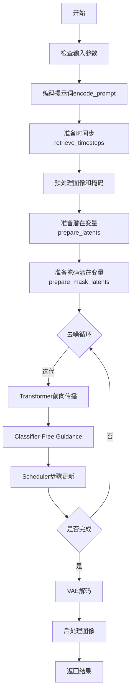

## 类结构

```
DiffusionPipeline (基类)
├── SD3LoraLoaderMixin
├── FromSingleFileMixin
├── SD3IPAdapterMixin
└── StableDiffusion3InpaintPipeline
```

## 全局变量及字段


### `logger`
    
模块级日志记录器，用于输出调试和警告信息

类型：`logging.Logger`
    


### `EXAMPLE_DOC_STRING`
    
包含pipeline使用示例的文档字符串，展示如何进行图像修复生成

类型：`str`
    


### `XLA_AVAILABLE`
    
标志位，指示torch_xla是否可用，用于TPU/XLA设备支持

类型：`bool`
    


### `calculate_shift`
    
计算动态时间步偏移的函数，用于调整去噪调度参数

类型：`function`
    


### `retrieve_latents`
    
从encoder输出中提取潜在表示的辅助函数

类型：`function`
    


### `retrieve_timesteps`
    
从调度器获取时间步序列的辅助函数，支持自定义时间步和sigma

类型：`function`
    


### `StableDiffusion3InpaintPipeline.vae`
    
变分自编码器模型，用于图像与潜在表示之间的编码和解码

类型：`AutoencoderKL`
    


### `StableDiffusion3InpaintPipeline.text_encoder`
    
第一个CLIP文本编码器，将文本提示转换为语义嵌入向量

类型：`CLIPTextModelWithProjection`
    


### `StableDiffusion3InpaintPipeline.text_encoder_2`
    
第二个CLIP文本编码器，提供额外的文本语义表示

类型：`CLIPTextModelWithProjection`
    


### `StableDiffusion3InpaintPipeline.text_encoder_3`
    
T5文本编码器，用于处理更长的文本序列和详细描述

类型：`T5EncoderModel`
    


### `StableDiffusion3InpaintPipeline.tokenizer`
    
第一个分词器，用于将文本转换为token ID序列

类型：`CLIPTokenizer`
    


### `StableDiffusion3InpaintPipeline.tokenizer_2`
    
第二个分词器，配合text_encoder_2使用

类型：`CLIPTokenizer`
    


### `StableDiffusion3InpaintPipeline.tokenizer_3`
    
T5分词器，用于text_encoder_3的文本处理

类型：`T5TokenizerFast`
    


### `StableDiffusion3InpaintPipeline.transformer`
    
核心去噪Transformer模型，执行潜在空间的图像生成

类型：`SD3Transformer2DModel`
    


### `StableDiffusion3InpaintPipeline.scheduler`
    
调度器，控制去噪过程中的时间步和噪声添加策略

类型：`FlowMatchEulerDiscreteScheduler`
    


### `StableDiffusion3InpaintPipeline.image_encoder`
    
可选的视觉编码器，用于IP-Adapter图像特征提取

类型：`SiglipVisionModel | None`
    


### `StableDiffusion3InpaintPipeline.feature_extractor`
    
可选的图像预处理工具，用于IP-Adapter图像处理

类型：`SiglipImageProcessor | None`
    


### `StableDiffusion3InpaintPipeline.vae_scale_factor`
    
VAE的缩放因子，用于计算潜在空间的尺寸

类型：`int`
    


### `StableDiffusion3InpaintPipeline.image_processor`
    
图像预处理器，处理输入图像的尺寸和格式

类型：`VaeImageProcessor`
    


### `StableDiffusion3InpaintPipeline.mask_processor`
    
掩码预处理器，专门处理修复任务的掩码图像

类型：`VaeImageProcessor`
    


### `StableDiffusion3InpaintPipeline.tokenizer_max_length`
    
分词器的最大长度，限制文本输入的token数量

类型：`int`
    


### `StableDiffusion3InpaintPipeline.default_sample_size`
    
默认采样尺寸，用于确定生成图像的默认分辨率

类型：`int`
    


### `StableDiffusion3InpaintPipeline.patch_size`
    
Transformer的patch大小，用于图像分块处理

类型：`int`
    


### `StableDiffusion3InpaintPipeline.model_cpu_offload_seq`
    
模型CPU卸载顺序，定义各组件的卸载优先级

类型：`str`
    


### `StableDiffusion3InpaintPipeline._optional_components`
    
可选组件列表，包含image_encoder和feature_extractor

类型：`list`
    


### `StableDiffusion3InpaintPipeline._callback_tensor_inputs`
    
回调函数可用的张量输入名称列表

类型：`list`
    
    

## 全局函数及方法


### calculate_shift

该函数用于根据图像序列长度计算动态时间步偏移值（mu），通过线性插值在基础序列长度和最大序列长度之间进行映射，实现自适应的噪声调度策略。

参数：

- `image_seq_len`：`int`，图像序列长度，用于计算偏移的输入值
- `base_seq_len`：`int`，默认值为 256，基础序列长度，作为线性方程的基准点
- `max_seq_len`：`int`，默认值为 4096，最大序列长度，作为线性方程的上限
- `base_shift`：`float`，默认值为 0.5，基础偏移值，对应 base_seq_len 时的偏移量
- `max_shift`：`float`，默认值为 1.15，最大偏移值，对应 max_seq_len 时的偏移量

返回值：`float`，计算得到的偏移值 mu，通过线性插值公式计算得出

#### 流程图

```mermaid
flowchart TD
    A[开始] --> B[计算斜率 m = (max_shift - base_shift) / (max_seq_len - base_seq_len)]
    B --> C[计算截距 b = base_shift - m * base_seq_len]
    C --> D[计算 mu = image_seq_len * m + b]
    D --> E[返回 mu]
```

#### 带注释源码

```python
# Copied from diffusers.pipelines.flux.pipeline_flux.calculate_shift
def calculate_shift(
    image_seq_len,
    base_seq_len: int = 256,
    max_seq_len: int = 4096,
    base_shift: float = 0.5,
    max_shift: float = 1.15,
):
    """
    计算图像序列长度的动态偏移值 mu
    
    该函数使用线性插值公式：mu = m * image_seq_len + b
    其中 m 是斜率，b 是截距，用于在基础偏移和最大偏移之间进行平滑过渡
    
    参数:
        image_seq_len: 图像序列长度，即图像在 latent 空间的高度×宽度
        base_seq_len: 基础序列长度，默认256，对应 512x512 分辨率
        max_seq_len: 最大序列长度，默认4096，对应高分辨率图像
        base_shift: 基础偏移值，默认0.5，用于低分辨率
        max_shift: 最大偏移值，默认1.15，用于高分辨率
    
    返回:
        float: 计算得到的偏移值 mu，用于调度器的动态时间步偏移
    """
    # 计算线性方程的斜率 m
    m = (max_shift - base_shift) / (max_seq_len - base_seq_len)
    # 计算线性方程的截距 b
    b = base_shift - m * base_seq_len
    # 根据图像序列长度计算偏移值 mu
    mu = image_seq_len * m + b
    return mu
```


### `retrieve_latents`

该函数用于从编码器输出中提取潜在表示（latents）。它支持三种模式：从潜在分布中采样、从潜在分布中获取最可能值（argmax），或直接返回预计算的潜在张量。这是 Stable Diffusion 系列管道中用于从 VAE 编码器输出中获取潜在向量的通用工具函数。

参数：

- `encoder_output`：`torch.Tensor`，编码器的输出对象，可能包含 `latent_dist` 属性（潜在分布）或 `latents` 属性（预计算的潜在张量）
- `generator`：`torch.Generator | None`，可选的随机生成器，用于采样时的随机性控制
- `sample_mode`：`str`，采样模式，默认为 "sample"（从分布中采样），也可设置为 "argmax"（获取分布的众数）

返回值：`torch.Tensor`，提取出的潜在表示张量

#### 流程图

```mermaid
flowchart TD
    A[开始: retrieve_latents] --> B{encoder_output 是否有 latent_dist 属性?}
    B -->|是| C{sample_mode == 'sample'?}
    C -->|是| D[返回 encoder_output.latent_dist.sample<br/>(generator)]
    C -->|否| E{sample_mode == 'argmax'?}
    E -->|是| F[返回 encoder_output.latent_dist.mode<br/>()]
    E -->|否| G[继续检查]
    B -->|否| H{encoder_output 是否有 latents 属性?}
    H -->|是| I[返回 encoder_output.latents]
    H -->|否| J[抛出 AttributeError]
    D --> K[结束]
    F --> K
    I --> K
    J --> L[错误: Could not access latents<br/>of provided encoder_output]
```

#### 带注释源码

```python
# Copied from diffusers.pipelines.stable_diffusion.pipeline_stable_diffusion_img2img.retrieve_latents
def retrieve_latents(
    encoder_output: torch.Tensor, generator: torch.Generator | None = None, sample_mode: str = "sample"
):
    """
    从编码器输出中提取潜在表示（latents）。
    
    该函数支持三种提取模式：
    1. 从潜在分布中采样（sample_mode='sample'）
    2. 从潜在分布中获取最可能值（sample_mode='argmax'）
    3. 直接返回预计算的潜在张量
    
    Args:
        encoder_output: 编码器输出对象，通常来自 VAE 编码器
                       可能包含 latent_dist（潜在分布）或 latents（预计算张量）
        generator: 可选的随机生成器，用于控制采样随机性
        sample_mode: 采样模式，'sample' 或 'argmax'
    
    Returns:
        torch.Tensor: 提取出的潜在表示
    
    Raises:
        AttributeError: 当无法从 encoder_output 中获取潜在表示时
    """
    # 检查 encoder_output 是否有 latent_dist 属性且采样模式为 sample
    if hasattr(encoder_output, "latent_dist") and sample_mode == "sample":
        # 从潜在分布中采样，支持随机性控制
        return encoder_output.latent_dist.sample(generator)
    # 检查 encoder_output 是否有 latent_dist 属性且采样模式为 argmax
    elif hasattr(encoder_output, "latent_dist") and sample_mode == "argmax":
        # 获取潜在分布的众数（最可能值）
        return encoder_output.latent_dist.mode()
    # 检查 encoder_output 是否有预计算的 latents 属性
    elif hasattr(encoder_output, "latents"):
        # 直接返回预计算的潜在张量
        return encoder_output.latents
    else:
        # 无法获取潜在表示，抛出错误
        raise AttributeError("Could not access latents of provided encoder_output")
```


### `retrieve_timesteps`

该函数是 Stable Diffusion 3 Inpaint Pipeline 中的全局辅助函数，负责调用调度器的 `set_timesteps` 方法并从调度器中检索时间步。它处理自定义时间步和自定义 sigmas，任何额外的 kwargs 都会传递给调度器的 `set_timesteps` 方法。

参数：

-  `scheduler`：`SchedulerMixin`，要获取时间步的调度器
-  `num_inference_steps`：`int | None`，生成样本时使用的扩散步数。如果使用此参数，`timesteps` 必须为 `None`
-  `device`：`str | torch.device | None`，时间步应移动到的设备。如果为 `None`，时间步不会移动
-  `timesteps`：`list[int] | None`，用于覆盖调度器时间步间隔策略的自定义时间步。如果传入 `timesteps`，则 `num_inference_steps` 和 `sigmas` 必须为 `None`
-  `sigmas`：`list[float] | None`，用于覆盖调度器时间步间隔策略的自定义 sigmas。如果传入 `sigmas`，则 `num_inference_steps` 和 `timesteps` 必须为 `None`
-  `**kwargs`：任意额外关键字参数，将传递给 `scheduler.set_timesteps`

返回值：`tuple[torch.Tensor, int]`，元组包含调度器的时间步时间表和推理步数

#### 流程图

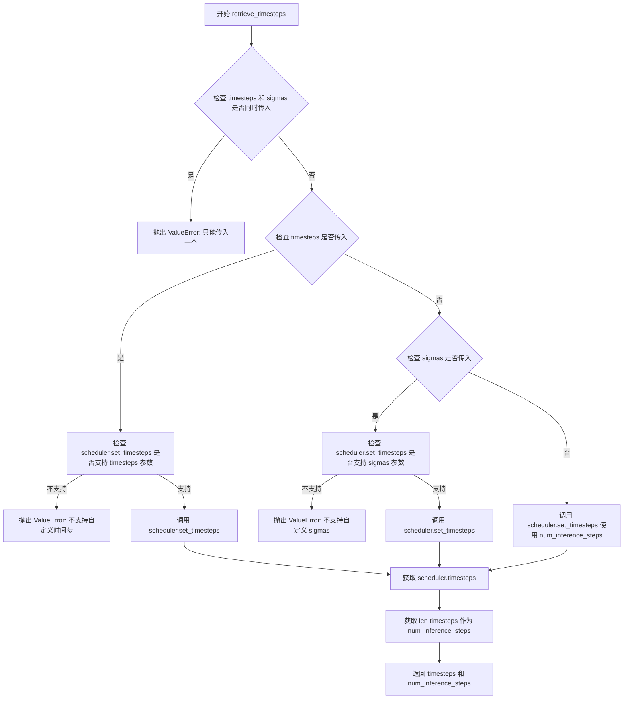

#### 带注释源码

```
# Copied from diffusers.pipelines.stable_diffusion.pipeline_stable_diffusion.retrieve_timesteps
def retrieve_timesteps(
    scheduler,
    num_inference_steps: int | None = None,
    device: str | torch.device | None = None,
    timesteps: list[int] | None = None,
    sigmas: list[float] | None = None,
    **kwargs,
):
    r"""
    Calls the scheduler's `set_timesteps` method and retrieves timesteps from the scheduler after the call. Handles
    custom timesteps. Any kwargs will be supplied to `scheduler.set_timesteps`.

    Args:
        scheduler (`SchedulerMixin`):
            The scheduler to get timesteps from.
        num_inference_steps (`int`):
            The number of diffusion steps used when generating samples with a pre-trained model. If used, `timesteps`
            must be `None`.
        device (`str` or `torch.device`, *optional*):
            The device to which the timesteps should be moved to. If `None`, the timesteps are not moved.
        timesteps (`list[int]`, *optional*):
            Custom timesteps used to override the timestep spacing strategy of the scheduler. If `timesteps` is passed,
            `num_inference_steps` and `sigmas` must be `None`.
        sigmas (`list[float]`, *optional*):
            Custom sigmas used to override the timestep spacing strategy of the scheduler. If `sigmas` is passed,
            `num_inference_steps` and `timesteps` must be `None`.

    Returns:
        `tuple[torch.Tensor, int]`: A tuple where the first element is the timestep schedule from the scheduler and the
        second element is the number of inference steps.
    """
    # 检查是否同时传入了 timesteps 和 sigmas，两者只能选其一
    if timesteps is not None and sigmas is not None:
        raise ValueError("Only one of `timesteps` or `sigmas` can be passed. Please choose one to set custom values")
    
    # 处理自定义 timesteps 的情况
    if timesteps is not None:
        # 检查调度器是否支持 timesteps 参数
        accepts_timesteps = "timesteps" in set(inspect.signature(scheduler.set_timesteps).parameters.keys())
        if not accepts_timesteps:
            raise ValueError(
                f"The current scheduler class {scheduler.__class__}'s `set_timesteps` does not support custom"
                f" timestep schedules. Please check whether you are using the correct scheduler."
            )
        # 调用调度器的 set_timesteps 方法设置自定义时间步
        scheduler.set_timesteps(timesteps=timesteps, device=device, **kwargs)
        # 从调度器获取设置后的时间步
        timesteps = scheduler.timesteps
        # 计算推理步数
        num_inference_steps = len(timesteps)
    # 处理自定义 sigmas 的情况
    elif sigmas is not None:
        # 检查调度器是否支持 sigmas 参数
        accept_sigmas = "sigmas" in set(inspect.signature(scheduler.set_timesteps).parameters.keys())
        if not accept_sigmas:
            raise ValueError(
                f"The current scheduler class {scheduler.__class__}'s `set_timesteps` does not support custom"
                f" sigmas schedules. Please check whether you are using the correct scheduler."
            )
        # 调用调度器的 set_timesteps 方法设置自定义 sigmas
        scheduler.set_timesteps(sigmas=sigmas, device=device, **kwargs)
        # 从调度器获取设置后的时间步
        timesteps = scheduler.timesteps
        # 计算推理步数
        num_inference_steps = len(timesteps)
    # 默认情况：使用 num_inference_steps 设置时间步
    else:
        scheduler.set_timesteps(num_inference_steps, device=device, **kwargs)
        timesteps = scheduler.timesteps
    
    # 返回时间步张量和推理步数
    return timesteps, num_inference_steps
```


### `StableDiffusion3InpaintPipeline.__init__`

初始化 Stable Diffusion 3 图像修复管道，注册所有必要的模型组件（Transformer、VAE、文本编码器等），并配置图像和掩码处理器，为后续的图像修复推理做好准备。

参数：

-  `transformer`：`SD3Transformer2DModel`，条件 Transformer（MMDiT）架构，用于对编码的图像潜在表示进行去噪
-  `scheduler`：`FlowMatchEulerDiscreteScheduler`，与 `transformer` 结合使用以对编码图像潜在表示进行去噪的调度器
-  `vae`：`AutoencoderKL`，变分自编码器模型，用于在潜在表示之间编码和解码图像
-  `text_encoder`：`CLIPTextModelWithProjection`，第一个 CLIP 文本编码器，具有额外的投影层
-  `tokenizer`：`CLIPTokenizer`，第一个文本分词器
-  `text_encoder_2`：`CLIPTextModelWithProjection`，第二个 CLIP 文本编码器
-  `tokenizer_2`：`CLIPTokenizer`，第二个文本分词器
-  `text_encoder_3`：`T5EncoderModel`，T5 文本编码器（用于更长的文本描述）
-  `tokenizer_3`：`T5TokenizerFast`，第三个文本分词器
-  `image_encoder`：`SiglipVisionModel | None`，用于 IP Adapter 的预训练视觉模型（可选）
-  `feature_extractor`：`SiglipImageProcessor | None`，用于 IP Adapter 的图像处理器（可选）

返回值：无（`None`），构造函数用于初始化对象状态

#### 流程图

```mermaid
flowchart TD
    A[开始 __init__] --> B[调用 super().__init__]
    B --> C[register_modules 注册所有模型模块]
    C --> D[计算 vae_scale_factor]
    D --> E[获取 latent_channels]
    E --> F[创建 VaeImageProcessor 用于图像处理]
    F --> G[创建 VaeImageProcessor 用于掩码处理]
    G --> H[设置 tokenizer_max_length]
    H --> I[设置 default_sample_size]
    I --> J[设置 patch_size]
    J --> K[结束 __init__]
```

#### 带注释源码

```python
def __init__(
    self,
    transformer: SD3Transformer2DModel,
    scheduler: FlowMatchEulerDiscreteScheduler,
    vae: AutoencoderKL,
    text_encoder: CLIPTextModelWithProjection,
    tokenizer: CLIPTokenizer,
    text_encoder_2: CLIPTextModelWithProjection,
    tokenizer_2: CLIPTokenizer,
    text_encoder_3: T5EncoderModel,
    tokenizer_3: T5TokenizerFast,
    image_encoder: SiglipVisionModel | None = None,
    feature_extractor: SiglipImageProcessor | None = None,
):
    # 调用父类 DiffusionPipeline 的初始化方法
    # 设置基础管道配置和设备管理
    super().__init__()

    # 注册所有模型模块，使管道能够统一管理这些组件
    # 这些模块可以通过 self.xxx 访问
    self.register_modules(
        vae=vae,
        text_encoder=text_encoder,
        text_encoder_2=text_encoder_2,
        text_encoder_3=text_encoder_3,
        tokenizer=tokenizer,
        tokenizer_2=tokenizer_2,
        tokenizer_3=tokenizer_3,
        transformer=transformer,
        scheduler=scheduler,
        image_encoder=image_encoder,
        feature_extractor=feature_extractor,
    )

    # 计算 VAE 缩放因子，基于 VAE 的块输出通道数
    # 公式: 2^(len(block_out_channels) - 1)
    # 例如: 如果 block_out_channels=[128, 256, 512, 512], 则 scale_factor=8
    self.vae_scale_factor = 2 ** (len(self.vae.config.block_out_channels) - 1) if getattr(self, "vae", None) else 8

    # 获取 VAE 的潜在通道数，用于后续潜在表示处理
    latent_channels = self.vae.config.latent_channels if getattr(self, "vae", None) else 16

    # 创建图像处理器，用于预处理和后处理图像
    # 处理图像的缩放、归一化等操作
    self.image_processor = VaeImageProcessor(
        vae_scale_factor=self.vae_scale_factor, vae_latent_channels=latent_channels
    )

    # 创建掩码专用处理器
    # 配置: 不归一化、二值化、转换为灰度图
    # 用于处理 inpainting 任务的掩码图像
    self.mask_processor = VaeImageProcessor(
        vae_scale_factor=self.vae_scale_factor,
        vae_latent_channels=latent_channels,
        do_normalize=False,          # 掩码不需要归一化
        do_binarize=True,            # 二值化掩码
        do_convert_grayscale=True,  # 转换为单通道灰度图
    )

    # 设置分词器的最大长度
    # 默认值为 77（CLIP 模型的典型最大长度）
    self.tokenizer_max_length = (
        self.tokenizer.model_max_length if hasattr(self, "tokenizer") and self.tokenizer is not None else 77
    )

    # 设置默认采样大小
    # 用于确定生成图像的默认分辨率
    # 默认值 128（将乘以 vae_scale_factor 得到实际像素分辨率）
    self.default_sample_size = (
        self.transformer.config.sample_size
        if hasattr(self, "transformer") and self.transformer is not None
        else 128
    )

    # 设置 Transformer 的 patch 大小
    # 用于将图像分割成 patches 进行处理
    # 默认值 2（SD3 模型的典型 patch 大小）
    self.patch_size = (
        self.transformer.config.patch_size if hasattr(self, "transformer") and self.transformer is not None else 2
    )
```


### `StableDiffusion3InpaintPipeline._get_t5_prompt_embeds`

该方法用于生成 T5 文本编码器的提示嵌入（prompt embeddings），将输入的文本提示转换为模型可处理的向量表示，支持批量处理和每个提示生成多张图像的功能。

参数：

- `self`：`StableDiffusion3InpaintPipeline` 实例本身
- `prompt`：`str | list[str]`，要编码的文本提示，可以是单个字符串或字符串列表
- `num_images_per_prompt`：`int = 1`，每个提示要生成的图像数量，用于复制提示嵌入
- `max_sequence_length`：`int = 256`，T5 编码器的最大序列长度
- `device`：`torch.device | None`，计算设备，默认为执行设备
- `dtype`：`torch.dtype | None`，返回的张量数据类型，默认为文本编码器的数据类型

返回值：`torch.Tensor`，形状为 `(batch_size * num_images_per_prompt, seq_len, joint_attention_dim)` 的提示嵌入张量

#### 流程图

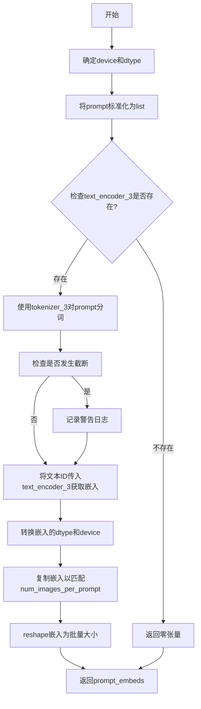

#### 带注释源码

```python
def _get_t5_prompt_embeds(
    self,
    prompt: str | list[str] = None,
    num_images_per_prompt: int = 1,
    max_sequence_length: int = 256,
    device: torch.device | None = None,
    dtype: torch.dtype | None = None,
):
    # 确定设备：如果未指定，则使用执行设备
    device = device or self._execution_device
    # 确定数据类型：如果未指定，则使用文本编码器的数据类型
    dtype = dtype or self.text_encoder.dtype

    # 将单个字符串转换为列表，便于批量处理
    prompt = [prompt] if isinstance(prompt, str) else prompt
    # 计算批次大小
    batch_size = len(prompt)

    # 如果T5文本编码器不存在，返回零张量作为占位符
    # 这发生在使用简化版本的SD3模型时
    if self.text_encoder_3 is None:
        return torch.zeros(
            (
                batch_size * num_images_per_prompt,
                max_sequence_length,
                self.transformer.config.joint_attention_dim,
            ),
            device=device,
            dtype=dtype,
        )

    # 使用T5 tokenizer对prompt进行分词
    # padding="max_length" 将所有序列填充到max_sequence_length
    # truncation=True 截断超过max_sequence_length的序列
    # add_special_tokens=True 添加特殊的token如<s>、</s>等
    text_inputs = self.tokenizer_3(
        prompt,
        padding="max_length",
        max_length=max_sequence_length,
        truncation=True,
        add_special_tokens=True,
        return_tensors="pt",
    )
    # 获取分词后的input_ids
    text_input_ids = text_inputs.input_ids
    
    # 同时使用最长padding获取未截断的版本，用于检测截断
    untruncated_ids = self.tokenizer_3(prompt, padding="longest", return_tensors="pt").input_ids

    # 检测是否发生了截断
    # 比较未截断和已截断的序列长度，如果不同则说明有内容被截断
    if untruncated_ids.shape[-1] >= text_input_ids.shape[-1] and not torch.equal(text_input_ids, untruncated_ids):
        # 解码被截断的部分以便记录警告信息
        removed_text = self.tokenizer_3.batch_decode(untruncated_ids[:, self.tokenizer_max_length - 1 : -1])
        # 记录警告日志告知用户哪些内容被截断
        logger.warning(
            "The following part of your input was truncated because `max_sequence_length` is set to "
            f" {max_sequence_length} tokens: {removed_text}"
        )

    # 将文本input_ids传入T5文本编码器获取嵌入
    # 返回的形状为 (batch_size, seq_len, hidden_size)
    prompt_embeds = self.text_encoder_3(text_input_ids.to(device))[0]

    # 获取T5文本编码器的输出dtype
    dtype = self.text_encoder_3.dtype
    # 将嵌入转换到指定的dtype和device
    prompt_embeds = prompt_embeds.to(dtype=dtype, device=device)

    # 获取嵌入的序列长度
    _, seq_len, _ = prompt_embeds.shape

    # 复制文本嵌入以匹配每个提示生成的图像数量
    # 使用mps友好的方法 (repeat + view)
    # 先在seq_len维度复制num_images_per_prompt次
    prompt_embeds = prompt_embeds.repeat(1, num_images_per_prompt, 1)
    # 重塑为 (batch_size * num_images_per_prompt, seq_len, hidden_size)
    prompt_embeds = prompt_embeds.view(batch_size * num_images_per_prompt, seq_len, -1)

    # 返回处理后的prompt embeddings
    return prompt_embeds
```


### `StableDiffusion3InpaintPipeline._get_clip_prompt_embeds`

该方法用于将文本提示（prompt）通过CLIP文本编码器编码为文本嵌入向量（prompt embeds）和池化嵌入（pooled prompt embeds），支持多图生成和CLIP层跳过功能。

参数：

- `prompt`：`str | list[str]`，要编码的文本提示，可以是单个字符串或字符串列表
- `num_images_per_prompt`：`int = 1`，每个提示生成的图像数量，用于复制嵌入向量
- `device`：`torch.device | None = None`，执行设备，默认为当前执行设备
- `clip_skip`：`int | None = None`，可选的CLIP层跳过数量，用于选择不同的隐藏状态层
- `clip_model_index`：`int = 0`，CLIP模型索引，用于选择使用第一个还是第二个CLIP文本编码器（0对应text_encoder+tokenizer，1对应text_encoder_2+tokenizer_2）

返回值：`tuple[torch.Tensor, torch.Tensor]`，返回一个元组，包含：
- `prompt_embeds`：形状为`(batch_size * num_images_per_prompt, seq_len, hidden_dim)`的文本嵌入张量
- `pooled_prompt_embeds`：形状为`(batch_size * num_images_per_prompt, hidden_dim)`的池化文本嵌入张量

#### 流程图

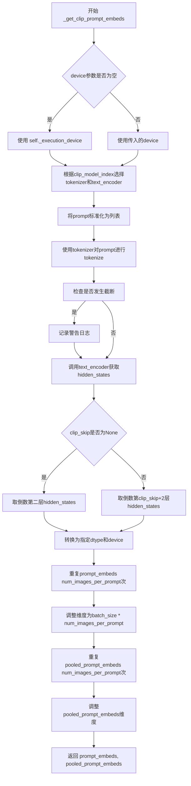

#### 带注释源码

```python
def _get_clip_prompt_embeds(
    self,
    prompt: str | list[str],
    num_images_per_prompt: int = 1,
    device: torch.device | None = None,
    clip_skip: int | None = None,
    clip_model_index: int = 0,
):
    """将文本提示编码为CLIP文本嵌入向量
    
    参数:
        prompt: 输入的文本提示，可以是字符串或字符串列表
        num_images_per_prompt: 每个提示生成的图像数量，用于复制embeddings
        device: 运行设备，默认为当前执行设备
        clip_skip: 跳过的CLIP层数，用于选择不同的特征层
        clip_model_index: CLIP模型索引，0表示第一个CLIP模型，1表示第二个
    
    返回:
        tuple: (prompt_embeds, pooled_prompt_embeds)
    """
    # 确定执行设备，优先使用传入的device，否则使用pipeline的默认执行设备
    device = device or self._execution_device

    # 获取CLIP tokenizers和text encoders列表
    clip_tokenizers = [self.tokenizer, self.tokenizer_2]
    clip_text_encoders = [self.text_encoder, self.text_encoder_2]

    # 根据索引选择对应的tokenizer和text_encoder
    tokenizer = clip_tokenizers[clip_model_index]
    text_encoder = clip_text_encoders[clip_model_index]

    # 将prompt标准化为列表，方便批量处理
    prompt = [prompt] if isinstance(prompt, str) else prompt
    batch_size = len(prompt)

    # 使用tokenizer将文本转换为token ids，padding到最大长度
    text_inputs = tokenizer(
        prompt,
        padding="max_length",
        max_length=self.tokenizer_max_length,
        truncation=True,
        return_tensors="pt",
    )

    text_input_ids = text_inputs.input_ids
    # 获取未截断的token ids用于检测是否发生了截断
    untruncated_ids = tokenizer(prompt, padding="longest", return_tensors="pt").input_ids
    
    # 检查是否发生了截断，如果是则记录警告
    if untruncated_ids.shape[-1] >= text_input_ids.shape[-1] and not torch.equal(text_input_ids, untruncated_ids):
        removed_text = tokenizer.batch_decode(untruncated_ids[:, self.tokenizer_max_length - 1 : -1])
        logger.warning(
            "The following part of your input was truncated because CLIP can only handle sequences up to"
            f" {self.tokenizer_max_length} tokens: {removed_text}"
        )
    
    # 调用text_encoder获取hidden_states，output_hidden_states=True返回所有隐藏状态
    prompt_embeds = text_encoder(text_input_ids.to(device), output_hidden_states=True)
    # pooled_prompt_embeds是最后一层的[CLS]token或平均池化后的表示
    pooled_prompt_embeds = prompt_embeds[0]

    # 根据clip_skip参数选择要使用的隐藏状态层
    if clip_skip is None:
        # 默认使用倒数第二层（最后一层之前的一层）
        prompt_embeds = prompt_embeds.hidden_states[-2]
    else:
        # 根据clip_skip选择对应层次的隐藏状态
        prompt_embeds = prompt_embeds.hidden_states[-(clip_skip + 2)]

    # 将embeddings转换为正确的dtype和device
    prompt_embeds = prompt_embeds.to(dtype=self.text_encoder.dtype, device=device)

    # 获取序列长度
    _, seq_len, _ = prompt_embeds.shape
    
    # 复制text embeddings以匹配每个prompt生成的图像数量
    # 使用MPS友好的方法（repeat然后view）
    prompt_embeds = prompt_embeds.repeat(1, num_images_per_prompt, 1)
    prompt_embeds = prompt_embeds.view(batch_size * num_images_per_prompt, seq_len, -1)

    # 对pooled embeddings进行相同的复制操作
    pooled_prompt_embeds = pooled_prompt_embeds.repeat(1, num_images_per_prompt)
    pooled_prompt_embeds = pooled_prompt_embeds.view(batch_size * num_images_per_prompt, -1)

    # 返回处理后的embeddings元组
    return prompt_embeds, pooled_prompt_embeds
```


### StableDiffusion3InpaintPipeline.encode_prompt

该函数用于将文本提示（prompt）编码为向量表示（embeddings），支持多文本编码器（CLIP和T5）的联合编码，并处理分类器自由引导（CFG）所需的负向提示 embeddings。

参数：

- `prompt`：`str | list[str]`，要编码的主提示文本
- `prompt_2`：`str | list[str]`，要发送给第二个 CLIP 编码器的提示，若未定义则使用 `prompt`
- `prompt_3`：`str | list[str]`，要发送给 T5 编码器的提示，若未定义则使用 `prompt`
- `device`：`torch.device | None`，计算设备，默认为执行设备
- `num_images_per_prompt`：`int`，每个提示生成的图像数量，默认为 1
- `do_classifier_free_guidance`：`bool`，是否启用分类器自由引导，默认为 True
- `negative_prompt`：`str | list[str] | None`，负向提示，用于引导图像生成方向
- `negative_prompt_2`：`str | list[str] | None`，第二个编码器的负向提示
- `negative_prompt_3`：`str | list[str] | None`，T5 编码器的负向提示
- `prompt_embeds`：`torch.FloatTensor | None`，预生成的文本 embeddings，若提供则直接使用
- `negative_prompt_embeds`：`torch.FloatTensor | None`，预生成的负向文本 embeddings
- `pooled_prompt_embeds`：`torch.FloatTensor | None`，预生成的池化文本 embeddings
- `negative_pooled_prompt_embeds`：`torch.FloatTensor | None`，预生成的负向池化 embeddings
- `clip_skip`：`int | None`，CLIP 编码时跳过的层数
- `max_sequence_length`：`int`，最大序列长度，默认为 256
- `lora_scale`：`float | None`，LoRA 层的缩放因子

返回值：`tuple[torch.FloatTensor, torch.FloatTensor, torch.FloatTensor, torch.FloatTensor]`，返回四个张量：正向 prompt embeddings、负向 prompt embeddings、池化正向 embeddings、池化负向 embeddings

#### 流程图

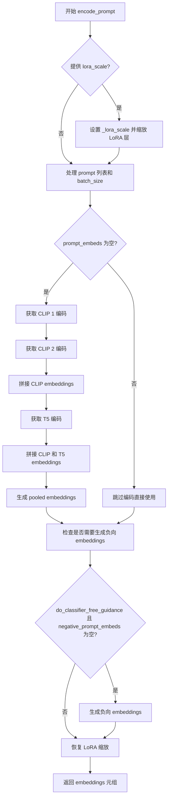

#### 带注释源码

```python
def encode_prompt(
    self,
    prompt: str | list[str],
    prompt_2: str | list[str],
    prompt_3: str | list[str],
    device: torch.device | None = None,
    num_images_per_prompt: int = 1,
    do_classifier_free_guidance: bool = True,
    negative_prompt: str | list[str] | None = None,
    negative_prompt_2: str | list[str] | None = None,
    negative_prompt_3: str | list[str] | None = None,
    prompt_embeds: torch.FloatTensor | None = None,
    negative_prompt_embeds: torch.FloatTensor | None = None,
    pooled_prompt_embeds: torch.FloatTensor | None = None,
    negative_pooled_prompt_embeds: torch.FloatTensor | None = None,
    clip_skip: int | None = None,
    max_sequence_length: int = 256,
    lora_scale: float | None = None,
):
    r"""
    Encodes the prompt into text embeddings for the Stable Diffusion 3 pipeline.
    
    This method handles encoding of text prompts using multiple text encoders
    (CLIP and T5) and supports classifier-free guidance with negative prompts.
    """
    # 获取设备，若未指定则使用执行设备
    device = device or self._execution_device

    # 设置 LoRA 缩放因子，以便文本编码器的 LoRA 函数可以正确访问
    if lora_scale is not None and isinstance(self, SD3LoraLoaderMixin):
        self._lora_scale = lora_scale

        # 动态调整 LoRA 缩放
        if self.text_encoder is not None and USE_PEFT_BACKEND:
            scale_lora_layers(self.text_encoder, lora_scale)
        if self.text_encoder_2 is not None and USE_PEFT_BACKEND:
            scale_lora_layers(self.text_encoder_2, lora_scale)

    # 将 prompt 转换为列表（若为字符串）
    prompt = [prompt] if isinstance(prompt, str) else prompt
    # 确定批次大小
    if prompt is not None:
        batch_size = len(prompt)
    else:
        batch_size = prompt_embeds.shape[0]

    # 如果未提供预计算的 embeddings，则需要从 prompt 生成
    if prompt_embeds is None:
        # 设置 prompt_2 和 prompt_3 的默认值
        prompt_2 = prompt_2 or prompt
        prompt_2 = [prompt_2] if isinstance(prompt_2, str) else prompt_2

        prompt_3 = prompt_3 or prompt
        prompt_3 = [prompt_3] if isinstance(prompt_3, str) else prompt_3

        # 使用第一个 CLIP 编码器编码 prompt
        prompt_embed, pooled_prompt_embed = self._get_clip_prompt_embeds(
            prompt=prompt,
            device=device,
            num_images_per_prompt=num_images_per_prompt,
            clip_skip=clip_skip,
            clip_model_index=0,
        )
        
        # 使用第二个 CLIP 编码器编码 prompt_2
        prompt_2_embed, pooled_prompt_2_embed = self._get_clip_prompt_embeds(
            prompt=prompt_2,
            device=device,
            num_images_per_prompt=num_images_per_prompt,
            clip_skip=clip_skip,
            clip_model_index=1,
        )
        
        # 拼接两个 CLIP 模型的 embeddings
        clip_prompt_embeds = torch.cat([prompt_embed, prompt_2_embed], dim=-1)

        # 使用 T5 编码器编码 prompt_3
        t5_prompt_embed = self._get_t5_prompt_embeds(
            prompt=prompt_3,
            num_images_per_prompt=num_images_per_prompt,
            max_sequence_length=max_sequence_length,
            device=device,
        )

        # 对 CLIP embeddings 进行 padding 以匹配 T5 embeddings 的维度
        clip_prompt_embeds = torch.nn.functional.pad(
            clip_prompt_embeds, (0, t5_prompt_embed.shape[-1] - clip_prompt_embeds.shape[-1])
        )

        # 拼接 CLIP 和 T5 embeddings
        prompt_embeds = torch.cat([clip_prompt_embeds, t5_prompt_embed], dim=-2)
        
        # 拼接池化的 embeddings
        pooled_prompt_embeds = torch.cat([pooled_prompt_embed, pooled_prompt_2_embed], dim=-1)

    # 处理分类器自由引导的负向 embeddings
    if do_classifier_free_guidance and negative_prompt_embeds is None:
        # 设置默认负向 prompt
        negative_prompt = negative_prompt or ""
        negative_prompt_2 = negative_prompt_2 or negative_prompt
        negative_prompt_3 = negative_prompt_3 or negative_prompt

        # 将字符串负向 prompt 转换为列表并扩展到批次大小
        negative_prompt = batch_size * [negative_prompt] if isinstance(negative_prompt, str) else negative_prompt
        negative_prompt_2 = (
            batch_size * [negative_prompt_2] if isinstance(negative_prompt_2, str) else negative_prompt_2
        )
        negative_prompt_3 = (
            batch_size * [negative_prompt_3] if isinstance(negative_prompt_3, str) else negative_prompt_3
        )

        # 类型检查
        if prompt is not None and type(prompt) is not type(negative_prompt):
            raise TypeError(
                f"`negative_prompt` should be the same type to `prompt`, but got {type(negative_prompt)} !="
                f" {type(prompt)}."
            )
        # 批次大小检查
        elif batch_size != len(negative_prompt):
            raise ValueError(
                f"`negative_prompt`: {negative_prompt} has batch size {len(negative_prompt)}, but `prompt`:"
                f" {prompt} has batch size {batch_size}. Please make sure that passed `negative_prompt` matches"
                " the batch size of `prompt`."
            )

        # 生成负向 CLIP embeddings
        negative_prompt_embed, negative_pooled_prompt_embed = self._get_clip_prompt_embeds(
            negative_prompt,
            device=device,
            num_images_per_prompt=num_images_per_prompt,
            clip_skip=None,
            clip_model_index=0,
        )
        negative_prompt_2_embed, negative_pooled_prompt_2_embed = self._get_clip_prompt_embeds(
            negative_prompt_2,
            device=device,
            num_images_per_prompt=num_images_per_prompt,
            clip_skip=None,
            clip_model_index=1,
        )
        negative_clip_prompt_embeds = torch.cat([negative_prompt_embed, negative_prompt_2_embed], dim=-1)

        # 生成负向 T5 embeddings
        t5_negative_prompt_embed = self._get_t5_prompt_embeds(
            prompt=negative_prompt_3,
            num_images_per_prompt=num_images_per_prompt,
            max_sequence_length=max_sequence_length,
            device=device,
        )

        # Padding 和拼接负向 embeddings
        negative_clip_prompt_embeds = torch.nn.functional.pad(
            negative_clip_prompt_embeds,
            (0, t5_negative_prompt_embed.shape[-1] - negative_clip_prompt_embeds.shape[-1]),
        )

        negative_prompt_embeds = torch.cat([negative_clip_prompt_embeds, t5_negative_prompt_embed], dim=-2)
        negative_pooled_prompt_embeds = torch.cat(
            [negative_pooled_prompt_embed, negative_pooled_prompt_2_embed], dim=-1
        )

    # 恢复 LoRA 层的原始缩放
    if self.text_encoder is not None:
        if isinstance(self, SD3LoraLoaderMixin) and USE_PEFT_BACKEND:
            unscale_lora_layers(self.text_encoder, lora_scale)

    if self.text_encoder_2 is not None:
        if isinstance(self, SD3LoraLoaderMixin) and USE_PEFT_BACKEND:
            unscale_lora_layers(self.text_encoder_2, lora_scale)

    # 返回 embeddings 元组
    return prompt_embeds, negative_prompt_embeds, pooled_prompt_embeds, negative_pooled_prompt_embeds
```


### `StableDiffusion3InpaintPipeline.check_inputs`

该方法用于验证 Stable Diffusion 3 图像修复管道的输入参数，确保高度、宽度、强度、提示词和嵌入向量的合法性。

参数：

- `prompt`：`str | list[str] | None`，主提示词，用于指导图像生成
- `prompt_2`：`str | list[str] | None`，第二个文本编码器的提示词
- `prompt_3`：`str | list[str] | None`，第三个文本编码器（T5）的提示词
- `height`：`int`，生成图像的高度（像素）
- `width`：`int`，生成图像的宽度（像素）
- `strength`：`float`，图像变换强度，范围 [0.0, 1.0]
- `negative_prompt`：`str | list[str] | None`，负向提示词
- `negative_prompt_2`：`str | list[str] | None`，第二个负向提示词
- `negative_prompt_3`：`str | list[str] | None`，第三个负向提示词
- `prompt_embeds`：`torch.FloatTensor | None`，预生成的文本嵌入
- `negative_prompt_embeds`：`torch.FloatTensor | None`，预生成的负向文本嵌入
- `pooled_prompt_embeds`：`torch.FloatTensor | None`，预生成的池化文本嵌入
- `negative_pooled_prompt_embeds`：`torch.FloatTensor | None`，预生成的负向池化文本嵌入
- `callback_on_step_end_tensor_inputs`：`list | None`，步骤结束回调的tensor输入列表
- `max_sequence_length`：`int | None`，最大序列长度

返回值：`None`，若验证失败则抛出 `ValueError`

#### 流程图

```mermaid
flowchart TD
    A[开始 check_inputs] --> B{height/width 是否可被 vae_scale_factor * patch_size 整除}
    B -->|否| B1[抛出 ValueError: 高度/宽度必须能被整除]
    B -->|是| C{strength 在 [0, 1] 范围内}
    C -->|否| C1[抛出 ValueError: strength 必须在 [0.0, 1.0]]
    C -->|是| D{callback_on_step_end_tensor_inputs 合法}
    D -->|否| D1[抛出 ValueError: 非法的 tensor inputs]
    D -->|是| E{prompt 和 prompt_embeds 不能同时提供}
    E -->|是| E1[抛出 ValueError: 不能同时提供]
    E -->|否| F{prompt_2/3 与 prompt_embeds 检查}
    F -->|冲突| F1[抛出 ValueError]
    F -->|无冲突| G{prompt/prompt_2/prompt_3 类型检查]
    G -->|类型错误| G1[抛出 ValueError]
    G -->|类型正确| H{negative_prompt 和 negative_prompt_embeds 检查]
    H -->|冲突| H1[抛出 ValueError]
    H -->|无冲突| I{prompt_embeds 和 negative_prompt_embeds 形状一致性}
    I -->|形状不一致| I1[抛出 ValueError]
    I -->|形状一致| J{prompt_embeds 必须提供 pooled_prompt_embeds}
    J -->|缺失| J1[抛出 ValueError]
    J -->|存在| K{negative_prompt_embeds 必须提供 negative_pooled_prompt_embeds}
    K -->|缺失| K1[抛出 ValueError]
    K -->|存在| L{max_sequence_length <= 512}
    L -->|超出| L1[抛出 ValueError: 不能大于512]
    L -->|合法| M[验证通过，返回 None]
    
    B1 --> M
    C1 --> M
    D1 --> M
    E1 --> M
    F1 --> M
    G1 --> M
    H1 --> M
    I1 --> M
    J1 --> M
    K1 --> M
    L1 --> M
```

#### 带注释源码

```python
# Copied from diffusers.pipelines.stable_diffusion_3.pipeline_stable_diffusion_3_img2img.StableDiffusion3Img2ImgPipeline.check_inputs
def check_inputs(
    self,
    prompt,
    prompt_2,
    prompt_3,
    height,
    width,
    strength,
    negative_prompt=None,
    negative_prompt_2=None,
    negative_prompt_3=None,
    prompt_embeds=None,
    negative_prompt_embeds=None,
    pooled_prompt_embeds=None,
    negative_pooled_prompt_embeds=None,
    callback_on_step_end_tensor_inputs=None,
    max_sequence_length=None,
):
    # 验证图像尺寸：高度和宽度必须能被 vae_scale_factor * patch_size 整除
    # 这是因为图像需要经过 VAE 编码和 transformer patch 处理
    if (
        height % (self.vae_scale_factor * self.patch_size) != 0
        or width % (self.vae_scale_factor * self.patch_size) != 0
    ):
        raise ValueError(
            f"`height` and `width` have to be divisible by {self.vae_scale_factor * self.patch_size} but are {height} and {width}."
            f"You can use height {height - height % (self.vae_scale_factor * self.patch_size)} and width {width - width % (self.vae_scale_factor * self.patch_size)}."
        )

    # 验证强度参数：必须在 [0.0, 1.0] 范围内
    # strength 控制图像保真度与噪声的混合比例
    if strength < 0 or strength > 1:
        raise ValueError(f"The value of strength should in [0.0, 1.0] but is {strength}")

    # 验证回调tensor输入：必须在允许的列表中
    if callback_on_step_end_tensor_inputs is not None and not all(
        k in self._callback_tensor_inputs for k in callback_on_step_end_tensor_inputs
    ):
        raise ValueError(
            f"`callback_on_step_end_tensor_inputs` has to be in {self._callback_tensor_inputs}, but found {[k for k in callback_on_step_end_tensor_inputs if k not in self._callback_tensor_inputs]}"
        )

    # 验证提示词和嵌入不能同时提供（只能二选一）
    if prompt is not None and prompt_embeds is not None:
        raise ValueError(
            f"Cannot forward both `prompt`: {prompt} and `prompt_embeds`: {prompt_embeds}. Please make sure to"
            " only forward one of the two."
        )
    elif prompt_2 is not None and prompt_embeds is not None:
        raise ValueError(
            f"Cannot forward both `prompt_2`: {prompt_2} and `prompt_embeds`: {prompt_embeds}. Please make sure to"
            " only forward one of the two."
        )
    elif prompt_3 is not None and prompt_embeds is not None:
        raise ValueError(
            f"Cannot forward both `prompt_3`: {prompt_2} and `prompt_embeds`: {prompt_embeds}. Please make sure to"
            " only forward one of the two."
        )
    # 至少需要提供 prompt 或 prompt_embeds 其中之一
    elif prompt is None and prompt_embeds is None:
        raise ValueError(
            "Provide either `prompt` or `prompt_embeds`. Cannot leave both `prompt` and `prompt_embeds` undefined."
        )
    # 验证提示词类型：必须是 str 或 list
    elif prompt is not None and (not isinstance(prompt, str) and not isinstance(prompt, list)):
        raise ValueError(f"`prompt` has to be of type `str` or `list` but is {type(prompt)}")
    elif prompt_2 is not None and (not isinstance(prompt_2, str) and not isinstance(prompt_2, list)):
        raise ValueError(f"`prompt_2` has to be of type `str` or `list` but is {type(prompt_2)}")
    elif prompt_3 is not None and (not isinstance(prompt_3, str) and not isinstance(prompt_3, list)):
        raise ValueError(f"`prompt_3` has to be of type `str` or `list` but is {type(prompt_3)}")

    # 验证负向提示词和负向嵌入不能同时提供
    if negative_prompt is not None and negative_prompt_embeds is not None:
        raise ValueError(
            f"Cannot forward both `negative_prompt`: {negative_prompt} and `negative_prompt_embeds`:"
            f" {negative_prompt_embeds}. Please make sure to only forward one of the two."
        )
    elif negative_prompt_2 is not None and negative_prompt_embeds is not None:
        raise ValueError(
            f"Cannot forward both `negative_prompt_2`: {negative_prompt_2} and `negative_prompt_embeds`:"
            f" {negative_prompt_embeds}. Please make sure to only forward one of the two."
        )
    elif negative_prompt_3 is not None and negative_prompt_embeds is not None:
        raise ValueError(
            f"Cannot forward both `negative_prompt_3`: {negative_prompt_3} and `negative_prompt_embeds`:"
            f" {negative_prompt_embeds}. Please make sure to only forward one of the two."
        )

    # 验证提示词嵌入和负向提示词嵌入形状一致性
    if prompt_embeds is not None and negative_prompt_embeds is not None:
        if prompt_embeds.shape != negative_prompt_embeds.shape:
            raise ValueError(
                "`prompt_embeds` and `negative_prompt_embeds` must have the same shape when passed directly, but"
                f" got: `prompt_embeds` {prompt_embeds.shape} != `negative_prompt_embeds`"
                f" {negative_prompt_embeds.shape}."
            )

    # 如果提供了 prompt_embeds，也必须提供 pooled_prompt_embeds
    if prompt_embeds is not None and pooled_prompt_embeds is None:
        raise ValueError(
            "If `prompt_embeds` are provided, `pooled_prompt_embeds` also have to be passed. Make sure to generate `pooled_prompt_embeds` from the same text encoder that was used to generate `prompt_embeds`."
        )

    # 如果提供了 negative_prompt_embeds，也必须提供 negative_pooled_prompt_embeds
    if negative_prompt_embeds is not None and negative_pooled_prompt_embeds is None:
        raise ValueError(
            "If `negative_prompt_embeds` are provided, `negative_pooled_prompt_embeds` also have to be passed. Make sure to generate `negative_pooled_prompt_embeds` from the same text encoder that was used to generate `negative_prompt_embeds`."
        )

    # 验证最大序列长度不超过 512
    if max_sequence_length is not None and max_sequence_length > 512:
        raise ValueError(f"`max_sequence_length` cannot be greater than 512 but is {max_sequence_length}")
```


### `StableDiffusion3InpaintPipeline.get_timesteps`

该方法用于根据推理步数和图像修复强度（strength）计算和调整时间步（timesteps）。它通过跳过初始的时间步来实现对原始图像的部分重绘，强度越高，跳过的步数越少，保留更多原始图像信息。

参数：

- `num_inference_steps`：`int`，推理步数，即去噪过程的迭代次数
- `strength`：`float`，重绘强度，值在0到1之间，决定保留多少原始图像信息
- `device`：`torch.device`，计算设备，用于张量操作

返回值：元组 `(timesteps, num_inference_steps)`，其中 `timesteps` 是 `torch.Tensor` 类型，为调整后的时间步序列；`num_inference_steps` 是 `int` 类型，为调整后的推理步数。

#### 流程图

```mermaid
flowchart TD
    A[开始 get_timesteps] --> B[计算 init_timestep = min(num_inference_steps × strength, num_inference_steps)]
    B --> C[计算 t_start = max(num_inference_steps - init_timestep, 0)]
    C --> D[从 scheduler.timesteps 中提取子序列: timesteps[t_start × order:]
    D --> E{scheduler 是否有 set_begin_index?}
    E -->|是| F[调用 scheduler.set_begin_index(t_start × order)]
    E -->|否| G[跳过此步骤]
    F --> H
    G --> H
    H --> I[返回 timesteps 和 num_inference_steps - t_start]
    I --> J[结束]
```

#### 带注释源码

```python
def get_timesteps(self, num_inference_steps, strength, device):
    """
    根据推理步数和重绘强度计算调整后的时间步。
    
    参数:
        num_inference_steps: 推理步数
        strength: 重绘强度 (0-1)，值越大保留越多原始图像信息
        device: torch 设备
    
    返回:
        timesteps: 调整后的时间步张量
        num_inference_steps: 调整后的推理步数
    """
    # 计算初始时间步数：根据强度和推理步数计算实际使用的步数
    # strength=1.0 时保留全部步数，strength < 1.0 时减少步数
    init_timestep = min(num_inference_steps * strength, num_inference_steps)

    # 计算起始索引：跳过前 t_start 个时间步
    # strength=1.0 时 t_start=0，使用全部时间步
    # strength < 1.0 时 t_start > 0，从中间开始去噪
    t_start = int(max(num_inference_steps - init_timestep, 0))
    
    # 从调度器获取时间步序列，根据 order 参数进行切片
    # FlowMatch 调度器使用 order 来处理多个时间步
    timesteps = self.scheduler.timesteps[t_start * self.scheduler.order :]
    
    # 如果调度器支持 set_begin_index，设置起始索引
    # 这用于支持调度器的状态管理，特别是对于 Euler 调度器
    if hasattr(self.scheduler, "set_begin_index"):
        self.scheduler.set_begin_index(t_start * self.scheduler.order)

    # 返回调整后的时间步和实际推理步数
    return timesteps, num_inference_steps - t_start
```


### `StableDiffusion3InpaintPipeline.prepare_latents`

该方法用于为 Stable Diffusion 3 图像修复管道准备潜在向量（latents）。它根据批处理大小、图像尺寸和噪声强度等参数，初始化或处理用于去噪过程的潜在向量，支持纯噪声初始化或图像+噪声混合初始化两种模式。

参数：

- `batch_size`：`int`，批处理大小，确定生成的图像数量
- `num_channels_latents`：`int`，潜在向量的通道数
- `height`：`int`，目标图像高度
- `width`：`int`，目标图像宽度
- `dtype`：`torch.dtype`，潜在向量的数据类型
- `device`：`torch.device`，计算设备
- `generator`：`torch.Generator | list[torch.Generator] | None`，随机数生成器，用于确保可重复性
- `latents`：`torch.Tensor | None`，可选的预生成潜在向量
- `image`：`torch.Tensor | None`，输入图像，用于图像引导的潜在向量初始化
- `timestep`：`torch.Tensor | None`，时间步，用于噪声调度
- `is_strength_max`：`bool`，默认为 True，表示噪声强度最大（纯噪声初始化）
- `return_noise`：`bool`，默认为 False，是否返回生成的噪声
- `return_image_latents`：`bool`，默认为 False，是否返回编码后的图像潜在向量

返回值：`tuple`，返回一个元组，包含 `(latents, noise?, image_latents?)`，其中 latents 是必需的，noise 和 image_latents 根据参数决定是否返回。

#### 流程图

```mermaid
flowchart TD
    A[开始 prepare_latents] --> B[计算 shape: batch_size, num_channels, height/vae_scale, width/vae_scale]
    B --> C{generator 是列表且长度 != batch_size?}
    C -->|是| D[抛出 ValueError]
    C -->|否| E{image 和 timestep 都为空且 not is_strength_max?}
    E -->|是| F[抛出 ValueError: 需要提供 image 和 timestep]
    E -->|否| G{return_image_latents 为 True 或 latents 为空且 not is_strength_max?}
    G -->|是| H[将 image 移动到 device 并转换 dtype]
    H --> I{image.shape[1] == 16?}
    I -->|是| J[image_latents = image]
    I -->|否| K[调用 _encode_vae_image 编码图像]
    J --> L[重复 image_latents 以匹配 batch_size]
    K --> L
    G -->|否| M{latents 为空?}
    M -->|是| N[生成随机噪声 randn_tensor]
    M -->|否| O[将 latents 移动到 device]
    N --> P{is_strength_max?}
    O --> P
    P -->|是| Q[latents = noise]
    P -->|否| R[使用 scheduler.scale_noise 混合 image_latents 和 noise]
    Q --> S[构建输出元组 latents]
    R --> S
    S --> T{return_noise 为 True?}
    T -->|是| U[添加 noise 到输出]
    T -->|否| V{return_image_latents 为 True?}
    U --> V
    V -->|是| W[添加 image_latents 到输出]
    V -->|否| X[返回输出元组]
    W --> X
```

#### 带注释源码

```python
def prepare_latents(
    self,
    batch_size,
    num_channels_latents,
    height,
    width,
    dtype,
    device,
    generator,
    latents=None,
    image=None,
    timestep=None,
    is_strength_max=True,
    return_noise=False,
    return_image_latents=False,
):
    # 计算潜在向量的形状：batch_size x channels x (height/vae_scale_factor) x (width/vae_scale_factor)
    shape = (
        batch_size,
        num_channels_latents,
        int(height) // self.vae_scale_factor,
        int(width) // self.vae_scale_factor,
    )
    
    # 验证：generator 列表长度必须与 batch_size 匹配
    if isinstance(generator, list) and len(generator) != batch_size:
        raise ValueError(
            f"You have passed a list of generators of length {len(generator)}, but requested an effective batch"
            f" size of {batch_size}. Make sure the batch size matches the length of the generators."
        )

    # 验证：当 strength < 1 时，必须提供 image 和 timestep
    if (image is None or timestep is None) and not is_strength_max:
        raise ValueError(
            "Since strength < 1. initial latents are to be initialised as a combination of Image + Noise."
            "However, either the image or the noise timestep has not been provided."
        )

    # 处理需要返回图像潜在向量的情况，或者当 latents 为空且不是最大强度时
    if return_image_latents or (latents is None and not is_strength_max):
        # 将图像移动到指定设备并转换数据类型
        image = image.to(device=device, dtype=dtype)

        # 如果图像已经是潜在向量格式（通道数为16），直接使用
        # 否则使用 VAE 编码图像
        if image.shape[1] == 16:
            image_latents = image
        else:
            image_latents = self._encode_vae_image(image=image, generator=generator)
        
        # 重复图像潜在向量以匹配批处理大小
        image_latents = image_latents.repeat(batch_size // image_latents.shape[0], 1, 1, 1)

    # 根据是否有预提供的 latents 决定初始化方式
    if latents is None:
        # 生成随机噪声
        noise = randn_tensor(shape, generator=generator, device=device, dtype=dtype)
        # 如果强度最大则纯噪声初始化，否则混合图像和噪声
        latents = noise if is_strength_max else self.scheduler.scale_noise(image_latents, timestep, noise)
    else:
        # 使用提供的 latents，只将其移动到设备
        noise = latents.to(device)
        latents = noise

    # 构建输出元组
    outputs = (latents,)

    # 根据参数决定是否返回噪声
    if return_noise:
        outputs += (noise,)

    # 根据参数决定是否返回图像潜在向量
    if return_image_latents:
        outputs += (image_latents,)

    return outputs
```


### `StableDiffusion3InpaintPipeline._encode_vae_image`

该方法负责将输入图像编码为 VAE 潜在空间表示，支持批量处理和单个生成器或多个生成器的场景，并应用 VAE 配置中的缩放因子和偏移量进行标准化处理。

参数：

- `image`：`torch.Tensor`，要编码的图像张量，通常为 [B, C, H, W] 格式
- `generator`：`torch.Generator`，用于生成随机数的 PyTorch 生成器，支持单个生成器或生成器列表

返回值：`torch.Tensor`，编码后的图像潜在表示，形状为 [B, latent_channels, H//vae_scale_factor, W//vae_scale_factor]

#### 流程图

```mermaid
flowchart TD
    A[开始 _encode_vae_image] --> B{generator 是否为列表}
    B -->|是| C[遍历图像批次]
    C --> D[对每张图像调用 vae.encode]
    D --> E[使用对应 generator 提取潜在表示]
    E --> F[收集所有潜在表示]
    F --> G[沿 dim=0 拼接潜在表示]
    B -->|否| H[直接调用 vae.encode 图像]
    H --> I[使用 generator 提取潜在表示]
    G --> J[应用缩放: (latents - shift_factor) * scaling_factor]
    I --> J
    J --> K[返回编码后的潜在表示]
```

#### 带注释源码

```python
def _encode_vae_image(self, image: torch.Tensor, generator: torch.Generator):
    """
    将图像编码为 VAE 潜在空间表示
    
    Args:
        image: 输入图像张量，形状为 [B, C, H, W]
        generator: 随机生成器，用于采样潜在分布
    
    Returns:
        编码后的图像潜在表示
    """
    # 判断 generator 是否为列表（即是否为每个图像单独指定生成器）
    if isinstance(generator, list):
        # 批量处理：逐个编码图像，使用各自的生成器
        image_latents = [
            # 对单张图像进行 VAE 编码
            retrieve_latents(self.vae.encode(image[i : i + 1]), generator=generator[i])
            for i in range(image.shape[0])  # 遍历批次中的每个图像
        ]
        # 将所有图像的潜在表示沿批次维度拼接
        image_latents = torch.cat(image_latents, dim=0)
    else:
        # 单一生成器：直接编码整个图像批次
        image_latents = retrieve_latents(self.vae.encode(image), generator=generator)

    # 应用 VAE 的缩放因子和偏移量进行标准化
    # 这是 VAE 潜在空间的常见预处理步骤，确保潜在表示符合模型预期分布
    image_latents = (image_latents - self.vae.config.shift_factor) * self.vae.config.scaling_factor

    return image_latents
```


### StableDiffusion3InpaintPipeline.prepare_mask_latents

该方法负责将掩码图像和被掩码覆盖的图像准备好并转换为潜在空间表示，以便在图像修复过程中使用。它对掩码进行大小调整、类型转换，处理被掩码的图像通过VAE编码为latents，并根据批量大小和分类器自由引导（CFG）进行复制，最后返回处理后的掩码和被掩码图像的latents。

参数：

- `mask`：`torch.Tensor`，输入的掩码张量，用于指示需要修复的区域
- `masked_image`：`torch.Tensor`，被掩码覆盖的图像，即原始图像中被掩码遮挡后的版本
- `batch_size`：`int`，批量大小
- `num_images_per_prompt`：`int`，每个提示词生成的图像数量
- `height`：`int`，目标图像的高度（像素）
- `width`：`int`，目标图像的宽度（像素）
- `dtype`：`torch.dtype`，目标数据类型
- `device`：`torch.device`，目标设备
- `generator`：`torch.Generator | None`，用于生成随机数的生成器，以确保可重复性
- `do_classifier_free_guidance`：`bool`，是否启用分类器自由引导

返回值：`tuple[torch.Tensor, torch.Tensor]`，返回一个包含两个张量的元组 - 第一个是处理后的掩码，第二个是被掩码图像的latents表示

#### 流程图

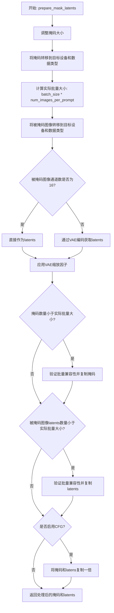

#### 带注释源码

```python
def prepare_mask_latents(
    self,
    mask,  # 输入的掩码张量，用于指示需要修复的区域
    masked_image,  # 被掩码覆盖的图像，即原始图像中被掩码遮挡后的版本
    batch_size,  # 批量大小
    num_images_per_prompt,  # 每个提示词生成的图像数量
    height,  # 目标图像的高度（像素）
    width,  # 目标图像的宽度（像素）
    dtype,  # 目标数据类型
    device,  # 目标设备
    generator,  # 用于生成随机数的生成器，以确保可重复性
    do_classifier_free_guidance,  # 是否启用分类器自由引导
):
    # 调整掩码大小以匹配latents的形状，因为我们需要将掩码与latents连接
    # 在转换为dtype之前执行此操作，以避免在使用cpu_offload和半精度时出现问题
    mask = torch.nn.functional.interpolate(
        mask, size=(height // self.vae_scale_factor, width // self.vae_scale_factor)
    )
    # 将掩码转移到目标设备和指定数据类型
    mask = mask.to(device=device, dtype=dtype)

    # 计算实际批量大小，考虑每个提示词生成的图像数量
    batch_size = batch_size * num_images_per_prompt

    # 将被掩码图像转移到目标设备和指定数据类型
    masked_image = masked_image.to(device=device, dtype=dtype)

    # 检查被掩码图像是否已经是latents格式（通道数为16）
    if masked_image.shape[1] == 16:
        masked_image_latents = masked_image
    else:
        # 使用VAE编码被掩码图像获取latents表示
        masked_image_latents = retrieve_latents(self.vae.encode(masked_image), generator=generator)

    # 应用VAE的缩放因子和偏移量来归一化latents
    # 这是VAE编码的标准后处理步骤
    masked_image_latents = (masked_image_latents - self.vae.config.shift_factor) * self.vae.config.scaling_factor

    # 复制掩码和被掩码图像latents以匹配每个提示词生成的图像数量
    # 使用MPS友好的方法（repeat而非tile）
    if mask.shape[0] < batch_size:
        if not batch_size % mask.shape[0] == 0:
            raise ValueError(
                "The passed mask and the required batch size don't match. Masks are supposed to be duplicated to"
                f" a total batch size of {batch_size}, but {mask.shape[0]} masks were passed. Make sure the number"
                " of masks that you pass is divisible by the total requested batch size."
            )
        mask = mask.repeat(batch_size // mask.shape[0], 1, 1, 1)
    
    if masked_image_latents.shape[0] < batch_size:
        if not batch_size % masked_image_latents.shape[0] == 0:
            raise ValueError(
                "The passed images and the required batch size don't match. Images are supposed to be duplicated"
                f" a total batch size of {batch_size}, but {masked_image_latents.shape[0]} images were passed."
                " Make sure the number of images that you pass is divisible by the total requested batch size."
            )
        masked_image_latents = masked_image_latents.repeat(batch_size // masked_image_latents.shape[0], 1, 1, 1)

    # 如果启用分类器自由引导（CFG），需要复制一次以生成无条件和有条件两个版本
    # CFG在推理时将无引导版本与引导版本组合以提高质量
    mask = torch.cat([mask] * 2) if do_classifier_free_guidance else mask
    masked_image_latents = (
        torch.cat([masked_image_latents] * 2) if do_classifier_free_guidance else masked_image_latents
    )

    # 对齐设备以防止在与潜在模型输入连接时出现设备错误
    masked_image_latents = masked_image_latents.to(device=device, dtype=dtype)
    
    # 返回处理后的掩码和被掩码图像的latents表示
    return mask, masked_image_latents
```


### `StableDiffusion3InpaintPipeline.encode_image`

该方法用于将输入图像编码为特征表示，使用预训练的图像编码器（SiglipVisionModel）提取图像特征。这是IP-Adapter功能的核心组件，用于将图像信息注入到Stable Diffusion 3的生成过程中。

参数：

- `image`：`PipelineImageInput`，输入图像，可以是PIL图像、numpy数组、torch.Tensor或列表形式
- `device`：`torch.device`，PyTorch设备，用于将图像和张量移动到指定设备

返回值：`torch.Tensor`，编码后的图像特征表示，为倒数第二层隐藏状态

#### 流程图

```mermaid
flowchart TD
    A[开始 encode_image] --> B{image是否为torch.Tensor?}
    B -->|否| C[使用feature_extractor提取像素值]
    C --> D[将image转换为tensor]
    B -->|是| E[直接使用image tensor]
    D --> F[将image移动到指定device和dtype]
    E --> F
    F --> G[调用image_encoder编码图像]
    G --> H[获取倒数第二层隐藏状态 hidden_states[-2]]
    I[返回编码后的特征表示]
    H --> I
```

#### 带注释源码

```python
def encode_image(self, image: PipelineImageInput, device: torch.device) -> torch.Tensor:
    """Encodes the given image into a feature representation using a pre-trained image encoder.

    该方法使用预训练的SiglipVisionModel对输入图像进行编码，提取图像特征表示。
    主要用于IP-Adapter功能，将图像信息融入到文本到图像的生成过程中。

    Args:
        image (`PipelineImageInput`):
            输入图像，可以是以下格式之一：
            - PIL.Image.Image
            - torch.Tensor
            - np.ndarray
            - list[PIL.Image.Image] 或 list[torch.Tensor]
        device: (`torch.device`):
            PyTorch设备，用于执行编码操作

    Returns:
        `torch.Tensor`: 编码后的图像特征表示，形状为(batch_size, seq_len, hidden_dim)
    """
    # 如果输入不是torch.Tensor，则使用feature_extractor将其转换为tensor
    # feature_extractor是SiglipImageProcessor，用于预处理图像
    if not isinstance(image, torch.Tensor):
        image = self.feature_extractor(image, return_tensors="pt").pixel_values

    # 将图像数据移动到指定设备，并转换为目标dtype
    # self.dtype通常是模型的精度类型（如float16）
    image = image.to(device=device, dtype=self.dtype)

    # 调用image_encoder进行编码
    # output_hidden_states=True要求返回所有层的隐藏状态
    # hidden_states[-2]获取倒数第二层的输出，这是IP-Adapter常用的特征层
    return self.image_encoder(image, output_hidden_states=True).hidden_states[-2]
```


### `StableDiffusion3InpaintPipeline.prepare_ip_adapter_image_embeds`

该方法用于为 IP-Adapter 准备图像嵌入（image embeddings），支持两种输入方式：直接传入图像或预计算的嵌入向量。如果启用了无分类器自由引导（Classifier-Free Guidance），则还会生成负样本嵌入。最终返回处理后的图像嵌入张量，可直接用于 Transformer 的联合注意力机制。

参数：

- `ip_adapter_image`：`PipelineImageInput | None`，可选输入图像，用于为 IP-Adapter 提取特征
- `ip_adapter_image_embeds`：`torch.Tensor | None`，预计算的图像嵌入向量
- `device`：`torch.device | None`，Torch 设备，默认为执行设备
- `num_images_per_prompt`：`int`，每个提示词生成的图像数量，默认为 1
- `do_classifier_free_guidance`：`bool`，是否使用无分类器自由引导，默认为 True

返回值：`torch.Tensor`，处理后的图像嵌入张量，可直接用于 `joint_attention_kwargs`

#### 流程图

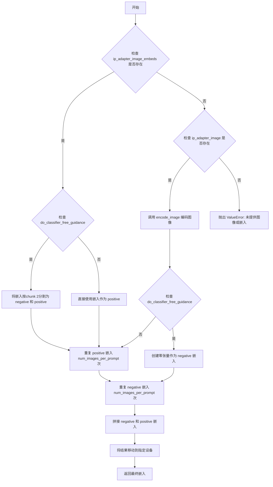

#### 带注释源码

```python
def prepare_ip_adapter_image_embeds(
    self,
    ip_adapter_image: PipelineImageInput | None = None,
    ip_adapter_image_embeds: torch.Tensor | None = None,
    device: torch.device | None = None,
    num_images_per_prompt: int = 1,
    do_classifier_free_guidance: bool = True,
) -> torch.Tensor:
    """Prepares image embeddings for use in the IP-Adapter.

    Either `ip_adapter_image` or `ip_adapter_image_embeds` must be passed.

    Args:
        ip_adapter_image (`PipelineImageInput`, *optional*):
            The input image to extract features from for IP-Adapter.
        ip_adapter_image_embeds (`torch.Tensor`, *optional*):
            Precomputed image embeddings.
        device: (`torch.device`, *optional*):
            Torch device.
        num_images_per_prompt (`int`, defaults to 1):
            Number of images that should be generated per prompt.
        do_classifier_free_guidance (`bool`, defaults to True):
            Whether to use classifier free guidance or not.
    """
    # 获取设备，优先使用传入的设备，否则使用管道的执行设备
    device = device or self._execution_device

    # 情况1：已提供预计算的嵌入
    if ip_adapter_image_embeds is not None:
        # 如果启用 CFG，需要将嵌入分割为 negative 和 positive 两部分
        if do_classifier_free_guidance:
            single_negative_image_embeds, single_image_embeds = ip_adapter_image_embeds.chunk(2)
        else:
            single_image_embeds = ip_adapter_image_embeds
    # 情况2：提供了原始图像，需要编码
    elif ip_adapter_image is not None:
        # 使用图像编码器提取特征
        single_image_embeds = self.encode_image(ip_adapter_image, device)
        # 如果启用 CFG，创建一个与 positive 形状相同的零张量作为 negative 嵌入
        if do_classifier_free_guidance:
            single_negative_image_embeds = torch.zeros_like(single_image_embeds)
    # 情况3：既没有图像也没有嵌入，抛出错误
    else:
        raise ValueError("Neither `ip_adapter_image_embeds` or `ip_adapter_image_embeds` were provided.")

    # 将单个嵌入重复 num_images_per_prompt 次以匹配批量大小
    image_embeds = torch.cat([single_image_embeds] * num_images_per_prompt, dim=0)

    # 如果启用 CFG，需要拼接 negative 和 positive 嵌入（negative 在前，positive 在后）
    if do_classifier_free_guidance:
        negative_image_embeds = torch.cat([single_negative_image_embeds] * num_images_per_prompt, dim=0)
        image_embeds = torch.cat([negative_image_embeds, image_embeds], dim=0)

    # 将最终嵌入移动到指定设备并返回
    return image_embeds.to(device=device)
```


### StableDiffusion3InpaintPipeline.enable_sequential_cpu_offload

该方法用于启用pipeline的顺序CPU卸载功能，允许将模型的各个组件按顺序卸载到CPU以节省显存。在调用父类方法之前，它会检查`image_encoder`是否存在，如果存在且使用`torch.nn.MultiheadAttention`则发出警告信息。

参数：

- `*args`：可变位置参数，传递给父类的`enable_sequential_cpu_offload`方法，用于指定要卸载的设备顺序等
- `**kwargs`：可变关键字参数，传递给父类的`enable_sequential_cpu_offload`方法，包含可选的配置参数如`device`等

返回值：`None`，该方法直接调用父类方法，不返回任何值

#### 流程图

```mermaid
flowchart TD
    A[开始 enable_sequential_cpu_offload] --> B{检查 image_encoder 是否存在}
    B -->|存在| C{检查 image_encoder 是否在排除列表中}
    B -->|不存在| D[直接调用父类方法]
    C -->|不在排除列表| E[记录警告信息]
    C -->|在排除列表| D
    E --> D
    D --> F[调用 super().enable_sequential_cpu_offload]
    F --> G[结束]
```

#### 带注释源码

```python
def enable_sequential_cpu_offload(self, *args, **kwargs):
    """
    启用pipeline的顺序CPU卸载功能。
    
    该方法重写了父类的方法，在调用父类之前检查image_encoder组件，
    如果它存在且可能使用torch.nn.MultiheadAttention，则发出警告。
    
    Args:
        *args: 可变位置参数，传递给父类方法
        **kwargs: 可变关键字参数，传递给父类方法
    """
    # 检查image_encoder是否存在且未被排除在CPU卸载之外
    if self.image_encoder is not None and "image_encoder" not in self._exclude_from_cpu_offload:
        # 发出警告：image_encoder可能因为使用MultiheadAttention而导致顺序CPU卸载失败
        logger.warning(
            "`pipe.enable_sequential_cpu_offload()` might fail for `image_encoder` if it uses "
            "`torch.nn.MultiheadAttention`. You can exclude `image_encoder` from CPU offloading by calling "
            "`pipe._exclude_from_cpu_offload.append('image_encoder')` before `pipe.enable_sequential_cpu_offload()`."
        )

    # 调用父类的enable_sequential_cpu_offload方法执行实际的卸载逻辑
    super().enable_sequential_cpu_offload(*args, **kwargs)
```


### `StableDiffusion3InpaintPipeline.__call__`

这是Stable Diffusion 3图像修复（Inpainting）管道的主调用方法，接收文本提示、原始图像和掩码图像，通过去噪过程在掩码区域生成新内容，最终返回修复后的图像或潜在向量。

参数：

- `prompt`：`str | list[str] | None`，用于引导图像生成的主要文本提示，若未定义则需提供`prompt_embeds`
- `prompt_2`：`str | list[str] | None`，发送给`tokenizer_2`和`text_encoder_2`的提示词，未定义时使用`prompt`
- `prompt_3`：`str | list[str] | None`，发送给`tokenizer_3`和`text_encoder_3`（T5）的提示词，未定义时使用`prompt`
- `image`：`PipelineImageInput`，作为起点的输入图像批次，支持张量、PIL图像或numpy数组，值域为`[0, 1]`
- `mask_image`：`PipelineImageInput`，用于掩码的图像，白色像素被重绘，黑色像素保留
- `masked_image_latents`：`PipelineImageInput | None`，由VAE生成的掩码图像潜在表示，若不提供则从`mask_image`生成
- `height`：`int | None`，生成图像的高度（像素），默认`self.transformer.config.sample_size * self.vae_scale_factor`
- `width`：`int | None`，生成图像的宽度（像素），默认`self.transformer.config.sample_size * self.vae_scale_factor`
- `padding_mask_crop`：`int | None`，掩码周围裁剪的边距大小，用于小掩码大图像场景
- `strength`：`float`，图像变换程度（0-1），值越高添加噪声越多，默认0.6
- `num_inference_steps`：`int`，去噪步数，默认50
- `sigmas`：`list[float] | None`，自定义sigma值列表，用于支持该参数的调度器
- `guidance_scale`：`float`，无分类器引导比例，默认7.0，值为1时禁用引导
- `negative_prompt`：`str | list[str] | None`，不引导图像生成的负面提示词
- `negative_prompt_2`：`str | list[str] | None`，发送给第二文本编码器的负面提示词
- `negative_prompt_3`：`str | list[str] | None`，发送给T5文本编码器的负面提示词
- `num_images_per_prompt`：`int`，每个提示词生成的图像数量，默认1
- `generator`：`torch.Generator | list[torch.Generator] | None`，随机数生成器，用于确保可重复生成
- `latents`：`torch.Tensor | None`，预生成的噪声潜在向量，可用于调整相同生成的不同提示词
- `prompt_embeds`：`torch.Tensor | None`，预生成的文本嵌入，可用于提示词加权
- `negative_prompt_embeds`：`torch.Tensor | None`，预生成的负面文本嵌入
- `pooled_prompt_embeds`：`torch.Tensor | None`，预生成的池化文本嵌入
- `negative_pooled_prompt_embeds`：`torch.Tensor | None`，预生成的负面池化文本嵌入
- `ip_adapter_image`：`PipelineImageInput | None`，IP适配器可选图像输入
- `ip_adapter_image_embeds`：`torch.Tensor | None`，IP适配器预生成图像嵌入，形状`(batch_size, num_images, emb_dim)`
- `output_type`：`str | None`，输出格式选择`"pil"`、`"latent"`或`np.array`，默认`"pil"`
- `return_dict`：`bool`，是否返回`StableDiffusion3PipelineOutput`对象，默认True
- `joint_attention_kwargs`：`dict[str, Any] | None`，传递给`AttentionProcessor`的参数字典
- `clip_skip`：`int | None`，CLIP计算嵌入时跳过的层数
- `callback_on_step_end`：`Callable[[int, int], None] | None`，每个去噪步骤结束时的回调函数
- `callback_on_step_end_tensor_inputs`：`list[str]`，回调函数接收的张量输入列表，默认`["latents"]`
- `max_sequence_length`：`int`，提示词最大序列长度，默认256
- `mu`：`float | None`，动态偏移的`mu`值

返回值：`StableDiffusion3PipelineOutput | tuple`，返回修复后的图像列表或元组（若`return_dict`为False）

#### 流程图

```mermaid
flowchart TD
    A[开始 __call__] --> B[检查并规范化输入参数]
    B --> C[设置内部状态变量 _guidance_scale, _clip_skip等]
    C --> D[计算batch_size]
    D --> E[调用 encode_prompt 生成文本嵌入]
    E --> F[拼接负面和正面提示词嵌入]
    F --> G[计算动态偏移mu值并设置调度器时间步]
    G --> H[调用 get_timesteps 计算时间步]
    H --> I[预处理掩码和图像]
    I --> J[准备潜在变量 prepare_latents]
    J --> K[准备掩码潜在变量 prepare_mask_latents]
    K --> L{IP Adapter是否激活?}
    L -->|是| M[准备IP Adapter图像嵌入]
    L -->|否| N[跳过IP Adapter准备]
    M --> N
    N --> O[进入去噪循环]
    O --> P{遍历时间步}
    P -->|当前步| Q[扩展潜在向量用于无分类器引导]
    Q --> R[将掩码和掩码图像潜在向量连接到潜在输入]
    R --> S[调用Transformer进行前向传播]
    S --> T[执行无分类器引导]
    T --> U[调度器计算上一步潜在向量]
    U --> V{是否需要图像潜在向量?}
    V -->|是| W[应用图像潜在向量混合]
    V -->|否| X[跳过混合]
    W --> X
    X --> Y{有回调函数?}
    Y -->|是| Z[执行回调函数]
    Y -->|否| AA[更新进度条]
    Z --> AA
    AA --> BB{是否还有时间步?}
    BB -->|是| P
    BB -->|否| CC{output_type是否为latent?}
    CC -->|否| DD[VAE解码潜在向量到图像]
    CC -->|是| EE[直接使用潜在向量作为图像]
    DD --> EE
    EE --> FF[后处理图像]
    FF --> GG[应用覆盖层如果需要]
    GG --> HH[释放模型钩子]
    HH --> II[返回结果]
```

#### 带注释源码

```python
@torch.no_grad()
@replace_example_docstring(EXAMPLE_DOC_STRING)
def __call__(
    self,
    prompt: str | list[str] = None,
    prompt_2: str | list[str] | None = None,
    prompt_3: str | list[str] | None = None,
    image: PipelineImageInput = None,
    mask_image: PipelineImageInput = None,
    masked_image_latents: PipelineImageInput = None,
    height: int = None,
    width: int = None,
    padding_mask_crop: int | None = None,
    strength: float = 0.6,
    num_inference_steps: int = 50,
    sigmas: list[float] | None = None,
    guidance_scale: float = 7.0,
    negative_prompt: str | list[str] | None = None,
    negative_prompt_2: str | list[str] | None = None,
    negative_prompt_3: str | list[str] | None = None,
    num_images_per_prompt: int | None = 1,
    generator: torch.Generator | list[torch.Generator] | None = None,
    latents: torch.Tensor | None = None,
    prompt_embeds: torch.Tensor | None = None,
    negative_prompt_embeds: torch.Tensor | None = None,
    pooled_prompt_embeds: torch.Tensor | None = None,
    negative_pooled_prompt_embeds: torch.Tensor | None = None,
    ip_adapter_image: PipelineImageInput | None = None,
    ip_adapter_image_embeds: torch.Tensor | None = None,
    output_type: str | None = "pil",
    return_dict: bool = True,
    joint_attention_kwargs: dict[str, Any] | None = None,
    clip_skip: int | None = None,
    callback_on_step_end: Callable[[int, int], None] | None = None,
    callback_on_step_end_tensor_inputs: list[str] = ["latents"],
    max_sequence_length: int = 256,
    mu: float | None = None,
):
    r"""
    管道调用主函数，用于根据提示词和掩码图像进行修复生成
    """
    # 处理回调函数输入类型检查
    if isinstance(callback_on_step_end, (PipelineCallback, MultiPipelineCallbacks)):
        callback_on_step_end_tensor_inputs = callback_on_step_end.tensor_inputs

    # 设置默认图像尺寸
    height = height or self.transformer.config.sample_size * self.vae_scale_factor
    width = width or self.transformer.config.sample_size * self.vae_scale_factor

    # 1. 检查输入参数合法性
    self.check_inputs(
        prompt, prompt_2, prompt_3, height, width, strength,
        negative_prompt, negative_prompt_2, negative_prompt_3,
        prompt_embeds, negative_prompt_embeds, pooled_prompt_embeds,
        negative_pooled_prompt_embeds, callback_on_step_end_tensor_inputs,
        max_sequence_length,
    )

    # 2. 存储配置参数
    self._guidance_scale = guidance_scale
    self._clip_skip = clip_skip
    self._joint_attention_kwargs = joint_attention_kwargs
    self._interrupt = False  # 中断标志位

    # 3. 确定批次大小
    if prompt is not None and isinstance(prompt, str):
        batch_size = 1
    elif prompt is not None and isinstance(prompt, list):
        batch_size = len(prompt)
    else:
        batch_size = prompt_embeds.shape[0]

    # 获取执行设备
    device = self._execution_device

    # 4. 编码提示词生成文本嵌入
    (
        prompt_embeds,
        negative_prompt_embeds,
        pooled_prompt_embeds,
        negative_pooled_prompt_embeds,
    ) = self.encode_prompt(
        prompt=prompt, prompt_2=prompt_2, prompt_3=prompt_3,
        negative_prompt=negative_prompt, negative_prompt_2=negative_prompt_2,
        negative_prompt_3=negative_prompt_3,
        do_classifier_free_guidance=self.do_classifier_free_guidance,
        prompt_embeds=prompt_embeds, negative_prompt_embeds=negative_prompt_embeds,
        pooled_prompt_embeds=pooled_prompt_embeds,
        negative_pooled_prompt_embeds=negative_pooled_prompt_embeds,
        device=device, clip_skip=self.clip_skip,
        num_images_per_prompt=num_images_per_prompt,
        max_sequence_length=max_sequence_length,
    )

    # 5. 拼接负面和正面提示词嵌入（用于无分类器引导）
    if self.do_classifier_free_guidance:
        prompt_embeds = torch.cat([negative_prompt_embeds, prompt_embeds], dim=0)
        pooled_prompt_embeds = torch.cat([negative_pooled_prompt_embeds, pooled_prompt_embeds], dim=0)

    # 6. 计算动态偏移参数mu并准备调度器时间步
    scheduler_kwargs = {}
    if self.scheduler.config.get("use_dynamic_shifting", None) and mu is None:
        # 计算图像序列长度
        image_seq_len = (int(height) // self.vae_scale_factor // self.transformer.config.patch_size) * (
            int(width) // self.vae_scale_factor // self.transformer.config.patch_size
        )
        # 计算偏移量mu
        mu = calculate_shift(
            image_seq_len,
            self.scheduler.config.get("base_image_seq_len", 256),
            self.scheduler.config.get("max_image_seq_len", 4096),
            self.scheduler.config.get("base_shift", 0.5),
            self.scheduler.config.get("max_shift", 1.16),
        )
        scheduler_kwargs["mu"] = mu
    elif mu is not None:
        scheduler_kwargs["mu"] = mu

    # XLA设备特殊处理
    timestep_device = "cpu" if XLA_AVAILABLE else device
    
    # 获取去噪时间步
    timesteps, num_inference_steps = retrieve_timesteps(
        self.scheduler, num_inference_steps, timestep_device, sigmas=sigmas, **scheduler_kwargs
    )
    # 根据强度调整时间步
    timesteps, num_inference_steps = self.get_timesteps(num_inference_steps, strength, device)
    
    # 验证推理步数有效性
    if num_inference_steps < 1:
        raise ValueError(
            f"调整后的推理步数{num_inference_steps}小于1，不适合此管道"
        )
    
    # 创建初始潜在向量时间步
    latent_timestep = timesteps[:1].repeat(batch_size * num_images_per_prompt)

    # 判断是否使用最大强度（纯噪声初始化）
    is_strength_max = strength == 1.0

    # 7. 预处理掩码和图像
    if padding_mask_crop is not None:
        # 计算掩码裁剪区域
        crops_coords = self.mask_processor.get_crop_region(mask_image, width, height, pad=padding_mask_crop)
        resize_mode = "fill"
    else:
        crops_coords = None
        resize_mode = "default"

    original_image = image
    # 预处理输入图像
    init_image = self.image_processor.preprocess(
        image, height=height, width=width, crops_coords=crops_coords, resize_mode=resize_mode
    )
    init_image = init_image.to(dtype=torch.float32)

    # 8. 准备潜在变量
    num_channels_latents = self.vae.config.latent_channels
    num_channels_transformer = self.transformer.config.in_channels
    return_image_latents = num_channels_transformer == 16

    # 调用prepare_latents准备初始潜在向量
    latents_outputs = self.prepare_latents(
        batch_size * num_images_per_prompt,
        num_channels_latents, height, width,
        prompt_embeds.dtype, device, generator, latents,
        image=init_image, timestep=latent_timestep,
        is_strength_max=is_strength_max,
        return_noise=True, return_image_latents=return_image_latents,
    )

    # 解包潜在向量输出
    if return_image_latents:
        latents, noise, image_latents = latents_outputs
    else:
        latents, noise = latents_outputs

    # 9. 准备掩码潜在变量
    mask_condition = self.mask_processor.preprocess(
        mask_image, height=height, width=width, resize_mode=resize_mode, crops_coords=crops_coords
    )

    # 准备被掩码的图像
    if masked_image_latents is None:
        masked_image = init_image * (mask_condition < 0.5)
    else:
        masked_image = masked_image_latents

    # 准备掩码潜在向量
    mask, masked_image_latents = self.prepare_mask_latents(
        mask_condition, masked_image, batch_size, num_images_per_prompt,
        height, width, prompt_embeds.dtype, device, generator,
        self.do_classifier_free_guidance,
    )

    # 验证transformer输入通道配置
    if num_channels_transformer == 33:
        # 标准inpainting配置
        num_channels_mask = mask.shape[1]
        num_channels_masked_image = masked_image_latents.shape[1]
        if (num_channels_latents + num_channels_mask + num_channels_masked_image 
                != self.transformer.config.in_channels):
            raise ValueError(
                f"配置错误！transformer配置期望{self.transformer.config.in_channels}个输入通道，"
                f"但收到num_channels_latents: {num_channels_latents} + "
                f"num_channels_mask: {num_channels_mask} + num_channels_masked_image: {num_channels_masked_image}"
            )
    elif num_channels_transformer != 16:
        raise ValueError(
            f"transformer应有16或33个输入通道，而不是{self.transformer.config.in_channels}"
        )

    # 10. 准备IP适配器图像嵌入
    if (ip_adapter_image is not None and self.is_ip_adapter_active) or ip_adapter_image_embeds is not None:
        ip_adapter_image_embeds = self.prepare_ip_adapter_image_embeds(
            ip_adapter_image, ip_adapter_image_embeds, device,
            batch_size * num_images_per_prompt, self.do_classifier_free_guidance,
        )

        if self.joint_attention_kwargs is None:
            self._joint_attention_kwargs = {"ip_adapter_image_embeds": ip_adapter_image_embeds}
        else:
            self._joint_attention_kwargs.update(ip_adapter_image_embeds=ip_adapter_image_embeds)

    # 11. 去噪循环
    num_warmup_steps = max(len(timesteps) - num_inference_steps * self.scheduler.order, 0)
    self._num_timesteps = len(timesteps)
    
    with self.progress_bar(total=num_inference_steps) as progress_bar:
        for i, t in enumerate(timesteps):
            # 检查中断标志
            if self.interrupt:
                continue

            # 扩展潜在向量（用于无分类器引导）
            latent_model_input = torch.cat([latents] * 2) if self.do_classifier_free_guidance else latents
            # 扩展时间步到批次维度
            timestep = t.expand(latent_model_input.shape[0])

            # 连接掩码和被掩码图像潜在向量
            if num_channels_transformer == 33:
                latent_model_input = torch.cat([latent_model_input, mask, masked_image_latents], dim=1)

            # Transformer前向传播
            noise_pred = self.transformer(
                hidden_states=latent_model_input,
                timestep=timestep,
                encoder_hidden_states=prompt_embeds,
                pooled_projections=pooled_prompt_embeds,
                joint_attention_kwargs=self.joint_attention_kwargs,
                return_dict=False,
            )[0]

            # 执行无分类器引导
            if self.do_classifier_free_guidance:
                noise_pred_uncond, noise_pred_text = noise_pred.chunk(2)
                noise_pred = noise_pred_uncond + self.guidance_scale * (noise_pred_text - noise_pred_uncond)

            # 调度器计算上一步的潜在向量
            latents_dtype = latents.dtype
            latents = self.scheduler.step(noise_pred, t, latents, return_dict=False)[0]

            # 应用图像潜在向量混合（针对非inpainting模型）
            if num_channels_transformer == 16:
                init_latents_proper = image_latents
                if self.do_classifier_free_guidance:
                    init_mask, _ = mask.chunk(2)
                else:
                    init_mask = mask

                if i < len(timesteps) - 1:
                    noise_timestep = timesteps[i + 1]
                    init_latents_proper = self.scheduler.scale_noise(
                        init_latents_proper, torch.tensor([noise_timestep]), noise
                    )

                # 混合原始图像和生成图像
                latents = (1 - init_mask) * init_latents_proper + init_mask * latents

            # 处理数据类型转换（特别是MPS设备）
            if latents.dtype != latents_dtype:
                if torch.backends.mps.is_available():
                    latents = latents.to(latents_dtype)

            # 执行步骤结束回调
            if callback_on_step_end is not None:
                callback_kwargs = {}
                for k in callback_on_step_end_tensor_inputs:
                    callback_kwargs[k] = locals()[k]
                callback_outputs = callback_on_step_end(self, i, t, callback_kwargs)

                # 更新回调返回的张量
                latents = callback_outputs.pop("latents", latents)
                prompt_embeds = callback_outputs.pop("prompt_embeds", prompt_embeds)
                negative_prompt_embeds = callback_outputs.pop("negative_prompt_embeds", negative_prompt_embeds)
                negative_pooled_prompt_embeds = callback_outputs.pop(
                    "negative_pooled_prompt_embeds", negative_pooled_prompt_embeds
                )
                mask = callback_outputs.pop("mask", mask)
                masked_image_latents = callback_outputs.pop("masked_image_latents", masked_image_latents)

            # 更新进度条
            if i == len(timesteps) - 1 or ((i + 1) > num_warmup_steps and (i + 1) % self.scheduler.order == 0):
                progress_bar.update()

            # XLA设备特殊处理
            if XLA_AVAILABLE:
                xm.mark_step()

    # 12. 解码潜在向量到图像
    if not output_type == "latent":
        image = self.vae.decode(latents / self.vae.config.scaling_factor, return_dict=False, generator=generator)[0]
    else:
        image = latents

    # 13. 后处理图像
    do_denormalize = [True] * image.shape[0]
    image = self.image_processor.postprocess(image, output_type=output_type, do_denormalize=do_denormalize)

    # 应用覆盖层（如果使用了裁剪）
    if padding_mask_crop is not None:
        image = [self.image_processor.apply_overlay(mask_image, original_image, i, crops_coords) for i in image]

    # 释放模型内存
    self.maybe_free_model_hooks()

    # 14. 返回结果
    if not return_dict:
        return (image,)

    return StableDiffusion3PipelineOutput(images=image)
```


### `StableDiffusion3InpaintPipeline.guidance_scale`

这是一个只读属性（property），用于获取当前配置的引导尺度（guidance scale）值。引导尺度是用于控制分类器-free引导（Classifier-Free Guidance）强度的参数，值越大表示生成的图像与文本提示的相关性越高，但可能导致图像质量下降。

参数： 无

返回值：`float`，返回当前管道的引导尺度值，用于控制文本提示对图像生成的影响程度。

#### 流程图

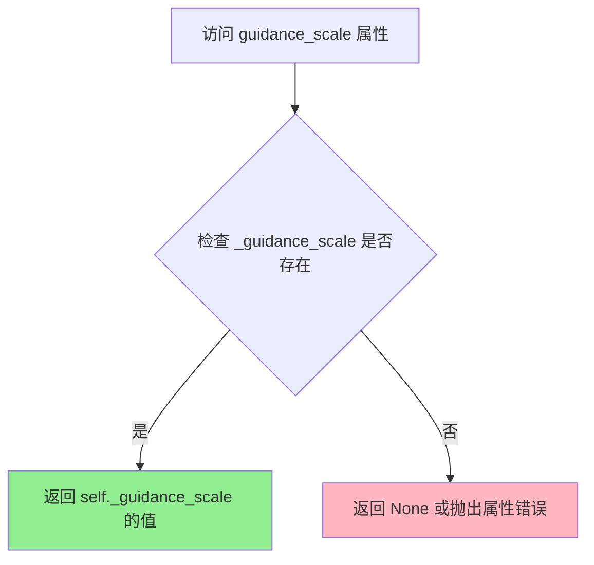

#### 带注释源码

```python
@property
def guidance_scale(self):
    """
    获取当前配置的引导尺度（guidance scale）值。
    
    引导尺度是Classifier-Free Diffusion Guidance中的参数w（见论文2207.12598），
    对应于Imagen论文（2205.11487）中的方程（2）。当guidance_scale > 1时启用引导，
    较高的值会促使生成的图像更紧密地联系文本提示，通常以较低的图像质量为代价。
    
    此属性为只读属性，_guidance_scale的值在__call__方法中被设置。
    
    返回:
        float: 当前的guidance_scale值，默认为7.0
    """
    return self._guidance_scale
```

#### 关联信息

- **设置方式**：在 `__call__` 方法中通过 `self._guidance_scale = guidance_scale` 设置
- **默认值**：7.0（在 `__call__` 方法参数中定义）
- **使用场景**：在去噪循环中计算无分类器引导：`noise_pred = noise_pred_uncond + self.guidance_scale * (noise_pred_text - noise_pred_uncond)`
- **相关属性**：`do_classifier_free_guidance`（判断是否启用引导，基于 `self._guidance_scale > 1`）


### `StableDiffusion3InpaintPipeline.clip_skip`

该属性是一个只读的 getter 属性，用于获取 CLIP 跳过层数。该值控制从 CLIP 文本编码器的第几层隐藏状态获取文本嵌入，数值表示跳过的层数（从最后一层往前数）。

参数：

- （无参数）

返回值：`int | None`，返回 CLIP 跳过层数。如果为 `None`，则使用 CLIP 模型的最后一层隐藏状态；如果为整数，则使用倒数第 `(clip_skip + 1)` 层的隐藏状态。

#### 流程图

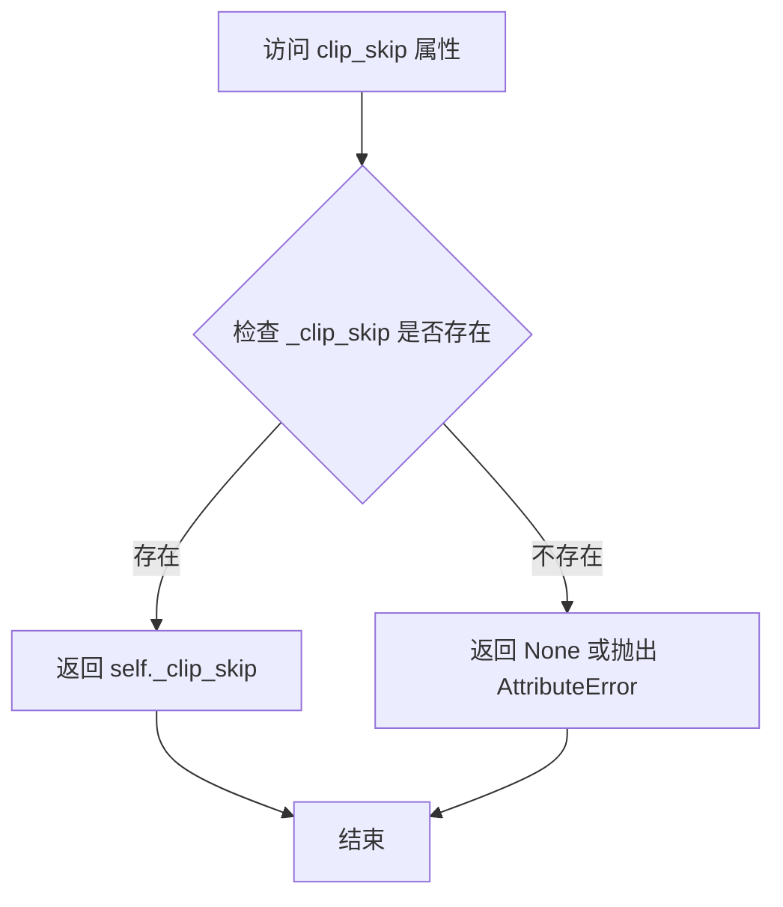

#### 带注释源码

```python
@property
def clip_skip(self):
    """返回 CLIP 跳过层数。
    
    该属性用于控制文本嵌入的提取层级。当值为 None 时，
    使用 CLIP 模型的最后一层隐藏状态；当值为正整数 n 时，
    使用倒数第 n+1 层的隐藏状态（跳过 n 层）。
    
    Returns:
        int | None: CLIP 跳过的层数，None 表示使用默认的最后一层。
    """
    return self._clip_skip
```


### `StableDiffusion3InpaintPipeline.do_classifier_free_guidance`

该属性用于判断当前是否启用了无分类器自由引导（Classifier-Free Guidance, CFG）。通过检查 `guidance_scale` 是否大于 1 来返回布尔值，当 `guidance_scale > 1` 时表示启用 CFG，否则表示禁用。

参数：

- 无（属性方法，仅包含 `self` 参数）

返回值：`bool`，返回 `True` 表示启用无分类器自由引导，返回 `False` 表示禁用。

#### 流程图

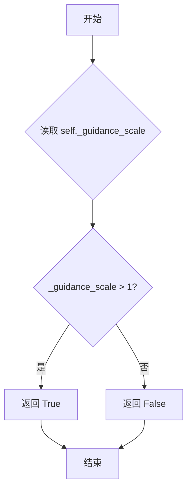

#### 带注释源码

```python
@property
def do_classifier_free_guidance(self):
    # guidance_scale 定义参考 Imagen 论文 (https://huggingface.co/papers/2205.11487) 中的方程 (2)
    # 权重 w 对应 guidance_scale，guidance_scale = 1 表示不执行无分类器自由引导
    # 该属性返回一个布尔值，指示当前是否启用了 classifier-free guidance
    return self._guidance_scale > 1
```


### `StableDiffusion3InpaintPipeline.joint_attention_kwargs`

该属性是`StableDiffusion3InpaintPipeline`类的一个只读属性，用于获取传递给`AttentionProcessor`的额外关键字参数（kwargs），这些参数用于控制注意力机制的行为。

参数： （该属性为只读属性，无参数）

返回值：`dict[str, Any] | None`，返回存储在管道中的联合注意力关键字参数，如果没有设置则返回`None`

#### 流程图

```mermaid
flowchart TD
    A[访问 joint_attention_kwargs 属性] --> B{检查 self._joint_attention_kwargs 是否存在}
    B -->|存在| C[返回 self._joint_attention_kwargs]
    B -->|不存在| D[返回 None]
    
    C --> E[调用 __call__ 时设置]
    D --> F[默认配置使用]
    
    E --> G[传递给 transformer 的 joint_attention_kwargs 参数]
    F --> G
```

#### 带注释源码

```python
@property
def joint_attention_kwargs(self):
    """获取联合注意力关键字参数。
    
    这是一个只读属性，返回在调用管道时通过 __call__ 方法设置的联合注意力参数。
    这些参数会被传递给 SD3Transformer2DModel，用于控制注意力机制的行为，
    例如支持 IP-Adapter 等功能。
    
    Returns:
        dict[str, Any] | None: 联合注意力关键字参数字典，如果未设置则返回 None。
    """
    return self._joint_attention_kwargs
```

**源码上下文（设置该属性的位置）：**

```python
# 在 __call__ 方法中设置该属性
self._joint_attention_kwargs = joint_attention_kwargs
```

**使用位置（在去噪循环中传递给transformer）：**

```python
noise_pred = self.transformer(
    hidden_states=latent_model_input,
    timestep=timestep,
    encoder_hidden_states=prompt_embeds,
    pooled_projections=pooled_prompt_embeds,
    joint_attention_kwargs=self.joint_attention_kwargs,  # 使用该属性
    return_dict=False,
)[0]
```


### `StableDiffusion3InpaintPipeline.num_timesteps`

这是一个属性 getter 方法，用于获取 Stable Diffusion 3 图像修复管道的推理时间步数量。该属性返回在管道执行过程中设置的时间步总数，让用户可以查询已执行的推理步骤数。

参数：
- （无参数，作为 property 不接受任何参数）

返回值：`int`，返回管道中配置的时间步数量，即去噪循环中要执行的总步数。

#### 流程图

```mermaid
flowchart TD
    A[访问 num_timesteps 属性] --> B{检查 _num_timesteps 是否已设置}
    B -->|是| C[返回 self._num_timesteps]
    B -->|否| D[返回默认值或未初始化的值]
    C --> E[调用者获取时间步数量]
    D --> E
    
    F[_num_timesteps 在 __call__ 中设置] --> G[设置 self._num_timesteps = len(timesteps)]
```

#### 带注释源码

```python
@property
def num_timesteps(self):
    """属性 getter: 返回管道推理过程中的时间步数量
    
    该属性提供对内部变量 _num_timesteps 的访问，该变量在管道调用时自动设置。
    它表示扩散模型去噪过程的总步骤数，可用于监控或调试管道执行进度。
    
    Returns:
        int: 推理过程中使用的时间步数量
    """
    return self._num_timesteps
```


### `StableDiffusion3InpaintPipeline.interrupt`

该属性用于返回管线的中断标志状态。在去噪循环执行过程中，通过检查此属性来决定是否跳过当前迭代，从而实现对管线执行的中断控制。

参数：

- （无参数，这是一个属性 getter）

返回值：`bool`，返回管线的中断标志状态。当返回 `True` 时，表示管线已被请求中断；当返回 `False` 时，表示管线正常运行。

#### 流程图

```mermaid
flowchart TD
    A[外部调用 interrupt 属性] --> B{属性访问}
    B --> C[返回 self._interrupt 的值]
    C --> D{检查中断标志}
    D -->|True| E[去噪循环跳过当前迭代]
    D -->|False| F[继续正常执行]
```

#### 带注释源码

```python
@property
def interrupt(self):
    """
    属性 getter：返回管线的中断标志状态。
    
    该属性用于在去噪循环中检查是否需要中断管线执行。
    当外部调用者设置 self._interrupt = True 时，去噪循环会跳过当前迭代，
    从而实现对管线执行的中断控制。
    
    返回值:
        bool: 管线的中断标志状态。True 表示已请求中断，False 表示正常运行。
    """
    return self._interrupt
```

## 关键组件


### 张量索引与惰性加载

代码通过 `retrieve_latents` 函数实现张量索引与惰性加载，该函数支持从 encoder_output 中按需获取 latents（通过 latent_dist.sample 或 latent_dist.mode），或直接访问预计算的 latents 属性，实现延迟执行和内存优化。

### 反量化支持

通过 `dtype` 参数在多个方法中传递和转换数据类型，支持 float32、float16 等精度转换。在 `encode_prompt`、`prepare_latents`、`prepare_mask_latents` 等方法中显式指定 dtype，确保张量在不同设备间传输时保持一致的精度。

### 量化策略

结合 PEFT 后端的 LoRA 缩放机制（`scale_lora_layers` 和 `unscale_lora_layers`），支持量化模型的动态权重调整。通过 `USE_PEFT_BACKEND` 标志判断是否启用量化策略，并在编码提示时应用和恢复 LoRA 缩放因子。

### 多模态编码器集成

集成了三个文本编码器（CLIPTextModelWithProjection x2 和 T5EncoderModel），通过 `_get_clip_prompt_embeds` 和 `_get_t5_prompt_embeds` 分别处理短序列和长序列文本嵌入，最后通过 `encode_prompt` 合并为统一的提示嵌入。

### VAE 图像处理管线

`VaeImageProcessor` 用于图像的预处理和后处理，包括归一化、调整大小和潜在空间转换。`mask_processor` 专门处理二值化和灰度转换，支持图像修复任务中的遮罩处理。

### 动态调度器配置

支持 `FlowMatchEulerDiscreteScheduler` 的动态偏移计算（`calculate_shift`），根据图像序列长度自适应调整噪声调度策略，提高生成质量。

### IP-Adapter 图像嵌入

通过 `encode_image` 和 `prepare_ip_adapter_image_embeds` 方法支持图像提示功能，允许用户提供参考图像来引导生成过程。

### 修复推理主流程

`__call__` 方法实现了完整的修复推理管线，包括：输入验证、提示编码、时间步计算、潜在变量准备、mask 处理、去噪循环和最终解码。

### 条件与无分类器引导

在去噪循环中通过 `torch.cat` 实现无分类器引导（CFG），将条件和无条件预测分离后加权组合，支持 `guidance_scale` 参数控制引导强度。

### 时间步调度

`get_timesteps` 和 `retrieve_timesteps` 协同工作，根据 `strength` 参数调整时间步序列，实现图像到图像的修复过渡。


## 问题及建议


### 已知问题

-   **代码重复严重**：`retrieve_latents`、`retrieve_timesteps`、`calculate_shift`等全局函数以及`_get_clip_prompt_embeds`、`_get_t5_prompt_embeds`等方法被多个Pipeline重复复制使用，未抽取到共享基类或工具模块中，导致维护成本高。
-   **`__call__`方法参数过多**：该方法拥有超过30个参数，违反了函数参数不宜过多的设计原则，导致调用时容易出错且难以维护。
-   **硬编码的魔法数字**：`tokenizer_max_length=77`、`default_sample_size=128`、`patch_size=2`等值被硬编码在`__init__`中，缺乏灵活性，应从配置或模型配置中读取。
-   **属性设计不当**：`guidance_scale`、`clip_skip`、`do_classifier_free_guidance`等属性使用`@property`装饰器但仅作为getter使用，实际上是虚拟属性存储在`self._guidance_scale`等私有变量中，设计不一致且容易导致状态管理混乱。
-   **参数校验不完整**：`check_inputs`方法对部分参数组合校验后，`__call__`方法中仍存在一些边界情况未覆盖，如`strength`与`num_inference_steps`组合后的校验。
-   **文档错误**：参数说明中存在错误，如`mask_image_latent`在注释中写为`mask_image_latents`参数，且部分参数描述不清晰。
-   **类型注解不完整**：部分方法参数如`prompt`使用了`str | list[str]`但未在所有地方保持一致，`callback_on_step_end`的类型注解也不够精确。
-   **设备处理不一致**：代码中同时存在`device`、`timestep_device`、`_execution_device`等多种设备引用逻辑，XLA处理逻辑分散。

### 优化建议

-   **抽取公共代码**：将重复的辅助函数（`calculate_shift`、`retrieve_latents`、`retrieve_timesteps`等）和方法（`_get_clip_prompt_embeds`、`_get_t5_prompt_embeds`等）移入基类或独立的工具模块中，通过继承或组合方式复用。
-   **重构`__call__`方法**：将大量参数封装为配置对象（ dataclass 或 Pydantic 模型），使用构建器模式或配置类来简化调用。
-   **统一配置管理**：从模型配置（`self.transformer.config`、`self.vae.config`）中读取所有可配置的默认值，减少硬编码值。
-   **改进属性设计**：将虚拟属性改为显式的私有属性管理，或者使用`dataclass`或`pydantic`模型来统一管理Pipeline状态。
-   **完善错误处理**：增加更详细的错误信息，特别是对参数组合的校验提供更友好的错误提示。
-   **统一设备管理**：简化设备处理逻辑，将XLA相关的处理封装为独立的工具模块或方法。
-   **补充类型注解**：完善所有方法和函数的类型注解，使用`typing.Optional`替代`| None`以提高兼容性。

## 其它


### 设计目标与约束

本Pipeline的设计目标是实现Stable Diffusion 3模型的图像修复（Inpainting）功能，允许用户通过文本提示（prompt）引导的生成模型，对图像中被遮罩（mask）的区域进行智能填充和修复。核心约束包括：1）高度和宽度必须能被`vae_scale_factor * patch_size`整除；2）强度（strength）参数必须介于0到1之间；3）支持多模态文本编码（CLIP T5和Siglip）；4）支持IP-Adapter图像提示；5）支持LoRA微调；6）支持分类器自由引导（Classifier-Free Guidance）。

### 错误处理与异常设计

代码采用多层级的错误处理机制。在`check_inputs`方法中进行输入参数验证，包括：检查高度和宽度的可整除性、strength范围验证、prompt和prompt_embeds互斥检查、负向提示与负向嵌入的形状匹配验证、pooled_prompt_embeds与prompt_embeds的关联性检查、以及max_sequence_length不超过512的限制。在`retrieve_timesteps`中处理自定义timesteps和sigmas的冲突情况。在`prepare_latents`和`prepare_mask_latents`中验证generator列表长度与batch_size的匹配。异常主要通过`ValueError`和`AttributeError`抛出，并携带描述性错误信息帮助开发者定位问题。

### 数据流与状态机

Pipeline的核心数据流如下：1）输入阶段：原始图像和mask图像经过`image_processor.preprocess`和`mask_processor.preprocess`进行预处理和尺寸调整；2）编码阶段：通过`encode_prompt`将文本提示编码为CLIP和T5的prompt_embeds，通过`_encode_vae_image`将图像编码为latent表示；3）潜在空间准备阶段：`prepare_latents`根据strength参数混合噪声和图像latents，`prepare_mask_latents`处理mask和被遮罩的图像；4）去噪循环阶段：在每个timestep中，transformer预测噪声并由scheduler执行去噪步骤；5）解码阶段：通过VAE decoder将最终latents解码为图像。状态转换由scheduler的timesteps控制，流程遵循Diffusion模型的典型去噪-解码模式。

### 外部依赖与接口契约

主要依赖包括：1）transformers库提供的`CLIPTextModelWithProjection`、`CLIPTokenizer`、`T5EncoderModel`、`T5TokenizerFast`、`SiglipImageProcessor`、`SiglipVisionModel`；2）diffusers内部的`SD3Transformer2DModel`、`AutoencoderKL`、`FlowMatchEulerDiscreteScheduler`；3）torch库用于张量操作；4）torch_xla用于XLA设备支持（可选）。接口契约方面：pipeline接受`prompt`、`image`、`mask_image`等输入，输出`StableDiffusion3PipelineOutput`对象或元组；文本编码器必须返回包含hidden_states的输出以支持CLIP skip功能；VAE必须包含`latent_dist`属性或`latents`属性以支持latent提取；scheduler必须实现`set_timesteps`方法。

### 性能考虑与优化空间

性能优化方面：1）支持`enable_sequential_cpu_offload`和`enable_model_cpu_offload`进行模型卸载以节省显存；2）支持XLA编译加速（通过torch_xla）；3）提供`callback_on_step_end`回调接口允许用户在去噪过程中进行干预；4）使用`num_images_per_prompt`参数支持批量生成。潜在优化空间包括：1）可添加CUDA图（CUDA Graphs）支持以减少调度开销；2）可支持ONNX导出以实现跨平台部署；3）可实现更细粒度的模型并行以支持更大的图像分辨率；4）可添加Flash Attention支持以加速transformer推理。

### 并发与线程安全性

Pipeline本身不是线程安全的，因为其内部维护了多个可变状态：1）`_guidance_scale`、`_clip_skip`、`_joint_attention_kwargs`、`_interrupt`、`_num_timesteps`等属性在推理过程中会被修改；2）scheduler的状态会随着去噪步骤推进而改变；3）LoRA scale通过`scale_lora_layers`和`unscale_lora_layers`动态调整。因此，多线程场景下每个线程应创建独立的pipeline实例，或使用进程级隔离。`encode_prompt`方法在处理LoRA scale时存在竞态条件风险，如果多个线程同时修改`_lora_scale`可能导致不可预测的行为。

### 配置与可扩展性

Pipeline通过`register_modules`方法实现依赖注入，支持运行时替换各组件。可扩展性体现在：1）通过继承`SD3LoraLoaderMixin`、`FromSingleFileMixin`、`SD3IPAdapterMixin`提供LoRA加载、单文件加载、IP-Adapter等扩展功能；2）通过`joint_attention_kwargs`传递注意力处理器参数；3）通过`callback_on_step_end`机制支持自定义后处理；4）通过`output_type`参数支持多种输出格式（PIL、numpy、latent）。配置通过`model_cpu_offload_seq`定义默认的模型卸载顺序，`_optional_components`声明可选组件，`_callback_tensor_inputs`定义回调可访问的tensor输入。

    