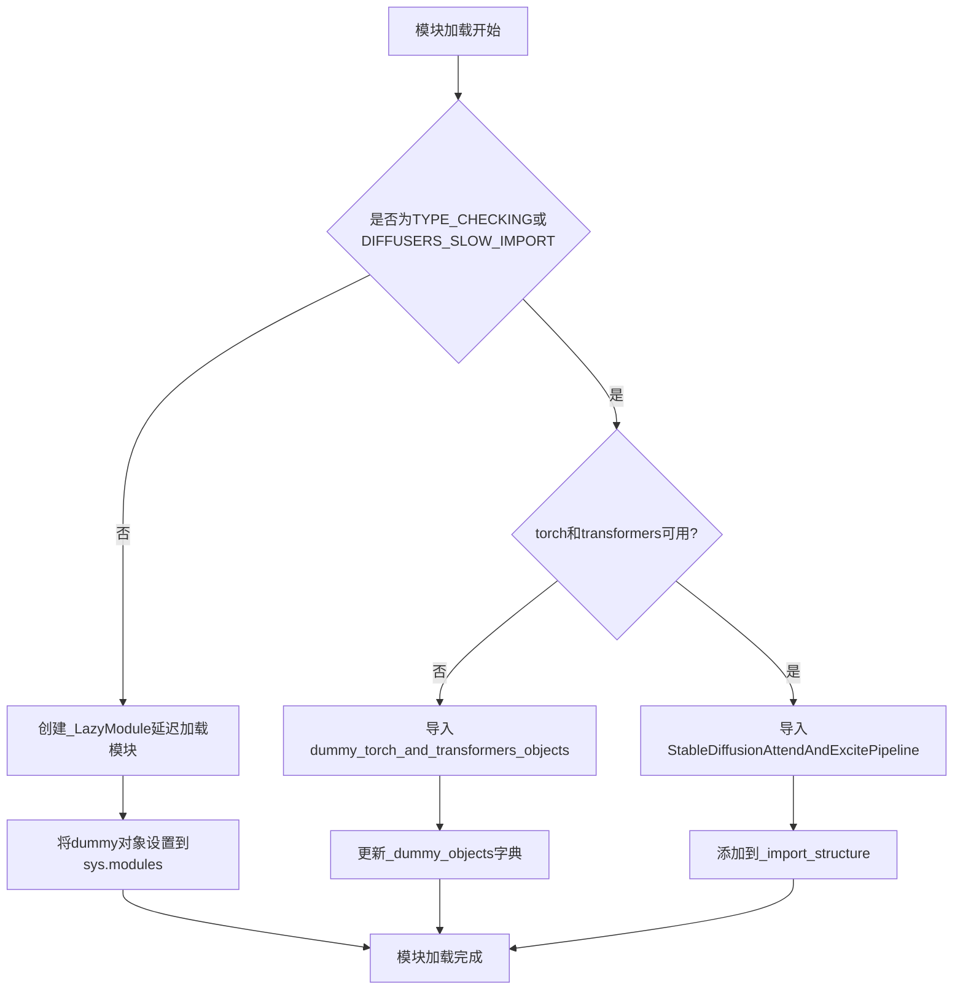
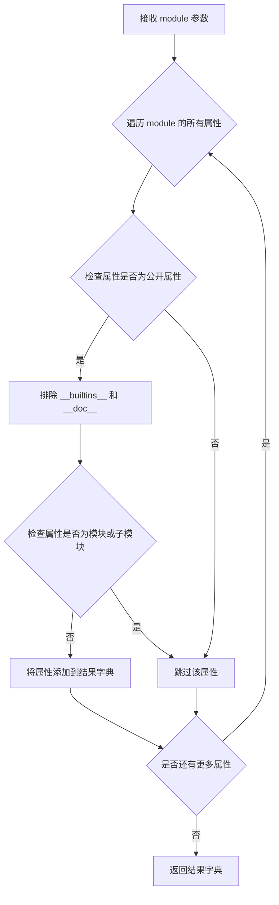
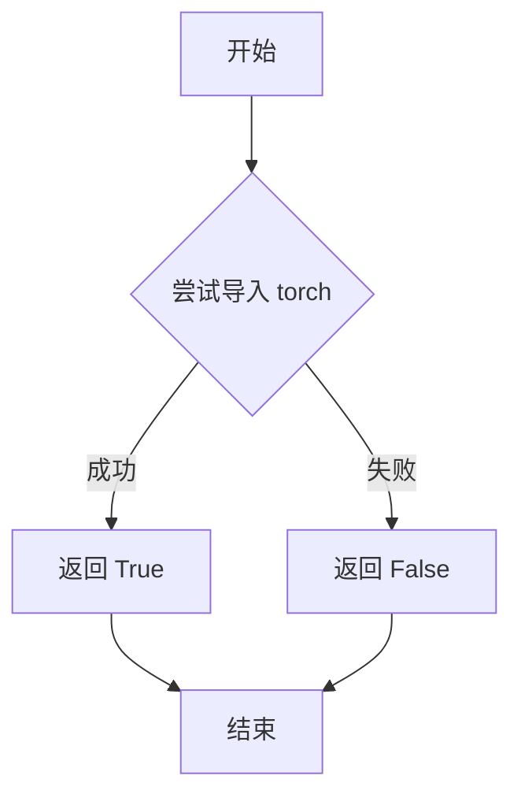
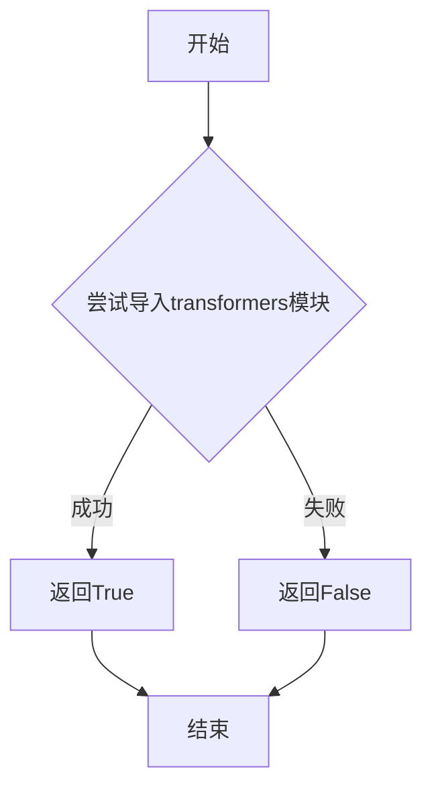
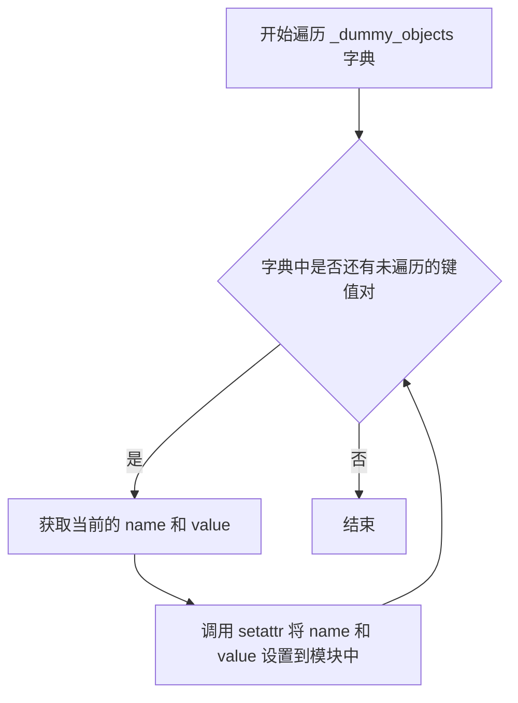

# `diffusers\src\diffusers\pipelines\stable_diffusion_attend_and_excite\__init__.py` 详细设计文档

这是一个延迟加载模块初始化文件，用于动态导入StableDiffusionAttendAndExcitePipeline（稳定扩散 Attend-and-Excite 管道），通过检查torch和transformers可选依赖项的可用性来决定导入真实管道或dummy占位符对象，实现Diffusers库的懒加载机制。

## 整体流程



## 类结构

```
Diffusers Pipeline Module (包初始化)
└── Lazy Loading Module (_LazyModule)
    ├── Optional Dependency Check
    │   ├── is_torch_available()
    │   └── is_transformers_available()
    └── Pipeline Import
        ├── StableDiffusionAttendAndExcitePipeline (条件导入)
        └── dummy_objects (后备占位符)
```

## 全局变量及字段


### `_dummy_objects`
    
存储可选依赖不可用时的虚拟对象，用于延迟加载

类型：`dict`
    


### `_import_structure`
    
定义模块的导入结构，映射管道名称到其类

类型：`dict`
    


### `DIFFUSERS_SLOW_IMPORT`
    
控制是否使用延迟导入模式的标志

类型：`bool`
    


### `TYPE_CHECKING`
    
用于类型检查，避免在运行时导入可选依赖

类型：`bool`
    


### `_LazyModule.__name__`
    
模块的逻辑名称

类型：`str`
    


### `_LazyModule.__file__`
    
模块文件的物理路径

类型：`str`
    


### `_LazyModule._import_structure`
    
传递给LazyModule的导入结构字典

类型：`dict`
    


### `_LazyModule.__spec__`
    
模块的导入规格，包含模块元数据

类型：`ModuleSpec`
    
    

## 全局函数及方法


### `get_objects_from_module`

该函数是 `diffusers` 库中用于从模块中提取所有可导出对象的工具函数，通常配合延迟加载机制使用，将模块中的所有对象（类、函数等）提取为字典格式，以便在 `OptionalDependencyNotAvailable` 时将这些对象标记为虚拟对象（dummy objects）。

参数：

-  `module`：`ModuleType`，要从中提取对象的 Python 模块

返回值：`Dict[str, Any]`，返回模块中所有可导出对象的字典，键为对象名称，值为对象本身

#### 流程图



#### 带注释源码

```
# 注：由于该函数定义在 ...utils 模块中，以下为根据其使用方式推断的实现逻辑

def get_objects_from_module(module):
    """
    从给定的模块中提取所有可导出对象。
    
    参数:
        module: 要提取对象的 Python 模块
        
    返回:
        包含模块中所有公开对象的字典
    """
    # 初始化结果字典
    result = {}
    
    # 遍历模块的所有属性
    for attr_name in dir(module):
        # 跳过私有属性（以双下划线开头）
        if attr_name.startswith('__'):
            continue
            
        # 获取属性值
        attr_value = getattr(module, attr_name)
        
        # 排除内置属性和模块类型本身
        if attr_name in ['__builtins__', '__doc__']:
            continue
            
        if isinstance(attr_value, types.ModuleType):
            continue
            
        # 将属性添加到结果字典
        result[attr_name] = attr_value
        
    return result
```

> **注意**：由于 `get_objects_from_module` 函数的实际定义位于 `...utils` 模块中，提供的源码是基于其使用方式和功能推断的参考实现。实际定义可能略有不同。


### `is_torch_available`

检查当前环境中 PyTorch 库是否可用，返回布尔值以决定是否加载依赖 PyTorch 的模块。

参数：此函数不接受任何显式参数。

返回值：`bool`，返回 `True` 表示 PyTorch 已安装且可用，返回 `False` 表示不可用。

#### 流程图



#### 带注释源码

```
# 注意：此函数定义在 ...utils 模块中，此处为导入使用
# 以下是常见的实现模式（基于 diffusers 库常见实现）

def is_torch_available() -> bool:
    """
    检查 PyTorch 是否可用
    
    Returns:
        bool: 如果 torch 可导入则返回 True，否则返回 False
    """
    try:
        import torch
        return True
    except ImportError:
        return False

# 在本文件中的使用方式：
from ...utils import is_torch_available

# 用于条件导入：仅当 torch 和 transformers 都可用时才加载特定模块
if not (is_transformers_available() and is_torch_available()):
    raise OptionalDependencyNotAvailable()
else:
    _import_structure["pipeline_stable_diffusion_attend_and_excite"] = ["StableDiffusionAttendAndExcitePipeline"]
```


### `is_transformers_available`

检查transformers库是否已安装并可导入，返回布尔值表示库是否可用。

参数：

- （无参数）

返回值：`bool`，如果transformers库可用则返回`True`，否则返回`False`

#### 流程图



#### 带注释源码

```
# 该函数定义在 ...utils 模块中，此处为调用处
# 源代码中未包含该函数的实际实现，仅展示调用方式

# 使用方式1: 条件检查
if is_transformers_available() and is_torch_available():
    # 当transformers和torch都可用时执行
    raise OptionalDependencyNotAvailable()

# 使用方式2: 在TYPE_CHECKING下进行类型检查
try:
    if not (is_transformers_available() and is_torch_available()):
        raise OptionalDependencyNotAvailable()
except OptionalDependencyNotAvailable:
    # 导入虚拟对象用于类型检查
    from ...utils.dummy_torch_and_transformers_objects import *
else:
    # 导入实际的管道类
    from .pipeline_stable_diffusion_attend_and_excite import StableDiffusionAttendAndExcitePipeline

# 实际实现推断（在...utils模块中）
def is_transformers_available():
    """
    检查transformers库是否可用
    
    实现逻辑（推断）:
    1. 尝试导入transformers模块
    2. 如果导入成功，返回True
    3. 如果导入失败，返回False
    """
    try:
        import transformers
        return True
    except ImportError:
        return False
```


### `setattr(sys.modules[__name__], name, value)`

这是一个将虚拟对象动态添加到模块命名空间的函数调用，用于在延迟加载机制中将预定义的虚拟对象注入到当前模块中。

参数：

- `sys.modules[__name__]`：`types.ModuleType`，当前模块对象，表示要设置属性的目标模块
- `name`：`str`，从 `_dummy_objects` 字典中遍历得到的属性名称，对应虚拟对象的名称
- `value`：任意类型，从 `_dummy_objects` 字典中遍历得到的属性值，对应虚拟对象本身

返回值：`None`，该函数直接修改模块对象的属性，不返回任何值

#### 流程图



#### 带注释源码

```python
# 遍历 _dummy_objects 字典中的所有键值对
for name, value in _dummy_objects.items():
    # 使用 setattr 将虚拟对象动态添加到当前模块的命名空间
    # 参数说明：
    # - sys.modules[__name__]: 当前模块对象
    # - name: 虚拟对象的名称（字符串）
    # - value: 虚拟对象本身（可能是类、函数或其他对象）
    setattr(sys.modules[__name__], name, value)
```

#### 详细说明

这段代码出现在模块的延迟加载（Lazy Loading）机制中。当 `DIFFUSERS_SLOW_IMPORT` 为 `False`（即非类型检查模式）时，会进入 `else` 分支。此时模块被替换为 `_LazyModule` 对象，但为了保持模块的完整性（如 `from xxx import *` 能正常工作），需要将 `_dummy_objects` 中定义的虚拟对象手动添加到模块命名空间中。这些虚拟对象在真正的依赖不可用时起到占位作用，当用户尝试访问它们时会触发相应的错误提示。

## 关键组件


### 类型检查与条件导入机制

使用 TYPE_CHECKING 和 DIFFUSERS_SLOW_IMPORT 标志控制导入行为，仅在类型检查或需要完整导入时加载真实模块

### 可选依赖处理系统

通过 is_torch_available() 和 is_transformers_available() 检查依赖可用性，失败时抛出 OptionalDependencyNotAvailable 并使用虚拟对象替代

### 惰性加载模块实现

使用 _LazyModule 类实现延迟加载，将模块注册到 sys.modules 中直到真正被访问时才加载具体实现

### 虚拟对象替代机制

当可选依赖不可用时，从 dummy_torch_and_transformers_objects 导入虚拟对象，确保模块结构完整但功能不可用

### 动态模块属性设置

通过 setattr 将虚拟对象动态绑定到模块命名空间，保持 API 一致性


## 问题及建议


### 已知问题

-   **重复的依赖检查逻辑**：代码在两处（try块和TYPE_CHECKING块）重复检查`is_transformers_available() and is_torch_available()`，违反了DRY原则，增加了维护成本
-   **导入路径不一致**：在`except`块中使用`from ...utils import dummy_torch_and_transformers_objects`，而在TYPE_CHECKING块中使用`from ...utils.dummy_torch_and_transformers_objects import *`，两处路径格式不一致
-   **全局可变状态**：`_dummy_objects`和`_import_structure`作为全局字典被修改（`_dummy_objects.update()`），可能导致意外的副作用和线程安全问题
-   **魔数/硬编码字符串**：管道名称`pipeline_stable_diffusion_attend_and_excite`以字符串形式硬编码，容易出现拼写错误且无法被IDE静态检查
-   **缺乏版本兼容性检查**：仅检查依赖是否可用，未验证torch和transformers的版本是否满足管道运行要求
-   **LazyModule设置后的属性设置**：在`sys.modules[__name__] = _LazyModule(...)`之后又遍历设置属性，逻辑顺序不够清晰

### 优化建议

-   **提取重复逻辑**：将依赖检查封装为单独的函数或使用装饰器，避免重复代码
-   **统一导入路径**：保持导入路径格式一致，使用相对导入或绝对导入的一种统一风格
-   **避免全局可变状态**：考虑使用不可变数据结构或在模块初始化时一次性构建，避免运行时修改全局字典
-   **使用常量或配置**：将管道名称定义为模块级常量，便于维护和重构
-   **添加版本检查**：在依赖检查时同时验证版本号，确保兼容性
-   **简化模块初始化逻辑**：考虑将属性设置移入_LazyModule的初始化逻辑中，或重构为更清晰的流程


## 其它


### 设计目标与约束

本模块旨在实现Stable Diffusion Attend and Excite Pipeline的延迟导入（Lazy Import）机制，通过可选依赖检查支持在缺少torch或transformers时优雅降级，避免运行时直接报错。设计约束包括：仅在transformers和torch同时可用时加载真实pipeline类，否则使用dummy objects占位；支持TYPE_CHECKING模式下的类型推导；遵循diffusers库的模块化导入规范。

### 错误处理与异常设计

本模块采用"检查-抛出-捕获"三级错误处理机制。第一层为条件检查：`if not (is_transformers_available() and is_torch_available())`，若不满足则抛出OptionalDependencyNotAvailable异常。第二层为try-except捕获：捕获异常后从dummy模块导入占位对象。第三层为TYPE_CHECKING分支：在静态类型检查时同样执行依赖检查，确保类型推导完整性。异常信息通过dummy_torch_and_transformers_objects模块传递，不影响程序启动。

### 数据流与状态机

模块存在三种状态：正常运行时（依赖满足）、TYPE_CHECKING模式、依赖缺失模式。数据流如下：首先执行`is_transformers_available()`和`is_torch_available()`检查 → 若均可用则将pipeline类名添加到`_import_structure`字典 → 根据TYPE_CHECKING或DIFFUSERS_SLOW_IMPORT标志决定导入路径 → 正常运行时将当前模块替换为`_LazyModule`实例 → 遍历`_dummy_objects`并设置为模块属性。

### 外部依赖与接口契约

本模块依赖以下外部组件：`is_torch_available()`和`is_transformers_available()`函数用于运行时检测torch和transformers是否可用；`_LazyModule`类提供延迟加载能力；`get_objects_from_module()`函数从dummy模块提取占位对象；`OptionalDependencyNotAvailable`异常类标识可选依赖不可用。接口契约要求：调用方必须确保`...utils`模块路径正确；dummy模块`dummy_torch_and_transformers_objects`需导出与真实模块相同的类名；pipeline类`StableDiffusionAttendAndExcitePipeline`需存在于`pipeline_stable_diffusion_attend_and_excite`模块中。

### 模块加载机制

_LazyModule是diffusers库实现的延迟加载机制，当sys.modules[__name__]被替换为_LazyModule实例后，对该模块属性的首次访问会触发从_import_structure定义的路径动态导入。本模块将"pipeline_stable_diffusion_attend_and_excite"映射到StableDiffusionAttendAndExcitePipeline类，首次访问时才会真正加载pipeline文件。

### Dummy Objects机制

_dummy_objects用于在依赖不满足时提供替代对象，避免AttributeError或ImportError。这些对象通常为哑元（dummy）类或函数，当实际调用时会抛出有意义的错误信息。get_objects_from_module()从dummy_torch_and_transformers_objects模块提取所有公共对象，并通过setattr将它们绑定到当前模块，确保导入接口一致性。

### TYPE_CHECKING模式分析

当TYPE_CHECKING为True或DIFFUSERS_SLOW_IMPORT为True时，模块执行真实导入而非延迟加载。TYPE_CHECKING用于静态类型检查工具（如mypy、pyright），此时需要真实的类对象进行类型推导；DIFFUSERS_SLOW_IMPORT为True时则跳过延迟加载优化，直接完成所有导入。

### 性能考量

延迟加载机制避免了torch和transformers的立即导入，显著减少了库初始化时间，尤其在用户仅使用CPU推理或不需要该特定pipeline时收益明显。但首次访问pipeline类时会引入额外开销，建议在实际使用前通过warm-up方式预热。

### 版本兼容性

本模块兼容diffusers库0.x版本系列，需要Python 3.7+环境。依赖检测函数is_torch_available()和is_transformers_available()的接口在不同版本间保持稳定，但dummy模块路径可能随版本变化，需同步维护。

    