# `diffusers\src\diffusers\pipelines\stable_diffusion_attend_and_excite\pipeline_stable_diffusion_attend_and_excite.py` 详细设计文档

这是一个基于Stable Diffusion的Attend-and-Excite pipeline实现，通过自定义注意力处理器增强特定token的表示，从而在文本到图像生成过程中更准确地控制图像中特定对象的生成。

## 整体流程

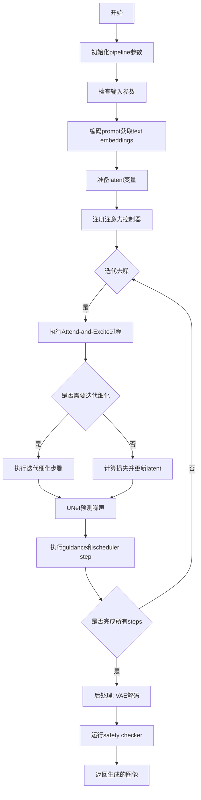

## 类结构

```
DiffusionPipeline (基类)
├── StableDiffusionMixin
├── TextualInversionLoaderMixin
├── StableDiffusionLoraLoaderMixin
└── StableDiffusionAttendAndExcitePipeline
    ├── AttentionStore (辅助类)
    ├── AttendExciteAttnProcessor (注意力处理器)
    └── GaussianSmoothing (高斯平滑工具类)
```

## 全局变量及字段


### `logger`
    
模块日志记录器,用于记录管道运行过程中的信息

类型：`logging.Logger`
    


### `EXAMPLE_DOC_STRING`
    
示例文档字符串,包含pipeline使用示例代码

类型：`str`
    


### `XLA_AVAILABLE`
    
XLA加速是否可用标志,用于判断是否启用PyTorch XLA优化

类型：`bool`
    


### `AttentionStore.num_att_layers`
    
注意力层总数,表示UNet中交叉注意力层的数量

类型：`int`
    


### `AttentionStore.cur_att_layer`
    
当前处理的注意力层索引,用于跟踪当前在哪一层

类型：`int`
    


### `AttentionStore.step_store`
    
当前步骤的注意力存储,按down/mid/up结构存储每层注意力

类型：`dict`
    


### `AttentionStore.attention_store`
    
累积的注意力存储,跨步骤保存注意力图用于分析

类型：`dict`
    


### `AttentionStore.curr_step_index`
    
当前步骤索引,用于可视化特定的扩散步骤

类型：`int`
    


### `AttentionStore.attn_res`
    
注意力图分辨率,表示语义注意力图的2D尺寸

类型：`tuple[int, int]`
    


### `AttendExciteAttnProcessor.attnstore`
    
注意力存储对象,用于在推理过程中保存和聚合注意力图

类型：`AttentionStore`
    


### `AttendExciteAttnProcessor.place_in_unet`
    
在UNet中的位置,标识该处理器属于up/down/mid中的哪个块

类型：`str`
    


### `StableDiffusionAttendAndExcitePipeline.vae`
    
VAE模型,用于编码图像到潜在空间和从潜在空间解码图像

类型：`AutoencoderKL`
    


### `StableDiffusionAttendAndExcitePipeline.text_encoder`
    
文本编码器,用于将文本prompt转换为文本嵌入向量

类型：`CLIPTextModel`
    


### `StableDiffusionAttendAndExcitePipeline.tokenizer`
    
分词器,用于将文本分割成token并转换为token IDs

类型：`CLIPTokenizer`
    


### `StableDiffusionAttendAndExcitePipeline.unet`
    
UNet去噪模型,用于根据文本条件逐步去噪潜在表示

类型：`UNet2DConditionModel`
    


### `StableDiffusionAttendAndExcitePipeline.scheduler`
    
调度器,用于控制扩散过程的噪声调度策略

类型：`KarrasDiffusionSchedulers`
    


### `StableDiffusionAttendAndExcitePipeline.safety_checker`
    
安全检查器,用于检测生成的图像是否包含不当内容

类型：`StableDiffusionSafetyChecker`
    


### `StableDiffusionAttendAndExcitePipeline.feature_extractor`
    
特征提取器,用于从图像中提取特征供安全检查器使用

类型：`CLIPImageProcessor`
    


### `StableDiffusionAttendAndExcitePipeline.vae_scale_factor`
    
VAE缩放因子,用于计算潜在空间的尺寸缩放比例

类型：`int`
    


### `StableDiffusionAttendAndExcitePipeline.image_processor`
    
图像处理器,用于图像的后处理和格式转换

类型：`VaeImageProcessor`
    


### `StableDiffusionAttendAndExcitePipeline.attention_store`
    
注意力存储(运行时),用于在推理过程中捕获和聚合注意力图

类型：`AttentionStore`
    


### `GaussianSmoothing.weight`
    
高斯核权重,存储用于图像平滑的高斯卷积核参数

类型：`Tensor`
    


### `GaussianSmoothing.groups`
    
卷积分组数,用于深度可分离卷积的分组数量

类型：`int`
    


### `GaussianSmoothing.conv`
    
卷积函数(1d/2d/3d),根据维度选择对应的卷积操作函数

类型：`Callable`
    
    

## 全局函数及方法


### `AttentionStore.get_empty_store`

获取空的注意力存储结构，用于初始化或重置注意力映射的收集容器。该方法返回一个包含三个键（down、mid、up）的字典，分别对应 UNet 中的不同注意力层位置，每个键对应的值均为空列表，用于存储该位置收集到的注意力张量。

参数：该方法无参数

返回值：`dict`，返回一个字典对象 `{"down": [], "mid": [], "up": []}`，其中键 "down" 表示 UNet 的下采样层注意力，"mid" 表示中间层注意力，"up" 表示上采样层注意力，值均为空列表用于后续存储注意力张量。

#### 流程图

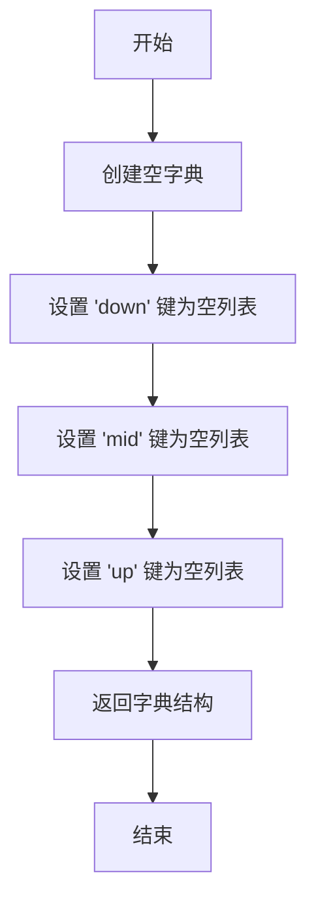

#### 带注释源码

```python
@staticmethod
def get_empty_store():
    """
    获取空的注意力存储结构
    
    这是一个静态方法，用于创建一个空的注意力存储容器。
    该结构用于在扩散模型的推理过程中收集不同 UNet 层的注意力张量。
    存储结构分为三个层级：
    - 'down': 对应 UNet 的下采样（down_blocks）层
    - 'mid': 对应 UNet 的中间层（mid_block）
    - 'up': 对应 UNet 的上采样（up_blocks）层
    
    Returns:
        dict: 包含三个键的字典，每个键对应一个空列表
              格式: {"down": [], "mid": [], "up": []}
    """
    return {"down": [], "mid": [], "up": []}
```


### `AttentionStore.__call__`

该方法是 `AttentionStore` 类的核心调用接口，用于在扩散模型的推理过程中捕获并存储注意力图。它被注册为 UNet 的注意力处理器，在每个注意力层执行时被调用，从而收集跨注意力（cross-attention）信息用于后续的 Attend-and-Excite 优化。

参数：

- `self`：`AttentionStore`，注意力存储对象的实例，包含 `cur_att_layer`（当前注意力层索引）、`num_att_layers`（总注意力层数）、`step_store`（当前步骤的注意力存储）、`attn_res`（注意力分辨率）等属性
- `attn`：`torch.Tensor`，注意力张量，形状为 `[batch_size, seq_len, head_dim]`，表示模型生成的注意力概率分布
- `is_cross`：`bool`，布尔标志，指示当前注意力是否为跨注意力（cross-attention）。当为 `True` 时表示文本-图像之间的注意力，为 `False` 时表示图像内部的自我注意力（通常不存储）
- `place_in_unet`：`str`，字符串，表示注意力在 UNet 中的位置，取值范围为 `"up"`（上采样块）、`down"`（下采样块）或 `"mid"`（中间块），用于对存储的注意力进行分类

返回值：`None`，该方法无返回值，通过修改实例属性 `step_store` 来间接存储注意力数据

#### 流程图

```mermaid
flowchart TD
    A[__call__ 开始] --> B{is_cross == True?}
    B -->|Yes| C{attn.shape[1] == np.prod(attn_res)?}
    B -->|No| D[跳过存储]
    C -->|Yes| E[将 attn 添加到 step_store[place_in_unet]]
    C -->|No| D
    E --> F[cur_att_layer += 1]
    D --> F
    F --> G{cur_att_layer == num_att_layers?}
    G -->|Yes| H[重置 cur_att_layer = 0]
    G -->|No| I[结束]
    H --> I
    H --> J[调用 between_steps]
    J --> I
```

#### 带注释源码

```python
def __call__(self, attn, is_cross: bool, place_in_unet: str):
    """
    注意力存储的调用接口，在每个注意力层执行时被调用以捕获注意力图
    
    参数:
        attn: torch.Tensor, 注意力概率张量, 形状 [batch, seq_len, dim]
        is_cross: bool, 是否为跨注意力(文本-图像注意力)
        place_in_unet: str, 在UNet中的位置, 可选 "up", "down", "mid"
    """
    # 仅在跨注意力且当前层索引有效时进行处理
    if self.cur_att_layer >= 0 and is_cross:
        # 检查注意力图的序列长度是否与预定义的注意力分辨率匹配
        # attn.shape[1] 应等于 attn_res 的宽 × 高，用于过滤掉不匹配的注意力
        if attn.shape[1] == np.prod(self.attn_res):
            # 将符合条件的注意力图追加到对应位置的存储中
            self.step_store[place_in_unet].append(attn)

    # 当前层索引递增，记录已处理多少个注意力层
    self.cur_att_layer += 1
    
    # 当处理完所有注意力层后，重置计数器并执行步骤间操作
    if self.cur_att_layer == self.num_att_layers:
        self.cur_att_layer = 0
        # 调用 between_steps 将当前 step_store 转移到 attention_store
        self.between_steps()
```


### `AttentionStore.between_steps`

该方法是 `AttentionStore` 类的核心方法之一，用于在扩散模型的每个去噪步骤之间切换和保存注意力存储。它将当前步骤收集的注意力图（存储在 `step_store` 中）转移到持久化的 `attention_store` 中，并重置 `step_store` 为空状态，准备收集下一个去噪步骤的注意力数据。

参数： 无（仅包含隐式参数 `self`）

返回值：`None`，该方法不返回任何值，仅更新对象内部状态

#### 流程图

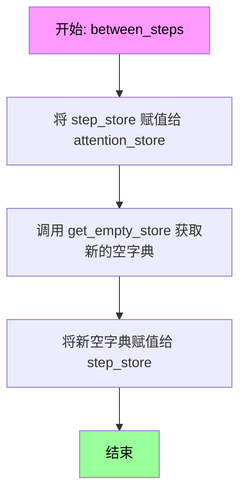

#### 带注释源码

```python
def between_steps(self):
    """
    在去噪步骤之间切换存储。
    
    该方法在每个去噪步骤完成后被调用，用于：
    1. 将当前步骤收集的注意力图（step_store）保存到持久化存储（attention_store）
    2. 重置 step_store 为空，准备收集下一个步骤的注意力数据
    
    注意：此方法不返回任何值，直接修改对象内部状态。
    """
    # 步骤1：将当前步骤的注意力存储转移到持久化存储
    # attention_store 将保留整个去噪过程中的注意力图集合
    self.attention_store = self.step_store
    
    # 步骤2：重置 step_store 为空字典，准备收集下一个步骤的数据
    # get_empty_store() 返回 {"down": [], "mid": [], "up": []}
    # 这样可以确保每个去噪步骤的注意力数据是独立收集的
    self.step_store = self.get_empty_store()
```


### `AttentionStore.get_average_attention`

获取平均注意力存储，用于在 Attend-and-Excite 流程中检索累积的注意力图。

参数：

- 无参数（除隐式 `self` 参数）

返回值：`dict`，返回存储在 `self.attention_store` 中的注意力字典，包含 `"down"`、`"mid"`、`"up"` 三个键，每个键对应一个列表存储该位置的注意力张量。

#### 流程图

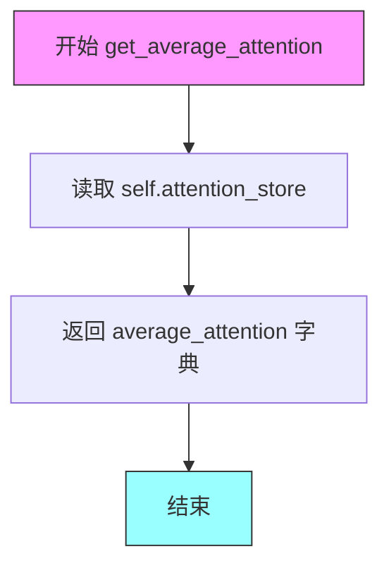

#### 带注释源码

```python
def get_average_attention(self):
    """
    获取平均注意力存储。
    
    该方法返回在扩散过程步骤之间累积的注意力图。
    attention_store 是一个字典，包含三个键：
    - 'down': 下采样块的注意力
    - 'mid': 中间块的注意力
    - 'up': 上采样块的注意力
    
    Returns:
        dict: 包含累积注意力的字典，格式为 {"down": [], "mid": [], "up": []}
    """
    # 从实例变量中获取累积的注意力存储
    average_attention = self.attention_store
    
    # 返回注意力字典，供 aggregate_attention 等方法使用
    return average_attention
```


### `AttentionStore.aggregate_attention`

该方法用于聚合来自不同层和头部的注意力图，在指定的分辨率下输出聚合后的注意力张量。它从`AttentionStore`中获取平均注意力图，根据`from_where`参数指定的位置（如"up"、"down"、"mid"）进行筛选和重塑，最后对所有注意力图求平均。

参数：

- `from_where`：`list[str]`，指定要聚合的注意力位置（例如 "up"、"down"、"mid"），用于从 `attention_store` 中选择对应的注意力图

返回值：`torch.Tensor`，聚合后的注意力图，形状为 `[height, width, num_tokens]`

#### 流程图

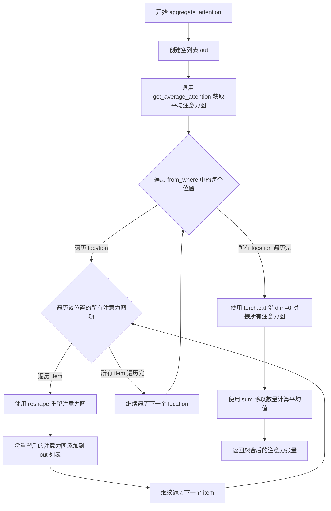

#### 带注释源码

```python
def aggregate_attention(self, from_where: list[str]) -> torch.Tensor:
    """Aggregates the attention across the different layers and heads at the specified resolution."""
    # 初始化输出列表，用于存储重塑后的注意力图
    out = []
    
    # 获取存储的平均注意力图（从 step_store 复制而来）
    attention_maps = self.get_average_attention()
    
    # 遍历指定的位置（如 "up", "down", "mid"）
    for location in from_where:
        # 遍历该位置对应的所有注意力图
        for item in attention_maps[location]:
            # 将注意力图重塑为 [批次, 高度, 宽度, 通道/头数] 的形式
            # self.attn_res 是注意力分辨率，例如 (16, 16)
            cross_maps = item.reshape(-1, self.attn_res[0], self.attn_res[1], item.shape[-1])
            # 将重塑后的注意力图添加到输出列表
            out.append(cross_maps)
    
    # 沿第0维度拼接所有注意力图，形成一个大的注意力张量
    out = torch.cat(out, dim=0)
    
    # 对所有注意力图求平均（按第0维求和后除以数量）
    out = out.sum(0) / out.shape[0]
    
    # 返回聚合后的注意力图，形状为 [height, width, num_tokens]
    return out
```


### `AttentionStore.reset`

重置注意力存储的状态，将当前注意力层计数器、步骤存储和注意力存储恢复到初始状态，以便开始新的推理过程。

参数：

- 该方法无参数（仅包含 `self`）

返回值：`None`，无返回值

#### 流程图

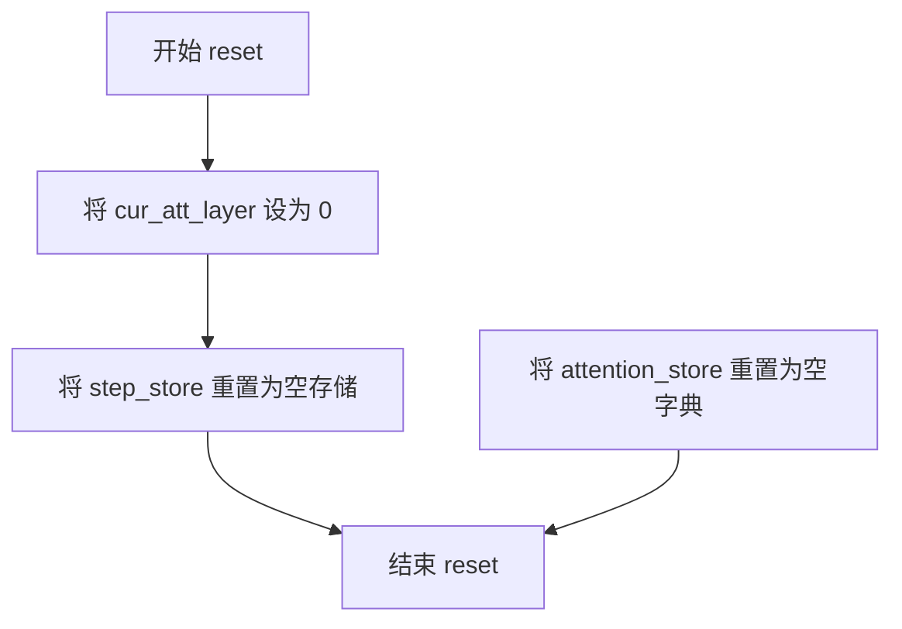

#### 带注释源码

```python
def reset(self):
    """
    重置 AttentionStore 的内部状态
    
    该方法在每轮新的推理开始时被调用，确保：
    1. 当前注意力层计数器归零
    2. 步骤存储（step_store）被清空
    3. 注意力存储（attention_store）被重置为空字典
    """
    # 重置当前注意力层计数器为0
    self.cur_att_layer = 0
    
    # 重置步骤存储，使用 get_empty_store() 获取初始空结构
    # 返回格式: {"down": [], "mid": [], "up": []}
    self.step_store = self.get_empty_store()
    
    # 清空累积的注意力存储，将其重置为空字典
    self.attention_store = {}
```


### `AttentionStore.__init__`

该方法是 `AttentionStore` 类的构造函数，用于初始化注意力存储对象。它设置注意力分辨率、层计数器、步骤存储和注意力存储等核心属性，为后续的注意力图收集和聚合操作做好准备。

参数：

- `attn_res`：元组 `(int, int)`，表示注意力图的二维分辨率（高度和宽度），用于控制聚合注意力时的空间维度。

返回值：`无`（构造函数不返回任何值）

#### 流程图

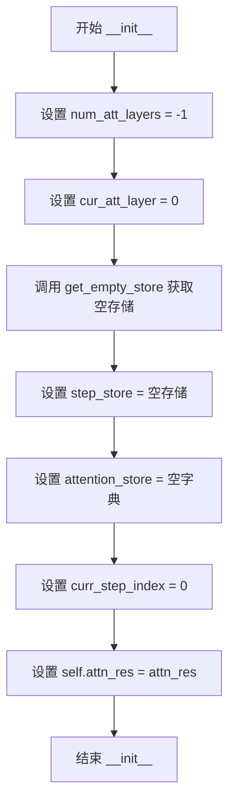

#### 带注释源码

```python
def __init__(self, attn_res):
    """
    Initialize an empty AttentionStore
    :param step_index: used to visualize only a specific step in the diffusion
    process
    """
    # 用于记录UNet中的注意力层总数，初始化为-1表示尚未设置
    # 在register_attention_control方法中会被更新为实际的交叉注意力层数量
    self.num_att_layers = -1
    
    # 当前处理的注意力层索引，从0开始计数
    # 每次调用__call__方法时会递增，达到num_att_layers时重置为0
    self.cur_att_layer = 0
    
    # 当前步骤的注意力存储，结构为{"down": [], "mid": [], "up": []}
    # 用于存储单步推理过程中的注意力图
    self.step_store = self.get_empty_store()
    
    # 跨步骤的注意力存储累积，用于存储多个步骤的注意力图
    # 结构为{"down": [], "mid": [], "up": []}
    # 在between_steps方法中会从step_store更新
    self.attention_store = {}
    
    # 当前步骤索引，用于可视化特定步骤的注意力
    self.curr_step_index = 0
    
    # 注意力图的二维分辨率，存储为元组 (height, width)
    # 例如 (16, 16) 表示16x16的注意力图
    # 该值用于在aggregate_attention中reshape注意力图
    self.attn_res = attn_res
```


### `AttendExciteAttnProcessor.__call__`

该方法是一个自定义注意力处理器（Attention Processor），用于在 Stable Diffusion 的 UNet 中执行自定义注意力计算。它在标准注意力计算流程的基础上，增加了对注意力图（attention maps）的存储功能，以便后续的 Attend-and-Excite 流程使用——该流程通过分析并增强特定 token 的注意力强度来改进文本到图像的生成质量。

参数：

- `attn`：`Attention`，UNet 中的注意力模块实例，提供查询、键、值的投影方法以及注意力计算工具
- `hidden_states`：`torch.Tensor`，输入的隐藏状态，形状为 `(batch_size, sequence_length, hidden_dim)`
- `encoder_hidden_states`：`torch.Tensor | None`，编码器的隐藏状态（即文本条件嵌入），如果为 `None` 则使用 `hidden_states` 本身（用于自注意力）
- `attention_mask`：`torch.Tensor | None`，可选的注意力掩码，用于屏蔽某些位置的注意力计算

返回值：`torch.Tensor`，经过注意力计算和输出投影后的隐藏状态，形状与输入 `hidden_states` 相同

#### 流程图

```mermaid
flowchart TD
    A[输入 hidden_states] --> B[准备注意力掩码 prepare_attention_mask]
    B --> C[计算查询向量 to_q]
    C --> D{encoder_hidden_states 是否为 None?}
    D -->|是| E[使用 hidden_states 作为键值]
    D -->|否| F[使用 encoder_hidden_states 作为键值]
    E --> G[计算键向量 to_k]
    F --> G
    G --> H[计算值向量 to_v]
    H --> I[将 QKV 维度转换为批处理维度 head_to_batch_dim]
    I --> J[计算注意力分数 get_attention_scores]
    J --> K{注意力需要梯度?}
    K -->|是| L[存储注意力图到 attnstore]
    K -->|否| M[跳过存储]
    L --> M
    M --> N[执行注意力加权 torch.bmm]
    N --> O[恢复原始维度 batch_to_head_dim]
    O --> P[线性投影 to_out[0]]
    P --> Q[Dropout to_out[1]]
    Q --> R[返回隐藏状态]
```

#### 带注释源码

```python
def __call__(self, attn: Attention, hidden_states, encoder_hidden_states=None, attention_mask=None):
    """
    执行自定义注意力计算并存储注意力图供 Attend-and-Excite 流程使用
    
    参数:
        attn: Attention 模块，提供 QKV 投影和注意力计算方法
        hidden_states: 输入的隐藏状态张量
        encoder_hidden_states: 文本编码器的隐藏状态（跨注意力用）
        attention_mask: 可选的注意力掩码
    
    返回:
        经过注意力计算和投影后的隐藏状态
    """
    # 1. 获取输入维度信息
    batch_size, sequence_length, _ = hidden_states.shape
    
    # 2. 准备注意力掩码，处理不同序列长度的兼容性
    attention_mask = attn.prepare_attention_mask(attention_mask, sequence_length, batch_size)

    # 3. 对 hidden_states 进行查询（Query）投影
    query = attn.to_q(hidden_states)

    # 4. 判断是否为跨注意力（Cross Attention）
    # 如果提供了 encoder_hidden_states，则为跨注意力；否则为自注意力（Self Attention）
    is_cross = encoder_hidden_states is not None
    
    # 5. 确定键（Key）和值（Value）的来源
    # 跨注意力使用文本嵌入，自注意力使用图像嵌入
    encoder_hidden_states = encoder_hidden_states if encoder_hidden_states is not None else hidden_states
    
    # 6. 对键和值进行投影
    key = attn.to_k(encoder_hidden_states)
    value = attn.to_v(encoder_hidden_states)

    # 7. 将 QKV 从 (batch, seq, heads, dim) 转换为 (batch*heads, seq, dim) 格式
    # 这是为了适配多头注意力计算
    query = attn.head_to_batch_dim(query)
    key = attn.head_to_batch_dim(key)
    value = attn.head_to_batch_dim(value)

    # 8. 计算注意力分数（softmax(Q*K^T / sqrt(d_k))）
    attention_probs = attn.get_attention_scores(query, key, attention_mask)

    # 9. 【关键】仅在需要梯度时存储注意力图
    # 这是 Attend-and-Excite 的核心：在前向传播中保存注意力用于后续梯度更新
    if attention_probs.requires_grad:
        self.attnstore(attention_probs, is_cross, self.place_in_unet)

    # 10. 执行注意力加权：output = attention_probs * value
    hidden_states = torch.bmm(attention_probs, value)
    
    # 11. 恢复原始维度格式
    hidden_states = attn.batch_to_head_dim(hidden_states)

    # 12. 输出投影：线性层 + Dropout
    hidden_states = attn.to_out[0](hidden_states)  # 线性投影
    hidden_states = attn.to_out[1](hidden_states)  # Dropout

    return hidden_states
```

---

### 1. 代码核心功能概述

该代码实现了 **Stable Diffusion Attend-and-Excite Pipeline**，其核心功能是通过在去噪过程中**动态干预特定 token 的注意力分布**，使模型更加关注用户指定的概念（如猫、青蛙等），从而生成更符合文本描述的图像。核心创新在于将注意力图存储机制与梯度优化相结合，通过迭代细化（Iterative Refinement）提升生成质量。

---

### 2. 文件整体运行流程

```
┌─────────────────────────────────────────────────────────────────────────┐
│                        完整 Pipeline 流程                                │
├─────────────────────────────────────────────────────────────────────────┤
│                                                                         │
│  1. 初始化阶段                                                           │
│     ├── 加载预训练模型（VAE, Text Encoder, UNet, Scheduler）              │
│     ├── 创建 AttentionStore 实例                                        │
│     └── 注册自定义 AttentionProcessor 到 UNet                            │
│                                                                         │
│  2. 编码阶段                                                             │
│     ├── encode_prompt() → 生成 prompt_embeds                            │
│     └── 准备负样本 embeddings（用于 Classifier-Free Guidance）           │
│                                                                         │
│  3. 去噪循环（Diffusion Denoising Loop）                                │
│     ├── for each timestep t:                                           │
│     │   ├── 【Attend-and-Excite 核心】                                  │
│     │   │   ├── 前向传播 UNet 获取注意力图                               │
│     │   │   ├── 聚合注意力（aggregate_attention）                      │
│     │   │   ├── 计算特定 token 的最大注意力值                            │
│     │   │   ├── 计算损失：max(0, 1 - max_attention)                     │
│     │   │   └── 梯度更新 latents                                        │
│     │   │                                                                │
│     │   ├── 迭代细化（可选）                                              │
│     │   │   └── 当 loss > threshold 时执行多次细化                       │
│     │   │                                                                │
│     │   ├── 标准扩散步骤                                                 │
│     │   │   ├── 预测噪声残差（UNet）                                      │
│     │   │   ├── 执行 Classifier-Free Guidance                           │
│     │   │   └── Scheduler 步骤更新 latents                               │
│     │   └── 调用回调函数（可选）                                         │
│     │                                                                    │
│  4. 后处理阶段                                                           │
│     ├── VAE 解码 latents → 图像                                         │
│     ├── Safety Checker 检查                                             │
│     └── 返回生成结果                                                     │
│                                                                         │
└─────────────────────────────────────────────────────────────────────────┘
```

---

### 3. 类的详细信息

#### 3.1 `AttentionStore`

**用途**：存储和管理去噪过程中产生的注意力图

| 字段/方法 | 类型 | 描述 |
|-----------|------|------|
| `num_att_layers` | `int` | UNet 中的注意力层总数 |
| `cur_att_layer` | `int` | 当前处理的注意力层索引 |
| `step_store` | `dict` | 当前步骤的注意力存储（临时） |
| `attention_store` | `dict` | 跨步骤聚合后的注意力存储 |
| `curr_step_index` | `int` | 当前去噪步骤索引 |
| `attn_res` | `tuple` | 注意力图的分辨率 (height, width) |
| `get_empty_store()` | `staticmethod` | 返回空存储结构 `{"down": [], "mid": [], "up": []}` |
| `__call__()` | `instance` | 追加注意力到存储（被 AttendExciteAttnProcessor 调用） |
| `between_steps()` | `instance` | 步骤间同步：将 step_store 复制到 attention_store |
| `get_average_attention()` | `instance` | 获取平均注意力图 |
| `aggregate_attention()` | `instance` | 聚合指定位置的注意力并返回求和结果 |
| `reset()` | `instance` | 重置所有存储状态 |

---

#### 3.2 `AttendExciteAttnProcessor`

**用途**：自定义注意力处理器，拦截标准注意力计算并保存注意力图

| 字段/方法 | 类型 | 描述 |
|-----------|------|------|
| `attnstore` | `AttentionStore` | 注意力存储实例的引用 |
| `place_in_unet` | `str` | 注意力在 UNet 中的位置（"up"/"down"/"mid"） |
| `__init__()` | `constructor` | 初始化处理器，保存存储引用和位置标识 |
| `__call__()` | `instance` | 执行自定义注意力计算并存储注意力图 |

---

#### 3.3 `StableDiffusionAttendAndExcitePipeline`

**用途**：完整的文本到图像生成 Pipeline，集成 Attend-and-Excite 逻辑

| 字段/方法 | 类型 | 描述 |
|-----------|------|------|
| `vae` | `AutoencoderKL` | 变分自编码器 |
| `text_encoder` | `CLIPTextModel` | 文本编码器 |
| `tokenizer` | `CLIPTokenizer` | 分词器 |
| `unet` | `UNet2DConditionModel` | 去噪 UNet |
| `scheduler` | `KarrasDiffusionSchedulers` | 扩散调度器 |
| `safety_checker` | `StableDiffusionSafetyChecker` | 安全检查器 |
| `attention_store` | `AttentionStore` | 注意力存储（运行时创建） |
| `register_attention_control()` | `instance` | 替换 UNet 的注意力处理器为自定义处理器 |
| `_compute_max_attention_per_index()` | `staticmethod` | 计算指定 token 的最大注意力值（含高斯平滑） |
| `_aggregate_and_get_max_attention_per_token()` | `instance` | 聚合注意力并获取每个 token 的最大激活 |
| `_compute_loss()` | `staticmethod` | 计算 Attend-and-Excite 损失 |
| `_update_latent()` | `staticmethod` | 根据损失梯度更新 latent |
| `_perform_iterative_refinement_step()` | `instance` | 执行迭代细化直到达到阈值 |
| `get_indices()` | `instance` | 返回 prompt 中每个 token 的索引映射 |
| `__call__()` | `instance` | 主生成函数 |

---

#### 3.4 `GaussianSmoothing`

**用途**：对注意力图应用高斯平滑以减少噪声

| 字段/方法 | 类型 | 描述 |
|-----------|------|------|
| `weight` | `torch.Tensor` | 高斯核权重（注册为 buffer） |
| `groups` | `int` | 深度卷积的分组数（等于通道数） |
| `forward()` | `instance` | 对输入应用高斯滤波 |

---

### 4. 全局变量和函数

| 名称 | 类型 | 描述 |
|------|------|------|
| `logger` | `logging.Logger` | 模块级日志记录器 |
| `XLA_AVAILABLE` | `bool` | 是否启用 XLA 加速（Google Cloud TPU） |
| `EXAMPLE_DOC_STRING` | `str` | 文档示例代码字符串 |
| `is_torch_xla_available()` | `function` | 检查 XLA 可用性的工具函数 |
| `randn_tensor()` | `function` | 生成随机张量的工具函数 |

---

### 5. 关键组件信息

| 组件名称 | 一句话描述 |
|----------|------------|
| **AttentionStore** | 管理去噪过程中注意力图的收集、聚合和跨步骤共享 |
| **AttendExciteAttnProcessor** | 拦截 UNet 注意力计算，在前向传播中保存注意力图供后续优化使用 |
| **Iterative Refinement** | 基于阈值的多轮梯度下降，逐步增强目标 token 的注意力强度 |
| **GaussianSmoothing** | 对注意力图进行空间平滑，减少峰值噪声干扰 |
| **Classifier-Free Guidance** | 通过结合条件和无条件预测提升生成图像与文本的对齐度 |

---

### 6. 潜在技术债务与优化空间

| 类别 | 问题描述 | 优化建议 |
|------|----------|----------|
| **内存** | 完整存储所有注意力层、头、位置的所有注意力图，内存占用高 | ① 按需存储（仅存储目标 token 相关位置）<br>② 使用稀疏表示或压缩存储 |
| **计算** | 每个去噪步骤都执行多次 UNet 前向传播（标准 + 梯度计算） | ① 缓存中间激活<br>② 使用梯度 checkpointing |
| **代码质量** | `AttentionStore.__call__` 与 `_aggregate_and_get_max_attention_per_token` 职责不清 | 抽象出 `AttentionAnalyzer` 类分离关注点 |
| **灵活性** | `max_iter_to_alter` 和 `thresholds` 为硬编码参数 | 暴露为 Pipeline 可配置参数 |
| **错误处理** | 缺少对 `attn_res` 与 UNet 实际输出不匹配时的校验 | 添加维度兼容性断言 |
| **可维护性** | 大量复制自 `StableDiffusionPipeline` 的方法（使用 `Copied from`） | 考虑使用 mixin 或组合模式减少重复 |

---

### 7. 其它设计要点

#### 设计目标与约束

- **目标**：通过注意力干预使模型更关注用户指定的 token（如 "cat", "frog"），提升概念对齐度
- **约束**：
  - 仅在前 `max_iter_to_alter` 步执行干预
  - 梯度更新步长受 `scale_factor` 和 scheduler 进度影响
  - 必须保持与标准 Stable Diffusion Pipeline 的兼容性

#### 错误处理与异常设计

| 场景 | 处理方式 |
|------|----------|
| `height` / `width` 不被 8 整除 | 抛出 `ValueError` |
| `callback_steps` 无效 | 抛出 `ValueError` |
| `indices` 类型错误 | 抛出 `TypeError` |
| `indices` 与 `prompt` batch 不匹配 | 抛出 `ValueError` |
| `safety_checker` 为 `None` 且 `requires_safety_checker=True` | 记录警告但不中断 |

#### 数据流与状态机

```
初始 latent (随机噪声)
    │
    ▼
┌────────────────────────────────────────────────────────────┐
│  for timestep t in timesteps:                              │
│    ┌────────────────────────────────────────────────────┐  │
│    │  1. 克隆 latents 并设置 requires_grad=True        │  │
│    │  2. UNet 前向（不计算梯度）获取注意力               │  │
│    │  3. 聚合注意力 → 计算 max_attention                 │  │
│    │  4. 计算 loss = max(0, 1 - max_attention)           │  │
│    │  5. 如果 loss > threshold: 执行迭代细化            │  │
│    │  6. 如果 i < max_iter_to_alter: 梯度更新 latents    │  │
│    └────────────────────────────────────────────────────┘  │
│    │                                                         │
│    ▼                                                         │
│  标准扩散步骤（CF Guidance + Scheduler Step）               │
│    │                                                         │
└────┴────────────────────────────────────────────────────────┘
    │
    ▼
VAE 解码 → 图像
```

#### 外部依赖与接口契约

| 依赖模块 | 接口契约 |
|----------|----------|
| `transformers.CLIPTextModel` | 提供 `text_encoder` 和 `output_hidden_states` |
| `diffusers.models.UNet2DConditionModel` | 提供 `attn_processors` 和 `set_attn_processor` |
| `diffusers.models.attention_processor.Attention` | 提供 `to_q`, `to_k`, `to_v`, `head_to_batch_dim`, `get_attention_scores`, `prepare_attention_mask` |
| `diffusers.schedulers` | 提供 `set_timesteps`, `step`, `init_noise_sigma` |
| `torch.autograd` | 用于 `grad()` 计算梯度 |

---

### 总结

`AttendExciteAttnProcessor.__call__` 是整个 Attend-and-Excite 机制的关键入口点，它在标准注意力计算流程中**植入了注意力监控的“钩子”**。通过 `AttentionStore` 的配合，系统能够在去噪过程中捕获并分析注意力分布，进而通过梯度干预强化特定语义概念的视觉表达。该设计体现了**“在推理过程中引入可控干预”**的思想，是扩散模型可控生成的一个重要创新方向。


### `StableDiffusionAttendAndExcitePipeline.__init__`

该方法是 `StableDiffusionAttendAndExcitePipeline` 类的构造函数，负责初始化整个pipeline的核心组件，包括VAE模型、文本编码器、分词器、UNet网络、调度器、安全检查器等，并进行参数校验和配置注册。

参数：

- `vae`：`AutoencoderKL`，变分自编码器模型，用于编码和解码图像与潜在表示之间的转换
- `text_encoder`：`CLIPTextModel`，冻结的文本编码器（clip-vit-large-patch14），用于将文本转换为嵌入向量
- `tokenizer`：`CLIPTokenizer`，CLIP分词器，用于将文本分词为token
- `unet`：`UNet2DConditionModel`，条件UNet模型，用于对编码后的图像潜在表示进行去噪
- `scheduler`：`KarrasDiffusionSchedulers`，调度器，与UNet配合使用对潜在表示进行去噪
- `safety_checker`：`StableDiffusionSafetyChecker`，安全检查器，用于评估生成的图像是否具有攻击性或有害内容
- `feature_extractor`：`CLIPImageProcessor`，特征提取器，用于从生成的图像中提取特征作为安全检查器的输入
- `requires_safety_checker`：`bool`，是否需要安全检查器，默认为True

返回值：无（`None`），构造函数不返回值，仅初始化对象状态

#### 流程图

```mermaid
flowchart TD
    A[开始 __init__] --> B{检查 safety_checker 为 None<br/>且 requires_safety_checker 为 True?}
    B -->|是| C[发出安全检查器禁用警告]
    B -->|否| D{检查 safety_checker 不为 None<br/>且 feature_extractor 为 None?}
    C --> D
    D -->|是| E[抛出 ValueError:<br/>定义特征提取器]
    D -->|否| F[调用 super().__init__]
    F --> G[调用 self.register_modules<br/>注册所有模块]
    G --> H{检查 self.vae 是否存在?}
    H -->|是| I[计算 vae_scale_factor<br/>2**(len(vae.config.block_out_channels)-1)]
    H -->|否| J[设置 vae_scale_factor 为 8]
    I --> K
    J --> K
    K[创建 VaeImageProcessor] --> L[调用 self.register_to_config<br/>保存 requires_safety_checker]
    L --> M[结束 __init__]
```

#### 带注释源码

```python
def __init__(
    self,
    vae: AutoencoderKL,
    text_encoder: CLIPTextModel,
    tokenizer: CLIPTokenizer,
    unet: UNet2DConditionModel,
    scheduler: KarrasDiffusionSchedulers,
    safety_checker: StableDiffusionSafetyChecker,
    feature_extractor: CLIPImageProcessor,
    requires_safety_checker: bool = True,
):
    """
    初始化 StableDiffusionAttendAndExcitePipeline 的核心组件。
    
    参数:
        vae: 变分自编码器(VAE)模型，用于图像与潜在表示之间的编解码
        text_encoder: CLIP文本编码器，将文本转换为嵌入向量
        tokenizer: CLIP分词器，将文本分词为token序列
        unet: 条件UNet模型，对潜在表示进行去噪处理
        scheduler: 扩散调度器，控制去噪过程的噪声调度
        safety_checker: 安全检查器，检测生成图像是否包含不适内容
        feature_extractor: CLIP图像处理器，提取图像特征供安全检查器使用
        requires_safety_checker: 标志位，是否必须启用安全检查器
    """
    # 调用父类构造函数，完成基类初始化
    super().__init__()

    # 如果safety_checker为None但requires_safety_checker为True，发出警告
    # 提醒用户遵守Stable Diffusion许可协议，建议保持安全过滤器启用
    if safety_checker is None and requires_safety_checker:
        logger.warning(
            f"You have disabled the safety checker for {self.__class__} by passing `safety_checker=None`. Ensure"
            " that you abide to the conditions of the Stable Diffusion license and do not expose unfiltered"
            " results in services or applications open to the public. Both the diffusers team and Hugging Face"
            " strongly recommend to keep the safety filter enabled in all public facing circumstances, disabling"
            " it only for use-cases that involve analyzing network behavior or auditing its results. For more"
            " information, please have a look at https://github.com/huggingface/diffusers/pull/254 ."
        )

    # 如果提供了safety_checker但未提供feature_extractor，抛出错误
    # 因为安全检查需要使用特征提取器处理图像
    if safety_checker is not None and feature_extractor is None:
        raise ValueError(
            "Make sure to define a feature extractor when loading {self.__class__} if you want to use the safety"
            " checker. If you do not want to use the safety checker, you can pass `'safety_checker=None'` instead."
        )

    # 将所有模块注册到pipeline中，使其可以通过pipeline.xxx访问
    self.register_modules(
        vae=vae,
        text_encoder=text_encoder,
        tokenizer=tokenizer,
        unet=unet,
        scheduler=scheduler,
        safety_checker=safety_checker,
        feature_extractor=feature_extractor,
    )

    # 计算VAE缩放因子，基于VAE的block_out_channels配置
    # 默认为2**(len(block_out_channels)-1)，用于调整潜在表示的空间尺寸
    self.vae_scale_factor = 2 ** (len(self.vae.config.block_out_channels) - 1) if getattr(self, "vae", None) else 8
    
    # 创建VAE图像处理器，用于图像的后处理（解码后的处理）
    self.image_processor = VaeImageProcessor(vae_scale_factor=self.vae_scale_factor)
    
    # 将requires_safety_checker保存到pipeline配置中
    self.register_to_config(requires_safety_checker=requires_safety_checker)
```


### `StableDiffusionAttendAndExcitePipeline._encode_prompt`

该方法是 StableDiffusionAttendAndExcitePipeline 中的一个已废弃的提示词编码方法，用于将文本提示词转换为文本编码器的隐藏状态。该方法已被 `encode_prompt()` 替代，并在内部调用新方法，同时为保持向后兼容性将正向和负向提示词嵌入进行连接后返回。

参数：

- `prompt`：`str | list[str]`，要编码的提示词
- `device`：`torch.device`，torch 设备
- `num_images_per_prompt`：`int`，每个提示词生成的图像数量
- `do_classifier_free_guidance`：`bool`，是否使用无分类器自由引导
- `negative_prompt`：`str | list[str] | None`，不引导图像生成的负面提示词
- `prompt_embeds`：`torch.Tensor | None`，预生成的提示词嵌入
- `negative_prompt_embeds`：`torch.Tensor | None`，预生成的负面提示词嵌入
- `lora_scale`：`float | None`，应用于文本编码器所有 LoRA 层的 LoRA 缩放因子
- `**kwargs`：其他关键字参数

返回值：`torch.Tensor`，连接后的提示词嵌入（包含正向和负向嵌入）

#### 流程图

```mermaid
flowchart TD
    A[开始 _encode_prompt] --> B[记录废弃警告]
    B --> C[调用 encode_prompt 方法]
    C --> D[获取返回的元组 prompt_embeds_tuple]
    E[提取负向嵌入 prompt_embeds_tuple[0]] --> F[连接 embeddings]
    G[提取正向嵌入 prompt_embeds_tuple[1]] --> F
    F --> H[返回连接后的 prompt_embeds]
    
    style A fill:#f9f,stroke:#333
    style H fill:#9f9,stroke:#333
```

#### 带注释源码

```python
def _encode_prompt(
    self,
    prompt,                          # 输入的文本提示词，str或list类型
    device,                          # torch设备对象
    num_images_per_prompt,           # 每个提示词生成的图像数量
    do_classifier_free_guidance,     # 是否使用分类器自由引导
    negative_prompt=None,            # 负面提示词
    prompt_embeds: torch.Tensor | None = None,    # 预计算的提示词嵌入
    negative_prompt_embeds: torch.Tensor | None = None,  # 预计算的负面提示词嵌入
    lora_scale: float | None = None,  # LoRA缩放因子
    **kwargs,                        # 其他可选参数
):
    """
    已废弃的提示词编码方法。
    内部调用新的encode_prompt()方法，并将结果连接以保持向后兼容性。
    输出格式已从连接的张量改为元组，该方法将其转换回连接的张量格式。
    """
    # 记录废弃警告，提示用户使用encode_prompt()替代
    deprecation_message = "`_encode_prompt()` is deprecated and it will be removed in a future version. Use `encode_prompt()` instead. Also, be aware that the output format changed from a concatenated tensor to a tuple."
    deprecate("_encode_prompt()", "1.0.0", deprecation_message, standard_warn=False)

    # 调用新的encode_prompt方法，获取元组格式的嵌入
    # 元组包含 (negative_prompt_embeds, prompt_embeds)
    prompt_embeds_tuple = self.encode_prompt(
        prompt=prompt,
        device=device,
        num_images_per_prompt=num_images_per_prompt,
        do_classifier_free_guidance=do_classifier_free_guidance,
        negative_prompt=negative_prompt,
        prompt_embeds=prompt_embeds,
        negative_prompt_embeds=negative_prompt_embeds,
        lora_scale=lora_scale,
        **kwargs,
    )

    # 保持向后兼容性：将元组转换回连接的张量格式
    # 新方法返回 (negative_prompt_embeds, prompt_embeds)
    # 旧方法返回 torch.cat([negative_prompt_embeds, prompt_embeds])
    # 这里拼接顺序为 [负向嵌入, 正向嵌入]
    prompt_embeds = torch.cat([prompt_embeds_tuple[1], prompt_embeds_tuple[0]])

    return prompt_embeds
```


### `StableDiffusionAttendAndExcitePipeline.encode_prompt`

该方法负责将文本提示（prompt）编码为文本编码器的隐藏状态（text encoder hidden states），支持正向提示和负向提示的嵌入生成，并处理LoRA缩放、clip_skip、分类器自由引导等高级功能。

参数：

- `self`：隐式参数，Pipeline 实例本身
- `prompt`：`str | list[str] | None`，需要编码的文本提示，可以是单个字符串或字符串列表
- `device`：`torch.device`，torch 设备，用于将计算结果放到指定设备上
- `num_images_per_prompt`：`int`，每个提示需要生成的图像数量，用于复制文本嵌入
- `do_classifier_free_guidance`：`bool`，是否启用分类器自由引导（CFG）
- `negative_prompt`：`str | list[str] | None`，负向提示，用于引导图像不包含某些内容
- `prompt_embeds`：`torch.Tensor | None`，可选的预生成正向文本嵌入，若提供则直接使用
- `negative_prompt_embeds`：`torch.Tensor | None`，可选的预生成负向文本嵌入
- `lora_scale`：`float | None`，LoRA 缩放因子，用于调整 LoRA 层的影响
- `clip_skip`：`int | None`，CLIP 模型中跳过的层数，用于获取不同层的表示

返回值：`(torch.Tensor, torch.Tensor)`，返回两个 torch.Tensor 组成的元组 — 第一个是编码后的正向提示嵌入（prompt_embeds），第二个是负向提示嵌入（negative_prompt_embeds）

#### 流程图

```mermaid
flowchart TD
    A[开始 encode_prompt] --> B{是否传入了 lora_scale}
    B -->|是| C[设置 self._lora_scale 并调整 LoRA 权重]
    B -->|否| D{判断 batch_size}
    D -->|prompt 是 str| E[batch_size = 1]
    D -->|prompt 是 list| F[batch_size = len(prompt)]
    D -->|否则| G[batch_size = prompt_embeds.shape[0]]
    
    C --> D
    
    H{prompt_embeds 为 None?}
    H -->|是| I[检查 TextualInversion 并转换提示]
    H -->|否| J[复制 prompt_embeds]
    
    I --> K[tokenizer 处理 prompt]
    K --> L{检查 use_attention_mask}
    L -->|是| M[获取 attention_mask]
    L -->|否| N[attention_mask = None]
    
    M --> O{clip_skip 是否为 None}
    N --> O
    
    O -->|是| P[text_encoder 前向传播获取 embeddings]
    O -->|否| Q[获取隐藏状态并应用 final_layer_norm]
    
    P --> R[获取 prompt_embeds_dtype]
    Q --> R
    
    J --> R
    
    R --> S[将 prompt_embeds 转换为正确 dtype 和 device]
    S --> T{是否需要 CFG}
    T -->|是| U{prompt_embeds 已存在?}
    T -->|否| V[返回结果]
    
    U -->|是| W[使用已存在的 negative_prompt_embeds]
    U -->|否| X[生成 uncond_tokens]
    X --> Y[tokenizer 处理 uncond_tokens]
    Y --> Z[text_encoder 编码获取 negative_prompt_embeds]
    
    W --> AA[重复 embeddings]
    Z --> AA
    
    AA --> AB[调整 shape]
    AB --> AC{是否使用 LoRA}
    AC -->|是| AD[取消 LoRA 缩放]
    AC -->|否| V
    
    AD --> V
    V[结束，返回 prompt_embeds 和 negative_prompt_embeds]
```

#### 带注释源码

```python
def encode_prompt(
    self,
    prompt,
    device,
    num_images_per_prompt,
    do_classifier_free_guidance,
    negative_prompt=None,
    prompt_embeds: torch.Tensor | None = None,
    negative_prompt_embeds: torch.Tensor | None = None,
    lora_scale: float | None = None,
    clip_skip: int | None = None,
):
    r"""
    Encodes the prompt into text encoder hidden states.

    Args:
        prompt (`str` or `list[str]`, *optional*):
            prompt to be encoded
        device: (`torch.device`):
            torch device
        num_images_per_prompt (`int`):
            number of images that should be generated per prompt
        do_classifier_free_guidance (`bool`):
            whether to use classifier free guidance or not
        negative_prompt (`str` or `list[str]`, *optional*):
            The prompt or prompts not to guide the image generation. If not defined, one has to pass
            `negative_prompt_embeds` instead. Ignored when not using guidance (i.e., ignored if `guidance_scale` is
            less than `1`).
        prompt_embeds (`torch.Tensor`, *optional*):
            Pre-generated text embeddings. Can be used to easily tweak text inputs, *e.g.* prompt weighting. If not
            provided, text embeddings will be generated from `prompt` input argument.
        negative_prompt_embeds (`torch.Tensor`, *optional*):
            Pre-generated negative text embeddings. Can be used to easily tweak text inputs, *e.g.* prompt
            weighting. If not provided, negative_prompt_embeds will be generated from `negative_prompt` input
            argument.
        lora_scale (`float`, *optional*):
            A LoRA scale that will be applied to all LoRA layers of the text encoder if LoRA layers are loaded.
        clip_skip (`int`, *optional*):
            Number of layers to be skipped from CLIP while computing the prompt embeddings. A value of 1 means that
            the output of the pre-final layer will be used for computing the prompt embeddings.
    """
    # 如果传入了 lora_scale，则设置 LoRA 缩放因子并动态调整 LoRA 权重
    if lora_scale is not None and isinstance(self, StableDiffusionLoraLoaderMixin):
        self._lora_scale = lora_scale

        # 根据是否使用 PEFT backend 来调整 LoRA 权重
        if not USE_PEFT_BACKEND:
            adjust_lora_scale_text_encoder(self.text_encoder, lora_scale)
        else:
            scale_lora_layers(self.text_encoder, lora_scale)

    # 确定 batch_size：如果 prompt 是字符串则 batch_size=1，如果是列表则取列表长度，否则使用 prompt_embeds 的形状
    if prompt is not None and isinstance(prompt, str):
        batch_size = 1
    elif prompt is not None and isinstance(prompt, list):
        batch_size = len(prompt)
    else:
        batch_size = prompt_embeds.shape[0]

    # 如果没有提供 prompt_embeds，则需要从 prompt 生成
    if prompt_embeds is None:
        # 如果是 TextualInversionLoaderMixin，处理多向量 token
        if isinstance(self, TextualInversionLoaderMixin):
            prompt = self.maybe_convert_prompt(prompt, self.tokenizer)

        # 使用 tokenizer 将 prompt 转换为 token IDs
        text_inputs = self.tokenizer(
            prompt,
            padding="max_length",
            max_length=self.tokenizer.model_max_length,
            truncation=True,
            return_tensors="pt",
        )
        text_input_ids = text_inputs.input_ids
        # 获取不截断的 token IDs 用于检测截断
        untruncated_ids = self.tokenizer(prompt, padding="longest", return_tensors="pt").input_ids

        # 如果截断了，发出警告
        if untruncated_ids.shape[-1] >= text_input_ids.shape[-1] and not torch.equal(
            text_input_ids, untruncated_ids
        ):
            removed_text = self.tokenizer.batch_decode(
                untruncated_ids[:, self.tokenizer.model_max_length - 1 : -1]
            )
            logger.warning(
                "The following part of your input was truncated because CLIP can only handle sequences up to"
                f" {self.tokenizer.model_max_length} tokens: {removed_text}"
            )

        # 获取 attention_mask（如果 text_encoder 需要）
        if hasattr(self.text_encoder.config, "use_attention_mask") and self.text_encoder.config.use_attention_mask:
            attention_mask = text_inputs.attention_mask.to(device)
        else:
            attention_mask = None

        # 根据是否设置 clip_skip 来决定如何获取 embeddings
        if clip_skip is None:
            # 直接使用 text_encoder 获取 embeddings
            prompt_embeds = self.text_encoder(text_input_ids.to(device), attention_mask=attention_mask)
            prompt_embeds = prompt_embeds[0]
        else:
            # 获取所有隐藏状态，然后跳过指定层
            prompt_embeds = self.text_encoder(
                text_input_ids.to(device), attention_mask=attention_mask, output_hidden_states=True
            )
            # hidden_states 是一个包含所有 encoder 层输出的 tuple
            # 通过 -(clip_skip + 1) 获取目标层的输出
            prompt_embeds = prompt_embeds[-1][-(clip_skip + 1)]
            # 应用 final_layer_norm 以保持表示的一致性
            prompt_embeds = self.text_encoder.text_model.final_layer_norm(prompt_embeds)

    # 确定 prompt_embeds 的数据类型（优先使用 text_encoder 的 dtype）
    if self.text_encoder is not None:
        prompt_embeds_dtype = self.text_encoder.dtype
    elif self.unet is not None:
        prompt_embeds_dtype = self.unet.dtype
    else:
        prompt_embeds_dtype = prompt_embeds.dtype

    # 将 prompt_embeds 转换为正确的 dtype 和 device
    prompt_embeds = prompt_embeds.to(dtype=prompt_embeds_dtype, device=device)

    # 为每个 prompt 复制 embeddings（因为 num_images_per_prompt 可能大于 1）
    bs_embed, seq_len, _ = prompt_embeds.shape
    # 使用 MPS 友好的方法复制
    prompt_embeds = prompt_embeds.repeat(1, num_images_per_prompt, 1)
    prompt_embeds = prompt_embeds.view(bs_embed * num_images_per_prompt, seq_len, -1)

    # 如果需要 CFG 且没有提供 negative_prompt_embeds，则生成无条件 embeddings
    if do_classifier_free_guidance and negative_prompt_embeds is None:
        uncond_tokens: list[str]
        if negative_prompt is None:
            # 使用空字符串
            uncond_tokens = [""] * batch_size
        elif prompt is not None and type(prompt) is not type(negative_prompt):
            raise TypeError(
                f"`negative_prompt` should be the same type to `prompt`, but got {type(negative_prompt)} !="
                f" {type(prompt)}."
            )
        elif isinstance(negative_prompt, str):
            uncond_tokens = [negative_prompt]
        elif batch_size != len(negative_prompt):
            raise ValueError(
                f"`negative_prompt`: {negative_prompt} has batch size {len(negative_prompt)}, but `prompt`:"
                f" {prompt} has batch size {batch_size}. Please make sure that passed `negative_prompt` matches"
                " the batch size of `prompt`."
            )
        else:
            uncond_tokens = negative_prompt

        # 处理 TextualInversion
        if isinstance(self, TextualInversionLoaderMixin):
            uncond_tokens = self.maybe_convert_prompt(uncond_tokens, self.tokenizer)

        # tokenize negative prompt
        max_length = prompt_embeds.shape[1]
        uncond_input = self.tokenizer(
            uncond_tokens,
            padding="max_length",
            max_length=max_length,
            truncation=True,
            return_tensors="pt",
        )

        # 获取 attention_mask
        if hasattr(self.text_encoder.config, "use_attention_mask") and self.text_encoder.config.use_attention_mask:
            attention_mask = uncond_input.attention_mask.to(device)
        else:
            attention_mask = None

        # 编码得到 negative_prompt_embeds
        negative_prompt_embeds = self.text_encoder(
            uncond_input.input_ids.to(device),
            attention_mask=attention_mask,
        )
        negative_prompt_embeds = negative_prompt_embeds[0]

    # 如果使用 CFG，处理 negative_prompt_embeds
    if do_classifier_free_guidance:
        seq_len = negative_prompt_embeds.shape[1]

        # 转换为正确的 dtype 和 device
        negative_prompt_embeds = negative_prompt_embeds.to(dtype=prompt_embeds_dtype, device=device)

        # 复制 embeddings
        negative_prompt_embeds = negative_prompt_embeds.repeat(1, num_images_per_prompt, 1)
        negative_prompt_embeds = negative_prompt_embeds.view(batch_size * num_images_per_prompt, seq_len, -1)

    # 如果使用了 LoRA，恢复原始权重
    if self.text_encoder is not None:
        if isinstance(self, StableDiffusionLoraLoaderMixin) and USE_PEFT_BACKEND:
            # 通过 unscale 恢复原始 scale
            unscale_lora_layers(self.text_encoder, lora_scale)

    return prompt_embeds, negative_prompt_embeds
```


### `StableDiffusionAttendAndExcitePipeline.run_safety_checker`

该方法是 Stable Diffusion Attend-And-Excite Pipeline 的安全检查器运行函数，用于在图像生成后检测生成的图像是否包含不当内容（NSFW）。如果没有配置安全检查器，则直接返回原始图像和 None；否则将图像转换为适合特征提取器的格式，调用安全检查器进行推理，并返回处理后的图像及检测结果。

参数：

- `image`：`torch.Tensor | np.ndarray`，待检查的图像，可以是 PyTorch 张量或 NumPy 数组
- `device`：`torch.device`，用于将特征提取器输入移动到指定设备（如 CPU 或 CUDA）
- `dtype`：`torch.dtype`，用于将特征提取器输入转换为指定数据类型（如 float16 或 float32）

返回值：`tuple[torch.Tensor | np.ndarray, list[bool] | None]`，返回处理后的图像和 NSFW 检测结果列表。如果未配置安全检查器，则返回 `(None, None)`；否则返回处理后的图像和布尔值列表，其中 `True` 表示检测到不当内容

#### 流程图

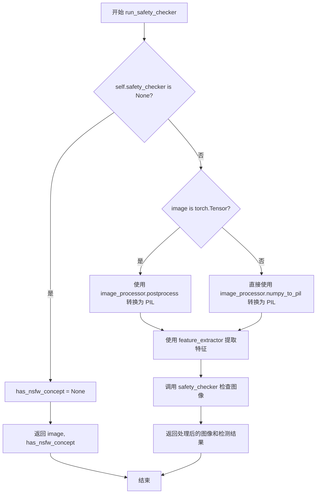

#### 带注释源码

```python
def run_safety_checker(self, image, device, dtype):
    """
    运行安全检查器以检测生成的图像是否包含不当内容
    
    参数:
        image: 待检查的图像，Tensor 或 numpy 数组
        device: 计算设备
        dtype: 计算数据类型
    
    返回:
        处理后的图像和 NSFW 检测结果元组
    """
    # 如果未配置安全检查器，直接返回 None
    if self.safety_checker is None:
        has_nsfw_concept = None
    else:
        # 根据图像类型选择不同的预处理方式
        if torch.is_tensor(image):
            # 将 PyTorch 张量转换为 PIL 图像列表
            feature_extractor_input = self.image_processor.postprocess(image, output_type="pil")
        else:
            # 将 NumPy 数组直接转换为 PIL 图像列表
            feature_extractor_input = self.image_processor.numpy_to_pil(image)
        
        # 使用特征提取器提取图像特征并移动到指定设备
        safety_checker_input = self.feature_extractor(feature_extractor_input, return_tensors="pt").to(device)
        
        # 调用安全检查器进行 NSFW 检测
        image, has_nsfw_concept = self.safety_checker(
            images=image, 
            clip_input=safety_checker_input.pixel_values.to(dtype)
        )
    
    # 返回处理后的图像和检测结果
    return image, has_nsfw_concept
```


### `StableDiffusionAttendAndExcitePipeline.decode_latents`

该方法是一个已废弃的解码方法，用于将VAE的latents解码为图像。它通过VAE模型解码latents，并进行后处理（归一化和格式转换），但在1.0.0版本后被弃用，建议使用`VaeImageProcessor.postprocess()`替代。

参数：

- `self`：`StableDiffusionAttendAndExcitePipeline` 实例，隐式参数
- `latents`：`torch.Tensor`，待解码的latent表示，通常是从扩散模型输出的噪声预测经过调度器处理后得到的潜在空间表示

返回值：`numpy.ndarray`，解码后的图像，形状为 `(batch_size, height, width, channels)`，像素值范围为 `[0, 1]`

#### 流程图

```mermaid
flowchart TD
    A[开始 decode_latents] --> B[记录弃用警告]
    B --> C[latents = 1 / scaling_factor * latents]
    C --> D[调用 vae.decode 进行解码]
    D --> E[image = (image / 2 + 0.5).clamp(0, 1)]
    E --> F[转换为 float32 并移动到 CPU]
    F --> G[image.cpu.permute 调整维度顺序]
    G --> H[转换为 numpy 数组]
    H --> I[返回图像]
```

#### 带注释源码

```python
# Copied from diffusers.pipelines.stable_diffusion.pipeline_stable_diffusion.StableDiffusionPipeline.decode_latents
def decode_latents(self, latents):
    # 发出弃用警告，提示用户使用 VaeImageProcessor.postprocess 替代
    deprecation_message = "The decode_latents method is deprecated and will be removed in 1.0.0. Please use VaeImageProcessor.postprocess(...) instead"
    deprecate("decode_latents", "1.0.0", deprecation_message, standard_warn=False)

    # 1. 根据 VAE 配置的缩放因子对 latents 进行反向缩放
    #    VAE 在编码时会对 latent 进行缩放 (乘以 scaling_factor)，解码时需要除以 scaling_factor 还原
    latents = 1 / self.vae.config.scaling_factor * latents
    
    # 2. 使用 VAE 的 decode 方法将 latent 表示解码为图像
    #    return_dict=False 返回元组，取第一个元素为图像张量
    image = self.vae.decode(latents, return_dict=False)[0]
    
    # 3. 将图像值从 [-1, 1] 范围归一化到 [0, 1] 范围
    #    VAE 解码输出的图像通常在 [-1, 1] 范围
    image = (image / 2 + 0.5).clamp(0, 1)
    
    # 4. 将图像转换为 float32 类型并移动到 CPU
    #    转换为 float32 不会造成显著的性能开销，且与 bfloat16 兼容
    image = image.cpu().permute(0, 2, 3, 1).float().numpy()
    
    # 5. 返回解码后的图像 (numpy 数组格式)
    return image
```


### `StableDiffusionAttendAndExcitePipeline.prepare_extra_step_kwargs`

该方法用于准备调度器（scheduler）的额外参数。由于不同的调度器（如 DDIMScheduler、LMSDiscreteScheduler 等）具有不同的签名，该方法通过检查调度器 `step` 方法的签名，动态构建需要传递给调度器的参数字典。主要用于支持 `eta`（DDIM 调度器特有）和 `generator` 参数的传递。

参数：

- `self`：`StableDiffusionAttendAndExcitePipeline` 实例，隐式参数，管道对象本身
- `generator`：`torch.Generator | list[torch.Generator] | None`，用于控制生成随机性的生成器对象，可为单个或多个生成器列表
- `eta`：`float`，DDIM 论文中的参数 η，仅在支持该参数的调度器中有效，取值范围应为 [0, 1]

返回值：`dict`，包含调度器 `step` 方法所需额外参数（如 `eta` 和 `generator`）的字典

#### 流程图

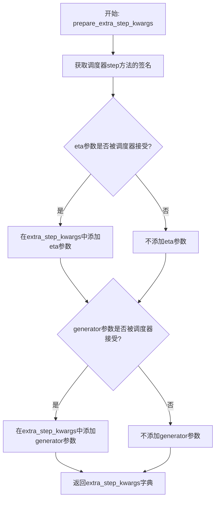

#### 带注释源码

```python
def prepare_extra_step_kwargs(self, generator, eta):
    """
    准备调度器的额外参数。
    
    不同的调度器有不同的签名，此方法通过检查调度器step方法的参数签名，
    动态构建需要传递给调度器的参数字典。
    
    参数:
        generator: torch.Generator, 用于控制生成随机性的生成器
        eta: float, DDIM调度器参数，对其他调度器会被忽略
    
    返回:
        dict: 包含额外参数的字典
    """
    # 使用inspect模块获取调度器step方法的签名参数
    # 这是为了兼容不同类型的调度器，因为不是所有调度器都支持相同参数
    accepts_eta = "eta" in set(inspect.signature(self.scheduler.step).parameters.keys())
    
    # 初始化空字典用于存储额外参数
    extra_step_kwargs = {}
    
    # 如果调度器接受eta参数，则将其添加到extra_step_kwargs中
    # eta (η) 仅用于DDIMScheduler，其他调度器会忽略此参数
    # eta对应DDIM论文中的参数，范围应为[0, 1]
    if accepts_eta:
        extra_step_kwargs["eta"] = eta

    # 检查调度器是否接受generator参数
    # 某些调度器支持使用生成器来控制随机性
    accepts_generator = "generator" in set(inspect.signature(self.scheduler.step).parameters.keys())
    if accepts_generator:
        extra_step_kwargs["generator"] = generator
    
    # 返回构建好的参数字典，可用于scheduler.step(**extra_step_kwargs)
    return extra_step_kwargs
```


### `StableDiffusionAttendAndExcitePipeline.check_inputs`

该方法用于验证 `StableDiffusionAttendAndExcitePipeline` 的输入参数有效性。它检查图像的高度和宽度是否为 8 的倍数，`callback_steps` 是否为正整数，`prompt` 和 `prompt_embeds` 是否互斥且至少提供一个，`negative_prompt` 和 `negative_prompt_embeds` 是否互斥，以及 `prompt_embeds` 和 `negative_prompt_embeds` 的形状是否一致。此外，该方法还会验证 `indices` 的类型（是否为整数列表或列表的列表）以及 `indices` 和 `prompt` 的批次大小是否匹配。任何无效的输入都会抛出相应的异常。

参数：

- `self`：实例方法，隐含参数。
- `prompt`：`str | list[str] | None`，要生成的文本提示。如果提供了 `prompt_embeds`，则此项可为 None。
- `indices`：`list[int] | list[list[int]]`，需要通过 Attend-and-Excite 机制关注的 token 索引。
- `height`：`int`，生成图像的高度。
- `width`：`int`，生成图像的宽度。
- `callback_steps`：`int`，调用回调函数的步长间隔，必须为正整数。
- `negative_prompt`：`str | list[str] | None`，负向提示词，用于指导不希望出现的图像特征。
- `prompt_embeds`：`torch.Tensor | None`，预计算的文本嵌入。如果提供了 `prompt`，则此项可为 None。
- `negative_prompt_embeds`：`torch.Tensor | None`，预计算的负向文本嵌入。

返回值：`None`，无返回值。若参数不符合要求，则抛出 `ValueError` 或 `TypeError`。

#### 流程图

```mermaid
flowchart TD
    A([开始检查]) --> B{height % 8 == 0 且 width % 8 == 0?}
    B -- 否 --> C[抛出 ValueError: 尺寸必须被8整除]
    B -- 是 --> D{callback_steps 是正整数且不为None?}
    D -- 否 --> E[抛出 ValueError: callback_steps必须为正整数]
    D -- 是 --> F{prompt 和 prompt_embeds 是否互斥?}
    F -- 否 --> G[抛出 ValueError: 不能同时指定prompt和prompt_embeds]
    F -- 是 --> H{prompt 和 prompt_embeds 至少提供一个?}
    H -- 否 --> I[抛出 ValueError: 必须提供prompt或prompt_embeds之一]
    H -- 是 --> J{prompt 类型是否合法 (str 或 list)?}
    J -- 否 --> K[抛出 ValueError: prompt类型错误]
    J -- 是 --> L{negative_prompt 和 negative_prompt_embeds 是否互斥?}
    L -- 否 --> M[抛出 ValueError: 不能同时指定negative_prompt相关参数]
    L -- 是 --> N{prompt_embeds 和 negative_prompt_embeds 形状一致?}
    N -- 否 --> O[抛出 ValueError: 嵌入形状不匹配]
    N -- 是 --> P{indices 类型是否合法?}
    P -- 否 --> Q[抛出 TypeError: indices必须是整数列表或列表的列表]
    P -- 是 --> R{indices 批次大小 == prompt 批次大小?}
    R -- 否 --> S[抛出 ValueError: indices和prompt的批次大小不一致]
    R -- 是 --> T([检查通过])
```

#### 带注释源码

```python
def check_inputs(
    self,
    prompt,
    indices,
    height,
    width,
    callback_steps,
    negative_prompt=None,
    prompt_embeds=None,
    negative_prompt_embeds=None,
):
    # 1. 检查图像尺寸是否为8的倍数
    # Stable Diffusion 的 VAE 和 UNet 通常要求输入尺寸为8的倍数
    if height % 8 != 0 or width % 8 != 0:
        raise ValueError(f"`height` and `width` have to be divisible by 8 but are {height} and {width}.")

    # 2. 检查 callback_steps 是否有效
    # 回调函数步长必须是正整数
    if (callback_steps is None) or (
        callback_steps is not None and (not isinstance(callback_steps, int) or callback_steps <= 0)
    ):
        raise ValueError(
            f"`callback_steps` has to be a positive integer but is {callback_steps} of type"
            f" {type(callback_steps)}."
        )

    # 3. 检查 prompt 和 prompt_embeds 的互斥关系
    # 不能同时提供原始文本和预计算的嵌入
    if prompt is not None and prompt_embeds is not None:
        raise ValueError(
            f"Cannot forward both `prompt`: {prompt} and `prompt_embeds`: {prompt_embeds}. Please make sure to"
            " only forward one of the two."
        )
    # 必须至少提供其中一个
    elif prompt is None and prompt_embeds is None:
        raise ValueError(
            "Provide either `prompt` or `prompt_embeds`. Cannot leave both `prompt` and `prompt_embeds` undefined."
        )
    # 如果提供了 prompt，检查其类型是否为 str 或 list
    elif prompt is not None and (not isinstance(prompt, str) and not isinstance(prompt, list)):
        raise ValueError(f"`prompt` has to be of type `str` or `list` but is {type(prompt)}")

    # 4. 检查 negative_prompt 和 negative_prompt_embeds 的互斥关系
    if negative_prompt is not None and negative_prompt_embeds is not None:
        raise ValueError(
            f"Cannot forward both `negative_prompt`: {negative_prompt} and `negative_prompt_embeds`:"
            f" {negative_prompt_embeds}. Please make sure to only forward one of the two."
        )

    # 5. 检查 prompt_embeds 和 negative_prompt_embeds 的形状一致性
    # 如果两者都提供了，它们的形状必须匹配（用于 Classifier Free Guidance）
    if prompt_embeds is not None and negative_prompt_embeds is not None:
        if prompt_embeds.shape != negative_prompt_embeds.shape:
            raise ValueError(
                "`prompt_embeds` and `negative_prompt_embeds` must have the same shape when passed directly, but"
                f" got: `prompt_embeds` {prompt_embeds.shape} != `negative_prompt_embeds`"
                f" {negative_prompt_embeds.shape}."
            )

    # 6. 检查 indices 的类型
    # 必须是 list[int] (单批次) 或 list[list[int]] (多批次)
    indices_is_list_ints = isinstance(indices, list) and isinstance(indices[0], int)
    indices_is_list_list_ints = (
        isinstance(indices, list) and isinstance(indices[0], list) and isinstance(indices[0][0], int)
    )

    if not indices_is_list_ints and not indices_is_list_list_ints:
        raise TypeError("`indices` must be a list of ints or a list of a list of ints")

    # 7. 批次大小一致性检查
    # indices 的批次大小必须与 prompt 或 prompt_embeds 的批次大小一致
    if indices_is_list_ints:
        indices_batch_size = 1
    elif indices_is_list_list_ints:
        indices_batch_size = len(indices)

    if prompt is not None and isinstance(prompt, str):
        prompt_batch_size = 1
    elif prompt is not None and isinstance(prompt, list):
        prompt_batch_size = len(prompt)
    elif prompt_embeds is not None:
        prompt_batch_size = prompt_embeds.shape[0]

    if indices_batch_size != prompt_batch_size:
        raise ValueError(
            f"indices batch size must be same as prompt batch size. indices batch size: {indices_batch_size}, prompt batch size: {prompt_batch_size}"
        )
```


### `StableDiffusionAttendAndExcitePipeline.prepare_latents`

该方法用于准备Stable Diffusion生成过程中的latent变量。它根据批次大小、图像尺寸和VAE的缩放因子计算latent张量的shape，验证随机生成器的一致性，并初始化或转换latent张量以适配当前设备和数据类型，最后根据调度器的初始噪声标准差对latent进行缩放。

参数：

- `batch_size`：`int`，生成的图像批次大小
- `num_channels_latents`：`int`，latent空间的通道数，通常对应UNet的输入通道数
- `height`：`int`，目标生成图像的高度（像素）
- `width`：`int`，目标生成图像的宽度（像素）
- `dtype`：`torch.dtype`，latent张量的数据类型（如torch.float16）
- `device`：`torch.device`，latent张量存放的设备（如cuda或cpu）
- `generator`：`torch.Generator` 或 `list[torch.Generator]`，可选的随机数生成器，用于确保生成的可复现性
- `latents`：`torch.Tensor | None`，可选的预生成latent张量，如果为None则随机生成

返回值：`torch.Tensor`，处理后的latent张量，已根据调度器的初始噪声标准差进行缩放

#### 流程图

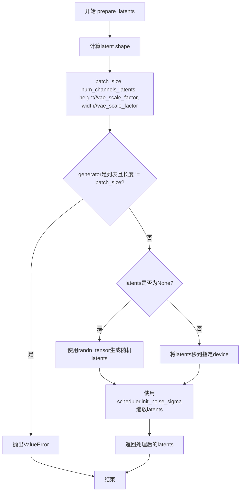

#### 带注释源码

```python
def prepare_latents(
    self,
    batch_size: int,
    num_channels_latents: int,
    height: int,
    width: int,
    dtype: torch.dtype,
    device: torch.device,
    generator: torch.Generator | list[torch.Generator] | None,
    latents: torch.Tensor | None = None,
) -> torch.Tensor:
    """
    准备用于Stable Diffusion去噪过程的latent变量。
    
    该方法是Stable Diffusion pipeline的核心组件之一，负责初始化或转换
    用于UNet去噪过程的latent张量。
    
    参数:
        batch_size: 批次大小，决定生成图像的数量
        num_channels_latents: latent空间的通道数，由UNet配置决定
        height: 目标图像高度（像素），会被VAE缩放因子整除
        width: 目标图像宽度（像素），会被VAE缩放因子整除
        dtype: 张量数据类型，影响计算精度和内存占用
        device: 计算设备，决定张量存储位置
        generator: 随机数生成器，用于可重复的生成结果
        latents: 可选的预生成latent，若提供则直接使用，否则随机生成
    
    返回:
        缩放后的latent张量，可直接用于UNet去噪
    """
    # 计算latent张量的shape，考虑VAE的缩放因子
    # VAE通常将图像缩小8倍（vae_scale_factor=8），因此latent尺寸为图像尺寸/8
    shape = (
        batch_size,
        num_channels_latents,
        int(height) // self.vae_scale_factor,
        int(width) // self.vae_scale_factor,
    )
    
    # 验证generator列表长度与批次大小的一致性
    # 当使用多个generator时，每个样本应有对应的generator
    if isinstance(generator, list) and len(generator) != batch_size:
        raise ValueError(
            f"You have passed a list of generators of length {len(generator)}, but requested an effective batch"
            f" size of {batch_size}. Make sure the batch size matches the length of the generators."
        )

    # 根据是否有预提供的latents来决定初始化方式
    if latents is None:
        # 使用randn_tensor生成符合正态分布的随机噪声作为初始latent
        # 这是Stable Diffusion的标准做法，从随机噪声开始去噪过程
        latents = randn_tensor(shape, generator=generator, device=device, dtype=dtype)
    else:
        # 如果提供了latents，确保其位于正确的设备上
        latents = latents.to(device)

    # 根据调度器的初始噪声标准差缩放latent
    # 不同的调度器（如DDIM、DDPM、PNDM）对噪声水平有不同要求
    # 这个缩放是确保latent与调度器期望的噪声水平一致的关键步骤
    latents = latents * self.scheduler.init_noise_sigma
    
    return latents
```


### `StableDiffusionAttendAndExcitePipeline._compute_max_attention_per_index`

该静态方法用于计算每个目标token的最大注意力值。它接收注意力图和目标索引列表，对注意力进行缩放和 softmax 处理，然后对每个目标位置应用高斯平滑以获取最大注意力值。

参数：

- `attention_maps`：`torch.Tensor`，来自 UNet 的注意力图
- `indices`：`list[int]`，需要计算最大注意力的 token 索引列表

返回值：`list[torch.Tensor]`，每个索引对应的最大注意力值列表

#### 流程图

```mermaid
flowchart TD
    A[Start: _compute_max_attention_per_index] --> B[Input: attention_maps, indices]
    B --> C[提取文本注意力: attention_maps[:, :, 1:-1]]
    C --> D[乘以100放大注意力权重]
    D --> E[在最后一个维度应用softmax]
    E --> F[索引偏移: index - 1]
    F --> G{遍历每个索引 i}
    G --> H[提取 attention_for_text[:, :, i]]
    H --> I[创建高斯平滑滤波器]
    I --> J[对注意力图应用高斯平滑]
    J --> K[计算平滑后最大值]
    K --> L[添加到 max_indices_list]
    L --> G
    G --> M{遍历结束}
    M --> N[返回 max_indices_list]
```

#### 带注释源码

```python
@staticmethod
def _compute_max_attention_per_index(
    attention_maps: torch.Tensor,
    indices: list[int],
) -> list[torch.Tensor]:
    """Computes the maximum attention value for each of the tokens we wish to alter."""
    # 提取文本部分的注意力图，排除起始和结束特殊token
    attention_for_text = attention_maps[:, :, 1:-1]
    
    # 放大注意力权重以便更好地传播梯度
    attention_for_text *= 100
    
    # 对注意力权重进行softmax归一化，使其和为1
    attention_for_text = torch.nn.functional.softmax(attention_for_text, dim=-1)

    # 由于移除了第一个token（通常是<startoftext>），需要对索引进行调整
    indices = [index - 1 for index in indices]

    # 用于存储每个目标token的最大注意力值
    max_indices_list = []
    
    # 遍历每个目标token索引
    for i in indices:
        # 提取当前token位置的注意力图
        image = attention_for_text[:, :, i]
        
        # 创建高斯平滑滤波器并移动到正确的设备上
        smoothing = GaussianSmoothing().to(attention_maps.device)
        
        # 对图像进行填充以处理边界情况
        input = F.pad(image.unsqueeze(0).unsqueeze(0), (1, 1, 1, 1), mode="reflect")
        
        # 应用高斯平滑减少噪声
        image = smoothing(input).squeeze(0).squeeze(0)
        
        # 获取平滑后的最大注意力值
        max_indices_list.append(image.max())
    
    return max_indices_list
```


### `StableDiffusionAttendAndExcitePipeline._aggregate_and_get_max_attention_per_token`

该方法聚合UNet的注意力图并计算每个目标token的最大注意力激活值，用于Attend-and-Excite机制中的损失计算，以引导模型关注特定的语义区域。

参数：

- `self`：`StableDiffusionAttendAndExcitePipeline` 实例，Pipeline对象本身
- `indices`：`list[int]`，需要计算最大注意力的目标token索引列表

返回值：`list[torch.Tensor]`，每个目标token对应的最大注意力值（标量张量）列表

#### 流程图

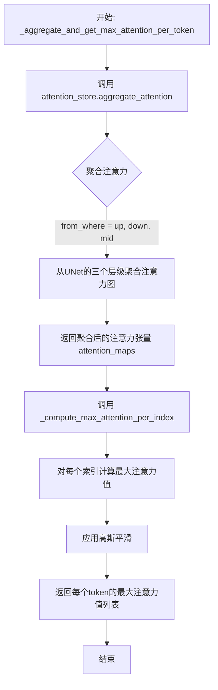

#### 带注释源码

```python
def _aggregate_and_get_max_attention_per_token(
    self,
    indices: list[int],
):
    """
    聚合并获取每个token的最大注意力值。
    
    该方法是Attend-and-Excite技术的核心组件，用于：
    1. 从UNet的多个层级聚合注意力图
    2. 计算每个目标token的最大注意力激活值
    3. 这些值随后用于计算损失以引导模型关注目标区域
    
    Args:
        indices: 需要计算最大注意力的token索引列表，这些索引对应于prompt中需要特别关注的词
        
    Returns:
        每个索引对应的最大注意力值列表，用于后续的损失计算
    """
    # 步骤1: 从UNet的up、down、mid三个注意力层级聚合注意力图
    # aggregate_attention方法会将这些层级的注意力图进行合并和平均
    attention_maps = self.attention_store.aggregate_attention(
        from_where=("up", "down", "mid"),
    )
    
    # 步骤2: 对聚合后的注意力图进行处理
    # _compute_max_attention_per_index会:
    # - 对注意力值乘以100并应用softmax以增强差异
    # - 对每个目标索引提取其注意力图
    # - 应用高斯平滑以减少噪声
    # - 返回每个目标token的最大注意力值
    max_attention_per_index = self._compute_max_attention_per_index(
        attention_maps=attention_maps,
        indices=indices,
    )
    
    # 返回每个目标token的最大注意力值列表
    # 这些值将用于_compute_loss计算损失
    return max_attention_per_index
```


### `StableDiffusionAttendAndExcitePipeline._compute_loss`

该方法为 Attend-and-Excite 技术的核心损失计算函数，通过获取每个目标 token 的最大注意力值，计算其与目标阈值（1.0）之间的差距，最终返回所有 token 损失中的最大值作为最终损失，以引导模型在生成过程中加强对目标对象的注意力。

参数：

- `max_attention_per_index`：`list[torch.Tensor]`，每个要更改的 token 对应的最大注意力值列表

返回值：`torch.Tensor`，计算得到的 attend-and-excite 损失值（标量张量）

#### 流程图

```mermaid
flowchart TD
    A[开始 _compute_loss] --> B[输入: max_attention_per_index<br/>list[torch.Tensor]]
    B --> C[遍历列表中的每个注意力值]
    C --> D[计算单个损失: max<br/>0<br/>1.0 - curr_max]
    D --> E[将所有损失存入 losses 列表]
    E --> F{是否遍历完所有注意力值?}
    F -->|否| C
    F -->|是| G[计算最终损失: loss = max<br/>losses]
    G --> H[返回 loss]
    H --> I[结束]
    
    style A fill:#e1f5fe
    style I fill:#e1f5fe
    style G fill:#fff3e0
```

#### 带注释源码

```python
@staticmethod
def _compute_loss(max_attention_per_index: list[torch.Tensor]) -> torch.Tensor:
    """
    使用每个 token 的最大注意力值计算 attend-and-excite 损失。
    
    Attend-and-Excite 的核心思想是确保目标 token（在 prompt 中需要强调的词）
    在生成过程中获得足够的注意力。该损失函数通过测量当前注意力值与理想值(1.0)
    之间的差距来量化注意力不足的程度。
    
    参数:
        max_attention_per_index: 包含每个目标 token 最大注意力值的列表。
                                每个元素对应一个需要增强注意力的 token。
    
    返回:
        torch.Tensor: 标量张量，表示所有目标 token 损失中的最大值。
                     选择最大值是为了确保至少有一个 token 达到注意力阈值。
    """
    # 遍历每个目标 token 的最大注意力值
    # 使用 max(0, 1.0 - curr_max) 计算损失：
    # - 如果 curr_max >= 1.0，损失为 0（注意力已足够）
    # - 如果 curr_max < 1.0，损失为正数（注意力不足的程度）
    losses = [max(0, 1.0 - curr_max) for curr_max in max_attention_per_index]
    
    # 返回所有损失中的最大值
    # 这样设计确保只要有一个 token 的注意力足够强，整个损失就可以被优化
    # 这是一种"至少一个"的策略，简化了优化过程
    loss = max(losses)
    return loss
```


### `StableDiffusionAttendAndExcitePipeline._update_latent`

根据损失更新latent的核心方法，通过反向传播计算梯度并沿梯度负方向更新latent，以优化生成图像中特定token的关注度。

参数：

- `latents`：`torch.Tensor`，需要更新的latent张量
- `loss`：`torch.Tensor`，用于计算梯度的损失值
- `step_size`：`float`，更新步长/学习率，控制每次更新的幅度

返回值：`torch.Tensor`，更新后的latent张量

#### 流程图

```mermaid
flowchart TD
    A[开始 _update_latent] --> B[输入: latents, loss, step_size]
    B --> C[启用loss梯度: loss.requires_grad_(True)]
    C --> D[计算梯度: torch.autograd.grad]
    D --> E[提取梯度: grad_cond = grad[0]]
    F[更新latent] --> G[latents = latents - step_size \* grad_cond]
    E --> F
    G --> H[返回更新后的latents]
    H --> I[结束]
```

#### 带注释源码

```python
@staticmethod
def _update_latent(latents: torch.Tensor, loss: torch.Tensor, step_size: float) -> torch.Tensor:
    """Update the latent according to the computed loss."""
    
    # 启用loss的梯度计算，以便autograd可以追踪其梯度
    # requires_grad_(True)原地修改tensor，启用梯度追踪
    grad_cond = torch.autograd.grad(
        loss.requires_grad_(True),  # 确保loss可以计算梯度
        [latents],                   # 计算latents相对于loss的梯度
        retain_graph=True            # 保留计算图，以便后续操作使用
    )[0]  # grad返回元组，取第一个元素（因为只对一个tensor求导）
    
    # 沿梯度负方向更新latent（梯度下降）
    # step_size相当于学习率，控制更新的步幅
    latents = latents - step_size * grad_cond
    
    # 返回更新后的latent，用于下一次迭代
    return latents
```


### `StableDiffusionAttendAndExcitePipeline._perform_iterative_refinement_step`

执行迭代细化步骤，根据注意力损失持续更新潜在编码，直到所有token达到目标阈值或达到最大迭代次数。该方法实现了Attend-and-Excite论文中的迭代细化机制。

参数：

- `self`：`StableDiffusionAttendAndExcitePipeline` 实例本身
- `latents`：`torch.Tensor`，当前的去噪潜在向量
- `indices`：`list[int]`，需要修改的token索引列表
- `loss`：`torch.Tensor`，当前计算的损失值
- `threshold`：`float`，目标阈值，用于判断是否达到期望的注意力激活水平
- `text_embeddings`：`torch.Tensor`，文本条件嵌入向量
- `step_size`：`float`，每次梯度更新的步长
- `t`：`int`，当前的扩散时间步
- `max_refinement_steps`：`int = 20`，最大迭代细化步数

返回值：`tuple[torch.Tensor, torch.Tensor, list[torch.Tensor]]`，包含更新后的损失值（`loss`）、更新后的潜在向量（`latents`）、以及每个token的最大注意力值列表（`max_attention_per_index`）

#### 流程图

```mermaid
flowchart TD
    A[开始迭代细化] --> B[设置迭代计数器 iteration = 0]
    B --> C{loss > target_loss?}
    C -->|Yes| D[iteration += 1]
    D --> E[克隆latents并设置梯度]
    E --> F[前向传播: UNet(latents, t, text_embeddings)]
    F --> G[清零梯度]
    G --> H[聚合注意力并获取每个token的最大注意力值]
    H --> I[计算损失]
    I --> J{loss != 0?}
    J -->|Yes| K[更新latents]
    J -->|No| L[记录日志]
    K --> L
    L --> M{iteration >= max_refinement_steps?}
    M -->|Yes| N[跳出循环]
    M -->|No| C
    C -->|No| O[最后一次前向传播]
    O --> P[获取最终损失和注意力]
    P --> Q[返回最终loss, latents, max_attention_per_index]
    N --> Q
```

#### 带注释源码

```python
def _perform_iterative_refinement_step(
    self,
    latents: torch.Tensor,
    indices: list[int],
    loss: torch.Tensor,
    threshold: float,
    text_embeddings: torch.Tensor,
    step_size: float,
    t: int,
    max_refinement_steps: int = 20,
):
    """
    Performs the iterative latent refinement introduced in the paper. Here, we continuously update the latent code
    according to our loss objective until the given threshold is reached for all tokens.
    """
    # 初始化迭代计数器
    iteration = 0
    # 计算目标损失值：当threshold=0.05时，target_loss = max(0, 1.0 - 0.05) = 0.95
    target_loss = max(0, 1.0 - threshold)
    
    # 迭代细化主循环：当损失值超过目标阈值时持续更新latents
    while loss > target_loss:
        iteration += 1

        # 克隆latents并设置为需要梯度，用于反向传播计算
        latents = latents.clone().detach().requires_grad_(True)
        
        # 执行UNet前向传播，获取噪声预测
        # 注意：此处不保存sample结果，仅用于触发注意力存储
        self.unet(latents, t, encoder_hidden_states=text_embeddings).sample
        
        # 清零UNet的梯度，为下一次前向传播做准备
        self.unet.zero_grad()

        # 获取每个目标token的最大注意力激活值
        # 通过聚合UNet各层的注意力图并提取指定indices的最大值
        max_attention_per_index = self._aggregate_and_get_max_attention_per_token(
            indices=indices,
        )

        # 根据最大注意力值计算Attend-and-Excite损失
        # 损失函数：max(0, 1.0 - max_attention)，鼓励注意力值接近1.0
        loss = self._compute_loss(max_attention_per_index)

        # 如果损失不为零，根据损失梯度更新latents
        if loss != 0:
            latents = self._update_latent(latents, loss, step_size)

        # 记录当前迭代的信息
        logger.info(f"\t Try {iteration}. loss: {loss}")

        # 检查是否超过最大迭代次数，若超过则跳出循环
        if iteration >= max_refinement_steps:
            logger.info(f"\t Exceeded max number of iterations ({max_refinement_steps})! ")
            break

    # 循环结束后，再次执行一次前向传播以获取最终的注意力分布
    # 这次不进行梯度更新，仅计算最终损失值
    # 克隆并设置梯度，为后续外部的梯度更新做准备
    latents = latents.clone().detach().requires_grad_(True)
    _ = self.unet(latents, t, encoder_hidden_states=text_embeddings).sample
    self.unet.zero_grad()

    # 获取最终的最大注意力值和损失
    max_attention_per_index = self._aggregate_and_get_max_attention_per_token(
        indices=indices,
    )
    loss = self._compute_loss(max_attention_per_index)
    
    # 记录最终损失值
    logger.info(f"\t Finished with loss of: {loss}")
    
    # 返回最终损失、更新后的latents和每个token的最大注意力值
    return loss, latents, max_attention_per_index
```


### `StableDiffusionAttendAndExcitePipeline.register_attention_control`

该方法用于注册注意力控制处理器，通过遍历UNet模型的所有注意力处理器，为每个交叉注意力层创建并设置`AttendExciteAttnProcessor`实例，以便在去噪过程中收集和聚合注意力图，实现Attend-and-Excite技术来增强特定 token 的注意力。

参数：
- 该方法无显式参数（仅包含 `self`）

返回值：`None`，无返回值

#### 流程图

```mermaid
flowchart TD
    A[开始 register_attention_control] --> B[初始化空字典 attn_procs]
    B --> C[初始化计数器 cross_att_count = 0]
    C --> D{遍历 self.unet.attn_processors.keys}
    D --> E{判断名称前缀}
    E -->|mid_block| F[place_in_unet = 'mid']
    E -->|up_blocks| G[place_in_unet = 'up']
    E -->|down_blocks| H[place_in_unet = 'down']
    E -->|其他| I[continue 跳过]
    F --> J[cross_att_count += 1]
    G --> J
    H --> J
    J --> K[创建 AttendExciteAttnProcessor]
    K --> L[attn_procs[name] = AttendExciteAttnProcessor]
    L --> D
    D --> M{处理完毕}
    M --> N[调用 self.unet.set_attn_processor(attn_procs)]
    N --> O[设置 attention_store.num_att_layers = cross_att_count]
    O --> P[结束]
    
    style I fill:#ffcccc
    style P fill:#ccffcc
```

#### 带注释源码

```python
def register_attention_control(self):
    """
    注册注意力控制处理器。
    
    该方法遍历UNet的所有注意力处理器，为每个交叉注意力层创建
    AttendExciteAttnProcessor实例，用于在去噪过程中收集注意力图，
    以实现Attend-and-Excite技术来增强特定token的注意力。
    """
    # 用于存储每个注意力处理器名称对应的处理器实例
    attn_procs = {}
    # 统计交叉注意力层的数量
    cross_att_count = 0
    
    # 遍历UNet中所有的注意力处理器名称
    for name in self.unet.attn_processors.keys():
        # 根据名称前缀判断该处理器在UNet中的位置
        if name.startswith("mid_block"):
            # 中间块位置
            place_in_unet = "mid"
        elif name.startswith("up_blocks"):
            # 上采样块位置
            place_in_unet = "up"
        elif name.startswith("down_blocks"):
            # 下采样块位置
            place_in_unet = "down"
        else:
            # 跳过其他类型的处理器（如非交叉注意力层）
            continue

        # 交叉注意力层计数加1
        cross_att_count += 1
        
        # 为该注意力层创建AttendExciteAttnProcessor实例
        # 参数:
        #   - attnstore: 注意力存储对象，用于收集和聚合注意力图
        #   - place_in_unet: 该注意力层在UNet中的位置（mid/up/down）
        attn_procs[name] = AttendExciteAttnProcessor(
            attnstore=self.attention_store, 
            place_in_unet=place_in_unet
        )

    # 使用自定义的注意力处理器替换UNet中原有的处理器
    self.unet.set_attn_processor(attn_procs)
    
    # 设置注意力存储器的层数属性，用于后续聚合注意力
    self.attention_store.num_att_layers = cross_att_count
```


### `StableDiffusionAttendAndExcitePipeline.get_indices`

获取prompt中每个token的索引映射，用于识别需要通过Attend-and-Excite方法修改的token位置。

参数：

- `self`：`StableDiffusionAttendAndExcitePipeline`，Pipeline实例本身
- `prompt`：`str`，需要解析的文本提示词

返回值：`dict[str, int]`，返回token索引到token文本的映射字典，键为索引位置，值为对应的token字符串

#### 流程图

```mermaid
flowchart TD
    A[输入 prompt 字符串] --> B[调用 self.tokenizer 进行分词]
    B --> C[获取 input_ids]
    C --> D[调用 convert_ids_to_tokens 转换为token列表]
    D --> E[使用 zip 和 enumerate 创建索引到token的映射]
    E --> F[返回 dict 类型的索引映射]
    
    style A fill:#e1f5fe
    style F fill:#e8f5e8
```

#### 带注释源码

```python
def get_indices(self, prompt: str) -> dict[str, int]:
    """
    Utility function to list the indices of the tokens you wish to alter.
    
    Args:
        prompt: The input text prompt to tokenize and get indices from.
        
    Returns:
        A dictionary mapping token indices to token strings.
        Example: {0: '<|startoftext|>', 1: 'a</w>', 2: 'cat</w>', ...}
    """
    # 使用CLIP tokenizer将prompt转换为token IDs
    ids = self.tokenizer(prompt).input_ids
    
    # 将token IDs转换为可读的token字符串
    # 然后使用zip和enumerate创建索引到token的映射字典
    # 字典键为索引位置(int)，值为token字符串(str)
    indices = {i: tok for tok, i in zip(self.tokenizer.convert_ids_to_tokens(ids), range(len(ids)))}
    
    return indices
```


### `StableDiffusionAttendAndExcitePipeline.__call__`

这是 Attend-and-Excite 流程的主生成方法，通过注意力操控增强特定token在生成图像中的表现力。该方法在去噪循环中计算目标token的最大注意力值，并使用梯度更新潜在表示，以确保这些token在最终图像中得到充分表现。

参数：

- `prompt`：`str | list[str]`，要引导图像生成的提示词，若未定义则需传递`prompt_embeds`
- `token_indices`：`list[int] | list[list[int]]`，要使用attend-and-excite修改的token索引
- `height`：`int | None`，生成图像的高度（像素），默认值为`self.unet.config.sample_size * self.vae_scale_factor`
- `width`：`int | None`，生成图像的宽度（像素），默认值为`self.unet.config.sample_size * self.vae_scale_factor`
- `num_inference_steps`：`int`，去噪步数，默认为50
- `guidance_scale`：`float`，引导比例，用于控制图像与文本提示的相关性，默认为7.5
- `negative_prompt`：`str | list[str] | None`，负面提示词，用于指导不包含的内容
- `num_images_per_prompt`：`int`，每个提示词生成的图像数量，默认为1
- `eta`：`float`，DDIM调度器的参数η，默认为0.0
- `generator`：`torch.Generator | list[torch.Generator] | None`，用于生成确定性结果的随机生成器
- `latents`：`torch.Tensor | None`，预生成的噪声潜在向量
- `prompt_embeds`：`torch.Tensor | None`，预生成的文本嵌入
- `negative_prompt_embeds`：`torch.Tensor | None`，预生成的负面文本嵌入
- `output_type`：`str`，输出格式，可选"pil"或np.array，默认为"pil"
- `return_dict`：`bool`，是否返回`StableDiffusionPipelineOutput`，默认为True
- `callback`：`Callable | None`，每步调用的回调函数
- `callback_steps`：`int`，回调函数调用频率，默认为1
- `cross_attention_kwargs`：`dict | None`，传递给注意力处理器的kwargs
- `max_iter_to_alter`：`int`，应用attend-and-excite的去噪步数，默认为25
- `thresholds`：`dict`，迭代细化的阈值字典，默认为`{0: 0.05, 10: 0.5, 20: 0.8}`
- `scale_factor`：`int`，每次attend-and-excite更新的步长缩放因子，默认为20
- `attn_res`：`tuple | None`，语义注意力图的2D分辨率，默认为`(16, 16)`
- `clip_skip`：`int | None`，CLIP计算提示嵌入时跳过的层数

返回值：`StableDiffusionPipelineOutput | tuple`，若`return_dict`为True返回`StableDiffusionPipelineOutput`，否则返回图像列表和NSFW检测布尔值元组

#### 流程图

```mermaid
flowchart TD
    A[开始 __call__] --> B[设置默认高度和宽度]
    B --> C[检查输入参数]
    C --> D[确定批次大小]
    D --> E{是否使用分类器自由引导}
    E -->|Yes| F[编码提示词和负面提示词]
    E -->|No| G[仅编码提示词]
    F --> H[拼接无条件嵌入和条件嵌入]
    G --> H
    H --> I[设置去噪 timesteps]
    I --> J[准备潜在变量 latents]
    J --> K[准备额外步骤参数]
    K --> L[初始化AttentionStore和注意力控制]
    L --> M[计算步长缩放范围]
    M --> N[处理token_indices]
    N --> O[进入去噪循环]
    
    O --> P{当前步 < max_iter_to_alter?}
    P -->|Yes| Q[启用梯度计算]
    Q --> R[对每个latent进行前向传播]
    R --> S[获取目标token的最大注意力]
    S --> T[计算loss]
    T --> U{当前步在thresholds中且loss超过阈值?}
    U -->|Yes| V[执行迭代细化步骤]
    U -->|No| W{当前步 < max_iter_to_alter?}
    W -->|Yes| X[执行梯度更新 latent]
    W -->|No| Y[跳过梯度更新]
    V --> X
    X --> Z[收集更新后的latents]
    P -->|No| AA[不执行attend-and-excite]
    AA --> AB[扩展latents进行分类器自由引导]
    
    Z --> AB
    Y --> AB
    
    AB --> AC[缩放模型输入]
    AC --> AD[预测噪声残差]
    AD --> AE{使用分类器自由引导?}
    AE -->|Yes| AF[分离无条件和文本预测]
    AE -->|No| AG[直接使用预测噪声]
    AF --> AH[计算引导后的噪声]
    AG --> AH
    AH --> AI[调度器执行一步去噪]
    AI --> AJ[调用回调函数]
    AJ --> AK{是否还有timesteps?}
    AK -->|Yes| O
    AK -->|No| AL[后处理]
    
    AL --> AM{output_type是否为latent?}
    AM -->|No| AN[VAE解码]
    AN --> AO[运行安全检查器]
    AM -->|Yes| AP[直接使用latents]
    AO --> AQ[后处理图像]
    AP --> AQ
    AQ --> AR[恢复原始注意力处理器]
    AR --> AS{return_dict是否为True?}
    AS -->|Yes| AT[返回StableDiffusionPipelineOutput]
    AS -->|No| AU[返回元组]
```

#### 带注释源码

```python
@torch.no_grad()
@replace_example_docstring(EXAMPLE_DOC_STRING)
def __call__(
    self,
    prompt: str | list[str],
    token_indices: list[int] | list[list[int]],
    height: int | None = None,
    width: int | None = None,
    num_inference_steps: int = 50,
    guidance_scale: float = 7.5,
    negative_prompt: str | list[str] | None = None,
    num_images_per_prompt: int = 1,
    eta: float = 0.0,
    generator: torch.Generator | list[torch.Generator] | None = None,
    latents: torch.Tensor | None = None,
    prompt_embeds: torch.Tensor | None = None,
    negative_prompt_embeds: torch.Tensor | None = None,
    output_type: str | None = "pil",
    return_dict: bool = True,
    callback: Callable[[int, int, torch.Tensor], None] | None = None,
    callback_steps: int = 1,
    cross_attention_kwargs: dict[str, Any] | None = None,
    max_iter_to_alter: int = 25,
    thresholds: dict = {0: 0.05, 10: 0.5, 20: 0.8},
    scale_factor: int = 20,
    attn_res: tuple[int] | None = (16, 16),
    clip_skip: int | None = None,
):
    r"""
    The call function to the pipeline for generation.

    Args:
        prompt (`str` or `list[str]`, *optional*):
            The prompt or prompts to guide image generation. If not defined, you need to pass `prompt_embeds`.
        token_indices (`list[int]`):
            The token indices to alter with attend-and-excite.
        height (`int`, *optional*, defaults to `self.unet.config.sample_size * self.vae_scale_factor`):
            The height in pixels of the generated image.
        width (`int`, *optional*, defaults to `self.unet.config.sample_size * self.vae_scale_factor`):
            The width in pixels of the generated image.
        num_inference_steps (`int`, *optional*, defaults to 50):
            The number of denoising steps. More denoising steps usually lead to a higher quality image at the
            expense of slower inference.
        guidance_scale (`float`, *optional*, defaults to 7.5):
            A higher guidance scale value encourages the model to generate images closely linked to the text
            `prompt` at the expense of lower image quality. Guidance scale is enabled when `guidance_scale > 1`.
        negative_prompt (`str` or `list[str]`, *optional*):
            The prompt or prompts to guide what to not include in image generation. If not defined, you need to
            pass `negative_prompt_embeds` instead. Ignored when not using guidance (`guidance_scale < 1`).
        num_images_per_prompt (`int`, *optional*, defaults to 1):
            The number of images to generate per prompt.
        eta (`float`, *optional*, defaults to 0.0):
            Corresponds to parameter eta (η) from the [DDIM](https://huggingface.co/papers/2010.02502) paper. Only
            applies to the [`~schedulers.DDIMScheduler`], and is ignored in other schedulers.
        generator (`torch.Generator` or `list[torch.Generator]`, *optional*):
            A [`torch.Generator`](https://pytorch.org/docs/stable/generated/torch.Generator.html) to make
            generation deterministic.
        latents (`torch.Tensor`, *optional*):
            Pre-generated noisy latents sampled from a Gaussian distribution, to be used as inputs for image
            generation. Can be used to tweak the same generation with different prompts. If not provided, a latents
            tensor is generated by sampling using the supplied random `generator`.
        prompt_embeds (`torch.Tensor`, *optional*):
            Pre-generated text embeddings. Can be used to easily tweak text inputs (prompt weighting). If not
            provided, text embeddings are generated from the `prompt` input argument.
        negative_prompt_embeds (`torch.Tensor`, *optional*):
            Pre-generated negative text embeddings. Can be used to easily tweak text inputs (prompt weighting). If
            not provided, `negative_prompt_embeds` are generated from the `negative_prompt` input argument.
        output_type (`str`, *optional*, defaults to `"pil"`):
            The output format of the generated image. Choose between `PIL.Image` or `np.array`.
        return_dict (`bool`, *optional*, defaults to `True`):
            Whether or not to return a [`~pipelines.stable_diffusion.StableDiffusionPipelineOutput`] instead of a
            plain tuple.
        callback (`Callable`, *optional*):
            A function that calls every `callback_steps` steps during inference. The function is called with the
            following arguments: `callback(step: int, timestep: int, latents: torch.Tensor)`.
        callback_steps (`int`, *optional*, defaults to 1):
            The frequency at which the `callback` function is called. If not specified, the callback is called at
            every step.
        cross_attention_kwargs (`dict`, *optional*):
            A kwargs dictionary that if specified is passed along to the [`AttentionProcessor`] as defined in
            [`self.processor`](https://github.com/huggingface/diffusers/blob/main/src/diffusers/models/attention_processor.py).
        max_iter_to_alter (`int`, *optional*, defaults to `25`):
            Number of denoising steps to apply attend-and-excite. The `max_iter_to_alter` denoising steps are when
            attend-and-excite is applied. For example, if `max_iter_to_alter` is `25` and there are a total of `30`
            denoising steps, the first `25` denoising steps applies attend-and-excite and the last `5` will not.
        thresholds (`dict`, *optional*, defaults to `{0: 0.05, 10: 0.5, 20: 0.8}`):
            Dictionary defining the iterations and desired thresholds to apply iterative latent refinement in.
        scale_factor (`int`, *optional*, default to 20):
            Scale factor to control the step size of each attend-and-excite update.
        attn_res (`tuple`, *optional*, default computed from width and height):
            The 2D resolution of the semantic attention map.
        clip_skip (`int`, *optional*):
            Number of layers to be skipped from CLIP while computing the prompt embeddings. A value of 1 means that
            the output of the pre-final layer will be used for computing the prompt embeddings.

    Examples:

    Returns:
        [`~pipelines.stable_diffusion.StableDiffusionPipelineOutput`] or `tuple`:
            If `return_dict` is `True`, [`~pipelines.stable_diffusion.StableDiffusionPipelineOutput`] is returned,
            otherwise a `tuple` is returned where the first element is a list with the generated images and the
            second element is a list of `bool`s indicating whether the corresponding generated image contains
            "not-safe-for-work" (nsfw) content.
    """

    # 0. Default height and width to unet
    # 如果未指定高度和宽度，则使用UNet配置的样本大小乘以VAE缩放因子
    height = height or self.unet.config.sample_size * self.vae_scale_factor
    width = width or self.unet.config.sample_size * self.vae_scale_factor

    # 1. Check inputs. Raise error if not correct
    # 验证输入参数的有效性
    self.check_inputs(
        prompt,
        token_indices,
        height,
        width,
        callback_steps,
        negative_prompt,
        prompt_embeds,
        negative_prompt_embeds,
    )

    # 2. Define call parameters
    # 根据输入确定批次大小
    if prompt is not None and isinstance(prompt, str):
        batch_size = 1
    elif prompt is not None and isinstance(prompt, list):
        batch_size = len(prompt)
    else:
        batch_size = prompt_embeds.shape[0]

    device = self._execution_device
    # here `guidance_scale` is defined analog to the guidance weight `w` of equation (2)
    # of the Imagen paper: https://huggingface.co/papers/2205.11487 . `guidance_scale = 1`
    # corresponds to doing no classifier free guidance.
    # 当guidance_scale > 1时启用分类器自由引导
    do_classifier_free_guidance = guidance_scale > 1.0

    # 3. Encode input prompt
    # 编码输入提示词为文本嵌入
    prompt_embeds, negative_prompt_embeds = self.encode_prompt(
        prompt,
        device,
        num_images_per_prompt,
        do_classifier_free_guidance,
        negative_prompt,
        prompt_embeds=prompt_embeds,
        negative_prompt_embeds=negative_prompt_embeds,
        clip_skip=clip_skip,
    )
    # For classifier free guidance, we need to do two forward passes.
    # Here we concatenate the unconditional and text embeddings into a single batch
    # to avoid doing two forward passes
    # 为了分类器自由引导，将无条件嵌入和文本嵌入拼接
    if do_classifier_free_guidance:
        prompt_embeds = torch.cat([negative_prompt_embeds, prompt_embeds])

    # 4. Prepare timesteps
    # 设置去噪调度器的时间步
    self.scheduler.set_timesteps(num_inference_steps, device=device)
    timesteps = self.scheduler.timesteps

    # 5. Prepare latent variables
    # 准备潜在变量
    num_channels_latents = self.unet.config.in_channels
    latents = self.prepare_latents(
        batch_size * num_images_per_prompt,
        num_channels_latents,
        height,
        width,
        prompt_embeds.dtype,
        device,
        generator,
        latents,
    )

    # 6. Prepare extra step kwargs. TODO: Logic should ideally just be moved out of the pipeline
    # 准备调度器额外参数
    extra_step_kwargs = self.prepare_extra_step_kwargs(generator, eta)

    # 计算注意力图分辨率
    if attn_res is None:
        attn_res = int(np.ceil(width / 32)), int(np.ceil(height / 32))
    # 初始化注意力存储器和注意力控制器
    self.attention_store = AttentionStore(attn_res)
    original_attn_proc = self.unet.attn_processors
    self.register_attention_control()

    # default config for step size from original repo
    # 从原始仓库的默认配置计算步长缩放范围
    scale_range = np.linspace(1.0, 0.5, len(self.scheduler.timesteps))
    step_size = scale_factor * np.sqrt(scale_range)

    # 提取文本嵌入（条件部分）
    text_embeddings = (
        prompt_embeds[batch_size * num_images_per_prompt :] if do_classifier_free_guidance else prompt_embeds
    )

    # 处理token_indices格式
    if isinstance(token_indices[0], int):
        token_indices = [token_indices]

    # 为每个生成的图像扩展索引
    indices = []
    for ind in token_indices:
        indices = indices + [ind] * num_images_per_prompt

    # 7. Denoising loop
    # 计算预热步数
    num_warmup_steps = len(timesteps) - num_inference_steps * self.scheduler.order
    with self.progress_bar(total=num_inference_steps) as progress_bar:
        for i, t in enumerate(timesteps):
            # Attend and excite process
            # 启用梯度计算以进行注意力优化
            with torch.enable_grad():
                latents = latents.clone().detach().requires_grad_(True)
                updated_latents = []
                # 对每个latent和对应的token索引进行迭代
                for latent, index, text_embedding in zip(latents, indices, text_embeddings):
                    # Forward pass of denoising with text conditioning
                    # 添加批次维度
                    latent = latent.unsqueeze(0)
                    text_embedding = text_embedding.unsqueeze(0)

                    # 执行UNet前向传播以获取注意力图
                    self.unet(
                        latent,
                        t,
                        encoder_hidden_states=text_embedding,
                        cross_attention_kwargs=cross_attention_kwargs,
                    ).sample
                    self.unet.zero_grad()

                    # Get max activation value for each subject token
                    # 获取每个目标token的最大注意力值
                    max_attention_per_index = self._aggregate_and_get_max_attention_per_token(
                        indices=index,
                    )

                    # 计算attend-and-excite损失
                    loss = self._compute_loss(max_attention_per_index=max_attention_per_index)

                    # If this is an iterative refinement step, verify we have reached the desired threshold for all
                    # 如果是迭代细化步骤，验证是否达到所有token的阈值
                    if i in thresholds.keys() and loss > 1.0 - thresholds[i]:
                        loss, latent, max_attention_per_index = self._perform_iterative_refinement_step(
                            latents=latent,
                            indices=index,
                            loss=loss,
                            threshold=thresholds[i],
                            text_embeddings=text_embedding,
                            step_size=step_size[i],
                            t=t,
                        )

                    # Perform gradient update
                    # 在指定的步数内执行梯度更新
                    if i < max_iter_to_alter:
                        if loss != 0:
                            latent = self._update_latent(
                                latents=latent,
                                loss=loss,
                                step_size=step_size[i],
                            )
                        logger.info(f"Iteration {i} | Loss: {loss:0.4f}")

                    updated_latents.append(latent)

                # 合并更新后的latents
                latents = torch.cat(updated_latents, dim=0)

            # expand the latents if we are doing classifier free guidance
            # 扩展latents以进行分类器自由引导
            latent_model_input = torch.cat([latents] * 2) if do_classifier_free_guidance else latents
            latent_model_input = self.scheduler.scale_model_input(latent_model_input, t)

            # predict the noise residual
            # 预测噪声残差
            noise_pred = self.unet(
                latent_model_input,
                t,
                encoder_hidden_states=prompt_embeds,
                cross_attention_kwargs=cross_attention_kwargs,
            ).sample

            # perform guidance
            # 执行分类器自由引导
            if do_classifier_free_guidance:
                noise_pred_uncond, noise_pred_text = noise_pred.chunk(2)
                noise_pred = noise_pred_uncond + guidance_scale * (noise_pred_text - noise_pred_uncond)

            # compute the previous noisy sample x_t -> x_t-1
            # 使用调度器计算去噪后的样本
            latents = self.scheduler.step(noise_pred, t, latents, **extra_step_kwargs).prev_sample

            # call the callback, if provided
            # 调用回调函数
            if i == len(timesteps) - 1 or ((i + 1) > num_warmup_steps and (i + 1) % self.scheduler.order == 0):
                progress_bar.update()
                if callback is not None and i % callback_steps == 0:
                    step_idx = i // getattr(self.scheduler, "order", 1)
                    callback(step_idx, t, latents)

            # PyTorch XLA 支持
            if XLA_AVAILABLE:
                xm.mark_step()

    # 8. Post-processing
    # 后处理
    if not output_type == "latent":
        # 使用VAE解码潜在表示到图像
        image = self.vae.decode(latents / self.vae.config.scaling_factor, return_dict=False)[0]
        # 运行安全检查器
        image, has_nsfw_concept = self.run_safety_checker(image, device, prompt_embeds.dtype)
    else:
        # 直接输出潜在表示
        image = latents
        has_nsfw_concept = None

    # 确定是否需要反归一化
    if has_nsfw_concept is None:
        do_denormalize = [True] * image.shape[0]
    else:
        do_denormalize = [not has_nsfw for has_nsfw in has_nsfw_concept]

    # 后处理图像
    image = self.image_processor.postprocess(image, output_type=output_type, do_denormalize=do_denormalize)
    # 释放模型钩子
    self.maybe_free_model_hooks()
    # make sure to set the original attention processors back
    # 恢复原始注意力处理器
    self.unet.set_attn_processor(original_attn_proc)

    if not return_dict:
        return (image, has_nsfw_concept)

    # 返回管道输出对象
    return StableDiffusionPipelineOutput(images=image, nsfw_content_detected=has_nsfw_concept)
```


### `GaussianSmoothing.__init__`

初始化高斯平滑卷积核参数，用于对输入张量应用高斯模糊滤波。

参数：

- `channels`：`int`，输入和输出张量的通道数，默认为 1。
- `kernel_size`：`int`，高斯核的大小，默认为 3。如果是整数，则扩展为与维度数相同的列表。
- `sigma`：`float`，高斯核的标准差，默认为 0.5。如果是浮点数，则扩展为与维度数相同的列表。
- `dim`：`int`，数据的维度数，默认为 2。支持 1、2、3 维。

返回值：无（`None`），该方法为构造函数，仅初始化对象状态。

#### 流程图

```mermaid
flowchart TD
    A[开始 __init__] --> B{调用父类初始化}
    B --> C{检查 kernel_size 类型}
    C -->|整数| D[将 kernel_size 扩展为 dim 维列表]
    C -->|列表| E[直接使用列表]
    D --> F{检查 sigma 类型}
    E --> F
    F -->|浮点数| G[将 sigma 扩展为 dim 维列表]
    F -->|列表| H[直接使用列表]
    G --> I[创建 meshgrid 网格]
    H --> I
    I --> J[遍历每个维度计算高斯核]
    J --> K[计算高斯函数值]
    K --> L[归一化使核值之和为1]
    L --> M[调整形状为深度卷积权重]
    M --> N[注册 weight 为 buffer]
    N --> O{根据 dim 选择卷积函数}
    O -->|dim=1| P[选择 conv1d]
    O -->|dim=2| Q[选择 conv2d]
    O -->|dim=3| R[选择 conv3d]
    O -->|其他| S[抛出异常]
    P --> T[结束]
    Q --> T
    R --> T
    S --> T
```

#### 带注释源码

```python
def __init__(
    self,
    channels: int = 1,
    kernel_size: int = 3,
    sigma: float = 0.5,
    dim: int = 2,
):
    """
    初始化高斯平滑卷积核参数
    
    参数:
        channels: 输入输出通道数
        kernel_size: 高斯核大小
        sigma: 高斯核标准差
        dim: 数据维度 (1/2/3)
    """
    # 调用父类 torch.nn.Module 的初始化方法
    super().__init__()

    # 如果 kernel_size 是整数，则扩展为与维度数相同的列表
    # 例如 dim=3, kernel_size=3 -> [3, 3, 3]
    if isinstance(kernel_size, int):
        kernel_size = [kernel_size] * dim
    
    # 如果 sigma 是浮点数，则扩展为与维度数相同的列表
    # 例如 dim=2, sigma=0.5 -> [0.5, 0.5]
    if isinstance(sigma, float):
        sigma = [sigma] * dim

    # 高斯核是各维度高斯函数的乘积
    # 初始化核值为 1（乘法单位元）
    kernel = 1
    
    # 创建网格坐标，用于计算高斯函数
    # torch.meshgrid 生成每个维度的坐标张量
    meshgrids = torch.meshgrid([torch.arange(size, dtype=torch.float32) for size in kernel_size])
    
    # 遍历每个维度，计算该维度的高斯函数值并累乘
    for size, std, mgrid in zip(kernel_size, sigma, meshgrids):
        # 计算当前维度的中心点（均值）
        mean = (size - 1) / 2
        # 应用高斯函数公式: f(x) = 1/(σ*√(2π)) * exp(-((x-μ)/(2σ))²)
        # 并累乘到核值上
        kernel *= 1 / (std * math.sqrt(2 * math.pi)) * torch.exp(-(((mgrid - mean) / (2 * std)) ** 2))

    # 确保高斯核所有值之和为 1（归一化）
    kernel = kernel / torch.sum(kernel)

    # 调整形状为深度卷积权重格式
    # 从 (kernel_size, kernel_size, ...) 变为 (1, 1, kernel_size, kernel_size, ...)
    kernel = kernel.view(1, 1, *kernel.size())
    
    # 重复核权重以匹配输入通道数（深度卷积）
    # channels 个通道，每个通道使用相同的高斯核
    kernel = kernel.repeat(channels, *[1] * (kernel.dim() - 1))

    # 将核权重注册为 buffer（非模型参数，但会随设备移动）
    self.register_buffer("weight", kernel)
    
    # 设置深度卷积的分组数等于通道数
    self.groups = channels

    # 根据维度选择对应的卷积函数
    if dim == 1:
        self.conv = F.conv1d  # 一维卷积
    elif dim == 2:
        self.conv = F.conv2d  # 二维卷积（图像）
    elif dim == 3:
        self.conv = F.conv3d  # 三维卷积（体数据）
    else:
        # 不支持的维度，抛出运行时错误
        raise RuntimeError("Only 1, 2 and 3 dimensions are supported. Received {}.".format(dim))
```


### GaussianSmoothing.forward()

应用高斯平滑滤波到输入的张量上，使用深度卷积对输入的每个通道分别进行高斯滤波处理。

参数：

- `input`：`torch.Tensor`，输入的要应用高斯滤波的张量，可以是1D、2D或3D张量

返回值：`torch.Tensor`，滤波后的输出张量

#### 流程图

```mermaid
flowchart TD
    A[输入张量 input] --> B[调用深度卷积]
    B --> C[使用存储的高斯核权重]
    C --> D[按通道分组进行卷积]
    D --> E[输出滤波后的张量]
```

#### 带注释源码

```python
def forward(self, input):
    """
    Arguments:
    Apply gaussian filter to input.
        input (torch.Tensor): Input to apply gaussian filter on.
    Returns:
        filtered (torch.Tensor): Filtered output.
    """
    # 使用深度卷积对输入进行高斯滤波
    # self.conv 是根据维度选择的卷积函数（conv1d/conv2d/conv3d）
    # self.weight 是预计算的高斯核权重
    # self.groups 等于通道数，实现深度卷积（每个通道独立滤波）
    # 确保权重数据类型与输入张量匹配
    return self.conv(input, weight=self.weight.to(input.dtype), groups=self.groups)
```

## 关键组件


### AttentionStore

用于在扩散去噪过程中存储和聚合注意力图的类。它收集来自UNet不同层级（down、mid、up）的注意力信息，支持计算平均注意力和在指定分辨率下聚合注意力，是Attend-and-Excite技术的核心数据存储组件。

### AttendExciteAttnProcessor

自定义注意力处理器，继承自标准Attention模块。在前向传播时拦截并存储注意力概率图，以便后续进行注意力聚合和损失计算，实现了对UNet内部注意力机制的无缝劫持。

### StableDiffusionAttendAndExcitePipeline

主生成管道类，继承自DiffusionPipeline和StableDiffusionMixin。实现了完整的文本到图像生成流程，并特别集成了Attend-and-Excite算法，通过迭代优化潜在编码来增强生成图像中特定token的语义对应性。

### GaussianSmoothing

高斯平滑滤波器模块，用于对注意力图进行模糊处理以提取更稳定的最大激活值。通过构建高斯核并使用深度可分离卷积对输入进行滤波，有助于减少注意力图的噪声并获得更平滑的响应峰值。

### _compute_max_attention_per_index

静态方法，计算每个目标token的最大注意力值。对注意力图应用softmax和100倍缩放以增强对比度，然后使用高斯平滑提取每个指定索引位置的最大激活值。

### _aggregate_and_get_max_attention_per_token

聚合UNet各层级的注意力图并计算每个目标token的最大激活值。调用aggregate_attention获取统一的注意力表示，然后调用_compute_max_attention_per_index计算损失所需的激活值。

### _compute_loss

静态方法，计算attend-and-excite损失函数。基于每个目标token的最大注意力值，损失定义为max(0, 1 - max_attention)，旨在强制模型提高目标区域的注意力响应。

### _update_latent

静态方法，根据计算的损失梯度更新潜在编码。使用torch.autograd.grad计算损失对潜在编码的梯度，并按照指定的步长进行梯度下降更新，实现对生成过程的语义引导。

### _perform_iterative_refinement_step

执行迭代细化过程的内部方法。当损失超过阈值时循环迭代，不断重新计算注意力、损失并更新潜在编码，直到达到目标损失或最大迭代次数，用于精细化控制生成结果。

### register_attention_control

注册自定义注意力处理器的管道方法。遍历UNet的所有注意力处理器，替换为AttendExciteAttnProcessor实例以启用注意力图收集功能，同时记录注意力层数量供后续聚合使用。

### get_indices

实用函数，返回给定prompt中每个token的索引和token本身的映射关系。用于帮助用户确定需要通过token_indices参数指定要增强的token位置。

### check_inputs

输入验证方法，检查管道调用参数的有效性。包括图像尺寸对齐、callback_steps正整数、prompt与prompt_embeds互斥、indices格式验证以及batch_size一致性检查。

### prepare_latents

准备初始潜在编码的方法。根据指定的batch_size、通道数、图像尺寸生成或使用提供的随机潜在编码，并按scheduler要求的初始噪声标准差进行缩放。

### encode_prompt

编码文本prompt为文本encoder隐藏状态的完整方法。支持LoRA权重调整、文本反转embedding、clip_skip跳过层数等功能，返回prompt_embeds和negative_prompt_embeds元组。


## 问题及建议


### 已知问题

-   **性能问题 - 循环处理token索引**: 在`__call__`方法中，对于每个prompt和每个要生成的图像，都是在循环中逐个处理`token_indices`，当`num_images_per_prompt`很大时会导致显著的性能瓶颈。
-   **内存问题 - 梯度计算保留图**: `_update_latent`方法中使用`retain_graph=True`可能导致梯度计算时内存占用过高，尤其是在多次迭代的优化过程中。
-   **资源泄漏风险 - Attention Processor恢复**: 虽然在`__call__`末尾调用`set_attn_processor`恢复原始处理器，但如果在推理过程中发生异常，可能导致UNet的attention processors无法正确恢复。
-   **重复实例化 - GaussianSmoothing**: 在`_compute_max_attention_per_index`方法内部每次调用都创建新的`GaussianSmoothing`实例，而不是作为类属性或模块级变量复用，造成不必要的开销。
-   **类型提示不完整**: `thresholds`参数的默认值为`{0: 0.05, 10: 0.5, 20: 0.8}`，但函数签名中仅标注为`dict`类型，缺乏更精确的类型定义如`dict[int, float]`。
-   **代码冗余 - 已被弃用的方法**: `_encode_prompt`方法标记为deprecated但仍保留完整实现，增加了代码维护负担且容易造成混淆。
-   **文档错误 - 不完整的文档字符串**: `get_indices`方法的文档字符串截断（"alte"应为"alter"），影响代码可读性和可维护性。
-   **魔法数字**: 代码中存在多处硬编码的数值（如`scale_factor=20`、`max_iter_to_alter=25`），缺乏对这些超参数为何如此设置的解释。

### 优化建议

-   **批量处理优化**: 重构`__call__`方法中的token索引处理逻辑，将同一prompt的多个图像合并处理以减少循环次数，或使用向量化操作替代逐个迭代。
-   **异常安全的资源管理**: 使用`try/finally`块确保即使发生异常也能正确恢复UNet的attention processors，或考虑使用上下文管理器。
-   **缓存优化器对象**: 将`GaussianSmoothing`实例作为`AttentionStore`类的属性或模块级变量，避免在每次调用`_compute_max_attention_per_index`时重新创建。
-   **移除弃用代码**: 考虑移除`_encode_prompt`方法或在后续版本中完全删除，避免代码库中存在过时的实现。
-   **完善类型提示**: 补充`thresholds`等参数的精确类型提示（如`dict[int, float]`），提高代码的静态类型检查能力。
-   **提取魔法数字**: 将硬编码的超参数值提取为类属性或配置常量，并添加文档说明其作用和调优建议。
-   **修复文档字符串**: 修正`get_indices`方法的文档字符串，确保拼写完整且语义清晰。

## 其它


### 设计目标与约束

本Pipeline的设计目标是通过Attend-and-Excite技术增强文本到图像生成过程中特定token的注意力，从而改善生成图像对文本描述的忠实度。核心约束包括：1) 仅支持Stable Diffusion系列模型；2) 需要GPU显存至少8GB；3) 最大支持1024x1024分辨率；4) token_indices必须在有效范围内；5) max_iter_to_alter必须小于等于num_inference_steps。

### 错误处理与异常设计

主要异常场景包括：1) height/width不为8的倍数时抛出ValueError；2) callback_steps为非正数时抛出ValueError；3) prompt和prompt_embeds同时传入时抛出ValueError；4) indices类型不符合要求时抛出TypeError；5) batch_size不匹配时抛出ValueError；6) safety_checker为None但requires_safety_checker为True时给出警告；7) feature_extractor为None但safety_checker不为None时抛出ValueError。

### 数据流与状态机

Pipeline的数据流如下：1) 输入prompt经过tokenizer转为token ids；2) text_encoder将token ids编码为prompt_embeds；3) latents通过randn_tensor初始化为噪声；4) 在每个denoising step中，latents经过UNet预测噪声；5) 对于前max_iter_to_alter步，执行Attend-and-Excite操作：聚合注意力图、计算loss、更新latents；6) scheduler根据noise_pred计算前一时刻的latents；7) 最终latents通过VAE decode为图像；8) safety_checker检查生成图像是否安全。

### 外部依赖与接口契约

主要依赖包括：1) torch>=1.9.0；2) transformers库提供CLIPTextModel和CLIPTokenizer；3) diffusers库提供基础Pipeline类、UNet2DConditionModel、AutoencoderKL等；4) numpy用于数值计算；5) KarrasDiffusionSchedulers用于调度。接口契约：encode_prompt返回(prompt_embeds, negative_prompt_embeds)元组；prepare_latents返回torch.Tensor；__call__返回StableDiffusionPipelineOutput或tuple。

### 性能考虑与优化空间

性能瓶颈：1) 每次迭代都需要前向传播计算attention；2) 梯度更新涉及autograd可能占用大量显存；3) iterative refinement步骤最多20次迭代。优化建议：1) 可使用gradient checkpointing减少显存；2) 可缓存text_embeddings避免重复计算；3) 可使用torch.compile加速；4) 可实现动态threshold调整减少迭代次数；5) 可使用xformers替代默认attention processor。

### 安全性考虑

safety_checker用于检测NSFW内容，但可能被攻击绕过。建议：1) 生产环境保持safety_checker启用；2) 对用户输入进行过滤；3) 添加水印或元数据标记AI生成图像；4) 遵守Hugging Face使用政策；5) 记录生成日志用于审计。

### 配置参数说明

关键配置参数：1) vae_scale_factor由vae.config.block_out_channels计算；2) model_cpu_offload_seq定义CPU offload顺序"text_encoder->unet->vae"；3) _optional_components包含safety_checker和feature_extractor；4) _last_supported_version = "0.33.1"；5) requires_safety_checker默认为True；6) attn_res默认根据width/height计算为np.ceil(width/32), np.ceil(height/32)。

### 版本兼容性说明

代码标记_last_supported_version = "0.33.1"，与diffusers 0.33.1版本兼容。_encode_prompt方法已标记为deprecated，将在1.0.0版本移除，建议使用encode_prompt。decode_latents方法同样标记为deprecated。兼容的scheduler包括DDIMScheduler、LMSDiscreteScheduler、PNDMScheduler等KarrasDiffusionSchedulers。

### 内存管理与资源释放

Pipeline使用model_cpu_offload_seq进行顺序offload。attention_store在每次__call__时重新创建。original_attn_proc在最后通过set_attn_processor恢复。可能_free_model_hooks在postprocess后调用释放显存。XLA环境下使用xm.mark_step()标记计算步骤。

### 关键算法说明

Attend-and-Excite核心算法：1) 聚合up/down/mid层的cross-attention；2) 对指定token计算max attention；3) loss = max(0, 1 - max_attention)，目标使attention值接近1；4) 通过梯度更新latents：latents = latents - step_size * grad；5) iterative refinement在特定step使用更高threshold进行多轮优化。


    