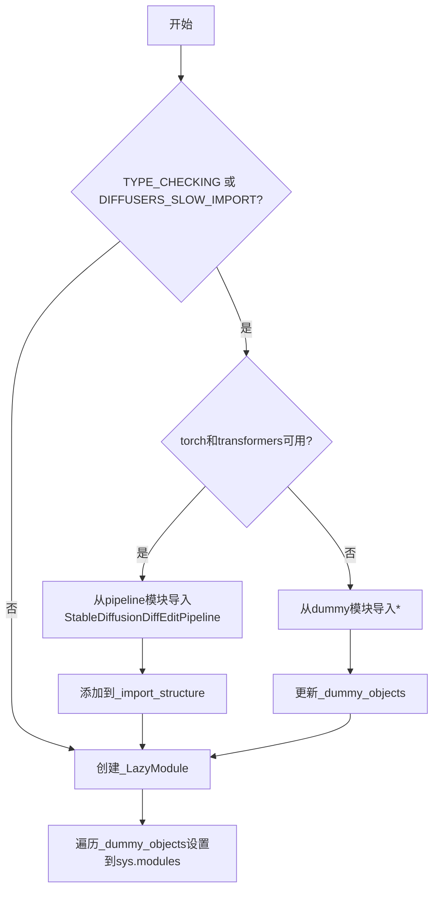
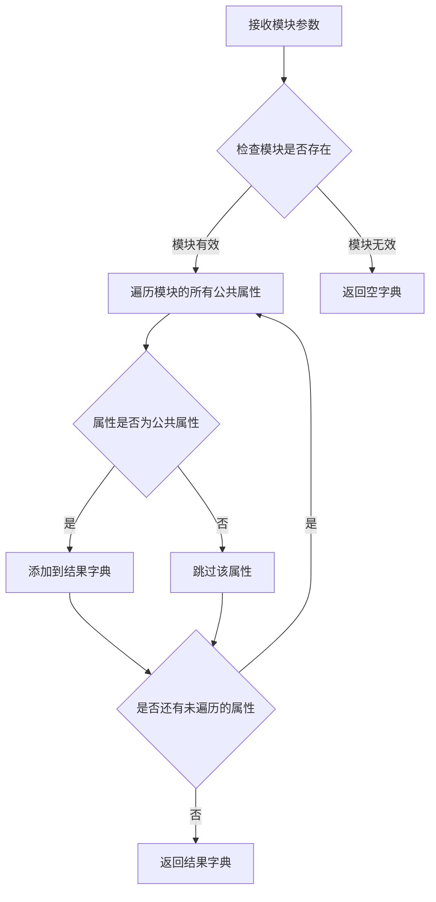
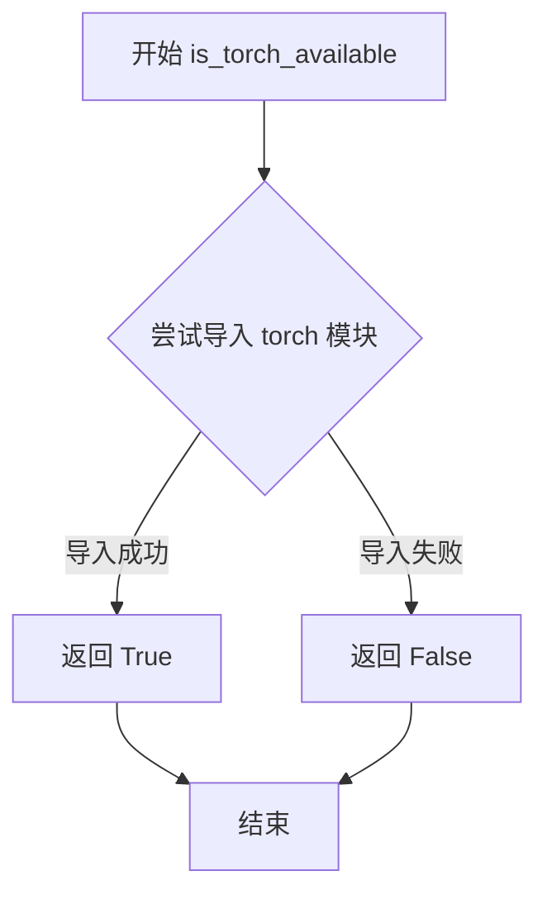

# `diffusers\src\diffusers\pipelines\stable_diffusion_diffedit\__init__.py` 详细设计文档

这是一个延迟加载模块，用于在Diffusers实验性功能中有条件地导入StableDiffusionDiffEditPipeline，同时优雅处理torch和transformers的可选依赖。当可选依赖不可用时，通过dummy对象保持模块接口一致性，避免导入错误。

## 整体流程



## 类结构

```
该文件为模块初始化文件，无类层次结构
依赖关系: _LazyModule (utils) --> StableDiffusionDiffEditPipeline (pipeline)
```

## 全局变量及字段


### `_dummy_objects`
    
存储不可用时的替代对象，当torch和transformers可选依赖不可用时，会从dummy模块获取虚拟对象用于延迟导入

类型：`dict`
    


### `_import_structure`
    
定义模块的导入结构，键为模块路径，值为可导出的类名列表，用于LazyModule的延迟加载机制

类型：`dict`
    


### `DIFFUSERS_SLOW_IMPORT`
    
延迟导入标志位，控制是否启用延迟导入模式，当为True时在TYPE_CHECKING外不立即导入实际模块

类型：`bool`
    


    

## 全局函数及方法


### `get_objects_from_module`

从指定模块中提取所有公共对象（函数、类等），并返回一个以对象名称为键、对象本身为值的字典，常用于延迟加载模块时获取虚拟对象。

参数：

- `module`：`module`，要提取对象的模块对象，通常是虚拟模块（如 `dummy_torch_and_transformers_objects`）

返回值：`Dict[str, Any]`，返回模块中所有对象的字典，键为对象名称，值为对象本身

#### 流程图



#### 带注释源码

```python
def get_objects_from_module(module):
    """
    从给定模块中提取所有公共对象。
    
    该函数用于在延迟加载机制中，从虚拟模块（如 dummy 模块）获取
    所有可用的对象，以便在真正需要时进行动态导入。
    
    参数:
        module: 要提取对象的模块对象
        
    返回:
        包含模块中所有公共对象的字典，键为对象名称，值为对象本身
    """
    # 初始化结果字典
    objects = {}
    
    # 检查模块是否为 None
    if module is None:
        return objects
    
    # 遍历模块的所有属性
    for attr_name in dir(module):
        # 排除私有属性和以单下划线开头的属性
        if not attr_name.startswith('_'):
            try:
                # 获取属性值
                attr_value = getattr(module, attr_name)
                # 添加到结果字典中
                objects[attr_name] = attr_value
            except AttributeError:
                # 如果获取属性失败，跳过该属性
                continue
    
    return objects
```


### `is_torch_available`

该函数是用于检查当前环境中 PyTorch 库是否可用的工具函数，通过尝试导入 torch 模块来判断其是否已安装，常与其他可选依赖检查函数配合使用，以实现条件性地导入需要 PyTorch 的模块。

参数：无

返回值：`bool`，返回 True 表示 PyTorch 可用，返回 False 表示 PyTorch 不可用。

#### 流程图



#### 带注释源码

```python
def is_torch_available():
    """
    检查 PyTorch 是否可用。
    
    该函数通过尝试导入 torch 模块来判断 PyTorch 是否已安装在当前环境中。
    通常用于条件性地导入需要 PyTorch 的代码，以处理可选依赖的情况。
    
    Returns:
        bool: 如果 torch 模块可以成功导入则返回 True，否则返回 False
    """
    try:
        import torch  # noqa F401
        return True
    except ImportError:
        return False
```


### `is_transformers_available`

该函数用于检查当前环境中是否安装了 `transformers` 库，并返回布尔值结果。在代码中用于条件导入 `StableDiffusionDiffEditPipeline`，仅当 `transformers` 和 `torch` 都可用时才加载该管道类，否则使用虚拟对象（dummy objects）作为占位符。

参数：

- 无参数

返回值：`bool`，返回 `True` 表示 `transformers` 库可用，返回 `False` 表示不可用

#### 流程图

```mermaid
flowchart TD
    A[调用 is_transformers_available] --> B{transformers 库是否已安装?}
    B -->|是| C[返回 True]
    B -->|否| D[返回 False]
    
    E[主逻辑判断] --> F{is_transformers_available() && is_torch_available()}
    F -->|True| G[加载 StableDiffusionDiffEditPipeline]
    F -->|False| H[加载虚拟对象作为占位符]
```

#### 带注释源码

```python
# 从 utils 模块导入 is_transformers_available 函数
# 该函数通常在 .../utils/__init__.py 中定义，用于检测 transformers 库是否可用
from ...utils import (
    DIFFUSERS_SLOW_IMPORT,
    OptionalDependencyNotAvailable,
    _LazyModule,
    get_objects_from_module,
    is_torch_available,
    is_transformers_available,  # <-- 检查 transformers 是否可用的函数
)

# 初始化虚拟对象字典和导入结构字典
_dummy_objects = {}
_import_structure = {}

try:
    # 检查 transformers 和 torch 是否都可用
    if not (is_transformers_available() and is_torch_available()):
        # 如果任一库不可用，抛出可选依赖不可用异常
        raise OptionalDependencyNotAvailable()
except OptionalDependencyNotAvailable:
    # 捕获异常，从 dummy 模块导入虚拟对象
    from ...utils import dummy_torch_and_transformers_objects  # noqa F403
    # 更新虚拟对象字典
    _dummy_objects.update(get_objects_from_module(dummy_torch_and_transformers_objects))
else:
    # 如果两个库都可用，定义真正的导入结构
    _import_structure["pipeline_stable_diffusion_diffedit"] = ["StableDiffusionDiffEditPipeline"]
```

## 关键组件


### 可选依赖检查机制

通过 is_transformers_available() 和 is_torch_available() 函数动态检测 PyTorch 和 Transformers 库是否可用，作为模块加载的前置条件判断。

### 惰性加载模块

使用 _LazyModule 实现延迟导入机制，将模块初始化推迟到实际使用时才加载，提升大型库的启动性能。

### 虚拟对象模式

当可选依赖不可用时，通过 _dummy_objects 字典和 dummy_torch_and_transformers_objects 模块提供空对象占位符，保证模块结构完整性避免导入错误。

### 导入结构字典

_import_structure 字典定义模块的公共接口和可导出成员，包含 pipeline_stable_diffusion_diffedit 和 StableDiffusionDiffEditPipeline 的映射关系。

### 动态模块替换

通过 sys.modules[__name__] = _LazyModule(...) 动态替换当前模块为惰性加载模块，实现运行时模块注入和接口暴露。


## 问题及建议


### 已知问题

-   **代码重复（DRY原则违反）**：第17-19行和第26-30行存在完全相同的可选依赖检查逻辑（`if not (is_transformers_available() and is_torch_available()): raise OptionalDependencyNotAvailable()`），应该抽取为独立函数避免重复。
-   **空字典初始化问题**：第9-10行初始化了`_dummy_objects = {}`和`_import_structure = {}`，但如果进入`except OptionalDependencyNotAvailable`分支（第22行），则`_import_structure`保持为空，导致模块导出结构不完整。
-   **缺乏日志和调试信息**：模块加载失败时没有任何日志输出，难以排查是transformers还是torch缺失导致的加载失败。
-   **类型检查块中的异常处理冗余**：第25-34行的TYPE_CHECKING块中进行了依赖检查，但如果在类型检查期间抛出异常，错误信息不够明确具体。
-   **模块导入结构不够灵活**：直接使用硬编码的字符串`"pipeline_stable_diffusion_diffedit"`作为导入结构键值，缺乏动态性和可扩展性。
-   **魔法字符串缺乏统一管理**：pipeline名称等字符串散落在代码中，未来重构时容易遗漏。

### 优化建议

-   **抽取公共依赖检查逻辑**：创建一个`_check_dependencies()`辅助函数，将重复的依赖检查逻辑统一处理，接收依赖名称参数并抛出更具体的错误信息。
-   **完善导入结构定义**：确保`_import_structure`在所有分支下都有正确的定义，或者添加明确的注释说明在依赖不可用时的预期行为。
-   **添加日志记录**：使用`logging`模块记录依赖检查结果和模块加载状态，便于生产环境调试。
-   **统一错误处理**：将依赖检查的异常处理封装，提供更友好的错误消息，明确指出缺失的依赖包。
-   **考虑使用枚举或常量类**：将pipeline名称等字符串常量提取到单独的常量定义文件中，提高可维护性。
-   **增强模块规范（module_spec）使用**：当前代码获取了`__spec__`但可以进一步利用其进行更精细的模块延迟加载控制。


## 其它


### 1. 设计目标与约束

该模块的核心设计目标是实现 Stable Diffusion DiffEdit Pipeline 的延迟加载（Lazy Loading），同时优雅处理可选依赖（torch 和 transformers）的导入。其主要约束包括：仅在 torch 和 transformers 都可用时才加载真实实现，否则提供虚拟对象以保持接口一致性；通过 `TYPE_CHECKING` 和 `DIFFUSERS_SLOW_IMPORT` 控制导入行为以优化启动性能；遵循 Diffusers 库的模块化架构规范。

### 2. 错误处理与异常设计

模块采用 Try-Except 机制处理可选依赖。当 `is_transformers_available()` 或 `is_torch_available()` 返回 False 时，抛出 `OptionalDependencyNotAvailable` 异常，捕获该异常后从 `dummy_torch_and_transformers_objects` 模块加载虚拟对象，确保模块在缺少依赖时仍可被导入但调用时会触发明确的错误。这种设计避免了强制依赖，同时提供了清晰的错误信息。

### 3. 数据流与状态机

模块的数据流主要涉及三个状态：**初始态**（模块加载时）、**检查态**（检测 torch 和 transformers 可用性）、**加载态**（根据检查结果加载真实对象或虚拟对象）。流程为：首先检查是否为类型检查模式 → 尝试检查依赖可用性 → 若依赖不可用则加载 dummy 对象 → 若依赖可用则从真实模块导入 StableDiffusionDiffEditPipeline → 最后将 dummy 对象注册到 sys.modules。

### 4. 外部依赖与接口契约

该模块依赖于以下外部组件：**torch**（深度学习框架）、**transformers**（Hugging Face Transformers 库）、**Diffusers 内部工具模块**（_LazyModule、get_objects_from_module、OptionalDependencyNotAvailable）。其接口契约规定：导出 `StableDiffusionDiffEditPipeline` 类；当依赖不可用时，导入该模块不会抛出 ImportError，但调用相关类时会触发 AttributeError 或从 dummy 对象触发错误。

### 5. 模块初始化流程详解

模块初始化遵循以下顺序：首先定义 `_dummy_objects` 和 `_import_structure` 两个空字典；然后进入条件分支判断 `TYPE_CHECKING or DIFFUSERS_SLOW_IMPORT`：若为真则仅在类型检查时加载真实类；若为假则立即执行延迟加载逻辑，创建 `_LazyModule` 实例并替换当前模块，同时将 dummy 对象通过 `setattr` 注入到 `sys.modules[__name__]` 中。

### 6. 关键组件信息

**_LazyModule**：Diffusers 框架实现的延迟加载机制类，负责在真正需要时才导入子模块。**get_objects_from_module**：工具函数，从指定模块获取所有对象。**is_torch_available / is_transformers_available**：环境检查函数，判断运行时是否安装了相应库。**OptionalDependencyNotAvailable**：自定义异常类，用于标识可选依赖不可用的情况。**StableDiffusionDiffEditPipeline**：Stable Diffusion DiffEdit 管道类，是该模块的主要导出目标。

### 7. 全局变量详情

**_dummy_objects**：类型 `dict`，用于存储当依赖不可用时的虚拟对象集合，在模块初始化时通过 `get_objects_from_module` 从 dummy 模块填充。**_import_structure**：类型 `dict`，定义模块的导出结构，键为类别名（如 "pipeline_stable_diffusion_diffedit"），值为包含类名列表的列表。

### 8. 技术债务与优化空间

**潜在问题**：当前模块将 dummy 对象通过 `setattr` 动态添加到 `sys.modules` 中，这种方式虽然实现了延迟加载，但在某些边缘情况下可能导致模块状态不一致。**优化建议**：可考虑将 dummy 对象定义集中管理，避免在多处重复定义 dummy 模块；可增加日志记录以便于调试依赖缺失问题；可添加版本兼容性检查以适应不同版本的 torch/transformers。

### 9. 整体运行流程

该模块作为 Diffusers 库的入口文件，采用延迟加载模式。当其他模块 `import diffusers.pipelines.stable_diffusion_diffedit` 时：首先检查 `TYPE_CHECKING` 标志判断是否为类型检查阶段；若非类型检查阶段，创建 `_LazyModule` 实例替代当前模块，实现按需加载；运行时若调用 `StableDiffusionDiffEditPipeline`，则触发实际导入，成功则使用真实类，失败则使用预置的虚拟对象从而给出友好错误提示。

    