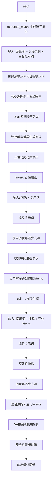
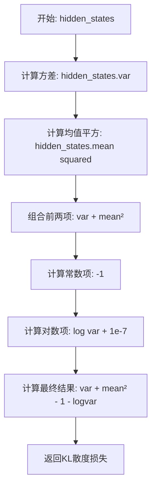
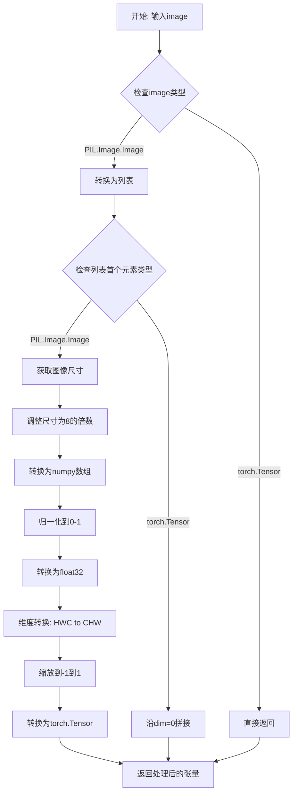
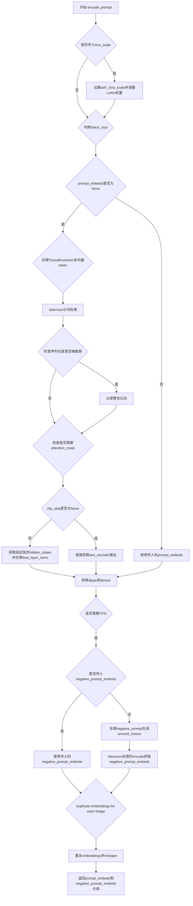
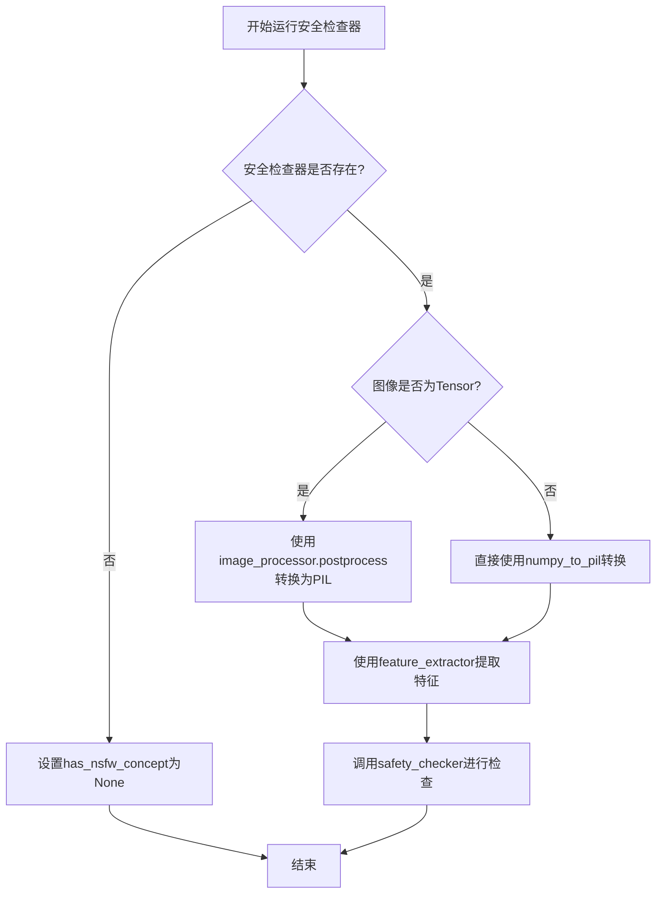
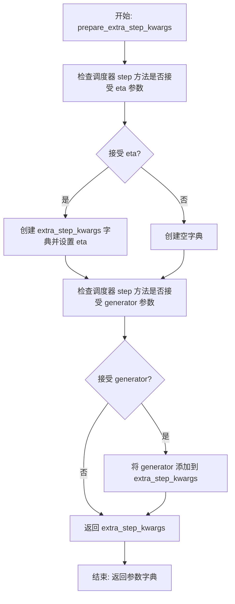
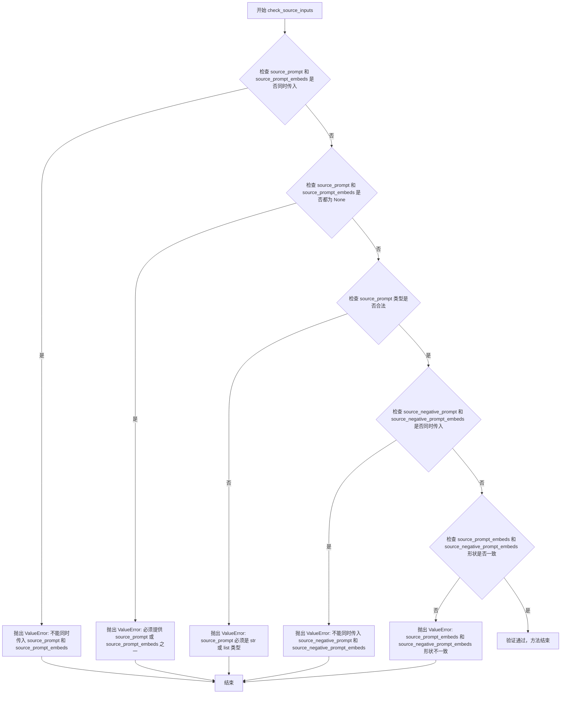
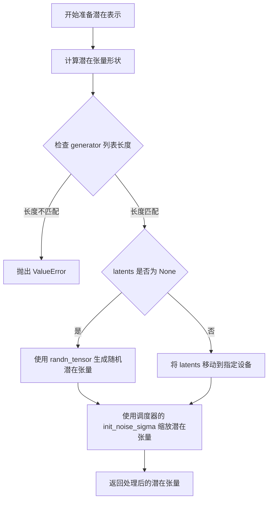
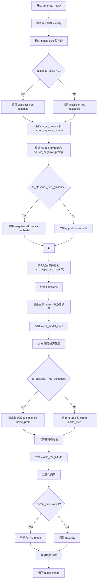
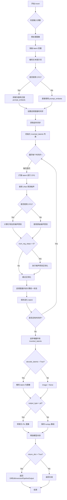

# `diffusers\src\diffusers\pipelines\stable_diffusion_diffedit\pipeline_stable_diffusion_diffedit.py` 详细设计文档

这是一个基于Stable Diffusion的DiffEdit图像编辑Pipeline，提供了完整的端到端图像编辑流程，包括语义掩码生成(generate_mask)、图像逆化(invert)和带掩码的图像生成(__call__)三个核心功能，支持文本引导的图像编辑、图像修复和图像变换。

## 整体流程



## 类结构

```
DiffusionPipeline (基类)
├── StableDiffusionDiffEditPipeline (主类)
│   ├── StableDiffusionMixin
│   ├── TextualInversionLoaderMixin
│   ├── StableDiffusionLoraLoaderMixin
│   └── DeprecatedPipelineMixin
```

## 全局变量及字段


### `XLA_AVAILABLE`
    
是否可用XLA加速

类型：`bool`
    


### `logger`
    
模块日志记录器

类型：`logging.Logger`
    


### `EXAMPLE_DOC_STRING`
    
文档示例字符串

类型：`str`
    


### `EXAMPLE_INVERT_DOC_STRING`
    
逆化文档示例字符串

类型：`str`
    


### `DiffEditInversionPipelineOutput.latents`
    
逆化后的潜在表示张量

类型：`torch.Tensor`
    


### `DiffEditInversionPipelineOutput.images`
    
逆化过程中生成的图像列表或数组

类型：`list[PIL.Image.Image] | np.ndarray`
    


### `StableDiffusionDiffEditPipeline.vae`
    
VAE编码器和解码器模型

类型：`AutoencoderKL`
    


### `StableDiffusionDiffEditPipeline.text_encoder`
    
冻结的CLIP文本编码器

类型：`CLIPTextModel`
    


### `StableDiffusionDiffEditPipeline.tokenizer`
    
CLIP分词器

类型：`CLIPTokenizer`
    


### `StableDiffusionDiffEditPipeline.unet`
    
去噪UNet模型

类型：`UNet2DConditionModel`
    


### `StableDiffusionDiffEditPipeline.scheduler`
    
正向调度器

类型：`KarrasDiffusionSchedulers`
    


### `StableDiffusionDiffEditPipeline.inverse_scheduler`
    
反向调度器

类型：`DDIMInverseScheduler`
    


### `StableDiffusionDiffEditPipeline.safety_checker`
    
安全检查器

类型：`StableDiffusionSafetyChecker`
    


### `StableDiffusionDiffEditPipeline.feature_extractor`
    
特征提取器

类型：`CLIPImageProcessor`
    


### `StableDiffusionDiffEditPipeline.vae_scale_factor`
    
VAE缩放因子

类型：`int`
    


### `StableDiffusionDiffEditPipeline.image_processor`
    
图像处理器

类型：`VaeImageProcessor`
    


### `StableDiffusionDiffEditPipeline.model_cpu_offload_seq`
    
CPU卸载顺序

类型：`str`
    


### `StableDiffusionDiffEditPipeline._optional_components`
    
可选组件列表

类型：`list`
    


### `StableDiffusionDiffEditPipeline._exclude_from_cpu_offload`
    
排除CPU卸载的组件

类型：`list`
    


### `StableDiffusionDiffEditPipeline._last_supported_version`
    
最后支持的版本号

类型：`str`
    
    

## 全局函数及方法


### `auto_corr_loss`

计算自动相关损失（Auto-Correlation Loss），用于在扩散模型的逆过程中对噪声预测进行正则化，鼓励噪声在不同空间位置之间具有更少的结构性，从而接近独立同分布（i.i.d.）的高斯噪声。

参数：

- `hidden_states`：`torch.Tensor`，输入的隐藏状态张量，通常是噪声预测，形状为 (batch_size, channels, height, width)
- `generator`：`torch.Generator | None`，可选的 PyTorch 随机数生成器，用于确保可重复性

返回值：`float`，自动相关损失的标量值

#### 流程图

```mermaid
flowchart TD
    A[开始: hidden_states, generator] --> B[初始化 reg_loss = 0.0]
    B --> C[遍历 batch 维度 i]
    C --> D[遍历 channels 维度 j]
    D --> E[提取单个通道切片: noise = hidden_states[i:i+1, j:j+1, :, :]]
    E --> F[进入 while True 循环]
    F --> G[随机生成 roll_amount]
    G --> H[计算水平滚动损失: (noise * torch.roll(noise, shifts=roll_amount, dims=2)).mean() ** 2]
    H --> I[计算垂直滚动损失: (noise * torch.roll(noise, shifts=roll_amount, dims=3)).mean() ** 2]
    I --> J[累加损失到 reg_loss]
    J --> K{检查 noise.shape[2] <= 8?}
    K -->|是| L[退出循环]
    K -->|否| M[对 noise 进行 2x2 池化]
    M --> F
    L --> N[返回 reg_loss]
```

#### 带注释源码

```python
def auto_corr_loss(hidden_states, generator=None):
    """
    计算自动相关损失，用于正则化扩散模型中的噪声预测。
    
    该损失函数通过计算隐藏状态在不同空间位置之间的相关性来鼓励噪声接近白噪声（独立同分布），
    从而提高扩散模型的反演质量。损失通过在多个尺度上计算滚动相关性来计算。
    
    Args:
        hidden_states: 输入的隐藏状态张量，形状为 (batch_size, channels, height, width)
        generator: 可选的随机数生成器，用于确保可重复性
    
    Returns:
        自动相关损失的标量值
    """
    # 初始化损失累加器
    reg_loss = 0.0
    
    # 遍历批次维度
    for i in range(hidden_states.shape[0]):
        # 遍历通道维度
        for j in range(hidden_states.shape[1]):
            # 提取单个通道的空间切片，保持批次和通道维度为1
            # 形状: (1, 1, H, W)
            noise = hidden_states[i : i + 1, j : j + 1, :, :]
            
            # 多尺度计算自动相关损失
            while True:
                # 随机生成滚动位移量，最大为特征维度的一半
                # 使用 torch.randint 确保随机性，generator 用于可重复性
                roll_amount = torch.randint(noise.shape[2] // 2, (1,), generator=generator).item()
                
                # 计算水平方向（dim=2）的自相关损失
                # torch.roll 将张量沿指定维度滚动 shift 个位置
                # 通过计算原始张量与滚动后张量的元素级乘积的均值来衡量相关性
                reg_loss += (noise * torch.roll(noise, shifts=roll_amount, dims=2)).mean() ** 2
                
                # 计算垂直方向（dim=3）的自相关损失
                reg_loss += (noise * torch.roll(noise, shifts=roll_amount, dims=3)).mean() ** 2
                
                # 当特征维度小于等于8时停止迭代，避免过度池化
                if noise.shape[2] <= 8:
                    break
                
                # 使用 2x2 平均池化进行下采样，继续在更小的尺度计算损失
                # 这使得损失能在多个分辨率下捕获相关性
                noise = torch.nn.functional.avg_pool2d(noise, kernel_size=2)
    
    # 返回累计的自动相关损失
    return reg_loss
```


### `kl_divergence`

计算KL散度损失（Kullback-Leibler Divergence Loss），用于在DiffEdit的反演过程中对噪声预测进行正则化，使预测的噪声更接近标准正态分布。该函数计算隐藏状态分布与标准正态分布之间的KL散度。

参数：

- `hidden_states`：`torch.Tensor`，需要进行KL散度计算的隐藏状态张量，通常是噪声预测张量

返回值：`torch.Tensor`，计算得到的KL散度损失值（标量张量）

#### 流程图



#### 带注释源码

```python
def kl_divergence(hidden_states):
    """
    计算隐藏状态分布与标准正态分布之间的KL散度。
    
    数学原理：KL(N(μ, σ²) || N(0, 1)) = -0.5 * (1 + log(σ²) - μ² - σ²)
    简化为：σ² + μ² - 1 - log(σ² + ε)，其中ε=1e-7用于数值稳定性
    
    参数:
        hidden_states: torch.Tensor，需要计算KL散度的隐藏状态张量
        
    返回:
        torch.Tensor，KL散度损失值
    """
    # 计算方差：衡量分布的离散程度
    variance = hidden_states.var()
    
    # 计算均值的平方：衡量分布与零的偏离程度
    mean_squared = hidden_states.mean() ** 2
    
    # 计算 log(σ² + ε)：使用 1e-7 防止 log(0) 的数值问题
    log_variance = torch.log(hidden_states.var() + 1e-7)
    
    # 组合各项得到最终KL散度：σ² + μ² - 1 - log(σ² + ε)
    kl_loss = variance + mean_squared - 1 - log_variance
    
    return kl_loss
```


### `preprocess`

预处理输入图像（已废弃），将PIL图像或张量转换为适合Diffusion模型处理的标准化张量格式。

参数：

- `image`：`torch.Tensor | PIL.Image.Image | list[PIL.Image.Image]`，输入图像，可以是单个PIL图像、图像列表或张量

返回值：`torch.Tensor`，处理后的图像张量，形状为`(batch_size, channels, height, width)`，值域为`[-1, 1]`

#### 流程图



#### 带注释源码

```
# 从img2img pipeline复制过来的预处理函数
# Copied from diffusers.pipelines.stable_diffusion.pipeline_stable_diffusion_img2img.preprocess
def preprocess(image):
    """
    预处理输入图像，将PIL图像或张量转换为适合Diffusion模型处理的标准化张量格式
    
    处理流程：
    1. 如果是torch.Tensor直接返回
    2. 如果是PIL.Image，转换为列表
    3. 对PIL图像：调整尺寸→numpy数组→归一化→维度转换→缩放→张量
    4. 对张量列表：沿batch维度拼接
    """
    # 发出废弃警告，推荐使用VaeImageProcessor.preprocess替代
    deprecation_message = "The preprocess method is deprecated and will be removed in diffusers 1.0.0. Please use VaeImageProcessor.preprocess(...) instead"
    deprecate("preprocess", "1.0.0", deprecation_message, standard_warn=False)
    
    # 类型检查：如果是torch.Tensor直接返回，不做处理
    if isinstance(image, torch.Tensor):
        return image
    # 如果是单个PIL图像，转换为列表以便统一处理
    elif isinstance(image, PIL.Image.Image):
        image = [image]

    # 处理PIL图像列表
    if isinstance(image[0], PIL.Image.Image):
        # 获取第一张图像的尺寸
        w, h = image[0].size
        # 将尺寸调整为8的倍数（Stable Diffusion的潜空间要求）
        w, h = (x - x % 8 for x in (w, h))

        # 对每张图像进行尺寸调整和numpy转换
        # 1. resize到目标尺寸（使用lanczos插值）
        # 2. 转为numpy数组并添加batch维度
        # 3. 沿batch维度拼接
        image = [np.array(i.resize((w, h), resample=PIL_INTERPOLATION["lanczos"]))[None, :] for i in image]
        image = np.concatenate(image, axis=0)
        
        # 归一化处理
        # 1. 转为float32类型
        # 2. 除以255.0归一化到[0,1]
        image = np.array(image).astype(np.float32) / 255.0
        
        # 维度转换：从HWC转换为CHW
        # (batch_size, height, width, channels) -> (batch_size, channels, height, width)
        image = image.transpose(0, 3, 1, 2)
        
        # 缩放到[-1, 1]范围（Diffusion模型常用的输入范围）
        image = 2.0 * image - 1.0
        
        # 转换为PyTorch张量
        image = torch.from_numpy(image)
    
    # 处理张量列表
    elif isinstance(image[0], torch.Tensor):
        # 沿batch维度（dim=0）拼接多个张量
        image = torch.cat(image, dim=0)
    
    return image
```


### `preprocess_mask`

该函数负责将掩码图像（mask）从多种输入格式（PIL.Image.Image、np.ndarray、torch.Tensor）统一转换为标准的 4D 张量格式（batch_size, 1, height, width），并进行掩码形状验证、批次大小检查、值域范围验证和二值化处理，确保掩码符合 Stable Diffusion 模型的输入要求。

参数：

-  `mask`：`torch.Tensor | PIL.Image.Image | np.ndarray | list`，待预处理的掩码图像，支持单张图像、图像列表或已转换的张量
-  `batch_size`：`int`，从提示词推断的批次大小，默认为 1，用于验证和广播掩码

返回值：`torch.Tensor`，返回 4D 张量（batch_size, 1, height, width），值为 0 或 1 的二值化掩码

#### 流程图

```mermaid
flowchart TD
    A[开始 preprocess_mask] --> B{输入 mask 是否为 Tensor?}
    B -->|否| C[将 mask 包装为列表]
    B -->|是| G{检查维度}
    C --> D{mask[0] 是 PIL.Image?}
    D -->|是| E[转换为灰度 NumPy 并归一化]
    D -->|否| F{mask[0] 是 np.ndarray?}
    E --> H[转换为 Tensor]
    F -->|是| I[堆叠或拼接为 Tensor]
    F -->|否| J{mask[0] 是 Tensor?}
    J -->|是| K[堆叠或拼接为 Tensor]
    G -->|是| L{mask.ndim == 2?}
    L -->|是| M[添加批次维和通道维: unsqueeze(0).unsqueeze(0)]
    L -->|否| N{mask.ndim == 3?}
    N -->|是| O{shape[0] == 1?}
    O -->|是| P[添加批次维: unsqueeze(0)]
    O -->|否| Q[添加通道维: unsqueeze(1)]
    M --> R{批次大小 > 1?}
    P --> R
    Q --> R
    H --> R
    I --> R
    K --> R
    R -->|是| S{掩码批次维 == 1?}
    S -->|是| T[复制掩码到批次大小]
    S -->|否| U{掩码批次维 != 批次大小?}
    U -->|是| V[抛出 ValueError]
    U -->|否| W{通道维 == 1?}
    T --> W
    V --> X[结束]
    W -->|否| Y[抛出 ValueError: 通道数必须为1]
    W -->|是| Z{最小值 < 0 或 最大值 > 1?}
    Z -->|是| AA[抛出 ValueError: 值域应在0-1]
    Z -->|否| AB[二值化掩码: < 0.5 设为 0, >= 0.5 设为 1]
    AB --> X
```

#### 带注释源码

```python
def preprocess_mask(mask, batch_size: int = 1):
    """
    预处理掩码图像,将其转换为符合模型输入要求的 4D 张量格式。
    
    参数:
        mask: 输入掩码,支持 PIL.Image.Image、np.ndarray、torch.Tensor 或其列表
        batch_size: 从提示词推断的批次大小,用于掩码广播验证
    
    返回:
        4D 张量 (batch_size, 1, height, width),值为 0 或 1 的二值化掩码
    """
    
    # 步骤1: 非 Tensor 输入的预处理 - 转换为统一格式
    if not isinstance(mask, torch.Tensor):
        # preprocess mask
        # 将单张图像包装为列表以便统一处理
        if isinstance(mask, (PIL.Image.Image, np.ndarray)):
            mask = [mask]

        # 步骤2: 根据列表元素类型进行转换
        if isinstance(mask, list):
            # PIL.Image 转换为灰度 NumPy 并归一化到 [0, 1]
            if isinstance(mask[0], PIL.Image.Image):
                mask = [np.array(m.convert("L")).astype(np.float32) / 255.0 for m in mask]
            
            # NumPy 数组堆叠/拼接为 Tensor
            if isinstance(mask[0], np.ndarray):
                # ndim < 3 表示单通道图像,使用 stack 保留批次维
                # ndim >= 3 表示多通道或已批处理图像,使用 concatenate
                mask = np.stack(mask, axis=0) if mask[0].ndim < 3 else np.concatenate(mask, axis=0)
                mask = torch.from_numpy(mask)
            
            # Tensor 堆叠/拼接
            elif isinstance(mask[0], torch.Tensor):
                mask = torch.stack(mask, dim=0) if mask[0].ndim < 3 else torch.cat(mask, dim=0)

    # 步骤3: 处理单张掩码 - 添加批次维和通道维
    # mask.ndim == 2 表示 (H, W) 格式,需要添加为 (1, 1, H, W)
    if mask.ndim == 2:
        mask = mask.unsqueeze(0).unsqueeze(0)

    # 步骤4: 处理 3D 掩码 - 确定批次维和通道维的关系
    # mask.ndim == 3 可能的情况:
    #   - (1, H, W): 单张已批处理掩码,无通道维
    #   - (B, H, W): 多张已批处理掩码,无通道维
    #   - (1, H, W): 单张已添加通道维的掩码
    if mask.ndim == 3:
        # Single batched mask, no channel dim or single mask not batched but channel dim
        if mask.shape[0] == 1:
            # (1, H, W) -> (1, 1, H, W): 视为单张带通道维的掩码
            mask = mask.unsqueeze(0)

        # Batched masks no channel dim
        # (B, H, W) -> (B, 1, H, W): 多张掩码,添加通道维
        else:
            mask = mask.unsqueeze(1)

    # 步骤5: 批次大小验证和广播
    # 根据 batch_size 参数对掩码进行广播或验证
    if batch_size > 1:
        if mask.shape[0] == 1:
            # 单一掩码广播到整个批次
            mask = torch.cat([mask] * batch_size)
        elif mask.shape[0] > 1 and mask.shape[0] != batch_size:
            # 掩码批次大小与预期不符,抛出错误
            raise ValueError(
                f"`mask_image` with batch size {mask.shape[0]} cannot be broadcasted to batch size {batch_size} "
                f"inferred by prompt inputs"
            )

    # 步骤6: 通道数验证 - 必须为单通道
    if mask.shape[1] != 1:
        raise ValueError(f"`mask_image` must have 1 channel, but has {mask.shape[1]} channels")

    # 步骤7: 值域验证 - 必须在 [0, 1] 范围内
    if mask.min() < 0 or mask.max() > 1:
        raise ValueError("`mask_image` should be in [0, 1] range")

    # 步骤8: 二值化处理 - 阈值 0.5
    # 将连续值掩码转换为二值掩码,便于后续图像处理
    mask[mask < 0.5] = 0
    mask[mask >= 0.5] = 1

    return mask
```


### `StableDiffusionDiffEditPipeline.__init__`

该方法是 `StableDiffusionDiffEditPipeline` 类的构造函数，负责初始化DiffEdit图像修复Pipeline的所有核心组件，包括VAE、文本编码器、Tokenizer、UNet、调度器、安全检查器、特征提取器和反向调度器，同时进行配置验证和兼容性检查。

参数：

- `vae`：`AutoencoderKL`，Variational Auto-Encoder (VAE) 模型，用于将图像编码和解码到潜在表示
- `text_encoder`：`CLIPTextModel`，冻结的文本编码器 (clip-vit-large-patch14)
- `tokenizer`：`CLIPTokenizer`，用于对文本进行分词的 CLIPTokenizer
- `unet`：`UNet2DConditionModel`，用于对编码后的图像潜在向量进行去噪的 UNet2DConditionModel
- `scheduler`：`KarrasDiffusionSchedulers`，与 unet 配合使用对编码图像潜在向量进行去噪的调度器
- `safety_checker`：`StableDiffusionSafetyChecker`，分类模块，用于评估生成的图像是否被认为是令人反感或有害的
- `feature_extractor`：`CLIPImageProcessor`，用于从生成的图像中提取特征的 CLIPImageProcessor，作为 safety_checker 的输入
- `inverse_scheduler`：`DDIMInverseScheduler`，反向调度器，用于填充输入潜在向量的未掩码部分
- `requires_safety_checker`：`bool`，是否需要安全检查器，默认为 True

返回值：无

#### 流程图

```mermaid
flowchart TD
    A[开始 __init__] --> B{检查 scheduler.steps_offset}
    B -->|不等于 1| C[发出警告并修正 steps_offset]
    B -->|等于 1| D{检查 scheduler.skip_prk_steps}
    D -->|未设置或为 False| E[发出警告并设置 skip_prk_steps=True]
    D -->|已设置| F{检查 safety_checker}
    F -->|safety_checker为None且requires_safety_checker为True| G[发出警告]
    F -->|safety_checker不为None但feature_extractor为None| H[抛出ValueError]
    F -->|正常| I{检查 UNet 版本和 sample_size}
    I -->|版本<0.9.0且sample_size<64| J[发出警告并修正 sample_size=64]
    I -->|正常| K[调用 super().__init__]
    K --> L[调用 register_modules 注册所有组件]
    L --> M[计算 vae_scale_factor]
    M --> N[初始化 VaeImageProcessor]
    N --> O[调用 register_to_config 保存 requires_safety_checker]
    O --> P[结束 __init__]
```

#### 带注释源码

```python
def __init__(
    self,
    vae: AutoencoderKL,
    text_encoder: CLIPTextModel,
    tokenizer: CLIPTokenizer,
    unet: UNet2DConditionModel,
    scheduler: KarrasDiffusionSchedulers,
    safety_checker: StableDiffusionSafetyChecker,
    feature_extractor: CLIPImageProcessor,
    inverse_scheduler: DDIMInverseScheduler,
    requires_safety_checker: bool = True,
):
    # 调用父类初始化方法
    super().__init__()

    # 检查 scheduler 的 steps_offset 配置
    if scheduler is not None and getattr(scheduler.config, "steps_offset", 1) != 1:
        deprecation_message = (
            f"The configuration file of this scheduler: {scheduler} is outdated. `steps_offset`"
            f" should be set to 1 instead of {scheduler.config.steps_offset}. Please make sure "
            "to update the config accordingly as leaving `steps_offset` might led to incorrect results"
            " in future versions. If you have downloaded this checkpoint from the Hugging Face Hub,"
            " it would be very nice if you could open a Pull request for the `scheduler/scheduler_config.json`"
            " file"
        )
        deprecate("steps_offset!=1", "1.0.0", deprecation_message, standard_warn=False)
        new_config = dict(scheduler.config)
        new_config["steps_offset"] = 1
        scheduler._internal_dict = FrozenDict(new_config)

    # 检查 scheduler 的 skip_prk_steps 配置
    if scheduler is not None and getattr(scheduler.config, "skip_prk_steps", True) is False:
        deprecation_message = (
            f"The configuration file of this scheduler: {scheduler} has not set the configuration"
            " `skip_prk_steps`. `skip_prk_steps` should be set to True in the configuration file. Please make"
            " sure to update the config accordingly as not setting `skip_prk_steps` in the config might lead to"
            " incorrect results in future versions. If you have downloaded this checkpoint from the Hugging Face"
            " Hub, it would be very nice if you could open a Pull request for the"
            " `scheduler/scheduler_config.json` file"
        )
        deprecate("skip_prk_steps not set", "1.0.0", deprecation_message, standard_warn=False)
        new_config = dict(scheduler.config)
        new_config["skip_prk_steps"] = True
        scheduler._internal_dict = FrozenDict(new_config)

    # 如果 safety_checker 为 None 但 requires_safety_checker 为 True，发出警告
    if safety_checker is None and requires_safety_checker:
        logger.warning(
            f"You have disabled the safety checker for {self.__class__} by passing `safety_checker=None`. Ensure"
            " that you abide to the conditions of the Stable Diffusion license and do not expose unfiltered"
            " results in services or applications open to the public. Both the diffusers team and Hugging Face"
            " strongly recommend to keep the safety filter enabled in all public facing circumstances, disabling"
            " it only for use-cases that involve analyzing network behavior or auditing its results. For more"
            " information, please have a look at https://github.com/huggingface/diffusers/pull/254 ."
        )

    # 如果 safety_checker 不为 None 但 feature_extractor 为 None，抛出错误
    if safety_checker is not None and feature_extractor is None:
        raise ValueError(
            "Make sure to define a feature extractor when loading {self.__class__} if you want to use the safety"
            " checker. If you do not want to use the safety checker, you can pass `'safety_checker=None'` instead."
        )

    # 检查 UNet 版本和 sample_size
    is_unet_version_less_0_9_0 = (
        unet is not None
        and hasattr(unet.config, "_diffusers_version")
        and version.parse(version.parse(unet.config._diffusers_version).base_version) < version.parse("0.9.0.dev0")
    )
    is_unet_sample_size_less_64 = (
        unet is not None and hasattr(unet.config, "sample_size") and unet.config.sample_size < 64
    )
    if is_unet_version_less_0_9_0 and is_unet_sample_size_less_64:
        deprecation_message = (
            "The configuration file of the unet has set the default `sample_size` to smaller than"
            " 64 which seems highly unlikely .If you're checkpoint is a fine-tuned version of any of the"
            " following: \n- CompVis/stable-diffusion-v1-4 \n- CompVis/stable-diffusion-v1-3 \n-"
            " CompVis/stable-diffusion-v1-2 \n- CompVis/stable-diffusion-v1-1 \n- stable-diffusion-v1-5/stable-diffusion-v1-5"
            " \n- stable-diffusion-v1-5/stable-diffusion-inpainting \n you should change 'sample_size' to 64 in the"
            " configuration file. Please make sure to update the config accordingly as leaving `sample_size=32`"
            " in the config might lead to incorrect results in future versions. If you have downloaded this"
            " checkpoint from the Hugging Face Hub, it would be very nice if you could open a Pull request for"
            " the `unet/config.json` file"
        )
        deprecate("sample_size<64", "1.0.0", deprecation_message, standard_warn=False)
        new_config = dict(unet.config)
        new_config["sample_size"] = 64
        unet._internal_dict = FrozenDict(new_config)

    # 注册所有模块
    self.register_modules(
        vae=vae,
        text_encoder=text_encoder,
        tokenizer=tokenizer,
        unet=unet,
        scheduler=scheduler,
        safety_checker=safety_checker,
        feature_extractor=feature_extractor,
        inverse_scheduler=inverse_scheduler,
    )
    
    # 计算 VAE 缩放因子
    self.vae_scale_factor = 2 ** (len(self.vae.config.block_out_channels) - 1) if getattr(self, "vae", None) else 8
    
    # 初始化图像处理器
    self.image_processor = VaeImageProcessor(vae_scale_factor=self.vae_scale_factor)
    
    # 注册配置
    self.register_to_config(requires_safety_checker=requires_safety_checker)
```


### `StableDiffusionDiffEditPipeline._encode_prompt`

该方法是 StableDiffusionDiffEditPipeline 类中的一个已废弃的提示词编码方法，内部调用了 `encode_prompt` 方法并将返回的元组格式重新拼接为传统的拼接张量格式以保持向后兼容性。

参数：

- `prompt`：`str` 或 `list[str]` 或 `None`，需要编码的提示词
- `device`：`torch.device`，执行设备
- `num_images_per_prompt`：`int`，每个提示词生成的图像数量
- `do_classifier_free_guidance`：`bool`，是否使用无分类器自由引导
- `negative_prompt`：`str` 或 `list[str]` 或 `None`，负向提示词
- `prompt_embeds`：`torch.Tensor` 或 `None`，预生成的提示词嵌入
- `negative_prompt_embeds`：`torch.Tensor` 或 `None`，预生成的负向提示词嵌入
- `lora_scale`：`float` 或 `None`，LoRA 缩放因子
- `**kwargs`：可变关键字参数，传递给 `encode_prompt` 的额外参数

返回值：`torch.Tensor`，拼接后的提示词嵌入张量（包含负向和正向嵌入）

#### 流程图

```mermaid
flowchart TD
    A[开始 _encode_prompt] --> B[记录废弃警告]
    B --> C[调用 encode_prompt 方法]
    C --> D[获取返回的元组 prompt_embeds_tuple]
    E[元组包含: 负向嵌入, 正向嵌入]
    D --> E
    E --> F[拼接: torch.cat[负向, 正向]]
    F --> G[返回拼接后的张量]
    
    style B fill:#fff3cd
    style G fill:#d4edda
```

#### 带注释源码

```python
def _encode_prompt(
    self,
    prompt,
    device,
    num_images_per_prompt,
    do_classifier_free_guidance,
    negative_prompt=None,
    prompt_embeds: torch.Tensor | None = None,
    negative_prompt_embeds: torch.Tensor | None = None,
    lora_scale: float | None = None,
    **kwargs,
):
    """
    已废弃的方法，推荐使用 encode_prompt。
    此方法保留了向后兼容性，将新格式的元组输出转换回传统的拼接张量格式。
    """
    # 记录废弃警告，提示用户在未来版本中将被移除
    deprecation_message = "`_encode_prompt()` is deprecated and it will be removed in a future version. Use `encode_prompt()` instead. Also, be aware that the output format changed from a concatenated tensor to a tuple."
    deprecate("_encode_prompt()", "1.0.0", deprecation_message, standard_warn=False)

    # 调用新的 encode_prompt 方法获取编码结果
    # 返回值为元组 (negative_prompt_embeds, prompt_embeds)
    prompt_embeds_tuple = self.encode_prompt(
        prompt=prompt,
        device=device,
        num_images_per_prompt=num_images_per_prompt,
        do_classifier_free_guidance=do_classifier_free_guidance,
        negative_prompt=negative_prompt,
        prompt_embeds=prompt_embeds,
        negative_prompt_embeds=negative_prompt_embeds,
        lora_scale=lora_scale,
        **kwargs,
    )

    # 为了向后兼容性，将元组重新拼接为传统的 [negative, positive] 顺序
    # 旧格式: torch.cat([negative, positive])
    # 新格式: (negative, positive) 元组
    prompt_embeds = torch.cat([prompt_embeds_tuple[1], prompt_embeds_tuple[0]])

    return prompt_embeds
```


### `StableDiffusionDiffEditPipeline.encode_prompt`

该方法将文本提示（prompt）编码为文本嵌入（text embeddings），供后续的图像生成模型（UNet）使用。支持正向提示和负向提示的编码，并处理分类器自由引导（Classifier-Free Guidance）、LoRA权重调整以及CLIP跳层等高级功能。

参数：

- `prompt`：`str | list[str] | None`，要编码的文本提示，可以是单个字符串或字符串列表
- `device`：`torch.device`，PyTorch设备对象，指定计算设备
- `num_images_per_prompt`：`int`，每个提示需要生成的图像数量，用于批量复制embeddings
- `do_classifier_free_guidance`：`bool`，是否启用分类器自由引导（CFG），为True时需要生成unconditional embeddings
- `negative_prompt`：`str | list[str] | None`，负向提示，用于指定不希望出现在生成图像中的内容
- `prompt_embeds`：`torch.Tensor | None`，可选的预生成正向文本嵌入，如果提供则直接使用而不从prompt生成
- `negative_prompt_embeds`：`torch.Tensor | None`，可选的预生成负向文本嵌入
- `lora_scale`：`float | None`，LoRA缩放因子，用于调整已加载的LoRA层权重
- `clip_skip`：`int | None`，CLIP模型中要跳过的层数，用于获取不同层次的特征表示

返回值：`tuple[torch.Tensor, torch.Tensor]`，返回两个torch.Tensor组成的元组——第一个是编码后的正向提示嵌入，第二个是负向提示嵌入

#### 流程图



#### 带注释源码

```python
def encode_prompt(
    self,
    prompt,  # str | list[str] | None: 要编码的提示文本
    device,  # torch.device: 计算设备
    num_images_per_prompt,  # int: 每个提示生成的图像数量
    do_classifier_free_guidance,  # bool: 是否启用无分类器引导
    negative_prompt=None,  # str | list[str] | None: 负向提示
    prompt_embeds: torch.Tensor | None = None,  # torch.Tensor | None: 预生成的嵌入
    negative_prompt_embeds: torch.Tensor | None = None,  # torch.Tensor | None: 预生成的负向嵌入
    lora_scale: float | None = None,  # float | None: LoRA缩放因子
    clip_skip: int | None = None,  # int | None: CLIP跳过的层数
):
    r"""
    Encodes the prompt into text encoder hidden states.

    Args:
        prompt (`str` or `list[str]`, *optional*):
            prompt to be encoded
        device: (`torch.device`):
            torch device
        num_images_per_prompt (`int`):
            number of images that should be generated per prompt
        do_classifier_free_guidance (`bool`):
            whether to use classifier free guidance or not
        negative_prompt (`str` or `list[str]`, *optional*):
            The prompt or prompts not to guide the image generation. If not defined, one has to pass
            `negative_prompt_embeds` instead. Ignored when not using guidance (i.e., ignored if `guidance_scale` is
            less than `1`).
        prompt_embeds (`torch.Tensor`, *optional*):
            Pre-generated text embeddings. Can be used to easily tweak text inputs, *e.g.* prompt weighting. If not
            provided, text embeddings will be generated from `prompt` input argument.
        negative_prompt_embeds (`torch.Tensor`, *optional*):
            Pre-generated negative text embeddings. Can be used to easily tweak text inputs, *e.g.* prompt
            weighting. If not provided, negative_prompt_embeds will be generated from `negative_prompt` input
            argument.
        lora_scale (`float`, *optional*):
            A LoRA scale that will be applied to all LoRA layers of the text encoder if LoRA layers are loaded.
        clip_skip (`int`, *optional*):
            Number of layers to be skipped from CLIP while computing the prompt embeddings. A value of 1 means that
            the output of the pre-final layer will be used for computing the prompt embeddings.
    """
    # 设置lora_scale以便text encoder的LoRA函数可以正确访问
    # set lora scale so that monkey patched LoRA
    # function of text encoder can correctly access it
    if lora_scale is not None and isinstance(self, StableDiffusionLoraLoaderMixin):
        self._lora_scale = lora_scale

        # 动态调整LoRA scale
        # dynamically adjust the LoRA scale
        if not USE_PEFT_BACKEND:
            adjust_lora_scale_text_encoder(self.text_encoder, lora_scale)
        else:
            scale_lora_layers(self.text_encoder, lora_scale)

    # 确定batch_size：如果传入的是字符串则batch_size=1，如果是列表则取列表长度，否则使用prompt_embeds的batch维度
    if prompt is not None and isinstance(prompt, str):
        batch_size = 1
    elif prompt is not None and isinstance(prompt, list):
        batch_size = len(prompt)
    else:
        batch_size = prompt_embeds.shape[0]

    # 如果没有提供prompt_embeds，则从prompt生成
    if prompt_embeds is None:
        # 处理Textual Inversion的多向量token（如果需要）
        # textual inversion: process multi-vector tokens if necessary
        if isinstance(self, TextualInversionLoaderMixin):
            prompt = self.maybe_convert_prompt(prompt, self.tokenizer)

        # 使用tokenizer将prompt转换为token ids
        text_inputs = self.tokenizer(
            prompt,
            padding="max_length",
            max_length=self.tokenizer.model_max_length,
            truncation=True,
            return_tensors="pt",
        )
        text_input_ids = text_inputs.input_ids
        
        # 获取未截断的token ids用于检查是否被截断
        untruncated_ids = self.tokenizer(prompt, padding="longest", return_tensors="pt").input_ids

        # 检查是否发生截断并记录警告
        if untruncated_ids.shape[-1] >= text_input_ids.shape[-1] and not torch.equal(
            text_input_ids, untruncated_ids
        ):
            removed_text = self.tokenizer.batch_decode(
                untruncated_ids[:, self.tokenizer.model_max_length - 1 : -1]
            )
            logger.warning(
                "The following part of your input was truncated because CLIP can only handle sequences up to"
                f" {self.tokenizer.model_max_length} tokens: {removed_text}"
            )

        # 获取attention mask（如果text_encoder配置支持）
        if hasattr(self.text_encoder.config, "use_attention_mask") and self.text_encoder.config.use_attention_mask:
            attention_mask = text_inputs.attention_mask.to(device)
        else:
            attention_mask = None

        # 根据clip_skip参数决定如何获取embeddings
        if clip_skip is None:
            # 直接获取text_encoder输出
            prompt_embeds = self.text_encoder(text_input_ids.to(device), attention_mask=attention_mask)
            prompt_embeds = prompt_embeds[0]
        else:
            # 获取所有hidden_states并选择指定层的输出
            prompt_embeds = self.text_encoder(
                text_input_ids.to(device), attention_mask=attention_mask, output_hidden_states=True
            )
            # Access the `hidden_states` first, that contains a tuple of
            # all the hidden states from the encoder layers. Then index into
            # the tuple to access the hidden states from the desired layer.
            prompt_embeds = prompt_embeds[-1][-(clip_skip + 1)]
            # We also need to apply the final LayerNorm here to not mess with the
            # representations. The `last_hidden_states` that we typically use for
            # obtaining the final prompt representations passes through the LayerNorm
            # layer.
            prompt_embeds = self.text_encoder.text_model.final_layer_norm(prompt_embeds)

    # 确定embeddings的dtype（优先使用text_encoder的dtype，否则使用unet的dtype）
    if self.text_encoder is not None:
        prompt_embeds_dtype = self.text_encoder.dtype
    elif self.unet is not None:
        prompt_embeds_dtype = self.unet.dtype
    else:
        prompt_embeds_dtype = prompt_embeds.dtype

    # 将embeddings转换到正确的dtype和device
    prompt_embeds = prompt_embeds.to(dtype=prompt_embeds_dtype, device=device)

    # 为每个提示复制多个embeddings（支持生成多张图像）
    bs_embed, seq_len, _ = prompt_embeds.shape
    # duplicate text embeddings for each generation per prompt, using mps friendly method
    prompt_embeds = prompt_embeds.repeat(1, num_images_per_prompt, 1)
    prompt_embeds = prompt_embeds.view(bs_embed * num_images_per_prompt, seq_len, -1)

    # 获取无分类器引导的unconditional embeddings
    if do_classifier_free_guidance and negative_prompt_embeds is None:
        uncond_tokens: list[str]
        if negative_prompt is None:
            # 如果没有负向提示，使用空字符串
            uncond_tokens = [""] * batch_size
        elif prompt is not None and type(prompt) is not type(negative_prompt):
            raise TypeError(
                f"`negative_prompt` should be the same type to `prompt`, but got {type(negative_prompt)} !="
                f" {type(prompt)}."
            )
        elif isinstance(negative_prompt, str):
            uncond_tokens = [negative_prompt]
        elif batch_size != len(negative_prompt):
            raise ValueError(
                f"`negative_prompt`: {negative_prompt} has batch size {len(negative_prompt)}, but `prompt`:"
                f" {prompt} has batch size {batch_size}. Please make sure that passed `negative_prompt` matches"
                " the batch size of `prompt`."
            )
        else:
            uncond_tokens = negative_prompt

        # 处理Textual Inversion的多向量token
        # textual inversion: process multi-vector tokens if necessary
        if isinstance(self, TextualInversionLoaderMixin):
            uncond_tokens = self.maybe_convert_prompt(uncond_tokens, self.tokenizer)

        max_length = prompt_embeds.shape[1]
        uncond_input = self.tokenizer(
            uncond_tokens,
            padding="max_length",
            max_length=max_length,
            truncation=True,
            return_tensors="pt",
        )

        # 获取attention mask
        if hasattr(self.text_encoder.config, "use_attention_mask") and self.text_encoder.config.use_attention_mask:
            attention_mask = uncond_input.attention_mask.to(device)
        else:
            attention_mask = None

        # 编码negative prompt获取embeddings
        negative_prompt_embeds = self.text_encoder(
            uncond_input.input_ids.to(device),
            attention_mask=attention_mask,
        )
        negative_prompt_embeds = negative_prompt_embeds[0]

    # 如果使用CFG，复制unconditional embeddings以匹配生成图像数量
    if do_classifier_free_guidance:
        # duplicate unconditional embeddings for each generation per prompt, using mps friendly method
        seq_len = negative_prompt_embeds.shape[1]

        negative_prompt_embeds = negative_prompt_embeds.to(dtype=prompt_embeds_dtype, device=device)

        negative_prompt_embeds = negative_prompt_embeds.repeat(1, num_images_per_prompt, 1)
        negative_prompt_embeds = negative_prompt_embeds.view(batch_size * num_images_per_prompt, seq_len, -1)

    # 如果使用了PEFT backend，需要恢复LoRA层的原始scale
    if self.text_encoder is not None:
        if isinstance(self, StableDiffusionLoraLoaderMixin) and USE_PEFT_BACKEND:
            # Retrieve the original scale by scaling back the LoRA layers
            unscale_lora_layers(self.text_encoder, lora_scale)

    # 返回正向和负向embeddings元组
    return prompt_embeds, negative_prompt_embeds
```


### `StableDiffusionDiffEditPipeline.run_safety_checker`

运行安全检查器，过滤不当内容（NSFW），返回处理后的图像和可能包含不当内容的标记。

参数：

-  `image`：`torch.Tensor | np.ndarray`，待检查的图像张量或numpy数组
-  `device`：`torch.device`，执行检查的设备（CPU/CUDA）
-  `dtype`：`torch.dtype`，图像数据类型（如float16、float32）

返回值：`(torch.Tensor | np.ndarray, torch.Tensor | None)`，返回处理后的图像和NSFW概念检测结果元组

#### 流程图



#### 带注释源码

```python
def run_safety_checker(self, image, device, dtype):
    """
    运行安全检查器，过滤不当内容
    
    Args:
        image: 输入图像，torch.Tensor 或 numpy 数组格式
        device: 计算设备（cpu/cuda）
        dtype: 计算数据类型
    
    Returns:
        tuple: (处理后的图像, NSFW检测结果)
               - 若未配置安全检查器，has_nsfw_concept为None
               - 若配置了安全检查器，返回检测到的NSFW概念张量
    """
    # 如果没有配置安全检查器，直接返回空结果
    if self.safety_checker is None:
        has_nsfw_concept = None
    else:
        # 根据输入类型选择合适的预处理方式
        if torch.is_tensor(image):
            # Tensor输入需要先转换为PIL图像
            feature_extractor_input = self.image_processor.postprocess(image, output_type="pil")
        else:
            # numpy数组直接转换
            feature_extractor_input = self.image_processor.numpy_to_pil(image)
        
        # 使用CLIP特征提取器提取图像特征
        safety_checker_input = self.feature_extractor(
            feature_extractor_input, 
            return_tensors="pt"
        ).to(device)
        
        # 调用安全检查器模型进行NSFW检测
        # 将像素值转换为指定数据类型
        image, has_nsfw_concept = self.safety_checker(
            images=image, 
            clip_input=safety_checker_input.pixel_values.to(dtype)
        )
    
    # 返回处理后的图像和NSFW检测结果
    return image, has_nsfw_concept
```


### `StableDiffusionDiffEditPipeline.prepare_extra_step_kwargs`

准备调度器（scheduler）的额外参数。由于不同的调度器可能有不同的签名，该方法通过检查调度器的 `step` 方法是否接受特定参数（eta 和 generator）来动态构建额外的参数字典。

参数：

- `generator`：`torch.Generator | list[torch.Generator] | None`，用于使生成过程具有确定性的随机数生成器
- `eta`：`float`，DDIM 调度器专用的 eta (η) 参数，范围应在 [0, 1] 之间，其他调度器会忽略此参数

返回值：`dict[str, Any]`，包含调度器 step 方法所需额外参数字典。如果调度器支持 eta 参数，则包含 `"eta"` 键；如果支持 generator 参数，则包含 `"generator"` 键。

#### 流程图



#### 带注释源码

```python
def prepare_extra_step_kwargs(self, generator, eta):
    # 准备调度器 step 方法的额外参数，因为并非所有调度器都有相同的签名
    # eta (η) 仅在 DDIMScheduler 中使用，其他调度器会忽略此参数
    # eta 对应 DDIM 论文 (https://huggingface.co/papers/2010.02502) 中的 η
    # 取值范围应为 [0, 1]

    # 通过检查调度器 step 方法的签名来判断是否接受 eta 参数
    accepts_eta = "eta" in set(inspect.signature(self.scheduler.step).parameters.keys())
    # 初始化空字典用于存储额外参数
    extra_step_kwargs = {}
    # 如果调度器接受 eta 参数，则将其添加到参数字典中
    if accepts_eta:
        extra_step_kwargs["eta"] = eta

    # 检查调度器是否接受 generator 参数
    accepts_generator = "generator" in set(inspect.signature(self.scheduler.step).parameters.keys())
    # 如果接受，则将 generator 添加到参数字典中
    if accepts_generator:
        extra_step_kwargs["generator"] = generator
    
    # 返回构建好的参数字典，供调度器的 step 方法使用
    return extra_step_kwargs
```


### `StableDiffusionDiffEditPipeline.decode_latents`

该方法是一个已废弃的解码方法，用于将VAE的潜在表示（latents）解码为可视化的图像数组。该方法已被`VaeImageProcessor.postprocess`所取代。

参数：

-  `latents`：`torch.Tensor`，输入的潜在表示张量，通常是由VAE编码器产生的低维潜在空间表示

返回值：`np.ndarray`，解码后的图像，类型为numpy数组，形状为(batch_size, height, width, channels)，像素值范围为[0, 1]

#### 流程图

```mermaid
flowchart TD
    A[输入: latents 潜在表示] --> B[反缩放: latents / scaling_factor]
    B --> C[VAE解码: vae.decode]
    C --> D[图像归一化: (image / 2 + 0.5).clamp(0, 1)]
    D --> E[转换为numpy数组: .cpu().permute(0, 2, 3, 1).float().numpy()]
    E --> F[输出: 图像numpy数组]
    
    style A fill:#f9f,stroke:#333
    style F fill:#9f9,stroke:#333
```

#### 带注释源码

```python
def decode_latents(self, latents):
    """
    将潜在表示解码为图像（已废弃方法）
    
    参数:
        latents: torch.Tensor - VAE编码后的潜在表示张量
        
    返回:
        np.ndarray - 解码后的图像数组，像素值范围[0, 1]
    """
    # 发出废弃警告，提示用户使用VaeImageProcessor.postprocess替代
    deprecation_message = "The decode_latents method is deprecated and will be removed in 1.0.0. Please use VaeImageProcessor.postprocess(...) instead"
    deprecate("decode_latents", "1.0.0", deprecation_message, standard_warn=False)

    # 1. 反缩放潜在表示
    # VAE在编码时会将latents乘以scaling_factor，这里需要除以回来
    latents = 1 / self.vae.config.scaling_factor * latents
    
    # 2. 使用VAE解码器将潜在表示解码为图像
    # return_dict=False返回tuple，取第一个元素即image
    image = self.vae.decode(latents, return_dict=False)[0]
    
    # 3. 图像归一化处理
    # 将图像从[-1, 1]范围转换到[0, 1]范围
    # (image / 2 + 0.5) 将[-1,1]映射到[0,1]
    # .clamp(0, 1) 确保值在[0, 1]范围内
    image = (image / 2 + 0.5).clamp(0, 1)
    
    # 4. 转换为numpy数组以便后续处理
    # .cpu() 将tensor从GPU移到CPU
    # .permute(0, 2, 3, 1) 将通道维度从[ B, C, H, W ] 变为 [ B, H, W, C ]
    # .float() 转换为float32（兼容bfloat16且开销不大）
    # .numpy() 转换为numpy数组
    image = image.cpu().permute(0, 2, 3, 1).float().numpy()
    
    return image
```


### `StableDiffusionDiffEditPipeline.check_inputs`

该方法是 `StableDiffusionDiffEditPipeline` 类的输入验证方法，用于在执行生成 mask、逆向推理或图像修复之前验证所有输入参数的有效性。通过一系列预检查确保 `strength`、`callback_steps`、`prompt`/`prompt_embeds`、`negative_prompt`/`negative_prompt_embeds` 等参数符合要求，若参数不符合规范则抛出 `ValueError` 异常。

参数：

-  `self`：隐式参数，指向 `StableDiffusionDiffEditPipeline` 实例本身
-  `prompt`：`str | list[str] | None`，用户提供的文本提示词，用于指导图像生成，可为单个字符串或字符串列表，默认为 `None`
-  `strength`：`float`，噪声注入强度或图像修复强度，必须在 `[0.0, 1.0]` 范围内
-  `callback_steps`：`int`，回调函数的调用频率，必须为正整数
-  `negative_prompt`：`str | list[str] | None`，负面提示词，用于指定不希望出现在生成图像中的元素，默认为 `None`
-  `prompt_embeds`：`torch.Tensor | None`，预生成的文本嵌入向量，可用于直接控制文本编码结果，默认为 `None`
-  `negative_prompt_embeds`：`torch.Tensor | None`，预生成的负面文本嵌入向量，默认为 `None`

返回值：`None`，该方法不返回任何值，主要通过抛出异常来处理验证失败的情况

#### 流程图

```mermaid
flowchart TD
    A[开始 check_inputs 验证] --> B{strength 是否为 None}
    B -->|是| C{strength >= 0 且 <= 1?}
    B -->|否| D{strength 在 [0, 1] 范围内?}
    C -->|否| E[抛出 ValueError: strength 必须在 [0.0, 1.0] 范围内]
    D -->|否| E
    B -->|是| F[通过 strength 验证]
    D -->|是| F
    
    F --> G{callback_steps 是否为 None}
    G -->|否| H{callback_steps 是 int 类型且 > 0?}
    G -->|是| I[抛出 ValueError: callback_steps 必须是正整数]
    H -->|否| I
    H -->|是| J[通过 callback_steps 验证]
    
    J --> K{prompt 和 prompt_embeds 是否同时提供?}
    K -->|是| L[抛出 ValueError: 不能同时提供 prompt 和 prompt_embeds]
    K -->|否| M{prompt 和 prompt_embeds 是否都未提供?}
    M -->|是| N[抛出 ValueError: 必须提供 prompt 或 prompt_embeds 之一]
    M -->|否| O{prompt 是否为 str 或 list 类型?}
    O -->|否| P[抛出 ValueError: prompt 必须是 str 或 list 类型]
    O -->|是| Q[通过 prompt 验证]
    
    Q --> R{negative_prompt 和 negative_prompt_embeds 是否同时提供?}
    R -->|是| S[抛出 ValueError: 不能同时提供 negative_prompt 和 negative_prompt_embeds]
    R -->|否| T{prompt_embeds 和 negative_prompt_embeds 是否都已提供?}
    T -->|是| U{prompt_embeds.shape == negative_prompt_embeds.shape?}
    T -->|否| V[通过验证, 方法结束]
    U -->|否| W[抛出 ValueError: prompt_embeds 和 negative_prompt_embeds 形状必须一致]
    U -->|是| V
```

#### 带注释源码

```python
def check_inputs(
    self,
    prompt,
    strength,
    callback_steps,
    negative_prompt=None,
    prompt_embeds=None,
    negative_prompt_embeds=None,
):
    """
    验证主流程的输入参数有效性。
    
    参数:
        prompt: 文本提示词，支持字符串或字符串列表
        strength: 强度参数，必须在 [0.0, 1.0] 范围内
        callback_steps: 回调步数，必须为正整数
        negative_prompt: 负面提示词
        prompt_embeds: 预计算的提示词嵌入
        negative_prompt_embeds: 预计算的负面提示词嵌入
    """
    # 验证 strength 参数：必须存在且在 [0, 1] 范围内
    if (strength is None) or (strength is not None and (strength < 0 or strength > 1)):
        raise ValueError(
            f"The value of `strength` should in [0.0, 1.0] but is, but is {strength} of type {type(strength)}."
        )

    # 验证 callback_steps 参数：必须是正整数
    if (callback_steps is None) or (
        callback_steps is not None and (not isinstance(callback_steps, int) or callback_steps <= 0)
    ):
        raise ValueError(
            f"`callback_steps` has to be a positive integer but is {callback_steps} of type"
            f" {type(callback_steps)}."
        )

    # 验证 prompt 和 prompt_embeds 的互斥关系：不能同时提供
    if prompt is not None and prompt_embeds is not None:
        raise ValueError(
            f"Cannot forward both `prompt`: {prompt} and `prompt_embeds`: {prompt_embeds}. Please make sure to"
            " only forward one of the two."
        )
    # 至少需要提供其中一个
    elif prompt is None and prompt_embeds is None:
        raise ValueError(
            "Provide either `prompt` or `prompt_embeds`. Cannot leave both `prompt` and `prompt_embeds` undefined."
        )
    # 验证 prompt 的类型必须是 str 或 list
    elif prompt is not None and (not isinstance(prompt, str) and not isinstance(prompt, list)):
        raise ValueError(f"`prompt` has to be of type `str` or `list` but is {type(prompt)}")

    # 验证 negative_prompt 和 negative_prompt_embeds 的互斥关系
    if negative_prompt is not None and negative_prompt_embeds is not None:
        raise ValueError(
            f"Cannot forward both `negative_prompt`: {negative_prompt} and `negative_prompt_embeds`:"
            f" {negative_prompt_embeds}. Please make sure to only forward one of the two."
        )

    # 如果两者都提供了，验证形状一致性
    if prompt_embeds is not None and negative_prompt_embeds is not None:
        if prompt_embeds.shape != negative_prompt_embeds.shape:
            raise ValueError(
                "`prompt_embeds` and `negative_prompt_embeds` must have the same shape when passed directly, but"
                f" got: `prompt_embeds` {prompt_embeds.shape} != `negative_prompt_embeds`"
                f" {negative_prompt_embeds.shape}."
            )
```


### `StableDiffusionDiffEditPipeline.check_source_inputs`

该方法用于验证 DiffEdit 管道中源提示词（source prompt）相关输入参数的有效性，确保用户不会同时传入冲突的参数（如 `source_prompt` 和 `source_prompt_embeds`），并检查参数类型和形状的一致性。

参数：

- `source_prompt`：`str | list[str] | None`，源提示词，用于指导语义掩码生成
- `source_negative_prompt`：`str | list[str] | None`，源负向提示词，用于避免生成特定内容
- `source_prompt_embeds`：`torch.Tensor | None`，预生成的源提示词嵌入向量
- `source_negative_prompt_embeds`：`torch.Tensor | None`，预生成的源负向提示词嵌入向量

返回值：`None`，该方法仅进行参数验证，不返回任何值

#### 流程图



#### 带注释源码

```python
def check_source_inputs(
    self,
    source_prompt=None,
    source_negative_prompt=None,
    source_prompt_embeds=None,
    source_negative_prompt_embeds=None,
):
    """
    验证源提示词输入参数的有效性。
    
    检查规则：
    1. source_prompt 和 source_prompt_embeds 不能同时传入
    2. source_prompt 和 source_prompt_embeds 不能同时为 None
    3. source_prompt 必须是 str 或 list 类型
    4. source_negative_prompt 和 source_negative_prompt_embeds 不能同时传入
    5. source_prompt_embeds 和 source_negative_prompt_embeds 形状必须一致
    """
    # 检查 source_prompt 和 source_prompt_embeds 是否同时传入
    if source_prompt is not None and source_prompt_embeds is not None:
        raise ValueError(
            f"Cannot forward both `source_prompt`: {source_prompt} and `source_prompt_embeds`: {source_prompt_embeds}."
            "  Please make sure to only forward one of the two."
        )
    # 检查 source_prompt 和 source_prompt_embeds 是否都为 None
    elif source_prompt is None and source_prompt_embeds is None:
        raise ValueError(
            "Provide either `source_image` or `source_prompt_embeds`. Cannot leave all both of the arguments undefined."
        )
    # 检查 source_prompt 的类型是否合法（str 或 list）
    elif source_prompt is not None and (
        not isinstance(source_prompt, str) and not isinstance(source_prompt, list)
    ):
        raise ValueError(f"`source_prompt` has to be of type `str` or `list` but is {type(source_prompt)}")

    # 检查 source_negative_prompt 和 source_negative_prompt_embeds 是否同时传入
    if source_negative_prompt is not None and source_negative_prompt_embeds is not None:
        raise ValueError(
            f"Cannot forward both `source_negative_prompt`: {source_negative_prompt} and `source_negative_prompt_embeds`:"
            f" {source_negative_prompt_embeds}. Please make sure to only forward one of the two."
        )

    # 检查 source_prompt_embeds 和 source_negative_prompt_embeds 形状是否一致
    if source_prompt_embeds is not None and source_negative_prompt_embeds is not None:
        if source_prompt_embeds.shape != source_negative_prompt_embeds.shape:
            raise ValueError(
                "`source_prompt_embeds` and `source_negative_prompt_embeds` must have the same shape when passed"
                f" directly, but got: `source_prompt_embeds` {source_prompt_embeds.shape} !="
                f" `source_negative_prompt_embeds` {source_negative_prompt_embeds.shape}."
            )
```


### `StableDiffusionDiffEditPipeline.get_timesteps`

获取去噪过程的时间步，根据推理步骤数和强度参数计算从哪个时间步开始去噪。

参数：

- `num_inference_steps`：`int`，推理步骤总数，即去噪过程的迭代次数
- `strength`：`float`，强度参数，值在0到1之间，用于确定初始时间步的大小，值越大表示从更早的时间步开始去噪
- `device`：`torch.device`，计算设备（CPU或CUDA）

返回值：
- `timesteps`：`torch.Tensor`，调整后的时间步张量
- `num_inference_steps - t_start`：`int`，实际用于去噪的步骤数

#### 流程图

```mermaid
flowchart TD
    A[开始] --> B[计算初始时间步: init_timestep = min(int(num_inference_steps * strength), num_inference_steps)]
    B --> C[计算起始索引: t_start = max(num_inference_steps - init_timestep, 0)]
    C --> D{判断 t_start}
    D -->|t_start > 0| E[从 scheduler.timesteps 中切片获取时间步: timesteps[t_start * order :]]
    D -->|t_start == 0| F[使用所有时间步: timesteps[:]]
    E --> G[返回 timesteps 和 剩余步数]
    F --> G
    G --> H[结束]
```

#### 带注释源码

```python
def get_timesteps(self, num_inference_steps, strength, device):
    """
    获取去噪过程的时间步。
    
    该方法根据推理步骤数和强度参数计算去噪过程的时间步。
    通过计算初始时间步和起始索引，确定从哪个时间步开始去噪。
    
    参数:
        num_inference_steps: int, 推理步骤总数
        strength: float, 强度参数，范围0-1
        device: torch.device, 计算设备
    
    返回:
        timesteps: torch.Tensor, 调整后的时间步张量
        num_inference_steps - t_start: int, 实际去噪步骤数
    """
    # 根据强度参数计算初始时间步
    # 例如：num_inference_steps=50, strength=0.8，则 init_timestep=40
    init_timestep = min(int(num_inference_steps * strength), num_inference_steps)

    # 计算起始索引，确保不为负数
    # 从总步骤数中减去初始时间步，得到起始位置
    t_start = max(num_inference_steps - init_timestep, 0)
    
    # 从scheduler中获取时间步序列
    # 根据order进行切片，只保留需要的时间步
    timesteps = self.scheduler.timesteps[t_start * self.scheduler.order :]

    # 返回时间步和实际去噪步骤数
    return timesteps, num_inference_steps - t_start
```


### `StableDiffusionDiffEditPipeline.get_inverse_timesteps`

该方法用于获取逆化过程（inversion process）的时间步。它根据给定的推理步数和强度参数，计算并返回适用于逆调度器（inverse_scheduler）的时间步序列，以及调整后的推理步数。这一方法是DiffEdit图像编辑管道的核心组成部分，用于在图像反转过程中确定正确的时间步顺序。

参数：

- `num_inference_steps`：`int`，推理过程中使用的总步数，定义了去噪/逆化操作的迭代次数
- `strength`：`float`，逆化过程的强度参数，值在0到1之间，决定了实际上用于逆化的时间步数量（强度越高，使用的初始时间步越多）
- `device`：`torch.device`，计算设备，用于指定张量运算的目标设备

返回值：`tuple[timesteps, int]`，返回两个元素的元组——第一个元素是`torch.Tensor`类型的逆化时间步序列，第二个元素是调整后的推理步数（整型）

#### 流程图

```mermaid
flowchart TD
    A[开始] --> B[计算初始时间步: init_timestep = min(int(num_inference_steps * strength), num_inference_steps)]
    B --> C[计算起始索引: t_start = max(num_inference_steps - init_timestep, 0)]
    C --> D{检查 t_start == 0?}
    D -->|是| E[返回完整逆调度器时间步]
    D -->|否| F[切片时间步: timesteps = inverse_scheduler.timesteps[:-t_start]]
    E --> G[返回元组: timesteps, num_inference_steps]
    F --> H[计算调整后的步数: num_inference_steps - t_start]
    H --> G
    G --> I[结束]
```

#### 带注释源码

```python
def get_inverse_timesteps(self, num_inference_steps, strength, device):
    """
    获取逆化过程的时间步。
    
    该方法根据推理步数和强度参数，计算用于逆化过程的时间步序列。
    与标准去噪过程不同，逆化需要从高噪声状态逐步向低噪声状态演进。
    
    参数:
        num_inference_steps: 推理的总步数
        strength: 逆化强度 (0-1)，决定实际使用的初始噪声程度
        device: 计算设备
    
    返回:
        时间步张量和调整后的步数
    """
    
    # 根据强度计算初始时间步数
    # 强度越高，使用的初始时间步越多，逆化程度越深
    init_timestep = min(int(num_inference_steps * strength), num_inference_steps)

    # 计算从时间步序列的起始位置
    # 例如：50步推理，强度0.8，则init_timestep=40，t_start=10
    t_start = max(num_inference_steps - init_timestep, 0)

    # 安全性检查：防止t_start溢出导致空时间步切片
    # 如果t_start为0，直接返回完整的时间步序列
    if t_start == 0:
        return self.inverse_scheduler.timesteps, num_inference_steps
    
    # 从逆调度器时间步中切片，去除不需要的前面部分
    # 保留从t_start开始到末尾的时间步
    timesteps = self.inverse_scheduler.timesteps[:-t_start]

    # 返回调整后的时间步序列和步数
    return timesteps, num_inference_steps - t_start
```


### `StableDiffusionDiffEditPipeline.prepare_latents`

该方法用于准备扩散模型的初始潜在表示（latents）。它根据指定的批次大小、图像尺寸和潜在通道数创建或处理潜在张量，并使用调度器的初始噪声标准差进行缩放，为后续的去噪过程提供初始噪声输入。

参数：

- `batch_size`：`int`，批次大小，指定要生成的图像数量
- `num_channels_latents`：`int`，潜在通道数，通常为 4（对应 VAE 的潜在空间维度）
- `height`：`int`，目标图像高度，会被 VAE 缩放因子整除
- `width`：`int`，目标图像宽度，会被 VAE 缩放因子整除
- `dtype`：`torch.dtype`，潜在张量的数据类型（如 float16、float32 等）
- `device`：`torch.device`，潜在张量所在的设备（CPU 或 CUDA）
- `generator`：`torch.Generator` 或 `list[torch.Generator]`，可选的随机数生成器，用于确保可复现性
- `latents`：`torch.Tensor` 或 `None`，可选的预生成潜在张量，如果为 None 则随机生成

返回值：`torch.Tensor`，处理后的潜在张量，形状为 (batch_size, num_channels_latents, height // vae_scale_factor, width // vae_scale_factor)

#### 流程图



#### 带注释源码

```python
def prepare_latents(self, batch_size, num_channels_latents, height, width, dtype, device, generator, latents=None):
    """
    准备用于扩散模型的初始潜在表示。
    
    参数:
        batch_size: 批次大小
        num_channels_latents: VAE 潜在空间的通道数（通常为 4）
        height: 目标图像高度
        width: 目标图像宽度
        dtype: 潜在张量的数据类型
        device: 计算设备
        generator: 随机数生成器，用于可复现性
        latents: 可选的预生成潜在张量，如果为 None 则随机生成
    
    返回:
        处理后的潜在张量，已根据调度器配置进行缩放
    """
    # 计算潜在张量的形状，考虑 VAE 缩放因子
    # VAE 通常会将图像缩小 2^(num_layers-1) 倍
    shape = (
        batch_size,
        num_channels_latents,
        int(height) // self.vae_scale_factor,
        int(width) // self.vae_scale_factor,
    )
    
    # 验证生成器列表长度与批次大小是否匹配
    if isinstance(generator, list) and len(generator) != batch_size:
        raise ValueError(
            f"You have passed a list of generators of length {len(generator)}, but requested an effective batch"
            f" size of {batch_size}. Make sure the batch size matches the length of the generators."
        )

    # 如果未提供潜在张量，则随机生成
    if latents is None:
        latents = randn_tensor(shape, generator=generator, device=device, dtype=dtype)
    else:
        # 否则将提供的潜在张量移动到指定设备
        latents = latents.to(device)

    # 使用调度器的初始噪声标准差缩放初始噪声
    # 这确保了噪声水平与调度器的去噪计划相匹配
    latents = latents * self.scheduler.init_noise_sigma
    return latents
```


### `StableDiffusionDiffEditPipeline.prepare_image_latents`

该方法负责将输入图像编码为潜在表示（latents），供DiffEdit pipeline使用。它支持直接使用预编码的潜在向量或通过VAE编码图像得到潜在表示，同时处理批量大小不匹配的情况并进行自动复制以匹配文本提示数量。

参数：

- `self`：`StableDiffusionDiffEditPipeline` 类实例
- `image`：`torch.Tensor | PIL.Image.Image | list`，输入图像，可以是PyTorch张量、PIL图像或图像列表
- `batch_size`：`int`，期望的批量大小，用于与生成的潜在向量数量进行匹配
- `dtype`：`torch.dtype`，图像转换后的目标数据类型
- `device`：`torch.device`，图像和张量存放的目标设备
- `generator`：`torch.Generator | list[torch.Generator] | None`，可选的随机生成器，用于潜在向量采样的随机性控制

返回值：`torch.Tensor`，编码后的图像潜在表示，形状为 `(batch_size, latent_channels, height // vae_scale_factor, width // vae_scale_factor)`

#### 流程图

```mermaid
flowchart TD
    A[开始: prepare_image_latents] --> B{验证image类型}
    B -->|类型错误| C[抛出ValueError]
    B -->|类型正确| D[将image移动到device和dtype]
    E{image.shape[1] == 4?}
    E -->|是| F[直接使用image作为latents]
    E -->|否| G{验证generator列表长度}
    G -->|长度不匹配| H[抛出ValueError]
    G -->|长度匹配| I{generator是列表?}
    I -->|是| J[对每个图像分别编码并采样]
    I -->|否| K[对整个批次编码并采样]
    J --> L[拼接所有latents]
    K --> M[应用scaling_factor]
    L --> M
    M --> N{batch_size != latents.shape[0]?}
    N -->|是| O{batch_size % latents.shape[0] == 0?}
    O -->|是| P[发出废弃警告]
    O -->|否| Q[抛出ValueError]
    P --> R[复制latents以匹配batch_size]
    N -->|否| S[拼接latents]
    R --> T[返回latents]
    S --> T
```

#### 带注释源码

```python
def prepare_image_latents(self, image, batch_size, dtype, device, generator=None):
    """
    将图像编码为潜在表示
    
    参数:
        image: 输入图像，支持torch.Tensor、PIL.Image.Image或list类型
        batch_size: 期望的批量大小
        dtype: 目标数据类型
        device: 目标设备
        generator: 可选的随机生成器，用于采样
    
    返回:
        编码后的图像潜在表示
    """
    # 1. 类型检查：确保image是支持的类型
    if not isinstance(image, (torch.Tensor, PIL.Image.Image, list)):
        raise ValueError(
            f"`image` has to be of type `torch.Tensor`, `PIL.Image.Image` or list but is {type(image)}"
        )

    # 2. 将图像移动到指定设备和转换数据类型
    image = image.to(device=device, dtype=dtype)

    # 3. 检查图像是否已经是潜在表示（4通道）
    if image.shape[1] == 4:
        # 图像已经是VAE编码后的潜在表示，直接使用
        latents = image
    else:
        # 4. 图像需要通过VAE编码
        # 验证generator列表长度与batch_size是否匹配
        if isinstance(generator, list) and len(generator) != batch_size:
            raise ValueError(
                f"You have passed a list of generators of length {len(generator)}, but requested an effective batch"
                f" size of {batch_size}. Make sure the batch size matches the length of the generators."
            )

        # 5. 根据是否有多个generator进行编码
        if isinstance(generator, list):
            # 多个generator时，对每个图像分别编码
            latents = [
                self.vae.encode(image[i : i + 1]).latent_dist.sample(generator[i]) for i in range(batch_size)
            ]
            latents = torch.cat(latents, dim=0)
        else:
            # 单个generator或无generator时，整体编码
            latents = self.vae.encode(image).latent_dist.sample(generator)

        # 6. 应用VAE的scaling_factor进行缩放
        latents = self.vae.config.scaling_factor * latents

    # 7. 处理批量大小不匹配的情况
    if batch_size != latents.shape[0]:
        if batch_size % latents.shape[0] == 0:
            # 扩展latents以匹配batch_size（废弃警告）
            deprecation_message = (
                f"You have passed {batch_size} text prompts (`prompt`), but only {latents.shape[0]} initial"
                " images (`image`). Initial images are now duplicating to match the number of text prompts. Note"
                " that this behavior is deprecated and will be removed in a version 1.0.0. Please make sure to update"
                " your script to pass as many initial images as text prompts to suppress this warning."
            )
            deprecate("len(prompt) != len(image)", "1.0.0", deprecation_message, standard_warn=False)
            additional_latents_per_image = batch_size // latents.shape[0]
            latents = torch.cat([latents] * additional_latents_per_image, dim=0)
        else:
            raise ValueError(
                f"Cannot duplicate `image` of batch size {latents.shape[0]} to {batch_size} text prompts."
            )
    else:
        latents = torch.cat([latents], dim=0)

    return latents
```


### `StableDiffusionDiffEditPipeline.get_epsilon`

从模型输出计算epsilon（噪声项），根据逆调度器的预测类型配置，返回对应的epsilon值。

参数：

-  `model_output`：`torch.Tensor`，模型预测的噪声或中间值
-  `sample`：`torch.Tensor`，当前的去噪样本（latent）
-  `timestep`：`int`，当前扩散过程的时间步

返回值：`torch.Tensor`，计算得到的epsilon噪声项

#### 流程图

```mermaid
flowchart TD
    A[开始 get_epsilon] --> B[获取预测类型 pred_type]
    B --> C{pred_type == "epsilon"}
    C -->|Yes| D[直接返回 model_output]
    C -->|No| E{pred_type == "sample"}
    E -->|Yes| F[计算 alpha_prod_t 和 beta_prod_t]
    F --> G[返回 sample - sqrt(alpha_prod_t) * model_output / sqrt(beta_prod_t)]
    E -->|No| H{pred_type == "v_prediction"}
    H -->|Yes| I[计算 alpha_prod_t 和 beta_prod_t]
    I --> J[返回 sqrt(alpha_prod_t) * model_output + sqrt(beta_prod_t) * sample]
    H -->|No| K[抛出 ValueError 异常]
```

#### 带注释源码

```python
def get_epsilon(self, model_output: torch.Tensor, sample: torch.Tensor, timestep: int):
    """
    从模型输出计算epsilon（噪声项）
    
    根据inverse_scheduler配置的prediction_type，将模型输出转换为标准epsilon格式
    支持三种预测类型：epsilon、sample和v_prediction
    
    参数:
        model_output: 模型预测的噪声/样本/v值
        sample: 当前的去噪样本（latent）
        timestep: 当前时间步
    
    返回:
        转换后的epsilon噪声项
    """
    # 获取预测类型配置（epsilon预测、样本预测或v预测）
    pred_type = self.inverse_scheduler.config.prediction_type
    
    # 获取累积alpha值
    alpha_prod_t = self.inverse_scheduler.alphas_cumprod[timestep]
    
    # 计算beta值（1 - alpha）
    beta_prod_t = 1 - alpha_prod_t
    
    # 根据预测类型进行不同的转换
    if pred_type == "epsilon":
        # 直接返回模型输出（已经是epsilon格式）
        return model_output
    elif pred_type == "sample":
        # 样本预测：需要反推epsilon
        # epsilon = (sample - sqrt(alpha) * pred_sample) / sqrt(beta)
        return (sample - alpha_prod_t ** (0.5) * model_output) / beta_prod_t ** (0.5)
    elif pred_type == "v_prediction":
        # v预测：从v值推导epsilon
        # epsilon = sqrt(alpha) * v + sqrt(beta) * sample
        return (alpha_prod_t**0.5) * model_output + (beta_prod_t**0.5) * sample
    else:
        # 不支持的预测类型，抛出错误
        raise ValueError(
            f"prediction_type given as {pred_type} must be one of `epsilon`, `sample`, or `v_prediction`"
        )
```


### `StableDiffusionDiffEditPipeline.generate_mask`

该方法通过比较目标提示（target_prompt）和源提示（source_prompt）分别预测的噪声残差之间的绝对差异来生成语义编辑掩码。DiffEdit 方法通过对预处理后的图像添加噪声，然后在相同噪声状态下分别用源提示和目标提示进行单步去噪，最后计算两者差异的均值并二值化得到掩码。

参数：

- `image`：`torch.Tensor | PIL.Image.Image`，用于计算掩码的图像批次
- `target_prompt`：`str | list[str] | None`，引导语义掩码生成的目标提示
- `target_negative_prompt`：`str | list[str] | None`，目标负面提示
- `target_prompt_embeds`：`torch.Tensor | None`，预生成的目标文本嵌入
- `target_negative_prompt_embeds`：`torch.Tensor | None`，预生成的目标负面文本嵌入
- `source_prompt`：`str | list[str] | None`，引导语义掩码生成的源提示（DiffEdit）
- `source_negative_prompt`：`str | list[str] | None`，源负面提示
- `source_prompt_embeds`：`torch.Tensor | None`，预生成的源文本嵌入
- `source_negative_prompt_embeds`：`torch.Tensor | None`，预生成的源负面文本嵌入
- `num_maps_per_mask`：`int | None`，默认为 10，采样生成语义掩码的噪声图数量
- `mask_encode_strength`：`float | None`，默认为 0.5，噪声图采样强度
- `mask_thresholding_ratio`：`float | None`，默认为 3.0，用于二值化掩码的均值倍数
- `num_inference_steps`：`int`，默认为 50，去噪步数
- `guidance_scale`：`float`，默认为 7.5，分类器自由引导权重
- `generator`：`torch.Generator | list[torch.Generator] | None`，随机数生成器
- `output_type`：`str | None`，默认为 "np"，输出格式（"pil" 或 "np"）
- `cross_attention_kwargs`：`dict[str, Any] | None`，交叉注意力kwargs

返回值：`list[PIL.Image.Image] | np.array`，单通道二进制掩码图像

#### 流程图



#### 带注释源码

```python
@torch.no_grad()
@replace_example_docstring(EXAMPLE_DOC_STRING)
def generate_mask(
    self,
    image: torch.Tensor | PIL.Image.Image = None,
    target_prompt: str | list[str] | None = None,
    target_negative_prompt: str | list[str] | None = None,
    target_prompt_embeds: torch.Tensor | None = None,
    target_negative_prompt_embeds: torch.Tensor | None = None,
    source_prompt: str | list[str] | None = None,
    source_negative_prompt: str | list[str] | None = None,
    source_prompt_embeds: torch.Tensor | None = None,
    source_negative_prompt_embeds: torch.Tensor | None = None,
    num_maps_per_mask: int | None = 10,
    mask_encode_strength: float | None = 0.5,
    mask_thresholding_ratio: float | None = 3.0,
    num_inference_steps: int = 50,
    guidance_scale: float = 7.5,
    generator: torch.Generator | list[torch.Generator] | None = None,
    output_type: str | None = "np",
    cross_attention_kwargs: dict[str, Any] | None = None,
):
    r"""
    Generate a latent mask given a mask prompt, a target prompt, and an image.
    """
    # ========== 1. 输入验证 ==========
    # 检查目标提示相关输入
    self.check_inputs(
        target_prompt,
        mask_encode_strength,
        1,
        target_negative_prompt,
        target_prompt_embeds,
        target_negative_prompt_embeds,
    )
    # 检查源提示相关输入
    self.check_source_inputs(
        source_prompt,
        source_negative_prompt,
        source_prompt_embeds,
        source_negative_prompt_embeds,
    )
    # 验证 num_maps_per_mask 参数
    if (num_maps_per_mask is None) or (
        num_maps_per_mask is not None and (not isinstance(num_maps_per_mask, int) or num_maps_per_mask <= 0)
    ):
        raise ValueError(...)
    # 验证 mask_thresholding_ratio 参数
    if mask_thresholding_ratio is None or mask_thresholding_ratio <= 0:
        raise ValueError(...)

    # ========== 2. 定义调用参数 ==========
    # 根据输入确定 batch_size
    if target_prompt is not None and isinstance(target_prompt, str):
        batch_size = 1
    elif target_prompt is not None and isinstance(target_prompt, list):
        batch_size = len(target_prompt)
    else:
        batch_size = target_prompt_embeds.shape[0]
    
    if cross_attention_kwargs is None:
        cross_attention_kwargs = {}

    device = self._execution_device
    
    # 判断是否使用 classifier-free guidance
    do_classifier_free_guidance = guidance_scale > 1.0

    # ========== 3. 编码输入提示 ==========
    # 编码目标提示
    target_negative_prompt_embeds, target_prompt_embeds = self.encode_prompt(
        target_prompt,
        device,
        num_maps_per_mask,
        do_classifier_free_guidance,
        target_negative_prompt,
        prompt_embeds=target_prompt_embeds,
        negative_prompt_embeds=target_negative_prompt_embeds,
    )
    # 如果使用 CFG，拼接无条件嵌入和有条件嵌入
    if do_classifier_free_guidance:
        target_prompt_embeds = torch.cat([target_negative_prompt_embeds, target_prompt_embeds])

    # 编码源提示
    source_negative_prompt_embeds, source_prompt_embeds = self.encode_prompt(
        source_prompt,
        device,
        num_maps_per_mask,
        do_classifier_free_guidance,
        source_negative_prompt,
        prompt_embeds=source_prompt_embeds,
        negative_prompt_embeds=source_negative_prompt_embeds,
    )
    if do_classifier_free_guidance:
        source_prompt_embeds = torch.cat([source_negative_prompt_embeds, source_prompt_embeds])

    # ========== 4. 预处理图像 ==========
    # 预处理图像并按 num_maps_per_mask 重复
    image = self.image_processor.preprocess(image).repeat_interleave(num_maps_per_mask, dim=0)

    # ========== 5. 设置时间步 ==========
    self.scheduler.set_timesteps(num_inference_steps, device=device)
    timesteps, _ = self.get_timesteps(num_inference_steps, mask_encode_strength, device)
    encode_timestep = timesteps[0]

    # ========== 6. 准备图像 latents 并添加噪声 ==========
    # 将图像编码为 latents
    image_latents = self.prepare_image_latents(
        image, batch_size * num_maps_per_mask, self.vae.dtype, device, generator
    )
    # 生成噪声
    noise = randn_tensor(image_latents.shape, generator=generator, device=device, dtype=self.vae.dtype)
    # 根据 mask_encode_strength 添加噪声
    image_latents = self.scheduler.add_noise(image_latents, noise, encode_timestep)

    # 构建 latent_model_input（考虑 CFG 需要双倍通道）
    latent_model_input = torch.cat([image_latents] * (4 if do_classifier_free_guidance else 2))
    latent_model_input = self.scheduler.scale_model_input(latent_model_input, encode_timestep)

    # ========== 7. 预测噪声残差 ==========
    # 拼接源提示和目标提示的 embeddings
    prompt_embeds = torch.cat([source_prompt_embeds, target_prompt_embeds])
    # UNet 前向传播预测噪声
    noise_pred = self.unet(
        latent_model_input,
        encode_timestep,
        encoder_hidden_states=prompt_embeds,
        cross_attention_kwargs=cross_attention_kwargs,
    ).sample

    # 应用 classifier-free guidance
    if do_classifier_free_guidance:
        # chunk 4: [neg_src, source, uncond, target]
        noise_pred_neg_src, noise_pred_source, noise_pred_uncond, noise_pred_target = noise_pred.chunk(4)
        # 源提示的 CFG 应用
        noise_pred_source = noise_pred_neg_src + guidance_scale * (noise_pred_source - noise_pred_neg_src)
        # 目标提示的 CFG 应用
        noise_pred_target = noise_pred_uncond + guidance_scale * (noise_pred_target - noise_pred_uncond)
    else:
        # 无 CFG 时直接 chunk 2
        noise_pred_source, noise_pred_target = noise_pred.chunk(2)

    # ========== 8. 计算掩码 ==========
    # 计算目标噪声和源噪声预测的绝对差异
    mask_guidance_map = (
        torch.abs(noise_pred_target - noise_pred_source)
        .reshape(batch_size, num_maps_per_mask, *noise_pred_target.shape[-3:])
        .mean([1, 2])  # 在批次和掩码维度求均值
    )
    # 计算钳位阈值
    clamp_magnitude = mask_guidance_map.mean() * mask_thresholding_ratio
    # 归一化并钳位
    semantic_mask_image = mask_guidance_map.clamp(0, clamp_magnitude) / clamp_magnitude
    # 二值化：<= 0.5 为 0，> 0.5 为 1
    semantic_mask_image = torch.where(semantic_mask_image <= 0.5, 0, 1)
    mask_image = semantic_mask_image.cpu().numpy()

    # ========== 9. 转换为输出格式 ==========
    if output_type == "pil":
        mask_image = self.image_processor.numpy_to_pil(mask_image)

    # 释放模型挂载
    self.maybe_free_model_hooks()

    return mask_image
```


### `StableDiffusionDiffEditPipeline.invert`

该方法执行图像逆化（inversion）操作，通过反向扩散过程将输入图像转换为噪声潜在表示（latents），支持无分类器引导、噪声预测正则化等高级功能，可用于 DiffEdit 图像编辑工作流。

参数：

- `prompt`：`str | list[str] | None`，用于引导图像生成的文本提示词，若不定义则需提供 `prompt_embeds`
- `image`：`torch.Tensor | PIL.Image.Image`，要产生逆化 latent 的图像或张量
- `num_inference_steps`：`int`，去噪步数，默认为 50
- `inpaint_strength`：`float`，逆化过程的噪声化程度，介于 0 和 1 之间，默认为 0.8
- `guidance_scale`：`float`，无分类器引导尺度，大于 1 时启用引导，默认为 7.5
- `negative_prompt`：`str | list[str] | None`，用于引导不包含内容的负面提示词
- `generator`：`torch.Generator | list[torch.Generator] | None`，用于生成确定性结果的随机数生成器
- `prompt_embeds`：`torch.Tensor | None`，预生成的文本嵌入
- `negative_prompt_embeds`：`torch.Tensor | None`，预生成的负面文本嵌入
- `decode_latents`：`bool`，是否将逆化的 latent 解码为图像，默认为 False
- `output_type`：`str`，输出格式，可选 "pil" 或 "np"，默认为 "pil"
- `return_dict`：`bool`，是否返回字典格式输出，默认为 True
- `callback`：`Callable | None`，每步调用的回调函数
- `callback_steps`：`int`，回调函数调用频率，默认为 1
- `cross_attention_kwargs`：`dict | None`，传递给注意力处理器的额外参数
- `lambda_auto_corr`：`float`，自动相关正则化参数，默认为 20.0
- `lambda_kl`：`float`，KL 散度正则化参数，默认为 20.0
- `num_reg_steps`：`int`，正则化损失步数，默认为 0
- `num_auto_corr_rolls`：`int`，自动相关滚动次数，默认为 5

返回值：`DiffEditInversionPipelineOutput`，包含 `latents`（逆化的潜在张量）和 `images`（解码后的图像，若 `decode_latents` 为 True）

#### 流程图



#### 带注释源码

```python
@torch.no_grad()
@replace_example_docstring(EXAMPLE_INVERT_DOC_STRING)
def invert(
    self,
    prompt: str | list[str] | None = None,
    image: torch.Tensor | PIL.Image.Image = None,
    num_inference_steps: int = 50,
    inpaint_strength: float = 0.8,
    guidance_scale: float = 7.5,
    negative_prompt: str | list[str] | None = None,
    generator: torch.Generator | list[torch.Generator] | None = None,
    prompt_embeds: torch.Tensor | None = None,
    negative_prompt_embeds: torch.Tensor | None = None,
    decode_latents: bool = False,
    output_type: str | None = "pil",
    return_dict: bool = True,
    callback: Callable[[int, int, torch.Tensor], None] | None = None,
    callback_steps: int | None = 1,
    cross_attention_kwargs: dict[str, Any] | None = None,
    lambda_auto_corr: float = 20.0,
    lambda_kl: float = 20.0,
    num_reg_steps: int = 0,
    num_auto_corr_rolls: int = 5,
):
    r"""
    Generate inverted latents given a prompt and image.

    Args:
        prompt (`str` or `list[str]`, *optional*):
            The prompt or prompts to guide image generation. If not defined, you need to pass `prompt_embeds`.
        image (`PIL.Image.Image`):
            `Image` or tensor representing an image batch to produce the inverted latents guided by `prompt`.
        inpaint_strength (`float`, *optional*, defaults to 0.8):
            Indicates extent of the noising process to run latent inversion. Must be between 0 and 1. When
            `inpaint_strength` is 1, the inversion process is run for the full number of iterations specified in
            `num_inference_steps`. `image` is used as a reference for the inversion process, and adding more noise
            increases `inpaint_strength`. If `inpaint_strength` is 0, no inpainting occurs.
        num_inference_steps (`int`, *optional*, defaults to 50):
            The number of denoising steps. More denoising steps usually lead to a higher quality image at the
            expense of slower inference.
        guidance_scale (`float`, *optional*, defaults to 7.5):
            A higher guidance scale value encourages the model to generate images closely linked to the text
            `prompt` at the expense of lower image quality. Guidance scale is enabled when `guidance_scale > 1`.
        negative_prompt (`str` or `list[str]`, *optional*):
            The prompt or prompts to guide what to not include in image generation. If not defined, you need to
            pass `negative_prompt_embeds` instead. Ignored when not using guidance (`guidance_scale < 1`).
        generator (`torch.Generator`, *optional*):
            A [`torch.Generator`](https://pytorch.org/docs/stable/generated/torch.Generator.html) to make
            generation deterministic.
        prompt_embeds (`torch.Tensor`, *optional*):
            Pre-generated text embeddings. Can be used to easily tweak text inputs (prompt weighting). If not
            provided, text embeddings will be generated from `prompt` input argument.
        negative_prompt_embeds (`torch.Tensor`, *optional*):
            Pre-generated negative text embeddings. Can be used to easily tweak text inputs (prompt weighting). If
            not provided, `negative_prompt_embeds` are generated from `negative_prompt` input argument.
        decode_latents (`bool`, *optional*, defaults to `False`):
            Whether or not to decode the inverted latents into a generated image. Setting this argument to `True`
            decodes all inverted latents for each timestep into a list of generated images.
        output_type (`str`, *optional*, defaults to `"pil"`):
            The output format of the generated image. Choose between `PIL.Image` or `np.array`.
        return_dict (`bool`, *optional*, defaults to `True`):
            Whether or not to return a [`~pipelines.stable_diffusion.DiffEditInversionPipelineOutput`] instead of a
            plain tuple.
        callback (`Callable`, *optional*):
            A function that calls every `callback_steps` steps during inference. The function is called with the
            following arguments: `callback(step: int, timestep: int, latents: torch.Tensor)`.
        callback_steps (`int`, *optional*, defaults to 1):
            The frequency at which the `callback` function is called. If not specified, the callback is called at
            every step.
        cross_attention_kwargs (`dict`, *optional*):
            A kwargs dictionary that if specified is passed along to the
            [`~models.attention_processor.AttnProcessor`] as defined in
            [`self.processor`](https://github.com/huggingface/diffusers/blob/main/src/diffusers/models/attention_processor.py).
        lambda_auto_corr (`float`, *optional*, defaults to 20.0):
            Lambda parameter to control auto correction.
        lambda_kl (`float`, *optional*, defaults to 20.0):
            Lambda parameter to control Kullback-Leibler divergence output.
        num_reg_steps (`int`, *optional*, defaults to 0):
            Number of regularization loss steps.
        num_auto_corr_rolls (`int`, *optional*, defaults to 5):
            Number of auto correction roll steps.

    Returns:
        [`~pipelines.stable_diffusion.pipeline_stable_diffusion_diffedit.DiffEditInversionPipelineOutput`] or
        `tuple`:
            If `return_dict` is `True`,
            [`~pipelines.stable_diffusion.pipeline_stable_diffusion_diffedit.DiffEditInversionPipelineOutput`] is
            returned, otherwise a `tuple` is returned where the first element is the inverted latents tensors
            ordered by increasing noise, and the second is the corresponding decoded images if `decode_latents` is
            `True`, otherwise `None`.
    """

    # 1. Check inputs - 验证输入参数的有效性
    self.check_inputs(
        prompt,
        inpaint_strength,
        callback_steps,
        negative_prompt,
        prompt_embeds,
        negative_prompt_embeds,
    )

    if image is None:
        raise ValueError("`image` input cannot be undefined.")

    # 2. Define call parameters - 定义调用参数
    # 根据 prompt 类型确定批次大小
    if prompt is not None and isinstance(prompt, str):
        batch_size = 1
    elif prompt is not None and isinstance(prompt, list):
        batch_size = len(prompt)
    else:
        batch_size = prompt_embeds.shape[0]
    if cross_attention_kwargs is None:
        cross_attention_kwargs = {}

    # 获取执行设备
    device = self._execution_device
    # 类似于 Imagen 论文中的引导权重 w，guidance_scale = 1 表示不使用无分类器引导
    do_classifier_free_guidance = guidance_scale > 1.0

    # 3. Preprocess image - 预处理图像
    image = self.image_processor.preprocess(image)

    # 4. Prepare latent variables - 准备潜在变量
    num_images_per_prompt = 1
    # 使用 VAE 编码图像得到初始 latent
    latents = self.prepare_image_latents(
        image, batch_size * num_images_per_prompt, self.vae.dtype, device, generator
    )

    # 5. Encode input prompt - 编码输入的文本提示词
    prompt_embeds, negative_prompt_embeds = self.encode_prompt(
        prompt,
        device,
        num_images_per_prompt,
        do_classifier_free_guidance,
        negative_prompt,
        prompt_embeds=prompt_embeds,
        negative_prompt_embeds=negative_prompt_embeds,
    )
    # 对于无分类器引导，需要进行两次前向传播
    # 这里将无条件嵌入和文本嵌入拼接成一个批次以避免两次前向传播
    if do_classifier_free_guidance:
        prompt_embeds = torch.cat([negative_prompt_embeds, prompt_embeds])

    # 6. Prepare timesteps - 准备时间步
    # 使用逆调度器设置时间步
    self.inverse_scheduler.set_timesteps(num_inference_steps, device=device)
    timesteps, num_inference_steps = self.get_inverse_timesteps(num_inference_steps, inpaint_strength, device)

    # 7. Noising loop - 噪声化循环，获取每个时间步的中间噪声 latent
    num_warmup_steps = len(timesteps) - num_inference_steps * self.inverse_scheduler.order
    inverted_latents = []  # 存储所有逆化的 latent
    with self.progress_bar(total=num_inference_steps) as progress_bar:
        for i, t in enumerate(timesteps):
            # 如果使用无分类器引导则扩展 latent
            latent_model_input = torch.cat([latents] * 2) if do_classifier_free_guidance else latents
            latent_model_input = self.inverse_scheduler.scale_model_input(latent_model_input, t)

            # 使用 UNet 预测噪声残差
            noise_pred = self.unet(
                latent_model_input,
                t,
                encoder_hidden_states=prompt_embeds,
                cross_attention_kwargs=cross_attention_kwargs,
            ).sample

            # 执行引导
            if do_classifier_free_guidance:
                noise_pred_uncond, noise_pred_text = noise_pred.chunk(2)
                noise_pred = noise_pred_uncond + guidance_scale * (noise_pred_text - noise_pred_uncond)

            # 对噪声预测进行正则化（来自 Pix2PixZero）
            if num_reg_steps > 0:
                with torch.enable_grad():
                    for _ in range(num_reg_steps):
                        # 自动相关正则化
                        if lambda_auto_corr > 0:
                            for _ in range(num_auto_corr_rolls):
                                var = torch.autograd.Variable(noise_pred.detach().clone(), requires_grad=True)

                                # 在正则化前从模型输出推导 epsilon
                                var_epsilon = self.get_epsilon(var, latent_model_input.detach(), t)

                                l_ac = auto_corr_loss(var_epsilon, generator=generator)
                                l_ac.backward()

                                grad = var.grad.detach() / num_auto_corr_rolls
                                noise_pred = noise_pred - lambda_auto_corr * grad

                        # KL 散度正则化
                        if lambda_kl > 0:
                            var = torch.autograd.Variable(noise_pred.detach().clone(), requires_grad=True)

                            var_epsilon = self.get_epsilon(var, latent_model_input.detach(), t)

                            l_kld = kl_divergence(var_epsilon)
                            l_kld.backward()

                            grad = var.grad.detach()
                            noise_pred = noise_pred - lambda_kl * grad

                        noise_pred = noise_pred.detach()

            # 计算前一个噪声样本 x_t -> x_t-1
            latents = self.inverse_scheduler.step(noise_pred, t, latents).prev_sample
            inverted_latents.append(latents.detach().clone())

            # 调用回调函数
            if i == len(timesteps) - 1 or (
                (i + 1) > num_warmup_steps and (i + 1) % self.inverse_scheduler.order == 0
            ):
                progress_bar.update()
                if callback is not None and i % callback_steps == 0:
                    step_idx = i // getattr(self.scheduler, "order", 1)
                    callback(step_idx, t, latents)

    # 验证逆化 latent 的数量与时间步数量一致
    assert len(inverted_latents) == len(timesteps)
    # 逆序堆叠以按噪声增加顺序排列
    latents = torch.stack(list(reversed(inverted_latents)), 1)

    # 8. Post-processing - 后处理
    image = None
    if decode_latents:
        # 将逆化的 latent 解码为图像
        image = self.decode_latents(latents.flatten(0, 1))

    # 9. Convert to PIL - 转换为 PIL 图像
    if decode_latents and output_type == "pil":
        image = self.image_processor.numpy_to_pil(image)

    # 释放所有模型内存
    self.maybe_free_model_hooks()

    if not return_dict:
        return (latents, image)

    return DiffEditInversionPipelineOutput(latents=latents, images=image)
```


### StableDiffusionDiffEditPipeline.__call__

执行完整的 DiffEdit 图像编辑流程。该方法接收由 `generate_mask()` 生成的掩码和由 `invert()` 生成的反演潜在向量，通过去噪过程在掩码区域生成新的内容，实现对原图指定区域的编辑。

参数：

- `prompt`：`str | list[str] | None`，引导图像生成的文本提示
- `mask_image`：`torch.Tensor | PIL.Image.Image`，由 `generate_mask()` 生成的二值掩码，白色像素区域将被重绘
- `image_latents`：`torch.Tensor | PIL.Image.Image`，由 `invert()` 生成的图像潜在向量
- `inpaint_strength`：`float | None`，默认 0.8，掩码区域的修复强度，范围 [0, 1]
- `num_inference_steps`：`int`，默认 50，去噪迭代步数
- `guidance_scale`：`float`，默认 7.5，分类器自由引导强度
- `negative_prompt`：`str | list[str] | None`，负面提示，引导不包含的内容
- `num_images_per_prompt`：`int`，默认 1，每个提示生成的图像数量
- `eta`：`float`，默认 0.0，DDIM 调度器的 eta 参数
- `generator`：`torch.Generator | list[torch.Generator] | None`，随机数生成器
- `latents`：`torch.Tensor | None`，预生成的噪声潜在向量
- `prompt_embeds`：`torch.Tensor | None`，预生成的文本嵌入
- `negative_prompt_embeds`：`torch.Tensor | None`，预生成的负面文本嵌入
- `output_type`：`str`，默认 "pil"，输出格式，可选 "pil" 或 "np"
- `return_dict`：`bool`，默认 True，是否返回字典格式结果
- `callback`：`Callable | None`，每步调用的回调函数
- `callback_steps`：`int`，默认 1，回调函数调用频率
- `cross_attention_kwargs`：`dict | None`，交叉注意力 kwargs
- `clip_skip`：`int`，CLIP 跳过的层数

返回值：`StableDiffusionPipelineOutput` 或 `tuple`，包含生成的图像列表和 NSFW 检测结果

#### 流程图

```mermaid
flowchart TD
    A[开始 __call__] --> B{检查 mask_image 是否存在}
    B -->|否| C[抛出 ValueError]
    B --> D{检查 image_latents 是否存在}
    D -->|否| E[抛出 ValueError]
    D -->|是| F[确定 batch_size]
    F --> G[编码 prompt]
    G --> H[预处理 mask_image]
    H --> I[设置 timesteps]
    I --> J[预处理 image_latents]
    J --> K[准备 extra_step_kwargs]
    K --> L[初始化 latents]
    L --> M[进入去噪循环]
    M --> N[预测噪声残差]
    N --> O{是否使用 CFG}
    O -->|是| P[应用引导]
    O -->|否| Q[跳过引导]
    P --> R[计算上一步]
    Q --> R
    R --> S[混合 latents 和 image_latents]
    S --> T{是否还有 timestep}
    T -->|是| M
    T -->|否| U{output_type 是否 latent}
    U -->|否| V[VAE 解码]
    U -->|是| W[跳过解码]
    V --> X[安全检查]
    W --> X
    X --> Y[后处理图像]
    Y --> Z[释放模型]
    Z --> AA[返回结果]
```

#### 带注释源码

```
def __call__(
    self,
    prompt: str | list[str] | None = None,
    mask_image: torch.Tensor | PIL.Image.Image = None,
    image_latents: torch.Tensor | PIL.Image.Image = None,
    inpaint_strength: float | None = 0.8,
    num_inference_steps: int = 50,
    guidance_scale: float = 7.5,
    negative_prompt: str | list[str] | None = None,
    num_images_per_prompt: int | None = 1,
    eta: float = 0.0,
    generator: torch.Generator | list[torch.Generator] | None = None,
    latents: torch.Tensor | None = None,
    prompt_embeds: torch.Tensor | None = None,
    negative_prompt_embeds: torch.Tensor | None = None,
    output_type: str | None = "pil",
    return_dict: bool = True,
    callback: Callable[[int, int, torch.Tensor], None] | None = None,
    callback_steps: int = 1,
    cross_attention_kwargs: dict[str, Any] | None = None,
    clip_skip: int = None,
):
    r"""
    The call function to the pipeline for generation.
    
    Args:
        prompt: 引导图像生成的文本提示
        mask_image: 二值掩码，白色像素被重绘，黑色保留
        image_latents: 反演得到的噪声潜在向量
        inpaint_strength: 修复强度，决定掩码区域的修改程度
        num_inference_steps: 去噪步数
        guidance_scale: 文本引导强度
        negative_prompt: 负面提示
        num_images_per_prompt: 每个提示生成的图像数
        eta: DDIM 调度器参数
        generator: 随机生成器
        latents: 预生成噪声
        prompt_embeds: 预生成文本嵌入
        negative_prompt_embeds: 预生成负面文本嵌入
        output_type: 输出格式
        return_dict: 是否返回字典
        callback: 推理回调
        callback_steps: 回调频率
        cross_attention_kwargs: 注意力参数
        clip_skip: CLIP 跳过层数
    """
    
    # 1. Check inputs - 验证参数有效性
    self.check_inputs(
        prompt,
        inpaint_strength,
        callback_steps,
        negative_prompt,
        prompt_embeds,
        negative_prompt_embeds,
    )

    # 验证必需的掩码和潜在向量
    if mask_image is None:
        raise ValueError(
            "`mask_image` input cannot be undefined. Use `generate_mask()` to compute `mask_image` from text prompts."
        )
    if image_latents is None:
        raise ValueError(
            "`image_latents` input cannot be undefined. Use `invert()` to compute `image_latents` from input images."
        )

    # 2. Define call parameters - 确定批处理大小
    if prompt is not None and isinstance(prompt, str):
        batch_size = 1
    elif prompt is not None and isinstance(prompt, list):
        batch_size = len(prompt)
    else:
        batch_size = prompt_embeds.shape[0]
    if cross_attention_kwargs is None:
        cross_attention_kwargs = {}

    device = self._execution_device
    # 计算是否启用无分类器引导 (CFG)
    do_classifier_free_guidance = guidance_scale > 1.0

    # 3. Encode input prompt - 编码文本提示
    text_encoder_lora_scale = (
        cross_attention_kwargs.get("scale", None) if cross_attention_kwargs is not None else None
    )
    prompt_embeds, negative_prompt_embeds = self.encode_prompt(
        prompt,
        device,
        num_images_per_prompt,
        do_classifier_free_guidance,
        negative_prompt,
        prompt_embeds=prompt_embeds,
        negative_prompt_embeds=negative_prompt_embeds,
        lora_scale=text_encoder_lora_scale,
        clip_skip=clip_skip,
    )
    # CFG: 拼接无条件嵌入和条件嵌入以单次前向传播
    if do_classifier_free_guidance:
        prompt_embeds = torch.cat([negative_prompt_embeds, prompt_embeds])

    # 4. Preprocess mask - 预处理掩码
    mask_image = preprocess_mask(mask_image, batch_size)
    latent_height, latent_width = mask_image.shape[-2:]
    # 扩展掩码以匹配每提示图像数
    mask_image = torch.cat([mask_image] * num_images_per_prompt)
    mask_image = mask_image.to(device=device, dtype=prompt_embeds.dtype)

    # 5. Set timesteps - 设置去噪调度器时间步
    self.scheduler.set_timesteps(num_inference_steps, device=device)
    timesteps, num_inference_steps = self.get_timesteps(num_inference_steps, inpaint_strength, device)

    # 6. Preprocess image latents - 预处理图像潜在向量
    # 处理不同格式的 image_latents
    if isinstance(image_latents, list) and any(isinstance(l, torch.Tensor) and l.ndim == 5 for l in image_latents):
        image_latents = torch.cat(image_latents).detach()
    elif isinstance(image_latents, torch.Tensor) and image_latents.ndim == 5:
        image_latents = image_latents.detach()
    else:
        image_latents = self.image_processor.preprocess(image_latents).detach()

    # 验证潜在向量形状
    latent_shape = (self.vae.config.latent_channels, latent_height, latent_width)
    if image_latents.shape[-3:] != latent_shape:
        raise ValueError(
            f"Each latent image in `image_latents` must have shape {latent_shape}, "
            f"but has shape {image_latents.shape[-3:]}"
        )
    if image_latents.ndim == 4:
        image_latents = image_latents.reshape(batch_size, len(timesteps), *latent_shape)
    if image_latents.shape[:2] != (batch_size, len(timesteps)):
        raise ValueError(
            f"`image_latents` must have batch size {batch_size} with latent images from {len(timesteps)}"
            f" timesteps, but has batch size {image_latents.shape[0]} with latent images from"
            f" image_latents.shape[1]} timesteps."
        )
    # 转置并扩展以匹配 num_images_per_prompt
    image_latents = image_latents.transpose(0, 1).repeat_interleave(num_images_per_prompt, dim=1)
    image_latents = image_latents.to(device=device, dtype=prompt_embeds.dtype)

    # 7. Prepare extra step kwargs - 准备调度器额外参数
    extra_step_kwargs = self.prepare_extra_step_kwargs(generator, eta)

    # 8. Denoising loop - 核心去噪循环
    # 使用第一个时间步的潜在向量初始化
    latents = image_latents[0].clone()
    num_warmup_steps = len(timesteps) - num_inference_steps * self.scheduler.order
    with self.progress_bar(total=num_inference_steps) as progress_bar:
        for i, t in enumerate(timesteps):
            # 扩展潜在向量用于 CFG
            latent_model_input = torch.cat([latents] * 2) if do_classifier_free_guidance else latents
            latent_model_input = self.scheduler.scale_model_input(latent_model_input, t)

            # 预测噪声残差
            noise_pred = self.unet(
                latent_model_input,
                t,
                encoder_hidden_states=prompt_embeds,
                cross_attention_kwargs=cross_attention_kwargs,
            ).sample

            # 执行 CFG 引导
            if do_classifier_free_guidance:
                noise_pred_uncond, noise_pred_text = noise_pred.chunk(2)
                noise_pred = noise_pred_uncond + guidance_scale * (noise_pred_text - noise_pred_uncond)

            # 计算上一步 x_t -> x_{t-1}
            latents = self.scheduler.step(noise_pred, t, latents, **extra_step_kwargs).prev_sample

            # 使用掩码混合潜在向量：保留未掩码区域，修改掩码区域
            latents = latents * mask_image + image_latents[i] * (1 - mask_image)

            # 调用回调函数
            if i == len(timesteps) - 1 or ((i + 1) > num_warmup_steps and (i + 1) % self.scheduler.order == 0):
                progress_bar.update()
                if callback is not None and i % callback_steps == 0:
                    step_idx = i // getattr(self.scheduler, "order", 1)
                    callback(step_idx, t, latents)

            # XLA 设备优化
            if XLA_AVAILABLE:
                xm.mark_step()

    # 9. Decode latents - 潜在向量解码为图像
    if not output_type == "latent":
        image = self.vae.decode(latents / self.vae.config.scaling_factor, return_dict=False)[0]
        # 运行安全检查器
        image, has_nsfw_concept = self.run_safety_checker(image, device, prompt_embeds.dtype)
    else:
        image = latents
        has_nsfw_concept = None

    # 10. Post-process - 后处理
    if has_nsfw_concept is None:
        do_denormalize = [True] * image.shape[0]
    else:
        do_denormalize = [not has_nsfw for has_nsfw in has_nsfw_concept]

    image = self.image_processor.postprocess(image, output_type=output_type, do_denormalize=do_denormalize)

    # 11. Offload models - 释放模型显存
    self.maybe_free_model_hooks()

    # 12. Return result - 返回结果
    if not return_dict:
        return (image, has_nsfw_concept)

    return StableDiffusionPipelineOutput(images=image, nsfw_content_detected=has_nsfw_concept)
```

## 关键组件


### DiffEditInversionPipelineOutput

用于存储DiffEdit反演管道输出的数据类，包含反转后的潜在向量和生成的图像列表。

### auto_corr_loss

自动相关损失函数，用于对噪声预测进行正则化，通过计算隐藏状态的空间自相关性来减少生成图像中的伪影。

### kl_divergence

Kullback-Leibler散度损失函数，用于将噪声预测正则化到标准正态分布，帮助稳定反演过程。

### preprocess

图像预处理函数，将PIL图像或张量转换为适合VAE编码的标准化张量格式。

### preprocess_mask

掩码预处理函数，将各种格式的掩码（PIL图像、NumPy数组或张量）转换为标准化的二值张量格式，并进行批量处理和维度调整。

### StableDiffusionDiffEditPipeline

主管道类，实现了基于DiffEdit技术的文本引导图像修复功能，核心方法包括generate_mask（生成语义掩码）、invert（图像反演）和__call__（最终图像生成）。

### generate_mask 方法

使用DiffEdit技术生成语义掩码的核心方法，通过对比源提示词和目标提示词的去噪预测差异来识别需要修改的区域。

### invert 方法

图像反演方法，将输入图像逐步加噪到潜在空间，生成用于后续图像生成的反演潜在向量，支持解码潜在向量为图像。

### __call__ 方法

管道的主调用方法，使用反演潜在向量和掩码进行实际的图像修复生成，结合了前向扩散和掩码混合策略。

### 正则化机制

包含auto_corr_loss和kl_divergence的正则化步骤，用于在反演过程中优化噪声预测，提升生成质量。


## 问题及建议


### 已知问题

- `auto_corr_loss` 函数使用双重嵌套循环和 `while True` 循环实现，效率极低，应使用向量化操作替代
- `preprocess` 函数已标记为废弃（`deprecate` 调用），但代码中仍在多处使用手动预处理，未完全迁移到 `VaeImageProcessor.preprocess()`
- `decode_latents` 方法已废弃但仍在 `invert` 方法中被调用
- `_encode_prompt` 方法已废弃但仍保留以保持向后兼容性，导致代码冗余
- `prepare_image_latents` 方法中对批量大小的广播处理使用了过时的逻辑，存在已废弃的警告
- `lambda_auto_corr` 和 `lambda_kl` 正则化在推理循环中每次都会创建新的 `torch.autograd.Variable`，可能导致不必要的梯度计算开销
- 缺少对 `clip_skip` 参数的有效性验证
- `generate_mask` 方法中的 `TODO: Consider smoothing mask guidance map` 注释表明掩码生成逻辑可以进一步优化

### 优化建议

- 将 `auto_corr_loss` 重写为向量化版本，使用卷积操作替代循环
- 移除废弃的 `preprocess` 和 `decode_latents` 方法，统一使用 `VaeImageProcessor`
- 清理废弃的 `_encode_prompt` 方法，保留单一的 `encode_prompt` 实现
- 将正则化逻辑中的 `Variable` 创建移到循环外部，避免重复分配内存
- 在 `check_inputs` 和 `check_source_inputs` 中增加 `clip_skip` 参数验证
- 为掩码guidance图添加可选的高斯平滑处理
- 将硬编码的阈值（如 `mask_thresholding_ratio`、`num_maps_per_mask`）提取为类常量或配置选项
- 增加类型提示的完整性，特别是对于复杂Union类型

## 其它


### 设计目标与约束

本pipeline实现了DiffEdit算法，用于基于文本提示的图像修复与编辑。核心目标是通过对比源提示和目标提示产生的噪声预测差异来生成语义mask，然后通过latent反转过程获得中间噪声 latent，最后利用mask引导的去噪过程完成图像编辑。设计约束包括：必须配合Stable Diffusion系列模型使用；mask生成、latent反转和最终生成三个步骤必须顺序执行；mask图像和image_latents必须由对应的generate_mask和invert方法生成后传入；不支持纯文本到图像的生成。

### 错误处理与异常设计

代码采用多层级的错误检查机制。在`check_inputs`方法中验证：strength参数必须在[0,1]范围内；callback_steps必须为正整数；prompt和prompt_embeds不能同时传入；negative_prompt和negative_prompt_embeds不能同时传入；prompt_embeds和negative_prompt_embeds的shape必须一致。`check_source_inputs`方法对源提示进行类似验证。mask预处理阶段检查：batch_size不匹配时抛出ValueError；mask必须是单通道；mask值必须在[0,1]范围。invert和__call__方法中检查image和mask_image不能为None。版本兼容性通过`deprecate`函数发出警告，包括steps_offset、skip_prk_steps、sample_size等配置项的检查。

### 数据流与状态机

整个pipeline包含三个核心状态：mask生成态、latent反转态和图像生成态。**generate_mask流程**：输入原始图像、目标提示和源提示 → 预处理图像并复制num_maps_per_mask份 → 使用scheduler添加噪声到指定timestep → 通过UNet预测噪声残差 → 计算目标与源噪声预测的绝对差异 → 通过mean pooling和阈值化生成二值mask → 后处理为PIL或numpy数组输出。**invert流程**：输入图像和提示 → 预处理图像并编码为latents → 使用inverse_scheduler在timesteps上逆向迭代 → 预测噪声并进行可选的正则化（auto-correlation和KL divergence） → 保存每个 timestep的inverted latents → 返回排序后的latents和可选的解码图像。**__call__流程**：输入prompt、mask_image和image_latents → 预处理mask和latents → 在timesteps上正向去噪迭代 → 使用预测噪声更新latents → 应用mask混合原始latents和去噪latents → VAE解码并经过safety_checker → 输出最终图像。

### 外部依赖与接口契约

主要依赖以下模型和组件：**VAE (AutoencoderKL)**：用于图像编码到latent空间和latent解码到图像；**Text Encoder (CLIPTextModel)**：将文本提示编码为embedding；**Tokenizer (CLIPTokenizer)**：对文本进行tokenize；**UNet (UNet2DConditionModel)**：执行噪声预测；**Scheduler (KarrasDiffusionSchedulers)**：控制去噪过程的timestep调度；**Inverse Scheduler (DDIMInverseScheduler)**：控制反转过程的timestep调度；**Safety Checker (StableDiffusionSafetyChecker)**：检测NSFW内容；**Feature Extractor (CLIPImageProcessor)**：从图像提取特征供safety checker使用。接口契约要求：generate_mask返回的mask_image尺寸为(height//vae_scale_factor, width//vae_scale_factor)；invert返回的image_latents必须包含batch_size个图像，每个图像对应len(timesteps)个timestep；__call__中mask_image和image_latents的batch维度必须匹配prompt数量。

### 性能考虑与优化空间

代码包含多项性能优化：模型CPU卸载支持通过`enable_model_cpu_offload`和`maybe_free_model_hooks`实现；XLA加速支持通过检测`torch_xla_available`并在循环中调用`xm.mark_step`实现；LoRA权重动态加载支持通过`scale_lora_layers`和`unscale_lora_layers`管理；Classifier-free guidance通过合并unconditional和text embeddings单次前向传播避免两次计算。潜在优化空间包括：generate_mask中mask_guidance_map的平滑处理（代码中TODO注释提到）；invert中正则化步骤的梯度计算可考虑使用torch.no_grad减少内存占用；多卡推理支持可以通过DistributedDataParallel扩展；批量生成时的prompt embeddings重复计算可以缓存。

### 版本兼容性与迁移策略

代码对版本变化有特殊处理：检测UNet配置中的_diffusers_version，对低于0.9.0版本且sample_size小于64的模型发出警告并自动修复；_last_supported_version = "0.33.1"标记了最后支持的版本；多处使用deprecate函数标记将在1.0.0版本移除的功能（如preprocess方法、decode_latents方法）；config中的steps_offset和skip_prk_steps会自动修正为推荐值。迁移建议：优先使用VaeImageProcessor.preprocess替代preprocess方法；逐步迁移到encode_prompt而非_encode_prompt；注意prompt_embeds返回格式从concatenated tensor变为tuple的变化。

### 安全与合规考虑

代码包含safety_checker用于检测NSFW内容，默认情况下requires_safety_checker=True会发出警告提醒用户保持安全过滤器启用。feature_extractor必须与safety_checker配合使用。生成的图像会经过safety_checker检查，NSFW内容会被替换为黑色图像并通过has_nsfw_concept标记。设计决策建议在公开服务中保持safety_checker启用，仅在内部审核场景中禁用。
    