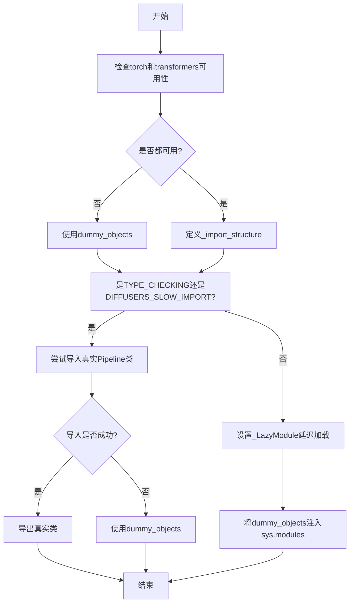
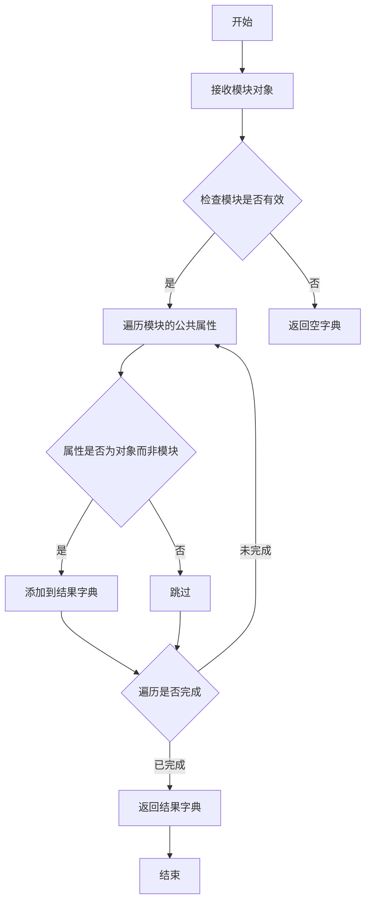
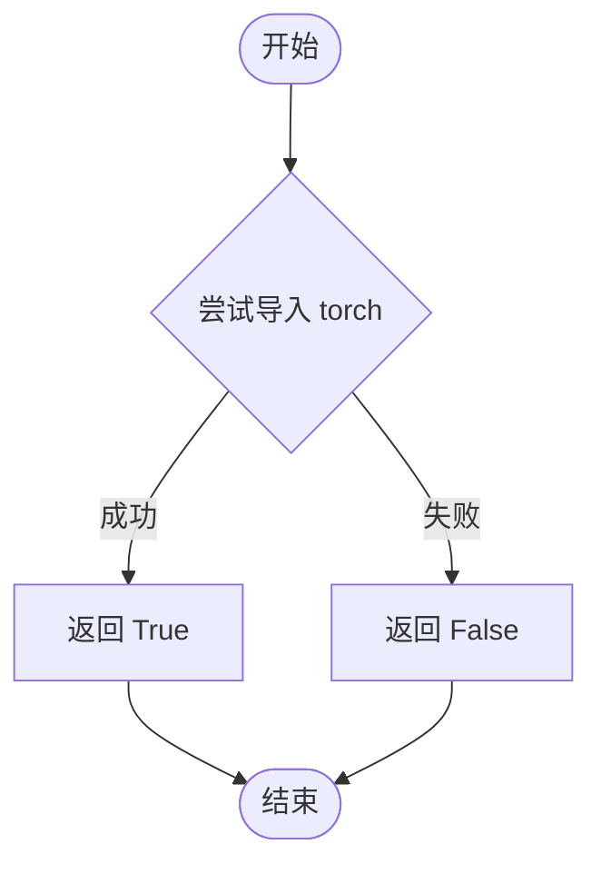
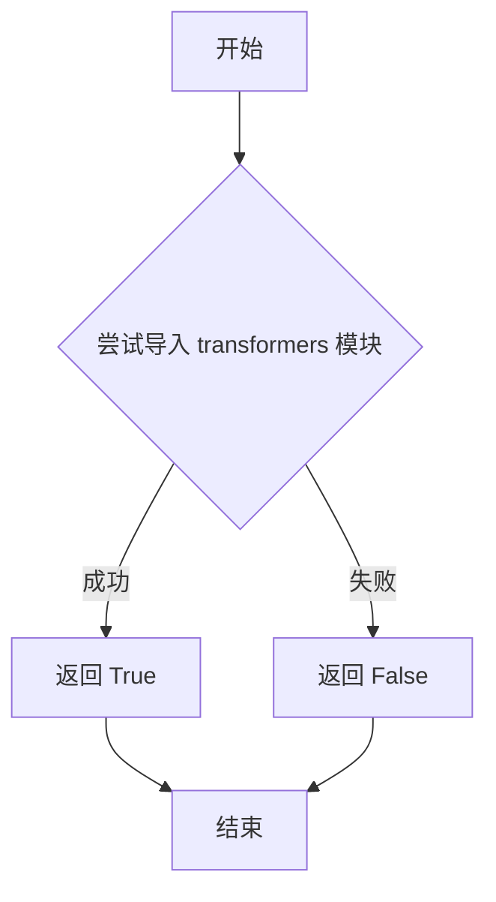

# `diffusers\src\diffusers\pipelines\stable_diffusion_gligen\__init__.py` 详细设计文档

这是一个Diffusers库的Stable Diffusion GLIGEN Pipeline模块的延迟加载初始化文件，用于在运行时动态导入StableDiffusionGLIGENPipeline和StableDiffusionGLIGENTextImagePipeline类，同时优雅地处理torch和transformers的可选依赖问题。

## 整体流程



## 类结构

```
延迟加载模块（无继承关系）
├── _LazyModule (外部导入的延迟加载机制)
├── StableDiffusionGLIGENPipeline (条件导出)
└── StableDiffusionGLIGENTextImagePipeline (条件导出)
```

## 全局变量及字段


### `_dummy_objects`
    
存储虚拟对象的字典，当可选依赖（torch和transformers）不可用时使用，用于保持模块接口完整性

类型：`dict`
    


### `_import_structure`
    
定义模块导入结构的字典，键为子模块名，值为导出的类或函数名列表，用于LazyModule延迟加载

类型：`dict`
    


### `TYPE_CHECKING`
    
typing模块的特殊常量，表示当前是否处于类型检查阶段，在运行时为False，用于条件导入类型提示

类型：`bool`
    


### `DIFFUSERS_SLOW_IMPORT`
    
控制是否使用慢速导入模式的标志，从utils模块导入，用于决定是否立即导入所有子模块或使用延迟加载

类型：`bool`
    


    

## 全局函数及方法


### `get_objects_from_module`

获取指定模块中的所有对象（类、函数等），并返回一个包含这些对象的字典，通常用于延迟加载和虚拟对象注入场景。

参数：

-  `module`：任意模块对象，要获取对象的目标模块（如 `dummy_torch_and_transformers_objects`）

返回值：`dict`，返回模块中的所有公共对象，以字典形式返回，键为对象名称，值为对象本身

#### 流程图



#### 带注释源码

```python
# 该函数定义在 diffusers/src/diffusers/utils 目录下
# 以下为基于使用场景的推断实现

def get_objects_from_module(module):
    """
    从给定模块中提取所有公共对象（类、函数等）
    
    参数:
        module: Python模块对象
        
    返回:
        dict: 模块中所有公共对象的字典，键为对象名，值为对象本身
    """
    # 初始化结果字典
    objects = {}
    
    # 检查模块是否存在
    if module is None:
        return objects
    
    # 遍历模块的所有属性
    for name in dir(module):
        # 跳过私有属性和以下划线开头的属性
        if name.startswith('_'):
            continue
            
        # 获取属性值
        attr = getattr(module, name)
        
        # 只包含非模块类型的对象（如类、函数等）
        # 排除子模块，只保留实际的类、函数等
        if not isinstance(attr, types.ModuleType):
            objects[name] = attr
    
    return objects


# 在当前代码中的使用示例：
_dummy_objects = {}

try:
    if not (is_transformers_available() and is_torch_available()):
        raise OptionalDependencyNotAvailable()
except OptionalDependencyNotAvailable:
    # 导入虚拟对象模块（当可选依赖不可用时）
    from ...utils import dummy_torch_and_transformers_objects
    
    # 获取虚拟对象并存储在 _dummy_objects 中
    # 这些虚拟对象用于延迟导入，避免导入错误
    _dummy_objects.update(get_objects_from_module(dummy_torch_and_transformers_objects))
else:
    # 当依赖可用时，定义真实的导入结构
    _import_structure["pipeline_stable_diffusion_gligen"] = ["StableDiffusionGLIGENPipeline"]
    _import_structure["pipeline_stable_diffusion_gligen_text_image"] = ["StableDiffusionGLIGENTextImagePipeline"]
```


### `is_torch_available`

检查当前 Python 环境中 PyTorch 库是否已安装且可导入，用于条件性地决定是否加载依赖于 PyTorch 的模块。

参数：

- 无参数

返回值：`bool`，如果 PyTorch 可用返回 `True`，否则返回 `False`

#### 流程图



#### 带注释源码

```python
def is_torch_available() -> bool:
    """
    检查 PyTorch 库是否可用。
    
    该函数尝试动态导入 torch 模块，用于判断当前环境是否安装了 PyTorch。
    这在库中用于条件导入，只有当 PyTorch 可用时才暴露相关的类和对象。
    
    返回值：
        bool: 如果 torch 模块可以成功导入则返回 True，否则返回 False。
    """
    try:
        import torch  # noqa: F401  # 尝试导入，实际不使用，仅检查可用性
        return True
    except ImportError:
        return False
```

**注意**：该函数的实际定义位于 `diffusers` 库的 `src/diffusers/utils/import_utils.py` 模块中，上述源码为该函数的标准实现。在提供代码片段中，仅通过 `from ...utils import is_torch_available` 进行了导入和使用。


### `is_transformers_available`

该函数用于检查当前环境中是否已安装并可用 `transformers` 库。它通过尝试导入 `transformers` 模块来判断其是否可用，返回布尔值（`True` 表示可用，`False` 表示不可用）。

参数：

- 该函数无参数

返回值：`bool`，返回 `True` 表示 `transformers` 库可用，返回 `False` 表示不可用。

#### 流程图



#### 带注释源码

```
# 该函数的实际实现位于 ...utils 模块中
# 以下为引用位置的代码展示

from ...utils import (
    DIFFUSERS_SLOW_IMPORT,
    OptionalDependencyNotAvailable,
    _LazyModule,
    get_objects_from_module,
    is_torch_available,
    is_transformers_available,  # <-- 从 utils 模块导入的函数
)

# 使用方式示例：
try:
    if not (is_transformers_available() and is_torch_available()):
        # 只有当 transformers 和 torch 都可用时才执行
        raise OptionalDependencyNotAvailable()
except OptionalDependencyNotAvailable:
    # 导入虚拟对象作为后备
    from ...utils import dummy_torch_and_transformers_objects
    _dummy_objects.update(get_objects_from_module(dummy_torch_and_transformers_objects))
else:
    # 当依赖可用时，导入实际的管道类
    _import_structure["pipeline_stable_diffusion_gligen"] = ["StableDiffusionGLIGENPipeline"]
    _import_structure["pipeline_stable_diffusion_gligen_text_image"] = ["StableDiffusionGLIGENTextImagePipeline"]
```

> **注意**：由于 `is_transformers_available` 函数的实际实现位于 `...utils` 模块中，而非当前代码文件内，上述源码仅展示该函数在当前文件中的导入和使用方式。该函数通常在 `utils` 模块中通过 `try-except` 方式尝试导入 `transformers` 包来判断其可用性。


### `setattr` (内置函数)

这是一个 Python 内置函数，在该代码中用于将虚拟（dummy）对象动态设置为当前模块的属性，以便在可选依赖（torch 和 transformers）不可用时提供替代对象。

参数：

- `obj`：`object`，要设置属性的对象，此处为 `sys.modules[__name__]`（当前模块）
- `name`：`str`，要设置的属性名称，此处为 `_dummy_objects` 字典中的键（name）
- `value`：要设置的属性值，此处为 `_dummy_objects` 字典中的值（value）

返回值：`None`，无返回值（Python 内置 setattr 函数返回 None）

#### 流程图

```mermaid
flowchart TD
    A[开始] --> B{检查 transformers<br>和 torch 可用性}
    B -->|不可用| C[导入 dummy_torch_and_transformers_objects]
    B -->|可用| D[定义 _import_structure<br>包含实际 Pipeline 类]
    
    C --> E[从 dummy 模块获取对象<br>get_objects_from_module]
    D --> F{检查 TYPE_CHECKING<br>或 DIFFUSERS_SLOW_IMPORT}
    
    E --> G[更新 _dummy_objects 字典]
    F -->|是| H[从实际模块导入 Pipeline 类]
    F -->|否| I[创建 _LazyModule]
    
    G --> J{检查 TYPE_CHECKING<br>或 DIFFUSERS_SLOW_IMPORT}
    H --> K[直接导入到当前命名空间]
    I --> L[注册到 sys.modules]
    
    J -->|是| K
    J -->|否| L
    
    L --> M[遍历 _dummy_objects]
    M --> N{还有更多对象?}
    N -->|是| O[调用 setattr<br>sys.modules[__name__]<br>name, value]
    O --> N
    N -->|否| P[结束]
    
    K --> P
```

#### 带注释源码

```python
# 遍历 _dummy_objects 字典中的所有条目
# _dummy_objects 包含了当 torch 和 transformers 不可用时的替代（dummy）对象
for name, value in _dummy_objects.items():
    # 使用 setattr 内置函数将每个 dummy 对象动态设置为当前模块的属性
    # 参数1: sys.modules[__name__] - 当前模块对象
    # 参数2: name - 属性名称（来自字典的键）
    # 参数3: value - 属性值（来自字典的值，即 dummy 对象）
    # 这样使得当用户尝试访问这些不存在的类时，会得到一个友好的错误提示
    # 而不是 AttributeError
    setattr(sys.modules[__name__], name, value)
```

#### 关键组件信息

| 名称 | 一句话描述 |
|------|------------|
| `_dummy_objects` | 存储可选依赖不可用时的替代（dummy）对象字典 |
| `_import_structure` | 定义模块的导入结构，包含可用的 Pipeline 类 |
| `sys.modules[__name__]` | 当前模块在 sys.modules 中的引用，用于动态设置属性 |
| `_LazyModule` | 延迟加载模块的实现类，用于懒加载子模块 |

#### 潜在技术债务或优化空间

1. **魔法字符串**：`"pipeline_stable_diffusion_gligen"` 和 `"pipeline_stable_diffusion_gligen_text_image"` 等字符串字面量散落在代码中，建议提取为常量
2. **重复代码逻辑**：检查 `is_transformers_available() and is_torch_available()` 的逻辑在多个地方重复出现，可提取为工具函数
3. **硬编码的模块路径**：`.pipeline_stable_diffusion_gligen` 等路径硬编码，可考虑通过反射或配置动态生成

## 关键组件


### 惰性加载机制 (Lazy Loading Mechanism)

使用 `_LazyModule` 实现模块的惰性加载，允许在运行时按需导入重量级依赖（如 torch 和 transformers），避免在模块初始化时立即加载所有依赖，从而提升导入速度和内存效率。

### 可选依赖检查 (Optional Dependency Checking)

通过 `is_torch_available()` 和 `is_transformers_available()` 检查 torch 和 transformers 是否可用，并在依赖不可用时抛出 `OptionalDependencyNotAvailable` 异常，实现条件的静默处理和优雅降级。

### 导入结构管理 (Import Structure Management)

使用 `_import_structure` 字典定义可导出的公开接口（StableDiffusionGLIGENPipeline 和 StableDiffusionGLIGENTextImagePipeline），配合惰性模块机制控制哪些类可以被外部访问。

### 虚拟对象模式 (Dummy Objects Pattern)

当可选依赖不可用时，通过 `get_objects_from_module` 从 dummy 模块获取虚拟对象并注册到当前模块，确保代码在类型检查或静态分析时不因缺少依赖而失败，同时保持 API 的一致性。

### 类型检查模式支持 (TYPE_CHECKING Support)

通过 `TYPE_CHECKING` 标志在类型检查阶段导入实际类进行类型注解，而在运行时使用惰性导入，大幅减少生产环境的依赖加载开销。


## 问题及建议


### 已知问题

-   **重复的条件检查**：依赖可用性检查 `if not (is_transformers_available() and is_torch_available())` 在代码中重复出现3次（try-except块、TYPE_CHECK分支、以及else分支的LazyModule注册），违反DRY原则
-   **魔法字符串硬编码**：pipeline名称 `"pipeline_stable_diffusion_gligen"` 和 `"pipeline_stable_diffusion_gligen_text_image"` 硬编码在多处，缺乏常量定义
-   **LazyModule 逻辑复杂**：TYPE_CHECK 和 DIFFUSERS_SLOW_IMPORT 的分支逻辑重复，可合并简化
-   **缺少错误处理**：调用 `get_objects_from_module()` 和 `setattr()` 时没有异常处理，可能导致运行时错误
-   **空字典初始化冗余**：`_dummy_objects = {}` 初始化后立即在 except 块中使用 `update()`，逻辑可简化

### 优化建议

-   将依赖检查提取为单独的函数或常量，避免重复代码
-   定义模块级别的常量存储 pipeline 名称，如 `PIPELINE_NAMES = ["pipeline_stable_diffusion_gligen", ...]`
-   合并 TYPE_CHECK 和 DIFFUSERS_SLOW_IMPORT 的处理逻辑，使用统一的条件分支
-   为关键操作添加 try-except 错误处理，提高代码健壮性
-   考虑将 `_import_structure` 的构建逻辑封装为函数，提高可维护性
-   添加 docstring 说明模块的懒加载机制和依赖要求


## 其它


### 设计目标与约束

**设计目标**：实现Stable Diffusion GLIGEN Pipeline的延迟加载机制，在保证模块懒加载的同时优雅地处理torch和transformers的可选依赖问题，使库能够在未安装这些依赖的环境中仍能正常导入（仅在使用时报错）。

**约束条件**：
- 仅在torch和transformers均可用时导入真实的Pipeline类
- 使用LazyModule机制实现延迟加载，减少启动时的导入开销
- 保持与Diffusers库其他模块一致的导入结构

### 错误处理与异常设计

**OptionalDependencyNotAvailable异常**：
- 当torch或transformers任一不可用时抛出此异常
- 异常由上层utils模块定义，本模块捕获并触发dummy对象的加载流程
- 目的是允许模块在缺少可选依赖时仍能被导入，但实际使用时才会报错

**Dummy对象机制**：
- 当可选依赖不可用时，从dummy_torch_and_transformers_objects模块导入空对象
- 这些空对象在实际调用时会触发正确的缺失依赖错误
- 通过setattr将dummy对象动态添加到当前模块

### 外部依赖与接口契约

**硬依赖**：
- typing.TYPE_CHECKING：用于类型检查时的静态导入
- _LazyModule类：来自diffusers.utils的延迟加载实现
- get_objects_from_module函数：用于从模块获取所有对象
- OptionalDependencyNotAvailable异常类

**可选依赖**：
- torch：深度学习计算框架
- transformers：预训练模型库
- pipeline_stable_diffusion_gligen模块：StableDiffusionGLIGENPipeline实现
- pipeline_stable_diffusion_gligen_text_image模块：StableDiffusionGLIGENTextImagePipeline实现

**导出接口**：
- StableDiffusionGLIGENPipeline类
- StableDiffusionGLIGENTextImagePipeline类

### 性能考虑

**延迟加载收益**：
- 减少Diffusers库初始导入时间
- 避免加载不必要的GPU相关依赖
- 内存占用最小化（仅在实际使用时加载）

**潜在性能问题**：
- 首次调用Pipeline时会有额外的模块导入开销
- TYPE_CHECKING模式下会在类型检查时立即导入所有内容

### 版本兼容性信息

**Python版本要求**：遵循Diffusers库的Python版本要求（通常为Python 3.8+）

**依赖版本约束**：
- torch：无严格版本约束，由环境决定
- transformers：无严格版本约束，由环境决定

### 测试策略建议

**单元测试应覆盖**：
- 可用依赖时的正常导入流程
- 缺失依赖时的优雅降级处理
- LazyModule的延迟加载行为验证
- dummy对象的错误触发机制

### 配置管理

**环境变量**：
- DIFFUSERS_SLOW_IMPORT：控制是否使用延迟加载模式
- 当设为True时，即使不在TYPE_CHECKING模式下也会立即导入所有内容


    