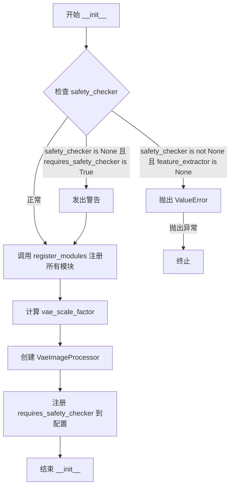
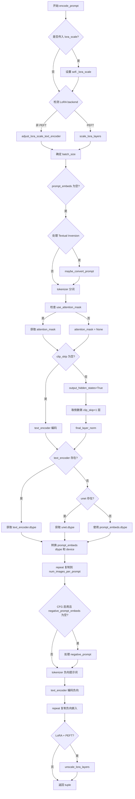
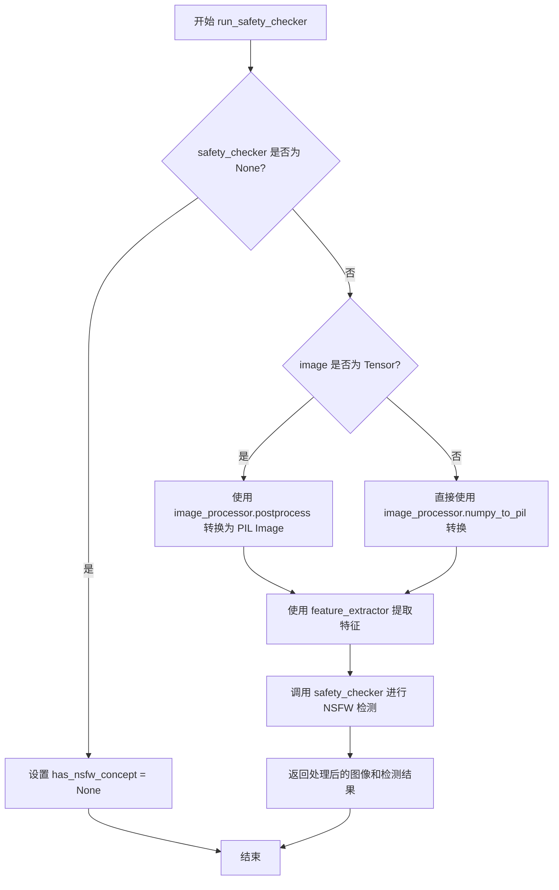
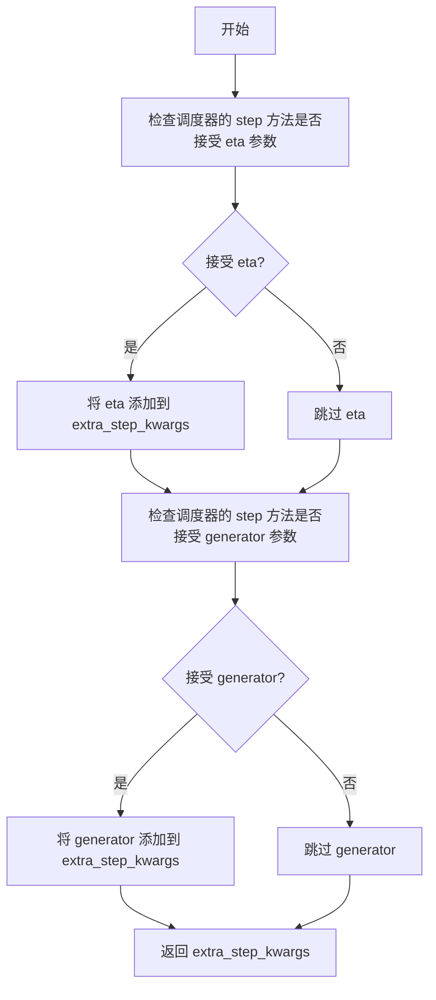
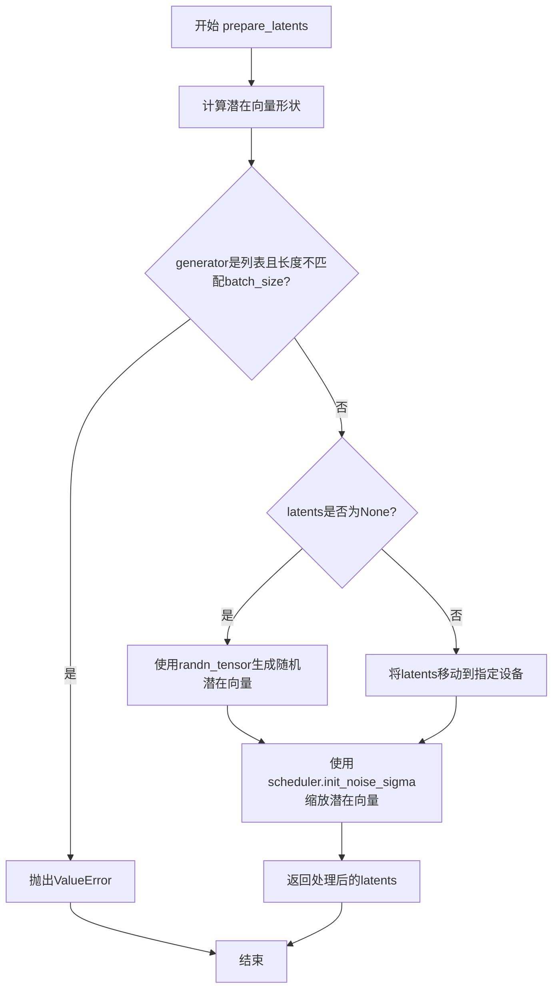
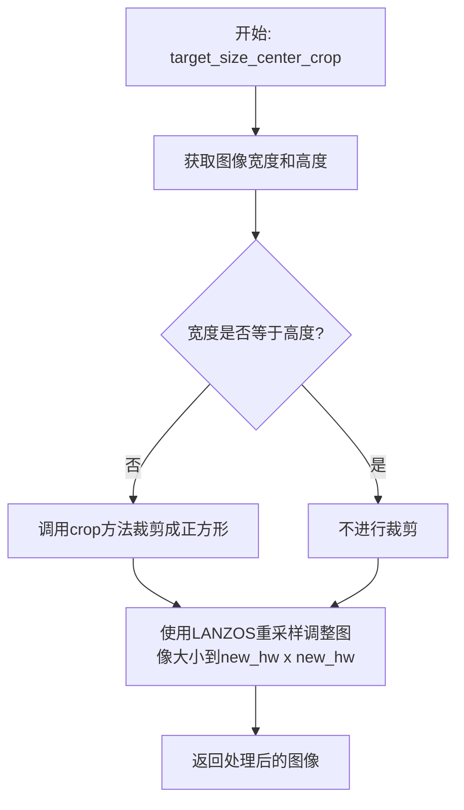
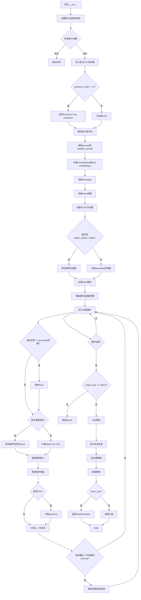

# `diffusers\src\diffusers\pipelines\stable_diffusion_gligen\pipeline_stable_diffusion_gligen.py` 详细设计文档

这是一个用于文本到图像生成的管道（Pipeline），基于Stable Diffusion并集成了GLIGEN（Grounded Language-to-Image Generation）技术。该管道允许用户通过文本描述（prompts）和对应的边界框（bounding boxes）精确控制生成图像中特定区域的内容，实现基于空间锚点的可控图像生成与修复。

## 整体流程

```mermaid
graph TD
    Start([开始 __call__]) --> CheckInputs{检查输入参数}
    CheckInputs --> EncodePrompt[编码提示词 (encode_prompt)]
    EncodePrompt --> PrepareLatents[准备初始潜在向量 (prepare_latents)]
    PrepareLatents --> PrepareGLIGEN[准备GLIGEN数据 (处理boxes/phrases)]
    PrepareGLIGEN --> DenoiseLoop{去噪循环 (for timesteps)}
    DenoiseLoop --> EnableFuser[开启/关闭 Fuser 模块]
    EnableFuser --> UNetPredict[UNet 预测噪声]
    UNetPredict --> CFG[Classifier Free Guidance]
    CFG --> SchedulerStep[调度器步进 (scheduler.step)]
    SchedulerStep --> LatentsUpdate[更新 Latents]
    LatentsUpdate --> CheckLoopEnd{未结束?}
    CheckLoopEnd -- 是 --> DenoiseLoop
    CheckLoopEnd -- 否 --> Decode[VAE 解码 (decode)]
    Decode --> SafetyCheck[安全检查 (run_safety_checker)]
    SafetyCheck --> Return[返回结果]
```

## 类结构

```
DiffusionPipeline (抽象基类)
├── StableDiffusionMixin (混入类)
├── DeprecatedPipelineMixin (混入类)
└── StableDiffusionGLIGENPipeline (具体实现类)
```

## 全局变量及字段


### `logger`
    
全局日志记录器，用于记录管道运行时的信息、警告和错误

类型：`logging.Logger`
    


### `EXAMPLE_DOC_STRING`
    
文档示例字符串，包含管道使用示例的Python代码

类型：`str`
    


### `XLA_AVAILABLE`
    
标记是否支持XLA (Torch XLA)，用于判断是否可以使用PyTorch XLA加速

类型：`bool`
    


### `StableDiffusionGLIGENPipeline.vae`
    
变分自编码器，用于图像与潜空间的转换

类型：`AutoencoderKL`
    


### `StableDiffusionGLIGENPipeline.text_encoder`
    
冻结的CLIP文本编码器，用于将文本转换为向量表示

类型：`CLIPTextModel`
    


### `StableDiffusionGLIGENPipeline.tokenizer`
    
文本分词器，用于将文本分割为token

类型：`CLIPTokenizer`
    


### `StableDiffusionGLIGENPipeline.unet`
    
去噪UNet网络，用于预测噪声残差

类型：`UNet2DConditionModel`
    


### `StableDiffusionGLIGENPipeline.scheduler`
    
扩散调度器，控制去噪过程中的噪声调度

类型：`KarrasDiffusionSchedulers`
    


### `StableDiffusionGLIGENPipeline.safety_checker`
    
安全检查器，用于检测生成图像是否包含不当内容

类型：`StableDiffusionSafetyChecker | None`
    


### `StableDiffusionGLIGENPipeline.feature_extractor`
    
特征提取器，用于从图像中提取特征供安全检查器使用

类型：`CLIPImageProcessor | None`
    


### `StableDiffusionGLIGENPipeline.vae_scale_factor`
    
VAE缩放因子，用于计算潜空间的尺寸

类型：`int`
    


### `StableDiffusionGLIGENPipeline.image_processor`
    
图像处理器，用于图像的预处理和后处理

类型：`VaeImageProcessor`
    
    

## 全局函数及方法


### `StableDiffusionGLIGENPipeline.__init__`

这是 Stable Diffusion GLIGEN Pipeline 的构造函数，负责初始化整个pipeline的所有核心组件，包括VAE、文本编码器、分词器、UNet模型、调度器以及可选的安全检查器和特征提取器。

参数：

-  `vae`：`AutoencoderKL`，Variational Auto-Encoder (VAE) 模型，用于将图像编码和解码到潜在表示
-  `text_encoder`：`CLIPTextModel`，冻结的文本编码器 (clip-vit-large-patch14)
-  `tokenizer`：`CLIPTokenizer`，用于对文本进行分词的 CLIPTokenizer
-  `unet`：`UNet2DConditionModel`，用于对编码后的图像潜在表示进行去噪的 UNet2DConditionModel
-  `scheduler`：`KarrasDiffusionSchedulers`，调度器，与 `unet` 结合使用来对图像潜在表示进行去噪
-  `safety_checker`：`StableDiffusionSafetyChecker`，安全检查器，用于评估生成的图像是否可能被认为是冒犯性或有害的
-  `feature_extractor`：`CLIPImageProcessor`，用于从生成的图像中提取特征的 CLIPImageProcessor，作为 safety_checker 的输入
-  `requires_safety_checker`：`bool = True`，是否需要安全检查器

返回值：`None`，构造函数无返回值

#### 流程图



#### 带注释源码

```python
def __init__(
    self,
    vae: AutoencoderKL,
    text_encoder: CLIPTextModel,
    tokenizer: CLIPTokenizer,
    unet: UNet2DConditionModel,
    scheduler: KarrasDiffusionSchedulers,
    safety_checker: StableDiffusionSafetyChecker,
    feature_extractor: CLIPImageProcessor,
    requires_safety_checker: bool = True,
):
    """
    初始化 StableDiffusionGLIGENPipeline
    
    参数:
        vae: VAE模型，用于图像编码/解码
        text_encoder: CLIP文本编码器
        tokenizer: CLIP分词器
        unet: 条件UNet去噪模型
        scheduler: Karras扩散调度器
        safety_checker: 安全检查器（可选）
        feature_extractor: CLIP图像处理器
        requires_safety_checker: 是否启用安全检查
    """
    # 调用父类构造函数
    super().__init__()

    # 如果safety_checker为None但requires_safety_checker为True，发出警告
    if safety_checker is None and requires_safety_checker:
        logger.warning(
            f"You have disabled the safety checker for {self.__class__} by passing `safety_checker=None`. Ensure"
            " that you abide to the conditions of the Stable Diffusion license and do not expose unfiltered"
            " results in services or applications open to the public. Both the diffusers team and Hugging Face"
            " strongly recommend to keep the safety filter enabled in all public facing circumstances, disabling"
            " it only for use-cases that involve analyzing network behavior or auditing its results. For more"
            " information, please have a look at https://github.com/huggingface/diffusers/pull/254 ."
        )

    # 如果提供了safety_checker但没有feature_extractor，抛出错误
    if safety_checker is not None and feature_extractor is None:
        raise ValueError(
            "Make sure to define a feature extractor when loading {self.__class__} if you want to use the safety"
            " checker. If you do not want to use the safety checker, you can pass `'safety_checker=None'` instead."
        )

    # 注册所有模块到pipeline
    self.register_modules(
        vae=vae,
        text_encoder=text_encoder,
        tokenizer=tokenizer,
        unet=unet,
        scheduler=scheduler,
        safety_checker=safety_checker,
        feature_extractor=feature_extractor,
    )
    
    # 计算VAE缩放因子，基于block_out_channels的深度
    self.vae_scale_factor = 2 ** (len(self.vae.config.block_out_channels) - 1) if getattr(self, "vae", None) else 8
    
    # 创建图像处理器，用于图像预处理和后处理
    self.image_processor = VaeImageProcessor(vae_scale_factor=self.vae_scale_factor, do_convert_rgb=True)
    
    # 注册requires_safety_checker到pipeline配置
    self.register_to_config(requires_safety_checker=requires_safety_checker)
```


### `StableDiffusionGLIGENPipeline._encode_prompt`

该方法是Stable Diffusion GLIGEN Pipeline的提示编码功能，用于将文本提示转换为文本编码器的隐藏状态。它处理分类器自由引导（classifier-free guidance）和LoRA缩放，并委托给`encode_prompt`方法执行实际编码。为了向后兼容性，该方法将negative和positive prompt embeddings连接起来返回。

参数：

- `self`：StableDiffusionGLIGENPipeline实例
- `prompt`：`str`或`list[str]`，要编码的提示文本
- `device`：`torch.device`，PyTorch设备
- `num_images_per_prompt`：`int`，每个提示生成的图像数量
- `do_classifier_free_guidance`：`bool`，是否使用分类器自由引导
- `negative_prompt`：`str`或`list[str]`或`None`，负面提示词，用于引导不生成的内容
- `prompt_embeds`：`torch.Tensor | None`，预生成的文本嵌入，如果未提供则从prompt生成
- `negative_prompt_embeds`：`torch.Tensor | None`，预生成的负面文本嵌入
- `lora_scale`：`float | None`，LoRA缩放因子，用于调整LoRA层的影响
- `**kwargs`：其他关键字参数

返回值：`torch.Tensor`，连接后的提示嵌入张量，顺序为[negative_prompt_embeds, prompt_embeds]，用于分类器自由引导

#### 流程图

```mermaid
flowchart TD
    A[开始 _encode_prompt] --> B[记录弃用警告]
    B --> C[调用 encode_prompt 方法]
    C --> D[获取返回值元组 prompt_embeds_tuple]
    D --> E[连接 embeddings: torch.cat<br/>[prompt_embeds_tuple[1], prompt_embeds_tuple[0]]]
    E --> F[返回 prompt_embeds]
```

#### 带注释源码

```python
def _encode_prompt(
    self,
    prompt,
    device,
    num_images_per_prompt,
    do_classifier_free_guidance,
    negative_prompt=None,
    prompt_embeds: torch.Tensor | None = None,
    negative_prompt_embeds: torch.Tensor | None = None,
    lora_scale: float | None = None,
    **kwargs,
):
    # 记录弃用警告，提醒用户使用 encode_prompt 方法代替
    # 同时告知输出格式从连接的张量改为元组
    deprecation_message = "`_encode_prompt()` is deprecated and it will be removed in a future version. Use `encode_prompt()` instead. Also, be aware that the output format changed from a concatenated tensor to a tuple."
    deprecate("_encode_prompt()", "1.0.0", deprecation_message, standard_warn=False)

    # 调用 encode_prompt 方法获取编码后的嵌入
    # 返回值为元组 (prompt_embeds, negative_prompt_embeds)
    prompt_embeds_tuple = self.encode_prompt(
        prompt=prompt,
        device=device,
        num_images_per_prompt=num_images_per_prompt,
        do_classifier_free_guidance=do_classifier_free_guidance,
        negative_prompt=negative_prompt,
        prompt_embeds=prompt_embeds,
        negative_prompt_embeds=negative_prompt_embeds,
        lora_scale=lora_scale,
        **kwargs,
    )

    # 为了向后兼容性，将 negative 和 positive embeddings 再次连接
    # 元组顺序为 (prompt_embeds, negative_prompt_embeds)
    # 连接后顺序变为 [negative_prompt_embeds, prompt_embeds]
    # 这样符合分类器自由引导的惯例：unconditional 在前，text 在后
    prompt_embeds = torch.cat([prompt_embeds_tuple[1], prompt_embeds_tuple[0]])

    return prompt_embeds
```


### `StableDiffusionGLIGENPipeline.encode_prompt`

该方法将文本提示词编码为文本 encoder 的隐藏状态向量（embeddings），支持 LoRA 权重调整、CLIP 层跳跃skip、分类器自由引导（CFG）等功能，是 Stable Diffusion  pipelines 中处理文本输入的核心方法。

参数：

- `prompt`：`str | list[str] | None`，要编码的提示词，可以是单个字符串或字符串列表
- `device`：`torch.device`，torch 设备，用于指定计算设备
- `num_images_per_prompt`：`int`，每个提示词需要生成的图像数量，用于批量生成
- `do_classifier_free_guidance`：`bool`，是否使用分类器自由引导（CFG）
- `negative_prompt`：`str | list[str] | None`，负向提示词，用于引导不生成的内容
- `prompt_embeds`：`torch.Tensor | None`，预生成的提示词嵌入，可用于微调输入
- `negative_prompt_embeds`：`torch.Tensor | None`，预生成的负向提示词嵌入
- `lora_scale`：`float | None`，LoRA 缩放因子，用于调整 LoRA 层的影响
- `clip_skip`：`int | None`，CLIP 编码时跳过的层数，用于获取不同层次的特征

返回值：`tuple[torch.Tensor, torch.Tensor]`，返回提示词嵌入和负向提示词嵌入的元组

#### 流程图



#### 带注释源码

```python
def encode_prompt(
    self,
    prompt,
    device,
    num_images_per_prompt,
    do_classifier_free_guidance,
    negative_prompt=None,
    prompt_embeds: torch.Tensor | None = None,
    negative_prompt_embeds: torch.Tensor | None = None,
    lora_scale: float | None = None,
    clip_skip: int | None = None,
):
    r"""
    Encodes the prompt into text encoder hidden states.

    Args:
        prompt (`str` or `list[str]`, *optional*):
            prompt to be encoded
        device: (`torch.device`):
            torch device
        num_images_per_prompt (`int`):
            number of images that should be generated per prompt
        do_classifier_free_guidance (`bool`):
            whether to use classifier free guidance or not
        negative_prompt (`str` or `list[str]`, *optional*):
            The prompt or prompts not to guide the image generation. If not defined, one has to pass
            `negative_prompt_embeds` instead. Ignored when not using guidance (i.e., ignored if `guidance_scale` is
            less than `1`).
        prompt_embeds (`torch.Tensor`, *optional*):
            Pre-generated text embeddings. Can be used to easily tweak text inputs, *e.g.* prompt weighting. If not
            provided, text embeddings will be generated from `prompt` input argument.
        negative_prompt_embeds (`torch.Tensor`, *optional*):
            Pre-generated negative text embeddings. Can be used to easily tweak text inputs, *e.g.* prompt
            weighting. If not provided, negative_prompt_embeds will be generated from `negative_prompt` input
            argument.
        lora_scale (`float`, *optional*):
            A LoRA scale that will be applied to all LoRA layers of the text encoder if LoRA layers are loaded.
        clip_skip (`int`, *optional*):
            Number of layers to be skipped from CLIP while computing the prompt embeddings. A value of 1 means that
            the output of the pre-final layer will be used for computing the prompt embeddings.
    """
    # 设置 lora scale 以便 text encoder 的 monkey patched LoRA 函数可以正确访问
    if lora_scale is not None and isinstance(self, StableDiffusionLoraLoaderMixin):
        self._lora_scale = lora_scale

        # 动态调整 LoRA scale
        if not USE_PEFT_BACKEND:
            adjust_lora_scale_text_encoder(self.text_encoder, lora_scale)
        else:
            scale_lora_layers(self.text_encoder, lora_scale)

    # 确定 batch size：如果 prompt 是字符串则为 1，如果是列表则为列表长度，否则使用 prompt_embeds 的 batch 大小
    if prompt is not None and isinstance(prompt, str):
        batch_size = 1
    elif prompt is not None and isinstance(prompt, list):
        batch_size = len(prompt)
    else:
        batch_size = prompt_embeds.shape[0]

    # 如果未提供 prompt_embeds，则从 prompt 生成
    if prompt_embeds is None:
        # 处理 textual inversion：必要时处理多向量 token
        if isinstance(self, TextualInversionLoaderMixin):
            prompt = self.maybe_convert_prompt(prompt, self.tokenizer)

        # 使用 tokenizer 将 prompt 转换为 token IDs
        text_inputs = self.tokenizer(
            prompt,
            padding="max_length",
            max_length=self.tokenizer.model_max_length,
            truncation=True,
            return_tensors="pt",
        )
        text_input_ids = text_inputs.input_ids
        # 获取未截断的 token IDs 用于检测截断
        untruncated_ids = self.tokenizer(prompt, padding="longest", return_tensors="pt").input_ids

        # 检测并警告截断
        if untruncated_ids.shape[-1] >= text_input_ids.shape[-1] and not torch.equal(
            text_input_ids, untruncated_ids
        ):
            removed_text = self.tokenizer.batch_decode(
                untruncated_ids[:, self.tokenizer.model_max_length - 1 : -1]
            )
            logger.warning(
                "The following part of your input was truncated because CLIP can only handle sequences up to"
                f" {self.tokenizer.model_max_length} tokens: {removed_text}"
            )

        # 检查 text_encoder 是否使用 attention_mask
        if hasattr(self.text_encoder.config, "use_attention_mask") and self.text_encoder.config.use_attention_mask:
            attention_mask = text_inputs.attention_mask.to(device)
        else:
            attention_mask = None

        # 根据 clip_skip 参数决定使用哪层隐藏状态
        if clip_skip is None:
            # 直接使用最后一层隐藏状态
            prompt_embeds = self.text_encoder(text_input_ids.to(device), attention_mask=attention_mask)
            prompt_embeds = prompt_embeds[0]
        else:
            # 获取所有隐藏状态，选择倒数第 clip_skip+1 层
            prompt_embeds = self.text_encoder(
                text_input_ids.to(device), attention_mask=attention_mask, output_hidden_states=True
            )
            # hidden_states 是一个元组，包含所有 encoder 层的输出
            prompt_embeds = prompt_embeds[-1][-(clip_skip + 1)]
            # 应用 final_layer_norm 以获得正确的表示
            prompt_embeds = self.text_encoder.text_model.final_layer_norm(prompt_embeds)

    # 确定 prompt_embeds 的 dtype（优先使用 text_encoder 的 dtype）
    if self.text_encoder is not None:
        prompt_embeds_dtype = self.text_encoder.dtype
    elif self.unet is not None:
        prompt_embeds_dtype = self.unet.dtype
    else:
        prompt_embeds_dtype = prompt_embeds.dtype

    # 转换 prompt_embeds 到正确的 dtype 和 device
    prompt_embeds = prompt_embeds.to(dtype=prompt_embeds_dtype, device=device)

    # 获取 batch 嵌入的维度信息
    bs_embed, seq_len, _ = prompt_embeds.shape
    # 为每个 prompt 复制文本嵌入（使用 mps 友好的方法）
    prompt_embeds = prompt_embeds.repeat(1, num_images_per_prompt, 1)
    prompt_embeds = prompt_embeds.view(bs_embed * num_images_per_prompt, seq_len, -1)

    # 为分类器自由引导获取无条件嵌入
    if do_classifier_free_guidance and negative_prompt_embeds is None:
        uncond_tokens: list[str]
        if negative_prompt is None:
            # 默认使用空字符串
            uncond_tokens = [""] * batch_size
        elif prompt is not None and type(prompt) is not type(negative_prompt):
            raise TypeError(
                f"`negative_prompt` should be the same type to `prompt`, but got {type(negative_prompt)} !="
                f" {type(prompt)}."
            )
        elif isinstance(negative_prompt, str):
            uncond_tokens = [negative_prompt]
        elif batch_size != len(negative_prompt):
            raise ValueError(
                f"`negative_prompt`: {negative_prompt} has batch size {len(negative_prompt)}, but `prompt`:"
                f" {prompt} has batch size {batch_size}. Please make sure that passed `negative_prompt` matches"
                " the batch size of `prompt`."
            )
        else:
            uncond_tokens = negative_prompt

        # 处理 textual inversion
        if isinstance(self, TextualInversionLoaderMixin):
            uncond_tokens = self.maybe_convert_prompt(uncond_tokens, self.tokenizer)

        max_length = prompt_embeds.shape[1]
        uncond_input = self.tokenizer(
            uncond_tokens,
            padding="max_length",
            max_length=max_length,
            truncation=True,
            return_tensors="pt",
        )

        # 处理 attention_mask
        if hasattr(self.text_encoder.config, "use_attention_mask") and self.text_encoder.config.use_attention_mask:
            attention_mask = uncond_input.attention_mask.to(device)
        else:
            attention_mask = None

        # 编码无条件嵌入
        negative_prompt_embeds = self.text_encoder(
            uncond_input.input_ids.to(device),
            attention_mask=attention_mask,
        )
        negative_prompt_embeds = negative_prompt_embeds[0]

    # 如果使用 CFG，复制无条件嵌入
    if do_classifier_free_guidance:
        seq_len = negative_prompt_embeds.shape[1]

        negative_prompt_embeds = negative_prompt_embeds.to(dtype=prompt_embeds_dtype, device=device)

        negative_prompt_embeds = negative_prompt_embeds.repeat(1, num_images_per_prompt, 1)
        negative_prompt_embeds = negative_prompt_embeds.view(batch_size * num_images_per_prompt, seq_len, -1)

    # 如果使用了 LoRA + PEFT，恢复原始 scale
    if self.text_encoder is not None:
        if isinstance(self, StableDiffusionLoraLoaderMixin) and USE_PEFT_BACKEND:
            # 通过 unscale LoRA 层恢复原始 scale
            unscale_lora_layers(self.text_encoder, lora_scale)

    return prompt_embeds, negative_prompt_embeds
```


### `StableDiffusionGLIGENPipeline.run_safety_checker`

该方法用于对生成的图像进行安全检查（NSFW检测），通过图像处理器将图像转换为适合特征提取器输入的格式，然后调用安全检查器判断图像是否包含不当内容。

参数：

- `image`：`torch.Tensor | PIL.Image | np.ndarray`，输入的图像数据，可以是PyTorch张量、PIL图像或NumPy数组
- `device`：`torch.device`，指定用于计算的设备（如CPU或CUDA设备）
- `dtype`：`torch.dtype`，指定用于计算的数据类型（如float16、float32等）

返回值：元组，包含以下两个元素：
- `image`：处理后的图像，类型与输入一致
- `has_nsfw_concept`：是否检测到NSFW内容的布尔值列表，如果safety_checker为None则返回None

#### 流程图



#### 带注释源码

```python
def run_safety_checker(self, image, device, dtype):
    """
    运行安全检查器对图像进行NSFW检测
    
    参数:
        image: 输入图像，可以是torch.Tensor、PIL.Image或numpy数组
        device: 计算设备
        dtype: 计算数据类型
    
    返回:
        tuple: (处理后的图像, NSFW检测结果)
    """
    # 检查安全检查器是否已加载
    if self.safety_checker is None:
        # 如果未配置安全检查器，直接返回None表示无NSFW概念
        has_nsfw_concept = None
    else:
        # 将图像转换为PIL格式以供特征提取器使用
        if torch.is_tensor(image):
            # 如果输入是PyTorch张量，使用后处理器转换为PIL图像
            feature_extractor_input = self.image_processor.postprocess(image, output_type="pil")
        else:
            # 如果是numpy数组，直接转换为PIL图像
            feature_extractor_input = self.image_processor.numpy_to_pil(image)
        
        # 使用特征提取器提取图像特征并转换为张量
        safety_checker_input = self.feature_extractor(feature_extractor_input, return_tensors="pt").to(device)
        
        # 调用安全检查器进行NSFW检测，传入图像和CLIP特征
        image, has_nsfw_concept = self.safety_checker(
            images=image, clip_input=safety_checker_input.pixel_values.to(dtype)
        )
    
    # 返回处理后的图像和NSFW检测结果
    return image, has_nsfw_concept
```


### `StableDiffusionGLIGENPipeline.prepare_extra_step_kwargs`

该方法用于准备调度器（scheduler）的额外参数。由于不同的调度器具有不同的签名，该方法通过检查调度器的 `step` 方法是否接受 `eta` 和 `generator` 参数来动态构建需要传递给调度器的额外关键字参数字典。

参数：

- `self`：`StableDiffusionGLIGENPipeline` 实例本身
- `generator`：`torch.Generator | list[torch.Generator] | None`，用于控制随机数生成以确保可重复性
- `eta`：`float`，DDIM 调度器参数（默认值为 0.0），对应 DDIM 论文中的 η 参数，应在 [0, 1] 范围内

返回值：`dict`，包含需要传递给调度器 `step` 方法的额外关键字参数（如 `eta` 和/或 `generator`）

#### 流程图



#### 带注释源码

```python
def prepare_extra_step_kwargs(self, generator, eta):
    # 准备调度器步骤的额外参数，因为并非所有调度器都具有相同的签名
    # eta (η) 仅在 DDIMScheduler 中使用，在其他调度器中将被忽略
    # eta 对应 DDIM 论文中的 η: https://huggingface.co/papers/2010.02502
    # eta 取值应在 [0, 1] 范围内

    # 使用 inspect 模块检查调度器的 step 方法签名，判断是否接受 eta 参数
    accepts_eta = "eta" in set(inspect.signature(self.scheduler.step).parameters.keys())
    
    # 初始化空字典用于存储额外参数
    extra_step_kwargs = {}
    
    # 如果调度器接受 eta 参数，则将其添加到 extra_step_kwargs
    if accepts_eta:
        extra_step_kwargs["eta"] = eta

    # 检查调度器是否接受 generator 参数
    accepts_generator = "generator" in set(inspect.signature(self.scheduler.step).parameters.keys())
    
    # 如果调度器接受 generator 参数，则将其添加到 extra_step_kwargs
    if accepts_generator:
        extra_step_kwargs["generator"] = generator
    
    # 返回构建好的额外参数字典
    return extra_step_kwargs
```


### `StableDiffusionGLIGENPipeline.check_inputs`

该方法用于验证 Stable Diffusion GLIGEN Pipeline 的输入参数是否合法。在 Pipeline 执行生成任务之前，该方法会对输入的提示词、图像尺寸、回调步数、GLIGEN 短语和边界框等进行一系列校验，确保所有参数符合模型要求，从而避免在后续推理过程中因参数错误导致程序异常。

参数：

- `prompt`：`str | list[str] | None`，用户提供的文本提示词，用于指导图像生成方向。可以是单个字符串或字符串列表。
- `height`：`int`，生成图像的高度（像素），必须是 8 的倍数以适配 VAE 和 UNet 的下采样结构。
- `width`：`int`，生成图像的宽度（像素），必须是 8 的倍数以适配 VAE 和 UNet 的下采样结构。
- `callback_steps`：`int`，回调函数的调用频率，必须为正整数。如果为 None 或非正整数则抛出异常。
- `gligen_phrases`：`list[str]`，GLIGEN 模型的短语列表，用于描述每个边界框内的对象内容。
- `gligen_boxes`：`list[list[float]]`，GLIGEN 模型的边界框列表，每个边界框由四个浮点数组成 [xmin, ymin, xmax, ymax]，取值范围为 [0, 1]。
- `negative_prompt`：`str | list[str] | None`，负向提示词，用于指导图像生成时排除的内容。
- `prompt_embeds`：`torch.Tensor | None`，预生成的文本嵌入向量，用于直接传入提示词 embedding 而非使用 prompt 字符串。
- `negative_prompt_embeds`：`torch.Tensor | None`，预生成的负向文本嵌入向量。

返回值：`None`，该方法不返回任何值，仅通过抛出 ValueError 来表示参数校验失败。

#### 流程图

```mermaid
flowchart TD
    A[开始 check_inputs] --> B{height % 8 == 0 且 width % 8 == 0?}
    B -->|否| B1[抛出 ValueError: height 和 width 必须能被 8 整除]
    B -->|是| C{callback_steps 是正整数?}
    C -->|否| C1[抛出 ValueError: callback_steps 必须为正整数]
    C -->|是| D{prompt 和 prompt_embeds 是否同时存在?}
    D -->|是| D1[抛出 ValueError: 不能同时指定 prompt 和 prompt_embeds]
    D -->|否| E{prompt 和 prompt_embeds 是否都为空?}
    E -->|是| E1[抛出 ValueError: 必须提供 prompt 或 prompt_embeds 之一]
    E -->|否| F{prompt 是否为 str 或 list?}
    F -->|否| F1[抛出 ValueError: prompt 类型必须是 str 或 list]
    F -->|是| G{negative_prompt 和 negative_prompt_embeds 是否同时存在?}
    G -->|是| G1[抛出 ValueError: 不能同时指定 negative_prompt 和 negative_prompt_embeds]
    G -->|否| H{prompt_embeds 和 negative_prompt_embeds 是否同时存在且形状不一致?}
    H -->|是| H1[抛出 ValueError: prompt_embeds 和 negative_prompt_embeds 形状必须相同]
    H -->|否| I{len(gligen_phrases) == len(gligen_boxes)?}
    I -->|否| I1[抛出 ValueError: gligen_phrases 和 gligen_boxes 长度必须相同]
    I -->|是| J[校验通过，方法结束]
    
    B1 --> K[结束]
    C1 --> K
    D1 --> K
    E1 --> K
    F1 --> K
    G1 --> K
    H1 --> K
    I1 --> K
```

#### 带注释源码

```python
def check_inputs(
    self,
    prompt,
    height,
    width,
    callback_steps,
    gligen_phrases,
    gligen_boxes,
    negative_prompt=None,
    prompt_embeds=None,
    negative_prompt_embeds=None,
):
    """
    验证 Stable Diffusion GLIGEN Pipeline 的输入参数合法性。
    
    该方法会在 Pipeline 执行前被调用，确保所有输入参数符合模型要求。
    主要校验内容包括：图像尺寸规格、回调步数有效性、提示词与嵌入的互斥性、
    负向提示词与嵌入的互斥性、嵌入形状一致性、以及 GLIGEN 短语与边界框的对应关系。
    
    注意：
    - height 和 width 必须是 8 的倍数，因为 VAE 和 UNet 包含多次下采样操作
    - callback_steps 必须为正整数，用于控制推理过程中的回调频率
    - prompt 和 prompt_embeds 只能二选一，不能同时提供
    - gligen_phrases 和 gligen_boxes 必须一一对应
    """
    
    # 校验图像尺寸是否为 8 的倍数
    # Stable Diffusion 的 VAE 和 UNet 通常进行 2^3 = 8 倍的下采样
    if height % 8 != 0 or width % 8 != 0:
        raise ValueError(f"`height` and `width` have to be divisible by 8 but are {height} and {width}.")

    # 校验 callback_steps 是否为正整数
    # callback_steps 用于控制推理过程中回调函数的调用频率
    if (callback_steps is None) or (
        callback_steps is not None and (not isinstance(callback_steps, int) or callback_steps <= 0)
    ):
        raise ValueError(
            f"`callback_steps` has to be a positive integer but is {callback_steps} of type"
            f" {type(callback_steps)}."
        )

    # 校验 prompt 和 prompt_embeds 的互斥关系
    # 只能通过字符串或预计算嵌入之一来提供提示词信息
    if prompt is not None and prompt_embeds is not None:
        raise ValueError(
            f"Cannot forward both `prompt`: {prompt} and `prompt_embeds`: {prompt_embeds}. Please make sure to"
            " only forward one of the two."
        )
    # 校验是否至少提供了 prompt 或 prompt_embeds 之一
    elif prompt is None and prompt_embeds is None:
        raise ValueError(
            "Provide either `prompt` or `prompt_embeds`. Cannot leave both `prompt` and `prompt_embeds` undefined."
        )
    # 校验 prompt 的类型是否合法
    # 支持字符串（单提示词）或列表（批量提示词）
    elif prompt is not None and (not isinstance(prompt, str) and not isinstance(prompt, list)):
        raise ValueError(f"`prompt` has to be of type `str` or `list` but is {type(prompt)}")

    # 校验 negative_prompt 和 negative_prompt_embeds 的互斥关系
    # 同样只能二选一，避免重复指定
    if negative_prompt is not None and negative_prompt_embeds is not None:
        raise ValueError(
            f"Cannot forward both `negative_prompt`: {negative_prompt} and `negative_prompt_embeds`:"
            f" {negative_prompt_embeds}. Please make sure to only forward one of the two."
        )

    # 校验 prompt_embeds 和 negative_prompt_embeds 的形状一致性
    # 在 classifier-free guidance 中，两者的形状必须完全相同
    if prompt_embeds is not None and negative_prompt_embeds is not None:
        if prompt_embeds.shape != negative_prompt_embeds.shape:
            raise ValueError(
                "`prompt_embeds` and `negative_prompt_embeds` must have the same shape when passed directly, but"
                f" got: `prompt_embeds` {prompt_embeds.shape} != `negative_prompt_embeds`"
                f" {negative_prompt_embeds.shape}."
            )

    # 校验 GLIGEN 短语列表和边界框列表的长度一致性
    # 每个短语必须与一个对应的边界框配对，用于指定对象的位置和描述
    if len(gligen_phrases) != len(gligen_boxes):
        raise ValueError(
            "length of `gligen_phrases` and `gligen_boxes` has to be same, but"
            f" got: `gligen_phrases` {len(gligen_phrases)} != `gligen_boxes` {len(gligen_boxes)}"
        )
```


### `StableDiffusionGLIGENPipeline.prepare_latents`

该方法用于准备用于图像生成的潜在向量（latents）。它根据指定的批大小、通道数、高度和宽度创建潜在向量张量，如果未提供预生成的潜在向量，则使用随机噪声初始化，并按照调度器的初始噪声标准差进行缩放。

参数：

- `batch_size`：`int`，生成的批次大小
- `num_channels_latents`：`int`，潜在空间的通道数，通常为4（对应RGB三通道加一个通道）
- `height`：`int`，生成图像的高度（像素）
- `width`：`int`，生成图像的宽度（像素）
- `dtype`：`torch.dtype`，潜在向量的数据类型
- `device`：`torch.device`，潜在向量所在的设备（CPU/CUDA）
- `generator`：`torch.Generator` 或 `list[torch.Generator]`，用于生成随机噪声的随机数生成器，以确保可重复性
- `latents`：`torch.Tensor | None`，可选参数，预生成的潜在向量，如果为None则随机生成

返回值：`torch.Tensor`，处理后的潜在向量张量，形状为 (batch_size, num_channels_latents, height // vae_scale_factor, width // vae_scale_factor)，已按调度器的初始噪声标准差进行缩放

#### 流程图



#### 带注释源码

```python
def prepare_latents(
    self,
    batch_size: int,
    num_channels_latents: int,
    height: int,
    width: int,
    dtype: torch.dtype,
    device: torch.device,
    generator: torch.Generator | list[torch.Generator] | None,
    latents: torch.Tensor | None = None,
):
    """
    准备用于去噪过程的潜在向量（latents）。
    
    参数:
        batch_size: 批次大小
        num_channels_latents: 潜在空间的通道数
        height: 生成图像的高度
        width: 生成图像的宽度
        dtype: 潜在向量的数据类型
        device: 潜在向量所在的设备
        generator: 随机数生成器，用于生成确定性随机噪声
        latents: 预生成的潜在向量，如果为None则随机生成
    
    返回:
        处理后的潜在向量张量
    """
    # 计算潜在向量的形状，需要根据VAE的缩放因子调整高宽
    shape = (
        batch_size,
        num_channels_latents,
        int(height) // self.vae_scale_factor,
        int(width) // self.vae_scale_factor,
    )
    
    # 检查generator列表长度是否与batch_size匹配
    if isinstance(generator, list) and len(generator) != batch_size:
        raise ValueError(
            f"You have passed a list of generators of length {len(generator)}, but requested an effective batch"
            f" size of {batch_size}. Make sure the batch size matches the length of the generators."
        )

    # 如果没有提供预生成的latents，则随机生成
    if latents is None:
        latents = randn_tensor(shape, generator=generator, device=device, dtype=dtype)
    else:
        # 否则将已有的latents移动到指定设备
        latents = latents.to(device)

    # 使用调度器的初始噪声标准差缩放初始噪声
    # 这是Stable Diffusion等扩散模型的关键步骤
    latents = latents * self.scheduler.init_noise_sigma
    
    return latents
```


### `StableDiffusionGLIGENPipeline.enable_fuser`

该方法用于启用或禁用 UNet 模型中所有 `GatedSelfAttentionDense` 注意力模块的融合功能，通过遍历 UNet 的所有子模块，将类型为 `GatedSelfAttentionDense` 的模块的 `enabled` 属性设置为指定值，从而控制 GLIGEN  grounded 注意力机制的开闭。

参数：

- `enabled`：`bool`，可选参数，默认为 `True`，控制是否启用 fuser（注意力融合模块），设为 `True` 时启用，设为 `False` 时禁用

返回值：`None`，该方法无返回值，直接修改 UNet 内部模块状态

#### 流程图

```mermaid
flowchart TD
    A[开始 enable_fuser] --> B{遍历 self.unet.modules 中的每个 module}
    B --> C{检查 type(module) 是否为 GatedSelfAttentionDense}
    C -->|是| D[设置 module.enabled = enabled]
    D --> E{继续遍历下一个 module}
    C -->|否| E
    E --> B
    B --> F[结束]
```

#### 带注释源码

```
def enable_fuser(self, enabled=True):
    """
    启用或禁用 Gated Self-Attention 融合模块。
    
    该方法遍历 UNet 模型中的所有模块，将类型为 GatedSelfAttentionDense 的
    注意力融合模块的 enabled 属性设置为指定值，用于控制 GLIGEN 提出的
    grounded 注意力机制。
    
    参数:
        enabled (bool): 是否启用融合模块，默认为 True。
                       True 表示启用，False 表示禁用。
    
    返回:
        None: 无返回值，直接修改模块内部状态。
    """
    # 遍历 UNet 模型中的所有子模块
    for module in self.unet.modules():
        # 检查当前模块是否为 GatedSelfAttentionDense 类型
        if type(module) is GatedSelfAttentionDense:
            # 将该融合模块的 enabled 属性设置为传入的参数值
            module.enabled = enabled
```


### `StableDiffusionGLIGENPipeline.draw_inpaint_mask_from_boxes`

该方法根据给定的边界框列表生成图像修复（inpainting）掩码。它创建一个全1的掩码，然后将边界框对应的区域设为0，表示这些区域需要被修复。

参数：

- `boxes`：`list[list[float]]`，边界框列表，每个边界框包含四个归一化坐标 `[xmin, ymin, xmax, ymax]`，坐标值范围为 [0,1]
- `size`：`tuple[int, int]`，目标图像的尺寸 `(height, width)`

返回值：`torch.Tensor`，生成的修复掩码张量，形状为 `(height, width)`，其中值为1表示保留区域，值为0表示需要修复的区域

#### 流程图

```mermaid
flowchart TD
    A[开始] --> B[创建全1掩码<br/>torch.ones size[0], size[1]]
    C[遍历边界框列表] --> D{是否还有未处理的边界框}
    D -->|是| E[获取当前边界框]
    E --> F[计算像素坐标<br/>x0=box[0]*size[0], x1=box[2]*size[0]<br/>y0=box[1]*size[1], y1=box[3]*size[1]]
    F --> G[将掩码对应区域设为0<br/>inpaint_mask[int(y0):int(y1), int(x0):int(x1)] = 0]
    G --> C
    D -->|否| H[返回修复掩码]
    B --> C
```

#### 带注释源码

```python
def draw_inpaint_mask_from_boxes(self, boxes, size):
    """
    根据边界框生成修复掩码
    
    该方法创建一个与图像尺寸相同的掩码，初始值为1（表示保留所有区域）。
    然后将每个边界框对应的区域设置为0，表示这些区域需要进行修复/替换。
    
    参数:
        boxes: 边界框列表，每个边界框为 [xmin, ymin, xmax, ymax] 格式，
               所有坐标值均在 [0, 1] 范围内，表示相对于图像尺寸的归一化坐标
        size: 目标掩码的尺寸，格式为 (height, width)
    
    返回:
        修复掩码张量，形状为 (height, width)
        - 值=1: 保留区域（原始图像内容）
        - 值=0: 修复区域（将被新生成的内容填充）
    """
    # 步骤1: 创建初始掩码，初始化为全1（表示所有区域保留）
    # 掩码形状: [height, width]
    inpaint_mask = torch.ones(size[0], size[1])
    
    # 步骤2: 遍历每个边界框，将对应区域标记为需要修复（设为0）
    for box in boxes:
        # 将归一化坐标转换为像素坐标
        # box[0]: xmin, box[2]: xmax
        # box[1]: ymin, box[3]: ymax
        x0, x1 = box[0] * size[0], box[2] * size[0]
        y0, y1 = box[1] * size[1], box[3] * size[1]
        
        # 将边界框对应区域设为0，表示该区域需要被修复
        # 使用int()将浮点坐标转换为整数索引
        inpaint_mask[int(y0) : int(y1), int(x0) : int(x1)] = 0
    
    # 步骤3: 返回生成的修复掩码
    return inpaint_mask
```


### `StableDiffusionGLIGENPipeline.crop`

该方法用于对输入图像进行中心裁剪，根据指定的新宽度和新高度，从图像中心区域裁剪出目标尺寸的图像。

参数：

- `self`：隐式参数，StableDiffusionGLIGENPipeline 实例
- `im`：`PIL.Image`，待裁剪的输入图像
- `new_width`：`int`，裁剪后图像的目标宽度
- `new_height`：`int`，裁剪后图像的目标高度

返回值：`PIL.Image`，裁剪后的图像

#### 流程图

```mermaid
flowchart TD
    A[输入图像 im] --> B[获取图像尺寸 width, height]
    B --> C[计算左边距 left = (width - new_width) / 2]
    C --> D[计算上边距 top = (height - new_height) / 2]
    D --> E[计算右边距 right = (width + new_width) / 2]
    E --> F[计算下边距 bottom = (height + new_height) / 2]
    F --> G[调用 im.crop 裁剪图像]
    G --> H[返回裁剪后的图像]
```

#### 带注释源码

```python
def crop(self, im, new_width, new_height):
    """
    对图像进行中心裁剪
    
    参数:
        im: PIL.Image, 待裁剪的输入图像
        new_width: int, 裁剪后图像的目标宽度
        new_height: int, 裁剪后图像的目标高度
    
    返回:
        PIL.Image, 裁剪后的图像
    """
    # 获取输入图像的原始宽高尺寸
    width, height = im.size
    
    # 计算裁剪区域的左边界：从中心向左偏移 new_width 的一半
    left = (width - new_width) / 2
    
    # 计算裁剪区域的上边界：从中心向上偏移 new_height 的一半
    top = (height - new_height) / 2
    
    # 计算裁剪区域的右边界：从中心向右偏移 new_width 的一半
    right = (width + new_width) / 2
    
    # 计算裁剪区域的下边界：从中心向下偏移 new_height 的一半
    bottom = (height + new_height) / 2
    
    # 使用 PIL.Image 的 crop 方法进行裁剪，传入边界框坐标 (left, top, right, bottom)
    return im.crop((left, top, right, bottom))
```


### `StableDiffusionGLIGENPipeline.target_size_center_crop`

该方法用于将输入的PIL图像进行中心裁剪（如果图像不是正方形），然后将其调整到指定的正方形尺寸。主要在GLIGEN图像修复任务中，当输入图像尺寸与VAE期望的样本尺寸不匹配时进行预处理。

参数：

- `im`：`PIL.Image.Image`，输入的PIL图像对象
- `new_hw`：`int`，目标的高宽值（正方形尺寸）

返回值：`PIL.Image.Image`，返回中心裁剪并调整大小后的图像对象

#### 流程图



#### 带注释源码

```python
def target_size_center_crop(self, im, new_hw):
    """
    对输入图像进行中心裁剪并调整到指定的正方形尺寸。
    
    此方法用于在GLIGEN图像修复任务中，当输入图像尺寸与VAE期望的
    样本尺寸不匹配时，对图像进行预处理。
    
    参数:
        im: PIL.Image.Image - 输入的PIL图像对象
        new_hw: int - 目标的高宽值（正方形尺寸）
    
    返回:
        PIL.Image.Image - 处理后的图像对象
    """
    # 获取图像的宽度和高度
    width, height = im.size
    
    # 如果图像不是正方形，先进行中心裁剪使其成为正方形
    if width != height:
        # 使用较小的边长作为裁剪后的边长
        min_dimension = min(height, width)
        # 调用crop方法进行中心裁剪
        im = self.crop(im, min_dimension, min_dimension)
    
    # 使用LANZOS重采样算法将图像调整到目标尺寸
    # new_hw是目标的高宽值，图像将被调整为new_hw x new_hw的正方形
    return im.resize((new_hw, new_hw), PIL.Image.LANCZOS)
```


### `StableDiffusionGLIGENPipeline.__call__`

该方法是Stable Diffusion GLIGEN Pipeline的核心调用函数，用于基于文本提示生成图像，并通过GLIGEN（Grounded Language-to-Image Generation）技术实现基于 bounding box 的可控图像生成与修复。该方法支持文生图、图像修复、Classifier-Free Guidance、LoRA权重调整等多种功能，是整个pipeline的入口点。

参数：

- `prompt`：`str | list[str] | None`，用于引导图像生成的文本提示，若未定义则需传递`prompt_embeds`
- `height`：`int | None`，生成图像的高度（像素），默认为`self.unet.config.sample_size * self.vae_scale_factor`
- `width`：`int | None`，生成图像的宽度（像素），默认为`self.unet.config.sample_size * self.vae_scale_factor`
- `num_inference_steps`：`int`，去噪步数，默认为50，步数越多图像质量越高但推理速度越慢
- `guidance_scale`：`float`，引导比例，默认为7.5，值越大生成的图像与文本提示越相关但质量可能降低
- `gligen_scheduled_sampling_beta`：`float`，GLIGEN调度采样因子，默认为0.3，用于推理期间的调度采样以提高质量和可控性
- `gligen_phrases`：`list[str]`，要与`gligen_boxes`对应区域关联的短语列表，每个bounding box对应一个短语
- `gligen_boxes`：`list[list[float]]`，定义图像中待填充区域的bounding boxes，格式为`[xmin, ymin, xmax, ymax]`，值在[0,1]范围内
- `gligen_inpaint_image`：`PIL.Image.Image | None`，输入图像，若提供则根据`gligen_boxes`和`gligen_phrases`进行图像修复，否则视为空白图像生成任务
- `negative_prompt`：`str | list[str] | None`，负面提示，用于指导不包含在图像中的内容，若未定义则需传递`negative_prompt_embeds`
- `num_images_per_prompt`：`int`，每个提示生成的图像数量，默认为1
- `eta`：`float`，DDIM调度器参数eta，默认为0.0，仅DDIM调度器有效
- `generator`：`torch.Generator | list[torch.Generator] | None`，用于生成确定性结果的随机数生成器
- `latents`：`torch.Tensor | None`，预先生成的高斯分布噪声潜在变量，可用于使用不同提示调整相同生成
- `prompt_embeds`：`torch.Tensor | None`，预生成的文本嵌入，可用于轻松调整文本输入（提示加权）
- `negative_prompt_embeds`：`torch.Tensor | None`，预生成的负面文本嵌入，可用于轻松调整文本输入
- `output_type`：`str`，生成图像的输出格式，默认为"pil"，可选"pil"或"np.array"
- `return_dict`：`bool`，是否返回`StableDiffusionPipelineOutput`，默认为True
- `callback`：`Callable[[int, int, torch.Tensor], None] | None`，每`callback_steps`步调用的回调函数，参数为(step, timestep, latents)
- `callback_steps`：`int`，回调函数调用频率，默认为1
- `cross_attention_kwargs`：`dict[str, Any] | None`，传递给`AttentionProcessor`的参数字典
- `clip_skip`：`int | None`，计算提示嵌入时从CLIP跳过的层数

返回值：`StableDiffusionPipelineOutput | tuple`，若`return_dict`为True返回`StableDiffusionPipelineOutput`，否则返回元组（图像列表，nsfw检测布尔列表）

#### 流程图



#### 带注释源码

```python
@torch.no_grad()
@replace_example_docstring(EXAMPLE_DOC_STRING)
def __call__(
    self,
    prompt: str | list[str] = None,
    height: int | None = None,
    width: int | None = None,
    num_inference_steps: int = 50,
    guidance_scale: float = 7.5,
    gligen_scheduled_sampling_beta: float = 0.3,
    gligen_phrases: list[str] = None,
    gligen_boxes: list[list[float]] = None,
    gligen_inpaint_image: PIL.Image.Image | None = None,
    negative_prompt: str | list[str] | None = None,
    num_images_per_prompt: int | None = 1,
    eta: float = 0.0,
    generator: torch.Generator | list[torch.Generator] | None = None,
    latents: torch.Tensor | None = None,
    prompt_embeds: torch.Tensor | None = None,
    negative_prompt_embeds: torch.Tensor | None = None,
    output_type: str | None = "pil",
    return_dict: bool = True,
    callback: Callable[[int, int, torch.Tensor], None] | None = None,
    callback_steps: int = 1,
    cross_attention_kwargs: dict[str, Any] | None = None,
    clip_skip: int | None = None,
):
    # 0. 默认高度和宽度设置为unet的采样大小乘以vae缩放因子
    height = height or self.unet.config.sample_size * self.vae_scale_factor
    width = width or self.unet.config.sample_size * self.vae_scale_factor

    # 1. 检查输入参数，如果不符合要求则抛出错误
    self.check_inputs(
        prompt,
        height,
        width,
        callback_steps,
        gligen_phrases,
        gligen_boxes,
        negative_prompt,
        prompt_embeds,
        negative_prompt_embeds,
    )

    # 2. 定义调用参数
    # 根据prompt类型确定批次大小
    if prompt is not None and isinstance(prompt, str):
        batch_size = 1
    elif prompt is not None and isinstance(prompt, list):
        batch_size = len(prompt)
    else:
        batch_size = prompt_embeds.shape[0]

    # 获取执行设备
    device = self._execution_device
    
    # 判断是否使用Classifier-Free Guidance
    # guidance_scale类似Imagen论文中的权重w，值为1表示不使用CFG
    do_classifier_free_guidance = guidance_scale > 1.0

    # 3. 编码输入提示词
    prompt_embeds, negative_prompt_embeds = self.encode_prompt(
        prompt,
        device,
        num_images_per_prompt,
        do_classifier_free_guidance,
        negative_prompt,
        prompt_embeds=prompt_embeds,
        negative_prompt_embeds=negative_prompt_embeds,
        clip_skip=clip_skip,
    )
    
    # 对于CFG，需要进行两次前向传播
    # 这里将无条件嵌入和文本嵌入拼接成单个批次以避免两次前向传播
    if do_classifier_free_guidance:
        prompt_embeds = torch.cat([negative_prompt_embeds, prompt_embeds])

    # 4. 准备timesteps
    self.scheduler.set_timesteps(num_inference_steps, device=device)
    timesteps = self.scheduler.timesteps

    # 5. 准备latent变量
    num_channels_latents = self.unet.config.in_channels
    latents = self.prepare_latents(
        batch_size * num_images_per_prompt,
        num_channels_latents,
        height,
        width,
        prompt_embeds.dtype,
        device,
        generator,
        latents,
    )

    # 5.1 准备GLIGEN变量
    max_objs = 30
    # 警告：如果对象超过最大数量，只处理前max_objs个
    if len(gligen_boxes) > max_objs:
        warnings.warn(
            f"More that {max_objs} objects found. Only first {max_objs} objects will be processed.",
            FutureWarning,
        )
        gligen_phrases = gligen_phrases[:max_objs]
        gligen_boxes = gligen_boxes[:max_objs]
    
    # 准备GLIGENTextBoundingboxProjection的批量输入（boxes, phrases, mask）
    # 从预训练的CLIPTokenizer获取短语的tokens
    tokenizer_inputs = self.tokenizer(gligen_phrases, padding=True, return_tensors="pt").to(device)
    # 使用相同的预训练text encoder获取文本特征
    _text_embeddings = self.text_encoder(**tokenizer_inputs).pooler_output
    n_objs = len(gligen_boxes)
    
    # 对于每个由phrases描述的实体，用bounding box表示其位置信息(xmin,ymin,xmax,ymax)
    boxes = torch.zeros(max_objs, 4, device=device, dtype=self.text_encoder.dtype)
    boxes[:n_objs] = torch.tensor(gligen_boxes)
    text_embeddings = torch.zeros(
        max_objs, self.unet.config.cross_attention_dim, device=device, dtype=self.text_encoder.dtype
    )
    text_embeddings[:n_objs] = _text_embeddings
    
    # 为每个phrases描述的实体生成mask
    masks = torch.zeros(max_objs, device=device, dtype=self.text_encoder.dtype)
    masks[:n_objs] = 1

    # 扩展到每个prompt的批次大小
    repeat_batch = batch_size * num_images_per_prompt
    boxes = boxes.unsqueeze(0).expand(repeat_batch, -1, -1).clone()
    text_embeddings = text_embeddings.unsqueeze(0).expand(repeat_batch, -1, -1).clone()
    masks = masks.unsqueeze(0).expand(repeat_batch, -1).clone()
    
    # 如果使用CFG，需要复制一份并设置mask为0
    if do_classifier_free_guidance:
        repeat_batch = repeat_batch * 2
        boxes = torch.cat([boxes] * 2)
        text_embeddings = torch.cat([text_embeddings] * 2)
        masks = torch.cat([masks] * 2)
        masks[: repeat_batch // 2] = 0  # 无条件部分mask为0
    
    # 将GLIGEN参数添加到cross_attention_kwargs
    if cross_attention_kwargs is None:
        cross_attention_kwargs = {}
    cross_attention_kwargs["gligen"] = {"boxes": boxes, "positive_embeddings": text_embeddings, "masks": masks}

    # 6. 准备GLIGEN修复的latent变量
    if gligen_inpaint_image is not None:
        # 如果输入图像大小与VAE期望的不同，进行中心裁剪和缩放
        if gligen_inpaint_image.size != (self.vae.sample_size, self.vae.sample_size):
            gligen_inpaint_image = self.target_size_center_crop(gligen_inpaint_image, self.vae.sample_size)
        
        # 将单张图像转换为批次为1的图像批量
        # 结果形状变为(1, C, H, W)，C为通道数，H和W为图像高度和宽度
        # 将像素值缩放到[-1, 1]范围
        gligen_inpaint_image = self.image_processor.preprocess(gligen_inpaint_image)
        gligen_inpaint_image = gligen_inpaint_image.to(dtype=self.vae.dtype, device=self.vae.device)
        
        # 运行AutoEncoder获取对应的latents
        gligen_inpaint_latent = self.vae.encode(gligen_inpaint_image).latent_dist.sample()
        gligen_inpaint_latent = self.vae.config.scaling_factor * gligen_inpaint_latent
        
        # 生成修复mask
        # 像素值=0表示物体存在区域（由bounding box定义）
        #                =1表示其他区域
        gligen_inpaint_mask = self.draw_inpaint_mask_from_boxes(gligen_boxes, gligen_inpaint_latent.shape[2:])
        gligen_inpaint_mask = gligen_inpaint_mask.to(
            dtype=gligen_inpaint_latent.dtype, device=gligen_inpaint_latent.device
        )
        gligen_inpaint_mask = gligen_inpaint_mask[None, None]
        gligen_inpaint_mask_addition = torch.cat(
            (gligen_inpaint_latent * gligen_inpaint_mask, gligen_inpaint_mask), dim=1
        )
        # 将单张mask扩展为批次为1的批量
        gligen_inpaint_mask_addition = gligen_inpaint_mask_addition.expand(repeat_batch, -1, -1, -1).clone()

    # 计算grounding步骤数量（用于Scheduled Sampling）
    num_grounding_steps = int(gligen_scheduled_sampling_beta * len(timesteps))
    self.enable_fuser(True)  # 启用GLIGEN的fuser模块

    # 7. 准备额外调度器参数
    extra_step_kwargs = self.prepare_extra_step_kwargs(generator, eta)

    # 8. 去噪循环
    num_warmup_steps = len(timesteps) - num_inference_steps * self.scheduler.order
    with self.progress_bar(total=num_inference_steps) as progress_bar:
        for i, t in enumerate(timesteps):
            # Scheduled Sampling：当达到grounding步骤时禁用fuser
            if i == num_grounding_steps:
                self.enable_fuser(False)

            # 确保latents有正确的通道数
            if latents.shape[1] != 4:
                latents = torch.randn_like(latents[:, :4])

            # 如果有修复图像，添加噪声并进行混合
            if gligen_inpaint_image is not None:
                gligen_inpaint_latent_with_noise = (
                    self.scheduler.add_noise(
                        gligen_inpaint_latent, torch.randn_like(gligen_inpaint_latent), torch.tensor([t])
                    )
                    .expand(latents.shape[0], -1, -1, -1)
                    .clone()
                )
                # 混合修复latent和噪声latent
                latents = gligen_inpaint_latent_with_noise * gligen_inpaint_mask + latents * (
                    1 - gligen_inpaint_mask
                )

            # 如果使用CFG，扩展latents
            latent_model_input = torch.cat([latents] * 2) if do_classifier_free_guidance else latents
            latent_model_input = self.scheduler.scale_model_input(latent_model_input, t)

            # 如果有修复图像，拼接额外的mask通道
            if gligen_inpaint_image is not None:
                latent_model_input = torch.cat((latent_model_input, gligen_inpaint_mask_addition), dim=1)

            # 预测噪声残差
            noise_pred = self.unet(
                latent_model_input,
                t,
                encoder_hidden_states=prompt_embeds,
                cross_attention_kwargs=cross_attention_kwargs,
            ).sample

            # 执行guidance
            if do_classifier_free_guidance:
                noise_pred_uncond, noise_pred_text = noise_pred.chunk(2)
                noise_pred = noise_pred_uncond + guidance_scale * (noise_pred_text - noise_pred_uncond)

            # 计算上一步的噪声样本 x_t -> x_t-1
            latents = self.scheduler.step(noise_pred, t, latents, **extra_step_kwargs).prev_sample

            # 调用回调函数（如果提供）
            if i == len(timesteps) - 1 or ((i + 1) > num_warmup_steps and (i + 1) % self.scheduler.order == 0):
                progress_bar.update()
                if callback is not None and i % callback_steps == 0:
                    step_idx = i // getattr(self.scheduler, "order", 1)
                    callback(step_idx, t, latents)

            # XLA支持：标记执行步骤
            if XLA_AVAILABLE:
                xm.mark_step()

    # 9. 解码并后处理
    if not output_type == "latent":
        # VAE解码latents到图像
        image = self.vae.decode(latents / self.vae.config.scaling_factor, return_dict=False)[0]
        # 运行安全检查
        image, has_nsfw_concept = self.run_safety_checker(image, device, prompt_embeds.dtype)
    else:
        image = latents
        has_nsfw_concept = None

    # 确定是否需要反归一化
    if has_nsfw_concept is None:
        do_denormalize = [True] * image.shape[0]
    else:
        do_denormalize = [not has_nsfw for has_nsfw in has_nsfw_concept]

    # 后处理图像
    image = self.image_processor.postprocess(image, output_type=output_type, do_denormalize=do_denormalize)

    # 卸载所有模型
    self.maybe_free_model_hooks()

    # 10. 返回结果
    if not return_dict:
        return (image, has_nsfw_concept)

    return StableDiffusionPipelineOutput(images=image, nsfw_content_detected=has_nsfw_concept)
```

## 关键组件


### 张量索引与惰性加载

代码中使用切片赋值和张量扩展实现惰性加载： boxes[:n_objs] = torch.tensor(gligen_boxes) 和 text_embeddings[:n_objs] = _text_embeddings，通过预分配固定大小的张量并仅填充有效数据，避免动态内存分配。

### 反量化支持

代码通过 dtype 转换确保设备兼容性：prompt_embeds = prompt_embeds.to(dtype=prompt_embeds_dtype, device=device)，从 VAE 和 text_encoder 获取目标 dtype，支持 fp16 推理。

### 量化策略

支持 LoRA 量化和 PEFT 后端：scale_lora_layers(self.text_encoder, lora_scale) 和 unscale_lora_layers()，通过 lora_scale 参数动态调整权重，并在推理后恢复原始尺度。

### GLIGEN边界框编码

将边界框 [xmin,ymin,xmax,ymax] 和短语编码为交叉注意力嵌入：boxes 存储归一化坐标，text_embeddings 通过 CLIPTextModel 提取短语特征，masks 标识有效对象。

### Scheduled Sampling机制

gligen_scheduled_sampling_beta 控制采样切换时机：num_grounding_steps = int(gligen_scheduled_sampling_beta * len(timesteps))，在指定步数后禁用 GatedSelfAttentionDense 模块。

### GatedSelfAttentionDense门控注意力

enable_fuser() 方法动态控制门控状态：module.enabled = enabled，用于在生成过程中切换基于边界框的注意力机制。

### GLIGEN Inpainting支持

支持图像修复：draw_inpaint_mask_from_boxes() 生成掩码，vae.encode() 编码修复图像，通过 gligen_inpaint_mask_addition 将掩码信息注入潜在空间。

### 分类器自由引导

do_classifier_free_guidance = guidance_scale > 1.0 时复制 embeddings：prompt_embeds = torch.cat([negative_prompt_embeds, prompt_embeds])，同时复制 boxes/masks 到负向分支。


## 问题及建议


### 已知问题

- **过时的方法调用**: `_encode_prompt` 方法已被标记为 deprecated，但仍然被保留以保持向后兼容性，这增加了代码维护负担和潜在的混淆
- **硬编码的魔数**: `max_objs = 30` 是硬编码的，没有提供配置接口；`gligen_scheduled_sampling_beta` 默认值 0.3 也缺乏说明
- **低效的模块遍历**: `enable_fuser` 方法通过遍历 `self.unet.modules()` 来查找 `GatedSelfAttentionDense`，这种遍历在大型模型中效率低下
- **输入验证不足**: `check_inputs` 方法没有检查 `gligen_phrases` 和 `gligen_boxes` 是否为 None的情况，当它们为 None 时会在后续代码中引发不清晰的错误
- **类型标注不一致**: 混用了 Python 3.10 的联合类型语法 (`str | list[str]`) 和传统的 `Optional`/`Union` 写法
- **重复代码**: 大量方法（如 `encode_prompt`, `prepare_latents`, `run_safety_checker`）从 `StableDiffusionPipeline` 复制过来，违反 DRY 原则
- **重复的 tensor 创建**: 在 denoising 循环中每次迭代都重复处理 `gligen_inpaint_mask` 和相关计算，可以提取到循环外
- **内存管理问题**: `cross_attention_kwargs` 中的 GLIGEN 数据在 pipeline 执行完后没有显式清理
- **命名不一致**: 内部变量使用下划线前缀（如 `_text_embeddings`）但没有严格遵循 Python 命名约定

### 优化建议

- **提取配置参数**: 将硬编码的 `max_objs`、默认采样 beta 值等提取为 `__init__` 参数或配置常量
- **优化模块查找**: 使用模块缓存或注册机制替代 `enable_fuser` 中的遍历查找
- **增强输入验证**: 在 `check_inputs` 中添加对 `gligen_phrases` 和 `gligen_boxes` 的 None 检查
- **统一类型标注**: 统一使用 Python 3.10+ 的类型标注风格
- **代码复用优化**: 考虑通过 Mixin 或组合模式复用通用逻辑，减少复制粘贴的代码
- **循环优化**: 将 `gligen_inpaint_mask` 等不变数据的处理移到 denoising 循环外部
- **添加资源清理**: 在 pipeline 执行完毕后显式清理大型中间 tensor
- **文档完善**: 为关键配置参数和魔数添加详细的文档注释

## 其它


### 设计目标与约束

本Pipeline的设计目标是实现基于Stable Diffusion的Grounded-Language-to-Image Generation (GLIGEN)功能，支持文本到图像生成以及基于边界框的物体定位插入。主要约束包括：1) 仅支持fp16精度推理（通过variant="fp16"）；2) 边界框坐标必须为[0,1]范围内的归一化坐标；3) 最大支持30个物体（max_objs=30）；4) 图像尺寸必须能被8整除；5) 仅支持Python 3.8+环境。

### 错误处理与异常设计

Pipeline实现了多层次错误处理机制。在check_inputs方法中验证：图像尺寸合法性(callback_steps、height、width)、prompt与prompt_embeds互斥关系、gligen_phrases与gligen_boxes长度一致性。对于缺少safety_checker但requires_safety_checker为True的情况，仅发出警告而非中断执行。TextualInversion处理时捕获截断Token并记录Warning。XLA加速可选，当torch_xla不可用时XLA_AVAILABLE设为False但不抛出异常。

### 数据流与状态机

Pipeline核心数据流：1) 初始化阶段：加载VAE/TextEncoder/UNet/Scheduler等组件；2) 编码阶段：encode_prompt生成prompt_embeds和negative_prompt_embeds；3) 潜在空间准备：prepare_latents生成随机噪声；4) GLIGEN准备：构建boxes/text_embeddings/masks张量并注入cross_attention_kwargs；5) 去噪循环：UNet预测噪声→Scheduler步进→Scheduled Sampling控制fuser开关；6) 解码阶段：VAE decode潜在向量→Safety Checker检查→Postprocess输出。状态转换受gligen_scheduled_sampling_beta控制，num_grounding_steps前启用GatedSelfAttentionDense，之后关闭。

### 外部依赖与接口契约

核心依赖包括：transformers(CLIPTextModel/CLIPTokenizer/CLIPImageProcessor)、diffusers内部模块(AutoencoderKL/UNet2DConditionModel/KarrasDiffusionSchedulers)、PIL/PyTorch。输入接口：prompt/negative_prompt支持str或list[str]，gligen_boxes为list[list[float]]每元素[xmin,ymin,xmax,ymax]，gligen_phrases为list[str]。输出接口：返回StableDiffusionPipelineOutput包含images和nsfw_content_detected，或根据return_dict=False返回tuple(image,has_nsfw_concept)。

### 配置与参数说明

关键配置参数：vae_scale_factor由VAE block_out_channels计算（默认8），image_processor配置do_convert_rgb=True支持RGB转换，model_cpu_offload_seq定义"text_encoder->unet->vae"顺序卸载，_last_supported_version="0.33.1"标记兼容版本。推理参数：guidance_scale控制分类器自由引导权重(默认7.5)，gligen_scheduled_sampling_beta控制定位引导步数比例(默认0.3)，num_inference_steps默认50步，eta仅DDIMScheduler有效。

### 版本兼容性信息

该Pipeline继承自DeprecatedPipelineMixin、DiffusionPipeline和StableDiffusionMixin，标记_last_supported_version为0.33.1。_encode_prompt方法已标记为deprecated并将在未来版本移除，建议使用encode_prompt替代。XLA支持通过is_torch_xla_available()条件导入实现向后兼容。

### 性能考虑与优化空间

性能优化点：1) 使用model_cpu_offload_seq实现模型自动卸载；2) GatedSelfAttentionDense通过enable_fuser控制attention计算，仅在前num_grounding_steps步启用；3) batch操作通过repeat扩展支持多图生成；4) gligen_inpaint_image预处理包含center crop和resize操作。潜在优化：1) gligen_boxes超过max_objs时仅截断未报错；2) 可以考虑使用PEFT backend替代传统LoRA；3) XLA mark_step可进一步优化TPU性能。

### 安全性考虑

Safety Checker作为可选组件通过requires_safety_checker控制（默认启用）。当safety_checker为None时has_nsfw_concept返回None。图像后处理包含do_denormalize步骤根据nsfw检测结果决定是否反归一化。警告提示用户遵守Stable Diffusion许可协议，不暴露未过滤结果于公共服务。

### 调度器与噪声管理

Scheduler使用KarrasDiffusionSchedulers，支持多种噪声调度策略。prepare_latents中latents通过scheduler.init_noise_sigma进行初始噪声缩放。gligen_inpaint_image场景下，使用scheduler.add_noise向inpaint latent添加噪声，通过gligen_inpaint_mask控制mask区域与原latent的混合比例。Scheduler的order属性用于计算warmup_steps和callback触发时机。

    