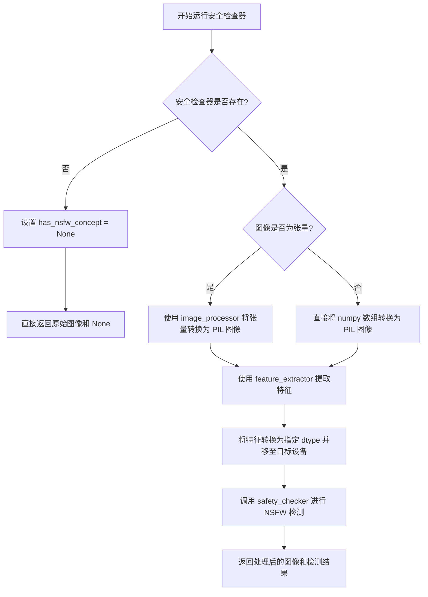
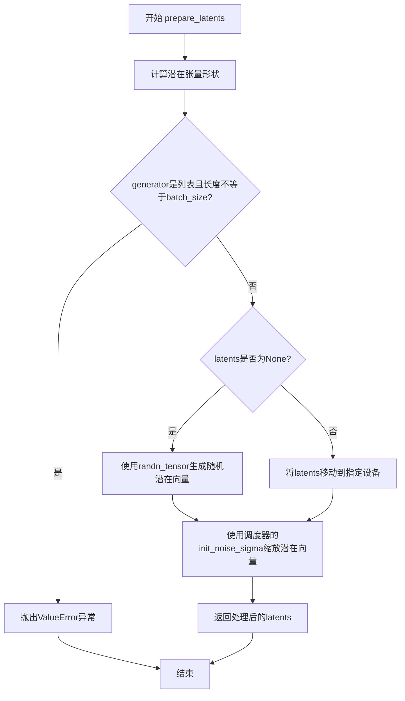
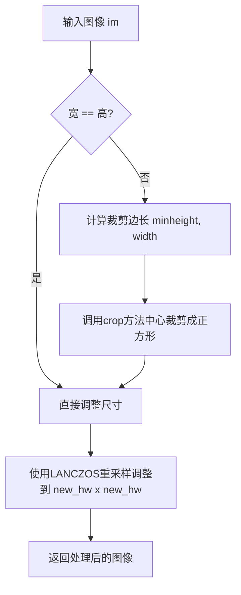
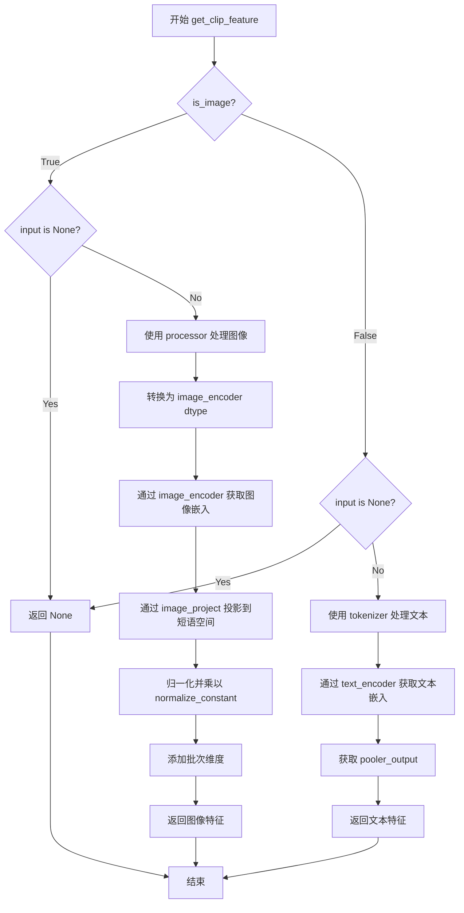
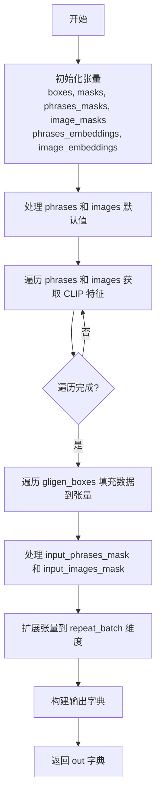
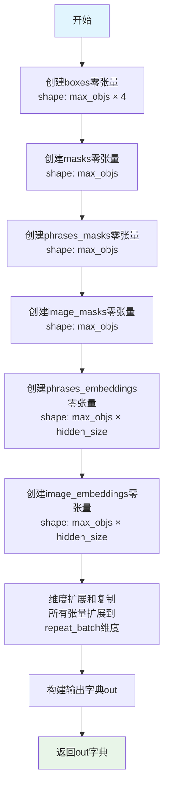
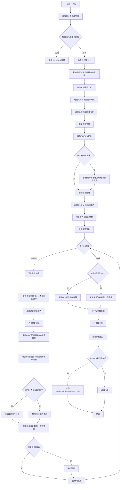

# `diffusers\src\diffusers\pipelines\stable_diffusion_gligen\pipeline_stable_diffusion_gligen_text_image.py` 详细设计文档

A Stable Diffusion pipeline implementation extending text-to-image generation with GLIGEN (Grounded Language-to-Image Generation). This pipeline supports grounding generated objects in specific regions defined by bounding boxes, utilizing both text phrases and reference images, and includes capabilities for inpainting and style transfer.

## 整体流程

```mermaid
graph TD
Start[__call__] --> Check[check_inputs]
Check --> Encode[encode_prompt]
Encode --> Latents[prepare_latents]
Latents --> GLIGENPrep[Prepare GLIGEN Variables (Boxes, Images, Phrases)]
GLIGENPrep --> Loop[Denoising Loop]
Loop --> ModelInput[Prepare Latent Model Input]
ModelInput --> UNetGrounded[UNet (with Grounding)]
UNetGrounded --> UNetClean[UNet (without Grounding)]
UNetClean --> Guidance[Apply Guidance (CFG)]
Guidance --> Scheduler[Scheduler Step]
Scheduler --> LoopCheck{Remaining Steps?}
LoopCheck -- Yes --> Loop
LoopCheck -- No --> Decode[VAE Decode]
Decode --> Safety[run_safety_checker]
Safety --> Post[Image Post-processing]
Post --> End[Return StableDiffusionPipelineOutput]
```

## 类结构

```
StableDiffusionGLIGENTextImagePipeline (Main Pipeline)
├── DeprecatedPipelineMixin
├── DiffusionPipeline (Base Pipeline)
└── StableDiffusionMixin
```

## 全局变量及字段


### `logger`
    
用于记录警告和信息消息的日志记录器

类型：`logging.Logger`
    


### `EXAMPLE_DOC_STRING`
    
包含管道使用示例的文档字符串

类型：`str`
    


### `XLA_AVAILABLE`
    
指示是否支持XLA/TPU加速的布尔标志

类型：`bool`
    


### `StableDiffusionGLIGENTextImagePipeline.vae`
    
变分自编码器模型，用于编码和解码图像与潜在表示

类型：`AutoencoderKL`
    


### `StableDiffusionGLIGENTextImagePipeline.text_encoder`
    
冻结的CLIP文本编码器，用于将文本提示转换为嵌入向量

类型：`CLIPTextModel`
    


### `StableDiffusionGLIGENTextImagePipeline.tokenizer`
    
CLIP分词器，用于将文本分割为token序列

类型：`CLIPTokenizer`
    


### `StableDiffusionGLIGENTextImagePipeline.processor`
    
CLIP处理器，用于处理参考图像

类型：`CLIPProcessor`
    


### `StableDiffusionGLIGENTextImagePipeline.image_encoder`
    
冻结的CLIP图像编码器，用于提取图像特征

类型：`CLIPVisionModelWithProjection`
    


### `StableDiffusionGLIGENTextImagePipeline.image_project`
    
CLIP图像投影模块，将图像嵌入映射到短语嵌入空间

类型：`CLIPImageProjection`
    


### `StableDiffusionGLIGENTextImagePipeline.unet`
    
条件UNet模型，用于去噪图像潜在表示

类型：`UNet2DConditionModel`
    


### `StableDiffusionGLIGENTextImagePipeline.scheduler`
    
Karras扩散调度器，用于控制去噪过程的噪声调度

类型：`KarrasDiffusionSchedulers`
    


### `StableDiffusionGLIGENTextImagePipeline.safety_checker`
    
安全检查器，用于检测和过滤不当内容

类型：`StableDiffusionSafetyChecker`
    


### `StableDiffusionGLIGENTextImagePipeline.feature_extractor`
    
CLIP图像特征提取器，用于从生成的图像中提取特征

类型：`CLIPImageProcessor`
    


### `StableDiffusionGLIGENTextImagePipeline.vae_scale_factor`
    
VAE缩放因子，用于调整潜在空间的维度

类型：`int`
    


### `StableDiffusionGLIGENTextImagePipeline.image_processor`
    
VAE图像处理器，用于图像的预处理和后处理

类型：`VaeImageProcessor`
    
    

## 全局函数及方法


### `StableDiffusionGLIGENTextImagePipeline.__init__`

这是Stable Diffusion GLIGEN文本图像Pipeline的初始化方法，负责初始化Pipeline的所有组件模块，包括VAE、文本编码器、图像编码器、UNet、调度器等，并进行必要的安全检查器配置验证。

参数：

- `vae`：`AutoencoderKL`，Variational Auto-Encoder (VAE) 模型，用于编码和解码图像到潜在表示
- `text_encoder`：`CLIPTextModel`，冻结的文本编码器 (clip-vit-large-patch14)
- `tokenizer`：`CLIPTokenizer`，用于对文本进行分词的 CLIPTokenizer
- `processor`：`CLIPProcessor`，用于处理参考图像的 CLIPProcessor
- `image_encoder`：`CLIPVisionModelWithProjection`，冻结的图像编码器 (clip-vit-large-patch14)
- `image_project`：`CLIPImageProjection`，将图像嵌入投影到短语嵌入空间的 CLIPImageProjection
- `unet`：`UNet2DConditionModel`，用于对编码后的图像潜在表示进行去噪的 UNet2DConditionModel
- `scheduler`：`KarrasDiffusionSchedulers`，与 unet 配合使用对编码图像潜在表示进行去噪的调度器
- `safety_checker`：`StableDiffusionSafetyChecker`，用于估计生成图像是否被认为具有攻击性或有害的分类模块
- `feature_extractor`：`CLIPImageProcessor`，用于从生成的图像中提取特征的 CLIPImageProcessor，作为 safety_checker 的输入
- `requires_safety_checker`：`bool`，是否需要安全检查器，默认为 True

返回值：`None`，该方法为构造函数，不返回任何值

#### 流程图

```mermaid
flowchart TD
    A[开始 __init__] --> B[调用 super().__init__]
    B --> C{safety_checker is None<br/>and requires_safety_checker?}
    C -->|是| D[发出安全检查器禁用的警告]
    C -->|否| E{safety_checker is not None<br/>and feature_extractor is None?}
    D --> E
    E -->|是| F[抛出 ValueError 异常]
    E -->|否| G[调用 register_modules 注册所有模块]
    G --> H[计算 vae_scale_factor]
    H --> I[创建 VaeImageProcessor 实例]
    I --> J[调用 register_to_config 注册 requires_safety_checker]
    J --> K[结束 __init__]
    F --> K
```

#### 带注释源码

```python
def __init__(
    self,
    vae: AutoencoderKL,                          # Variational Auto-Encoder (VAE) 模型，用于编码和解码图像
    text_encoder: CLIPTextModel,                 # 冻结的文本编码器 CLIPTextModel
    tokenizer: CLIPTokenizer,                     # 用于文本分词的 CLIPTokenizer
    processor: CLIPProcessor,                     # 处理参考图像的 CLIPProcessor
    image_encoder: CLIPVisionModelWithProjection, # 冻结的图像编码器 CLIPVisionModelWithProjection
    image_project: CLIPImageProjection,           # 将图像嵌入投影到短语嵌入空间的模块
    unet: UNet2DConditionModel,                  # UNet2DConditionModel 去噪模型
    scheduler: KarrasDiffusionSchedulers,         # 扩散调度器
    safety_checker: StableDiffusionSafetyChecker,# 安全检查器，用于过滤有害内容
    feature_extractor: CLIPImageProcessor,        # 图像特征提取器，用于 safety_checker
    requires_safety_checker: bool = True,         # 是否需要安全检查器的标志
):
    # 调用父类的初始化方法
    super().__init__()

    # 如果 safety_checker 为 None 但 requires_safety_checker 为 True，发出警告
    if safety_checker is None and requires_safety_checker:
        logger.warning(
            f"You have disabled the safety checker for {self.__class__} by passing `safety_checker=None`. Ensure"
            " that you abide to the conditions of the Stable Diffusion license and do not expose unfiltered"
            " results in services or applications open to the public. Both the diffusers team and Hugging Face"
            " strongly recommend to keep the safety filter enabled in all public facing circumstances, disabling"
            " it only for use-cases that involve analyzing network behavior or auditing its results. For more"
            " information, please have a look at https://github.com/huggingface/diffusers/pull/254 ."
        )

    # 如果 safety_checker 不为 None 但 feature_extractor 为 None，抛出错误
    if safety_checker is not None and feature_extractor is None:
        raise ValueError(
            "Make sure to define a feature extractor when loading {self.__class__} if you want to use the safety"
            " checker. If you do not want to use the safety checker, you can pass `'safety_checker=None'` instead."
        )

    # 注册所有模块组件到 Pipeline 中
    self.register_modules(
        vae=vae,
        text_encoder=text_encoder,
        tokenizer=tokenizer,
        image_encoder=image_encoder,
        processor=processor,
        image_project=image_project,
        unet=unet,
        scheduler=scheduler,
        safety_checker=safety_checker,
        feature_extractor=feature_extractor,
    )
    
    # 计算 VAE 缩放因子，基于 VAE 块输出通道数的 2 的幂次方
    self.vae_scale_factor = 2 ** (len(self.vae.config.block_out_channels) - 1) if getattr(self, "vae", None) else 8
    
    # 创建图像处理器，用于图像的预处理和后处理
    self.image_processor = VaeImageProcessor(vae_scale_factor=self.vae_scale_factor, do_convert_rgb=True)
    
    # 将 requires_safety_checker 注册到配置中
    self.register_to_config(requires_safety_checker=requires_safety_checker)
```


### `StableDiffusionGLIGENTextImagePipeline.encode_prompt`

该方法负责将文本提示（prompt）编码为文本编码器的隐藏状态（embeddings），支持 LoRA 缩放、CLIP 层跳过、分类器自由引导（classifier-free guidance），并处理文本反转（textual inversion）。如果传入了预计算的 `prompt_embeds` 和 `negative_prompt_embeds`，则直接使用；否则根据 prompt 生成相应的 embeddings。

参数：

- `prompt`：`str | list[str] | None`，要编码的提示文本，可以是单字符串或字符串列表
- `device`：`torch.device`，PyTorch 设备对象
- `num_images_per_prompt`：`int`，每个提示要生成的图像数量
- `do_classifier_free_guidance`：`bool`，是否使用分类器自由引导
- `negative_prompt`：`str | list[str] | None`，不希望用于引导图像生成的提示
- `prompt_embeds`：`torch.Tensor | None`，预生成的文本 embeddings，可用于轻松调整文本输入
- `negative_prompt_embeds`：`torch.Tensor | None`，预生成的负面文本 embeddings
- `lora_scale`：`float | None`，要应用于文本编码器所有 LoRA 层的 LoRA 缩放因子
- `clip_skip`：`int | None`，计算 prompt embeddings 时要跳过的 CLIP 层数

返回值：`tuple[torch.Tensor, torch.Tensor]`，返回 `prompt_embeds` 和 `negative_prompt_embeds` 元组，分别表示正向和负向的文本 embeddings

#### 流程图

```mermaid
flowchart TD
    A[开始 encode_prompt] --> B{检查 lora_scale}
    B -->|非空且为 StableDiffusionLoraLoaderMixin| C[设置 self._lora_scale]
    C --> D{USE_PEFT_BACKEND?}
    D -->|是| E[scale_lora_layers]
    D -->|否| F[adjust_lora_scale_text_encoder]
    B -->|空或非 LoRA| G[跳过 LoRA 调整]
    
    E --> G
    F --> G
    
    G --> H{判断 batch_size}
    H -->|prompt 为 str| I[batch_size = 1]
    H -->|prompt 为 list| J[batch_size = len(prompt)]
    H -->|其他| K[batch_size = prompt_embeds.shape[0]]
    
    I --> L
    J --> L
    K --> L
    
    L{prompt_embeds 为空?}
    L -->|是| M{是否为 TextualInversionLoaderMixin?}
    M -->|是| N[maybe_convert_prompt 处理多向量 token]
    M -->|否| O[直接使用 prompt]
    N --> O
    
    O --> P[tokenizer 编码 prompt]
    P --> Q{检查 attention_mask}
    Q -->|有 use_attention_mask| R[使用输入的 attention_mask]
    Q -->|无| S[attention_mask = None]
    
    R --> T{clip_skip 为空?}
    S --> T
    T -->|是| U[text_encoder 输出 last_hidden_state]
    T -->|否| V[text_encoder 输出 hidden_states]
    V --> W[获取倒数第 clip_skip+1 层]
    W --> X[应用 final_layer_norm]
    
    U --> Y[获取 prompt_embeds]
    X --> Y
    L -->|否| Y
    
    Y --> Z[确定 prompt_embeds_dtype]
    Z --> AA[转换为目标 dtype 和 device]
    AA --> AB[重复 embeddings num_images_per_prompt 次]
    
    AB --> AC{do_classifier_free_guidance 且 negative_prompt_embeds 为空?}
    AC -->|是| AD[处理 negative_prompt]
    AD --> AE{negative_prompt 类型}
    AE -->|None| AF[uncond_tokens = [''] * batch_size]
    AE -->|str| AG[uncond_tokens = [negative_prompt]]
    AE -->|list| AH[uncond_tokens = negative_prompt]
    
    AF --> AI
    AG --> AI
    AH --> AI
    
    AI --> AJ[tokenizer 编码 uncond_tokens]
    AJ --> AK{检查 attention_mask}
    AK -->|有| AL[使用 attention_mask]
    AK -->|无| AM[attention_mask = None]
    
    AL --> AN[text_encoder 编码获取 negative_prompt_embeds]
    AM --> AN
    
    AC -->|否| AO[跳过 negative_prompt 处理]
    AN --> AO
    
    AO --> AP{do_classifier_free_guidance?}
    AP -->|是| AQ[重复 negative_prompt_embeds]
    AP -->|否| AR[直接使用 negative_prompt_embeds]
    
    AQ --> AS[转换为目标 dtype 和 device]
    AR --> AS
    
    AS --> AT{是 StableDiffusionLoraLoaderMixin 且 USE_PEFT_BACKEND?}
    AT -->|是| AU[unscale_lora_layers 恢复原始 scale]
    AT -->|否| AV[跳过]
    
    AU --> AV
    AV --> AX[返回 prompt_embeds, negative_prompt_embeds]
```

#### 带注释源码

```python
def encode_prompt(
    self,
    prompt,
    device,
    num_images_per_prompt,
    do_classifier_free_guidance,
    negative_prompt=None,
    prompt_embeds: torch.Tensor | None = None,
    negative_prompt_embeds: torch.Tensor | None = None,
    lora_scale: float | None = None,
    clip_skip: int | None = None,
):
    r"""
    Encodes the prompt into text encoder hidden states.

    Args:
        prompt (`str` or `list[str]`, *optional*):
            prompt to be encoded
        device: (`torch.device`):
            torch device
        num_images_per_prompt (`int`):
            number of images that should be generated per prompt
        do_classifier_free_guidance (`bool`):
            whether to use classifier free guidance or not
        negative_prompt (`str` or `list[str]`, *optional*):
            The prompt or prompts not to guide the image generation. If not defined, one has to pass
            `negative_prompt_embeds` instead. Ignored when not using guidance (i.e., ignored if `guidance_scale` is
            less than `1`).
        prompt_embeds (`torch.Tensor`, *optional*):
            Pre-generated text embeddings. Can be used to easily tweak text inputs, *e.g.* prompt weighting. If not
            provided, text embeddings will be generated from `prompt` input argument.
        negative_prompt_embeds (`torch.Tensor`, *optional*):
            Pre-generated negative text embeddings. Can be used to easily tweak text inputs, *e.g.* prompt
            weighting. If not provided, negative_prompt_embeds will be generated from `negative_prompt` input
            argument.
        lora_scale (`float`, *optional*):
            A LoRA scale that will be applied to all LoRA layers of the text encoder if LoRA layers are loaded.
        clip_skip (`int`, *optional*):
            Number of layers to be skipped from CLIP while computing the prompt embeddings. A value of 1 means that
            the output of the pre-final layer will be used for computing the prompt embeddings.
    """
    # set lora scale so that monkey patched LoRA
    # function of text encoder can correctly access it
    if lora_scale is not None and isinstance(self, StableDiffusionLoraLoaderMixin):
        self._lora_scale = lora_scale

        # dynamically adjust the LoRA scale
        if not USE_PEFT_BACKEND:
            adjust_lora_scale_text_encoder(self.text_encoder, lora_scale)
        else:
            scale_lora_layers(self.text_encoder, lora_scale)

    # 确定 batch_size：根据 prompt 类型或已存在的 prompt_embeds 形状
    if prompt is not None and isinstance(prompt, str):
        batch_size = 1
    elif prompt is not None and isinstance(prompt, list):
        batch_size = len(prompt)
    else:
        batch_size = prompt_embeds.shape[0]

    # 如果未提供 prompt_embeds，则需要从 prompt 生成
    if prompt_embeds is None:
        # textual inversion: process multi-vector tokens if necessary
        # 如果支持 textual inversion，处理多向量 token
        if isinstance(self, TextualInversionLoaderMixin):
            prompt = self.maybe_convert_prompt(prompt, self.tokenizer)

        # 使用 tokenizer 将 prompt 转换为 token IDs
        text_inputs = self.tokenizer(
            prompt,
            padding="max_length",
            max_length=self.tokenizer.model_max_length,
            truncation=True,
            return_tensors="pt",
        )
        text_input_ids = text_inputs.input_ids
        
        # 获取未截断的 token IDs 用于检测截断
        untruncated_ids = self.tokenizer(prompt, padding="longest", return_tensors="pt").input_ids

        # 检查是否发生截断，并记录警告
        if untruncated_ids.shape[-1] >= text_input_ids.shape[-1] and not torch.equal(
            text_input_ids, untruncated_ids
        ):
            removed_text = self.tokenizer.batch_decode(
                untruncated_ids[:, self.tokenizer.model_max_length - 1 : -1]
            )
            logger.warning(
                "The following part of your input was truncated because CLIP can only handle sequences up to"
                f" {self.tokenizer.model_max_length} tokens: {removed_text}"
            )

        # 检查 text_encoder 是否配置了 use_attention_mask
        if hasattr(self.text_encoder.config, "use_attention_mask") and self.text_encoder.config.use_attention_mask:
            attention_mask = text_inputs.attention_mask.to(device)
        else:
            attention_mask = None

        # 根据是否 skip CLIP 层来选择不同的编码方式
        if clip_skip is None:
            # 直接获取最后一层隐藏状态
            prompt_embeds = self.text_encoder(text_input_ids.to(device), attention_mask=attention_mask)
            prompt_embeds = prompt_embeds[0]
        else:
            # 获取所有隐藏状态，然后选择指定层
            prompt_embeds = self.text_encoder(
                text_input_ids.to(device), attention_mask=attention_mask, output_hidden_states=True
            )
            # Access the `hidden_states` first, that contains a tuple of
            # all the hidden states from the encoder layers. Then index into
            # the tuple to access the hidden states from the desired layer.
            prompt_embeds = prompt_embeds[-1][-(clip_skip + 1)]
            # We also need to apply the final LayerNorm here to not mess with the
            # representations. The `last_hidden_states` that we typically use for
            # obtaining the final prompt representations passes through the LayerNorm
            # layer.
            prompt_embeds = self.text_encoder.text_model.final_layer_norm(prompt_embeds)

    # 确定 prompt_embeds 的数据类型（与 text_encoder 或 unet 兼容）
    if self.text_encoder is not None:
        prompt_embeds_dtype = self.text_encoder.dtype
    elif self.unet is not None:
        prompt_embeds_dtype = self.unet.dtype
    else:
        prompt_embeds_dtype = prompt_embeds.dtype

    # 将 prompt_embeds 转换为目标 dtype 和 device
    prompt_embeds = prompt_embeds.to(dtype=prompt_embeds_dtype, device=device)

    bs_embed, seq_len, _ = prompt_embeds.shape
    # duplicate text embeddings for each generation per prompt, using mps friendly method
    # 为每个 prompt 复制多次 embeddings 以生成多张图像
    prompt_embeds = prompt_embeds.repeat(1, num_images_per_prompt, 1)
    prompt_embeds = prompt_embeds.view(bs_embed * num_images_per_prompt, seq_len, -1)

    # get unconditional embeddings for classifier free guidance
    # 获取分类器自由引导的无条件 embeddings
    if do_classifier_free_guidance and negative_prompt_embeds is None:
        uncond_tokens: list[str]
        if negative_prompt is None:
            # 如果没有 negative_prompt，使用空字符串
            uncond_tokens = [""] * batch_size
        elif prompt is not None and type(prompt) is not type(negative_prompt):
            raise TypeError(
                f"`negative_prompt` should be the same type to `prompt`, but got {type(negative_prompt)} !="
                f" {type(prompt)}."
            )
        elif isinstance(negative_prompt, str):
            uncond_tokens = [negative_prompt]
        elif batch_size != len(negative_prompt):
            raise ValueError(
                f"`negative_prompt`: {negative_prompt} has batch size {len(negative_prompt)}, but `prompt`:"
                f" {prompt} has batch size {batch_size}. Please make sure that passed `negative_prompt` matches"
                " the batch size of `prompt`."
            )
        else:
            uncond_tokens = negative_prompt

        # textual inversion: process multi-vector tokens if necessary
        # 如果支持 textual inversion，处理多向量 token
        if isinstance(self, TextualInversionLoaderMixin):
            uncond_tokens = self.maybe_convert_prompt(uncond_tokens, self.tokenizer)

        max_length = prompt_embeds.shape[1]
        uncond_input = self.tokenizer(
            uncond_tokens,
            padding="max_length",
            max_length=max_length,
            truncation=True,
            return_tensors="pt",
        )

        # 检查是否需要 attention_mask
        if hasattr(self.text_encoder.config, "use_attention_mask") and self.text_encoder.config.use_attention_mask:
            attention_mask = uncond_input.attention_mask.to(device)
        else:
            attention_mask = None

        # 编码 negative_prompt 获取无条件 embeddings
        negative_prompt_embeds = self.text_encoder(
            uncond_input.input_ids.to(device),
            attention_mask=attention_mask,
        )
        negative_prompt_embeds = negative_prompt_embeds[0]

    # 如果使用分类器自由引导，复制无条件 embeddings
    if do_classifier_free_guidance:
        # duplicate unconditional embeddings for each generation per prompt, using mps friendly method
        seq_len = negative_prompt_embeds.shape[1]

        negative_prompt_embeds = negative_prompt_embeds.to(dtype=prompt_embeds_dtype, device=device)

        negative_prompt_embeds = negative_prompt_embeds.repeat(1, num_images_per_prompt, 1)
        negative_prompt_embeds = negative_prompt_embeds.view(batch_size * num_images_per_prompt, seq_len, -1)

    # 恢复 LoRA 原始 scale（如果使用了 PEFT backend）
    if self.text_encoder is not None:
        if isinstance(self, StableDiffusionLoraLoaderMixin) and USE_PEFT_BACKEND:
            # Retrieve the original scale by scaling back the LoRA layers
            unscale_lora_layers(self.text_encoder, lora_scale)

    # 返回生成的 embeddings
    return prompt_embeds, negative_prompt_embeds
```


### `StableDiffusionGLIGENTextImagePipeline.run_safety_checker`

该方法用于对生成的图像进行安全检查（NSFW检测），通过调用安全检查器（safety_checker）来判断图像是否包含不当内容。如果安全检查器未初始化，则返回None；否则将图像转换为特征提取器所需的格式，送入安全检查器进行推理，最终返回处理后的图像和NSFW检测标志。

参数：

- `self`：`StableDiffusionGLIGENTextImagePipeline`实例本身，表示调用该方法的管道对象。
- `image`：`torch.Tensor` 或 `numpy.ndarray` 或 `PIL.Image.Image`，需要进行安全检查的图像数据，可以是PyTorch张量、NumPy数组或PIL图像。
- `device`：`torch.device`，图像处理和模型推理的目标设备（如CPU或CUDA设备）。
- `dtype`：`torch.dtype`，图像数据的精度类型（如`torch.float16`或`torch.float32`），用于安全检查器的输入。

返回值：`(Tuple[Union[torch.Tensor, numpy.ndarray, PIL.Image.Image], Optional[List[bool]]])`，返回元组包含两个元素：
- 第一个元素是经过安全检查后的图像（类型与输入一致）；
- 第二个元素是NSFW概念检测结果的列表，如果安全检查器为None则返回None，否则返回布尔值列表表示每张图像是否包含不当内容。

#### 流程图



#### 带注释源码

```python
def run_safety_checker(self, image, device, dtype):
    """
    运行安全检查器以检测生成的图像是否包含不当内容（NSFW）。

    参数:
        image: 需要检查的图像，可以是 torch.Tensor、numpy.ndarray 或 PIL.Image.Image
        device: 执行安全检查的设备（torch.device）
        dtype: 图像数据的精度类型（torch.dtype）

    返回:
        tuple: (处理后的图像, NSFW检测结果列表或None)
    """
    # 如果安全检查器未初始化（为None），则跳过安全检查
    if self.safety_checker is None:
        has_nsfw_concept = None  # 设置为None表示未进行检测
    else:
        # 判断输入图像是否为PyTorch张量
        if torch.is_tensor(image):
            # 将PyTorch张量转换为PIL图像格式（用于特征提取器）
            feature_extractor_input = self.image_processor.postprocess(image, output_type="pil")
        else:
            # 将NumPy数组直接转换为PIL图像格式
            feature_extractor_input = self.image_processor.numpy_to_pil(image)
        
        # 使用特征提取器处理图像，提取用于安全检查的特征
        safety_checker_input = self.feature_extractor(feature_extractor_input, return_tensors="pt").to(device)
        
        # 调用安全检查器，传入图像和CLIP特征输入，获取检测结果
        # 返回处理后的图像（可能带有安全水印）和NSFW概念标志
        image, has_nsfw_concept = self.safety_checker(
            images=image, 
            clip_input=safety_checker_input.pixel_values.to(dtype)  # 将像素值转换为指定精度类型
        )
    
    # 返回处理后的图像和NSFW检测结果
    return image, has_nsfw_concept
```


### `StableDiffusionGLIGENTextImagePipeline.prepare_extra_step_kwargs`

该方法用于为调度器（scheduler）的 `step` 函数准备额外的关键字参数。由于不同调度器（如 DDIMScheduler、LMSDiscreteScheduler 等）接受的参数可能不同，该方法通过 Python 的 `inspect` 模块动态检查调度器 `step` 方法的签名，从而决定是否将 `generator` 和 `eta` 参数传递给调度器。

参数：

- `generator`：`torch.Generator | list[torch.Generator] | None`，用于控制随机数生成以确保可重复性
- `eta`：`float`，对应 DDIM 论文中的 η 参数，仅被 DDIMScheduler 使用，其他调度器会忽略该参数，其值应在 [0, 1] 范围内

返回值：`dict`，包含调度器 `step` 方法所需的关键字参数字典，可能包含 `eta` 和/或 `generator` 键

#### 流程图

```mermaid
flowchart TD
    A[开始: prepare_extra_step_kwargs] --> B[获取scheduler.step的签名]
    B --> C{签名中是否包含'eta'?}
    C -->|是| D[extra_step_kwargs['eta'] = eta]
    C -->|否| E[跳过eta参数]
    D --> F{签名中是否包含'generator'?}
    E --> F
    F -->|是| G[extra_step_kwargs['generator'] = generator]
    F -->|否| H[跳过generator参数]
    G --> I[返回extra_step_kwargs字典]
    H --> I
```

#### 带注释源码

```python
def prepare_extra_step_kwargs(self, generator, eta):
    """
    准备调度器（scheduler）step 函数所需的额外参数。

    不同的调度器有不同的签名，该方法通过检查调度器 step 方法的签名，
    动态决定需要传递哪些参数。目前主要处理两个参数：
    1. eta (η) - 仅被 DDIMScheduler 使用，对应 DDIM 论文中的参数
    2. generator - 用于控制随机数生成，确保可重复性
    """
    # 使用 inspect 模块获取 scheduler.step 方法的签名参数
    accepts_eta = "eta" in set(inspect.signature(self.scheduler.step).parameters.keys())
    
    # 初始化额外参数字典
    extra_step_kwargs = {}
    
    # 如果调度器接受 eta 参数，则将其添加到 extra_step_kwargs
    if accepts_eta:
        extra_step_kwargs["eta"] = eta

    # 检查调度器是否接受 generator 参数
    accepts_generator = "generator" in set(inspect.signature(self.scheduler.step).parameters.keys())
    
    # 如果调度器接受 generator 参数，则将其添加到 extra_step_kwargs
    if accepts_generator:
        extra_step_kwargs["generator"] = generator
    
    # 返回包含调度器所需参数的字典
    return extra_step_kwargs
```


### `StableDiffusionGLIGENTextImagePipeline.check_inputs`

该方法用于验证 Stable Diffusion GLIGEN 文本图像管道的输入参数合法性，确保 height 和 width 可被 8 整除、callback_steps 为正整数、prompt 与 prompt_embeds 互斥、negative_prompt 与 negative_prompt_embeds 互斥且形状一致，以及 gligen_images 与 gligen_phrases 长度一致。如果任何验证失败，该方法将抛出详细的 ValueError 异常。

参数：

- `self`：`StableDiffusionGLIGENTextImagePipeline` 实例，管道对象本身
- `prompt`：`str | list[str] | None`，要引导图像生成的提示词或提示词列表，若未定义则需提供 prompt_embeds
- `height`：`int`，生成图像的高度（像素），必须能被 8 整除
- `width`：`int`，生成图像的宽度（像素），必须能被 8 整除
- `callback_steps`：`int | None`，调用回调函数的频率，必须为正整数
- `gligen_images`：`list[PIL.Image.Image] | None`，用于引导生成的可选图像列表
- `gligen_phrases`：`list[str] | None`，与 gligen_boxes 对应的短语列表，用于指定区域内容
- `negative_prompt`：`str | list[str] | None`，可选的负面提示词，用于引导不希望出现的内容
- `prompt_embeds`：`torch.Tensor | None`，预生成的文本嵌入，可用于替代 prompt
- `negative_prompt_embeds`：`torch.Tensor | None`，预生成的负面文本嵌入
- `callback_on_step_end_tensor_inputs`：`list[str] | None`，可选的回调张量输入列表

返回值：`None`，该方法不返回任何值，仅通过抛出 ValueError 来指示验证失败

#### 流程图

```mermaid
flowchart TD
    A[开始 check_inputs] --> B{height % 8 == 0 且 width % 8 == 0?}
    B -->|否| C[抛出 ValueError: height 和 width 必须能被 8 整除]
    B -->|是| D{callback_steps 是正整数?}
    D -->|否| E[抛出 ValueError: callback_steps 必须为正整数]
    D -->|是| F{callback_on_step_end_tensor_inputs 合法?}
    F -->|否| G[抛出 ValueError: callback_on_step_end_tensor_inputs 无效]
    F -->|是| H{prompt 和 prompt_embeds 都提供?}
    H -->|是| I[抛出 ValueError: 不能同时提供 prompt 和 prompt_embeds]
    H -->|否| J{prompt 和 prompt_embeds 都未提供?]
    J -->|是| K[抛出 ValueError: 必须提供 prompt 或 prompt_embeds 之一]
    J -->|否| L{prompt 是 str 或 list?}
    L -->|否| M[抛出 ValueError: prompt 类型错误]
    L -->|是| N{negative_prompt 和 negative_prompt_embeds 都提供?}
    N -->|是| O[抛出 ValueError: 不能同时提供两者]
    N -->|否| P{prompt_embeds 和 negative_prompt_embeds 都提供?}
    P -->|是| Q{形状相同?}
    Q -->|否| R[抛出 ValueError: 形状不匹配]
    Q -->|是| S{gligen_images 和 gligen_phrases 都提供?}
    S -->|是| T{长度相同?}
    T -->|否| U[抛出 ValueError: gligen_images 和 gligen_phrases 长度不匹配]
    T -->|是| V[验证通过]
    S -->|否| V
    P -->|否| V
    C --> W[结束]
    E --> W
    G --> W
    I --> W
    K --> W
    M --> W
    O --> W
    R --> W
    U --> W
    V --> W
```

#### 带注释源码

```python
def check_inputs(
    self,
    prompt,                      # 用户输入的文本提示词，str 或 list[str] 类型
    height,                      # 生成图像的高度，必须能被 8 整除
    width,                       # 生成图像的宽度，必须能被 8 整除
    callback_steps,             # 回调函数调用间隔，必须为正整数
    gligen_images,               # GLIGEN 引导图像列表
    gligen_phrases,              # GLIGEN 引导短语列表
    negative_prompt=None,        # 可选的负面提示词
    prompt_embeds=None,          # 可选的预计算提示词嵌入
    negative_prompt_embeds=None, # 可选的预计算负面提示词嵌入
    callback_on_step_end_tensor_inputs=None, # 回调函数可访问的张量输入
):
    """
    验证输入参数的有效性，确保满足管道执行的前置条件。
    """
    # 验证图像尺寸必须是 8 的倍数（VAE 和 UNet 的要求）
    if height % 8 != 0 or width % 8 != 0:
        raise ValueError(f"`height` and `width` have to be divisible by 8 but are {height} and {width}.")

    # 验证 callback_steps 是正整数
    if callback_steps is not None and (not isinstance(callback_steps, int) or callback_steps <= 0):
        raise ValueError(
            f"`callback_steps` has to be a positive integer but is {callback_steps} of type"
            f" {type(callback_steps)}."
        )
    
    # 验证回调张量输入是否在允许的列表中
    if callback_on_step_end_tensor_inputs is not None and not all(
        k in self._callback_tensor_inputs for k in callback_on_step_end_tensor_inputs
    ):
        raise ValueError(
            f"`callback_on_step_end_tensor_inputs` has to be in {self._callback_tensor_inputs}, but found {[k for k in callback_on_step_end_tensor_inputs if k not in self._callback_tensor_inputs]}"
        )

    # prompt 和 prompt_embeds 互斥，不能同时提供
    if prompt is not None and prompt_embeds is not None:
        raise ValueError(
            f"Cannot forward both `prompt`: {prompt} and `prompt_embeds`: {prompt_embeds}. Please make sure to"
            " only forward one of the two."
        )
    
    # 至少需要提供 prompt 或 prompt_embeds 之一
    elif prompt is None and prompt_embeds is None:
        raise ValueError(
            "Provide either `prompt` or `prompt_embeds`. Cannot leave both `prompt` and `prompt_embeds` undefined."
        )
    
    # prompt 类型必须是 str 或 list
    elif prompt is not None and (not isinstance(prompt, str) and not isinstance(prompt, list)):
        raise ValueError(f"`prompt` has to be of type `str` or `list` but is {type(prompt)}")

    # negative_prompt 和 negative_prompt_embeds 互斥
    if negative_prompt is not None and negative_prompt_embeds is not None:
        raise ValueError(
            f"Cannot forward both `negative_prompt`: {negative_prompt} and `negative_prompt_embeds`:"
            f" {negative_prompt_embeds}. Please make sure to only forward one of the two."
        )

    # 如果两者都提供了，验证形状一致性
    if prompt_embeds is not None and negative_prompt_embeds is not None:
        if prompt_embeds.shape != negative_prompt_embeds.shape:
            raise ValueError(
                "`prompt_embeds` and `negative_prompt_embeds` must have the same shape when passed directly, but"
                f" got: `prompt_embeds` {prompt_embeds.shape} != `negative_prompt_embeds`"
                f" {negative_prompt_embeds.shape}."
            )

    # GLIGEN 图像和短语长度必须一致
    if gligen_images is not None and gligen_phrases is not None:
        if len(gligen_images) != len(gligen_phrases):
            raise ValueError(
                "`gligen_images` and `gligen_phrases` must have the same length when both are provided, but"
                f" got: `gligen_images` with length {len(gligen_images)} != `gligen_phrases` with length {len(gligen_phrases)}."
            )
```


### `StableDiffusionGLIGENTextImagePipeline.prepare_latents`

该方法用于在图像生成过程中准备初始的潜在空间向量（latents）。它根据指定的批次大小、通道数、图像高度和宽度计算潜在张量的形状，验证生成器与批次大小的匹配性，然后通过随机采样或直接使用提供的潜在向量来初始化潜在空间，最后按照调度器要求的初始噪声标准差对潜在向量进行缩放处理。

参数：

- `batch_size`：`int`，生成的图像批次大小
- `num_channels_latents`：`int`，潜在空间的通道数，通常为4（对应RGB三通道加一个灰度通道）
- `height`：`int`，生成图像的高度（像素）
- `width`：`int`，生成图像的宽度（像素）
- `dtype`：`torch.dtype`，潜在张量的数据类型
- `device`：`torch.device`，潜在张量存放的设备（CPU或CUDA）
- `generator`：`torch.Generator | list[torch.Generator] | None`，用于生成确定性随机数的生成器
- `latents`：`torch.Tensor | None`，可选的预生成潜在向量，如果提供则直接使用，否则随机生成

返回值：`torch.Tensor`，处理后的潜在空间向量，已按调度器的初始噪声标准差进行缩放

#### 流程图



#### 带注释源码

```python
def prepare_latents(
    self,
    batch_size: int,
    num_channels_latents: int,
    height: int,
    width: int,
    dtype: torch.dtype,
    device: torch.device,
    generator: torch.Generator | list[torch.Generator] | None,
    latents: torch.Tensor | None = None,
) -> torch.Tensor:
    """
    准备用于去噪过程的潜在空间向量（latents）。
    
    该方法根据图像尺寸和VAE的缩放因子计算潜在空间的形状，
    然后初始化潜在向量或使用预先提供的潜在向量。
    最后根据调度器的要求对潜在向量进行缩放。
    """
    
    # 计算潜在张量的形状：批次大小 × 通道数 × (高度/VAE缩放因子) × (宽度/VAE缩放因子)
    # VAE的缩放因子通常为8，因此潜在空间的大小是原始图像尺寸的1/8
    shape = (
        batch_size,
        num_channels_latents,
        int(height) // self.vae_scale_factor,
        int(width) // self.vae_scale_factor,
    )
    
    # 验证：如果传入多个生成器，其数量必须与批次大小匹配
    if isinstance(generator, list) and len(generator) != batch_size:
        raise ValueError(
            f"You have passed a list of generators of length {len(generator)}, but requested an effective batch"
            f" size of {batch_size}. Make sure the batch size matches the length of the generators."
        )

    # 根据是否有预生成的潜在向量进行不同处理
    if latents is None:
        # 使用随机张量生成初始噪声，使用指定的数据类型、设备和生成器
        latents = randn_tensor(shape, generator=generator, device=device, dtype=dtype)
    else:
        # 如果提供了预生成的潜在向量，只需确保它在正确的设备上
        latents = latents.to(device)

    # 使用调度器的初始噪声标准差缩放潜在向量
    # 这是扩散模型去噪过程的关键步骤，确保初始噪声的尺度与调度器期望的一致
    latents = latents * self.scheduler.init_noise_sigma
    
    return latents
```


### `StableDiffusionGLIGENTextImagePipeline.enable_fuser`

该方法用于启用或禁用 UNet 模型中的 GatedSelfAttentionDense 门控自注意力密集模块，通过遍历 UNet 的所有模块，将匹配到的 GatedSelfAttentionDense 类型的模块的 enabled 属性设置为指定值。

参数：

- `enabled`：`bool`，可选，默认值为 `True`。控制是启用还是禁用 fuser（门控自注意力机制）。

返回值：`None`，无返回值（该方法直接修改模块状态）。

#### 流程图

```mermaid
flowchart TD
    A[开始 enable_fuser] --> B{遍历 self.unet.modules()}
    B --> C{当前模块类型是否为 GatedSelfAttentionDense?}
    C -->|是| D[设置 module.enabled = enabled]
    C -->|否| E[继续下一个模块]
    D --> E
    E --> F{是否还有更多模块?}
    F -->|是| B
    F -->|否| G[结束]
```

#### 带注释源码

```
def enable_fuser(self, enabled=True):
    """
    启用或禁用 UNet 中的门控自注意力机制（Gated Self-Attention Dense）。
    
    该方法遍历 UNet 的所有子模块，找到所有 GatedSelfAttentionDense 类型的模块，
    并将其 enabled 属性设置为传入的 enabled 参数值。当 enabled=True 时，
    启用门控自注意力机制，允许模型根据 GLIGEN 的 grounding 信息进行条件生成；
    当 enabled=False 时，禁用该机制。
    
    参数:
        enabled (bool): 布尔值，指定是启用 (True) 还是禁用 (False) 门控自注意力机制。
                       默认为 True。
    
    返回:
        None: 该方法直接修改模块状态，不返回任何值。
    """
    # 遍历 UNet 模型中的所有模块
    for module in self.unet.modules():
        # 检查当前模块的类型是否为 GatedSelfAttentionDense
        if type(module) is GatedSelfAttentionDense:
            # 将该模块的 enabled 属性设置为传入的 enabled 参数值
            module.enabled = enabled
```


### `StableDiffusionGLIGENTextImagePipeline.draw_inpaint_mask_from_boxes`

根据给定的边界框生成一个用于图像修复（inpainting）的掩码。该函数通过将边界框定义的区域设置为0（需要修复的区域），将其他区域设置为1（保持不变），从而创建用于控制图像生成过程中的修复区域的掩码。

参数：

- `boxes`：`list[list[float]]`，边界框列表，每个边界框为 `[xmin, ymin, xmax, ymax]` 格式，坐标值在 [0, 1] 范围内，表示需要修复的区域。
- `size`：`tuple[int, int]` 或 `list[int]`，掩码的目标尺寸，通常为图像的高度和宽度（以像素为单位）。

返回值：`torch.Tensor`，返回一个二维张量，其中值为1的区域表示保持不变，值为0的区域表示需要根据边界框进行修复。

#### 流程图

```mermaid
flowchart TD
    A[开始 draw_inpaint_mask_from_boxes] --> B[创建全1掩码]
    B --> C{boxes 是否为空}
    C -->|是| D[返回全1掩码]
    C -->|否| E[遍历每个 box]
    E --> F[计算边界框坐标]
    F --> G[x0 = box[0] * size[0]<br/>x1 = box[2] * size[0]<br/>y0 = box[1] * size[1]<br/>y1 = box[3] * size[1]]
    G --> H[将掩码对应区域设为0]
    H --> I{是否还有更多 box}
    I -->|是| E
    I -->|否| J[返回 inpaint_mask]
    D --> J
```

#### 带注释源码

```python
def draw_inpaint_mask_from_boxes(self, boxes, size):
    """
    Create an inpainting mask based on given boxes. This function generates an inpainting mask using the provided
    boxes to mark regions that need to be inpainted.
    
    参数:
        boxes (list[list[float]]): 边界框列表，每个边界框为 [xmin, ymin, xmax, ymax] 格式，
                                   坐标值在 [0, 1] 范围内。
        size (tuple[int, int] | list[int]): 掩码的目标尺寸，通常为 (height, width)。
    
    返回值:
        torch.Tensor: 二维张量，值为1表示保持不变的区域，值为0表示需要修复的区域。
    """
    # 初始化一个全1的掩码矩阵，形状为 (height, width)
    # 1 表示该区域保持不变（不进行修复）
    inpaint_mask = torch.ones(size[0], size[1])
    
    # 遍历每个边界框
    for box in boxes:
        # 将归一化坐标 [0,1] 转换为像素坐标
        # box[0], box[2] 对应 x 轴方向（宽度）
        # box[1], box[3] 对应 y 轴方向（高度）
        x0, x1 = box[0] * size[0], box[2] * size[0]
        y0, y1 = box[1] * size[1], box[3] * size[1]
        
        # 将边界框对应的区域设置为0
        # 0 表示该区域需要进行修复（inpainting）
        # 使用 int() 将浮点坐标转换为整数索引
        inpaint_mask[int(y0) : int(y1), int(x0) : int(x1)] = 0
    
    # 返回生成的修复掩码
    # 1: 保持原样
    # 0: 需要根据 gligen_boxes 中指定的内容进行修复
    return inpaint_mask
```

#### 使用场景说明

该函数主要用于 GLIGEN（Grounded Language-to-Image Generation）管道中的图像修复任务。当用户提供 `gligen_inpaint_image`（待修复的输入图像）和 `gligen_boxes`（指定修复区域的边界框）时，此函数会：

1. **生成修复掩码**：标识需要修复的区域（值为0）和保持不变的区域（值为1）
2. **与潜在表示结合**：在去噪循环中，修复区域的潜在表示会与输入图像的潜在表示混合
3. **控制生成内容**：模型只会重新生成修复区域内的内容，而非整个图像

这种设计使得用户可以精确控制图像中需要修改的区域，实现局部编辑或对象插入等高级功能。


### `StableDiffusionGLIGENTextImagePipeline.crop`

该方法用于将输入图像裁剪到指定的宽高尺寸，通过计算图像中心点并提取中心区域实现裁剪功能。

参数：

- `im`：`PIL.Image`，输入的要裁剪的图像对象
- `new_width`：`int`，裁剪后的目标宽度
- `new_height`：`int`，裁剪后的目标高度

返回值：`PIL.Image`，裁剪后的图像对象

#### 流程图

```mermaid
flowchart TD
    A[开始裁剪] --> B[获取图像尺寸]
    B --> C[计算裁剪区域]
    C --> C1[left = (width - new_width) / 2]
    C --> C2[top = (height - new_height) / 2]
    C --> C3[right = (width + new_width) / 2]
    C --> C4[bottom = (height + new_height) / 2]
    C1 --> D[调用PIL图像crop方法]
    C2 --> D
    C3 --> D
    C4 --> D
    E[返回裁剪后的图像]
    D --> E
```

#### 带注释源码

```python
def crop(self, im, new_width, new_height):
    """
    Crop the input image to the specified dimensions.
    
    Args:
        im (PIL.Image): The input image to be cropped.
        new_width (int): The desired width of the cropped image.
        new_height (int): The desired height of the cropped image.
    
    Returns:
        PIL.Image: The cropped image.
    """
    # 获取输入图像的原始宽高尺寸
    width, height = im.size
    
    # 计算裁剪区域的左边界：从中心向左偏移新宽度的一半
    left = (width - new_width) / 2
    
    # 计算裁剪区域的上边界：从中心向上偏移新高度的一半
    top = (height - new_height) / 2
    
    # 计算裁剪区域的右边界：从中心向右偏移新宽度的一半
    right = (width + new_width) / 2
    
    # 计算裁剪区域的下边界：从中心向下偏移新高度的一半
    bottom = (height + new_height) / 2
    
    # 使用PIL的crop方法进行中心裁剪，传入左、上、右、下坐标
    return im.crop((left, top, right, bottom))
```


### `StableDiffusionGLIGENTextImagePipeline.target_size_center_crop`

该方法用于将输入的PIL图像先进行中心裁剪成正方形（如果宽高不一致），然后将图像调整到指定的目标尺寸。

参数：

- `self`：`StableDiffusionGLIGENTextImagePipeline`，Pipeline实例本身
- `im`：`PIL.Image.Image`，输入的要处理的PIL图像对象
- `new_hw`：`int`，目标的高宽值（图像将被调整为此尺寸的正方形）

返回值：`PIL.Image.Image`，完成中心裁剪和尺寸调整后的图像

#### 流程图



#### 带注释源码

```python
def target_size_center_crop(self, im, new_hw):
    """
    Crop and resize the image to the target size while keeping the center.
    """
    # 获取输入图像的宽和高
    width, height = im.size
    
    # 如果图像宽高不一致，先进行中心裁剪成正方形
    if width != height:
        # 取宽高中较小的值作为裁剪边长
        im = self.crop(im, min(height, width), min(height, width))
    
    # 使用LANCZOS重采样方法将图像调整到目标尺寸（正方形）
    return im.resize((new_hw, new_hw), PIL.Image.LANCZOS)
```


### `StableDiffusionGLIGENTextImagePipeline.complete_mask`

该方法用于根据输入的掩码值（0或1）生成特征掩码，用于对短语和图像的特征进行掩码处理。

参数：

- `has_mask`：`int | list[int] | None`，输入的掩码值，可以是单个整数、整数列表或None
- `max_objs`：`int`，最大对象数量，决定掩码张量的维度
- `device`：`torch.device`，计算设备

返回值：`torch.Tensor`，返回形状为(1, max_objs)的掩码张量

#### 流程图

```mermaid
flowchart TD
    A[开始] --> B[创建初始掩码张量: torch.ones(1, max_objs)]
    B --> C{has_mask is None?}
    C -->|是| D[直接返回初始掩码]
    C -->|否| E{isinstance has_mask, int?}
    E -->|是| F[返回 mask * has_mask]
    E -->|否| G[遍历has_mask列表]
    G --> H[将掩码值逐个写入张量]
    H --> I[返回填充后的掩码张量]
    D --> J[结束]
    F --> J
    I --> J
```

#### 带注释源码

```python
def complete_mask(self, has_mask, max_objs, device):
    """
    基于输入的掩码值（0或1）为每个短语和图像生成掩码，
    用于对短语和图像的特征进行掩码处理。
    
    Args:
        has_mask: 输入的掩码值，可以是：
            - None: 返回全1掩码
            - int: 统一掩码值（0或1）
            - list[int]: 每个对象的独立掩码值
        max_objs: 最大对象数量，决定掩码维度
        device: 计算设备
    
    Returns:
        torch.Tensor: 形状为(1, max_objs)的掩码张量
    """
    # 初始化全1掩码，形状为(1, max_objs)，使用text_encoder的数据类型
    mask = torch.ones(1, max_objs).type(self.text_encoder.dtype).to(device)
    
    # 如果has_mask为None，返回全1掩码（不禁用任何特征）
    if has_mask is None:
        return mask

    # 如果has_mask是单个整数（0或1），将掩码乘以该值
    # 用于统一启用或禁用所有特征
    if isinstance(has_mask, int):
        return mask * has_mask
    
    # 如果has_mask是列表，逐个设置每个位置的掩码值
    else:
        for idx, value in enumerate(has_mask):
            mask[0, idx] = value
        return mask
```


### `StableDiffusionGLIGENTextImagePipeline.get_clip_feature`

获取图像和短语的嵌入向量，使用CLIP预训练模型，其中图像嵌入通过投影变换到短语嵌入空间。

参数：

- `input`：可以是`PIL.Image`或`str`，待处理的输入（图像或文本短语）
- `normalize_constant`：`float`，用于归一化图像嵌入的常数
- `device`：`torch.device`，计算设备
- `is_image`：`bool`，标志位，True表示输入为图像，False表示输入为文本

返回值：`torch.Tensor | None`，返回归一化后的特征向量，如果输入为None则返回None

#### 流程图



#### 带注释源码

```
def get_clip_feature(self, input, normalize_constant, device, is_image=False):
    """
    Get image and phrases embedding by using CLIP pretrain model. The image embedding is transformed into the
    phrases embedding space through a projection.
    """
    # 判断是处理图像还是文本
    if is_image:
        # ========== 处理图像输入 ==========
        # 如果输入为空，直接返回None
        if input is None:
            return None
        
        # 使用CLIP处理器将PIL图像转换为tensor格式
        # 返回包含pixel_values的字典
        inputs = self.processor(images=[input], return_tensors="pt").to(device)
        
        # 确保pixel_values的数据类型与image_encoder一致
        # 这是为了兼容不同的精度要求（如float16）
        inputs["pixel_values"] = inputs["pixel_values"].to(self.image_encoder.dtype)
        
        # 通过图像编码器获取图像嵌入向量
        outputs = self.image_encoder(**inputs)
        
        # 提取图像嵌入（image_embeds）
        feature = outputs.image_embeds
        
        # 通过图像投影层将图像嵌入变换到文本嵌入空间
        # 使其维度与文本嵌入兼容，便于后续在交叉注意力中使用
        feature = self.image_project(feature).squeeze(0)
        
        # 归一化处理：将特征向量除以它的L2范数
        # 然后乘以normalize_constant（默认为28.7）进行尺度调整
        feature = (feature / feature.norm()) * normalize_constant
        
        # 添加批次维度：从 [hidden_size] 变为 [1, hidden_size]
        # 以匹配批量处理的格式要求
        feature = feature.unsqueeze(0)
    else:
        # ========== 处理文本输入 ==========
        # 如果输入为空，直接返回None
        if input is None:
            return None
        
        # 使用CLIP分词器将文本字符串转换为token IDs
        # padding=True确保批量处理时长度一致
        inputs = self.tokenizer(input, return_tensors="pt", padding=True).to(device)
        
        # 通过文本编码器获取文本嵌入
        outputs = self.text_encoder(**inputs)
        
        # 提取pooler输出（[CLS] token的表示）
        # 这是文本序列的聚合表示
        feature = outputs.pooler_output
    
    return feature
```


### `StableDiffusionGLIGENTextImagePipeline.get_cross_attention_kwargs_with_grounded`

该方法用于准备包含有依据（grounded）输入信息的交叉注意力参数，包括边界框、掩码、图像嵌入和短语嵌入。这些信息用于指导 Stable Diffusion 模型在图像生成过程中精确控制指定区域的内容。

参数：

- `hidden_size`：`int`，隐藏层维度大小，用于确定嵌入向量的维度
- `gligen_phrases`：`list`，GLIGEN 短语列表，描述需要在对应区域生成的内容
- `gligen_images`：`list`，GLIGEN 图像列表，提供参考图像用于指导生成
- `gligen_boxes`：`list`，GLIGEN 边界框列表，定义需要控制生成的区域坐标 [xmin, ymin, xmax, ymax]
- `input_phrases_mask`：`int | list`，输入短语掩码，用于控制短语的使用
- `input_images_mask`：`int | list`，输入图像掩码，用于控制图像的使用
- `repeat_batch`：`int`，重复批次大小，用于分类器自由引导的倍数扩展
- `normalize_constant`：`float`，归一化常数，用于缩放图像嵌入向量
- `max_objs`：`int`，最大对象数量限制
- `device`：`torch.device`，计算设备（CPU/CUDA）

返回值：`dict`，返回包含以下键的字典：
- `boxes`：边界框张量，形状为 (repeat_batch, max_objs, 4)
- `masks`：对象存在掩码，形状为 (repeat_batch, max_objs)
- `phrases_masks`：短语掩码，形状为 (repeat_batch, max_objs)
- `image_masks`：图像掩码，形状为 (repeat_batch, max_objs)
- `phrases_embeddings`：短语嵌入，形状为 (repeat_batch, max_objs, hidden_size)
- `image_embeddings`：图像嵌入，形状为 (repeat_batch, max_objs, hidden_size)

#### 流程图



#### 带注释源码

```python
def get_cross_attention_kwargs_with_grounded(
    self,
    hidden_size,                  # int: 隐藏层维度，用于确定嵌入向量的大小
    gligen_phrases,              # list: 要进行 grounded 生成的文本短语列表
    gligen_images,               # list: 要进行 grounded 生成的参考图像列表
    gligen_boxes,                # list: 定义生成区域的边界框坐标 [xmin, ymin, xmax, ymax]
    input_phrases_mask,          # int | list: 控制短语激活的掩码
    input_images_mask,           # int | list: 控制图像激活的掩码
    repeat_batch,                # int: 批次重复次数（考虑 classifier-free guidance）
    normalize_constant,           # float: CLIP 图像嵌入的归一化缩放因子
    max_objs,                    # int: 支持的最大对象数量
    device,                      # torch.device: 计算设备
):
    """
    Prepare the cross-attention kwargs containing information about the grounded input 
    (boxes, mask, image embedding, phrases embedding).
    """
    # 处理空值情况：如果 images 为 None，用 None 列表填充；如果 phrases 为 None，用 None 列表填充
    phrases, images = gligen_phrases, gligen_images
    images = [None] * len(phrases) if images is None else images
    phrases = [None] * len(images) if phrases is None else phrases

    # 初始化零张量用于存储边界框、掩码和嵌入
    # boxes: 存储归一化后的边界框坐标 (max_objs, 4)
    boxes = torch.zeros(max_objs, 4, device=device, dtype=self.text_encoder.dtype)
    # masks: 标记哪些位置有有效的边界框对象
    masks = torch.zeros(max_objs, device=device, dtype=self.text_encoder.dtype)
    # phrases_masks: 标记哪些位置有有效的短语嵌入
    phrases_masks = torch.zeros(max_objs, device=device, dtype=self.text_encoder.dtype)
    # image_masks: 标记哪些位置有有效的图像嵌入
    image_masks = torch.zeros(max_objs, device=device, dtype=self.text_encoder.dtype)
    # phrases_embeddings: 存储文本短语经过 CLIP 编码后的嵌入向量
    phrases_embeddings = torch.zeros(max_objs, hidden_size, device=device, dtype=self.text_encoder.dtype)
    # image_embeddings: 存储图像经过 CLIP 编码并投影后的嵌入向量
    image_embeddings = torch.zeros(max_objs, hidden_size, device=device, dtype=self.text_encoder.dtype)

    # 分别提取文本和图像的 CLIP 特征
    text_features = []
    image_features = []
    # 遍历每个短语-图像对，使用 CLIP 模型提取特征
    for phrase, image in zip(phrases, images):
        # 获取文本特征 (is_image=False)
        text_features.append(self.get_clip_feature(phrase, normalize_constant, device, is_image=False))
        # 获取图像特征 (is_image=True)
        image_features.append(self.get_clip_feature(image, normalize_constant, device, is_image=True))

    # 将提取的特征和边界框填充到初始化张量中
    for idx, (box, text_feature, image_feature) in enumerate(zip(gligen_boxes, text_features, image_features)):
        # 将边界框列表转换为张量并存储
        boxes[idx] = torch.tensor(box)
        # 标记该位置有有效的边界框
        masks[idx] = 1
        
        # 如果存在文本特征，存储文本嵌入并标记短语掩码
        if text_feature is not None:
            phrases_embeddings[idx] = text_feature
            phrases_masks[idx] = 1
        
        # 如果存在图像特征，存储图像嵌入并标记图像掩码
        if image_feature is not None:
            image_embeddings[idx] = image_feature
            image_masks[idx] = 1

    # 处理输入掩码，完成掩码的完整性（处理 None 或单个值的情况）
    input_phrases_mask = self.complete_mask(input_phrases_mask, max_objs, device)
    # 将短语掩码扩展到 repeat_batch 维度，并与输入掩码相乘
    phrases_masks = phrases_masks.unsqueeze(0).repeat(repeat_batch, 1) * input_phrases_mask
    
    # 同样处理图像掩码
    input_images_mask = self.complete_mask(input_images_mask, max_objs, device)
    image_masks = image_masks.unsqueeze(0).repeat(repeat_batch, 1) * input_images_mask
    
    # 将所有张量扩展到 repeat_batch 维度，以适配批量生成
    boxes = boxes.unsqueeze(0).repeat(repeat_batch, 1, 1)
    masks = masks.unsqueeze(0).repeat(repeat_batch, 1)
    phrases_embeddings = phrases_embeddings.unsqueeze(0).repeat(repeat_batch, 1, 1)
    image_embeddings = image_embeddings.unsqueeze(0).repeat(repeat_batch, 1, 1)

    # 构建输出字典，包含所有用于交叉注意力的 grounded 信息
    out = {
        "boxes": boxes,                      # 边界框坐标
        "masks": masks,                       # 对象存在掩码
        "phrases_masks": phrases_masks,       # 短语激活掩码
        "image_masks": image_masks,           # 图像激活掩码
        "phrases_embeddings": phrases_embeddings,  # 文本嵌入
        "image_embeddings": image_embeddings,      # 图像嵌入
    }

    return out
```


### `StableDiffusionGLIGENTextImagePipeline.get_cross_attention_kwargs_without_grounded`

该方法用于在不使用 GLIGEN  grounded（接地）输入信息时，准备交叉注意力 kwargs。它创建全零的张量来替代有 grounded 输入时的实际边界框、掩码和嵌入信息，用于在没有参考图像和短语引导的情况下进行噪声预测。

参数：

- `hidden_size`：`int`，隐藏层维度大小，用于确定嵌入向量的维度
- `repeat_batch`：`int`，需要重复的批次大小，用于支持 classifier-free guidance
- `max_objs`：`int`，最大对象数量（默认30），定义零张量的第一维大小
- `device`：`torch.device`，计算设备（CPU/CUDA）

返回值：`dict`，包含以下键值对的字典：
- `"boxes"`：`torch.Tensor`，形状为 `(repeat_batch, max_objs, 4)` 的零张量，表示边界框
- `"masks"`：`torch.Tensor`，形状为 `(repeat_batch, max_objs)` 的零张量，表示对象掩码
- `"phrases_masks"`：`torch.Tensor`，形状为 `(repeat_batch, max_objs)` 的零张量，表示短语掩码
- `"image_masks"`：`torch.Tensor`，形状为 `(repeat_batch, max_objs)` 的零张量，表示图像掩码
- `"phrases_embeddings"`：`torch.Tensor`，形状为 `(repeat_batch, max_objs, hidden_size)` 的零张量，表示短语嵌入
- `"image_embeddings"`：`torch.Tensor`，形状为 `(repeat_batch, max_objs, hidden_size)` 的零张量，表示图像嵌入

#### 流程图



#### 带注释源码

```python
def get_cross_attention_kwargs_without_grounded(self, hidden_size, repeat_batch, max_objs, device):
    """
    Prepare the cross-attention kwargs without information about the grounded input (boxes, mask, image embedding,
    phrases embedding) (All are zero tensor).
    
    该方法用于在不使用GLIGEN grounded输入时准备交叉注意力参数。
    当pipeline执行无引导的噪声预测时（对应gligen_inpaint_image为None的情况），
    会调用此方法创建全零张量作为占位符。
    
    参数:
        hidden_size: int, 隐藏层维度,决定嵌入向量的特征维度
        repeat_batch: int, 扩展后的批次大小,需考虑classifier-free guidance的2倍扩展
        max_objs: int, 最大支持的对象数量(默认30),用于定义张量的第一维
        device: torch.device, 计算设备
    
    返回:
        dict: 包含所有零张量的字典,用于cross_attention_kwargs参数
    """
    # 初始化边界框张量,形状为 (max_objs, 4),4代表[xmin, ymin, xmax, ymax]
    # 使用text_encoder的数据类型以保持一致性
    boxes = torch.zeros(max_objs, 4, device=device, dtype=self.text_encoder.dtype)
    
    # 初始化对象存在性掩码,1表示存在对象,0表示不存在
    masks = torch.zeros(max_objs, device=device, dtype=self.text_encoder.dtype)
    
    # 初始化短语掩码,用于指示哪些位置有短语嵌入
    phrases_masks = torch.zeros(max_objs, device=device, dtype=self.text_encoder.dtype)
    
    # 初始化图像掩码,用于指示哪些位置有图像嵌入
    image_masks = torch.zeros(max_objs, device=device, dtype=self.text_encoder.dtype)
    
    # 初始化短语嵌入张量,形状为 (max_objs, hidden_size)
    # 全零表示没有实际的短语嵌入信息
    phrases_embeddings = torch.zeros(max_objs, hidden_size, device=device, dtype=self.text_encoder.dtype)
    
    # 初始化图像嵌入张量,形状为 (max_objs, hidden_size)
    # 全零表示没有实际的图像嵌入信息
    image_embeddings = torch.zeros(max_objs, hidden_size, device=device, dtype=self.text_encoder.dtype)
    
    # 构建输出字典,将所有张量扩展到批次维度
    # unsqueeze(0)在第一维添加批次维度,repeat_batch复制该维度
    out = {
        # boxes: (max_objs, 4) -> (1, max_objs, 4) -> (repeat_batch, max_objs, 4)
        "boxes": boxes.unsqueeze(0).repeat(repeat_batch, 1, 1),
        
        # masks: (max_objs,) -> (1, max_objs) -> (repeat_batch, max_objs)
        "masks": masks.unsqueeze(0).repeat(repeat_batch, 1),
        
        # phrases_masks: (max_objs,) -> (1, max_objs) -> (repeat_batch, max_objs)
        "phrases_masks": phrases_masks.unsqueeze(0).repeat(repeat_batch, 1),
        
        # image_masks: (max_objs,) -> (1, max_objs) -> (repeat_batch, max_objs)
        "image_masks": image_masks.unsqueeze(0).repeat(repeat_batch, 1),
        
        # phrases_embeddings: (max_objs, hidden_size) -> (1, max_objs, hidden_size) -> (repeat_batch, max_objs, hidden_size)
        "phrases_embeddings": phrases_embeddings.unsqueeze(0).repeat(repeat_batch, 1, 1),
        
        # image_embeddings: (max_objs, hidden_size) -> (1, max_objs, hidden_size) -> (repeat_batch, max_objs, hidden_size)
        "image_embeddings": image_embeddings.unsqueeze(0).repeat(repeat_batch, 1, 1),
    }
    
    # 返回包含所有零张量的字典,这些张量将作为cross_attention_kwargs传递给UNet
    # 用于执行没有grounded信息的噪声预测
    return out
```


### `StableDiffusionGLIGENTextImagePipeline.__call__`

这是Stable Diffusion GLIGEN文本图像管道的主调用方法，实现了基于文本提示和可选图像提示（通过边界框指定区域）的图像生成功能。该管道结合了GLIGEN（Grounded-Language-to-Image Generation）技术，支持在图像特定区域插入由文本或图像描述的对象，支持修复（inpainting）模式和风格迁移功能。

参数：

- `prompt`：`str | list[str]`，用于引导图像生成的文本提示，若未定义则需传入`prompt_embeds`
- `height`：`int | None`，生成图像的高度像素值，默认为`self.unet.config.sample_size * self.vae_scale_factor`
- `width`：`int | None`，生成图像的宽度像素值，默认为`self.unet.config.sample_size * self.vae_scale_factor`
- `num_inference_steps`：`int`，去噪步数，默认为50，步数越多通常图像质量越高但推理速度越慢
- `guidance_scale`：`float`，引导比例，默认为7.5，值越大生成的图像与文本提示相关性越高但质量可能降低
- `gligen_scheduled_sampling_beta`：`float`，GLIGEN调度采样因子，默认为0.3，用于推理期间的调度采样以提高质量和可控性
- `gligen_phrases`：`list[str]`，要引导到对应`gligen_boxes`区域的短语列表，每个边界框应对应一个短语
- `gligen_images`：`list[PIL.Image.Image]`，要引导到对应`gligen_boxes`区域的图像列表，每个边界框应对应一个图像
- `input_phrases_mask`：`int | list[int]`，短语输入掩码，用于控制哪些短语标记被使用
- `input_images_mask`：`int | list[int]`，图像输入掩码，用于控制哪些图像被使用
- `gligen_boxes`：`list[list[float]]`，定义图像中将被填充内容的边界框区域，格式为`[xmin, ymin, xmax, ymax]`，值在[0,1]范围内
- `gligen_inpaint_image`：`PIL.Image.Image | None`，输入的修复图像，如果提供则使用`gligen_boxes`和`gligen_phrases`对该图像进行修复
- `negative_prompt`：`str | list[str] | None`，负面提示，用于指定不希望出现在生成图像中的内容
- `num_images_per_prompt`：`int`，每个提示生成的图像数量，默认为1
- `eta`：`float`，DDIM调度器参数eta，默认为0.0
- `generator`：`torch.Generator | list[torch.Generator]`，用于生成确定性结果的随机数生成器
- `latents`：`torch.Tensor | None`，预生成的噪声潜在向量，可用于通过不同提示微调相同生成
- `prompt_embeds`：`torch.Tensor | None`，预生成的文本嵌入，可用于轻松调整文本输入
- `negative_prompt_embeds`：`torch.Tensor | None`，预生成的负面文本嵌入
- `output_type`：`str`，输出格式，可选"pil"或"np.array"，默认为"pil"
- `return_dict`：`bool`，是否返回`StableDiffusionPipelineOutput`，默认为True
- `callback`：`Callable`，每`callback_steps`步调用的回调函数，接收`step`、`timestep`和`latents`参数
- `callback_steps`：`int`，回调函数调用频率，默认为1
- `cross_attention_kwargs`：`dict | None`，传递给注意力处理器的kwargs字典
- `gligen_normalize_constant`：`float`，图像嵌入的归一化常量，默认为28.7
- `clip_skip`：`int`，CLIP计算提示嵌入时跳过的层数

返回值：`StableDiffusionPipelineOutput`或`tuple`，当`return_dict`为True时返回`StableDiffusionPipelineOutput`（包含生成的图像列表和NSFW内容检测标志），否则返回元组（图像列表, NSFW标志列表）

#### 流程图



#### 带注释源码

```python
@torch.no_grad()
@replace_example_docstring(EXAMPLE_DOC_STRING)
def __call__(
    self,
    prompt: str | list[str] = None,
    height: int | None = None,
    width: int | None = None,
    num_inference_steps: int = 50,
    guidance_scale: float = 7.5,
    gligen_scheduled_sampling_beta: float = 0.3,
    gligen_phrases: list[str] = None,
    gligen_images: list[PIL.Image.Image] = None,
    input_phrases_mask: int | list[int] = None,
    input_images_mask: int | list[int] = None,
    gligen_boxes: list[list[float]] = None,
    gligen_inpaint_image: PIL.Image.Image | None = None,
    negative_prompt: str | list[str] | None = None,
    num_images_per_prompt: int | None = 1,
    eta: float = 0.0,
    generator: torch.Generator | list[torch.Generator] | None = None,
    latents: torch.Tensor | None = None,
    prompt_embeds: torch.Tensor | None = None,
    negative_prompt_embeds: torch.Tensor | None = None,
    output_type: str | None = "pil",
    return_dict: bool = True,
    callback: Callable[[int, int, torch.Tensor], None] | None = None,
    callback_steps: int = 1,
    cross_attention_kwargs: dict[str, Any] | None = None,
    gligen_normalize_constant: float = 28.7,
    clip_skip: int = None,
):
    # 0. 默认高度和宽度设置为unet配置值
    height = height or self.unet.config.sample_size * self.vae_scale_factor
    width = width or self.unet.config.sample_size * self.vae_scale_factor

    # 1. 检查输入参数有效性，不合法则抛出错误
    self.check_inputs(
        prompt,
        height,
        width,
        callback_steps,
        gligen_images,
        gligen_phrases,
        negative_prompt,
        prompt_embeds,
        negative_prompt_embeds,
    )

    # 2. 定义调用参数
    if prompt is not None and isinstance(prompt, str):
        batch_size = 1
    elif prompt is not None and isinstance(prompt, list):
        batch_size = len(prompt)
    else:
        batch_size = prompt_embeds.shape[0]

    device = self._execution_device
    
    # 判断是否使用分类器自由引导（CFG），类似于Imagen论文中的guidance weight
    # guidance_scale = 1 表示不使用CFG
    do_classifier_free_guidance = guidance_scale > 1.0

    # 3. 编码输入提示文本
    prompt_embeds, negative_prompt_embeds = self.encode_prompt(
        prompt,
        device,
        num_images_per_prompt,
        do_classifier_free_guidance,
        negative_prompt,
        prompt_embeds=prompt_embeds,
        negative_prompt_embeds=negative_prompt_embeds,
        clip_skip=clip_skip,
    )

    # 如果使用CFG，将负向和正向提示嵌入连接在一起
    if do_classifier_free_guidance:
        prompt_embeds = torch.cat([negative_prompt_embeds, prompt_embeds])

    # 4. 准备时间步
    self.scheduler.set_timesteps(num_inference_steps, device=device)
    timesteps = self.scheduler.timesteps

    # 5. 准备潜在变量
    num_channels_latents = self.unet.config.in_channels
    latents = self.prepare_latents(
        batch_size * num_images_per_prompt,
        num_channels_latents,
        height,
        width,
        prompt_embeds.dtype,
        device,
        generator,
        latents,
    )

    # 5.1 准备GLIGEN变量
    max_objs = 30
    # 警告超过最大对象数量的边界框
    if len(gligen_boxes) > max_objs:
        warnings.warn(
            f"More that {max_objs} objects found. Only first {max_objs} objects will be processed.",
            FutureWarning,
        )
        gligen_phrases = gligen_phrases[:max_objs]
        gligen_boxes = gligen_boxes[:max_objs]
        gligen_images = gligen_images[:max_objs]

    # 计算重复批处理大小（考虑每提示图像数量和CFG）
    repeat_batch = batch_size * num_images_per_prompt
    if do_classifier_free_guidance:
        repeat_batch = repeat_batch * 2

    if cross_attention_kwargs is None:
        cross_attention_kwargs = {}

    hidden_size = prompt_embeds.shape[2]

    # 构建带接地的交叉注意力kwargs
    cross_attention_kwargs["gligen"] = self.get_cross_attention_kwargs_with_grounded(
        hidden_size=hidden_size,
        gligen_phrases=gligen_phrases,
        gligen_images=gligen_images,
        gligen_boxes=gligen_boxes,
        input_phrases_mask=input_phrases_mask,
        input_images_mask=input_images_mask,
        repeat_batch=repeat_batch,
        normalize_constant=gligen_normalize_constant,
        max_objs=max_objs,
        device=device,
    )

    # 构建不带接地的交叉注意力kwargs（用于无引导预测）
    cross_attention_kwargs_without_grounded = {}
    cross_attention_kwargs_without_grounded["gligen"] = self.get_cross_attention_kwargs_without_grounded(
        hidden_size=hidden_size, repeat_batch=repeat_batch, max_objs=max_objs, device=device
    )

    # 准备GLIGEN修复的潜在变量
    if gligen_inpaint_image is not None:
        # 如果输入图像大小与VAE期望不同，进行中心裁剪和resize
        if gligen_inpaint_image.size != (self.vae.sample_size, self.vae.sample_size):
            gligen_inpaint_image = self.target_size_center_crop(gligen_inpaint_image, self.vae.sample_size)
        
        # 将单张图像转换为批次为1的批次
        # 结果形状变为(1, C, H, W)，C为通道数，H和W为图像高度和宽度
        # 将像素值缩放到[-1, 1]范围
        gligen_inpaint_image = self.image_processor.preprocess(gligen_inpaint_image)
        gligen_inpaint_image = gligen_inpaint_image.to(dtype=self.vae.dtype, device=self.vae.device)
        
        # 运行AutoEncoder获取对应的潜在变量
        gligen_inpaint_latent = self.vae.encode(gligen_inpaint_image).latent_dist.sample()
        gligen_inpaint_latent = self.vae.config.scaling_factor * gligen_inpaint_latent
        
        # 生成修复掩码
        # 像素值=0表示对象存在区域（由边界框定义）
        # 像素值=1表示其他区域
        gligen_inpaint_mask = self.draw_inpaint_mask_from_boxes(gligen_boxes, gligen_inpaint_latent.shape[2:])
        gligen_inpaint_mask = gligen_inpaint_mask.to(
            dtype=gligen_inpaint_latent.dtype, device=gligen_inpaint_latent.device
        )
        gligen_inpaint_mask = gligen_inpaint_mask[None, None]
        gligen_inpaint_mask_addition = torch.cat(
            (gligen_inpaint_latent * gligen_inpaint_mask, gligen_inpaint_mask), dim=1
        )
        # 将单掩码转换为批次为1的批次
        gligen_inpaint_mask_addition = gligen_inpaint_mask_addition.expand(repeat_batch, -1, -1, -1).clone()

    # 调度采样beta值转换为整数时间步
    int(gligen_scheduled_sampling_beta * len(timesteps))
    # 启用GLIGEN门控注意力机制
    self.enable_fuser(True)

    # 6. 准备额外调度器参数
    extra_step_kwargs = self.prepare_extra_step_kwargs(generator, eta)

    # 7. 去噪循环
    num_warmup_steps = len(timesteps) - num_inference_steps * self.scheduler.order
    with self.progress_bar(total=num_inference_steps) as progress_bar:
        for i, t in enumerate(timesteps):
            # 确保潜在变量有正确的通道数
            if latents.shape[1] != 4:
                latents = torch.randn_like(latents[:, :4])

            # 如果有修复图像，添加噪声并混合
            if gligen_inpaint_image is not None:
                gligen_inpaint_latent_with_noise = (
                    self.scheduler.add_noise(
                        gligen_inpaint_latent, torch.randn_like(gligen_inpaint_latent), torch.tensor([t])
                    )
                    .expand(latents.shape[0], -1, -1, -1)
                    .clone()
                )
                # 混合修复潜在变量和生成潜在变量
                latents = gligen_inpaint_latent_with_noise * gligen_inpaint_mask + latents * (
                    1 - gligen_inpaint_mask
                )

            # 如果使用CFG，扩展潜在变量
            latent_model_input = torch.cat([latents] * 2) if do_classifier_free_guidance else latents
            latent_model_input = self.scheduler.scale_model_input(latent_model_input, t)

            # 如果有修复图像，合并修复掩码
            if gligen_inpaint_image is not None:
                latent_model_input = torch.cat((latent_model_input, gligen_inpaint_mask_addition), dim=1)

            # 使用接地信息预测噪声残差
            noise_pred_with_grounding = self.unet(
                latent_model_input,
                t,
                encoder_hidden_states=prompt_embeds,
                cross_attention_kwargs=cross_attention_kwargs,
            ).sample

            # 不使用接地信息预测噪声残差
            noise_pred_without_grounding = self.unet(
                latent_model_input,
                t,
                encoder_hidden_states=prompt_embeds,
                cross_attention_kwargs=cross_attention_kwargs_without_grounded,
            ).sample

            # 执行引导
            if do_classifier_free_guidance:
                # 从带接地的噪声残差获取noise_pred_text，从不带接地的获取noise_pred_uncond
                _, noise_pred_text = noise_pred_with_grounding.chunk(2)
                noise_pred_uncond, _ = noise_pred_without_grounding.chunk(2)
                # 应用CFG公式
                noise_pred = noise_pred_uncond + guidance_scale * (noise_pred_text - noise_pred_uncond)
            else:
                noise_pred = noise_pred_with_grounding

            # 计算前一个噪声样本 x_t -> x_t-1
            latents = self.scheduler.step(noise_pred, t, latents, **extra_step_kwargs).prev_sample

            # 调用回调函数（如果在最后一步或预热步骤后按序调用）
            if i == len(timesteps) - 1 or ((i + 1) > num_warmup_steps and (i + 1) % self.scheduler.order == 0):
                progress_bar.update()
                if callback is not None and i % callback_steps == 0:
                    step_idx = i // getattr(self.scheduler, "order", 1)
                    callback(step_idx, t, latents)

            # 如果使用XLA，加速标记步骤
            if XLA_AVAILABLE:
                xm.mark_step()

    # 8. 解码生成图像
    if not output_type == "latent":
        # 使用VAE解码潜在变量到图像空间
        image = self.vae.decode(latents / self.vae.config.scaling_factor, return_dict=False)[0]
        # 运行安全检查器检测NSFW内容
        image, has_nsfw_concept = self.run_safety_checker(image, device, prompt_embeds.dtype)
    else:
        image = latents
        has_nsfw_concept = None

    # 9. 处理去归一化
    if has_nsfw_concept is None:
        do_denormalize = [True] * image.shape[0]
    else:
        do_denormalize = [not has_nsfw for has_nsfw in has_nsfw_concept]

    # 10. 后处理图像
    image = self.image_processor.postprocess(image, output_type=output_type, do_denormalize=do_denormalize)

    # 11. 卸载所有模型
    self.maybe_free_model_hooks()

    # 12. 返回结果
    if not return_dict:
        return (image, has_nsfw_concept)

    return StableDiffusionPipelineOutput(images=image, nsfw_content_detected=has_nsfw_concept)
```

## 关键组件


### StableDiffusionGLIGENTextImagePipeline

主pipeline类，整合了Stable Diffusion和GLIGEN (Grounded Language-to-Image Generation) 功能，实现基于文本提示和边界框引导的图像生成。

### GLIGEN Grounded Attention机制

通过`get_cross_attention_kwargs_with_grounded`方法构建包含grounding信息（边界框、图像embedding、文本embedding、mask）的cross-attention参数，支持带约束的图像生成。

### Cross-Attention参数构建器

`get_cross_attention_kwargs_with_grounded`和`get_cross_attention_kwargs_without_grounded`方法分别处理有grounding信息和无grounding信息的情况，将boxes、masks、phrases_embeddings、image_embeddings封装成字典供UNet使用。

### CLIP特征提取器

`get_clip_feature`方法使用CLIP模型提取图像和文本特征，图像特征通过`image_project`投影到文本embedding空间，支持图像引导的生成任务。

### Inpainting Mask生成器

`draw_inpaint_mask_from_boxes`方法根据提供的边界框生成inpainting mask，将框内区域标记为0（待修复），框外区域标记为1。

### Gated Self-Attention Fuser

`enable_fuser`方法用于启用/禁用UNet中的`GatedSelfAttentionDense`模块，该模块实现门控自注意力机制，增强模型对grounding信息的利用。

### 调度采样控制器

通过`gligen_scheduled_sampling_beta`参数控制调度采样，在推理过程中动态调整grounding信息的参与程度，提升生成质量。

### 潜在技术债务与优化空间

1. **硬编码的max_objs=30限制** - 边界框数量限制为30个对象，缺乏灵活性
2. **张量切片操作** - `latents = latents[:, :4]` 直接切片可能导致隐式拷贝，可优化
3. **重复的tensor.repeat调用** - 在`get_cross_attention_kwargs_with_grounded`中多次调用repeat，可合并优化
4. **模型offload序列硬编码** - `model_cpu_offload_seq`固定为特定顺序，适应性有限
5. **安全检查器可选但易出错** - `safety_checker`为可选组件但代码中存在空值检查复杂性


## 问题及建议


### 已知问题

-   `__call__` 方法过长（超过300行），包含过多逻辑（输入验证、prompt编码、潜在变量准备、GLIGEN特定处理、去噪循环、后处理等），违反单一职责原则，难以维护和测试。
-   存在硬编码值如 `max_objs = 30` 和 `gligen_normalize_constant = 28.7`，缺乏可配置性，若需调整需要修改核心逻辑。
-   输入验证 `check_inputs` 不完整：未验证 `gligen_boxes` 坐标是否在 [0, 1] 范围内，也未验证 `gligen_boxes`、`gligen_phrases`、`gligen_images` 长度是否匹配。
-   `get_cross_attention_kwargs_with_grounded` 和 `get_cross_attention_kwargs_without_grounded` 方法中存在重复的张量初始化代码（boxes、masks、phrases_embeddings 等），可抽取公共初始化逻辑。
-   变量命名不够清晰：例如 `repeat_batch` 实际表示 "考虑 classifier-free guidance 和 num_images_per_prompt 后的批大小"，名称未体现其完整含义；`XLA_AVAILABLE` 作为全局变量在模块级别定义，易造成作用域混淆。
-   缺少对 `gligen_inpaint_image` 尺寸与 `latents` 尺寸兼容性的验证，只做了中心裁剪，可能导致意外裁剪或变形。
-   一些辅助方法如 `crop`、`target_size_center_crop`、`draw_inpaint_mask_from_boxes` 并未使用类成员状态，可考虑抽取为静态工具方法或独立工具类。

### 优化建议

-   将 `__call__` 方法拆分为多个私有方法，例如：`prepare_gligen_inpaint`、`prepare_cross_attention_kwargs`、`run_denoising_loop_with_gligen`、`postprocess_output` 等，每个方法负责单一职责。
-   将 `max_objs`、`gligen_normalize_constant` 等可配置参数提取为 `__init__` 参数或管道配置项，支持通过配置文件或构造函数传入。
-   增强 `check_inputs` 方法：添加 `gligen_boxes` 坐标范围验证（每个坐标在 [0, 1]）、添加 `gligen_boxes` 与 `gligen_phrases`、`gligen_images` 长度一致性验证。
-   重构张量初始化逻辑：创建 `_init_gligen_tensors` 私有方法，接受 `grounded` 布尔标志，由上述两个方法调用以减少重复代码。
-   改进变量命名：`repeat_batch` 改为 `effective_batch_size` 或添加注释说明其计算方式；将 `XLA_AVAILABLE` 移入类内部作为属性或封装为工具函数。
-   增强图像预处理鲁棒性：在 `gligen_inpaint_image` 处理前增加尺寸兼容性检查，若尺寸差异过大可考虑resize而非强制中心裁剪。
-   考虑将图像处理相关方法（`crop`、`target_size_center_crop` 等）移至独立的图像处理工具类或复用 `VaeImageProcessor`，提高代码复用性并减少类膨胀。

## 其它


### 设计目标与约束

本管道的设计目标是实现基于Stable Diffusion的Grounded Language-to-Image Generation (GLIGEN)功能，支持通过文本提示和边界框精确控制图像中对象的生成位置，同时支持图像修复（inpainting）和风格迁移任务。主要约束包括：模型必须在CUDA设备上运行以获得合理性能；输入的边界框必须在[0,1]范围内；最大支持30个对象同时处理；图像分辨率必须能被8整除；不支持纯CPU推理（可通过XLA加速）。

### 错误处理与异常设计

管道在多个关键点实现了输入验证和错误处理。`check_inputs`方法验证高度和宽度必须能被8整除，callback_steps必须为正整数，prompt和prompt_embeds不能同时提供，gligen_images和gligen_phrases长度必须匹配，prompt_embeds和negative_prompt_embeds形状必须一致。构造函数中检查safety_checker和feature_extractor的配套使用。加载模型时会检查XLA可用性并设置XLA_AVAILABLE标志。在去噪循环中验证latents通道数，必要时重新生成。超过max_objs（30）个对象时会发出FutureWarning警告而非直接报错。

### 数据流与状态机

管道的数据流遵循以下状态机流程：首先处于初始化状态（__init__），然后通过__call__方法进入推理状态。推理状态内部包含多个子状态：输入验证状态、提示编码状态、潜在变量准备状态、GLIGEN参数准备状态、去噪循环状态和后处理状态。在去噪循环中，模型进行两次UNet推理（一次带grounding信息，一次不带），然后根据guidance_scale执行classifier-free guidance。最后进入解码状态将潜在变量转换为图像，并通过safety_checker进行安全检查。整个流程支持通过callback机制在每个推理步骤后进行干预。

### 外部依赖与接口契约

本管道依赖以下外部组件：transformers库提供CLIPTextModel、CLIPTokenizer、CLIPProcessor、CLIPVisionModelWithProjection；diffusers库提供AutoencoderKL、UNet2DConditionModel、各类Schedulers、VaeImageProcessor；torch库提供张量运算；PIL库提供图像处理。接口契约方面：from_pretrained方法必须提供有效的预训练模型路径；prompt参数接受字符串或字符串列表；gligen_boxes接受四元素浮点数列表的列表，每个元素为[xmin, ymin, xmax, ymax]格式；gligen_phrases和gligen_images必须长度一致或同时为None；返回值为StableDiffusionPipelineOutput或(image, nsfw_content_detected)元组。

### 性能考虑与优化空间

性能优化措施包括：使用torch.no_grad()装饰器禁用梯度计算；支持模型CPU offload（通过model_cpu_offload_seq指定卸载顺序）；支持XLA加速（通过torch_xla.core.xla_model实现）；支持LoRA权重加载和动态调整；潜在优化空间包括：可以添加ONNX导出支持以提高推理速度；可以实现批处理优化以处理多个prompt；可以添加GPU内存优化选项；可以预计算和缓存prompt embeddings以减少重复编码开销；可以探索更高效的调度器实现。

### 安全性考虑

管道集成了StableDiffusionSafetyChecker用于检测NSFW内容。可以通过requires_safety_checker参数控制是否启用安全检查器。当safety_checker为None时会产生警告，建议在公共场景下启用。安全检查器使用feature_extractor提取图像特征并进行分类。返回的has_nsfw_concept标志指示每个生成的图像是否包含潜在不当内容。在output_type不为latent时自动运行安全检查。

### 版本兼容性与配置

管道通过_last_supported_version = "0.33.1"声明支持的最后一个版本。DeprecatedPipelineMixin提供了版本兼容性处理。配置通过register_to_config保存requires_safety_checker设置。_optional_components指定了可选组件（safety_checker、feature_extractor），_exclude_from_cpu_offload排除了safety_checker的CPU卸载。通过register_modules注册所有模型组件，支持动态模块替换。CLIP skip功能允许跳过CLIP的最后一层以调整文本嵌入质量。

### 资源管理与生命周期

管道实现了完整的资源管理机制：构造函数中初始化所有必需组件并注册到模块系统；通过VaeImageProcessor管理图像预处理和后处理；使用maybe_free_model_hooks在推理结束后卸载模型以释放GPU内存；支持XLA设备的mark_step操作以优化TPU使用；generator参数支持确定性生成；latents参数允许用户控制初始噪声以实现可重复的生成结果。模型的dtype通过各组件的dtype属性自动推导，确保类型一致性。

### 关键算法说明

管道核心算法包括：GLIGEN grounded generation通过在cross-attention层注入边界框位置、图像嵌入和短语嵌入来实现空间控制；Scheduled Sampling通过gligen_scheduled_sampling_beta参数控制，在推理过程中动态调整是否使用grounding信息；Classifier-free Guidance通过串联无条件embeddings和条件embeddings实现；Inpainting通过生成mask并将其与潜在变量混合来实现指定区域的替换；图像归一化使用gligen_normalize_constant（默认28.7）标准化图像嵌入。

    