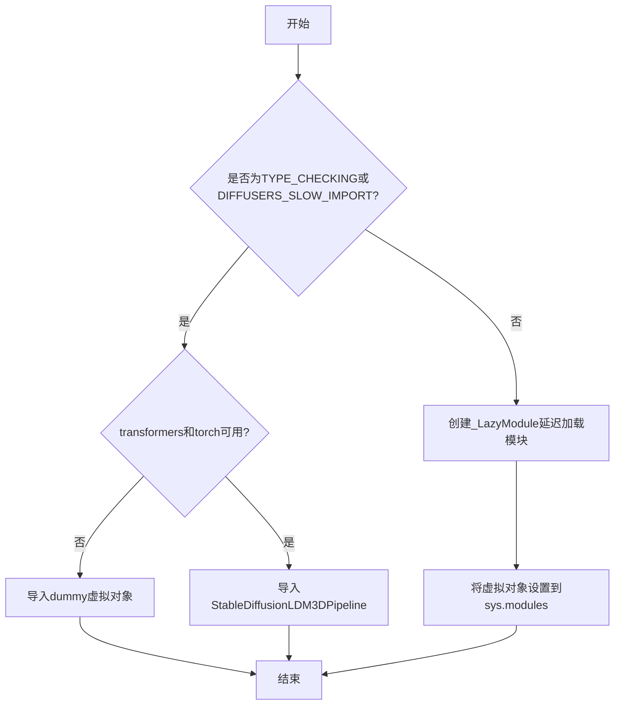
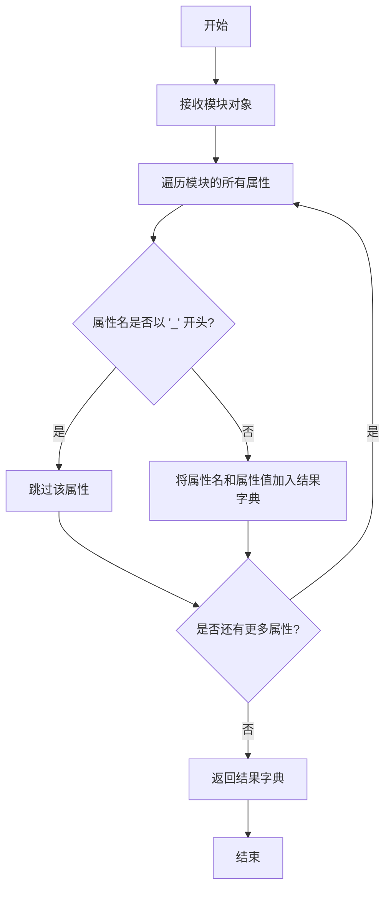
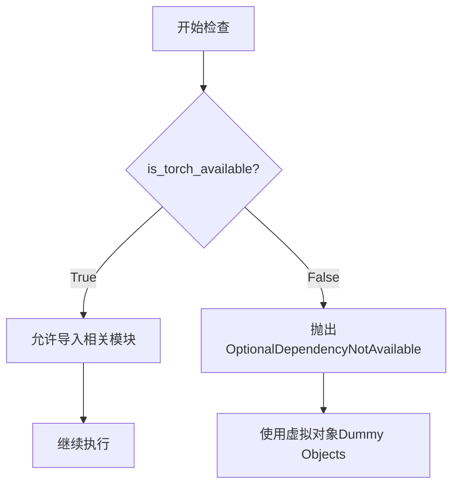
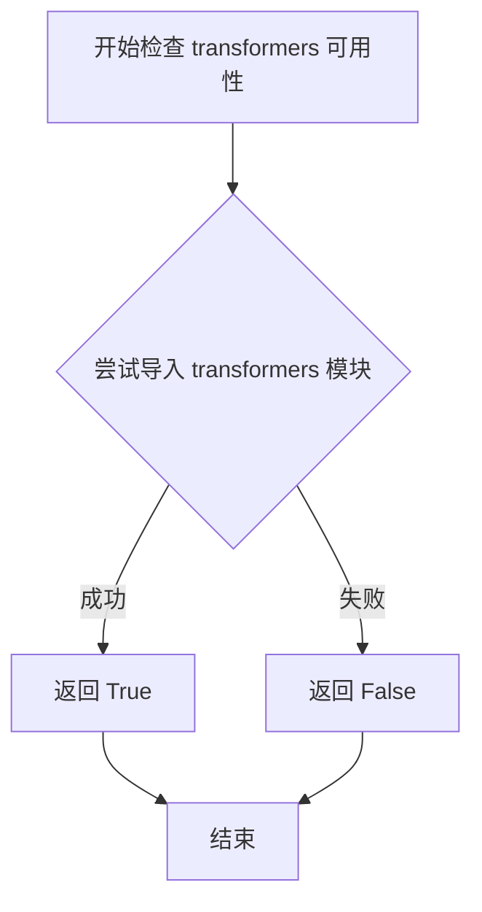

# `diffusers\src\diffusers\pipelines\stable_diffusion_ldm3d\__init__.py` 详细设计文档

这是一个diffusers库的延迟加载导入模块，用于在满足可选依赖（torch和transformers）条件时导入StableDiffusionLDM3DPipeline，否则导入虚拟对象以保持模块结构完整性。

## 整体流程



## 类结构

```
无类定义（纯模块导入文件）
```

## 全局变量及字段


### `_dummy_objects`
    
存储虚拟对象的字典，用于在依赖不可用时保持模块结构

类型：`dict`
    


### `_import_structure`
    
定义模块的导入结构，映射名称到对象

类型：`dict`
    


    

## 全局函数及方法


### `get_objects_from_module`

该函数是一个工具函数，用于从指定的模块中提取所有公共对象（排除以 `_` 开头的私有对象），并返回一个包含对象名称和对象本身的字典。在代码中，它用于从 `dummy_torch_and_transformers_objects` 模块中获取虚拟对象，以便在可选依赖不可用时提供替代实现。

参数：

-  `module`：`module`，要从中提取对象的模块对象

返回值：`Dict[str, Any]`，返回模块中所有公共对象的字典，键为对象名称，值为对象本身

#### 流程图



#### 带注释源码

```python
def get_objects_from_module(module):
    """
    从给定模块中提取所有公共对象的工具函数。
    
    该函数遍历模块的所有属性，过滤掉以 '_' 开头的私有属性，
    将剩余的公共属性（类、函数、变量等）存入字典并返回。
    
    参数:
        module: 要从中提取对象的模块对象
        
    返回:
        包含模块中所有公共对象的字典，键为对象名称，值为对象本身
    """
    # 初始化结果字典
    objects = {}
    
    # 遍历模块的所有属性
    for attr_name in dir(module):
        # 过滤掉私有属性（以 '_' 开头）
        if not attr_name.startswith('_'):
            # 获取属性值
            attr_value = getattr(module, attr_name)
            # 将属性名和属性值存入字典
            objects[attr_name] = attr_value
    
    return objects
```


### `is_torch_available`

检查当前环境中 PyTorch 库是否可用，返回布尔值以决定后续的导入逻辑。

参数：

- （无参数）

返回值：`bool`，如果 PyTorch 库可用则返回 `True`，否则返回 `False`

#### 流程图



#### 带注释源码

由于 `is_torch_available` 函数定义在 `...utils` 模块中（外部依赖），当前文件仅导入并使用该函数。源码如下：

```python
# 从上级目录的 utils 模块导入 is_torch_available 函数
# 该函数用于检查 torch 库是否已安装且可用
from ...utils import (
    DIFFUSERS_SLOW_IMPORT,
    OptionalDependencyNotAvailable,
    _LazyModule,
    get_objects_from_module,
    is_torch_available,  # <-- 被提取的函数
    is_transformers_available,
)

# ...后续代码使用该函数进行条件检查...
```


### `is_transformers_available`

该函数用于检查当前 Python 环境中是否安装了 `transformers` 库，并返回布尔值以指示其可用性。在 diffusers 库中，此函数用于条件导入，实现可选依赖的延迟加载。

参数： 无

返回值： `bool`，返回 `True` 表示 `transformers` 库可用，返回 `False` 表示不可用。

#### 流程图



#### 带注释源码

```
# is_transformers_available 是从 ...utils 导入的函数
# 在当前文件中并未定义，而是作为外部依赖检查工具使用

from ...utils import (
    # ... 其他导入 ...
    is_transformers_available,  # <-- 从上层 utils 模块导入的可用性检查函数
)

# 使用示例：检查 transformers 和 torch 是否同时可用
if not (is_transformers_available() and is_torch_available()):
    raise OptionalDependencyNotAvailable()
# 如果任一依赖不可用，则抛出 OptionalDependencyNotAvailable 异常
# 否则继续导入 StableDiffusionLDM3DPipeline
```

**注意**：由于 `is_transformers_available` 函数的实现源码不在当前文件中（它来源于 `...utils` 模块），上述流程图和源码注释基于该函数的常见实现模式推断。该函数通常通过尝试 `import transformers` 并捕获 `ImportError` 来判断库是否可用。

## 关键组件


### 延迟加载模块（Lazy Loading）

使用 `_LazyModule` 实现模块的延迟加载机制，当模块被实际访问时才加载对应的类和函数，避免启动时的全量导入，提升导入性能。

### 可选依赖检查与回退（Optional Dependency Handling）

通过 `is_torch_available()` 和 `is_transformers_available()` 检查运行时依赖是否可用，当依赖不可用时抛出 `OptionalDependencyNotAvailable` 异常并回退到虚拟对象（dummy objects），保证模块在缺少可选依赖时仍可被导入。

### 导入结构字典（Import Structure Dictionary）

`_import_structure` 字典定义了模块的公共接口映射，将字符串键（如 "pipeline_stable_diffusion_ldm3d"）映射到实际类对象（如 `StableDiffusionLDM3DPipeline`），用于延迟加载时的模块构造。

### 虚拟对象管理（Dummy Objects Management）

`_dummy_objects` 字典存储当可选依赖不可用时的替代对象，通过 `get_objects_from_module()` 从虚拟模块中获取，并在运行时通过 `setattr` 动态绑定到模块，防止导入时出现 AttributeError。

### 条件类型检查（TYPE_CHECKING Guard）

使用 `TYPE_CHECKING` 标志在类型检查时导入实际类对象，而在运行时使用延迟加载机制，优化类型提示的可访问性和运行时的导入开销。

### StableDiffusionLDM3DPipeline 管道类

主要的导出类 `StableDiffusionLDM3DPipeline`，代表 Stable Diffusion LDM3D  pipeline，用于生成 3D 场景或深度图相关的扩散模型输出。

### 模块动态绑定（Dynamic Module Binding）

通过 `sys.modules[__name__] = _LazyModule(...)` 将当前模块替换为延迟加载的代理对象，并遍历 `_dummy_objects` 将虚拟对象绑定到模块命名空间，实现统一的导入接口。


## 问题及建议


### 已知问题

-   **重复的依赖检查逻辑**：try-except 块在第13-22行和第27-36行几乎完全重复，违反了 DRY（Don't Repeat Yourself）原则
-   **全局可变状态**：_dummy_objects 和 _import_structure 在模块级别被修改，可能导致意外的副作用和难以追踪的状态
-   **导入逻辑分散**：_import_structure 字典在 if-else 之外定义（第10行），但内容是在 else 分支中动态添加的，逻辑不够清晰
-   **类型检查路径冗余**：TYPE_CHECKING 分支内部再次重复了相同的依赖检查，没有复用顶部的检查结果
- **异常处理不具体**：捕获 OptionalDependencyNotAvailable 异常后直接导入 dummy 对象，没有日志记录或明确的错误提示

### 优化建议

-   提取重复的依赖检查逻辑到私有函数（如 _check_dependencies()），在多处调用以避免代码重复
-   将 _import_structure 的定义移入 else 分支，使其与实际填充逻辑保持一致，提高可读性
-   使用 functools.lru_cache 缓存 get_objects_from_module 的结果，减少重复调用开销
-   考虑使用装饰器或工厂模式重构 _LazyModule 的创建逻辑，简化模块初始化流程
-   在异常处理分支添加可选的警告日志，便于调试时追踪依赖缺失情况
-   将 _dummy_objects 的更新操作封装为函数，避免直接操作全局状态

## 其它


### 设计目标与约束

该模块的设计目标是实现StableDiffusionLDM3DPipeline的条件导入，采用懒加载机制以优化Diffusers库的启动性能和内存占用。设计约束包括：(1) 必须同时依赖torch和transformers两个库才能导入真实管道类；(2) 使用_LazyModule实现延迟加载，避免在库导入时就加载重型依赖；(3) 通过dummy对象机制提供向后兼容性，使模块在缺少可选依赖时仍可被导入。

### 错误处理与异常设计

该模块采用OptionalDependencyNotAvailable异常来处理可选依赖缺失的情况。当is_transformers_available()或is_torch_available()返回False时，抛出OptionalDependencyNotAvailable异常，捕获后从dummy_torch_and_transformers_objects模块导入虚拟对象填充_dummy_objects字典。对于导入错误，代码通过try-except块包裹依赖检查逻辑，确保程序不会因缺少可选依赖而崩溃。

### 数据流与状态机

模块的数据流分为三个阶段：初始化阶段定义_import_structure字典和_dummy_objects集合；条件检查阶段通过is_transformers_available()和is_torch_available()判断依赖可用性；懒加载阶段当DIFFUSERS_SLOW_IMPORT为True或TYPE_CHECKING模式时直接导入，否则将当前模块替换为_LazyModule实例。状态转换依据依赖检查结果和导入模式(TYPE_CHECKING/DIFFUSERS_SLOW_IMPORT/运行时)决定走哪条代码路径。

### 外部依赖与接口契约

该模块的直接外部依赖包括：(1) torch库 - 深度学习计算后端；(2) transformers库 - 预训练模型和tokenizer；(3) Diffusers内部utils模块 - 提供_LazyModule、OptionalDependencyNotAvailable、get_objects_from_module等工具。模块导出的公共接口为StableDiffusionLDM3DPipeline类，该类在pipeline_stable_diffusion_ldm3d模块中定义。_import_structure字典定义了模块的导出结构，供LazyModule机制使用。

### 版本兼容性考虑

该模块需要考虑torch和transformers的版本兼容性问题。由于使用is_transformers_available()和is_torch_available()进行版本检查，不同版本的库可能导致行为差异。建议在文档中明确说明支持的最低torch和transformers版本范围，并在CI/CD中配置多版本测试矩阵。

### 性能考虑

懒加载机制是该模块的主要性能优化手段。通过将sys.modules[__name__]替换为_LazyModule实例，实际的管道类导入被延迟到首次访问时进行。这显著减少了Diffusers库初始导入时间，特别在用户只需要使用其他不依赖torch/transformers的模块时。_dummy_objects的存在也避免了AttributeError，提升了导入失败时的错误恢复性能。

### 安全考虑

该模块本身不涉及用户输入处理或网络请求，安全风险较低。但需要确保dummy_torch_and_transformers_objects模块中定义的虚拟对象不会触发任何实际的torch/transformers操作，以防止在依赖缺失环境下产生难以追踪的错误。

### 测试策略

建议为该模块编写以下测试用例：(1) 依赖可用时验证StableDiffusionLDM3DPipeline正确导出；(2) 依赖缺失时验证dummy对象正确填充；(3) 验证LazyModule的延迟加载行为；(4) 验证TYPE_CHECKING模式下的导入行为；(5) 测试多次导入模块的幂等性。

### 部署注意事项

在部署包含该模块的Diffusers库时，需要确保：(1) 安装环境时正确处理可选依赖，pip install diffusers[torch,transformers]应能安装所有必要依赖；(2) 文档应明确说明StableDiffusionLDM3DPipeline需要额外的依赖才能正常使用；(3) 在某些精简部署场景下，可考虑将此类懒加载模块作为性能优化选项。

    