# `diffusers\src\diffusers\pipelines\stable_diffusion_ldm3d\pipeline_stable_diffusion_ldm3d.py` 详细设计文档

这是一个用于文本到图像生成的管道（Pipeline），基于Latent Diffusion Models (LDM)，专门设计用于同时生成RGB图像和相应的深度图（Depth Map）。它集成了VAE、文本编码器、UNet和调度器，并包含安全检查器和图像后处理功能。

## 整体流程

```mermaid
graph TD
Start[调用 __call__ 方法] --> CheckInputs[检查输入参数 (check_inputs)]
CheckInputs --> EncodePrompt[编码提示词 (encode_prompt)]
EncodePrompt --> RetrieveTimesteps[获取时间步 (retrieve_timesteps)]
RetrieveTimesteps --> PrepareLatents[准备初始潜变量 (prepare_latents)]
PrepareLatents --> DenoiseLoop{去噪循环 (for timesteps)}
DenoiseLoop --> PredictNoise[UNet预测噪声]
PredictNoise --> Guidance[应用分类器自由引导 (Classifier-free Guidance)]
Guidance --> SchedulerStep[调度器步进 (scheduler.step)]
SchedulerStep --> CheckInterrupt{检查中断标志}
CheckInterrupt -- 否 --> CheckLoopEnd{循环结束?}
CheckLoopEnd -- 否 --> DenoiseLoop
CheckLoopEnd -- 是 --> Decode[VAE解码 (vae.decode)]
Decode --> SafetyCheck[安全检查 (run_safety_checker)]
SafetyCheck --> PostProcess[图像后处理 (postprocess: 分离RGB和Depth)]
PostProcess --> Return[返回 LDM3DPipelineOutput]
```

## 类结构

```
StableDiffusionLDM3DPipeline
├── DeprecatedPipelineMixin
├── DiffusionPipeline (基类)
├── StableDiffusionMixin
├── TextualInversionLoaderMixin
├── IPAdapterMixin
├── StableDiffusionLoraLoaderMixin
└── FromSingleFileMixin

LDM3DPipelineOutput (数据类)
```

## 全局变量及字段


### `logger`
    
Module-level logger for tracking pipeline execution and warnings

类型：`logging.Logger`
    


### `EXAMPLE_DOC_STRING`
    
Documentation string containing usage examples for the LDM3D pipeline

类型：`str`
    


### `XLA_AVAILABLE`
    
Flag indicating whether PyTorch XLA is available for accelerated computation

类型：`bool`
    


### `LDM3DPipelineOutput.rgb`
    
Output RGB images generated by the pipeline

类型：`list[PIL.Image.Image] | np.ndarray`
    


### `LDM3DPipelineOutput.depth`
    
Output depth images generated by the pipeline corresponding to RGB outputs

类型：`list[PIL.Image.Image] | np.ndarray`
    


### `LDM3DPipelineOutput.nsfw_content_detected`
    
Flag indicating whether NSFW content was detected in generated images

类型：`list[bool] | None`
    


### `StableDiffusionLDM3DPipeline.vae`
    
Variational Auto-Encoder model for encoding and decoding images to/from latent space

类型：`AutoencoderKL`
    


### `StableDiffusionLDM3DPipeline.text_encoder`
    
Frozen text encoder for converting text prompts into embedding vectors

类型：`CLIPTextModel`
    


### `StableDiffusionLDM3DPipeline.tokenizer`
    
CLIP tokenizer for converting text input into token IDs

类型：`CLIPTokenizer`
    


### `StableDiffusionLDM3DPipeline.unet`
    
Conditional UNet model for denoising latent representations during generation

类型：`UNet2DConditionModel`
    


### `StableDiffusionLDM3DPipeline.scheduler`
    
Diffusion scheduler for managing noise scheduling and denoising steps

类型：`KarrasDiffusionSchedulers`
    


### `StableDiffusionLDM3DPipeline.safety_checker`
    
Safety checker module for detecting potentially harmful generated content

类型：`StableDiffusionSafetyChecker`
    


### `StableDiffusionLDM3DPipeline.feature_extractor`
    
CLIP image processor for extracting features from images for safety checking

类型：`CLIPImageProcessor`
    


### `StableDiffusionLDM3DPipeline.image_encoder`
    
CLIP vision model for encoding images in IP-Adapter support

类型：`CLIPVisionModelWithProjection | None`
    


### `StableDiffusionLDM3DPipeline.vae_scale_factor`
    
Scaling factor for VAE latents based on the number of VAE block output channels

类型：`int`
    


### `StableDiffusionLDM3DPipeline.image_processor`
    
Image processor for handling VAE input/output transformations for LDM3D format

类型：`VaeImageProcessorLDM3D`
    


### `StableDiffusionLDM3DPipeline._guidance_scale`
    
Guidance scale for classifier-free guidance during generation

类型：`float`
    


### `StableDiffusionLDM3DPipeline._guidance_rescale`
    
Rescaling factor for noise predictions to improve image quality and fix overexposure

类型：`float`
    


### `StableDiffusionLDM3DPipeline._clip_skip`
    
Number of CLIP layers to skip when computing prompt embeddings

类型：`int | None`
    


### `StableDiffusionLDM3DPipeline._cross_attention_kwargs`
    
Additional keyword arguments passed to cross-attention layers during denoising

类型：`dict[str, Any] | None`
    


### `StableDiffusionLDM3DPipeline._num_timesteps`
    
Total number of timesteps used in the current generation process

类型：`int`
    


### `StableDiffusionLDM3DPipeline._interrupt`
    
Flag to interrupt the denoising loop during generation

类型：`bool`
    
    

## 全局函数及方法


### `rescale_noise_cfg`

该函数是一个全局工具函数，用于在扩散模型的引导采样过程中对噪声预测进行重缩放。它基于论文"Common Diffusion Noise Schedules and Sample Steps are Flawed"第3.4节的方法，通过计算文本引导噪声和总噪声的标准差比率来重新调整噪声预测，从而改善图像质量并修复过度曝光问题，同时通过混合因子避免生成过于平淡的图像。

参数：

- `noise_cfg`：`torch.Tensor`，引导扩散过程中预测的噪声张量（即总噪声预测）
- `noise_pred_text`：`torch.Tensor`，文本引导扩散过程中预测的噪声张量（条件噪声预测）
- `guidance_rescale`：`float`，可选参数，默认值为0.0，用于控制重缩放程度的混合因子

返回值：`torch.Tensor`，重缩放后的噪声预测张量

#### 流程图

```mermaid
flowchart TD
    A[开始] --> B[计算noise_pred_text的标准差std_text]
    B --> C[计算noise_cfg的标准差std_cfg]
    C --> D[计算重缩放后的噪声预测<br/>noise_pred_rescaled = noise_cfg × (std_text / std_cfg)]
    D --> E[根据guidance_rescale混合原始和重缩放结果<br/>noise_cfg = guidance_rescale × noise_pred_rescaled + (1 - guidance_rescale) × noise_cfg]
    E --> F[返回重缩放后的noise_cfg]
    
    B -.-> G[沿除批次维度外的所有维度计算]
    C -.-> G
    D -.-> H[修复过度曝光问题]
    E -.-> I[避免生成过于平淡plain looking的图像]
```

#### 带注释源码

```python
def rescale_noise_cfg(noise_cfg, noise_pred_text, guidance_rescale=0.0):
    r"""
    Rescales `noise_cfg` tensor based on `guidance_rescale` to improve image quality and fix overexposure. Based on
    Section 3.4 from [Common Diffusion Noise Schedules and Sample Steps are
    Flawed](https://huggingface.co/papers/2305.08891).

    Args:
        noise_cfg (`torch.Tensor`):
            The predicted noise tensor for the guided diffusion process.
        noise_pred_text (`torch.Tensor`):
            The predicted noise tensor for the text-guided diffusion process.
        guidance_rescale (`float`, *optional*, defaults to 0.0):
            A rescale factor applied to the noise predictions.

    Returns:
        noise_cfg (`torch.Tensor`): The rescaled noise prediction tensor.
    """
    # 计算文本引导噪声预测在空间维度上的标准差
    # keepdim=True 保持维度以便后续广播操作
    std_text = noise_pred_text.std(dim=list(range(1, noise_pred_text.ndim)), keepdim=True)
    
    # 计算总噪声预测在空间维度上的标准差
    std_cfg = noise_cfg.std(dim=list(range(1, noise_cfg.ndim)), keepdim=True)
    
    # 第一步重缩放：用文本噪声的标准差比率缩放噪声预测
    # 这步操作修复了过度曝光问题（Section 3.4）
    noise_pred_rescaled = noise_cfg * (std_text / std_cfg)
    
    # 第二步混合：将重缩放后的结果与原始结果按guidance_rescale因子混合
    # 当guidance_rescale=0时，返回原始noise_cfg（不做任何处理）
    # 当guidance_rescale=1时，完全使用重缩放后的结果
    # 适中的值可以避免生成过于平淡（plain looking）的图像
    noise_cfg = guidance_rescale * noise_pred_rescaled + (1 - guidance_rescale) * noise_cfg
    
    return noise_cfg
```


### `retrieve_timesteps`

该函数用于调用调度器（scheduler）的 `set_timesteps` 方法并从中获取时间步（timesteps）。它支持自定义时间步或自定义 sigmas，任何额外的关键字参数（kwargs）都会传递给调度器的 `set_timesteps` 方法。

参数：

- `scheduler`：`SchedulerMixin`，要获取时间步的调度器
- `num_inference_steps`：`int | None`，生成样本时使用的扩散步数。如果使用此参数，则 `timesteps` 必须为 `None`
- `device`：`str | torch.device | None`，时间步要移动到的设备。如果为 `None`，则不移动时间步
- `timesteps`：`list[int] | None`，用于覆盖调度器时间步间隔策略的自定义时间步。如果传入 `timesteps`，则 `num_inference_steps` 和 `sigmas` 必须为 `None`
- `sigmas`：`list[float] | None`，用于覆盖调度器时间步间隔策略的自定义 sigmas。如果传入 `sigmas`，则 `num_inference_steps` 和 `timesteps` 必须为 `None`
- `**kwargs`：任意关键字参数，将传递给 `scheduler.set_timesteps`

返回值：`tuple[torch.Tensor, int]`，元组包含调度器的时间步调度和推理步数

#### 流程图

```mermaid
flowchart TD
    A[开始 retrieve_timesteps] --> B{同时提供了 timesteps 和 sigmas?}
    B -->|是| C[抛出 ValueError: 只能传入 timesteps 或 sigmas 之一]
    B -->|否| D{提供了 timesteps?}
    D -->|是| E{scheduler.set_timesteps 是否支持 timesteps 参数?}
    E -->|否| F[抛出 ValueError: 当前调度器类不支持自定义时间步计划]
    E -->|是| G[调用 scheduler.set_timesteps timesteps=timesteps device=device **kwargs]
    G --> H[获取 scheduler.timesteps]
    H --> I[计算 num_inference_steps = len(timesteps)]
    I --> J[返回 timesteps, num_inference_steps]
    D -->|否| K{提供了 sigmas?}
    K -->|是| L{scheduler.set_timesteps 是否支持 sigmas 参数?}
    L -->|否| M[抛出 ValueError: 当前调度器类不支持自定义 sigmas 计划]
    L -->|是| N[调用 scheduler.set_timesteps sigmas=sigmas device=device **kwargs]
    N --> O[获取 scheduler.timesteps]
    O --> P[计算 num_inference_steps = len(timesteps)]
    P --> J
    K -->|否| Q[调用 scheduler.set_timesteps num_inference_steps=num_inference_steps device=device **kwargs]
    Q --> R[获取 scheduler.timesteps]
    R --> J
```

#### 带注释源码

```python
# Copied from diffusers.pipelines.stable_diffusion.pipeline_stable_diffusion.retrieve_timesteps
def retrieve_timesteps(
    scheduler,
    num_inference_steps: int | None = None,
    device: str | torch.device | None = None,
    timesteps: list[int] | None = None,
    sigmas: list[float] | None = None,
    **kwargs,
):
    r"""
    Calls the scheduler's `set_timesteps` method and retrieves timesteps from the scheduler after the call. Handles
    custom timesteps. Any kwargs will be supplied to `scheduler.set_timesteps`.

    Args:
        scheduler (`SchedulerMixin`):
            The scheduler to get timesteps from.
        num_inference_steps (`int`):
            The number of diffusion steps used when generating samples with a pre-trained model. If used, `timesteps`
            must be `None`.
        device (`str` or `torch.device`, *optional*):
            The device to which the timesteps should be moved to. If `None`, the timesteps are not moved.
        timesteps (`list[int]`, *optional*):
            Custom timesteps used to override the timestep spacing strategy of the scheduler. If `timesteps` is passed,
            `num_inference_steps` and `sigmas` must be `None`.
        sigmas (`list[float]`, *optional*):
            Custom sigmas used to override the timestep spacing strategy of the scheduler. If `sigmas` is passed,
            `num_inference_steps` and `timesteps` must be `None`.

    Returns:
        `tuple[torch.Tensor, int]`: A tuple where the first element is the timestep schedule from the scheduler and the
        second element is the number of inference steps.
    """
    # 检查是否同时传入了 timesteps 和 sigmas，这是不允许的
    if timesteps is not None and sigmas is not None:
        raise ValueError("Only one of `timesteps` or `sigmas` can be passed. Please choose one to set custom values")
    
    # 处理自定义 timesteps 的情况
    if timesteps is not None:
        # 检查调度器的 set_timesteps 方法是否接受 timesteps 参数
        accepts_timesteps = "timesteps" in set(inspect.signature(scheduler.set_timesteps).parameters.keys())
        if not accepts_timesteps:
            raise ValueError(
                f"The current scheduler class {scheduler.__class__}'s `set_timesteps` does not support custom"
                f" timestep schedules. Please check whether you are using the correct scheduler."
            )
        # 调用调度器的 set_timesteps 方法
        scheduler.set_timesteps(timesteps=timesteps, device=device, **kwargs)
        # 从调度器获取时间步
        timesteps = scheduler.timesteps
        # 计算推理步数
        num_inference_steps = len(timesteps)
    
    # 处理自定义 sigmas 的情况
    elif sigmas is not None:
        # 检查调度器的 set_timesteps 方法是否接受 sigmas 参数
        accept_sigmas = "sigmas" in set(inspect.signature(scheduler.set_timesteps).parameters.keys())
        if not accept_sigmas:
            raise ValueError(
                f"The current scheduler class {scheduler.__class__}'s `set_timesteps` does not support custom"
                f" sigmas schedules. Please check whether you are using the correct scheduler."
            )
        # 调用调度器的 set_timesteps 方法
        scheduler.set_timesteps(sigmas=sigmas, device=device, **kwargs)
        # 从调度器获取时间步
        timesteps = scheduler.timesteps
        # 计算推理步数
        num_inference_steps = len(timesteps)
    
    # 使用默认的推理步数
    else:
        scheduler.set_timesteps(num_inference_steps, device=device, **kwargs)
        # 从调度器获取时间步
        timesteps = scheduler.timesteps
    
    # 返回时间步和推理步数
    return timesteps, num_inference_steps
```


### `StableDiffusionLDM3DPipeline.__init__`

这是 Stable Diffusion LDM3D 流水线的构造函数，负责初始化所有核心组件，包括 VAE、文本编码器、UNet、调度器、安全检查器等，并完成模块注册、图像处理器配置和参数保存等关键初始化工作。

参数：

- `vae`：`AutoencoderKL`，用于将图像编码和解码到潜在表示的变分自编码器模型
- `text_encoder`：`CLIPTextModel`，冻结的文本编码器（clip-vit-large-patch14）
- `tokenizer`：`CLIPTokenizer`，用于对文本进行分词的 CLIP 分词器
- `unet`：`UNet2DConditionModel`，用于对编码后的图像潜在表示进行去噪的 UNet 模型
- `scheduler`：`KarrasDiffusionSchedulers`，与 unet 结合使用以对编码图像潜在表示进行去噪的调度器
- `safety_checker`：`StableDiffusionSafetyChecker`，用于评估生成的图像是否包含不当或有害内容的分类模块
- `feature_extractor`：`CLIPImageProcessor`，用于从生成的图像中提取特征的图像处理器，作为 safety_checker 的输入
- `image_encoder`：`CLIPVisionModelWithProjection | None`，可选的图像编码器，用于 IP-Adapter 功能
- `requires_safety_checker`：`bool`，默认为 True，指定是否需要在管道中启用安全检查器

返回值：`None`，构造函数不返回值，仅完成对象初始化

#### 流程图

```mermaid
flowchart TD
    A[开始 __init__] --> B{检查 safety_checker}
    B -->|safety_checker 为 None 但 requires_safety_checker 为 True| C[发出安全警告]
    B -->|safety_checker 不为 None 但 feature_extractor 为 None| D[抛出 ValueError]
    C --> E
    D --> E
    E[调用 super().__init__] --> F[调用 self.register_modules 注册所有模块]
    F --> G[计算 vae_scale_factor]
    G --> H[创建 VaeImageProcessorLDM3D 图像处理器]
    H --> I[调用 self.register_to_config 保存 requires_safety_checker]
    I --> J[结束 __init__]
    
    style C fill:#fff3cd
    style D fill:#f8d7da
    style J fill:#d4edda
```

#### 带注释源码

```python
def __init__(
    self,
    vae: AutoencoderKL,
    text_encoder: CLIPTextModel,
    tokenizer: CLIPTokenizer,
    unet: UNet2DConditionModel,
    scheduler: KarrasDiffusionSchedulers,
    safety_checker: StableDiffusionSafetyChecker,
    feature_extractor: CLIPImageProcessor,
    image_encoder: CLIPVisionModelWithProjection | None,
    requires_safety_checker: bool = True,
):
    """
    初始化 StableDiffusionLDM3DPipeline 流水线。
    
    参数:
        vae: 变分自编码器模型，用于图像编码/解码
        text_encoder: CLIP 文本编码器
        tokenizer: CLIP 分词器
        unet: 条件 UNet 模型，用于去噪
        scheduler: 扩散调度器
        safety_checker: 安全检查器，用于过滤不当内容
        feature_extractor: CLIP 图像特征提取器
        image_encoder: 可选的 CLIP 视觉模型，用于 IP-Adapter
        requires_safety_checker: 是否需要安全检查器
    """
    # 调用父类构造函数进行基础初始化
    super().__init__()

    # 检查安全检查器配置：如果未提供 safety_checker 但要求启用，则发出警告
    if safety_checker is None and requires_safety_checker:
        logger.warning(
            f"You have disabled the safety checker for {self.__class__} by passing `safety_checker=None`. Ensure"
            " that you abide to the conditions of the Stable Diffusion license and do not expose unfiltered"
            " results in services or applications open to the public..."
        )

    # 检查安全检查器与特征提取器的依赖关系
    if safety_checker is not None and feature_extractor is None:
        raise ValueError(
            "Make sure to define a feature extractor when loading {self.__class__} if you want to use the safety"
            " checker. If you do not want to use the safety checker, you can pass `'safety_checker=None'` instead."
        )

    # 注册所有模块，使 Pipeline 能够统一管理这些组件
    self.register_modules(
        vae=vae,
        text_encoder=text_encoder,
        tokenizer=tokenizer,
        unet=unet,
        scheduler=scheduler,
        safety_checker=safety_checker,
        feature_extractor=feature_extractor,
        image_encoder=image_encoder,
    )
    
    # 计算 VAE 缩放因子，基于 VAE 的块输出通道数确定下采样倍数
    self.vae_scale_factor = 2 ** (len(self.vae.config.block_out_channels) - 1) if getattr(self, "vae", None) else 8
    
    # 创建 LDM3D 专用的 VAE 图像处理器
    self.image_processor = VaeImageProcessorLDM3D(vae_scale_factor=self.vae_scale_factor)
    
    # 将 requires_safety_checker 保存到配置中
    self.register_to_config(requires_safety_checker=requires_safety_checker)
```


### `StableDiffusionLDM3DPipeline._encode_prompt`

该方法是 `_encode_prompt` 函数，用于将文本提示编码为文本嵌入向量。它是 `encode_prompt` 的包装器，主要用于向后兼容性，将返回格式从元组转换为拼接的张量。该方法已被标记为弃用，建议使用 `encode_prompt` 代替。

参数：

- `prompt`：字符串或字符串列表，要编码的提示文本
- `device`：`torch.device`，目标设备
- `num_images_per_prompt`：`int`，每个提示生成的图像数量
- `do_classifier_free_guidance`：`bool`，是否使用无分类器自由引导
- `negative_prompt`：字符串或字符串列表（可选），负向提示
- `prompt_embeds`：`torch.Tensor | None`（可选），预生成的文本嵌入
- `negative_prompt_embeds`：`torch.Tensor | None`（可选），预生成的负向文本嵌入
- `lora_scale`：`float | None`（可选），LoRA 缩放因子
- `**kwargs`：其他关键字参数

返回值：`torch.Tensor`，拼接后的提示嵌入向量（包含负向和正向嵌入）

#### 流程图

```mermaid
flowchart TD
    A[开始 _encode_prompt] --> B[发出弃用警告]
    B --> C[调用 self.encode_prompt]
    C --> D[获取元组形式的嵌入: prompt_embeds_tuple]
    D --> E{向后兼容性处理}
    E --> F[拼接元组元素: torch.cat[negative, positive]]
    F --> G[返回拼接后的 prompt_embeds]
```

#### 带注释源码

```python
def _encode_prompt(
    self,
    prompt,                          # 字符串或字符串列表：输入的文本提示
    device,                         # torch.device：执行设备
    num_images_per_prompt,          # int：每个提示生成的图像数量
    do_classifier_free_guidance,    # bool：是否启用无分类器引导
    negative_prompt=None,           # str|list[str]|None：负向提示
    prompt_embeds: torch.Tensor | None = None,    # 预计算的提示嵌入
    negative_prompt_embeds: torch.Tensor | None = None,  # 预计算的负向嵌入
    lora_scale: float | None = None,  # LoRA 权重缩放因子
    **kwargs,                        # 其他可选参数
):
    # 发出弃用警告，提示用户使用 encode_prompt 代替
    deprecation_message = "`_encode_prompt()` is deprecated and it will be removed in a future version. Use `encode_prompt()` instead. Also, be aware that the output format changed from a concatenated tensor to a tuple."
    deprecate("_encode_prompt()", "1.0.0", deprecation_message, standard_warn=False)

    # 调用 encode_prompt 方法获取元组格式的嵌入
    # 元组格式: (negative_prompt_embeds, prompt_embeds)
    prompt_embeds_tuple = self.encode_prompt(
        prompt=prompt,
        device=device,
        num_images_per_prompt=num_images_per_prompt,
        do_classifier_free_guidance=do_classifier_free_guidance,
        negative_prompt=negative_prompt,
        prompt_embeds=prompt_embeds,
        negative_prompt_embeds=negative_prompt_embeds,
        lora_scale=lora_scale,
        **kwargs,
    )

    # 为了向后兼容性，将元组拼接为单个张量
    # 顺序为 [negative_prompt_embeds, prompt_embeds]
    # 原来旧版本返回的是拼接后的单一张量
    prompt_embeds = torch.cat([prompt_embeds_tuple[1], prompt_embeds_tuple[0]])

    return prompt_embeds  # 返回拼接后的嵌入张量
```


### `StableDiffusionLDM3DPipeline.encode_prompt`

该方法负责将文本提示词（prompt）编码为文本编码器（text encoder）的隐藏状态（hidden states），支持 LoRA 缩放、负面提示词、无分类器自由引导（CFG）等功能。它是 Stable Diffusion 流水线中的关键步骤，用于生成条件输入以指导图像生成过程。

参数：

- `self`：隐式参数，StableDiffusionLDM3DPipeline 实例本身
- `prompt`：`str | list[str] | None`，要编码的文本提示词，可以是单个字符串或字符串列表
- `device`：`torch.device`，torch 设备，用于将计算结果移动到指定设备
- `num_images_per_prompt`：`int`，每个提示词需要生成的图像数量，用于复制文本嵌入
- `do_classifier_free_guidance`：`bool`，是否使用无分类器自由引导
- `negative_prompt`：`str | list[str] | None`，负面提示词，用于引导图像不包含指定内容
- `prompt_embeds`：`torch.Tensor | None`，可选的预生成文本嵌入，如果提供则直接使用
- `negative_prompt_embeds`：`torch.Tensor | None`，可选的预生成负面文本嵌入
- `lora_scale`：`float | None`，LoRA 缩放因子，用于调整 LoRA 层的权重
- `clip_skip`：`int | None`，CLIP 编码器中跳过的层数，用于获取不同层次的特征

返回值：`tuple[torch.Tensor, torch.Tensor]`，返回两个张量组成的元组：
- 第一个元素是 `prompt_embeds`：编码后的正面提示词嵌入
- 第二个元素是 `negative_prompt_embeds`：编码后的负面提示词嵌入

#### 流程图

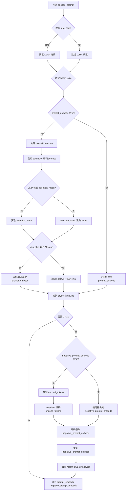

#### 带注释源码

```python
def encode_prompt(
    self,
    prompt,
    device,
    num_images_per_prompt,
    do_classifier_free_guidance,
    negative_prompt=None,
    prompt_embeds: torch.Tensor | None = None,
    negative_prompt_embeds: torch.Tensor | None = None,
    lora_scale: float | None = None,
    clip_skip: int | None = None,
):
    r"""
    Encodes the prompt into text encoder hidden states.

    Args:
        prompt (`str` or `list[str]`, *optional*):
            prompt to be encoded
        device: (`torch.device`):
            torch device
        num_images_per_prompt (`int`):
            number of images that should be generated per prompt
        do_classifier_free_guidance (`bool`):
            whether to use classifier free guidance or not
        negative_prompt (`str` or `list[str]`, *optional*):
            The prompt or prompts not to guide the image generation. If not defined, one has to pass
            `negative_prompt_embeds` instead. Ignored when not using guidance (i.e., ignored if `guidance_scale` is
            less than `1`).
        prompt_embeds (`torch.Tensor`, *optional*):
            Pre-generated text embeddings. Can be used to easily tweak text inputs, *e.g.* prompt weighting. If not
            provided, text embeddings will be generated from `prompt` input argument.
        negative_prompt_embeds (`torch.Tensor`, *optional*):
            Pre-generated negative text embeddings. Can be used to easily tweak text inputs, *e.g.* prompt
            weighting. If not provided, negative_prompt_embeds will be generated from `negative_prompt` input
            argument.
        lora_scale (`float`, *optional*):
            A LoRA scale that will be applied to all LoRA layers of the text encoder if LoRA layers are loaded.
        clip_skip (`int`, *optional*):
            Number of layers to be skipped from CLIP while computing the prompt embeddings. A value of 1 means that
            the output of the pre-final layer will be used for computing the prompt embeddings.
    """
    # 如果提供了 lora_scale 且当前 pipeline 支持 LoRA，则设置 LoRA 缩放
    # 这使得 text encoder 的 LoRA 补丁函数可以正确访问缩放值
    if lora_scale is not None and isinstance(self, StableDiffusionLoraLoaderMixin):
        self._lora_scale = lora_scale

        # 动态调整 LoRA 缩放
        if not USE_PEFT_BACKEND:
            adjust_lora_scale_text_encoder(self.text_encoder, lora_scale)
        else:
            scale_lora_layers(self.text_encoder, lora_scale)

    # 确定批次大小（batch_size）
    # 如果 prompt 是字符串，则 batch_size = 1
    # 如果 prompt 是列表，则 batch_size = 列表长度
    # 否则使用 prompt_embeds 的批次大小
    if prompt is not None and isinstance(prompt, str):
        batch_size = 1
    elif prompt is not None and isinstance(prompt, list):
        batch_size = len(prompt)
    else:
        batch_size = prompt_embeds.shape[0]

    # 如果没有提供 prompt_embeds，则需要从 prompt 生成
    if prompt_embeds is None:
        # 如果支持 textual inversion，则处理多向量 token（如果有）
        if isinstance(self, TextualInversionLoaderMixin):
            prompt = self.maybe_convert_prompt(prompt, self.tokenizer)

        # 使用 tokenizer 将 prompt 转换为 token IDs
        text_inputs = self.tokenizer(
            prompt,
            padding="max_length",
            max_length=self.tokenizer.model_max_length,
            truncation=True,
            return_tensors="pt",
        )
        text_input_ids = text_inputs.input_ids
        
        # 同时获取未截断的 token 序列，用于检查是否发生了截断
        untruncated_ids = self.tokenizer(prompt, padding="longest", return_tensors="pt").input_ids

        # 检查是否发生了截断，如果是则发出警告
        if untruncated_ids.shape[-1] >= text_input_ids.shape[-1] and not torch.equal(
            text_input_ids, untruncated_ids
        ):
            removed_text = self.tokenizer.batch_decode(
                untruncated_ids[:, self.tokenizer.model_max_length - 1 : -1]
            )
            logger.warning(
                "The following part of your input was truncated because CLIP can only handle sequences up to"
                f" {self.tokenizer.model_max_length} tokens: {removed_text}"
            )

        # 获取 attention mask，如果 text_encoder 配置需要的话
        if hasattr(self.text_encoder.config, "use_attention_mask") and self.text_encoder.config.use_attention_mask:
            attention_mask = text_inputs.attention_mask.to(device)
        else:
            attention_mask = None

        # 根据 clip_skip 参数决定如何获取 prompt embeddings
        if clip_skip is None:
            # 直接使用 text_encoder 获取 embeddings
            prompt_embeds = self.text_encoder(text_input_ids.to(device), attention_mask=attention_mask)
            prompt_embeds = prompt_embeds[0]
        else:
            # 获取完整隐藏_states，然后选择指定层的输出
            prompt_embeds = self.text_encoder(
                text_input_ids.to(device), attention_mask=attention_mask, output_hidden_states=True
            )
            # hidden_states 是一个元组，包含所有 encoder 层的输出
            # 通过索引访问所需层的输出：-1 表示最后一层，-(clip_skip+1) 表示倒数第 clip_skip+1 层
            prompt_embeds = prompt_embeds[-1][-(clip_skip + 1)]
            # 需要应用 final_layer_norm 以保持表示的正确性
            # 因为通常使用的最终表示会通过 LayerNorm 层
            prompt_embeds = self.text_encoder.text_model.final_layer_norm(prompt_embeds)

    # 确定 prompt_embeds 的数据类型
    # 优先使用 text_encoder 的 dtype，其次使用 unet 的 dtype
    if self.text_encoder is not None:
        prompt_embeds_dtype = self.text_encoder.dtype
    elif self.unet is not None:
        prompt_embeds_dtype = self.unet.dtype
    else:
        prompt_embeds_dtype = prompt_embeds.dtype

    # 将 prompt_embeds 转换为适当的 dtype 和 device
    prompt_embeds = prompt_embeds.to(dtype=prompt_embeds_dtype, device=device)

    # 获取嵌入的形状
    bs_embed, seq_len, _ = prompt_embeds.shape
    
    # 为每个 prompt 复制文本 embeddings（生成多张图像）
    # 使用 mps 友好的方法进行复制
    prompt_embeds = prompt_embeds.repeat(1, num_images_per_prompt, 1)
    prompt_embeds = prompt_embeds.view(bs_embed * num_images_per_prompt, seq_len, -1)

    # 如果需要进行无分类器自由引导且没有提供 negative_prompt_embeds
    # 则需要生成无条件 embeddings 用于引导
    if do_classifier_free_guidance and negative_prompt_embeds is None:
        uncond_tokens: list[str]
        
        # 确定 uncond_tokens 的值
        if negative_prompt is None:
            uncond_tokens = [""] * batch_size
        elif prompt is not None and type(prompt) is not type(negative_prompt):
            raise TypeError(
                f"`negative_prompt` should be the same type to `prompt`, but got {type(negative_prompt)} !="
                f" {type(prompt)}."
            )
        elif isinstance(negative_prompt, str):
            uncond_tokens = [negative_prompt]
        elif batch_size != len(negative_prompt):
            raise ValueError(
                f"`negative_prompt`: {negative_prompt} has batch size {len(negative_prompt)}, but `prompt`:"
                f" {prompt} has batch size {batch_size}. Please make sure that passed `negative_prompt` matches"
                " the batch size of `prompt`."
            )
        else:
            uncond_tokens = negative_prompt

        # 如果支持 textual inversion，则处理 uncond_tokens
        if isinstance(self, TextualInversionLoaderMixin):
            uncond_tokens = self.maybe_convert_prompt(uncond_tokens, self.tokenizer)

        # 获取 prompt_embeds 的最大长度作为 uncond_input 的长度
        max_length = prompt_embeds.shape[1]
        uncond_input = self.tokenizer(
            uncond_tokens,
            padding="max_length",
            max_length=max_length,
            truncation=True,
            return_tensors="pt",
        )

        # 获取 attention_mask
        if hasattr(self.text_encoder.config, "use_attention_mask") and self.text_encoder.config.use_attention_mask:
            attention_mask = uncond_input.attention_mask.to(device)
        else:
            attention_mask = None

        # 编码获取无条件 embeddings
        negative_prompt_embeds = self.text_encoder(
            uncond_input.input_ids.to(device),
            attention_mask=attention_mask,
        )
        negative_prompt_embeds = negative_prompt_embeds[0]

    # 如果需要进行无分类器自由引导
    if do_classifier_free_guidance:
        # 复制无条件 embeddings 以匹配每个 prompt 的生成数量
        seq_len = negative_prompt_embeds.shape[1]

        # 转换 dtype 和 device
        negative_prompt_embeds = negative_prompt_embeds.to(dtype=prompt_embeds_dtype, device=device)

        # 复制并调整形状
        negative_prompt_embeds = negative_prompt_embeds.repeat(1, num_images_per_prompt, 1)
        negative_prompt_embeds = negative_prompt_embeds.view(batch_size * num_images_per_prompt, seq_len, -1)

    # 如果使用了 LoRA 且使用了 PEFT backend，则需要恢复原始 scale
    if self.text_encoder is not None:
        if isinstance(self, StableDiffusionLoraLoaderMixin) and USE_PEFT_BACKEND:
            # 通过 unscale 恢复原始 scale
            unscale_lora_layers(self.text_encoder, lora_scale)

    # 返回 prompt_embeds 和 negative_prompt_embeds
    return prompt_embeds, negative_prompt_embeds
```


### `StableDiffusionLDM3DPipeline.encode_image`

该方法用于将输入图像编码为图像嵌入向量或隐藏状态表征，支持条件（带文本引导）和无条件（零向量）两种图像嵌入生成，适用于IP-Adapter等图像引导的生成场景。

参数：

- `image`：`PIL.Image.Image | np.ndarray | torch.Tensor`，待编码的输入图像，支持PIL图像、NumPy数组或PyTorch张量格式
- `device`：`torch.device`，目标计算设备，用于将图像张量移动到指定设备
- `num_images_per_prompt`：`int`，每个提示词生成的图像数量，用于对图像嵌入进行重复扩展
- `output_hidden_states`：`bool | None`，可选参数，指定是否返回图像编码器的隐藏状态而非图像嵌入

返回值：`tuple[torch.Tensor, torch.Tensor]`，返回一个元组，包含条件图像嵌入（第一个元素）和无条件图像嵌入（第二个元素），两者形状均为`(batch_size * num_images_per_prompt, embedding_dim)`

#### 流程图

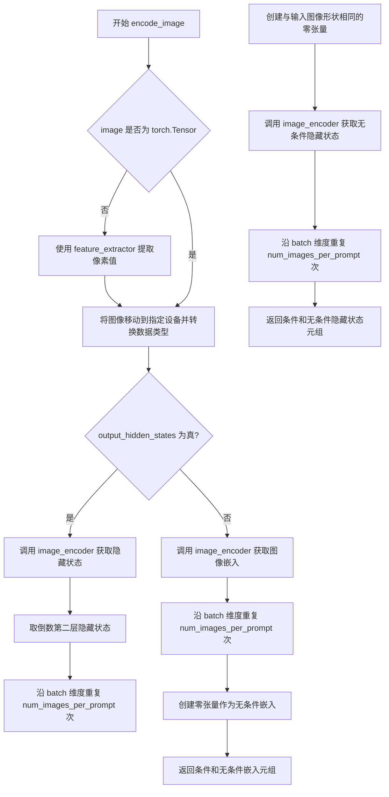

#### 带注释源码

```python
def encode_image(self, image, device, num_images_per_prompt, output_hidden_states=None):
    """
    将输入图像编码为图像嵌入向量或隐藏状态表征。

    参数:
        image: 输入图像，支持 PIL.Image、np.ndarray 或 torch.Tensor 格式
        device: torch.device，目标计算设备
        num_images_per_prompt: 每个提示词生成的图像数量
        output_hidden_states: 是否返回隐藏状态而非图像嵌入

    返回:
        元组 (条件嵌入, 无条件嵌入)
    """
    # 获取图像编码器的参数数据类型，用于后续转换
    dtype = next(self.image_encoder.parameters()).dtype

    # 如果输入不是 PyTorch 张量，则使用特征提取器将其转换为张量
    if not isinstance(image, torch.Tensor):
        image = self.feature_extractor(image, return_tensors="pt").pixel_values

    # 将图像移动到指定设备并转换数据类型
    image = image.to(device=device, dtype=dtype)

    # 根据 output_hidden_states 参数决定返回内容
    if output_hidden_states:
        # 返回隐藏状态模式：获取倒数第二层的隐藏状态
        image_enc_hidden_states = self.image_encoder(image, output_hidden_states=True).hidden_states[-2]
        # 扩展条件嵌入以匹配每提示词生成多张图像
        image_enc_hidden_states = image_enc_hidden_states.repeat_interleave(num_images_per_prompt, dim=0)

        # 创建零张量用于无条件图像嵌入（与条件嵌入形状相同）
        uncond_image_enc_hidden_states = self.image_encoder(
            torch.zeros_like(image), output_hidden_states=True
        ).hidden_states[-2]
        # 扩展无条件嵌入
        uncond_image_enc_hidden_states = uncond_image_enc_hidden_states.repeat_interleave(
            num_images_per_prompt, dim=0
        )

        # 返回条件和无条件隐藏状态元组
        return image_enc_hidden_states, uncond_image_enc_hidden_states
    else:
        # 标准模式：直接获取图像嵌入向量
        image_embeds = self.image_encoder(image).image_embeds
        # 扩展条件嵌入
        image_embeds = image_embeds.repeat_interleave(num_images_per_prompt, dim=0)
        # 创建零张量作为无条件嵌入（用于无分类器引导）
        uncond_image_embeds = torch.zeros_like(image_embeds)

        # 返回条件和无条件嵌入元组
        return image_embeds, uncond_image_embeds
```


### `StableDiffusionLDM3DPipeline.prepare_ip_adapter_image_embeds`

该方法用于准备 IP-Adapter 的图像嵌入向量。它处理输入的 IP-Adapter 图像或预计算的图像嵌入，根据是否启用无分类器自由引导（classifier-free guidance）来生成正负两种嵌入，并将嵌入重复以匹配每个提示生成的图像数量，最终返回处理后的图像嵌入列表供扩散模型使用。

参数：

- `self`：隐式参数，类型为 `StableDiffusionLDM3DPipeline` 管道实例自身
- `ip_adapter_image`：`PipelineImageInput | None`，要用于 IP-Adapter 的输入图像，可以是单个图像或图像列表
- `ip_adapter_image_embeds`：`list[torch.Tensor] | None`，预计算的图像嵌入向量列表，如果为 None 则从 ip_adapter_image 编码生成
- `device`：`torch.device`，图像嵌入要移动到的目标设备
- `num_images_per_prompt`：`int`，每个提示生成的图像数量
- `do_classifier_free_guidance`：`bool`，是否启用无分类器自由引导

返回值：`list[torch.Tensor]`，处理后的 IP-Adapter 图像嵌入列表，每个元素是拼接了正负嵌入的张量

#### 流程图

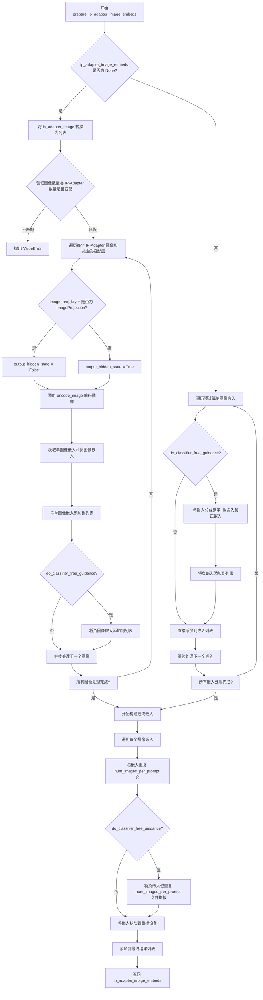

#### 带注释源码

```python
def prepare_ip_adapter_image_embeds(
    self, ip_adapter_image, ip_adapter_image_embeds, device, num_images_per_prompt, do_classifier_free_guidance
):
    """
    准备 IP-Adapter 的图像嵌入。
    
    参数:
        ip_adapter_image: IP-Adapter 输入图像
        ip_adapter_image_embeds: 预计算的图像嵌入，如果为 None 则从图像编码生成
        device: 目标设备
        num_images_per_prompt: 每个提示生成的图像数量
        do_classifier_free_guidance: 是否启用无分类器自由引导
    """
    # 初始化图像嵌入列表
    image_embeds = []
    # 如果启用 classifier-free guidance，初始化负图像嵌入列表
    if do_classifier_free_guidance:
        negative_image_embeds = []
    
    # 如果没有预计算嵌入，则从输入图像编码生成
    if ip_adapter_image_embeds is None:
        # 确保输入图像是列表格式
        if not isinstance(ip_adapter_image, list):
            ip_adapter_image = [ip_adapter_image]

        # 验证图像数量与 IP-Adapter 数量匹配
        if len(ip_adapter_image) != len(self.unet.encoder_hid_proj.image_projection_layers):
            raise ValueError(
                f"`ip_adapter_image` must have same length as the number of IP Adapters. Got {len(ip_adapter_image)} images and {len(self.unet.encoder_hid_proj.image_projection_layers)} IP Adapters."
            )

        # 遍历每个 IP-Adapter 图像和对应的图像投影层
        for single_ip_adapter_image, image_proj_layer in zip(
            ip_adapter_image, self.unet.encoder_hid_proj.image_projection_layers
        ):
            # 判断是否需要输出隐藏状态：如果是 ImageProjection 层则不需要
            output_hidden_state = not isinstance(image_proj_layer, ImageProjection)
            # 编码单个图像获取嵌入
            single_image_embeds, single_negative_image_embeds = self.encode_image(
                single_ip_adapter_image, device, 1, output_hidden_state
            )

            # 将单图像嵌入添加到列表（添加维度以匹配后续处理）
            image_embeds.append(single_image_embeds[None, :])
            # 如果启用 classifier-free guidance，同时保存负嵌入
            if do_classifier_free_guidance:
                negative_image_embeds.append(single_negative_image_embeds[None, :])
    else:
        # 使用预计算的嵌入
        for single_image_embeds in ip_adapter_image_embeds:
            # 如果启用 classifier-free guidance，需要将嵌入分成两半
            if do_classifier_free_guidance:
                single_negative_image_embeds, single_image_embeds = single_image_embeds.chunk(2)
                negative_image_embeds.append(single_negative_image_embeds)
            image_embeds.append(single_image_embeds)

    # 构建最终的嵌入列表
    ip_adapter_image_embeds = []
    for i, single_image_embeds in enumerate(image_embeds):
        # 将嵌入重复 num_images_per_prompt 次以匹配生成的图像数量
        single_image_embeds = torch.cat([single_image_embeds] * num_images_per_prompt, dim=0)
        if do_classifier_free_guidance:
            # 对负嵌入也进行重复，并拼接到正嵌入前面
            single_negative_image_embeds = torch.cat([negative_image_embeds[i]] * num_images_per_prompt, dim=0)
            single_image_embeds = torch.cat([single_negative_image_embeds, single_image_embeds], dim=0)

        # 将嵌入移动到目标设备
        single_image_embeds = single_image_embeds.to(device=device)
        ip_adapter_image_embeds.append(single_image_embeds)

    return ip_adapter_image_embeds
```


### `StableDiffusionLDM3DPipeline.run_safety_checker`

该方法用于对生成的图像进行安全检查（NSFW检测），通过调用`safety_checker`识别图像中是否存在不宜公开的内容。如果未配置安全检查器，则直接返回`None`。

参数：

- `self`：`StableDiffusionLDM3DPipeline`实例，隐式参数
- `image`：`torch.Tensor | np.ndarray`，待检查的图像，可以是PyTorch张量或NumPy数组
- `device`：`str | torch.device`，执行安全检查的设备（如"cuda"或"cpu"）
- `dtype`：`torch.dtype`，安全检查器输入的数据类型（如`torch.float16`）

返回值：元组 `(image, has_nsfw_concept)`
- `image`：经过安全检查器处理后的图像（类型与输入相同）
- `has_nsfw_concept`：`list[bool] | None`，检测结果列表，每个元素表示对应图像是否包含NSFW内容；若未配置安全检查器则为`None`

#### 流程图

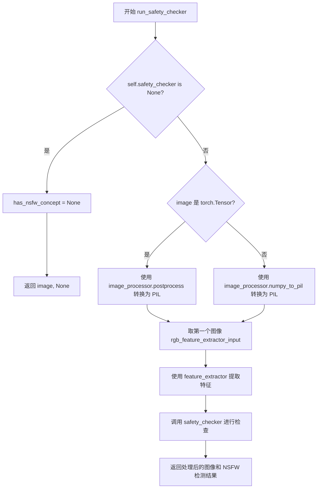

#### 带注释源码

```python
def run_safety_checker(self, image, device, dtype):
    """
    对生成的图像进行安全检查（NSFW检测）。
    
    参数:
        image: 待检查的图像，torch.Tensor 或 np.ndarray 类型
        device: 执行检查的设备
        dtype: 检查器输入的数据类型
    
    返回:
        tuple: (处理后的图像, NSFW检测结果列表或None)
    """
    # 检查是否配置了安全检查器
    if self.safety_checker is None:
        # 未配置检查器时，直接返回None表示未进行检测
        has_nsfw_concept = None
    else:
        # 将图像转换为PIL格式以供feature_extractor使用
        if torch.is_tensor(image):
            # 如果是PyTorch张量，使用后处理器转换为PIL图像
            feature_extractor_input = self.image_processor.postprocess(image, output_type="pil")
        else:
            # 如果是NumPy数组，直接转换为PIL图像
            feature_extractor_input = self.image_processor.numpy_to_pil(image)
        
        # 提取RGB图像用于安全检查（取batch中第一个）
        rgb_feature_extractor_input = feature_extractor_input[0]
        
        # 使用feature_extractor提取图像特征并移动到指定设备
        safety_checker_input = self.feature_extractor(
            rgb_feature_extractor_input, 
            return_tensors="pt"
        ).to(device)
        
        # 调用安全检查器进行NSFW检测
        # 将像素值转换为指定数据类型后传入
        image, has_nsfw_concept = self.safety_checker(
            images=image, 
            clip_input=safety_checker_input.pixel_values.to(dtype)
        )
    
    # 返回处理后的图像和检测结果
    return image, has_nsfw_concept
```


### `StableDiffusionLDM3DPipeline.prepare_extra_step_kwargs`

该方法用于为调度器的 `step` 方法准备额外的关键字参数。由于不同的调度器（如 DDIMScheduler、LMSDiscreteScheduler 等）具有不同的签名，该方法通过检查调度器支持的参数，动态构建需要传递给 `step` 方法的参数字典。

参数：

- `self`：隐式参数，StableDiffusionLDM3DPipeline 实例本身
- `generator`：`torch.Generator | list[torch.Generator] | None`，用于控制生成过程的随机性，确保可重复性
- `eta`：`float`，DDIM 调度器专用的参数（η），对应 DDIM 论文中的参数，取值范围 [0, 1]，其他调度器会忽略此参数

返回值：`dict[str, Any]`，包含调度器支持的额外关键字参数的字典，可能包含 `eta` 和/或 `generator`

#### 流程图

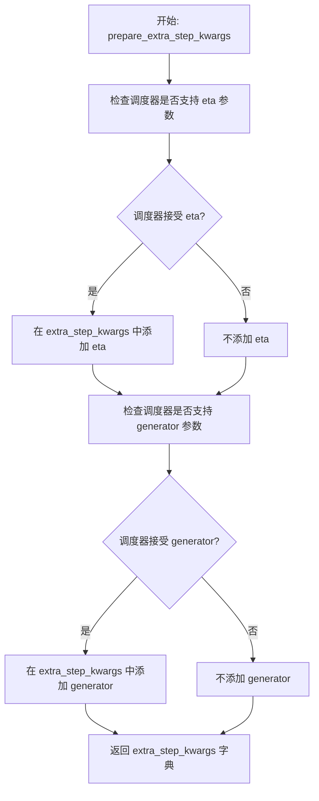

#### 带注释源码

```python
# Copied from diffusers.pipelines.stable_diffusion.pipeline_stable_diffusion.StableDiffusionPipeline.prepare_extra_step_kwargs
def prepare_extra_step_kwargs(self, generator, eta):
    # 准备调度器步骤的额外参数，因为并非所有调度器都具有相同的签名
    # eta (η) 仅与 DDIMScheduler 一起使用，对于其他调度器将被忽略
    # eta 对应 DDIM 论文中的 η：https://huggingface.co/papers/2010.02502
    # 取值应在 [0, 1] 之间

    # 使用 inspect 模块检查调度器的 step 方法是否接受 eta 参数
    accepts_eta = "eta" in set(inspect.signature(self.scheduler.step).parameters.keys())
    
    # 初始化空字典用于存储额外参数
    extra_step_kwargs = {}
    
    # 如果调度器支持 eta，则将其添加到 extra_step_kwargs
    if accepts_eta:
        extra_step_kwargs["eta"] = eta

    # 检查调度器是否接受 generator 参数
    accepts_generator = "generator" in set(inspect.signature(self.scheduler.step).parameters.keys())
    
    # 如果调度器支持 generator，则将其添加到 extra_step_kwargs
    if accepts_generator:
        extra_step_kwargs["generator"] = generator
    
    # 返回包含所有适用的额外参数的字典
    return extra_step_kwargs
```


### `StableDiffusionLDM3DPipeline.check_inputs`

该方法用于验证管道输入参数的有效性，确保传入的提示词、图像尺寸、回调步骤等参数符合要求，防止在后续生成过程中因参数错误导致运行时异常。

参数：

- `self`：实例本身，包含管道配置信息
- `prompt`：`str | list[str] | None`，用于指导图像生成的文本提示
- `height`：`int`，生成图像的高度（像素）
- `width`：`int`，生成图像的宽度（像素）
- `callback_steps`：`int | None`，回调函数被调用的频率步数
- `negative_prompt`：`str | list[str] | None`，用于指导不应包含在图像中的内容
- `prompt_embeds`：`torch.Tensor | None`，预生成的文本嵌入向量
- `negative_prompt_embeds`：`torch.Tensor | None`，预生成的负面文本嵌入向量
- `ip_adapter_image`：`PipelineImageInput | None`，IP适配器的可选图像输入
- `ip_adapter_image_embeds`：`list[torch.Tensor] | None`，IP适配器的预生成图像嵌入
- `callback_on_step_end_tensor_inputs`：`list[str] | None`，在每步结束时回调的张量输入列表

返回值：`None`，该方法不返回任何值，仅通过抛出`ValueError`来处理无效输入。

#### 流程图

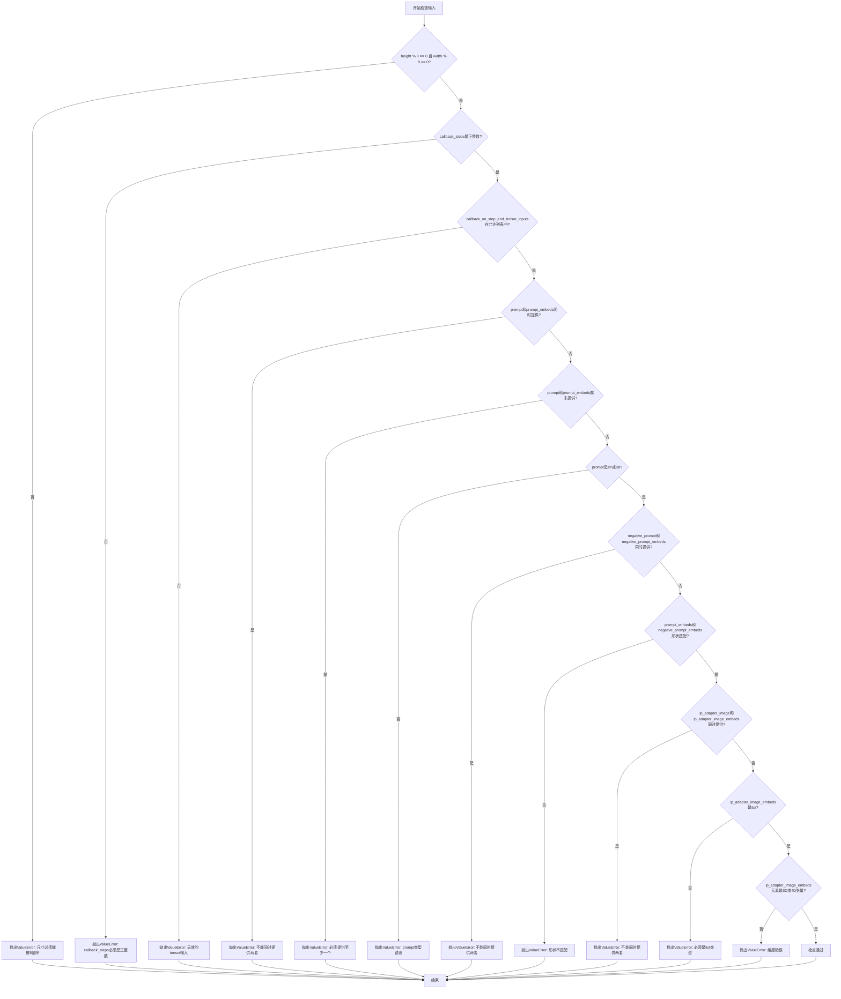

#### 带注释源码

```python
def check_inputs(
    self,
    prompt,
    height,
    width,
    callback_steps,
    negative_prompt=None,
    prompt_embeds=None,
    negative_prompt_embeds=None,
    ip_adapter_image=None,
    ip_adapter_image_embeds=None,
    callback_on_step_end_tensor_inputs=None,
):
    """
    检查管道输入参数的有效性
    
    参数:
        prompt: 文本提示词
        height: 输出图像高度
        width: 输出图像宽度
        callback_steps: 回调步数
        negative_prompt: 负面提示词
        prompt_embeds: 预计算的提示词嵌入
        negative_prompt_embeds: 预计算的负面提示词嵌入
        ip_adapter_image: IP适配器图像
        ip_adapter_image_embeds: IP适配器图像嵌入
        callback_on_step_end_tensor_inputs: 步骤结束时的回调张量输入
    """
    
    # 检查图像尺寸是否可被8整除（VAE要求）
    if height % 8 != 0 or width % 8 != 0:
        raise ValueError(f"`height` and `width` have to be divisible by 8 but are {height} and {width}.")

    # 验证callback_steps为正整数
    if callback_steps is not None and (not isinstance(callback_steps, int) or callback_steps <= 0):
        raise ValueError(
            f"`callback_steps` has to be a positive integer but is {callback_steps} of type"
            f" {type(callback_steps)}."
        )
    
    # 验证回调张量输入是否在允许列表中
    if callback_on_step_end_tensor_inputs is not None and not all(
        k in self._callback_tensor_inputs for k in callback_on_step_end_tensor_inputs
    ):
        raise ValueError(
            f"`callback_on_step_end_tensor_inputs` has to be in {self._callback_tensor_inputs}, but found {[k for k in callback_on_step_end_tensor_inputs if k not in self._callback_tensor_inputs]}"
        )

    # 检查prompt和prompt_embeds不能同时提供
    if prompt is not None and prompt_embeds is not None:
        raise ValueError(
            f"Cannot forward both `prompt`: {prompt} and `prompt_embeds`: {prompt_embeds}. Please make sure to"
            " only forward one of the two."
        )
    # 检查至少提供一个
    elif prompt is None and prompt_embeds is None:
        raise ValueError(
            "Provide either `prompt` or `prompt_embeds`. Cannot leave both `prompt` and `prompt_embeds` undefined."
        )
    # 验证prompt类型
    elif prompt is not None and (not isinstance(prompt, str) and not isinstance(prompt, list)):
        raise ValueError(f"`prompt` has to be of type `str` or `list` but is {type(prompt)}")

    # 检查negative_prompt和negative_prompt_embeds不能同时提供
    if negative_prompt is not None and negative_prompt_embeds is not None:
        raise ValueError(
            f"Cannot forward both `negative_prompt`: {negative_prompt} and `negative_prompt_embeds`:"
            f" {negative_prompt_embeds}. Please make sure to only forward one of the two."
        )

    # 验证prompt_embeds和negative_prompt_embeds形状一致
    if prompt_embeds is not None and negative_prompt_embeds is not None:
        if prompt_embeds.shape != negative_prompt_embeds.shape:
            raise ValueError(
                "`prompt_embeds` and `negative_prompt_embeds` must have the same shape when passed directly, but"
                f" got: `prompt_embeds` {prompt_embeds.shape} != `negative_prompt_embeds`"
                f" {negative_prompt_embeds.shape}."
            )

    # 检查IP适配器图像和嵌入不能同时提供
    if ip_adapter_image is not None and ip_adapter_image_embeds is not None:
        raise ValueError(
            "Provide either `ip_adapter_image` or `ip_adapter_image_embeds`. Cannot leave both `ip_adapter_image` and `ip_adapter_image_embeds` defined."
        )

    # 验证IP适配器嵌入的格式
    if ip_adapter_image_embeds is not None:
        if not isinstance(ip_adapter_image_embeds, list):
            raise ValueError(
                f"`ip_adapter_image_embeds` has to be of type `list` but is {type(ip_adapter_image_embeds)}"
            )
        elif ip_adapter_image_embeds[0].ndim not in [3, 4]:
            raise ValueError(
                f"`ip_adapter_image_embeds` has to be a list of 3D or 4D tensors but is {ip_adapter_image_embeds[0].ndim}D"
            )
```


### `StableDiffusionLDM3DPipeline.prepare_latents`

该方法用于准备扩散模型去噪过程的初始潜在向量（latents）。如果调用者未提供 latents，则使用随机噪声张量；否则将提供的 latents 移动到指定设备。最后根据调度器的初始噪声标准差对 latents 进行缩放，以适配扩散过程。

参数：

- `batch_size`：`int`，批量大小，即生成图像的数量
- `num_channels_latents`：`int`，潜在向量的通道数，对应 UNet 的输入通道数
- `height`：`int`，生成图像的高度（像素）
- `width`：`int`，生成图像的宽度（像素）
- `dtype`：`torch.dtype`，生成 latents 的数据类型
- `device`：`torch.device`，生成 latents 的设备
- `generator`：`torch.Generator` 或 `list[torch.Generator] | None`，用于控制随机数生成的确定性
- `latents`：`torch.Tensor | None`，可选的预生成潜在向量，如果为 None 则随机生成

返回值：`torch.Tensor`，处理后的潜在向量，形状为 (batch_size, num_channels_latents, height // vae_scale_factor, width // vae_scale_factor)

#### 流程图

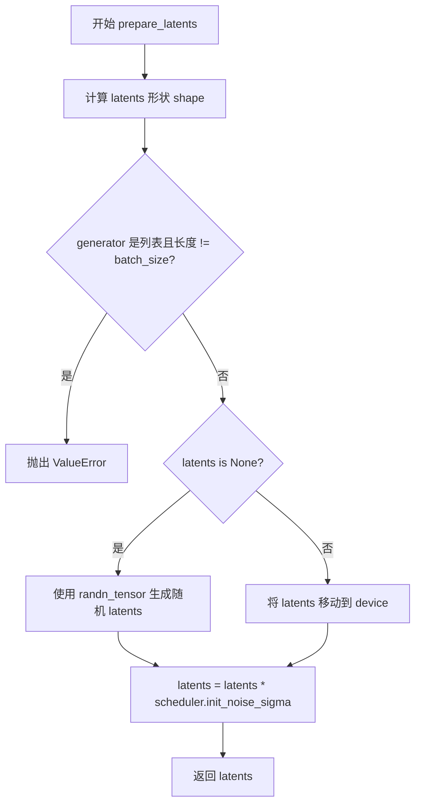

#### 带注释源码

```python
def prepare_latents(
    self,
    batch_size: int,
    num_channels_latents: int,
    height: int,
    width: int,
    dtype: torch.dtype,
    device: torch.device,
    generator: torch.Generator | list[torch.Generator] | None,
    latents: torch.Tensor | None = None,
):
    """
    准备用于扩散去噪过程的初始潜在向量。
    
    参数:
        batch_size: 批量大小
        num_channels_latents: 潜在向量通道数
        height: 生成图像高度
        width: 生成图像宽度
        dtype: 张量数据类型
        device: 张量设备
        generator: 随机数生成器
        latents: 可选的预生成潜在向量
    
    返回:
        初始化并缩放后的潜在向量
    """
    # 计算潜在向量形状，考虑 VAE 缩放因子
    shape = (
        batch_size,                                          # 批量大小
        num_channels_latents,                                 # 潜在通道数
        int(height) // self.vae_scale_factor,                # 下采样后高度
        int(width) // self.vae_scale_factor,                  # 下采样后宽度
    )
    
    # 验证生成器列表长度与批量大小是否匹配
    if isinstance(generator, list) and len(generator) != batch_size:
        raise ValueError(
            f"You have passed a list of generators of length {len(generator)}, but requested an effective batch"
            f" size of {batch_size}. Make sure the batch size matches the length of the generators."
        )

    # 如果未提供 latents，则随机生成；否则使用提供的 latents
    if latents is None:
        # 使用 randn_tensor 生成符合正态分布的随机噪声
        latents = randn_tensor(shape, generator=generator, device=device, dtype=dtype)
    else:
        # 确保 latents 在正确的设备上
        latents = latents.to(device)

    # 根据调度器的初始噪声标准差缩放 latents
    # 这是扩散过程正确初始化的关键步骤
    latents = latents * self.scheduler.init_noise_sigma
    
    return latents
```


### `StableDiffusionLDM3DPipeline.get_guidance_scale_embedding`

该方法用于生成指导比例（guidance scale）的嵌入向量，通过正弦和余弦函数将连续的引导尺度值映射到高维向量空间中，以便后续丰富时间步嵌入（timestep embeddings）。

参数：

- `self`：`StableDiffusionLDM3DPipeline` 类实例，隐式参数
- `w`：`torch.Tensor`，一维张量，包含要生成嵌入向量的指导比例值
- `embedding_dim`：`int`，可选，默认值为 512，指定生成的嵌入向量的维度
- `dtype`：`torch.dtype`，可选，默认值为 `torch.float32`，生成嵌入向量的数据类型

返回值：`torch.Tensor`，形状为 `(len(w), embedding_dim)` 的嵌入向量张量

#### 流程图

```mermaid
flowchart TD
    A[开始] --> B{检查输入}
    B -->|assert len<br/>w.shape == 1| C[将 w 乘以 1000.0]
    C --> D[计算半维长度<br/>half_dim = embedding_dim // 2]
    D --> E[计算对数基础<br/>emb = log10000.0<br/>/ half_dim-1]
    E --> F[生成指数衰减序列<br/>emb = exparange<br/>* -emb]
    F --> G[外展相乘<br/>w[:, None] * emb[None, :]]
    G --> H[拼接 sin 和 cos<br/>torch.cat<br/>[sin, cos]]
    H --> I{embedding_dim<br/>是否为奇数}
    I -->|是| J[零填充<br/>pad emb]
    I -->|否| K[验证输出形状]
    J --> K
    K --> L[返回嵌入向量]
```

#### 带注释源码

```python
def get_guidance_scale_embedding(
    self, w: torch.Tensor, embedding_dim: int = 512, dtype: torch.dtype = torch.float32
) -> torch.Tensor:
    """
    See https://github.com/google-research/vdm/blob/dc27b98a554f65cdc654b800da5aa1846545d41b/model_vdm.py#L298

    Args:
        w (`torch.Tensor`):
            Generate embedding vectors with a specified guidance scale to subsequently enrich timestep embeddings.
        embedding_dim (`int`, *optional*, defaults to 512):
            Dimension of the embeddings to generate.
        dtype (`torch.dtype`, *optional*, defaults to `torch.float32`):
            Data type of the generated embeddings.

    Returns:
        `torch.Tensor`: Embedding vectors with shape `(len(w), embedding_dim)`.
    """
    # 断言确保输入 w 是一维张量
    assert len(w.shape) == 1
    # 将引导尺度放大 1000 倍以提高数值精度
    w = w * 1000.0

    # 计算半维长度，用于生成 sin 和 cos 两部分
    half_dim = embedding_dim // 2
    # 计算对数基础值，用于生成指数衰减的频率序列
    emb = torch.log(torch.tensor(10000.0)) / (half_dim - 1)
    # 生成从 0 到 half_dim-1 的指数衰减序列
    emb = torch.exp(torch.arange(half_dim, dtype=dtype) * -emb)
    # 将 w 与 emb 进行外展相乘，得到每个元素的频率加权
    emb = w.to(dtype)[:, None] * emb[None, :]
    # 拼接正弦和余弦部分形成完整的嵌入向量
    emb = torch.cat([torch.sin(emb), torch.cos(emb)], dim=1)
    # 如果 embedding_dim 为奇数，则需要零填充以满足维度要求
    if embedding_dim % 2 == 1:  # zero pad
        emb = torch.nn.functional.pad(emb, (0, 1))
    # 断言确保输出形状正确
    assert emb.shape == (w.shape[0], embedding_dim)
    return emb
```


### `StableDiffusionLDM3DPipeline.__call__`

该函数是Stable Diffusion LDM3D管道的核心调用方法，通过接收文本提示或预生成的嵌入向量，在潜在空间中执行去噪操作，最终同时输出RGB彩色图像和对应的深度图（Depth Map），实现文本到3D内容的生成。

参数：

- `prompt`：`str | list[str] | None`，引导图像生成的文本提示，若未定义则需传递prompt_embeds
- `height`：`int | None`，生成图像的高度（像素），默认值为unet配置样本大小乘以vae_scale_factor
- `width`：`int | None`，生成图像的宽度（像素），默认值为unet配置样本大小乘以vae_scale_factor
- `num_inference_steps`：`int`，去噪迭代次数，默认49步，步数越多图像质量越高但推理速度越慢
- `timesteps`：`list[int] | None`，自定义去噪过程的时间步列表，需降序排列，用于支持自定义时间步的调度器
- `sigmas`：`list[float] | None`，自定义去噪过程的sigma值列表，用于支持自定义sigma的调度器
- `guidance_scale`：`float`，引导比例参数，默认5.0，数值越大越忠于文本提示但可能降低图像质量
- `negative_prompt`：`str | list[str] | None`，负面提示，用于指导图像不包含的内容，guidance_scale < 1时被忽略
- `num_images_per_prompt`：`int | None`，每个提示生成的图像数量，默认1
- `eta`：`float`，DDIM论文中的eta参数，仅对DDIMScheduler有效，默认0.0
- `generator`：`torch.Generator | list[torch.Generator] | None`，随机数生成器，用于确保生成的可重复性
- `latents`：`torch.Tensor | None`，预生成的噪声潜在变量，可用于通过不同提示微调相同生成结果
- `prompt_embeds`：`torch.Tensor | None`，预生成的文本嵌入，可用于轻松调整文本输入的权重
- `negative_prompt_embeds`：`torch.Tensor | None`，预生成的负面文本嵌入，用于调整负面提示的权重
- `ip_adapter_image`：`PipelineImageInput | None`，IP适配器的可选图像输入
- `ip_adapter_image_embeds`：`list[torch.Tensor] | None`，IP适配器的预生成图像嵌入列表，长度需与IP适配器数量一致
- `output_type`：`str | None`，输出格式，默认"pil"，可选PIL.Image或np.array
- `return_dict`：`bool`，是否返回LDM3DPipelineOutput而非元组，默认True
- `cross_attention_kwargs`：`dict[str, Any] | None`，传递给AttentionProcessor的参数字典
- `guidance_rescale`：`float`，噪声预测的重缩放因子，用于改善图像质量和防止过度曝光，默认0.0
- `clip_skip`：`int | None`，CLIP计算提示嵌入时跳过的层数
- `callback_on_step_end`：`Callable[[int, int], None] | None`，去噪每步结束时调用的回调函数
- `callback_on_step_end_tensor_inputs`：`list[str]`，回调函数使用的张量输入列表，默认["latents"]
- `**kwargs`：其他关键字参数，包括已废弃的callback和callback_steps参数

返回值：`LDM3DPipelineOutput`，包含rgb（RGB图像列表）、depth（深度图列表）和nsfw_content_detected（NSFW检测结果列表）的输出对象；若return_dict为False，则返回元组((rgb, depth), has_nsfw_concept)

#### 流程图

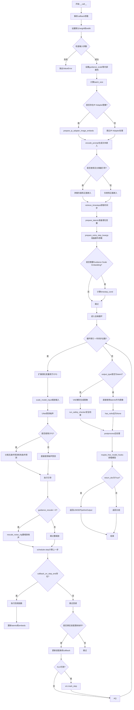

#### 带注释源码

```python
@torch.no_grad()
@replace_example_docstring(EXAMPLE_DOC_STRING)
def __call__(
    self,
    prompt: str | list[str] = None,
    height: int | None = None,
    width: int | None = None,
    num_inference_steps: int = 49,
    timesteps: list[int] = None,
    sigmas: list[float] = None,
    guidance_scale: float = 5.0,
    negative_prompt: str | list[str] | None = None,
    num_images_per_prompt: int | None = 1,
    eta: float = 0.0,
    generator: torch.Generator | list[torch.Generator] | None = None,
    latents: torch.Tensor | None = None,
    prompt_embeds: torch.Tensor | None = None,
    negative_prompt_embeds: torch.Tensor | None = None,
    ip_adapter_image: PipelineImageInput | None = None,
    ip_adapter_image_embeds: list[torch.Tensor] | None = None,
    output_type: str | None = "pil",
    return_dict: bool = True,
    cross_attention_kwargs: dict[str, Any] | None = None,
    guidance_rescale: float = 0.0,
    clip_skip: int | None = None,
    callback_on_step_end: Callable[[int, int], None] | None = None,
    callback_on_step_end_tensor_inputs: list[str] = ["latents"],
    **kwargs,
):
    r"""
    The call function to the pipeline for generation.
    
    此方法是管道的主入口点,执行完整的文本到图像+深度图的生成流程:
    1. 验证输入参数
    2. 编码文本提示为嵌入向量
    3. 初始化随机潜在变量
    4. 在去噪循环中迭代处理
    5. 解码潜在变量为最终图像
    6. 执行安全检查和后处理
    """
    # 从kwargs中提取已废弃的callback参数并发出警告
    callback = kwargs.pop("callback", None)
    callback_steps = kwargs.pop("callback_steps", None)

    if callback is not None:
        deprecate(
            "callback",
            "1.0.0",
            "Passing `callback` as an input argument to `__call__` is deprecated, consider using `callback_on_step_end`",
        )
    if callback_steps is not None:
        deprecate(
            "callback_steps",
            "1.0.0",
            "Passing `callback_steps` as an input argument to `__call__` is deprecated, consider using `callback_on_step_end`",
        )

    # 0. Default height and width to unet
    # 根据unet配置设置默认的输出图像尺寸
    height = height or self.unet.config.sample_size * self.vae_scale_factor
    width = width or self.unet.config.sample_size * self.vae_scale_factor

    # 1. Check inputs. Raise error if not correct
    # 验证所有输入参数的合法性
    self.check_inputs(
        prompt,
        height,
        width,
        callback_steps,
        negative_prompt,
        prompt_embeds,
        negative_prompt_embeds,
        ip_adapter_image,
        ip_adapter_image_embeds,
        callback_on_step_end_tensor_inputs,
    )

    # 保存引导参数到实例变量供后续使用
    self._guidance_scale = guidance_scale
    self._guidance_rescale = guidance_rescale
    self._clip_skip = clip_skip
    self._cross_attention_kwargs = cross_attention_kwargs
    self._interrupt = False

    # 2. Define call parameters
    # 确定批处理大小,根据输入类型(prompt字符串/列表或预计算的prompt_embeds)
    if prompt is not None and isinstance(prompt, str):
        batch_size = 1
    elif prompt is not None and isinstance(prompt, list):
        batch_size = len(prompt)
    else:
        batch_size = prompt_embeds.shape[0]

    # 获取执行设备(CPU/CUDA/XLA)
    device = self._execution_device

    # 处理IP-Adapter图像嵌入准备
    if ip_adapter_image is not None or ip_adapter_image_embeds is not None:
        image_embeds = self.prepare_ip_adapter_image_embeds(
            ip_adapter_image,
            ip_adapter_image_embeds,
            device,
            batch_size * num_images_per_prompt,
            self.do_classifier_free_guidance,
        )

    # 3. Encode input prompt
    # 将文本提示编码为文本嵌入向量
    prompt_embeds, negative_prompt_embeds = self.encode_prompt(
        prompt,
        device,
        num_images_per_prompt,
        self.do_classifier_free_guidance,
        negative_prompt,
        prompt_embeds=prompt_embeds,
        negative_prompt_embeds=negative_prompt_embeds,
        clip_skip=clip_skip,
    )
    # For classifier free guidance, we need to do two forward passes.
    # Here we concatenate the unconditional and text embeddings into a single batch
    # to avoid doing两次前向传播,提高效率
    if self.do_classifier_free_guidance:
        prompt_embeds = torch.cat([negative_prompt_embeds, prompt_embeds])

    # 4. Prepare timesteps
    # 获取去噪过程的时间步调度
    timesteps, num_inference_steps = retrieve_timesteps(
        self.scheduler, num_inference_steps, device, timesteps, sigmas
    )

    # 5. Prepare latent variables
    # 准备初始噪声潜在变量
    num_channels_latents = self.unet.config.in_channels
    latents = self.prepare_latents(
        batch_size * num_images_per_prompt,
        num_channels_latents,
        height,
        width,
        prompt_embeds.dtype,
        device,
        generator,
        latents,
    )

    # 6. Prepare extra step kwargs. TODO: Logic should ideally just be moved out of the pipeline
    # 为调度器准备额外的参数(如eta和generator)
    extra_step_kwargs = self.prepare_extra_step_kwargs(generator, eta)

    # 6.1 Add image embeds for IP-Adapter
    # 为IP-Adapter添加条件嵌入
    added_cond_kwargs = {"image_embeds": image_embeds} if ip_adapter_image is not None else None

    # 6.2 Optionally get Guidance Scale Embedding
    # 如果UNet配置了time_cond_proj_dim,则计算引导比例嵌入
    timestep_cond = None
    if self.unet.config.time_cond_proj_dim is not None:
        guidance_scale_tensor = torch.tensor(self.guidance_scale - 1).repeat(batch_size * num_images_per_prompt)
        timestep_cond = self.get_guidance_scale_embedding(
            guidance_scale_tensor, embedding_dim=self.unet.config.time_cond_proj_dim
        ).to(device=device, dtype=latents.dtype)

    # 7. Denoising loop
    # 核心去噪循环
    num_warmup_steps = len(timesteps) - num_inference_steps * self.scheduler.order
    self._num_timesteps = len(timesteps)
    with self.progress_bar(total=num_inference_steps) as progress_bar:
        for i, t in enumerate(timesteps):
            # 检查是否中断(可用于提前停止生成)
            if self.interrupt:
                continue

            # expand the latents if we are doing classifier free guidance
            # 扩展潜在变量用于无分类器引导(需要同时处理条件和无条件)
            latent_model_input = torch.cat([latents] * 2) if self.do_classifier_free_guidance else latents
            latent_model_input = self.scheduler.scale_model_input(latent_model_input, t)

            # predict the noise residual
            # 使用UNet预测噪声残差
            noise_pred = self.unet(
                latent_model_input,
                t,
                encoder_hidden_states=prompt_embeds,
                timestep_cond=timestep_cond,
                cross_attention_kwargs=cross_attention_kwargs,
                added_cond_kwargs=added_cond_kwargs,
                return_dict=False,
            )[0]

            # perform guidance
            # 执行引导:根据guidance_scale组合无条件预测和条件预测
            if self.do_classifier_free_guidance:
                noise_pred_uncond, noise_pred_text = noise_pred.chunk(2)
                noise_pred = noise_pred_uncond + guidance_scale * (noise_pred_text - noise_pred_uncond)

            # 根据guidance_rescale重缩放噪声预测(解决过度曝光问题)
            if self.do_classifier_free_guidance and self.guidance_rescale > 0.0:
                # Based on 3.4. in https://huggingface.co/papers/2305.08891
                noise_pred = rescale_noise_cfg(noise_pred, noise_pred_text, guidance_rescale=self.guidance_rescale)

            # compute the previous noisy sample x_t -> x_t-1
            # 使用调度器计算上一步的潜在变量
            latents = self.scheduler.step(noise_pred, t, latents, **extra_step_kwargs, return_dict=False)[0]

            # 执行每步结束时的回调函数
            if callback_on_step_end is not None:
                callback_kwargs = {}
                for k in callback_on_step_end_tensor_inputs:
                    callback_kwargs[k] = locals()[k]
                callback_outputs = callback_on_step_end(self, i, t, callback_kwargs)

                # 允许回调修改latents和embeds
                latents = callback_outputs.pop("latents", latents)
                prompt_embeds = callback_outputs.pop("prompt_embeds", prompt_embeds)
                negative_prompt_embeds = callback_outputs.pop("negative_prompt_embeds", negative_prompt_embeds)

            # call the callback, if provided
            # 进度更新和旧式callback支持
            if i == len(timesteps) - 1 or ((i + 1) > num_warmup_steps and (i + 1) % self.scheduler.order == 0):
                progress_bar.update()
                if callback is not None and i % callback_steps == 0:
                    step_idx = i // getattr(self.scheduler, "order", 1)
                    callback(step_idx, t, latents)

            # XLA设备特殊处理
            if XLA_AVAILABLE:
                xm.mark_step()

    # 8. Decode latents to image
    # 如果不需要潜在变量输出,则VAE解码生成最终图像
    if not output_type == "latent":
        image = self.vae.decode(latents / self.vae.config.scaling_factor, return_dict=False)[0]
        # 运行安全检查器检测NSFW内容
        image, has_nsfw_concept = self.run_safety_checker(image, device, prompt_embeds.dtype)
    else:
        image = latents
        has_nsfw_concept = None

    # 9. Post-process
    # 处理去归一化(基于NSFW检测结果)
    if has_nsfw_concept is None:
        do_denormalize = [True] * image.shape[0]
    else:
        do_denormalize = [not has_nsfw for has_nsfw in has_nsfw_concept]

    # 使用图像处理器后处理,分别输出RGB和深度图
    rgb, depth = self.image_processor.postprocess(image, output_type=output_type, do_denormalize=do_denormalize)

    # Offload all models
    # 卸载模型以释放显存
    self.maybe_free_model_hooks()

    # 10. Return output
    if not return_dict:
        return ((rgb, depth), has_nsfw_concept)

    return LDM3DPipelineOutput(rgb=rgb, depth=depth, nsfw_content_detected=has_nsfw_concept)
```


### `StableDiffusionLDM3DPipeline.guidance_scale`

该属性是StableDiffusionLDM3DPipeline类中的一个只读属性，用于获取在图像生成过程中使用的引导比例（guidance scale）值。该值控制文本提示对生成图像的影响程度，值越大生成的图像与文本提示越相关但质量可能降低。

参数： 无（属性不接受任何参数）

返回值：`float`，返回当前管道使用的引导比例值，该值在调用管道时通过`guidance_scale`参数设置，用于控制分类器无引导（classifier-free guidance）的强度。

#### 流程图

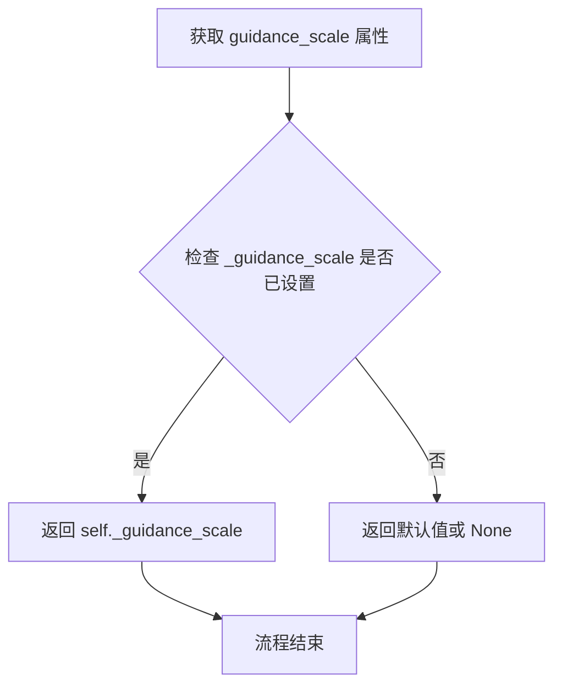

#### 带注释源码

```python
@property
def guidance_scale(self):
    """
    属性 getter: 获取当前引导比例值
    
    该属性返回在图像生成时使用的 guidance_scale 数值。
    guidance_scale 控制文本提示对生成图像的影响程度：
    - 值为 1.0 时，不使用分类器无引导（classifier-free guidance）
    - 值大于 1.0 时，生成的图像会更紧密地遵循文本提示
    - 较高的值可能导致图像质量下降但文本相关性更高
    
    返回:
        float: 当前设置的引导比例值
    """
    return self._guidance_scale
```

#### 相关上下文代码

在 `__call__` 方法中，该属性被设置和使用：

```python
# 在管道调用时设置 guidance_scale
self._guidance_scale = guidance_scale  # guidance_scale 参数类型为 float，默认值为 5.0

# 在去噪循环中使用
if self.do_classifier_free_guidance:
    noise_pred_uncond, noise_pred_text = noise_pred.chunk(2)
    noise_pred = noise_pred_uncond + guidance_scale * (noise_pred_text - noise_pred_uncond)
```

#### 注意事项

1. **依赖关系**：该属性依赖于 `_guidance_scale` 实例变量，该变量在调用 `__call__` 方法时被设置
2. **只读属性**：这是一个只读属性（getter），没有 setter
3. **使用场景**：通常与 `do_classifier_free_guidance` 属性配合使用，用于判断是否启用分类器无引导技术


### `StableDiffusionLDM3DPipeline.guidance_rescale`

该属性是一个只读的 getter 属性，用于获取在图像生成过程中用于重新缩放噪声配置的引导重缩放因子（guidance rescale factor）。该因子基于论文 "Common Diffusion Noise Schedules and Sample Steps are Flawed" (Section 3.4) 的方法，用于改善图像质量并修复过度曝光问题。

参数： 无

返回值：`float`，返回用于重新缩放噪声预测的张量的缩放因子，用于在分类器-free 引导过程中避免生成"平淡"的图像。

#### 流程图

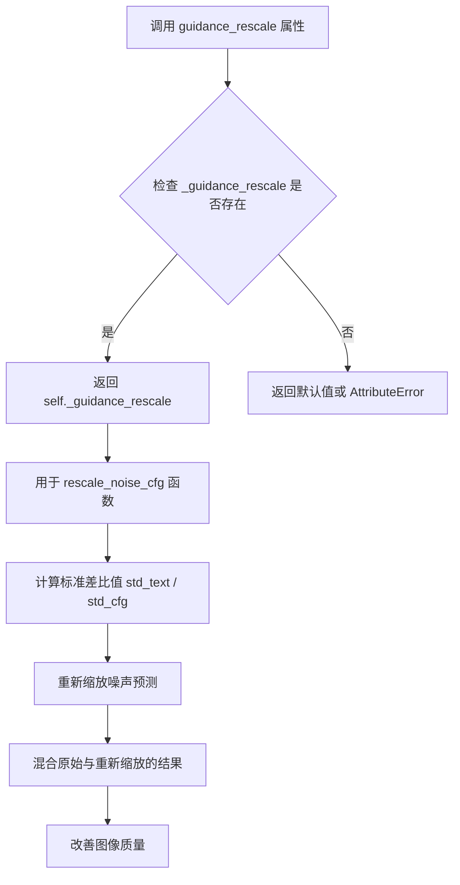

#### 带注释源码

```python
@property
def guidance_rescale(self):
    """
    属性：guidance_rescale
    
    说明：
        这是一个只读属性，返回在图像生成过程中用于重新缩放噪声配置的重缩放因子。
        该因子在 __call__ 方法中被设置，默认值为 0.0。
        当其值大于 0 时，会调用 rescale_noise_cfg 函数来调整噪声预测，
        以避免生成过度曝光或"平淡"的图像。
    
    返回值：
        float: 重缩放因子，值越大对原始噪声预测的偏离程度越大
    """
    return self._guidance_rescale
```

#### 相关上下文源码

在 `__call__` 方法中设置该属性值的位置：

```python
# 在 __call__ 方法中
self._guidance_scale = guidance_scale
self._guidance_rescale = guidance_rescale  # 设置此属性值
self._clip_skip = clip_skip
```

在去噪循环中使用该属性：

```python
# 在去噪循环中
if self.do_classifier_free_guidance and self.guidance_rescale > 0.0:
    # Based on 3.4. in https://huggingface.co/papers/2305.08891
    noise_pred = rescale_noise_cfg(noise_pred, noise_pred_text, guidance_rescale=self.guidance_rescale)
```


### `StableDiffusionLDM3DPipeline.clip_skip`

该属性用于返回当前配置的要从 CLIP 文本编码器跳过的层数（clip_skip）。该值在生成图像时被 `encode_prompt` 方法使用，以决定使用 CLIP 模型的哪一层隐藏状态来计算提示词嵌入。

参数：

- `self`：隐式参数，类型为 `StableDiffusionLDM3DPipeline`，表示管道实例本身

返回值：`int | None`，返回跳过的 CLIP 层数，如果未设置则为 `None`

#### 流程图

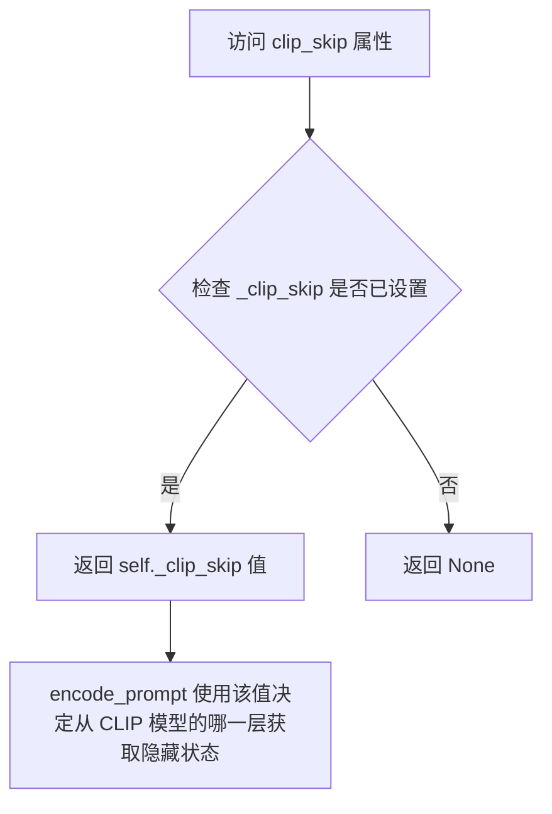

#### 带注释源码

```python
@property
def clip_skip(self):
    """
    属性 getter：返回 CLIP 文本编码器要跳过的层数。

    该属性对应配置中的 _clip_skip 变量，它在图像生成过程中被 encode_prompt 方法使用。
    当 clip_skip 不为 None 时，encode_prompt 会从 CLIP 模型的倒数第 (clip_skip + 1) 层
    获取隐藏状态，而不是使用最后一层的输出。这可以用于控制文本嵌入的特征层级。

    Returns:
        int | None: 要跳过的 CLIP 层数，如果未设置则返回 None
    """
    return self._clip_skip
```

### 相关信息补充

**在 `__call__` 方法中的设置：**

```python
# 在 pipeline 的 __call__ 方法中
self._clip_skip = clip_skip  # clip_skip 参数来自用户调用
```

**在 `encode_prompt` 方法中的使用：**

```python
# 当 clip_skip 不为 None 时，从指定层级获取隐藏状态
if clip_skip is None:
    prompt_embeds = self.text_encoder(text_input_ids.to(device), attention_mask=attention_mask)
    prompt_embeds = prompt_embeds[0]
else:
    prompt_embeds = self.text_encoder(
        text_input_ids.to(device), attention_mask=attention_mask, output_hidden_states=True
    )
    # 从倒数第 (clip_skip + 1) 层获取隐藏状态
    prompt_embeds = prompt_embeds[-1][-(clip_skip + 1)]
    # 应用最终的 LayerNorm 以确保表示的一致性
    prompt_embeds = self.text_encoder.text_model.final_layer_norm(prompt_embeds)
```


### `StableDiffusionLDM3DPipeline.do_classifier_free_guidance`

这是一个属性方法，用于判断当前管道配置是否启用无分类器自由引导（Classifier-Free Guidance，CFG）。该属性返回布尔值，当`guidance_scale`大于1且UNet的时间条件投影维度为`None`时返回`True`，表示启用CFG；否则返回`False`。

参数：
- （无参数，这是一个属性）

返回值：`bool`，返回`True`表示启用无分类器自由引导，返回`False`表示不启用

#### 流程图

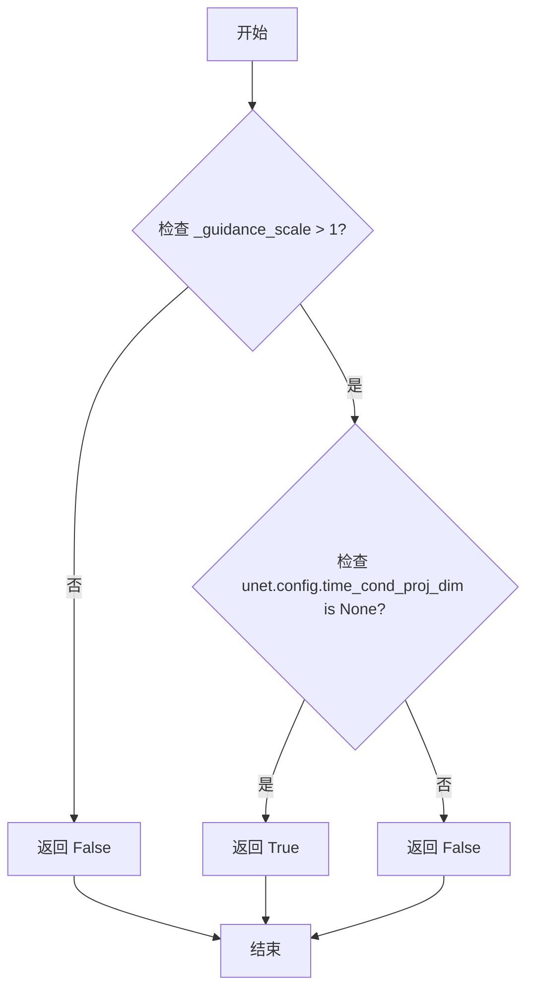

#### 带注释源码

```python
# here `guidance_scale` is defined analog to the guidance weight `w` of equation (2)
# of the Imagen paper: https://huggingface.co/papers/2205.11487 . `guidance_scale = 1`
# corresponds to doing no classifier free guidance.
@property
def do_classifier_free_guidance(self):
    """
    属性：判断是否启用无分类器自由引导（Classifier-Free Guidance）

    无分类器自由引导是一种扩散模型推理技术，通过同时考虑条件和无条件噪声预测
    来提高生成质量。当guidance_scale > 1时启用，数值越大引导强度越强。
    同时，只有当UNet没有配置time_cond_proj_dim时才启用CFG。

    返回：
        bool: 是否启用无分类器自由引导
    """
    return self._guidance_scale > 1 and self.unet.config.time_cond_proj_dim is None
```


### `StableDiffusionLDM3DPipeline.cross_attention_kwargs`

这是一个属性（property）方法，用于获取在管道调用时设置的交叉注意力关键字参数（kwargs）。该参数将传递给UNet模型以控制注意力处理器的行为，例如自定义注意力机制、LoRA权重调整等。

参数：
- （无显式参数，隐式参数为 `self`）

返回值：`dict[str, Any] | None`，返回存储在管道实例中的交叉注意力 kwargs，如果未设置则返回 `None`。

#### 流程图

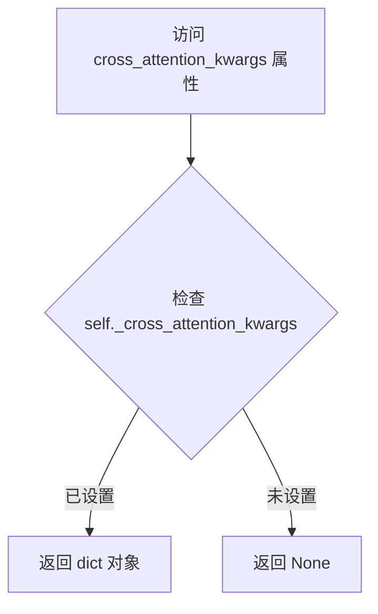

#### 带注释源码

```python
@property
def cross_attention_kwargs(self):
    """
    属性getter：返回传递给UNet的交叉注意力关键字参数。
    
    该参数在 __call__ 方法中被设置：
    self._cross_attention_kwargs = cross_attention_kwargs
    
    交叉注意力kwargs用于控制注意力处理器，例如：
    - 添加自定义注意力机制
    - 控制LoRA层的应用
    - 传递额外的注意力控制参数
    
    Returns:
        dict[str, Any] | None: 交叉注意力关键字参数字典，如果未设置则返回None
    """
    return self._cross_attention_kwargs
```


### `StableDiffusionLDM3DPipeline.num_timesteps`

返回推理过程中使用的时间步数量，用于跟踪扩散模型的推理进度。

参数：无（属性访问器不接受参数）

返回值：`int`，返回设置的时间步总数，即推理过程中将要执行的去噪步骤数量。

#### 流程图

```mermaid
flowchart TD
    A[访问 num_timesteps 属性] --> B{检查 _num_timesteps 是否存在}
    B -->|存在| C[返回 self._num_timesteps]
    B -->|不存在| D[返回默认值或 AttributeError]
    
    C --> E[获取推理步数]
    
    subgraph 设置流程
    F[__call__ 方法执行] --> G[调用 retrieve_timesteps]
    G --> H[获取 timesteps 列表]
    H --> I[设置 self._num_timesteps = len(timesteps)]
    end
```

#### 带注释源码

```python
@property
def num_timesteps(self):
    """
    返回推理过程中的时间步数量。
    
    该属性在 __call__ 方法中被设置，对应于扩散模型的去噪步骤数。
    通常在调用 retrieve_timesteps 后，通过 len(timesteps) 进行赋值。
    
    Returns:
        int: 推理过程中将要执行的去噪步骤总数
    """
    return self._num_timesteps
```


### `StableDiffusionLDM3DPipeline.interrupt`

该属性用于获取管道的当前中断状态，指示生成过程是否被请求中断。在去噪循环中通过检查此属性来决定是否跳过当前迭代，从而实现即时停止生成的能力。

参数： 无

返回值：`bool`，返回管道的当前中断状态。当值为 `True` 时，表示外部已请求中断生成过程；值为 `False` 时，表示继续正常生成。

#### 流程图

```mermaid
flowchart TD
    A[获取 interrupt 属性] --> B{返回 self._interrupt}
    B -->|True| C[生成循环检测到中断请求<br/>执行 continue 跳过当前迭代]
    B -->|False| D[继续正常生成]
```

#### 带注释源码

```python
@property
def interrupt(self):
    """
    属性 getter: 获取管道的当前中断状态
    
    该属性返回一个布尔值，表示是否请求中断当前的去噪生成过程。
    在 __call__ 方法的去噪循环中会检查此属性：
    
        for i, t in enumerate(timesteps):
            if self.interrupt:
                continue  # 跳过当前迭代，继续等待或结束
    
    当外部代码将 self._interrupt 设置为 True 时，生成循环会在下一次
    迭代开始时检测到中断请求并跳过处理，从而实现即时停止生成的效果。
    
    Returns:
        bool: 当前的中断状态。True 表示请求中断，False 表示正常运行。
    """
    return self._interrupt
```

#### 上下文关联代码片段

```python
# 在 __call__ 方法中初始化中断状态
self._interrupt = False  # 初始化为 False，表示默认不中断

# 在去噪循环中检查中断状态
for i, t in enumerate(timesteps):
    if self.interrupt:  # 检查是否请求了中断
        continue        # 如果请求了中断，跳过当前迭代
```

## 关键组件


### StableDiffusionLDM3DPipeline

主管道类，继承自多个mixin类（DeprecatedPipelineMixin, DiffusionPipeline, StableDiffusionMixin等），负责协调文本到图像和深度图的生成流程。

### LDM3DPipelineOutput

输出数据类，封装生成的RGB图像、深度图像和NSFW内容检测结果。

### encode_prompt

将文本提示编码为文本编码器隐藏状态的完整方法，支持LoRA缩放、clip_skip和文本反转处理。

### encode_image

将输入图像编码为图像嵌入向量，支持IP适配器的隐藏状态输出和分类器自由引导。

### prepare_ip_adapter_image_embeds

准备IP适配器的图像嵌入，处理多IP适配器场景，支持分类器自由引导。

### prepare_latents

准备初始潜在变量，使用randn_tensor生成随机潜在变量，并根据调度器的要求进行缩放。

### __call__

主生成方法，执行完整的去噪循环，包括：输入验证、提示编码、时间步检索、潜在变量准备、UNet去噪、VAE解码和安全检查。

### rescale_noise_cfg

根据guidance_rescale参数重缩放噪声预测，改善图像质量并修复过度曝光问题。

### retrieve_timesteps

从调度器检索时间步，支持自定义时间步和sigma值。

### run_safety_checker

运行NSFW内容安全检查，使用StableDiffusionSafetyChecker检测生成图像是否包含不当内容。

### check_inputs

验证输入参数的有效性，包括高度、宽度、回调步骤、提示嵌入和IP适配器配置。

### VaeImageProcessorLDM3D

图像后处理器，负责将VAE输出解码后的图像转换为PIL图像或NumPy数组格式，同时处理RGB和深度图的反归一化。


## 问题及建议


### 已知问题

- **属性未初始化**: `_guidance_scale`, `_guidance_rescale`, `_clip_skip`, `_cross_attention_kwargs`, `_num_timesteps`, `_interrupt` 等属性在 `__call__` 方法中被动态赋值，但未在 `__init__` 中声明，可能导致 IDE 类型检查警告和潜在的 AttributeError。
- **默认值不一致**: `num_inference_steps` 参数默认值是 49，但文档字符串 (docstring) 中写的是 50，这会导致用户困惑。
- **硬编码的默认值**: `vae_scale_factor` 在 `getattr` 调用中硬编码了 fallback 值为 8，缺乏灵活性。
- **弃用方法仍保留**: `_encode_prompt` 方法已标记为 deprecated 并重定向到 `encode_prompt`，但仍保留了大量向后兼容的逻辑，增加了代码复杂度。
- **错误消息占位符问题**: `check_inputs` 方法中错误消息使用了 `{self.__class__}` 但未正确格式化，应该是 f-string。
- **类型注解混用**: 代码中混合使用了新版联合类型注解 (`str | list[str]`) 和旧版 `Optional` / `Union` 注解，缺乏一致性。
- **循环内重复计算**: 在 `__call__` 方法的去噪循环中，`callback_on_step_end_tensor_inputs` 的遍历和 `locals()` 的使用在每个步骤都会执行，可能带来性能开销。
- **潜在的内存泄漏**: `prompt_embeds` 在 CFG 模式下被 `torch.cat` 重复复制，如果处理大批量生成可能导致内存压力。

### 优化建议

- 在 `__init__` 方法中为所有动态属性添加类型化默认值初始化，如 `self._guidance_scale: float = 0.0`。
- 统一 `num_inference_steps` 的默认值为 50，或者更新文档字符串以匹配实际代码。
- 将硬编码的 `vae_scale_factor` fallback 值提取为类常量或配置参数。
- 移除 `_encode_prompt` 的弃用实现，或在未来的主版本中完全删除以减少代码库大小。
- 使用 f-string 修复 `check_inputs` 中的错误消息格式化问题。
- 统一整个代码库的类型注解风格，建议全部采用 Python 3.10+ 的联合类型注解。
- 将 `callback_on_step_end_tensor_inputs` 的处理移至循环外部，避免在每个去噪步骤中重复创建字典。
- 考虑使用 `torch.no_grad()` 上下文管理器包裹不必要梯度计算的操作，并优化大规模批量生成时的内存管理策略。

## 其它


### 设计目标与约束

本Pipeline的设计目标是实现基于LDM3D（Latent Diffusion Models for 3D）的文本到图像和深度图的双通道生成能力，继承Stable Diffusion系列pipeline的核心架构，支持文本提示词引导的图像生成，同时输出RGB图像和对应的深度信息。设计约束包括：必须兼容diffusers库的整体架构设计，遵循DiffusionPipeline的抽象接口规范，支持多种调度器（KarrasDiffusionSchedulers），支持LoRA权重加载、Textual Inversion、IP Adapter等扩展功能，必须支持Safety Checker进行NSFW内容检测，输出尺寸必须能被8整除（基于VAE的缩放因子），推理步数默认49步，支持自定义timesteps和sigmas。

### 错误处理与异常设计

代码中实现了多层次的错误处理机制。在`retrieve_timesteps`函数中，当同时传入timesteps和sigmas时抛出ValueError，当scheduler不支持自定义timesteps或sigmas时抛出ValueError并给出明确的错误提示。在`encode_prompt`方法中，对negative_prompt与prompt的类型不一致、batch_size不匹配等情况进行了类型检查和值验证。在`check_inputs`方法中，对height和width的8的倍数约束、callback_steps的正整数约束、prompt与prompt_embeds的互斥关系、negative_prompt与negative_prompt_embeds的互斥关系、ip_adapter_image与ip_adapter_image_embeds的互斥关系等进行了全面检查。在`prepare_latents`方法中，对generator列表长度与batch_size不匹配的情况抛出ValueError。在`prepare_ip_adapter_image_embeds`方法中，对ip_adapter_image数量与IP Adapters数量不匹配的情况抛出ValueError。

### 数据流与状态机

Pipeline的整体数据流遵循以下主要阶段：首先进行输入验证（check_inputs），然后编码文本提示词（encode_prompt）生成prompt_embeds和negative_prompt_embeds，接着准备潜在变量（prepare_latents）生成初始噪声，之后进入去噪循环（denoising loop），在每个 timestep 中执行UNet预测噪声残差（noise_pred），根据guidance_scale执行分类器自由引导（classifier-free guidance），最后通过VAE解码器将潜在表示解码为图像（vae.decode），并通过图像后处理器（VaeImageProcessorLDM3D）生成最终的RGB图像和深度图。状态机方面，Pipeline内部维护了_guidance_scale、_guidance_rescale、_clip_skip、_cross_attention_kwargs、_interrupt、_num_timesteps等内部状态，这些状态在__call__方法开始时初始化，在去噪循环中更新，在pipeline执行完毕后通过maybe_free_model_hooks释放。

### 外部依赖与接口契约

本Pipeline依赖以下核心外部组件。Transformers库：CLIPTextModel（文本编码器）、CLIPTokenizer（分词器）、CLIPVisionModelWithProjection（图像编码器，用于IP Adapter）、CLIPImageProcessor（特征提取器，用于Safety Checker）。Diffusers库：AutoencoderKL（VAE模型）、UNet2DConditionModel（UNet去噪模型）、KarrasDiffusionSchedulers（调度器）、VaeImageProcessorLDM3D（LDM3D专用图像处理器）、PipelineImageInput（图像输入类型）、StableDiffusionSafetyChecker（安全检查器）。其他依赖：numpy（数值计算）、PIL.Image（图像处理）、torch（深度学习框架）、torch_xla（可选，用于XLA设备加速）。接口契约方面，encode_prompt方法返回元组（prompt_embeds, negative_prompt_embeds），prepare_ip_adapter_image_embeds方法返回图像嵌入列表，run_safety_checker方法返回（处理后的图像, has_nsfw_concept）元组，__call__方法默认返回LDM3DPipelineOutput对象或元组（(rgb, depth), nsfw_content_detected）。

### 配置与参数管理

Pipeline通过self.register_modules方法注册所有子模块（vae、text_encoder、tokenizer、unet、scheduler、safety_checker、feature_extractor、image_encoder），并通过self.register_to_config保存配置参数（requires_safety_checker）。Pipeline定义了可选组件列表（_optional_components）和需要排除于CPU offload的组件列表（_exclude_from_cpu_offload），定义了模型CPU卸载顺序（model_cpu_offload_seq）和回调张量输入列表（_callback_tensor_inputs）。Pipeline还定义了_last_supported_version = "0.33.1"用于版本兼容性检查。

### 并发与性能优化

代码支持多项性能优化特性。模型CPU卸载：使用model_cpu_offload_seq定义卸载顺序，使用maybe_free_model_hooks在推理完成后释放模型钩子。XLA加速支持：通过is_torch_xla_available()检查XLA可用性，使用xm.mark_step()进行XLA设备同步。分类器自由引导优化：在encode_prompt中将无条件嵌入和文本嵌入拼接为单个batch，避免执行两次前向传播。Guidance Rescale：实现rescale_noise_cfg函数根据guidance_rescale参数重新缩放噪声预测，以改善图像质量并修复过度曝光问题。LoRA支持：通过adjust_lora_scale_text_encoder、scale_lora_layers、unscale_lora_layers函数支持LoRA权重的动态调整。Progress Bar：使用self.progress_bar显示去噪进度。

### 安全性与合规性

Safety Checker集成：Pipeline集成了StableDiffusionSafetyChecker用于检测NSFW内容，在推理完成后执行安全检查并返回has_nsfw_concept标志。Safety Checker配置：通过requires_safety_checker参数控制是否启用安全检查，当safety_checker为None且requires_safety_checker为True时发出警告。输出过滤：对检测到NSFW内容的图像进行去归一化处理（do_denormalize标志）。模型卸载安全：在释放模型钩子时确保所有模型资源正确释放，避免内存泄漏。

### 版本兼容性

代码实现了版本检查机制（_last_supported_version = "0.33.1"），通过DeprecatedPipelineMixin处理已弃用pipeline的兼容性。提供向后兼容的_encode_prompt方法，该方法已弃用并重定向到encode_prompt方法。scheduler接口兼容性检查：在prepare_extra_step_kwargs中动态检查scheduler.step方法是否接受eta和generator参数，支持不同调度器实现的差异。

    