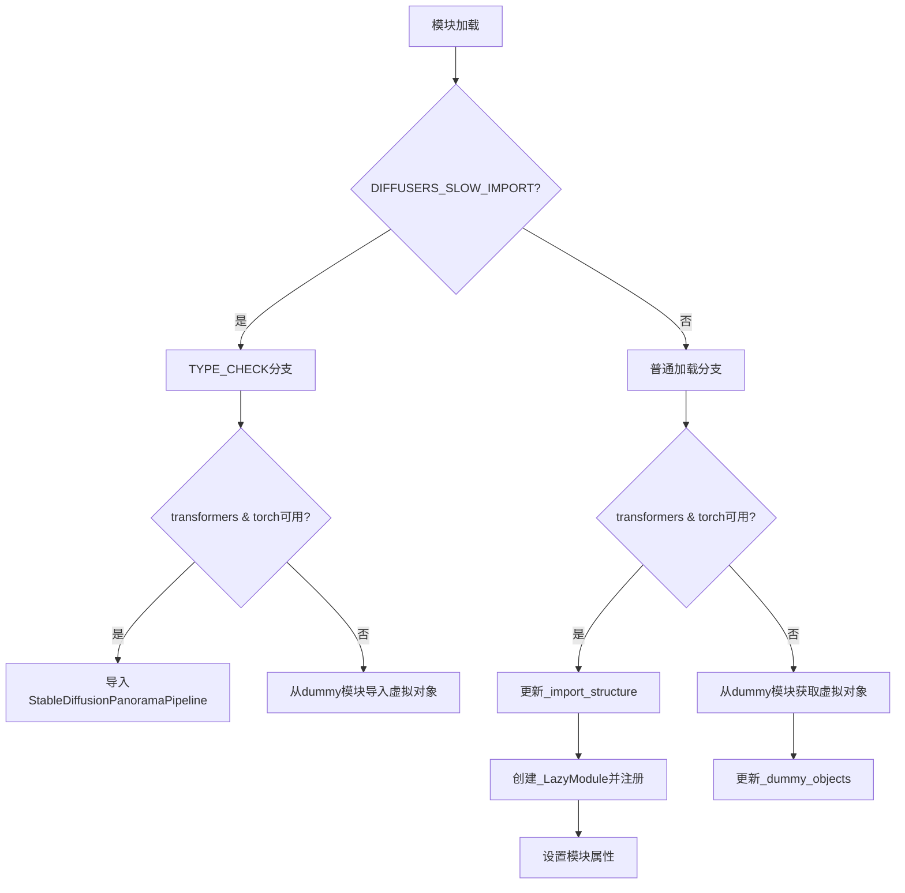

# `diffusers\src\diffusers\pipelines\stable_diffusion_panorama\__init__.py` 详细设计文档

这是一个diffusers库的延迟加载模块初始化文件，用于在运行时动态导入StableDiffusionPanoramaPipeline（全景图生成管道），同时处理torch和transformers的可选依赖，通过_LazyModule实现懒加载，并在依赖不可用时提供虚拟对象以保证代码兼容性。

## 整体流程



## 类结构

```
此文件为模块初始化文件，无类层次结构
主要使用_LazyModule实现延迟加载
StableDiffusionPanoramaPipeline 是唯一被导入的管道类
```

## 全局变量及字段


### `_dummy_objects`
    
存储可选依赖不可用时的虚拟对象字典，用于延迟导入时的占位

类型：`Dict[str, Any]`
    


### `_import_structure`
    
定义模块的导入结构，映射子模块名称到可导出对象的列表

类型：`Dict[str, List[str]]`
    


### `DIFFUSERS_SLOW_IMPORT`
    
标志位，用于控制是否启用慢速导入模式（完整导入而非懒加载）

类型：`bool`
    


### `OptionalDependencyNotAvailable`
    
可选依赖不可用时抛出的异常类，用于处理torch和transformers的依赖检测

类型：`Exception`
    


### `get_objects_from_module`
    
从指定模块中获取所有对象的函数，用于填充dummy_objects

类型：`Callable`
    


### `is_torch_available`
    
检查torch库是否可用的函数，返回布尔值

类型：`Callable[[], bool]`
    


### `is_transformers_available`
    
检查transformers库是否可用的函数，返回布尔值

类型：`Callable[[], bool]`
    


    

## 全局函数及方法


## 关键组件


### 一段话描述

该代码是Diffusers库中的一个懒加载模块，用于条件性地导入StableDiffusionPanoramaPipeline管道类，通过检查torch和transformers的可用性来处理可选依赖，并在不满足依赖时提供虚拟对象。

### 文件的整体运行流程

1. 模块导入时首先检查是否为类型检查模式(TYPE_CHECKING)或慢速导入模式(DIFFUSERS_SLOW_IMPORT)
2. 如果是类型检查模式，则尝试导入StableDiffusionPanoramaPipeline类
3. 如果是运行时导入，则创建_LazyModule并注册到sys.modules中实现懒加载
4. 对于不可用的依赖，从dummy模块获取虚拟对象并设置为模块属性

### 类的详细信息

本文件主要使用_LazyModule类，该类来自...utils._LazyModule，非本文件定义。

### 全局变量和全局函数详细信息

#### _dummy_objects

- 类型: dict
- 描述: 存储虚拟对象的字典，用于在依赖不可用时提供占位符

#### _import_structure

- 类型: dict
- 描述: 定义模块的导入结构，映射字符串到可导入对象的名称列表

#### get_objects_from_module

- 参数: module模块对象
- 参数类型: module
- 参数描述: 要从中获取对象的模块
- 返回值类型: dict
- 返回值描述: 返回模块中所有对象的字典映射

#### is_torch_available

- 参数: 无
- 返回值类型: bool
- 返回值描述: 返回torch库是否可用的布尔值

#### is_transformers_available

- 参数: 无
- 返回值类型: bool
- 返回值描述: 返回transformers库是否可用的布尔值

### 关键组件信息

#### 懒加载机制(_LazyModule)

使用_LazyModule实现延迟导入，只有在实际使用时才加载管道类，提高导入速度

#### 可选依赖处理

通过OptionalDependencyNotAvailable异常和is_torch_available/is_transformers_available检查处理可选依赖

#### 虚拟对象模式(_dummy_objects)

当依赖不可用时，使用虚拟对象填充模块，防止导入错误

#### 导入结构定义(_import_structure)

明确定义模块的公共API接口，支持动态导入

### 潜在的技术债务或优化空间

1. 缺少对导入失败的详细日志记录
2. 没有版本兼容性检查
3. 虚拟对象的实现依赖于外部dummy模块，增加了模块间的耦合

### 其它项目

#### 设计目标与约束

- 目标: 实现可选依赖的优雅处理和懒加载
- 约束: 必须同时满足torch和transformers可用才导入管道

#### 错误处理与异常设计

使用OptionalDependencyNotAvailable异常标记可选依赖不可用，配合try-except捕获

#### 数据流与状态机

模块状态: 未初始化 -> 检查依赖 -> 设置LazyModule或设置虚拟对象

#### 外部依赖与接口契约

- 依赖: torch, transformers, Diffusers内部utils模块
- 接口: StableDiffusionPanoramaPipeline类


## 问题及建议


### 已知问题

-   **重复代码块**：try-except 依赖检查逻辑在 `if TYPE_CHECKING or DIFFUSERS_SLOW_IMPORT:` 分支和 `else` 分支中完全重复，违反 DRY（Don't Repeat Yourself）原则，增加维护成本。
-   **条件分支逻辑冗余**：两个分支（TYPE_CHECKING 和运行时）的代码几乎相同，仅在导入路径上不同，可通过提取公共逻辑简化。
-   **变量初始化与填充不一致**：`_import_structure` 初始化为空字典，但在 `except` 分支中不会被填充，可能导致导出结构不完整。
-   **异常处理流程不清晰**：使用 `raise OptionalDependencyNotAvailable()` 来触发 except 块的方式不够直观，异常本应用于错误处理而非流程控制。
-   **缺乏错误信息**：当依赖不可用时，没有提供有意义的错误提示或日志记录。
-   **模块动态替换风险**：直接操作 `sys.modules[__name__]` 替换模块对象，可能导致引用不一致问题。

### 优化建议

-   **提取公共逻辑**：将依赖检查和模块导入逻辑提取为独立函数，例如 `get_pipeline_module()`，避免代码重复。
-   **使用配置驱动**：将 `pipeline_stable_diffusion_panorama` 等模块名存储在配置中，减少硬编码。
-   **添加日志或警告**：在依赖不可用时，记录明确的警告信息，帮助开发者调试。
-   **重构条件分支**：考虑使用工厂模式或映射表来管理不同导入场景，减少嵌套层级。
-   **完善类型标注**：为 `_import_structure` 添加明确的类型注解，提升代码可读性。


## 其它


### 设计目标与约束

该模块的设计目标是实现条件化、延迟化的模块导入机制，仅在依赖库（transformers和torch）可用时加载StableDiffusionPanoramaPipeline类，否则提供虚拟对象以保持API兼容性。设计约束包括：必须支持TYPE_CHECKING模式、需保持与diffusers框架的_LazyModule机制一致、不能直接抛出导入错误影响下游模块加载。

### 错误处理与异常设计

模块采用OptionalDependencyNotAvailable异常进行依赖缺失的优雅处理。当transformers或torch任一不可用时，捕获异常并从dummy_torch_and_transformers_objects模块导入虚拟对象存入_dummy_objects字典，确保sys.modules中仍存在对应名称但功能受限的对象。TYPE_CHECKING和DIFFUSERS_SLOW_IMPORT模式下会重新检查依赖，抛出相同的可选依赖异常。

### 数据流与状态机

模块存在三种状态：完全初始化状态（DIFFUSERS_SLOW_IMPORT=True或TYPE_CHECKING）、延迟加载状态（运行时且依赖可用）、降级状态（运行时且依赖不可用）。数据流从_import_structure定义可用对象开始，经由_LazyModule包装sys.modules，最后通过setattr注入_dummy_objects完成模块构造。

### 外部依赖与接口契约

模块依赖is_transformers_available()和is_transformers_available()两个工具函数判断环境能力，依赖_LazyModule类实现延迟加载，依赖get_objects_from_module函数获取虚拟对象。公开接口为StableDiffusionPanoramaPipeline类（或其虚拟代理），该类实际定义在pipeline_stable_diffusion_panorama子模块中。

### 模块初始化流程

导入时首先定义_import_structure字典映射对象名称，然后尝试检查依赖可用性。若依赖不可用则加载dummy对象；若可用则在_import_structure中注册StableDiffusionPanoramaPipeline。在非TYPE_CHECKING且非DIFFUSERS_SLOW_IMPORT的运行时模式下，使用_LazyModule替换当前模块，并注入所有_dummy_objects。

### 性能考量

延迟加载机制显著减少了首次导入diffusers库时的开销，避免加载不必要的深度学习依赖。_LazyModule的importlib延迟机制确保了只有在真正访问pipeline类时才会触发子模块的实际加载。_dummy_objects的预填充避免了运行时属性访问错误。

### 安全考虑

模块通过动态设置sys.modules[__name__]实现模块注入，需要确保来源可信。dummy对象的存在防止了直接导入失败，但可能导致运行时错误延迟到实际使用时，建议在文档中明确说明功能限制。

### 版本兼容性说明

该模块设计兼容diffusers库的_LazyModule机制，需要Python 3.7+的typing.TYPE_CHECKING支持。与transformers和torch的具体版本兼容性取决于StableDiffusionPanoramaPipeline类的实际需求，当前模块本身未指定版本约束。

    