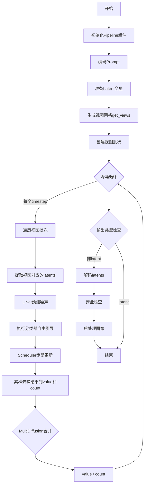
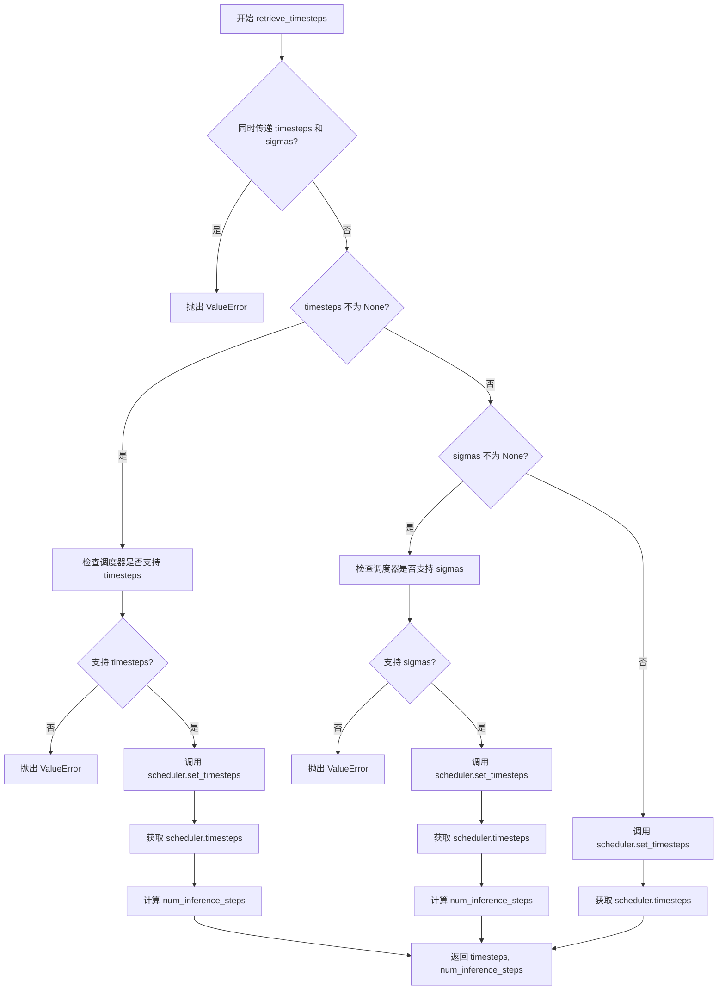
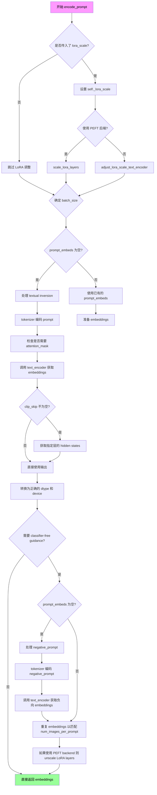
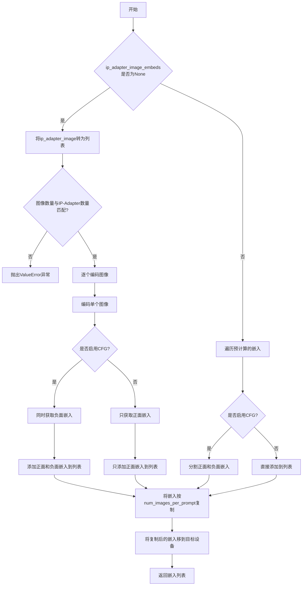
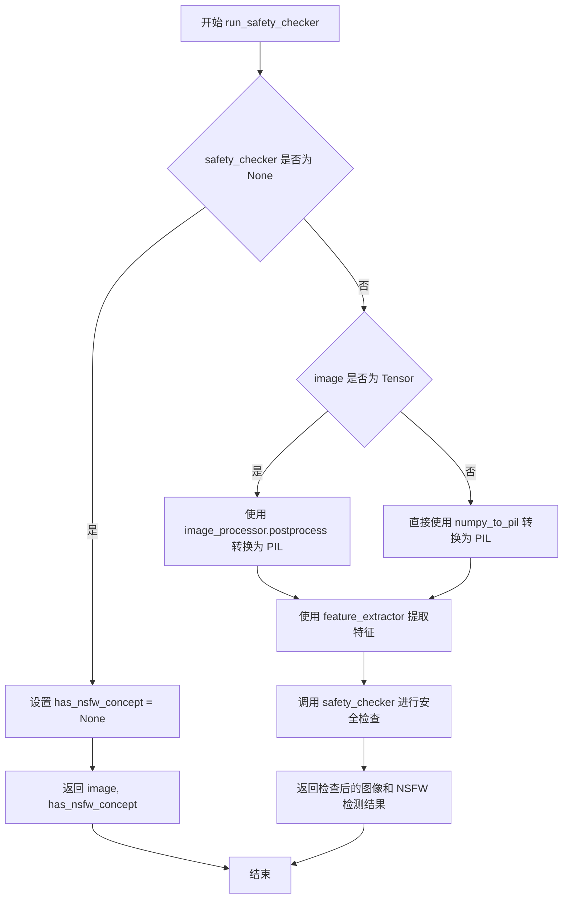
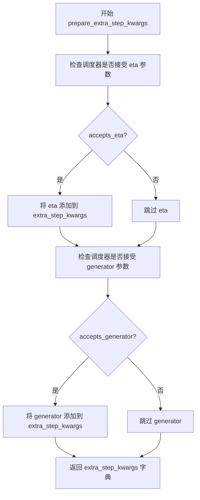
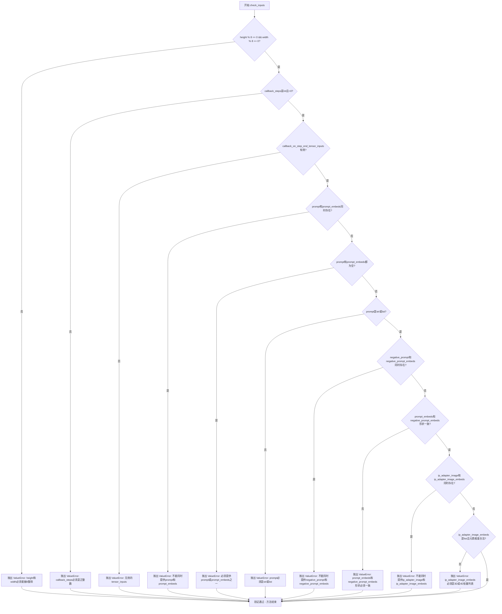
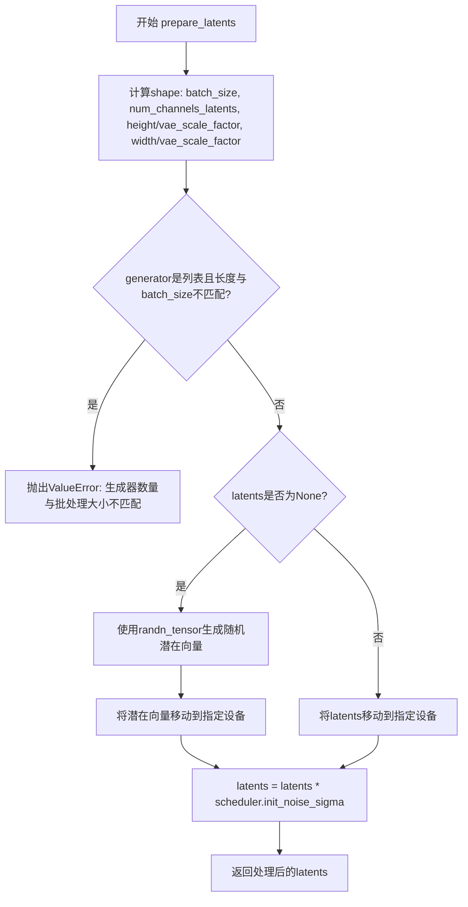
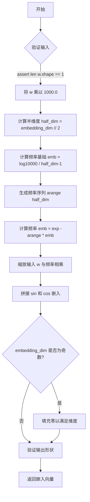

```mermaid
flowchart TD
    A[开始__call__] --> B[解析callback参数]
    B --> C[设置默认高度和宽度]
    C --> D[检查输入参数check_inputs]
    D --> E[设置guidance_scale等属性]
    E --> F[确定batch_size]
    F --> G[判断是否使用分类器自由引导]
    G --> H{ip_adapter_image是否存在?}
    H -->|是| I[prepare_ip_adapter_image_embeds]
    H -->|否| J[跳过IP-Adapter准备]
    I --> K[编码提示encode_prompt]
    J --> K
    K --> L[连接negative和positive prompt_embeds]
    L --> M[准备时间步retrieve_timesteps]
    M --> N[准备潜变量prepare_latents]
    N --> O[获取全景视图get_views]
    O --> P[初始化count和value张量]
    P --> Q[准备额外步进参数prepare_extra_step_kwargs]
    Q --> R{是否有IP-Adapter图像?}
    R -->|是| S[设置added_cond_kwargs]
    R -->|否| T[设置timestep_cond]
    S --> T
    T --> U[进入去噪循环 for each timestep]
    U --> V[清零count和value]
    V --> W[遍历视图批次 for each view_batch]
    W --> X{circular_padding?}
    X -->|是| Y[应用循环水平填充获取视图latents]
    X -->|否| Z[直接获取视图latents]
    Y --> AA[恢复scheduler状态]
    Z --> AA
    AA --> AB[扩展latents进行分类器自由引导]
    AB --> AC[scale_model_input]
    AC --> AD[重复prompt_embeds匹配batch]
    AD --> AE[UNet预测噪声]
    AE --> AF{guidance_scale > 1?}
    AF -->|是| AG[执行分类器自由引导计算]
    AF -->|否| AH[直接使用预测噪声]
    AG --> AI[rescale_noise_cfg]
    AI --> AH
    AH --> AJ[scheduler.step计算上一步]
    AJ --> AK[保存scheduler状态]
    AK --> AL{circular_padding?}
    AL -->|是| AM[处理循环填充累加value和count]
    AL -->|否| AN[直接累加value和count]
    AM --> AO[多Diffusion步骤: value/count]
    AN --> AO
    AO --> AP{callback_on_step_end?}
    AP -->|是| AQ[执行回调]
    AP -->|否| AR[更新进度条]
    AQ --> AR
    AR --> AS{是否是最后一个timestep?}
    AS -->|否| AT[继续下一个timestep]
    AT --> V
    AS -->|是| AU{output_type != latent?}
    AU -->|是| AV{circular_padding?}
    AV -->|是| AW[decode_latents_with_padding]
    AV -->|否| AX[vae.decode]
    AW --> AY[run_safety_checker]
    AX --> AY
    AU -->|否| AZ[直接返回latents]
    AY --> BA[后处理图像postprocess]
    AZ --> BB[maybe_free_model_hooks]
    BA --> BC[返回结果]
    BB --> BC
```

# `diffusers\src\diffusers\pipelines\stable_diffusion_panorama\pipeline_stable_diffusion_panorama.py` 详细设计文档

这是一个用于全景图像生成的Stable Diffusion Pipeline，基于MultiDiffusion技术。该管道通过将全景图像分割成多个重叠的视图块，分别进行去噪处理，然后合并结果，从而生成长幅全景图像。

## 整体流程



## 类结构

```
DiffusionPipeline (基类)
├── DeprecatedPipelineMixin
├── StableDiffusionMixin
├── TextualInversionLoaderMixin
├── StableDiffusionLoraLoaderMixin
└── IPAdapterMixin
    └── StableDiffusionPanoramaPipeline (本类)
```

## 全局变量及字段


### `logger`
    
模块级日志记录器，用于记录运行时信息

类型：`logging.Logger`
    


### `EXAMPLE_DOC_STRING`
    
示例文档字符串，包含pipeline使用示例代码

类型：`str`
    


### `XLA_AVAILABLE`
    
标志位，指示torch_xla是否可用以支持XLA设备加速

类型：`bool`
    


### `StableDiffusionPanoramaPipeline.vae`
    
VAE变分自编码器，用于图像与潜在表示之间的编解码

类型：`AutoencoderKL`
    


### `StableDiffusionPanoramaPipeline.text_encoder`
    
CLIP文本编码器，将文本提示转换为嵌入向量

类型：`CLIPTextModel`
    


### `StableDiffusionPanoramaPipeline.tokenizer`
    
CLIP分词器，用于将文本分割为token序列

类型：`CLIPTokenizer`
    


### `StableDiffusionPanoramaPipeline.unet`
    
UNet条件去噪模型，在潜在空间中进行图像生成

类型：`UNet2DConditionModel`
    


### `StableDiffusionPanoramaPipeline.scheduler`
    
DDIM噪声调度器，控制去噪过程的噪声调度

类型：`DDIMScheduler`
    


### `StableDiffusionPanoramaPipeline.safety_checker`
    
安全检查器，检测生成图像是否包含不当内容

类型：`StableDiffusionSafetyChecker`
    


### `StableDiffusionPanoramaPipeline.feature_extractor`
    
CLIP图像特征提取器，用于提取图像特征供安全检查器使用

类型：`CLIPImageProcessor`
    


### `StableDiffusionPanoramaPipeline.image_encoder`
    
CLIP视觉编码器，用于IP-Adapter图像提示功能

类型：`CLIPVisionModelWithProjection | None`
    


### `StableDiffusionPanoramaPipeline.vae_scale_factor`
    
VAE缩放因子，用于调整潜在空间的分辨率

类型：`int`
    


### `StableDiffusionPanoramaPipeline.image_processor`
    
图像后处理器，用于图像的预处理和后处理操作

类型：`VaeImageProcessor`
    


### `StableDiffusionPanoramaPipeline._guidance_scale`
    
引导强度参数，控制文本提示对生成图像的影响程度

类型：`float`
    


### `StableDiffusionPanoramaPipeline._guidance_rescale`
    
引导重缩放因子，用于改善图像过度曝光问题

类型：`float`
    


### `StableDiffusionPanoramaPipeline._clip_skip`
    
CLIP跳过的层数，用于调整文本嵌入的层数

类型：`int | None`
    


### `StableDiffusionPanoramaPipeline._cross_attention_kwargs`
    
交叉注意力额外参数，用于控制注意力机制

类型：`dict[str, Any] | None`
    


### `StableDiffusionPanoramaPipeline._num_timesteps`
    
去噪步骤总数，记录推理过程中的时间步数

类型：`int`
    


### `StableDiffusionPanoramaPipeline._interrupt`
    
中断标志，用于中断推理过程

类型：`bool`
    
    

## 全局函数及方法


### `rescale_noise_cfg`

该函数是一个全局工具函数，用于根据 guidance_rescale 参数重新缩放噪声预测张量，以改善图像质量并修复过度曝光问题。该方法基于论文 "Common Diffusion Noise Schedules and Sample Steps are Flawed" (Section 3.4) 的研究成果。

参数：

-  `noise_cfg`：`torch.Tensor`，引导扩散过程中预测的噪声张量
-  `noise_pred_text`：`torch.Tensor`，文本引导扩散过程中预测的噪声张量
-  `guidance_rescale`：`float`，可选参数，默认值为 0.0应用于噪声预测的重新缩放因子

返回值：`torch.Tensor`，重新缩放后的噪声预测张量

#### 流程图

```mermaid
flowchart TD
    A[开始] --> B[计算 noise_pred_text 的标准差 std_text]
    B --> C[计算 noise_cfg 的标准差 std_cfg]
    C --> D[计算重新缩放后的噪声预测 noise_pred_rescaled = noise_cfg × (std_text / std_cfg)]
    D --> E[根据 guidance_rescale 混合结果: noise_cfg = guidance_rescale × noise_pred_rescaled + (1 - guidance_rescale) × noise_cfg]
    E --> F[返回重新缩放后的 noise_cfg]
```

#### 带注释源码

```python
# Copied from diffusers.pipelines.stable_diffusion.pipeline_stable_diffusion.rescale_noise_cfg
def rescale_noise_cfg(noise_cfg, noise_pred_text, guidance_rescale=0.0):
    r"""
    Rescales `noise_cfg` tensor based on `guidance_rescale` to improve image quality and fix overexposure. Based on
    Section 3.4 from [Common Diffusion Noise Schedules and Sample Steps are
    Flawed](https://huggingface.co/papers/2305.08891).

    Args:
        noise_cfg (`torch.Tensor`):
            The predicted noise tensor for the guided diffusion process.
        noise_pred_text (`torch.Tensor`):
            The predicted noise tensor for the text-guided diffusion process.
        guidance_rescale (`float`, *optional*, defaults to 0.0):
            A rescale factor applied to the noise predictions.

    Returns:
        noise_cfg (`torch.Tensor`): The rescaled noise prediction tensor.
    """
    # 计算文本预测噪声在除批次维度外所有维度的标准差
    # keepdim=True 保持维度以便后续广播操作
    std_text = noise_pred_text.std(dim=list(range(1, noise_pred_text.ndim)), keepdim=True)
    
    # 计算噪声配置在除批次维度外所有维度的标准差
    std_cfg = noise_cfg.std(dim=list(range(1, noise_cfg.ndim)), keepdim=True)
    
    # 重新缩放引导结果以修复过度曝光问题
    # 通过将 noise_cfg 乘以文本噪声标准差与 cfg 噪声标准差的比值来实现
    noise_pred_rescaled = noise_cfg * (std_text / std_cfg)
    
    # 通过 guidance_rescale 因子混合原始引导结果，避免生成"平淡"的图像
    # 当 guidance_rescale = 0 时返回原始 noise_cfg
    # 当 guidance_rescale = 1 时返回完全重新缩放的 noise_pred_rescaled
    noise_cfg = guidance_rescale * noise_pred_rescaled + (1 - guidance_rescale) * noise_cfg
    
    return noise_cfg
```


### `retrieve_timesteps`

该函数是调度器时间步检索工具函数，用于调用调度器的 `set_timesteps` 方法并获取时间步序列。支持三种模式：自定义时间步列表、自定义 sigmas 列表或通过推理步数自动生成时间步。函数内部通过 `inspect` 模块检查调度器是否支持相应的参数，并返回时间步张量和实际推理步数的元组。

参数：

- `scheduler`：`SchedulerMixin`，调度器对象，用于获取时间步
- `num_inference_steps`：`int | None`，推理步数，当使用预训练模型生成样本时使用，若使用此参数则 `timesteps` 必须为 `None`
- `device`：`str | torch.device | None`，时间步要移动到的设备，如果为 `None` 则不移动时间步
- `timesteps`：`list[int] | None`，自定义时间步列表，用于覆盖调度器的时间步间隔策略，如果传递此参数则 `num_inference_steps` 和 `sigmas` 必须为 `None`
- `sigmas`：`list[float] | None`，自定义 sigmas 列表，用于覆盖调度器的时间步间隔策略，如果传递此参数则 `num_inference_steps` 和 `timesteps` 必须为 `None`
- `**kwargs`：任意关键字参数，将传递给调度器的 `set_timesteps` 方法

返回值：`tuple[torch.Tensor, int]`，元组包含两个元素，第一个元素是调度器的时间步张量，第二个元素是推理步数

#### 流程图



#### 带注释源码

```python
def retrieve_timesteps(
    scheduler,
    num_inference_steps: int | None = None,
    device: str | torch.device | None = None,
    timesteps: list[int] | None = None,
    sigmas: list[float] | None = None,
    **kwargs,
):
    r"""
    Calls the scheduler's `set_timesteps` method and retrieves timesteps from the scheduler after the call. Handles
    custom timesteps. Any kwargs will be supplied to `scheduler.set_timesteps`.

    Args:
        scheduler (`SchedulerMixin`):
            The scheduler to get timesteps from.
        num_inference_steps (`int`):
            The number of diffusion steps used when generating samples with a pre-trained model. If used, `timesteps`
            must be `None`.
        device (`str` or `torch.device`, *optional*):
            The device to which the timesteps should be moved to. If `None`, the timesteps are not moved.
        timesteps (`list[int]`, *optional*):
            Custom timesteps used to override the timestep spacing strategy of the scheduler. If `timesteps` is passed,
            `num_inference_steps` and `sigmas` must be `None`.
        sigmas (`list[float]`, *optional*):
            Custom sigmas used to override the timestep spacing strategy of the scheduler. If `sigmas` is passed,
            `num_inference_steps` and `timesteps` must be `None`.

    Returns:
        `tuple[torch.Tensor, int]`: A tuple where the first element is the timestep schedule from the scheduler and the
        second element is the number of inference steps.
    """
    # 检查是否同时传递了 timesteps 和 sigmas，这是不允许的
    if timesteps is not None and sigmas is not None:
        raise ValueError("Only one of `timesteps` or `sigmas` can be passed. Please choose one to set custom values")
    
    # 模式1：使用自定义时间步
    if timesteps is not None:
        # 检查调度器的 set_timesteps 方法是否接受 timesteps 参数
        accepts_timesteps = "timesteps" in set(inspect.signature(scheduler.set_timesteps).parameters.keys())
        if not accepts_timesteps:
            raise ValueError(
                f"The current scheduler class {scheduler.__class__}'s `set_timesteps` does not support custom"
                f" timestep schedules. Please check whether you are using the correct scheduler."
            )
        # 调用调度器的 set_timesteps 方法，传递自定义时间步
        scheduler.set_timesteps(timesteps=timesteps, device=device, **kwargs)
        # 从调度器获取生成的时间步
        timesteps = scheduler.timesteps
        # 计算推理步数
        num_inference_steps = len(timesteps)
    # 模式2：使用自定义 sigmas
    elif sigmas is not None:
        # 检查调度器的 set_timesteps 方法是否接受 sigmas 参数
        accept_sigmas = "sigmas" in set(inspect.signature(scheduler.set_timesteps).parameters.keys())
        if not accept_sigmas:
            raise ValueError(
                f"The current scheduler class {scheduler.__class__}'s `set_timesteps` does not support custom"
                f" sigmas schedules. Please check whether you are using the correct scheduler."
            )
        # 调用调度器的 set_timesteps 方法，传递自定义 sigmas
        scheduler.set_timesteps(sigmas=sigmas, device=device, **kwargs)
        # 从调度器获取生成的时间步
        timesteps = scheduler.timesteps
        # 计算推理步数
        num_inference_steps = len(timesteps)
    # 模式3：使用默认推理步数
    else:
        # 调用调度器的 set_timesteps 方法，使用推理步数
        scheduler.set_timesteps(num_inference_steps, device=device, **kwargs)
        # 从调度器获取生成的时间步
        timesteps = scheduler.timesteps
    
    # 返回时间步和推理步数
    return timesteps, num_inference_steps
```


### `StableDiffusionPanoramaPipeline.__init__`

这是 `StableDiffusionPanoramaPipeline` 类的构造函数，负责初始化全景扩散管道所需的所有核心组件，包括 VAE、文本编码器、分词器、UNet、调度器、安全检查器等，并注册到管道模块中。

参数：

-  `vae`：`AutoencoderKL`，用于将图像编码和解码到潜在表示的变分自编码器模型
-  `text_encoder`：`CLIPTextModel`，冻结的文本编码器（clip-vit-large-patch14）
-  `tokenizer`：`CLIPTokenizer`，用于对文本进行分词的 CLIP 分词器
-  `unet`：`UNet2DConditionModel`，用于对编码后的图像潜在表示进行去噪的 UNet 模型
-  `scheduler`：`DDIMScheduler`，与 unet 结合使用以对编码图像潜在表示进行去噪的调度器
-  `safety_checker`：`StableDiffusionSafetyChecker`，用于估计生成图像是否可能被视为冒犯性或有害的分类模块
-  `feature_extractor`：`CLIPImageProcessor`，用于从生成图像中提取特征的 CLIP 图像处理器
-  `image_encoder`：`CLIPVisionModelWithProjection | None = None`，可选的图像编码器，用于 IP-Adapter
-  `requires_safety_checker`：`bool = True`，是否需要安全检查器

返回值：`None`，构造函数不返回值，仅初始化对象状态

#### 流程图

```mermaid
flowchart TD
    A[开始 __init__] --> B{检查 safety_checker}
    B -->|None 且 requires_safety_checker| C[输出安全检查器禁用警告]
    B -->|有 safety_checker 但无 feature_extractor| D[抛出 ValueError]
    B -->|正常| E[调用 super().__init__]
    E --> F[调用 self.register_modules 注册所有模块]
    F --> G[计算 vae_scale_factor]
    G --> H[创建 VaeImageProcessor]
    H --> I[注册配置 requires_safety_checker]
    I --> J[结束 __init__]
    
    C --> E
    D -->|错误| K[抛出异常]
```

#### 带注释源码

```python
def __init__(
    self,
    vae: AutoencoderKL,
    text_encoder: CLIPTextModel,
    tokenizer: CLIPTokenizer,
    unet: UNet2DConditionModel,
    scheduler: DDIMScheduler,
    safety_checker: StableDiffusionSafetyChecker,
    feature_extractor: CLIPImageProcessor,
    image_encoder: CLIPVisionModelWithProjection | None = None,
    requires_safety_checker: bool = True,
):
    """
    初始化 StableDiffusionPanoramaPipeline 管道。

    参数:
        vae: 变分自编码器模型，用于图像与潜在表示之间的编码和解码
        text_encoder: 冻结的 CLIP 文本编码器
        tokenizer: CLIP 分词器，用于文本分词
        unet: 条件 UNet2D 模型，用于去噪
        scheduler: DDIM 调度器，用于去噪步骤
        safety_checker: 安全检查器，用于过滤不安全内容
        feature_extractor: CLIP 图像处理器，用于提取图像特征
        image_encoder: 可选的 CLIP 视觉模型，用于 IP-Adapter
        requires_safety_checker: 是否需要安全检查器
    """
    # 调用父类构造函数进行基础初始化
    super().__init__()

    # 如果 safety_checker 为 None 但 requires_safety_checker 为 True，发出警告
    if safety_checker is None and requires_safety_checker:
        logger.warning(
            f"You have disabled the safety checker for {self.__class__} by passing `safety_checker=None`. Ensure"
            " that you abide to the conditions of the Stable Diffusion license and do not expose unfiltered"
            " results in services or applications open to the public. Both the diffusers team and Hugging Face"
            " strongly recommend to keep the safety filter enabled in all public facing circumstances, disabling"
            " it only for use-cases that involve analyzing network behavior or auditing its results. For more"
            " information, please have a look at https://github.com/huggingface/diffusers/pull/254 ."
        )

    # 如果提供了 safety_checker 但没有 feature_extractor，抛出错误
    if safety_checker is not None and feature_extractor is None:
        raise ValueError(
            "Make sure to define a feature extractor when loading {self.__class__} if you want to use the safety"
            " checker. If you do not want to use the safety checker, you can pass `'safety_checker=None'` instead."
        )

    # 注册所有模块，使管道可以访问和保存这些组件
    self.register_modules(
        vae=vae,
        text_encoder=text_encoder,
        tokenizer=tokenizer,
        unet=unet,
        scheduler=scheduler,
        safety_checker=safety_checker,
        feature_extractor=feature_extractor,
        image_encoder=image_encoder,
    )

    # 计算 VAE 缩放因子，基于 VAE 块输出通道数的深度
    # VAE 缩放因子 = 2^(block_out_channels数量 - 1)
    self.vae_scale_factor = 2 ** (len(self.vae.config.block_out_channels) - 1) if getattr(self, "vae", None) else 8

    # 创建 VAE 图像处理器，用于图像后处理
    self.image_processor = VaeImageProcessor(vae_scale_factor=self.vae_scale_factor)

    # 注册 requires_safety_checker 配置到管道配置中
    self.register_to_config(requires_safety_checker=requires_safety_checker)
```


### `StableDiffusionPanoramaPipeline._encode_prompt`

该方法是 `StableDiffusionPanoramaPipeline` 类的内部方法，用于将文本提示编码为文本嵌入向量。它是一个已弃用的方法，实际上是对 `encode_prompt` 方法的包装，为了向后兼容性，它将正面和负面提示嵌入进行拼接后返回。

参数：

- `self`：类实例本身，包含 `tokenizer`、`text_encoder` 等组件
- `prompt`：`str | list[str] | None`，要编码的文本提示
- `device`：`torch.device`，计算设备
- `num_images_per_prompt`：`int`，每个提示生成的图像数量
- `do_classifier_free_guidance`：`bool`，是否使用无分类器自由引导
- `negative_prompt`：`str | list[str] | None`，负面提示，用于引导图像不包含什么
- `prompt_embeds`：`torch.Tensor | None`，预生成的文本嵌入
- `negative_prompt_embeds`：`torch.Tensor | None`，预生成的负面文本嵌入
- `lora_scale`：`float | None`，LoRA 缩放因子
- `**kwargs`：其他可选参数

返回值：`torch.Tensor`，拼接后的文本嵌入向量（包含负面和正面提示嵌入）

#### 流程图

```mermaid
flowchart TD
    A[开始 _encode_prompt] --> B[记录弃用警告]
    B --> C[调用 encode_prompt 方法]
    C --> D[获取返回的元组 prompt_embeds_tuple]
    E[拼接嵌入向量] --> F[负面嵌入在前<br/>正面嵌入在后]
    D --> E
    F --> G[返回拼接后的 prompt_embeds]
    
    subgraph encode_prompt内部流程
    H[检查 prompt 类型] --> I[确定 batch_size]
    I --> J{prompt_embeds 为空?}
    J -->|是| K[调用 tokenizer 处理文本]
    K --> L[调用 text_encoder 生成嵌入]
    J -->|否| M[使用提供的嵌入]
    L --> N[处理 LoRA 缩放]
    N --> O{需要 CFG?}
    O -->|是| P[生成无条件嵌入]
    O -->|否| Q[跳过无条件嵌入]
    P --> R[重复嵌入以匹配 num_images_per_prompt]
    Q --> R
    R --> S[返回 (prompt_embeds, negative_prompt_embeds)]
    end
    
    C -.-> H
```

#### 带注释源码

```python
def _encode_prompt(
    self,
    prompt,
    device,
    num_images_per_prompt,
    do_classifier_free_guidance,
    negative_prompt=None,
    prompt_embeds: torch.Tensor | None = None,
    negative_prompt_embeds: torch.Tensor | None = None,
    lora_scale: float | None = None,
    **kwargs,
):
    """
    内部方法：将提示编码为文本嵌入（已弃用）
    
    注意：此方法已被弃用，建议使用 encode_prompt() 方法。
    为了向后兼容，此方法返回拼接后的张量，而新方法返回元组。
    """
    # 记录弃用警告，提示用户使用 encode_prompt() 代替
    deprecation_message = "`_encode_prompt()` is deprecated and it will be removed in a future version. Use `encode_prompt()` instead. Also, be aware that the output format changed from a concatenated tensor to a tuple."
    deprecate("_encode_prompt()", "1.0.0", deprecation_message, standard_warn=False)

    # 调用新的 encode_prompt 方法获取编码结果
    # 返回值为元组 (prompt_embeds, negative_prompt_embeds)
    prompt_embeds_tuple = self.encode_prompt(
        prompt=prompt,
        device=device,
        num_images_per_prompt=num_images_per_prompt,
        do_classifier_free_guidance=do_classifier_free_guidance,
        negative_prompt=negative_prompt,
        prompt_embeds=prompt_embeds,
        negative_prompt_embeds=negative_prompt_embeds,
        lora_scale=lora_scale,
        **kwargs,
    )

    # 为了向后兼容性，将负面和正面提示嵌入拼接在一起
    # 注意：顺序是 [negative_prompt_embeds, prompt_embeds]
    # 旧版本格式：拼接后的单个张量
    # 新版本格式：元组 (prompt_embeds, negative_prompt_embeds)
    prompt_embeds = torch.cat([prompt_embeds_tuple[1], prompt_embeds_tuple[0]])

    return prompt_embeds
```

#### 技术说明

| 项目 | 说明 |
|------|------|
| **弃用状态** | 已弃用，将在 1.0.0 版本移除 |
| **设计目的** | 向后兼容旧代码 |
| **主要操作** | 委托给 `encode_prompt()` 并拼接结果 |
| **输出格式** | 拼接的张量 `[negative, positive]` |
| **替代方法** | `encode_prompt()` 返回元组格式 |


### `StableDiffusionPanoramaPipeline.encode_prompt`

该方法将文本提示（prompt）编码为文本编码器的隐藏状态（text encoder hidden states），用于后续的图像生成过程。它支持多种输入形式（如单个字符串或字符串列表），并能处理 LoRA 权重、文本反转（textual inversion）等高级功能。当启用无分类器自由引导（classifier-free guidance）时，它还会生成负向提示（negative prompt）的嵌入向量，以便在图像生成过程中进行条件控制。

参数：

- `prompt`：`str | list[str] | None`，要编码的文本提示，可以是单个字符串或字符串列表
- `device`：`torch.device`，torch 设备，用于将数据移动到指定设备
- `num_images_per_prompt`：`int`，每个提示要生成的图像数量
- `do_classifier_free_guidance`：`bool`，是否启用无分类器自由引导
- `negative_prompt`：`str | list[str] | None`，不参与图像生成的提示，用于负面引导
- `prompt_embeds`：`torch.Tensor | None`，预生成的文本嵌入，可用于微调文本输入
- `negative_prompt_embeds`：`torch.Tensor | None`，预生成的负向文本嵌入
- `lora_scale`：`float | None`，LoRA 缩放因子，用于调整 LoRA 层的影响
- `clip_skip`：`int | None`，CLIP 编码时跳过的层数，用于获取不同层的特征

返回值：`tuple[torch.Tensor, torch.Tensor]`，返回两个张量——第一个是编码后的提示嵌入（prompt_embeds），第二个是负向提示嵌入（negative_prompt_embeds）

#### 流程图



#### 带注释源码

```python
def encode_prompt(
    self,
    prompt,
    device,
    num_images_per_prompt,
    do_classifier_free_guidance,
    negative_prompt=None,
    prompt_embeds: torch.Tensor | None = None,
    negative_prompt_embeds: torch.Tensor | None = None,
    lora_scale: float | None = None,
    clip_skip: int | None = None,
):
    r"""
    Encodes the prompt into text encoder hidden states.

    Args:
        prompt (`str` or `list[str]`, *optional*):
            prompt to be encoded
        device: (`torch.device`):
            torch device
        num_images_per_prompt (`int`):
            number of images that should be generated per prompt
        do_classifier_free_guidance (`bool`):
            whether to use classifier free guidance or not
        negative_prompt (`str` or `list[str]`, *optional*):
            The prompt or prompts not to guide the image generation. If not defined, one has to pass
            `negative_prompt_embeds` instead. Ignored when not using guidance (i.e., ignored if `guidance_scale` is
            less than `1`).
        prompt_embeds (`torch.Tensor`, *optional*):
            Pre-generated text embeddings. Can be used to easily tweak text inputs, *e.g.* prompt weighting. If not
            provided, text embeddings will be generated from `prompt` input argument.
        negative_prompt_embeds (`torch.Tensor`, *optional*):
            Pre-generated negative text embeddings. Can be used to easily tweak text inputs, *e.g.* prompt
            weighting. If not provided, negative_prompt_embeds will be generated from `negative_prompt` input
            argument.
        lora_scale (`float`, *optional*):
            A LoRA scale that will be applied to all LoRA layers of the text encoder if LoRA layers are loaded.
        clip_skip (`int`, *optional*):
            Number of layers to be skipped from CLIP while computing the prompt embeddings. A value of 1 means that
            the output of the pre-final layer will be used for computing the prompt embeddings.
    """
    # set lora scale so that monkey patched LoRA
    # function of text encoder can correctly access it
    # 如果传入了 lora_scale 且当前类包含 StableDiffusionLoraLoaderMixin，则设置 LoRA 缩放因子
    if lora_scale is not None and isinstance(self, StableDiffusionLoraLoaderMixin):
        self._lora_scale = lora_scale

        # dynamically adjust the LoRA scale
        # 根据是否使用 PEFT backend 选择不同的缩放方法
        if not USE_PEFT_BACKEND:
            adjust_lora_scale_text_encoder(self.text_encoder, lora_scale)
        else:
            scale_lora_layers(self.text_encoder, lora_scale)

    # 确定 batch_size：如果 prompt 是字符串则 batch_size=1，如果是列表则取列表长度，否则使用 prompt_embeds 的 batch 大小
    if prompt is not None and isinstance(prompt, str):
        batch_size = 1
    elif prompt is not None and isinstance(prompt, list):
        batch_size = len(prompt)
    else:
        batch_size = prompt_embeds.shape[0]

    # 如果没有提供预计算的 prompt_embeds，则需要从原始 prompt 生成
    if prompt_embeds is None:
        # textual inversion: process multi-vector tokens if necessary
        # 如果支持 TextualInversionLoaderMixin，则转换 prompt 以处理多向量 token
        if isinstance(self, TextualInversionLoaderMixin):
            prompt = self.maybe_convert_prompt(prompt, self.tokenizer)

        # 使用 tokenizer 将文本转换为 token IDs
        text_inputs = self.tokenizer(
            prompt,
            padding="max_length",
            max_length=self.tokenizer.model_max_length,
            truncation=True,
            return_tensors="pt",
        )
        text_input_ids = text_inputs.input_ids
        # 同时进行不截断的编码，用于警告信息
        untruncated_ids = self.tokenizer(prompt, padding="longest", return_tensors="pt").input_ids

        # 检查是否发生了截断，如果是则记录警告信息
        if untruncated_ids.shape[-1] >= text_input_ids.shape[-1] and not torch.equal(
            text_input_ids, untruncated_ids
        ):
            removed_text = self.batch_decode(
                untruncated_ids[:, self.tokenizer.model_max_length - 1 : -1]
            )
            logger.warning(
                "The following part of your input was truncated because CLIP can only handle sequences up to"
                f" {self.tokenizer.model_max_length} tokens: {removed_text}"
            )

        # 检查 text_encoder 配置是否需要 attention_mask
        if hasattr(self.text_encoder.config, "use_attention_mask") and self.text_encoder.config.use_attention_mask:
            attention_mask = text_inputs.attention_mask.to(device)
        else:
            attention_mask = None

        # 根据是否指定 clip_skip 来决定如何获取 embeddings
        if clip_skip is None:
            # 直接获取 text_encoder 输出
            prompt_embeds = self.text_encoder(text_input_ids.to(device), attention_mask=attention_mask)
            prompt_embeds = prompt_embeds[0]
        else:
            # 获取所有 hidden_states，然后选择指定层的输出
            prompt_embeds = self.text_encoder(
                text_input_ids.to(device), attention_mask=attention_mask, output_hidden_states=True
            )
            # hidden_states 是一个包含所有编码器层输出的元组
            # 通过 -1 获取最后一个元素（最后一层），再通过 -(clip_skip + 1) 获取目标层
            prompt_embeds = prompt_embeds[-1][-(clip_skip + 1)]
            # 应用 final_layer_norm 以确保表示正确
            prompt_embeds = self.text_encoder.text_model.final_layer_norm(prompt_embeds)

    # 确定 prompt_embeds 的数据类型，优先使用 text_encoder 的 dtype
    if self.text_encoder is not None:
        prompt_embeds_dtype = self.text_encoder.dtype
    elif self.unet is not None:
        prompt_embeds_dtype = self.unet.dtype
    else:
        prompt_embeds_dtype = prompt_embeds.dtype

    # 将 prompt_embeds 转换到正确的 dtype 和 device
    prompt_embeds = prompt_embeds.to(dtype=prompt_embeds_dtype, device=device)

    # 获取 embeddings 的形状信息
    bs_embed, seq_len, _ = prompt_embeds.shape
    # 复制 embeddings 以匹配 num_images_per_prompt（使用 mps 友好的方法）
    prompt_embeds = prompt_embeds.repeat(1, num_images_per_prompt, 1)
    prompt_embeds = prompt_embeds.view(bs_embed * num_images_per_prompt, seq_len, -1)

    # 如果启用 classifier-free guidance 且没有提供 negative_prompt_embeds，则生成无条件 embeddings
    if do_classifier_free_guidance and negative_prompt_embeds is None:
        uncond_tokens: list[str]
        # 处理 negative_prompt 的各种输入形式
        if negative_prompt is None:
            uncond_tokens = [""] * batch_size
        elif prompt is not None and type(prompt) is not type(negative_prompt):
            raise TypeError(
                f"`negative_prompt` should be the same type to `prompt`, but got {type(negative_prompt)} !="
                f" {type(prompt)}."
            )
        elif isinstance(negative_prompt, str):
            uncond_tokens = [negative_prompt]
        elif batch_size != len(negative_prompt):
            raise ValueError(
                f"`negative_prompt`: {negative_prompt} has batch size {len(negative_prompt)}, but `prompt`:"
                f" {prompt} has batch size {batch_size}. Please make sure that passed `negative_prompt` matches"
                " the batch size of `prompt`."
            )
        else:
            uncond_tokens = negative_prompt

        # textual inversion: process multi-vector tokens if necessary
        if isinstance(self, TextualInversionLoaderMixin):
            uncond_tokens = self.maybe_convert_prompt(uncond_tokens, self.tokenizer)

        # 使用与 prompt_embeds 相同的长度进行 tokenization
        max_length = prompt_embeds.shape[1]
        uncond_input = self.tokenizer(
            uncond_tokens,
            padding="max_length",
            max_length=max_length,
            truncation=True,
            return_tensors="pt",
        )

        # 处理 attention_mask
        if hasattr(self.text_encoder.config, "use_attention_mask") and self.text_encoder.config.use_attention_mask:
            attention_mask = uncond_input.attention_mask.to(device)
        else:
            attention_mask = None

        # 获取负向 embeddings
        negative_prompt_embeds = self.text_encoder(
            uncond_input.input_ids.to(device),
            attention_mask=attention_mask,
        )
        negative_prompt_embeds = negative_prompt_embeds[0]

    # 如果启用 classifier-free guidance，复制无条件 embeddings
    if do_classifier_free_guidance:
        # 获取序列长度
        seq_len = negative_prompt_embeds.shape[1]

        # 转换 dtype 和 device
        negative_prompt_embeds = negative_prompt_embeds.to(dtype=prompt_embeds_dtype, device=device)

        # 复制以匹配 num_images_per_prompt
        negative_prompt_embeds = negative_prompt_embeds.repeat(1, num_images_per_prompt, 1)
        negative_prompt_embeds = negative_prompt_embeds.view(batch_size * num_images_per_prompt, seq_len, -1)

    # 如果使用了 LoRA 且使用 PEFT backend，需要恢复原始的 LoRA scale
    if self.text_encoder is not None:
        if isinstance(self, StableDiffusionLoraLoaderMixin) and USE_PEFT_BACKEND:
            # Retrieve the original scale by scaling back the LoRA layers
            unscale_lora_layers(self.text_encoder, lora_scale)

    return prompt_embeds, negative_prompt_embeds
```


### `StableDiffusionPanoramaPipeline.encode_image`

该方法用于将输入图像编码为图像嵌入（image embeddings）或隐藏状态（hidden states），支持图像提示（image prompt）功能。它首先将图像转换为张量格式，然后通过 CLIP 视觉编码器生成图像特征，可选择返回完整的隐藏状态或仅返回图像嵌入，并同时生成对应的无条件嵌入以支持无分类器自由引导（classifier-free guidance）。

参数：

- `self`：隐式参数，StableDiffusionPanoramaPipeline 实例本身
- `image`：`Union[torch.Tensor, PIL.Image, np.ndarray, list]`（代码中未明确标注，但根据调用方式推断），需要编码的输入图像
- `device`：`torch.device`，将图像张量移动到的目标设备
- `num_images_per_prompt`：`int`，每个提示词生成的图像数量，用于复制嵌入向量
- `output_hidden_states`：`Optional[bool]`，是否返回隐藏状态而非图像嵌入，默认为 None（即 False）

返回值：`Tuple[torch.Tensor, torch.Tensor]`，返回两个张量组成的元组：
- 第一个元素：`image_embeds` 或 `image_enc_hidden_states`，条件图像嵌入/隐藏状态
- 第二个元素：`uncond_image_embeds` 或 `uncond_image_enc_hidden_states`，无条件图像嵌入/隐藏状态

#### 流程图

```mermaid
flowchart TD
    A[开始 encode_image] --> B{image 是否为 torch.Tensor?}
    B -- 否 --> C[使用 feature_extractor 提取像素值]
    B -- 是 --> D[直接使用 image]
    C --> E[将 image 移动到指定 device 和 dtype]
    D --> E
    E --> F{output_hidden_states == True?}
    F -- 是 --> G[调用 image_encoder 获取隐藏状态]
    G --> H[取倒数第二个隐藏状态 hidden_states[-2]]
    H --> I[repeat_interleave 复制条件嵌入]
    I --> J[调用 image_encoder 处理全零图像]
    J --> K[获取无条件隐藏状态]
    K --> L[repeat_interleave 复制无条件嵌入]
    L --> M[返回 Tuple[条件隐藏状态, 无条件隐藏状态]]
    F -- 否 --> N[调用 image_encoder 获取 image_embeds]
    N --> O[repeat_interleave 复制条件嵌入]
    O --> P[创建全零无条件嵌入 torch.zeros_like]
    P --> Q[返回 Tuple[条件嵌入, 无条件嵌入]]
    M --> R[结束]
    Q --> R
```

#### 带注释源码

```python
def encode_image(self, image, device, num_images_per_prompt, output_hidden_states=None):
    """
    将输入图像编码为图像嵌入或隐藏状态，供 IP-Adapter 使用
    
    参数:
        image: 输入图像，支持 PIL.Image、numpy数组、列表或 torch.Tensor
        device: 目标设备 (cuda/cpu)
        num_images_per_prompt: 每个提示词生成的图像数量
        output_hidden_states: 是否返回隐藏状态而非图像嵌入
    
    返回:
        Tuple[torch.Tensor, torch.Tensor]: (条件嵌入, 无条件嵌入)
    """
    # 获取图像编码器的参数数据类型，用于后续张量转换
    dtype = next(self.image_encoder.parameters()).dtype

    # 如果输入不是张量，使用特征提取器将其转换为像素值张量
    if not isinstance(image, torch.Tensor):
        image = self.feature_extractor(image, return_tensors="pt").pixel_values

    # 将图像移动到目标设备并转换为正确的dtype
    image = image.to(device=device, dtype=dtype)
    
    # 根据 output_hidden_states 参数选择不同的处理路径
    if output_hidden_states:
        # 路径1: 返回完整的隐藏状态序列
        # 使用 output_hidden_states=True 获取所有层的隐藏状态
        image_enc_hidden_states = self.image_encoder(image, output_hidden_states=True).hidden_states[-2]
        # 复制条件嵌入以匹配每个提示词生成的图像数量
        image_enc_hidden_states = image_enc_hidden_states.repeat_interleave(num_images_per_prompt, dim=0)
        
        # 生成无条件嵌入（全零图像的隐藏状态）
        uncond_image_enc_hidden_states = self.image_encoder(
            torch.zeros_like(image), output_hidden_states=True
        ).hidden_states[-2]
        uncond_image_enc_hidden_states = uncond_image_enc_hidden_states.repeat_interleave(
            num_images_per_prompt, dim=0
        )
        return image_enc_hidden_states, uncond_image_enc_hidden_states
    else:
        # 路径2: 返回图像嵌入（默认行为）
        # 直接获取图像嵌入向量
        image_embeds = self.image_encoder(image).image_embeds
        # 复制条件嵌入以匹配每个提示词生成的图像数量
        image_embeds = image_embeds.repeat_interleave(num_images_per_prompt, dim=0)
        # 创建全零的无条件嵌入，用于 classifier-free guidance
        uncond_image_embeds = torch.zeros_like(image_embeds)

        return image_embeds, uncond_image_embeds
```


### `StableDiffusionPanoramaPipeline.prepare_ip_adapter_image_embeds`

该方法用于准备IP-Adapter的图像嵌入（image embeddings），将输入的图像或预计算的图像嵌入转换为适合UNet模型使用的格式。支持分类器自由引导（classifier-free guidance），并处理批量生成多个图像的情况。

参数：

- `ip_adapter_image`：`PipelineImageInput | None`，要用于IP-Adapter的输入图像，可以是单个图像或图像列表
- `ip_adapter_image_embeds`：`list[torch.Tensor] | None`，预计算的图像嵌入列表，如果为None则从`ip_adapter_image`编码生成
- `device`：`torch.device`，执行计算的目标设备
- `num_images_per_prompt`：`int`，每个提示词生成的图像数量
- `do_classifier_free_guidance`：`bool`，是否启用分类器自由引导

返回值：`list[torch.Tensor]`，处理后的IP-Adapter图像嵌入列表，每个元素是拼接了负面嵌入（如果启用CFG）的张量

#### 流程图



#### 带注释源码

```python
def prepare_ip_adapter_image_embeds(
    self, ip_adapter_image, ip_adapter_image_embeds, device, num_images_per_prompt, do_classifier_free_guidance
):
    # 初始化用于存储图像嵌入的列表
    image_embeds = []
    
    # 如果启用分类器自由引导，同时也需要准备负面图像嵌入
    if do_classifier_free_guidance:
        negative_image_embeds = []
    
    # 情况1：没有预计算的嵌入，需要从图像编码得到
    if ip_adapter_image_embeds is None:
        # 确保输入是列表格式（单个图像转为列表）
        if not isinstance(ip_adapter_image, list):
            ip_adapter_image = [ip_adapter_image]

        # 验证图像数量与IP-Adapter数量是否匹配
        if len(ip_adapter_image) != len(self.unet.encoder_hid_proj.image_projection_layers):
            raise ValueError(
                f"`ip_adapter_image` must have same length as the number of IP Adapters. Got {len(ip_adapter_image)} images and {len(self.unet.encoder_hid_proj.image_projection_layers)} IP Adapters."
            )

        # 遍历每个IP-Adapter的图像和对应的投影层
        for single_ip_adapter_image, image_proj_layer in zip(
            ip_adapter_image, self.unet.encoder_hid_proj.image_projection_layers
        ):
            # 判断是否需要输出隐藏层状态（如果不是ImageProjection类型则需要）
            output_hidden_state = not isinstance(image_proj_layer, ImageProjection)
            
            # 编码单个图像，获取嵌入
            # encode_image方法会返回 (正面嵌入, 负面嵌入) 或 仅正面嵌入
            single_image_embeds, single_negative_image_embeds = self.encode_image(
                single_ip_adapter_image, device, 1, output_hidden_state
            )

            # 将嵌入添加到列表（添加batch维度）
            image_embeds.append(single_image_embeds[None, :])
            
            # 如果启用CFG，同时保存负面嵌入
            if do_classifier_free_guidance:
                negative_image_embeds.append(single_negative_image_embeds[None, :])
    else:
        # 情况2：已有预计算的嵌入，直接使用
        for single_image_embeds in ip_adapter_image_embeds:
            if do_classifier_free_guidance:
                # 预计算的嵌入通常将正面和负面连接在一起，需要分割
                single_negative_image_embeds, single_image_embeds = single_image_embeds.chunk(2)
                negative_image_embeds.append(single_negative_image_embeds)
            image_embeds.append(single_image_embeds)

    # 对嵌入进行后处理：复制以匹配每个提示词生成的图像数量
    ip_adapter_image_embeds = []
    for i, single_image_embeds in enumerate(image_embeds):
        # 复制正面嵌入num_images_per_prompt次
        single_image_embeds = torch.cat([single_image_embeds] * num_images_per_prompt, dim=0)
        
        if do_classifier_free_guidance:
            # 同时复制负面嵌入
            single_negative_image_embeds = torch.cat([negative_image_embeds[i]] * num_images_per_prompt, dim=0)
            # 将负面嵌入和正面嵌入在batch维度拼接（负面在前，符合CFG的惯例）
            single_image_embeds = torch.cat([single_negative_image_embeds, single_image_embeds], dim=0)

        # 将处理后的嵌入移到目标设备
        single_image_embeds = single_image_embeds.to(device=device)
        ip_adapter_image_embeds.append(single_image_embeds)

    return ip_adapter_image_embeds
```


### `StableDiffusionPanoramaPipeline.run_safety_checker`

该方法是StableDiffusionPanoramaPipeline的安全检查器运行函数，用于对生成的图像进行内容安全检查。如果配置了safety_checker，则将图像转换为适合特征提取器的格式，调用安全检查器检测图像是否包含不宜公开的内容（NSFW），并返回处理后的图像和检测结果；如果未配置安全检查器，则直接返回原始图像和None。

参数：

- `image`：`torch.Tensor | numpy.ndarray`，需要检查的图像，可以是PyTorch张量或NumPy数组格式
- `device`：`torch.device`，执行安全检查的设备（如cuda或cpu）
- `dtype`：`torch.dtype`，图像数据的精度类型（如torch.float16）

返回值：元组`(image, has_nsfw_concept)`，其中image为处理后的图像（torch.Tensor），has_nsfw_concept为检测到的NSFW概念列表（List[bool]或None）

#### 流程图



#### 带注释源码

```python
# Copied from diffusers.pipelines.stable_diffusion.pipeline_stable_diffusion.StableDiffusionPipeline.run_safety_checker
def run_safety_checker(self, image, device, dtype):
    """
    运行安全检查器对生成的图像进行内容安全检查。
    
    Args:
        image: 输入图像，可以是 torch.Tensor 或 numpy.ndarray 格式
        device: 计算设备
        dtype: 数据类型
    
    Returns:
        tuple: (处理后的图像, NSFW检测结果)
    """
    # 如果没有配置安全检查器，直接返回原图像和None
    if self.safety_checker is None:
        has_nsfw_concept = None
    else:
        # 根据图像类型进行预处理，转换为PIL图像格式
        if torch.is_tensor(image):
            # 将张量格式的图像转换为PIL图像
            feature_extractor_input = self.image_processor.postprocess(image, output_type="pil")
        else:
            # 将numpy数组格式的图像转换为PIL图像
            feature_extractor_input = self.image_processor.numpy_to_pil(image)
        
        # 使用特征提取器处理图像，提取用于安全检查的特征
        safety_checker_input = self.feature_extractor(feature_extractor_input, return_tensors="pt").to(device)
        
        # 调用安全检查器进行NSFW内容检测
        # 输入：图像和CLIP特征；输出：处理后的图像和NSFW概念标志
        image, has_nsfw_concept = self.safety_checker(
            images=image, clip_input=safety_checker_input.pixel_values.to(dtype)
        )
    
    # 返回处理后的图像和NSFW检测结果
    return image, has_nsfw_concept
```


### `StableDiffusionPanoramaPipeline.decode_latents`

该方法用于将扩散模型的潜在表示解码为可视化图像。它接收潜在向量，通过VAE解码器进行解码，归一化像素值到[0,1]范围，最后转换为NumPy数组格式返回。

参数：

- `latents`：`torch.Tensor`，输入的潜在向量，表示扩散过程中的编码图像特征

返回值：`np.ndarray`，解码后的图像数组，形状为(batch_size, height, width, channels)，像素值范围[0,1]

#### 流程图

```mermaid
flowchart TD
    A[开始: decode_latents] --> B[记录废弃警告]
    B --> C[缩放latents: latents = 1/scaling_factor * latents]
    C --> D[VAE解码: image = vae.decode(latents)]
    D --> E[归一化像素: image = (image/2 + 0.5).clamp(0,1)]
    E --> F[转移到CPU: image.cpu()]
    F --> G[维度转换: permute(0,2,3,1) - CHW到HWC]
    G --> H[转换为float32: .float()]
    H --> I[转为numpy: .numpy()]
    I --> J[返回图像数组]
```

#### 带注释源码

```python
def decode_latents(self, latents):
    """
    将潜在向量解码为图像。
    
    注意：此方法已废弃，将在1.0.0版本移除。建议使用VaeImageProcessor.postprocess(...)替代。
    """
    # 记录废弃警告，提示用户使用新方法
    deprecation_message = "The decode_latents method is deprecated and will be removed in 1.0.0. Please use VaeImageProcessor.postprocess(...) instead"
    deprecate("decode_latents", "1.0.0", deprecation_message, standard_warn=False)

    # 步骤1: 逆缩放潜在向量
    # VAE在编码时乘以了scaling_factor，解码时需要除以该值还原
    latents = 1 / self.vae.config.scaling_factor * latents
    
    # 步骤2: 使用VAE解码器将潜在向量转换为图像
    # vae.decode返回tuple，取第一个元素为图像张量
    image = self.vae.decode(latents, return_dict=False)[0]
    
    # 步骤3: 归一化图像像素值到[0,1]范围
    # VAE输出通常在[-1,1]，通过(x/2+0.5)转换到[0,1]
    image = (image / 2 + 0.5).clamp(0, 1)
    
    # 步骤4: 将图像转移到CPU并转换为NumPy数组
    # 注意：这里总是转换为float32，以兼容bfloat16且不会造成显著性能开销
    image = image.cpu().permute(0, 2, 3, 1).float().numpy()
    
    # 返回解码后的图像数组
    return image
```


### `StableDiffusionPanoramaPipeline.decode_latents_with_padding`

该方法用于对潜在向量进行循环填充解码，通过在潜在向量的左右两侧添加填充来实现无缝全景图像生成，从而消除边界伪影。

参数：

- `self`：`StableDiffusionPanoramaPipeline`，Pipeline 实例本身
- `latents`：`torch.Tensor`，输入的要解码的潜在向量
- `padding`：`int`，可选参数，默认为 8，每侧添加的潜在向量数量

返回值：`torch.Tensor`，解码后的图像，已移除填充部分

#### 流程图

```mermaid
flowchart TD
    A[输入 latents 和 padding] --> B[缩放 latents: latents = 1/scaling_factor \* latents]
    B --> C[提取左侧填充: latents_left = latents[..., :padding]]
    C --> D[提取右侧填充: latents_right = latents[..., -padding:]]
    D --> E[循环拼接: latents = torch.cat([latents_right, latents, latents_left], axis=-1)]
    E --> F[VAE 解码: image = vae.decode(latents)]
    F --> G[计算像素填充: padding_pix = vae_scale_factor \* padding]
    G --> H[移除填充: image = image[..., padding_pix:-padding_pix]]
    H --> I[返回解码后的图像]
```

#### 带注释源码

```python
def decode_latents_with_padding(self, latents: torch.Tensor, padding: int = 8) -> torch.Tensor:
    """
    Decode the given latents with padding for circular inference.

    Args:
        latents (torch.Tensor): The input latents to decode.
        padding (int, optional): The number of latents to add on each side for padding. Defaults to 8.

    Returns:
        torch.Tensor: The decoded image with padding removed.

    Notes:
        - The padding is added to remove boundary artifacts and improve the output quality.
        - This would slightly increase the memory usage.
        - The padding pixels are then removed from the decoded image.

    """
    # 第一步：缩放潜在向量
    # 根据 VAE 的配置缩放因子对潜在向量进行反缩放，这是解码前的标准预处理
    latents = 1 / self.vae.config.scaling_factor * latents
    
    # 第二步：提取左右填充
    # 从潜在向量两端分别提取指定数量的潜在向量片，用于后续的循环拼接
    latents_left = latents[..., :padding]    # 提取左侧 padding 数量的潜在向量
    latents_right = latents[..., -padding:]   # 提取右侧 padding 数量的潜在向量
    
    # 第三步：循环拼接
    # 将右侧填充、原始潜在向量、左侧填充依次拼接，实现循环连续性
    # 这对于生成全景图像非常重要，可以消除左右边界处的接缝伪影
    latents = torch.cat((latents_right, latents, latents_left), axis=-1)
    
    # 第四步：VAE 解码
    # 使用变分自编码器将潜在向量解码为图像
    image = self.vae.decode(latents, return_dict=False)[0]
    
    # 第五步：计算像素级填充并移除
    # 将潜在向量级别的填充转换为像素级别的填充
    # vae_scale_factor 通常为 8，表示潜在向量与像素的空间对应关系
    padding_pix = self.vae_scale_factor * padding
    
    # 移除之前添加的填充区域，获取最终的无缝图像
    image = image[..., padding_pix:-padding_pix]
    
    # 返回解码并移除填充后的图像
    return image
```


### `StableDiffusionPanoramaPipeline.prepare_extra_step_kwargs`

该方法用于为调度器（scheduler）的 `step` 方法准备额外的关键字参数。由于不同的调度器具有不同的签名，该方法通过动态检查调度器是否支持 `eta` 和 `generator` 参数来构建参数字典，确保与各种调度器（如 DDIMScheduler、LMSDiscreteScheduler 等）的兼容性。

参数：

- `self`：隐式参数，StableDiffusionPanoramaPipeline 实例本身
- `generator`：`torch.Generator | list[torch.Generator] | None`，用于生成确定性噪声的随机数生成器，可选
- `eta`：`float`，DDIM 论文中的 eta (η) 参数，仅 DDIMScheduler 使用，其他调度器会忽略，应在 [0, 1] 范围内

返回值：`dict[str, Any]`，包含调度器 step 方法所需额外参数（如 `eta` 和 `generator`）的字典

#### 流程图



#### 带注释源码

```python
def prepare_extra_step_kwargs(self, generator, eta):
    # 准备调度器步骤的额外参数，因为并非所有调度器都具有相同的签名
    # eta (η) 仅与 DDIMScheduler 一起使用，其他调度器将忽略它
    # eta 对应 DDIM 论文中的 η: https://huggingface.co/papers/2010.02502
    # eta 应该在 [0, 1] 范围内

    # 使用 inspect 模块检查调度器的 step 方法是否接受 eta 参数
    accepts_eta = "eta" in set(inspect.signature(self.scheduler.step).parameters.keys())
    
    # 初始化空字典用于存储额外的调度器参数
    extra_step_kwargs = {}
    
    # 如果调度器接受 eta 参数，则将其添加到参数字典中
    if accepts_eta:
        extra_step_kwargs["eta"] = eta

    # 检查调度器是否接受 generator 参数
    accepts_generator = "generator" in set(inspect.signature(self.scheduler.step).parameters.keys())
    
    # 如果调度器接受 generator 参数，则将其添加到参数字典中
    if accepts_generator:
        extra_step_kwargs["generator"] = generator
    
    # 返回包含调度器额外参数的字典
    return extra_step_kwargs
```


### `StableDiffusionPanoramaPipeline.check_inputs`

该方法负责验证图像生成管道的输入参数是否合法，包括检查高度和宽度的像素要求、回调步数的有效性、提示词与提示词嵌入的互斥关系、负面提示词的一致性以及IP适配器相关参数的正确性。

参数：

- `prompt`：`str | list[str] | None`，用户提供的文本提示词，用于指导图像生成
- `height`：`int`，生成图像的高度（像素），必须能被8整除
- `width`：`int`，生成图像的宽度（像素），必须能被8整除
- `callback_steps`：`int | None`，回调函数调用间隔步数，必须为正整数
- `negative_prompt`：`str | list[str] | None`，负面提示词，用于指导不希望出现在图像中的元素
- `prompt_embeds`：`torch.Tensor | None`，预生成的文本嵌入向量，与prompt互斥
- `negative_prompt_embeds`：`torch.Tensor | None`，预生成的负面文本嵌入向量
- `ip_adapter_image`：`PipelineImageInput | None`，IP适配器输入图像
- `ip_adapter_image_embeds`：`list[torch.Tensor] | None`，预生成的IP适配器图像嵌入
- `callback_on_step_end_tensor_inputs`：`list[str] | None`，步骤结束时回调函数需要接收的张量输入列表

返回值：`None`，该方法通过抛出异常来处理验证失败，不返回任何值

#### 流程图



#### 带注释源码

```python
def check_inputs(
    self,
    prompt,
    height,
    width,
    callback_steps,
    negative_prompt=None,
    prompt_embeds=None,
    negative_prompt_embeds=None,
    ip_adapter_image=None,
    ip_adapter_image_embeds=None,
    callback_on_step_end_tensor_inputs=None,
):
    """
    检查并验证管道输入参数的有效性。
    
    该方法执行一系列验证检查，确保所有输入参数符合要求。
    如果任何检查失败，将抛出详细的 ValueError 异常。
    """
    
    # 检查高度和宽度是否能被8整除（VAE模型的严格要求）
    if height % 8 != 0 or width % 8 != 0:
        raise ValueError(f"`height` and `width` have to be divisible by 8 but are {height} and {width}.")

    # 验证callback_steps是否为正整数
    if callback_steps is not None and (not isinstance(callback_steps, int) or callback_steps <= 0):
        raise ValueError(
            f"`callback_steps` has to be a positive integer but is {callback_steps} of type"
            f" {type(callback_steps)}."
        )
    
    # 验证回调张量输入是否在允许列表中
    if callback_on_step_end_tensor_inputs is not None and not all(
        k in self._callback_tensor_inputs for k in callback_on_step_end_tensor_inputs
    ):
        raise ValueError(
            f"`callback_on_step_end_tensor_inputs` has to be in {self._callback_tensor_inputs}, but found {[k for k in callback_on_step_end_tensor_inputs if k not in self._callback_tensor_inputs]}"
        )

    # 检查prompt和prompt_embeds不能同时提供（互斥）
    if prompt is not None and prompt_embeds is not None:
        raise ValueError(
            f"Cannot forward both `prompt`: {prompt} and `prompt_embeds`: {prompt_embeds}. Please make sure to"
            " only forward one of the two."
        )
    # 至少需要提供prompt或prompt_embeds之一
    elif prompt is None and prompt_embeds is None:
        raise ValueError(
            "Provide either `prompt` or `prompt_embeds`. Cannot leave both `prompt` and `prompt_embeds` undefined."
        )
    # 验证prompt的类型
    elif prompt is not None and (not isinstance(prompt, str) and not isinstance(prompt, list)):
        raise ValueError(f"`prompt` has to be of type `str` or `list` but is {type(prompt)}")

    # 检查negative_prompt和negative_prompt_embeds不能同时提供
    if negative_prompt is not None and negative_prompt_embeds is not None:
        raise ValueError(
            f"Cannot forward both `negative_prompt`: {negative_prompt} and `negative_prompt_embeds`:"
            f" {negative_prompt_embeds}. Please make sure to only forward one of the two."
        )

    # 验证prompt_embeds和negative_prompt_embeds形状一致性
    if prompt_embeds is not None and negative_prompt_embeds is not None:
        if prompt_embeds.shape != negative_prompt_embeds.shape:
            raise ValueError(
                "`prompt_embeds` and `negative_prompt_embeds` must have the same shape when passed directly, but"
                f" got: `prompt_embeds` {prompt_embeds.shape} != `negative_prompt_embeds`"
                f" {negative_prompt_embeds.shape}."
            )

    # IP适配器图像和嵌入不能同时提供
    if ip_adapter_image is not None and ip_adapter_image_embeds is not None:
        raise ValueError(
            "Provide either `ip_adapter_image` or `ip_adapter_image_embeds`. Cannot leave both `ip_adapter_image` and `ip_adapter_image_embeds` defined."
        )

    # 验证IP适配器嵌入的格式
    if ip_adapter_image_embeds is not None:
        if not isinstance(ip_adapter_image_embeds, list):
            raise ValueError(
                f"`ip_adapter_image_embeds` has to be of type `list` but is {type(ip_adapter_image_embeds)}"
            )
        elif ip_adapter_image_embeds[0].ndim not in [3, 4]:
            raise ValueError(
                f"`ip_adapter_image_embeds` has to be a list of 3D or 4D tensors but is {ip_adapter_image_embeds[0].ndim}D"
            )
```


### `StableDiffusionPanoramaPipeline.prepare_latents`

该方法用于为全景图像生成准备初始潜在向量（latents）。它根据指定的批处理大小、图像尺寸和VAE缩放因子计算潜在向量的形状，如果未提供预生成的潜在向量，则使用随机噪声初始化，否则将现有潜在向量移动到指定设备。最后，根据调度器的初始噪声标准差对潜在向量进行缩放，以适配去噪过程的起始条件。

参数：

- `batch_size`：`int`，生成的批次大小
- `num_channels_latents`：`int`，潜在向量的通道数，通常对应于UNet的输入通道数
- `height`：`int`，生成图像的高度（像素单位）
- `width`：`int`，生成图像的宽度（像素单位）
- `dtype`：`torch.dtype`，潜在向量的数据类型
- `device`：`torch.device`，潜在向量存放的设备
- `generator`：`torch.Generator | list[torch.Generator] | None`，用于生成随机噪声的随机数生成器，可指定单个或多个生成器
- `latents`：`torch.Tensor | None`，可选的预生成潜在向量，如果为None则随机生成

返回值：`torch.Tensor`，处理后的潜在向量张量，可直接用于UNet去噪

#### 流程图



#### 带注释源码

```python
def prepare_latents(
    self,
    batch_size: int,
    num_channels_latents: int,
    height: int,
    width: int,
    dtype: torch.dtype,
    device: torch.device,
    generator: torch.Generator | list[torch.Generator] | None,
    latents: torch.Tensor | None = None
) -> torch.Tensor:
    """
    为扩散模型准备初始潜在向量。
    
    Args:
        batch_size: 批处理大小
        num_channels_latents: 潜在向量的通道数
        height: 图像高度
        width: 图像宽度
        dtype: 潜在向量的数据类型
        device: 设备
        generator: 随机数生成器
        latents: 可选的预生成潜在向量
    
    Returns:
        处理后的潜在向量张量
    """
    # 计算潜在向量的形状，除以vae_scale_factor将像素空间转换为潜在空间
    shape = (
        batch_size,
        num_channels_latents,
        int(height) // self.vae_scale_factor,
        int(width) // self.vae_scale_factor,
    )
    
    # 验证生成器列表长度是否与批处理大小匹配
    if isinstance(generator, list) and len(generator) != batch_size:
        raise ValueError(
            f"You have passed a list of generators of length {len(generator)}, but requested an effective batch"
            f" size of {batch_size}. Make sure the batch size matches the length of the generators."
        )

    # 如果没有提供潜在向量，则生成随机噪声
    if latents is None:
        latents = randn_tensor(shape, generator=generator, device=device, dtype=dtype)
    else:
        # 否则将提供的潜在向量移动到目标设备
        latents = latents.to(device)

    # 根据调度器的初始噪声标准差缩放潜在向量
    # 这是扩散模型采样的关键步骤，确保噪声幅度与调度器预期一致
    latents = latents * self.scheduler.init_noise_sigma
    return latents
```


### `StableDiffusionPanoramaPipeline.get_guidance_scale_embedding`

该方法用于根据给定的指导比例（guidance scale）生成对应的嵌入向量。这些嵌入向量随后会被用于增强时间步嵌入（timestep embeddings），以改善扩散模型的生成质量。该实现参考自 Google Research 的 VDM 论文。

参数：

- `self`：隐式参数，StableDiffusionPanoramaPipeline 类的实例
- `w`：`torch.Tensor`，用于生成嵌入向量的指导比例值（guidance scale），通常是一个一维张量
- `embedding_dim`：`int`，可选，默认为 512，生成的嵌入向量的维度
- `dtype`：`torch.dtype`，可选，默认为 `torch.float32`，生成嵌入向量的数据类型

返回值：`torch.Tensor`，形状为 `(len(w), embedding_dim)` 的嵌入向量

#### 流程图



#### 带注释源码

```python
def get_guidance_scale_embedding(
    self, w: torch.Tensor, embedding_dim: int = 512, dtype: torch.dtype = torch.float32
) -> torch.Tensor:
    """
    根据给定的指导比例生成嵌入向量。
    参考: https://github.com/google-research/vdm/blob/dc27b98a554f65cdc654b800da5aa1846545d41b/model_vdm.py#L298

    Args:
        w: 用于生成嵌入向量的指导比例张量
        embedding_dim: 嵌入向量的维度，默认为 512
        dtype: 生成嵌入的数据类型，默认为 float32

    Returns:
        形状为 (len(w), embedding_dim) 的嵌入向量张量
    """
    # 验证输入 w 必须是一维张量
    assert len(w.shape) == 1
    
    # 将指导比例缩放 1000 倍，以获得更好的数值范围
    w = w * 1000.0

    # 计算嵌入维度的一半（因为需要同时生成 sin 和 cos）
    half_dim = embedding_dim // 2
    
    # 计算对数空间中的频率基础
    # 使用 log(10000) / (half_dim - 1) 作为基础频率
    emb = torch.log(torch.tensor(10000.0)) / (half_dim - 1)
    
    # 生成从 0 到 half_dim-1 的指数衰减频率序列
    # 这个序列将用于生成不同频率的正弦和余弦波
    emb = torch.exp(torch.arange(half_dim, dtype=dtype) * -emb)
    
    # 将输入 w 与频率序列相乘，产生加权的频率
    # w[:, None] 将 w 转换为列向量，emb[None, :] 将 emb 转换为行向量
    # 结果形状为 (len(w), half_dim)
    emb = w.to(dtype)[:, None] * emb[None, :]
    
    # 拼接正弦和余弦变换，形成完整的频率嵌入
    # 结果形状为 (len(w), embedding_dim)
    emb = torch.cat([torch.sin(emb), torch.cos(emb)], dim=1)
    
    # 如果 embedding_dim 为奇数，需要填充一个零以满足维度要求
    if embedding_dim % 2 == 1:  # zero pad
        emb = torch.nn.functional.pad(emb, (0, 1))
    
    # 验证输出形状正确
    assert emb.shape == (w.shape[0], embedding_dim)
    
    return emb
```


### `StableDiffusionPanoramaPipeline.get_views`

生成全景视图的坐标列表，用于MultiDiffusion全景图生成。该方法根据给定的参数将全景图分割成多个重叠的窗口视图，每个视图由(h_start, h_end, w_start, w_end)四个坐标值表示。

参数：

- `self`：`StableDiffusionPipeline` 实例本身
- `panorama_height`：`int`，全景图的高度（像素单位）
- `panorama_width`：`int`，全景图的宽度（像素单位）
- `window_size`：`int`，可选，默认值 64，窗口的大小
- `stride`：`int`，可选，默认值 8，步长值，用于控制窗口之间的重叠程度
- `circular_padding`：`bool`，可选，默认值 False，是否应用循环填充（用于360度全景生成）

返回值：`list[tuple[int, int, int, int]]`，返回视图坐标列表。每个元组包含四个整数，分别表示窗口在全景图中的起始和结束坐标 (h_start, h_end, w_start, w_end)。

#### 流程图

```mermaid
flowchart TD
    A[开始 get_views] --> B[将 panorama_height 和 panorama_width 除以 8]
    B --> C{panorama_height > window_size?}
    C -->|Yes| D[num_blocks_height = (panorama_height - window_size) // stride + 1]
    C -->|No| E[num_blocks_height = 1]
    D --> F{circular_padding?}
    E --> F
    F -->|Yes| G{panorama_width > window_size?}
    F -->|No| H{panorama_width > window_size?}
    G -->|Yes| I[num_blocks_width = panorama_width // stride]
    G -->|No| J[num_blocks_width = 1]
    H -->|Yes| K[num_blocks_width = (panorama_width - window_size) // stride + 1]
    H -->|No| L[num_blocks_width = 1]
    I --> M[total_num_blocks = num_blocks_height * num_blocks_width]
    J --> M
    K --> M
    L --> M
    M --> N[初始化空列表 views]
    N --> O{i in range total_num_blocks}
    O --> P[h_start = (i // num_blocks_width) * stride]
    P --> Q[h_end = h_start + window_size]
    Q --> R[w_start = (i % num_blocks_width) * stride]
    R --> S[w_end = w_start + window_size]
    S --> T[views.append((h_start, h_end, w_start, w_end))]
    T --> O
    O -->|遍历完成| U[返回 views 列表]
```

#### 带注释源码

```python
def get_views(
    self,
    panorama_height: int,
    panorama_width: int,
    window_size: int = 64,
    stride: int = 8,
    circular_padding: bool = False,
) -> list[tuple[int, int, int, int]]:
    """
    生成基于给定参数的视图列表。在此，我们定义了映射 F_i（参见 MultiDiffusion 论文 Eq. 7，
    https://huggingface.co/papers/2302.08113）。如果全景图的高度/宽度小于 window_size，
    则高度/宽度的 num_blocks 应返回 1。

    参数:
        panorama_height (int): 全景图的高度。
        panorama_width (int): 全景图的宽度。
        window_size (int, optional): 窗口的大小。默认为 64。
        stride (int, optional): 步长值。默认为 8。
        circular_padding (bool, optional): 是否应用循环填充。默认为 False。

    返回:
        list[tuple[int, int, int, int]]: 表示视图的元组列表。每个元组包含四个整数，
        表示窗口在全景图中的起始和结束坐标。
    """
    # 将像素坐标转换为潜在空间坐标（除以8，因为VAE的下采样比例通常是8）
    panorama_height /= 8
    panorama_width /= 8
    
    # 计算高度方向上的块数量
    # 如果全景图高度大于窗口大小，则计算可分割的块数；否则只生成1个块
    num_blocks_height = (panorama_height - window_size) // stride + 1 if panorama_height > window_size else 1
    
    # 计算宽度方向上的块数量，根据是否使用循环填充有不同的计算逻辑
    if circular_padding:
        # 循环填充模式下，宽度方向使用周期性的滑动窗口
        num_blocks_width = panorama_width // stride if panorama_width > window_size else 1
    else:
        # 非循环填充模式，类似于高度方向的处理
        num_blocks_width = (panorama_width - window_size) // stride + 1 if panorama_width > window_size else 1
    
    # 计算总的块数量
    total_num_blocks = int(num_blocks_height * num_blocks_width)
    
    # 初始化视图列表
    views = []
    
    # 遍历每个块，生成对应的坐标
    for i in range(total_num_blocks):
        # 计算高度方向的起始位置：使用整数除法确定当前块在高度方向的索引
        h_start = int((i // num_blocks_width) * stride)
        # 计算高度方向的结束位置：起始位置加上窗口大小
        h_end = h_start + window_size
        
        # 计算宽度方向的起始位置：使用模运算确定当前块在宽度方向的索引
        w_start = int((i % num_blocks_width) * stride)
        # 计算宽度方向的结束位置：起始位置加上窗口大小
        w_end = w_start + window_size
        
        # 将生成的坐标元组添加到视图列表中
        views.append((h_start, h_end, w_start, w_end))
    
    # 返回完整的视图坐标列表
    return views
```


### `StableDiffusionPanoramaPipeline.__call__`

全景图像生成的核心方法，通过MultiDiffusion技术将全景图像的生成分解为多个视图批次进行去噪，最后合并各视图的去噪结果生成完整的全景图像。

参数：

- `prompt`：`str | list[str] | None`，用于引导图像生成的文本提示，若未定义则需传递prompt_embeds
- `height`：`int | None`，生成图像的高度（像素），默认为512
- `width`：`int | None`，生成图像的宽度（像素），默认为2048，用于生成全景类图像
- `num_inference_steps`：`int`，去噪步数，更多步数通常能生成更高质量的图像但推理速度更慢，默认为50
- `timesteps`：`list[int] | None`，生成图像时使用的时间步，若未指定则使用调度器的默认时间步间隔策略
- `guidance_scale`：`float`，引导比例值，越高生成的图像与文本提示相关性越高但质量可能下降，默认为7.5
- `view_batch_size`：`int`，用于去噪分割视图的批大小，高性能GPU可使用更大批大小加速生成，默认为1
- `negative_prompt`：`str | list[str] | None`，引导图像生成时不包含的内容的提示
- `num_images_per_prompt`：`int | None`，每个提示生成的图像数量，默认为1
- `eta`：`float`，对应DDIM论文中的参数eta，仅适用于DDIMScheduler，默认为0.0
- `generator`：`torch.Generator | list[torch.Generator] | None`，用于使生成具有确定性的随机生成器
- `latents`：`torch.Tensor | None`，预先生成的噪声潜变量，可用于通过不同提示微调相同生成
- `prompt_embeds`：`torch.Tensor | None`，预生成的文本嵌入，可用于轻松调整文本输入
- `negative_prompt_embeds`：`torch.Tensor | None`，预生成的负面文本嵌入
- `ip_adapter_image`：`PipelineImageInput | None`，用于IP Adapter的可选图像输入
- `ip_adapter_image_embeds`：`list[torch.Tensor] | None`，IP-Adapter的预生成图像嵌入列表
- `output_type`：`str | None`，生成图像的输出格式，可选PIL.Image或np.array，默认为"pil"
- `return_dict`：`bool`，是否返回StableDiffusionPipelineOutput而非元组，默认为True
- `cross_attention_kwargs`：`dict[str, Any] | None`，传递给AttentionProcessor的 kwargs 字典
- `guidance_rescale`：`float`，对引导嵌入的重缩放因子，默认为0.0
- `circular_padding`：`bool`，若设为True则应用循环填充以消除拼接伪影，默认为False
- `clip_skip`：`int | None`，计算提示嵌入时从CLIP跳过的层数
- `callback_on_step_end`：`Callable | None`，在每个去噪步骤结束时调用的函数
- `callback_on_step_end_tensor_inputs`：`list[str]`，callback_on_step_end函数的张量输入列表
- `**kwargs`：Any，其他关键字参数

返回值：`StableDiffusionPipelineOutput | tuple`，若return_dict为True返回StableDiffusionPipelineOutput，否则返回包含生成图像列表和NSFW内容检测布尔值列表的元组

#### 流程图



#### 带注释源码

```python
@torch.no_grad()
@replace_example_docstring(EXAMPLE_DOC_STRING)
def __call__(
    self,
    prompt: str | list[str] = None,
    height: int | None = 512,
    width: int | None = 2048,
    num_inference_steps: int = 50,
    timesteps: list[int] = None,
    guidance_scale: float = 7.5,
    view_batch_size: int = 1,
    negative_prompt: str | list[str] | None = None,
    num_images_per_prompt: int | None = 1,
    eta: float = 0.0,
    generator: torch.Generator | list[torch.Generator] | None = None,
    latents: torch.Tensor | None = None,
    prompt_embeds: torch.Tensor | None = None,
    negative_prompt_embeds: torch.Tensor | None = None,
    ip_adapter_image: PipelineImageInput | None = None,
    ip_adapter_image_embeds: list[torch.Tensor] | None = None,
    output_type: str | None = "pil",
    return_dict: bool = True,
    cross_attention_kwargs: dict[str, Any] | None = None,
    guidance_rescale: float = 0.0,
    circular_padding: bool = False,
    clip_skip: int | None = None,
    callback_on_step_end: Callable[[int, int], None] | None = None,
    callback_on_step_end_tensor_inputs: list[str] = ["latents"],
    **kwargs: Any,
):
    r"""
    The call function to the pipeline for generation.

    Args:
        prompt (`str` or `list[str]`, *optional*):
            The prompt or prompts to guide image generation. If not defined, you need to pass `prompt_embeds`.
        height (`int`, *optional*, defaults to 512):
            The height in pixels of the generated image.
        width (`int`, *optional*, defaults to 2048):
            The width in pixels of the generated image. The width is kept high because the pipeline is supposed
            generate panorama-like images.
        num_inference_steps (`int`, *optional*, defaults to 50):
            The number of denoising steps. More denoising steps usually lead to a higher quality image at the
            expense of slower inference.
        timesteps (`list[int]`, *optional*):
            The timesteps at which to generate the images. If not specified, then the default timestep spacing
            strategy of the scheduler is used.
        guidance_scale (`float`, *optional*, defaults to 7.5):
            A higher guidance scale value encourages the model to generate images closely linked to the text
            `prompt` at the expense of lower image quality. Guidance scale is enabled when `guidance_scale > 1`.
        view_batch_size (`int`, *optional*, defaults to 1):
            The batch size to denoise split views. For some GPUs with high performance, higher view batch size can
            speedup the generation and increase the VRAM usage.
        negative_prompt (`str` or `list[str]`, *optional*):
            The prompt or prompts to guide what to not include in image generation. If not defined, you need to
            pass `negative_prompt_embeds` instead. Ignored when not using guidance (`guidance_scale < 1`).
        num_images_per_prompt (`int`, *optional*, defaults to 1):
            The number of images to generate per prompt.
        eta (`float`, *optional*, defaults to 0.0):
            Corresponds to parameter eta (η) from the [DDIM](https://huggingface.co/papers/2010.02502) paper. Only
            applies to the [`~schedulers.DDIMScheduler`], and is ignored in other schedulers.
        generator (`torch.Generator` or `list[torch.Generator]`, *optional*):
            A [`torch.Generator`](https://pytorch.org/docs/stable/generated/torch.Generator.html) to make
            generation deterministic.
        latents (`torch.Tensor`, *optional*):
            Pre-generated noisy latents sampled from a Gaussian distribution, to be used as inputs for image
            generation. Can be used to tweak the same generation with different prompts. If not provided, a latents
            tensor is generated by sampling using the supplied random `generator`.
        prompt_embeds (`torch.Tensor`, *optional*):
            Pre-generated text embeddings. Can be used to easily tweak text inputs (prompt weighting). If not
            provided, text embeddings are generated from the `prompt` input argument.
        negative_prompt_embeds (`torch.Tensor`, *optional*):
            Pre-generated negative text embeddings. Can be used to easily tweak text inputs (prompt weighting). If
            not provided, `negative_prompt_embeds` are generated from the `negative_prompt` input argument.
        ip_adapter_image: (`PipelineImageInput`, *optional*):
            Optional image input to work with IP Adapters.
        ip_adapter_image_embeds (`list[torch.Tensor]`, *optional*):
            Pre-generated image embeddings for IP-Adapter. It should be a list of length same as number of
            IP-adapters. Each element should be a tensor of shape `(batch_size, num_images, emb_dim)`. It should
            contain the negative image embedding if `do_classifier_free_guidance` is set to `True`. If not
            provided, embeddings are computed from the `ip_adapter_image` input argument.
        output_type (`str`, *optional*, defaults to `"pil"`):
            The output format of the generated image. Choose between `PIL.Image` or `np.array`.
        return_dict (`bool`, *optional*, defaults to `True`):
            Whether or not to return a [`~pipelines.stable_diffusion.StableDiffusionPipelineOutput`] instead of a
            plain tuple.
        cross_attention_kwargs (`dict`, *optional*):
            A kwargs dictionary that if specified is passed along to the `AttentionProcessor` as defined under
            `self.processor` in
            [diffusers.models.attention_processor](https://github.com/huggingface/diffusers/blob/main/src/diffusers/models/attention_processor.py).
        guidance_rescale (`float`, *optional*, defaults to 0.0):
            A rescaling factor for the guidance embeddings. A value of 0.0 means no rescaling is applied.
        circular_padding (`bool`, *optional*, defaults to `False`):
            If set to `True`, circular padding is applied to ensure there are no stitching artifacts. Circular
            padding allows the model to seamlessly generate a transition from the rightmost part of the image to
            the leftmost part, maintaining consistency in a 360-degree sense.
        clip_skip (`int`, *optional*):
            Number of layers to be skipped from CLIP while computing the prompt embeddings. A value of 1 means that
            the output of the pre-final layer will be used for computing the prompt embeddings.
        callback_on_step_end (`Callable`, *optional*):
            A function that calls at the end of each denoising steps during the inference. The function is called
            with the following arguments: `callback_on_step_end(self: DiffusionPipeline, step: int, timestep: int,
            callback_kwargs: Dict)`. `callback_kwargs` will include a list of all tensors as specified by
            `callback_on_step_end_tensor_inputs`.
        callback_on_step_end_tensor_inputs (`list[str]`, *optional*):
            The list of tensor inputs for the `callback_on_step_end` function. The tensors specified in the list
            will be passed as `callback_kwargs` argument. You will only be able to include variables listed in the
            `._callback_tensor_inputs` attribute of your pipeline class.

    Returns:
        [`~pipelines.stable_diffusion.StableDiffusionPipelineOutput`] or `tuple`:
            If `return_dict` is `True`, [`~pipelines.stable_diffusion.StableDiffusionPipelineOutput`] is returned,
            otherwise a `tuple` is returned where the first element is a list with the generated images and the
            second element is a list of `bool`s indicating whether the corresponding generated image contains
            "not-safe-for-work" (nsfw) content.
    """
    # 解析并处理已弃用的callback参数
    callback = kwargs.pop("callback", None)
    callback_steps = kwargs.pop("callback_steps", None)

    # 弃用警告处理
    if callback is not None:
        deprecate(
            "callback",
            "1.0.0",
            "Passing `callback` as an input argument to `__call__` is deprecated, consider using `callback_on_step_end`",
        )
    if callback_steps is not None:
        deprecate(
            "callback_steps",
            "1.0.0",
            "Passing `callback_steps` as an input argument to `__call__` is deprecated, consider using `callback_on_step_end`",
        )

    # 0. 默认高度和宽度设为unet的采样大小乘以vae缩放因子
    height = height or self.unet.config.sample_size * self.vae_scale_factor
    width = width or self.unet.config.sample_size * self.vae_scale_factor

    # 1. 检查输入参数，如果不正确则抛出错误
    self.check_inputs(
        prompt,
        height,
        width,
        callback_steps,
        negative_prompt,
        prompt_embeds,
        negative_prompt_embeds,
        ip_adapter_image,
        ip_adapter_image_embeds,
        callback_on_step_end_tensor_inputs,
    )

    # 设置实例属性用于跟踪
    self._guidance_scale = guidance_scale
    self._guidance_rescale = guidance_rescale
    self._clip_skip = clip_skip
    self._cross_attention_kwargs = cross_attention_kwargs
    self._interrupt = False

    # 2. 定义调用参数
    if prompt is not None and isinstance(prompt, str):
        batch_size = 1
    elif prompt is not None and isinstance(prompt, list):
        batch_size = len(prompt)
    else:
        batch_size = prompt_embeds.shape[0]

    device = self._execution_device
    
    # 确定是否使用分类器自由引导（CFG）
    do_classifier_free_guidance = guidance_scale > 1.0

    # 3. 准备IP-Adapter图像嵌入
    if ip_adapter_image is not None or ip_adapter_image_embeds is not None:
        image_embeds = self.prepare_ip_adapter_image_embeds(
            ip_adapter_image,
            ip_adapter_image_embeds,
            device,
            batch_size * num_images_per_prompt,
            self.do_classifier_free_guidance,
        )

    # 4. 编码输入提示
    text_encoder_lora_scale = (
        cross_attention_kwargs.get("scale", None) if cross_attention_kwargs is not None else None
    )
    prompt_embeds, negative_prompt_embeds = self.encode_prompt(
        prompt,
        device,
        num_images_per_prompt,
        do_classifier_free_guidance,
        negative_prompt,
        prompt_embeds=prompt_embeds,
        negative_prompt_embeds=negative_prompt_embeds,
        lora_scale=text_encoder_lora_scale,
        clip_skip=clip_skip,
    )
    
    # 对于分类器自由引导，需要进行两次前向传播
    # 这里将无条件嵌入和文本嵌入连接成单个批次以避免两次前向传播
    if do_classifier_free_guidance:
        prompt_embeds = torch.cat([negative_prompt_embeds, prompt_embeds])

    # 5. 准备时间步
    if XLA_AVAILABLE:
        timestep_device = "cpu"
    else:
        timestep_device = device
    timesteps, num_inference_steps = retrieve_timesteps(
        self.scheduler, num_inference_steps, timestep_device, timesteps
    )

    # 6. 准备潜变量
    num_channels_latents = self.unet.config.in_channels
    latents = self.prepare_latents(
        batch_size * num_images_per_prompt,
        num_channels_latents,
        height,
        width,
        prompt_embeds.dtype,
        device,
        generator,
        latents,
    )

    # 7. 定义全景网格并初始化视图用于合成
    # 准备批次网格
    views = self.get_views(height, width, circular_padding=circular_padding)
    # 将视图分批处理
    views_batch = [views[i : i + view_batch_size] for i in range(0, len(views), view_batch_size)]
    # 为每个视图批次保存scheduler状态的副本
    views_scheduler_status = [copy.deepcopy(self.scheduler.__dict__)] * len(views_batch)
    # 初始化累积计数器和值张量
    count = torch.zeros_like(latents)
    value = torch.zeros_like(latents)

    # 8. 准备额外步进参数
    extra_step_kwargs = self.prepare_extra_step_kwargs(generator, eta)

    # 9. 为IP-Adapter添加图像嵌入
    added_cond_kwargs = (
        {"image_embeds": image_embeds}
        if ip_adapter_image is not None or ip_adapter_image_embeds is not None
        else None
    )

    # 10. 可选地获取引导比例嵌入
    timestep_cond = None
    if self.unet.config.time_cond_proj_dim is not None:
        guidance_scale_tensor = torch.tensor(self.guidance_scale - 1).repeat(batch_size * num_images_per_prompt)
        timestep_cond = self.get_guidance_scale_embedding(
            guidance_scale_tensor, embedding_dim=self.unet.config.time_cond_proj_dim
        ).to(device=device, dtype=latents.dtype)

    # 11. 去噪循环
    # 每个去噪步骤还包括根据视图细化潜变量
    num_warmup_steps = len(timesteps) - num_inference_steps * self.scheduler.order
    self._num_timesteps = len(timesteps)
    with self.progress_bar(total=num_inference_steps) as progress_bar:
        for i, t in enumerate(timesteps):
            # 检查中断标志
            if self.interrupt:
                continue
            # 清零累积器
            count.zero_()
            value.zero_()

            # 生成视图
            # 遍历潜变量的不同空间裁剪并进行去噪
            # 这些去噪的潜变量裁剪然后通过MultiDiffusion平均化以产生当前时间步的最终潜变量
            # 批次视图去噪
            for j, batch_view in enumerate(views_batch):
                vb_size = len(batch_view)
                # 获取与当前视图坐标对应的潜变量
                if circular_padding:
                    latents_for_view = []
                    for h_start, h_end, w_start, w_end in batch_view:
                        if w_end > latents.shape[3]:
                            # 添加循环水平填充
                            latent_view = torch.cat(
                                (
                                    latents[:, :, h_start:h_end, w_start:],
                                    latents[:, :, h_start:h_end, : w_end - latents.shape[3]],
                                ),
                                axis=-1,
                            )
                        else:
                            latent_view = latents[:, :, h_start:h_end, w_start:w_end]
                        latents_for_view.append(latent_view)
                    latents_for_view = torch.cat(latents_for_view)
                else:
                    latents_for_view = torch.cat(
                        [
                            latents[:, :, h_start:h_end, w_start:w_end]
                            for h_start, h_end, w_start, w_end in batch_view
                        ]
                    )

                # 恢复块的scheduler状态
                self.scheduler.__dict__.update(views_scheduler_status[j])

                # 如果进行分类器自由引导则扩展潜变量
                latent_model_input = (
                    latents_for_view.repeat_interleave(2, dim=0)
                    if do_classifier_free_guidance
                    else latents_for_view
                )
                latent_model_input = self.scheduler.scale_model_input(latent_model_input, t)

                # 为batch重复prompt_embeds
                prompt_embeds_input = torch.cat([prompt_embeds] * vb_size)

                # 预测噪声残差
                noise_pred = self.unet(
                    latent_model_input,
                    t,
                    encoder_hidden_states=prompt_embeds_input,
                    timestep_cond=timestep_cond,
                    cross_attention_kwargs=cross_attention_kwargs,
                    added_cond_kwargs=added_cond_kwargs,
                ).sample

                # 执行引导
                if do_classifier_free_guidance:
                    noise_pred_uncond, noise_pred_text = noise_pred[::2], noise_pred[1::2]
                    noise_pred = noise_pred_uncond + guidance_scale * (noise_pred_text - noise_pred_uncond)

                # 应用引导重缩放
                if self.do_classifier_free_guidance and self.guidance_rescale > 0.0:
                    # 基于https://huggingface.co/papers/2305.08891的3.4节
                    noise_pred = rescale_noise_cfg(
                        noise_pred, noise_pred_text, guidance_rescale=self.guidance_rescale
                    )

                # 计算前一个噪声样本 x_t -> x_t-1
                latents_denoised_batch = self.scheduler.step(
                    noise_pred, t, latents_for_view, **extra_step_kwargs
                ).prev_sample

                # 采样后保存视图scheduler状态
                views_scheduler_status[j] = copy.deepcopy(self.scheduler.__dict__)

                # 从批次中提取值
                for latents_view_denoised, (h_start, h_end, w_start, w_end) in zip(
                    latents_denoised_batch.chunk(vb_size), batch_view
                ):
                    if circular_padding and w_end > latents.shape[3]:
                        # 循环填充情况
                        value[:, :, h_start:h_end, w_start:] += latents_view_denoised[
                            :, :, h_start:h_end, : latents.shape[3] - w_start
                        ]
                        value[:, :, h_start:h_end, : w_end - latents.shape[3]] += latents_view_denoised[
                            :, :, h_start:h_end, latents.shape[3] - w_start :
                        ]
                        count[:, :, h_start:h_end, w_start:] += 1
                        count[:, :, h_start:h_end, : w_end - latents.shape[3]] += 1
                    else:
                        value[:, :, h_start:h_end, w_start:w_end] += latents_view_denoised
                        count[:, :, h_start:h_end, w_start:w_end] += 1

            # 执行MultiDiffusion步骤
            latents = torch.where(count > 0, value / count, value)

            # 步骤结束时的回调
            if callback_on_step_end is not None:
                callback_kwargs = {}
                for k in callback_on_step_end_tensor_inputs:
                    callback_kwargs[k] = locals()[k]
                callback_outputs = callback_on_step_end(self, i, t, callback_kwargs)

                latents = callback_outputs.pop("latents", latents)
                prompt_embeds = callback_outputs.pop("prompt_embeds", prompt_embeds)
                negative_prompt_embeds = callback_outputs.pop("negative_prompt_embeds", negative_prompt_embeds)

            # 调用回调（如果提供）
            if i == len(timesteps) - 1 or ((i + 1) > num_warmup_steps and (i + 1) % self.scheduler.order == 0):
                progress_bar.update()
                if callback is not None and i % callback_steps == 0:
                    step_idx = i // getattr(self.scheduler, "order", 1)
                    callback(step_idx, t, latents)

            # XLA设备处理
            if XLA_AVAILABLE:
                xm.mark_step()

    # 12. 解码潜变量到图像
    if output_type != "latent":
        if circular_padding:
            image = self.decode_latents_with_padding(latents)
        else:
            image = self.vae.decode(latents / self.vae.config.scaling_factor, return_dict=False)[0]
        # 运行安全检查器
        image, has_nsfw_concept = self.run_safety_checker(image, device, prompt_embeds.dtype)
    else:
        image = latents
        has_nsfw_concept = None

    # 13. 后处理图像
    if has_nsfw_concept is None:
        do_denormalize = [True] * image.shape[0]
    else:
        do_denormalize = [not has_nsfw for has_nsfw in has_nsfw_concept]

    image = self.image_processor.postprocess(image, output_type=output_type, do_denormalize=do_denormalize)

    # 释放模型钩子
    self.maybe_free_model_hooks()

    # 14. 返回结果
    if not return_dict:
        return (image, has_nsfw_concept)

    return StableDiffusionPipelineOutput(images=image, nsfw_content_detected=has_nsfw_concept)
```

## 关键组件


### get_views

生成全景图的视图列表，用于MultiDiffusion方法。通过窗口大小和步长计算视图坐标，支持循环填充模式以实现无缝全景图生成。

### decode_latents_with_padding

带填充的潜在码解码方法，支持循环填充以消除边界伪影。通过在latent两侧添加循环 padding，实现360度无缝全景图。

### 张量索引与视图批处理

在`__call__`方法中，通过`latents_for_view`对大尺寸latent进行空间切片，每个视图独立去噪后通过MultiDiffusion平均合并。

### MultiDiffusion去噪循环

核心去噪逻辑，将全景图分割为多个重叠视图并行去噪，然后通过加权平均（count/value累加）合并各视图结果，实现全景图高质量生成。

### 循环填充处理

在视图提取和合并时支持circular_padding，当视图边界超出latent宽度时，通过torch.cat实现水平循环拼接，解决全景图首尾接缝问题。

### IP-Adapter图像条件

通过`prepare_ip_adapter_image_embeds`和`encode_image`方法支持图像提示，实现基于参考图像的条件生成。

### 安全检查器集成

`run_safety_checker`方法对生成的图像进行NSFW内容检测，支持可选的安全检查器配置。

### 调度器状态管理

通过`views_scheduler_status`保存每个视图的调度器状态，在批处理视图时恢复对应调度器状态，确保各视图去噪一致性。

### Guidance Scale Embedding

`get_guidance_scale_embedding`方法生成时间步条件嵌入，用于增强 classifier-free guidance 效果。

### 潜在码准备与初始化

`prepare_latents`方法根据批次数、通道数、高宽初始化高斯噪声潜在码，并应用调度器的初始噪声标准差。


## 问题及建议


### 已知问题

-   **`do_classifier_free_guidance` 属性始终返回 `False`**：代码中定义了 `do_classifier_free_guidance` 属性但始终返回 `False`，而实际使用时却通过 `guidance_scale > 1.0` 判断，这导致属性与实际行为不一致，是一个潜在的逻辑错误。
-   **`get_views` 方法中 `circular_padding=True` 时的计算不一致**：当启用循环填充时，`num_blocks_width = panorama_width // stride`，而关闭时为 `(panorama_width - window_size) // stride + 1`，这两种情况下的计算逻辑不统一，可能导致视图生成数量不匹配。
-   **`decode_latents_with_padding` 存在实现错误**：该方法将 `padding` 参数直接用于 latent 空间的切片，但注释中提到 `padding_pix = self.vae_scale_factor * padding` 用于像素空间，这种混淆可能导致解码结果错误。
-   **深拷贝_scheduler状态带来内存开销**：代码使用 `copy.deepcopy(self.scheduler.__dict__)` 为每个视图批次创建调度器状态的深拷贝，在处理大量视图时会导致显著的内存消耗。
-   **`decode_latents` 方法已被弃用但仍在使用**：该方法带有弃用警告，但在 `decode_latents_with_padding` 之外的地方仍有调用，不符合迁移计划。

### 优化建议

-   **修复 `do_classifier_free_guidance` 属性的逻辑**：该属性应基于 `guidance_scale` 动态计算返回结果，而非固定返回 `False`，以保持属性与实际行为的一致性。
-   **重构视图生成逻辑**：统一 `get_views` 方法中循环填充和非循环填充的块计算方式，确保不同配置下生成的视图数量和边界处理一致。
-   **修复并优化 `decode_latents_with_padding` 的实现**：明确 padding 参数的语义（latent空间 vs 像素空间），避免混淆并确保解码结果的正确性。
-   **用轻量级对象替换深拷贝**：考虑使用调度器的 `state_dict()` 和 `load_state_dict()` 方法来保存和恢复状态，或使用更轻量的配置对象而非深拷贝整个 `__dict__`。
-   **完成弃用迁移**：尽快将所有对 `decode_latents` 的调用迁移到 `VaeImageProcessor.postprocess()`，完全移除该方法以符合1.0.0版本的迁移计划。
-   **添加类型提示完善**：为 `get_views` 方法的返回类型添加更明确的类型定义，增强代码可维护性和 IDE 支持。

## 其它


### 设计目标与约束

该pipeline的设计目标是实现全景图像（panorama）的文本到图像生成功能，利用MultiDiffusion技术通过将图像分割为多个视图（views）并进行去噪处理，最后合并视图生成连贯的全景图像。核心约束包括：1) 高度必须能被8整除以保证VAE解码器的正常工作；2) 由于全景图像的特性，默认宽度设置为2048像素以生成横向全景图；3) 采用MultiDiffusion方法，需要在内存和生成质量之间权衡视图大小（window_size）和步长（stride）；4) 该pipeline继承自多个mixin类，支持文本反转、LoRA权重加载和IP-Adapter等功能扩展。

### 错误处理与异常设计

代码包含多个关键错误检查点：在`check_inputs`方法中验证图像尺寸必须能被8整除、回调步骤必须为正整数、prompt和prompt_embeds不能同时提供、负向提示嵌入维度必须匹配；对于自定义时间步和sigmas，会检查调度器是否支持这些参数；`retrieve_timesteps`函数会验证参数互斥性并检查调度器的兼容性；`encode_prompt`方法对批处理大小不匹配、类型不一致等情况抛出详细的ValueError或TypeError；`prepare_ip_adapter_image_embeds`检查适配器图像数量与投影层数量的一致性。

### 数据流与状态机

数据流遵循以下路径：用户输入的prompt首先通过`encode_prompt`编码为文本嵌入→初始化随机潜在向量→通过`get_views`生成全景图的视图坐标列表→对每个时间步，遍历所有视图批次进行局部去噪→使用MultiDiffusion机制将各视图的去噪结果加权合并到全局潜在向量→完成所有去噪步骤后，通过VAE解码器将潜在向量转换为图像→最后通过安全检查器过滤不当内容。状态机方面，pipeline维护了guidance_scale、guidance_rescale、clip_skip、cross_attention_kwargs、interrupt等内部状态，并通过`views_scheduler_status`保存每个视图批次的调度器状态以支持批处理视图时的正确去噪。

### 外部依赖与接口契约

主要外部依赖包括：`transformers`库提供的CLIPTextModel、CLIPTokenizer、CLIPImageProcessor和CLIPVisionModelWithProjection用于文本和图像编码；`diffusers`库的核心组件包括AutoencoderKL（VAE模型）、UNet2DConditionModel（去噪网络）、DDIMScheduler（调度器）、StableDiffusionSafetyChecker（安全检查器）以及各种加载器mixin；此外还依赖torch和torch_xla（用于TPU支持）。接口契约方面，pipeline接受标准文本到图像的参数格式（prompt、height、width、num_inference_steps等），同时支持高级功能如LoRA权重调整、文本反转嵌入、IP-Adapter图像条件嵌入等，返回StableDiffusionPipelineOutput或包含图像和NSFW检测结果的元组。

### 性能考虑与优化策略

代码包含多项性能优化：1) 视图批处理（view_batch_size参数）允许一次处理多个视图以提高GPU利用率；2) 使用`torch.no_grad()`装饰器避免反向传播计算；3) XLA支持允许在TPU上运行；4) 通过`model_cpu_offload_seq`实现CPU卸载顺序优化内存使用；5) 使用`randn_tensor`生成确定性随机数；6) 在可能的情况下使用`torch.cat`而非循环来处理批量数据；7) 对于分类器自由引导，通过合并正向和负向嵌入到单个张量中避免两次前向传播；8) `decode_latents_with_padding`方法使用循环填充来减少边界伪影，同时通过一次解码操作完成。

### 安全考虑与伦理设计

代码实现了多层安全机制：1) 集成StableDiffusionSafetyChecker对生成的图像进行NSFW内容检测；2) `requires_safety_checker`配置参数允许在必要时禁用安全检查但会发出警告；3) 强烈建议在公共场合保持安全过滤器启用；4) 安全检查器输出与图像一起返回，允许下游应用决定如何处理潜在不当内容；5) 提供了`has_nsfw_concept`标志供用户检查每张图像是否包含不安全内容；6) 代码包含详细的许可证和版权声明，遵循Apache 2.0许可协议。

### 版本兼容性与迁移策略

代码设计了向后兼容性和迁移路径：1) `_last_supported_version = "0.33.1"`标记了最后支持的版本；2) 使用`DeprecatedPipelineMixin`处理已废弃的组件；3) `_encode_prompt`方法标记为已废弃并重定向到新方法`encode_prompt`；4) `decode_latents`方法已废弃，指向使用`VaeImageProcessor.postprocess`；5) 旧的回调参数`callback`和`callback_steps`已废弃，建议使用`callback_on_step_end`和`callback_on_step_end_tensor_inputs`；6) 代码使用`deprecate`函数统一处理版本废弃警告，提供标准化的迁移指导。

### 配置参数详解

pipeline的主要配置参数包括：vae（变分自编码器）、text_encoder（冻结的CLIP文本编码器）、tokenizer（CLIP分词器）、unet（条件UNet去噪模型）、scheduler（去噪调度器，可选DDIMScheduler等）、safety_checker（安全检查器）、feature_extractor（CLIP图像处理器）、image_encoder（可选的IP-Adapter图像编码器）、requires_safety_checker（是否需要安全检查器的布尔标志）。此外，运行时参数如guidance_scale（引导比例，默认7.5）、guidance_rescale（噪声配置重缩放）、circular_padding（循环填充标志）、clip_skip（CLIP跳过的层数）等可在调用时灵活配置。

### 测试策略与验证方法

针对该pipeline的测试应涵盖：1) 输入验证测试（高度宽度倍数、回调步骤有效性、prompt参数互斥）；2) 全景视图生成测试（验证get_views方法返回正确的坐标）；3) 循环填充功能测试（验证边界处理）；4) 多视图批处理测试（验证内存使用和结果正确性）；5) 引导比例和重缩放效果测试；6) 安全检查器集成测试；7) LoRA和文本反转加载功能测试；8) IP-Adapter功能测试；9) 输出格式测试（pil、numpy数组、latent）；10) 确定性生成测试（固定随机种子验证可复现性）。

### 关键算法说明

核心算法基于MultiDiffusion方法（论文arXiv:2302.08113），通过将全景图像划分为多个重叠的窗口视图，对每个视图分别进行去噪处理，然后使用加权平均（公式5）合并所有视图的去噪结果到统一的潜在向量中。循环填充（circular_padding）通过在水平方向上复制右侧像素到左侧，反之亦然，以消除拼接处的伪影，实现360度无缝全景生成。噪声预测重缩放（rescale_noise_cfg）基于论文arXiv:2305.08891的建议，通过调整噪声配置的标准差来改善图像质量并修复过曝问题。

### 使用示例与最佳实践

基本使用：加载stabilityai/stable-diffusion-2-base模型，配置DDIMScheduler，调用pipeline生成"a photo of the dolomites"的全景图像。高级用法包括：1) 启用循环填充生成无缝全景（circular_padding=True）；2) 增加视图批处理大小以提高速度（view_batch_size=4，需注意显存）；3) 使用LoRA微调（load_lora_weights）；4) 结合IP-Adapter进行图像条件生成；5) 使用文本反转嵌入（load_textual_inversion）；6) 调整guidance_rescale（建议0.7-0.9）以获得更好的图像质量；7) 自定义时间步或sigmas以控制去噪过程。最佳实践建议始终启用安全检查器，在公共应用中使用适当的content moderation，并遵守Stable Diffusion许可条款。


    