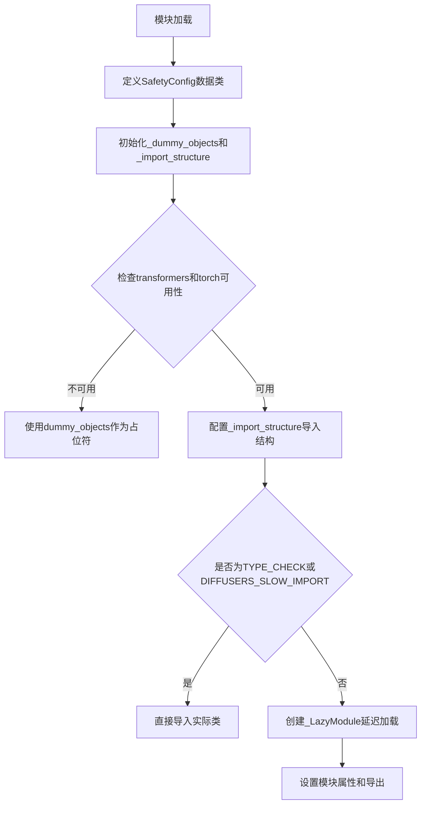
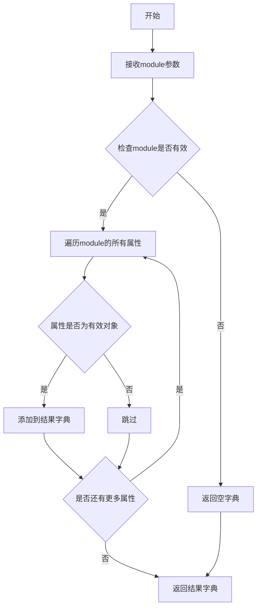
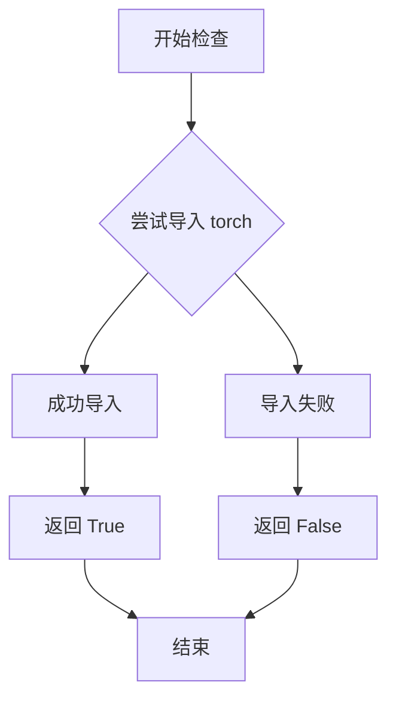
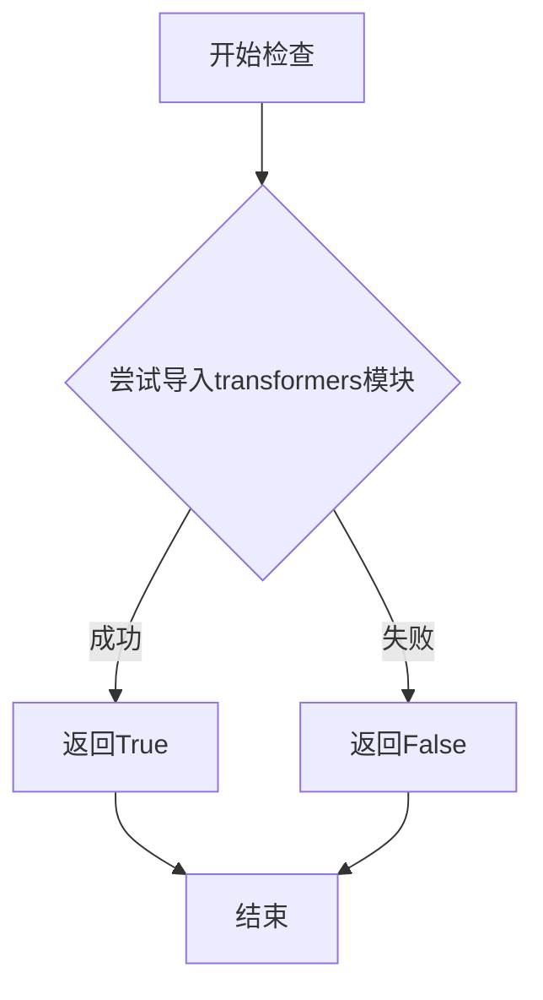

# `diffusers\src\diffusers\pipelines\stable_diffusion_safe\__init__.py` 详细设计文档

这是Diffusers库中Stable Diffusion安全流水线的模块初始化文件，主要定义了SafetyConfig安全配置数据类，并通过延迟加载机制处理torch和transformers可选依赖的导入，导出安全检查器和安全流水线相关类。

## 整体流程



## 类结构

```
SafetyConfig (数据类)
├── WEAK (弱安全配置)
├── MEDIUM (中等安全配置)
├── STRONG (强安全配置)
└── MAX (最大安全配置)
```

## 全局变量及字段


### `_dummy_objects`
    
存储不可用依赖的虚拟对象占位符

类型：`dict`
    


### `_additional_imports`
    
额外导入的模块映射

类型：`dict`
    


### `_import_structure`
    
定义模块的导入结构，用于延迟加载

类型：`dict`
    


### `SafetyConfig.WEAK`
    
弱级别安全配置，包含sld_warmup_steps、sld_guidance_scale等参数

类型：`dict`
    


### `SafetyConfig.MEDIUM`
    
中等级别安全配置

类型：`dict`
    


### `SafetyConfig.STRONG`
    
强级别安全配置

类型：`dict`
    


### `SafetyConfig.MAX`
    
最大级别安全配置

类型：`dict`
    
    

## 全局函数及方法


### `get_objects_from_module`

从指定的模块中提取所有可导入对象，并以字典形式返回，以便在懒加载模块中动态注册这些对象。

参数：

- `module`：`module`，要从中提取对象的模块，通常是包含虚拟（dummy）对象的模块，用于在可选依赖不可用时提供占位符

返回值：`dict`，键为对象名称，值为对象本身的字典

#### 流程图



#### 带注释源码

```
# 注：由于get_objects_from_module函数定义在...utils模块中，
# 以下是基于代码使用场景的推断实现

def get_objects_from_module(module):
    """
    从给定模块中提取所有可导入对象
    
    参数:
        module: 要从中提取对象的模块
        
    返回:
        包含模块中所有可导入对象的字典
    """
    # 初始化结果字典
    objects = {}
    
    # 遍历模块的所有属性
    for attr_name in dir(module):
        # 跳过私有属性和特殊属性
        if attr_name.startswith('_'):
            continue
            
        # 获取属性值
        attr_value = getattr(module, attr_name, None)
        
        # 如果属性值有效，则添加到结果字典
        if attr_value is not None:
            objects[attr_name] = attr_value
    
    return objects

# 在给定代码中的使用示例：
_dummy_objects.update(get_objects_from_module(dummy_torch_and_transformers_objects))
# 这行代码从dummy_torch_and_transformers_objects模块获取所有对象，
# 并将其添加到_dummy_objects字典中，用于在可选依赖不可用时提供占位符
```


### `is_torch_available`

该函数用于检查当前环境中 PyTorch 库是否可用。它是一个轻量级的依赖检查函数，通常在模块初始化时调用，以确保后续代码可以安全地使用 PyTorch 相关功能。

参数： 无

返回值：`bool`，返回 `True` 表示 PyTorch 可用，返回 `False` 表示 PyTorch 不可用。

#### 流程图



#### 带注释源码

```
# 注意：以下是 is_torch_available 函数的一种可能实现方式
# 该函数定义在 ...utils 模块中，此处为根据其使用方式的推测实现

def is_torch_available():
    """
    检查 PyTorch 库是否可用。
    
    此函数通常在模块初始化时调用，用于条件性地导入依赖或创建虚拟对象。
    当 PyTorch 不可用时，模块可以提供替代实现或优雅地处理缺失依赖的情况。
    
    Returns:
        bool: 如果 PyTorch 可用返回 True，否则返回 False
    """
    try:
        import torch
        return True
    except ImportError:
        return False

# 在代码中的实际使用方式：

# 1. 结合 is_transformers_available 一起使用，用于条件导入
try:
    if not (is_transformers_available() and is_torch_available()):
        raise OptionalDependencyNotAvailable()
except OptionalDependencyNotAvailable:
    # 导入虚拟对象作为占位符
    from ...utils import dummy_torch_and_transformers_objects
    _dummy_objects.update(get_objects_from_module(dummy_torch_and_transformers_objects))
else:
    # 当依赖可用时，定义实际的导入结构
    _import_structure.update(
        {
            "pipeline_output": ["StableDiffusionSafePipelineOutput"],
            "pipeline_stable_diffusion_safe": ["StableDiffusionPipelineSafe"],
            "safety_checker": ["StableDiffusionSafetyChecker"],
        }
    )

# 2. 在类型检查时（TYPE_CHECKING）或慢速导入模式（DIFFUSERS_SLOW_IMPORT）下再次检查
if TYPE_CHECKING or DIFFUSERS_SLOW_IMPORT:
    try:
        if not (is_transformers_available() and is_torch_available()):
            raise OptionalDependencyNotAvailable()
    except OptionalDependencyNotAvailable:
        from ...utils.dummy_torch_and_transformers_objects import *
    else:
        # 实际导入相关模块
        from .pipeline_output import StableDiffusionSafePipelineOutput
        from .pipeline_stable_diffusion_safe import StableDiffusionPipelineSafe
        from .safety_checker import SafeStableDiffusionSafetyChecker
```

---

### 补充说明

**使用场景分析：**

`is_torch_available()` 函数在此代码中扮演着关键的依赖管理角色：

1. **延迟导入（Lazy Loading）策略**：通过 `is_torch_available()` 检查，模块可以在运行时根据 PyTorch 是否可用来决定是导入真实对象还是虚拟占位符对象。

2. **优雅降级**：当 PyTorch 不可用时，模块不会直接崩溃，而是使用 `_dummy_objects` 中定义的虚拟对象作为替代，保持 API 的一致性。

3. **条件导入**：在 `TYPE_CHECKING` 模式下（IDE 进行类型检查时），该函数确保类型提示可以正常工作，同时避免实际导入可能不存在的模块。

**技术债务/优化空间：**

- 当前实现中 `is_torch_available()` 被调用多次（至少2次），可以考虑缓存结果以提高性能
- 依赖检查逻辑可以抽象为通用的 `check_dependencies()` 函数，减少重复代码

**注意事项：**

由于 `is_torch_available()` 定义在 `...utils` 模块中（上层包的 utils 包），实际的完整实现需要参考该模块的源代码。以上源码为基于使用模式的合理推测。


### `is_transformers_available`

该函数用于检查当前环境中 `transformers` 库是否可用，通常用于条件导入和可选依赖处理。

参数：无参数

返回值：`bool`，返回 `True` 表示 `transformers` 库已安装且可用，返回 `False` 表示不可用。

#### 流程图



#### 带注释源码

```
# 该函数定义在 diffusers 库的 utils 模块中
# 以下为推断的函数实现逻辑

def is_transformers_available():
    """
    检查 transformers 库是否可用于导入。
    
    实现方式可能为：
    1. 尝试 import transformers 并捕获 ImportError
    2. 或检查指定版本的 transformers 是否满足要求
    """
    try:
        # 尝试导入 transformers 模块
        import transformers
        return True
    except ImportError:
        return False

# 在当前代码中的使用方式：
try:
    if not (is_transformers_available() and is_torch_available()):
        raise OptionalDependencyNotAvailable()
except OptionalDependencyNotAvailable:
    # 导入虚拟对象作为替代
    from ...utils import dummy_torch_and_transformers_objects
    _dummy_objects.update(get_objects_from_module(dummy_torch_and_transformers_objects))
else:
    # 导入真实的实现
    _import_structure.update({
        "pipeline_output": ["StableDiffusionSafePipelineOutput"],
        "pipeline_stable_diffusion_safe": ["StableDiffusionPipelineSafe"],
        "safety_checker": ["StableDiffusionSafetyChecker"],
    })
```

> **注意**：由于 `is_transformers_available` 函数定义在 `diffusers` 库的 `utils` 模块中（通过相对导入 `from ...utils import is_transformers_available`），其完整源代码不在当前文件内。上面的源码是根据其在项目中的典型使用方式和功能推断的实现逻辑。


### `_LazyModule`（延迟加载模块）

该代码展示了如何使用 `_LazyModule` 类实现模块的延迟加载（Lazy Loading），通过在运行时动态导入子模块和对象，避免在导入时就加载所有依赖，从而提升导入速度并优化资源占用。

参数：

- `__name__`：`str`，当前模块的名称（`__name__`）
- `globals()["__file__"]`：`str`，模块文件的绝对路径
- `_import_structure`：`dict`，模块的导入结构定义，键为子模块名，值为导出的对象列表
- `module_spec`：`ModuleSpec`，模块的规格信息（`__spec__`）

返回值：`LazyModule`，延迟加载的模块对象

#### 流程图

```mermaid
flowchart TD
    A[模块导入开始] --> B{检查 TYPE_CHECKING 或 DIFFUSERS_SLOW_IMPORT}
    B -->|是| C[直接导入真实模块]
    B -->|否| D[使用 _LazyModule 延迟加载]
    
    C --> E[从 .pipeline_output 导入 StableDiffusionSafePipelineOutput]
    C --> F[从 .pipeline_stable_diffusion_safe 导入 StableDiffusionPipelineSafe]
    C --> G[从 .safety_checker 导入 SafeStableDiffusionSafetyChecker]
    
    D --> H[创建 LazyModule 对象]
    H --> I[替换 sys.modules[__name__] 为 LazyModule]
    I --> J[设置 _dummy_objects 到模块属性]
    J --> K[设置 _additional_imports 到模块属性]
    
    L[后续代码访问模块属性] --> M{LazyModule 是否已加载}
    M -->|否| N[触发实际导入]
    M -->|是| O[返回缓存的对象]
```

#### 带注释源码

```python
# 如果在类型检查或慢导入模式下
if TYPE_CHECKING or DIFFUSERS_SLOW_IMPORT:
    try:
        # 检查依赖是否可用
        if not (is_transformers_available() and is_torch_available()):
            raise OptionalDependencyNotAvailable()
    except OptionalDependencyNotAvailable:
        # 依赖不可用时，导入虚拟对象
        from ...utils.dummy_torch_and_transformers_objects import *
    else:
        # 依赖可用时，直接导入真实模块（立即加载）
        from .pipeline_output import StableDiffusionSafePipelineOutput
        from .pipeline_stable_diffusion_safe import StableDiffusionPipelineSafe
        from .safety_checker import SafeStableDiffusionSafetyChecker

else:
    # 正常运行时，使用 _LazyModule 实现延迟加载
    import sys

    # 使用 _LazyModule 替换当前模块为延迟加载模块
    sys.modules[__name__] = _LazyModule(
        __name__,                      # 模块名
        globals()["__file__"],         # 模块文件路径
        _import_structure,             # 导入结构定义
        module_spec=__spec__,          # 模块规格
    )

    # 将虚拟对象（依赖不可用时的替代品）添加到模块属性
    for name, value in _dummy_objects.items():
        setattr(sys.modules[__name__], name, value)
    
    # 将额外导入（如 SafetyConfig）添加到模块属性
    for name, value in _additional_imports.items():
        setattr(sys.modules[__name__], name, value)
```

### 关键组件信息

| 组件名称 | 一句话描述 |
|---------|-----------|
| `_import_structure` | 字典结构，定义模块的导入结构和可导出的对象列表 |
| `_dummy_objects` | 虚拟对象字典，当依赖不可用时作为替代品 |
| `_additional_imports` | 额外导入项字典，如 `SafetyConfig` |
| `TYPE_CHECKING` | 标志位，表示是否处于类型检查模式 |
| `DIFFUSERS_SLOW_IMPORT` | 标志位，表示是否启用慢导入模式（立即加载所有模块） |

### 潜在技术债务与优化空间

1. **双重导入路径**：代码在 `if` 分支和 `else` 分支中都有类似的导入逻辑，造成重复代码，可以提取为公共函数
2. **魔法字符串**：模块名和导入结构中的字符串字面量散落各处，建议统一管理
3. **异常处理嵌套**：`try-except` 嵌套在 `if` 语句内部，逻辑较为复杂，可考虑重构为更清晰的错误处理流程
4. **模块规格依赖**：代码依赖 `__spec__` 变量，需要确保在所有场景下该变量都可用

### 其它项目说明

**设计目标与约束**：
- 目标：实现依赖的延迟加载，提升库的整体导入性能
- 约束：需要同时支持类型检查（IDE）和运行时两种模式

**错误处理与异常设计**：
- 使用 `OptionalDependencyNotAvailable` 异常标记可选依赖的不可用状态
- 通过虚拟对象（dummy objects）保证代码在依赖缺失时仍可导入

**数据流与状态机**：
- 模块加载状态：`未加载` → `延迟加载代理` → `真实模块`
- 访问模块属性时触发实际导入（首次访问时）

**外部依赖与接口契约**：
- 依赖：`is_torch_available()`、`is_transformers_available()` - 检查可选依赖
- 依赖：`_LazyModule` 类 - 实现延迟加载机制
- 依赖：`get_objects_from_module()` - 从模块获取对象列表

## 关键组件


### SafetyConfig

安全配置数据类，定义了四个级别的安全检查强度（WEAK、MEDIUM、STRONG、MAX），每个级别包含 SLDE 安全相关的参数配置，包括 warmup_steps、guidance_scale、threshold、momentum_scale 和 mom_beta。

### 延迟加载机制（_LazyModule）

通过 `_LazyModule` 实现模块的惰性加载，配合 `sys.modules` 动态注册，确保在真正需要时才导入重量级依赖（torch、transformers），优化导入速度。

### 可选依赖检查

使用 `is_torch_available()` 和 `is_transformers_available()` 检查运行时环境是否安装 PyTorch 和 Transformers，提供 `OptionalDependencyNotAvailable` 异常处理，在依赖缺失时回退到 dummy 对象。

### 导入结构管理（_import_structure）

维护模块的公开接口映射，定义在 TYPE_CHECKING 或延迟加载时可用的类（StableDiffusionSafePipelineOutput、StableDiffusionPipelineSafe、SafeStableDiffusionSafetyChecker）。

### 虚拟对象模式（_dummy_objects）

当可选依赖不可用时，通过 `get_objects_from_module` 从 dummy 模块获取替代对象，确保模块仍可导入但功能受限，避免运行时 ImportError。


## 问题及建议


### 已知问题

-   **SafetyConfig 设计不当**：使用 `@dataclass` 但未设置 `frozen=True`，且所有配置作为类变量（字典）存储，而非实例字段，导致实例化后仍可被修改，违背了配置对象的不可变性原则
-   **类型注解缺失**：`SafetyConfig` 的所有字典字段均无类型注解，降低了代码的可读性和静态检查能力
-   **重复的条件判断**：`is_transformers_available() and is_torch_available()` 的检查在代码中出现了三次（try 块、TYPE_CHECKING 块、else 块），违反 DRY 原则
-   **导入命名不一致**：在 `TYPE_CHECKING` 分支中导入的是 `SafeStableDiffusionSafetyChecker`，但在 `_import_structure` 中定义的键是 `StableDiffusionSafetyChecker`，可能导致运行时行为不一致
-   **初始化逻辑冗余**：先定义 `_additional_imports = {}`，随后立即执行 `.update()` 操作，这种模式不够清晰
-   **魔法数字和硬编码**：安全配置阈值（如 guidance_scale、threshold 等）作为魔法数字硬编码在字典中，缺乏常量定义和注释说明其含义

### 优化建议

-   将 `SafetyConfig` 改为具有明确类型注解的不可变 dataclass（添加 `frozen=True`），或将配置定义为正式的类或 Enum，提高类型安全性
-   提取重复的条件检查逻辑到私有函数中，例如 `_check_dependencies()`，减少代码重复
-   统一导入命名，确保 `_import_structure` 中的键与实际导入的类名一致，避免潜在的导入错误
-   为配置值添加类型注解和文档注释，说明各参数的作用和推荐场景
-   考虑使用 `Final` 类型或 Enum 来定义预定义的安全级别配置，增强代码的表达力和可维护性

## 其它


### 设计目标与约束

**设计目标**：提供一个安全的Stable Diffusion Pipeline实现，通过可配置的安全检查器来过滤不适内容，支持WEAK、MEDIUM、STRONG、MAX四种安全级别，并实现延迟加载机制以优化导入性能。

**约束条件**：
- 依赖PyTorch和Transformers库，必须在运行时可用
- 采用LazyModule模式实现延迟导入，避免不必要的模块加载
- SafetyConfig采用数据类实现，提供不可变的配置字典
- 兼容Diffusers库的模块导入规范

### 错误处理与异常设计

**OptionalDependencyNotAvailable**：当torch或transformers库不可用时，抛出此异常并回退到虚拟对象（dummy objects），确保模块结构完整但功能不可用。

**模块加载流程错误捕获**：
- 使用try-except捕获OptionalDependencyNotAvailable异常
- 通过_dummy_objects字典存储虚拟对象，供类型检查和延迟导入使用
- TYPE_CHECKING模式下直接导入真实对象，否则使用_LazyModule动态加载

### 数据流与状态机

**模块初始化状态机**：
1. **初始状态**：定义_import_structure、_dummy_objects、_additional_imports字典
2. **依赖检查状态**：检查is_transformers_available()和is_torch_available()
3. **可用状态**：若依赖满足，填充_import_structure并准备导出真实类
4. **不可用状态**：若依赖缺失，导入dummy对象作为后备
5. **Lazy加载状态**：非TYPE_CHECKING模式下，模块被替换为_LazyModule实现延迟加载

**配置数据流**：
- SafetyConfig作为静态配置容器，通过类属性（WEAK/MEDIUM/STRONG/MAX）提供预定义安全参数
- 配置参数包括：sld_warmup_steps（预热步数）、sld_guidance_scale（引导尺度）、sld_threshold（阈值）、sld_momentum_scale（动量尺度）、sld_mom_beta（动量衰减系数）

### 外部依赖与接口契约

**显式依赖**：
- `numpy`：数值计算
- `PIL`（Pillow）：图像处理
- `dataclasses`：配置数据类定义
- `typing.TYPE_CHECKING`：类型检查支持

**可选依赖**：
- `torch`：深度学习框架（is_torch_available()）
- `transformers`：Transformer模型库（is_transformers_available()）

**内部依赖**：
- `...utils`：包含BaseOutput、OptionalDependencyNotAvailable、_LazyModule、get_objects_from_module等工具
- `.pipeline_output`：StableDiffusionSafePipelineOutput类
- `.pipeline_stable_diffusion_safe`：StableDiffusionPipelineSafe类
- `.safety_checker`：SafeStableDiffusionSafetyChecker类

**模块导出接口**：
- SafetyConfig：安全配置数据类
- StableDiffusionSafePipelineOutput：Pipeline输出类
- StableDiffusionPipelineSafe：安全Pipeline类
- StableDiffusionSafetyChecker/SafeStableDiffusionSafetyChecker：安全检查器类

### 其它项目

**版本兼容性考虑**：代码通过DIFFUSERS_SLOW_IMPORT标志控制导入模式，支持快速导入（生产环境）和完整导入（类型检查/开发环境）两种模式。

**类型安全**：使用TYPE_CHECKING条件导入，在运行时避免导入重型模块，同时保持静态类型检查能力。

**模块规范遵循**：完全遵循Python模块规范和Diffusers库约定，使用__spec__属性和sys.modules动态注册，支持from ... import *语法。


    