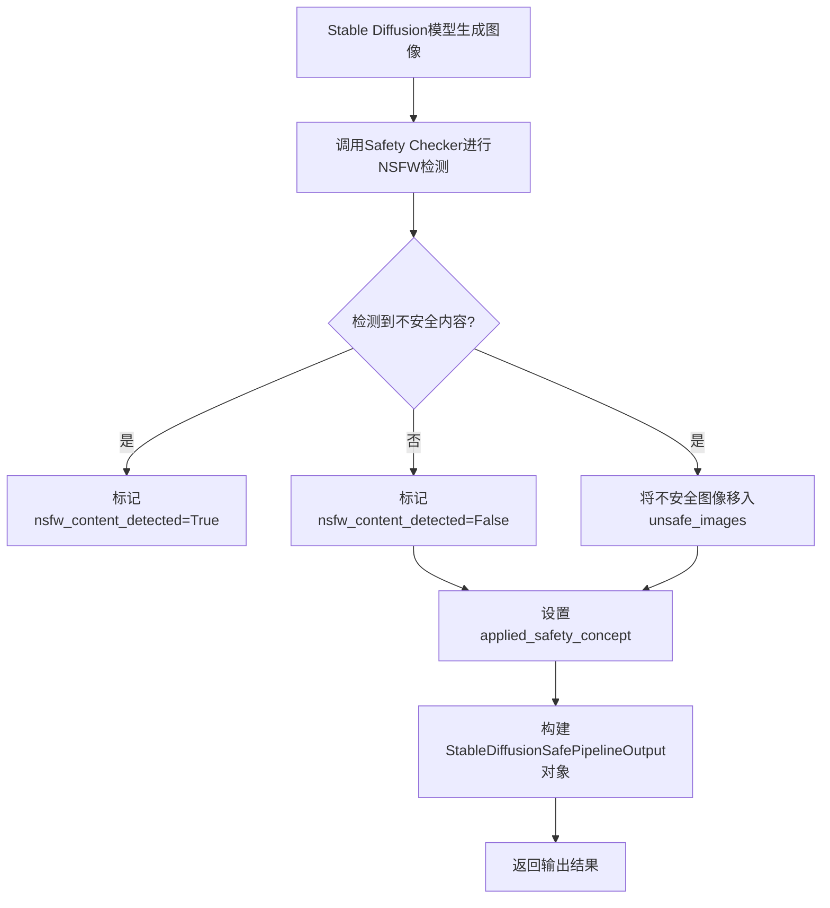

# `diffusers\src\diffusers\pipelines\stable_diffusion_safe\pipeline_output.py` 详细设计文档

这是一个安全稳定扩散管道（Safe Stable Diffusion Pipeline）的输出类，用于封装图像生成结果，包含生成的图像、NSFW内容检测标记、不安全图像以及应用的安全概念，用于在生成过程中进行内容安全检查和过滤。

## 整体流程



## 类结构

```
BaseOutput (抽象基类)
└── StableDiffusionSafePipelineOutput (数据类)
```

## 全局变量及字段


### `StableDiffusionSafePipelineOutput.images`
    
生成的图像列表或numpy数组

类型：`list[PIL.Image.Image] | np.ndarray`
    


### `StableDiffusionSafePipelineOutput.nsfw_content_detected`
    
NSFW内容检测标记列表

类型：`list[bool] | None`
    


### `StableDiffusionSafePipelineOutput.unsafe_images`
    
被标记为不安全的图像

类型：`list[PIL.Image.Image] | np.ndarray | None`
    


### `StableDiffusionSafePipelineOutput.applied_safety_concept`
    
应用的安全概念

类型：`str | None`
    
    

## 全局函数及方法


## 关键组件


### StableDiffusionSafePipelineOutput

安全稳定扩散管道的输出数据类，封装了生成的图像、NSFW内容检测结果、不安全图像以及应用的安全概念信息。

### images

生成的图像列表或numpy数组，类型为 `list[PIL.Image.Image] | np.ndarray`，表示去噪后的图像输出。

### nsfw_content_detected

NSFW内容检测标志列表，类型为 `list[bool] | None`，标记对应生成的图像是否可能包含"不适合工作"内容。

### unsafe_images

被安全检查器标记为不安全的图像，类型为 `list[PIL.Image.Image] | np.ndarray | None`，可能包含NSFW内容的图像。

### applied_safety_concept

应用的安全概念字符串，类型为 `str | None`，表示用于安全指导的安全概念，若安全指导禁用则为None。

### BaseOutput

基础输出类，被 StableDiffusionSafePipelineOutput 继承的父类，定义了管道的通用输出接口。

### 类型注解系统

使用Python类型注解定义字段类型，支持联合类型表示（如 `|` 操作符），支持PIL图像、numpy数组、列表和可选类型。


## 问题及建议


### 已知问题

-   **文档字符串参数重复定义**：`images` 参数在文档字符串中被定义了两次，第二次应该是描述 `unsafe_images` 字段
-   **文档字符串拼写错误**：描述 `unsafe_images` 时使用了 "any may contain" 应改为 "and may contain"
-   **字段缺少默认值**：根据文档描述，`nsfw_content_detected`、`unsafe_images` 和 `applied_safety_concept` 都可以为 `None`，但均未设置默认值，可能导致实例化时的不一致性
-   **类型注解兼容性**：使用了 Python 3.10+ 的联合类型注解 `|` 运算符，未考虑兼容 Python 3.9 及以下版本的使用场景
-   **文档注释与类型不匹配**：文档描述中提到 `images` 可以是 `list` 或 `np.ndarray`，但没有明确说明这两种情况的具体使用场景和差异

### 优化建议

-   修正文档字符串：将重复的 `images` 参数描述改为 `unsafe_images` 的描述，并修正拼写错误
-   考虑使用 `Optional` 类型注解替代 `|` 运算符以提高兼容性，或在项目配置中明确最低 Python 版本要求
-   为可空字段添加默认值 `None`，例如：`nsfw_content_detected: list[bool] | None = None`
-   增强文档说明：明确 `images` 和 `unsafe_images` 在不同情况下的返回值含义，特别是 `None` 状态的具体场景
-   考虑添加 `__post_init__` 验证方法，确保 `images` 和 `unsafe_images` 的类型一致性或互斥关系


## 其它


### 设计目标与约束

该类作为 Stable Diffusion 安全管道的输出数据容器，目标是标准化管道输出格式，统一管理生成的图像、NSFW 检测结果、不安全图像和安全概念应用状态。设计约束包括：必须继承自 BaseOutput 以保持与管道基类的一致性；字段类型必须支持 PIL.Image 和 numpy array 两种图像格式；所有字段均允许为 None 以表示未执行相应检查的情况。

### 错误处理与异常设计

由于该类为纯数据容器（dataclass），不包含业务逻辑，错误处理主要依赖于类型检查和调用方的验证。可添加的改进包括：在 `__post_init__` 方法中验证 images 长度与 nsfw_content_detected 长度一致性；验证 unsafe_images 长度与 images 长度的匹配性；当 applied_safety_concept 不为 None 时，确保 nsfw_content_detected 存在有效值。当前版本未包含运行时验证，依赖调用方保证数据一致性。

### 数据流与状态机

该类的数据流从 StableDiffusionSafePipeline 流向调用方。典型流程为：管道执行图像生成 → 安全检查器检测 NSFW 内容 → 如检测到 NSFW，应用安全概念进行引导（如启用内容过滤） → 生成最终输出对象。状态转换主要体现在 applied_safety_concept 字段：当为 None 时表示未启用安全引导；当为具体概念字符串时表示已应用安全引导。nsfw_content_detected 和 unsafe_images 字段反映安全检查的结果状态。

### 外部依赖与接口契约

该类依赖以下外部组件：PIL.Image 用于图像处理；numpy 用于数值数组操作；...utils.BaseOutput 作为父类定义管道输出的基础接口。接口契约要求：images 字段必须为 list[PIL.Image.Image] 或 np.ndarray 类型；nsfw_content_detected 必须为 list[bool] 或 None；unsafe_images 必须与 images 长度一致或为 None；applied_safety_concept 必须为字符串或 None。调用方应保证遵守类型约定。

### 性能考虑

该类本身不涉及计算，但存储大型批次的图像时需考虑内存占用。建议：对于大批次生成场景，考虑使用图像路径而非完整图像数据存储；必要时可添加 lazy loading 机制延迟加载图像数据；unsafe_images 与 images 可能存在重复引用，需注意内存峰值。

### 序列化与反序列化

当前类未实现自定义序列化方法。扩展建议：可添加 to_dict() 和 from_dict() 类方法支持字典序列化；可实现 __getstate__ 和 __setstate__ 支持 pickle 序列化；对于大规模应用，可考虑实现 JSON 序列化并处理 numpy array 与 PIL Image 的转换。

### 测试建议

建议添加以下测试用例：类型验证测试（验证各字段类型符合注解）；长度一致性测试（验证 images 与 nsfw_content_detected 长度匹配）；None 值处理测试（验证各字段为 None 时的行为）；图像格式兼容性测试（验证 PIL Image 和 numpy array 两种输入的兼容性）；与 BaseOutput 继承关系测试（验证父类方法可用性）。

### 扩展性考虑

当前设计具有良好的扩展性，可通过以下方式扩展：添加 timestamp 字段记录生成时间；添加 seed 字段记录随机种子便于复现；添加 prompt 和 negative_prompt 字段保存输入提示词；添加 generation_params 字典保存详细生成参数；添加 quality_score 字段存储图像质量评分。


    