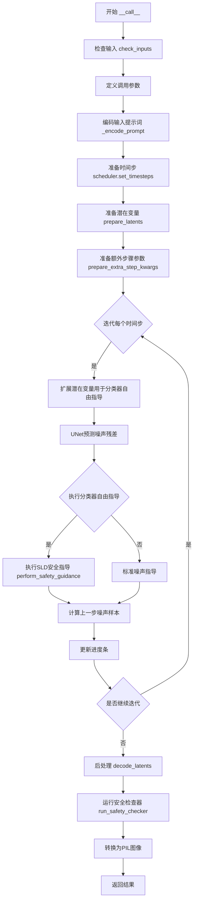
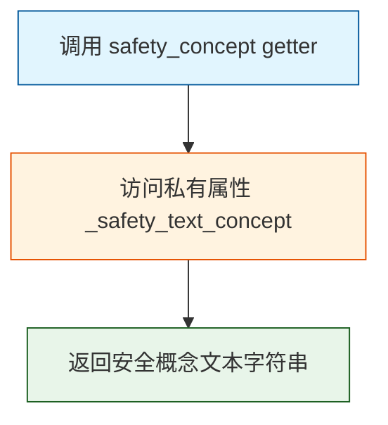
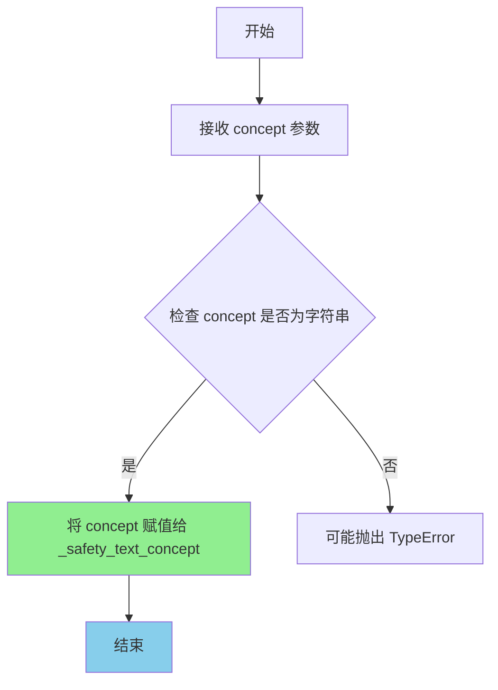
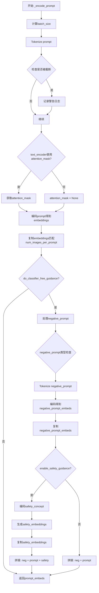
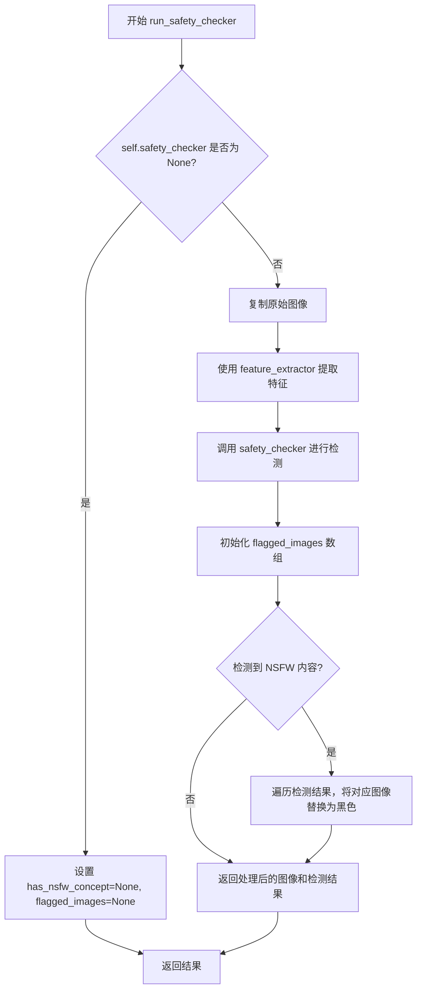
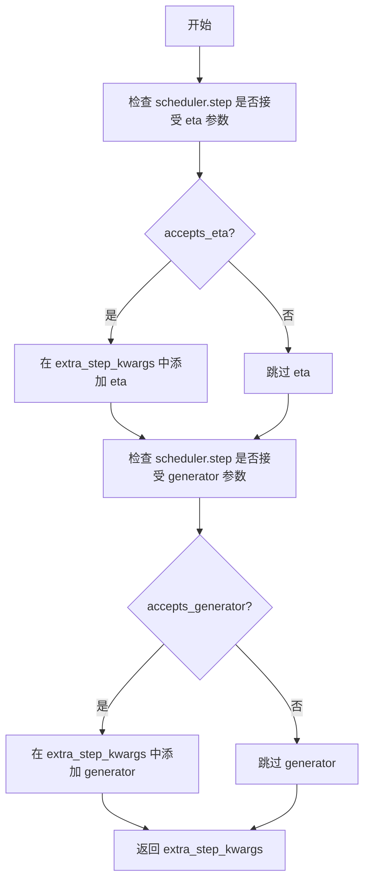
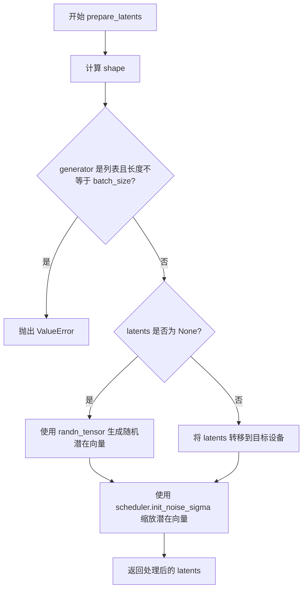
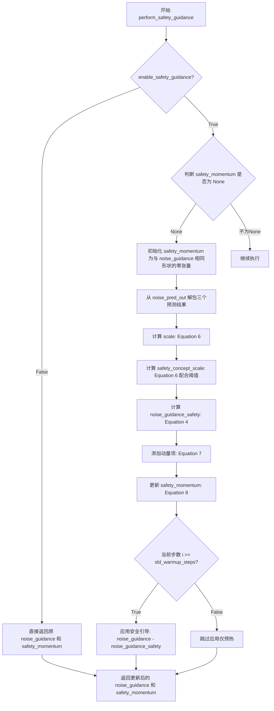
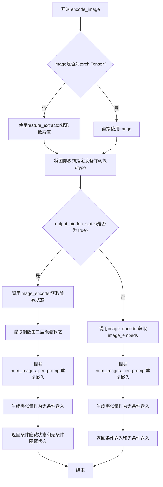
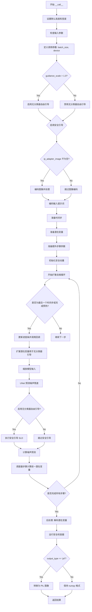

# `diffusers\src\diffusers\pipelines\stable_diffusion_safe\pipeline_stable_diffusion_safe.py` 详细设计文档

这是一个基于Stable Diffusion的文本到图像生成管道，集成了Safe Latent Diffusion (SLD) 安全指导功能，用于在生成过程中检测和抑制潜在的不当内容，确保生成的图像符合安全标准。

## 整体流程



## 类结构

```
StableDiffusionPipelineSafe (主管道类)
├── 继承自: DeprecatedPipelineMixin
├── 继承自: DiffusionPipeline
├── 继承自: StableDiffusionMixin
└── 继承自: IPAdapterMixin
```

## 全局变量及字段


### `logger`
    
Logger instance for the module, used to log warnings and deprecation messages

类型：`logging.Logger`
    


### `XLA_AVAILABLE`
    
Boolean flag indicating whether PyTorch XLA is available for TPU acceleration

类型：`bool`
    


### `StableDiffusionPipelineSafe._last_supported_version`
    
String indicating the last supported version of the pipeline (0.33.1)

类型：`str`
    


### `StableDiffusionPipelineSafe.model_cpu_offload_seq`
    
String defining the sequence for CPU offload of models (text_encoder->unet->vae)

类型：`str`
    


### `StableDiffusionPipelineSafe._optional_components`
    
List of optional components that can be None (safety_checker, feature_extractor, image_encoder)

类型：`list[str]`
    


### `StableDiffusionPipelineSafe._safety_text_concept`
    
Private field storing the safety concept text used for Safe Latent Diffusion (SLD)

类型：`str | None`
    


### `StableDiffusionPipelineSafe.vae_scale_factor`
    
Scale factor derived from VAE block_out_channels, used for latent space scaling

类型：`int`
    
    

## 全局函数及方法


### `StableDiffusionPipelineSafe.__init__`

该方法是 `StableDiffusionPipelineSafe` 类的构造函数，负责初始化基于 Safe Latent Diffusion 的文本到图像生成管道。它接收并实例化 VAE、文本编码器、UNet、调度器及安全检查器等核心模型组件，并在初始化过程中自动校验配置参数（如 `steps_offset`、`clip_sample`、`sample_size`）的合法性，进行警告提示或自动修正，以确保生成结果的正确性。

参数：

-  `vae`：`AutoencoderKL`，用于将图像编码为潜在表示并解码回图像的变分自编码器模型。
-  `text_encoder`：`CLIPTextModel`，冻结的文本编码器（clip-vit-large-patch14），用于将文本提示转换为嵌入向量。
-  `tokenizer`：`CLIPTokenizer`，用于对文本进行分词处理的 tokenizer。
-  `unet`：`UNet2DConditionModel`，根据文本嵌入去噪图像潜在表示的 UNet 模型。
-  `scheduler`：`KarrasDiffusionSchedulers`，与 `unet` 结合用于去噪图像潜在表示的调度器。
-  `safety_checker`：`SafeStableDiffusionSafetyChecker`，用于评估生成图像是否包含令人反感或有害内容的分类模块。
-  `feature_extractor`：`CLIPImageProcessor`，用于从生成图像中提取特征并输入到 `safety_checker` 的图像处理器。
-  `image_encoder`：`CLIPVisionModelWithProjection | None`，可选的图像编码器，用于支持 IP Adapters。
-  `requires_safety_checker`：`bool`，是否要求启用安全检查器。默认为 `True`。

返回值：`None`，构造函数不返回任何值。

#### 流程图

```mermaid
graph TD
    A[Start __init__] --> B[Call super().__init__]
    B --> C[Define default safety_concept]
    C --> D{Check scheduler.config.steps_offset != 1?}
    D -- Yes --> E[Deprecate & Fix steps_offset to 1]
    E --> F{Check scheduler.config.clip_sample is True?}
    D -- No --> F
    F -- Yes --> G[Deprecate & Fix clip_sample to False]
    F -- No --> H{safety_checker is None and requires_safety_checker is True?}
    G --> H
    H -- Yes --> I[Log Warning: Safety checker disabled]
    H --> J{safety_checker is not None and feature_extractor is None?}
    I --> J
    J -- Yes --> K[Raise ValueError: Feature extractor missing]
    J --> L{Check UNet version < 0.9.0 & sample_size < 64?}
    K --> M[End Initialization]
    L -- Yes --> N[Deprecate & Fix sample_size to 64]
    L -- No --> O[Register Modules: vae, text_encoder, tokenizer, unet, etc.]
    N --> O
    O --> P[Set self._safety_text_concept]
    P --> Q[Calculate self.vae_scale_factor]
    Q --> R[Register to config: requires_safety_checker]
    R --> M
```

#### 带注释源码

```python
def __init__(
    self,
    vae: AutoencoderKL,
    text_encoder: CLIPTextModel,
    tokenizer: CLIPTokenizer,
    unet: UNet2DConditionModel,
    scheduler: KarrasDiffusionSchedulers,
    safety_checker: SafeStableDiffusionSafetyChecker,
    feature_extractor: CLIPImageProcessor,
    image_encoder: CLIPVisionModelWithProjection | None = None,
    requires_safety_checker: bool = True,
):
    # 调用父类构造函数，初始化管道基础结构
    super().__init__()
    
    # 定义默认的安全概念文本，用于引导模型避免生成特定类型的敏感内容
    safety_concept: str | None = (
        "an image showing hate, harassment, violence, suffering, humiliation, harm, suicide, sexual, nudity,"
        " bodily fluids, blood, obscene gestures, illegal activity, drug use, theft, vandalism, weapons, child"
        " abuse, brutality, cruelty"
    )

    # --- 调度器 (Scheduler) 配置校验 ---
    # 检查 steps_offset 是否符合最新规范 (应为 1)
    if scheduler is not None and getattr(scheduler.config, "steps_offset", 1) != 1:
        deprecation_message = (...)
        deprecate("steps_offset!=1", "1.0.0", deprecation_message, standard_warn=False)
        # 自动修正配置
        new_config = dict(scheduler.config)
        new_config["steps_offset"] = 1
        scheduler._internal_dict = FrozenDict(new_config)

    # 检查 clip_sample 配置 (通常应关闭以获得更准确结果)
    if scheduler is not None and getattr(scheduler.config, "clip_sample", False) is True:
        deprecation_message = (...)
        deprecate("clip_sample not set", "1.0.0", deprecation_message, standard_warn=False)
        new_config = dict(scheduler.config)
        new_config["clip_sample"] = False
        scheduler._internal_dict = FrozenDict(new_config)

    # --- 安全检查器 (Safety Checker) 校验 ---
    # 如果禁用了安全检查器但要求必须启用，发出警告
    if safety_checker is None and requires_safety_checker:
        logger.warning(
            f"You have disabled the safety checker for {self.__class__} by passing `safety_checker=None`..."
        )

    # 如果启用了安全检查器但未提供特征提取器，抛出错误
    if safety_checker is not None and feature_extractor is None:
        raise ValueError(
            "Make sure to define a feature extractor when loading {self.__class__} if you want to use the safety"
            " checker..."
        )

    # --- UNet 配置校验 ---
    # 检查模型版本和 sample_size，针对旧版检查点可能存在的不兼容配置进行警告和修正
    is_unet_version_less_0_9_0 = (...)
    is_unet_sample_size_less_64 = (...)
    if is_unet_version_less_0_9_0 and is_unet_sample_size_less_64:
        deprecation_message = (...)
        deprecate("sample_size<64", "1.0.0", deprecation_message, standard_warn=False)
        new_config = dict(unet.config)
        new_config["sample_size"] = 64
        unet._internal_dict = FrozenDict(new_config)

    # --- 注册模块 ---
    # 将所有核心组件注册到管道中，以便保存和加载
    self.register_modules(
        vae=vae,
        text_encoder=text_encoder,
        tokenizer=tokenizer,
        unet=unet,
        scheduler=scheduler,
        safety_checker=safety_checker,
        feature_extractor=feature_extractor,
        image_encoder=image_encoder,
    )
    
    # 保存安全概念文本
    self._safety_text_concept = safety_concept
    
    # 计算 VAE 的缩放因子，用于调整潜在空间的大小
    self.vae_scale_factor = 2 ** (len(self.vae.config.block_out_channels) - 1) if getattr(self, "vae", None) else 8
    
    # 将 requires_safety_checker 注册到配置中
    self.register_to_config(requires_safety_checker=requires_safety_checker)
```


### `StableDiffusionPipelineSafe.safety_concept` (getter)

这是一个属性 getter 方法，用于获取当前管道使用的安全概念（safety concept）。该安全概念用于 SLD（Safe Latent Diffusion）安全潜在扩散技术，帮助模型避免生成不当内容。

参数：

- （无显式参数，隐式参数 `self` 为 `StableDiffusionPipelineSafe` 实例）

返回值：`str`，返回描述安全概念的文本内容。

#### 流程图



#### 带注释源码

```python
@property
def safety_concept(self):
    r"""
    Getter method for the safety concept used with SLD
    （用于 SLD 的安全概念的 getter 方法）

    Returns:
        `str`: The text describing the safety concept
        （返回：str 类型，描述安全概念的文本）
    """
    # 返回私有实例变量 _safety_text_concept
    # 该变量在 __init__ 方法中被初始化为一段描述性文本
    # 包含仇恨、骚扰、暴力、痛苦、羞辱、伤害、自杀、性、裸露等不当内容类别
    return self._safety_text_concept
```


### `StableDiffusionPipelineSafe.safety_concept (setter)`

属性 setter 方法，用于设置 Safe Latent Diffusion (SLD) 安全引导机制所使用的安全概念文本。

参数：

- `concept`：`str`，新的安全概念文本内容

返回值：`None`，无返回值（setter 方法）

#### 流程图



#### 带注释源码

```python
@safety_concept.setter
def safety_concept(self, concept):
    r"""
    Setter method for the safety concept used with SLD

    Args:
        concept (`str`):
            The text of the new safety concept
    """
    # 将传入的安全概念文本赋值给内部私有变量
    # 该变量用于在 _encode_prompt 方法中编码安全概念
    # 以便在生成图像时引导模型避免产生不安全内容
    self._safety_text_concept = concept
```


### `StableDiffusionPipelineSafe._encode_prompt`

该方法负责将文本提示（prompt）编码为文本encoder的隐藏状态（hidden states），支持分类器自由引导（Classifier-Free Guidance）和安全潜在扩散（Safe Latent Diffusion）的安全引导功能。它会分别处理正面提示、负面提示和安全概念提示，并将它们拼接后返回给UNet进行去噪处理。

参数：

- `prompt`：`str` 或 `list[str]`，要编码的文本提示词，用于指导图像生成
- `device`：`torch.device`，PyTorch设备，用于指定计算将在哪个设备上进行
- `num_images_per_prompt`：`int`，每个提示词需要生成的图像数量，用于复制embeddings
- `do_classifier_free_guidance`：`bool`，是否启用分类器自由引导，当guidance_scale > 1时为True
- `negative_prompt`：`str` 或 `list[str]`，负面提示词，用于指导不包含在图像中的内容
- `enable_safety_guidance`：`bool`，是否启用安全引导（SLD），用于避免生成不安全内容

返回值：`torch.Tensor`，返回拼接后的prompt embeddings，形状为 `(batch_size * num_images_per_prompt, seq_len, hidden_size)`，包含负面embeddings、正面embeddings（以及可选的安全embeddings）

#### 流程图



#### 带注释源码

```python
def _encode_prompt(
    self,
    prompt,  # str或list[str]: 正面提示词
    device,  # torch.device: 计算设备
    num_images_per_prompt,  # int: 每个提示生成的图像数
    do_classifier_free_guidance,  # bool: 是否启用CFG
    negative_prompt,  # str或list[str]: 负面提示词
    enable_safety_guidance,  # bool: 是否启用SLD安全引导
):
    # 1. 确定批次大小
    batch_size = len(prompt) if isinstance(prompt, list) else 1

    # 2. 使用tokenizer将prompt转换为token ids
    text_inputs = self.tokenizer(
        prompt,
        padding="max_length",
        max_length=self.tokenizer.model_max_length,
        truncation=True,
        return_tensors="pt",
    )
    text_input_ids = text_inputs.input_ids
    
    # 3. 获取未截断的token ids用于比较
    untruncated_ids = self.tokenizer(prompt, padding="max_length", return_tensors="pt").input_ids

    # 4. 检查是否发生截断，如果是则记录警告
    if not torch.equal(text_input_ids, untruncated_ids):
        removed_text = self.tokenizer.batch_decode(untruncated_ids[:, self.tokenizer.model_max_length - 1 : -1])
        logger.warning(
            "The following part of your input was truncated because CLIP can only handle sequences up to"
            f" {self.tokenizer.model_max_length} tokens: {removed_text}"
        )

    # 5. 获取attention_mask（如果text_encoder支持）
    if hasattr(self.text_encoder.config, "use_attention_mask") and self.text_encoder.config.use_attention_mask:
        attention_mask = text_inputs.attention_mask.to(device)
    else:
        attention_mask = None

    # 6. 使用text_encoder编码prompt得到embeddings
    prompt_embeds = self.text_encoder(
        text_input_ids.to(device),
        attention_mask=attention_mask,
    )
    prompt_embeds = prompt_embeds[0]  # 取hidden states

    # 7. 为每个prompt复制embeddings（适配多图生成）
    bs_embed, seq_len, _ = prompt_embeds.shape
    prompt_embeds = prompt_embeds.repeat(1, num_images_per_prompt, 1)
    prompt_embeds = prompt_embeds.view(bs_embed * num_images_per_prompt, seq_len, -1)

    # 8. 如果启用分类器自由引导，处理negative_prompt
    if do_classifier_free_guidance:
        uncond_tokens: list[str]
        
        # 处理negative_prompt为None的情况
        if negative_prompt is None:
            uncond_tokens = [""] * batch_size
        # 类型检查
        elif type(prompt) is not type(negative_prompt):
            raise TypeError(
                f"`negative_prompt` should be the same type to `prompt`, but got {type(negative_prompt)} !="
                f" {type(prompt)}."
            )
        # string类型转为list
        elif isinstance(negative_prompt, str):
            uncond_tokens = [negative_prompt]
        # batch_size匹配检查
        elif batch_size != len(negative_prompt):
            raise ValueError(
                f"`negative_prompt`: {negative_prompt} has batch size {len(negative_prompt)}, but `prompt`:"
                f" {prompt} has batch size {batch_size}. Please make sure that passed `negative_prompt` matches"
                " the batch size of `prompt`."
            )
        else:
            uncond_tokens = negative_prompt

        # Tokenize negative_prompt
        max_length = text_input_ids.shape[-1]
        uncond_input = self.tokenizer(
            uncond_tokens,
            padding="max_length",
            max_length=max_length,
            truncation=True,
            return_tensors="pt",
        )

        # 获取negative_prompt的attention_mask
        if hasattr(self.text_encoder.config, "use_attention_mask") and self.text_encoder.config.use_attention_mask:
            attention_mask = uncond_input.attention_mask.to(device)
        else:
            attention_mask = None

        # 编码negative_prompt得到embeddings
        negative_prompt_embeds = self.text_encoder(
            uncond_input.input_ids.to(device),
            attention_mask=attention_mask,
        )
        negative_prompt_embeds = negative_prompt_embeds[0]

        # 复制negative_prompt_embeds
        seq_len = negative_prompt_embeds.shape[1]
        negative_prompt_embeds = negative_prompt_embeds.repeat(1, num_images_per_prompt, 1)
        negative_prompt_embeds = negative_prompt_embeds.view(batch_size * num_images_per_prompt, seq_len, -1)

        # 9. 如果启用安全引导，编码安全概念
        if enable_safety_guidance:
            safety_concept_input = self.tokenizer(
                [self._safety_text_concept],
                padding="max_length",
                max_length=max_length,
                truncation=True,
                return_tensors="pt",
            )
            safety_embeddings = self.text_encoder(safety_concept_input.input_ids.to(self.device))[0]

            # 复制safety_embeddings
            seq_len = safety_embeddings.shape[1]
            safety_embeddings = safety_embeddings.repeat(batch_size, num_images_per_prompt, 1)
            safety_embeddings = safety_embeddings.view(batch_size * num_images_per_prompt, seq_len, -1)

            # 拼接三个embeddings: [neg, prompt, safety]
            # 这样可以在一次前向传播中完成三种embeddings的计算
            prompt_embeds = torch.cat([negative_prompt_embeds, prompt_embeds, safety_embeddings])

        else:
            # 只拼接两个embeddings: [neg, prompt]
            prompt_embeds = torch.cat([negative_prompt_embeds, prompt_embeds])

    return prompt_embeds
```


### `StableDiffusionPipelineSafe.run_safety_checker`

该方法负责对生成的图像进行安全检查，检测是否包含不适当或有害内容（如 NSFW），并在检测到问题时用黑色图像替换或返回被标记的图像。

参数：

- `image`：`numpy.ndarray`，待检查的图像数据，通常是从潜在扩散模型生成的图像
- `device`：`torch.device`，用于将特征提取器和安全检查器张量移动到指定设备（如 CUDA 或 CPU）
- `dtype`：`torch.dtype`，用于将像素值张量转换为指定的数据类型（如 float32 或 bfloat16）
- `enable_safety_guidance`：`bool`，标志位，指示是否启用了安全引导（SLD），影响警告信息的具体内容

返回值：`tuple`，包含三个元素：

- `image`：`numpy.ndarray`，处理后的图像，如果检测到 NSFW 内容则替换为黑色图像
- `has_nsfw_concept`：`list[bool]` 或 `None`，标识每个图像是否包含 NSFW 概念的布尔列表，未启用安全检查器时为 None
- `flagged_images`：`numpy.ndarray` 或 `None`，被标记为不安全的原始图像，用于审计或调试，未启用安全检查器时为 None

#### 流程图



#### 带注释源码

```python
def run_safety_checker(self, image, device, dtype, enable_safety_guidance):
    """
    对生成的图像运行安全检查器，检测 NSFW 内容
    
    参数:
        image: 生成的图像数据 (numpy array)
        device: torch 设备对象
        dtype: torch 数据类型
        enable_safety_guidance: 是否启用安全引导
    """
    # 检查安全检查器是否已加载
    if self.safety_checker is not None:
        # 复制原始图像，用于后续返回被标记的图像
        images = image.copy()
        
        # 将图像转换为 PIL 格式并提取特征
        safety_checker_input = self.feature_extractor(
            self.numpy_to_pil(image), 
            return_tensors="pt"
        ).to(device)
        
        # 调用安全检查器模型进行推理
        image, has_nsfw_concept = self.safety_checker(
            images=image, 
            clip_input=safety_checker_input.pixel_values.to(dtype)
        )
        
        # 初始化标记图像数组 (形状为 [2, H, W, C])
        flagged_images = np.zeros((2, *image.shape[1:]))
        
        # 如果检测到任何 NSFW 内容
        if any(has_nsfw_concept):
            # 记录警告日志
            logger.warning(
                "Potential NSFW content was detected in one or more images. "
                "A black image will be returned instead."
                f"{'You may look at this images in the `unsafe_images` variable of the output at your own discretion.' if enable_safety_guidance else 'Try again with a different prompt and/or seed.'}"
            )
            
            # 遍历检测结果，将 NSFW 图像替换为黑色
            for idx, has_nsfw_concept in enumerate(has_nsfw_concept):
                if has_nsfw_concept:
                    # 保存被标记的原始图像
                    flagged_images[idx] = images[idx]
                    # 用黑色图像替换不适当内容
                    image[idx] = np.zeros(image[idx].shape)
    else:
        # 安全检查器未启用时，返回 None
        has_nsfw_concept = None
        flagged_images = None
    
    # 返回处理后的图像、NSFW 检测结果和被标记的图像
    return image, has_nsfw_concept, flagged_images
```


### `StableDiffusionPipelineSafe.decode_latents`

该方法用于将VAE的潜在表示解码为实际图像，通过反缩放潜在变量、使用VAE解码、归一化像素值到[0,1]范围，并转换为NumPy数组格式。注意：此方法已被弃用，建议使用`VaeImageProcessor.postprocess(...)`代替。

参数：

- `latents`：`torch.Tensor`，需要解码的潜在表示张量，通常来自UNet的输出

返回值：`np.ndarray`，解码后的图像，形状为`(batch_size, height, width, channels)`，像素值范围在[0,1]之间

#### 流程图

```mermaid
flowchart TD
    A[开始 decode_latents] --> B[发出弃用警告]
    B --> C[反缩放 latents: latents = 1/scaling_factor * latents]
    C --> D[使用 VAE decode: image = vae.decode(latents)]
    D --> E[归一化到 [0, 1]: image = (image / 2 + 0.5).clamp(0, 1)]
    E --> F[转移到 CPU 并转换维度: permute 0,2,3,1]
    F --> G[转换为 float32 NumPy 数组]
    G --> H[返回图像数组]
```

#### 带注释源码

```python
def decode_latents(self, latents):
    """
    将潜在表示解码为图像。
    注意：该方法已被弃用，将在1.0.0版本中移除。
    建议使用 VaeImageProcessor.postprocess(...) 代替。
    
    参数:
        latents: torch.Tensor - VAE 编码后的潜在表示
        
    返回:
        np.ndarray - 解码后的图像，形状为 (B, H, W, C)
    """
    # 发出弃用警告，提示用户使用新方法
    deprecation_message = "The decode_latents method is deprecated and will be removed in 1.0.0. Please use VaeImageProcessor.postprocess(...) instead"
    deprecate("decode_latents", "1.0.0", deprecation_message, standard_warn=False)

    # 第一步：反缩放潜在表示
    # VAE 在编码时会将潜在表示乘以 scaling_factor，这里需要除以回来
    latents = 1 / self.vae.config.scaling_factor * latents
    
    # 第二步：使用 VAE 解码器将潜在表示解码为图像
    # return_dict=False 时返回元组 (sample, )
    image = self.vae.decode(latents, return_dict=False)[0]
    
    # 第三步：将图像像素值从 [-1, 1] 归一化到 [0, 1]
    # 训练时通常将图像标准化到 [-1, 1]，这里需要反向处理
    image = (image / 2 + 0.5).clamp(0, 1)
    
    # 第四步：转换为 NumPy 数组以便后续处理
    # - 移到 CPU：避免占用 GPU 内存
    # - 维度重排：从 (B, C, H, W) 转换为 (B, H, W, C)
    # - 转换为 float32：兼容 bfloat16 且不会造成显著性能开销
    image = image.cpu().permute(0, 2, 3, 1).float().numpy()
    
    # 返回解码后的图像数组
    return image
```


### `StableDiffusionPipelineSafe.prepare_extra_step_kwargs`

该方法用于为调度器（scheduler）的步骤准备额外的关键字参数。由于不同的调度器具有不同的签名，该方法通过检查调度器的 `step` 方法是否接受 `eta` 和 `generator` 参数来动态构建需要传递给调度器的参数字典。

参数：

- `generator`：`torch.Generator | list[torch.Generator] | None`，用于控制随机数生成的可选生成器，以确保生成过程的可重复性
- `eta`：`float`，DDIM 调度器专用的噪声因子（η），取值范围为 [0, 1]，其他调度器会忽略此参数

返回值：`dict`，包含调度器 `step` 方法所需的额外关键字参数（如 `eta` 和/或 `generator`）

#### 流程图



#### 带注释源码

```python
def prepare_extra_step_kwargs(self, generator, eta):
    # 准备调度器步骤的额外参数，因为并非所有调度器都具有相同的签名
    # eta (η) 仅在 DDIMScheduler 中使用，对于其他调度器将被忽略
    # eta 对应于 DDIM 论文中的 η: https://huggingface.co/papers/2010.02502
    # 取值范围应为 [0, 1]

    # 通过检查调度器的 step 方法签名来判断是否接受 eta 参数
    accepts_eta = "eta" in set(inspect.signature(self.scheduler.step).parameters.keys())
    
    # 初始化额外的参数字典
    extra_step_kwargs = {}
    
    # 如果调度器接受 eta 参数，则将其添加到 extra_step_kwargs 中
    if accepts_eta:
        extra_step_kwargs["eta"] = eta

    # 检查调度器是否接受 generator 参数
    accepts_generator = "generator" in set(inspect.signature(self.scheduler.step).parameters.keys())
    
    # 如果调度器接受 generator 参数，则将其添加到 extra_step_kwargs 中
    if accepts_generator:
        extra_step_kwargs["generator"] = generator
    
    # 返回构建好的参数字典，供后续调度器步骤使用
    return extra_step_kwargs
```


### `StableDiffusionPipelineSafe.check_inputs`

该方法用于验证 Stable Diffusion 安全管道的输入参数是否合法，包括检查图像尺寸是否可被 8 整除、回调步骤是否为正整数、提示词与提示词嵌入的互斥关系、负面提示词嵌入的形状一致性等，确保所有输入参数符合管道执行的前置条件，否则抛出相应的 ValueError 异常。

参数：

- `self`：`StableDiffusionPipelineSafe`，当前管道实例
- `prompt`：`str | list[str]`，用于引导图像生成的文本提示，支持单字符串或字符串列表
- `height`：`int`，生成图像的高度（像素），必须能被 8 整除
- `width`：`int`，生成图像的宽度（像素），必须能被 8 整除
- `callback_steps`：`int`，调用回调函数的频率步数，必须为正整数
- `negative_prompt`：`str | list[str] | None`，可选的负面提示词，用于指定不应包含在图像中的内容
- `prompt_embeds`：`torch.Tensor | None`，可选的预计算文本嵌入，与 `prompt` 互斥，不能同时指定
- `negative_prompt_embeds`：`torch.Tensor | None`，可选的预计算负面文本嵌入，与 `negative_prompt` 互斥
- `callback_on_step_end_tensor_inputs`：`list[str] | None`，可选的回调函数在每步结束时的张量输入列表

返回值：`None`，无返回值。该方法通过抛出 ValueError 异常来处理验证失败的情况。

#### 流程图

```mermaid
flowchart TD
    A[开始 check_inputs] --> B{检查 height 和 width 是否能被 8 整除}
    B -->|不是| C[抛出 ValueError: height 和 width 必须能被 8 整除]
    B -->|是 --> D{检查 callback_steps 是否为正整数}
    
    D -->|不是| E[抛出 ValueError: callback_steps 必须为正整数]
    D -->|是 --> F{检查 callback_on_step_end_tensor_inputs 是否合法}
    
    F -->|不合法| G[抛出 ValueError: 张量输入不合法]
    F -->|合法 --> H{检查 prompt 和 prompt_embeds 是否互斥}
    
    H -->|同时提供| I[抛出 ValueError: 不能同时提供 prompt 和 prompt_embeds]
    H -->|都不是 --> J[抛出 ValueError: 必须提供 prompt 或 prompt_embeds 之一]
    H -->|只提供一个 --> K{检查 prompt 类型是否合法}
    
    K -->|不合法| L[抛出 ValueError: prompt 类型必须是 str 或 list]
    K -->|合法 --> M{检查 negative_prompt 和 negative_prompt_embeds 是否互斥}
    
    M -->|同时提供| N[抛出 ValueError: 不能同时提供两者]
    M -->|不同时提供 --> O{检查 prompt_embeds 和 negative_prompt_embeds 形状是否一致}
    
    O -->|形状不一致| P[抛出 ValueError: 形状必须一致]
    O -->|形状一致 --> Q[结束验证，通过]
```

#### 带注释源码

```python
def check_inputs(
    self,
    prompt,
    height,
    width,
    callback_steps,
    negative_prompt=None,
    prompt_embeds=None,
    negative_prompt_embeds=None,
    callback_on_step_end_tensor_inputs=None,
):
    """
    验证输入参数的合法性，确保符合管道执行的前置条件
    
    Args:
        prompt: 文本提示词，str 或 list[str] 类型
        height: 生成图像高度，必须能被 8 整除
        width: 生成图像宽度，必须能被 8 整除
        callback_steps: 回调函数调用频率，必须为正整数
        negative_prompt: 可选的负面提示词
        prompt_embeds: 可选的预计算文本嵌入
        negative_prompt_embeds: 可选的预计算负面文本嵌入
        callback_on_step_end_tensor_inputs: 可选的回调张量输入列表
    """
    # 检查图像尺寸是否满足 Stable Diffusion 的要求（必须能被 8 整除）
    # 这是因为 U-Net 和 VAE 中的下采样/上采样层通常使用 8 倍因子
    if height % 8 != 0 or width % 8 != 0:
        raise ValueError(f"`height` and `width` have to be divisible by 8 but are {height} and {width}.")

    # 验证回调步数为正整数，确保回调逻辑正常工作
    if callback_steps is not None and (not isinstance(callback_steps, int) or callback_steps <= 0):
        raise ValueError(
            f"`callback_steps` has to be a positive integer but is {callback_steps} of type"
            f" {type(callback_steps)}."
        )
    
    # 验证回调张量输入是否在允许的列表中，防止传入不支持的张量类型
    if callback_on_step_end_tensor_inputs is not None and not all(
        k in self._callback_tensor_inputs for k in callback_on_step_end_tensor_inputs
    ):
        raise ValueError(
            f"`callback_on_step_end_tensor_inputs` has to be in {self._callback_tensor_inputs}, but found {[k for k in callback_on_step_end_tensor_inputs if k not in self._callback_tensor_inputs]}"
        )

    # 检查 prompt 和 prompt_embeds 的互斥关系，只能提供其中之一
    if prompt is not None and prompt_embeds is not None:
        raise ValueError(
            f"Cannot forward both `prompt`: {prompt} and `prompt_embeds`: {prompt_embeds}. Please make sure to"
            " only forward one of the two."
        )
    # 确保至少提供了其中一种输入方式
    elif prompt is None and prompt_embeds is None:
        raise ValueError(
            "Provide either `prompt` or `prompt_embeds`. Cannot leave both `prompt` and `prompt_embeds` undefined."
        )
    # 验证 prompt 的类型合法性
    elif prompt is not None and (not isinstance(prompt, str) and not isinstance(prompt, list)):
        raise ValueError(f"`prompt` has to be of type `str` or `list` but is {type(prompt)}")

    # 检查 negative_prompt 和 negative_prompt_embeds 的互斥关系
    if negative_prompt is not None and negative_prompt_embeds is not None:
        raise ValueError(
            f"Cannot forward both `negative_prompt`: {negative_prompt} and `negative_prompt_embeds`:"
            f" {negative_prompt_embeds}. Please make sure to only forward one of the two."
        )

    # 验证 prompt_embeds 和 negative_prompt_embeds 的形状一致性
    # 因为它们会在 U-Net 中一起使用进行 classifier-free guidance
    if prompt_embeds is not None and negative_prompt_embeds is not None:
        if prompt_embeds.shape != negative_prompt_embeds.shape:
            raise ValueError(
                "`prompt_embeds` and `negative_prompt_embeds` must have the same shape when passed directly, but"
                f" got: `prompt_embeds` {prompt_embeds.shape} != `negative_prompt_embeds`"
                f" {negative_prompt_embeds.shape}."
            )
```


### `StableDiffusionPipelineSafe.prepare_latents`

该方法用于准备扩散模型的潜在向量（latents），根据批次大小、图像尺寸和数据类型初始化或转移潜在向量，并根据调度器的初始噪声标准差进行缩放。

参数：

- `batch_size`：`int`，生成的批次大小
- `num_channels_latents`：`int`，潜在空间的通道数，通常对应 UNet 的输入通道数
- `height`：`int`，生成图像的高度（像素）
- `width`：`int`，生成图像的宽度（像素）
- `dtype`：`torch.dtype`，潜在向量的数据类型
- `device`：`torch.device`，潜在向量所在的设备
- `generator`：`torch.Generator | list[torch.Generator] | None`，用于生成随机数的确定性生成器
- `latents`：`torch.Tensor | None`，可选的预生成潜在向量，如果为 None 则随机生成

返回值：`torch.Tensor`，处理后的潜在向量

#### 流程图



#### 带注释源码

```python
def prepare_latents(
    self,
    batch_size: int,
    num_channels_latents: int,
    height: int,
    width: int,
    dtype: torch.dtype,
    device: torch.device,
    generator: torch.Generator | list[torch.Generator] | None,
    latents: torch.Tensor | None = None,
):
    # 根据批次大小、潜在通道数和缩放后的图像尺寸计算潜在向量的形状
    # VAE 缩放因子用于将像素空间转换到潜在空间
    shape = (
        batch_size,
        num_channels_latents,
        int(height) // self.vae_scale_factor,
        int(width) // self.vae_scale_factor,
    )
    
    # 检查 generator 列表长度是否与批次大小匹配
    if isinstance(generator, list) and len(generator) != batch_size:
        raise ValueError(
            f"You have passed a list of generators of length {len(generator)}, but requested an effective batch"
            f" size of {batch_size}. Make sure the batch size matches the length of the generators."
        )

    # 如果没有提供潜在向量，则随机生成
    if latents is None:
        latents = randn_tensor(shape, generator=generator, device=device, dtype=dtype)
    else:
        # 如果提供了潜在向量，则确保其在正确的设备上
        latents = latents.to(device)

    # 根据调度器的初始噪声标准差缩放潜在向量
    # 这确保了噪声的尺度与调度器期望的一致
    latents = latents * self.scheduler.init_noise_sigma
    return latents
```


### `StableDiffusionPipelineSafe.perform_safety_guidance`

该方法实现了 Safe Latent Diffusion (SLD) 安全引导算法，通过在去噪过程中调整噪声预测来抑制生成不当图像。它利用安全概念嵌入计算安全引导力，并结合动量机制在多步去噪中持续抑制潜在的有害内容生成。

参数：

- `enable_safety_guidance`：`bool`，是否启用安全引导
- `safety_momentum`：`torch.Tensor | None`，安全动量张量，用于累积历史安全引导信息
- `noise_guidance`：`torch.Tensor`，当前噪声引导张量
- `noise_pred_out`：`tuple[torch.Tensor, ...]`，包含三个元素的元组：text条件预测、uncond无条件预测、safety_concept安全概念预测
- `i`：`int`，当前扩散迭代步数
- `sld_guidance_scale`：`float`，安全引导强度缩放因子
- `sld_warmup_steps`：`int`，安全引导预热步数
- `sld_threshold`：`float`，区分适当与不当图像的阈值
- `sld_momentum_scale`：`float`，安全动量缩放系数
- `sld_mom_beta`：`float`，动量衰减系数，决定保留多少历史动量

返回值：`tuple[torch.Tensor, torch.Tensor]`，返回更新后的噪声引导张量和新计算的安全动量张量

#### 流程图



#### 带注释源码

```python
def perform_safety_guidance(
    self,
    enable_safety_guidance,       # bool: 是否启用安全引导
    safety_momentum,              # torch.Tensor | None: 安全动量张量
    noise_guidance,               # torch.Tensor: 当前噪声引导
    noise_pred_out,               # tuple: 包含text/uncond/safety_concept预测的元组
    i,                            # int: 当前扩散步数
    sld_guidance_scale,           # float: SLD引导强度缩放因子
    sld_warmup_steps,             # int: 预热步数
    sld_threshold,                # float: 区分适当/不当图像的阈值
    sld_momentum_scale,           # float: 动量缩放系数
    sld_mom_beta,                 # float: 动量衰减系数
):
    """
    执行 Safe Latent Diffusion (SLD) 安全引导
    
    该方法根据S-LD论文中的公式实现安全引导算法，通过比较
    文本条件预测与安全概念预测的差异来调整噪声引导方向，
    从而抑制生成不当内容的可能性。
    """
    # 仅在启用安全引导时执行
    if enable_safety_guidance:
        # 首次调用时初始化安全动量张量
        if safety_momentum is None:
            safety_momentum = torch.zeros_like(noise_guidance)
        
        # 从预测输出中解包三个组成部分：
        # noise_pred_text: 文本条件下的噪声预测
        # noise_pred_uncond: 无条件（空文本）的噪声预测
        # noise_pred_safety_concept: 安全概念条件下的噪声预测
        noise_pred_text, noise_pred_uncond = noise_pred_out[0], noise_pred_out[1]
        noise_pred_safety_concept = noise_pred_out[2]

        # ----- Equation 6 -----
        # 计算文本预测与安全概念预测之间的差异绝对值，
        # 并乘以引导强度缩放因子，然后限制在[0,1]范围内
        scale = torch.clamp(
            torch.abs((noise_pred_text - noise_pred_safety_concept)) * sld_guidance_scale, 
            max=1.0
        )

        # ----- Equation 6 (with threshold) -----
        # 应用阈值过滤：当差异大于等于阈值时，将缩放因子置零；
        # 这样可以只对低于阈值的情况应用安全引导
        safety_concept_scale = torch.where(
            (noise_pred_text - noise_pred_safety_concept) >= sld_threshold, 
            torch.zeros_like(scale), 
            scale
        )

        # ----- Equation 4 -----
        # 计算安全概念引导力：安全概念预测与无条件预测的差异
        # 乘以过滤后的缩放因子
        noise_guidance_safety = torch.mul(
            (noise_pred_safety_concept - noise_pred_uncond), 
            safety_concept_scale
        )

        # ----- Equation 7 -----
        # 累加动量项：将历史动量以一定比例加入当前安全引导
        noise_guidance_safety = noise_guidance_safety + sld_momentum_scale * safety_momentum

        # ----- Equation 8 -----
        # 更新安全动量：混合历史动量与当前安全引导力
        # 使用指数移动平均来平滑动量累积
        safety_momentum = sld_mom_beta * safety_momentum + (1 - sld_mom_beta) * noise_guidance_safety

        # 仅在预热完成后应用安全引导
        if i >= sld_warmup_steps:  # Warmup阶段
            # ----- Equation 3 -----
            # 从主噪声引导中减去安全引导分量，实现内容抑制
            noise_guidance = noise_guidance - noise_guidance_safety
    
    # 返回更新后的噪声引导和安全动量
    return noise_guidance, safety_momentum
```


### `StableDiffusionPipelineSafe.encode_image`

该方法用于将输入图像编码成图像嵌入向量（image embeddings）或隐藏状态，供后续的图像生成过程使用。它支持两种输出模式：直接输出图像嵌入或输出隐藏状态。当启用classifier-free guidance时，它还会生成无条件的图像嵌入。

参数：

- `image`：`PipelineImageInput | torch.Tensor`，待编码的输入图像，可以是PIL图像、numpy数组或torch.Tensor格式
- `device`：`torch.device`，用于执行编码的设备
- `num_images_per_prompt`：`int`，每个prompt生成的图像数量，用于复制嵌入向量
- `output_hidden_states`：`bool | None`，可选参数，指定是否输出隐藏状态而非图像嵌入

返回值：`tuple[torch.Tensor, torch.Tensor]`，返回两个torch.Tensor组成的元组：
- 如果`output_hidden_states`为True：返回条件图像隐藏状态和无条件图像隐藏状态
- 如果`output_hidden_states`为False或None：返回条件图像嵌入和无条件图像嵌入（零张量）

#### 流程图



#### 带注释源码

```python
def encode_image(self, image, device, num_images_per_prompt, output_hidden_states=None):
    """
    将输入图像编码为图像嵌入或隐藏状态

    Args:
        image: 输入图像，可以是PIL图像、numpy数组或torch.Tensor
        device: torch设备，用于运行编码
        num_images_per_prompt: 每个prompt生成的图像数量
        output_hidden_states: 是否输出隐藏状态而非图像嵌入

    Returns:
        tuple: (条件嵌入, 无条件嵌入) 或 (条件隐藏状态, 无条件隐藏状态)
    """
    # 获取image_encoder的参数dtype，确保一致性
    dtype = next(self.image_encoder.parameters()).dtype

    # 如果输入不是torch.Tensor，使用feature_extractor进行预处理
    if not isinstance(image, torch.Tensor):
        image = self.feature_extractor(image, return_tensors="pt").pixel_values

    # 将图像移到指定设备并转换为正确的dtype
    image = image.to(device=device, dtype=dtype)

    # 根据output_hidden_states选择不同的处理路径
    if output_hidden_states:
        # 路径1：输出隐藏状态
        # 编码图像获取隐藏状态
        image_enc_hidden_states = self.image_encoder(image, output_hidden_states=True).hidden_states[-2]
        # 扩展维度以匹配num_images_per_prompt
        image_enc_hidden_states = image_enc_hidden_states.repeat_interleave(num_images_per_prompt, dim=0)
        
        # 生成无条件（负向）图像隐藏状态，使用零张量
        uncond_image_enc_hidden_states = self.image_encoder(
            torch.zeros_like(image), output_hidden_states=True
        ).hidden_states[-2]
        uncond_image_enc_hidden_states = uncond_image_enc_hidden_states.repeat_interleave(
            num_images_per_prompt, dim=0
        )
        
        # 返回条件和无条件隐藏状态
        return image_enc_hidden_states, uncond_image_enc_hidden_states
    else:
        # 路径2：输出图像嵌入
        # 编码图像获取image_embeds
        image_embeds = self.image_encoder(image).image_embeds
        # 扩展维度以匹配num_images_per_prompt
        image_embeds = image_embeds.repeat_interleave(num_images_per_prompt, dim=0)
        
        # 生成无条件（负向）图像嵌入，使用与条件嵌入相同形状的零张量
        uncond_image_embeds = torch.zeros_like(image_embeds)

        # 返回条件和无条件图像嵌入
        return image_embeds, uncond_image_embeds
```


### `StableDiffusionPipelineSafe.__call__`

实现基于 Safe Latent Diffusion (SLD) 的文本到图像生成管道，支持安全引导以避免生成不当内容。

参数：

- `prompt`：`str | list[str]`，用于引导图像生成的提示词。如果没有定义，需要传递 `prompt_embeds`。
- `height`：`int | None`，生成图像的高度（像素），默认为 `self.unet.config.sample_size * self.vae_scale_factor`。
- `width`：`int | None`，生成图像的宽度（像素），默认为 `self.unet.config.sample_size * self.vae_scale_factor`。
- `num_inference_steps`：`int`，去噪步数，默认为 50。更多去噪步数通常能生成更高质量的图像，但推理速度会更慢。
- `guidance_scale`：`float`，引导比例，默认为 7.5。较高的引导比例值会促使模型生成与文本提示更紧密相关的图像，但图像质量可能较低。
- `negative_prompt`：`str | list[str] | None`，引导不包含在图像生成中的提示词。
- `num_images_per_prompt`：`int`，每个提示词生成的图像数量，默认为 1。
- `eta`：`float`，DDIM 论文中的参数 eta (η)，仅适用于 DDIMScheduler，默认为 0.0。
- `generator`：`torch.Generator | list[torch.Generator] | None`，用于使生成确定性的随机数生成器。
- `latents`：`torch.Tensor | None`，预先生成的高斯分布噪声潜在向量，可用于使用不同提示词调整相同生成。
- `ip_adapter_image`：`PipelineImageInput | None`，用于 IP Adapters 的可选图像输入。
- `output_type`：`str`，生成图像的输出格式，默认为 "pil"，可选 "pil" 或 "np.array"。
- `return_dict`：`bool`，是否返回 `StableDiffusionSafePipelineOutput`，默认为 True。
- `callback`：`Callable[[int, int, torch.Tensor], None] | None`，每 `callback_steps` 步调用的回调函数。
- `callback_steps`：`int`，回调函数被调用的频率，默认为 1。
- `sld_guidance_scale`：`float`，安全引导比例，默认为 1000。如果小于 1，则安全引导被禁用。
- `sld_warmup_steps`：`int`，安全引导的预热步数，默认为 10。
- `sld_threshold`：`float`，分离适当和不适当图像的阈值，默认为 0.01。
- `sld_momentum_scale`：`float`，每个扩散步骤添加到安全引导的动量比例，默认为 0.3。
- `sld_mom_beta`：`float`，定义安全引导动量的累积方式，默认为 0.4。

返回值：`StableDiffusionSafePipelineOutput | tuple`，如果 `return_dict` 为 True，返回 `StableDiffusionSafePipelineOutput`，否则返回包含生成图像、NSFW 检测结果、安全概念和应用的不安全图像的元组。

#### 流程图



#### 带注释源码

```python
@torch.no_grad()
def __call__(
    self,
    prompt: str | list[str],
    height: int | None = None,
    width: int | None = None,
    num_inference_steps: int = 50,
    guidance_scale: float = 7.5,
    negative_prompt: str | list[str] | None = None,
    num_images_per_prompt: int | None = 1,
    eta: float = 0.0,
    generator: torch.Generator | list[torch.Generator] | None = None,
    latents: torch.Tensor | None = None,
    ip_adapter_image: PipelineImageInput | None = None,
    output_type: str | None = "pil",
    return_dict: bool = True,
    callback: Callable[[int, int, torch.Tensor], None] | None = None,
    callback_steps: int = 1,
    sld_guidance_scale: float | None = 1000,
    sld_warmup_steps: int | None = 10,
    sld_threshold: float | None = 0.01,
    sld_momentum_scale: float | None = 0.3,
    sld_mom_beta: float | None = 0.4,
):
    r"""
    The call function to the pipeline for generation.

    Args:
        prompt (`str` or `list[str]`):
            The prompt or prompts to guide image generation. If not defined, you need to pass `prompt_embeds`.
        height (`int`, *optional*, defaults to `self.unet.config.sample_size * self.vae_scale_factor`):
            The height in pixels of the generated image.
        width (`int`, *optional*, defaults to `self.unet.config.sample_size * self.vae_scale_factor`):
            The width in pixels of the generated image.
        num_inference_steps (`int`, *optional*, defaults to 50):
            The number of denoising steps. More denoising steps usually lead to a higher quality image at the
            expense of slower inference.
        guidance_scale (`float`, *optional*, defaults to 7.5):
            A higher guidance scale value encourages the model to generate images closely linked to the text
            `prompt` at the expense of lower image quality. Guidance scale is enabled when `guidance_scale > 1`.
        negative_prompt (`str` or `list[str]`, *optional*):
            The prompt or prompts to guide what to not include in image generation. If not defined, you need to
            pass `negative_prompt_embeds` instead. Ignored when not using guidance (`guidance_scale < 1`).
        num_images_per_prompt (`int`, *optional*, defaults to 1):
            The number of images to generate per prompt.
        eta (`float`, *optional*, defaults to 0.0):
            Corresponds to parameter eta (η) from the [DDIM](https://huggingface.co/papers/2010.02502) paper. Only
            applies to the [`~schedulers.DDIMScheduler`], and is ignored in other schedulers.
        generator (`torch.Generator` or `list[torch.Generator]`, *optional*):
            A [`torch.Generator`](https://pytorch.org/docs/stable/generated/torch.Generator.html) to make
            generation deterministic.
        latents (`torch.Tensor`, *optional*):
            Pre-generated noisy latents sampled from a Gaussian distribution, to be used as inputs for image
            generation. Can be used to tweak the same generation with different prompts. If not provided, a latents
            tensor is generated by sampling using the supplied random `generator`.
        ip_adapter_image: (`PipelineImageInput`, *optional*):
            Optional image input to work with IP Adapters.
        output_type (`str`, *optional*, defaults to `"pil"`):
            The output format of the generated image. Choose between `PIL.Image` or `np.array`.
        return_dict (`bool`, *optional*, defaults to `True`):
            Whether or not to return a [`~pipelines.stable_diffusion.StableDiffusionPipelineOutput`] instead of a
            plain tuple.
        callback (`Callable`, *optional*):
            A function that calls every `callback_steps` steps during inference. The function is called with the
            following arguments: `callback(step: int, timestep: int, latents: torch.Tensor)`.
        callback_steps (`int`, *optional*, defaults to 1):
            The frequency at which the `callback` function is called. If not specified, the callback is called at
            every step.
        sld_guidance_scale (`float`, *optional*, defaults to 1000):
            If `sld_guidance_scale < 1`, safety guidance is disabled.
        sld_warmup_steps (`int`, *optional*, defaults to 10):
            Number of warmup steps for safety guidance. SLD is only be applied for diffusion steps greater than
            `sld_warmup_steps`.
        sld_threshold (`float`, *optional*, defaults to 0.01):
            Threshold that separates the hyperplane between appropriate and inappropriate images.
        sld_momentum_scale (`float`, *optional*, defaults to 0.3):
            Scale of the SLD momentum to be added to the safety guidance at each diffusion step. If set to 0.0,
            momentum is disabled. Momentum is built up during warmup for diffusion steps smaller than
            `sld_warmup_steps`.
        sld_mom_beta (`float`, *optional*, defaults to 0.4):
            Defines how safety guidance momentum builds up. `sld_mom_beta` indicates how much of the previous
            momentum is kept. Momentum is built up during warmup for diffusion steps smaller than
            `sld_warmup_steps`.

    Returns:
        [`~pipelines.stable_diffusion.StableDiffusionPipelineOutput`] or `tuple`:
            If `return_dict` is `True`, [`~pipelines.stable_diffusion.StableDiffusionPipelineOutput`] is returned,
            otherwise a `tuple` is returned where the first element is a list with the generated images and the
            second element is a list of `bool`s indicating whether the corresponding generated image contains
            "not-safe-for-work" (nsfw) content.
    """
    # 0. 默认高度和宽度设置为 unet 配置值
    height = height or self.unet.config.sample_size * self.vae_scale_factor
    width = width or self.unet.config.sample_size * self.vae_scale_factor

    # 1. 检查输入参数，不正确则抛出错误
    self.check_inputs(prompt, height, width, callback_steps)

    # 2. 定义调用参数
    batch_size = 1 if isinstance(prompt, str) else len(prompt)
    device = self._execution_device

    # 这里的 `guidance_scale` 类似于 Imagen 论文中方程 (2) 的权重 `w`
    # `guidance_scale = 1` 对应于不做无分类器自由引导
    do_classifier_free_guidance = guidance_scale > 1.0

    # 启用安全引导条件：sld_guidance_scale > 1.0 且启用无分类器自由引导
    enable_safety_guidance = sld_guidance_scale > 1.0 and do_classifier_free_guidance
    if not enable_safety_guidance:
        warnings.warn("Safety checker disabled!")

    # 处理 IP-Adapter 图像输入
    if ip_adapter_image is not None:
        output_hidden_state = False if isinstance(self.unet.encoder_hid_proj, ImageProjection) else True
        image_embeds, negative_image_embeds = self.encode_image(
            ip_adapter_image, device, num_images_per_prompt, output_hidden_state
        )
        if do_classifier_free_guidance:
            if enable_safety_guidance:
                image_embeds = torch.cat([negative_image_embeds, image_embeds, image_embeds])
            else:
                image_embeds = torch.cat([negative_image_embeds, image_embeds])

    # 3. 编码输入提示词
    prompt_embeds = self._encode_prompt(
        prompt, device, num_images_per_prompt, do_classifier_free_guidance, negative_prompt, enable_safety_guidance
    )

    # 4. 准备时间步
    self.scheduler.set_timesteps(num_inference_steps, device=device)
    timesteps = self.scheduler.timesteps

    # 5. 准备潜在变量
    num_channels_latents = self.unet.config.in_channels
    latents = self.prepare_latents(
        batch_size * num_images_per_prompt,
        num_channels_latents,
        height,
        width,
        prompt_embeds.dtype,
        device,
        generator,
        latents,
    )

    # 6. 准备额外步骤参数
    extra_step_kwargs = self.prepare_extra_step_kwargs(generator, eta)

    # 6.1 为 IP-Adapter 添加图像嵌入
    added_cond_kwargs = {"image_embeds": image_embeds} if ip_adapter_image is not None else None

    # 安全动量初始化
    safety_momentum = None

    # 预热步数计算
    num_warmup_steps = len(timesteps) - num_inference_steps * self.scheduler.order
    with self.progress_bar(total=num_inference_steps) as progress_bar:
        for i, t in enumerate(timesteps):
            # 如果进行无分类器自由引导，则扩展潜在变量
            latent_model_input = (
                torch.cat([latents] * (3 if enable_safety_guidance else 2))
                if do_classifier_free_guidance
                else latents
            )
            latent_model_input = self.scheduler.scale_model_input(latent_model_input, t)

            # 预测噪声残差
            noise_pred = self.unet(
                latent_model_input, t, encoder_hidden_states=prompt_embeds, added_cond_kwargs=added_cond_kwargs
            ).sample

            # 执行引导
            if do_classifier_free_guidance:
                noise_pred_out = noise_pred.chunk((3 if enable_safety_guidance else 2))
                noise_pred_uncond, noise_pred_text = noise_pred_out[0], noise_pred_out[1]

                # 默认无分类器自由引导
                noise_guidance = noise_pred_text - noise_pred_uncond

                # 执行 SLD 安全引导
                if enable_safety_guidance:
                    if safety_momentum is None:
                        safety_momentum = torch.zeros_like(noise_guidance)
                    noise_pred_safety_concept = noise_pred_out[2]

                    # 方程 6: 计算安全概念缩放
                    scale = torch.clamp(
                        torch.abs((noise_pred_text - noise_pred_safety_concept)) * sld_guidance_scale, max=1.0
                    )

                    # 方程 6: 应用阈值
                    safety_concept_scale = torch.where(
                        (noise_pred_text - noise_pred_safety_concept) >= sld_threshold,
                        torch.zeros_like(scale),
                        scale,
                    )

                    # 方程 4: 计算安全引导噪声
                    noise_guidance_safety = torch.mul(
                        (noise_pred_safety_concept - noise_pred_uncond), safety_concept_scale
                    )

                    # 方程 7: 添加动量
                    noise_guidance_safety = noise_guidance_safety + sld_momentum_scale * safety_momentum

                    # 方程 8: 更新动量
                    safety_momentum = sld_mom_beta * safety_momentum + (1 - sld_mom_beta) * noise_guidance_safety

                    # 预热阶段后应用安全引导
                    if i >= sld_warmup_steps:
                        # 方程 3: 从噪声引导中减去安全噪声引导
                        noise_guidance = noise_guidance - noise_guidance_safety

                # 最终噪声预测
                noise_pred = noise_pred_uncond + guidance_scale * noise_guidance

                # 计算前一噪声样本 x_t -> x_t-1
            latents = self.scheduler.step(noise_pred, t, latents, **extra_step_kwargs).prev_sample

            # 调用回调函数（如果提供）
            if i == len(timesteps) - 1 or ((i + 1) > num_warmup_steps and (i + 1) % self.scheduler.order == 0):
                progress_bar.update()
                if callback is not None and i % callback_steps == 0:
                    step_idx = i // getattr(self.scheduler, "order", 1)
                    callback(step_idx, t, latents)

            # XLA 设备支持
            if XLA_AVAILABLE:
                xm.mark_step()

    # 8. 后处理: 解码潜在变量
    image = self.decode_latents(latents)

    # 9. 运行安全检查器
    image, has_nsfw_concept, flagged_images = self.run_safety_checker(
        image, device, prompt_embeds.dtype, enable_safety_guidance
    )

    # 10. 转换为 PIL 格式
    if output_type == "pil":
        image = self.numpy_to_pil(image)
        if flagged_images is not None:
            flagged_images = self.numpy_to_pil(flagged_images)

    # 返回结果
    if not return_dict:
        return (
            image,
            has_nsfw_concept,
            self._safety_text_concept if enable_safety_guidance else None,
            flagged_images,
        )

    return StableDiffusionSafePipelineOutput(
        images=image,
        nsfw_content_detected=has_nsfw_concept,
        applied_safety_concept=self._safety_text_concept if enable_safety_guidance else None,
        unsafe_images=flagged_images,
    )
```

## 关键组件


### 张量索引与惰性加载

在`__call__`方法中，通过`noise_pred.chunk((3 if enable_safety_guidance else 2))`将UNet输出的噪声预测分割为无条件、文本和安全概念三个部分，实现张量的惰性索引访问，避免重复计算。

### 反量化支持

`decode_latents`方法将潜在向量通过VAE解码器反量化回像素空间，执行`latents = 1 / self.vae.config.scaling_factor * latents`的缩放操作，然后通过`(image / 2 + 0.5).clamp(0, 1)`将图像值从[-1,1]范围反量化到[0,1]范围。

### 量化策略

在`_encode_prompt`中实现了多级量化策略：通过`sld_guidance_scale`参数控制安全引导强度，使用`sld_threshold`作为超平面分离阈值，通过`sld_momentum_scale`和`sld_mom_beta`构建动量累积的量化边界，实现Safe Latent Diffusion的自适应量化控制。

### 安全概念编码

`_safety_text_concept`属性定义了一个包含仇恨、骚扰、暴力等内容的默认安全概念字符串，在`_encode_prompt`中通过专用tokenizer编码为`safety_embeddings`，并与无条件嵌入和文本嵌入在批次维度上拼接，实现安全概念的隐式引导。

### 安全动量机制

`perform_safety_guidance`方法实现了SLD动量更新逻辑：使用`Equation 7`将安全动量与当前噪声引导加权融合，使用`Equation 8`通过指数移动平均更新动量状态，实现安全引导的平滑过渡和累积效应。

## 问题及建议


### 已知问题

-   **代码重复**：`perform_safety_guidance` 方法和 `__call__` 方法中实现了完全相同的 SLD（Safe Latent Diffusion）引导逻辑，造成代码冗余，维护困难，容易出现不一致修改。
-   **硬编码安全概念**：`safety_concept` 在 `__init__` 中被硬编码为长字符串，违反开闭原则，如果需要动态调整安全概念需要修改类内部。
-   **弃用方法仍在使用**：`decode_latents` 方法已被标记为弃用（"deprecated and will be removed in 1.0.0"），但在 `__call__` 方法的第 8 步中仍在使用，应迁移到 `VaeImageProcessor.postprocess`。
-   **硬编码数组维度**：`run_safety_checker` 中 `flagged_images = np.zeros((2, *image.shape[1:]))` 硬编码了维度 2，未动态适配实际的 batch size，可能导致索引越界或内存浪费。
-   **参数验证缺失**：`sld_guidance_scale`、`sld_warmup_steps`、`sld_threshold` 等关键参数未在 `check_inputs` 方法中进行有效性验证，非法值可能导致异常或不可预测行为。
-   **重复创建 Tensor**：`__call__` 循环内部每次迭代都执行 `safety_momentum = torch.zeros_like(noise_guidance)`，未考虑预分配或复用，增加不必要的内存分配开销。
-   **IP-Adapter 条件变量处理不一致**：`output_hidden_state = False if isinstance(self.unet.encoder_hid_proj, ImageProjection) else True` 依赖运行时类型检查，缺乏显式接口约束。

### 优化建议

-   **消除代码重复**：将 `__call__` 方法中的 SLD 引导逻辑提取为调用 `perform_safety_guidance` 方法，确保逻辑统一，维护更高效。
-   **配置化安全概念**：将 `safety_concept` 改为通过构造函数参数或配置文件注入，使其可由外部灵活设置。
-   **迁移弃用方法**：将 `decode_latents` 的调用替换为 `VaeImageProcessor.postprocess`，以符合未来版本要求。
-   **动态数组分配**：`flagged_images` 应根据实际 `batch_size` 动态创建：`np.zeros((batch_size, *image.shape[1:]))`。
-   **增强参数校验**：在 `check_inputs` 中添加对 SLD 相关参数的范围检查（如 `sld_threshold` 应在 [0,1]，`sld_warmup_steps` 应为非负整数等）。
-   **优化 Tensor 创建**：在循环外部初始化 `safety_momentum` 为全零 Tensor，避免重复分配。
-   **提取常量**：将 `_last_supported_version` 等版本号、安全概念字符串等提取为模块级常量或配置文件，提高可读性和可维护性。
-   **简化版本检查逻辑**：使用 `packaging.version` 的比较逻辑可封装为工具函数，减少 `__init__` 中的复杂性。

## 其它


### 设计目标与约束

本pipeline的设计目标是提供一个能够在图像生成过程中有效过滤和阻止不当内容（NSFW）的安全扩散模型实现。核心约束包括：必须保持与标准Stable Diffusion pipeline的兼容性，确保生成图像的质量不显著下降，同时实现可配置的安全引导强度。设计遵循Safe Latent Diffusion (SLD) 论文的数学框架，支持classifier-free guidance模式下的安全引导。模型必须在Hugging Face diffusers库框架内运行，依赖PyTorch作为深度学习后端。

### 错误处理与异常设计

代码实现了多层次的错误检查机制。在`check_inputs`方法中验证输入参数的合法性，包括图像尺寸必须能被8整除、callback_steps必须为正整数、prompt和prompt_embeds不能同时提供等。在`_encode_prompt`方法中检查negative_prompt与prompt的类型一致性及批次大小匹配。在`prepare_latents`方法中验证generator列表长度与批次大小一致。pipeline还通过deprecation机制警告过时的scheduler配置（steps_offset和clip_sample参数），并提供自动修复。异常处理采用Python标准异常类（ValueError、TypeError），配合warnings模块提供非阻塞性警告。

### 数据流与状态机

Pipeline的核心数据流遵循以下路径：用户输入prompt → 文本编码（_encode_prompt）→ 准备潜在变量（prepare_latents）→ 迭代去噪（scheduler.step循环）→ 潜在解码（decode_latents）→ 安全检查（run_safety_checker）→ 输出格式转换。在去噪循环中，根据enable_safety_guidance标志位，noise prediction会被分割为2个（标准CFG）或3个（SLD）部分，分别对应unconditional、text和safety concept预测。SLD引导通过perform_safety_guidance方法计算安全噪声引导向量，并使用动量机制（safety_momentum）累积历史引导信息。状态机主要体现在scheduler的 timesteps 管理、进度条跟踪、以及可选的callback机制。

### 外部依赖与接口契约

主要依赖包括：transformers库提供CLIPTextModel、CLIPTokenizer、CLIPImageProcessor、CLIPVisionModelWithProjection；diffusers库提供DiffusionPipeline、AutoencoderKL、UNet2DConditionModel、KarrasDiffusionSchedulers；numpy和torch用于数值计算；packaging用于版本解析。IPAdapterMixin提供了图像提示适配器接口。Pipeline的__call__方法遵循diffusers标准接口契约：接受prompt字符串或列表，返回StableDiffusionSafePipelineOutput或tuple。安全概念文本通过safety_concept属性 getter/setter 暴露给外部修改。模型组件通过register_modules注册，支持from_pretrained标准加载方式。

### 性能考虑与优化空间

当前实现存在以下性能优化机会：_encode_prompt中的文本编码和negative prompt编码可以合并为批量处理以减少前向传播次数。decode_latents方法已被标记为deprecated但仍执行完整VAE解码，可考虑使用VaeImageProcessor的流式处理。图像安全检查目前使用numpy转换，可直接在torch张量上操作以减少设备数据传输。XLA支持已集成但依赖特定硬件。在enable_safety_guidance为False时，safety_checker仍然可能被调用，存在不必要的计算开销。批次处理时prompt_embeds的重复操作（repeat和view）可以预先计算。此外，可以考虑使用torch.compile或ONNX导出进一步加速推理。

### 安全性考虑

该pipeline的核心安全机制基于Safe Latent Diffusion方法，通过在噪声预测空间中引入安全概念向量来抑制不当内容生成。安全概念文本硬编码为包含多种有害类别的描述，可通过safety_concept属性动态修改。sld_guidance_scale参数控制安全引导强度（默认1000），设为小于1可禁用安全引导。pipeline在检测到NSFW内容时默认返回黑色图像而非原始图像，并通过flagged_images返回被屏蔽的原始图像供审核。警告信息明确提示用户遵守Stable Diffusion许可协议。尽管有这些保护措施，该系统仍可能产生假阳性（误拦截安全内容）或假阴性（漏拦截不当内容），应在生产环境中结合其他内容审核机制使用。

### 配置参数详解

sld_guidance_scale（默认1000）：控制安全概念对噪声预测的引导强度，值越大安全过滤越严格，但可能导致图像质量下降或过度平滑。sld_warmup_steps（默认10）：安全引导的预热步数，在前10步去噪过程中不应用安全引导，以允许图像结构初步形成。sld_threshold（默认0.01）：区分安全与不安全内容的阈值，用于判断噪声预测是否需要安全引导。sld_momentum_scale（默认0.3）：安全引导动量缩放因子，为0时禁用动量机制，非零值使安全引导随时间累积。sld_mom_beta（默认0.4）：动量衰减系数，决定历史动量信息的保留比例。requires_safety_checker：控制是否强制要求safety_checker存在，设为False可禁用安全检查但会收到警告。

### 潜在的技术债务与优化空间

1. **代码重复**：perform_safety_guidance方法与__call__方法中去噪循环内的安全引导逻辑高度重复，应提取为统一函数。2. **Deprecated API**：decode_latents方法已标记为deprecated但仍在使用，应统一迁移到VaeImageProcessor。3. **硬编码字符串**：安全概念文本在__init__中硬编码，应提取为可配置参数或从配置文件加载。4. **类型注解不完整**：部分方法参数缺少类型注解（如_enable_safety_guidance在run_safety_checker中）。5. **magic numbers**：多处使用数值常数（如3、2、0.01）缺乏明确含义说明。6. **IP Adapter耦合**：图像编码逻辑与主流程耦合较紧，可考虑抽象为独立模块。7. **测试覆盖**：缺少单元测试和集成测试代码。
</think>
    