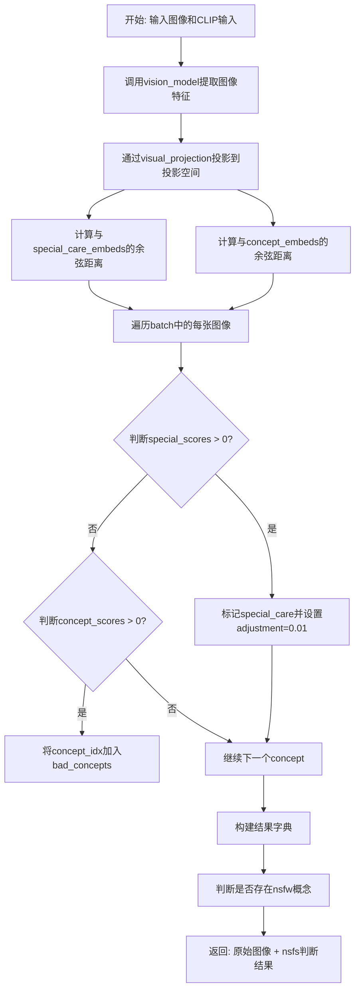
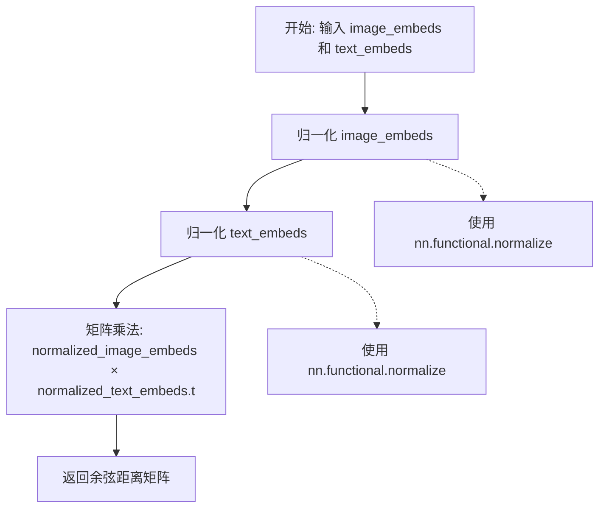
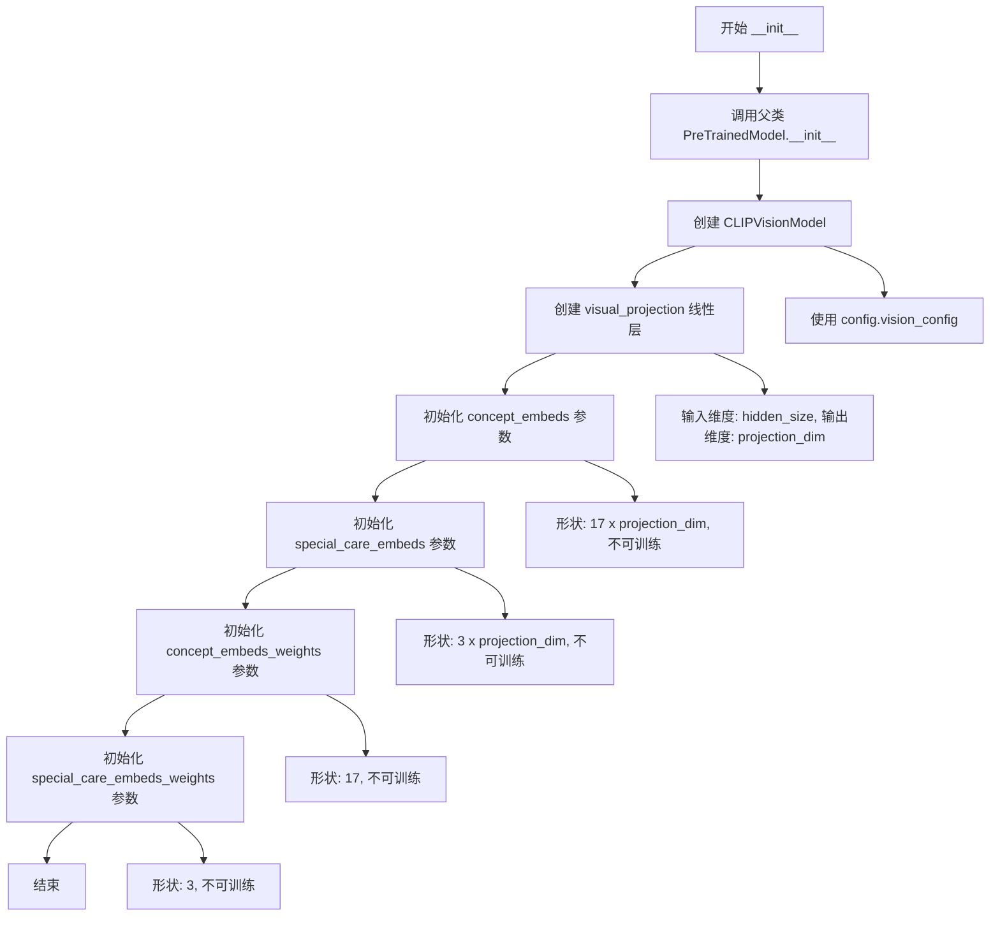
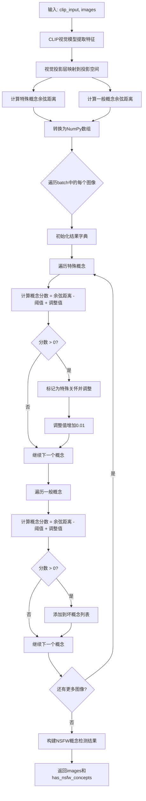
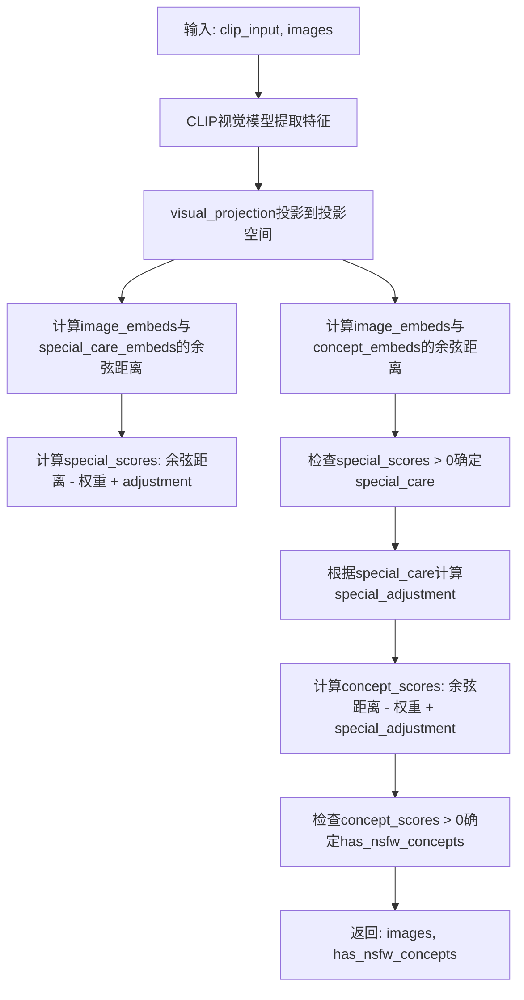

# `diffusers\src\diffusers\pipelines\stable_diffusion_safe\safety_checker.py` 详细设计文档

这是一个用于Stable Diffusion的安全检查模块，通过CLIP视觉模型提取图像嵌入，与预定义的敏感概念嵌入进行余弦相似度比较，从而检测输入图像是否包含不适宜内容（NSFW），并返回相应的过滤结果。

## 整体流程



## 类结构

```
PreTrainedModel (transformers基类)
└── SafeStableDiffusionSafetyChecker
    ├── vision_model: CLIPVisionModel
    ├── visual_projection: nn.Linear
    ├── concept_embeds: nn.Parameter (17维)
    ├── special_care_embeds: nn.Parameter (3维)
    ├── concept_embeds_weights: nn.Parameter (17维)
    └── special_care_embeds_weights: nn.Parameter (3维)
```

## 全局变量及字段


### `logger`
    
模块级日志记录器，通过logging.get_logger(__name__)获取

类型：`logging.Logger`
    


### `cosine_distance`
    
计算两个嵌入向量之间的余弦距离

类型：`function`
    


### `SafeStableDiffusionSafetyChecker.vision_model`
    
CLIP视觉编码器模型

类型：`CLIPVisionModel`
    


### `SafeStableDiffusionSafetyChecker.visual_projection`
    
视觉特征投影层

类型：`nn.Linear`
    


### `SafeStableDiffusionSafetyChecker.concept_embeds`
    
17个概念嵌入向量 (不可训练)

类型：`nn.Parameter`
    


### `SafeStableDiffusionSafetyChecker.special_care_embeds`
    
3个特殊关注概念嵌入 (不可训练)

类型：`nn.Parameter`
    


### `SafeStableDiffusionSafetyChecker.concept_embeds_weights`
    
17个概念的权重阈值 (不可训练)

类型：`nn.Parameter`
    


### `SafeStableDiffusionSafetyChecker.special_care_embeds_weights`
    
3个特殊概念的权重阈值 (不可训练)

类型：`nn.Parameter`
    
    

## 全局函数及方法


### `cosine_distance`

该函数用于计算两组嵌入向量（图像嵌入和文本嵌入）之间的余弦距离（余弦相似度），通过将嵌入向量归一化后进行矩阵乘法得到结果。

参数：

- `image_embeds`：`torch.Tensor`，图像嵌入向量，通常是经过视觉模型处理后的特征表示
- `text_embeds`：`torch.Tensor`，文本嵌入向量，通常是经过文本模型处理后的特征表示

返回值：`torch.Tensor`，返回两组嵌入之间的余弦距离矩阵，形状为 `[image_embeds.shape[0], text_embeds.shape[0]]`

#### 流程图



#### 带注释源码

```python
def cosine_distance(image_embeds, text_embeds):
    # 使用 L2 范数对图像嵌入进行归一化，使其单位长度为 1
    # 这样可以确保余弦相似度计算只考虑方向而非幅度
    normalized_image_embeds = nn.functional.normalize(image_embeds)
    
    # 同样对文本嵌入进行归一化处理
    normalized_text_embeds = nn.functional.normalize(text_embeds)
    
    # 计算归一化嵌入之间的矩阵乘法
    # 相当于计算每对 (图像, 文本) 之间的余弦相似度
    # .t() 表示转置 text_embeds，使得结果矩阵形状为 [batch_size_img, batch_size_text]
    return torch.mm(normalized_image_embeds, normalized_text_embeds.t())
```


### `SafeStableDiffusionSafetyChecker.__init__`

初始化安全检查器模型，继承自PreTrainedModel，配置CLIP视觉模型和概念嵌入权重，用于检测生成图像中的不安全内容。

参数：

- `self`：隐式参数，SafeStableDiffusionSafetyChecker实例本身
- `config`：`CLIPConfig`，包含视觉配置和投影维度的模型配置对象

返回值：`None`（`__init__` 方法无返回值）

#### 流程图



#### 带注释源码

```python
def __init__(self, config: CLIPConfig):
    """
    初始化 SafeStableDiffusionSafetyChecker 模型
    
    参数:
        config: CLIPConfig，包含视觉模型配置和投影维度信息
    """
    # 调用父类 PreTrainedModel 的初始化方法
    # 设置配置、初始化模型权重等基础工作
    super().__init__(config)
    
    # 1. 创建 CLIP 视觉模型
    # 使用配置中的视觉部分初始化视觉编码器
    # 用于提取图像特征
    self.vision_model = CLIPVisionModel(config.vision_config)
    
    # 2. 创建视觉投影层
    # 将视觉隐藏状态投影到共享的嵌入空间
    # 输入维度: vision_config.hidden_size (如 768 或 1024)
    # 输出维度: projection_dim (如 512)
    # bias=False: 投影矩阵为纯线性变换，无需偏置
    self.visual_projection = nn.Linear(
        config.vision_config.hidden_size, 
        config.projection_dim, 
        bias=False
    )
    
    # 3. 初始化概念嵌入参数 (17个概念)
    # 形状: [17, projection_dim]
    # 用于存储17种不安全内容的概念向量
    # requires_grad=False: 这些是预定义的概念，不参与训练
    self.concept_embeds = nn.Parameter(
        torch.ones(17, config.projection_dim), 
        requires_grad=False
    )
    
    # 4. 初始化特殊关注嵌入参数 (3个概念)
    # 形状: [3, projection_dim]
    # 用于存储需要特殊关注的概念向量
    # 如暴力、色情等高风险内容
    # requires_grad=False: 预定义概念，不参与训练
    self.special_care_embeds = nn.Parameter(
        torch.ones(3, config.projection_dim), 
        requires_grad=False
    )
    
    # 5. 初始化概念嵌入权重 (17个概念)
    # 形状: [17]
    # 用于存储每个概念的阈值权重
    # requires_grad=False: 预定义阈值，不参与训练
    self.concept_embeds_weights = nn.Parameter(
        torch.ones(17), 
        requires_grad=False
    )
    
    # 6. 初始化特殊关注嵌入权重 (3个概念)
    # 形状: [3]
    # 用于存储每个特殊概念的阈值权重
    # requires_grad=False: 预定义阈值，不参与训练
    self.special_care_embeds_weights = nn.Parameter(
        torch.ones(3), 
        requires_grad=False
    )
```


### `SafeStableDiffusionSafetyChecker.forward`

该方法是安全检查器的前向传播实现，通过CLIP视觉模型提取图像嵌入，计算与预定义概念嵌入（特殊关怀概念和一般概念）的余弦相似度，并根据阈值判断图像是否包含NSFW（不适合在工作场所显示）内容，返回原始图像和每个图像是否包含不安全概念的布尔标志。

参数：

- `self`：`SafeStableDiffusionSafetyChecker`，安全检查器实例本身
- `clip_input`：`torch.Tensor`，CLIP模型的输入图像张量，形状为(batch_size, channels, height, width)
- `images`：`torch.Tensor`，原始图像数据张量，将原样返回用于后续处理

返回值：`(torch.Tensor, List[bool])`，返回元组包含原样输入的images图像张量，以及has_nsfw_concepts布尔列表，列表中每个元素对应batch中对应图像是否检测到NSFW概念

#### 流程图



#### 带注释源码

```python
@torch.no_grad()
def forward(self, clip_input, images):
    """
    前向传播函数，执行图像安全检查
    
    参数:
        clip_input: CLIP模型的输入图像张量
        images: 原始图像数据
    
    返回:
        (images, has_nsfw_concepts): 元组，包含原样图像和NSFW检测结果
    """
    # 1. 使用CLIP视觉模型提取图像特征
    # [1]表示获取pooled_output，即经过池化后的图像表示
    pooled_output = self.vision_model(clip_input)[1]
    
    # 2. 将视觉特征投影到投影维度空间
    # 这是为了与概念嵌入进行余弦相似度计算
    image_embeds = self.visual_projection(pooled_output)
    
    # 3. 计算与特殊关怀概念的余弦距离
    # 特殊概念包括3个需要特别关注的概念
    # 转换为float32以兼容bfloat16且不会造成显著性能开销
    special_cos_dist = cosine_distance(image_embeds, self.special_care_embeds).cpu().float().numpy()
    
    # 4. 计算与一般概念的余弦距离
    # 一般概念包括17个常规NSFW概念
    cos_dist = cosine_distance(image_embeds, self.concept_embeds).cpu().float().numpy()
    
    # 5. 初始化结果列表
    result = []
    
    # 6. 获取批次大小用于遍历
    batch_size = image_embeds.shape[0]
    
    # 7. 对批次中每个图像进行安全检查
    for i in range(batch_size):
        # 初始化单张图像的结果字典
        result_img = {
            "special_scores": {},      # 特殊概念分数
            "special_care": [],         # 需要特殊关怀的概念列表
            "concept_scores": {},       # 一般概念分数
            "bad_concepts": []          # 不安全概念列表
        }
        
        # 调整值，用于在检测到特殊概念时增加一般概念的阈值
        # 增加此值可以创建更强的NSFW过滤器，但可能增加误报良性图像的可能性
        adjustment = 0.0
        
        # 8. 检查特殊概念（3个）
        for concept_idx in range(len(special_cos_dist[0])):
            # 获取当前概念的余弦距离
            concept_cos = special_cos_dist[i][concept_idx]
            # 获取对应阈值权重
            concept_threshold = self.special_care_embeds_weights[concept_idx].item()
            # 计算概念分数：余弦距离 - 阈值 + 调整值
            result_img["special_scores"][concept_idx] = round(concept_cos - concept_threshold + adjustment, 3)
            
            # 如果分数大于0，表示检测到特殊概念
            if result_img["special_scores"][concept_idx] > 0:
                # 添加到特殊关怀列表，使用集合存储概念索引和分数
                result_img["special_care"].append({concept_idx, result_img["special_scores"][concept_idx]})
                # 调整值增加0.01，影响后续概念评分
                adjustment = 0.01
        
        # 9. 检查一般概念（17个）
        for concept_idx in range(len(cos_dist[0])):
            # 获取当前概念的余弦距离
            concept_cos = cos_dist[i][concept_idx]
            # 获取对应阈值权重
            concept_threshold = self.concept_embeds_weights[concept_idx].item()
            # 计算概念分数：余弦距离 - 阈值 + 调整值
            result_img["concept_scores"][concept_idx] = round(concept_cos - concept_threshold + adjustment, 3)
            
            # 如果分数大于0，表示检测到不安全概念
            if result_img["concept_scores"][concept_idx] > 0:
                # 添加到坏概念列表
                result_img["bad_concepts"].append(concept_idx)
        
        # 将单张图像结果添加到结果列表
        result.append(result_img)
    
    # 10. 判断每张图像是否有NSFW概念
    # 如果bad_concepts列表非空，则认为检测到NSFW内容
    has_nsfw_concepts = [len(res["bad_concepts"]) > 0 for res in result]
    
    # 11. 返回原始图像和NSFW检测结果
    return images, has_nsfw_concepts
```


### `SafeStableDiffusionSafetyChecker.forward_onnx`

ONNX优化版本的前向传播方法，用于安全检查（NSFW检测）。该方法通过CLIP视觉模型提取图像嵌入，计算与特殊概念嵌入和常规概念嵌入的余弦距离，并判断是否存在不当内容。相比标准forward方法，ONNX版本使用纯张量操作避免了Python循环，提高了在ONNX环境下的执行效率。

参数：

- `self`：`SafeStableDiffusionSafetyChecker`，类的实例本身
- `clip_input`：`torch.Tensor`，CLIP视觉模型的输入张量，通常是预处理后的图像特征
- `images`：`torch.Tensor`，原始图像张量，用于在检测到NSFW内容时返回原始图像

返回值：

- `images`：`torch.Tensor`，未经修改的输入图像张量
- `has_nsfw_concepts`：`torch.Tensor`，布尔类型张量，表示每个图像是否包含不当内容概念

#### 流程图



#### 带注释源码

```python
@torch.no_grad()
def forward_onnx(self, clip_input: torch.Tensor, images: torch.Tensor):
    """
    ONNX优化版本的前向传播方法，用于NSFW安全检查
    
    参数:
        clip_input: CLIP视觉模型的输入张量
        images: 原始图像张量
    
    返回:
        images: 未经修改的输入图像
        has_nsfw_concepts: 布尔张量，指示每个图像是否包含NSFW概念
    """
    
    # 步骤1: 使用CLIP视觉模型提取图像特征
    # [1]表示获取pooled输出（CLS token对应的特征）
    pooled_output = self.vision_model(clip_input)[1]  # pooled_output
    
    # 步骤2: 将视觉特征投影到投影空间
    # 将高维视觉特征映射到与文本嵌入相同的投影空间
    image_embeds = self.visual_projection(pooled_output)
    
    # 步骤3: 计算与特殊概念嵌入的余弦距离
    # special_care_embeds: 需要特别关注的概念嵌入（3个）
    # 用于检测高风险内容
    special_cos_dist = cosine_distance(image_embeds, self.special_care_embeds)
    
    # 步骤4: 计算与常规概念嵌入的余弦距离
    # concept_embeds: 一般概念嵌入（17个）
    # 包含各类不当内容的概念向量
    cos_dist = cosine_distance(image_embeds, self.concept_embeds)
    
    # 调整值：增加此值可增强NSFW过滤强度
    # 代价是可能过滤掉正常图像
    adjustment = 0.0
    
    # 步骤5: 计算特殊概念得分
    # 得分 = 余弦距离 - 概念权重 + 调整值
    # 使用广播机制一次性计算整个批次的得分
    special_scores = special_cos_dist - self.special_care_embeds_weights + adjustment
    
    # 注: 原始代码中的round操作在ONNX中可能不被支持，已注释
    # special_scores = special_scores.round(decimals=3)
    
    # 步骤6: 判断是否存在需要特殊关注的内容
    # 任意一个特殊概念得分 > 0 则标记为需要特殊关注
    special_care = torch.any(special_scores > 0, dim=1)
    
    # 步骤7: 根据special_care计算额外的调整值
    # 如果检测到特殊关注内容，调整值增加0.01
    # 这会进一步影响概念得分的计算
    special_adjustment = special_care * 0.01
    
    # 扩展调整值以匹配cos_dist的形状
    # 从[batch_size]扩展为[batch_size, num_concepts]
    special_adjustment = special_adjustment.unsqueeze(1).expand(-1, cos_dist.shape[1])
    
    # 步骤8: 计算常规概念得分
    # 得分 = 余弦距离 - 概念权重 + special_adjustment
    concept_scores = (cos_dist - self.concept_embeds_weights) + special_adjustment
    
    # 注: 原始代码中的round操作在ONNX中可能不被支持，已注释
    # concept_scores = concept_scores.round(decimals=3)
    
    # 步骤9: 判断是否存在NSFW概念
    # 任意一个概念得分 > 0 则标记为包含NSFW内容
    has_nsfw_concepts = torch.any(concept_scores > 0, dim=1)
    
    # 步骤10: 返回原始图像和NSFW检测结果
    return images, has_nsfw_concepts
```

## 关键组件


### SafeStableDiffusionSafetyChecker

核心安全检查器类，负责检测生成的图像是否包含不当内容（NSFW），通过CLIP视觉模型提取图像特征并与预定义的概念嵌入进行相似度比较。

### cosine_distance

余弦相似度计算函数，用于计算图像嵌入与文本概念嵌入之间的余弦距离，返回相似度矩阵。

### vision_model (CLIPVisionModel)

CLIP视觉编码器模型，负责将输入图像转换为视觉特征表示，是安全检查的核心特征提取组件。

### visual_projection

线性投影层，将CLIP视觉模型的隐藏状态投影到指定的投影维度空间，用于后续的概念匹配。

### concept_embeds

17维概念嵌入参数矩阵，存储需要检测的敏感概念（如暴力、色情等）的嵌入向量。

### special_care_embeds

3维特别关注概念嵌入参数矩阵，存储需要特殊处理的高风险概念嵌入。

### concept_embeds_weights

17维概念阈值权重参数，用于判断每个概念是否被检测为不安全内容的判定阈值。

### special_care_embeds_weights

3维特别关注概念阈值权重参数，用于特别敏感概念的判定阈值。

### forward

主前向传播方法，执行完整的NSFW检测流程：提取图像特征→计算概念相似度→应用阈值判断→返回检测结果。

### forward_onnx

ONNX优化版本的前向传播方法，使用向量化操作替代循环，以提升推理性能和兼容性。


## 问题及建议


### 已知问题

- **硬编码维度数值**：17和3这两个数值在多个地方硬编码（concept_embeds和special_care_embeds的初始化），缺乏配置灵活性，难以适应不同安全检查需求
- **批次处理效率低下**：forward方法中使用Python for循环逐个处理batch中的图像，未使用向量化操作，性能瓶颈明显
- **CPU/GPU与类型转换不一致**：forward方法中执行`.cpu().float().numpy()`转换，而forward_onnx中未做此转换；两种方法的返回行为可能存在差异
- **重复的矩阵运算**：cosine_distance函数被调用两次计算余弦相似度，存在重复计算开销
- **不必要的张量脱离计算图**：forward中使用numpy()将张量转为numpy数组，导致断开梯度计算图，无法利用自动微分
- **返回值设计冗余**：forward和forward_onnx都返回原始images输入，在流水线中可能造成不必要的内存占用
- **参数初始化不可配置**：concept_embeds和special_care_embeds使用torch.ones初始化，应支持从配置文件或预训练权重加载
- **循环内重复调用item()**：在for循环中每次迭代都调用`.item()`获取标量值，产生大量CPU-GPU同步开销

### 优化建议

- 将17和3提取为配置参数或类属性，增强模型灵活性
- 使用向量化操作替代for循环处理batch，利用torch.any()和广播机制批量计算
- 统一forward和forward_onnx的实现逻辑，避免行为不一致；如需numpy输出，考虑在方法外部转换
- 合并两次cosine_distance调用为单次矩阵运算，通过分块索引同时计算两类embeds的相似度
- 移除不必要的numpy()转换，保持张量在GPU上运算；如确需numpy，在调用栈最外层转换
- 评估是否真的需要返回images，如仅为API兼容可考虑返回None或使用占位符
- 支持从配置文件或预训练权重加载概念嵌入，而非使用torch.ones默认值
- 将`.item()`调用移至循环外部，使用向量减法替代逐元素循环比较

## 其它


### 设计目标与约束

设计目标：该模块用于检测Stable Diffusion生成的图像是否包含不适当内容（NSFW），通过CLIP视觉模型提取图像特征，并与预定义的敏感概念嵌入进行余弦相似度计算，实现内容安全过滤。约束条件包括：1) 必须与HuggingFace Transformers库兼容；2) 模型参数为不可训练（requires_grad=False）；3) 需要支持ONNX导出以满足部署需求；4) 批处理支持但需逐个处理概念比对。

### 错误处理与异常设计

异常处理场景：1) 输入tensor维度不匹配时抛出ValueError；2) CLIP模型加载失败时捕获异常并记录日志；3) 概念嵌入维度与配置不匹配时触发AssertionError；4) GPU/CPU设备转换失败时回退到CPU处理。日志记录使用transformers.utils.logging模块，错误级别分为warning（配置不匹配）和error（模型加载失败）。

### 数据流与状态机

数据流向：clip_input（预处理后的图像tensor） → CLIPVisionModel提取视觉特征 → visual_projection线性层投影 → 余弦距离计算（分别与special_care_embeds和concept_embeds比对） → 阈值比较生成评分 → 判定has_nsfw_concepts布尔标志 → 返回原始images和has_nsfw_concepts列表。状态机包含两种前向传播模式：PyTorch模式（forward方法，含numpy转换）和ONNX模式（forward_onnx方法，纯tensor操作）。

### 外部依赖与接口契约

外部依赖：1) torch>=1.0（张量计算）；2) torch.nn（神经网络层）；3) transformers.CLIPConfig（配置类）；4) transformers.CLIPVisionModel（视觉编码器）；5) transformers.PreTrainedModel（基础模型类）。接口契约：forward方法接收clip_input（预处理图像tensor）和images（原始图像），返回(images, has_nsfw_concepts)元组；forward_onnx方法接收相同参数并返回相同格式，适用于ONNX导出场景。

### 性能考虑与优化空间

性能瓶颈：1) 循环遍历batch逐个处理图像导致O(n)复杂度；2) CPU-float-numpy转换引入设备拷贝开销；3) 多次.item()调用破坏计算图。优化建议：1) 向量化批处理逻辑，避免Python循环；2) 移除不必要的.cpu().float().numpy()转换，保持在GPU上运算；3) 使用torch.where替代逐元素阈值比较；4) 预计算阈值tensor避免重复.item()调用；5) 可考虑使用torch.compile加速。

### 配置与参数说明

关键配置参数：1) config.vision_config.hidden_size（CLIP视觉编码器隐藏层维度）；2) config.projection_dim（投影维度，默认768）；3) 17个概念嵌入（configurable通过训练或外部加载）；4) 3个特殊关注概念嵌入；5) 对应阈值权重（concept_embeds_weights和special_care_embeds_weights）。adjustment参数（默认0.0）用于调整检测灵敏度，增大该值会增强NSFW过滤但可能误判正常图像。

### 安全性考虑

安全相关设计：1) 概念嵌入和阈值设置为不可训练（requires_grad=False），防止运行时篡改；2) 特殊概念检测后增加0.01的adjustment作为二次确认机制；3) 返回结果中仅包含概念索引和评分，不返回敏感概念语义信息；4) 建议在部署时使用模型签名验证防止篡改。

### 使用示例与集成指南

集成示例：```python
from transformers import CLIPConfig, CLIPImageProcessor
from safe_diffusion_safety_checker import SafeStableDiffusionSafetyChecker

config = CLIPConfig.from_pretrained("openai/clip-vit-large-patch14")
checker = SafeStableDiffusionSafetyChecker(config)
processor = CLIPImageProcessor.from_pretrained("openai/clip-vit-large-patch14")
images = processor(images=image_list, return_tensors="pt")
output_images, has_nsfw = checker(images.pixel_values, images.pixel_values)
```
集成注意事项：1) 输入图像需经过CLIP预处理；2) 概念嵌入需根据部署场景配置；3) 建议在推理管线中介入该检查器。

### 已知限制与未来改进

已知限制：1) 固定17+3概念数量，扩展性差；2) 仅支持CLIP视觉模型，不支持文本交叉验证；3) 阈值调整依赖人工经验，缺乏自适应机制；4) 无置信度区间输出。改进方向：1) 动态概念嵌入加载机制；2) 支持多模态（图像+文本）联合判断；3) 引入机器学习自适应阈值；4) 增加结果置信度评分；5) 考虑使用更高效的特征匹配算法如FAISS。

    