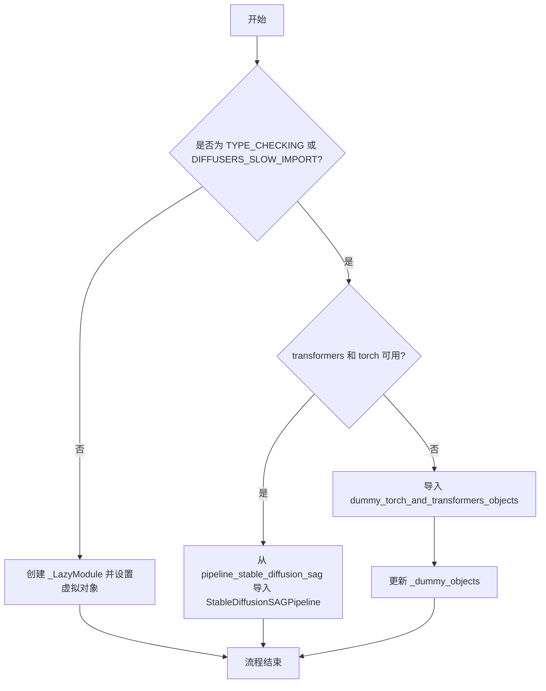
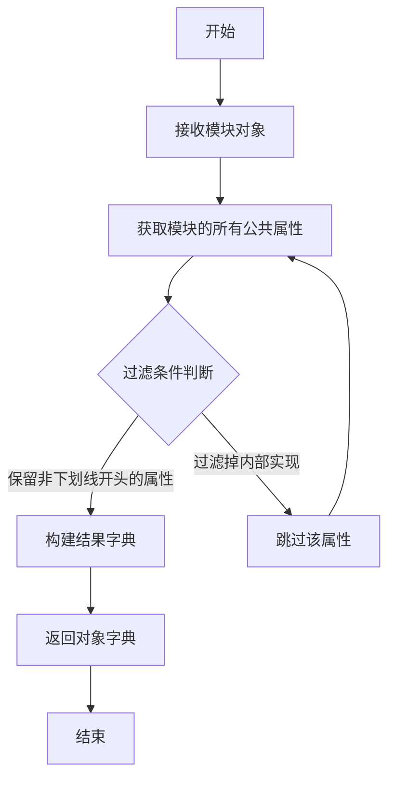
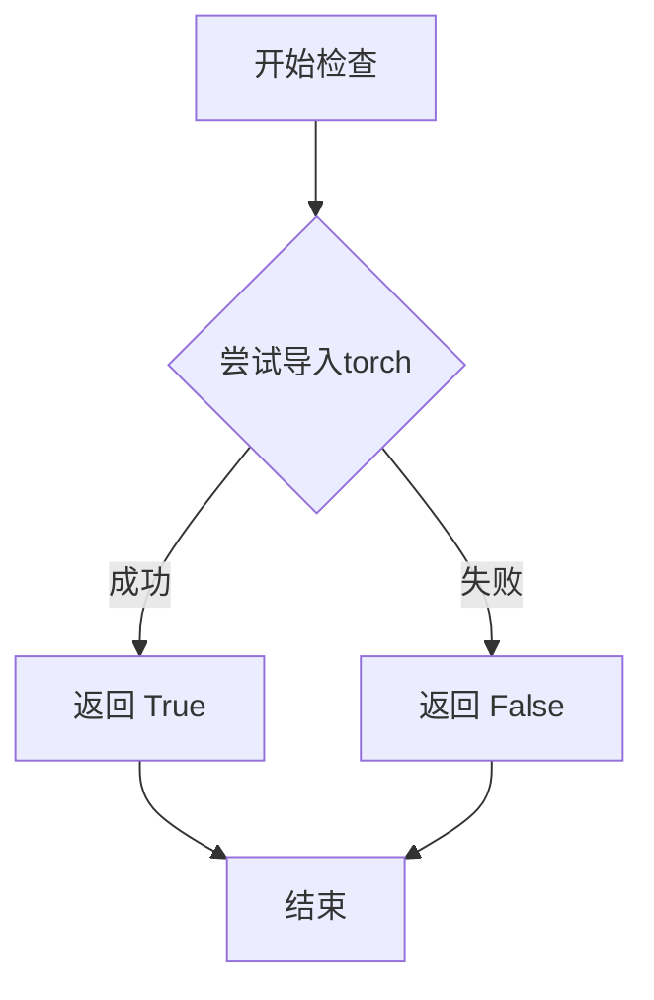
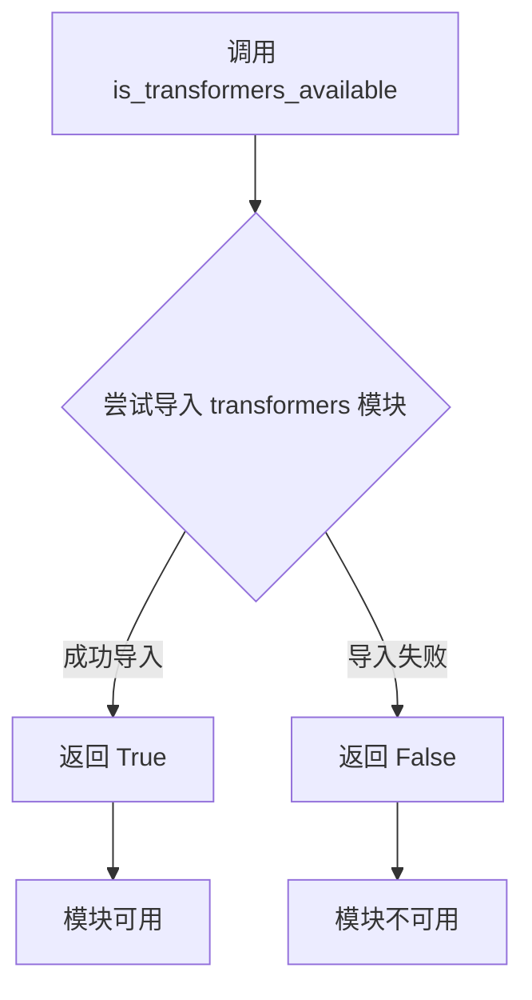
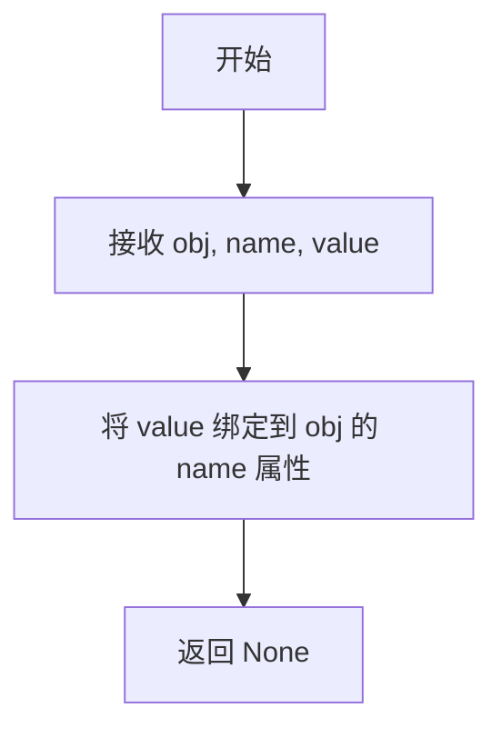

# `diffusers\src\diffusers\pipelines\stable_diffusion_sag\__init__.py` 详细设计文档

这是一个延迟加载模块，用于在diffusers库中有条件地导入StableDiffusionSAGPipeline，通过检查torch和transformers的可选依赖是否可用来决定导入实际模块还是虚拟占位对象，从而确保库在不同依赖环境下都能安全导入。

## 整体流程



## 类结构

```
模块初始化 (__init__.py)
├── _LazyModule (延迟加载机制，来自...utils)
├── get_objects_from_module (工具函数)
├── is_torch_available (依赖检查)
├── is_transformers_available (依赖检查)
└── StableDiffusionSAGPipeline (条件导入的类)
```

## 全局变量及字段


### `_dummy_objects`
    
存储虚拟/占位对象，用于在可选依赖不可用时提供向后兼容的导入

类型：`dict`
    


### `_import_structure`
    
定义模块导入结构字典，映射模块路径到可导出的对象名称列表

类型：`dict`
    


### `DIFFUSERS_SLOW_IMPORT`
    
控制是否延迟导入的标志位，为True时启用延迟加载模式以优化启动性能

类型：`bool`
    


    

## 全局函数及方法


### `get_objects_from_module`

从指定模块中提取所有公共对象（函数、类等），返回一个包含对象名称到对象本身映射的字典，常用于懒加载模块中获取虚拟对象集合。

参数：

- `module`：`module`，要从中提取对象的模块对象

返回值：`Dict[str, Any]`，返回模块中所有公共对象的字典，键为对象名称，值为对象本身

#### 流程图



#### 带注释源码

```python
def get_objects_from_module(module):
    """
    从给定模块中提取所有公共对象。
    
    此函数用于从模块中获取可导出的对象集合，通常与懒加载机制配合使用，
    以便在真正需要时才加载实际的实现。
    
    参数:
        module: 要从中提取对象的模块对象
        
    返回:
        包含模块中所有公共对象的字典，键为对象名称，值为对象本身
    """
    # 获取模块的所有公共属性（排除以单下划线开头的属性）
    objects = {
        name: getattr(module, name) 
        for name in dir(module) 
        if not name.startswith('_')
    }
    return objects


# 在实际代码中的使用示例：
_dummy_objects.update(get_objects_from_module(dummy_torch_and_transformers_objects))
```

#### 说明

该函数是 Hugging Face Diffusers 库中懒加载机制的关键组成部分。在给定的代码片段中，它被用于：

1. 从 `dummy_torch_and_transformers_objects` 模块获取虚拟对象集合
2. 当 torch 和 transformers 依赖不可用时，这些虚拟对象会被注入到当前模块中
3. 这样可以避免在导入时立即检查可选依赖，从而提高导入速度

这是一个典型的依赖注入和延迟加载设计模式的实现。


### `is_torch_available`

该函数用于检查当前环境中 PyTorch 库是否可用。通过尝试导入 torch 模块来判断，如果导入成功则返回 True，否则返回 False。在代码中作为条件判断，用于决定是否导入需要 torch 依赖的模块（如 StableDiffusionSAGPipeline）。

参数：
- 无参数

返回值：`bool`，返回 True 表示 torch 库可用，返回 False 表示 torch 库不可用

#### 流程图



#### 带注释源码

```python
# is_torch_available 函数的实现逻辑（基于代码中的使用方式推断）
def is_torch_available():
    """
    检查 torch 库是否可用
    
    实现原理：
    1. 尝试导入 torch 模块
    2. 如果导入成功，返回 True
    3. 如果导入失败（ImportError），返回 False
    
    Returns:
        bool: torch 库是否可用
    """
    try:
        import torch  # noqa: F401
        return True
    except ImportError:
        return False


# 在给定代码中的使用示例：
# 用于条件导入，需要同时满足 is_transformers_available() 和 is_torch_available() 才导入相关模块
try:
    if not (is_transformers_available() and is_torch_available()):
        raise OptionalDependencyNotAvailable()
except OptionalDependencyNotAvailable:
    # 导入虚拟对象（dummy objects）用于延迟导入
    from ...utils import dummy_torch_and_transformers_objects
    _dummy_objects.update(get_objects_from_module(dummy_torch_and_transformers_objects))
else:
    # 当 torch 和 transformers 都可用时，导入实际的管道类
    _import_structure["pipeline_stable_diffusion_sag"] = ["StableDiffusionSAGPipeline"]
```


### `is_transformers_available`

该函数是 Hugging Face Diffusers 库中的依赖检查工具函数，用于检查当前 Python 环境中是否安装了 `transformers` 库。在 `__init__.py` 中被导入并用于条件性地加载 Stable Diffusion SAG Pipeline 相关模块，当 `transformers` 和 `torch` 都可用时才导入实际的管道类，否则使用虚拟对象（dummy objects）。

参数：此函数无参数

返回值：`bool`，返回 `True` 表示 `transformers` 库已安装且可用，返回 `False` 表示不可用

#### 流程图



#### 带注释源码

```python
# 以下是函数在当前文件中的使用方式，展示了其功能
# 该函数定义在 ...utils 模块中，这里展示其典型用法

# 导入 is_transformers_available 函数
from ...utils import is_transformers_available

# 检查 transformers 是否可用
if is_transformers_available():
    # transformers 库已安装，可以导入相关模块
    print("transformers 库可用")
else:
    # transformers 库未安装，使用替代方案
    print("transformers 库不可用")

# 在当前代码中的实际使用场景：
# 用于条件性导入 StableDiffusionSAGPipeline
try:
    # 同时检查 transformers 和 torch 是否可用
    if not (is_transformers_available() and is_torch_available()):
        raise OptionalDependencyNotAvailable()
except OptionalDependencyNotAvailable:
    # 任一依赖不可用时，导入虚拟对象
    from ...utils import dummy_torch_and_transformers_objects
    _dummy_objects.update(get_objects_from_module(dummy_torch_and_transformers_objects))
else:
    # 所有依赖都可用时，导入实际的 Pipeline 类
    _import_structure["pipeline_stable_diffusion_sag"] = ["StableDiffusionSAGPipeline"]
```


### `setattr`

设置模块属性，将虚拟对象动态绑定到模块的属性上，使其在导入时可用。

参数：

- `obj`：`object`，目标对象，这里是 `sys.modules[__name__]` 指向的模块实例。
- `name`：`str`，要设置的属性名，来自 `_dummy_objects` 字典的键。
- `value`：`any`，属性值，来自 `_dummy_objects` 字典的值，通常为虚拟对象。

返回值：`None`，该操作不返回任何值。

#### 流程图



#### 带注释源码

```python
# 遍历虚拟对象字典 _dummy_objects
for name, value in _dummy_objects.items():
    # 使用 setattr 将每个虚拟对象（value）设置为当前模块（sys.modules[__name__]）的属性
    # 属性名为 name，属性值为 value
    setattr(sys.modules[__name__], name, value)
```

## 关键组件


### 惰性加载机制 (_LazyModule)

通过 `_LazyModule` 类实现模块的延迟加载，只有在实际访问模块属性时才加载真实模块，从而优化导入性能并避免不必要的依赖加载。

### 可选依赖检查与处理

通过 `is_torch_available()` 和 `is_transformers_available()` 检查 torch 和 transformers 是否可用，当依赖不可用时使用 dummy 对象替代，避免导入错误。

### 导入结构定义 (_import_structure)

定义了模块的导入结构字典，存储可导出的类名（如 `StableDiffusionSAGPipeline`）与对应的字符串键值对，用于惰性加载时的模块解析。

### TYPE_CHECKING 模式处理

在类型检查阶段（`TYPE_CHECKING` 或 `DIFFUSERS_SLOW_IMPORT` 为真时）直接导入真实类型，否则通过惰性方式导入，实现开发体验与运行性能的平衡。

### Dummy 对象回退机制

当可选依赖不可用时，从 `dummy_torch_and_transformers_objects` 模块获取 dummy 对象并注册到当前模块，确保代码在缺少依赖时仍可正常导入（虽功能受限）。

### 模块动态重绑定

通过 `setattr(sys.modules[__name__], name, value)` 将 dummy 对象动态绑定到模块命名空间，实现运行时对象替换。


## 问题及建议


### 已知问题

-   **重复的条件判断逻辑**：在`if TYPE_CHECKING or DIFFUSERS_SLOW_IMPORT:`块和`else:`块中，存在完全相同的可选依赖检查代码（`if not (is_transformers_available() and is_torch_available()): raise OptionalDependencyNotAvailable()`），违反了DRY原则
-   **模块导入结构不完整**：`_import_structure`字典只定义了一个键值对（`pipeline_stable_diffusion_sag`），但缺少对应的`__all__`列表声明，可能导致`from ... import *`行为不符合预期
-   **潜在的导入顺序问题**：在`else`块中，先设置`sys.modules[__name__]`为`_LazyModule`，然后又使用`setattr`直接添加`_dummy_objects`中的对象，这可能与延迟加载的预期行为产生冲突
-   **缺少类型注解**：在TYPE_CHECKING分支中，从`pipeline_stable_diffusion_sag`模块导入`StableDiffusionSAGPipeline`时，没有提供类型注解或详细的模块文档
-   **硬编码的模块路径**：在`_import_structure`中使用了硬编码的字符串路径`.pipeline_stable_diffusion_sag`，缺乏灵活性

### 优化建议

-   将可选依赖检查逻辑提取为独立的辅助函数，避免在多处重复相同的条件判断代码
-   在`_import_structure`中添加`__all__`列表，明确定义公开的API接口，例如：`__all__ = ["StableDiffusionSAGPipeline"]`
-   简化延迟加载逻辑，考虑移除`else`块中直接操作`sys.modules`的代码，改为完全依赖`_LazyModule`的实现
-   使用常量或配置方式管理模块路径字符串，提高代码的可维护性
-   考虑添加日志或更详细的错误信息，以便在依赖缺失时提供更好的调试体验


## 其它


### 设计目标与约束

本模块的设计目标是实现Diffusers库中StableDiffusionSAGPipeline的延迟加载机制，优化首次导入性能，并优雅处理可选依赖（torch和transformers）不可用的情况。核心约束包括：必须同时满足torch和transformers都可用才能正常导入pipeline；需要保持与现有Diffusers架构的兼容性；必须遵循库的延迟加载模式规范。

### 错误处理与异常设计

当torch或transformers任一依赖不可用时，抛出OptionalDependencyNotAvailable异常。该异常由上层调用者捕获，并从dummy_torch_and_transformers_objects模块导入虚拟对象来替代真实的pipeline类，确保模块结构完整但功能受限。所有依赖检查逻辑包含在try-except块中，实现静默降级而非中断执行。

### 数据流与状态机

模块初始化时首先检查DIFFUSERS_SLOW_IMPORT或TYPE_CHECKING标志。若为真，则执行类型检查分支，直接导入真实类或dummy对象；若为假，则将当前模块注册为_LazyModule，延迟真实类的加载。_dummy_objects字典存储虚拟对象引用，_import_structure字典定义可导出的类结构，两者共同构成模块的导出契约。

### 外部依赖与接口契约

本模块依赖三个核心外部包：torch（必须）、transformers（必须）、diffusers.utils（提供_LazyModule、get_objects_from_module等工具）。导出的公开接口仅包含StableDiffusionSAGPipeline类，遵循_import_structure字典中定义的导出结构。模块Spec（__spec__）用于_LazyModule的实例化，确保importlib的正确行为。

### 性能考虑

采用延迟加载策略避免在模块导入时立即加载重型依赖（torch、transformers），显著减少首次import的开销。_LazyModule只在实际访问属性时才触发真实模块的加载。dummy对象的设置通过setattr在模块级别完成，访问时无需额外的查找成本。

### 安全性考虑

模块未直接处理用户输入或敏感数据，安全性风险较低。动态导入路径通过预定义的_import_structure白名单控制，防止任意模块注入。依赖检查使用库内置的is_*_available()函数，确保版本兼容性验证的一致性。

### 测试策略

测试应覆盖三个场景：依赖全部可用时的完整导入、依赖部分可用时的降级行为、TYPE_CHECKING模式下的类型检查。建议使用mock框架模拟OptionalDependencyNotAvailable异常，验证dummy对象的正确设置，以及检查LazyModule的延迟加载触发机制。

### 版本兼容性

代码依赖diffusers.utils中的_LazyModule、get_objects_from_module等工具函数的特定实现版本。需确保dummy_torch_and_transformers_objects模块与当前diffusers版本同步更新。建议在版本升级时验证import_structure的完整性。

### 配置管理

模块无显式配置项，行为受DIFFUSERS_SLOW_IMPORT环境变量控制。当该标志为True时，强制执行TYPE_CHECKING分支，提前加载所有类型信息。生产环境通常保持默认（False）以启用延迟加载优化。

### 日志与监控

本模块不包含日志记录逻辑。如需监控，可考虑在依赖检查失败时记录warning级别日志，便于排查哪些可选依赖缺失。LazyModule的加载延迟行为可通过Python的import hooks机制进行跟踪。


    